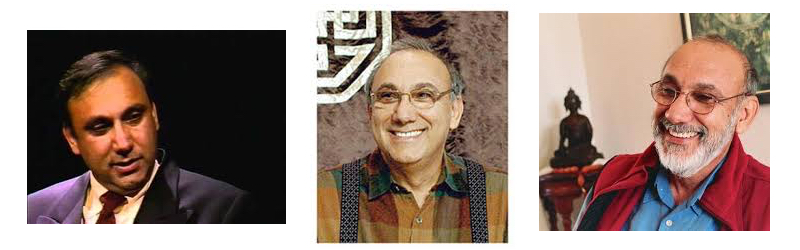
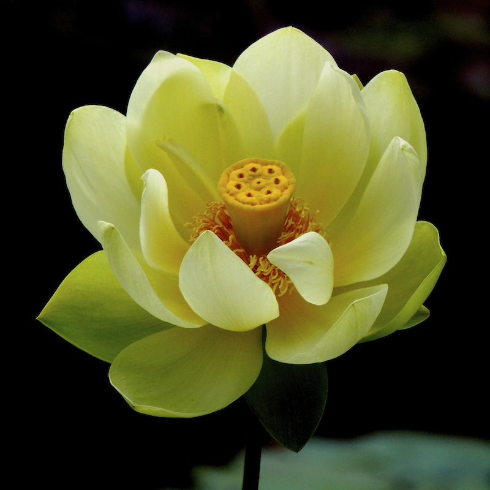

----

 

## 序言与缘起

原文：AH Almaas 《Luminous Night’s Journey – An Autobiographical Fragments》1995  Shambhala

《璀璨的暗夜之旅：一些开悟自传片段》（《Luminous Night’s Journey – An Autobiographical Fragments》）描述了阿马斯的一些对钻石途径的发现发展来说是很重要的开悟经历，但阿马斯在书的前言中强调说，书中描述的只是某个重要阶段的开悟经历，只是整个开悟过程的一个亚组成部分。事实上他的开悟经历从那以后的20-30年从来都没有停止过，本体的显露也从来都是自发的和不可预料的，他称之为“Runaway Realization”— “自发失控的证悟”， 这种开悟证悟是没有止境的，本体总是有无穷的／更深的秘密在开发显现。

胡因梦的工作坊（胡是审稿者，新书发布会视频说她来回审议了8次）已把这本书翻译成了中文，但好像在大陆和美国都看不到， 受我心即宇宙网友的求知热情感染，下面我就简单选择性地翻译分享一下。因为时间精力有限，又不好翻译，只能断断续续，尽力而为了。但花费这个力气不只对别人，首先对我自己是好处大大的，翻译写出来和仅仅是阅读在理解深度上的确大不相同。

 

## 第一章：亲密 （Intimacy)
发表于 2014 年 12 月 27 日

（注：这一章内容太丰富重要基本，不好取舍，基本全翻译了，保留书中作者的第一人称。里面涉及到自我／我，孤独，来自本体的爱／亲密。可以帮助理解Krishnamurti的绝对的爱，耶稣的博爱，佛家的慈悲和孔子的仁，以及‘天人合一，物我不二’的开悟境界。一叹：从前古人或今人描述的开悟经历那有像阿玛斯描述的这样生动细致！）

The trees are silent,                   (树沉默，)

The mountain is still, and              (山静止，)

The man is gone.                        (人无踪。)

在一整天的教学后的下午，我感到有点累，静静地躺在床上。从教授学生那里而来的各种精神活动（情感，思想，图像，身体的紧张）一层层脱掉，意识变得空旷，透明，清晰明亮。在这空旷中，与自我的身份认同有关的记忆感觉思想出现了，像天空中的一片云彩，提供了我熟悉的个人自我的身份感觉，一种完全基于我过去的经历记忆的自我感觉身份认同，静思这个自我的集合整体，我认清它完全是个精神现象，是个外在于我的东西，不是真正的我。

这时注意力自发地转移了，自我的精神集合像云彩般退去消失，剩下的只是一种简单，清晰，开阔，安详，静谧的存在感。没有自我反思，没有思想感觉，像万里无云的晴空下积雪的山顶（注：这个境界像是禅诗里面的“万里无云万里天”）。这时太阳将要落山，盆花／树／绿草／远处的云彩／深蓝的天空，一切都是澄澈光亮透明的美丽。在这种澄明的空旷中，一个喜悦和无忧无虑的问题出现了，“我是什么？这就是我吗？”， 没有记忆，没有内在的思想评论，仅仅是存在感和简单的目击观察一切，却不存在一个目击观察者，或仅是一个目击一切但没有内在的／简单纯然的观察意识。唯一与现实生活相关的是目击的位置，这和身体所在的位置有关，这时身体的感觉是放松的，像这个目击环境中的一团光芒而不是普通的身体感觉。时间似乎静止了，这种简单纯然的存在感完全展现时，没有时间感（timelessness)。 这种时间静止（timelessness)不是思想感觉，是本体的存在经历，是纯然的，先于思想或自我反思。

几天后的一个早晨醒来时感觉到一种内心的伤痛，静思发现是一种孤独的悲伤，但却想不到任何理由。妻子玛丽正睡在旁边，我可以感觉到我对她的爱，但这却对这莫名的孤独悲伤没有作用，这个孤独在不孤单有他人的情况下依然存在。起床后这种孤单感笼罩跟随着我，反思着什么会造成这种感觉，我直觉地感到与我前几天的简单纯然的存在经历有关。这时好奇心加强，代表分别智慧运作的钻石向导在前额呈现出钻石般的色彩和光芒，洞见产生了：过去几天的简单纯然的存在经历，没有记忆思想和感情，不仅自我感消失了，我以前没有意识到的是与自我相关的其他一切记忆也随着消失了。自我感不是单独存在的，它总是在内化的与他人他物的相互关系的记忆里游泳。这个平常情况下总是存在的自我 —他人的相互关系网络在简单纯然的存在经历中消失了，我的下意识里把它当成是一种完全的孤独。这时孤独感变成一种纯然的状态，还带着一丝悲伤。钻石向导的翡翠光芒超过其他颜色，显示悲伤是由于这种孤独感和童年经历的没人关照时的孤独悲伤记忆连在了一起。这个洞见释放了孤独的悲伤情绪，剩下了一种透明的感觉，一直深入到不可见的黑暗深渊，这种感觉集中在胸部，好像胸部完全变空了，仅有一丝奇怪的感觉上非常深的微妙的轻快存在其中。静思胸部的感觉，觉得非常空，安详，静止。这是一种完美无瑕的空，清莹闪亮而有深度。这种深度感觉上像太空的黑暗，像是看进无星的深层空间。这种深度，虽然是空的，却有一种柔软的质地和精致微妙的柔和，有一种舒适／安慰／安全和无忧无虑的的信赖，好像整个无边的星际空间都神秘地演变成了一个温柔和爱的介质。这不是一个冰冷无人性的空间，而是感觉上像是人类灵魂永恒寻找渴望的空间：像母亲乳房的温暖，像天鹅绒的精致柔软，像闪耀着极乐的静谧，像无尽的恩宠。

我的胸部开放成一个无穷深的夜空，感觉上清楚透明和空无一物，与透明的空不可分的是爱本身的存在，现在我可以通过整个胸部品尝爱的甜美快乐。我感觉自己与这充满爱的全然的静谧之空不可分，头脑安静平和。和玛丽吃早饭的时候，这种甜蜜的安祥静谧笼罩着我们，形成一种精致的接触， 一种微妙的亲密。我喜欢这种温柔的亲密，感觉到光亮和深度，开阔和柔软，清澈和甜蜜。亲密的感觉对我来说并不陌生，但这时我认识到，我不只感觉到对玛丽亲密，对食物，桌布，椅子，甚至墙都感到亲密。我对一切能意识到的东西都感到亲密，处于一种柔和安详放松的开阔中。一切东西都似乎具有这种柔和的特性和可接触性，更准确地说，一切都似乎沐浴在亲密的空中，好像一切都彻底开放，完全慷慨地分享自己。

亲密显示它是这个内部夜空的一个内在的特质。亲密不只是我和另一个人或环境亲密的问题，也不是一个主体和一个客体亲密相关的问题，而是整个胸腔里充满亲密的本质，即是这个与精致的爱不可分的夜空。这时前脑的钻石向导放射着黑色的光芒，和夜空一样广阔，感觉上像是一种精致多面的，绸缎般的液体能量。

越是认识到亲密是辽阔意识的一个特质，我对这个特质就知道的越多：天鹅绒般的开放，深度空间，精致的柔软，和甜蜜的静谧。胸部成了那个充满心脏的美妙夜空的一个入口。所有的这一切都蒸馏成了一个独特和完全人性的东西：亲密。好像空间是一个精炼的意识，在空间的每个点都和它的内在本质亲密接触。这个完全的开放和接触成就了和一切事物的亲密，完全独立于头脑思想和记忆。

没有孤单，没有孤独感。通过孤独之门，本体的简单纯然把我领进了它的内在亲密。

 

## 第二章： 个性自我的陷阱 （The Personal Trap)
发表于 2014 年 12 月 27 日

（注：这一章比较复杂枯燥难解，通篇逐句翻译太费时间，就只按我的理解概述总结一下核心内容：改用第三人称）

 

It is not that the fist needs to be opened up.        （不是需要松开拳头，）

It is not a matter of surrender,                      （也不是放下的问题，）

There is no fist to start with.                       （而是本来就没拳头。）

一段时间以来，阿玛斯说他一直在经历一些很奇特意外的感觉感知，开始时微妙短暂模糊，转瞬即逝，后来变得清晰稳定。直觉告诉他：对一个个体生命来说，有一个我们通常所知的个人意识，但同时存在一个背景性的永恒意识。这个背景永恒意识总是知道生命过程中所发生的一切但却全然不参入其中，而个人意识常常和正在发生的事情纠缠太深以致于迷失在其中。这个超越个人意识的背景永恒意识在他的直觉中越来越明晰，他认识到这是直觉和亲密的根源。当这个背景永恒意识升起和个人意识相遇的时候，这个相遇在头脑里表现为直觉的闪光。这种相遇变得越来越清晰，成了一种直接的觉知。这种经历虽然仍是短暂的闪光形式，但却已足够强烈，揭露了普通个人意识中那些阻碍背景永恒意识显露的东西，这使他意识到自己是多么彻底地迷失在个人生活中，强烈地感觉到自己被个人生活的方方面面所囚禁，不管他喜欢与否。这种对生活的投入和被吸收比他想象的更普遍彻底，即使是那些他自觉是自由的／扩展的／有收获的生活方面。甚至对本体／绝对真实真理的深层证悟经历和理解都会成为新的牢笼，他成为那种经历的一部分，无法与其分开并受其限制。他认识到因为缺少一个参照系，对生活的参入不自觉地成了一种落网，他不仅落入网中，而且生命的一些重要方面也实际上迷失在对生活的参与中。一种渴望自由于所有个人生活的感觉油然而生，他直觉地感到自己想要超越个人生活，让内在的真理更多地呈现出来。

尽管他想要超越个人的生活经历，但并不拒绝反感它们，于是静思个体生活经历是什么。他能感觉到他此生生活的整体：过去／现在／未来，觉得与他的本质（who I am)是不同的， 分开的。前额的钻石向导使理解清澈：他意识到通常用此生的生活经历来定义“我”的倾向。这个生活经历的内容，不仅限制了所能经历的事物，更重要地是限制了对“我”的认知和经历。这个限制在思想方面特别明显：尽管他有很多新的思想主意，但它们总离不开一个不变的总体思维范畴，思维流动在事先决定的沟槽里，变化仅仅是加宽或缩窄这个沟槽而已。他觉得这样是不对的，任何经历都不能定义他，即使是生活中的基本职能，例如作为一个父亲和教师，也仅是他所适应的角色，它们绝无可能定义他，他是超越这些东西的。一种来自未知之地的深层渴望升起：他要超脱个人的生活经历内容，不是超脱某种情绪或状态，而是个人生活的全体整体。他并不判断个人生活的好坏／成败／幸福失落／喜欢与否，只渴望超越它们，因为他确切地知道真正的“他”事实上是超越这一切的，他渴望真理呈现。尽管这时他并不清楚超越个人生活经历内容的“他”是什么，过往的经历已使他觉得开始瞥见它：有一种空灵意识感觉，超越过往所有个人生活的全体，现在生活中的角色仅仅是为了干某些事罢了。

几天后的一个下午，他感到胃部沉重不适。他在感知感觉上有天分能力，能把模糊无形的思想感觉／潜意识精细具体化成意识上一种有形的“物化”特性（敏感的诗人文学家在这方面好像都比较有天分），比如现在他感觉胃部的沉重不适像一个铅球，，进一步觉得它是个铅珍珠球，像钻石一样坚硬，多维度，晶体化了，是个钻石铅珍珠球。静思后钻石向导所提供的洞见一步步地揭开了这个钻石铅珍珠球的真实含义：他虽然已有了很大转变和很多深度开悟经历知识，但他个性中的某些方面不受这些转变经历的影响，一直没有变化。钻石向导揭示不变化的原因是因为个性自我作为一个整体没有变化，尽管个性自我的某些部分已经转变了，有了惊人的经历扩展，包括本体的一些新面向维度，但在个性自我上，他还是原来的那个他。为什么个性自我保持不变，它的支撑基础是什么呢？

钻石向导对钻石铅珍珠球的洞见是：1）铅代表惯性（inertia)，铅一样的沉重代表习惯习气的惯性力量，在意识上表现为一种存在的意志。2）珍珠表示经历的个体化，个性自我和“真我”都呈现珍珠的形态，总是代表一种个体化显现。不管是在个性自我（ego self）层面还是在本体的真我（true self)层面，开悟意识中的珍珠形态都代表个体的整体全体，一个个体的整体存在。珍珠代表一个球形的放射着珍珠般银辉的个体紧密意识。3）多维的宝石晶体化表示客观的无任何扭曲的理解／认识（of what it is)。4）存在是本体的一个根本特性，显现时呈现不同的具体形式，无限的真实，非凡的密度硬度等。存在可以部分地呈现为一种意志，一种存在的意志力量。5）个性自我（ego self ) 没有真实根本的存在，只有条件性的存在。这个条件性的存在， 显现为个性习气的不变，依赖于这些习惯习气的硬化／固定／不灵活性。这个惯性力量支持我们通常看到的个性存在。概括地说：钻石铅珍珠球代表一个客观的理解，即代表个性自我（ego self)作为一个个性整体／一个分开的ego人想要存在的意志。结论是：个性自我的支撑基础是它（ego)的存在意志/惯性力量。只要ego自我的存在意志/惯性力量还是主导，个人生活中的一切都会不自觉地落入ego自我的网中，即使是深度的开悟经历知识也会成为ego自我的拥有物。

对个人经历以及其背后的个性惯力的洞见理解使得铅一般的沉重逐渐扩展开来，几乎占据了整个意识空间。现在他面临着意识中占显著地位的这个不变不动的沉重铅球，但洞见的流动显现同时也带来了一种扩展的感觉。 对铅一般的沉重意识 ，即个性自我经历的基础，没有抵抗，没有价值好坏判断，只有对显现事物的开放和好奇，及不做结论（open-ended) 的探寻。这种开放和好奇创造了钻石向导升起和操作所需的空间。

一种幸福的爱在身体的左侧显现，一种金黄色的神圣纯洁的爱。这个甜蜜轻快的爱在转化着意识的性质，减轻它的沉滞。铅一样的沉重依然存在，但它的旁边却并存着轻快，开放和快乐。

（注解：在此书中不断出现的既神秘又关键的“钻石向导”（the diamond guidance) 究竟是个什么东西呢？阿玛斯在书中又常叫它“The Nous”, 字典上的含义是理性／心灵／精神／常识，在这里它和西方哲学上的“理性”概念是最近似的。以我所理解的佛学，阿玛斯所描述的实际上就是佛教的“妙观察智” — 即《心经》里的梵语 音译 — 般若波罗蜜多。为什么这么说呢？因为这个Nous能够整合所有过去现在的知识，所有可知的维度范畴的经历，照徹他当时所探究问题的各个方面的因素及其关系，而给出一个对所探寻问题的灵感或洞见，这不是一个普通思考过程，尽管逻辑思考是其中的一个方面。这是永恒根本意识的分别智慧机能利用所有的内在认知能力，对一个问题情况所给出的即时一体的洞见，也就是某些科学／哲学／文学艺术天才所经历的超越他们自身思想／能力／知识的灵感。这和佛教的“妙观察智”的含义是一致的。

因此灵感洞见来自于“The Nous”, 不是ego自我状态下的普通的逻辑分析的结果，Nous的运作超越时空。ego自我状态下的普通的逻辑分析，其根源也是“The Nous”,只是被局限于个体的知识／能力／经历之内，其结果总是有矛盾，不完美，只能是在已知范畴内的修改，不会是完全的创新。因此来自“The Nous”的灵感洞见通常是在忘我的状态下才会显现。阿玛斯说只有当他对灵感洞见的升起本身感兴趣时，他才能感知到Nous 机能的某个方面，通常情况下他只感到灵感洞见的闪光，在他头脑的具体感觉体现是前脑部位闪耀着钻石般的色彩和光芒。）

 

## 第三章 非个体（The Impersonal)
发表于 2015 年 01 月 10 日

(注：这一章也不好取舍什么，内容丰富独特，从未读过把“我”说的这么根本透彻的书。基本逐句逐字翻译了，保留第一人称）

To slough off the universe        (抛弃宇宙，)

To be utterly naked                    (完全裸露，)

God is alone.                                (唯神独存。)

（类似禅宗说的：“皮肤脱落尽，唯露一真实。”）

几天以后的一个早晨，醒来时觉得左肩有点紧张不舒服。仅仅是意识到这个紧张就好像使其扩展开来，形成沿着左胸部的一条紧张线，包含着一种软垫式的感觉。（作者在书中的加注：这条线是是ego自我的显现，我叫它“自我线” （“ ego-line”）。它通常伴随着ego自我存在时所对应的心灵收缩，换句话说，“自我线”是自我结构在身体上的表现，自我结构是产生个性或感觉自己是个独立自主的与其它分开的个体的原因。自我的个体感觉其实是一种意识的收缩，这条紧张线就是这个意识收缩的直接迹象。这个分开的个性自我主要是通过各种身体上和精神上的分离界限而形成的。）

随后发现紧张线周围的软垫式的感觉是自我意识假象的一个显示，这是合乎道理的，因为代表个性自我的“自我线”并不是一个有根本特性的东西，只是模仿“真我”的根本性征而成。当我认识到它的虚假之处后，它开始慢慢地脱落，就像从木乃伊上脱落的皮屑，这个过程几乎持续了一天。后来这条紧张线变成一个空的塑料管式的东西，一直延顺到头顶。我说话做事的时候也没有失去和它的联系，在意识中一直关注着它。在某个时刻，这种冥思静虑引出了一个很微妙的洞见：我对这个意识收缩的关注与这个收缩不可分，这个关注里包含着一个去掉或超越这个收缩的希望，这个希望与这个收缩不可分是因为它是个性自我对未来的期待，而这正是这个收缩本身。当我认清这一点时，这个收缩开始消融。塑料管式的收缩首先从头部消失，这消除了精神上的顾虑，头脑意识上呈现一片美丽的蓝天景象，心神放松，一片宁静。头部充满了一种美妙的感觉，似乎把整个头部都平滑地融化了。随后整个塑料管式的收缩都消失了，我失去了作为一个个体的感觉，成了一个无限后退扩展着的意识，从熟悉的个人感觉，直到认识到自己已成为一个新的非物质的目击观察者，不再位于一个个体的意识中。我发现自己是一切现象的目击观察者。

这时一个新的障碍产生了，一种抵抗这种新的意识显现的信仰，这个信仰干扰了这个全观目击意识现象，但没有完全消除它。这个信仰是如果不投入陷落在生活中，就不会有个人的生命和生活，这个信仰是个性自我的惯性的部分显露。针对这个担心关注，本体显现了“真我”特性，“真我”就是无价珍珠，个人本体。 这个经历是感觉体认到“我”是一个完整圆满的存在，像一个珍珠一样圆，但却是透明和甜蜜的。我感觉到自己是一个个体，尽管我只是一种透明意识的纯然存在。这个透明的圆满有一种微妙的甜蜜，有点像蜜一样的粘滞。纯然的存在，完全的清澈空明，在认识上觉得我是个无特质的人，只是一个个体性的存在，没有图像和心理界限。既然我可以不是记忆的产物，我因此可以过一种个人的生活而无需迷失于其中。

那天晚饭时，铅一样的沉重再次出现，分散注意力和存在感达一个小时之久。这个铅一样的沉重是如此致密以至于瓦解了我的专注和存在的能力。强烈的抵抗生起，感觉像橡皮一样的厚密，木头一样的干枯，意识里充满了孔洞，及很多其它混乱不清的感觉。我感觉球形的铅性沉重从内向外挤，瓦解掉任何它所碰到的意识。这时我认识到这个铅性沉重意识已经转变成一种极具实质和力量的东西，铅珍珠已经变成了一个闪烁着灰色实质的珍珠，像一个大的铁矿石珍珠。

我感觉自己是个巨大的个体，如此的致密以至于这种充实厚实感使得物质身体的感觉黯然失色。最确切的感觉是一种个体存在感，这种个体存在感真切地的如此强烈，如此的根本，思想根本无法想象这个真实。我感觉自己是一个由纯然的存在组成的个人， 我的每一个原子都由本体的独立于思想的根本／基本存在所形成。我是存在，超越所有思想所能想象的存在。这种真切感无比深邃，感觉比整个宇宙本身都更深入。这个无法想象的真实存在感有一种很微妙的个人感 —— 一个不是由历史和思想定义的个人，不局限于性格特征或关系，而只是一个真切存在的人，如此而已。这种存在感有一种不容置疑的确定，独立于任何思想内容和经历。这时我认识到认为不陷入生活就没有个人生活是没有基础的。 （注：没读过佛陀快涅槃时讲的几十卷的《大涅槃经》，那里面讲的“真我”应该和这段的内容道理相同或类似吧。大部分佛经只讲如何破除假我，以往的佛教大师似乎也很少有人讲或不愿说清楚这个话题／或让个人自己去参，因此这段有关“真我”感觉的证悟经历是极其难得的）

这个作为一个个体的如此真实和确定的经历持续了整个晚饭过程，我一边和同餐者说着话，一边关注着这个内在的转变。这个存在的非凡的实质感影响了晚餐的气氛，但很微妙，我的同餐者没有意识到。谈话仅仅是转向生活中的基本东西，较少的抽象和更多的个人化。我感觉身体内所有的原子都被拉向下拉，好像重力增加了一样，但身体上没有不舒服的感觉。事实上，身体是放松的，肌肉也放下了。

我认识到认为不陷入生活就没有个人生活的想法是没有基础的，但ego自我却是由陷于生活后所形成的图像和心理形态结构所组成。我现在已确定我的个人存在是超越组成ego自我的所有这些图像和心理形态结构的，超越思想和历史，因为它是本体的根本存在的个性化基本显现。我可以是一个个人，以一种真正投入的方式过一种个人生活，但不必陷落迷失于生活的细节记忆中 （注：这好像类似于《金刚经》讲的“应无所住而生其心”，真切地生活但不住着）。

（作者在书中的加注：我现已无数次地经历了自己作为一个根本的珍珠式的存在。这个根本存在形态通常显现为一个发光的白珍珠，但也能呈现其他基本特性的颜色，如直觉智慧的深空蓝色，慈爱的翡翠绿色，或真实的金色。在每次显现中，每个具体的方面，加上它的化学物理特征，都被经历成一种个体的属性（是自己这个个体经历的而不是别的个体经历的）。珍珠的存在表示真实无假的个体个性，揭示从本体的层面过一个个人生活的可能性。
珍珠体的呈现是本体的个人面向的一个新发展。很惊奇地是本体这次没有通过洞见或理解来回答解决问题，而是直接呈现它自己的真实真理的一个基本形式。这个本体的显现经历是它的纯净普世的形式，不只是解决一个障碍或矛盾。这个解决方式的美丽之处在于它是如此的确切精密，本体以一种头脑思想无法预料的精准解决了问题。在本体的无量惊人智慧面前，我们只能充满敬畏，和真诚的感激与信赖之情。

一开始我觉得不陷入生活就不会有个人生活，我相信不陷入生活的细节中我作为一个个人就不会存在。通过它的信使钻石向导，本体显示我的个体存在是本体的一个基本显现，独立于思想和环境。换句话说，我可以作为本体过一种个人的生活，因为我的个人存在是本体的一部分，并不存在对个人存在的真正威胁。在此之前，我还没有经历本体本身作为一种个体的存在。本体对我的关切的反应是绝妙的精准，超越所有的期望。）

当晚饭结束的时候，致密和厚实感突然消失，显露了一个无法理解的广阔。我不是觉知到这个无限的广阔，而是认识到这个无限的广阔就是我，就是我的真实身份（my very identity, 类似禅宗说的“我的本来面目”）。我经历了我自己作为这个广阔沉寂的暗空。当我经历这个新的身份认同时，我知悉了很多有关我真正是什么的知识，不再陷落隔离在个人生活和历史的细节中。我可以作为一个个体存在，或者我超越所有的个人经历。我是这个永恒不变的背景目击意识，以前已经在个人经历中以闪光／一瞥／亲密／直觉的形式显露，现在这个宇宙意识完全显示了自己。

我体认我自己超越了一切事物，又同时是一切事物，不只是我个人生活中的一切事物。我是无言的目击者，广阔无限，恒常不变，超越时间和所有空间。我绝对静止，完全不参与（无为），但完全清楚意识到一切。这直接显示这个我（永恒不变的背景宇宙意识）不需要解脱和启蒙，因为我本来是自由的，从来是自由自在的，将来也永远如此。我也不可能陷落在什么里面，因为我的本来面目就是一个无着无为不参与任何东西的意识。我可以把我的个人生活看成是一个我不必参与的戏剧。个人生活像是一个有开始和结尾的电影，但它不是我。我与一切都有距离但又真切地感知意识到一切。

我是一个沉寂的空间，完全的空但又包含一切。这是一个直接的知觉认知，就是一切都在我里面，都不外于我。这个身体，宇宙，ego个性个人，珍珠“真我”特性，一切可认知的东西，都不是我，但都在我之内。我是纯粹的意识，仅仅是目击而不参与，一切都在我之中生起和消退。

。。。

四天后的早晨我从亲密的暗空中醒来，觉得被渗透包含在一片甜蜜的鲜美中。在这个深度亲密的中心，我感觉到一种钻石一样坚固致密的内在支持，给人一种身处坚实地面的真实感， 同时又有空间和深度，身体和头脑只是指示意识所在的位置而已。白天这个深空一直持续着，逐渐扩展成无限的沉默目击。这次这个宇宙意识比几天前显露了更多，揭示了将这个背景宇宙意识认同为自己的更深含义。越是认同这个背景宇宙意识，以灵感形式涌出的洞见就更是畅通无阻：

“我不是身体，不是个性 ego自我，不是珍珠“真我”本质，不是精神思想，也不是神。任何属于经历的东西内容都不是我，所有的经历，所有的东西，从灵性到物理，都在我之内发生，但任何东西或所有的东西都影响不到我，我超越任何影响（注：类似于佛教常说的自性如镜本身不变，而万物万事如镜像来来去去）。我常衡不变，无生无死，本然存在，没有原因开始，也无结束终结。生死的概念不适用于我，生死不过是我之内的一个经常发生的转变过程。所有的存在， 从最低级到最高级，总是处于不停息的转变流动状态，而我是这一切流动转变的背景舞台。我静止，不变，无作无应。我超越时空，时间和空间都在我之内。所有的时间都是我之内的一个运动。个人，或更准确地说，个人意识或灵魂，是时间。时间是这个个人意识的流动。珍珠“真我”本质是时间停止（timelessness)， 但这个时间停止仍然是我之内的时间（注：我想是因为时间停止是相对于时间而言，仍是相对的二元，不是一元绝对的连时间概念都不适用的我）。所有的时间，所有的身体的／物理存在的时间，都是我之内的一个小小过程。我超越时间和时间停止，超越一切。思想在我之内，虽然渺小，却总是试图把握我。”

这个无言的宇宙目击意识广阔无际而森然，有一种最后最终的感觉，好像没有超越它的东西。但这不是说它是最高的，它超越高低这种相对的概念。本体不同层次级别的显现都在这个无言的宇宙目击意识中生起。它包含本体各个层级的显现，存在于所有的层级中。经历宇宙目击意识不是在层级中上升的问题，而是通过完全离开超脱那个层级。它是真正超越一切的，永恒沉默的背景（象是佛学所说的惺惺寂寂／或者说清醒而无言的圆觉了）。

宇宙目击意识的主要特征是感知，这和个人的目击意识是相似的，但个人目击意识是局限的，只能感知意识所在位置的周围环境，而宇宙目击意识还能意识感知到宇宙的整体，好像从上面或向远处了望一样。这个意识感知不包括所有的细节，好像视觉在后退着，直到一切都包含在视野中（类似于佛经说的天眼：看大千世界像看手掌上的一个苹果一样）。从现象学来说，这种知觉意识是无尽的空，宇宙中的一切存在都只是其内的一小部分，就像一河不停流动的由图像组成的水。这个觉知知道自己感知到一切但不参入，像一个暗意识，但不是真正黑色。从其存在的颜色方面来说，它更像是暗灰色，但却是纯粹的空。它不是思想的意识空间，它超越精神思想，但精神思想可以存在于其中。最奇怪的是它与时间的关系，它超越时间，这与珍珠“真我”本性显现时的时间停止（timelessness)不同。它超越这个仍然相对于时间概念的时间停止。好像在时间开始前，在时间结束后，在所有的时间中，它都在那里。

它显然是一个超越五维的空间，因为它包括空间的三维，时间的一维，和本体的本性／本质的存在哪一维。感觉上无法言说描述，因为没有任何概念可以包含它。越觉得它无法言说，就产生越多关于它的灵感洞见，好像它只能被它自己知悉，只有和它合一时才能知道它。从外面来看它，更确切地说是它自己看自己时，它就像是空间。只有通过它的自知才能观察到它与时间，变化和觉知的关系。

这种宇宙目击意识的状态持续了几天。我看见一切，包括房子，朋友，家人，学生和情况等等所有的一切都存在和发生在我的辽阔之内。有一种完全的非个性化／彻底超越的非个人感觉。

理解和认识宇宙目击意识使得我可以看清理解个人生活的全体整体。这时前额的钻石向导活动加强，有关个人和非个人关系的洞见开始涌现。首先好奇的是亲密空间和目击空间之间的关系，前者感觉很个人化而后者则感觉完全非个人化。这时钻石一样的存在支持重新显现为腹部的一个大的铅钻石，理解则从两眼间的一个铅钻石闪耀出来。灵感洞见之流从这个意识中涌出，揭示了对铅／惯性／个性形成／自我线的客观理解。

铅是支持意识收缩成习惯习气个性的意志，进一步说，铅钻石是潜意识的意志，一直都决定和支持着自我线，产生作为一个 ego个人的感觉。自我线收缩及其所形成的ego个性自我有属于它的角色。这个角色就是在个人的经历历史中，通过个人的能力做特定的事来发展个人的机能或工作。换句话说，个人出生在地球上通过生活工作来发展完善自己。对大部分人来说，是作为个人意识的个性ego自我在发展完善。宇宙目击意识不能做这个事情，因为它是无为不参入的。这意味着一个特定的个人角色主要通过某些面向来发展个性，这些个性发展到时候就会显现其角色和工作／功德。一个不变和固化的意志支持着这个在此条件面向上形成的个性。这个意志就是惯性，铅。

人们通常陷落在个性角色中，认为那就是自己。事实上人们把自我收缩线当成自己， 但依据条件而成的个人意识只是一个特定的程序，在完成其角色的发展／功能／工作后就会自我销毁。如果这个程序导致非个人的寂寥目击意识，那么个性自我的消失就好像是不可避免的。

发展一个人的个性角色及其工作和个人意识的成熟与个人化是一回事。这个发展过程和对个体珍珠本性的证悟是同步的，本体通过生活中的磨难来发展圆满个体珍珠本性。

几天以后的一个洞见揭示了个人发展和恒常不变的宇宙意识之间的更深层的关系。个体需要证悟这个非个人的宇宙意识以达到解脱自由，否则生命就会陷落迷失在日常生活的具体细节中。证悟非个人宇宙意识不只是为了宇宙意识本身，也是个体完成自由自在的发展所必需的。证悟宇宙意识后，生活就成了个人意识在经历着作为本体开发流现的自己。

 

（注1：这一章内容很丰富深奥，很难翻译，永恒不变的背景宇宙意识对理解《心经》和禅宗六祖慧能的开悟偈子应该很有帮助：“何期自性本自清静，何期自性本不生灭，何期自性本自具足，何期自性本无动摇，何期自性能生万法”。永恒不变的背景宇宙意识相当于佛教说的开悟时见到的自性或禅宗说的众生／我的“本来面目”。

永恒不变的背景宇宙意识也相当于佛陀在《楞严经》里说的真心：“不知色身外洎山河虚空大地。咸是妙明真心中物。” （物质的身体（即色身）和身体外面的山河虚空大地都是真心中的东西。

永恒不变的背景宇宙意识之“我” 也可以帮助加深理解元音老人对“物我不二”和一个禅宗公案的解释。下面是元音老人的话：

相分是由於真如不守自性，妄動而自生疑，迷住了本來智光圓明的自性，以致使本有的無相真如變成虛空四大的妄相，這虛空四大的妄相復變為山河大地、日月星辰、草木叢林了。所以說，這山河大地、日月星辰等等，看起來是器世間，但卻均是我們第八識的相分變現出來的。因有無明之故，使我們迷失了本性，佛性被無明包裹住，鑽進軀殼裏面，而執著這個少分的四大為自我，只認取這個身體才是我，才是自身，卻不識一切事物都是我，外面的器世間——山河大地、日月星辰、草木叢林等等，都是我們法身四大種性所變現，都是我們自己，都是八識的相分。把身外的多分的地水火風四大一切物境都認為是身外之物，不關我事，只識得色身為我，而不知空寂為我，把本來的智慧光明，變成為能見的妄見，豈不冤苦！倘若你精進用功，打破了無明，反璞歸真，識得本來面目，方知你的自性是盡虛空遍法界，一切境物無不是你心王的王土。佛性無相，能大能小，大而無外，小而無內。山河大地、日月星辰那麼大，但並不在我性之外，俱是我們的圓明真性所顯現，屬於本性的相分。既然在我性之內，那麼不是我又是誰呢？

洞山良價禪師過河的時候，低頭卷褲腿，看見水中自己的影子，才豁然大悟。過去他只悟到法身無相，是一絲不掛、一塵不染的。卻不知道，一切色相都是自體。他只悟到無聲就是有聲，無就是有。還未悟到一切聲音都是無聲，有就是無。良價禪師過水睹影，才大悟了，他隨即作了個偈子：

切忌從他覓，迢迢於我疏。

我今獨自往，處處得逢渠。

渠今正是我，我今不是渠。

應須恁麼會，方得契如如。

這個偈子的意思是什麼呢？「切忌從他覓」，我們修法學道不要向外馳求，不要向別人求。聽別人講解的均不是，求佛求法更不是。只有向內求、求自己，要自己悟出來才是真實的。倘若你向外尋找、向外求，則「迢迢於我疏」，就與自性千里迢迢、相距甚遠了。「我今獨自往」，現在我無論到什麼地方，無論在什麼時間，對外面的東西都不取不捨了，都是「獨自」的、絕對的，都不見有對偶、不見有相對。假如能這樣，那就「處處得逢渠」，就處處時時都能顯現這個絕對的真心，處處時時都能見到真如自性了。「渠今正是我」，渠就是影子。山河大地、日月星辰等等，一切事物無一不是我的影子，統統是我的顯現。但「我今不是渠」，我這法身是無相的，雖然影子都是我的顯現，但我不是影子。也就是說，雖然這一切相無不都是我，但我並不是一切相，因為法身是無相的。你就是把這一切相統統都拿走，因其皆不是我，也與我無損。因此，不要著在相上，一切相都不可得，一法不立才對。「應須恁麼會，方得契如如」，修道人應該這樣子去領會，真心才能夠常住，才能夠與如如不動相契，而不為任何境物所左右。）

（注2 : 一些我个人的可能不正确的理解：“道成肉身”过程：

以佛教的法身／报身／化身三身的理论来理解，永恒不变的背景宇宙意识之我是“法身之我”， 是非个体性的， 所以说所有的佛或所有的生命都同一个自性，共一个法身。

珍珠式的“真我”存在是本体的个体化，相当于冯达庵先生说的组成真如的无量“性种”，这些性种具备本体的一切，是全息全能的但每个又是独特的，也就是本体的个体化或个人化，这种本体的个体化是每个佛都不同于其他佛的根本基础，这种不同不依赖于每个佛在人世间的经历历史等，所谓佛的报身可能是这个珍珠式的“真我”存在的显现形式。每个珍珠式的“真我”存在或“性种”就是一个有情生命，一个本性天真佛，来到世间经历因过分注意细节而产生住着／分别／无明，失去本性而产生虚假的ego自我，成了普通的凡夫，最终在人世间历练开悟“法身之我”，同时圆满“报身之我”， “法身之我”本来就是圆满的，不需圆满。

普通人的ego个性自我及其身体就是“化身之我”了，虽然是个假象但其源泉却是背后的珍珠式的“真我”存在。佛则具备成所作智，可以自在化现世上的东西，因此化身圆满，但如“道成肉身”在人世间传道，好像这个作为化身的肉身也不脱形而下现实世界上的因果律， “不昧因果”。）

 

## 第四章 客观的悲伤（The Objective Sorrow)
发表于 2015 年 01 月 17 日

（注：这一章就不逐句翻译了，就只按我的理解概述总结一下核心内容，重要的地方将逐句翻译，改用第三人称）

The crystal night,             （晶莹的夜，）

Crispness in the air,        （空气清爽，）

A shooting star.               （流星闪烁。）

证悟永恒的背景宇宙意识是一个极其深刻的体验，其含义需要很多年来领会。即使是很容易理解的证悟都需要很长时间才能将其整合到日常生活中。这些证悟造成的观念的改变是如此的深刻和完全以致于让人觉得所有与这个无明观念相连的思想习惯和信仰都被消除了。但证悟体验以后的生活显示很多与这个无明观念相连的信仰依然在潜意识中存在，而本体的这个新的显现状态会对经历这个证悟状态的ego个体形成压力，使其面对这些潜意识中存在的影响证悟／或本体显现的障碍。

因此，在证悟永恒的背景宇宙意识几个星期后，他觉得自己处于一种进退维谷的两难矛盾状态。慢慢地他认清这种矛盾状态是因为尽管他证悟了永恒的背景宇宙意识，明确知道自己是超越ego自我，但在现实生活中他还是继续以ego自我的记忆经历思维行动，这使得他感觉自己不真诚。这个对自己不真诚的认知又触动了 ego 自我(ego-line)在身体左侧的显现，他感觉到ego 自我的虚假性，像一个空皮囊，这个空皮囊的一部分转变成一个发光的黑曜石，心脏像被包在一个大鹅卵石内。随后的几天，身体上自我结构／大鹅卵石继续显现，但主要的意识状态是开阔，伴随着一些模糊不清的情绪感觉。一天晚上梦见自己偷东西被抓，要被处死，在“我不想当坏人”的强烈情绪中惊醒。第二天晚上，前几天模糊不清的情绪变得清晰，原来是一种强烈的悲伤／压抑／孤独感，一种做了坏事后被人拒绝和抛弃后的悲伤孤独感。但他想不起自己做了什么坏事，进一步的静思和钻石向导的提示是：他下意识里认为做好人是控制自己做他人喜欢和接受的事，而做坏人是不加控制和防范地做自发的自己。随后发现这种想法信仰来自于童年时父母和老师的教育，做一个好孩子就是听他们的话，做他们认可喜欢的事。现在他知道了矛盾情绪状态的来源：永恒的背景宇宙意识是真正的自己，但其他的人不仅不接受，甚至无法想象。他不想让其他人不高兴，特别是不想让亲近的人受伤， 但同时他又真切地想做自己，热爱本体状态的简单纯然，自由，深奥和美妙。这时悲伤混合了一种带着温暖爱意的仁慈，但挫折感仍存。

第二天的意识状态主要是轻快／无忧／开阔，当好奇心想到那个鹅卵石怎么样时，感觉左胸像一个大的硬鹅卵石，但有一层柔软的外膜。鹅卵石变大并很快移动到身体中央，一种深度的悲伤升起，渗透了整个意识。到了傍晚，悲伤已转变成一种强烈地不像是情绪的状态。这是一种无条件的意识状态，一种他不太熟悉的珍珠真我本性的一个面向。这种状态不完全是悲哀，不完全是沉重，不完全是怜悯同情，不完全是遗憾，而是所有这些我们熟悉的情绪的混合。这种状态更多地是一种强烈深刻的悲伤。确切地说，他并不感觉到悲伤，而是他感知到悲伤的存在。当意识进一步开阔时，这种悲伤显现为一种深度金棕色的液体性存在，无比的深邃和强烈的温暖。这是一种确切无疑的，客观真实的强烈悲伤。他的意识里充满这个无可避免的问题：悲伤什么呢？不清楚。

那天晚上，他的好朋友Karen碰巧来看她。像往常一样，他们讨论各自最新的内在发现。他向她描述了最近几天的观察，当他谈到目前深刻的悲伤状态和对身体中鹅卵石的感知时，她看到那个鹅卵石像是一个黑色的钻石式的存在，其外围有一层灿烂的光芒。他此时看不到这个黑色的存在，但能感觉到其硬度里含有光芒和悲伤。钻石向导放射着深金色的光芒，洞见涌现：悲伤与做坏事的感觉，和与想做真正的自己却又会因此引起对自己和他人的伤痛的矛盾有关，尽管这是一个忘我无私的趋向真理的运动。悲伤是关于人类的苦难， 他自己的和他人的，关于将要脱离开这个苦难，也与进入本体的深层秘密将要离开人类领域有关。悲伤是关于将要离开熟悉的人，因为在他的深层潜意识里人类领域代表着他的母亲，第一个他所知道和爱的人。悲伤是关于证悟过程中那些无法避免的真实的／或想象的苦难。每当趋向真理导致无法避免的对自己或他人的困难时，悲伤就会产生。悲伤是关于继续假装是ego自我的矛盾和不诚实，是关于这个宇宙性的普遍现象 — 无知是如此残酷无情地驱使着世上的大部分人。

当他完全定于这个宇宙性的悲伤时，他发现意识的质地变化了，从金棕色变的更加金色和透明。感觉上像是一种简朴的爱，甜蜜但不柔软。本体的这种透明青铜色的显现流动起来像是不粘的蜂蜜，当他意识到这个微妙的味觉时，就充满了一种清醒的诚实感。随后发现悲伤和这种诚实从现象来说非常相似，但这种诚实有一种悲伤所没有的轻快／甜蜜／和光芒。当感知加深时，诚实强化着悲伤，悲伤成了一种更浓稠的液体，颜色也变的更加深棕色，后来强化的几乎是完全的黑色。悲伤的状态有时是如此强烈，压垮和消解了头脑，很难专注在感觉上。

第二天早晨醒来时他觉得整个身体都被坚硬渗透了，意识现在成了鹅卵石，显示已不再抵抗它了。当他认识到这一点时，视觉开放了，像闪电一样照进鹅卵石的深部。他看到了耀眼的黑色，美丽的无法形容。这个黑是如此的纯粹，美丽地令人晕眩。这和真我珍珠本性的黑色面向不同，后者同样炫目但光芒是从内部发出。这里的光芒不是从内部发出，它是内外完全彻底的黑，黑的发光。但这种光芒不是本体的其他显现通常所放射的白色或金色的光，这种光芒本身是黑色的。它是绝对的黑放射着黑色的光芒 （注：南环瑾先生可能也证到了这个“纯黑境界”，因为他的书里常说黑色黑光这种和常识／普通物理学不相容的话，我们通常认为黑是无光，没有黑光的概念经历）。

这个存在保持着坚硬，有时觉得坚硬地超越任何他所经历的东西。它像一个多面的宝石，一个黑曜石般的钻石，给人一种精确的质地感，但它在感觉和觉照上又都是完全的空无和无比的深度，平常的头脑感觉会觉得这完全不合道理。它是一个多面的空，感觉上内部有无尽的静止的黑色透明。他想起Karen昨晚所说的鹅卵石像黑钻石的话，感激她的能力洞见，这时这个黑曜石般的钻石在它的面向上增加了一种柔软，他觉察到这种柔软属于珍珠真我的特性，它表示本体的个体化。身体上代表虚假ego自我的模糊的软已消失，代之的是这个真我本性的真正的柔软和圆满。他是本体的全然的无尽的黑色深度，超越一切存在，但他也可以是一个个体。

（作者在书中的加注：本体拥有完美的智慧，以一种头脑思想无法预料的美丽精准解决了灵魂的问题。没有本体的充满仁慈和爱的智慧指导，个体的头脑早就无望地迷失了。另外很重要的一点是本体不只通过洞见或理解来回答解决问题，而主要是通过直接呈现必须的境界和特性解决问题，治愈伤痛。

在上面描述的过程中，当他认识到无法避免伤痛时，本体显现了根本的悲伤来解决和治愈了他的做真正的自己和做好人／不引起痛苦之间的矛盾。当他面对自己的不诚实感时，本体显现了根本的诚实。它用多面的眩目纯黑之空代替了ego自我的空壳，形成和本体的深度认同，然后又显现了珍珠真我特性，即本体的个体化，后者代替了虚假的ego自我。

珍珠体的呈现是本体的个人面向的一个新发展。很惊奇地是本体这次没有通过洞见或想法来回答解决问题，而是直接呈现它自己的真实真理的一个基本形式。这个本体的显现经历是它的纯净普世的形式，不只是解决一个障碍或矛盾。这个解决方式的美丽之处在于它是如此的确切精密，）

黑曜石在下一天早晨的沉思冥想中升起，但却是部分模糊不清的，感觉上像是心脏部位的一个发光的黑岩石。在某个时间点，意识感知到这个黑岩石后面的焦虑，和对他的动机被误解的关切。他认识到这个焦虑关切与他晚上预定要做的公共演讲有关。他不习惯于作公共演讲和举行公众活动。这个焦虑关切产生了身体上的紧张，后者又将“纯黑境界”转成黑岩石，像是黑曜石钻石变粗糙了。

好奇心使他调查这个有关动机的关切，但他认识到他并无动机。这个自发的查询是钻石向导存在的显现，揭示他的头脑思维不承认他作这个公共演讲没有动机，因此预期其他人会有误解。

下午的时候，他发现黑岩石内的意识不再是岩石，而是一个放光的黑色晶体空无，感觉上这正是和平安静的实质。定在这个神秘的／和平安宁的空中，他感到一种完全的孤独，与一切人和事物都脱开了。作为这个多面的黑色存在，他对任何人与事都没有关切，只是一个真理-意识，完全独立和超越于与任何事物的关系。他是一个完全自由的存在，不需响应任何人。内在的事物关系也完全不存在，有一种完全自由于所有外部关系的感觉。

没有做任何事情的动机，甚至是帮助的动机，但有无我无私的帮助，因为真理是爱和慈悲的源泉。他禁不住要帮助别人，因为其本性就是慷慨和给予的源泉。这个晶体空无是完全没有自我中心的，因为它是无私慷慨的本质。他认识到这不是他长久安住的地方，这种状态只是在今天升起了。他想信个性在某个时候的显现会限制这个无私的慷慨，但他确信这个状态之所以在今天升起是因为他今天的公共演讲确实没有动机。

（注 1：我的理解是这里的客观真实的悲伤类似佛教观音菩萨所代表的大悲，来自真心本体的对人类苦难的悲悯）

（注 2：我的感觉是李叔同圆寂前的绝笔“悲欣交集”中的“悲”有点类似这章中对悲伤的描述。虽然有人认为李叔同的这个临终绝笔“悲欣交集”表示他还没有放下人间的事，但“悲欣交集”这四个字在《楞严经》上就出现过，出现的场景是佛陀已在《楞严经》前五卷中以阿难为例做了很多教导，在第六卷里又叫二十五个大菩萨给会众介绍了他们修行开悟的途径方法心得，文殊菩萨对这些不同的方法途径做了评论。“阿难与大众，听了文殊菩萨的广大开示，当下觉得身心了然明朗，依此观想佛的正觉自性大道，以及真心寂灭的境界，犹如游子远游他乡，虽然还未回家，可是已经明白归家稳坐的道路。所有在会的大众，也都得悟本心。远离尘劳世事的染污，获得拣择正法的法眼净。”，然后才是“阿难整衣服，于大众中合掌顶礼。心迹圆明，悲欣交集。”。在这里，“悲欣交集”是“心迹圆明”后的感受，“悲”是悲自己过去的弯路／众生的苦难，“欣”是因为“心迹圆明”开悟解脱了。弘一大师作为一代高僧，引用《楞严经》上这四个字“悲欣交集”做临终绝笔，其含义应该和阿难的情形相似，表示他“心迹圆明”开悟解脱了，因而“悲欣交集”。他写给友人的诀别偈子：“君子之交，其淡如水。执象而求，咫尺千里。问余何适，廓尔亡言。华枝春满，天心月圆。” 也表示他“心迹圆明”开悟了。

 

## 第五章 世界的终结（End of the World)
发表于 2015 年 01 月 17 日

（注：这一章基本全翻译了，虽然有些地方不是逐字逐句，用第三人称）

The world is but a dream.         （世界不过是一场梦。）

A bird on the tree,               （但树上的鸟儿，）

That is absolute reality.         （却是绝对的真实。）

四天后他的意识逐渐开始关注一个在过去的几星期中已偶尔出现过的模糊的感觉。他以前没有给予多少关注，因为这个感觉不知从什么地方冒出来，而且毫无道理。这个感觉和思想结合在一起，更像是一个他感觉到的思想，而不是感觉。这个感觉-思想是：“世界快要终结了”。他已听说过很多灵性导师／通灵者预告世界末日的故事，他通常的反应都是耸耸肩。如果他尊重那个灵性导师，他会把这种预言当成是一种对内在景象／觉察的误读。

那天晚上，他正在教学和学生讨论问题，感知到了“世界快要终结了”这个感觉-思想。他一边继续教学，一边分出一小部分注意力来关注它。这个感觉-思想转变成了一个内在的觉察景象，需求他大部分的注意力。他看到整个宇宙在各个层面上都变得越来越小，最后变成一个点，然后，像吹破的气泡一样，噗的一下，连这一点都消失了，一切都消失了，只剩下沉默的目击意识。当这个景象发生的时候，他正在一个大房间里和一帮学生讨论问题，当这个景象结束的时候，他成了无尽的空旷目击意识，一个目击周围环境的纯粹意识，包括对他自己作为一个个人的中性觉知（dispassionate awareness ）。这个经历很短暂，但在头脑里留下了很深的印象。

他觉得这个经历和他的纯黑钻石经历有关，但这只是一个模糊的直觉，不是清晰的洞见，他只是确信这个经历有深层的含义。他认识到经历自己作为一个纯粹的沉默目击意识不只需要超越他个人的生活历史，也需要超越所有的存在。但他需要或者能够超越存在吗？这时他想起这个经历中的一个细节：当他看到整个宇宙收缩成一点时，同时感觉到身体上一个网络状的微细张力（主要在身体的左侧，包括自我线）也收缩成一点。当收缩成一点的宇宙消失时，这收缩成一点的张力也消失了，就在这些消失的一瞬间，他发现自己是个无限无中心的纯粹沉默目击意识。难道这意味着消失的世界仅仅是ego自我的世界吗？在这个沉思中，他意识到他的头脑认为世界的消失仅仅是目击者的经历，世界的其他层面仍然客观存在着。这当然合理，因为他还在觉知着周围的世界。宇宙没有消失，但这个内在景象是个实际发生的事件，一定有重要的意义，因为他感觉到他的头脑已受到了深深的影响。某个东西消灭了，很明显与ego 自我的整体结构有关，但这和他对实际宇宙的经历又是什么关系呢？他作为沉默的目击意识所看到的存在于他之内的时空世界是他所目击的真实世界吗？或者是世界在头脑中的构象？或者两者都是？这一次，钻石向导运作后没有给予洞见，只有沉默，他认识到他还没有足够的信息及从个人洞见来的知识来回答这个问题。

几个星期后，当他对纯黑钻石存在有了更深的体验认识时，答案来了。一天，纯黑钻石存在的经历重现，与以前不同的是其内在的空 （inner emptiness)已完全圆满。他体验到这个存在的硬度，它的精准多面向的钻石一样的密度，当他感觉体验纯黑钻石存在的空(emptiness)时，意识知觉消失了，换句话说，当参究空与纯黑钻石存在同时显现的情形时，意识消失了。意识恢复后带着一种多面向的清新／精确／清晰，从中涌现的理解感觉上和清晰多面向的纯黑钻石存在无二无别，这个理解是：意识消失了。

当他证悟到自己是沉默的辽阔目击意识或者是本体的其它根本显现时，对ego自我的身份认同就消灭了。但是如果世界本身没有消灭，对ego自我的身份认同并不会完全消灭，这是因为个性自我和世界是不可分的，它们形成一体的关系。更精确地说，个性ego自我及其对它的认同作为一个心理结构总是和另一个心理结构连在一起，这就是头脑里的世界构象，就是头脑和个性自我一起发展构造的世界观。个性自我不只是在内化的社会人际关系的气氛里游泳，它也时刻活在它自己构造的世界里。从它觉知世界的方式来说，这个它自造的世界和真正的世界并无不同。因此，他通常所认为的真实世界并不是真实客观的世界，而是一个通过他的内在头脑构造过滤后的世界。

几个星期前经历的内在景象现在有了清晰的答案：终结的世界是头脑构造的世界。头脑构造的世界塌陷于它的中心，也就是个性自我的身份认同，然后消亡了。但消亡的不只是头脑的宇宙构象，消亡的是他所知道的世界。他从来都不是直接觉知体验世界，总是通过个人经历发展而来的头脑构造。这个个性自我所知所在的世界真正是一个思想的世界，像梦一样。
当这个理解升起时，黑色钻石存在扩展开来，整个房间充满了无比的平和安宁。真实的世界在他面前惊鸿一现，但仍然笼罩在神秘中。

（注：这章的道理和佛教“世界唯心所现” “凡所有相，皆是虚妄。” 的说法相同，但很生动具体，有一些其他书没有的细节。其实现在的神经科学和量子力学也提供了很多证据支持“世界唯心所现” 的道理，唯物的科学发展到现在不得不和从前所反对的唯心主义的世界观合流，因为事实真相既是如此，不是机械唯物主义的世界观所能理解解释的。

佛教说的“人无我”／“消除我执”既是消灭个性自我，“法无我”／“消除法执”既是消除头脑里的世界构象。）

 

## 第六章 真实的世界（The Real World)
发表于 2015 年 01 月 24 日

（注：这一章基本逐字逐句翻译了，用第一人称）

The day breaks through me.                （白天从我破晓。）

I am a window in the universe,            （我是宇宙的一个窗口，）

For the nameless reality.                 （无名的真实从中显现。）

内在过程加速，带来本体更深更微妙的显现。本体的创造活力，以其内在本然的形式，显露了它的各种各样的完美。这个形式满足了我的探索，也同时转变了我对自己和世界的经历认识。

我不仅是本体显现的完美／优美／恩宠的一个着迷的听众观众，不仅是一个接受响应者，还是一个幸福的参与者。我对真理／真实的爱刺激加快了本体的创造活力。这个爱有时热烈而投入，有时安详而成熟，表现为对本体的有形或无形的显现的感激，欣赏，开放，和全然的接受。这个爱加强了我天性中的好奇心，即使在探索诸如“存在”这样的根本问题时也同时带着强烈的个人色彩，有趣而不失严谨。

本体的奥秘继续显露，不仅揭示了本体的本性，也揭示了我的本性的各个面向。本体显现的奥秘满足了我的好奇心，同时也让我认识到自己所知甚少。每一个显露都导致了更进一步的疑问，像是我的灵魂在活生生地展开。这个动态过程涉及一个从本体的深层而来的对我的探询的反馈(feedback)和一个因我接着继续思索本体的显露反馈而导致的一个前馈(feedforward)，像一个诗人说的：“一个美妙的回答总是导致一个更美妙的询问”。

灵魂的展开是一个充满刺激和恐怖的探险。生活中的各种冲突都被放大了，本体以各种根本显现来解决这些冲突。这个过程暴露了性格缺陷，无知，和错误的信仰观点。它涉及强烈的痛楚，愤怒，恐怖和不确定。但对一个追求真理的人来说，这些困难都不是障碍，而是真理进一步显露的时机。内部的冲突和困境后来发现都是由无知造成的。

本体，一切的源泉，这时已向我显露了我的个人本性（personal essence)。在证悟宇宙目击意识时，它开始揭示世界的本性。这个证悟表明我对世界的经历不是直接的，而是间接地通过我的个人观点视角。理解了这一点使我接近了那未被头脑思想遮蔽的真实世界，这涉及回答一些我只是在事后回顾时才能列出的根本问题：

宇宙目击意识是怎么和世界联系起来的？

真实世界是什么样的？

个体灵魂和真实世界的关系是什么？

个体灵魂和沉默的宇宙目击意识是怎么联系起来的？

证悟经历已将我的身份认同转变成沉默不变的宇宙目击意识，世界和个体都从这个宇宙意识的无限的“空”中产生。我可以看到我的个体自我及其所生存的世界都存在于这个无言的辽阔中，类似于物体在物理空间的显现。这个个体生存的世界像一场梦，一个通过对物体和空间的二元相对的觉知所构造的思想世界。（注：这段像《楞严经》文殊师利菩萨的偈子所说：“静极光通达，寂照含虚空，欲来观世间，犹如梦中事。” 在证悟宇宙目击意识的状态中看这个人类世界，就像一场梦。）

但我对这个证悟不满意，因为它不包含其他证悟知识，不可能是全景。例如，我知道个体有一个“珍珠”式的个体本性存在，这个本性的显现是超越自由于头脑思想的。这说明在无际的宇宙目击意识中存在的一切不可能只是思想的构造。作为一个人，我是一个真实的存在，即使我像是在梦中觉知世界。我在想，有一个真实的世界吗？一个世界的真实存在？

对这个可能的真实世界的沉思仅仅在偶尔的暗示和微妙的预兆中才会生起，既不强烈也不清晰。我太着迷于整合个体珍珠本性（the personal essence) 的各个特质／面向／维度以及近来证悟的宇宙目击意识，而无暇深入探索这个问题。但是本体已全力开放，以一种揭示真实世界的形式显露了它的无限的面向维度。我对本体显现的热烈拥抱又强化了这个活力，集聚的动量势头是如此之高以致于真实世界的美丽和和谐已经显露出来，尽管我对这种可能性没有明确的觉察。对我的热情，本体以完全无保留地献出自己来回应，像一个确知已获得所爱之人之心的情人。

本体的显现继续着，带着更多的微妙。下一个呈现的是超越头脑思想的世界本性。本体显示超越思想概念的清澈透明是世界的本质。世界上的具体事物是思想概念之外的发光形态，与本体的新鲜清澈不可分。我们普通所经历的世上的物体是分开／不透明的，这是因为平常的思想状态像幕布一样遮蔽了本体的本性。在这个证悟里，世上无量的形态都是揭示本体的清澈灿烂本质的美丽窗口。在这里，只描述一个有代表性的经历就可以揭示这个展现的性质。我们只需在明亮的白天对展开的片段给予清楚的一瞥就可以品尝到它的特征性味道了。

（以上是作者在成书时加的评述总结，下面是描述原始经历的日记正文）

从证悟宇宙目击意识到现在差不多已经一年了。一个的新的印象偶尔生起：观察这个世界让人觉得像是面对一个深奥的秘密，有一种惊奇，敬畏和深深的无知感。我觉得从根本上说我不知道任何事物。我看，我听，我感觉，但我并不真正知道我所觉察到的东西。生活中熟悉的一切事物，我所知道的世上的一切事物，看起来都这么陌生，未知，新鲜，这样深不可测。世界还和原来一样，外表无任何变化，但看起来一切都是这样新颖和未知 —— 房子，街道，车，人， 天空，地球，鸟，我的家人和朋友。尽管他们没有变化，我使用同样的名字和他们象通常一样互动，但从根本上说，我并不真正知道这些现象。

我震惊自己睡得这样深，象处于一种催眠状态一样相信我所知道我所觉察的东西，但我知道的并不是我所觉察到的东西。看着我周围的东西，墙／家具／地毯，我感觉到一个奥秘同样在通过这些东西回看着我。我认识到我不知道墙，不知道地毯。我所知道的只是它们点滴表面的特性：颜色，形状，质地，和功能。但这意味着我知道它们吗？密切直接地知道它们是什么吗？

当觉察到一个东西的时候，比如一个椅子，我通常假定我知道它。但现在看起来这个假定本身就象一种幕布。我看着房角的一个椅子，我知道它吗？怎么知道它？又知道它什么呢？我所知道的仅仅是一个描述，仅仅是由头脑串成的语言和概念。

当我说一个椅子大的时候我知道什么呢？是我知道这个椅子还是意识到只存在于头脑里的比较呢？当我知道这是一只铁椅子，我又真正知道什么呢？只是知道一个字：铁。这个字在我的脑子里唤起各种特征，比如硬度／质地／冷性。但我真正知道铁是什么吗？我知道它是一种金属，有一个特定的原子量，由原子，质子，中子，电子构成等等。但这些知识使得我更真实地知道它吗？我知道脑子里的概念，但这好像就是所有的。我从未经历过质子中子，我现在也没有真正经历铁。我只看到涂了油漆的形状，想着油漆下面是铁，我甚至没有碰到椅子的铁，但我通常假定我知道它。

有关椅子的知识显然有不同的种类。有从听读来的知识， 有从以前的对椅子的经历（这个或其它椅子）而来的知识，有看到这个椅子所获得的知识，有实际坐在椅子上和检查它而来的知识。但是即使是这最后一种类型的经验知识，也主要是由概念／相关的记忆／当时形成的对几个物理特性的印象组成的。这些印象，如果单独分开，不会形成我们对这个椅子的知识。显然当我觉得知道这个椅子的时候，我知道的仅是椅子这个字或概念。撇开这些字和概念，撇开记忆信息，一个椅子是一个深邃的／深不可测的奥秘。当我直接面对椅子的时候，没有概念的中介，我认识到我并不知道它。我周围所有的东西，这个世界上的一切，也都是同样的情况。语言创造，语言消灭，但它们代表什么呢？

感觉到我对世界的知识／头脑里的基本想法和故事在被剥掉，只剩下下面未知的东西。我被神秘环绕着，感到一种深深的无知。我思考着生命与死亡，思考生命体和所有我天真傲慢地认为我知道的一切。我认识到所有的生命，所有的物体和生命的过程都充满了神秘。我并不真正知道什么东西。

这时觉察似乎把头脑的知识撇到一边，直接理解裸露的事物。椅子现在看起来象我通常所知的椅子，但这仅仅是说它的外表，现在我非常敏锐地意识到那仅仅是表面。所有其它的一切，墙和门，地板和地毯，台灯和书，都似乎是一个更根本的东西的外表，一个更基本的真实的表面。我觉察到椅子和我周围所有的东西都变得透明，好像其形状和颜色都变得如此光明灿烂以至于所有的不通透都消失了，裸露的真实通过这个透明凝视着。

我的理解变得清晰。普通的有关世界的知识是由记忆和思想串成的，它们遮蔽了各种物体形态的光明，使其看起来不通透。这个不通透遮蔽掉了它们内在的透明，阻碍了对形态后面的真实的觉知。因此世界固化成惰性和分割的东西。

通过理解其根源，不通透被驱散了。这时意识觉察到各种形态和颜色都揭示了一个如此纯洁无染，如此新颖鲜美的真实，意识完全陶醉了，象被卷进一阵清凉的北极风。

透过各种形态的外表，我能看穿一切东西，看到了一切东西背后的那个从根本上构成一切的东西。我穿透到宇宙的中心，存在的真实本性。我所看到的令头脑困忧震碎，迷人的无以言表：宇宙是一个无限完美的晶体，完全透明，绝对清澈。其密度和广度超越理解，其固体性与物理物质相比是无限的根本。世界的真实是一个固体的透明，一个致密的空，如此的清澈感觉上是一无所有。这个纯粹的清澈，这个固体的空无，如此地空无思想和概念，感觉上是令人振奋的新鲜，如此的纯洁无染，使我觉得它正是天真的本质。这是头脑产生以前／思想知道以前／记忆诞生以前的童贞处女真实。

No mind is freshness,                 （思想不到的地方纯洁鲜美，）

A sun of ice,                         （象一个冰太阳，）

Radiating brilliant clarity.          （放射着灿烂的清澈。）

（永嘉大师《证道歌》“心镜明，鉴无碍， 廓然莹彻周沙界，万象森罗影现中， 一颗圆光非内外。” 有点类似这个境界）

这个经历不仅是视觉的或知觉的，也是感觉上的：美妙的陶醉，喜悦，放松，开阔和轻快。它是超越自由的自由，一个思想从未践踏过的地方，在那里概念立即被冰冷的北极风消除。这个清凉，似乎渗透所有的意识，与新鲜／崭新／纯洁／童贞天真的感觉相同，它是清澈透明的全然狂喜。

在所有的地方，我看到这个无限的无色晶体存在都被雕刻成复杂的形状和图样，放射着彩光，美丽迷人。这些雕刻构成了宇宙，形态万千却是同一个外表。所有我能看见的东西，所有我知道的东西，都不过是这个全然空无的晶体存在的外部图形。世界不是一个面纱，它仅是真实的外表。本体现在同时显现自己为空无的清澈，通过世界所显现的东西，和世界本身。

身体也变得透明，成为这个世界的灿烂表面的一部分。身体的内外都闪耀着童贞处女真实，那个不可言说的真理。甚至当我站起来，来到厨房做饭的时候，都认识到是晶体存在的无限和清澈在烹调。墙／火炉／锅／壶，一切都像是透明的形状，都在我的外面，我是它们的内核，一个纯然的清澈，透明到空无所有的程度。我在使自己高兴，移动着，烹调着。我是狂喜的新鲜，切着蔬菜，尝着酱汁。

这种理解是无法拒绝的：满足于自己头脑内的熟悉的知识就象睡觉，记忆／语言／概念所构成的知识是昏暗无明的，毫无疑问地接受熟悉的世界就象是杀死真正的世界。

＊＊＊＊＊＊＊＊＊＊＊＊＊＊＊＊＊＊＊＊＊＊

（注 1：以前曾汇集一些 《佛教关于大自然，我与悟道的关系》的偈子说法：

“青青翠竹，尽是法身；郁郁黄花，无非般若。”

“风声鸟语都是法性之宣流，举手投足无非法身之显露。”

“溪声便是广长舌，山色无非法性身”

“不知色身外洎山河虚空大地，咸是妙明真心中物。”

僧肇大师说：“会万物归己者，其唯圣人乎？”。

悟道就是要悟“物我不二”

“心，佛，众生，物四无差别”

对未开悟的人来说，这些话当然很难理解。但阿玛斯在这章描述的有关真实世界的开悟经历却使得这些话变得容易理解一些。）

（注 2: 据说悟道的人看这个世界：“一切都是尽善尽美”， 阿玛斯在这章描述的有关真实世界的开悟经历也可帮助理解这句话）

 

## 第七章 绝对真理（The Absolute)

（注：这一章基本逐字逐句翻译了，用第一人称）

The universe is a luminosity,            （宇宙是光明，）

A transparency,                          （是清澈透明，）

A robe for you.                          （是你的一件长袍。）

（永嘉大师《证道歌》中的“雾露云霞体上衣”和这最后一句有点相似）

那天我在教学，和一小组学生讨论根本真理的不可言说性／非概念性。我从清澈的晶体存在状态言说，象往常一样，这个状态随着我介绍它的观点而扩展，这使我的教学更直接和准确。当这个固体的空无清澈存在扩展的时候，所有的界限都消失了，它现在呈现为所有存在的内在基础，一个无限的完全透明的意识介质。就在它消融了所有隔离和空间界线的那一刻，它以令人惊讶的新方式显示了自己。几个月来，我都知道它是无色透明的晶体意识，既是清澈的存在同时又是完全的空无，但在这个时刻，当它扩张到极致时，它看起来是完全的黑暗。

更精确地说，新的觉知是当无色非概念性的存在扩张而呈现为所有现象的本性和实质时，这个存在移动到了表面。现在这个固体的空无清澈存是外在于我的，一个更深的真实显露了。我认识到我自己现在是这个新的黑色存在，我看到世界成了我的表面。换句话说，所有的现象都成了我的外围的东西，清澈的晶体介质失去了它的深度，变成这个新生起的黑色存在的清澈表层。最终的结果是清澈的非概念性存在转变成了黑色的非概念性存在。这个黑色不能确切地说是一种颜色，更像是颜色不存在的状态，类似于我们可以想象的星际暗空。

现在我体验到我的身份是晶体的黑色空无，是一切事物的本性。我觉得我自己，作为这个无限的存在，是绝对的致密和无限的深邃，但这个广度密度在感觉上却是完全的轻灵无重量，完全没有任何感觉。它是完全的空无一物，但同时又致密无比。更精确地说，它是放射发光的黑色晶体式的致密空无。空无，也就是不存在，怎么能有放射和密度的性质呢？这绝对是矛盾的，但这就是我的体验。

这个空无感觉上是什么样呢？就象空无一物，什么都没有，但这个空无却是一切事物的基础源泉同时又是它们的本性。对这个真理的觉照是它既不是存在也不是不存在，它把存在和不存在结合在一起（类似于佛教所说的既不是有，也不是空，非有非空，非空非有，有既是空，空既是有）。感觉上它是绝对的真实和确定。这种真实和确定的感觉不是概念性的，它们完全超越头脑思想。

我没有和学生讨论这个新生起的本体面向，我只和这组学生讨论了以前的知识。当我的内在经历展开到我从未预想到的深度时，这个学习小组正聚焦在其中一个学生的内在历程上。

所有的现象，所有可觉察的东西，包括在这个房间里教学的情形，都显现在这个黑色空无的表面。其视觉效果类似于一池清水上面的闪光的倒影，但这却是一个具有无限深度的池子。

所观察到的现象和在清澈非概念性存在的维度上显现的有点不同。我，教这组学生的人，和意识中所有的一切，都似乎是真的，三位空间的，同时又仅仅是黑色空无表面的现象。当这个状态继续时，我距离这些现象远了，好像后退了或者从表面进入内部了。过了一会，我看到各种现象好似图像一般在我， 这个晶体性黑色绝对之内漂浮。我是黑，无限，深邃，和奥秘。一切都是漂浮在我表面的发光的图像。

当这个新的意识状态的特征变得明显时，洞见生起了：比起在无色透明的晶体性存在里所体验的，我更加远离现象。我与现象的距离就像在背景宇宙意识里所经历的那样远。但这里有一个区别：现象不只是我之内的图像，而且也是由我放射的光芒而成。

我既不是不存在也不是背景宇宙意识，像在清澈的晶体存在所体验的一样，我是晶体性黑色真实。这个黑色是全然的／绝对的，导致一种神秘奇妙／壮丽辉煌的感觉。无比的深度和极致的平和安详密不可分，这个存在本身就是平和安详，思想和意识完全静止。完全的透明纯洁，绝对的无阻碍，感觉上是一种无法言说的亲密。

现象和对现象的觉察是同一个东西，因为完全不存在时间。这里没有分开的观察者，没有分开的观察行动。现象的出现和观察这个现象的行动完全不可分。在这个经历里，现象和觉知是同一个东西，而绝对的晶体性黑色真实是一切现象发生的地方。（这段和佛教说的“能所合一”的状态及量子力学发现的“实验结果与实验设计／实验者不可分”是一致的）

所有的现象和机能都是从觉知的角度来看，我不参与到所出现的现象中，换言之，我是辽阔沉默的黑色存在，所有的现象都在我之中显现，所有的现象都因观察觉知而在我中出现。觉知就是现象，而现象是我放射的光芒。

觉知和现象的不可分是本体这个新显现的一个特征，这和原来所有的显现都不同。在这个存在经历中绝对没有自我意识的感觉，换句话说，尽管我体验到自己是这个无限的黑色深邃存在，当我试图感觉这个存在的质地和性质的时候却什么都没发现。在所有其他的本体的存在显现里，甚至在那个清澈的非概念性显现里，都总是存在一点意识的质地，一种有介质存在的感觉。有时，像在清澈的非概念性显现里，介质是一种空无一物的感觉，一种开放到空无的开阔。但在这个黑色深邃存在中，甚至连空无的感觉都没有，就好像这个黑色存在的本质就是连空的感觉都没有的空。更精确地说，当意识试图探测它的本质时就停止了。因为这个黑色存在的本质就是意识的绝对消失，所以没有自我意识的感觉。无法看向这个深邃，无法看进这个深邃的内部，因此没有自我反观内照的可能性。

这也意味着没有觉知就没有意识，这个黑色奥秘是如此绝对的一个灵觉以至于连反观内照的基础都没有。它不可能是觉察的对象，因为它是绝对的主体。它是绝对的空无，因此当它意识到自己的时候也无任何东西可以感知。它是个绝对的灵知，绝对这个字似乎对它很合适。它没有背后，它是一切基础的基础，最后的背景。试图向后看仅仅将意识倒回更表浅的层面，通常是回到现象界。

世界是我的前面，我的脸，而我的背后是奥秘。

对黑色绝对存在的身份认同和对清澈的晶体存在一样。我体验到它作为我的真实身份，作为我的实质，但没有身份认同的感觉。我体认了这个绝对存在，但是没有认同的概念和自我的感觉。没有一个我或身份的感觉，只有对这个绝对存在的体认，认识到我只能是它而不是任何其它的东西。

在第四章所说的身体左边的黑鹅卵石好像是这个黑色绝对存在显现的开始。我记得看到它与世界终结的联系，这是在发现本体的清净层面以前，在发现非概念性的存在是世界的深层本质之前。当黑鹅卵石变成一个多维向的钻石时，我理解了世界消亡的问题，现在我看到绝对存在是晶体性的消亡空无。

几天以后。。。 。。。

当本体继续显现它的绝对本性时，我开始理解机能和行动是如何产生的。不管我做什么，做的时候都全然没有自我意识，绝对没有事前的思考。行动和对行动的知觉同时发生，不可分离。采取行动和对采取行动的觉知是同一个经历。我认识到这是自发的机能行动，在没有自我意识的情况下发生的机能行动完全是自发的。

感觉上这个自发性就是我自己，这个无限的黑色存在。机能从我之中自发生起，没有自我意识，也永远不会变成不是我的东西。自发行动的根源是我，这个黑色晶体性存在。这很难描述，我不仅是根源，还是自发的无自我意识的机能行动。宇宙在我之内自发生起，除了是我，不可能是任何其它的东西。（注：本体的无为特性，也就是佛家道家说的“无为而无不为”）。

自发性行动带来如此的自由和解脱以至于振奋和恐惧也随之而生。对这个微妙恐惧的探寻显示潜意识里对自我控制的需要，害怕做错事，做傻事或不合适的举止。我认识到我的行动从来都是保守的，即使感觉是自发的时候。直到现在我还从来没有感觉到我能够完全无保留的自发，除了在做的时候都不知道自己在干什么。这种恐惧的产生是由于我觉得我不能自我控制，而这又是因为我没有自我意识。我没有自我意识不是因为我觉得我不需要它，而是因为没有一个可以意识到的自我感觉。

当这个理解展开，揭示了从前那些导致我认为需要控制自己以免不合适的经历，我认识到自己已经学会不要完全相信自己，已经相信自己的本性是不可以完全信赖的。现在我看到我的本性在绝对的深度层面上是纯洁无暇的，是最纯洁无过失的行动的源泉。

我既是纯粹的机能行动源泉又是这个机能行动本身，这个证悟使我认识到我既是珍珠式的个人本性又是晶体性的黑色存在。当机能出现的时候，晶体性的黑色存在充满了一种珍珠般的光辉，绝对存在放射的光芒闪烁着珍珠般的美丽。

The universe is personal,               （宇宙是个人的，）

A beauty,                               （一个美丽的王国，）

And you are its majesty.                （而你是这个王国的陛下。）

（注：最后这段说的是本体的个体化，个体化的珍珠本性行使着本体的机能，显现的光芒最终成为为形而下的宇宙。用冯达庵先生的融通《楞严经》的密宗七大缘起学说来理解就是本体个体化成无量的“性种”，既是阿马斯这里说的个体化的珍珠本性。每个“性种”都具全本体的一切，也就是全息全能，就是永嘉大师在《证道歌》里所说的“ 一性圆通一切性， 一法遍含一切法，一月普现一切水， 一切水月一月摄，诸佛法身入我性， 我性同共如来合，一地具足一切地， 非色非心非行业。” 至于每个“性种”如何都具全本体的一切而又是独特的大概只有在圆满成佛后才会清楚。

世界宇宙是个体的世界宇宙，也就是Krishnamurti说的“You are the world and the world is you” —— “你是这个世界而这个世界就是你”。我化了很长时间才感觉有点理解这句话的含义，还是通过读冯达庵先生的《佛学要论》。冯达庵先生的证悟如此之深，目前为止读到的东西好像都没有超越他的《佛学要论》，他描述的融通了《楞严经》的密宗的七大缘起学说还是有关生命物质起源的最深的理论，当然他的书里没有阿马斯描述的开悟细节，只是概述理论学说，但这对理解翻译阿马斯描述的开悟细节很有帮助。

为什么说世界是个体的世界，我们的直觉是这个世界是所有生命／非生命共存共有的世界呀？关于这个问题已经在这个系列里讨论过了 （6. 科学与佛学：关于真实，世界，宇宙，时间，空间，思想，意识 －－ 6.5 佛学的观点：关于世界／宇宙／生命／意识／真实／时间／空间／最后的真实。－－（三）关于真实与生命意识的关系）， 现在就搬过来帮助理解：

我曾经很疑惑个人眼中的世界和他人眼中的世界的关系，通过阅读冯达庵先生的《佛法要论：世界篇》，现在的理解是佛教的业力说法对这个问题提供了一个合理的解释。佛教所说的业力，我的理解就是阿赖耶识里面储藏的这些记忆思想习惯的种子及其作用。同一类的生命如人其阿赖耶识表现的部分大致相同（共业），我们都看到这个共同的山河大地日月星空，可以交流勾通，但又有别业，即每个人都有不同的身体思想个性脾气才华，每个人眼中的世界都和别人的世界有相对的差别。别业因个人的行为在变化，由别业组成的共业也随时变化，只是个人的生老病死相对很快，而作为共业的山河大地变化相对较慢而已，时间久了，也会沧海桑田。佛教认为自然界是这个世界中无量有情生命共同业力的反映显现，二者不可分，相互依存。因为自然界是众生共业所成，个体对自然界的作用支配力微乎其微，因此感觉上就是有一独立于自己的主观意识的客观世界，不象自己的身体想法自己可以支配。按照这个理解，每个人都是以自我为中心由其阿赖耶识形成一个世界，这样的话，我们这个地球上的人类社会就是几十亿个个体化的世界重合在一起，相互交集作用，换言之，我停止思维睡熟了不再意识到我的世界的存在并不妨碍他人继续形成他的世界，一道墙堵住我的去路，也一样堵住其他人的去路。冯达庵先生把人类共同的感知或适用于所有人类的现象规则称为“同分妄见”， 说：“西洋学者不审世界之虚妄，纷取一切‘同分妄见’为研究之对象。所得因果律虽资归纳，演绎而来，不知所资亦依‘同分妄见’而建立。故无论如何观察经验，终属幻影上一种比例法。或曰：‘既属幻影，何以能施诸实用？’曰：实用二字何尝逾 ‘同分妄见‘一步？即此一问，亦妄见也。打破此关，方足与知世界真相。”  ）

 

## 第八章 神秘的贫穷（Mystical Poverty)
发表于 2015 年 01 月 31 日

（注：这一章基本逐字逐句翻译了，用第一人称）

The pleasures of the one who
had thus gone                                      (悟道人的喜乐)

are unspeakable,                                   (是无法言说的，)

like a tangerine sky.                              (象蜜桔的天空。)

（注：想起一个类似的禅诗：“岭上白云舒复卷，天边皓月去还来。低头却入茅檐下，不觉呵呵笑几回。”   －－唐 . 白云禅师）

我在探索人际关系的问题，特别是关于负面情绪与爱的关系。这个沉思很自然地审视了我生活中的大多数的重要关系，研究了我是如何经历每个关系，是什么决定了这个关系的性质。结果发现主要的问题是分别判断的机制，是将一个关系看成负面或正面的问题。更微妙的是， 负面伴随着厌恶和绝望的生起， 而希望则在正面和爱之中升起来。通过这种探索发展了一种继续爱的能力，不管是不是存在着自己或他人的负面情绪。心脏变的充满勇气，在这个发展中有一种成熟和客观的感觉。

伴随着这个理解以及参思这个变的越来越有勇气的心，一个基本结构开始显现，一个在胸部的清澈的水晶样存在，充满了整个胸腔。一开始它像个高的穹窿状的结构，坐在一个大莲花上。这个存在感觉上像晶体一样硬，但也有清澈充满整个胸腔的感觉。这个清澈赋予晶体的固体性一种如此的轻灵以致于感觉上就像是空的，但它不仅是空，或者一种固体的空，而是一种轻灵到在感觉上像是全然的空无一物的空。换句话说，这个晶体存在，尽管像是固体的，有实质的，但同时在感觉上却是绝对的空无。事实上它感觉上像一个固体的清澈，清明到不存在的程度（这在常识上是矛盾的），它使胸部觉得空无一物，感觉上胸腔是如此空明，我只能说完全没有可感觉的东西。胸部是一个完全清明的窗口，好像意识是如此的清澈，如此地自由于妨碍阻碍，以致于无物可感觉／可看。这种空明带来的感觉是一种全然的自由和解脱，一种超越轻重概念的轻快。

胸部这个水晶结构的意识性质和我以前体验的一切事物的不可言说／非概念性的透明本质相同。本体的这个同样的清澈现在显现为心脏的本性，这和我通常对心脏的感觉相当不同，如此的不同一至于头脑很难接受它是心脏。心为什么可以这样空，感觉上这种空正象是“不存在”的存在？在所有这些时间里，我都知道心含有本体的丰富和圆满。

经过几天的沉思，头脑好奇而开放，我才开始理解这个晶体结构，这个水晶心。这个探寻使我意识到我灵魂中一片我从未看清的区域，一片意识中不清澈的区域。进一步探寻揭示它是我灵魂中厚重不通透的部分。我感觉到，主要是在腹部和骨盆，灵魂中一些斑点状的结构是污染的，肮脏的，甚至令人恶心。最初的反应是厌恶和排斥，但因为水晶心的存在和想看清真实情形的愿望，我因而能够以一种开放和问询的状态定住于灵魂的这个显现里。现在清楚了，这个灵魂结构的浑浊和模糊是因为它是一个欲望／冲动／需要／想要的东西的集合。

（作者在书中的加注：这是灵魂既个体意识的一个特别显现，这些结构形态形成于生命最初几个月的时候，灵魂的这个显现的一些根源可能是内在于这个灵魂本身的（先天的，出生前的），或者因为身体的取向，或者是因为缺乏发展和完善。这个意识是动物性的，由直觉的欲望和动物性的渴望主导。只有在经过一个长期的对意识的完善和清理后，灵魂的这一部分才会充分暴露出来。一旦较表浅的自我结构变得透明，原来是潜意识的深层灵魂结构，例如与灵魂的直觉部分有关的结构，才会暴露出来。这个层面仅由最原始的自我结构组成，起源于生命早期的经历。探究显示它是趋向外部满足的欲望灵魂，一个自动与本体的真理疏远的趋向。这个疏远在潜意识里是一直存在的，在一定时刻可以被观察到和感知为一种缺乏／饥饿的空虚，这是欲望灵魂内在的东西。）

在体验探究这个灵魂的原始结构时，我认识到它的主要性质是依恋。换句话说，这个令人厌恶的灵魂显现是所有的我的依恋的积聚，包括我的思想和生活中各个方面的依恋。我现在对这些依恋看的很清楚，看到了依恋的状态，所依恋的东西，我对这些东西的希望和欲望。我定在这种清楚显现依恋的状态中好几天。当我对各种依恋及其动力学和作用的理解增加时，水晶心显示了它的本质和功能。

在探究水晶心和灵魂的依恋区域时，钻石向导达到了晶体的性质，现在它可以运作在概念和超越概念的东西中。它的清澈有一种新鲜感，它的开阔成了一种轻松的空。透明的清澈和精准主导着在舞蹈的彩色光芒，理解超越表面特质，深入到事物的根本的本性。

我认识到水晶心内完全没有自我倾向。心是水晶般的清澈，在任何方向上都没有哪怕是最轻微的动摇。在这个状态，心是本体的超越概念的清澈：开放，童真，清凉。它没有立场判断，不管是负面的或正面的。我认识到心的这个状态是真正的解脱。我体验到了与一切事物的解脱：关系，快感，舒适，安全，知识，珍珠本性，证悟，自我， 苦难等等。

比孤独的状态相比，这个状态涉及一个深刻地多的放下（letting-go)。就象孤独是一个比分离更完全的自由，放下依恋也是一个比孤独更大的心的解放。在分离状态中，自我的体验是分离的，从人际关系中自动产生，它的自由度限制在人际关系的范畴。孤独强调对关系的解脱，它是不需拥有人际关系的自由，我就是我自己，与关系无关。既然我的大部分依恋都与关系有关，我所观察到的解脱都是孤独范围内的解脱。

这个新的解脱不只是人际关系的解脱，而是与一切的解脱，这包括孤独范围内的解脱，但要深广的多。对以前依恋的东西不再抱有希望和渴望，对依恋物可给予的快乐和舒适，既不拒绝也不判断好坏。完全开放地享受当前存在于心和意识中的东西，但当这个经历过后，意识不再留恋，在这个经历的之前和过后都不存在执着和想念。

当意识中这个理解变得清澈时，水晶心充满了胸部和腹部，我感到更多地接受了这个水晶形态的心。因为这个接受，我更完全地看到它，看清了一些以前未见到的细节。它的基地部是晶体性的银和金，表明个体本性意志和根本真理的存在，这二者都超越思想概念。那天晚上，它呈现了其它一些特性，一些我已熟悉的心脏的特性。我看到美丽的颜色：金色／粉红色／黄色／石榴色／青绿色／琥珀色／橘黄色／杏色／蜜色等等，从水晶心的棱面上闪烁着。体验觉知着这些水晶般清澈的颜色，我品尝到了这些心脏特性所拥有的各种各样的甜蜜。

我注意到本体的这个显现在一个既黑又透明的空间生起，一个黑和清澈交替主导的空间。这个水晶心现在是一个完整的心，它的本质是清澈透明的解脱，它的显现是爱的各种表现形式的甜蜜。

A strawberry infinity              一个草莓的无限

A delicious eternity                一个美味的永恒

That is the heart.                      那就是心。

几天以后。。。。。。

在了解水晶心的同时，我对解脱依恋的探寻也在继续着。今天，这个探寻聚焦在我对异性的依恋上。我这一生一直都有这个依恋，我从来都觉得我爱女人，从来都想和一个女人在一起。最开始是和我的母亲，现在是和我的妻子。我有幸福满足的婚姻，但我意识到我对她有一个很强的依恋，依恋和她的身体接触。我记得我总是喜欢和我所爱的女人在一起睡，很享受皮肤接触的温暖。这个爱和享受揭示了一个深层的依恋， 一个很深的对身体接触的欲望，特别是对女性的身体。这个爱恋暴露了一个深层的自我结构，好像自我线以一种塑料管的形式重现了，里面充满虚假自我的胶粘性实质。塑料的感觉指示对依恋对象所能提供的满足的期望，一种基于个性自我的虚假信仰的一个希望。

眼泪在意识里泛滥，象充满了眼泪的黑色海洋。悲伤软化了塑料管式的个性收缩，我开始感觉到降服。我认识到这个问题不仅是对异性，享乐和伴侣的依恋，更有力和更深层的是对身体接触／性／身体温暖的渴望。到目前为止这个依恋的力量对我来说实在是太强了，我无能抵抗它。但是很显然，不仅是这些满足，甚至未来对它们的期待都是微不足道的，这些享乐／温暖／对满足的感知感觉和只有本体才能提供的精致美妙／喜悦相比黯然失色。

一开始眼泪是和孤独和放下依恋有关的，但在更深的层次上，很清楚的，它是由依恋引起的。依恋是对本体的一个大背叛，相当于从真实转身而执着虚假的东西。

眼泪现在已经多的溢出来了，现在已不再是关于放下依恋及可从依恋期待的东西，而是因为这些依恋显示我多么低估了本体的宝贵。我意识到这些外在的依恋遮蔽了内在王国／真理之地的价值和宝贵，这是最令我伤痛的。

心脏部位的收缩融化了，本性的精致美妙的特性得以生起。不再是塑料管，我能看到和感觉到两种颜色的流动，透明的琥珀色和白色光芒。琥珀色是甜蜜的，向我提示本体的价值；白色光芒感觉上精致美妙，显示它无比的珍贵。然而，我感觉到这仅仅是挣脱依恋的开始，这显然将是一个长期艰难的挣扎。

对解脱的理解，对我所依恋的东西的认知，使我认识到必须放弃一些更微妙更基本的东西，甚至一些我从未想过可以放弃的东西。放下必须是整体性的，我需要放下几乎所有的一切： 状态，住地，工作成果，贡献，位置，名誉等等一切东西。

随着这个认知，我开始意识到一个很深很深的悲痛哀伤，感觉上这个悲伤的深度象无限的／无底的／眼泪形成的黑暗海洋。我看清了我必须放下一切是因为没有一个东西是我的。我，作为一个个体意识，什么都不拥有，什么都没有，什么都不是。我感到如此空虚／贫乏／欠缺，不能声言拥有任何东西，甚至存在。这不是ego自我缺乏的状态或者自我贬低，这里面没有自恋的感觉。这是一个发自内心的对个体灵魂的根本真相的即时证悟，是对客观实际的认识：个体自我的一切都来自本体，因为本体才是一切的真实源泉。只有本体拥有存在，真实，智慧，性质，功能等等。我，这个个体自我，只有向本体开放的时候才有这些。我自身是绝对的贫乏欠缺，完全无助无望，彻底的不足，除了是一个跛行的空皮囊，其余什么都不是。

悲伤加深，眼泪象黑暗的／净化人的／倾泻的雨。我不是因为必须放弃一切而悲伤，也不是因为这一切都不属于我而悲哀。我悲哀是因为认识到我一直活在一个谎言里，我篡夺了不属于我的东西；我悲伤是因为通过相信这个谎言，我把自己从本体，我的源泉和本性，分割开来。在大部分生活经历中，我都因为ego自我的骄傲而疏远了本体，这个一切意义和营养的真正源泉。这是一个多么大的谎言，一个多么大的羞愧呀！

我悲哀，但也愿意正视接受这个现实情况。我拥抱我的全然的空，我欢迎完全／根本的贫穷。我没有任何东西，我什么都没有做，我也什么都不是。

状态有了转变，有一种我什么都不拥有的感觉，我不是任何东西，也感觉感知不到任何东西。黑暗加深，黑色充满了意识。这时我注意到贫乏的空不再贫乏，它现在是无尽的和平，无限的解脱和完全的安息。

我认识到通过坦承和欢迎它的客观实际上的空虚，个体自我已经放弃了它的存在，融入绝对真理的神秘深度中。自我的空，我以前已在很多层次上体验过，是各种各样的缺陷和贫乏（注：可能就是佛教说的顽空吧， 或者思想制造的空），但现在它却显现为黑色晶体真理的完全的轻快和自由。当我，个体自我，接受我的贫乏和放弃我的执着，我事实上接受和拥抱了绝对真理的全然的空。现在，我认识到我是本体的绝对深度，一切圆满的源泉。

剩下的是沉默的无限：光明的静止，绝对的透明，和无法言说的亲密。

Vast black sadness,                     巨大的黑色悲伤，

Hot ocean of tears.                     引发热泪的海洋。

then,                                   然后是，

The unknowable void.                    不可知的空无。

（注 1：这章讲的就是佛教里说的修行／练心／放下／解脱了：在逆境和负面情绪下保持继续爱的能力／放下依恋／“应无所住而生其心”，奇妙的是在这章里练心完善到一定程度时本体显现为胸部一个坐在莲花上的水晶心，看来这不只是某个宗教的说法或某种修行方法观想而成的幻象，可能是修行达到这个程度者共同的内在经历。）

（注 2：老子说：“为学日益，为道日损，损之又损，以至于无为，无为而无不为。” 也是说修道的人每天要做减法，修行／练心／放下， 什么都放下了／减掉了，就会达到“无为而无不为”的“成道”的境界。当然老子说的太概括无细节了。佛教和阿玛斯就说的很详细清楚了，自我在根本的层次上是个虚假的东西，它只是把本体的东西当成自己的东西，它自己本身实际上是什么都没有的，像个客人一样霸占了主人的东西，但因为自我的这个执着霸占，本体被遮蔽无法显现。只有放下自我，达到神秘的贫穷，本体／道才能显现。但这对个性自我来说又谈何容易，亿万年的进化，已经形成了无数的自我保护机制。然而不放下自我，与自我有关的一切苦难便会继续，无有解脱之日。是以唯有具大勇猛者才能彻底放下自我，“置之死地而后生”。禅宗说必须“大死一回”方能开悟，我想也是说放弃自我的问题了。这是道理好懂，实行却极难的事。但真做到了却有大喜乐／大解脱／大智慧，就像永嘉大师的《证道歌》所说：

穷释子，口称贫， 实是身贫道不贫，

贫则身常披缕褐， 道则心藏无价珍。

无价珍，用无尽， 利物应机终不吝，

三身四智体中圆， 八解六通心地印，

上士一决一切了， 中下多闻多不信，

但自怀中解垢衣， 谁能向外夸精进？！

从他谤，任他非， 把火烧天徒自疲，

我闻恰似饮甘露， 销融顿入不思议。

观恶言，是功德， 此即成吾善知识，

不因讪谤起冤亲， 何表无生慈忍力？！）

 

## 第九章 至爱（The Beloved)
发表于 2015 年 01 月 31 日

（注：这一章基本逐字逐句翻译了，用第一人称）

Prayer：                                              祈祷：

Oh majesty,                                        啊无上的庄严，

The source of me,                              我的生地，

The origin of all,                                一切的本源，

Absolute ipseity.                               绝对的元真净体。

 

May your lightning                           愿你的闪电

Abolish the universe,                       使宇宙消失，

And bedazzle mind and heart.       让心脑晕眩。

May your mystery                             愿你的神秘

Bring the brilliant night                  带来璀璨的夜

and annihilate all self.                     消除所有的自我。

 

You and I,                                           你和我一如，

And I am none other than you,      我只能是你，

Complete unknowingness               完全的不可知

Dazzling darkness                             炫目的黑

Total presence                                   绝对空无中的

In absolute absence.                         全然的存在。

 

You are the source                            你是一切生命

Of all being,                                        的源泉，

You are the mother                           你是永恒

Of eternity,                                         的母亲，

And you are the beloved                  你是绝对贫穷者

Of the absolutely poor.                    的至爱。

So be it.                                               就这样吧。

 

下一天早晨醒来时，觉得水晶心充满了胸部。我觉得它是一种坚硬，中性的存在，缺少爱。这天早晨，我觉得水晶心不象爱，实际上象是没有心脏。

我不知道这是因为水晶心感觉上是这样，还是它揭露了一个感觉上像是没有心脏的ego自我结构。到了下午，清楚了这个心脏的缺失并不完全和水晶心的存在有关，而是ego自我对水晶心的反应。我开始意识到一种缺乏个性的感觉。

当我沉思着灵魂的这个条件状态，我注意到我慢慢成了这个状态，最终觉得自己是一个人，一个有感情的个性自我。这澄清了我对没有爱的水晶心的困惑，原来是这个个性自我认为只有它熟悉的感觉情绪才表示心的存在。

现在我体验到自己是一个不试图防御或保护自己的人，内在是裸露的，不再有防护，不再有伪装。脆弱／无望／各种弱点／无知／一些天真／一种很深的悲伤都暴露出来，这个人感觉到了所有这些情绪。自我的感觉，伴随着它的情绪状态，和自我线同时出现并与之不可分。自我线上的收缩在感觉上是粗燥刺人的， 有一种很深的痛楚。

我对这个我几乎熟知其整个生命生活的人感到好奇，这个很多年来我认为就是我的人。我在想这个人想要某种东西，令我惊奇地是，一个渴望生起，一个对绝对真理的渴望。我看到了绝对真理的神秘黑色，作为这个空虚无望的人，我感觉到一种确定的，想融入绝对真理的渴望。刚开始生起的时候，这种渴望还是一种悲伤轻柔的盼望，然后慢慢地变成一种对绝对真理的深深的强烈的爱。

爱在这种渴望以后出现，好像这种渴望遮蔽了它。爱最初显现为一种精致的棱面形存在，一种把个体本性(essence)的各个方面都结合在一起的一个显现形态。我感觉到它是强烈／纯洁／无私的爱，有各种味道和颜色，甜蜜地象天堂一样，纯洁地有一种神圣感。

我认识到有很多东西使我不能感知到这个渴望，使我不能成为一个完全的个性自我，充分感知发展他所有的感觉情绪。心在慢慢地转向，将它的爱和盼望转向绝对真理。

心的转向产生了负罪感，一种不再爱或渴望任何人或物的负罪感。我已经下意识里把欲望自我向绝对真理的转向当成是放弃我以前所爱的东西。这解释了我近来所经历的一种微妙的负罪感：内疚于自己在离开妻子或朋友的时候没有想念他们。也有一种对神圣的本体（divine being)／本体的合一境界(unity of being) 没有感到爱或渴望的负罪感，自从多年前证悟这个境界后，我一直是爱它的，我不知道我的心已转向一个更根本的真理。

（作者在书中的加注：神圣的本体（divine being)是指本体的合一境界(unity of being)。在这种境界里，所有的一切，整个宇宙的方方面面，都呈现为纯粹的意识，纯然的存在或纯粹的爱。这是合一无二的和谐状态，真实世界的状态，但我把它与对绝对真理的体验分别开。绝对真理超越存在和意识，是合一状态的内在本质。）

也有嫉妒和不安全感，与下意识里害怕其他人将享受神圣本体的爱，而自己也许将来不能忠诚于它从而错失它。我认识到这个嫉妒和不安全感是我早年经历的反应，当更年幼的弟妹享受和母亲在一起的爱时，自己在一旁感到孤独空虚。我那时相信孤单是迈向自立的结果，ego自我线里的痛楚感觉就是这个负面关系的反映，充满挫折／伤痛／不安全／和负罪感。

我认识到这个人的感觉象本体开始显现它本性以前的我的感觉一样：不安全，无望，孤单和孤独，很悲伤，脆弱，没有爱或亲密关系。吃惊的是，即使在这个人生阶段，这个人渴望和爱的只是绝对真理。这是很令人惊奇的，这个ego自我的人，当去掉所有的防护和伪装，实际上是真正爱真理的人。这是具有疗伤作用的惊讶。

沉思着我的内在状态，体验到自己是一层由个性自我的胶粘性实质形成的薄膜，延展在绝对真理的巨大存在之上。随后我意识到世界是所有形态现象的一个和谐的统一，一个一元状态（oneness)。我看到所有的存在都美丽的无以言表，充满爱和恩宠（love and grace) 。但即使是这些也仅是一个薄薄的表层，它的实质，它的内在本性，是无限的／全然的黑色绝对。

通过转向绝对真理，并且只爱绝对真理，冒着失去神圣本体（divine being)／合一境界(unity of being)的危险，绝对真理显示它是这个合一状态的内在本质，这个无尽的寂廖显示它是神圣本体（divine being)的自我。我认识到我最爱的是神圣的本性，神的自我本身。它是神圣的元真净体，一切的自我：绝对的黑，完全的寂灭，超越存在和非存在（注：类似佛教说的自性涅槃境界？）。

绝对真理是庄严。当它显现它的晶体性灿烂时，美丽也含在其中。这种美丽引发强烈的爱，水晶一样的爱，带着一种深石榴色，感觉上超过爱，更像是眩惑。这个美丽眩惑而迷人，我感到一种深深的虔诚热烈的爱，渴望它把我彻底融化消灭，这正是我从来都想要的。（注：因为来自绝对真理的爱是最根本无比的，是一切美和爱的源泉，我在这里就把它翻译成至爱）

一个微妙的理解进一步照清了我的处境。我看到当我感觉到越来越多的渴望／虔诚／爱时，我的身份认同更多的是个人， 那个渴望的人。作为渴望的人，我仅是奥秘之上的一个外壳，虽然渴望它却遮蔽了它。换句话说，作为一个个人，甚至爱绝对真理都会加强个性自我（如果是“我”在爱真理），成为遮蔽真理的纱巾。要完全得到所至爱的，我的爱必须把我完全消灭。

当只有至爱而没有我的时候，我才能得到至爱。这个理解揭示这个沉溺于爱的人是心上面的一层薄膜。在基本的裸露状态，个性是有点不通透／有点软的一层灵魂实质覆盖在心的表面。透过这个个性痕迹中透明的地方，我看到了心脏部位的黑色空无，个性之我认为它没有心脏的感觉，或者更确切地说，是一个空无的心。理解了灵魂这个作为情人的处境使得这个结构开始融化。

当我觉得我的实质在融化和消失的时候，我首先经历贫穷的状态。心的空显示为贫穷的状态，我感觉自己一无所有。但这个爱太强烈了，不会允许我停留在任何有限的状态，即使是神秘的贫穷状态。爱的强化溶掉了贫穷状态，心脏的空转变成了绝对真理的炫目的庄严。爱变的如此强烈，如此热烈的深红色，以致于很快我都分不清谁爱谁。是我爱绝对真理还是绝对真理爱我？这个强烈的爱是绝对真理的融化消灭一切的力量和强度，它消化掉了除它之外的所有一切。

我作为灵魂，看到绝对真理出现在心脏，作为真正的主人占据了它。心将绝对真理当成是我的眼睛所看到过的最美丽的东西。它美的令人眩晕和陶醉，黑的如此灿烂绚丽。它空无一物，但如此炫目地闪烁闪耀着，我能看到它的晶体性质。它是一个无限的黑色晶体空无，灿烂地闪烁着。它把心腔照得如此明亮，就像闪电暴照亮黑夜。闪电般的光芒在心的腔洞里跳动着，力量如此强大，我能听得到雷声轰鸣。

至爱现在完全占据拥有了这个心脏，作为它的王位。这个至爱不是别人，它正是这个心脏的真实的主人，我的生地，我的最终的自我，和一切事物的最终本性。

这个证悟经历中使我印象深刻的是我第一次用心感知到了绝对真理在心脏的存在，用灵魂感知到绝对真理在灵魂内部的存在。心脏显示它自身是绝对真理的住处，更精确地说，心脏是通向绝对真理的窗口。我以前已体验了绝对真理很多次，几乎是持续的，但都不是在心脏，不是通过个体灵魂。

一个新的心情生起，一种深度证悟所引发的欣喜心情。我觉得我终于回到了家。这个奥秘，这个庄严，就是我的家，我的原生地。我的心渴望它／爱它超越任何其他东西。我认识到我从来都爱这个奥秘，从来都渴望融入它，尽管我并没意识到我爱什么／渴望什么。我知道我爱真理，但我不知道真理最终是这个无法言说的真实。我觉察到自己总有一种在流浪的感觉，总是在寻找回家的路。现在当我认识了灵魂的家，我明白了灵魂探索回家之路的全体和它的真正含义。

几天以后。。。。。。

炫目神秘的绝对真理继续揭示它是灵魂和所有现象的内在本质。这个美丽的奥秘是绝对的元真净体，就是说它是灵魂和现象的本质／本性／自我 （主观和客观一体，自我的认知和真实一体）。现在我意识到一切现象背后的绝对真理的灿烂的黑，但感觉与它稍微有一点距离，与它的亲密稍少一点。我认识到这是与绝对真理二元相对的开始，仅仅是产生和绝对真理是不是亲密的看法就意味着把它看成另外一个东西。我认识到尽管我已体验了绝对真理是我的本质和自我，但头脑继续把它想成是另外一个东西，一个主体可以亲密的客体。

这个洞见使头脑变的更清楚，暴露了一个很基本的个性结构。我体验到自己是一个灵魂，存在着／活着，但认识到一个基本的概念将灵魂形成一种结构。这个概念就是有一个实体的观念（the notion of entitihood)，一个东西（生命的或非生命的）有它自己的独特的存在。我认识到我仍然相信自己在根本上是一个实体。我体验自己是一个灵魂的存在，但相信这个灵魂是个实体。这个观察使我感觉到灵魂的存在像一个布满点滴状斑点的外壳，里面是空的。意识现在觉察到整个身体上面的点滴状斑点的存在，这是由灵魂的原材料构成的东西，但内部却是绝对真理。

（作者在书中的加注：对灵魂的体验是多种多样的。它可以被体验成一个ego自我结构 —— 图像／观念或概念 —— 因此显示为一个外壳／面纱／管子／厚重／粗燥等等。它也可以以无结构的形式显现，这种经历是点滴状斑点或水状实质。它可以显现为充满本性的光芒，体验为一种鲜活和动态的存在。它可以显现为基本的原始状态，还没有发展或形成任何结构，这时的体验就是一种无形态的液体状存在。灵魂的基本实质在体验上是一种浆液，类似于身体里的浆液基质。）

灵魂是包围着绝对真理的一层外壳，灵魂的实质随着这个认识开始稀释，变成水状。当绝对真理的黑开始穿透和渗透它时，我感觉到它现在是泪水，温暖深沉的泪水。灵魂融化了，成了充满泪水和悲伤的海洋。

随着这个觉知，我变成了绝对真理的幽深，感觉到由灵魂物质形成的整个宇宙都在稀释之中。合一的境界现在从绝对真理的视角呈现：宇宙是绝对真理的一个美丽的外表，一件衣裳。这导致了对绝对真理的进一步理解：它是什么，它怎样影响意识。这个理解是：绝对真理是神圣的元真净体，神圣的本质，奥秘，内在的内在，源泉，不可知者，客人。

Annihilate mind in heart,                                    让头脑在心脏中消灭，

Divorce heart from all relationships,                将心脏与一切关系分离，

And then love,                                                        然后就爱吧，

Love passionately ,                                                充满激情地爱，

Consume yourself with passion                          把自己融化在激情里

For the secret one.                                                 只为那神秘的至爱。

 

When you are absolutely poor,                            当你绝对贫穷，

When you are no more,                                         一无所有，

The quest will appear                                            客人就会来临，

And occupy his place,                                            在神秘之室

In the secret chamber,                                          占据他的位置，

His abode,                                                               他的住处，

The heart he gave you.                                          就是他给予你的心脏。

 

He is the inner of the inner,                                 他是内在的内在，

He is the secret,                                                      他是奥秘，

he is the guest,                                                        他是客人，

And he arrives                                                        他只在暗夜

Only at night.                                                          来临。

 

几天之后。。。。。

今天，吃完早饭后开车到一个朋友的家中。我不是绝对真理，但却是它的一个直接的表达，我体验到自己是一个处于绝对真理里的个人，从内部得到了它的授权。绝对真理向外扩展，注入这个人，通过他出现－显现。我认识到绝对真理是我的心，我的自我，我的本性。作为一个人，我是它的延伸。自我和延伸是联合的，绝对真理和灵魂是结合在一起的（are married)。

只有在做身体机能活动时， 比如吃饭／走路／开车，我才会体验到自己是绝对真理的延伸。换句话说，当安静不做事的时候，我体验到自己是这个神秘的绝对真理的辽阔。但当做身体机能活动时，我的体验就是自己是绝对真理的一个不可分离的延伸。因此我就像绝对本体的一个器官在发挥作用。

在这个状态下，我是成熟的，是我的生活和行动的完整的中心，是完全负责任的。我是整体全然的存在，没有面纱遮蔽这个存在，没有防卫和伪装，前面和后面是一样的，表里如一。没有任何东西，绝对是没有我的任何部分，是掩藏在背后的。全然的自发和没有自我意识。
这个经历就是全然的存在，完全的投入，绝对的开放，非自我意识的自发（注：佛道家 “无为而无不为”的境界， “自由自在”的境界）。

这种投入和自发，存在和不存在的相互影响是美丽美妙的，给人以深深的满足感。这个存在的激情和热烈令人觉得有点陷入热恋的味道。

我是我自己，但没有一个自我的感觉，我仅仅是从我的本性活动作为。这就是为什么我觉得把绝对真理叫作 “ipseity”比把它当成最后的真实或真理更精确。它作为最后的真实既是自我又是自我本性。（注：我把“ipseity”翻译成“元真静体”也是为了包含这些含义：“元真”－－最初最终极的真实， “体”－－独立存在的有自我本性的实体， “净”是附加的，不影响原义，因为它永远是纯净无染的，这是它的本性。）

对绝对真理的证悟过程继续暴露个性自我的深层部分，揭示了认清自我和世界的最终本性的其他含义。欲望灵魂的动物性状态和倾向强迫我一次次地面对它：不安全，恐惧，脆弱，无望等等。当我放松的时候，激情燃烧起来，带着热泪。然后，元真净体，光明的晶体性黑色奥秘，照耀出来。我又一次作为自我和一切事物的本性体验了这个奥秘，我看到美丽的宇宙像黑色奥秘之上的一个光亮的纱巾。有时我看到绝对真理，有时我感知到它，象一个黑色清澈（black clarity)的放光的晶体性存在。

一个特殊的感知开始变得显著：意识到元真净体作为我自己。这个感知是我就是元真净体，但与我从前任何其他面向维度的经历都不同。在这里，没有我／身份认同／和自我的感觉，元真净体没有概念性的性质，但有一个感知或统觉，就是它就是我。这是元真净体对作为我的实体的一个感知，但没有“我”的感觉感情，这个“我”不是我们通常熟悉的“我”， 既不是ego自我的“我”也不是“珍珠真我”本性的我 （注：我理解这是佛教的三身的“法身之我”／“报身之我”／“化身之我”的“法身之我”， 这里只是灵魂和绝对真理的初步整合，后来的章节描述了完全的整合）。

我知道是这样是因为我就是它，除此之外没有任何其它东西是我。这是完全主观的感觉，认识到这个主体就是我。

（注 1：这章的内容丰富／神秘／根本，可以帮助理解禅宗的“找到主人翁” ／“本来面目”／“归家” ，也可帮助理解“道成肉身”／“作为绝对真理的化身”。 在细节的描述上真是前无古人。“上帝在心中”／“佛在心中”不是简单的俗话，是有实质内涵的。）

（注2: 柏拉图／康德／爱因斯坦的话放在这里就很合适了：

“人的灵魂来自一个完美的家园，那里没有我们这个世界上任何的污秽和丑陋，只有纯净和美丽。灵魂离开了家园，来到这个世界，漂泊了很久，寄居在一个躯壳里面，它忘记了自己是从哪里来的，也忘记了家乡的一切。但每当它看到、听到或感受到这世界上一切美好的事物时，它就会不由自主地感动，它就觉得非常舒畅和亲切——它知道那些美好的东西，来自它的故园，那似曾相识的纯净和美好唤醒了它的记忆。于是它的一生都极力地追寻着那种回忆的感觉，不断地朝自己的故乡跋涉。人的生命历程就是灵魂寻找它的美丽故乡的归途。”（柏拉图）

“有两种东西，我对它们的思考越是深沉和持久，他们在我心灵中唤起的惊奇和敬畏就会越来越历久弥新，一是我们头上浩瀚的星空，另一个就是我们心中的道德律。他们向我印证，上帝在我头顶，亦在我心中。”   （康德的墓志铭）

“我们认识到有某种为我们所不能洞察的东西存在，感觉到那种只能以其最原始的形式接近我们的心灵的最深奥的理性和最灿烂的美──正是这种认识和这种情感构成了真正的宗教感情；在这个意义上，而且也只是在这个意义上，我才是一个具有深挚的宗教感情的人。”（爱因斯坦，《我之世界观》，1949）

（注 3:   “为什么流浪，流浪远方，流浪？ 为了梦中的橄榄树”    要是三毛悟到她内心所寻找的“梦中的橄榄树”／爱情实际上是作为灵魂的永恒完美真爱的故乡－－绝对真理，就不会因为在不完美的人世间找不到所追求的“梦中的橄榄树”／爱情而自杀了！）

 

## 第十章 灵魂的成熟（Ripening of the soul)
发表于 2015 年 02 月 07 日

（注：这一章基本逐字逐句翻译了，用第一人称）

The old Man!                这个老人！

ripened,                         熟透了，

finished.                        圆满了。

Love                               爱

is his pillow.                 是他的枕头，

The mystery,                神秘，

his home.                      是他的家。

证悟本体的绝对奥秘几个月后，我开始意识到一个令人好奇的过程。这个进程很微妙，在我认识到它是一个特殊过程时已经开展了几个星期了。它显现为微妙和瞬间的感觉／洞见／和感知。最初的意识上的暗示是我现在接近我的一个生命阶段的终点，在内在证悟／工作／个人生活方面我都已经做了原定要做的。有一种完成了任务，不再有任何其它雄心抱负的感觉。

然后，我的生活里似乎有一个大的空隙，象一片大的空间。我意识到一个新生事物显现的开口，一个在时间空间之内的空隙，开放着。终于回到了家，完成了生平的抱负，我感到有大量的时间和空间，认识到原来的探索占据了多么大的时间空间，不管这种探索是有意识的还是下意识的。不停的探索挤满了头脑和生活，伴随着各种各样的渴望和不满足，以及各种达到完成满足的策略。

我决定不试图确定下一步会发生什么，甚至不去想可能会发生什么，而是让本体来引导展开我的生活。这个向导已经带我回到根本的家，它也一定会让我知道下一步会发生什么。不管怎么说，这个向导实际上是对本体所显现的境界的洞见性的分析分别。

一天晚上，家里的人都睡下了，我自己一个人在看电视。我感知到我的意识的一个奇怪的倾向，我意识到电视节目中的某些人物吸引我的注意。不管什么节目，我的注意力都偏向于老人。我对所有这些老人，男的和女的，都感到好奇和着迷，对他们的样子／动作／话语等等都很感兴趣。我的注意力集中在他们所关心和感兴趣的东西，好像我试图进入他们的内部，想看到和感觉到作为他们之中的一员会是什么样子。我刚到中年，但却很强烈地想知道作为一个老人的感觉是什么样子。

这个兴趣持续了几天。我发现我的注意力倾向于老人，街上的／饭馆里／商店里／所有的地方。我觉得与他们接近，有感情，甚至有一种亲密感。我欣赏他们的缓慢，安静和智慧。我真切地意识到岁月对他们的身体／头脑／取向／关切的影响。

一个理解逐渐浮现：对老年的兴趣是因为老年标志着一生的完成阶段，标志着完成了自己的平生大事，成熟了。我把老年当成是一个放松和安定下来的时期或状态，不再追求什么东西，也不需要做什么东西。这是一个身神放松安静，放下梦想雄心的时期。欲望已经耗尽，计划或者已经实施或者已被放弃。

我感觉渴望这个状态，我的思想把它和老年连在一起。伴随着这个渴望的是一种审视生活的新的视角。我把生活及其中的兴奋／任务／雄心当成是一个收紧的弹簧在慢慢地放松。兴奋和雄心是这个收紧的弹簧的张力，不停地／无情地驱动着我们。老年对我来说就像是完全放松的弹簧，不再有张力和驱动力，仅仅是一个成熟怡然的安定。我欣赏这个安定，这种成熟怡然。

这个微妙的过程继续着，每天都带来新的感觉／新的证悟／新的理解。这个渴望本身是一个未来进展的预兆。我发现自己在某个时间点上进入了一个自觉安定满足的状态。几个星期以来我都觉得到达了目的地，内心有一种安静的确定感。不再需要努力，没必要继续寻找。这不是一个结论，而是一个从深层自发的证悟，自由自在。

我在证悟上的进展， 从与本体合一的非概念性意识，到本体绝对的空无，到发展出在绝对本体和作为绝对本体延伸化身的个人之间的角色转换的能力，已经如此地影响改变了我，感觉上不再有去任何地方的动力。我安住在家里，只有心才能知道这种感觉。很明确的是, 剩下的证悟过程只是改善/精炼/稳定和在生活中体现，这将是一个继续不停的过程。探索已完成了它的工作，已将我的意识引到了它最终的住处，它的源泉。现在仅仅是一个整合的问题，学着在家里生活。

对生命和死亡的一种惊奇和神秘感生起。活在家（既本体）中，神秘本体显示它是渗透和形成所有经历的无法拒绝的真理真实。生命丰富多彩，但它只是神秘本体的奇迹性展开。不管我知道了多少，我还是没有真正理解它。

生命能理解它自身的终结吗？到了一定时候，当我深深地沉入到绝对本体的神秘深度时，我开始经历生命的终结。意识停止了，感知也没有了，这个时候绝对没有任何感觉意识。但是，当意识回来后，死亡是如何发生的问题还是深不可测。意识的停止对我来说并不是一个新的经历，因为它是趋向绝对真理的旅程中的一个阶段。但现在，意识的停止却是发生在一个新的过程和沉思中，一个对死亡的秘密的探索。

我认识到个人意识没有能力来理解它自身会终结，或者它将会终结。我也认识到我所参思的死亡不局限于肉体的死亡，是更根本的死亡，是意识的停止。我开始看清死亡是意识在绝对真理里的最终最后的消亡。这就是死亡时所发生的，但头脑还是不能理解它。

几个星期后。。。。。。

今天的感觉-认识是我现在处于一个新生命的开始，一个不同的生命。我觉得我已经活完了原来的生命，我所知道的生命已经过去了，因为它已完成了。它已走完它的路，完成了它所有的计划任务，这个旅程结束了。回到了家是这个生命旅程的终点，终点以一种特定的死亡而告终，就是灵魂的意识停止，消灭于绝对本体的空中。

我现在的生命是额外的，是一个奖励。没有对这个生命是否继续的关切，也不关心会发生什么。我已经得到了所有我想要的，别无他求。我心已满足，再无欲求。

几天以后。。。。。。

我已经意识到这个过程涉及两个互相纠缠的线索，第一个是完成和成熟的过程，第二个是对死亡的参思。完成过程终结于某种形式的死亡，这反过来引领意识进入了一个成熟和满足的生命。

我认识到所有的需要或者趋向某个目标，甚至趋向创造性，都是抱负雄心，都是基于ego个性自我的东西。创造性是自发的展开，但当它展开的时候，它是它自身自发的展开。我不需要向往趋向它，希望它，或者将自己和它关联起来。

作为绝对真理，所有那些显现在意识里的都是我的创造性，无需我动一下手指头。我是一切事物的源泉。

认识到不再具有雄心抱负加深了日常意识的沉定和安详，这个沉定变成了一种满足的感觉。灵魂，也就是个体意识，开始在感觉上象一个滴状珍珠，柔软易塑，放松安宁。它象是一个液体珍珠，充满平和安静，无作为或没有作为的动力。这在感觉上有时就象是一个放松的老人。

Beyond ambition,                             超越雄心抱负，

beyond attainment,                          超越达到获得，

is home.                                              这就是家。

Contentment,                                    满足，

without content;                               而不知为何；

peace,                                                  平和，

uncaused.                                           而没有原因。

当意识获得了一种花蜜式的液体性质，带着杏花花蜜的甜蜜芬芳时，平和满足发展成了一种圆满完成的感觉。我有一种成熟的感觉，不是在能力上，而是在类似于水果的成熟度上。当我体验到灵魂不仅柔软芬芳，而且甜蜜饱满地像一个熟透的杏时，意识成熟了。整个的灵魂变成了一个心脏，一个充满了美味无比的杏花蜜的心脏。

这个成熟变化了我教学时的基本状态 （作者在书中的加注：当我行使老师的角色时，常常觉得自己是一个具有多种能力和面向纬度的客观存在。这里面有清澈和成熟，智慧和本性的各个方面的动态的相互影响。这个状态象是完整的珍珠意识带着各种颜色的清晰棱角，我认为这是一个钻石珍珠本性的教学状态。证悟绝对真理后，我一直在体验经历着奥秘显现的这个无比的珍珠意识状态，我感知到珍珠的内在本质是绝对真理的神秘灿烂的黑。）

这个状态经过了进一步的发展：当我给一组学生上课时，注意到我的状态是钻石珍珠，但我也同时有满足／圆满／和成熟这些我近来的总体感觉，象是从钻石珍珠的内部生起了一个熟透多汁的杏的感觉。我现在是一个客观多面的个体存在，但却是放松的／安定的／圆满的／成熟的。

回到家使灵魂成熟，而这个成熟就是它的圆满。

这个成熟的过程和一个持续而困惑的对死亡的参思交织在一起。我不时想起有一天我会死去，但我的头脑无法理解这个问题。现在变得越来越清楚了，我所参思的死亡不仅是肉体的死亡，也是ego个人的死亡。在更深的层面，这个死亡是所有意识的停止。我的直觉是有一个终结， 一个意识的停止。

但这个对死亡的参思却达成了一个意想不到的进展。这又发生在我看电视的时候，我是放松的，休息的，有一种没有特殊原因的满足。毫无征兆地，我有了一个闪电般的死去的感觉。作为一个个体灵魂，我是有意识的，但我感觉到死了，好像我是一个木乃伊或者尸体。灵魂好像是个尸体，感觉上象一个尸体。这是很奇怪的，这不是意识的停止，而是意识感觉到自身象一个尸体。

几天以后。。。。。。

我已到达目的地的感觉-认识静静地／微妙地回来了。我以前不知道绝对真理才是我所追寻的，我一直很强烈地想要发现真实，但不知道我所寻找的真实是什么。我已经发现了很多真实，改变了我的生命的根本的真实，但没有任何一个似乎自动地终结了寻找的过程。然而当绝对真理在心脏显现的时候，有一种发自内心的确定，这就是我一直所寻找的真理，这个确定没有头脑思想的参与。

这个已找到了最终真理的确定感和灵魂的成熟促进了自我意识和绝对奥秘的整合。很多个星期以来我都感觉到放松安宁，有一种独立于日常生活的简朴安逸。但最近几天，我感知到一个新的发展：欣然的给予，开放的慷慨，分享的空间。

证悟的圆满和新生命的感觉使我觉得有大量的时间／精力／空间可以给予他人。把时间／精力给予我的家庭和朋友，我感觉到情愿和幸福。我不想要任何东西，或者为自己做什么，因此有大量的空间。这不是说我做事少了或者身体活动减少了，这个对空间的感觉是心理上的，我的意识空间里的拥挤少多了。

当我感觉到无限的慷慨状态时，我知道这是作为本体，一个没有自我感的空无。这个晶体性空无的本体状态，完全没有哪怕是极微小的自我，是慷慨的内核。我愿意给予精力／时间／和注意是因为没有一个自我需要这些东西，自我需要所有这些和很多其他的东西才能回家，现在自我已经回到了家，消失了，一切都是为了他人。

我感觉在家里，我的寻找结束了。绝对真理就是家，个人的动机耗尽了，现在是绝对真理的动力在推动着灵魂。

几个星期以后。。。。。。

身份认同一直在绝对真理和灵魂之间交替着。作为灵魂我是个人，当我是个人时我知道我的心的感觉，我认识到我渴望和爱绝对真理。除此之外，我是绝对真理，一个无限的庄严。当我是绝对真理时并没有产生什么问题，因为我是一切事物的自我。当我是个人的时候也没问题，因为我爱绝对真理。唯一有问题的时候是我作为一个人而没有和内心的感觉连在一起。
作为一个人，没有一个个人的感觉，也不是感觉到不是一个人，而是外表行为正常的人，这是近十天来的主导状态。这是一个正常的， 人的状态，有一颗开放和充满爱的心，无私而慷慨。

作为灵魂，我体验到自己是一种意识实质，其性质介于珍珠个人本性的白色圆满和浆液性的／清楚的／基本的意识介质之间。作为灵魂意识，我好像是透明的，转为translucent (半透明?  好像不能这样翻译)，有时甚至发光，但我最终的本性是绝对真理的晶体性空无。在这个经历中有一种整合的感觉，与以前所有的整合感觉都不同。它不象珍珠本性的整合那样准确和清楚。我觉得自己不仅仅是一个存在，不仅仅是个人，一个活生生的／响应着的／有作为的意识存在，同时也是绝对奥秘的一个不可分离的表达。

（注：禅宗曹洞宗的五位君臣， 描述开悟的过程景象：

第一颂：初悟时节

正中偏，三更初夜月明前，莫怪相逢不相识，隐隐犹怀旧日嫌。

 

第二颂：悟后功夫

偏中正，失晓老婆逢古镜，分明觌面别无真，休更迷头犹认影。

 

第三颂：证法身正法

正中来，无中有路隔尘埃，但能不触当今讳，也胜前朝断舌才。

  

第四颂：大机大用

兼中至，两刃交锋不须避，好手犹如火里莲，宛然自有冲天志。

 

第五颂：圆明究竞

兼中到，不落有无谁敢和，人人尽欲出常流，折合归来炭里坐。

 

这第五颂：圆明究竞／ 中“折合归来炭里坐”的“炭”是不是用来比喻阿玛斯所说的晶体性黑色绝对本体呢？用“炭”来比喻好象也很形象呀。）

 

## 第十一章 神秘的结合（The Mystical Marriage)
发表于 2015 年 02 月 07 日

（注：这一章基本逐字逐句翻译了，用第一人称）

 

Is it the cup,                                                        是杯子，

Is it the drink in the cup,                                  还是杯子里的饮料，

Or is it the drinker of the drink?                    又或是喝饮料的人？

The mystery peers through all.                       神秘透过一切凝视着。

 

不管在做什么，工作／谈话／休息／散步，我都意识到死亡的真实，死亡的问题持续占据我的意识的一角。我似乎是在自发地参思死亡的问题，不是有意识地启动这个思考。这里面没有激动／骚动／和焦虑，只是好奇和迷惑。这个自发的问题是：死亡是什么？死亡的含义？死亡的感觉怎样？

我明确感觉到死亡有一天会到来，至少我的某个部分会死去。我觉得我好像试图在心和灵魂内把握领会死亡在感觉上如何，但劳而无功。死亡好像在瞪着我的脸，但整个死亡的问题却是神秘不可知的。我一直在想：死亡是感觉的消失吗？是界线的消失吗？还是头脑功能的丧失，因为死后就没脑子了？

我通常的感觉是平和满足。我的生活是圆满的，但这个圆满似乎是我的意识自发地参究死亡问题的原因。这个参究不是病态的，而是一个真诚的面对重要问题的渴望，以一种以前我从来都不敢的方式。我想知道死亡，因为感觉上它是这样近。我想感觉到它，品尝它的滋味，接触它，和它亲密。我的灵魂沉迷于死亡问题中。

一天晚上，我从浴室穿过过道到客厅。家里的人都睡着了，但我已养成了晚上独处的习惯。自己一个人安静下来，不做什么特别的事，让内在经历生起，享受参思本体所呈现的境界的乐趣。当我慢慢地穿过过道时，对死亡的参思几乎是一个伸手可触的感觉。当我到达过道的黑暗的另一端时，这个参思强化了。在这里，我开始看到黑，感觉走进了神秘的／戴着面纱的黑。这不是过道的半黑，而是我穿过墙壁，超越物理世界的界限所感知到的黑。好像我周围的墙都消失了，变得越来越透明，显露了神秘的黑。

当我放慢脚步，继续行走的时候，我认识到我所看到的面前的黑，我似乎正在走入的黑，是戴着面纱的。透过昏暗，透过很多微妙的象面纱式的东西我才看到这个黑。

对死亡的参思似乎在溶解这些面纱。我认识到通过这些天对死亡的参思，我一直在穿过和消融这些面纱。每个问题，每个证悟，每个感觉，每个直觉都推动意识穿过了又一层面纱。我一直在通过我的思想的面纱参思死亡，当我的意识之定深入时，面纱被揭开了，进一步穿透深入了这个神秘。现在，这个穿透一切物理现象的黑显露出来。

我现在直面死亡。不管看向哪里都看到死亡，死亡透过一切环绕着我。这时意识充满了几个洞见，产生了一个总体理解，推进了这个持续的参思。首先，我意识到一个直接／自发的承认，那就是作为一个人， 我是必死的。当我体验经历自己作为一个人时，死亡是确定无疑的。

这时我坐在客厅里，里面灯光昏暗，夜的黑暗通过窗户倾泻进来。感觉上死亡的黑暗比夜的黑暗要深沉的多，但二者和而为一，我被包裹在一个加深的黑中。

黑透过一切凝视着我，我开始感到一个奇怪的孤独，平和而悲伤。这就是死亡：完全的孤独。事实上，这只是承认我本来就存在的根本的孤独，本体的孤独。在死亡里，我是孤独的。

我存在的经历就是所有有关我的东西，而这个存在就是死亡本身的存在。意识现在感知到这个神秘的黑是死亡的脸，也就是孤独，一个安详平和的，纯粹的孤独。

这个孤独现在开始显示一个我通常不和孤独连在一起的特性，我开始感到一种精致的亲密，好像我的意识的原子都变成了它的本质。死亡似乎和亲密孤独二者同时出现，死亡的神秘的黑将孤独和亲密一起带来，把二者合在一起形成一个性质。当我参思死亡和看到这个神秘的黑出现时，心里有一种甜蜜美妙的亲密。

沉思着充满胸膛的亲密和甜蜜，我认识到我的身体已经失去了它通常的界限，它现在是所有的存在。我是这个房间，这个房间里所有的东西，以及这个房间外的一切，所有的一切是一个存在。感觉上我是一个巨大的刚玉晶体存在，一个不可分的整体。在感觉上是我的身体的这个整体就是整个宇宙， 另外，奇怪地是，在我的胸部，这个整体存在是一种甜蜜的亲密。对死亡的参思把我引到了作为一切事物本质的神秘的黑，这使得我能够体验到我的身体作为本体的整体性存在。

对死亡的参思继续了几天，每次都把我带到神秘的黑，把我引进整体性的存在。如果所有的存在都是我的身体，那死亡意味着什么呢？我从中学到的好像是说：死亡是进入不死的宇宙身体之门。

几天之后。。。。。。对死亡的认知持续重现：我将不会保持我现在的状态。

这个继续深入着的对死亡的参思和另一条线上的经历混合在一起。我注意到各种失去支持的经历，我曾经依赖一些人做各种事情，现在常常感觉到失去了他们的支持。情况似乎在和我作对，使对我的支持或支持我的人一个接一个地失去。对这些损失我并没有感觉到任何想要责备的意思，在某种感觉上甚至是放松，因为我更深入地知道了自己是多么不必要地依赖他人做各种事情。我意识到这些损失是不可避免的，因为我现在所认同的的身份是没有人能够支持的。本体是它自己的支持，当我越多地把本体认同为我自己，对旧的自我的支持就消失的越快。脆弱生起了，带着一种没有地面可站立的感觉，很快地变成了一种失去自我的感觉，迷失的感觉，没有地面可站的感觉，没有中心的感觉。

这些感知似乎和面对死亡有关。这个理解使得这些失去支持的经历不再那么重要。我认识到有关支持的问题只有在当我认为自己还会继续活一些年月时才重要。对死亡的参思暴露了熟悉的自我感觉，消解了它的习惯性支持。

这个参思也开始照到了我意识里的对感觉的依恋：对身体接触／性／食物／娱乐／舒适的依恋。我觉得不能脱开这些依恋，有时我觉得不想放弃这些依恋，因为我还喜爱这些东西。好像在这些依恋后面有一些我还不理解的东西，一些真正的东西。

一天傍晚，我从旧金山开车经过海湾大桥，对死亡的参思生起。这使我想起近来失去的支持，以及迷失的感觉／没有身份或中心的感觉。回想起我仍然不想放弃生活中所爱的一些东西。意想不到的是，我的意识潜入了绝对真理的寂静。现在是深邃和亲密，神秘和光芒。作为这个神秘的寂静，我看到我周围的汽车漂浮在黑色的广阔里，整个桥在我的广阔里漂浮着，包括我自己的车。所有的现象，包括这个桥和夜空都是从我的神秘深度生起的闪烁的表面现象。这个表象放射着美丽的光芒，黑色奥秘穿透其中。

我没有驾驶，我仅仅目击所有的现象在我前面展开，包括我的车的运动和握着方向盘的胳膊。这是一个迷人的世界。

在这个美丽中，我意识到位于身体左边的灵魂的一小部分没有完全开放。对它的感知使我感觉到对所渴望的东西在感觉上的依恋和爱，这将我的注意力集中到这部分不愿放弃依恋的灵魂。这是一条新的参询线的开始，持续了几个星期。

一天晚上，我在和几个朋友一起吃晚饭，放任了灵魂的这个显现和扩展。我注意到了一些令人不安的东西，在这部分的灵魂经历中，我意识不到本体的珍贵。我仍然保持着和本体的联系，但它的精致／美丽／美妙是暗淡的。而且，在这个灵魂的依恋经历中，感觉不到对本体各种美妙特性的强烈渴望。定在这个理解里，不试图改变它，令我惊奇地是，我认识到我只是喜欢绝对真理，对本体的美妙特性和显现并不感兴趣。我只爱绝对真理，这个璀璨的暗夜。

看到这一点，我感知到一种柔和甜蜜的爱生起，软化了这部分灵魂，灵魂变得柔软甜蜜。我认识到我在体验着灵魂对它的本源／本性／家乡的爱。作为灵魂，我有时会把这个爱错当成对世界里感性物体的渴望。现在，我不是本体的任何美妙的显现，我不是绝对真理的神秘，我是一个个体，一个热爱绝对真理的灵魂。作为灵魂，在灵魂的王国里我是真实的，但在更深层次的真实里，这只是概念性的。现在这个灵魂在吃晚饭，在和朋友交谈。

当爱变的更清楚／更受欢迎时，这个经历有了轻微的改变。意识到绝对真理作为一切的深度/根基／本性，我看到这个璀璨的黑容纳着所有的人，容纳着我们坐的饭桌。桌布，盛着饭菜的盘，吃饭的人，都看起来光明灿烂，从这个寂静的黑内生起。他们是有自身特性的各种形态式样的光芒。寂静环绕着我们，谈话是寂静内生起的有模式的声音。我的头脑是空和静的，尽管我继续谈话。

奇怪的是，我仍然意识到灵魂的个体存在，这个同时意识到灵魂和绝对真理的状态是新的，不象从前那样交替体验二者，而是同时的。我既是寂静的无限，也是个体活生生的存在，但他们是一不是二。这个感知很难描述：我是爱着绝对真理的灵魂，而前者是我的根源／本性／家。绝对真理比灵魂大的多，是无限；而灵魂是从它而来的一个精致的构造，它的一个延伸。灵魂几乎是它表面的一个图像。我既是个体灵魂又是无限的绝对真理，是思维无法理解的一体。

二者是如此不可分的一体，就好像绝对真理是身体而灵魂是身体的脸面。灵魂是很精致透明的，是绝对真理的一部分。这个经历是微妙和亲密的，在亲密里有美妙的爱。我现在已吃过晚饭，闭着眼睛，因此这完全是个内在经历，是我和我的源泉之间的一个亲密的结合（原文：marriage）。

几天以后。。。。。。

我想起了我最初的归家经历，当我清楚知道绝对真理是心的真正至爱时。我记得当时感觉到我所知的生命已经结束了，一个新的生命正在开始。我不知道在余生该做些什么，因此决定等待本体的引导。这些记忆唤起了一个特殊的感情，我开始清楚地感觉到我想要的是活在绝对真理中，而不是只是在余生里探索它的王国。回家意味着和绝对真理不可分，而不是仅仅在它里面。

我看到从现在起我的功能就是做绝对真理的喉舌／传声筒。我是绝对真理的一个表达，一个揭示了它的真理／庄严的表达，我从这个庄严里发声。

我开始明白，相对于活在绝对真理中，所有我碰到的关于灵魂及其发展的知识经历都是第二位的。（作者在书中的加注：发现绝对真理加快了灵魂的展开，揭示了大量的知识。在这之前，本体已经显现了它的很多面向纬度，揭示了惊人广袤的精确知识，而这些都是通过灵魂的美妙经历来传递的。本体的知识／智慧之门已经对我开放了很多年了，我只需要对某个领域感兴趣并且把探寻性的注意力集中到那里，亲身经历式的知识就会展开。）

我认识到所有这些经历和知识都是在探索绝对奥秘的王国，这个王国是潜伏在绝对奥秘里的宝物的一个显现。现在这个探索和灵魂的发展是一回事，导致灵魂证悟绝对真理和最终变得成熟。很显然，灵魂的这个发展不仅是为了它自己的发展和证悟：也是为了服务于绝对真理，通过表达它，做它在世界上的化身。成熟的灵魂是绝对真理在这个世界上生活和行动的工具，不如此，绝对真理怎么能走路和说话？

我意识到我对有关灵魂的知识和各种显现已不再关切，我所爱的是绝对真理。但是作为一个人我还要活一段时光，我将把这段时间用来纯化和发展自己，以便能更好地为绝对真理服务。做绝对真理的化身并表达它。

内在向导最终显示我的余生将用来纯化和发展灵魂使其成为绝对真理的一个真正的／完全的表达，一个它的有效的工具。所获得的知识是为了引导其他的人趋向同样的目标。换句话说，我不是为我自己而活，而是为绝对的奥秘而活。是绝对真理作为自我在过着这个灵魂的个人生活。

（注 1: 生死问题。这一章及前面一章都有对死亡的参思。学佛的人一开始常常都是因为想搞清生死问题而学，象禅宗说要“了生脱死”，等到真开悟了，便知并无生死可了， 生死一如。永嘉《证道歌》说：“自从认得曹溪路， 了知生死不相关。”  “几回生，几回死， 生死悠悠无定止，自从顿悟了无生，于诸荣辱何忧喜？！”，参透生死叫做悟“无生”。在这里，阿玛斯悟到：“死亡是进入不死的宇宙身体之门”。真正回家稳坐的人，其灵魂和本体合一，主人是本体，灵魂是本体的延伸仆人工具，那么这个生命灵魂就是永恒的本体的一个表达，和生而不生／无生无死的本体是一体的，因此不再存在生死问题。但若灵魂失去了和本体的联系，不再是一体，那就会有生死，这就是我们普通未开悟的人的状态了。

佛教又将生死细分为“分段生死”和“变易生死”。“分段生死”就是我们通常说的身体死亡，灵魂和本体是分离的，灵魂只是换房子轮回。“变易生死”比较难懂，是修行水平已比较高但还没有完全归家稳坐的修道者的生死。我的理解是这些修道者的灵魂还没有纯化到“归家稳坐”的程度，但已超越“分段生死”，不受物质身体的限制或没有物质身体，但若失去了与本体的联系就有了生死，因此“变易生死”是“一个念头就是一个生死”，是意识上的生死，就是说本体还不是完全做主，如果灵魂这个仆人的自我念头思想做主了，那就是一种微妙的死亡：“变易生死”。

这本书对理解禅宗的“找到主人翁”／“归家稳坐”的境界是很有帮助的，禅宗一般说这些境界无法言说，“向上一路，千圣不传。”，怕说出来误导人。但阿玛斯的语言表达能力毕竟与众不同，我不觉得会误导人，也可能是因为在这个科技时代，大家对真理／真实这些哲学／科学上的概念在理解力上与以前的古人不同，可能死心塌地实修不行，但因为已有的科学哲学知识，理解上则容易了，适合比较精确详细的描述，而不是诗意的模糊的东西。

禅宗的“明心”就是明了灵魂的意识状态，知道自心，“见性”就是见到绝对真理，而绝对真理才是自己的“本来面目”／“主人翁”。“见性”以后还要在生活中磨练“证体起用”，就是时时关注自心，象放牛一样，不要让牛吃了庄稼，意思是要时时防止灵魂这个客人做主而造业，要让绝对真理／“性”来做主，一切都发自绝对真理才是“归家稳坐”。

禅宗的主题就是灵魂回家，整个佛教道教也都是回家归元。但对现代人来说，回家的景象过程说的不象阿马斯说的这么详细易懂直白。）

（注 2:  这章的后半部分详细描述了灵魂和绝对真理的整合过程，这个神秘的结合还不是最终完全的整合，下一章（coemergence) 还是与这个整合有关的，是更完全的整合。）

 

## 第十二章 共生同现（Coemergence)
发表于 2015 年 02 月 13 日

（注：这一章基本逐字逐句翻译了，用第一人称）

 

Oneness is dead                               合一境界死了

God is gone                                   上帝不见了

Everything is as it is.                       一切照常。

 

（作者在成书时加的开篇概述总结：已经发现绝对真理好几年了。这个发现及对本体的神秘深度不停的证悟深刻地影响了灵魂，其经历体验的微妙层面都被深深地触动了。多年来，珍珠本性和本体的不同面向／纬度连续不断地展开显现，已使灵魂经历了一场剧烈的转变。发现绝对真理加速了这个本来就很快的过程，因此可以更清楚地辨认这个过程的界线。证悟绝对真理时完全超越了ego自我的经历，照亮了个性中妨碍这个证悟的东西。

灵魂的这个转变在两个相关的轨道上进行着。第一个是灵魂的实质和意识的清洁纯化，这渐渐导致了灵魂个人经历的成熟。另一个是逐渐增强的灵魂向绝对真理的整合，表现为不同程度阶段的同化／化身。具体的表现是认识到绝对真理是灵魂真正的至爱，它的家和本源。进一步认识到绝对真理是灵魂的内在的／绝对的本性，它的最深最终的身份和中心。这进而开启了一个特别微妙的／参思生死的转变过程，在这个转变过程中面对了各种依恋以及个性中那些趋向于塑造灵魂经历的力量。）

我开始看到这个清洁／整合／直面死亡的过程是绝对真理对灵魂的直接作用。当神秘的空穿透灵魂的实质时，不可见的光揭露了它的各个隐蔽的角落。绝对真理对灵魂的影响暴露了ego自我结构, 纯化了灵魂的实质，使灵魂的意识向着绝对真理的本性转变。在这个清洁纯化过程中，灵魂失去了对历史性个人的身份认同，更多地认同绝对真理。随着对基于思想／记忆的自我身份认同的减轻，经历成了对真实本性的自然的／自发的证悟，一种超越思想概念的禅定。

越参思对绝对真理的体验经历， 我就越体会到它的神秘。一开始我把它看成绝对本体，那个一切事物后面的无限。但这个无限存在却显示它本身是完全的空无，完全没有任何实质。它既是存在又是不存在，但近来我的注意力集中在对空的感知上。参加了达赖喇嘛的一个演说后对空的注意力更集中了，他作为绝对的空和慈爱的化身对我的意识产生了强烈的影响。

连续不断地体验绝对真理的空的面向纬度暴露了新的ego自我结构，最初意识到的是身体某个部位的收缩。探索这些收缩揭示了灵魂的收缩性显现，这些显现和身份认同及支持身份认同的问题有关。

然而今天晚上，我觉知到的却是绝对真理的亲密的空，而不是灵魂的收缩，但这个经历中有一些新奇的东西。当我觉得自己是绝对真理的空时，我也觉得自己是灵魂，我不能把绝对真理的空和灵魂的存在分开。我定在这个意识显现里，问询参思。

我开始更清楚地辨别我正在经历体验的。我体验到自己是一个灵魂，处在一种非常柔和，放松，成熟的状态。这个灵魂的存在是如此柔软可塑，几乎象没有东西一样，如此地没有阻碍和遮光性以至于透明。我感觉自身是透明的，被绝对真理渗透了。我认识到我作为灵魂正以一种新的方式体验着绝对真理，新颖之处在于灵魂和绝对真理的关系。

灵魂即个体意识存在着，但它觉得自己是绝对真理。尽管灵魂觉得自己是绝对真理这个神秘的空无，它并不是完全不存在。（作者在书中的加注：在这个经历以前，当灵魂和绝对真理结合时，它泯灭于其中，只有绝对存在，作为自我和身份认同。我所经历的灵魂和绝对真理同现的唯一方式是灵魂作为绝对真理的一个延伸，一种二元结合的形式。其中最好的整合是那种神秘的结合：灵魂成了绝对真理的一个不可分的部分，几乎象它的脸面。因此目前的经历是一个惊奇。）

我认识到这是灵魂和绝对真理在一个新的水平上的整合。我是绝对真理的神秘的无限，这个无限在身体的位置显现一个精致满足的灵魂性质。这个精致的显现仍然是绝对真理，但加上了在某个具体地点位置存在的性质。比起我以前所经历的，绝对真理的不确定的空和灵魂的意识之间的区别少很多。

这个发展似乎是在一个新的水平上解决了几天前我所看到的与灵魂收缩有关的身份认同问题。我一直认为身份认同问题与真实性有关，我的身份应该与我的真实本性一致。我能够从一个和我的真实本性距离很小或者没有距离的地方产生体验或发出行动吗？ 灵魂收缩提示我还对历史性的个人身份有一些认同，这种认同象面纱一样将灵魂和绝对本体分隔。我所探查的灵魂收缩消失后出现了这个新的状态。灵魂和绝对真理在这个新的水平上的整合澄清了这个问题：即一个人可以是灵魂但其行动却都从绝对真理发出。因此尽管行动是个人的， 但与我对神秘的绝对本体的身份认同并无分离。

第二天早晨，这个证悟启动了一个新的参思：本质上的个性是开悟者的经历体验的一个重要部分，证悟绝对真理及其空和神秘的光并不是唯一的可能性。下一步是做一个人而不失去对绝对真理的证悟，这是对一种特殊的统一状态的证悟，这个统一的存在并不清除或遮蔽个人意识。大部分的传统灵性教导都没有这种理解或者没有给予多少注意。我认识到这种整合的可能性和价值，特别是对活在地球上的人。

当玛丽，我的妻子，要出门上班，我向她挥手说“再见”时，我意识到自己是绝对真理的广大，是绝对真理的神秘广大在挥手，在感受着个人的感情。

几天以后。。。。。。
这几个早晨醒来时都觉得幸福，但体验到自己是作为一个个人。我一开始把这种经历想成是ego个人的，但现在我觉得不是。这个理解充满了灵魂：虽然我体验到自己是一个个人，但这仍然是与绝对真理不可分的灵魂的经历。我是一个个体，一个人，但我仍然是绝对真理。个体化可以是一个真正的经历，不仅在灵魂的基本发展层次上，甚至在绝对真理的层次上也是如此。

我体验到自己是一个柔和／放松／成熟的灵魂，一个个体意识存在。我是一个活的存在，没有ego自我的收缩／认同／思想分别。我是清澈透明的存在，但感到充满活力。作为这个存在，我体验到自己是精致美妙的。

我或身份的感觉从内而生，作为一种固有的自我认知。它从存在的中心产生，这个中心是一点灿烂的光。这个光点是活的，闪烁着，美丽而珍贵。然而，作为灵魂的精致而富于活力的存在和灿烂的光点，我都与绝对真理的空不可分，是它的一个表达，同时就是它。我是绝对真理的神秘无限，在它自己内部将自己显现为一个透明的球形意识存在，其中心是一个灿烂的光点。这个感觉体验是光明和亲密，珍贵和精致，以及全部个人的脆弱性。这正是作为一个真正的人的精髓。

几个星期后。。。。。。
开车去看我的朋友Karen时，意识到我的存在进化到了一个新的状态。灵魂和绝对真理又被整合成一个存在。我感知着弯曲的路，参思着我的存在的感觉，觉察到灵魂和绝对真理完全整合了。这是一个全然的整合，是灵魂和绝对真理的完全的共生同现，这个结合比我以前所经历的要完全的多。这个完全的共生同现转变了所感觉到的存在的性质。轻灵现在已达到了极致，好像没有重力，这是绝对真理的空在显现它全然的轻灵和透明。有一种令人惊异的translucence，一种是轻灵本身的清澈。

我觉知到灵魂的存在，意识到我不仅仅是体验绝对真理的纯净，因为觉知到一个微妙的／完全清楚的／translucent 的泡状意识。伴随着无法描述的轻灵和广阔，我体验到了一个与之不可分的存在，这个存在看起来几乎象一个海市蜃楼，一个幻想体。

我到了Karen的房子，一起喝茶的时候我告诉了她我目前的经历。过了一会，她开始觉知和参与这个共生同现式的存在。当我们探询和讨论我们的觉知时，这个存在扩展了，包括了我们所在的整个环境。

现在，所有的现象，房间里所有的物体，都似乎是透明的／空的泡影。家具／杯子／窗户／我们的身体都象是各种不同形状／大小／颜色的translucent 的气泡。所有的泡泡都连在一起，象一串肥皂泡。我看到Karen是其中的一个泡。

我觉知到自己是一个和其它泡泡连在一起的泡，但这个泡是清澈的／透明的／translucent。它完全和绝对真理的“无空间的空性” （spaceless emptiness)共生同现。

泡的精髓是绝对真理的空无／不存在，但这个泡是个存在。这个存在由最低限度的清澈或知觉勾画出来，因此不至于消失在深不可测的黑暗中。换句话说，这个泡只是绝对真理的深黑里一点闪烁的清澈，但它和绝对真理是一体的，不是二元相对的。

灵魂是泡状的意识，环境里的一切都由一个同样的透明的清澈构成，仅是绝对真理之黑内的有形的放射，并且与之不可分。因为有意识（awareness)所以有觉知（ perception),  这个意识和绝对真理的translucence (普照之光?, 按普通字意翻译成半透明等好像都不对)是同一个东西。绝对真理的意识是清澈透明的泡状存在。在这个经历里有空性（emptiness), 空性更象是不存在； 有透明无色的清澈，也有完全无遮蔽的／普照的意识；有轻灵，完全没有重量和密度。

（注：这几段描述的经历有点类似《华严经》里的梵网世界，这里的泡泡类似梵网上的宝珠，但也有很多不同，梵网世界好像更深：《华严经》中以因佗罗网（即天帝网）来比喻个体和整体他人之间的全息关系：因佗罗网的每個网结當中都有一颗宝珠，宝珠互相映照，一颗宝珠里面有一切宝珠的影像，这颗宝珠也映照在所有其他宝珠里，如此光光相照，重重无尽。這個比喻就說明，我們整個宇宙就像因佗罗网一样， 类似于全息式的存在，每个个体都含有整个宇宙，你中有我，我中有你，挑出一个，即是全体。）

在这个经历里我开始感到前额部位的一个柔和的跳动，一个象是幻象的前额。我开始意识到前额部位的钻石向导闪烁着光芒，感觉上好像泡的一部分变成了一个多面向的／多种颜色的钻石样存在，象一个多面的液体性发光体，闪烁／闪耀着光芒。这个闪烁在认知上显现为与这个新发展有关的洞见。

我想起了一个关切，一个偶尔会变成恐惧的关切：与绝对真理的结合和完全的被吸收意味着一切经历的停止和所有一切的丧失。我以前认为与绝对真理的完全的融合也许意味着意识及所有知觉的完全永久的停止。我完全不能预料与绝对真理的全然整合或许是什么样子。这个灵魂与绝对真理共生同现的经历回答了这个关切，解脱了这个恐惧。一切照常，没有失去，也没有消失。但灵魂在根本上是不存在的，它的最终状态是无性的，即没有一个终极独立存在的实体。

现象没有消失，只是理解变了：没有一个现象在实际上是象我们通常想象的那样存在。

害怕失去的问题也以另外一种有趣的方式解决了。当我参思这个共生同现的经历性质时，生起的洞见是：实际上在任何情况下从来都不可能抓住任何东西。不可能抓住任何东西是因为没有任何东西是象它们看起来那样存在。真正的真实和现象的状态不包括任何一个人实际上能抓的东西。一个人不可能抓住一个幻影或全息图像。另外，也没有一个人在那里抓住任何东西。客体虽然可以被体验经历，但它的本质是空的，在根本上是不存在的。主体本身也是空的。经历和经历者的特征都是绝对真理的根本性空无／不存在。因此不可能有什么损失，因为没有可以失去的东西。 （注：这一段和佛教说的“缘起性空”一致。“缘起“是万物因各种因缘而形成显现，“性空”的一个含义是：其本质是空的，本身没有一个独立存在的实体，因缘而生，缘尽而亡。“性空”的另一个含义是：万物的本质是生成一切的空性真理。这就牵扯到这句话的下半句：“性空缘起”， 世上的一切事物都从似乎是不存在的“空性”因缘而生。这是佛教关于世界宇宙的一个很根本很有名的说法：“缘起性空， 性空缘起”）

前额的钻石向导现在放射着主要是红色和金色的光芒，觉知变得更加清晰多面。闪烁而出的洞见是：现象和绝对真理的共生同现解决了二者之间的关系问题。（作者在书中的加注：每当本体的一个新的维度面向展开时，关系的问题就会出现。好像在本体和世界，本体的存在和世界上的现象之间存在矛盾冲突。矛盾冲突的地方是不能同时拥有两者，同时体验经历二者是不可想象的，因为有一个明显的两极对立。这个两极对立起源于一个人与其母亲的早期关系，在这里一个人的自我感觉和融于她是对立的。因此个体灵魂长大后坚信一个人或者是分离的／独立的，或者被消融吸收了。到了一定时间，当内在的展开过程加深时，母亲变成了世界，自我的感觉是本体的存在。在绝对真理的层次上，这个二元相对是作为现象的世界与绝对真理的空无之间的关系。）

在共生同现的状态下，现象和绝对真理完全同现／混合／一体。一切都与无空间的空性不可分，所有现象的根源和所有现象不可分，包括个体灵魂在内。 （注：这和佛教的“性相不二”的说法一致， 即事物的本质和事物本身不可分）

Karen和我继续讨论。当我们体验到自己是通透的／不存在的灵魂，从固体的但又完全是透明无重量的杯子里喝着不存在的热茶时，不由地愉快地笑了。

（注 1：这章的内容也很丰富深奥神秘。前半部分继续讲灵魂和绝对真理的整合，看来开悟到一定程度，本体即绝对真理对灵魂的作用越来越大，个体灵魂的努力不再是主要的，是被本体推着走。和本体完全整合后，也不用担心个体灵魂就此消亡了，还可以做一个正常的人。

另外，想起以前在网上讨论基督教和佛教的异同时，一网友说佛教特别是禅宗强调自己修行，就象自抓头发想把自己提起来，不象基督教是靠上帝和耶稣来拯救，以信仰为主，不以自力为主。我说也不尽然，佛教里也有主要以信仰为主的门派，佛菩萨的作用和耶稣差不多。即使主要靠自力的禅宗，也有来自佛教的上帝即真如／空性从内而发的影响，也就是冯达庵先生在《佛学要论》里依据《大乘起信论》所讲的“真如熏习”， 可以和阿马斯这里所讲的对比，帮助理解，故而抄在下面：

冯达庵《佛学要论》： 熏习观
“熏习”者, 外境频来浸润, 令原状渐次变化, 终与能熏同类也。语云“近朱者赤, 近墨者黑”, 喻意正同。众生心本来清净, 为交互酬应, 气流冲动, 而求认识其详, 遂起念观察; 注意一处, 忘失真如全体, 致陷无明状态; 局部认识愈详, 枝末执著愈固, 真如益不可见。然真如灵活本能, 亦时有冲破无明之势,  是故无明、真如各有熏习力用。

(甲) 无明熏习
无明掩蔽真如本体, 致觉性不彰; 唯赖认识力从假相上考察, 只知局部经验之状况, 乐其适而苦其所不适, 而生执著。以意识思维苦乐之因, 得趋避之法, 而造相当之业焉。此本假相上枝末关系, 与真如净性无涉, 然末那密提其经验成法熏于阿赖耶中, 习为染种(不净种子)。熏习至饱和程度, 则放其气流与同类众生气流和合, 形成同趣之身。是为无明熏习之果。

(乙) 真如熏习
真如原具灵活妙用, 自熏其心。众生执著方殷, 无由觉知。一旦若有厌离生死之念, 而与真如内熏之力暂相应, 能于心中植一解脱之因, 则名净种。更得诸佛菩萨法流为缘, 渐令净种日益强大, 潜破无明障碍。破至不碍平等性智之发现, 则能自放清净法流, 与佛菩萨法流和合, 遂觉自身列入庄严净土。是为真如熏习之果。 ）

（注 2: 中间一段有点类似《华严经》的梵网境界，但也有不少不同。最后几段是关于世界的本质，可以帮助理解佛教的“缘起性空，性空缘起”  “性相不二”）

 

## 第十三章 绝对的行动（Absolute Action)
发表于 2015 年 02 月 13 日

（注：这一章基本逐字逐句翻译了，用第一人称）

 

The face is God’s face                                   脸是上帝的脸

The hand is the hand of the universe.                    手是宇宙的手，

Where is I?                                              我在哪里？

 

尽管对绝对真理的证悟带来了全然的满足，但它的很多秘密继续引起我强烈的好奇。灵魂和绝对真理的共生同现开始了对一切显现的共生同现的证悟，这反过来揭示了意识和绝对真理之间的微妙关系。我对绝对真理的体验是作为一个意识，通过接触来了解它。这个意识可以是纯化的灵魂，或者是珍珠本性的任何面向。在这个接触过程中，意识消融于绝对真理的黑中，觉知到它是全然的非个体。另一个体验绝对真理的方式是完全作为绝对真理，觉知到显现从它之内生起，成为它的一个延伸。在这个状态里，意识觉知从绝对真理之内生起，作为一切显现的基础，表现为光明或清澈。

共生同现揭示绝对真理的知觉意识（灵觉）与它的空性（emptiness)完全不可分。空性和灵觉是绝对真理的两面，全然的共生同现不可分。我不能说绝对真理是清澈或者光明，因为它绝不止如此。我不能说它是简单的空无，因为它是如此的丰富和存在。作为绝对真理我认识到自己是一个灵知意识，一个存在，同时是一个轻灵，一个空无。我的空无是我的存在，我的存在是我的灵知意识。 （佛教的说法如此相同：佛教把绝对真理或本体的有意识知觉的一面叫“圆觉” ／ “真心”／ “妙心” ／ “般若” ／“金刚般若” ／ “菩提”， 把绝对真理或本体的空无的一面叫“空性”／“真如”／“如来” ／“如来藏”／“涅磐”／“一真法界”／“法身”／“自性”／“性”／“体”等）。

我看到绝对真理有一种光明， 一种清澈，但和清澈的光或纯粹的存在不一样。清澈的光是无色透明的光明，一种非常轻／精致的存在。纯粹的存在也是无色透明的，但有一种饱满的感觉。这些层次的意识可以理解绝对真理，绝对真理可以显现它们作为一切现象的基础。然而，绝对真理的清澈和光明却比这些已很微妙的意识形式更微妙。它的清澈和光明是固有的／内在的／含蓄的，不是显露的。它的黑不是光的不存在，而是光的源泉。

绝对真理的内在固有的清澈是先于光的，完全没有昏暗遮蔽。它是非个体这个事实使它完全透明，而这个透明不需看起来象清澈的光。但在另一方面，既然绝对真理不是一个空虚的空无，而是绝对真实的空无 （注：思想意识无法理解的空无，空无一物却是产生一切的圆满的空），这个透明变成了知觉意识（灵觉）。对它的真实性的知觉意识因此是内在于它的真实性的真实。（这句不好理解翻译，原文是：The awareness of its facticity is then inherent in the reality of its facticity)

绝对真理固有的清澈是它自己的内在的灵知，它的真实性是本然的“知悉”。我体验这个灵知是内含的清澈之光，没有分化成清澈的光，但这个内含的清澈之光可以探测绝对真理的深度。它是完全与绝对真理不可分的清澈的意识。（注：以上几段是我所读到的对意识的根源最深最详细的描述了, 类似冯达庵先生在《佛学要论》里说的，但这里更详细一些。）

我体验到绝对真理的可知和不可知。我可以探测它的深度，获得大量的经历和洞见，我可以以更多的细节越来越精确地描述我的经历，但很明显的是，这个无法穷尽的无限不允许最终的或确定的知识。绝对真理可知的一面在于我们可以觉知到它，很多诗人和灵性大师穷其一生写作／描述它。它不可知的一面在于我们的知识是无尽的，不可能是最终的。它的本质是不确定的因为它是无穷的。

对绝对真理的知识总是牵扯到参思它／或更深更清楚地体验它时的显露过程，这总是涉及一个参思性的意识，绝对真理不是绝对的单独。当没有参思意识的时候，绝对真理就没有任何反馈，这时就只是作为它本身，然后就没有可以指向的内容。

换句话说，关于绝对真理，不可能采用固定的位置或者达到最终的结论。要完全理解它是把它当作一个秘密／神秘来认识。

几天以后。。。。。。
绝对真理的参思以其本身的势头继续着，没有来自我个人的暗示。意识发现自己处于绝对真理的神秘之黑中，开始自发地感觉它的深度。我不停地回归这个神秘，这个亲密，这个精致，这个满足，这个安静平和，这个自由，这个无限的开放解脱。我不能说绝对真理是个空间，尽管它是无限的广阔。我通常把它看成一个广阔，但当我探测这个广阔时，它消融进一个无空间／无维度的空无。结果是一无所有／不存在，存在的反面。然后是没有扩展的感觉，也没有不扩展的感觉。对绝对真理的知觉保持着，但这个知觉是没有思想概念的，没有扩展的感觉。在这个微妙的觉知里，知晓站在停止的边缘上。

第二天。。。。。。
绝对真理是不确定的亲密，本体的精髓。亲密的感觉来自于和无中心的“一知”共生同现的透明：在我的存在的每个点我都完全和我自己接触，没有任何面纱妨碍。在这个完全的内在接触中有一种私密性／内在性的感觉， 这个精致的内在性是亲密的精髓。这里面没有一个主体和一个客体亲密，事实上没有可亲密的任何东西。亲密仅仅是全然的内在接触的状态。
绝对真理很显然是个本体，但不能说它是个存在，甚至出现。说它是个本体是因为我们确实碰到它，事实上，它是唯一确定的本体，一切现象都从它而生，都是暂时的。然而绝对真理的本体性是没有存在的概念和感觉的。觉知是即时的，但又没有任何东西可以说被觉知到了。我有时把它叫做绝对本体。

认识到绝对真理是本体，尽管没有存在的感觉和概念，会导致困惑，因为头脑倾向于把本体／甚至绝对本体客观化。如果一个东西以某种方式存在，头脑似乎是强迫性地把它看成一个客体，一个独立的存在。在大部分情况下，如果不把某个东西具体化，头脑几乎都不可能思想和谈论它。这个字“something”（某个东西）本身含有“thing”(东西），而头脑总是将“东西”和它所感知到的一个分开的实体联系在一起。我们可以思想甚至谈论绝对真理，但无法避免把它客观化成一种另外的东西。把绝对真理客观化是限制它，它就不再是绝对真理。

绝对真理和参思它的意识不可分，它不在探寻它的知觉意识之外。它不是意识或觉知的产物，而是它们的根源。它也不是一个可以被完全搞清的知觉对象，事实上，它不是一个知觉对象，尽管我们似乎有觉知它的经历体验。它是一切觉知，一切经历体验的基础，而这个基础又是一个矛盾性的空无／不存在。这个不存在和一切存在神秘地不可分，是一切存在的最终的真实和真理。绝对真理是一切存在的原因，而它自己却不是一个存在。

几天以后。。。。。。
在早晨的沉思冥想中我觉察到一个模糊的不满。我主要以非概念性的定保持在绝对真理里，但有些东西似乎渗透进来。我到了办公室，开始看望学生，象平常一样工作。慢慢地那个模糊的不满变得更清楚，我开始感到一种深深的悲伤，几乎是一种渴望。在某个时间点我认识到我不想工作，尽管我的工作做的很好。探询这个感觉后发现，这不只是关于工作，而是关于所有的活动。我什么都不想做。不仅如此，生起的洞见揭示，我不想参与显现，我想安静不活动。我要静止，不想参与任何活动。

当我定在这个感觉里而不判断它的是非好坏，我认识到我想做一切事物的沉默／被动的目击者而不参与其中。我想觉知到绝对本体的秘密，不想和它分离。

只要我不是太活跃，我是绝对真理或是它的一个不可分的部分。但当我忙于个人活动时，比如和学生在一个他们能理解的水平上互动，显示他们所需要的，当个人活动主导时，绝对真理后退，我觉知到一些与它的分离。当我忙于活动时就不再完全沉浸在绝对真理的亲密中。这就是为什么那个深深的悲伤产生的原因，它与绝对真理的分离有关，导致渴望与绝对真理重新合一的感觉。

我开始思考这个分离是不是必要的，认识到整合还没有完全彻底。我已经历体验到灵魂和绝对真理的不同程度的整合，现在我看到这个整合的过程不包括灵魂的机能行动。作为绝对真理来目击这个活动着的个人似乎是个可能性。当这种状态发生时，我看到自己作为绝对真理，目击着一切显现及其背后的／超越它们的东西， 但这似乎不是我觉得欠缺的整合。
这个问题似乎是一种关系冲突。我喜欢绝对真理的超然，但我也喜欢和学生他人进行个性化互动。因此这个问题是两种爱好之间的冲突，是做超然的目击者还是做个人参与者之间的冲突。

第二天下午。。。。。。
工作完成后，我在院子里散步，观赏着花，看着在树间飞来飞去的鸟。我觉知到绝对真理的深度是我的中心，但我认识到它不仅是我的经历的中心，它也是我的动作的中心，事实上我的动作似乎与这个深度不可分。我的动作，从总体上说，我所有的机能活动，都显现为这个绝对静止的放射光明的一部分。

在我的身体位置上，绝对真理的形形色色的放射光辉显现为一个与动作不可分的流动。我体验到绝对真理的沉默静止是这个经历的中心，而灵魂是个变化／动作／机能的流动。更精确地说，动作和机能似乎是作为灵魂的意识之流的波动。沉默静止和这个流动共生同现，这表明灵魂的机能性活动已和绝对真理整合了。绝对空性和灵魂的意识之流已经结合地如此完全以至于其视觉效果是：动作是绝对真理的微妙的放射光辉。在我的身体位置上，黑色无限似乎以一个动态的光明流动着。绝对真理不仅显示了一个内在固有的光明，而且带着奇妙的动态活力。

几天以后。。。。。。
个体机能和绝对真理的整合变成了一个连续的证悟，一种定。当我放松的时候，工作或者做任何练习，都发现处在这个与外表和机能不可分的安详寂静中。我是绝对的静止，同时行使／发挥着个人的机能，行动和互动。这个经历更多地是个人的机能性活动，不是无限的机能。我仅仅是偶尔觉知到所有的现象都是来自绝对静止的光流。

动作是平滑轻盈，自由自发的。身体象光一样轻灵，是一个动态的光明。机能是轻松完全的，全然即时的。在这个状态，当我行动的时候，我意识到一个无形神秘的空无通过变化它的外在形态而行动。我动了一下手，但我作为无形无限的空无，动了一下与这个空无不可分的外形。这个动作只是神秘深度显现的外形在变换流动而已。

我是静止，但我又是运动。我的运动是我的静止的流动。这个流动仅仅是我的动态的放射光辉。我的动态活力是一切变化和运动的源泉，但我永远都是绝对的静止。

（注：这章的内容太深奥了，完全讲超越思维的绝对真理，勉强把它翻译出来，希望没有大错。）

 

## 第十四章 生命和不死的永恒 （Life and the Deathless)
发表于 2015 年 02 月 21 日

（注：这一章基本逐字逐句翻译了，用第一人称）

 

The face of the ancient one                    这个古老的面孔

Can only love                                         只能爱

Another face of his.                              他的另一面。

 

一天我觉知到位于胸骨的mobius center （不知中文怎么翻译）有一个微妙的收缩。因为是微妙的，没有影响我的存在感和机能活动的能力。在这一天的活动中我在意识里保持了对它的印象，在某个时间点上认识到它是一个更大的状况的一部分, 我开始觉察到太阳神经丛部位有一个小洞。我的兴趣被激发了，在这个部位我已经很久没有体验到一个洞了。一个对这个体验的探询轻松自发地生起。

这个轻松无忧的探询强化了前额中心部位的跳动，这个跳动有一种安详平和的感觉，一种放射性的宁静。我看到分别智慧或钻石向导，主要是黑色的。它被好奇或问题激活，宁静的黑色存在闪烁着多棱面的光芒。

在mobius center 的收缩放松消解了，悲伤和空虚感生起。悲伤发展成了深黑的泪水。泪水深深而温暖，似乎要湿透整个意识领域。泣泪的悲伤感来来去去，我认识到难以定在这个经历里。这强化了我的好奇，在钻石向导的黑色上加上银色的光芒，表示探询分析的坚定。

悲伤感加深，变得更确切。这增强了我对黑的深度和亲密的觉知。当我放松进入绝对真理的深度，被它的亲密／柔和／光芒／平和／精致所包裹时，整个意识都弥漫着它的黑。我的知觉的中心沉入到亲密的深部，在视觉上象是从环境的表面意识后退。我现在处在这样一个深度，从这个深度看去所有的存在都象是表面。这类似于在大洋的深部觉知着大洋表面上的变化着的现象。当我后退到这个深度，与泣泪的悲伤有关的问题显露出来。

自从多年前发现绝对真理及最终证悟它以后，当参思我的最终的身体死亡时，我都一直在面对某种死亡的问题。我已经思考死亡多年了，意识到它的存在，参思着它的真实。我已经以一个天真的头脑想象了死亡的含义，死亡可能的感觉，及我对死亡的感觉。对死亡的参思和探询近来强化了，因为一些健康问题使我更加意识到物质身体的脆弱。这个悲伤，连同绝对真理的亲密深度，明确提示我还没有和死亡的一些东西安然相处。这不是恐惧，不是痛苦，不是对未知的恐惧。这不是对自我死亡或意识停止的一个关切，我已经经历了这些形式的死亡，但这些经历还没有圆满我对死亡的参思。一个问题还没有解决，带着一种深深的，泣泪的悲伤。

黑色钻石向导现在闪烁着珍珠般的光辉，在前额跳动着。证悟产生了：悲伤是关于某种孤独，与我以前所知的各种孤独不同。有一种关切，几乎是一种恐惧，但这个恐惧不是关于完全孤独。我感到悲伤的不完全是孤独的状态，而是身体的死亡将意味着离开我的生活，离开这个生活里所有我所珍爱的东西。理解充满了意识：死亡是个人生活的丧失。

这个丧失有我还没有与之安然相处的含义。死亡是不再能过目前具体的生活，要离开的是我目前具体的生活，不仅是一般意义上的生活。这不是一个哲学问题，这完全是个个人的关切。悲伤是因为我不能保留我所爱的东西。当身体死亡时，我将和这个世界上所有我所爱的一切失去联系。

死亡将终结我和家庭／朋友／学生／地方／东西／活动／工作的联系，终结我所爱和珍惜的所有的人和物。我将不再经历日常生活的种种：睡觉／吃饭／洗澡／做爱／谈话／天空／山／草／鸟／颜色／味道等等。我将不再能和玛丽在早餐桌上谈话，不再能在观听鸟儿，不再能体验身体的接触和它的温暖，不可能再和我的朋友Karen一起开车出去，或者和我的朋友Ron一起讨论，或者和朋友家人一起出去吃饭，生活的所有印象都将离开我。当我承认这个无可避免的必然的损失时，特别是失去那些我已钟爱的显现／那些我已珍爱的东西，悲哀和泪水涌现。

这个悲伤的理解沉潜地很深：这个关切不是害怕灭亡，不是害怕失去本性或本体，而是预期失去这个世界，离开这个我所知道和钟爱的世界。在我的前半生，在觉醒转变之前，我对生活及其中的事件有一种淡漠疏离，我对生活没有深度的关切，我的爱是有限的。但一些年来，内在的转变已经逐步地缩减了我的世界里的这种距离，我对这个世界的欣赏已使它和我越来越密切，我慢慢变得更投入生活／事件／人际关系。爱和快乐在很多方面都以很多方式加深和扩展了。我认识到我不仅更投入生活，而且越来越热情丰满地享受着我的具体生活。这个对生活的投入／亲密／享受实际上比我允许自己所认识到的更深。我主要专注于探索本体的美丽／精致的显现，没有明确地分别出这个探索所允许的对生活的投入／爱／享受。但当我承认和感觉到它时，我面对着在身体死亡时失去它的可能性。

钻石向导放射着明亮的橘黄色光芒，洞见照亮了头脑：我没有完全地／明确地承认我的生活的丰满／爱的深度／享受的彻底，是因为我害怕失去它。丰满地享受了生活，我现在和死亡的真实面对面。我看到，要想有意识地享受生活的丰满，我必须完全地有意识地接受死亡。
我仍然觉得我不想离开我所爱的人和物，这个拒绝形成了灵魂的收缩，在morbius部位的一个收紧。在太阳神经丛的小洞指示意志和选择的丧失，当我认识到不可能抓住目前的生活时。我不能否认死亡的最终确定性。尽管我不情愿，这个收缩还是因为真实的无情的压力而慢慢放松，我看到自己作为绝对真理的黑从个人灵魂后退，我开始体验到自己是绝对真理的亲密，而灵魂只是一个表面现象，灵魂的生命的全体现在看起来象是这个神秘的无限中一个发光的／彩色的涟漪。

我认识到这个地方是面对死亡的地方。作为绝对真理我认识到自己永恒无死，从这个地方可以安祥地面对死亡，面对与亲人的分离。但反过来，从收缩的灵魂的角度看，死亡是非常不情愿的，很具威胁性的。

理解现在聚焦在我的后半生。好像我享受了生活，变得更投入，某些深部未知的倾向开始显现。对生活及其具体内容的密切投入很微妙地将我的注意力集中在这个维度的经历里，我对绝对真理的深度的感知开始后退。生活可以占据消耗一个人所有的时间精力，成为一个唯一的现实。在微妙的／潜意识的层次，我失去了平衡，爱变成了依恋。这倾向于把灵魂从绝对真理分开，创造了一个生与死的二元状态。

很明显地，在这个过程中，我面对的是灵魂和绝对真理的分离和重新整合的问题。不知为何我还是会把二者分开，尽管我已经有了无数次强有力的整合经历，已经形成了一个对它们的不二状态的实际体验性的理解，已经实现了一个逐渐加深的共生同现。

当我面对死亡的时候，灵魂和绝对真理的整合是必须的。好像除了最主要的对真理的爱之外，对生活的爱也激发了我对真理的探求。现在我有了生活，而且是一个好的生活，这个激励现在已不再强烈。但是无法忘记或否认死亡以一个新的深度挑战着我，这使得我必须寻找进一步的真实。对生活的爱依然存在，这是我为什么关心死亡的一个重要原因。从前是生活在强迫着我探询，现在是死亡在做着强迫的事。

几天之后。。。。。。
我在一个会议上向一个小组学生传授关于宇宙目击意识的经历和看法。象通常一样，目击空间在这个房间里生起， 但我注意到现在的经历和我所记得的几年前的经历不同。我体验到自己同时是绝对真理的深度和这个目击空间。事实上，我认识到在这里宇宙目击意识只是体验绝对真理作为自己身份的一个有限的方式。现在我是璀璨的黑色深度，但是一个沉默的目击者。当很多学生开始分享到这个纯粹的目击意识经历时，全然的觉知和寂静充满了房间。

会议结束了，我和我的好朋友Karen一起离开了这个房间。我们从会议厅走向我的在附近一个建筑里的房间。现在是晚上，周围一片黑暗，天上充满灿烂的繁星。这个春天的夜晚有点凉，我能闻到我们两边的土地和树木的味道。寂静弥漫笼罩着一切，尽管我们在说着话，但整个地球都象是在深睡中。

当我们悠闲地边走边聊时，感觉上是我在走，但我也在看着我自己走。我是一个个人存在，是一个黑色绝对奥秘延伸出来的一个圆满，和Karen一起走在路上。同时，我也是绝对真理的广阔，是一切现象的背景，目击着我的个人存在走路。Karen的经历体验和我相同。我们是个人存在，是与绝对真理的神秘广阔不可分的伸延，与之共生同现。同时，我们每一个又都是这个黑色广阔在目击着我们两人走路。

感知到一切现象都是外表，这个外表是三维动态的， 是知觉所能观察到的所有的东西。夜的黑色和绝对真理的璀璨的黑几乎不可分。这个神秘的黑将自己动态地投射为各种形状，山和树，建筑和车，星星和光。我的与身体不可分的个人存在，以及Karen的存在，都是这个动态现象的一部分，但与之不可分。我们都和所有的存在合一形成一个整体，同时我们的个人存在显然是绝对黑色进入这个合一境界的不可分的延伸。我们认识到我们两个都是绝对奥秘的投射，投射成走进这个境界的个人存在，这个境界本身也是绝对真理投射的。当我们谈话的时候，实际上是绝对真理在作为两个人走着路和他自己谈话。（注：哇！这很不好理解呀！）

我既是一个动态的化身存在同时又是一个超然的目击背景，这些显现完全是共生同现的。这个经历很神秘，对头脑来说完全是混乱困惑的。

洞见生起：这个状态是对我几年来一直在探索的一个问题的解答，即生与死／灵魂和绝对真理的二元对立问题。我既是一个化身的动态存在的灵魂，又是目击着一切的绝对真理的广阔。我是作为绝对真理的表达和延伸的灵魂，同时也是超然的绝对真理。我是圆满的个人灵魂，也是完全的绝对真理的无限。圆满，空无和神秘全都存在。

到达我的房间时Karen和我说晚安。进门时，我觉知到璀璨的黑和我的个人存在都进入了这个房间。整个房间／家具／灯／其它一切构成了我的广阔中一个优雅精美的显现，我的个人存在在其中居住和移动。

（注 1: 这章的内容很深奥，但对于理解禅宗的一些了生脱死的禅宗公案故事有帮助。禅宗的开悟归家稳坐的大成就者已到生死一如的境界，活在世上只是游戏人生，走的时候自在洒脱的很。象二祖受害临终时说：“将头临白刃，犹如斩春风。”，而庞居士一家四口走的那个潇洒，实在是今古奇观，令人惊叹莫名了！下面几段关于庞居士的故事是从网上抄来：

庞蕴居士，字道玄，湖南衡阳人，是唐代著名的在家禅者，他曾在马祖道一、石头希迁座下习禅，与丹霞天然、药山惟俨、百灵、大梅法常、洛浦、仰山慧寂等当代知名禅师频相往来，悟境甚高，后世誉称他为中国的维摩诘，与傅大士并称于世。世人又称他为庞居士、庞翁、襄阳庞大士。

庞家世代为儒，但因庞蕴志在探寻人生真相，所以皈依佛门。他最初参谒石头希迁禅师时，问道：“不与万法为侣者，是什么人？” 石头以手掩口，庞蕴若有所悟。后来，又以此问题参礼马祖道一禅师，马祖答道：“待汝一口吸尽西江水，即向汝道。” 庞蕴于言下领旨，于是留住两年。从此以后，机锋迅捷，为禅林所瞩目。庞蕴曾将数万家珍用船运载，抛沉于湘江，去除世俗金钱的束缚，然后偕同妻子、儿女躬耕于鹿门山下，生活上如有所需，就编制些竹器到市场变卖过活，简化所求，一家人沉浸在禅悦法喜之中。

庞蕴即将入灭之际，要女儿灵照到门外观看时日早晚，灵照返回屋内回答：“已经日正当中，而且还是日蚀呢！” 当庞蕴才一脚踏出户外，想要观看日蚀奇景时，灵照便迅速登上父亲的座椅，合掌坐亡。庞蕴入屋后，才知道上了女儿的当，便笑道： “我女机锋敏捷啊！”延缓七天后才入寂。当襄州州牧于頔来探病时，他说：“但愿空诸所有，慎勿实诸所无。”说完，便枕着于頔的膝，怡然入寂。当庞婆知道庞蕴与灵照都已入寂了，叹道：“这痴女和无知老汉，竟然不告而别，何其忍心啊！” 就将这消息告诉他儿子，他儿子“嘎”的一声，拄着锄头，站着往生了。庞婆将儿子火化后，说了一偈：“坐卧立化未为奇，不及庞婆撒手归。双手拨开无缝石，不留踪迹与人知。” 而不知所终。庞蕴一家四口，谈笑之间出入生死， 或坐、或站、或卧，展现了禅者自由自在的一派潇洒风采，博得后人无限的欣羡与赞叹。）

（注 2: 这些坐脱立亡的大禅师和那些圆寂的高僧，他们走后去哪里了？这当然不是我们这些未开悟的凡夫俗子所能知道的东东，但还是感到好奇。

圭峰宗密禅师说：“一切众生，无不具有觉性，灵明空寂，与佛无殊。但以无始劫来，未曾了悟，妄执身为我相，故生爱恶等情。随情造业，随业受报。生老病死，长劫轮回。然身中觉性，未曾生死，如梦被驱役，而身本安闲；如水作冰，而湿性不易。若能悟此性即是法身，本自无生，何有依托？灵灵不昧，了了常知，无所从来，亦无所去。然多生妄执，习以性成，喜怒哀乐，微细流注。真理虽然顿达，此情难以卒除。须常觉察，损之又损，如风顿止，波浪渐停。岂可一生所修，便同诸佛力用？但可以空寂为自体，勿认色身；以灵知为自心，勿认妄念。妄念若起，都不随之。即临命终时，自然业不能系。虽有中阴，所向自由，天上人间，随意寄托。若爱恶之念已泯，即不受分段之身，自能易短为长，易粗为妙。若微细流注，一切寂灭，唯圆觉大智朗然独存，即随机应现千百亿化身，度有缘众生，名之为佛。”

从圭峰宗密禅师这段话来看，水平低的死后还是会有由灵魂形成的中阴身，一种非物质的幻身，但它“所向自由，天上人间，随意寄托。”，不像普通人是被业力束缚着不由自主地轮回。水平高的就脱离轮回了，没有分段之身，即使是天人那样的美妙的分段之身也不必有，没有固定的身体或不再受形体限制了，超出天界了，但可能还是会有不涉及形体的“变易生死”，因为还有“微细流注”－－极微细的无明，还会有和绝对真理分离的地方时刻。至于佛或智慧等佛的大菩萨，那就是时时处于涅槃中，和绝对真理永远合一，便 “一切寂灭，唯圆觉大智朗然独存，即随机应现千百亿化身，度有缘众生。”

冯达庵先生在《佛学要论》解说佛的三身：法身／报身／化身或应身，也说到禅宗见性的人坐脱立亡后去哪里。“净土为脱离六尘之清净境界, 或无相, 或有相, 皆诸佛之所受用。其有相者, 或名实报庄严土。”  法身居于常寂光土 ，也就是无相的空性／绝对真理，涅槃境界，因此无所谓“土” ；报身居于实报庄严土 ，应身／化身则在方便有余土 ／化土／凡圣同居土显现度化众生。“行者通达禅宗, 的的见性, 自心等佛矣, 然尚未能建立报土, 功德开显未备也, 只可寄居他佛报土之中。肉身未谢以前, 预能神往, 以性理已与佛互融也; 世寿告终, 娑婆缘力不复牵缠,  遂得完全解脱, 专归净土。此本地上菩萨能事, 非凡夫所能致。阿弥陀如来具大弘愿, 凡夫苟信、愿、行三事具足者, 临终亦得往生。此中国净土宗所由起也。”   依净土宗，未开悟见性的人也可往生到阿弥陀佛的西方极乐世界，是靠自己的修行愿力和阿弥陀佛的愿力加持力相合而摆脱业力的束缚，定向地到阿弥陀佛的西方极乐世界去，虽然自己本身的修行和开悟水平达不到死后自主的程度。当然，因为业力开悟程度所限，所去的可能不是实报庄严土， 而是方便有余土 ／化土，所见的是应身佛／化佛，但因极乐世界纯乐无苦，学习条件好，不会再退转轮回，会不停进步，见性，见报身法身，最终圆满万行而成佛。这是极简单地提一下净土宗往生了生死的情况。）

（注 3:  对于阿玛斯所描述的绝对真理的黑，以前从未读过，觉得中国古代的禅宗大成就者应该有所描述，但没有读过那些不可能读懂的禅宗公案之类的书如《传灯录》，南怀瑾先生常说：“黑色黑光”，类似于阿玛斯所说。禅宗曹洞宗说圆明究竞归家稳坐时是“折合归来炭里坐”，这里的“炭” 也很象阿玛斯所说的晶体性黑色绝对本体。冯达庵先生《佛学要论》的下面这段话也很明确地说 “黑喻涅槃心也”，涅槃心也就是绝对真理了。因为只有一个绝对真理，程度类似的开悟者所见应该一致才对：

菩提心与涅槃心之别: 一明朗, 一寂静。明心见性, 即如实了知自心理致。《大日经》云: “云何菩提? 谓如实知自心。” 是明心见性工夫, 即开发菩提心之道也。释尊传禅于摩诃迦叶, 示之曰“涅槃妙心”, 为六祖“一无所得”张本。是禅宗以菩提心为根据, 涅槃心为究竟, 可知矣! 马祖判二徒曰: “藏头白, 海头黑”; 赵州谓投子曰: “我早候白, 伊更候黑”。白喻菩提心; 黑喻涅槃心也。密宗志求实证佛果, 依菩提心阐发一切种智, 以达金刚后心; 非若禅宗趋重应用。申言之: 密宗(这里指唐朝直接从印度传入中国的密宗，不是指西藏的密宗）依般若波罗蜜而上求, 禅宗依般若波罗蜜而下化 。）

 

参考资料：

AH Almaas 《Luminous Night’s Journey – An Autobiographical Fragments》1995  Shambhala

庞蕴居士 ：http://www.fjnet.com/jingpbw/tj/201410/t20141010_222677.htm

 

全书勉强翻译完毕，上张莲花庆贺吧：

 