----

 

## 2012暑期加拿大落矶山Banff /Yoho/Jasper国家公园游记
发表于 2012 年 10 月 07 日

加拿大落矶山Banff /Yoho/Jasper国家公园: YouTube video link 

八月初到加拿大落矶山脉的国家公园旅游了一下。趁现在记忆热情未退，就用照片和简单的文字记述一下这次走马观花式的旅程与大家分享 。

跨越美加两国的落矶山脉（the Rocky Mountains)是北美大陆西部的一个主要山系。它北起加拿大西部的俾诗省（British Columbia)，南到美国西南部的新墨西哥州 (New Mexico), 巍峨浩荡绵延不绝三千多英里 （4,830 公里，快接近万里了）。落矶山脉里有很多著名的国家公园，例如美国境内的黄石国家公园，冰川国家公园， 和Grand Teton 国家公园；加拿大境内的则有Banff /Yoho/Jasper/ Kootenay 等国家公园。我们这次去游玩的主要是位于 Alberta省的Banff /Jasper国家公园。

早就听说Banff /Yoho/Jasper国家公园的风景很美，问已去过的朋友什么美，说是高山／冰川／湖泊／瀑布／峡谷。两年前的暑假曾去阿拉斯加cruise, 同时也开车游览了三条著名的风景路: 从温哥华到曾是2010年冬季奥运会会场的Whistler，从Skagaway到Yukon Country的 Emerald Lake，从Seward到Anchorage。对这次旅行中见到的雪山冰川湖泊瀑布印象深刻，很受震撼，觉得地球上人间的美景也不过如此了。但一个先去了Banff /Yoho/Jasper国家公园后去了阿拉斯加的朋友却说他对阿拉斯加的风景感到失望，有点“五岳归来不看山，黄山归来不看岳”的味道。 我们听了也不以为然，相象不出什么地方的雪山冰川会比阿拉斯加的更壮观美丽，那样摄人心魄。Yukon Country的雪山湖泊构成一幅绝美的立体画面，蓝天白云下的雪山云雾缭绕，山腰下的绿树延展至山脚下的澄清闪光的湖泊，湖岸上又是绿树绿草如茵。去Whistler的路上，一路上也是蓝天白云，绿树雪山，急流飞瀑。

Alaska的雪山冰川
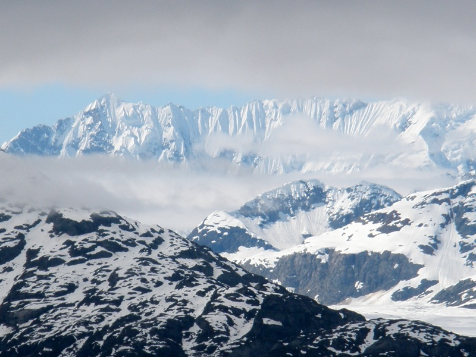

Yukon Country的山水
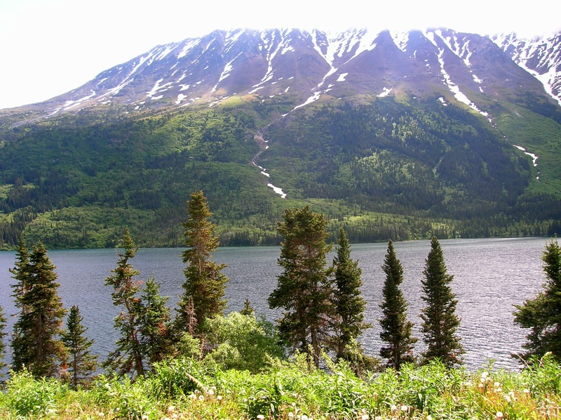

Yukon的Emerald Lake
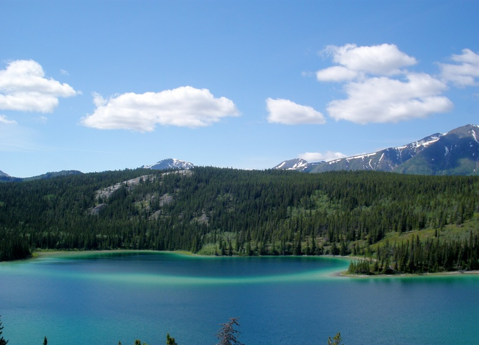

从温哥华去Whistler路上的激流飞瀑
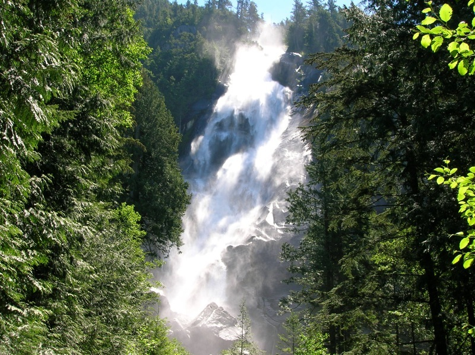

因为想象不出Banff /Yoho/Jasper国家公园的风景会有多美，到那里旅游并不在我们的计划日程上。碰巧太座领导对今年暑期去那里旅游举棋不定，一个想去那里的朋友便拉我们一起去，太座和那朋友做了很多前期工作，终于下定决心，定了机票旅馆。怕我太闲了，便给了我一个光荣的小任务：制定出可以开车游玩的八天中每天要看的地方及行程，因为景点太多了，必须有所取舍。我只好上网做了一些homework和读一些有关的游记。我本是个懒散之人，并不热衷旅游，平时旅游也只是太座说去哪里就跟着去而已，不费心思倒也轻松逍遥。这次为制定计划读别人的游记反倒起了兴趣，尤其是la-vie女士在文学城发表的游记中对Peyto Lake的描述，使我产生了心向往之的触动：“继续上路才3公里又到一景点Bow Summit & Peyto Lake, 这是落矶山海拔最高的冰川湖(2068米)。俯瞰着这美得令人窒息的Peyto湖,心灵瞬间的颤栗后是水一样的宁静。聆听着这远古的呼唤感到一种时空的错乱,细细的雨丝打在脸上让我回到人间。这哪是一湖水,这分明是一湖醇醇厚厚的蓝牛奶,网上看到有人形容她为蓝牛奶不是太有概念。亲眼见了才知道这应该是最确切的描述。老妈看呆了,一个劲地说:‘我做了一回仙人’,老爸就四个字: ‘蓬莱仙景’。以后这各自的评价一再重复。上车后除了老妈不停地说:‘我做了一回仙人”,我们都沉默无语。大千世间的一切烦恼,痛苦,功名,物欲在这永恒的大自然面前如过眼烟云轻若浮尘。”

然而期望越高失望就越大，这Peyto Lake正是此行中最让我失望的地方, 或许是我太粗俗了，没缘分看到她的仙灵之气，好在有其它一些意想不到的惊喜，天气运气也都不错，总的来说还算圆满，不虚此行，看到了想看的东西，大家对我的计划评价也不错。嘿嘿！赶紧趁机得意一下。

从美国去加拿大落矶山Banff /Yoho/Jasper国家公园旅游的人一般都会先飞到加拿大Alberta省的卡尔加里（Calgary)。卡尔加里是加拿大的第三大城市，仅次于多伦多和蒙特利尔，曾举办过1988年的冬季奥运会，Banff国家公园离卡尔加里只有128公里的车程。我们飞向卡尔加里时是由盐湖城转的机，在飞机上看到了盐湖落日，觉得有特色，可惜通过机窗拍照，增添了落日的几重晕影（见照片）。在卡尔加里机场附近的旅馆住宿一夜，第二天早晨租车后先去Harvest Hills Blvd. 上的中国超市（T & T Supermarket,  中文名字是大统华超市)买一些路上吃的东西。进了超市还真有点惊艳，当然不是刘姥姥进了大观园的那种，咱住在南加州，见惯了大华和顺发这样的华人大超市。十几年前刚从华盛顿DC的马里兰郊区搬到南加州，习惯了东部的小小的华人超市，刚入大华超市时倒是有点刘姥姥进了大观园的那种感觉。但现在我不得不承认这大统华超市比我在南加州见到的华人大超市更新更大更琳琅满目，特别是各式烘烤，面条，粥，北方的大饼油条包子南方的各式Dim Sum，日式的Sushi, 这里都应有尽有，不需另找中国餐馆吃饭了，当然加拿大的食品汽油价格明显比美国贵，这就没法比了。中国胃情结浓厚的朋友，不妨先在这里路过一下。

盐湖落日
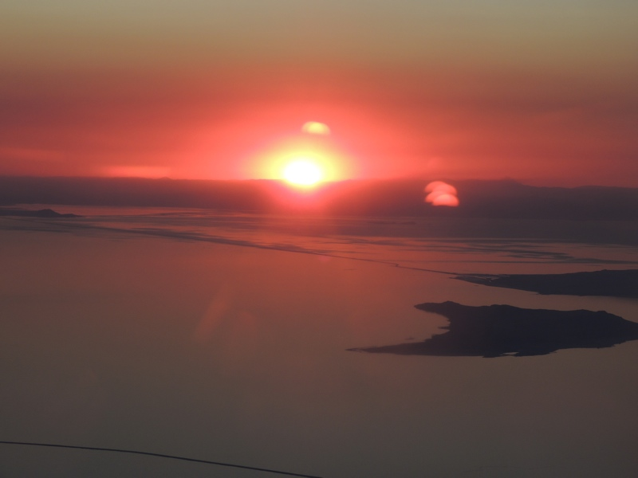

这次旅行快结束时和朋友们在饭馆里吃饭，一朋友提议每个人说一说此次旅行中最喜欢的地方和所见到的最喜欢的野生动物，其中一朋友便开玩笑说他最喜欢的地方是大统华超市，最喜欢的动物是蚊子。说最喜欢的动物是蚊子当然是反话，这一路上每个人都被蚊子奖励了不下十几个包吧，说最喜欢大统华超市虽是玩笑，却是正话，中国胃情结嘛。

在中国超市吃饱喝足买好路上吃喝的东西后便驱车直奔Banff，穿越Banff 小城后沿山路开到硫磺山（Sulphur Mountain)山脚下的Banff Gondola坐缆车上山顶。那天天气很热，游客特多，原来是加拿大的长周末。等坐缆车时选一山坡上树下阴凉处的石桌石凳野餐，初次领教了这里蚊子的厉害。最后终于轮到我们坐缆车爬升了约700米的直线距离而到达2300米的硫磺山顶（约需八分钟）。从山顶的缆车站有一木制栈道可走到另一山峰，那里视野更好，有一老的气候／宇宙射线观测站。我读的游记资料都说山顶风大很冷，要准备好衣服，结果那天山顶上也热，我的老黄历忠告成了累赘和笑柄。

站在硫磺山顶上，可一览无余地领略到苍茫群山巍峨绵延的气势，但已看不到山上的积雪了。远处山脚下的一个湛蓝湖泊清晰可见（据说是Minnewank Lake), 蜿蜒的Bow River 象一条蓝绿色玉带缠绕着近处的Banff小城。小城旁的Cascade Mountain，有着刀砍斧剁般的山形， 在下面看起来也满雄伟的，但在山顶上看起来却只象个群山环绕下的小弟弟了。
Upper Hot Springs就在Banff Gondola的旁边，临行前读的游记里都说那里太拥挤，象下饺子一样，圣地亚哥周围就有温泉可泡，犯不着跑到加拿大凑这份热闹。下山回Banff小城时顺路看了山脚下的Cascade Garden, 免费，景色也很美，正对着Cascade Mountain，里面有很多漂亮的花。

硫磺山顶和Cascade Mountain
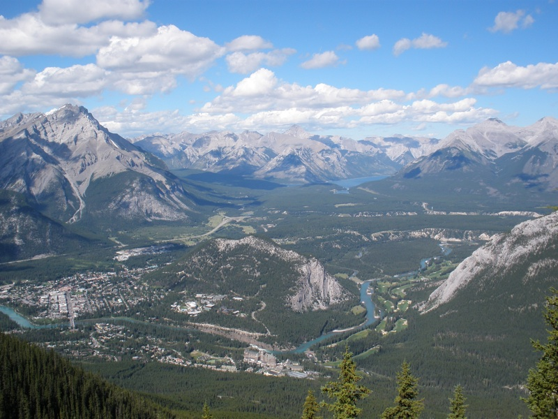

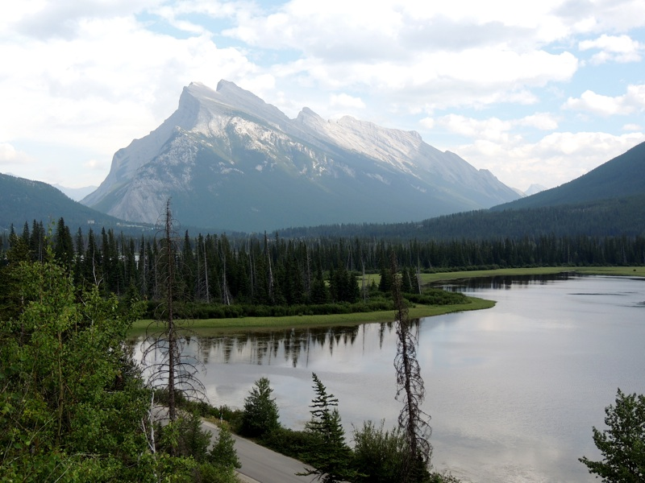

女儿秋季开学后将参加一门制作yearbook的课，对摄影起了兴趣，暑假的任务就是要照一张反映了“magic moment”的照片，她把重点放在动物飞鸟昆虫上，特别是她喜欢的松鼠，这一路上也不知照了多少松鼠的照片，其中最得意的便是在Cascade Garden里找到的一个手捧松果站立的松鼠，现在是她参加“magic moment”的首选之一。

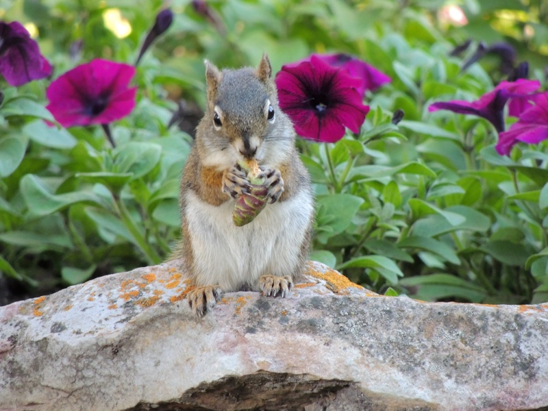

随后在Banff小城游览吃晚饭，小城很漂亮，到处是世界各地来的游客，主要的商业街Banff Avenue两旁林立着旅游商店饭馆旅馆，晚上十点多钟天色也不是很黑，依然人流如潮，很热闹。都说这里唯一的一家中国饭馆不好，我们也不想去试，找了一家朋友推荐的西餐馆了事。

第二天驱车经Bow Valley Parkway去Lake Lousie（58公里）而没有走更近更快的1号路，据说这条路风景好也容易碰到动物。风景果然不错，有名的Johnston Canyon也在这条路上，但不在我们这天的计划里。动物这次没碰到，不过后来再经此路去Johnston Canyon时便碰到了两支熊。此是后话，将来再说。很快到了Lake Louise小镇，只是一些旅馆和一个小购物中心而已，不象Banff有很多选择。离小镇不远就是大名鼎鼎的 Lake Louise。很多人来到Lake Louise若碰到不好的天气便会大失所望。我们这天的运气很好，艳阳高照，蓝天白云冰川下的Lake Louise非常美丽，游人如织。那在波光粼粼的碧水中游泳的野鹅或野鸭是女儿拍的，不敢抢功。

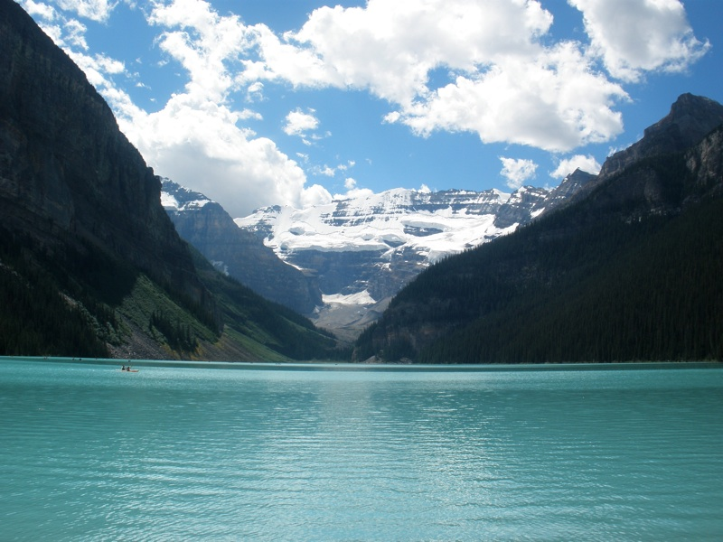

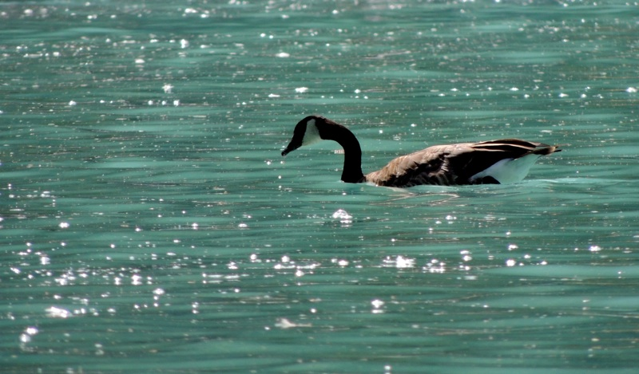

午餐后先去了位于Yoho国家公园的Takkakaw  Fall。“Takkakaw”是当地土著语言，意思是“magnificent”。此瀑布落差384 米 (1,260 ft)，真正的 “free-fall” 落差是 254 米 (833 ft)，但这气势也够大了，是加拿大西部第二大瀑布。太座对于我领大家跑这么远盘山路来看这个瀑布有点不以为然，说不比Yosemite和去Whistler 路上的瀑布强，和Niagra 大瀑布更没法比。唉，这样比来就有点影响欣赏眼前的美景了。看着眼前壮观的瀑布，听着如雷的轰鸣，我对身旁的朋友说，要是再有道彩虹就完美了。话刚说完没几秒钟，就见瀑布前出现颜色，原来此时刚好太阳冲出云彩，很快就形成了一道半圆形的彩虹，My Magic Moment! 这算是此行的第一次意外惊喜吧。废话少说，以照片为证。

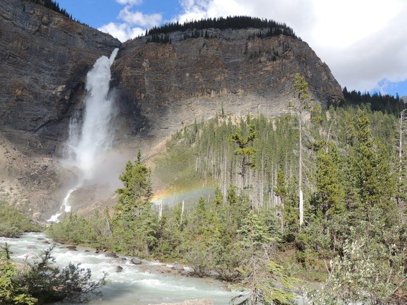

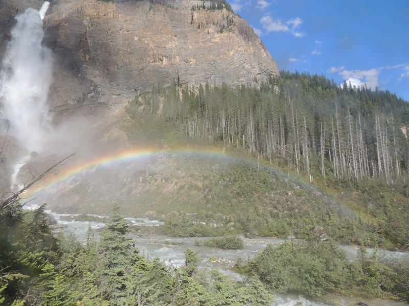

随后便赶向Yoho的Emerald Lake。先顺路看了路旁的Natural Bridge。急流硬将拦路的巨石穿透而过，形成一自然桥。在随后的旅程中，流水对坚硬岩石的胜利在几个所游览的canyons 中更一再得到见证。到Emerald Lake时大约是傍晚的七点半吧。已来过的朋友说傍晚来最好，人少，安静，太阳也尚未落山，我们到时也的确是如此情形。但见群山密林环抱着一湖翠绿的水，对面湖岸山坡上一大片红花绿草，湖中荡漾的一叶孤舟更增添了一分静谧。这次旅行一路上看到了大大小小十多个各具特色的湖，感觉最亲切，最想荡舟其上，让身心融化于其中的便是这Emerald湖了，可惜租船时间已过，湖中荡漾的孤舟应该是荡舟者自己的私家船吧。在静静的，如画的湖光山色中沿岸散步，又碰到此次旅行中的第二个Magic Moment! 第二次意外惊喜！蓝天白云山峰树林在平静如镜的湖面上所形成的倒影竟然比真的都更加生动完美！以前没有见过随后的旅程中也再没见到如此完美的水中倒影了。一下午接连碰到两次意外惊喜，觉得非常的幸运和满足。

Natural Bridge
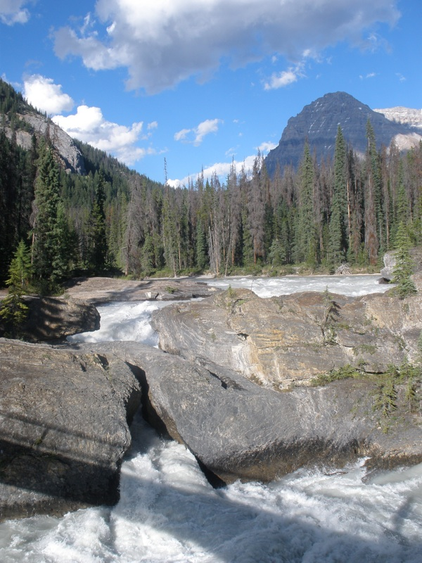

Yoho 国家公园的 Emerald Lake
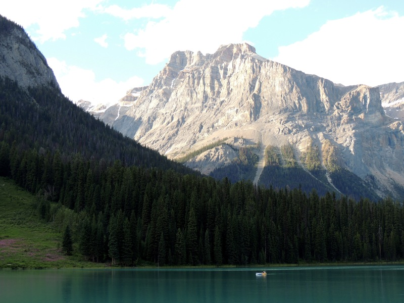

据说Yoho国家公园里最漂亮的湖是Lake O’Hara湖,为了保护环境，不许开车去，只能坐专车或步行2个多小时前去，而且要提前3个月订位,每天只放行几十个人，连当地人也不能想去就去，有缘能去的人们有福了。

下一天早晨去看也是大名鼎鼎的 Moraine Lake，据说老版的加拿大二十元纸币的背面既是十连峰衬托下的Moraine Lake，是国宝级的景观了。Information Center的人劝我们早晨早去或下午晚去，因为那里游客多，停车位置有限，免得去了找不到停车位。到湖边后不管怎么改变位置角度观看拍照都觉得名不符实。除了十连峰，湖面比Lake Louise 小一半还多，湖水较浅，湖水的颜色也无特殊之处，同行的朋友开玩笑说这湖的大小有点象他江南家乡的池塘。正想在失望中离开，太座发现很多人从湖下面一trail登上一个面对湖的小山包，或许从高处观湖风景会有所不同吧。及至登上山包向下一看，哇！何止是不同，简直是天差地别呀！在群峰衬托下，但见这阳光照耀下的Moraine Lake流光溢彩，透着一股仙灵之气，一种说不出的美丽。大家顿时情绪高涨，忙着拍照。松鼠又出来凑热闹，弄的孩子们大呼小叫。

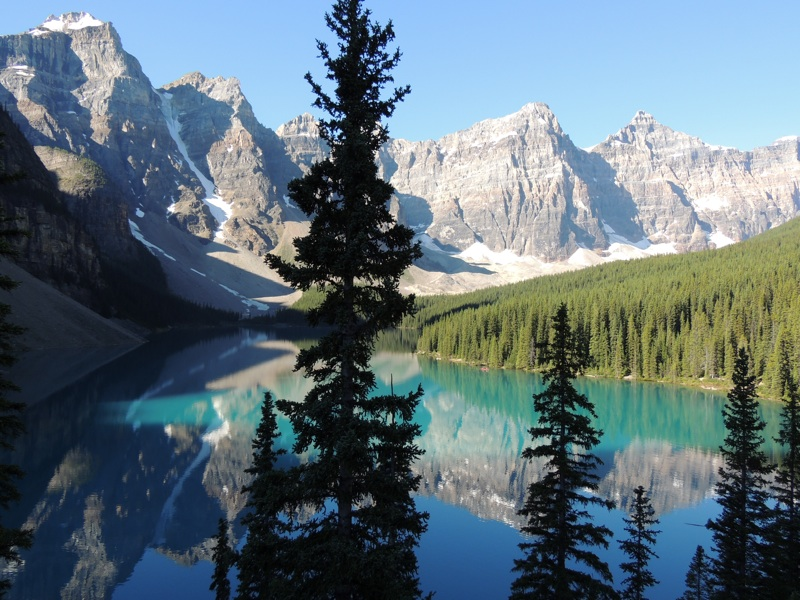

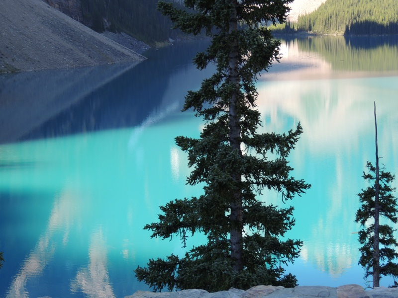

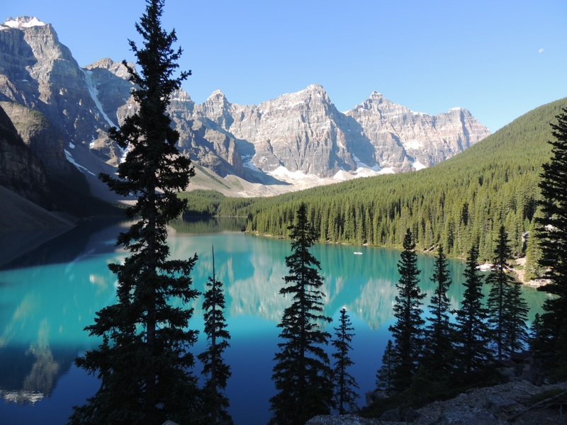

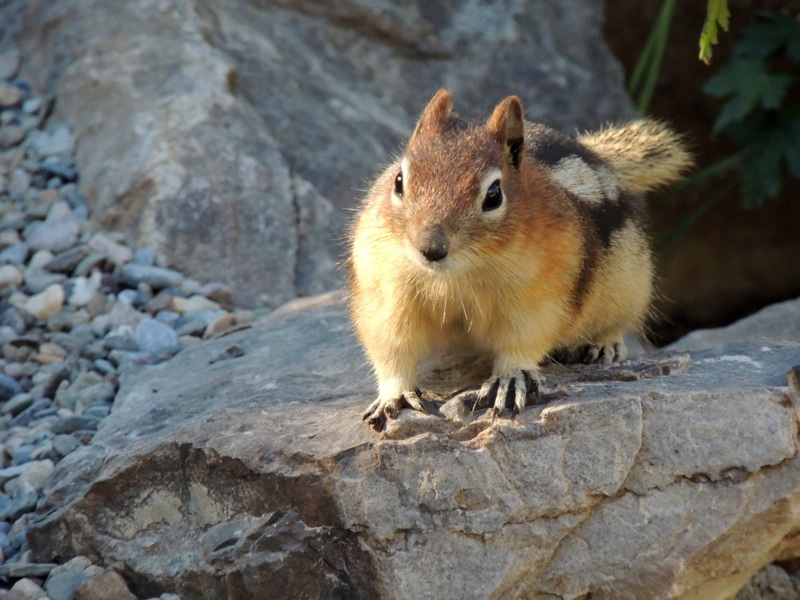

这天下午又沿着Bow Valley Parkway去了据说很popular的Johnston Canyon。刚上路没多久太座便首先看到一只棕熊（grizzly bear) 在穿马路，立刻停在路边观察拍照，后面很快后面就停了一大堆车。初次离一只野熊这么近，很兴奋激动，那熊只管吃路边的浆果（berry)，旁若无人，任人拍照。上次去阿拉斯加有人说半山腰有只熊，大家抬头挺脖望眼欲穿了半天也没看清，这次时近在眼前。此熊离开路边后继续上路没多久，又见前边停了一排车，下车一看，呵！这次是一只黑熊。后来在快到Jasper时和去Maligne Lake的路上，又分别看到一只棕熊，总共碰到三只棕熊和一只黑熊。

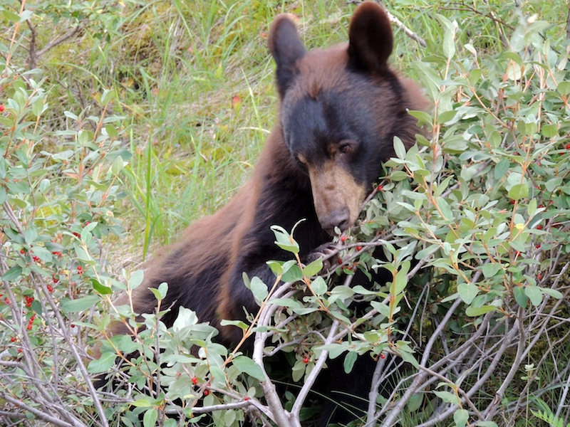

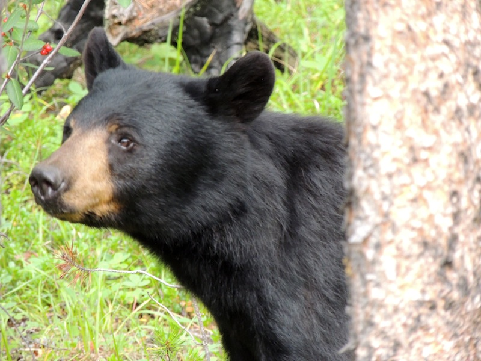

继续上路很快到了Johnston峡谷。图示说到Lower瀑布1.1公里, 到Upper瀑布2.7公里。两个瀑布我们都去看了，连我们家不善hike的孩子都觉得不太难，靠山崖难走的地方都修了栈道。这Johnston峡谷果然是个hike的好地方，但见峡深谷幽，树木参天，谷底一条清流随地形时而淙淙，时而湍湍，时而泻入碧潭，时而直下山崖成飞瀑，美景连连。

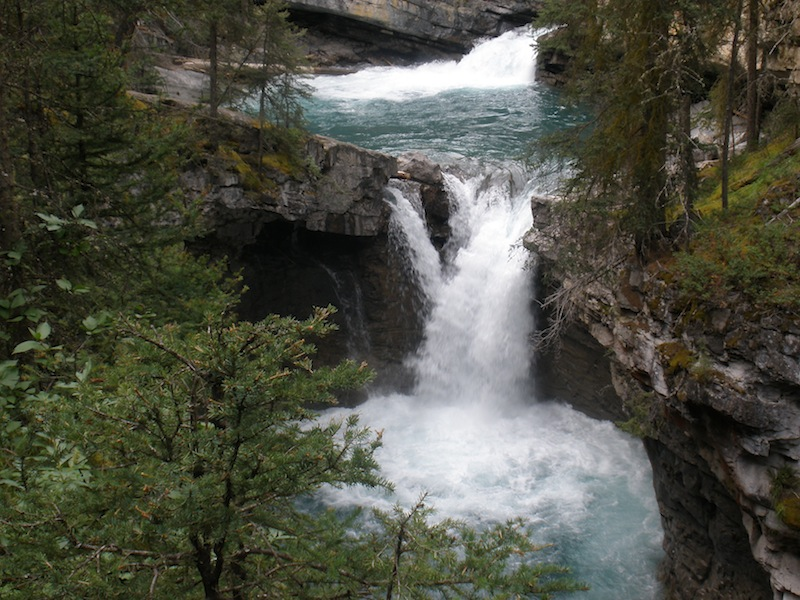

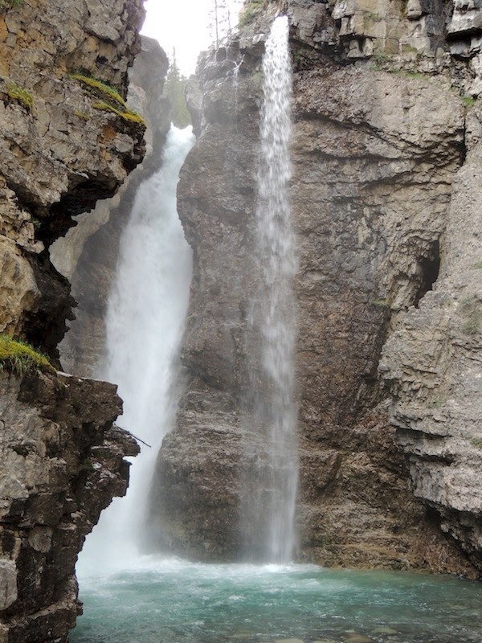

下一天开始游览连接Banff和Jasper的冰原大道（Icefield Parkway)。这条230公里长的道路因两旁有众多美丽的雪山冰川湖泊峡谷瀑布密布其间常被称为世界上最美的风景路。因为景点太多，我们便以Saskatchewan River Crossing为界分两天来看。第一天依次观看了Herbert 湖, Crowfoot冰川， Bow冰川及Bow湖（这是Bow河源头），Bow Summit 及Peyto 湖， Waterfowl湖和Mystaya峡谷。我们去的有点晚了，积雪已快化尽，冰川也融化了很多，Crowfoot冰川已分不出乌鸦脚的形状。已去过的网友或许看到了这些著名景点更美的一面，除了感受特别的Peyto Lake 和Waterfowl Lake外，其他的就不多啰嗦了，只贴些照片证明到此一游。

Herbert Lake
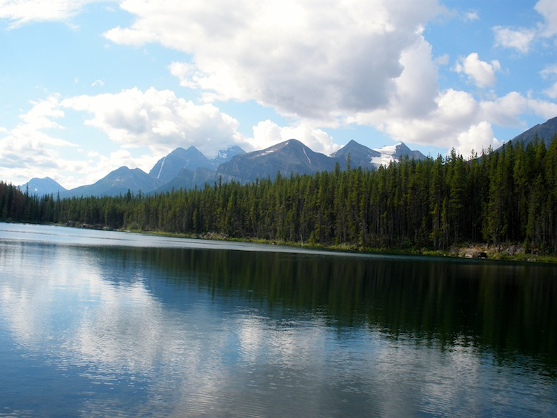

Crowfoot冰川
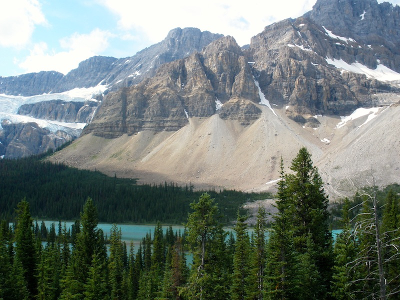

Bow冰川及Bow湖
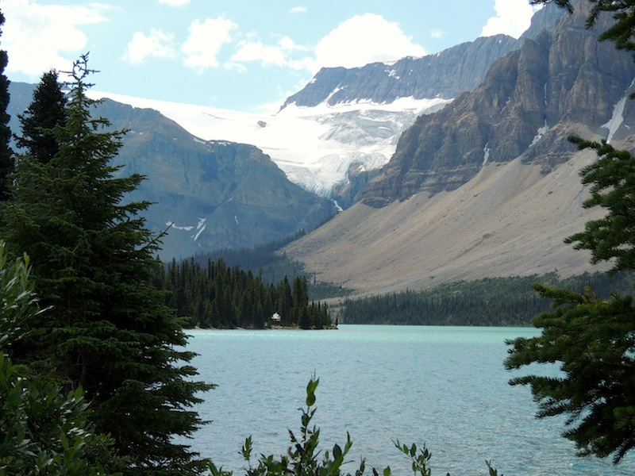

临行前读了la-vie女士在文学城发表的游记。她说Peyto Lake美得令人窒息，象一湖醇醇厚厚的蓝牛奶, 使得她觉得大千世间的一切烦恼／痛苦／功名／物欲都如过眼烟云轻若浮尘。我看了便很神往，抱着一种朝拜圣湖净化灵魂的心情和期望。谁知到了一看，却像是绿牛奶，不是期望的蓝色，周围是闹哄哄的人群，蚊子叮的人坐立不安，没有感受到多少仙灵之气，灵魂也没法得到净化。看la-vie女士的照片，分明是透着仙气的一湖醇醇厚厚的蓝牛奶，她说这张照片尚不足以描绘所见景色的十分之一的美丽。看来我们来的不是时候，缘分不够，那种仙境灵气是可遇而不可求的呀！傍晚回程时不死心又跑上去看了一下，这次人很少，湖色也的确变蓝了，但仍和 la-vie女士看到的没法比。

Peyto Lake: 中下午
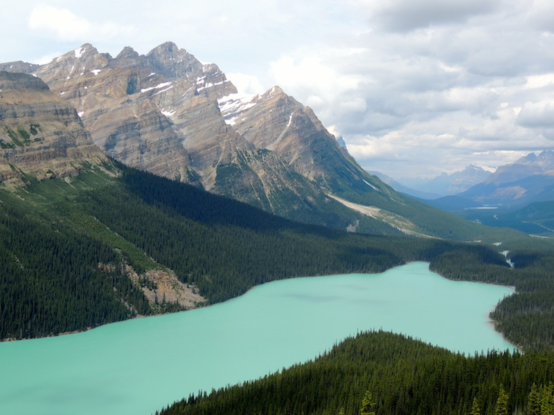

Peyto Lake: 傍晚
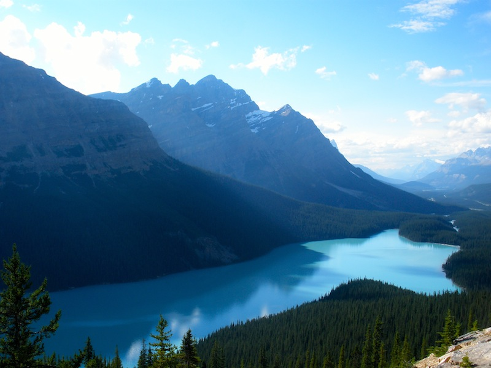

Peyto Lake: la-vie女士的照片
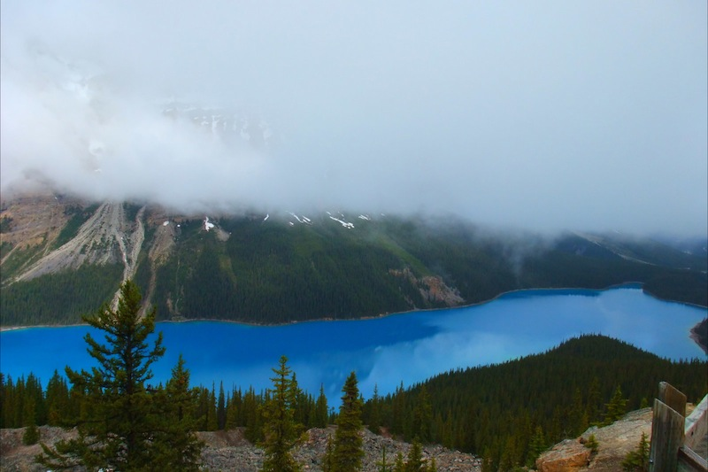

Waterfowl湖就在冰原大道旁，虽然不是很有名，但我们在那里野餐休息，印象却很好。湖岸边的树林里到处是野营的帐篷，很奇怪好像没有蚊子。一路上领教了这里蚊子的厉害，在前面还看到一个吓人的路标指向 “Mosquito Canyon”，像是蚊子的老家。选湖岸边流水入湖处的一个木桌野餐，听着潺潺的流水声，看着白云缭绕的群山下平静的碧水绿林，只觉非常平静放松享受。野餐后沿湖岸散步，碰到一骑自行车的先生，说是很喜欢这里，每年都来野营度假。看到很多好看的小野花，就试着用那个不太好的傻瓜相机的macro功能拍照。女儿对摄影起了兴趣，好相机大多由她先用了。挑一张自觉好看的传上来吧。

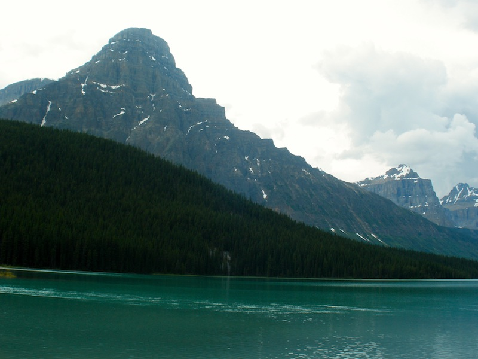

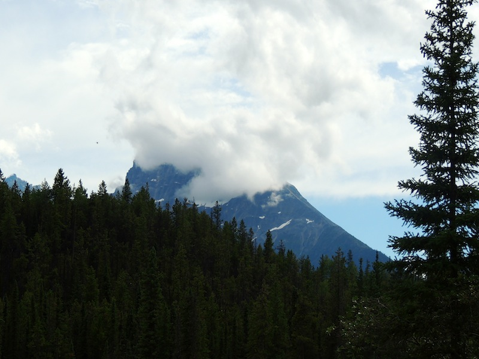

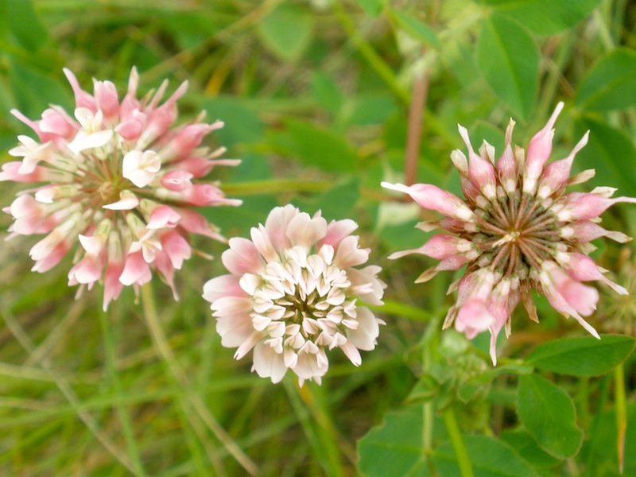

接下来游览了冰原大道（Icefield Parkway)下半部分的景观。从Lake Louise 的旅馆直接开到Columbia Icefield，一种特制的车轮很高的Bus把我们慢慢带到由Columbia Icefield 形成的Athabasca冰川上。开车的是一个解说清晰的幽默小伙，他说Columbia Icefield方圆325平方公里，产生了八个冰川，冰的规模面积要达到能形成三个以上的冰川才能称为icefield (冰原）。刚下车这冰原／冰川就给了我们一个下马威，风雨交加，手都冻僵了，雨点打到镜头上使得相也照不好。好在天公开恩，风雨只持续了几分种，云开日出，大家便兴奋地忙着照相。手扶着冰川上的加拿大枫叶旗，作着姿势，好像是骄傲的加拿大公民登上了北极。冰川上蓝蓝的冰化成清澈的冰水流淌，导游说那水干净极了，味道好得很，大家便都品尝冰水。这是第一次站在冰川上面亲身体验，很有趣，规定的时间到了都还不愿走 (是20分钟还是25分钟记不清了），以前只是或近或远的看看而已。

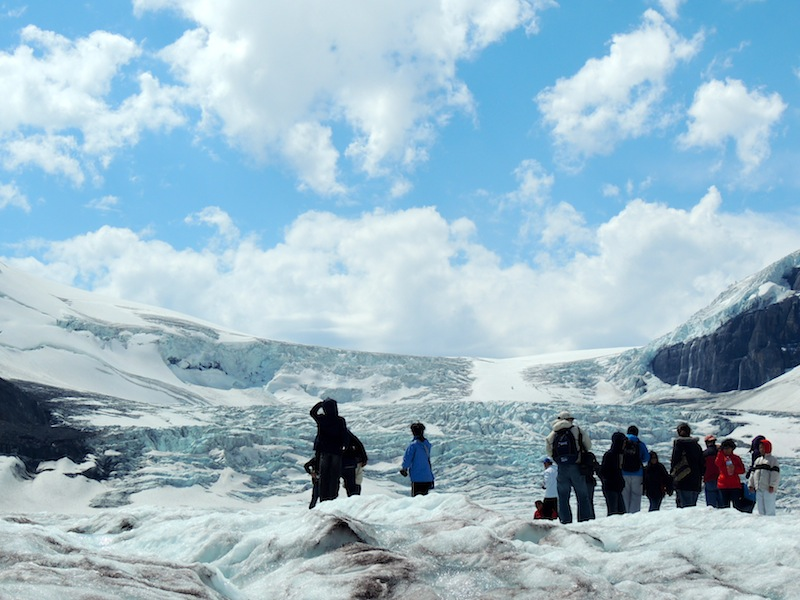

上完冰川后继续前行，从车里照了下面这个形似飞雁的冰川。接下来依次游览了Sunwapta瀑布和Athabascap瀑布，虽各有其特色，但规模和落差和Takkakaw瀑布都没法比，倒是对路旁看到的一个纤细优美的瀑布有点惊艳，可惜记不得名字了。此后到达Jasper小城住下，熟悉环境不提。

飞雁冰川
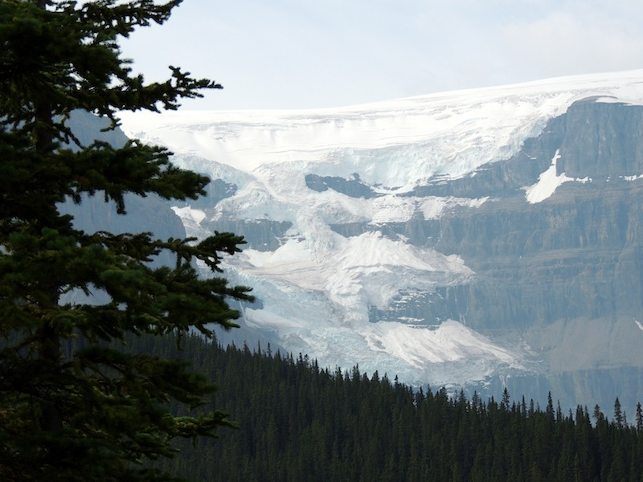

Sunwapta瀑布
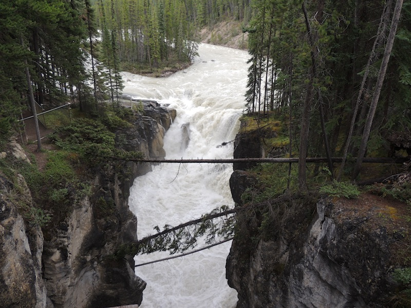

Athabascap瀑布
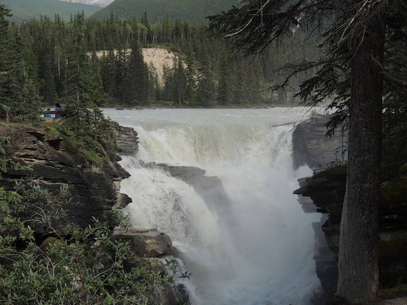

纤细瀑布
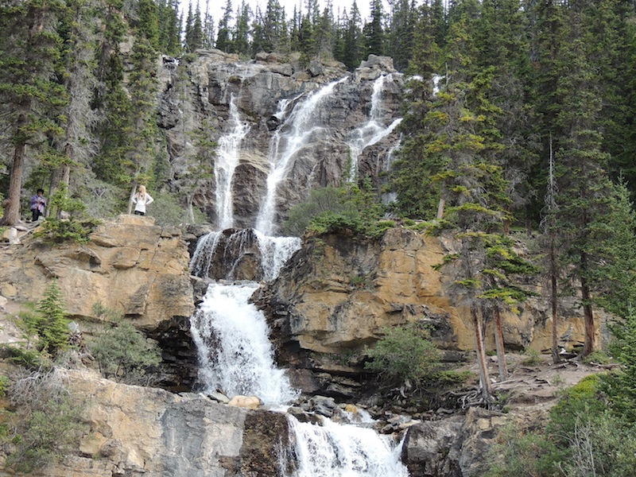

到Jasper的第二天上午去看了小城附近的Patricia湖和金字塔湖。两个湖近在咫尺，而以金字塔湖更大更壮观，当时白云像是给湖畔的金字塔山的腰间系上了白玉带， 很美。但孩子们早已厌倦了看湖，尤其是男孩子们更是气哼哼地说“boring” “湖sick” “They all look the same”, 宁愿待在旅馆里打电子游戏和看奥林匹克转播，被硬带到湖边，抗议合影照相，以石头打水漂取乐，一会儿子便高兴地说他创造了新纪录：一石打了九个水漂。

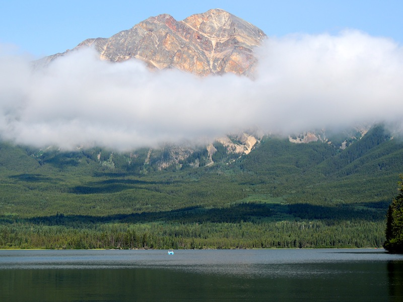

下午去了Edith Cavell 山，走了不过一公里的冰川之径（The Path of the Glacier)，不敢过问那个景色更美但却难得多的Cavell Meadows Trail。这里所说的冰川指的是挂在山上的形似天使的Angel Glacier, 不过冰川天使的部分衣袍已融化不好辨认了。天使冰川下面的山脚处有一个湖，湖上飘着很多冰块（iceberg)，女儿照到的一个冰块特象海豚！正坐在这充满了iceberg的湖畔欣赏美景休息，忽听见一阵类似于超音速战机发出的轰鸣，大家都往山上的天空暸望却没看到任何飞机的踪影，这湖水和湖里的冰块却突然象大海涨潮一样，离湖近的人只好狼狈逃开，原来是湖左边山脚下的冰川崩裂发处这样的轰鸣声，造成这样大的水位变化。回程时又听到一阵更响的如雷的轰鸣，这次却是靠近山顶的一大块冰川崩裂，断裂的冰川直下山崖，气势惊人，真可谓“疑是银河落九天”，远远望去和瀑布没什么区别。看完了继续回程没多久，又是一阵更响的轰鸣。这天真是中了彩了，一连经历三次冰川崩裂。太座看着山上这处冰川仅剩下的一块巨冰，说是周围的裂缝加大了，马上就要掉下来了，大家便守株待兔般等了半天却无任何动静，真是可遇而不可求呀！好几个人都把这天的意外惊喜当成是这次旅行的最爱。不过惊喜之余却也有些担忧，这冰川融化的速度也太快了，看来这Global Warming是真的来了。

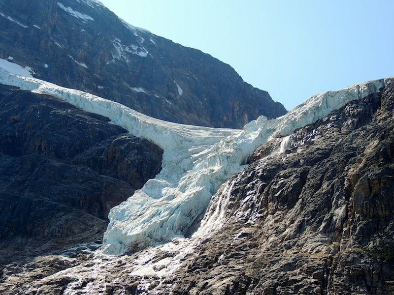

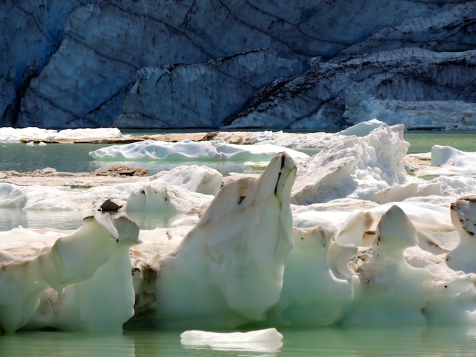

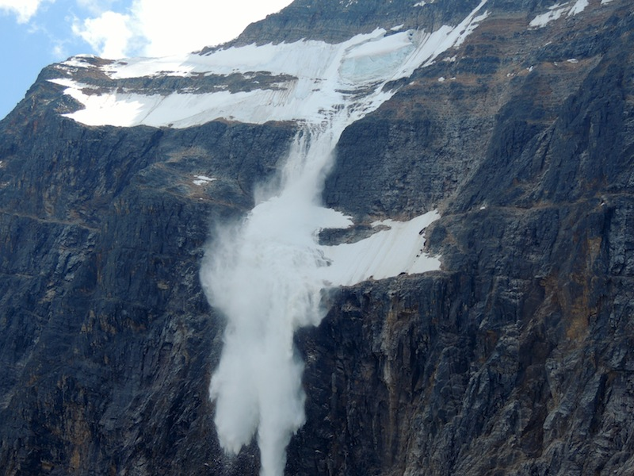

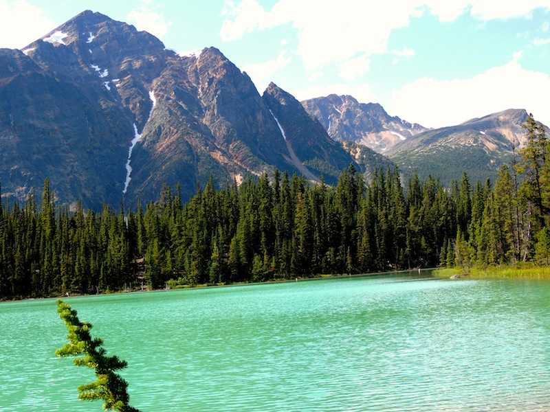

从Edith Cavell 山回来后天色尚早，女儿说想看羊和鹿。我说根据别人的游记在Medicine湖是一定可以看到羊的，但那天不能去Medicine湖和Maligne湖，因泥石流堵路，据说明天才能修好。他们说你那么肯定，要是看不到羊你就趴在地上学羊叫吧。随后就到Information Center咨询到哪里才能看到动物，里面的人说出小城沿16号高速公路向北开在到达Talbot Lake时应该可以看到山羊和鹿之类的动物了，要是还没有看到，可继续前行，拐上去Miette温泉的Miette Road，那基本上是百分之百能碰到动物的了。此话果然不虚，在16号路上开不多远，眼尖的朋友便在路旁的峭壁上发现山羊，好像是一家大小六只，解除了我可能要趴在地上学羊叫的压力。再向前行，便碰到了三只外形很象牛的长着长角的鹿，我到现在也搞不清楚是驯鹿(Caribou)还是麋鹿(Elk)。Caribou和 elk 外形很像，路边的牌子也说要“Be Careful of Caribou”，但据说这里的 Caribou已很稀少，而elk却很多，我们看到的八成是麋鹿(elk)吧。看官中的专家，请来指点一下迷津。

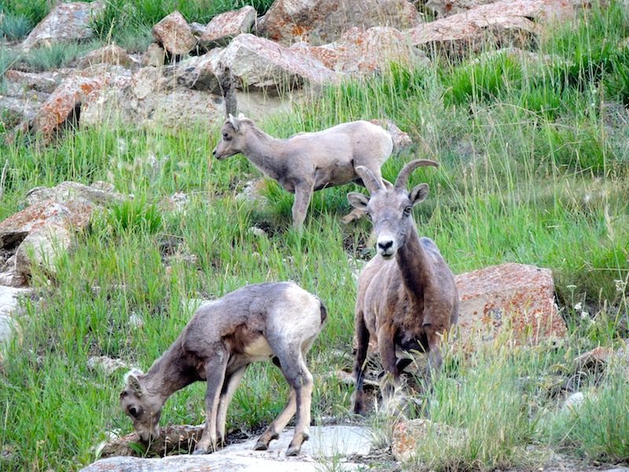

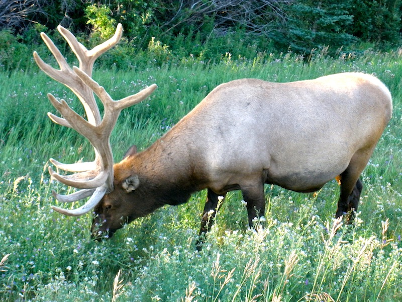

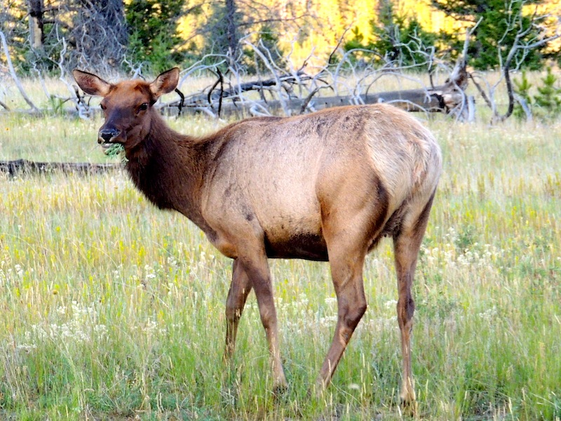

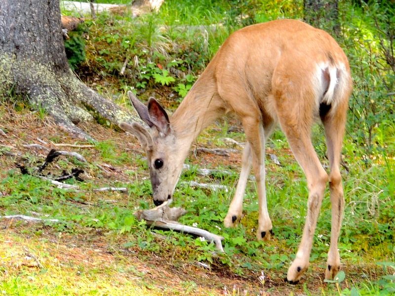

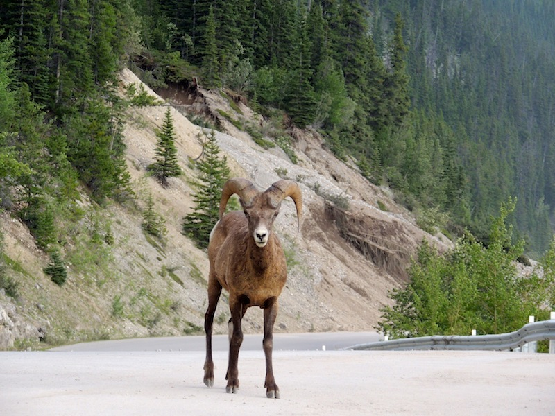

感觉已超额完成任务，天色也完了，便心满意足地往回赶，回程又碰到六只鹿（mule deer?)过马路。第二天早晨出来散步，呵！这鹿还真多，跑到家门口来了，只见两只鹿（mule deer?)正在邻居的院外吃修剪下来的树枝。第二天去Medicine湖和Maligne湖的路上又见到七只绵羊，一只棕熊，一只elk，两只类似梅花鹿的鹿，算来此行总共碰到三十多只大的野生动物，真是大开眼界呢。这里的野生动物都很大方，当地人的主人翁精神特强，过马路（包括高速公路）行使优先权，大家都乖乖停车让路。Medicine湖畔的绵羊家族好像对人车很好奇，把车子围起来观看，还想把头伸进车窗和你make eye contact，吓的太座大叫：“快把窗子关起来！”。嗨，有什么好怕的，不就是几只吃草的好奇的羊儿吗，又不是那些吃人的食肉动物。

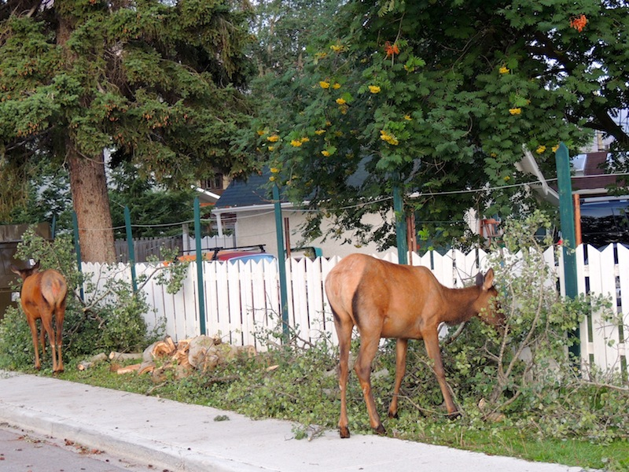

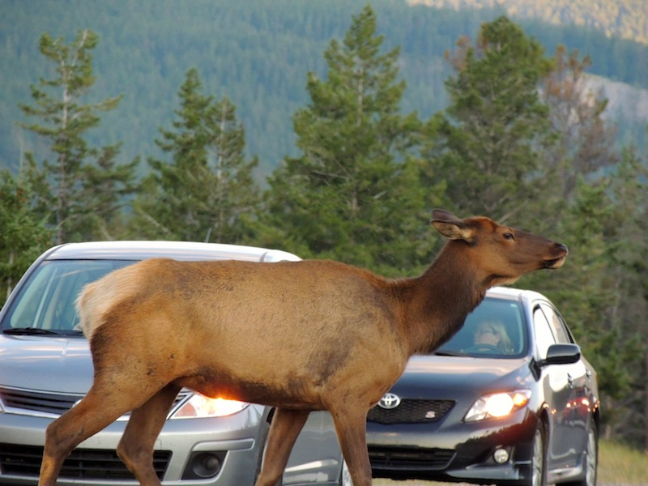

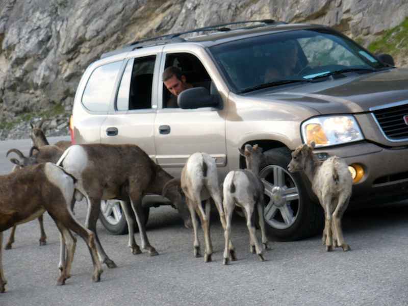

离开Jasper前的最后一天看了Maligne峡谷，Medicine湖和Maligne湖。这三个景点依次排在同一条路上 （Maligne Road)。先看了Maligne峡谷，激流在深窄的峡谷中奔腾鸣响，飞溅的水雾在太阳照耀下竟也形成了彩虹。峡谷上建了六座桥，我们走了第一至第四桥，第五第六桥距离相隔太远，便没走。直到最后一刻也不知能不能去成因泥石流而暂封的Medicine湖和Maligne湖。从Maligne峡谷出来重回Maligne Road时抬头张望，呵，运气还不错，来时还在的路障那时已经撤除了，便高兴地开下去，途经Medicine湖，最后到了Maligne湖。这一路上最惊奇的还是Medicine湖畔那些来时围观我们，回去时也欢送我们的好奇的羊儿，在Maligne湖畔也碰到了两个漂亮的小鹿。Maligne湖很长，可以坐游船看湖深处的雪山和一个风景很美的岛（Spirit Island，$50/每人），据说很多艺术家从此岛得到灵感。我们去的那天游船停工，照照相，沿湖边草草走一走了事，也没觉得多美。这一路上实在是看了太多的湖，审美疲劳，对于没化成钱坐游船也不觉得有多大遗憾，何况太座本来就觉得不值。回程时再仔细观赏傍晚时光下的，静谧的Medicine湖，女儿甚至说是她的favorite。据说Medicine湖的水位变化很大，早期印地安人认为有神灵控制，现代人则通过染料（tracer dye)发现湖底的地下水系统和Maligne峡谷的水相通。

Maligne峡谷
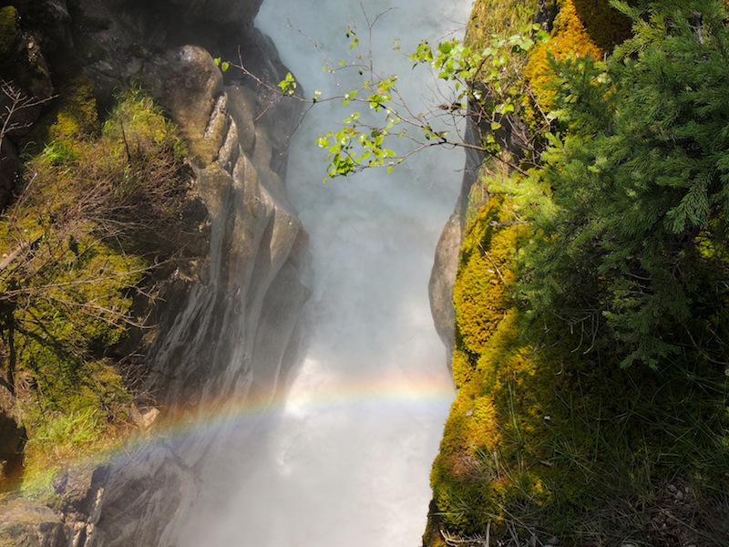

Medicine湖


Maligne湖


一路上是无尽的蓝天白云绿树，也从未看腻。形态变化万千的云朵自有其美妙之处，就顺便贴两张吧。


最后聊一聊未看成的英仙座流星雨(Perseid meteor shower)和 Jasper小城。去 Jasper  Information Center时看到下面这则告示，说是这个周末 （8/11 to 8/12)一年一度的八月英仙座流星雨将达到高峰 （100颗／每小时），而 Jasper是世界上最大的黑天空保留区，是观看流星雨的好地方，邀请大家星期六（8/11）到Whistler山的野营地数着流星睡觉，这听起来新颖有趣。女儿特想看流星，小时画画即喜欢画流星，上暑假才艺课也做了个流星模型，叫可以make a wish的shooting star 。但我们8/11就必须离开 Jasper了。8/9晚上出来看天空，的确是繁星漫天，比其他地方看到的又多又亮。第二天去Information Center询问如何看流星，说是附近的Pyramid Lake的湖中岛是一个绝好的看星星的地方，另外高速公路旁可以遮蔽公路上汽车灯光的地方也行。8/10傍晚从Maligne Lake回来时还惦记着到哪里去看流星雨呢，结果满天都是白云，连个星星都看不见，只好作罢。

Google／百度了一下英仙座流星雨(Perseid meteor shower)。在百度上看到了这段中文说明：每年8月中旬, 都会有一场流星雨如约而至，绽放于静谧的夜空，那就是著名的英仙座流星雨。高峰时期，每小时有超过100颗的流 星从英仙座的方向投射而来，像一束闪亮的荧光，划破寂静的夜空。流星雨是由彗星分裂的碎片产生，英仙座流星雨母体是斯威夫特·塔特尔彗星，地球穿越斯威夫 特·塔特尔彗星瓦解后残留的碎石带密集区，每小时有成百上千的彗星残片袭击地球，其中约百余颗以流星的形式掠过大气层而形成流星雨。由于这些流星从星空的 英仙座方向飞来，因此被称为“英仙座流星雨”。

Jasper小城淳朴美丽，Downtown 或主要的商业街就是从南面来时首先碰到的的两条街：Connaught街和 Patricia街。在Banff小城和Lousie湖小镇的商店旅馆前已看到一些漂亮的，花团锦簇的花篮，但这Connaught街上的花篮也太完美了，看不到枯叶败花，唯有满篮的鲜花怒放，翠绿宜人，鲜艳欲滴，也不知人家是怎么种养的！小城的旅馆不多，但B&B (Bed and Breakfast) 很多，在Jasper也就是房主把地下室装修好了当旅馆，并不提供早饭。我们就是住在这样一个B&B里，感觉比住旅馆还舒服，因为空间大，象个 suite，里面是睡房，外面的厅和厨房可以看电视做简单的饭，互不干扰。


早晨醒了便到街上散步溜达，五分钟就到了Connaught街，街对面的群山白云罩顶，一会儿太阳升起来了被云遮着象月亮一样，继而太阳把白云照的色彩斑驳，喷薄而出。很遗憾当时没带相机把这山上日出的美景照下来。第二天早晨拿着相机前来，山顶上却没有一丝云彩，太阳一出来就是一金光万道的热刺刺火辣辣的大火球，没什么好照的了。第三天早晨，也就是要返回Calgary的那天，出来后向与Downtown相反的方向溜达，很快就到了山脚下的一个社区公园，里面正在进行棒球赛，旁边是个小学，公园一角是家人或亲人为纪念一位逝去的女士所捐赠的坐椅，上面的话引起了我的注意：

“Hold on to what is good even if it is a handful of earth. 
(坚守好的东西，即使它仅仅是一捧黄土。)

Hold on to what you believe even if it is a tree which stands by itself.
(坚持你的信念，即使它象一棵必须孤独自立的树。)

Hold on to what you must do even if it is a long way from here.
(继续你必须做的，即使路途遥远。)

Hold on to life even when it is easier letting go.
(坚持生命，即使这时候放弃更容易。)

Hold on to my hand even when I have gone away from you.”
(握紧我的手，即使我已经离开了你。)

－－Pueblo Blessing
(Pueblo 祝福)

当时不知道Pueblo的意思，回来后上网才知道它是印第安人部落的名称。沉吟着这几句发人深省的话，觉得这些话不止适用于必须在严酷的气候生活环境种生存的印第安人，也适用于任何碰到逆境的生命，但又何尚不适用于正常环境下每一个都必须经历生老病死的人呢！

啰啰嗦嗦，流水账般地记述了这次走马观花式的旅程，最后就以这几句故作深沉的话收尾吧。

－－The end.


 

## 2016年新英格兰清秋红叶行
发表于 2016 年 11 月 20 日

2016-10-14日在美国的部分大学同学相聚于波士顿同学家中，并于15至17日展开了在New Hampshire州White Mountain 的红叶之旅。行驶在色彩缤纷的大道上，远看万山红遍，层林尽染；流恋于醉人的湖光山色中，近观满山彩叶，碧湖清溪。如诗如画，其美丽醉人之处难以言说，唯有以照片略表一二：

山林作画布，清秋展神笔。

湖光映山色，五彩色绚丽。

处处是美景，人人皆惊奇。

一路红叶行，满满同学谊。

 

在红叶大道上奔驰：


远看万山红遍，层林尽染。


近观彩叶溪流，清秋神工。


红树似火，黄叶如金，碧水映蓝天。


晨雾漂渺，仙境若现，晩湖留倩影。


 

 

## 春到圣地亚哥
发表于 2013 年 04 月 20 日


 

春天的激情: YouTube video link with Chopin’s etude op. 10 no. 5 in G flat major nicknamed “Black Keys” (the right hand plays only on the black keys) performed by Maurizio Pollini:

 

## 月亮的颜色与星月交辉
发表于 2016 年 11 月 19 日

月亮通常是皎洁的白色，“小时不识月，唤作白玉盘。”，刚升起时带点黄色。但自从买了一个有超长焦距的大傻瓜后，发现它特适合照月亮，也不知咔嚓了多少张月亮照片，再加上随潮流追逐什么“超级月亮”，“月食血月”，“猎人月亮”和海上月落等，真是过足了照月亮的瘾了，同时很惊奇地发现月亮也可以是明亮的金色（月升日落或者月落日升差不多同时的时候）和鲜红的血色（月食时）。今晚清闲，就把这几年来自觉比较得意的月亮照挑选一下。也算做个总结吧，月亮照的差不多了，哈哈！

近来又照到了少见的星月交辉的景象，就是明亮的金星或不太明亮的暗红色火星离一轮弯月特近， 很美。金星看着简直就像挂在天上的一个明亮的灯泡，在傍晚的天空很是奇特惊人，也一起贴上分享。另外，那高度放大的月球表面是用Nikon Coolpix P900照的，它的optical zoom可达2000 mm （83倍）。


月食血月


海上落月


月上枝头


月朦胧


浮云遮月


月上房顶


云开月出


彩云追月


月晕


 

星月交辉


 

## 2014－04－15 血月月食：立此存照
发表于 2014 年 04 月 15 日


 

## 太阳彩霞彩虹


 

## 银河星空行星

银河


星轨


猎户星云


Nesome彗星


木星及其卫星


土星


房上北斗


金木火三星会聚


 

## 自然掠影之一
发表于 2013 年 01 月 14 日

Graceful trees:


自在的生灵：


阳光下的美丽：


静谧的暮色：


 

## 花卉蜂蝶集萃


 

## Sedona: breathtaking natural beauty
发表于 2013 年 01 月 01 日

Red Rocks:


Sunset at cathedral rock:


Slide Rock creek:


Oak trees:


 

## Joshua Tree National Park
发表于 2013 年 01 月 01 日

Cholla cactus:


Rocks and Joshua trees:


Gambel’s quail:


Sunset:


 

## 2018年六月火山传奇风景路之行

著名的火山传奇风景路（The Volcanic Legacy Scenic Byway），从北加州的Lassen 火山国家公园起，途经仍属于北加州的14,000多英尺的Shasta 山，最后一站是Oregon 州的Crater Lake 国家公园。

Lassen 火山国家公园


McArthur-Burney 瀑布

McCloud River 瀑布

Shasta 山

Crater Lake 国家公园

 

## 2019年九月初波特兰西雅图周边之行

Columbia River Gorge and waterfalls. 哥伦比亚河峡谷及瀑布，离Oregon州波特兰大市二十多英里。


Mt Rainer 国家公园


西雅图市区


University of Washington （华盛顿大学） 校园之美丽，建筑之典雅，与东部的长春藤名校相比一点都不逊色！


到Sequim 去看熏衣草


Olympic 国家公园


 

## 2020年底Tucson周边之行

Imperial sand dunces


Chiricahua National Monument, 位于Tucson东面二个多小时的车程。风景好像类似云南的石林，各种奇形怪状的石柱石头，有些神工鬼斧般叠罗平衡在一起，规模不小，hike了7个多英里，爬到了近7000 feet的高度，虽辛苦却也觉得不虚此行。


Saguaro National Park at Tucson: 满山遍野的Saguaro Cactus


Superstition Mountain (靠近凤凰城）


Salton Sea日落


 

