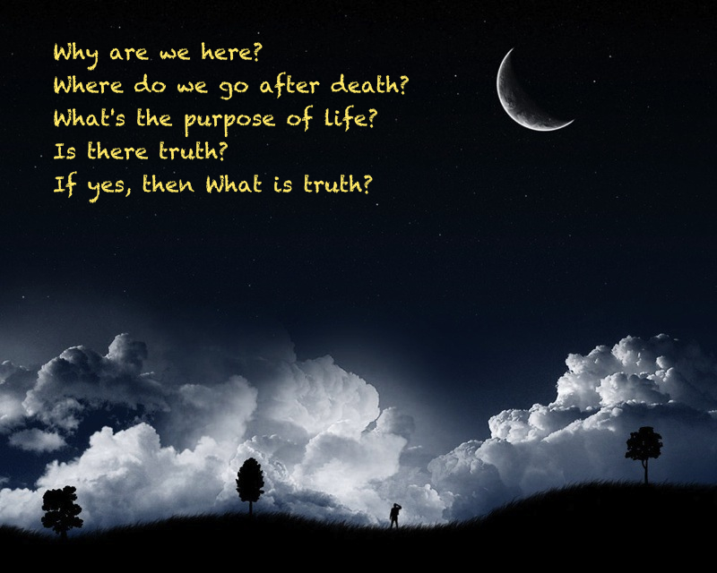
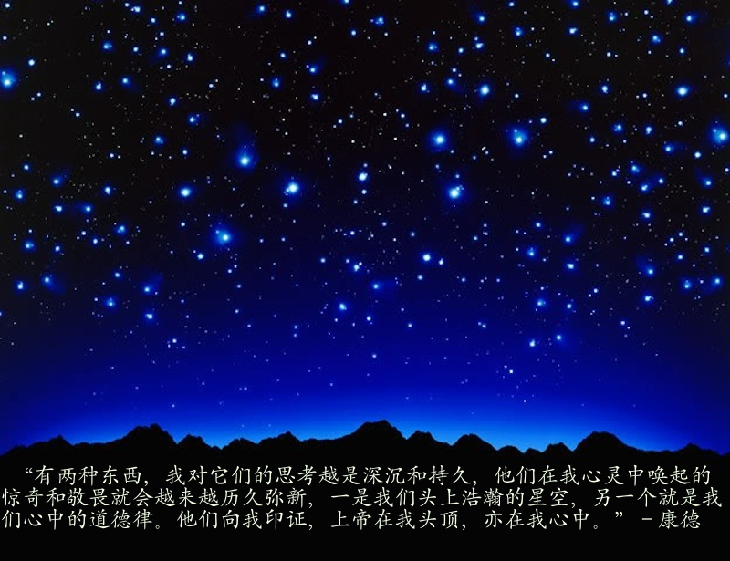
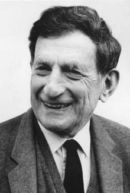
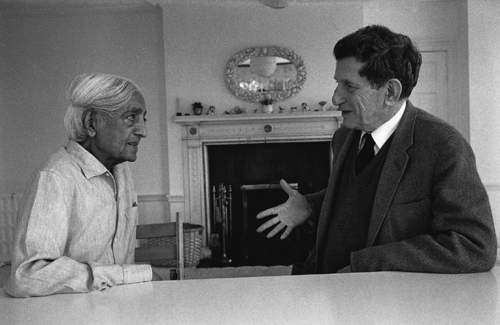
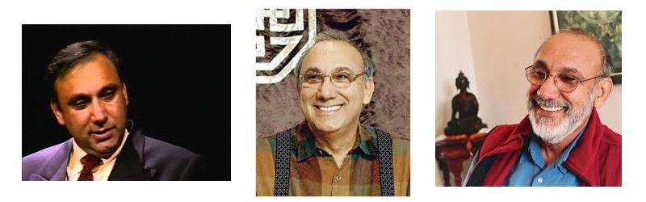

----

## 1. 漫谈对科学／哲学／宗教／人生／宇宙／真理的认识理解：聊聊佛学和心灵学 (目录/引子)
发表于 2014 年 06 月 08 日

 

### 目录：

1. 引子

2. 对宇宙人生好奇者的问题: 哲言隽语与宗教情怀

3. 介绍一下 Jiddu Krishnamurti（吉杜·克里希那穆提）

4. 对科学哲学宗教的总体认识理解

5. 关于真理：一切的源泉，绝对的善爱美，我们永恒完美的故乡。

   - 5.1 关于绝对真理 ：Krishnamurti的论述：绝对的爱美自由智慧

   - 5.2 关于绝对真理：其他宗教哲学古圣先贤的论述

   - 5.3 关于绝对真理：佛教的论述

6. 科学与佛学：关于真实，时间，空间，世界，宇宙，思想，意识。

   - 6.1 现代科学，量子力学和生命中心论

   - 6.2 David Bohm：因果确定性量子力学，整体性，全息宇宙和隐卷序理论

   - 6.3 认知与意识：西方哲学科学的研究概述

   - 6.4 现代生物科学， Rupert Sheldrake， 形态场和形态共振

   - 6.5 佛学的观点：关于世界／宇宙／生命／意识／真实／时间／空间／最后的真实

7. 关于生命：生命的起源奥秘，业力／因果／轮回，自我，人生的意义和人类的前途

   - 7.1 生命的起源，阿赖耶识，业力／因果／轮回。

   - 7.2 生命的奥秘：人体特异功能／西方超心理学，佛教的神通，东方医学神秘学／气／经络／脉轮。

   - 7.3 自我，自由意志，绝对的自由和真我。

   - 7.4 克里希那穆提：自我（self），熏陶（conditioning)和自由(freedom)

   - 7.5 人生的意义与人类的前途

8. 胡因梦对西方身心灵著作的翻译推介

   - 8.1《真理是无路之国》：胡因梦谈她的解脱问道灵修之路

   - 8.2 关于宗教，心理治疗和灵修的访谈：超个人心理学哲学家肯·威尔伯

   - 8.3 A.H.  阿马斯和钻石途径 （AH Almaas and The Diamond Approach)

9. 永嘉大师的《证道歌》和冯达庵先生对净土宗的讲解

10. 结语：回归永恒完美的故乡

  

### 引子
  

蘇芮 -《奉献》: 杨立德词，翁孝良曲

长路奉献给远方， 玫瑰奉献给爱情 ，我拿什么奉献给你， 我的爱人 ？

白云奉献给草场， 江河奉献给海洋， 我拿什么奉献给你， 我的朋友？

我拿什么奉献给你， 我不停的问， 我不停的找， 不停的想 . . . . . .

白鸽奉献给蓝天， 星光奉献给长夜 ，我拿什么奉献给你， 我的小孩？

雨季奉献给大地， 岁月奉献给季节， 我拿什么奉献给你， 我的爹娘 ？

我拿什么奉献给你， 我不停的问， 我不停的找， 不停的想 . . . . . .

有首苏芮唱红的歌曲叫《奉献》，歌词本身就很感人，是一种感恩与奉献的情怀，而不是想得到什么。是呀，我拿什么奉献给你，我的朋友？回想自己这大半生，从一个山村的孩子走到今天，虽然很幸运地赶上了改革开放和出国潮，但在社会潮流的冲击震荡之下，常常觉得自己象汪洋中的一条船，恐惑迷茫，无所适从，只是被潮流推着走而已。孔子说：“三十而立，四十而不惑，五十而知天命。”  但自觉不但三十岁的时候没立起来，四十岁的时候反而更惑了。原来一直是相信科学的，但四十岁时反而连自己喜欢的科研都做不下去了，不得不改行混饭吃。活了大半辈子，自觉一无所长，一事无成，利益他人的事没做多少，能有今天却多亏了父母亲人老师朋友的帮助和恩惠。但我也不认为自己一无是处，想来支撑我一路蹣姗行到今天的一个好处或特点可能就是保持了自小就有的，喜欢追根求底的好奇心或书呆子之气。好像正是这种好奇书呆之气使我从一个山村的孩子考上大学，研究生，出国留学，搞科学研究。这种好奇书呆之气使我对玄虚不切实际的哲学问题感兴趣，初来美国时处境很困难，但读了一本关于一些西方伟大哲学家生平的书后便使我对眼前的困境变得不是太在乎，而度过了那段难关。在四十更惑中年事业危机以后凭这种好奇书呆之气阅读了一些关于科学／哲学／宗教方面特别是佛学及Krishnamurti的书，断断续续已有十年了。“五十而知天命 ”了吗？感觉好像有点明白了。对于“朝闻道，夕死可矣。”／“不以物喜，不以己悲。”／“最平凡的就是最伟大的”等哲语也觉得有了一些理解。

我拿什么奉献给你，我的朋友？这么多年来读网上的文章讨论学到不少东西，现在就想聊聊我对人生宇宙永恒的肤浅理解，也算是一点回馈吧。需要声明的是我对人生宇宙永恒的认识理解是佛学/ Krishnamurti的观点。在我看来，Krishnamurti的观点和佛学相同，只是他用的是现代科学哲学语言，不用任何佛教的宗教术语而已。我不能算真正的佛教徒，没有宗教热情，很少去寺院，觉得佛教对一个认真学佛的人要求太高，学不了，但断续读了十年的科学／哲学／宗教的书，觉得还是佛学／Krishnamurti讲的道理最深最高明，相信佛学／Krishnamurti的道理可以包容并超越现代科学，也可以包容其他宗教，因此我只能算个佛学爱好者和佛教向往者。我原来一直是相信科学的，对佛教佛学感兴趣并不是从信仰开始，而是想看看佛学是如何解释今天的科学还解释不了的世界人生问题。总之，不是来传教的，也没资格传教，只是对生死／人生／宇宙／永恒问题好奇，好奇阅读的结果将我引向佛学，希望我所聊的对有类似科学哲学背景好奇心的网友了解佛学有所助益，特别是对人生宇宙永恒这些大的哲学宗教问题好奇，认真，想进一步探讨的人。以前在论坛讨论线上已大致谈了我的理解，但那时讨论的不系统，引用原文很多，可能不好理解，没说清楚。也曾说过有时间将用尽量通俗易懂的话来聊聊我对人生宇宙永恒的理解，但一直很懒或放纵自己躲避这个比较难的承诺，因为这题目实在太难太费力也太枯燥。前段时间忙着摄影听歌做面点，有点乐不思蜀了。佛学毕竟还是太枯燥，但身体一天天在变老，对生死人生问题不能不理睬。  妻子说你管这些虚无飘缈的东西干什么，几千年来能证明谁搞清楚了，成功了，好好活着就行了，白费这些力气干什么？但我就是对这些问题感兴趣，年龄越大越觉得这些东西重要，这就是每个人个性兴趣爱好的不同了，没有办法的。

南怀瑾先生说学佛可能是天下最难的事，因为它要求一个真正学佛的人必须放弃自我，“做征服天下的英雄易，做战胜自己的圣人难。” 和那些宣传信了就得救的宗教信仰不同，真正学佛必须“信，解，行，证。”，一定是自己的努力为主，自度自救，外力的帮助不是主要的。相信和理解仅仅是第一步，还只是佛学学问的范畴，不算真正学佛。真正学佛必须要修行和实证，这就太难太难了，从佛学角度来说不是一生一世的事业，现代人连轮回来生都不相信，要他为来世修行就更难。即使是真心相信并理解佛教的人也大都是符合下面这句话：“世人都是看得破，忍不过；想得到，做不来。”  “逆水行舟，不进则退。”，不是大智慧大勇猛的人做不到。我自己虽然坚信佛学，但愿力和毅力都差的太远，进步太小，甚至常常觉得退步，今生大概很难有什么成就。但看来看去，对我来说这世界上的确看不到比佛教／Krishnamurti说的更根本深刻的道理。即使今生不会有什么成就，明白这个道理也是非常重要的。孔子说：“朝闻道，夕死可矣。” 明白了佛教／Krishnamurti关于世界人生的道理，也就明白了人生的意义，做人做事就会有一个绝对的善恶标准，而不容易被目前人类社会相对的思潮价值所左右，不再犯大的错误，也就是佛教说的：“随缘消旧业，不再造新怏。” 这是一个很重要很严重的问题，也是我花力气整理这篇文章的原因之一，就是目前很多主流的观点价值在佛教／Krishnamurti看来都是错误的。因此了解一下佛教／Krishnamurti对宇宙人生的看法是会很有益处的，以免在不知不觉种犯了错误，万一佛教／Krishnamurti的观点是正确的呢。在我看来，佛教／Krishnamurti的观点将来被证明是正确的可能性很大呀。

我将大量引用Krishnamurti的观点，尽量避免宗教的术语。Krishnamurti是现代人，他不承认自己属于当今世界任何一种宗教包括佛教（虽然他讲的道理和佛教没什么不同，因为他不想受任何宗教教条的束缚)，他的讲演和写的书用的都是现代科学哲学语言，现代人理解起来不存在时代语言宗教的隔阂。

 

## 2. 对宇宙人生好奇者的问题：哲言隽语与宗教情怀
发表于 2014 年 06 月 08 日

 

《哲言隽语》：

Philosophy is the awareness of man’s minuteness in the great infinite.

It takes a lot of knowledge to understand how little we know.

Things are things —– the riddle lies in man.

Whatever we say a thing is, it is not that. It is both different from that, and more than that (Korzybski).

The Universe is not only queerer than we suppose, but queerer than we can suppose (John Haldane)

Wherever the life is, [the world] bursts into appearance around it (Ralph Waldo Emerson)

“人的灵魂来自一个完美的家园，那里没有我们这个世界上任何的污秽和丑陋，只有纯净和美丽。灵魂离开了家园，来到这个世界，漂泊了很久，寄居在一个躯壳里面，它忘记了自己是从哪里来的，也忘记了家乡的一切。但每当它看到、听到或感受到这世界上一切美好的事物时，它就会不由自主地感动，它就觉得非常舒畅和亲切——它知道那些美好的东西，来自它的故园，那似曾相识的纯净和美好唤醒了它的记忆。于是它的一生都极力地追寻着那种回忆的感觉，不断地朝自己的故乡跋涉。人的生命历程就是灵魂寻找它的美丽故乡的归途。”（柏拉图）

“有两种东西，我对它们的思考越是深沉和持久，他们在我心灵中唤起的惊奇和敬畏就会越来越历久弥新，一是我们头上浩瀚的星空，另一个就是我们心中的道德律。他们向我印证，上帝在我头顶，亦在我心中。”   （康德的墓志铭）

“我们认识到有某种为我们所不能洞察的东西存在，感觉到那种只能以其最原始的形式接近我们的心灵的最深奥的理性和最灿烂的美──正是这种认识和这种情感构成了真正的宗教感情；在这个意义上，而且也只是在这个意义上，我才是一个具有深挚的宗教感情的人。”（爱因斯坦，《我之世界观》，1949）

“关于上帝，我处在不可知论的立场。我深信，一个以使生命得以改善并使之崇高的道德准则为根本的鲜活良知并不需要‘立约者’（注：指通常宗教意义上的上帝），而为奖罚（人类）而工作的‘立约者’尤为多余。” （爱因斯坦，1950写给Berkowitz的信）

“我不相信人格化的上帝，我从未否认这一点，而且都表达得很清楚。如果在我的内心有什么能被称之为宗教的话，那就是对我们的科学所能够揭示的、这个世界结构的没有止境的敬仰。”（爱因斯坦，1954）

“大学之道，在明明德，在亲民，在止于至善。知止而后有定；定而后能静；静而后能安；安而后能虑；虑而后能得。物有本末，事有终始。知所先后，则近道矣。 古之欲明明德于天下者，先治其国；欲治其国者，先齐其家； 欲齐其家者，先修其身；欲修其身者，先正其心；欲正其心者， 先诚其意；欲诚其意者，先致其知；致知在格物。 物格而后知至；知至而后意诚；意诚而后心正；心正而后身修；身修而后家齐；家齐而后国治；国治而后天下平。 自天子以至于庶人，壹是皆以修身为本。其本乱而未治者否矣。其所厚者薄，而其所薄者厚，未之有也！”（《礼记》－ 《大学》）

“道可道，非常道。名可名，非常名。无名天地之始。有名万物之母。故常无欲以观其妙。常有欲以观其徼。此两者同出而异名，同谓之玄。玄之又玄，众妙之门。”   “有物混成先天地生。寂兮寥兮独立不改，周行而不殆，可以为天下母。吾不知其名，强字之曰道。强为之名曰大。大曰逝，逝曰远，远曰反。故道大、天大、地大、人亦大。域中有大，而人居其一焉。人法地，地法天，天法道，道法自然。”（《老子》）

“观自在菩萨，行深般若波罗蜜多时。照见五蕴皆空，度一切苦厄。舍利子，色不异空，空不异色，色即是空，空即是色，受想行识，亦复如是。舍利子，是诸法空相，不生不灭，不垢不净，不增不减。是故空中无色，无受想行识，无眼耳鼻舌身意，无色声香味触法，无眼界，乃至无意识界。无无明，亦无无明尽，乃至无老死，亦无老死尽。无苦集灭道，无智亦无得。以无所得故，菩提萨埵，依般若波罗蜜多故，心无挂碍。无挂碍故，无有恐怖，远离颠倒梦想，究竟涅槃。三世诸佛，依般若波罗蜜多故，得阿耨多罗三藐三菩提。故知般若波罗蜜多，是大神咒，是大明咒，是无上咒，是无等等咒，能除一切苦，真实不虚。故说般若波罗蜜多咒，即说咒曰：揭谛揭谛，波罗揭谛，波罗僧揭谛，菩提萨婆诃。” （《摩诃般若波罗蜜多心经》）

 

唤起宗教情怀的音乐舞蹈：东西方文化在音乐表达上的差别还是很大的：

《Amazing Grace》- André Rieu (in memory of)

《千手观音》

《拉萨行》 黄河曲 杨琴演奏  by 黄河 ：

 

## 3. 简单介绍一下 Jiddu Krishnamurti (1895 – 1986)
发表于 2014 年 06 月 08 日

 

Wiki on Jiddu Krishnamurti: http://en.wikipedia.org/wiki/Jiddu_Krishnamurti

百度－百科： 吉杜·克里希那穆提：http://baike.baidu.com/view/77458.htm

读Krishnamurti的书，觉得就像现代版的佛教。Krishnamurti本人是被当作弥勒菩萨的化身（Theosophical Society 预期降世的World Teacher)发现的, 尽管他后来解散了专门为他的降临成立的组织（The Order of the Star)。他反对任何有组织的宗教，但从来没有否认他是World Teacher，他一生的教化和事迹也和World Teacher没有区别。和他同时代的著名作家Aldous Huxley这样评价：“Hearing Krishnamurti speak was among the most impressive things I have ever heard. It was like listening to a discourse of the Buddha —- such power, such intrinsic authority.”  另一个著名作家萧伯纳（George Bernard Shaw，The Nobel Prize in Literature 1925）称 Krishnamurti  “a religious figure of the greatest distinction” and added, “He is the most beautiful human being I have ever seen.”  今天西方世界的寻求enlightenment的运动在很大程度上是他的影响的余波。When a reporter asked him if he was the Christ, Krishnamurti answered: ” Yes, in the pure sense but not in the traditional  accepted sense of the word.”

不知国内对Krishnamurti的了解如何，今天（2014-6-8）上网查了一下，看到下面这段百度百科上对他的简介：“吉杜·克里希那穆提是近代第一位用通俗的语言，向西方全面深入阐述东方哲学智慧的印度哲人。在二十世纪一度对西方哲学宗教产生过重大的影响，随着互联网信息的革命，其思想近年来才被中国大陆知识分子慢慢熟知，影响力也逐步慢慢扩大。他的一生颇具传奇色彩。被印度的佛教徒肯定为“中观”与“禅”的导师，而印度教徒则承认他是彻悟的觉者。”

 

《Krishnamurti 关于他的使命》：
“I am concerning myself with only one essential thing: to set man free. I desire to free him from all cages, from all fears, and not to found religions, new sects, nor to establish new theories and new philosophies.”

“My function, if I have one, is to make you realize that you are creating illusions and so stimulate you into breaking them. What we have to do, at least what I want to do and I going to do it, is to destroy all the old traditions, the old ideas, the old gods, and the old superstitions created by man, which are unreal, false. I want to establish a new kind of thought, a new kind of life which will automatically translate itself into action, into the way you live, the way you treat others.”

 

《Some simple introduction on Krishnamurti 》:

Krishnamurti was a man who had tremendous compassion, intelligence and insight into the huge problems that human beings face in their daily lives.  As observed by Krishnamurti, these very same problems are caused by our minds being imprisoned by generation upon generation of conditioning.   This conditioning has caused psychological divisions that can lead to violent conflict outwardly, and worse still, serious consequences for the planet in general.

Because of this urgent need to liberate the minds of human beings, Krishnamurti sacrificed the majority of his life traveling the world giving talks and lectures discussing all areas of living, as well as addressing the different emotions that affects us inwardly.  The ultimate goal for Krishnamurti was to encourage human beings to liberate their own minds from divisible man-made conditions imposed by an authority in the forms of accepted traditions in their cultural upbringing, and institutions in society.
According to Krishnamurti, for the human race to have any hope of perpetual peace and harmony one must partake in earnest self-observation and self-analysis of the mind so to develop a deep understanding of its workings in respect of the mechanical operation called ‘thought’.  Through this observational analysis comes simultaneous ‘action’ and ‘transformation’ (it must be noted that ‘psychological time’ is the enemy of man which delays right  ‘action’, as stated by Krishnamurti, hence the need to see, act and transform all in one movement) before we can become sensitive, intelligent and conscious beings.  Otherwise, if we cannot understand and change the inner we will be forever in conflict with ourselves and with others.

Krishnamurti enlightened many thousands of human beings worldwide during his lifetime (he died aged 90 in 1986), talking to people from every conceivable social and cultural backgrounds; from rich to poor, young to old, black to white and beggar to prime minister; he did not discriminate.  But the first most important thing Krishnamurti stressed before giving talks was to state to the audience that he was no teacher who can be depended on to carry them out of their ignorance; but for them to look at him as a mirror or a pointer to truth, so they themselves can do the necessary work towards transformation of the self.

Krishnamurti’s attitude to ‘the teacher’ and ‘teaching’ in general is powerfully expressed in the following quote:
“You must understand it, go into it, examine it, and give your heart and your mind, with everything that you have, to find out a way of living differently. That depends on you, and not on someone else, because in this there is no teacher, no pupil; there is no leader; there is no guru; there is no Master, no Saviour. You yourself are the teacher and the pupil; you are the Master; you are the guru; you are the leader; you are everything.”

 

《The Core of the Teachings》
Written by Krishnamurti in 1980 at the request of his biographer Mary Lutyens.

The core of Krishnamurti’s teaching is contained in the statement he made in 1929 when he said, “Truth is a pathless land”. Man cannot come to it through any organization, through any creed, through any dogma, priest or ritual, not through any philosophical knowledge or psychological technique. He has to find it through the mirror of relationship, through the understanding of the contents of his own mind, through observation and not through intellectual analysis or introspective dissection.

Man has built in himself images as a fence of security—religious, political, personal. These manifest as symbols, ideas, beliefs. The burden of these images dominates man’s thinking, his relationships, and his daily life. These images are the causes of our problems for they divide man from man. His perception of life is shaped by the concepts already established in his mind. The content of his consciousness is his entire existence. The individuality is the name, the form and superficial culture he acquires from tradition and environment. The uniqueness of man does not lie in the superficial but in complete freedom from the content of his consciousness, which is common to all humanity. So he is not an individual.

Freedom is not a reaction; freedom is not choice. It is man’s pretence that because he has choice he is free. Freedom is pure observation without direction, without fear of punishment and reward. Freedom is without motive; freedom is not at the end of the evolution of man but lies in the first step of his existence. In observation one begins to discover the lack of freedom. Freedom is found in the choiceless awareness of our daily existence and activity.

Thought is time. Thought is born of experience and knowledge, which are inseparable from time and the past. Time is the psychological enemy of man. Our action is based on knowledge and therefore time, so man is always a slave to the past. Thought is ever limited and so we live in constant conflict and struggle. There is no psychological evolution. When man becomes aware of the movement of his own thoughts, he will see the division between the thinker and thought, the observer and the observed, the experiencer and the experience. He will discover that this division is an illusion. Then only is there pure observation which is insight without any shadow of the past or of time. This timeless insight brings about a deep, radical mutation in the mind.

Total negation is the essence of the positive. When there is negation of all those things that thought has brought about psychologically, only then is there love, which is compassion and intelligence.

 

＊＊＊＊＊＊＊＊＊＊＊＊＊＊＊＊＊＊＊＊＊＊＊＊＊＊

《YouTube上部分有关Krishnamurti的采访和演讲录像》：

Young Krishnamurti – New York 1928, Ojai 1930

http://www.youtube.com/watch?v=fuRH9dl6LU4

 

Krishnamurti & Bernard Levin: On thought (3 Parts)

http://www.youtube.com/watch?v=M1AvljMbU8c

http://www.youtube.com/watch?v=L6l-bC3m5IU

http://www.youtube.com/watch?v=3761pBMiwaU

 

Krishnamurti, “you are the world”

http://www.youtube.com/watch?v=1Do9Td_NUJ4

 

## 4. 对科学哲学宗教的总体认识理解
发表于 2014 年 06 月 08 日 由 胡沂

 

科学／哲学／宗教，每一个都是皓若烟海，深广无边。尤其在这今天这个知识爆炸，分支越来越细的时代，一个人穷其一生能对某门学问的一个 狭小的分支领域透彻了解有所贡献就已经很了不起了，想对科学／哲学／宗教有一个总体的认识理解似乎是个不可能的事情。庄子说：“吾生也有涯，而知也无涯，以有涯随无涯，殆已。”人的生命是有限的，但所面对的知识却是无限的，要以本来有限的生命，去追求那种永远看不到边的尽头，这样会累死自己的。庄子显然认为以有限对无限既傻又达不到目的。那么能不能从一个不同的角度来看这个问题，对科学／哲学／宗教有一个总体的认识理解评判而不必涉及其中太多的细节呢？这 种可能性是有的，简单地说就是科学／哲学／宗教教义统统都是思想的产物，我们只需对思想的作用，结果和适用范围有一个总体的认识理解就行了。这是在读南怀瑾先生的有关佛学道家的书和Krishnamurti的书时认识到的，也是他们清楚强调指出的。

哲学显然是思想的产物。笛卡尔说：“我思故我在”，意思是说能够思想是有一个“我”这样一个东西存在的不可置疑的证据，其他的都是可以怀疑的，这个 推论成了推导演绎出他的整个哲学体系的出发点。其他哲学体系，即使是认为思想不过是物质附属物的唯物哲学，显然也都是哲学家思考后的产物。哲学家艺术家最初的灵感或许不是一般所说的思想，但一旦形驻语言文字图像逻辑演绎这些思想载体，就已经处在是思想的范畴了，哲学家艺术家之外的读者欣赏者所接触到的不过是思想的产物罢了。宗教教义也是类似的情形，最初创教者的忘我的感悟或许不是一般所说的思想，但一旦形成语言文字就是普通的思想了。当然，宗教有它特殊的 地方，极少数的宗教修行有成就者通过宗教修行方法有可能认证到最初创教者的不属于语言文字思想的忘我的感悟。东方的宗教如佛道教印度教比较强调这种超越思想自我的感悟，但能达到这种感悟的人少之又少，因此绝大多数信徒还是停留在思想的范畴。而那些纯以信仰为主不强调忘我修行的宗教，就更是处在思想的范畴 了。

科学由西方哲学脱胎而来，自然也属于思想的范畴，尽管是一种有着严密高深的逻辑思维工具（如数学）的思想体系。西方的哲学家主要在自我的意识里面进行尽可能客观的逻辑思辨，靠逻辑思维构造了一个又一个的哲学体系，但又无法检验各个哲学体系的真假，最后产生了科学方法－－可以检验重复的物质科学。物质科学的巨大成就使得人们相信将来只要科学发展，一切都会搞清楚，我原来也相信这种说法，但对科学的方法进展了解深了以后，觉得这只是一种乐观的信仰，现代一些理论物理学家想要发现一个能解释一切的理论或公式便是这种信仰的例证。如果跳出自己局限的知识领域，对科学主要领域的总体进展和前沿有所了解，就 不会被科学技术的表面上的飞速进展迷昏了头，乐观地认为假以时日，科学可以发现真理，解释一切。事实上科学局限于可重复的物质领域，对不可或不容易重复的生命社会精神现象无法研究或效力不大，即使在可重复的物质领域也面临理论上的巨大危机。例如现代物理学揭示了用科学获取知识的极限：在宏观上无法知道物质 宇宙产生以前的知识，只可用理论和公式推测，主要依赖数学，但数学真是绝对的吗？好象不是，因为几乎没有无前提的数学定理，若前提错了推论再严密也不会和 事实相符。事实上Godel的不完备定理（Godel’s Incompleteness Theorem)已经证明了任何数学系统方法理论公式都是不完备的，有局限的，不可能获得完全无疑的知识。 在微观量子世界实验者已无法独立于试验对象而获得客观全面的知识，现代天文宇宙学也揭示出现代科学理论的局限：这个宇宙中的能量70%是无法测知的黑能量，约26%是看不见的黑物质，只有大约4%是我们所熟悉的可见物质，也就是说现有的科学理论无法解释宇宙中占96%的能量。在生命科学方面，对于生命和意识的起源这些根本问题都所知甚少，现有的基于唯物主义的理论很难让人满意。比如在分子生物学，人及很多动植物的基因库已被测序，但这反而挑战了DNA是生命本质的主流思想。在神经科学，也有越来越多的证据提示意识（consciousness) 并不象通常所认为的是由大脑产生的。

上面分析了科学／哲学／宗教教义统统都是思想的产物，下面我们看一下思想的作用，结果和局限性。毫无疑问，思想的作用是巨大的，人类的一切活动都在思想的指导下进行。在今天的世界上，生活中，思想理论的作用无处不在，几乎重要到无以复加的地步。科学思想理论的发展使得人类可以登月潜洋，发明各种机器技术，人类的物质生活得到极大的进步，同时大规模杀伤武器也可以毁灭整个人类和地球。社会思想理论可以引起社会变革，天翻地覆，血流成河。以宗教教义，爱 国主义，人道主义以及任何主义的名义进行的战争也都是思想。但佛教却说所有的思想都是妄想，Krishnamurti 说思想永远是片面渺小的，思想发明各种各样的Utopia/理想国／政体来试图解决人类的问题，但由于思想的局限片面性，总会产生矛盾冲突，解决一个问题的时候会引起另外的问题，在思想的范围内永远解决不了人类所面临的问题，也正是这些片面的思想理论才造成了今天世界上的各种问题。 思想在过去没有解决人类的问题，将来也不会。

为什么说思想永远是片面渺小的？Krishnamurti 说思想来源于记忆，记忆是经历和知识的积累，这需要时间；经历和知识都是有限的，因此记忆是有限的，思想是有限的。思想是属于时间的，属于过去，因为记忆是过去发生的东西，尽管思想可以想象预期投射未来，但那仍然是基于过去的想象。思想永远是不自由的，总是受过去的记忆／经历／知识的束缚，总是和真实有距离，因为真实是鲜活常新的。思想总是在测量，比较，分别，评判，想象，永远无法超越自己而发现那不可测的真理或真实。总之思想是有限的，片面的，基于过去的，机械的，无生命力的，无实体的，仅是一个用来理解真实的抽象的工具符号语言图像。即使思想理论在某一方面正确预测描述了真实，比较实用，它也仍然不是当前鲜活的真实，正像一个城市的地图和它所绘的城市不能等同一样，一幅树的画或照片不是那棵真实存在的树一样。说思想永远是渺小的是说当有限的思想理论试图了解无限的真实／真理时，它就变得非常渺小。佛教在谈到以思想来面对无限的真实／真理时，也是同样的说法：“穷诸玄辨，若一毫置于太虚；竭世枢机，似一滴投于巨壑。”

如果说思想来自于过去的记忆／经历／知识，那些不可能来自过去的全新的科学发现或技术／艺术又是从哪里来呢？这来自神秘的创造性，也就是人们平常所说的灵感／灵光／顿悟。灵感／灵光／顿悟本身或最初并不是我们通常所说的思想，它只有在思想停止时才会显现，而灵感一旦变成语言作品公式理论等等这些思想载体，就进入思想的范畴，就成为过去了，就变成机械的，灰色的了。

在思想时间之外，在知识的尽头，有一个语言文字无法描述的神圣的东西。它是一切一切的源泉，哲学家科学家叫它真理／本体／最后的真实，宗教家叫它上帝／佛／道／等等神圣的名字，它是绝对的真善美，是极乐，是无分别的慈悲大爱／美／智慧整体。佛教说那就是我们的本来面目，我们永恒完美的故乡。Krishnamurti和佛道教等都一再强调：任何思想的东西，不管多么深奥精密，都不可能接触到这个神圣的东西（就叫它真理吧），因为它是思想时间以外的东西，只有思想停止后人们才有可能体验到它，但同时思想又是我们这个世界中人际交流必需的工具，因此任何思想的东西（包括科学理论，宗教教义）都只能 是指向真理的标签，是指向月亮（比喻为真理）的手指，而不是真理本身。思想可以描述或造神，并且已经描述和造了很多神，但都不可能和那个真正神圣的东西是一回事。

“理论是灰色的，唯有生命之树常青。” 生命之树的根是那个思想时间之外的永恒常新的神圣的东西。

 
—————————————————————————————————————————————————————————
附一些参考资料： 

《Krishnamurti & Bernard Levin: On thought (3 Parts)》

On thought Part I

On thought Part II

On thought Part III

 

《Krishnamurti 关于灵感或洞见（insight)》

What is insight, then? We are saying insight can take place only when knowledge has come to an end and there is pure observation without any direction . . . and that insight is not the result of constant examination, constant analysis, examining day after day; it is sudden cessation of all knowledge and seeing something directly. That insight brings about a fundamental change in the very brain cells themselves that carry memory.

*******************************************

Insight is not a remembrance, is not a calculated, investigated result; it is not a process of recording and acting from that, and it is no longer the activity of thought, which is time. Insight therefore is the action of a mind that is not caught in time.

******************************************
This constant insight without a formula, without a conclusion that puts an end to that insight, is creative action. It is astonishingly beautiful and interesting how thought is absent when you have an insight. Thought cannot have an insight. It is only when the mind is not operating mechanically in the structure of thought that you have an insight . . . Having an insight and never drawing a conclusion from it so that you are moving constantly from insight to insight, action to action, is spontaneity; . . . a mind that is free has insight every minute; a mind that is free has no conclusions and is therefore nonmechanical (也就是说此时已是无为而无不为的境界了）. . . There is security in insight, not in conclusion.

《Krishnamurti 关于科学和宗教》
Science really means the cultivation of knowledge, doesn’t it? Science is what has brought about the present state of the tension in the world for it has put together the most destructive instrument that man has ever found. It can wipe out whole cities at one blow, millions can be destroyed in a second. A million human beings can be vaporized. And science has also given us a great many beneficial things —- communications, medicine, surgery and innumerable small things for the comfort of man, for an easy way, of life in which human beings need not struggle endlessly to gather food, cook and so on. And it has given us the modern deity, the computer. One can enumerate the many, many things that science has brought about to help man and also to destroy man, destroy the entire world of humanity and the vast beauty of nature. Government are using scientists, and scientists like to be used by government for then they have a position, money, recognition and so on. Human beings also look to science to bring about peace in the world, but it has failed, just as politics and the politicians have failed to give them total security, peace.

And religions —- the accepted, traditional, superficial religions, creeds and dogmas —- have brought about great damage in the world. They have been responsible for wars in history dividing man against man —- one whole continent with very strong beliefs, rituals, dogmas against another continent which does not believe the same things, does not have the same symbols, the same rituals. This is not religion, it is just repetition of a tradition, of endless rituals that have lost meaning except that they give some kind of stimulus; it has become a vast entertainment. Religion is something entirely different. We have often spoken about religion. The essence of religion is freedom, not to do what you like, that is too childish, too immature and too contradictory, bringing great conflict, misery and confusion. Freedom again is something entirely different. Freedom means to have no conflict, psychologically, inwardly. And with freedom the brain becomes holistic, not fragmented in itself. Freedom also means love, compassion, and there is no freedom if there is no intelligence. Intelligence is inherent in compassion and love.

And science is knowledge. Knowledge can expand endlessly, but that knowledge is always limited because knowledge is based on experience and that experience may be a theoretical, hypothetical result. Knowledge is necessary but as long as science is the activity of a separate group, or a separate nation, which is tribal activity, such knowledge can only bring about greater conflict, great havoc in the world, which is what happening now. Science with its knowledge is not for destroying human beings because scientists after all are human beings first, not just specialists; they are ambitious, greedy, seeking after their own personal security like all the other human beings in the world. They are like you and another. But their specialization is bringing great destruction as well as some benefit. The last two great wars have shown this. Humanity seems to be in a perpetual movement of destruction and building up again —- destroy and build; destroy human beings and give birth to a greater population. But if all the scientists in the world put their tools down and said, ‘We will not contribute to war, to destroying humanity’, they could turn their attention, their skills, their commitment to bring about a better relationship between nature, environment and human beings.

If there is some peace among a few people, not necessarily the elite, will employ their skills to bring about a different world, then religion and science can go together.

Religion is a form of science. That is, to know and to go beyond all knowledge, to comprehend the nature and immensity of the universe, not through a telescope, but the immensity of the mind and the heart. And this immensity has nothing whatsoever to do with any organized religion. How easily man becomes a tool of his own belief, his own fanaticism, committed to some kind of dogma which has no reality. No temple, no mosque, no church, holds truth. They are symbols perhaps but symbols are not the actual. In worshipping a symbol you will lose the real, the truth. But unfortunately the symbol has been given far greater importance than truth. One worships the symbol. All religions are based on some conclusions and beliefs, all beliefs are divisive, whether political beliefs or religious. Where there is division there must be conflict.

True religious spirit goes far beyond all knowledge, which is perhaps the very end of knowledge —- not perhaps —- it is the end of knowledge. For there must be freedom from knowledge to understand that which is eternal, which is timeless. Knowledge is time, and religion is free from the bondage of time.

 

## 5. 关于绝对真理：一切的源泉，绝对的善爱美，我们永恒完美的故乡。

 

###   5.1 关于绝对真理：Krishnamurti的论述：绝对的爱美自由智慧

发表于 2014 年 06 月 14 日

在上节的结尾处说到：“在思想时间之外，在知识的尽头，有一个语言文字无法描述的神圣的东西。它是一切一切的源泉，哲学家科学家叫它真理／本体／最后的真实，宗教家叫它上帝／佛／道／等等神圣的名字，它是绝对的真善美，是极乐，是无分别的慈悲大爱／美／智慧整体。佛教说那就是我们的本来面目，我们永恒完美的故乡。” 真有这样一个超越思想语言知识时间的产生了一切的神圣绝对的真理吗？

Krishnamurti斩钉绝铁地说有，请看下面这段他（K)和David Bohm (B)的对话：
There is Something Sacred, Untouched by Man (from ‘The Wholeness Of Life’; pages 135-136; J. Krishnamurti; HarperCollins, New York; 1979).

• [K]: ‘ There is something sacred, untouched by man – in the sense of being untouched by his mind, by his cravings, by his demands, by his prayers, by his everlasting chicanery. And that may be the origin of everything, which man has misused – you follow?
’

• [B]: ‘If you say the origin of all matter, all nature … .’

• [K]: ‘Everything, all matter, all nature.’

• [B]: ‘All of mankind.’

• [K]: ‘Yes. That’s right, sir.’

他之所以这样说，是因为他亲身体验了这神圣的真理，他通常把它叫做 God/Truth/ Love/Compassion/Eternal Beauty/Bliss/total freedom/Intelligence:
"… To discover God or truth – and I say such a thing does exist, I have realized it – to recognize that, to realize that, mind must be free of all the hindrances which have been created throughout the ages"

"I was supremely happy, for I had seen. Nothing could ever be the same. I have drunk at the clear and pure waters and my thirst was appeased. …I have seen the Light. I have touched compassion which heals all sorrow and suffering; it is not for myself, but for the world. …Love in all its glory has intoxicated my heart; my heart can never be closed. I have drunk at the fountain of Joy and eternal Beauty. I am God-intoxicated."

"The moment you have in your heart this extraordinary thing called love and feel the depth, the delight, the ecstasy of it, you will discover that for you the world is transformed."

怎样才能找到绝对真理或上帝？怎样才能确定所体验到的不是幻觉幻想呢？ Krishnamurti说要发现真理首先要去掉一切幻象。什么是幻象? 幻象就是脱离真实 （moving away from ‘What is’)所产生的东西。然而我们所知的现实（reality)是通过感官思想构造的（’Thought has created reality’) ，并不是真正的原生态的真实 （’what is’），思想是很有能力创造无穷无尽的幻象的。科学家用思想从外部的物质世界寻求真理，科学方法可以帮助验证去除一些幻象，因为思想（包括科学方法在内）总是相对的，所发现的东西也就总是相对的。一个不再产生幻象的头脑可以向内探求真理，从观察自己的思想活动开始，思想也是物质的，一个不再产生幻象的头脑才可能体验超越物质的东西。探求真理需要贡献人的整个一生，而不是脱离开生活。只有在经历和理解了生命生活中的酸甜苦辣以后，你才有可能发现这个叫绝对真理的东西。

First of all, one has to understand what reality is. What is reality? That which you perceive, that which you touch, that which you taste, when you have pain, and so on. So reality is sensation and the reaction to that sensation, the response to that sensation as idea, and that idea is created by thought. So thought has created reality—-the marvelous architecture, the great cathedrals of the world, the temples, the mosques, and idols that are put in them, the images, all are created by thought. And we say, that is reality, because you can touch it, you can taste it, you can smell it.

So we are saying that all the things that thought has created—-the knowledge, the acquisition of knowledge through science, through mathematics, and so on—-are reality. But nature is not created by thought. That tree, the mountains, the rivers, the waters, the deer, the snake, is not created by thought; it is there. But out of the tree we make a chair, that’s created by thought. So thought has created the actual world in which we live, but nature, including the environment, is obviously not created by thought.

Then we ask, is truth reality? One perceives that thought has created the world in which we live, but thought has not created the universe. Thought can inquire into the universe. The cosmologist, the astrophysicists, pursue their inquiry through thought, and they will come to certain conclusions, certain hypotheses, and try to prove those hypotheses, always through thought. So thought is relative, and therefore, whatever it creates, in whatever direction it moves, it must be relative, it must be limited.

只有一个健全无损伤／丰富而天真／清澈而敏感的大脑心灵才能发现真理，只有对生命自然敏感热爱的人才能接近上帝。 真理的本性是仁慈，爱和美。无分别的慈悲仁爱之心是与真理相应的前提，必由之路：

"Truth, the real God – the real God, not the God that man has made – does not want a mind that has been destroyed, petty, shallow, narrow, limited. It needs a healthy mind to appreciate it; it needs a rich mind – rich, not with knowledge but with innocence – a mind upon which there has never been a scratch of experience, a mind that is free from time. The gods that you have invented for your own comforts accept torture; they accept a mind that is being made dull. But the real thing does not want it; it wants a total, complete human being whose heart is full, rich, clear, capable of intense feeling, capable of seeing the beauty of a tree, the smile of a child, and the agony of a woman who has never had a full meal. You have to have this extraordinary feeling, this sensitivity to everything – to the animal, to the cat that walks across the wall, to the squalor, the dirt, the filth of human beings in poverty, in despair"

"To have compassion means to have passion for all things, not just between two people, but for all human beings, for all things of the earth, the animals, the trees, everything the earth contains. When we have such compassion we will not despoil the earth as we are doing now, and we will have no wars."

“真理是无路可达之域”。任何组织，教条，神父，宗教仪式，哲学知识或心理技术等等思想的东西都不可能达到它。只有不再受宗教教条，思想权威，个人的或社会的习惯习俗影响时，既思想停止，放下一切时才有可能体验它。

“Truth is a pathless land”. Man cannot come to it through any organization, through any creed, through any dogma, priest or ritual, nor through any philosophical knowledge or psychological technique. He has to find it through the mirror of relationship, through the understanding of the contents of his own mind, through observation, and not through intellectual analysis or introspective dissection. Man has built in himself images as a sense of security—religious, political, personal. These manifest as symbols, ideas, beliefs. The burden of these dominates man’s thinking, relationships and his daily life. These are the causes of our problems for they divide man from man in every relationship.”

＊＊＊＊＊＊＊＊＊＊＊＊

Religion is the frozen thought of men out of which they build temples 。

＊＊＊＊＊＊＊＊＊＊＊＊

All ideologies are idiotic, whether religious or political, for it is conceptual thinking, the conceptual word, which has so unfortunately divided man.

＊＊＊＊＊＊＊＊＊＊＊＊

All authority of any kind, especially in the field of thought and understanding, is the most destructive, evil thing. Leaders destroy the followers and followers destroy the leaders. You have to be your own teacher and your own disciple. You have to question everything that man has accepted as valuable, as necessary.

————————————————————————————————————————————————————
《Krishnamurti关于亲身体验真理》

Krishnamurti 从1961年六月起开始keep a daily record of his perceptions and states of consciousness. 他在下面的这篇日记中描述了他对真理（Truth, 最后的真实）的亲身体验。在这里他把真理（Absolute Truth, 最后的真实）称为“the otherness” or “the unknowable” or “the immeasurable” or “that immensity”. 他讨论了大脑的功能，思想的作用等。结论是：思想是永远渺小的，永远达不到真理！

Krishnamurti’s Notebook: page 143-147. October 20th, 1961

It had been a very hot day and in the hot hall with a large crowd, it was suffocating. But in spite of all this and tiredness, woke up in the middle of the night, with the otherness in the room. it was there with great intensity, not only filling the room and beyond but it was deep down within the brain, so profoundly that it seemed to go through and beyond all thought, space and time. It was incredibly strong, with such energy that it was impossible to be in bed, and on the terrace, with fresh, cool wind blowing, the intensity of it continued. It went on for nearly an hour, with great force and drive; all the morning it had been there. It is not a make-believe, it is not desire taking this form of sensation, excitement; thought has not built it up from past incidents; no imagination could formulate such otherness. Strangely every time this takes place, it’s something totally new, unexpected and sudden. Thought, having tried, realizes that it cannot recall what had taken place at other times nor can it awaken the memory of what had taken place this morning. It is beyond all thought, desire, and imagination. It is too vast for thought or desire to conjure it up; it is too immense for the brain to bring it about. It’s not an illusion.

The strange part of all this is that one’s not even concerned about all this; if it comes, it is there, without invitation, and if it doesn’t, there is an indifference. The beauty and the strength of it is not to be played with; there’s no invitation or denial of it. It comes and goes, as it will.

Early this morning, somewhat before sunrise, meditation, in which every kind of effort has long ago ceased, became a silence, a silence in which there is no center and so no periphery. It was just silence. It had no quality, no movement, neither depth or height. It was completely still. It is this stillness that had movement expanding endlessly and the measurement of it was not in time and space. This stillness was exploding, ever moving away. But it had no center; if there was a center, it would not be stillness, it would be stagnant decay; it had nothing whatsoever to do with the intricacies of the brain. The quality of the stillness which the brain can bring about, is entirely different, in every way, from the stillness that was there this morning. It was a stillness that nothing could disturb, for it had no resistance; everything was in it and it was beyond everything. The early morning traffic of lorries bringing foodstuff and other things to the town, in no way disturbed that stillness nor the revolving beams of light from the high tower. It was there, without time.

As the sun rose, a magnificent cloud caught it, sending streaks of blue light across the sky. It was light playing with darkness and the play went on till the fantastic cloud went down behind the thousand chimneys. How curiously petty the brain is, however intelligently educated and learned. It will always remain petty, do what it will, it can go to the moon and beyond or go down into the deepest parts of the earth; it can invent, put together the most complicated machines, computers that will invent computers; it can destroy itself and recreate itself but do what it will, it will ever remain petty. For it can only function in time and space; its philosophies are bound by its own conditioning; its theories, its speculations, are spun out of its own cunningness. It cannot escape from itself, do what it will. Its gods and its saviors, its masters and leaders are as small and petty as itself. If it is stupid, it tries to become clever and its cleverness is measured in terms of success. It is always pursuing or being chased. Its shadow is its own sorrow. Do what it will, it will ever remain petty.

Its action is the inaction of pursuing itself; its reform is action that ever need further reform. It is held by its own action and inaction. It never sleeps and its dreams are the awaking of the thought. However active, however noble or ignoble, it is petty. There is no end to its pettiness. It cannot run away from itself; its virtue is mean and its morality mean. There is only one thing it can do — be utterly and completely quiet. This quietness is not sleep or laziness. The brain is sensitive and to remain sensitive, without its familiar self-protective responses, without its customary judgements, condemnations and approval, the only thing it can do is to be utterly quiet, which is to remain in a state of negation, complete denial of itself and its activities. In this state of negation, it’s no longer petty, then it is no longer gathering to achieve, to fulfil, to become. It is then what it is, mechanical, inventive, self-protective, calculating. A perfect machine is never petty and it functions at that level it is a wonderful thing. Like all machines, it wears out and dies. It becomes petty when it proceeds to investigate the unknown, that which is not measurable. Its function is in the known and it cannot function in the unknown. Its creations are in the filed of the known but the creations of the unknowable it can never capture, neither in paint nor in word; its beauty it can never know. Only when it is utterly quiet, silent without a word and still without a gesture, without movement, there is that immensity.

————————————————————————————————————————————————————
《Krishnamurti关于Love / Beauty / Freedom：什么是爱和美？相对的善恶／情爱／美丑，绝对的善爱美。》

Krishnamurti对很多常用词的定义和我们所熟知的主流社会的说法不同，例如Love and Freedom。他说这两个词已被严重滥用了: 他说把所有大家认为是Love或Freedom的东西否定完了剩下的才是Love 或Freedom。对美（Beauty）的定义也是类似情形。在这里Krishnamurti是从绝对真理的角度来解释这些名词，而我们所熟知的是人类社会随时代地域社会文化等等变化的相对的善恶／情爱／美丑／自由，由此可见当前社会的主流观点已偏离真理很多，整个人类都病的不轻。老子说：“天下皆知美之为美，斯恶矣；皆知善之为善，斯不善已。” 也是说当前大家都认为是美善的东西从真理本体的角度看来是丑恶的。从绝对真理的角度，一切符合或有利真理显现的东西行为都是善，反之一切违背或阻碍真理显现的东西行为就都是恶。绝对的爱是无分别的大爱，象耶稣的博爱，佛菩萨的大慈悲，开悟者所体验到的怨亲平等无分别的大爱。在Krishnamurti的解释里，Love / Beauty /Compassion / Freedom / Intelligence 都是真理这个整体的不可分割的不同侧面。无分别无自我时才能感知真正的美和爱，美的本质是爱。绝对的自由和爱／慈悲是一回事。没有自由就不会有智慧，而智慧是由慈悲和爱而来。

《Krishnamurti on Love》
What is love? We are not discussing theories of what love should be. We are observing what we called love. Is love pleasure? Is love jealousy? Can a man love who is ambitious? Can a man love who is competitive? And you are all competitive, you want a better job, better position, better house, a image of yourself. Can you love when you go through all this tyranny, when you dominate your wife, your husband, your children? When you are seeking power, is there a possibility of love?

In negating what is not love, there is love. You have to negate everything that is not love, which means no ambition, no competition, no aggression, no violence either in speech, act, or thought. When you negate that which is not love, then you know what love is. And love is something that is intense, that you feel strongly; love is not pleasure.

《Krishnamurti on Beauty》
Look at something which you have seen which is actually marvelously beautiful: a statue, a poem, a lily in the pond, or a well-kept lawn. And when you see such a piece of beauty – no, no, when you see such, not piece – when you see such beauty what takes place? 

At that moment, the very majesty of a mountain makes you forget yourself. Right? Have you ever been in that position? When you have seen that you don’t exist, only that grandeur exists. But a few seconds later or a minute later the whole cycle begins, the confusion, the chatter. 

So beauty is where you are not. Have you understood this? Do you understand, sir? Oh, what a crowd! The tragedy of it. Truth is where you are not. Beauty, love is where you are not. Because we are not capable to look at this extraordinary thing called truth.

《Krishnamurti:   On Appreciating Beauty》
I think it is essential to appreciate beauty. The beauty of the sky, of the sun upon a hill, the beauty of a smile, face, gesture, the beauty of moonlight on water, of fading clouds, the song of a bird, it is essential to look at it, to feel it, to be with it. I think this is the very first requirement for a man who would seek truth. Most of us are so unconcerned with this extraordinary universe about us: we never even see the weaving of a leaf in the wind; we never watch a blade of grass, touch it with our hand and know the quality of its being. This is not just being poetic, so please do not go off into a fanciful, emotional state. I say it is essential to have that deep feeling for life and not caught in intellectual ramifications, discussions, passing examinations, quoting and brushing something new aside by saying it has already being said. Intellect is not the way. Intellect will not solve our problems; the intellect will not give us that nourishment which is imperishable. The intellect can reason, discuss, analyze, come to a conclusion from references and so on, but intellect is limited because it is the result of our conditioning. But sensitivity is not. Sensitivity has no conditioning; it takes you right out of the field of fears and anxieties. The mind that is not sensitive to everything about it —- to the mountain, the telegraph pole, the lamp, the voice, the smile, everything —- is incapable of finding what is true.

Without love, which is really the very essence of beauty, do what you will —- go on all the pilgrimages in the world, go to every temple, cultivate all the virtues you can think of —- you will get nowhere at all. Please believe me, you will not have it, (without) that sense of beauty and love, even if you cross-legged for meditation, holding your breath for next ten thousand years. you laugh, but you do not see the tragedy of it. We are not in that sensitive state of mind which receives, which sees immediately something that is true. You know, a sensitive mind is a defenseless mind, it is a vulnerable mind, and the mind must be vulnerable for the truth to enter. It is essential then to have this sense of beauty, for the feeling of beauty is the feeling of love.

《Krishnamurti on Freedom》
Freedom again is something entirely different. Freedom means to have no conflict, psychologically, inwardly. And with freedom the brain becomes holistic, not fragmented in itself. Freedom also means love, compassion, and there is no freedom if there is no intelligence. Intelligence is inherent in compassion and love.

 

### 5.2 关于绝对真理：其他宗教哲学古圣先贤的论述
发表于 2014 年 06 月 14 日 由 胡沂

上节介绍了Krishnamurti对超越思想时间的／产生了一切的绝对真理的解释描述，这产生了一切的绝对真理当然应该只有一个，为什么各种宗教哲学对这同一个东西的描述理解却差别那么大呢？哲学家可以用思想逻辑建立各种各样对真理的理论学说，但因为绝对真理不是思想可及的，不能用思想的方法检验，思想又很容易产生各种幻象，虽然不能说各种有关真理的哲学思想体系都没有真知灼见，但最终也不过徒增添思想混乱而已。能够超越思想而能真正体验真理的古圣先贤所体验的真理当然是同一个真理，因为真理只有一个，然而由于每个悟道者感悟真理的深浅不同和描述的侧重点不同，再加上真理本来就不是语言文字所能描述清楚的，悟道者对真理的描述对听者来说好像会有所不同，尽管实际上只有一个真理。这种不同在那个真正悟道者在世时还可以加以解释纠偏，消除误解，但若悟道者已辞世而其描述教导被并未亲身体验真理的学生徒弟按自己的理解改编形成宗教教义，那就和哲学家的东西类似了，年代久了，有可能那悟道创教者再复活的话都认不出那是他的教导了。真正悟道的古圣先贤知道语言文字的局限性，便会告诫弟子这一点而强调每个人自己证悟真理的重要，如佛陀便强调他的教导只是指向真理的手指或渡河的船，只是个标签或工具，不是真理本身。但是现在显然有很多违背佛陀教导的迷信的东西都被不了解佛教真义的僧人俗人当成佛教。还有一些宗教可能创教者本身就没有真正悟道，因此这种宗教对真理的理解一开始就是错的。

《金刚经》说：“一切圣贤，皆以无为法而有差别。”，意思是说真正悟道的古圣先贤因对形而上的真理（无为法）体验的深浅不同和描述的侧重点不同而对真理的描述看起来不同，但真理只有一个。在中国文化里，儒道佛已融为一体，因为它们在本质上相通。老庄道家的形而上的绝对真理“道”和佛教的绝对真理“空性／真如／如来等等名称”很相同相通，因此佛经常用道家的词汇来翻译， 也和Krishnamurti描述的绝对真理一致。 下面引的两段《老子》可以帮助这种理解。翻译解释是根据南怀瑾先生的《老子他说》而来。

＊＊＊＊＊＊＊＊＊＊＊＊＊＊＊＊

“道可道，非常道。名可名，非常名。无，名天地之始。有，名万物之母。故常无，欲以观其妙。常有，欲以观其徼。此两者同出而异名，同谓之玄。玄之又玄，众妙之门。”

｛“道” 或真理不是一般的常道，不可执着言语名相而寻道。本无（类似佛家的空）是天地的原始，有生于无，无中生有（现代宇宙学也说宇宙产生于空），妙有是万物的来 源。在形而下的情况下而要体认形而上道，必须从常无的境界中去体认它的道体。但是如要更透彻精辟，又需要在常有之中领悟它的无边无际。“有”“无”二者是 一体同源，因为作用与现象不同，必须以不同的命名加以分别，二者都很玄妙。有无相生，真是妙中有妙，妙到极点更有妙处。 ｝

＊＊＊＊＊＊＊＊＊＊＊＊＊＊＊＊

“有物混成先天地生。寂兮寥兮独立不改，周行而不殆，可以为天下母。吾不知其名，强字之曰道。强为之名曰大。大曰逝，逝曰远，远曰反。故道大、天大、地大、人亦大。域中有大，而人居其一焉。人法地，地法天，天法道，道法自然。”

｛有个先于天地万物的东西，它清虚寂静，广阔无边，无形象声色，超越于一切万有之外，不因物理世界的生灭而生灭，它无所不在，永远无穷无尽，遍一切处。它是宇宙一 切万有的来源根本，具足一切的可能性，实在很难用一般世间的语言文字来形容，姑且叫它做“道”。“道”无量无边，所以也叫做“大”，大也就是“逝”， 等于说宇宙是无限的扩张，无量无边，无穷无尽，遍一切处，其实最远和最近的没有区别，道就在每个人的自身上，片刻不离，远在天边，近在眼前，故曰：“逝曰 远，远曰反。”在这个无穷无尽的宇宙中，有道／天／地／人这样四个最主要的，关键性的东西，而人是其中之一。宇宙的运行法则是人效法大地，大地则依法于天，天则要效法道，而道的本身是绝对性的，它是本来“自然”如此，法尔如是，不需要效法谁。｝

＊＊＊＊＊＊＊＊＊＊＊＊＊＊＊＊

孔子没有多讲绝对真理如何产生形而下的万物这些玄奥的东西（如“未知生，焉知死” “子不语怪、力、乱、神。”），而是着重于人的行为思想怎样符合“道”或绝对真理这样一些伦理的东西。孔子本身应该是悟道的，他说的“仁”／明德／至善就是对绝对真理的说明。他整理了《易经》，说自己“七十从心所欲不逾矩”，相当于佛家的悟道“得大自在”，既一切心思行为都合乎道或绝对真理，孔门有四毋之训——毋意（不坚持自己原先的意见）、毋必（不要求一件事必然要做到怎样的结果，能适应变通）、毋固（不固执自己的成见）、毋我（忘我，为他人着想，专为事着想），和佛教“破我法二执”而达一切平等的道理是一致的。《大学》里的“大学之道，在明明德，在亲民，在止于至善。知止而后有定；定而后能静；静而后能安；安而后能虑；虑而后能得。物有本末，事有终始。知所先后，则近道矣。” 指出了接近道或明白道的程序次第（南怀瑾先生说和佛教说法相同），在实际生活中修身齐家治国平天下，做好人的本分，相当于五乘佛教（人乘，天乘，小乘，缘觉乘和大乘）里的人乘，也就是入佛的基础，如果连人都做不好的话是不可能学好佛的。梁漱溟先生说儒佛两家之学均为人类未来文化在古代东方出现之早熟品，它们教育人在人生中依循道或真理生活，但可惜儒学后来被统治者利用产生了三纲五常的封建礼教，南怀瑾先生说一些儒家人物特别是朱熹对四书的注解有很严重的错误，并且形成气势强迫以后的学子们必须按他们的解释才能科举升官，严重扼杀了学术思想和科举制度的活力，一至儒学被认为是近代中国落后挨打的原因，五四运动时必须“打到孔家店”，但这些东西与孔子本人及其儒学并没关系，是后人变味的解释改变造成的。儒学作为做人的道德准则学问即使在今天也是很有现实意义的。梁漱溟先生的《儒佛异同论》对此分析的很透彻。

上面简述了中国本土的道家儒家对绝对真理的认识。中国之外的古圣先贤对绝对真理的探索也产生了各种各样的宗教哲学，其中古印度可能是各种宗教哲学最早最大的发源地，包括印度教和佛教，它们都强调在忘我无思想的状态下亲自体验真理。其它强调在忘我无思想的状态下亲自体验真理的宗教或派别包括新柏拉图主义学派，犹太教的神秘主义教派卡巴拉派, 基督教的神秘主义教派，伊斯兰教的神秘主义教派苏菲派，印地安人印度尼西亚人的宗教等等。从这种忘我的神秘体验中产生的宗教教义或哲学体系对世界人生的解释却差别很大。耶稣显然体验了真理，他的博爱救世的精神事迹，他的教导都和佛陀／老子／Krishnamurti等悟道者的说法行为类似，但他很早就遇难，没有自己系统说明世界人生的哲学，只是沿用了犹太人的《旧约》的说法，而犹太人的宗教哲学是很受希腊哲学特别是柏拉图／柏拉图主义哲学影响的，基督教后来的经院哲学就更是受到希腊哲学（主要是亚理斯多德和柏拉图）的影响；伊斯兰教也沿用了犹太人的《旧约》，后来的伊斯兰教哲学也是因为受了希腊哲学的影响而发展起来的。由此可知，西方主要宗教的哲学都是在受了希腊哲学的影响后发展起来的。

物质科学也是在古希腊哲学的基础上发展起来的。随着近现代物质科技的飞速发展，各种宗教哲学对物理世界的描述解释显得非常原始朴素幼稚，象远古的神话故事，和科学冲突的地方甚多。然而只有一个宗教的哲学是例外，这就是佛教的哲学。现代科学的发现，如量子力学，相对论和现代宇宙学，不但没有对佛教的物质宇宙观形成挑战，反而更证实了它的先见之明。而对于现代科学回答不了的物质精神问题，佛教里也早就有了它独成体系的解释。为什么一个两千多年前的宗教哲学会知道连现代科学都不知道的东西实在令人费解，这只能从佛教的哲学和认识世界的方法去找答案。佛教讲物质宇宙空间则远超今日宇宙学所知的极限，讲物质的细微则远超今日的物理科学，和相对论量子力学不冲突，讲万有起源则有心物一元的唯识理论，讲生命现象则有十二因缘和三世因果六道轮回的生命论，讲伦理则连圣人也达不到标准。我相信佛陀和佛教的其它圣哲们对绝对真理的体验是最深的，下面一节就专门聊聊佛教对绝对真理的描述解释。

另外，南怀瑾先生对西方哲学包括宗教哲学在《禅海蠡测》“佛法与西洋哲学”这一章作了简洁的概述和评判，提纲挈领，我读了觉得很受益，有兴趣者可参考。

参考书籍：

梁漱溟：《儒佛异同论》

南怀瑾：《老子他说》《论语别裁》《原本大学微言》《禅海蠡测》

 

### 5.3 关于绝对真理：佛教的论述
发表于 2014 年 06 月 21 日

Krishnamurti说在思想知识时间之外，有一个语言文字无法描述的神圣的东西，它是一切一切的源泉，它是绝对的真善美，是极乐，是无分别的慈悲大爱／美／智慧整体。在哲学科学上，那个产生一切的源泉叫本体／真理／最后的真实，在这里我们就用“真理”来定义那个产生一切一切的东西。人类所能观察研究的一切是“形而下”的，因为可以用感官思想理性观察到；真理是“形而上”的，因为是普通感官思想理性观察不到的，看不见的。佛教的形而上真理和Krishnamurti描述的一致，Krishnamurti只是简单介绍了真理的总体特性，更详细更全面的关于真理的特性功能／形而上真理如何产生形而下的一切则需要从佛经里找。好像没有任何其他宗教哲学的教义理论可以和佛经在深度广度上相比，可以经受住现代科技发现的挑战，可以包容科学的发现而又远远超越科学。下面就先简介一下佛教，然后概述佛教对真理的描述。

一．佛教：说一漏万的简介

佛教在世界上的存在形式大致有三种。一是宗教的佛教：具备各种宗教仪式，如烧香拜佛，求官求运求子求财，民间大众的佛教大都如此，主要是信仰或迷信，对佛教真义并不一定了解。更有甚者，有人打着佛教旗号抖酬私货或是窃取佛教的一些内容而自创教派，那就离真正的佛教更远了。二是学术的佛教：佛经里面充满哲学和心理学，如果不是真修实练的佛教徒，仅凭兴趣研究佛教佛经，那就落入这个范围了。三是传统的或纯正的佛教：也就是佛陀释迦牟尼关于宇宙人生真相的教导以及亲证真理的方法次第（佛教的宗教术语叫成佛），通常叫做佛法。佛教徒坚持认为佛法既不是宗教，也不是哲学，而是宇宙人生的真相。

“佛”是从印度梵文音译而来，汉译为对宇宙人生的真相透彻了解智慧圆满无缺的‘觉者’。两千五百多年前，佛陀释迦牟尼为了发现解脱人世间痛苦的方法，求得宇宙人生的真谛，毅然放弃王位出家。他遍修参研上古及当时的各种宗教哲学学术及其修证方法，认为都是不究竟的学问，便独自进行一番苦行修证，最后终于在菩提树下睹明星而悟道－－透彻了宇宙人生的真相。 但佛陀悟的道也太难懂了，他觉得当时的人懂不了便想接着进入涅槃 （也就是离开这个世界），说：‘止，止，吾法妙难思’（算了，算了，我的法太玄妙，这个世界的人想都想不到，不会懂得的。），要不是梵天（印度教中的天神）一再请求，佛陀就不会住世讲法了。佛陀这一住世就是四十九年，象孔子一样带着弟子周游列国，到处说法，他的弟子们把他讲的话会集成书，就是佛经，近万卷，分了义经和不了义经，为不同根器悟性的人所讲。了义经（如《楞严》《楞伽》《圆觉》《华严》《法华》等）里充满哲学的概念词汇，讲的是宇宙人生的究竟的大道理；不了义经则多是比较浅显的从纯信仰角度入门的说教，因时因地因人而讲，是相对的不究竟的道理。今日流传的《大藏经》里除佛经外还有很多‘论’（学佛者经验心得）和‘律’（佛教的戒律）。面对这么多的佛教经典佛教徒该怎么办呢？ 佛教里有四个原则是：依法不依人，依经不依论，依了义经不依不了义经，依智不依识。佛教认为只有成佛才会智慧圆满，论是智慧尚未圆满的菩萨，僧人和居士所写，对佛法理解有差异，形成不同的宗派观点，因此有差异时要依经不依论 。关于依智不依识是指佛法是真正的大智慧之学，这种智慧是不可以用我们的普通意识思维去推测的。另外，语言是不完美的，真正的佛法或道无法用语言说清楚，因此佛说法四十九年，临离世的时候说他什么法都没说，在《金刚经》里也说佛经佛法是渡河的船，渡了河悟了道就要把船丢掉，不要执着。‘法尚应舍，何况非法’，因此佛教是不鼓励迷信佛经的，怕形成法执，要学佛者通过修行实践自己去体验证明佛经里的东西。

佛教有那么经，它最基本的内容是什么呢？其实那么多经和那么多方法（法门）都是从不同角度不同途径告诉人类它所认为的宇宙人生的真相及认识这个真相的方法途径，了解我从何来，到那里去，宇宙众生的本质。佛教通常分为小乘佛教和大乘佛教。流向东南亚各国的南传佛教，大体是以小乘为主的。小乘佛教认为人生都是以苦为乐，受制于身体和情绪，因此要超脱轮回，只以精神形式存在，寂静常乐 （涅槃），不来人间受苦了，主要是出世自救。大乘佛教认为小乘的寂静常乐 （涅槃）不是究竟，智慧不圆满，在小乘的基础上再做大乘道的菩萨才能获得究竟圆满的智慧。菩萨是‘觉悟有情’的意思，既是入世的慈悲救度众生的圣贤。大乘的行为是身入世而心出世，象莲花一样‘出污泥而不染’，以救世救众生的大愿为其中心守则，以获得心自解脱的大智慧为究竟，是“自救救他”，在入世救度众生的过程中自己的修行智慧也得到提高，智慧层次上则有十地菩萨之说。传入中国的佛教大小乘并列，而以大乘为重。中国佛教的各宗，如禅宗，密宗，净宗，天台宗，华严宗等等都是大乘宗派。

佛教起源于印度与古印度人的民族习性很有关系。上古的印度，各种宗教哲学思想纷呈，被称为万教之国，对于世界有无主宰，一元，多元，唯心唯物等等哲学问题已是无所不具，甚至有可能影响了古希腊的一些哲学家，如提出原子论的古希腊哲学Democritus就曾到过印度和古印度哲学家交流。总之，不管是独立地发明还是受到古印度的影响，古希腊的各种哲学流派在佛陀释迦牟尼出世时的古印度都已有其代表或类似的东西。

二．佛教对真理的描述

因为真理是无法用语言文字描述的，但又必须用语言文字来和人类交流，因此佛经中用了很多不同的名词来说明真理，每个名词只是着重描述了真理的一个侧面或适应不同民族的语言文字而已，指的都是同一个东西，在中文佛经里这包括涅磐／如来藏／空性／性／体／真如／如来／一真法界／实相／法身／自性／佛性／法性／心性／真心／圆觉／菩提／般若等等。

世界宇宙的真相或真理（或本体，Truth, 最后的真实，绝对真理等意义相同类似的哲学术语）在佛教叫做“真如”或“如来” “如来藏”或“涅磐”或“一真法界”或“法身”或“自性”或“性”或“体”：“唯此一实事，余二皆非真”，就是说只有这一个东西是绝对的，永恒的真实，其它的都不是真的，都是由它产生的相对的东西。它无处无时不在，但它又是无形无相的，“言语道断，心行路绝”， 不能用普通感官感知，看不见，摸不着，不能用思想言语理解，是形而上的“大空真理”或叫“空性”，只有在一切思想言说都灭绝时才能证知它。不能用语言描述它，但传道交流时又不能不说，便叫它“真如”。「如」是好像，好像是真的，但又看不见摸不着。又叫“如来”，好像来了，好像在这里，但实际上不来也不去。“如来者。无所从来。亦无所去。故名如来”。在《心经》便说它“不生不灭，不垢不净，不增不减。”。 老子的《道德经》云：“有物混成，先天地生。寂兮寥兮，独立而不改，周行而不殆，可以为天地母。吾不知其名，强字之曰道。强为之名曰大。” 说的也都是类似的意思， 南朝的傅大士《传心颂》：“有物先天地，无形本寂寥。能为万象主，不随四时调。” 是借用老子的语言来描述佛教的真理。

上面提到的这些对佛教真理的名称侧重于最后的绝对真实这一面，而佛教真理的同样重要的另一面是那个永恒的，清楚明了绝对真实并与之融和为一的圆满觉性（圆觉），从这一方面，佛教又称真理为“圆觉”  “真心” “妙心”  “般若” “金刚般若”  “菩提”。为言说方便，将真理分成真如和圆觉两个方面，实则二者为一整体不可分。从通俗易懂的宗教的知识去理解的话，“真如”是上帝或真理全能的产生了一切的那一面，“圆觉”是上帝全知的意识那一面，全知全能是上帝或真理不可分割的一体两面。

关于佛教的真理，南怀谨先生在《禅宗与道家》中解释的比较通俗易懂一些：“印度上古的宗教哲学，与各派哲学思想，对於宇宙生命来源的争论，不但众说纷纭，莫衷一是，而且各用因明(逻辑)的根据，建立学说的体系，但始终不离有主宰、无主宰、一元的、多元的、唯心的、唯物的范围。其实，综合古今中外世界人类文化最基本的探讨，仍然不外这些问题，几千年来的时间，全世界的人类，由宗教到哲学，由哲学到科学，对於人类自己切身的生命来源问题，仍在寻求、迷惘、争辩之中，看来真是人类文明的一大讽刺。

释迦宣扬教化，对於这些问题，作了一个调和裁定的结论，他认为宇宙万有生命的现象，都是因缘集合而生，其中并无一个能主者的作用，缘生而起，缘尽而散，而宇宙生命最高(或最终、最初)的功能，是心物同体的，如果你用宗教的观念，从神圣的角度去看，也可以称他作佛、或天、或主、或神、或任何种种超人格化的神圣称呼；如果从理性的角度去看，也可以称之为性、或心、或理、或道、或法界等等称呼；倘使从人类习惯观念的角度去看，也可以称他为法身，为生命本源的无尽法身等称呼。总之，从体上来说，他是以空为体的，从相上来说，他以宇宙万有之相状为相的，从用上来说，宇宙万有一切的作用，都是他的起用，他譬如一个大海，海水起的波浪，便如因缘所生的宇宙世界，波浪上的泡沫，便如因缘所生众生各各形成的个别自身，虽然波浪泡沫现象各有不同，始终不离一个水的自性，但譬喻只限於比喻，譬喻并不就是本体的自性。

众生世界，因为不能证到自性本体的究竟，便舍本逐末，而各各执著自己的所见、所知处，认为那就是究竟，於是各依主观，形成世间的差别知见，其实，主观、客观，同属於思维意识的分别作用，思维意识的所知所见，自身本来就凭藉著身、物世界的因缘而起作用，它的本身便是虚妄不实，不足以定真理的有无，存在与否；只要人能从自心寂静思维意识上去做工夫，渐渐就可了知身心的作用，也如现象世界一样，变迁无常，虚妄不实，从此节节求进，层层剖析，尽人之性，尽物之性，达到身心宇宙，寂然不动的如如一体，不住於有，不落在空，便可证得宇宙人生的最初究竟。释迦又另命名他为“真如”、或“涅盘自性”、或“如来藏性”；“如来”，从广义的说，便是宇宙生命本体的别名。”

我所读到的佛学书中，以冯达庵先生的《佛法要论》用佛教密宗的观点对佛教真理的说明最详细深刻直接：真理有统一而又不同的两面：包含无量种性的 “真如” 和与真如种性相函的圆满觉性（圆觉），一曰能知，一曰所知。能知就是圆觉，所知就是真如。最简单地说，生命最初的根源就是真如中的无量种性，一个种性对应着一个生命；种性通过真理本体的功能在“称性焕发”表达时相互作用所产生的无量信息能量形式（书上叫“潜势”）被生命感知到了通过他们的感官思想意识构象系统就形成了其所观察到的物质或物理世界，而生命的意识感知能力来自圆觉。后面将对这一理论做更详细一点的描述。

总之，佛教的形而上的真理感而邃通地产生形而下的一切，而它自己却是寂然不动，不生不灭，不垢不净，不增不减，不受因果律约束，不能用意识思维想象，也不是人们想象的那样是个全能的人格化的造物主，主宰它所产生的形而下的一切，因此佛教里无主宰，包含无量性种的真如和与之相函的圆觉既是最初最根本的，不能按人的思维习惯再头上按头地在造一个独立于一切的创造“性种”的神。而形而下的宇宙里的一切，物质的或精神的现象，都是因缘所成，符合因果律，这和科学一样，只不过科学将研究范围主要局限在可重复研究的物质现象上。佛教的本体无处不在, 清静本然，周遍法界，类似于全息（holographic)式的不可思议的存在。如果硬说佛教是哲学的话，那么佛教的哲学是无主宰，既不唯心又不是唯物，是“唯性”，是“心物一元，性相不二”，不是物质精神分开的二元论，是“不二法门”式的一元论，意思是说物质和精神的现象都由组成真理本体的“性”产生，而现象和本体的关系是“性相不二”。

三．形而上真理如何产生形而下世界？

形而上真理如何产生形而下世界？这大概是一切宗教哲学里最难描述回答，最难令人理解相信的问题。一些宗教借助于神话故事或者象《旧约》圣经那样说上帝在七天内创造了世界和人，虽然容易理解和有其道理，但在今天这个科技昌明的时代，人们很难完全按字面意思理解，多当成比喻故事。能够以类似于今天的哲学科学的严密逻辑来解释形而上真理如何产生形而下世界的佛教理论是“唯识”，唯识的佛教经典从《楞伽经》开始，后经弥勒菩萨发扬广大而成唯识学派。楞伽经的开始，首先由大慧菩萨提出了一百零八个问题，其中有关于人生的、宇宙的、物理的、人文的。但佛陀并没有逐个回答每个问题，而是直截了当地说心、说性、说相，引到产生一切的形而上的本体“如来藏”。另一部系统讨论真理及真理本体与形而下的物理精神生命现象的关系的佛经是《楞严经》。将来在讨论介绍世界人生意识轮回的时会对唯识理论和《楞严经》的道理再做更详细的描述介绍，这里暂且不提。

作为好奇的现代人，我们都很想知道物质和生命到底是怎么形成的，佛教说一切来自真如／如来藏／真心／自性等等真理的别名，但详细的容易理解的有关形而上真理如何产生物质生命的解释却很难找到。尽管在《楞严经》《楞伽经》《圆觉经》专门有人问这个问题，但佛或是不予回答，或说是问的不对，学生程度不够，回答了会引起误解。当然形而上的根本问题非语言思想可及，程度不够无法理解，但这还是不能就让我们未悟道的凡夫就放弃了好奇之心。我读到的佛学书中，以冯达庵先生的《佛法要论》中融通密宗的理论／《楞严经》而来的密宗的七大缘起说对生命物质意识的最初起源解释的最深刻详细和易于理解，简述一下满足好奇者。冯达庵先生证悟极深，堪与佛伍，他说关于众生物质的起源的说法是修证得之，不是一般的思想理论，无据之说。为便于理解，尽可能用现代术语代替了一些他的原话。

冯达庵《佛教关于生命意识和物质的起源：融通《楞严经》和密宗的七大缘起说》：

产生一切的东西哲学上叫真理或本体，宗教上叫上帝等。在佛教有很多名称以描述其不同特性，概括起来有统一而又不同的两面：包含无量种性的 “真如” 和与真如种性相函的圆满觉性（圆觉），一曰能知，一曰所知。能知就是圆觉，所知就是真如。如何理解“种性”呢？”种性”的含义是法之本体，本来就有，是绝对最根本的第一因，不是因缘造就的。因缘具足，“种性”就“称性焕发”－－乘机得现其本有之体性耳，产生形而下的物质的或精神的境界或现象。产生境界现象的过程如镜显影，性如镜本身无改变，物质如影，反映了不可见的性却不是性，但二者又不可分割，这就是“性相不二”的道理（即本质和现象即不是同一个东西，也不是可以分开的两个东西，所谓“不一不异”）。佛教的本体有七大根本功能（地大，水大，风大，火大，空大，见大，识大），在这里见大和识大就是圆觉，就是本体能知的功能；地大／水大／风大／火大／空大是本体支持真如中无量“种性”发挥表达的功能。形而上的本体依赖这七大功能随缘作用而产生形而下世界里的一切。每一性种都具全本体的七大功能，每一根本功能的特性都是“清静本然，周遍法界，循众生心，应所知量，随业发现。”（语出《楞严经》），都是无处无时不在，按照众生的心量业力而发挥作用，它们都是最根本的，不可再问这些功能从何而来有无起始， 它们都是本自圆成，无始无终。“地水风火空”五字只是比喻其功能而已。任一性种，因地大支持而坚固，因水大滋润而开发，因火大照妁而光辉，因风大活动而流播，因空大无碍而相容，因见大觉照而默契其性，因识大了别而有形相。真如内含如此，则任一性种之能随缘兴起，义乃丰足。

每一性种都具全本体的七大功能，以这些功能而发展及与其它性种相互作用（如种子长成树），性种在发展及相互作用时各以光力波动十方（不是普通光，可勉强理解为不可思议的信息能量），这些不可思议的信息能量同类者互相结合，成为一种潜势。潜势有无数种，我们如能感知观察到这些潜势，就会形成物质的假象，这就是物质世界的起源。更因潜势组合不同，物质原质遂多至无限。现代科学家所发明者，不过就人类之所具而得之，实为大海中一滴水也  （注：这可解释现代科学发现宇宙中只有4%的能量是可观测的普通物质，其它96％为观测不到的暗物质暗能量，更说明物质自然界的根源是发展成有情生命的性种相互作用而成，而不是物质反过来产生有情生命）。

有情生命或众生来自真如的无量性种。用佛教的术语，每一性种就是一个本来佛或天真佛，性种在发展和相互作用中因无经验太过注意分别局部而失去了对整体的圆觉，也就是说进入了无明，演化成昧觉有情众生，所以我们的本来面目既是真如中的一个性种，在佛教中植物不是有情生命，不是由性种而来，被归类于和山河大地一样的物质器世界。处于无明下的昧觉有情众生并未失去本来的圆觉，只是分别注意失去整体时形成的思想习惯被储存起来（储存在阿赖耶识里），无时无刻不在遮蔽扭曲来自圆觉的觉性，产生假象幻觉（也就是阿赖耶识为我们显现的这个世界），就像云彩遮蔽了太阳而太阳本身毫发不变。能去除无明而恢复本来圆觉者既是成佛，不过是已经法界历练的修生佛，一旦成佛便不会再产生无明，象金矿里的金一样，金是本有但染了杂质，炼成纯金就不会再搀进杂质。释伽牟尼在达到圆觉时说：“奇哉！一切众生皆具如来智慧德相，只因妄想执着不能证得”就是这个意思。这就是对一个常见佛学问题的解释：“为什么说众生本来是佛？本来是佛如何又产生无明而成普通生命？成佛以后还会再产生无明吗？”

总之，这就是简说佛教关于生命和物质的起源。若问性种的起源，则说无始，并无一个超越真如圆觉的创造性种的上帝，这和一神教或多神教不同。佛佛平等，无有高下，佛菩萨和普通众生的区别只在觉悟与否，在本体上平等。科学唯物主义认为生命由物质产生，佛教的说法完全与之不同。唯心主义哲学认为物质由意识幻生，类似于佛教，但其意识主要局限于普通意识，和佛教对深层意识的认识和亲证根本的圆觉完全不可同日而语。冯达庵先生说，若论佛教的哲学，可说“唯性”。

上面这些话对于不了解佛学的人可能很难理解，这里就再试图用大家熟知的圣经故事做一下解释。圣经说人类（亚当夏娃）本来在上帝的伊甸天堂里无分别无忧无虑的快活着，但亚当夏娃因听信撒旦蛇的挑拨偷吃智慧果后即有了分别，有了男女裸体之耻而遮体，这就是基督教的原罪之说，于是被上帝赶出伊甸院而来到地球上纷争受苦。这就相当于上面说的性种（或本性天真佛）因无经验太过注意分别局部而失去了对整体的圆觉，也就是说进入了无明，失去了整体或上帝，或者说产生了无始无明或基督教所说的原罪。在佛教里并没有撒旦教唆这种容易理解的说法，只说是无始，不知何时何因开始。但在无明中的人或被赶出天堂的人并没有真的失去上帝。佛教说有个永恒的不生不灭的awareness （圆觉，或佛性， 或上帝），它是人人都有本有的，也就是上帝在人人心中，但这个上帝的awareness （或圆觉／佛性）被每个人的偏见习惯思想（也就是基督教说的sin)遮蔽扭曲了而表现为具体的每个人，这具体的每个人是和上帝或者整体分开的。当思想停止不再干扰扭曲人们心中的上帝时，那就是和上帝整体合一了，也就是佛教的觉悟或开悟。回归上帝天堂的唯一途径就是消除原罪，也就是放弃自我分别，以人类的自我分别的思想标准来判断谁进天堂谁进地狱都是靠不住的。

除此之外，佛教和圣经关于世界人类如何产生的就相差太大了。以我的偏见，打个容易理解的比喻，圣经里关于上帝如何创造天地和人的故事，是为便于理解讲给一年级学生听的，而像《楞严经》《楞伽经》里关于宇宙人生的道理相当于博士或博士后的课程，冯达庵先生所讲的关于生命意识物质起源的密宗的七大缘起说相当于一个诺贝尔奖获得者（即极少数证悟很深的人）的获奖研究成果，不好理解是很自然的，而且也不是在思想层面可以真正理解的，但是现代科学的发现对帮助理解佛学很有益处， 以后的章节将对比现代科学和佛学对宇宙人生的认识理论，说明佛学和现代科学的发现不冲突，能够包容科学而又远远超出科学。

参考书籍：

南怀瑾：《禅宗与道家》《楞严大义今释》《楞伽大义今释》《圆觉经略说》

冯达庵：《佛法要论》

 

## 6. 科学与佛学：关于真实，世界，宇宙，时间，空间，思想，意识。

 

### 6.1 现代科学，量子力学和生物中心论
发表于 2014 年 06 月 28 日

今天的科学技术虽然表面上看起来飞速发展，但实际上我们对有关宇宙生命真实这些根本问题的理解仍很肤浅，无解或进入死胡同。主流的科学认为宇宙起源于大约137亿年前的大爆炸（the Big Bang)并且现在还在加速膨胀，构成整个宇宙的物质能量的96%是我们无知的神秘的暗物质和暗能量 （darker matter and dark energy)，而我们所熟知的世界只占构成宇宙的物质能量的4% ，大爆炸以前的情形和宇宙如何“无中生有”从真空中产生更是完全超越了现代物质科学的能力范围。主流科学认为大爆炸后的基本粒子遵循来源神秘的物理定律互相碰撞形成原子／分子／物质／星球，生物大分子在偶然的碰撞结合中产生，当各种生命所需的大分子物质都具备时，生命就突然神秘地出现了并按照达尔文的理论机制进化，并且认为生命所特有的现象“意识”也是由作为物质的神经元的复杂连接所产生。但这种有关生命起源的理论看起来又非常不可能，因为这些来源神秘的物理定律是如此精确，200多个物理常数中的任何一个那怕只改变一点点(1% 甚至百万分之一），我们所知的宇宙就不可能是现在这个样子，我们所知的生命就不可能形成。显然物理定律和物理常数都是精确选择平衡的，不是单单物质粒子偶然的在漫长时间里的碰撞就可以解释的，但这不必就引向一些宗教的“神创论”。在生物学，这种唯物主义的思路认为生命起源于RNA/DNA 等生物大分子，如果完全理解掌握了一个生命的基因库甚至可以从头开始复制生命，但现在很多生物的基因库测序的完成反而挑战了这种基因可以完全解释生命的唯物思想，认为意识是由大脑产生的教条也受到越来越多的新发现的挑战。

现代物理学的两大理论支柱－－描述宏观世界的相对论和描述微观世界的量子力学互相矛盾。宏观世界的现象是确定性的，好像独立于观察者而存在。量子力学发现在微观量子世界里，试验观察者和所观察研究的现象已密不可分，已无法象在宏观世界里那样将一个独立于人的客观世界作为前提。爱因斯坦坚信一个客观独立于人的世界不管在宏观世界还是微观世界都一样存在，然而随后的量子力学试验（如量子缠绕实验）证明爱因斯坦是错误的，在微观量子世界的确不存在一个独立于观察者的客观世界。量子力学的发现对于什么是真实， 对于我们如何认识由微观世界组成的宏观世界具有深刻的含义，尽管人们试图避开这些发现对传统主流思维的挑战 。试图弥合二者的各种努力都成效不大（David Bohm的非主流的非广为人知的“全息宇宙和隐卷序”理论是个例外, 后节将专门介绍），包括主流的所谓可以“解释一切的理论”（theory of everything）如弦论陷于未经证明和无法证明的需要至少八维空间的抽象数学的泥潭。分子生物学家Robert Lanza 和天文学家Bob Berman 在阐述了现代科学所面临的这些根本问题后，提出了对现代主流科学观点来说是革命性的“生命中心论”（Biocentrism: How Life and Consciousness are the keys to understand the true nature of Universe. 2009, BenBella Books)。其基本论点是：目前主流的以物质来解释一切的唯物主义理论现在不能，将来也不可能解释这个世界宇宙，除非生命和意识的主导作用得到认同。生命和意识不是亿万年物理世界的进化的一个偶然的副产品，正相反，生命和意识是我们认识这个世界宇宙的最根本的东西，生命和意识创造了其所观察到的这个世界或真实，这就是为什么这个世界宇宙的物理常数如此精确地适合生命的产生和存在的原因。时间和空间都不是独立真实的存在，是生命意识构造所能感知到的真实的逻辑翻译构象系统，就像地图上的经纬线帮助描述地理，但其本身并不存在一样。“生命中心论”的这些观点和佛教是相同或非常相似的，尽管与我们对日常世界的直觉相抵触。特别有价值的是这本书以科普的语言介绍了量子力学，相对论及现代生物学神经科学的有关进展，完全从科学西方哲学的角度出发得出了与佛学非常相似的观点结论，其内容对于从现代科学的角度来理解佛学很有益处。

认为是生命和意识创造了我们所观察到的这个世界或真实并不是一个新颖的观点，很多以往的唯心主义哲学家都这样认为，一些古老的东方宗教如印度教佛教也早都认为我们所观察到的事物不过是我们的感官制造的幻像。例如乔治.伯克利(Gorge Berkeley, 在旧金山的加州大学以他命名）说：”The only things we perceive are our perceptions” （我们唯一能感知的东西不过是我们的感觉而已，真实并非就是我们观察到的那样。）。艾默生(Ralph Waldo Emerson)说：“Wherever the life is, [the world] bursts into appearance around it （无论生命在哪里，世界都瞬间诞生在其面前），“We have learned that we do not see directly, but mediately, and that we have no means of correcting these colored and distorting lenses which we are, or of computing the amount of their errors. Perhaps these subject-lenses have a creative power; perhaps there are no objects.” (我们已知道我们并不是直接观察真实，而是通过我们的感觉器官。我们无法纠正我们所有的这些有色的带偏见的感官或无法精确计算其偏差的多少。也许我们的这些主观的感官有创造力量，为我们创造了眼前看到的东西，但也许本来并没有我们所看到的这些东西。）。佛教说“凡有所相，皆是虚妄” “三界唯心，万法唯识”，意思是说我们所观察到的世上一切都是由“识”即思想翻译构造的，是个相对的构象，比如一棵树，人的意识思维把它观察成树，其他有情生命可能就把它看成是另外的东西（比如它可能树上一条虫的整个世界）。树的本质是真实存在的，不是虚幻，但我们的大脑通过思想所构造的树的图像却是虚幻的，不是本来的真实。

不只是唯心主义哲学家和佛教印度教等认为生命和意识创造了我们所观察到的这个世界或真实，现代神经科学也发现观看（seeing)是大脑的一个主动的构象过程。常言说：“眼见为实（Seeing is believing)”,  一般认为我们的眼睛象照相机，所看到的东西实际上就是那样的真实，但这是幻觉。是大脑根据以前的经历和从眼睛提供的有限的有时甚至是模糊的信息来对当前的东西做出的最好的判断解释。长久的进化应用使得这种机制非常成功高效，绝大多数情况下所看到的东西和实际情形是符合的（就其实用价值而言），给我们造成所看到的就是真实的错觉，但有时这种主动的构象过程会出错，例如“一朝被蛇咬，十年怕井绳”，被蛇咬过的人会将井绳看成蛇，再仔细观察重新构象才能纠正错误。神经科学发现：1）你很容易被你的视觉系统欺骗；2）眼睛所提供的视觉信息可以是模糊的，模棱两可的，不完全的；3）观看是大脑的一个主动的构象过程，其它的感官信息，过去的经历知识都被大脑整合利用到这个解释构象过程中。例如我们的视野有盲点，眼睛看不到，没有光的信息，但在我们所看到的东西里并没有空洞，这就是大脑的构象机制给补上了。结论是：“What you see is not what is really there, it is what your brain believes is there.” （Krishnamurti)。这和佛教的认识论－－唯识－－ 是一致的，是意识思想－－“识”构造了现实－－“Thought has created reality”。

我们一般都通过眼耳鼻舌身五官来观察感知世界（残疾人某一感官或有缺陷），通过大脑意识来分析认识事物。科学的观测仪器手段，等于是极大的扩大了我们感知的范围及广度和深度，但最终还是要靠大脑意识来分析研究达到结论，这在本质上和我们用平常感官观察认知事物没有不同。人或动物如何通过感官和意识来观察认识世界在科学上属于神经科学（包括了认知科学和心理学）的范围，但今天的神经科学还非常浮浅，还搞不清楚人是如何感知认识世界的。以眼观一枝点着的蜡烛为例，蜡烛光进入眼底激活了视网膜上的视神经细胞 （只有波长在400 – 700 nm之间的可见光才行)，后者再将电信号传给周围的神经细胞，随后通过视神经最终将信号传到后脑的视角皮层，再那里发生了很复杂的神经元之间的信号传递互动，然后很神秘的我们就感知到我们面前有一蜡烛发着黄色的亮光。我们都知道光是电磁波，电和磁都是不可见的，毫无疑问，可见光的颜色是我们的眼－脑视觉系统所赋予的，不是光本来就有的，盲人和色盲的人就看不到或感知不到光的颜色，其它的动物在看到同样的光时也很可能是不同的感觉，如蜡烛旁的蜘蛛蚂蚁可能感觉到是大火或其它危险的东西而逃命去了，而那扑火的飞蛾呢，它感觉那烛火是美好的东西吗，为什么扑火自尽也在所不惜呢？视觉以外其它的感觉如听觉嗅觉味觉触觉也都是同样的道理，我们的主观感觉并不是那些外界的物理刺激本有的特性，而是我们的感官－脑感觉系统所赋予的。因此说我们平常所观察到的现实实际上是我们的大脑所构造的图像。

虽然“生命中心论”的观点并不新颖，但却是在总结分析了当今科学最新进展及其根本缺陷的基础上再次提出，意义巨大，发人深省。自从科学方法在文艺复兴时代建立以来，科学技术的飞速发展和巨大成就使得科学唯物主义的观点成了主流，唯心主义的哲学宗教世界观不再受到重视，人们相信科学的进一步发展会解决一切问题，包括哲学上关注的世界真相或真实（the ultimate reality)的问题。然而，具有讽刺意味的是，正是科学的发展，特别是量子力学的建立发展反而提示或证明唯心主义的世界观很可能是正确的。主流的科学哲学思想以及我们的直觉都认为有一个独立于我们的外在客观世界，我们可以详细正确地观察感知它，它是一个本来就存在的真实，与我们的存在和作用没什么关系，不依人的意志为转移。这个独立外在的世界在牛顿时代是存在于绝对不变的时间空间里；到了爱因斯坦的相对论，时间空间不再是绝对不变的，是相对可变的，但仍然坚信一个不依人的意志为转移的外在客观世界；到了量子力学，试验观察者和所观察研究的量子微观现象已密不可分，已无法假定一个独立于人的客观世界。比如光可以是波也可以是粒子，至于它到底是以波的形式还是粒子的形式被观察到则完全取决于观察者所采取的试验设计，在未观察前，光处于一种既不是粒子也不是波的叠加态（superposition state），因此主流的量子力学哥本哈根学派认为整个量子微观世界就像混沌不清的量子汤（quantum soup)，只有在观察者加入时才会呈现清晰的图像或形式。我们日常宏观的世界是由量子微观世界组成的，因此有些量子物理学家推测日常宏观的世界也是混沌的量子汤, 只有在人们观察时才会确定现形。下面这段从一本书上 摘录的一段描述了这个有趣的推测：｛Quantum physicist uncovered evidence that quanta coalesce into particles only when they are being observed. Physicist Nick Herbert, a supporter of this interpretation, says this has sometimes caused him to image  that behind his back the world is always a “radically ambiguous and ceaselessly flowing quantum soup”. But whenever he turns around and tries to see the soup, his glance instantly freezes it and turns it back into ordinary reality.  He believes this makes us all like Midas, the legendary king who never knew the feel of silk or the caress of a human hand because everything he touched turned to gold. “Likewise humans can never experience the true texture of quantum reality” says Herbert, “because everything we touch turns to matter.”｝（量子物理学家发现量子只有在被观察的时候才会现形为粒子。物理学家Nick Herbert支持这个说法，说他有时觉得他背后的世界是一个根本上模糊不清和不停流动的量子汤，但无论何时他转过身来看这量子汤，他这一看立即将这量子汤固定下来变成普通的现实事物。他觉得这使得我们象那个传奇性的Midas国王。Midas王从来都不知道丝质的感觉如何或被人的手抚摸时是什么感觉，因为他的手触碰的任何东西都立即变成金子。“同样的，人类也无法经历量子世界的真实”，Herbert说，“因为我们所看到碰到的东西都立即变成物质。”

Robert Lanza 和Bob Berman 认为支持“生命中心论”的一个主要论据就是量子力学的发现，特别是占据主流的哥本哈根学派对量子力学的解释，因此有必要简述一下其主要观点以利以后的讨论。量子力学（quantum mechanics)是关于亚原子世界的科学，量子（quantum）是指展现波粒二相性的亚原子如电子光子质子中子等。量子力学被认为是科学中最成功的理论，据说它的预测从未失败过，有人估计应用量子力学原理制造的产品（如晶体管，激光，核磁共振等等）甚至占据世界上1/3的经济规模。人们习惯于使用这些产品，产品的设计制造者也只是应用量子力学的发现原理和公式做计算而很少思考量子力学的发现对于真实的哲学含义。因为量子力学所揭示的亚原子微观世界是如此的违背我们对日常世界的常识，如此的怪异和不合逻辑，难以理解，占据主流的哥本哈根学派也极力主张人们只利用它的实用性而不必深究其对世界真实的哲学含义。

以波尔（Niels Bohr)为首的哥本哈根学派对量子力学的主要论点是： （1）观察创造真实（observer-created reality):  薛定谔波函数或薛定谔波方程（Schrödinger wave function, or Schrödinger wave equation) 是整个量子力学的中心数学方程，它代表亚原子在一个量子系统中所有可能的结局的集合 (The probability interpretation of the wave function，概率波)，观察作用后只有其中一个成为观测到的结果（或现实）, 这个现象就是所谓的波函数塌缩 （wave function collapse)。在观察导致波函数塌缩之前, 亚原子处于一种不确定的抽象叠加态（superposition state），只是抽象的可能性，不是物理世界的真实的东西，真实只有在观察后才会出现。波尔甚至说：“不存在一个量子世界，只有抽象的量子描述。”（2）海森堡不确定原则（The Heisenberg Uncertainty Principle): 观察会干扰所要观察的对象，使得观察者不可能同时测准两个相关的特性或参数，如对一个运动中物体的位置测量的越准，对它的速度就越无法测准，反过来也是如此。不确定原则使得想通过实验来否定观察创造了真实这一论点很困难或不可能。（3）互补原则（Complementarity): 成对互补的特性，如波粒二相性，在观察时不可能同时显现，或者是波， 或者是粒子，其显现完全取决于观察者的实验设计，是观察制造的真实。（4）量子力学是对真实的完整描述。

哥本哈根学派认为真实就是我们观察到的东西，换句话说，如果不观察，真实就不存在，观察到的现象就是所有的真实，任何关于一个更深层的真实的推测都是无意义的，这些观点使得量子力学成了一组联系可观察现象的统计原则，很实用但不可能对真实的本质做进一步的探究。这显然不能让那些喜欢追根求底的，想理解世界最终本质的人感到满意。宏观世界是由微观世界组成的，如果微观世界混沌不确定，不观察就不存在，但宏观世界可是不管我们是不是观察都存在呀。对此，哥本哈根学派说，for all practical purpose,  科学家不必深究其对世界真实的哲学含义，而专注于对现象的描述理解应用。的确，哥本哈根学派的量子力学解释在预测实验结果方面是如此成功，以致于人们认为它不可能是错的（至少从科学的角度看），成了主流，人们大多不管它对真实本质的哲学含义，只管它的实用性，因为其含义太难理解，不合逻辑，与我们日常世界的常识相抵触。然而，这种哲学含义不会因为人们不去想它就会消失，对量子力学理解深的人称它是物理学壁橱里那个吓人的骷髅（“The interpretation of quantum mechanics has remianed a source of conflict from its inception . . . For many thoughtful physicists, it remained a kind of skeleton in the closet.” —J. M. Jauch)。

爱因斯坦坚信有一个独立于我们的外在客观世界，不同意这种微观量子世界的混沌不确定状态，认为是量子力学理论不完整有缺陷的表现，更不相信这种微观量子世界的混沌不确定状态可以推论到宏观世界的事物，和持这种观点的以波尔为首的哥本哈根学派进行了长期的争论，说“God does not play dice.” (上帝不会通过投扔骰子来决定事物）“当你睡熟的时候，你能确定天上的月亮就不存在了吗？”。另一个著名的量子物理学家薛定谔（Erwin Schrödinger）也不同意哥本哈根学派对真实的这种解释，设计了一个著名的思想试验（thought experiment)来反驳讽刺这种观点，这就是著名的“薛定谔的猫”（Schrödinger’s cat) 。他说，设想有一个封闭的盒子， 里面有一只猫，在盒子里也放了一些在规定时间内可能放射也可能不反射的放射性物质，同时也有一个可以探测到放射线的盖革探测器。假如盒子里的放射性物质产生了放射线就会被这个盖革探测器探测到，如果探测到了放射线就会启动盒子里的一个开关，释放一个锤子把盒子里的一个含有毒气的玻璃瓶打碎而释放出毒气，盒子里那只猫就会被杀死。按照哥本哈根学派的观点，放射性物质的不确定的量子性放射／盖革探测器／锤子／猫联组成了一个量子系统，只有当我们打开盒子看的时候才能知道这猫是死还是活，在没有打开盒子前，那猫就处于既不能说死也不能说活的叠加态，但如果我们打开盒子看到一个已死了很久的腐臭了的猫，我们能相信直到在打开盒子之前的那一刻这猫都一直处于一种不死不活的叠加态，直到有人打开盒子观看才像是已死了很久的样子吗？这种解释显然不符合我们在日常宏观世界中形成的常识，在宏观世界，只要条件具足，一切都是可以确定的，是deterministic。

哥本哈根学派认为真实是由观察产生，量子力学是对真实的完整描述。 1935年，爱因斯坦和他的同事Boris Podosky / Nathan Poren发表了一篇著名的后来被称为EPR（三位作者名字的第一个字母的缩写）的文章－－“Can Quantum-Mechanical Description of Physical Reality Be Considered Complete?”来反驳这个观点。EPR的核心是想设计一个实验例证来证明一个物体的某个特性在观察之前就存在，这样就可以反驳哥本哈根学派认为真实是由观察产生／量子力学是对真实的完整描述的观点。EPR设计用的是粒子的位置和动量的复杂组合，现代的用孪生光子（twin photos)设计的EPR实验对非物理专业者更容易理解：正电子衰变可以产生一对向相反方向运动的孪生光子，当它们分开足够远时，它们的一个物理特性偏振度（polarization)可以在两端测量， 如果在一端的一个观测者A离来临的光子A近, 那么就可以测知这个光子的偏振度，同时也就知道了另一端的孪生光子B的偏振度（根据宇称守恒定律），而这时位于另一端的离光子源距离远的观察者B还没有接触到光子B，还没有任何观察，也就是说观测者A不经任何观察就知道了光子B的一个物理特性，等到光子最终到达观察者B后也证明观测者A 不经观测而预知的光子B的偏振度是正确的。这或者说明一个物体的特性可以不因观察而独立存在，或者说观测者A对A光子的观察使其成为观察到的真实，而这个信息以超过光速的速度传给了B光子，使其在被观测时也呈现和A光子相应的偏振度，但这违背狭义相对论没有任何速度可以超越光速的定律。爱因斯坦的结论是这说明量子力学不完整有缺陷。

波尔不同意爱因斯坦对EPR的结论，认为爱因斯坦的出发点错了，是基于两个孪生光子在物理世界的分离，而真实是两个孪生光子形成一个整体，不管它们在物理世界分开多远。虽然观测者A对B光子没有任何物理干扰，但依然是观测者A对A光子的观察使得B光子也呈现相应的观测结果，因而坚持了观察产生真实的观点，同时也意味亚原子系统是不可分割的整体，它们之间的相互影响是即时的，不存在空间距离的分离。爱因斯坦把波尔说的这种观测者A对B光子的非物理影响（“non-physical influence”）称为“voodo forces” “spooky actions”而拒绝接受。爱因斯坦相信的是“Locality”，即有一个独立的客观世界，物体是可以分开的，物体之间的相互作用是受空间距离影响的，而传递这种影响的速度不可能超越光速。物体的特性不因观察而独立存在，如果我们没有发现这些独立的特性，那么它们可能存在于目前尚不知的隐形变量（hidden variables) 中。而波尔的量子系统即时相互作用不受空间距离影响的观点则被称为“Non-locality”。在EPR提出的时代，科学技术尚不足以设计符合EPR标准的实验，到了1960年代，John Bell 提出了Bell’s Theorem， 使得设计实验来验证EPR这样的物理哲学问题成为可能，随着科技的发展，验证 EPR的实验（即量子缠绕实验）结果越来越精确无疑，结论是波尔是对的，孪生光子系统确实即时相互作用（超过光速），不存在空间距离的隔离。爱因斯坦相信的“Locality”在量子世界不成立，而他不相信的“spooky actions”的确在发挥作用。

需要指出的是量子缠绕实验证明了亚原子世界的不可分割的相互联系和整体性，证明了爱因斯坦相信的“Local reality”是错的，但他怀疑量子力学理论不完整的观点并不能因量子缠绕实验结果而消除。量子缠绕实验使量子世界看起来更加怪异，不确定的微观世界如何形成确定性的宏观世界，相互矛盾的相对论和量子力学如何融合在一起，这些有关真实的重大根本问题仍然没有得到解决。哥本哈根学派认为真实是由观察产生的观点与佛学“一切唯识所生”的观点一致，但若说量子力学是对真实的完整描述，没有更深一层的真实，佛教显然不会同意。主流的所谓可以“解释一切的理论”（theory of everything）如弦论陷于未经证明和无法证明的需要至少八维空间的抽象数学的泥潭，一些有识之士认为是误入歧途， 从佛学觉度来看也是如此。在我看来，David Bohm的量子力学解释和他的“全息宇宙和隐卷序”理论，与佛教对世界真实的解释非常相似，是更深刻的融合和超越了相对论和与哥本哈根学派量子力学的理论，下一节将专门介绍他的理论与探索。

参考书籍；

Robert Lanza and Bob Berman  《Biocentrism: How Life and Consciousness are the keys to understand the true nature of Universe. 》2009, BenBella Books。

Bruce Rosenblum and Fred Kuttner 《Quantum Enigma: Physics Encounters Consciousness》2006，Oxford University Press.

 

### 6.2 David Bohm：因果确定性量子力学，整体性，全息宇宙和隐卷序理论
发表于 2014 年 07 月 13 日 由 胡沂

Rene Web’s  impression of David Bohm: “Because of Bohm’s international fame, I was quite unprepared for the unusually modest and unassuming, gentle person he turned out to be. He is the paradigm of the committed searcher and researcher, intensely absorbed in his philosophy of the implicate order, on which he lectures all over the world. Bohm looks like the proverbial professor, dressed in casual tweeds and almost always wearing a sweater. He is of average height, with brown hair, hazel eyes, a rather pale face, inward and intellectual in expression, a captivating smile and a quiet, low-keyed manner except on discussing physics, when he becomes animated and almost transformed, punctuating his points with vivid gestures. . . (He is) someone who, through science, perceived a universe of truth, beauty, meaning, even the good, and who made his perceptions come so convincingly alive to others. . . David Bohm seemed imbued with a feeling that whatever lies behind nature is holy.”

 

Jiddu Krishnamurti & David Bohm – The Future of Humanity (Part 1):

http://www.youtube.com/watch?v=fK88QRGUoMw

Jiddu Krishnamurti & David Bohm – The Future of Humanity (Part 2):

http://www.youtube.com/watch?v=idgG7uRxj4I

大卫•约瑟夫•玻姆（David Joseph Bohm, 1917-1992）是二十世纪最伟大的量子物理学家/科学思想家之一，他不仅在主流物理研究（诸如等离子体物理学理论、金属理论、高能粒子理论以及AB效应等等）中做出了独特的贡献，而且提出了因果确定性／本体论量子力学解释 （Causal interpretation / ontological interpretation of quantum theory), 对于以玻尓为首的哥本哈根学派的量子力学主流正统观点提出了挑战。玻姆是对世界／宇宙／真实／真理永不停息的探求者，为了探索世界宇宙更深层的本质，他超越了物理学， 科学甚至西方哲学的传统疆域，和艺术家，特别是和东方哲学的代表人物 Jiddu Krishnamurti （吉杜·克里希那穆）进行了长达十几年的交往和深层思想对话交流（晚年和达赖喇嘛也有交往），最终提出了整体性/整体运动（通俗说成全息宇宙）和隐卷序理论（The wholeness,  holomovement and the implicate order)来解释世界宇宙的秩序和真实的本质，试图超越爱因斯坦和波尔的局限，弥合相对论和量子力学的矛盾，将对宏观和微观世界的理解解释统一起来。玻姆的这个理论寓西方科学精神与东方哲学于一体，有点太超前，当时和现在的主流西方科学都还接受不了，但它必将对科学和人类文明的未来产生深远影响力， 很多有识之士都已经意识到了它的伟大和价值， 相信其影响力的产生只是个时间问题。玻姆的理论与佛教对世界宇宙真实的解释在整体上很相似，但在细节上完全是严谨的科学假设理论形式，不是哲学和宗教形式的东西，对于有科学背景的人从科学方面来加深对佛学的理解很有帮助。

玻姆(Bohm) 1917年12月20日生于美国宾夕法尼亚州Wilkers-Barre小镇一个犹太人家庭, 父亲是个家居商。他自小对科学幻想故事／书中的宇宙力量外层空间着迷，成年后在宾州州立大学获得科学学士学位，随后到加州理工学院攻读物理学研究生学位，中途转到加州大学伯克利分校跟原子弹之父罗伯特•奥本海默读博士，1943年完成了关于中子 － 原子散射的理论研究，获得博士学位。这之后，他继续留在辐射实验室从事等离子体、回旋加速器与同步回旋加速器的理论研究工作，1947年经奥本海默举荐到新泽西州的普林斯顿大学任助理教授, 1949 至1950年间受当时盛行的麦卡锡主义的影响迫害，失去了在普林斯顿大学的教职，后来连他的美国护照也被吊销，被迫开始了流亡国外的学术生涯。1951年在巴西的圣•保罗大学获得教授席位，1955年秋前往以色列任哈法大学技术学院教授。1957年，玻姆来到英国，从1957年到1961年任布里斯托尔大学威尔逊物理实验室的研究员， 1961年秋，玻姆成了伦敦大学伯克贝克学院(Birkbeck College)理论物理教授。虽然在此之前美国政府已经撤消了对他的一切指控，允许他返回美国本土，但是玻姆选择了伯克贝克学院作为他学术研究的归宿地，直至生命的最后一天，1992年10月12日卒于从伯克贝克学院工作下班回家的路上。

玻姆一开始接受了哥本哈根学派对量子力学的解释，在普林斯顿大学授课时依据波尔等人的观点写了一本《量子理论》教科书，将他的书分别寄给了爱因斯坦和玻尔。玻尔没有答复，同在普林斯顿大学工作的爱因斯坦则说他从未见过对量子理论描述的如此清楚的书并邀请玻姆到他寓所作深入的讨论。在讨论中，两人发现很多共同点，他们都不相信量子理论是对真实的完整解释，认为量子世界的不确定性只是表面现象，一定有更深层的使不确定性变为确定的未知因素。在爱因斯坦的影响激励下，玻姆决心找到进一步完善量子理论的决定论扩展。1952年，玻姆完成了一件似乎不可能的事情－－建成了一个既具有经典牛顿力学特征（既具有日常宏观世界确定性）而其行为又符合量子力学预测的电子模型。在此之前，人们普遍认为我们所熟知的普通世界的经典物理特性和量子理论不相容。运用高超的数学，玻姆将量子力学的中心数学方程薛定谔波方程演变成两部分，一部分是具有经典牛顿力学特征的电子，另一部分是非经典的量子势（quantum potential)。量子势是一种非区域性（non-local)的信息场，它综合了整个宇宙中所有对这个电子的可能影响，从而使这个电子的行为具有确定性，其作用是即时的，不受时间空间的限制。为便于理解，玻姆说可将量子势比喻成给飞机导航的电磁波使飞机确定飞向何方，这可以解释观察时波方程塌陷显现无数可能性中的一种，表面上看起来是随机的，实际上是在非随机的量子势的信息影响下确定的。这就像一个具有无限可能性的卵子，而一个使其受精的精子就提供了使无数可能性显现为一种现实的信息。量子势可以解释波粒二相性等等量子世界的奇怪现象，最初被称为隐变量 （hidden variable)，为了避免和爱因斯坦的区域性的隐藏变量 （local hidden variable)混淆，玻姆将这种量子力学解释称为Causal Interpretation of Quantum Mechanics。百度了一下，发现中文翻译成“因果确定性量子力学”， 国内的洪定国教授曾在玻姆的实验室做过访问学者，把玻姆的很多著作都翻译成中文了，真是中国量子力学界之福。

玻姆的因果确定性量子力学可以预测出与哥本哈根学派量子力学相同的结果，但其对结果现象背后的深层真实的认识却完全不同。其基本论点是：
1）粒子象经典物理学的粒子那样存在而不是只有在观察时才存在，但它的运动行为被一个非经典的量子场（quantum potential）引导，就象雷达波指引轮船的航行一样。Quantum potential取决于整个环境或整个宇宙中所有曾与这个粒子作用过的东西，包括实验设计和观察者的影响，因此观察者和观察对象密不可分。它发挥作用时是即时的，不存在空间时间，总之，粒子通过这个quantum potential和整个宇宙联系在一起。这个quantum potential被叫做“active information”。

2）波函数 （wave function) 代表粒子在这个量子系统中所有可能的结局的集合，所有的可能都存在，观察作用后只有其中一个在quantum potential的影响下成为观测到的结果（或现实）不是因为象哥本哈根学派解释说的是因为波函数塌缩了，也不是象多世界或平行宇宙（many-world interpretation， or parallel universes)解释说的不同的结局分到互不相干的平行世界里去了。波函数中未测到的其它结局依然继续存在，但不是active既不显现, 就象唱片上的声音或DVD上的图像一样存在， 但没有显现，我们看不到。Quantum potential综合了环境中的所有影响来决定什么结局显现。玻姆并不象哥本哈根学派的一些学者一样把意识当成是波函数塌缩的最终原因，但实验设计者的思维意识和观察者影响都被综合到Quantum potential里面了。这个Quantum potential很象佛教里面无处不在如影随身的业力（karma)，只是业力是应用在生命的知觉行为上。这里先简单说几句：真实是永恒存在不变的，无量无边，由于我们认知的局限性，我们只能观察感知到我们的业力所允许的东西，人类的共业使得所有人类都观察感知到一个共同的人类世界／自然界，每个人／家庭／民族／国家因其不同的别业而有不同的思想行为，业力是储存在阿赖耶识中，后面再细谈。

3）玻姆的理论描述了一个真实存在的，确定性的世界。量子不确定性只是因为我们不知道量子的初始位置和速度以及综合了宇宙中所有影响因素的quantum potential。

4）玻姆的理论可以预测到和哥本哈根学派解释相同的实验结果，但对真实（reality）的解释不同，也可避免哥本哈根学派解释因波函数塌缩导致的paradox (如不合常理的薛定谔猫和所谓篡改历史的delayed choice experiments)，也不象多世界／平行宇宙解释（many-world interpretation／parallel universe）那样怪异，和佛学的观点类似，可以帮助理解佛学里面一些很玄的对真实世界宇宙的说法。

玻姆的因果确定性量子力学解释在提出后受到了冷遇。非区域性（non-local)的Quantum potential违背狭义相对论，坚信区域性（Locality）独立客观实在世界的爱因斯坦无法同意支持，主流的哥本哈根学派则认为Quantum potential是个多余的无法用实验验证的东西，因果确定性量子力学不能预测比哥本哈根学派的解释更多的东西，因而没有什么实用价值，他们不想考虑或不承认量子世界后面的更深层的真实这样的哲学问题。尽管为了和爱因斯坦辩论 EPR，波尔提出了量子系统的不可分开的整体性／量子的非区域性缠绕， 但他们后来并没有对量子系统的不可分开的整体性这一根本特性重视和深入探讨非区域性缠绕的机制。直到1960年代，John Bell 受玻姆的因果确定性量子力学解释的启发而提出了Bell’s Theorem， 使得设计实验来验证EPR这样的物理哲学问题成为可能，随着科技的发展，验证 EPR的实验（即量子缠绕实验）结果越来越精确无疑，量子世界的不可分割的即时相互作用联系和整体性得到证实，一般不了解详情的人认为量子缠绕实验证明爱因斯坦的区域性（Locality）和所谓的区域性未知隐变量 （local hidden variable)错了，和爱因斯坦同一阵营的玻姆也一定是错了，其实玻姆的非区域性的隐变量Quantum potential不但没有被证明是错的，反而是先见之明，提供了一个很好的对量子缠绕实验中非区域性即时相互联系作用现象的解释，量子缠绕实验的结果也可以说是支持 Quantum potential 存在的一个证据。

玻姆对现代物理学的两大支柱－－相对论和量子力学之间的根本上的矛盾和对立深感忧虑。相对论所描述的世界或真实是连续的／因果确定性的／和区域性的 （local）， 而量子力学所描述的真实则是断续的／非因果确定性的／和非区域性的 （non-local）。他认为用数学方法试图弥合二者区别的各种努力（如弦论等等）虽然在一些方面有效，但这种方式同时在其理论中引进无数的任意假设性，有点类似于哥白尼之前的试图弥补漏洞百出的托勒密天文学的epicycles。玻姆认为只有发现矛盾双方的在深层次上的共同性才能使二者在一个新的层次上达到统一，他最终发现自然界中一切事物的不可分割的整体性（undivided wholeness)是弥合相对论和量子力学的根本的共同性。和爱因斯坦的相对论挑战了当时科学界主流的绝对时空观一样，玻姆的一切事物的不可分割的整体性是自然界的核心秩序的观点挑战西方主流科学界对自然界秩序（order)的认识。玻姆对自然界的秩序做了深入的研究，象他通常所做的一样，在探索中远远超越了物理学的范畴。主要结论是自然界中随处可见的随机无序性（randomness)只是表面现象，不是事物的本质。随机无序性取决于所讨论的背景/语境（context)，在一种背景下是随机无序性的东西，在另一个更宽广的背景下就不是，例如一个计算机程序可以产生一串看起来是完全随机无序性的数字，但这个计算机程序本身却不是随机无序性的，如果给予同样的起始数字，它会产生一串同样的随机无序性的数字。又如混沌理论（chaos theory)发现几乎所有的非线性决定性系统（这包括了大多数科学上的物理模型）都有复杂的随机无序性的一面，但实际上是决定性的，表面上的随机无序性只是因为我们现在的观察认识手段能力无法理解表象背后深层微妙的秩序，玻姆称之为隐秩序（the implicate order)。玻姆认为主流物理学从牛顿定律到现代最复杂高级的相对性量子场理论都应用一个同样的以笛卡尔坐标为符号代表的机械性秩序。尽管这种机械性秩序已经运行了几个世纪，硕果累累，但要弥合相对论和量子力学的分歧，科学就必须对新的更复杂微妙深层的秩序打开大门，而不是停留在一个已不适应新情况的机械性秩序或机械性思维范畴里。

玻姆是一个真正的对真实真理永不停息的探索者，不墨守成规，在探索中无畏地进入未知领域，超越了物理学，甚至超越了科学，深入了其它的认识论范畴，为了寻找启示和洞见，将自己所知道的一切放下。这种探索的一个最显著的例子就是他与印度灵性大师（spiritual master)／东方哲学家Krishnamurti长达十几年的交往。玻姆最初知道Krishnamurti是因为他的妻子从图书馆带回一本Krishnamurti的书，她带回这本书是因为注意到书中讲的观察者／被观察对象的关系（observer/observed relationship)正是量子力学的一个关键问题。玻姆和Krishnamurti进行了深入的讨论对话，涉及的话题包括思想的本质，洞见（insight)，存在，死亡，真理，真实，智慧，人类的未来等等。这是一系列意义深远的东西方之间在思想哲学上的深层对话，因为它是在一个顶尖的西方科学家和一个顶尖的东方灵性大师／哲学家之间进行的，其深度和广度都是他人难以企及的。这些对话对玻姆的最大影响可能是他对思想局限性和事物整体性的认识，认识到思想之外的永恒的纯粹意识（pure awareness)是一切真正洞见／智慧／创造性的源泉。上文已说过Krishnamurti的教导和佛陀的说法并无不同，尽管Krishnamurti不承认自己属于任何宗教。玻姆也和其他的灵性大师交往，如达赖喇嘛。这些灵性大师的影响都反映在玻姆以后的理论中，特别是他关于整体性和隐秩序／超隐秩序的理论，下面将专门介绍。玻姆物理理论的独特之处是他将灵性基石(spiritual foundation)构建进他的理论中，使其具有一种深厚的哲学和形而上学意义而同时又严格地保存了它们的实验和科学基础。

玻姆对科学的最大贡献是他对自然界的本质或最终真实的假设或理论，起源于他多年对相对论和量子力学的研究及试图弥合／统一二者的不懈努力，最早发表在他在1980年出版的书《Wholeness and The Implicate  Order 》（《整体性，全息宇宙和隐卷序理论》）。他认为物理世界的最终本质不是象主流科学描绘的那些相互分离的基本粒子或更小的夸克／弦，而是一个不可分割的／未曾分割的整体，这个整体不是静态的，处于一种永不停息流动变化状态，像是一种不可见的弥漫于一切的以太，一切都从中产生，一切又最终消归其中。在这样一种流动中，物质和精神不是分开的东西，而是一个整体性未分割运动的一体两面，生命和无生命的物质也同样不可分离。玻姆将这种运动或流动称为“Holomovement”(全运动或整体性运动或全息运动），Holomovement 的“Holo”部分是指真实或宇宙的结构或秩序类似于全息照片，任何一个部分或局部都包含整体的所有信息，宇宙中任何一个表面上相对独立的个体或部分都包含整个宇宙的信息，也就是“全息宇宙”的概念。玻姆说Holomovement即整个宇宙由两个根本的部分组成：可见的显展序（the explicate order or unfolded order) 和不可见的隐卷序（the implicate order or enfolded order)。显展序就是宇宙中我们所能感知观察的一切（包括借助于科学仪器），隐卷序就是目前我们不知道的产生了显展序的深层秩序。显展序即我们可观察到的现象界可能看起来是杂乱无序的，但若了解了隐卷序，从隐卷序的角度看显展序，它就不再是杂乱无章的。隐卷序是更根本的深层的真实，而显展序只是隐卷序在我们可认知的世界里以时间空间为坐标所做的投影，只是隐卷序暴露在水面上的冰山一角。我们平常感知到的时间空间(即我们认识世界时大脑为我们构造的时间空间）只是隐卷序中的真实或事物间的关系在在我们这个世界投影时所借助的坐标工具而已，不管它们在我们的感觉里是如何真实，和真实的空不是一回事。我们平常认为空无一物的“物理虚空”实际上一点也不虚，并不是象我们想像的那样是一个巨大的物质在其中穿行运动的真空，而是充满能量。的确对“零点能量”（zero-point enery)的计算显示每一立方厘米的“物理虚空”所含有的能量超过已知宇宙的所有物质所含的能量，我们平常计算能量变化时并不考虑“零点能量”，相当于在一个深不可测的无边能量大海上只计算海表面某些浪花或泡沫的变化。玻姆说：“space, which has so much energy, is full rather than empty” (所谓的虚空，含有如此多的能量，是满而不是虚）。对玻姆来说，真空中巨大能量的存在是一个支持广大而不可见的隐卷序的存在的理论性证据。以这个观点来看现代宇宙学，我们所观察到的广大物理宇宙也不过是隐卷序大海上的一些波浪，所谓的“宇宙大爆炸”实际上只是巨大的真空能量海中的小涟漪 ，所谓可见的宇宙仅占宇宙物质能量的4%而不可见的暗物质暗能量占宇宙物质能量的96%也就不难理解了。玻姆也用Holomovement和隐卷序来解释意识，他说，我们平常所能感知的仅仅是显意识，在它的背后还有更深层的基础–无意识：“虽然这种基础并不呈现在普通的意识中，但它无论如何总以某种方式存在。正如空间中巨大的能量之海在我们的感觉中表现为‘虚空’与‘无’一样，人类显意识的巨大的‘无意识’背景也是如此。这就是说，它可以被感知为空虚和无，而淹没在它之中的通常的意识内容仅仅是其微不足道的一些侧面”。 玻姆进而把人的意识与人的身体一样，都归结为高维全运动的不同投影，是不可分离的一体两面。

玻姆的《整体性，全息宇宙和隐卷序理论》的确比较难以理解，尤其是对习惯于西方牛顿－笛卡尔经典物理思维的人。但在东方哲学宗教尤其是佛学里早已有类似的概念理论，甚至可以说是玻姆的理论受了东方哲学的影响（通过Krishnamurti)。象《华严经》就有类似的说法，“一切皆从法界流，一切还归于法界。”，这里“法界”相当于Holomovement 。形容部分／个体与整体关系的“颗颗相照，珠珠相含。”的因陀罗网类似于“全息宇宙”的概念。“心，佛，众生，物，四无差别”是说精神和物质是不可分的一体两面。而佛教唯识理论里的不可见的而又为我们显现了可见世界的阿赖耶识就是一个典型的大海般深广无边的意识隐卷序。

玻姆举了一些通俗易懂的比喻例子来帮助人们理解《整体性，全息宇宙和隐卷序理论》。比如如何理解量子缠绕实验中两个分离很远的光子以超越光速的速度即时联系而表现为一个不可分割的整体，玻姆用“鱼缸里的鱼”来做比喻：在一个长方体玻璃鱼缸中放进一条鱼，用两台相互垂直的摄像机来观察鱼的活动，图像直接在两个电视屏幕上播放出来。对一个不知道这个观测设计而仅仅观看电视机的人类来说，他可能看到“两”条鱼分别作着方向相反、速度相等的游动，而错误地认为两条鱼存在即时联系来协调它们的游动。玻姆以此展开对超距作用的解释：“两个纠缠粒子应当被视为同一高维现实的两个不同的低维投影，在三维空间看来，二者没有相互接触，毫无因果关联; 而实际情况是，两个粒子之间相互关联的方式，非常类似于上面所说的鱼在两个电视图像之间相互关联的方式。” 在高维隐卷序现实，两个纠缠粒子是一个未曾分割的整体，不存在以超越光速的速度即时联系的问题。 玻姆还用“油墨滴-甘油实验”作为隐喻，形象地说明显秩序与隐秩序之间的关系，类似于“鱼缸里的鱼”，这里不再细说。另外，对于“全息宇宙”，除了全息照片，玻姆还用混沌理论（chaos theory)／分形几何（F r a c t a l  G e o m e t r y）来做说明，例如Mandelbrot set, 其计算机图形像是一个黑壳虫，在无尽的更小比例的尺度上含藏着无尽的同样的黑壳虫，每一个黑壳虫都复制了整体，含有整个非线性过程的所有信息。

玻姆在《整体性，全息宇宙和隐卷序理论》的框架下改进了他以前提出的因果确定性量子力学，改名为本体论量子力学（ontological interpretation of quantum mechanics)。在因果确定性量子力学，电子具有经典牛顿力学特性，一个分离的粒子，有确定的位置和速度，根据《整体性，全息宇宙和隐卷序理论》，玻姆提出了与主流物理学完全不同的电子模型。在主流物理学中，电子是在每个时刻只存在于某一微小空间区域，并且其位置随着时间而连续变化。在新模型里电子被理解为一个非空间局域化的隐卷序总体集合（nonlocal enfolded ensembles）。在任何给定的瞬间，这个集合中的某一个可以展开而实现局域化，然而在下一时刻，它又被卷入，而被其后继的展开者所代替。如果这种展开卷入的过程持续而规则的进行的足够快并且在空间上相邻，这就产生一个粒子连续运动的现象，我们人类就叫它电子，但实际上并没有一个分离的粒子，粒子表面上的连续运动是幻相（相当于迅速旋转的飞机螺旋桨给人们的印象是固体的盘子，而不是一系列的轮片。）。从更根本上说，粒子只是显现在我们意识中的抽象，客观真实永远是电子隐卷序总体集合，集合中的每个个体同时存在，在整个空间以序列方式进行着卷入和展开的运动，同时个体之间相互缠绕和渗透。 如果在这个过程中，隐卷序总体集合中一个个体突然展开在与前一个展开不同的位置就会给人以电子非连续性地从一个状态跳跃到另一个状态的印象，这对于电子的非连续性量子态跳跃提供了一种新的解释。

量子场理论是量子理论最复杂概括的形式，在这里，根本的物理真实被认为是连续的场，而单个分离的粒子性的量子是继发边缘现象。因此，在量子场论玻姆把以前建议的作用于粒子的quantum potential (量子势）改为 superquantum potential (超量子势）作用于量子场。超量子势虽然更复杂微妙，但其作用和量子势类似，调节场方程使其变得非线性和非区域性。在这里，超量子势引导整个场的能量集中于一个很小区域从而形成粒子的表象，或者导致粒子能量态的量子跳跃。玻姆进一步建议在隐卷序之上还有一个超隐卷序，在量子场论里，隐卷序就是量子场本身，超隐卷序就是超量子势，而显展序就是我们用仪器可观测到的量子场中的断续和涟漪，在这里粒子不再是一个基本概念，基本的真实是隐卷序和超隐卷序。

随着超隐卷序的提出，玻姆对薛定谔波方程的理解解释达到了最深最终的程度。玻姆在年轻时接受了哥本哈根学派的量子力学解释，在那里粒子不存在，只是观察时人脑制造的抽象概念，但总是对其无序不确定性不满意，而提出因果决定论量子力学，提议粒子真实存在，但受一个非区域性的quantum potential (量子势）指导而达到其确定性。最终在超隐卷序里，粒子不存在，只是我们思想的抽象或仪器制造的边缘现象，转了一圈，在粒子是否真实存在的问题上和哥本哈根学派的观点趋同，但他的量子势／超量子势解决了哥本哈根学派不愿深究的量子不确定性问题，对深层的真实本质有了更深入的理解。 在全运动／全息宇宙／隐卷序理论框架下，微观量子世界的不确定性和宏观世界的确定性不再是问题，一切都是因果确定性的。相对论和量子力学的分歧矛盾也不再是大问题，尽管细节还需解决。总的来说，量子力学所揭示的事物的整体性／不可分割的联系是深层的本质（隐卷序），而相对论所依据的分割独立的区域性真实和区域性作用 （既是显展序，可观察研究世界）是一种只适用于宏观世界的近似和相对的真实。怎么理解呢，玻姆举了一个水中漩涡（vortex）的例子。真实象永不停息的流水，可见的事物象流水上的漩涡，这些漩涡相对独立，有自己的形态并持续存在一定的时间，和其他的漩涡相互作用，就像我们可见的宏观世界，然而在本质上漩涡是个短暂动态的形态，由流动的水形成，含有水的本质（既水的全息性），存在于流水里，消失在流水里，也从来不曾和流水分离过。我的理解是相对论适用的宏观世界就像是那些流水中的大的持续稳定的漩涡之间的相互作用，因为大而稳定，其它因素可以忽略不计，就像是独立分开的事物在相互作用。

有了超隐卷序这样的第二隐卷序，应该会有第三，第四或更高层次的隐卷序，玻姆说可以想像一系列从上到下的隐卷序，高层的隐卷序会更加微妙难以研究， 但最终会影响最底层的显展序，在足够时间内引导复杂的动态变化，导致创造性和新事物的展现。最终会有一个超越时间的永恒的隐卷序，它是一切创造性的源泉，这种创造性最终会沉淀到较底层的处于时间范畴的秩序，但这个时间之外的永恒的隐卷序几乎就是本体／上帝／佛／道的代名词，已不再属于科学的范畴。

玻姆本身及通过与 Krishnamurti的交流看到了思想的局限性，也包括任何科学理论假设的局限性，因此说他的理论也只是认识深层真实真理的工具桥梁。爱因斯坦因为相信一个独立客观的世界，在他的科学理论中不想与主观的精神意识沾边，不想和认识论扯上关系，而他耗费后半生精力的统一场论终究劳而无功。哥本哈根学派认识到物质和意识的不可分而提出不包括意识的物理定律是不完整的，不可能描述完整的真实。现代的所谓解释一切的理论如弦论也不太可能有多大成就，尽管他们所设想的构成物质的基本单位弦比基本粒子夸克更小，但仍然是机械唯物的思路，和意识无关，依靠艰深难懂的抽象数学，他们的理论结论不止现在甚至将来都无法用实验证实。玻姆认识到物质意识一体两面的不可分性，也认识到科学方法认识真实真理的局限性，曾患有痛苦严重的抑郁症，而Krishnamurti对他的理论不理不重视也使他很受伤。Krishnamurti是那种超越思想时间直观真实真理的人，和玻姆用科学思想方法理解真实当然不同。受Krishnamurti的影响，玻姆也练习meditation, 而且玻姆一生中也有多次特殊的得到洞见 （insight）的经历，爱因斯坦的伟大发现也与类似的特殊的得到洞见的经历有关，是先有这种特殊的洞见然后再找到表达这种洞见的方法数学公式 （参见David Bohm and F. David Peat 《Science, Order, and Creativity》Routledge, 2000.），但他们终究是以思想逻辑方法为主的科学家，和Krishnamurti那种完全开悟脱离思想认识真实的人不同。

 

参考资料：

Will Keepin 《Lifework of David Bohm – River of Truth》： http://www.vision.net.au/~apaterson/science/david_bohm.htm

F. David Peat 《Infinite Potential: The Life and Times go David Bohm》 Basic Books, 1997.

Iee Nicol edited 《The essential of David Bohm》Routledge, 2003.

David Bohm and F. David Peat 《Science, Order, and Creativity》Routledge, 2000.

Michael Talbot 《The Holographic Universe》 Happer Perennial, 1991.

The Mandelbrot set: 如感兴趣请 follow the link below 去体验全息，下图不能放大无法体验。

http://upload.wikimedia.org/wikipedia/commons/2/21/Mandel_zoom_00_mandelbrot_set.jpg

 

 

### 6.3 认知与意识：西方哲学科学的研究概述
发表于 2014 年 07 月 20 日

在前面介绍“生命中心论”这一节中说明是生命和意识创造了我们所观察到的这个世界或真实，并以眼观一枝点着的蜡烛为例用已知的现代神经科学知识说明我们的主观感觉（蜡烛燃烧发出的黄光）并不是那些外界的物理刺激本有的特性，而是我们的感官－脑感觉系统所赋予的。但我们的大脑意识又是如何为我们构造了这个生动的发着的黄光的蜡烛这样一个主观意识经历呢？从理论上讲，神经科学可以发现所有有关的脑部位和神经元在传递整合这一感知（perception)中的作用，如蜡烛的光／形状／气味／距离等等，最终整合成一个这个发光蜡烛的neural correlate （如有人假设通过脑神经元的协调一致），但从neural correlate 这个仍属于普通物质范畴的结构和功能的物理化学现象产生这个生动的发着的黄光的蜡烛这样一个主观意识经历却是一个完全神秘的过程，神经科学对此一无所知，无法研究它，所有已知的物理化学定律或任何其它科学学科都不能推断解释这一现象。量子物理学家薛定谔（Erwin Schrödinger ）说：“ 我们对颜色的感觉无法用物理学家的光波的客观特性来解释，生理学家能够解释它吗？我认为同样不可能 ，即使他们对视网膜，视神经和大脑的神经机制有更完全的知识” (“The sensation of colour cannot be accounted for by the physicist’s objective picture of light-waves. Could the physiologist account for it, if he had fuller knowledge than he has of the processes in the retina and the nervous processes set up by them in the optical nerve bundles and in the brain? I do not think so.”。) 这就是意识研究中的“hard problem”, “brain-mind relationship”中的关键缺口，在哲学上也是一个长期争论的问题，叫“Qualia”, 也就是物质现象如何与主观的精神经历联系起来的问题。大英百科全书的前编辑Paul Hoffman 说意识的存在是“the greatest mystery of all”。由此可知，在完全不理解意识，而我们所观察到的世界上的一切都由意识来观察成相分析的情况下，那些理论物理学家说他们很快就能找到一个解释一切的理论（”Theory of Everything”)是多么谎谬。

佛教对于意识的本源和主观经历的形成都有其独特的，深奥精妙合理的解释。在进一步叙述佛教的观点前，先大致看一下西方哲学科学对意识（consciousness) 精神现象（mind)的说法。对于精神与身体的关系（mind-body relationship)西方哲学主要有一元论二元论的区别。一元论又可分成唯心唯物两种。唯心主义（Idealism) 认为精神是世界上一切现象的唯一本源，外部的世界只是精神所产生的幻象。唯物主义（Materialism)则 认为物质是世界上一切现象的唯一本源，精神现象由物质产生。二元论认为物质和精神是两个独立的东西，不由对方产生但又相互作用。在西方二元论可以追溯到古希腊柏拉图的永恒完美的理念世界与不长久有缺陷的现实世界，古印度其实早在柏拉图之前就有类似的二元论。近现代最早最清楚地阐明了二元论观点的是笛卡儿(Rene Descartes），他最早把精神现象和意识（consciousness)／自我意识（self-awareness)联系在一起，现代版本的mind-body problem也就从他开始。一般人的直觉是倾向于二元论的，因为精神现象和物质现象在性质上是如此不同，哲学家把精神现象的主观特性称为“ qulia” 或“原始感觉”，比如对痛的感觉或对红色的感受，我们无法把这些主观的经历感受和大脑中相应的神经元电化学活动等同起来。当然，对二元论来说，各自独立的精神和物质如何作用始终搞不清楚。同样的，一元论也说不清楚物质如何产生精神或者精神如何产生物质。在物质领域，如果看法不同，谁也说服不了谁，那就用科学来决断。然而很久以来，意识（consciousness) 都被认为是哲学宗教问题，无法用物质科学的方法研究，因此行为主义者 （Behavorism)认为不能研究意识，只研究行为。但现在情况有了改变，神经科学对大脑的组织结构活动已有了很详细的了解，新技术如fMRI (局部核磁共振成像）可以对在大脑中涉及某一精神活动的部位结构功能区进行精确定位， 哲学家和神经科学家已开始很认真地讨论研究意识。

意识（consciousness)的定义本身不清有争议。现在哲学家科学家所说的consciousness一般是指awareness： the ability to experience or to feel, wakefulness, having a sense of selfhood, and the executive control system of the mind （that is, free will). 现代哲学家意识研究者David Chalmers说：“Consciousness poses the most baffling problems in the science of the mind. There is nothing that we know more intimately than conscious experience, but there is nothing that is harder to explain.”。David Chalmers将意识研究的问题分为两种，“The hard problem”是物质性的大脑如何产生内在的主观经历，除此之外的所有其它意识研究的问题在理论上都可归类为“easy problem”，尽管实际上研究起来并不容易，这些“easy problem”都是关于意识活动的神经电化学物质基础－－“ the neural correlate of consciousness”。可以相信，随着科学技术的发展，我们会得知某个意识活动的“the complete set of neural correlate”。然而，我们能将大脑对一朵鲜花的“the complete set of neural correlate”等同于我们对这朵鲜花的主观经历感受吗？David Chalmers认为不能，意识不能只用”neural correlate”来解释。但纯粹的唯物主义者却认为可能，否认主观经历（qulia)有单独的存在。

大多数神经科学家在研究意识时一般都从科学唯物主义出发，认为意识是由大脑的神经元活动产生的，我们的意识主观经历不过是神经元的活动而已，物质的神经细胞如何产生属于精神的意识现在当然不清楚，但相信意识是神经元在数量／联系／组织都极度复杂时所产生的一个和原来的东西性质不同的emergent phenomenon (继发现象），就象氢和氧结合形成水，而水的湿性是氢和氧都不具备的。这种观点的一个著名代表者是DNA 双螺旋的发现者之一，Francis Crick。他在晚年力主神经科学已发展到可以研究意识的时候，寻找“awareness neurons”, 自称为“the ultimate reductionist”。他的书《The Astonishing Hypothesis》是这样提出这个假说的：“你，你的欢乐和痛苦，记忆和雄心，自我感觉和自由意志，都是大脑的巨量神经元及其分子的行为，除此之外，别无他物。”（“‘You’, your joys and sorrows, your memories and your ambitions, your sense of personal identity and free will, are in fact no more than the behavior of a vast assembly of nerve cells and their associated molecules.”） 我当时在他所工作的研究所做博士后，听了他的一连三次的如何用神经科学／分子生物学／生物化学手段研究意识的讲座，很惊叹他不怎么用图片而又把复杂问题讲清楚的能力，他还播放了一段过去他和神经生理学家John Eccles 有关意识的争论。John Eccles因对神经元之间的电信号或递质的研究而获得了诺贝尔奖，但他却是个二元论者，认为意识有独立的存在，不是由大脑产生的，意识和物质的大脑在相互作用而已。 Crick 则认为过去大部分的科学进展都是这种reductionist approach的结果（即研究复杂事物的组成部分，理解了比较简单的组成部分后再理解复杂的整体），意识仅仅是非常复杂而已，这种reductionist approach应该依然有效。我们这些博士后都对Crick很崇拜，觉得他对生物学的中心问题（DNA／基因）已经做出划时代的贡献，现在又研究这原来只属于哲学宗教的意识问题，真是了不起，我还买了他签名的这本《The Astonishing Hypothesis》。然而多年后，当我因佛学而进一步阅读思考意识问题后，我已不再同意  Crick的这种唯物观点和对意识研究的reductionist approach。Reductionist approach是从简单的东西开始推向复杂的东西（bottom-top approach  从下到上:  如无机分子－有机分子－－复杂的有机分子如DNA/RNA—-生命），这在科学上是很成功的，但意识可能是个例外，佛教说意识是个最根本的东西，不是由大脑产生，也不由其它东西产生，大脑仅是意识发挥作用的平台或工具，它的显现是从上到下的 （from top to bottom)。最根本的意识（佛教的灵知）完全超越物质，是无处无时不在的宇宙性意识（universal consciousness), 我们（及其它不包括植物在内的有情生命）利用它来认知及和环境相互作用，它被我们的思想习惯和物质身体扭曲变态而形成我们普通所经历的意识，而神经元活动是意识的最低层的活动，认为意识是由物质的神经元活动产生完全是本末倒置。我觉得佛教的说法最圆满合理, 后面再做更详细的介绍。

其实已有很多证据不支持大脑产生意识这个常识或教条，意识是一个独立的更基本的东西，大脑只是意识在我们这个世界中显现作用的平台界面。大脑有了毛病，意识无法显现，但意识这个根本的东西并没有消失，就像电视机收音机坏了接受不到图像／声音并不表示空气中就没有那个以电磁波形式存在的节目了。下面这段报道正是用最新的神经科学技术为这个说法提供了证据：（The Brain: The Mystery of Consciousness： http://www.time.com/time/magazine/article/0,9171,1580394,00.html#ixzz0eFXZoUsn    By Steven Pinker  Friday, Jan. 19, 2007）

“一个年轻女性在一场车祸中以一种特殊的方式幸存了。在其后的五个月中，她可以睁开眼睛但对光，声和戳刺都无反应。这应该不难理解，因为的她的脑部在车祸中受伤了，用神经科的医学术语说，她是处于一种持续性植物人状态。用粗燥的日常语言说，她成了一个植物。

一些英国和比利时的科学家对她的脑部做了核磁共振扫描，这种仪器可以通过探测脑部的血流量而知道那些部位处于活动状态。  设想他们一下所感受到的惊奇吧：当他们给病人朗读时，她脑中的语言中枢部位明显活动起来；当他们让她设想她正在巡视自己家里的房间时，脑中与辨别认识空间位置的部位活动起来；当他们让她设想自己正在打网球时，脑中引起运动的部位也跟着活动起来。的确，她的核磁共振扫描结果和正常健康人的没有明显不同。她的意识，似乎仍然存在并散发着微弱的光芒。”

普通人的意识和记忆不可分。记忆应该比意识好研究，但现代神经科学对人的记忆到底储存在哪里搞不清楚，知道脑的一些部位对形成或储存短期或长期记忆很重要，但脑的可塑性又很强，一些部位受损伤，另一些部位又可意想不到地代偿。用分子生物学的手段可以证明很多基因蛋白对形成或储存记忆很重要。一般认为记忆储存于神经元连接的方式中，有人把人脑比成计算机，有神经网络学说，神经元连接密码假说等等，但都离真正解释记忆的原理差得很远，特别是Savant Syndrome（专家或学者综合症）更使得目前所有有关记忆的理论显得那么幼稚。患Savant Syndrome的人有惊人的记忆力，但在理解力和抽象思维方面却是智力低下，在运动协调方面也常有问题，以至生活不能自理。例如一个叫的Kim Peek的还健在的美国人具有记录上最强的记忆力，他已完全记住了九千多本书，从他的脑图书馆找出细节和我们上Internet 用Google搜寻一样快，他在八到十秒内就可将一页书上的内容储存到他的脑图书馆（《Scientific America》: “Inside the Mind of a Sevant”. By Darold A. Treffert and Daniel D. Christensen. December 2005, page 108-113.）。核磁共振脑扫描显示他的连接左右大脑半球的corpus callosum完全缺失，小脑也不正常， 小脑不正常可能是他协调能力差的原因，corpus callosum的缺失与Savant Syndrome的关系则不清楚。普通所知corpus callosum的功能是连接左右大脑半球让它们可互相交流，因疾病或手术而阻断corpus callosum的人会有左右大脑半球分裂症（split-brain syndrome)，但有的人也正常，Kim Peek 甚至有Savant Syndrome，因此corpus callosum的功能令人迷茫。很多患Savant Syndrome的人有脑损伤，一种解释说一个部位的脑损伤可能激发脑其他部位的代偿，同时激发了人脑中意想不到的平时不显现的潜能。《Scientific America》上这篇文章的作者说：‘Until we can explain his (Kim Peek）abilities, we cannot pretend to understand human cognition’(在能解释 Kim Peek 的能力之前，我们不能假装我们理解人的认知功能）。从佛学唯识的角度看，人的真正记忆并不储存在物质的脑中，而是储存在非物质的阿赖耶识中，大脑不过是个记忆的中转站罢了。阿赖耶识可简单理解为一个无所不存的海洋一样的仓库，存有一个人无始以来无数生的所有经历，没有遗失 。今生的身体头脑只不过是阿赖耶识所表达的极少极少一部分。Savant Syndrome可以解释为脑损伤使得脑中的代偿部位与阿赖耶识建立了更快，更直接的通道， 完全不必从宗教的角度去理解。有关阿赖耶识的部分在后面再做更详细的介绍。

参考资料：

Consciousness on Wiki: http://en.wikipedia.org/wiki/Consciousness

Francis Crick 《The astonishing hypothesis: the scientific search for the soul》1994，  Touchstone Book。

Darold A. Treffert and Daniel D. Christensen《Scientific America》: “Inside the Mind of a Sevant”. By . December 2005, page 108-113.

Robert Lanza and Bob Berman  《Biocentrism: How Life and Consciousness are the keys to understand the true nature of Universe. 》2009, BenBella Books。

 

### 6.4 现代生物科学， Rupert Sheldrake， 形态场和形态共振
发表于 2014 年 07 月 27 日

在介绍佛学对世界／宇宙／生命的理论说法之前，有必要先简单概述一下现代生物科学的现状。主流的现代生物科学完全是唯物的，认为生物（生命）完全是由物质进化而来，虽然非常复杂微妙，但遵守已知的物理化学定律，不存在现代科学不知的神秘的生命力（vital forces)。从现代生物学的角度看，生物区别于非生物的特点有：复制，组织，代谢，生长，动态平衡 (Homeostasis), 对外界的反应及适应，和死亡。但这个定义很明显不完备，有很多例外，如骡子不能复制，谁能说它不是生物，计算机软件可以复制和演变出新的功能，但也不会有多少人认为它有生命。生物进化论学者 Gerald Joyce 将生物定义为能够通过达尔文式的自然选择原则进行进化的，自我支持的化学系统（life is a self-sustaining chemical system capable of evolving through Darwinian natural selection)。到目前为止，似乎地球上的生物都符合这个定义，从病毒到人都共用一套大同小异的基因密码。对于生物（生命）的起源，以前为先有蛋白质还是先有储存基因信息的DNA这样先有鸡还是先有蛋式的问题争论了很多年，现在则认为地球上最早的生物是以RNA为基础，因为RNA可同时具备蛋白质和DNA的功能。从前认为生命在地球上产生，现在也不排除生物可以从外层空间（如火星彗星）传来。另外，地球上的生物都是以碳为基础的（carbon-based), 不排除其他星球上有与地球上完全不同的生命形式（如以硫为基础的生命），使用完全不同的基因密码， 但到目前为止，寻找外星球智慧生命的努力并未得到任何回报。今天的生物科学是分子生物学的时代，认为一个生物或生命的构成和本质就是储存在DNA分子里的所有基因集合（基因库）， 简单地说一个基因（遗传的基本单位）就是一段可以通过RNA这个中间体翻译成一个蛋白质或多肽的 DNA 碱基序列， 所谓生命的中心法则就是DNA里储存的遗传信息通过RNA翻译表达成各种蛋白质，再由蛋白质完成各种细胞／组织／生命体所需的结构组织化学代谢活动。至于物种的起源和进化则是依据达尔文的生物进化论（基因随机变异加上自然选择，适者生存。），现在也与时俱进，直接在DNA和蛋白质这些生物大分子水平上研究进化。总之，现代生物学从唯物的观点出发，认为生命是由物质演化进化而来的一个突生进化现象（an emergent phenomenon)，有人甚至要从零开始制造一个生命，这就有点唯物地过了头，类似于理论物理学家要发明一个可解释一切的公式一样。

达尔文的生物进化论和分子生物学无疑是现代生物科学的基石，这种唯物的，以基因为基础的学说能解释生物或生命的本质吗？好象很难，特别是象人这样的智能生物。 按现代分子生物学的理论，构建一个生物的所有信息都存在它的基因库里面，认为把这些基因都测序搞懂就可以了解整个生物了。现在人的基因库已全部测出，但人基因库的基因数量太少，还比不上一些简单的植物。老鼠的基因和人近90%相同，猩猩的基因则与人的基因达到近99%的相同。这些基因大多是一些基本的基建工（house keeping genes), 找不到使这些生物在身体构造方面差别的基因，更不用说解释生命智能差别的基因了。人和人之间的基因差异那就更小了，但“一母生九子，每人各不同”, 人的性格才华为何差别这么大？现代分子遗传学能解释吗？已有很多关于基因如何影响行为智能的动物研究，但很难得出明确的结论。基因遗传似乎只能解释人类差异的一部分，主要是身体外表，一个人本质的性格脾气是天生的，与遗传的关系不大。外表完全相同的双胞胎 （identical twins）, 其基因组成完全相同，性格却不同，是两个不同的人。当然这可勉强解释为基因虽相同，脑发育时因环境或另外的因素使基因的表达不同，因而神经的连接也不同，为什么会连接不同而其它的环境条件又差不多则讲不出所以然。现在主流的生物学家认为基因的表达和调控是关键，用大规模genomics/protomics来追溯基因的动态表达，希望基因在时间地点顺序上不同的动态表达能够解释这些差别，但问题远远没有这么简单，现代唯物的生物科学理论对生命的理解解释或许存在根本的缺陷。

  

Rupert Sheldrake （1942 － 现年72岁）是当代思想最为独立特行的生物学家。他提出的《Morphic Resonance》认为基因库以外的／目前科学未知的形态信息场（Morphogentic field ）通过形态共振（Morphic Resonance）提供了另外所需的器官组织结构的详细信息，使基因库里的有限的house keeping genes来最终完成器官组织的构建与修复，另外他还把《Morphic Resonance》假说推而广之，解释形态发育之外的一些现代生物学还解释不了的现象如个体／群体行为，记忆和意识等。他的《Morphic Resonance》假说对西方主流科学来说是如此的极端, 挑战现状权威，以至于当时知名科学期刊《Nature》的总编辑John Maddox 说他的这本书是近些年来最适合被烧的书，但他也不缺乏支持者，包括一些诺贝尔奖获得者。Rupert Sheldraked的假说还未被主流科学界认可，很多持传统主流看法的人说它是假科学，我则觉得很有道理。它与佛教佛学的一些说法道理很相近，对帮助理解佛学很有助益，因而在下面对Rupert Sheldrake 和他的《Morphic Resonance》假说做一下更详细的介绍。

Rupert Sheldrake于1942年生于英格兰Nottinghamshire市的Neward-on-trent镇，成年后进入剑桥大学学习生物学和生物化学，其间到哈佛大学学习了一年的哲学和科学史，随后又回到剑桥大学获得生物化学博士学位，研究的课题是植物激素及植物发育。拿到博士学位后他在剑桥大学继续了植物激素及植物分化发育方面的生物化学和细胞生物学研究，成了英国皇家学会的一个Research Fellow。他研究了一个植物激素auxin在植物脉管分化发育中的作用，发表了一系列文章，这些1970年代的研究结果被21世纪的研究证实，被认为具有惊人的远见。然而Sheldrake 自己却非常失望，他说，经过九年的深入研究，很明显，这种科学研究方式模型是循环论证，不能解释生物的分化和发育是如何开始的，生物化学不可能解决生物形态发育的问题。Sheldrake对印度哲学，印度教和超觉静坐感兴趣，因此离开了剑桥大学到位于印度Hyderabad的国际热带农作物研究所(ICRISAT)做 Principle Plant Physiologist (1974-1978) 研究热带农作物生理，发表了一系列文章并和人合作了一本有关一个植物解剖的书。随后他离开了这个国际热带农作物研究所，在位于印度的一个基督教寺院（一个法国基督教Benedictine教派和尚为和印度教交流而建立的寺院）潜心写书一年半，于1981年发表了一本惊世骇俗的书：《A New Science of Life》，提出了形态共振假说（Mophic Resonance)。该书发表后他又回到国际热带农作物研究所做非全职的咨询专家直到1985年。他以后的岁月直到现在都是在解释扩展／设计组识研究实验试图证明形态共振假说，甚至将研究范围扩展到主流科学为之侧目的超异精神心理现象／人体特异功能。他认为他设计组识的实验支持他的形态共振假说，而一些主流科学家认为他的实验设计有问题，解释实验结果有偏颇，是假科学，因此还未被主流科学界认可，甚至被认为是异端邪说。

下面我们更详细地了解一下Rupert Sheldrake的形态共振假说（Mophic Resonance)。一个简单的单细胞受精卵如何发育成复杂的人体，一粒种子如何长成大树等等胚胎发育的问题是现代生物科学并没有解决的神秘问题。生物的一个显著特征是再生和整体性，再生包括伤口的愈合在某些生物甚至可以是整个肢体的再生。生物的整体大于各部分之和，生物的整体性和目的性使得受精卵或种子向着一个确定的目标发育，即使在发育过程中有障碍，生物也会通过另外的途径最终完成同样的发育目标，没有任何机器可以象生物一样自动修复和发育。基因是含有蛋白质氨基酸序列信息的DNA片段，通过RNA这个中间体表达后形成蛋白质，但基因里并没有明确的信息关于如何在细胞里安置蛋白质，在组织里安置细胞，在器官里安置组织，和在整个生物体里安置器官，这些有关生物形态结构的信息在哪里呢？现代生物学说有各种基因程序（genetic programs) 通过调控基因表达而指导生物的形态发育，基因程序有点类似于计算机程序，但计算机程序是由有智力的人类设计的，而生物学里的基因程序只能在漫长的时间里随机进化产生。既使基因程序指导细胞按合适的顺序在合适的时间产生合适的蛋白质并运送到合适的地点，Rupert Sheldrake说：“这就像是说，只要将合适的建筑材料在正确的时间送到建筑工地，房子就会自动建起来。在建筑工地这个比喻中，除了建筑材料，要建成这个房子还需要一个建筑蓝图和建筑者的努力，而在形态发育，生物学必须依赖自发的能量流动所驱动的自发物理化学过程，整个系统必须是自我组织的，但这又怎么可能？” “大部分生物学家都认为鲜活的生物体无非是极其复杂的机器，服从于已知的物理化学定律。我过去也相信这个观点，但很多年后我慢慢看到这些假设站不住脚。我们对生物／生命所知如此之少，至少一些生命现象有可能依赖于物理科学所不知的定律或因素。” “在生命现象和已知的分子生物学／生物化学／遗传学／神经生理学之间存在着一个巨大的无知鸿沟”

Rupert Sheldrake在1981年提出的形态共振假说（Morphic Resonance)便试图弥补这个无知的鸿沟。最初的原因就是因为单靠主流的DNA分子遗传学解释不了胚胎发育，20年后人类基因库测序的完成更证实了他的先见之明。他认为是基因库以外的信息场通过形态共振提供了另外所需的器官组织结构的详细信息，使基因库里的有限的各种生物通用的房子建筑维持基因（house keeping genes）来最终完成器官组织的构建与维持修复。这种基因库以外的信息场是什么性质呢？不是目前已知的物理场或波，其作用不受时间距离的影响，个体与形态场通过共振相互作用，作用的结果是信息的双向传递而不是普通能量的传递，即使有能量牵扯其中也是目前的物理科学所不知的微妙的暗能量。 Sheldrake还将这种形态场推而广之，简单地说，各种自然系统或形态单位，从原子，分子，晶体，细胞，组织，器官，到个体和群体社会生物／生命都在不同层次水平的形态场或复合信息场的指导，组织和协调下活动，这些形态场存有内在的集合记忆。个体通过形态共振继承同类的这种包含在形态场内的集合记忆同时也贡献于这个集合记忆。集合记忆来自于所有以前存在过的同类个体，因此形态场在不断的进化中。形态共振是同类的共振，不象电磁那样是同性相斥，异性相吸。形态共振的结果是发育及行为的形态在不断重复后变成习惯。Sheldrake建议有一系列连续的形态场，包括组织结构场，行为场，精神活动场，社会场和文化场。每个形态单位都有其独特的形态场，被包含在其上的高一层形态场中，高层形态场协调低层的活动，比如细胞场包含分子场，分子场包含原子场等等。这些特征非常类似于前面介绍的David Bohm提出的量子势（Quantum Potential)及隐卷序（The Implicate Order)。

Rupert Sheldrake 的形态共振假说（Morphic Resonance)是在探讨了西方哲学宗教对现代科学的定律规律思维模式后提出的。“古希腊的毕达哥拉斯学派认为数学的王国是永恒的真理，而我们所在的变化中的世界是这个永恒秩序的投影。柏拉图将这些想法融合进他那著名的有关永恒理念或理形的哲学。随着欧洲文艺复兴时期柏拉图主义的复兴，这些柏拉图式的理形或理念被整合到现代科学的基石中。基督教的圣者奥古斯丁（Saint Augustine）所构造的新柏拉图主义认为，这些永恒的柏拉图式的理形是上帝头脑中的想法。对于现代科学的开山祖师们来说－－哥白尼，开普勒，伽利略，笛卡儿及其它人－－科学的任务就是去发现这些作为上帝想法的永恒的数学真理。上帝被想象成一个最终极的数学家。直到今天，这个想法在数学家中仍然大受欢迎。因此有关永恒的自然定律的思想有一个很强的宗教和形而上学背景。大多数科学家实际上并不谈论它，想当然的或下意识地接受它，这个想法已被融进了我们所知的科学方法中。任何实验应该能够在任何地点和任何时间可重复就从这个想法而来，是这个想法的具体应用。因为相信自然定律在所有的时间和所有的地点都是一样的，所以科学实验也应当在任何时间地点都能被重复。当然，你实际上看不到或碰不到这些定律，E=MC2并没有被写在天空中，你也不能在石头下面发现它们。这些东西都是抽象的思想，不是由能量或物质构成的。事实上它们不是物理宇宙的一部分。它们是十七世纪以来构建进机械性科学的一个宇宙性的二元论：一面是永恒的定律，另一面是这些永恒的定律规范管理着永恒的物质和能量。”

“西方科学的另一个根本假设是进化的模型，认为所有的事物都处于时间上的变化和发展中。这个想法不是来自希腊，而是来自我们所继承的犹太文化。和大多数古代民族不同，犹太人认为历史过程涉及时间上的发展。大多数古代民族，象希腊人，印度人和佛教徒，相信时间基本上是循环性的，事情或事件仅仅是循环重复 . . .包括宇宙性重复的大循环。但犹太人强调历史过程的旅途性质－－原始经典的旅途就是犹太人经过荒野走出埃及和到达“ the promised land”。在犹太教和基督教有关世界大灾难或末日的文献中这个“promised land”成了“the Millennium”， 神的王国，将来历史会从此中终结。这个想法随后在十七世纪被世俗化，产生了通过科学技术进展的思潮。进展的想法当然是从马克思主义到新时代运动（the New-Age movement）这样不同的思潮体系的基础。马克思主义认为历史会进化到国家消失。现在马克思主义国家已经调亡了，但历史并没有终结。整个新时代运动是另一种认为历史将会发展到某种新高潮的思维方式。不管怎么说，这些最初来自犹太人的有关在时间上变化和发展的想法导致了人类进展的思想。到十八世纪末，大多数人都同意人类进展了，社会进展了，但人类以外的自然界仍被认为是静态不变的。到十九世纪中期，生物进化的思想得到认同。达尔文的理论被推广了，人类的发展被看成是一个更大的生物发展进化过程的组成部分。一些哲学家开始建议也许整个宇宙都在进化，直到1960s年代物理学才最终采用了进化宇宙学，这是因为大爆炸理论的产生。大爆炸理论认为宇宙开始时很小随后便不断生长扩展，在其生长过程中自然会不断地形成新的形态和形状。大爆炸理论模型使宇宙更象一个生长发育中的有机体，而不象任何我们所知的机器。所以我们有了一个进化宇宙学，整个自然界都在进化，人类在生物进化的背景下发展，而生物进化又是极其广大的宇宙进化的一部分。”

“因此，由于上面所描述的情况，我在下面所提出的问题直到1960年代都没有出现。如果宇宙是永恒的，有关自然界永恒定律的思想是合理的；但如果自然界在进化，为什么自然定律不应当跟着进化？为什么我们应当认为宇宙是在一个从开始时就固定的宇宙性的拿破仑法典管制之下，而不是受进化性原则的管制？事实上一旦你开始思考自然定律这个问题你就认识到这是一个极端以人为中心的概念。在十七世纪，情况是很清楚的，神是宇宙的王者，他的法律适用于一切事物。他不仅制造法律，而且他是全能的，承担着全能的执法职能。但是今天大部分科学家都不再把神引进他们的思考中。从科学的观点看，如果我们不能再认为神是宇宙的法律制造者，那么为什么我们还应当考虑自然定律的事情呢？就象英国作家C. S. Lewis说的：“说一块石头落到地上是因为它遵从一个定律使它形同一个人甚至一个公民” （”To say that a stone falls to earth because it is obeying a law makes it a man and even a citizen.”）。所以定律的概念具有很强的人类中心性。我认为最好是改变这个比喻而不是继续使用它。我所建议的比喻是习惯（habit)。根据已经发生的事物事件和它们是多么经常地发生，习惯可以被构建到自然内。事物所呈现的规则性和自然界的有规则的形态也许是因为构造进自然的习惯所造成的。更进一步说，习惯受自然选择的影响，他们可以进化。只有成功的活动形态或形式才能够重复，而且只有重复的形态形式才能成为习惯。” “我认为自然界有内在的记忆，我们通常所说的自然定律也许更象是习惯。这个提议显然是极端的，有争议的和非常规的。”按照这个观点，象原子分子构成的物理世界已经是多少亿年前形成的自然界习惯，因此描述其关系规则的公式像是永恒的定律。从进化的角度看，如果说在原子分子以及我们所知的宏观世界产生之前，就有了管理它们的定律好像不合理。在宇宙大爆炸之前， 在黑洞里，据说所有已知的物理定律都不再适用。如果放弃了独立存在的永恒的定律和其后制造这些永恒定律的神，将所谓的自然定律当成是在一定范围内适用的反映了自然界习惯或内在记忆的有用的公式规则其实很合理。

Rupert Sheldrake 的上面这些对科学定律的分析结论可以说是他提出形态共振假说的哲学理论基础，他用形态共振假说解释很多现代生物学很难解释的问题，除了形态发育，还有记忆，行为，意识，社会组织和行为， 甚至人体特异功能。例如动物的不需学习就会的本能行为如蜘蛛结网和鸟类迁徙等似乎很难用基因和蛋白质合成解释清楚。成年的欧洲布谷鸟将蛋下在其他鸟的巢里，它们自己在夏季将尽的时候飞往在南非的另一个家乡。年青的布谷鸟被其他种类的鸟孵化和抚养，从未见过它们的父母， 但在它们的未曾谋面的父母飞到南非大约一个月后，年青的布谷鸟会本能地认出它们的同类，聚合起来，在无向导的情况下，本能地知道向哪里迁徙和如何向那里迁徙，飞过遥远的海峡和沙漠，最终和在南非的父母会聚。Sheldrake 说用形态共振（Morphic Resonance)来解释会比较容易。个体通过形态共振来继承这种鸟的行为场中的集合记忆，即使无父母教也可以继承学会这种本能行为， 帝王蝴蝶神秘的隔代长途迁徙似乎可以类此解释。通过行为场共振，一些动物新形成的习惯习性也可能会影响其他同类动物，尽管看来没有任何已知的联系或交流。例如这可以解释为什么一些大鼠学会了某种技能后，其他地方的大鼠在学会这项技能的时候似乎都变得容易了。

记忆是现代神经科学面临的一个难题，虽然知道脑中某些部位通路对形成记忆很重要，但记忆似乎并非储存在脑中确定的地方。Rupert Sheldrake 说记忆并非储存在脑中，大脑受伤会破坏记忆就像一个受损的电视机不再能接受图像一样，不能作为所有图像都存在于电视机本身的证据。Sheldrake 建议记忆储存在形态场（Morphic Field)中，而回忆是一个通过形态共振（Morphic Resonance)和形态场联系的过程，个体的记忆是因为个体对发生在他们过去生活中的事情共振最强，但个体也会通过形态共振受同类的集合记忆的影响，这类似于Jung等心理学家提出的集体潜意识概念。

社会组织也很难用机械还原的思维方式来理解。象白蚁，蚂蚁，野蜂，蜜蜂的群体部落可以有成千上万甚至上百万的成员，它们可以建造一个精致的大窝，显示复杂的劳动分工和协调能力，维持部落的再生繁衍，像是一个超有机体。Sheldrake说它们受社会形态场组织，社会形态场包含影响所有的成员，这可以帮助解释鱼／鸟／动物的群体协调行为。同样的，社会形态场也适用于人类，帮助解释群体行为，恐慌，时髦，流行文化，邪教（cult）等。社会形态场和文化形态场紧密相连，文化形态场决定文化传统的继承和传播。这些说法和佛教的有关个业或别业／共业的业力说法类似。

照Sheldrake的说法，人类有一个物质的身体，其形态结构受一系列形态场的指导组织，每一种原子／分子／细胞／器官直至整体都有相应的形态场。我们的习惯性行为受行为形态场影响，每一种类型的行为都有相应的行为形态场。我们的思想意识受思想形态场的影响，每一种思想都有相应的思想形态场。我们也受地球上各种社会和文化形态场的影响，整个地球会有协调地球上其他一切形态场的综合形态场，这种说法也可以继续扩展到更大的星系等等。Sheldrake承认他的这些有关形态场的术语也可以用东方神秘学的术语代替，例如印度教的Akashic Records或佛教的阿赖耶识，但他初次得到形态共振的想法却是在他尚在剑桥未去印度之前，特别是法国哲学家Henri Bergson的书《物质和记忆》对此想法的形成有直接的影响。Sheldrake说西方的同行认为他的这些想法假说很极端，但他到了印度工作后，印度的同行却说这没有什么新奇，印度的古人几千年前就有类似的说法了，因此他认为这是东西方思想汇合的一个范例。

同样地， David Bohm也是从西方的科学哲学思想传统出发而发展出新颖的想法，却发现和东方古老的哲学思想相似，进而和东方哲学的代表人物Krishnamurti 做了深入的交流。这也是东西方思想汇合的一个范例。更令人惊奇的是一个针对物理学的假说和一个针对生物学的假说，除了二者都和东方的宗教哲学相似外，它们本身也是惊人的相似，这种相似使得Bohm和Sheldrake进行了直接的对话交流。两人都承认形态场和量子势（quantum potential)的很多相似之处，但Bohm指出象过去通过形态场影响现在却是量子力学不具备的，现在的量子力学只看最终结果，无法研究过去怎样影响现在的作用过程，而他的隐卷序理论使得量子力学研究过去对现在的作用（即时间的作用）成为可能。两人还深入讨论了时间的本质，也和佛学的看法类似 （参看Rupert Sheldrake 《Morphic Resonance: The Nature of Formative Causation》附录部分）。以后的章节将介绍佛学对真实／世界／宇宙／时间／空间／生命／意识的观点，有了前面这些西方科学哲学的思想研究介绍，特别是这些用现代科学哲学语言描述的和佛学观点相似的部分再来理解相关的佛学部分就会变得比较容易。最终真理只有一个，无论是东方的哲学宗教还是西方的科学哲学宗教都在探究同一个东西，东西方思想的汇合应该是必然的，尽管它们的思路方法手段不同，对真实／真理的理解在深度广度上也有很大不同。

参考资料：

Rupert Sheldrake on wiki: http://en.wikipedia.org/wiki/Rupert_Sheldrake

Rupert Sheldrake 《Morphic Resonance: The Nature of Formative Causation》2009, Park Street Press.

 

### 6.5 佛学的观点：关于世界／宇宙／生命／意识／真实／时间／空间／最后的真实
发表于 2014 年 08 月 12 日

上面简单概述了现代物理科学／生物科学／神经科学对真实／世界／宇宙／时间／空间／生命／意识的认识和研究现状，西方一些有识之士（如David Bohm和Rupert Sheldrake)的观点理论已和佛教的观点理论很相似。这一节聊聊我所理解的佛学观点，和现代科学的发现认识做一下对照比较。首先需要声明的是我只是读了一些佛学的书，从字面上加以理解，没有开悟，不算一个真正的佛教徒，修行也未入门，只能算个佛学爱好者／佛教向往者，我的理解有可能是错的，很怕误导别人。当然我主要引经据典，将之变成现代人易懂的话语，这当中出现理解上的偏差错误也在所难免。如是我自己的理解见解，就特别声明，免得误导别人。

（一）关于宏观世界宇宙和微观世界：一般古老的宗教文化对于世界宇宙的描述都很简朴，笼统和神话化 （如圣经里上帝七天创造世界，中国的盘古开天地，印度其他宗教关于世界的神话），但佛教的无量无边宇宙观即使用现代天文宇宙学最新的进展发现来看都不落伍，只是在现代宇宙学观测到广大的宇宙后才变得容易理解。《华严经 . 华藏世界品》中普贤菩萨用天眼观察和描述无尽宇宙中各个世界的形状很像是天文学家用哈勃天文望远镜直观宇宙各个星系，注意这是千年之前就已经白纸黑字印在佛经上的文字，不是现代人在有了现代天文学知识后才翻译编造的。例如，它说一日月为一小世界，也就是说一小世界相当于一个太阳系，一千个太阳系， 算是一个小千世界；一千个小千世界谓之一个中千世界；一千个中千世界谓之一个大千世界，大致相当于现代天文学一个星系（Galaxy, 如银河系含有一百多亿个类似太阳系的恒星系统）， 接下去讲无量数的大千世界构成一个世界种，无量数的世界种构成华藏庄严世界海。再接下去，若以华藏庄严世界海为中心，在它的八方上下可以标出十个世界海， 它们都与华藏世界海相等。 这些无量的世界都安住在空中。如果将自性／佛性／大觉 (相当于西方哲学上的本体，即产生一切的那个最初源泉）比喻成大海的话，这包含无量世界的空只相当于大海上的一个水泡 （“空生大觉中，如海一沤发，有漏微尘国，皆以空所立。”）或万里晴空上的一片云 （“当知虚空生汝心中，如片云点太清里，况诸世界，在虚空耶。”）  关于我们所在的娑婆世界在无限宇宙中的位置，《华严经》说它在十方世界海中的华藏世界海中的普照十方炽燃宝光明世界种，此世界种中有二十重不可说微尘数的世界，而娑婆世界位于这个世界种的第十三重(层)，在娑婆世界的周围则有十三佛刹微尘数世界周匝围绕。十三佛刹微尘数是个巨大的数字，等于是把十三个银河系碎成微尘，然后再数数所有的微尘后所得到的数字。前面提到David Bohm 用他的隐卷序理论和真空中存在的巨大能量来看现代宇宙学，认为我们所观察到的广大物理宇宙也不过是隐卷序大海上的一些波浪，所谓的“宇宙大爆炸”实际上只是巨大的真空能量海中的小涟漪 。这个观点和佛学的已经很相似了。

佛陀对微观世界的描述同样令现代人惊奇。大家都知道 “佛观一碗水，八万四千虫。”的说法，是说佛的天眼象显微镜一样可以看见水中的微生物，现在我们来看看佛陀在《楞严经》中对物质的起源与结构的说明。佛说 “汝（指阿难尊者）观地性，粗为大地，细为微尘，至邻虚尘，析彼极微，色边际相，七分所成。更析邻虚，即实空性。阿难，若此邻虚，析成虚空，当知虚空出生色相……。” 佛在当时只能用地水风火空这些人们能懂的术语来解释世界的构成，实际是指固体液体气体热量和空这些特性，无法象现在一样可以用基本粒子物理的场和力来说明，地性是指固体的物质， 在这里他把物质分成微尘，再细分变成“邻虚尘”，这是很小、接近虚无的尘。它的结构是“色边际相，七分所成”，再分下去就变成同时含有物质与虚空性质的东西，最后就是虚空而已，也就是由虚空产生有色相的半实半空的东西，然后再生出物质。这和现代量子力学关于真空中产生基本粒子的说法已经很相似了，但佛的说法也有不同于现代量子力学的地方。佛陀说构成物质最基本的元素叫邻虚尘或极微，它的结构是“七分所成”，“又说与八事俱生”。所谓八事，就是物理最基本的能，具备有地、水、火、风四大种的性能，本身是具有色、香，味、触的四境，互相融合而成一极微，又叫做微聚。这种极微有六方分，等于说有六位空间，仍然以众生业力的心力为中心，所以叫做七分。这个物质的邻虚尘或极微色分析到最后，便成为绝对的虚空。因此是这个绝对的虚空，才生起各种物理的色相。在这里佛教的构成物质的最基本元素邻虚尘或极微色仍然是个复合体，将物理的根本力（地、水、火、风四大种的性能）与有情生命对它的感受（色、香，味、触的四境）和七分中众生业力的心力复合在一起，也就是将物理的力能量和生命的精神心力业力合在一起，体现了佛教“心物一元”的道理 （即精神和物质是不可分的同一个东西的两面）。以前提到Bohm的因果确定性量子力学里量子的运动不是随机的，是由一个非常规的超越时空的量子势（quantum potential）来决定的，量子势综合了宇宙中所有与此粒子相关的因素，不管是物理的还是精神意识的。Bohm曾经推测即使像电子光子这种目前不可分的基本粒子也应具有复杂的结构，否则量子势便无法对他们产生作用，虽然现在的实验手段还无法证实量子势的存在， 但Bohm推测量子势的存在也许能在这些更微观的领域得到证实。佛教构成物质的最基本元素邻虚尘或极微色是一个集合物理的根本力（地、水、 火、风四大种的性能）和众生心力业力的复合体，这样量子势也就有了着力点，因此我觉得Bohm的量子势（quantum potential） 的概念类似于佛教的业力在微观粒子层面的表现，和佛教关于构成物质的最基本元素的结构说法是和谐相容的。

佛教的天眼似乎神乎其神，玄而又玄，其实从佛教唯识的理论来看有其合理的逻辑道理。冯达庵先生在《佛法要论》中对天眼通的原理作了介绍，有兴趣者请参看 《天眼通原理》一章（如远近皆见，彼此均见，微著均见，通塞均见等）。在下面讨论时间空间时将对天眼通的原理简单转述一下。

（二）关于生命：佛教把生物分成有情生命与无情生物。象人和动物都是有情生命，有自我意识和求生的本能；而草木等无情生物则和沙石泥土类似，没有动物那样的自我意识。现代的生物学发现动物植物共用一套遗传密码，这些东西都可以从无机物到有机物到生命大分子DNA/RNA/蛋白质 进化而来。佛教说植物是有生无“命”，完全是物理化学定律可解释的，而动物有“命”，这里“命”可理解成由佛性而来的意识之流，动物的生命还有这样一个来自本体的意识之流（既是灵魂或下面所解释的阿赖耶识），身体象是这样一个意识之流暂住的房子或载体。

禅宗六祖慧能在听五祖说《金刚经》悟道后，五祖传其衣钵为第六代祖，付法偈云：“有情来下种，因地果还生；无情亦无种，无性亦无生。” 我的理解是人和动物等有情生命有佛性佛种，无情的草木是无佛性佛种的。有情生命的意识之流（或叫灵魂）是可以脱离肉体而存在的，如果附着在草木土石上则好像草木土石也有灵性，其实草木土石本身是无灵性的，只是精灵附着在其上而已。

依佛教的观点，草木是没有人动物那样的意识生命的，但它们可以表现的像是有比较低级的意识，例如含羞草和向日葵看起来象有触觉或自发意识，甚至纯粹的物理现象如电子的协调一致的运动都好像是有整体意识，但这些都是可以用已知的物理化学定律解释的，和已知的物理化学定律解释不了的动物的自我意识不同。

关于生命和物质的起源，请参看这个系列的（5.3）关于绝对真理：佛教的论述－－冯达庵《佛教关于生命意识和物质的起源：融通《楞严经》和密宗的七大缘起说》，这里不再重复。

（三）关于真实与生命意识的关系：佛教认为我们平常所观察体验到的世界上的一切有形象形态的东西，不管是物质的，还是精神的，都是表面的幻相 （“凡所有相，皆是虚妄。”），不是说不存在 （其真实性对体验者来说不容置疑，根据这种表象总结的经验规则在其适用范围内也会很实用），而是说和表象后面的那个真正的东西有差距，有虚妄不实的成分。那么我们的感官或借助仪器所能感知体验理解的一切又是怎么产生的呢？佛教说：“三界唯心，万法唯识”／ “一切唯心造”，意思是说一切都是我们的心意识产生的或者说是思想为我们构造了这个世界的现实。这里的心意识就是我们平常状态下奔流不息无法停止的思想意识，佛教说这是“妄心”。“妄心”可见的部分是眼识／耳识／鼻识／舌识／身识／意识这六识，既是知觉／感觉／情绪／思想所有这些我们可以觉察到的显意识（可以说是Bohm的意识显展序），但佛教说“妄心”还有更重要的我们平常觉察不到的隐潜意识 （可以说是Bohm的意识隐卷序），这就是产生“自我”的第七末那识和记录储存所有经历记忆习惯的第八藏识（通常叫阿赖耶识，就是污染的第八识 ）。阿赖耶识是意识的根本，前七识都是由它扩展分化出来的，所谓“污染”是指相对于真心而然。佛教认为我们本来的未污染的觉性（真心）是不分别的，能看的（即“能”）和所看到的（即“所”）是一个整体，所谓“能所不分” ／“物我不二”（比如看见一棵树，我就是树，树就是我，树和我不是两个分开的东西），“the observer is the observed”／“the experiencer is the experenced” / “the experimenter is the experimented”，这时也就象亚当夏娃未吃智慧果以前的状态，自他无别，不必穿衣遮体，一有自我思想意识，便有男女之别，穿衣遮体，上帝马上就知道他们污染堕落了，一个很好的比喻。在能所不分的真心状态下看到的是事物本来的真实，能所分开有分别时对事物的认识就从自我出发局限于局部，失去了整体，所达到的认识和本来的真实有了差别和扭曲，也就是佛教说的产生了无明，这种在无明分别状态下的认识行为会形成记忆思想习惯的种子储存在阿赖耶识里面，碰到合适的环境（在佛教叫因缘），种子就发挥作用影响人们对外界的认知和行动，这些对外界的认知和行动，又会形成新的记忆思想习惯的种子储存在阿赖耶识中，所谓 “种子生现行，现行生种子。” ／“心不自心，因物故心；物不自物，因心故物”，这就是普通情况下人的精神心理和外界环境的相互作用过程。 因此阿赖耶识象个大海一样的仓库，一个人或一个有情生命的无数生的经历记忆习气等等都变成种子储存在里面， 但在每一生所显现的身体头脑才能只是阿赖耶识在这一生表达显现的极少极少的一部分。阿赖耶识是由清净第八识污染后转变而来（既是储藏了分别状态下对事物的认识情绪记忆思想等），第八识是由本来的永恒的灵知觉性（又叫真心，自性，佛性，圆觉／ 大觉等等不同名词，但都是指同一个东西）扩展而来。真心和妄心 的关系是“真妄不二” ，打个比喻，真心象太阳，是一切的原动力，一切光芒的源泉，妄心（阿赖耶识）象乌云及那些透过乌云的光，太阳从来都没有变过， 不管有没有乌云，但那些透过乌云的被过滤折射的余光仍然来自太阳。所以人在无明状态下一切思想行为的原动力依然是佛性或自性，只不过是被每个人的储存在阿赖耶识里的无明（思想习惯习气）扭曲变态了，就象一个喝醉酒的人或做梦的人，酒醒了或做梦醒来回到真实状态就是觉悟了，觉悟是“转其名而不转其实”，就是去掉阿赖耶识中的污染的习气习惯执着而恢复本有的自性光芒，所谓 “息下妄心，真心自现。”，不需追求另外的玄虚的东西，“但求息妄，更莫求真。”  关于生命和物质的起源及阿赖耶识的形成，请参看这个系列的（5.3）关于绝对真理：佛教的论述－－冯达庵《佛教关于生命意识和物质的起源：融通《楞严经》和密宗的七大缘起说》，这里不再重复。

佛教唯识理论说，我们所观察到的这个世界上的一切，大到宇宙星空山河大地，小到树木花草牛蝇蚊蚁，都是阿赖耶识中储存的种子和环境中的东西相应后为我们变现的相状形态音像感觉。如果阿赖耶识中没有相应的种子或有种子但因疾病无法表达，即使环境中有某种物质声音存在也不会成像显音。比如人不能感知可见光之外的东西，原来能看但因伤病而瞎便是有种子而无法表达了。这解释了现代科学哲学意识研究中最困难的因人而异的主观感觉（Qulia) 的来源问题。按照佛教唯识理论，我的理解是主观感觉是每人阿赖耶识中的种子依据相应的感官来的神经电信号翻译而成。前面说过我们这一生的身体头脑才华等等只是阿赖耶识在这一生表达显现的极少极少的一部分，整个身体头脑的发育都在阿赖耶识的指导下完成的（如《佛说入胎经》）， Rupert Sheldrake的形态场和形态共振对从现代科学角度理解阿赖耶识的这一作用很有帮助，在这里阿赖耶识相当于Rupert Sheldrake的超越时间空间的的形态信息场，指导影响一个人的胚胎发育，认知，行为，思想，意识和社会活动等等，又相当于David Bohm的隐卷序，是更高维的真实，可见的身体思想意识行为只是它显露在水面之上的冰山一角，现实生活中看似随机的莫名奇妙的事件从深层的阿赖耶识看可能有必然的因果联系。

佛教，唯心主义／生命中心论者，甚至哥本哈根学派的量子力学都说世界／真实是由生命的精神意识所生，离开了生命也就无所谓世界或真实，如果不去观察，这个世界就不存在或者不是我们观察时的样子，我们所看到的这个世界是我们的意识思想构造的／我们的意识也就等同于我们眼中的这个世界。但为什么我们总觉得有一独立于我们意识之外的客观世界？爱因斯坦不能接受哥本哈根学派的物质现象只有在观察时才成形出现的说法，也是这个原因。当我们睡着时，我们能说天上的月亮就不存在了吗？你觉得世界消失了，而这个世界照常存在，别人还是照样看到这个世界，我们睡熟时月亮还是照样挂在天上，太阳会升起，地球在转动，这不说明有不依人的意志为转移的客观世界吗？我曾经很疑惑个人眼中的世界和他人眼中的世界的关系，通过阅读冯达庵先生的《佛法要论：世界篇》，现在的理解是佛教的业力说法对这个问题提供了一个合理的解释。佛教所说的业力，我的理解就是阿赖耶识里面储藏的这些记忆思想习惯的种子及其作用。同一类的生命如人其阿赖耶识表现的部分大致相同（共业），我们都看到这个共同的山河大地日月星空，可以交流勾通，但又有别业，即每个人都有不同的身体思想个性脾气才华，每个人眼中的世界都和别人的世界有相对的差别。别业因个人的行为在变化，由别业组成的共业也随时变化，只是个人的生老病死相对很快，而作为共业的山河大地变化相对较慢而已，时间久了，也会沧海桑田。佛教认为自然界是这个世界中无量有情生命共同业力的反映显现，二者不可分，相互依存。因为自然界是众生共业所成，个体对自然界的作用支配力微乎其微，因此感觉上就是有一独立于自己的主观意识的客观世界，不象自己的身体想法自己可以支配。按照这个理解，每个人都是以自我为中心由其阿赖耶识形成一个世界，这样的话，我们这个地球上的人类社会就是几十亿个个体化的世界重合在一起，相互交集作用，换言之，我停止思维睡熟了不再意识到我的世界的存在并不妨碍他人继续形成他的世界，一道墙堵住我的去路，也一样堵住其他人的去路。冯达庵先生把人类共同的感知或适用于所有人类的现象规则称为“同分妄见”， 说：“西洋学者不审世界之虚妄，纷取一切‘同分妄见’为研究之对象。所得因果律虽资归纳，演绎而来，不知所资亦依‘同分妄见’而建立。故无论如何观察经验，终属幻影上一种比例法。或曰：‘既属幻影，何以能施诸实用？’曰：实用二字何尝逾 ‘同分妄见‘一步？即此一问，亦妄见也。打破此关，方足与知世界真相。”  冯达庵先生的这个说法和Rupert Sheldrake关于科学定律只是对构建进自然界的记忆习惯的认识的说法很相似，由此可知科学方法的局限性。

（四）关于真实：时间，空间与全息宇宙

佛教佛经里类似全息宇宙的说法比比皆是。“一花一世界 ，一叶一如来。”   “三千大千世界攝於一微塵，一微塵中現三千大千世界 ，一即一切，一切即一。”  “如来藏唯妙觉明, 圆照法界。是故于中一为无量, 无量为一, 小中现大, 大中现小。不动道场, 遍十方界, 身含十方无尽虚空。于一毫端, 现宝王刹, 坐微尘里, 转大法轮。”   “一性圆通一切性， 一法遍含一切法，一月普现一切水， 一切水月一月摄，诸佛法身入我性， 我性同共如来合。”  达赖喇嘛写了一本书叫《Universe in a Single Atom》，也是引用佛教里面即使一个微尘也含有整个宇宙的全息概念。佛教不认为个体是孤立的，个体里本身有整体，通俗说法就是“人人心中有佛”， 类似于“上帝在人人心中”。我们无明之人把自己分成个体与他人／自我与外界，实际上从来就没分离过。《华严经》中以因佗罗网（即天帝网）来比喻个体和整体他人之间的这种全息关系：因佗罗网的每個网结當中都有一颗宝珠，宝珠互相映照，一颗宝珠里面有一切宝珠的影像，这颗宝珠也映照在所有其他宝珠里，如此光光相照，重重无尽。這個比喻就說明，我們整個宇宙就像因佗罗网一样， 类似于全息式的存在，每个个体都含有整个宇宙，你中有我，我中有你，挑出一个，即是全体。前面介绍过的David Bohm的全息宇宙理论和佛教的说法已经很相似了。而关于生命物质如何产生的融通《楞严经》和密宗的七大缘起说则把全息宇宙的概念发挥到极致，每个性种（即个体的生命）都俱全本体的七大功能（地大，水大，风大，火大，空大，见大，识大），每一根本功能的特性都是“清静本然，周遍法界，循众生心，应所知量，随业发现。”（语出《楞严经》），都是无处无时不在，按照众生的心量业力而发挥作用。心量业力的作用是如此之大，在功德圆满的佛七大功能发挥起来基本上就是全知全能的状态，在人可以知道无穷的宇宙，在一个井底之蛙，其业力心量使它只能坐井观天，然而在本体上佛和人／青蛙／任何其它有情生命都平等，都俱全本体的一切，“全息”，人人都可成佛因为本来就是佛，只因业力心量而智慧能力相差巨大。

有趣的是几个世纪前的英国诗人威廉·布莱克（William Blake，1757-1827)的诗《一沙一世界，一花一天堂》也表达了这种全息宇宙的概念：

To see a World in a Grain of Sand，　　   一粒沙里有一个世界，

And a Heaven in a Wild Flower；　　　     一朵花里有一个天堂。

Hold Infinity in the palm of your hand，  把无穷无尽握于手掌，

And Eternity in an hour.　　　　　　　     永恒宁非是刹那时光。

散文式的译文出自台湾的散文家陈之藩，李叔同的古诗式翻译也很好：“一花一世界，一沙一天国；君掌盛无边，刹那含永劫。”

爱因斯坦的相对论已经打破了牛顿力学的绝对时空观，当听到一个长期好友去世的消息时，爱因斯坦说：“他现在比我先行一步离开了这个奇怪的世界，这说明不了什么。我们这些相信物理学的人，知道过去／现在／未来的区别仅仅是一个顽固持续的幻觉” （“Now he has departed from this strange world a little ahead of me. That means nothing. People like us, who believe in physics, know that the distinction between past, present, and future is only a stubbornly persistent illusion.”）佛教里也说时间空间都是假象，是意识为我们所感知到的这个世界构象时所使用的工具或坐标系，本身没有真实的存在。比如地图上的经纬线，本身不存在，虽然有其帮助理解的实用价值。佛教说过去现在未来没有区别，从时间上来说只有一时，只有现在，只有当下，佛经里通常会以 “一时”来描述某个事件的发生时间。空间在佛教里同样也是个相对的假象，“于一毛端极微中，出现三世宝王刹。”／“芥子纳须弥”（意思是小中见大，微小的可以包含巨大的），完全违反我们在日常生活中对空间物体的直觉和常识。又如《维摩诘经》中维摩诘居士的卧室虽然只有一丈见方，但所包容极广，斗室之内可以包容万人万物，无所妨碍。华严宗的十玄门概括了佛教完全违背常识的时空宇宙观， 如“同时具足相应门”／“广狭自在无碍门” ／“一多相容不同门”／“微细相容安立门” ／“因陀罗网法界门” ／“十世隔法异成门”。

怎么理解佛教这种完全违背直觉常识的时空观呢？先说时间。我们普通人的感觉就是时间是个独立于我们意志之外的，从过去到现在，从现在到未来，永远前进的东西。古往今来多少人都为时间而迷茫。古人说：“江畔何人初见月？江月何年初照人？人生代代无穷已，江月年年只相似。” “前不见古人，后不见来者, 念天地之悠悠，独怆然而涕下。” 那么今人呢，在今天我们这个科技高度发达，精确到用原子钟计时的时代又是如何理解时间呢？时间可分为心理时间和用钟表计量的物理时间。至少心理时间是相对的，一个年纪很大的人可以童心依旧而不觉老，快乐或投入可使很长的时间感觉很短而痛苦或折磨可令短时变得漫长。那物理时间是绝对的吗？也不是。爱因斯坦的相对论说，对以接近光的速度行进的物体或人来说时间将会明显缩短，在完全达到光速时时间就会完全停止。在微观的电子中子质子光子等等的亚原子量子世界，量子力学也告诉我们时间不存在，过去现在未来没有区别。各种宗教的圣者，不管是犹太教基督教的神祕教派，或是伊斯兰教的苏菲教派，或是佛教道教印度教，或是印地安人印度尼西亚人的宗教等等，当他们进入忘记自我天人合一的境界时，都能真切体认到时间不存在。他们说，在灵性世界，万古千秋，无前后际，只有一时，只有现在，只有当下。因此，上到形而上的只有极少数人才能感知的灵性世界，大到形而下的高速高重力的宏观宇宙世界，小到微观的亚原子的量子世界，时间都是相对的或不存在，只是在中间这个我们可以用五官感知的普通日常世界里才觉得时间象河水一样地向前流，象箭一样向前飞，从过去到现在，从现在到未来。这些都提示我们所熟悉习惯的普通日常世界，很可能只是一种因我们大脑感知能力的局限而造成的特殊情形。如果宗教哲学科学都揭示时间是相对的，是人的大脑认识表达世界时所形成的幻觉，那为什么我们的直觉却告诉我们时间是如此真切，一切生物都要经历从生到死的老化过程？

佛教说时间是我们认识世界事物时的习惯性假象，是“行蕴”。怎么理解呢，下面用我所理解的冯达庵先生（《佛法要论》）的话来做一通俗说明。这个世界宇宙最后的真实在佛教叫“一真法界”，包含无量无边的法性，这些法性是“不生不灭，不垢不净，不增不减。”的，本来就有，恒常不变但又具足一切，它们是形而上的不可见的，无处不在而又不会占用我们所知的形而下世界的任何物理空间，因此这些无量法性又叫“空性”“大空真理”。形而上的不可见的法性只有在随缘启用形成可见的的形而下世界的现象时我们才能感悟到其存在。佛教有个名词“性相不二”来描述形而上的不可见的法性与可见的形而下世界的现象。形而上根本法性未起用前，绝无所有，及其起用，初仍是性，无相可见。所可觉者，地水风火四大妙用而已（可理解成比现代物理的四大根本力更微妙的或包含现代物理的四大根本力的能量机能）。性随缘表现为种种境界法相被我们观察到标以种种符号，就是“色”或物质了，表现为种种境界法相的过程当然就有现代物理学的四大根本力参与来形成物质了，因此和物理学不冲突。”性”的含义是法之本体，本来就有，不是因缘造就的。因缘具足，“性”就“称性焕发”－－乘机得现其本有之体性耳。产生境界的过程如镜显影，性如镜本身无改变，物质如影，反映了不可见的性却不是性。《心经》中“色不异空，空不异色；色即是空， 空即是色” 就是是“性相不二”的意思。我觉得量子力学里的波函数（wave function）所包含的的无限可能性可以说是对应于“性”随缘“称性焕发”时所形成的无量境界集合，而最终观测到的唯一境界就是我们通常所说的物质或粒子。“称性焕发”所形成的所有境界都一直存在不变，不是哥本哈根学派认为的波函数塌缩由无量可能性变成一个现实境界。其它的境界依然存在，但不显现，没有形成分离的“多重平行宇宙”。这次没有显现，下次因缘力合适了就可能会显现，而这次观察得到的现象境界也不是随机的。因此David Bohm的因果决定性量子力学和佛教的说法更一致。Bohm的量子势（quantum potential) 综合了环境中的所有影响来决定什么结局显现。玻姆并不象哥本哈根学派的一些学者一样把意识当成是波函数塌缩的最终原因，但实验设计者的思维意识和观察者影响都被综合到Quantum potential里面了。这个Quantum potential很象佛教里面无处不在如影随身的业力（karma)，只是后者是应用生命的知觉行为上。

“性相不二”和业力可以解释时间空间的假象。先引用冯达庵先生的原话，再说我的理解。冯先生说：“一 真法界，只有实性，而无虚相，名曰无为法。加以作用，而后种种法相幻现。名曰有为法。凡夫自心昏迷，同时不能顿起一切作用，对于有为法相，只得逐次开显。 而一相之起，须因缘具足而后能成，是谓之生。其生长势力达到高峰而未下降时，是谓之住。若势力失其维持。逐渐削弱，是谓之异。及势力全失，相不能存，是谓 之灭。智者之观生住异灭四相，本同时并呈。凡夫认识迟钝，故落次第；一若任何法相皆由生而后住，由住而后异，由异而后灭，惟不幸顿毁者或不经住异二级耳。”  “万物并列，排成世界，就空间假相言之，一时顿呈。而众生认识迟钝，一时只感少物，顾此失彼。物物博览，需挨次观之，不觉带出时间假相。”

为理解方便，可把形而上法性“称性焕发”而形成的形而下世界真实（reality)比喻成一音碟，过去现在未来都在一起，正在播放的音乐是现在，已放过的音乐是过去，还未播放的是未来。过去现在未来都存在不变，显现变化的只是当前播放的音乐。因此真实是永恒存在不变的，无量无边，由于我们认知的局限性，我们只能观察感知到我们的业力所允许的东西，人类的共业使得所有人类都观察感知到一个共同的人类世界／自然界，每个人／家庭／ 民族／国家有因其不同的别业而有不同的思想行为，业力像前面说的储存在阿赖耶识中。整个人类和个体原来积累的业力和不停的做作所形成的新的业力会使别业和共业也在不停地变化，因此我们看到的现象界是变化无常的，但这是一个幻相，实际上真实是永恒存在不变的。“夫境界者，各依相应法性而立。任一时间，境界皆无量无边；众生缘与不缘，其条理未尚或泯。吾人心量奇狭，一时只能缘一境。当缘之时，五识皆能感而知之，性境显然，名曰现在。先显现隐，相对上名曰过去；现隐后显，则名曰未来。或显或隐，系乎“能缘心”是否缘分具足，非关于“所缘境”之忽生忽灭。《法华经》云：‘是法住法位，世间相常住。”此何义欤？即所缘境无时不依法性而恒存也。缘起时尘境彰，缘谢时尘境寂；彰非始生，寂非竟灭。是之谓‘不生不灭’。”（小乘“世间法无常”是破众生执世界为实的权宜说法，非大乘根本了义）。

因此真实是同时并呈的，由于我们的业力所造成的认识能力低下，我们看任何事物都有产生，成长，稳定，衰退，灭亡的过程。我们的“能缘心”能力低下，只能缘现在，不能缘过去和未来，因此就觉得时间是个独立于我们意志之外的，从过去到现在，从现在到未来，永远前进的东西。在佛教或其他宗教的成就者可以具有看到过去和未来的“天眼通”特异功能，听起来很荒谬不合常理，但如像上面说的真实是像过去现在未来都在一起的DVD音像碟，同时存在，有能力缘过去与将来的就可以看到过去与未来。“世间相既常住，故任何事物，如在众生心中为即熟诸种子所构成，其能缘心本可随时彰之为色尘。然凡夫不能自由运用，惟心浪之强者是缘，故一生历程各有其特史。天眼大开，心力自在，三世中任一相皆可作现在观。过未之事，非惟自他亲历者得现于前，即非必经之途，亦可随机发露。” “昔佛在世，有一比丘得六神通，见其小沙弥七日当死。欲其死于家，遂教以归省父母，至第八日乃来。既而如期来见，比丘异之。再入定观察，见小沙弥于归途中以袈裟塞蚁穴， 救蚁族水厄，故得免于早夭。按此早夭之境，当时在沙弥为未经之途径，比丘天眼乃分明感见者，为沙弥现业趋势所波动而起也。业力中途忽变，沙弥遂不经是境而他绕焉。此境虽可避免，不失其常住之性。比丘当时所感，固无异现在之色尘也。以后救蚁之事，在沙弥所历虽属过去境，而比丘入定发现时，则又视之如现在耳。”此故事不信佛教者固不必信，但其揭示的有关reality的道理却和Bohm的因果确定性量子力学／quantum potential 关于粒子实验结果的解释相似。按这个道理，未来之景虽可感见，但别业共业都刻刻变异，所感之景不一定会必然发生，因此不可能完全确知未来。

我们看任何事物都发现有生住异灭这四种相。 “四相迁流间，若有相当动作，名之曰’行’。任何有为法，本起灭同时，不来不去，无始无终。从六识上逐层细观，恍若前后法相逐渐变异。若能顿断诸相之联络，即知： 其中具含无数法相，各自独立，未尝由甲变乙，由乙变丙… …。似若递变者，由于不能顿感众相并现，放下甲相始觅乙相，放下乙相更觅丙相… . . .而已。既落次第，则前后相过渡之间，恍若由迁流性之动作贯乎其间。世俗所谓’行’，即此。不知法法皆常，而迷于四相迁流之幻迹，是名’ 行蕴’。法法各自独立，本性恒常。其得显为外相于否，视乎认识者因缘具缺而已。众生昧于真理，不知法法皆常；惟于迁流中，现前后相渐变之境况；遂舍诸法实性，而取迁流幻迹，将幻作真，积为经验，致起种种妄执，转生种种妄行。此行蕴之大略也。”  用通俗的话和一个勉强的比喻来理解这段话，真实像是含有无数个相片的电影，各个相片各自独立静止，并无变动运动，我们的思想习惯业力（即行蕴，夙生经历所积之习惯）象一个停不下来的电影播放机，按每个人的业力习惯选择相片，以时间和空间作为背景衬托舞台来播出一个生动的电影，所谓“人生如戏”的确有它的道理。“普通人为行蕴所惑，以迁流幻迹为真景，行蕴一破，始知法法各守特性，常驻不迁。迁流幻迹层出不穷，无非认识者随缘所取之次第互异耳。迷于行蕴，即为世间法所缠，打破行蕴，即于大空中见出世间妙境矣。然学者所当知者，法法空中常住，有性无相，虽取电影戏为喻，非若影片亦有相也。”

总之， 从“一真法界”／最后的真实的角度看，时间空间都是假象，“十世古今，始终不离于当念；无边刹境，自他不隔于毫端。”，没有过去现在未来之分，“过去心不可得，现在心不可得，未来心不可得。”（语出《金刚经》）， 只有当下，只有现在，万古千秋，无前后际，只有一念。也没有空间距离／内外／自我之分，“物我不二，自他无别。”／“会万物归己者，其惟圣人乎？” “不知色身外洎山河虚空大地，咸是妙明真心中物。”  “You are the world, and the world is you。”  这些是“明心见性”修行有大成就者才能真实理解证悟的，我们普通未开悟的人当然觉得很难理解。撇开这些无法谈论的高深玄妙的道理，我们普通人的空间假象是如何形成的？这种对空间物体距离的感知在日常生活中是如此的真切，实用和必不可少。下面简单转述一下我所理解的唯识／冯达庵先生的话（先警告一下，理解的不一定对），我们身体及身体外的世界都是物质，在佛教叫“色尘”，我们的阿赖耶识和这些身体内外的色尘相对的感知机制佛教叫“根”，我们的五官（眼耳鼻舌身）是阿赖耶识的非可见／非普通物质的净色根进一步分化开放于身体外表以利于感知外界，在佛教叫“浮尘根”。身体内外色尘与阿赖耶识的净色根“根尘相应”，类似于电磁波的交互共振，并无颜色形象，进一步通过“浮尘根”的五识（眼识耳识鼻识舌识身识）赋予颜色／声音／味道／触觉等，但还是无形象，随后分别意识依据记忆习惯构造形象形态，这些颜色／声音／味道／触觉／形象形态再以三位空间的方式排列投射出来，就是我们所感知的身体外界了。因此以身体内外划分自我是个假象，我们的身体及身体外的一切都是从大脑／阿赖耶识翻译投射出来的，我们所看到感知到的一切都是我们的意识， “You are the world, and the world is you。” 。我们之所以看到一个相同的世界是因为我们的阿赖耶识相同，感知构象机制相同。色尘的种类无量无边，我们所能感知成像的只是很少很少一部分，如阿赖耶识中没有相应的种子或有种子而无法表达即使在我们眼前也无法感知（如可见光以外的东西，鬼天人佛菩萨等非人类世界的境界）。距离的远近又是怎么形成的呢？冯达庵先生说：“色尘为心浪外迹。心浪强者, 开出之物象浓, 递弱则递淡。浓淡之间, 判以分别意识, 于是远近之见生焉。是远近者, 乃相对上之假名, 绝对物象固无远无近也。但凡夫肉眼所见, 既不免于浓淡之分, 远近之名遂不可废。得天眼者, 其于心浪既能伏强起弱, 则淡者无不可浓, 一切皆浓, 远亦成近。是故近物固见, 远物亦无不见。” 。因此距离的远近／物体的大小是我们的意识对“根尘相应”的强度大小浓弱以自我为中心所作的空间翻译排列。所谓物理上的“虚空”只是因为我们无法感知到任何东西在其中，实际上可能充满了我们无法感知的东西，类似于天文学上的“暗物质／暗能量”。 物理上的“虚空”和佛教的“空性”／绝对的真空完全是俩码事，物理上的“虚空”只是人类一个感知上的幻觉，“空性”／绝对的真空是指绝对永恒的形而上的本体／理体／真理，它绝无所有，却全息式地遍满一切，如镜显影似产生一切而其本身却不受影响。

（五）关于明心见性

上面关于行蕴的解释可以帮助理解一个有名的禅宗公案：禅宗六祖慧能去广州法性寺，正值印宗法师在该寺讲《涅盘经》。时有风把幡吹动，一僧曰风动，一僧曰幡动，相持不决。惠能进曰：不是风动，不是幡动，而是仁者心动。怎么理解呢？对一个打破行蕴见性的人来说， 风动幡动都是表面的幻象，看到风动或者幡动都是因为心动后制造的幻相，见性的人见到空中无相的法性，这个世界中普通人所见的一切幻相都可以不存在。上面这段对行蕴的解释也同样可以帮助理解僧肇大师很难理解的《物不迁论》：“旋岚偃岳而常静，江河竞注而不流，野马飘鼓而不动，日月历天而不周 ”－－“能吹倒大山的暴风是静止的，奔流不息的江河却没有流逝，田间飘浮的游气也没有运动，经天巡回的日月也没有东升西落。”《宗镜录》说众生：“向不迁境上虚受轮回”也是说真实是常驻不变的，而众生把幻相当作真实而积累的的业力行蕴却使其不由自主地在不迁境上虚受轮回。

佛教禅宗说“明心见性”，简单地说，“明心”就是明白“妄心”为我们的所显现的一切物质精神现象都有虚妄不实的一面，真“见性”是实际证到了空中的真实常驻法性及其如何随缘产生世界上的普通现象或假象（达到性相不二的境界），一定是打破了行蕴，消除了时间空间假象的， 所谓“虚空粉碎，大地平沉。”。见性是不再被“识”制造的假象蒙蔽的“智”证到了性，有不同的层次境界，冯达庵先生说：

(一)似见性； 虽觉诸相如梦如幻, 当体即空, 而所见法体, 尚为阿赖耶识所蔽, 未与真如相应 (神秀四句偈同此境：“身是菩提树, 心如明镜台。时时勤拂拭, 勿使惹尘埃。”  五祖观偈, 知未见性, 然令众炷香致敬以诵之, 谓“依此偈修, 免堕恶道,  获利益”)。真如就是空性或自性，大空中的无量法性。神秀的境界是感知世间的一切如幻，但不知是从真如或空性而来。
(二)略见性： 虽觉真如总相为真, 余相皆妄, 而诸相之起, 隐由异熟识主持, 非迳由真如流出 (六祖四句偈同此境： “菩提本无树,明镜亦非台。本来无一物, 何处惹尘埃?” 书已, 众皆惊异。五祖扬言曰:“犹未见性。” 磨其字, 众乃休。）六祖慧能此时的境界是知道无相的“空无一物”的真如空性是最后的真实，世间一切都是幻相，但还不清楚无相的真如空性如何产生世间有相的一切。
(三)真见性： 不惟会得真如总相, 而诸法之起, 一一迳由真如本性显现为相,不被诸识缠缚 (六祖大悟后同此境：次夕三更, 惠能奉五祖命入室。五祖说《金刚经》, 深抉“无住生心”之旨, 惠能当下体用洞彻, 抒所见曰: “何期自性本自清净! 何期自性本不生灭! 何其自性本自具足! 何期自性本无动摇! 何期自性能生万法!” 祖知师得髓,遂付以顿教正法为第六代祖,并传衣钵为信。付法偈云:“有情来下种, 因地果还生。无情亦无种, 无性亦无生。”)。这里六祖真见性，证到了无相的真如空性（自性）如何产生世间有相的一切。这里自性和空性／真如同义，他说自性／空性／真如的特点是本不生灭／本自具足／本无动摇／能生万法。见性的境界是无法用语言文字说清楚的，只能是勉强描述而已。

顺便提一下禅宗里另一个有名的“明心见性”故事：宋代江西青源惟信禅师说：“老僧三十年前，未参禅时，见山是山，见水是水。乃至后来，亲见知识，有个入处，见山不是山，见水不是水。而今得个休歇处，见山只是山，见水只是水。”我的理解是，普通人未开悟者，以习惯性分别意识看外界， 当然“见山是山，见水是水。”；参禅修行有成就者，能够部分降服分别意识，眼看外界，分别意识停止构造山水的图像，因此“见山不是山，见水不是水。”一切都象幻境，类似于上面似见性／略见性的境界，但还不明白这些幻境是怎么产生的；参禅修行有大成就者，能够完全降服分别意识，证到明白了无相的真如空性（自性）如何产生世间有相的一切，找到了自己的本来面目或主人翁，这时真心（即本来面目或主人翁）做主，不再受假象迷惑，则不妨将妄心（即分别意识）作为仆人，“见山只是山，见水只是水。”，以利于在这个人间俗世作事，这时已达到禅宗的“归家稳坐“／道家“无为而无不为”／孔子的“随心所欲而不逾矩”的境界，因为妄心已经降服，一切起心动念都出自真心，这时利用分别意识在世间行走做事已不会再产生积累幻相／业力／无明。

冯达庵先生关于世界的真实：“真心寂照一如，故又曰真如。语其究竟，举心即错，动念即乖，实无一字可说。必实地行持，得诸离言绝思之外，蔗可少分相应耳。当其相应也，大而山河震撼，小而蚊蚋嗷嘈，显而万象森罗，隐而一念忽动，无不消归自性；世界现象遂与吾心交相融化，无迹可寻；其中寂静光明，靡可言喻。一不相应，则妄心妄境相与判然，世界辄复脱露而出。是知：世界或融或露，完全操自我心。一言蔽之曰：世界者，我心之所表现。”

在佛教，最后的真实只有一个“一真法界”，是没有形相的。“三界唯心” 就是天人 （可理解为进化程度高的外星人）／人／动物等六道它们所看到的世界都是从妄心（阿赖耶识）中按其业力幻化出来的。虽是同一个“一真法界”， 阿赖耶识因业力不同而显现成不同的宇宙世界。我们现在是人，就是我们的阿赖耶识现在表现为人这个状态及其世界。我们睁开眼睛，我们的大脑意识就显现我们看到的这个时空四维世界，人类这种认识世界的系统就像电脑的operating system运转后形成的界面或象电影《Matrix》里面的Matrix。佛教说由这样一个operating system 所形成的图像是幻象，当然不全是假的，是依据真相而来的投影。所以人类本身的时空构象系统都属于行蕴的一部分。只有当这个根深蒂固的系统完全停止运转，也就是说停止思想，人们才有可能打破行蕴，看到生死的根源，超越生死，体验到真相，达到永恒，用禅宗的话说是找到我们的本来面目，回归永恒完美的故乡。这对普通人来说是非常困难的，只在理上懂了也没有用，必须实际证到才行。 佛家开悟的要求和境界都是非常高的，不是说说而已，真正开悟必须是打破行蕴的，但在佛教的成就层次上也仅是入了门，象一般人们经历的天堂景象等等在佛教认为那离开悟体验真实还差十万八千里，《金刚经》说“凡有所相，皆是虚妄。”，不管是天堂的相还是佛的相。人死了，阿赖耶识离开身体变成中阴身（即通常所谓的鬼）也没有开悟，死后去了美妙的天界，也还是没有开悟见性 （因为三界唯心，唯阿赖耶识的这个妄心，三界包括了各层欲界／色界／无色界诸天），甚至死后到了佛的极乐世界净土也不见得开悟，只是到了佛的极乐世界净土有好的环境条件佛菩萨的指导会进步而不会退转。在我们所在的娑婆世界，业力深重，人性险恶，修行阻力大，容易受蒙蔽走上歧路而退步。

在前面讨论量子力学与生命中心论的时候曾提到一个有趣的有关量子世界的设想。量子物理学家发现量子只有在被观察的时候才会现形为粒子。物理学家Nick Herbert支持这个说法，说他有时觉得他背后的世界是一个根本上模糊不清和不停流动的量子汤，但无论何时他转过身来看这量子汤，他这一看立即将这量子汤固定下来变成普通的现实事物。他觉得这使得我们象那个传奇性的Midas国王。Midas国王从来都不知道丝质的感觉如何或被人的手抚摸时是什么感觉，因为他的手触碰的任何东西都立即变成金子。“同样的，人类也无法经历量子世界的真实”，Herbert说，“因为我们所看到碰到的东西都立即变成物质。”

我很喜欢其中Midas king的金手指的比喻。我们的思想习惯象Midas king的金手指，和我们的感官连在一起，无间断地一直发挥作用，使我们无法看到真实的世界。真正思想停止，那便是“妄想消尽幻身融” “大地寸土无” “虚空粉碎，大地平沉”，那才能体验超越物质色相的绝对真实。大学时期我曾经因突发事件震惊的脑子一片空白，眼前的人和景物都短暂消失，但脑子还是清醒的，感到无尽的寂静。这并不特殊，大部分人在一生中可能都有类似的经历，只是不注意罢了，一般都是在极度的惊恐绝境或喜悦时。但这种思想习惯暂停的时刻转瞬即逝，可遇而不可求，如“抽刀断水水更流”，能自我控制停止思想习惯之流的人那就是极少数了不起的修行程度高的人了，或者说是圣人了，普通人无法企及，但并不是不可能的事，只是非常难，不是一生一世可以完成的事业。

“静极光通达，寂照含虚空。却来观世间，犹如梦中事。” 来自《楞严经》上文殊师利的偈子。 意思是修行者去掉各种污染后入定达到妄想不生的寂静，来自本体的智慧之光就会通达，意识甚至可以扩展到虚空中的一切 （达到“物我不二”的境界），在这种现量直观的状态下，世间原来那么实实在在的一切这时都像梦境一样， 绕过了普通思维意识为我们构造的幻象，或者说去掉了Midas king的金手指。禅宗居士张拙的悟道偈曰：“光明寂照遍河沙，凡圣含灵共我家。一念不生全体现，六根才动被云遮。” 说的也是类似的意思。停止思维分别，世界假象消失，真相整体显现，意识遍于一切，妄心一动思想一分别即是“六根才动”，马上就像乌云遮住了太阳，整体／全体消失了，只有因思维分别而生的从自我出发的世界假象存在。

参考资料：

《华严经 . 华藏世界品》

南怀瑾：《禅宗与道家》《禅海蠡测》《楞伽大义今释》《楞严大义今释》《圆觉经略说》

冯达庵：《佛法要论》

元音老人：《略论明心见性》

 

## 7. 生命的奥秘，业力／因果／轮回，自我，人生的意义和人类的前途。 

 

### 7.1 生命的起源，阿赖耶识，业力／因果／轮回
发表于 2014 年 08 月 29 日

现代生物医学及一般人都把可见的身体精神活动当成是生命的全部，当然一些心理学派说有不可见的潜意识，但若仍从唯物的角度出发，则一切生命活动包括精神意识都来自于这个物质的身体大脑。从佛教的角度说，如果把这个物质的身体大脑当成是生命的全部，佛陀在《楞严经》里说，那就相当于：“不知色身外洎山河虚空大地。咸是妙明真心中物。譬如澄清百千大海。弃之。唯认一浮沤体。目为全潮。穷尽瀛渤。”。意思是说生命的真正全部是真心，物质的身体（即色身）和身体外面的山河虚空大地都是真心中的东西。如果把物质的身体当成生命的全部，那就相当于把百千个澄清的大海都抛开了，只认漂浮在海面上的一个泡沫，以为那就是大海的全貌。“反观父母所生之身。犹彼十方虚空之中。吹一微尘。若存若亡。如湛巨海。流一浮沤。起灭无从。” 父母所生之身象虚空中若存若亡的一粒微尘，又象大海上起灭无从的一个泡沫，并不是生命的本来和全貌呀。

关于生命的起源本质，前面已介绍过了，下面将按我的理解用通俗易懂一点的话将冯达庵先生在《佛学要论》中的著述再简单转述一下。在佛教，有自我意识的生命才是真正的生命，如人／动物／鸟类／昆虫等等，叫有情生命，又叫众生，众生可互相感知作用，形成有情界或众生界；没有自我意识的生物如植物不是生命，和山河大地一样，属于无情／器界。众生的身体也是和器界相同的物质，其殊异之点是身体有精神活动其中, 成为肉体, 故与非情界之物质不类。所以众生界与器界之区分: 一则能起种种了别, 一则但为众生所了别。

众生的本性／本源／本质是形而上一真法界无量性种。性种本身是无起始的，也不是一个独立外在的神所造的，当其潜伏未出现时, 各各惟有相当法性,  绝无相状可言，所有法性融成一个无法分别言说的法界整体。众生初自法界随缘流现时, 本自灵明，俱全本体的功能或本体功能的发挥未受限制扭曲，在认知上没有和法界全体分开。来到世间经历认识事物，“因偏所注意局部，起了分别，不知放弃，遂凝成幻象，喧宾夺主,  灵明渐失, 不觉幻象之来历, 误以为真实，即无明境界也。既以一境为实有, 则与相对之自身, 亦连类作真。 推而至于一切身、境,  亦莫非真实。初犹执著物质, 继则连累精神。于精神作用中, 误认有我为主宰。执此我见, 无时或息,  故轮回六道, 不能自已。众生既惑于迷情, 则误认自身、他身及所依之世界, 皆为实有。从幻有中经验, 各有气息由身发泄于外。此气息者, 即代表心性何等作用所幻出之尘相也。业力略同者, 作用略同, 从而气息亦相类。彼此气流交接, 互相感通, 各自视其中心点为身所依据。众生界之本源, 如是而已。”

“诸众生各放气息于外, 彼此同类者, 互相和合。其结集之处, 恒有适宜位置; 盖视众生势力之大小, 而定距离之远近,  犹科学上之重心也。结集稀薄者为气质, 其次为流质, 加厚者为固质,  此世俗所共喻, 而目为器界者。 若与有情相对, 则名非情界。”  因此物质自然界的起源就是众生发泄于外的气息同类者互相和合而成，是生命产生了物质，而不是物质产生了生命。因物质自然界是由无量众生发放的气息在无量时间内形成演化，个体的作用微乎其微，感觉上就是有一独立外在的自然界。物质的种类无量无边，人类所能感知的只是极少一部分，现代物理学把感知不到而又推测其存在的物质能量称为“暗物质／暗能量”。

依照冯达庵先生的《佛学要论》，生命和物质的最初起源简单说来就是这样，这当然是很深奥难难懂的。佛学里还有一个很精深奥妙的理论叫唯识来解释生命的身心变化轮回／见闻觉知／分别思维意识（可以说囊括了所有生命现象），相当于现代神经科学的认知科学和心理学，但却是远远超越了现代认知科学心理学的，也非常深奥难懂。“识”是了别的意思，就是对一个事物仔细观察了解分别，然后形成一个符号／图像／名词。在佛学里与“识”相对的名词是“智”，要理解“识”与“智”的区别，需要先了解“性”的含义。性者，法之本体，就是一切事物后面的那个本质／绝对的真实。“性各自有，不待因缘”／“万法待缘而兴”，就是说性是本来就有的，不是被造作的，是绝对的第一因，世界的一切事物（既万法）都是“性”随缘乘机表现其本有体性的结果。这里的性就是上面说的形而上一真法界的无量性种，“性”是最后的真实，绝对存在却无相可见，因此又叫“空性”／“真如”。本体或真理有不可分的能知与所知的一体两面。所知的一面就是“性”／绝对真实，能知的另一面叫“圆觉”／“灵知”／“菩提” “真心”，也就是一切见闻觉知思维意识的最终源泉。“圆觉”／“灵知”的功能可细分为“智大”  和“识大”。 而能够体证／感知“性”的叫“智”，是智大的作用，只是隐隐觉其性，叫“法性”，但性无形象，若要了别细节内涵，就加以识大作用，扩而观之，把所形成的认识用符号／图像／名词来描述代表就形成“法相”，也就是我们普通所知的世界上一切事物的形象。“性”与“相”的关系是“性相不二“，同一个东西，观察描述的方法不同而已。“智”所证者为“性”， 依“智”而细加辨别为“识”，“识”所形成的“法相”符合“智”和“性”，是正确地反映了“性”， 就叫“净识”；但假如“识”所形成的“法相”不是依“智”而生，偏离了“智”和“性”，不符合事物的本质，就叫“杂染识”，简称“染识”。

这个对法性细加了别的识大功能在有情生命最终扩展为八识。第八识又叫“一切种识”／“阿陀那识”，有几种分位，比如纯净无染的为“无垢识”／菴摩罗识， 有杂染的叫阿赖耶识，除了已达纯净无染圆满境界的佛，其他生命的第八识都是有杂染的，因此一般都把第八识称为阿赖耶识。第八识又分出眼／耳／鼻／舌／身前五识以更详细体验分别事物。第六是分别思维意识，第七是与生命俱来的我执即自我的根源，叫末那识。第六分别思维意识和第七我执末那识和第八识的关系密切，但又不象眼／耳／鼻／舌／身前五识是直接从第八识分出来。一般的佛学书没有详细说明。依照冯达庵先生的《佛学要论》，需要进一步理解“智”与“识”的关系。“智”所证者为“性”，证性的“智”可分为下列五种：“证性之智非一, 默契法界本体中根本之性者, 曰法界体性智; 托性为种, 从而默契其质地者, 曰大圆镜智; 开种为境, 从而默契其光色者, 曰平等性智; 对境抽理,  从而默契其趣致者, 曰妙观察智; 依理起业, 从而默契其效用者, 曰成所作智。初智所证, 为根本法性; 余四所证,为演进法性。”。未证悟的人当然不知这些玄奥的“智”如何，但学佛就是“转识成智”，就是去除“识”对“智”的遮蔽，因为普通人的“智”都被“识”遮蔽了。“转识成智”就是认识事物时直接通过本有的“智”看到他们的本质本性，绕过“识”或不被“识”所产生的表面现象所迷惑，“识”完全依“智”而生，不再产生任何幻相，就是“智”做主人，就是禅宗的找到主人翁了／父母未生前的本来面目了，回家了。圆满成佛就是这五智圆满，基本上是全知全能的状态。“转识成智”的对应关系是：转第八识为大圆镜智，转第七我执末那识为平等性智，转第六分别思维意识为妙观察智；转眼／耳／鼻／舌／身前五识为成所作智。大圆镜智／平等性智／妙观察智／成所作智都圆满了，法界体性智也就圆满了，这四智都是法界体性智的进一步分位。撇开这些深奥难懂的名词理论不谈，我们只需了解佛教认为人的见闻觉知分别思维能力的本源是本体自性功能的“圆觉”／“灵知”。“圆觉”／“灵知”又可细分为“智大”和“识大”。未开悟的人都是以“识”来认识世界，“识”的作用太强，遮蔽了“智”，认为“识”所构造的符号／图像是真实不虚的，类似于一种梦中的状态，活在幻境中，因为着迷，是“识”这个本来的仆人反客为主，开悟就是“转识成智”，让“智”这个本来的主人做主，不受“识”的迷惑，指挥“识”这个本来的仆人工具在人世间做事。这是以我的理解以最浅显的话来说明唯识学的主要道理。

第八识／阿赖耶识是一切生命活动的中心，是不可见的形而上真理和看得见的形而下日常世界的桥梁枢纽，非常深奥难懂。佛陀在《解深密经》有偈云: “阿陀那识甚深细 ， 一切种子如瀑流；我于凡愚不开演，  恐彼分别执为我。” 。唐朝玄奘法师到印度取经，其中很重要的就是与唯识学有关的经，因为那是玄奘的专长，是他到印度那么多年专门学习的佛学。唯识学的经典翻译成中文仍然太难懂，他将在印度所学的唯识写成《成唯识论》一书，也是艰涩难懂。为方便理解，他写了十二首偈颂分别描述八识在杂染时和清净时的情形，就是有名的《八识规矩颂》。 下面就取其中有关阿赖耶识的第十一颂按照冯达庵先生的《佛学要论》做一下介绍。

“浩浩三藏不可穷，渊深七浪境为风。受熏持种根身器，去后来先作主公。”  阿赖耶识基本功能, 在取一切受熏种子而摄藏之, 令不失不坏, 是名执藏。 种子之受熏, 在吸取前六识有记法之经验而默志于心, 是名能藏;  受熏种子一一 汇归于异熟部而溶合之, 成无记法之资源, 是名所藏。“三藏”是指阿赖耶识执藏／能藏／所藏这三个功能。每个生命都已活了无数生，阿赖耶识储藏的有记／无记种子都已是浩瀚无涯，象大海一样，故有“藏识海”之称，因此说“浩浩三藏不可穷” 。

藏识海渊深不可测，本来常住不动。但它由脑开出眼／耳／鼻／舌／身／意六根, 与环境他人随缘相互作用, 所形成的六识的浪花，轮流冲动藏识海, 使藏识海中的种子不停翻动，犹如瀑流, 永不停止。第七识的功能是审虑第八识中的种子活动情况，但因种子活动如瀑流太快, 比喻说只看到一个瀑布的幻象，认为这个瀑布的幻象就是我了，第七识这个错误的自我认识又会影响前六识对外界环境的认识作用，内外境界七种扰动力如大海上之风, 曾无停时, 故颂文有“渊深七浪境为风”之语。

“受熏持种根身器”这句话内涵很多很深，我尽量用浅显的话按我的理解转述一下。 第八识本来具有一切种子，它储存记忆经历等是个熏习即训练激活已有种子的过程。新熏种子可分成经验种子和成业种子。经验种子好理解，比如认识／记忆／经历／思想等。成业种子储存的是业力，比较难懂，比如善恶之业，习惯／习气。第八识无熏发种子之功能, 唯收藏和保持经验种子与成业种子，熏习第八识所含藏的种子是前七识的功能。碰到合适的环境种子就发挥作用影响人们对外界的认知和行动，这些对外界的认知和行动，又会形成新的记忆思想习惯的种子储存在阿赖耶识中，所谓 “种子生现行，现行生种子。” ，这就是普通情况下人的精神心理和外界环境的相互作用过程。“根身”是指我们的身体，“器”是指身体外的整个世界。除了“受熏持种”，我们的身体／外部的环境世界／这一期的身体生命如何发生发展也是由第八识撑持而表现出来的。如果说人生是一部电影的话，第八识／阿赖耶识就是那银幕外的影片，同时也造就支撑身体和前六识来显现投射这部电影。用David Bohm的话来说，就是可见的身体精神活动, 就是生命的显展序，如水面上的冰山一角，而第八识／阿赖耶识是生命的隐卷序，如冰山在水面下广大不可测的部分。

“去后来先作主公”。一期的生命活动，包括身体和精神活动，只是第八识／阿赖耶识显露表达的极少极少一部分，这个主持支撑一期生命活动的阿赖耶识显露表达的部分叫神识或称识神, 是一期生命的根本或幕后的主人，因此唤做‘主公’，但和世俗所谓的不变的灵魂不同。人死后神识即不是从此永灭，也不是依然如故，而是这一生的做作业力融合进整个阿赖耶识后重组，形成新的神识， 前识谢,  后识继, 随业流转,  投生相当之处。识识交代,  绝异从此永灭之断见; 识识出新, 绝异依然如故之常见。一期生命将结束时，意识虽已消失，但神识仍在，最后离开身体，这一期生命至此结束。一期神识即灭，同时阿赖耶识又表现次期异熟果 （异熟的意思是异地异时而成熟，即一生的业力因缘在另一生表达呈现 ，所谓过去现在未来的非线性“三世因果”）, 建立新神识, 预备托生他处。新神识形成后未投生前，叫中有或中阴，投生的时候是神识先来，比如在人道，中阴神识和有缘父母的受精卵合在一起，随后才有胚胎发育和人形。神识作为主持一期生命的阿赖耶识的异熟果是生时先来，死时最后走，因此说是“去后来先作主公”。

阿赖耶识的这些功能特点使之成为”三世因果，六道轮回”的学理基础。阿赖耶识是一切业力寄托之处。”业”是造作的意思，”业力”是非物质的力，由心识所成，人的心理思想行为活动便是形成业力的因，熏成业种子为阿赖耶识所执藏就是业力。阿赖耶识的执藏功能使得“纵经百千劫，所作业不亡，因缘会遇时，果报还自受。”成为可能。佛教认为生命是业力的表达表现，这种表现是过去现在未来三世的非线性“三世因果”，即一生的业力因缘有可能在很多世后才会表达，因此是很复杂的，不能因为“好人不长寿，祸害一千年。” 就否定因果关系的存在。事实上世界上没有绝对的好人坏人，所谓的好人做坏事时就是坏人，公认的坏人做善事就是好人，好坏只依心理的善恶而定，与世俗公认判断的好人坏人无关，甚至与世俗公认的善恶观都不同。因心理有善恶念力之不同，因此不同之力，发生同类易感之用，故有天堂地狱六道异生之分途。所谓六道是指”天，人，修罗，畜生，饿鬼和地狱”。天界里又有二十八层天，大致又可分为欲界，色界和无色界，既是“三界”的由来。欲界天的天人有情欲和非普通物质构成的身体，心灵的能力比较发达，交流时不太容易引起误会。色界天的天人有非普通物质构成的形体但欲望已很少，连谈恋爱生育后代都只需眼睛相对即可，不需语言和形体接触。无色界天的天人已无物质形体，纯粹是一种精神的存在，交流时想想就行了。初来美国时看科幻电影电视片如《星球大战》《Star Trek》时，对制作者的想象力非常惊叹，但读过佛教对天界的描述后也就没什么惊奇了。南怀瑾先生说如果有人把佛教对天界的描述写成科幻小说，那一定比好莱坞的高明，因为依据现代科学再怎么幻想也受制于人的肉体和飞船之类的工具，佛教的天人则不需这些东西既可在星际探险了。 对这些描述，可以当成宗教神话故事，也可以当成科幻作品中的外星人，但也有可能是真实存在的，毕竟现代宇宙学承认96%的物质能量都是现代科学不好研究的暗物质／暗能量。因此佛教的生命观是非常广泛的，包括各种依附于普通物质形器的生命 （如地球上的生命），各种依附于非普通物质形器的生命（如欲界和色界的天人），及完全不依附于物质的生命形式（如无色界的天人），更高级的生命有超出 ‘六道轮回’的小乘的阿罗汉，大乘的菩萨，最后是佛－智慧圆满并与宇宙本体无二的觉者。所有的生命形式在本体上都完全平等（不管是地狱的鬼还是佛），因为都有那个相同的自性，仅仅是智慧觉悟业力的不同。所谓“三界唯心，万法唯识”都是说的以阿赖耶识为中心的这个“妄心” 这个“心识”，在“三界六道”轮回的生命都是这个东西，它是这个世界上一切可见的生命活动的幕后中心，是连接形而上的永恒生命（自性）和形而下可见的断续轮回生命的桥梁枢纽。

说到轮回，一般都认为是宗教迷信，其实若超越了唯物主义的成见束缚，即使不了解佛教深奥的阿赖耶识业力轮回唯识理论，只是静下心来用理性逻辑推论一下也会发现生命有轮回是合理的，人死了什么都不存在才不合理，生命无缘无故就突然产生了更不合理。通常人们会下意识地把身体或其头脑当成自我，但经分析知道身体思想都在变，我好像和记忆及个性性格（也就是思维行事方式习惯）连在一 起，但记忆和思维行事方式习惯也在变，找不到一个恒定的我。我只是一个假象表象, 童年的我不是现在的我，甚至昨天的我也不是今天的我一分钟以前的我也不是现在的我，没有一个固定本质的存在。细分下去，我好像只是由一个个应对内外环境的 记忆／习惯／习气组成。这些习惯从哪里来？有些是后天养成的，有些是先天的。有人可能会不同意有先天的习惯，但细想一下，特别有养育儿女经历的人，孩子虽然长得象父母，脾气性格也有一些相像，但其核心的脾气性格则是独特的， 即不从父母遗传来，也不从后天培养来。这一点从一些少年数学音乐艺术天才上可以看出来。同卵双胞胎外表很象，很多爱好也相象，但其核心性格命运是不同的。既有先天的习惯，也就是说有前生。 有前生和今生，就一定有来生， 有轮回。这不是宗教迷信的问题，是一个用逻辑推理就能推断的问题，但前提是能独立思考，不被当前主流的唯物思想限制住。因此轮回是一定存在的，只是不象一 般人相像的有一个固定的我或灵魂在轮回。冯达庵先生说：“吾人返躬自问，孰能无宿习乎？既宿习与生俱来，则人人必有前生可知矣。前生能变为今生，今生又必变为后生，又何疑乎？明乎此者，则轮回之说不待烦言而解。悟轮回之真理，斯可与之言道矣。”

参考资料：

南怀瑾： 《楞严大义今释》和《禅海蠡测》

冯达庵：《佛法要论》

林国良：《成唯识论直解》

 

### 7.2 生命的奥秘：人体特异功能／西方超心理学，佛教的神通，东方医学神秘学／气／经络／脉轮
发表于 2014 年 09 月 14 日

上节的开头提到佛陀在《楞严经》里说如果把物质的身体当成生命的全部，那就相当于把百千个澄清的大海都抛开了，只认漂浮在海面上的一个泡沫，以为那就是大海的全貌。那生命的全貌是什么样呢？上节主要介绍了阿赖耶识的功能特性及其在生命活动中的枢纽中心作用，但不可见的阿赖耶识又是如何和可见的身体精神心理活动联系起来的？对生命的一些神秘特异现象如中国的所谓特异功能或西方的边缘心理学／超心理学现象（para-psychological phenomena) （如耳朵认字，透视遥视，意念移物，心电感应，看到前生未来的事等等）佛学是怎么看的，这些特异生命现象存在吗？象东方医学神秘学的气／经络／脉轮存在吗？如果存在佛学又是如何解释呢？

首先聊聊人体特异功能的真假存在问题。三十多年前四川的一个叫唐雨的小孩据说可用耳朵认字，经报道后引发了一阵特异功能热，各种或真或假的特异功能漫天飞，后来据说那小孩用类似魔术的手段造假，很多耍魔术造假的也被揭露，大家也都认为这是魔术或造假。然而即使绝大多数是魔术或造假，仍有少数可以说是真实的，找不出作假的证据。对于一个人体特异功能现象来说，我们不能用物质科学的可重复性标准来衡量，因为它们不是同一类性质的现象。不管有多少是假的，只要有一个被证明是真的，那么这种现象就是存在的，重复性不高并不是个根本的问题，只能说是这种现象的特性，我们所关注的只是这种特异现象到底是否存在。人体特异功能是很不稳定的，受环境／情绪／状态的影响很大，重复性差，即使同一个受试者有时被证明有这种功能，有时又发挥不出这种功能，我们也不能据此说他／她以前所显现的特异现象也是假的。百度－百科有关著名特异功能人士张宝胜的故事是个很好的例子：“北京航天医学工程研究所对特异功能人士张宝胜做了50 次有关突破空间障碍的实验，所有封装进入透明玻璃瓶的药片或玻璃试片均做上独特的记号，然后将瓶口烧结。结果张宝胜有25 次可以成功的将部份试样从瓶内移出到瓶外，而瓶子没有破。用每秒400 张速度的高速摄影机拍摄，可以拍到药片突破器壁之连续过程。证实物体可以互相交错而过，这可能与物体形成宏观的量子波有关。”   “后来中国大陆兴起一阵批判「伪气功」及「假特异功能」的风潮，其中最着名的是由大陆中国科学院院士何祚庥所领衔于6 月2 日发表在北京日报第一版的一篇批判性的文章，攻击的矛头指向了中国大陆最有名的特异功能人士—张宝胜。文中指出在1988 年间，何院士率领几个魔术师亲自测试了张宝胜的「药片穿瓶」及「透视信封内文字」的能力，结果两个小时内药片穿瓶的实验没有成功；「透视力」实验则当场拆穿张宝胜…。因此文章下了一个结论：张宝胜所有特异功能都是假的。这篇文章在大陆、台湾及海外造成了广泛的影响，本来对人体特异功能深信不疑的人，这一下子所有信心都开始动摇，而本来就是半信半疑或完全不信的人，更是振振有词：早就告诉你是假的。似乎在一夕之间，15 年间超过50 个研究机构，上百位科学家所做成功成百的实验都是假的。事实真是这样吗？当然不是。一次实验不成功，并不能否定现象不存在。举一个简单的例子：「睡觉」这是每个人都会的，然而要你当着许多陌生人面前，在众目睽睽之下表演睡觉，而且要在一定时间内马上入睡，成功的例子可能不多。如果由于有一次不能成功入睡，就判断你不会睡觉，或者下个结论说人类根本没有睡觉这样的功能，这不是太失之武断了吗？”

我同意上面百度－百科里有关人体特异功能这个观点，即不管有多少人多少次被证明是魔术造假，只要有一次是在严格的条件下摒除了一切造假的可能后证实的，那就证明了这种特异现象的存在，即使显现了这个特异现象的人在后来的实验中为了保证成功造了假也不能否定他在以前未造假时所显现的特异现象。人体特异功能这种现象，不止现在有，过去也有，《史记·扁鹊列传》中就记录了战国时期的名医扁鹊具有透视内脏的特异功能，很清楚齐桓侯的疾病位置及其发展程度，数次劝其治病而齐桓侯不听，认为自己无病，等到病入骨髓疾病明显起来，已无药无法可治，扁鹊便提前跑掉了。人体特异功能这种现象，不仅中国的过去和现在有记载，事实上自有人类历史以来古今中外各国各民族都有记载。在现代的西方，这属于para-psychology (边缘心理学／超心理学) 的研究范围，有很多研究是在严格的科学实验条件下由有声望成就的科学家做的，当然也有设计不严格或受试者在造假耍魔术，但这并不妨碍达成如下结论：一些边缘心理学／超心理学灵异现象确实是存在的，尽管今天的主流科学理论完全无法给予合理的解释。Michael Talbot的《 The Holographic Universe》和 Valerie Hunt的《Infinite Mind: Science of the Human Vibrations of Consciousness》就记录总结了现代西方的人体特异功能／超心理学现象及研究。另外，有一本关于美国20世纪40年代以前生活的一个虔诚的基督徒的传奇一生的传记（《There is a River: the Story of Edgar Cayce》by Thomas Sugrue），书中详细描述了Edgar Cayce的特异功能／超心理学现象， 在西方非常有名。Edgar Cayce每隔一段时间就把《圣经》从头到尾读一遍，一生中不知已把《圣经》读了多少遍。他自我催眠后可以看到在跟前的或远在另一个城市的病人的身体病灶，对疾病的前因后果（过去发生的事）比病人本身都清楚，没受过任何医学教育却能开出治好病的药方，在场的人把这些都纪录下来，最奇的是他醒来后对这一切一无所知。他变得非常有名，很多人认为是骗局，书的开始就是一个哈佛教授来找他打假，走时却不得不承认不是造假，自己解释不了。这有点象中国的特异功能，但他的方式是不可能象国内一些魔术师那样造假的，他治好了无数的病人，对哲学宗教感兴趣的人也用他这种特异功能来探讨问题，留下了近万份纪录案例，很著名，是一个宝贵的资料库。从这个情况看，Edgar Cayce的功能虽然很特殊，但可重复性很高，跨越几十年和近万次的重复。他的特异功能是天生的，从小就有（小时把书放在枕头下睡一觉，醒来就知道了书的内容，他自己也不知为什么），与读圣经无关。在他的特殊意识状态下所说的哲学方面的东西与正统的基督教不符，里面提到了轮回。作为一个虔诚的基督徒，他醒来后得知自己在催眠状态下所说的这些有违正统基督教义的说法还非常恐慌疑惑，他好像可以直接进入阿赖耶识或 “Akashic Records”直观所要的信息，非常神奇，值得一读。

从佛教佛学的理论看，人体特异功能／超心理学现象的存在是稀松平常的，甚至是必然的。 对佛教来说，这些看起来奇怪的现象并不奇怪，佛教里早就有六根（眼，耳，鼻，舌，身）互用或并用的说法，如果不是先天的话，修行程度很高的人也可能有这种能力。按照佛教里有关于神通的说法理论，人体特异功能／超心理学现象可以说是神通的一些很一般肤浅的表现，神通每个人本来都有，只是被业力习惯遮蔽了表现不出来而已。那么什么是佛教的神通呢？在我读过的佛学书中，觉得冯达庵先生在《佛法要论 . 佛学起源》关于释迦牟尼成道／成佛一节中对生命的全貌和神通解说的最清楚。在这一节之前，冯先生描述了大家应该都或多或少的听说过的佛陀的故事。2500多年前印度迦毗罗国的悉达多太子在19岁时放弃王位，弃妻离子，只为看清了人类生老病死的现实和苦难，要出家追求一个解脱人类苦难的方法。出家后随山林中的婆罗门修道者／仙人修习了很多法门并且都修成功了，但认为那些法门都是不究竟的，不脱轮回，没有找到生命的究竟和达到永恒的不生不灭的生命，因此都放弃了。于是自行昼夜勤修苦行达六年，日食一麻 一麦，身形消瘦若枯木。后在尼连禅河旁接受牧羊女供献乳糜饮食,  体力恢复。最后结草于菩提树下,  端坐草上,  自誓 “不成正觉, 不起此座”。此大雄勇猛精神惊动十方,  魔宫震动，魔王波旬害怕他成佛后度化众生，使跟随自己或受自己控制的众生减少而势力受损，便起与为难,  以权欲情欲贪欲武力诱惑阻止，但都被悉达多降服。这时的悉达多已不是太子，也还未成佛，因此冯先生在书里就叫他菩萨。下面是冯先生的原文，以其甚深的佛学证悟修为解释了佛陀的成佛过程，生命的全貌和三明六通的含义：

＊＊＊＊＊＊＊＊＊＊＊＊＊＊＊＊＊＊＊＊＊＊＊＊＊＊＊＊＊＊＊＊＊＊＊＊＊＊＊＊

《第五节  成道》
菩萨降魔已, 无复障碍。坐菩提树下四十八日, 心觉一道清净, 妙合真如法界。时在三十岁二月初七日也。真实而如如之法界, 为万法究竟本体。由此本体开为众生身, 其间境界可略分五级:

第一级, 法界本体;

第二级, 众生心之枢纽;

第三级, 众生心之相状;

第四级, 众生身之枢纽;

第五级, 众生身之相状。

寻常凡夫只知第五级境界。技艺如何精巧,  学说如何幽玄,  皆依本级而建立。 其能发明第四级境界勤而行之者, 下可以延年, 中可以成仙, 上可以生天。发明第三级境界能见诸实证者, 消极可破除烦恼,  积极可广明心相 （[注] 常人返照自心, 觉攀缘驰逐不已, 此乃意识作用也; 第三级之众生心, 须净伏意识而后见。不可混视。）。发明第二级境界者, 穷生灭之顶点。发明第一级境界者, 显寂灭之妙性。

由第五级逆流而上,  一一观察入微; 由第一级顺流而下,  一一觉照无著, 自然正智现前,  神通具足。菩萨于此中勘验分明, 得大自在。是日从初夜起, 就众生身实验六通,  就众生心实证三明, 知众生本来皆具佛性, 惟昏迷不觉, 以致沉溺生死海中,  深生悲悯。六通者何? 一曰身如意通,  二曰宿命通,  三曰天耳通,  四曰天眼通, 五曰他心通, 六曰漏尽通。三明者何? 一曰宿命明,  二曰天眼明,   三曰漏尽明。

何谓身如意通?  入地如水,  履水如地,  出没自在,  山壁无碍; 一身能化多身,  遍布虚空; 小身能作大身,  高至梵天。
何谓宿命通? 过去生中世世所现之身, 所作之事, 皆忆念分明, 乃至六道一切众生宿命亦能了知。
何谓天耳通? 六道众生所有歌咏声、哭泣声、欢喜声、悲哀声、嘻笑声、怒骂声、谄媚声、傲慢声、庄重声、猥亵声乃至一切器物之声, 咸能听闻清晰。
何谓天眼通? 地狱受罪苦、畜生被噬苦、饿鬼饥渴苦、修罗斗争苦、人类争权夺利苦、诸天乐极悲来苦、六道生死轮回大苦以及种种幻色、种种假乐, 莫不了如指掌。
何谓他心通? 众生身中所起清净心、欢喜心、慈悲心、忠孝心、礼义心、廉 耻心、贪财心、贪食心、贪色心、贪赌心、利己心、害人心、瞋恚心、嫉妒心、 骄慢心、谄媚心、欺诈心、愚痴心以及一切善恶之心, 皆洞悉无遗。
何谓漏尽通? 众生不知肉身发源于第三级以上, 惘然随波逐流, 靡所底止。能于空中观彻破裂之点而密补之, 则永不漏入生死漩涡中。
[注] 功行达于第四级以上者, 不论正道邪道, 皆有证得前五通之可能性, 惟漏尽通必永断烦恼而后能。此六神通,  若明其原理, 毫不足奇, 然须知与世俗幻术异。

何谓宿命明? 证第一级境界后, 纵观第三级众生心, 从纤细相状, 于宿世身分、地位、姓名、寿量、福报、父母、眷属、同群以及种种隐微之事, 皆能随念了知。
何谓天眼明? 于众生心纤细相状, 能随念开为形色而观之。我及众生历劫生死之前因后果, 洞见明晰。
何谓漏尽明? 众生之得漏尽通者, 虽能不受肉身生死轮转, 而心相变迁不已, 未得寂灭之乐（就是所谓的变易生死，普通的肉体生成死亡叫分段生死）。若以第一级功力迳断其变迁之根本, 则成究竟无漏也。
[注] 身如意、天耳、他心三通, 皆对肉身而建立。内心不涉肉身, 故只论宿命、天眼、漏尽三明。

六通三明遍发, 正智如如, 安住无迹。忽然十方诸佛普集空中, 其密无间, 同声赞叹, 示以“唵”(om)字法门。菩萨心中顿现月轮境界,  洁白无比。刹那间, 五智及诸差别智一一开发。东方将晓, 即得阿耨多罗三藐三菩提, 是为释迦牟尼佛。
[注] 阿耨多罗三藐三菩提, 乃梵语 Anuttara Samyaksambodhi 之译音, 义为无上正等正觉。释迦, 梵语为 Sakya, 即佛之族姓, 义为能仁。牟尼, 梵语为 Muni, 乃佛之特号, 义为默寂。

佛既成道,  本平素大愿,  积极超度众生。从菩提座起,  四出演化。视众生之程度, 分别施以相当教法,  经四十九年未尝休息。最后观察机缘既尽,  此如幻如梦之肉身不必复留,  遂以漏尽通之自在力而灭其相, 归于涅槃(义为寂灭)之境。 时当七十九岁也。

＊＊＊＊＊＊＊＊＊＊＊＊＊＊＊＊＊＊＊＊＊＊＊＊＊＊＊＊＊＊＊＊＊＊＊＊＊＊＊＊

冯达庵先生的这段文字清楚解释了佛陀的成佛过程，生命的全貌和三明六通的含义。佛陀成佛悟的道，并不象其他宗教一样悟到／体验到一个高于一切的／创造一切的法力无边的独立全能的神，而是找到了生命的究竟，知道每个生命都有佛性这样一个永恒的不生不灭的生命，在本体上每个生命都平等，但无量众生都因无明业力而昏迷不觉,  以致沉溺生死海中。佛陀自己解脱了生死轮回的的苦难，对于仍在生死苦海中沉沦的众生深生悲悯，于是就四处讲演度化，让众生都明白每个人都有这样一个永恒的生命，理解悟入佛的正确知见，不必再在歧路上生死苦海里挣扎了。至于三明六通这些神通能力是佛性本有的功能，普通人的能力就像太阳被乌云遮蔽后仅剩的一点余光，菩萨无明去尽功德圆满后成佛（除三明六通外还有修成的后得智／四智／诸差别智 ）就像万里晴空无片云，太阳的所有光明都普照下来，神机大用不可思议，类似于一种全知的状态。至于上面所说的人体特异功能／超心理学现象和佛教的三明六通相比当然不可同日而语，以我看过的佛学书的解释，大致可分为三类：一是报通，意思是先天的，生来就有，佛教认为这是因为其前生的修行业力，这些在普通人不表达或没有的种子在他／她这里表达显现了，是其别业。年幼时受社会环境的污染尚少，容易表现出来，年龄大污染多了就会遮蔽这种功能，因此特异功能在年幼纯真时容易发露；二是修通，各种宗教的修行者定力深厚后特异功能／神通可以显露，但其中歧路很多，相对于最后的真实真理，神通所现的也都是幻境而已，若追求这些东西，容易走火入魔变成神经病，因此南怀瑾先生说“神通和神经是两兄弟”，学佛的人应以追求生命的本来真理为目标，不可误入神通这种枝节幻像中。很多佛教高僧大德都有神通特异功能，但都不轻易显露，即使被发现了也不承认。禅宗说“吃饭穿衣，运水搬柴”就是最大的神通，以避免人们求奇迹神通的倾向。另外，神通是抵不住业力的或者说不能违背因果业报，佛陀神通第一的弟子目犍连最后被外道用石头暗杀砸死，一般认为目犍连知道暗杀，但故意不躲避或者不能躲避，不违背因果业报。佛自己原来的国家要被他国灭了，佛也不用神通解救，因是业力因果所然，因此神通不可以违背业力因果律，不能为所欲为；三是依通，就是有神通的非人类生命如天魔鬼神精灵附着人体，告诉那个被附着的人一些普通人不知的信息（如预知未来）或赋予其特异能力，被附着的人不知因由，因这些特异能力误认为自己得道成佛而误入歧途， 或者认为自己找到了神／神与自己同在，等那非人类生命离开了自己却必须面对一切后果因果。特别是神通力是有很多层次的，比如天界天人的天眼只可看到他的这一层天界及这这一层天界以下的世界，却不能看到其以上的天界及佛土世界。非人类生命如天魔鬼神精灵甚至人死后的中阴身， 都因为其身体不是我们这个世界的普通物质所构成，不受这些普通物质的限制而有一些普通人类所不具有的神通力，但也有限，若认为他们给的信息都会成为真实那就错了。对这类依通之类的神通，南怀瑾先生说：“小事非常准，大事保证不准。”，若因为一些小事预报准确就形成信仰坚信不疑是不智的。《楞严经》里所说的五十阴魔描述了修行有成就时神通显露容易误入的歧途及天魔附身的危险。当然这是修证已到相当程度的人才会碰到的风险，对于普通修证根本都没入门的人来说是没有这种风险的，但作为一种知识，开阔眼界知道这些稀奇怪异之事也无坏处。总之，对于一个真正学佛修行的人，老老实实修行做人，不去追求容易误入歧途的神通才是正道。

关于生命的全貌，冯达庵先生将其间境界略分五级:

第一级, 法界本体;

第二级, 众生心之枢纽;

第三级, 众生心之相状;

第四级, 众生身之枢纽;

第五级, 众生身之相状。

我们从最底层即第五级来开始理解。“第五级, 众生身之相状。” 我的理解就是物质的身体及其活动，包括科学可以研究的一切器官／组织／细胞／分子／原子微细结构和电磁活动。他说“寻常凡夫只知第五级境界。技艺如何精巧,  学说如何幽玄,  皆依本级而建立。”， 就是说普通人和今天的科学所知所研究都超不出这一级的范围。

“第四级, 众生身之枢纽。其能发明第四级境界勤而行之者, 下可以延年, 中可以成仙, 上可以生天。”， 我的理解就是中医道家佛家的 气/经络／脉轮，西方的术语是 human energy field (human aura) (生命能量场）/chakra （脉轮），下面再做更多的解释。

“第三级, 众生心之相状。发明第三级境界能见诸实证者, 消极可破除烦恼,  积极可广明心相 （[注] 常人返照自心, 觉攀缘驰逐不已, 此乃意识作用也; 第三级之众生心, 须净伏意识而后见。不可混视。）”， 以我对佛学的理解，到这一级境界的人应该对普通人不知的第七自我末那识和第八阿赖耶识及其作用性状很清楚了。

“第二级, 众生心之枢纽。发明第二级境界者, 穷生灭之顶点。” 我的理解是到这一级境界的人已经超越生死轮回，阿赖耶识已净化，已部分转识成智，明了真心佛性／智与识的关系，但智慧尚不圆满。

“第一级, 法界本体。发明第一级境界者, 显寂灭之妙性。” 我的理解是能够永恒常驻这一级境界的人已经是智慧功德圆满与本体无二的修生佛了，如释迦牟尼佛和在他之前已成无上正等正觉的无量诸佛。

这一节的最后简单聊一下我对中医／西医／气脉／经络／脉轮的理解看法。我发现草地上经常有人开线讨论人体特异功能的真假，辩论中医西医的优劣。我对这两个题目也是一直感兴趣的，不过没时间精力到线上去灌水。在国内读大学／研究生的时候，正赶上气功／特异功能热，以我好奇的个性，自然感兴趣，当然也是一时兴趣不了了之。国内的特异功能气功大师严新来美国做带功报告，我也好奇去凑热闹，会场有很多人手舞足蹈，念念有词，我却一点反应感觉也没有，不知发的功是真的还是我太不敏感。我自觉是带着一种开放／客观的心理去的，但显然没有接受到大师的特异功力 （后来我也去过其他的神功大师的课，也没多大感应，可能都是因为太客观不投入吧）。在国内读研究生时专业是药理学，那时国内的药理学研究／研究生选课题都是用西医的科研方法研究中药提取物／有效成分，一般作用都很弱，和西医已合成提纯的药物很难比。因为有效的中药方都是复方制剂，所依据的中医中药理论又和西医完全不同，感觉这样中西医结合研究很难出成果。当然也有例外，比如治疗疟疾的青蒿素，但这与西药里通过非洲民间经验从树皮里提取也是治疗疟疾的奎宁并无多大区别。西医也经过了从自然植物中提取有效成分再经化学修饰提高药效的过程，但这仍然对弥合中西医在理论上的鸿沟无用。当年读医学院时按要求都要修全国统编的《中医学》。已学了西医的解剖／生理／生化／病理等等，再学中医的阴阳五行脏象理论，自然搞不到一起，老师在上面讲，学生在下面笑，觉得中医能治病主要是经验吧，其理论好像太朴素，很难现代化。

近三十年过去了，做了二十多年的基础医学科研，应该说对现代医学科学的成就进展和局限性有所了解。过了知天命的年龄，又对以前因文革而无缘接触的传统中国文化儒道佛补一补课，再读一些西方的非科学非主流的医学思想，现在对中西医的看法已经和原来不同了。首先觉得判断一个医疗方法药物的唯一标准是病人的病苦是否有减轻或消除，是不是科学或是不是用科学的方法理论得出来的都不重要。因为生命是如此复杂，科学也承认它并不完全理解生命，它还在不停地发展，用现有的还在发展的科学理论假设去否定其他能治好病的非科学医学就不合适，不管这些非科学医学的理论在现代科学理论看来是多么不合逻辑。这并非是否定现在医学科学的巨大成就如抗生素／疫苗／手术／诊断仪器等等，只是说不能因为它的成就就忽略它的缺点和局限性，甚至用它作为医学的唯一标准。医学的唯一标准只能是是否治好病，与科学不科学无关，“不管白猫黑猫，抓住老鼠就是好猫。” ，治病的时候谁的方法好有效就用谁的，不管西医中医。比如如果一个孕妇难产，当然就要找西医剖腹产，因为这种方法已被证明很成功风险小，中医在这方面则太慢，从前中国很多孕妇难产中医好像束手无策；如果是西医查不出来的慢性毛病，就要找中医，因为中医有西医不知的独特理论方法。另外我也不同意一些人说的，中医根本无效／治不好病／或全是心理作用，持这种看法的人常说中医的疗效虚假无统计学证据。我相信有很多庸医假药，但这和真正的中医是两回事。尽管没有现代统计学意义上的数据，中华民族几千年来靠中医治病养生，繁衍生息，完全无效是不可能的，任何受益于中医的人都会证明这种观点太极端。又比如历史上曾发生很多次严重的瘟疫，欧洲的鼠疫曾使近半人口死亡，而在中国因为有中医（伤寒论和治伤寒的药方）瘟疫从来都没有到这么严重的程度。

现在的认识是中医的阴阳五行经络脏象理论，不仅不是原始落后的，而是超前的对生命的认识，我当然不指望别人会轻易同意这种看法，只是聊聊我自己的认识理解。下面这些看起来神秘怪异的东西也不是信口开河，是读了一些书后转述而已。气脉／经络／脉轮相当于冯达庵先生说的生命的第四级相貌 — 众生身之枢纽： 可见的物质身体后面不可见的更深层的结构枢纽。所谓“气”是弥漫于宇宙间无所不在的与生命意识有关的能量或能量场，将所有物体联系在一起。自人类有史以来，各民族文化都有关于它的记载描述，比如在古印度叫“Prana”, 在中国叫“气”，也就是孟子说的天地间的“浩然之气”／道家的满乾坤的“清气”，犹太神秘传统Kabbalah的“ Astral light” 等等 。只是因为现代科学的兴起，专注于可重复的可研究的物质能量，从简单的唯物主义出发，认为这些不容易探测研究的与生命意识有关的能量（vital force)是不存在的，用现在物理学所知的普通的物质能量就能解释所有生命现象，因而把所有这些都归于宗教迷信神秘主义一类。其实现代的科学仪器也可以探测到它的一些现象作用但对其不清楚不理解，它似乎是介于普通的物质和能量之间的一种“暗能量”或“暗物质”，它是同性相共振的，和电磁的特性相反；它是热力学上entropy (衰退混乱无序）的对立面，是促进一切生物生命生长发育的力量，是形成一切形态秩序的力量。有特异功能的人可以在天空植物动物看到这种能量场的流动变化，看到这种能量场的精细复杂的结构形态，在人体表现人体能量场 （ Human Aura），虽然不同的有特异功能的人所看到的人体能量场结构有区别，但都大同小异，取决于有特异功能者所能达到的特殊意识状态。西方的特异功能者所描述的人体能量场结构（参看 Barbara Ann Brennan 《Hand of Light： A Guide to Healing through the Human Energy Field》1988， Bantam Books）相当于东方佛道修行者入定时体验到的“三脉七轮” ，中医的经络穴位则是这根本的三脉七轮在人体全身的分枝扩展，大大小小的脉轮穴位是人体与外面的宇宙能量场相连相作用的地方，经脉／经络则是生命能即“气”的运行路线。因此，我现在对中医理论的理解是它用阴阳五行金木水火土相生相克这些朴素易懂的名词概念来描述生命能在经络脏腑的运行变化规律，最初提出中医理论的人一定是有特异功能实际看到或观察到气脉经络的，不是通过普通的思想逻辑推论出来的 ，它描述的“气” 和“经络” 这些现代医学尚不清楚的“暗能量”或“暗物质”，是可见的／现代科学所能研究的生命现象之上的高一层生命体结构， 但因为是同一个生命的不同层次，所有的层次最终都表现在最底层的／可见的普通物质身体层面。这可以解释中医认为已经气滞血瘀不平衡为病态了，西医及其仪器却查不出问题来，因为这时还没有形成西医可以检查出来的器质性病变，这时找中医会比较合适。如果已经形成很严重的器质性病变如形成肿瘤，再找中医慢慢化淤消解可能不如西医手术更见效。所以说中医和西医，不必说孰优孰劣，只能说各有千秋。二者在理论上不能相容，因为二者是不同层次上的东西。我也不懂中医，也没有特异功能，聊这些看起来神秘玄虚的东西只是为了说明不可用尚不成熟的现代科学理论否定象中医这样的古老文明精粹，科学只是还未发展到理解这些神秘学问传统这一步而已，事实上这些东西也不一定神秘玄虚，  加州大学洛杉矶分校（UCLA）的Dr. Valerie Hunt 等人已做了很严格的研究， 用科学手段的肌电图验证了有特异功能的人所看到的人体能量场的颜色；中国科学院生物物理所祝总骧教授和他的同事们运用电子学、生物化学、生物物理、声学和形态及动植物等多种学科检测和独特的实验法，揭示了人体经络线的分布位置，证实了古典经络图谱。这些应该都是经得起检验重复的科学实验，只是尚未成为主流科学。随着科学的发展，我相信这种弥漫于宇宙的无所不在的与生命意识有关的“暗能量”将来会越来越明，对于理解更深层的生命奥秘如阿赖耶识起到促进作用。

参考资料：

冯达庵：《佛法要论》

南怀瑾 :《楞严大义今释》《道家，密宗与东方神秘学》

百度－百科：人体特异功能： http://baike.baidu.com/view/586035.htm

Michael Talbot :《The Holographic Universe》 1992， HarperPerennial。

Valerie Hunt: 《Infinite Mind: Science of the Human Vibrations of Consciousness》1996,  Malibu Publishing Co.

Thomas Sugrue: 《There is a River: the Story of Edgar Cayce》1977， A Dell Book 。

百度－百科： 三脉七轮    http://baike.baidu.com/view/660804.htm

Barbara Ann Brennan 《Hand of Light： A Guide to Healing through the Human Energy Field》1988， Bantam Books。

祝总骧——312经络锻炼法教学视频：http://www.56.com/w75/play_album-aid-10278674_vid-NDE0NzE0Mjk.html

 

### 7.3 自我，自由意志，绝对的自由和真我
发表于 2014 年 10 月 06 日

自我（希腊语：Ego、英语：Self）是作家、哲学家与心理学家，甚至是宗教长期关注的课题。百度百科的定义是：“自我亦称自我意识或自我概念，在心理学中主要是指个体对自己存在状态的认知，是个体对其社会角色进行自我评价的结果。在我们的经验中，觉察到自己的一切而区别于周围其他的物与其他的人，这就是自我，就是自我意识。这里所说自己的一切指我们的躯体，我们的生理与心理活动。”   心理学家／哲学家对自我提出了很多理论假说和更详细的分析分类， 如詹姆斯的“经验自我”和“纯粹自我”， 弗洛伊德的“本我”、“自我”和“超我”， 罗杰斯的“现实自我”和“理想自我”， 米德的“客我”和“主我”等等；从结构上看，自我意识可分为自我认识、自我体验、自我调控；从内容上看，自我意识可分为生理自我、社会自我和心理自我；从存在方式看，自我意识可分为现实自我、投射自我和理想自我等等。

抛开这些哲学家／心理学家的假说理论分析，我们普通人的直觉就是“自我”包括我的身体和发生在这个身体内的一切生理及心理活动，身体内或大脑中似乎有一个“我”的实质在支配着身体头脑对外部环境和内部的心理精神活动进行认知和应对反应。我有“主宰”义，以我为中心来应对外界，我主宰控制着对内对外的感知和反应，这个“我”的实质好像也可说是一个人的记忆性格特质的集合体，虽然随一个人的年龄阅历的不同而有发展变化，但感觉上有一个整体性的／连续的“我”。一些宗教如印度教认为有一个恒定的真我 （Atman),  又叫梵我或神我，类似于普通人所认为的有一个恒定不变的灵魂，这种说法认为人们随年龄阅历而变化的“我”是这个真我在不同年龄阶段的表现，死后轮回的也是这个不变的真我或灵魂。

“自我”本来是局限在哲学／心理学里面的一个话题，但今天的神经科学却已经可以探讨研究“自我”这个问题，可以通过脑扫描(fMRI) 确定与“自我”活动有关的脑部区域结构及其之间的联系，一些特殊的神经科病例也为以科学方法研究“自我”打开了一些窗口。加州大学圣地亚哥分校的神经科医生 ／神经科学家 V. S. Ramachandran 研究了很多令人惊奇的与“自我”有关的神经科病例，发现“自我”不是一个如我们的直觉所相信的一个单一的实体或实质，这种直觉很可能是个幻象 （V. S. Ramachandran 《The Tell-Tale Brain: A Neuroscientist’s Quest for What Makes Us Human》2011）。研究发现与“自我”活动有关的脑组织局限于几个部位，但这几个有限的部位却与脑部很多复杂的信息处理中心和传导通路相连（视觉，听觉，运动，情绪中心等等）。 Ramachandran概述了自我的几个特点（unity－整体感, continuity－连续性, embodiment－对身体的认知和拥有, privacy－私人性, social embedding －社会性, free will－自由意志, self-awareness－自我意识），对自我的每个特点他都描述了几个在疾病或脑部特定部位受损时“自我”所表现出的那些令人惊奇的，引人入胜的病例。这些病例包括phantom limbs ( 幻影肢体：已被截掉的肢体似乎仍然存在，有逼真的感觉), Apotemnophilia （病人却要求医生把看起来正常的手或腿截掉，他们并不认为其想要锯掉的肢体不属于自己，只是感觉这肢体的存在感觉太强，不舒服到他们想要把其截掉的程度，这些病人其他方面都似乎正常。），Anosognosia ( 少数因脑血管意外而肢体瘫痪的病人在医生检查其身体时不承认瘫痪的肢体属于他们，为否认一个明显的事实而找各种理由，甚至为了自圆其说，坚持把自己的肢体说成是别人的。), Autism (自闭症, 社会自我与常人不同），想改变性别者（性别自我也是“自我”很重要的一个方面，有很多人认为自己的身体和自己的性别认知不同，想做变性手术改正过来。），分裂的自我 （ Telephone syndrome, 病人车祸脑部特定部位受损，与视觉有关的自我表现丧失，象植物人一样，但听觉自我正常，和父亲通电话象正常人一样），Blindsight （盲人仍存的与普通视觉不同的视力：一些盲人确实看不到光和物的形象，但若把光打到他面前的墙上，让他去指光点的位置，他却每次都能猜对，他自己也认为是瞎猜的，实际上这说明他的原始的视觉功能未受损，但形成光和物体形象的功能丧失了，而这种原始的视觉功能存在于潜意识中。），甚至还有twin self， out of body experience , feeling one with god等等。这些研究说明“自我”实际上是由很多部分组成的，是大脑内很多意识之外的或潜意识的过程活动整合而成的， 当其中某些部位功能受损时，便表现出这些奇怪的“自我”现象。弗洛伊德早就怀疑人脑的活动大部分是在潜意识发生的，“自我”并不清楚其发生的原因，自我意识只是事情发生以后的理性化（rationalization)。 现代哲学家Daniel Dennett 也说：“the self is more akin conceptually to the ‘center of gravity’ of a complicated object, its many vectors intersecting at single imaginary  point.’（自我在概念上像是一个复杂物体的重力中心，很多作用力都在这样一个假想的中心点汇合）。在有关对Anosognosia的研究中，Ramachandran说“自我”不是一个单一的实质，有很多的层次，但当你一层层拨开时，发现所谓的真实的自我不过是一种凭空而来的抽象 (“the ‘true’ self becomes nothing more than an airy abstraction”) 。这些观点已经和佛教的观点非常相近，可以说现有的神经科学发现对“自我”的研究结果都支持佛教的观点或与之不冲突，当然书中Ramachandran以科学的方法研究“自我”，完全基于可研究的／物质的大脑功能结构来解释“自我”就像完全以物质的神经科学来解释意识一样， 有不可避免的局限性。佛教认为 “自我”并不是物质的大脑神经系统产生的，而是起源于物质的大脑神经系统以外的现代科学尚不知的潜意识， “自我”只是通过大脑神经系统表达表现而已，大脑神经系统受损使 “自我”紊乱并不能证明大脑神经系统产生了“自我”，只是使其表现变异受阻而已。我觉得佛教对“自我”的解释是最深刻的，上面已经简单概述了哲学／心理学／神经科学对“自我”的认识理解，下面就接着介绍佛学的观点。

佛教认为我们的直觉所感到的一个整体连续的“我”是由人的身体／生理／心理活动（即五蕴）所和合而成的一个假象表象，并没有实质，没有真实的存在。“我”这个表象不是固定不变的，‘自我’的内涵也就是我们的身体思想每时每刻都在变，童年的我不是现在的我，甚至昨天的我也不是现在的我，身体思想都不是同一个。佛教认为每个人的身体思想都由业力的牵引逐渐产生变异，与其说身体思想是由“我”任意支配的主体，不如说是遵循因果规律的一个客体。对于印度教所说的一个超越身体思想的恒定不变的‘真我’ 或普通人所相信的灵魂， 佛教说这是一个错误的知见，在历史上曾和印度教有长期的辩论。象前面已描述过的，佛教认为生命的中心枢纽是其阿赖耶识，每期生命的身体性格思想天赋只是阿赖耶识依据其业力在这一期生命所表达的极少极少一部分，主持这一期生命的阿赖耶识这极少极少一部分叫神识，人死后这一期的神识（包含了这一生的业力）最后离开身体融合进阿赖耶识依据其综合业力再形成主持下一期生命的神识，不存在印度教或普通人所认为的一个不变的真我或灵魂。佛教认为“我”是虚假的表象，但众生都认为“我”是真的，以“我” 为中心思维行事，执着不舍，是人类一切苦难的首要根源，因此认为“无我”是解脱苦难的关键。

但我这个现象或假相又是如何形成的呢？这是一个非常深奥难懂的问题，在佛学是用同样深奥难懂的唯识理论解释的。自我产生的前提是“无始无明”的产生。何谓“无始无明”？“无始无明”如何产生？据说这是一个连智慧修行极高的等觉菩萨（觉悟程度类似于佛）都可能不完全清楚的问题，只有成佛智慧圆满时才彻底明了。下面就按我对冯达庵先生的话的理解来勉强转述一下。佛学说每个生命的本来是形而上本体的无量性种之一，每个性种都俱全本体的一切信息功能，用现代话来比喻就是全息的，这无量性种融成一个大法身，无能所之分，自他之别，一即无量，无量即一，实在无法用言语思想来想象描述。这时的生命在佛教叫本性天真佛，象《圣经》中亚当夏娃未吃智慧果之前的状态，具备本体的灵明，也就是说和本体合一，相当于和上帝同在没有失去整体，无物我之分，自他之隔。由于极其久远的现在难以弄清的原因而失去了本体的灵明（因此叫无始），冯达庵先生说是由于本性天真佛来到形而下世间经历事物太过注意局部而失去了本体的灵明，产生了分别，不能再平等地对待一切，从此失去了自己的本来面目，回不了自己的家，因为这个一切平等的本来的家不是有分别自我思想的人可以回去的。用《圣经》故事来比喻就是亚当夏娃因蛇的教唆而偷吃智慧果，有了自他男女之分而穿衣遮体，上帝马上知道他们被污染了而将其赶出伊甸园到世间受苦，一个浅显易懂的比喻。用比较艰深难懂的佛教唯识学术语来讲则是本性天真佛为了更详细认识事物而将来自本体的灵明扩展为“识”，为言说方便，本体的的灵明可简单分成本来一体不分割的“智大”和“识大”，最初是“识大”转成清净的第八识，“识”依“智”而生而保持着本体的灵明。 “识”是了别／仔细研究搞清细节的意思，“识”如果是平等无分别的就没有失去本体的灵明，就是是“净识”，反之就是“染识”，“识”的结果会变成种子储存在第八识中，有了分别“染识”，清净的第八识就转成杂染的第八识，这时就叫阿赖耶识。本体的灵明中这种平等无分别地认识事物的功能叫“平等性智”，有了分别不能再平等看待一切就转成污染的的末那识 （又叫第七识），末那识是产生“自我”的根源。

末那识是如何产生“自我”的呢？我读过的佛学书中还是觉得冯达庵先生解释的最清楚，下面再勉强按我的理解转述一下。唯识学八识中的每个“识”都可再人为地分成见分 （即能见的功能）和相分（即所见的景象）两方面，第八识的相分分五根（眼耳鼻舌身）流露于外，与环境结合。外界环境每一变动，第八识都会起相当见分与心中所现之相分相对，八识每一见分之起，第七末那识都会加以注意审查，其作用未尚间断。末那识象第八阿赖耶识一样，是深层的潜意识，普通人感知不到。第七识见分的功能是对第八识的见分恒加审虑思察，外界环境息息变化，第八识见分随之息息变换，末那识注意之点也随之转换，但无明在迷的末那识迟钝昧略，于第八识见分鱼贯出兴之际，前分审虑未清，后分已经继起，前后界限含混，唯感一片识力常系于心像是有一个主宰者，于是将第八识见分当成“我”这样一个主宰者。第七见分对于第八见分之恒加审察思虑，但审虑未周, 第八见分已变易矣，逐步审虑, 总不明第八任何见分之真相, 惟于依稀中误认诸见分相续间一段幻影而已。 末那识将第八识见分当成“我”就像把飞速旋转的火把当成火轮，不知火把，只知火轮的幻象；又象我们看电影把银幕的人物景象动作当成真的，不知实际上这些人物动作只是幻象，真实是很多照片依超过30张／每秒的速度在播放。玄奘法师的《八识规矩颂》说末那识的特点是“恒审思量我相随” ，意思是说第七见分对于第八见分虽恒加审察思虑, 只产生了虚假的我相。心中执取此我相不知舍弃, 是谓俱生我执。“有情日夜镇昏迷”，是说“众生第七识见分带起俱生我执, 萌诸内心, 固有我相、他相之见存; 形诸外迹, 更有此身、彼身之分别。一般凡夫, 不论醒时睡时, 此执未尝暂舍, 故日夜恒在我相阴影之中, 昏迷不觉。益我者,  视为亲友;  损我者,  视为仇敌。世界所以多苦难故,  全系于此。”   第七末那识这个我的知见会影响第六识（也就是我们平常所知的显意识，其最终来源是本体灵明的“妙观察智”），前五识由第八识开出时也离不开第七识见分之支持，第六识综合前五识（眼耳鼻舌身）的信息而构成我们的显意识中事物的形象，因此第七识的我见会影响前六识对外界的感知构象，形成第六意识的分别我执，对一切有自我他人身体内外环境的区别。自我是贪嗔痴的根源，“我相即起，贪着不舍，谓之我贪；惑于我相，痴迷不觉，谓之我痴；执此我相，做主宰见，谓之我见；恃此我相，自高自大，谓之我慢。”

勉强转述了上面这段艰涩难懂的对“自我”的唯识学解释，觉得呲牙咧嘴，力不从心。其实前面提及的弗洛伊德／Daniel Dennett ／Ramachandran对“自我”的认识正好可以帮助理解唯识的“自我”理论。弗洛伊德怀疑人脑的活动大部分是潜意识发生的，“自我”并不清楚其发生的原因，自我意识只是在事情发生以后的理性化（rationalization)。在唯识理论，则是第七末那识和第八阿赖耶识都是潜意识，象水下的冰山，而浮在表面的显意识是眼耳鼻舌身和第六意识（即我们平常所说的意识）。一切事件都发生于第八识的“根”与外界存在的“境”的“根境和合”，“根境和合”后随之产生相应的第八识的见分 （即能见的功能）和相分（即所见的景象）。产生“自我意识”的第七末那识只是不停地观察第八识的见分，但并不知道在第八识那里到底发生了什么，比如象看电影，真实是很多照片依超过30张／每秒的速度在播放，第七末那识看到的只是这种播放所形成的人物动作，于是认为这就是真实发生的，就把发生的事情依“我”的概念理性化了，因此是一种事情发生以后的理性化（rationallization)，“是一种凭空而来的抽象”。 Daniel Dennett说：“自我在概念上像是一个复杂物体的重力中心，很多作用力都在这样一个假想的中心点汇合”，在唯识学则是第七末那识把第八识的见分当成这样一个假想的中心点，但又不真正清楚第八识的见分，只是形成“自我”的假相随后影响前六识而产生我们所熟悉的“自我意识”／“自我认知”／身体内外之别／自他之别等等“自我”现象。

自由意志（Free Will）是自我的一个重要特征，人到底有没有自由意志也是哲学上一个长期争论而无结论的的问题。现代神经科学的发展使得用科学方法研究自由意志成为可能，这方面研究的先行者是Benjamin Libit，他在1980年代的实验结果引起了极大的兴趣争论和更多更复杂精细的实验设计。这些实验让受试者做一个自己想做的肢体动作（如动一下某个手指或手腕，自由意志的一个表现）或代表一个决定的动作（如是否按一下键），同时检测受试者肢体动作／引起肢体动作的电神经活动／受试者意识到自已已决定做某个动作的时间顺序。我们一般的直觉是如果我想动一下右手，那么一定是我想动一下右手的意愿是启动这个动作的最早的事件，随后这种意愿转变成神经电信号最终使我们的右手动起来。实际的试验结果如下：神经电活动早于肢体的活动，这是生理学早就证明了的，但令人吃惊的是代表受试者右手已进入启动程序的神经电活动比受试者意识到自己想动一下右手的意愿要早半秒至2妙，最新的fMRI脑扫描研究甚至可以提前7妙预知受试者要动右手或者左手而受试者自己却还不知自己的大脑已经做了要动那个手的决定。这些结果说明一个人在这种情况下所感觉到的自由意志不可能引起这个动作，动作本身是在潜意识下进行的， 自我意识（the conscious self) 只是注意到了这个动作 （是correlation 而不是causation, “these data give the impression that conscious intention is just a subjective corollary of an action being about to occur”.),  它和动作本身是一个平行的系统。这些有关自由意志的实验结果引发了科学家哲学家的争论和更多更深入的实验。首先这些实验只是关于动一下手指之类／在几秒中内就完成的与自由意志有关的实验，其结论不一定适用于与肢体动作无关的／需要几个小时甚至更久才能做出的决定。有人说仅仅是一个动作早于我们的自我意识并不意味着我们的意识不可以批准它，改变它，甚至否定它。这种说法使得自我意识控制在潜意识下开始的动作成为可能，但又有人设计了实验发现结果不支持这种说法，引起一个动作的原因是潜意识的，而在实验中发现否定这个动作的原因也是潜意识的，这些实验结果似乎说明思想动作行为起源于潜意识，在潜意识下运行，清醒的自我意识只是一个描述者而不是一个引发者。 总之，神经科学家和哲学家们还在争论之中，但比较一致的结论是象动一下某个手指这种看起来是自由意志的动作并不是有意识的自我的自由意志引发的，这些动作的起始先于自我意识，在潜意识下进行，自我只是把正在发生的事件理性化成自由意志的假相。

这些研究者的结果结论和佛教唯识关于第七末那识不停地观察第八识的见分／然后形成自我的理论不冲突，有些方面甚至惊人的一致协调。上面神经科学科学家研究的自由意志只属于一种特殊情况。在佛学里人的思想行为分有记和无记两大类。有记是有意识记忆，有清醒的自我意识参与其中，自我做了选择，在这里相对的自由意志是存在的，尽管这种选择受自身环境条件的制约。任何思想行为都会形成业力，业力有善／恶／非善非恶三种，相对的善恶是指是否对自他有益或有害，绝对的善恶则是看其有没有分别自我，无分别自我的是善业，有分别自我的是恶业或染业，非善非恶者则不适合这种善恶分类法的情况。无记是没有意识记忆，象上面科学家研究的手指的自主活动，其启动是在潜意识中开始，不是‘自我意识’启动的，因此不是真正的自我选择，可以说不是自由意志的体现，属于无记类非善非恶的机械行动作。无记的思想行为也会形成业力，叫无记业，因为没有意识记忆，不是自我主动选择的，所形成的业力较轻。因此，在佛教里，尽管有业力因果的限制，人是有相对的自由意志的，必须对自己的思想行为负责，道德和修行是至关重要的。

佛教强调业力因果关系的作用，同时又提倡修行改变命运，这二者之间有没有冲突呢？我理解的佛学是世上的一切都毫无例外遵循因果业力定律，因此绝对的自由意志是不可能存在的，只能是在因果业力定律下相对的自由选择，比如我们的身体才能性格思想习惯都是因果业力的表现，我们在这个因果业力的前提下选择，有这个相对的选择的自由（直觉上好像有自由意志），不同的选择又会导致不同的业力（善业／恶业），人的命运就会因业力的不同而变化。比如前面提到的冯达庵先生讲的一个佛教故事：“昔佛在世，有一比丘得六神通，见其小沙弥七日当死。欲其死于家，遂教以归省父母，至第八日乃来。既而如期来见，比丘异之。再入定观察，见小沙弥于归途中以袈裟塞蚁穴， 救蚁族水厄，故得免于早夭。按此早夭之境，当时在沙弥为未经之途径，比丘天眼乃分明感见者，为沙弥现业趋势所波动而起也。业力中途忽变，沙弥遂不经是境而他绕焉。此境虽可避免，不失其常住之性。比丘当时所感，固无异现在之色尘也。以后救蚁之事，在沙弥所历虽属过去境，而比丘入定发现时，则又视之如现在 耳。”   这个故事除了对理解过去／现在／未来／真实有很大的助益， 同时也说明人的命运是可以随着人行为业力的改变而变化， 不是完全固定的。另一个类似的积极主动改变命运的佛教故事是《了凡四训 . 立命篇》中袁了凡的身世经历。袁了凡年轻时有精通算命者为其算命，随后生命中发生的一切都准确符合，感觉一切都是宿命，极度灰心。后遇云谷禅师点化，精修善行，随后命运便完全改变，原来算的命都不再准了。因此佛教认为，人当前的命运由以前的业力因果造成，如果只是顺着当前的习惯习气顺水而下，那命运基本就是一个定数；若能认识到业力的存在作用，奋起改变自己的习惯习气，不顺着业力走，逆水行舟修行善行或戒定慧，那命运就会改变，只是非常难。

普通人按自己的思想／知识／经历／习惯／习气等等（这些都是一个人业力的种种表现）行事，不脱自我分别的范围，只有因果业力定律下相对的自由。但有没有超越因果业力定律的绝对自由呢？佛教说有的。每个生命的本来面目 —— 本真佛性或自性是超越因果业力定律的，用Krishnamurti的话来说，它是绝对的善／爱／美／自由，是一切的源泉。我们的一切意识思想行为的原动力还是来于这个自性，只是被我们的业力扭曲变形，就像太阳被乌云遮蔽看不到了，但太阳本身并不因乌云的存在而变化。业力（乌云）本来是没有的，只因无始以来分别住著而导致无明和自我从而不断积累业力，在业力的枷锁下受苦受难，失去了真正的自由。消除业力回归本来的本真佛性就会重回这绝对的善／爱／美／自由，但每个生命自无始以来，在无明自我中已积聚如此大的业力，想解脱回归绝对的自由是很困难的，业力不是一生一世就可消除的。首要的是认清“自我”的虚假，不再从自我出发行事，不再积累新的业力。能够消除自我，不再分别思想，业力越来越小，对佛性光芒的遮蔽会越来越小，智慧自由会越来越大。能够完全消灭自我，分别思想停止，已经开悟见到了实相但还活在这个世界上，这时一言一行都来自本真佛性，不受半点的遮蔽扭曲，这种境界下一切的起心动念，一切的行为都是善／爱／美／绝对的自由，不管外界的环境压力如何都不会影响这种内在的自由。在佛教有“无生法忍”这样一个词，具体例子是佛陀前世做“忍辱仙人”时被歌利王节节割截身体而毫无嗔恨之心。还有“绝学无为闲道人”  “无为而无不为” “随心所欲而不逾矩”等等的说法， 这是已开悟解脱的圣者所达到的超越因果业力的真正自由。

我曾经很疑惑觉悟的佛菩萨都去掉了假我，佛佛又同体，那他们之间的区别在哪里？仅仅是他们成佛觉悟以前的经历不同吗？为何佛在涅磐前说《大涅磐经》时说佛在涅磐的状态是“常乐我净”呢？ 难道在假我之外还有一个真我吗？还是在冯达庵先生的《佛法要论》里看到了极深的解释：

“我只一种符号，非有实在之质能作身心主宰者。凡夫误认为有，二乘则知是假我也。然此假我，原是末那识分位幻成，其相固虚。而究其起因，却有相当种姓为骨子，深入法界本体，便悟一切含识之伦莫不有真我特性，依相当据点而活动。此本入金刚心而后明。”

“世间所谓善恶二性, 是相对法。在出世间, 殊无恶性之名, 唯有绝对善性而已。此绝对善, 乃完善之善, 斯为真善。内含四义,  所谓真常、真乐、真我、真净是也。自性永不变迁, 谓之真常。自性运用自在, 谓之真乐。自性遍现十方,  谓之真我。自性脱离垢染, 谓之真净。依自性据点分播法流, 与世间法结合, 若能不被缠缚, 原不失出世间真善本性。因有所住著, 顾此失彼, 斯入无明区域。真常变为无常, 真乐变为苦恼, 真我变为假我, 净法变为染法。从而真善变为不善,  烦恼、随烦恼诸名连类而生, 世间所谓恶性指此。”

这个“真我特性”是如此的深奥，连大乘菩萨都不知道，只有深入法界本体入了金刚心的佛才真正明了。一般宗教所谓的“神我／真我／梵我”和普通人想像的代表我的不变的灵魂都不脱假我思想的范畴，和深入法界本体入了金刚心的佛对“真我特性”的认识当然是天差地别了。

参考资料

百度百科：自我（心理学术语）：http://baike.baidu.com/subview/54449/5038036.htm

V. S. Ramachandran 《The Tell-Tale Brain: A Neuroscientist’s Quest for What Makes Us Human》2011, W. W. Nortan & Company. Inc.

冯达庵：《佛法要论》

Wikipedia: 《Neuroscience of free will》 http://en.wikipedia.org/wiki/Neuroscience_of_free_will

 

### 7.4 克里希那穆提：自我（self），熏陶（conditioning) 和自由 (freedom)
发表于 2014 年 10 月 19 日

自我是人类一切问题 (幸福／苦难／伤悲／冲突／战争等等）的根源。上节用现代神经科学的研究和古代佛教唯识理论探讨自我，可能都不是通俗易懂。这一节就偷偷懒，摘录一些现代人克里希那穆提 (Krishnamurti) 的通俗易懂的论述。Krishnamurti 的话象是一个现代佛陀在讲道，用的是易懂的现代语言，说的也很详细清楚。对现代人来说，读英文有时反而比读古文佛经及其现代解释更容易理解一些佛学的话题。

《Krishnamurti on self and freedom from the self》

Question: Is it possible ever to be free of self-centered activity? Is there a real self apart from the self-created image?

What do we mean by the self? If you ask somebody what the self is, he would say, “It is all my senses, my feelings, my imagination, my romantic demands, my possessions, a husband, a wife, my qualities, my struggles, my achievements, my ambitions, my aspirations, my unhappiness, my joys” – all that would be the self. You can add more words but the essence of it is the center, the ‘me’, my impulses – “I am impelled to go to India to find truth” and so on. From this center all action takes place: all our aspirations, our ambitions, our quarrels, our disagreements, our opinions, judgements, experiences, are centered in this. This center is not only the conscious self acting outwardly but also the deep inner consciousness which is not open and obvious; it is all the different levels of consciousness.

Now the questioner asks: Is it possible to be free of this center? Why does one want to be free of it? Is it because the center is the cause of division? That is, the-’me’ is the active element that is operating all the time; it is the same ‘me’ with different names, with a different colored skin, with a different job, with a different position in the hierarchical social structure – you are Lord so-and-so, somebody else is a servant – it is the same ‘me’ dividing itself into all these different categories – socially, economically and religiously.
Where there is this division there must be conflict – the Hindu as opposed to the Muslim, the Jew, the Arab, the American, the English, the French. That is physically obvious and it has brought about tremendous wars, great agony, brutality and violence. The self identifies with an ideal – noble or ignoble – and fights for that ideal. But it is still ‘the ego trip’. People go to India trying to find spirituality; they put on different fancy dress but they have only changed the garb, the clothes; essentially they are each the ‘me’ operating, all the time struggling, endeavouring grasping, denying, being deeply attached to their experiences, ideas, opinions and longings. And as one lives one observes that this center, this ‘me’, is the essence of all trouble. Also one observes that it is the essence of all pleasure, fear and sorrow. So one asks, “How am I to get rid of this center so as to be really free – absolutely, not relatively?” It is fairly simple to be relatively free; one can be a little unselfish, a little concerned with social welfare, with the difficulties of others, but the center is always there biting hard, brutal.

Is it possible to be absolutely free of that center? First of all see that the greater the effort that is made to be free of the center, the more that very effort strengthens the center, the self. For those who go off into meditation of various kinds, trying to impose something upon themselves, the ‘me’ that identifies with that effort is captured by that and says: “I have achieved”, but that ‘me’ is still the center.

To be free there must be no effort; which does not mean doing what one likes, for that is still the movement of the self.

So what is one to do? If you are not to make an effort, because you see the truth that the more effort you make the greater the travail of the center, then what is one to do?

The questioner asks: Is there a real self apart from the self created by thought with its images?

Many people ask that. The Hindus have said that there is a highest principle which is the self. We imagine also that there is a real self apart from the ‘me’. You all, I am sure, feel there is something else beyond this ‘me’, which has been called the higher self, the sublime or the supreme self. The moment we use the word ‘self’, or use any word to describe that which is beyond the self, the ‘me’, it is still the self.

Is it possible to be free of the self? – without becoming a vegetable, without becoming absent-minded, somewhat mad? Which means: is it possible to be totally free from attachment? – which is one of the attributes, one of the qualities, of the self. One is attached to one’s reputation, to one’s name, to one’s experiences. One is attached to what one has said. If you really want to be free of the self it means no attachment; which does not mean you become detached, indifferent, callous, shut yourself away, which is another activity of the self. Before, it was attached; now it says, “I won’t be attached”. That is still the movement of the self.

When you are really, without effort, deeply, basically, not attached, then from that deep sense of no attachment comes responsibility. Not responsibility to your wife, to your children, but the deep sense of responsibility. Will you do it? That is the question. We can talk everlastingly, put it into different words, but when it comes to testing it, acting, we do not seem to want to do it; we prefer to go on as we are, with the status quo slightly modified but carrying on with our quarrels.

To be free from your own experience, from your own knowledge, from your own accumulated perception – it is possible if you go at it. And it does not take time. That is one of our excuses. We must have time to be free. When you see that one of the major factors of the self is attachment and you see what it does in the world, and what it does in your relationship with another, quarrels, separation, all the ugliness of relationship – if you see the truth of attachment, then you are free from it. Your own perception sets you free. Will you do it?

＊＊＊＊＊＊＊＊＊＊＊＊＊＊＊＊＊＊＊＊＊＊＊＊＊＊＊＊＊＊＊＊＊＊＊＊＊＊＊＊

《Krishnamurti on Conditioning: Part I》

Questioner: You have talked a great deal about conditioning and have said that one must be free of this bondage, otherwise one always remains imprisoned. A statement of this kind seems so outrageous and unacceptable! Most of us are very deeply conditioned, and we hear this statement and throw up our hands and run away from such extravagant expression, but I have taken you seriously —- for, after all, you have more or less given your life to this kind of thing, not a hobby but with deep seriousness —- and therefore, I should like to discuss it with you to see how far the human being can un-condition himself. Is it really possible, and if so, what does it mean? Is it possible for me, having lived in a world of habits, traditions, and the acceptance of orthodox notions in so many matters—-is it possible for me really to throw off this deep-rooted conditioning? What exactly do you mean by conditioning, and what do you mean by freedom from conditioning?

Krishnamurti: Let us take the first question first. We are conditioned—-physically, nervously, mentally—-by the climate we live in and the food we eat, by the culture in which we live, by the whole of our social, religious, and economic environment, by our experience, by education, and by family pressures and influences. All these are factors which condition us. Our conscious and unconscious responses to all the challenges of our environment—-intellectual, emotional, outward and inward—-all these are the action of conditioning. Language is conditioning; all thought is the action, the response of conditioning.

Knowing that we are conditioned, we invent a divine agency which we piously hope will get us out of this mechanical state. We either postulate its existence outside or inside ourselves—-as the atman, the soul, the kingdom of heaven which is within, and who knows what else! To these beliefs we cling desperately, not seeing that they themselves are part of the conditioning factor which they are supposed to destroy or redeem. So not being able to un-condition ourselves in this world, and not even seeing that conditioning is the problem, we think that freedom is in the heaven, in moksa, in nirvana. In the Christian myth of original sin and in the whole Eastern doctrine of samsara, one sees that the factor of conditioning has been felt, though rather obscurely. If it had been clearly seen, naturally these doctrines and myths would not have arisen. Nowadays the psychologists also try to get to grips with this problem, and in doing so condition us still further. Thus the religious specialists have conditioned us, the social order has conditioned us, the family which is part of it has conditioned us. All this is the past which makes up the open as well as the hidden layers of the mind. En passant, it is interesting to note that the so-called individual doesn’t exist at all for his mind draws on the common reservoir of conditioning which he shares with everybody else, so the division between the community and the individual is false: there is only conditioning. This conditioning is action in all relationships—-to things, people, and ideas.

Q: Then what am I to do free myself from it all? To live in the mechanical state is not living at all, and yet all action, all will, all judgements are conditioned—-so there is apparently nothing I can do about conditioning which is not conditioned! I am tied hand and foot.

K: The very factor of conditioning in the past, in the present, and in the future is the “me” which thinks in terms of time, the “me” which exerts itself; and now it exerts itself in the “me” is time, the “me ” is sorrow—-the “me” endeavors to free itself from itself. the “me” makes efforts, struggles to achieve, to deny, to become. This struggle to become is time in which there is confusion and the greed for the more and the better. The “me” seeks security, and not finding it, transfers the search to heaven; the very “me” that identifies itself with something greater in which it hopes to lose itself—-whether that be the nation, the ideal, or some god—-is the factor of conditioning.

Q: You have taken everything away from me. What am I without this “me”?
K: If there is no “me”, you are unconditioned, which means you are nothing.
Q: Can the “me” end without the effort of the “me”?
K: The effort to become something is the response, the action, of conditioning.
Q: How can the action of the “me” stop?

K: It can stop only if you see this whole thing, the whole business of it. If you see it in action, which is in relationship, the seeing is the ending of “me”. Not only is this seeing an action which is not conditioned, but also it acts upon conditioning.

Q: Do you mean to say that the brain—-which is the result of vast evolution with its infinite conditioning—-can free itself?

K: The brain is the result of time; it is conditioned to protect itself physically, but when it tries to protect itself psychologically, the “me” begins, and all our misery start. It is this effort to protect itself psychologically that is the affirmation of the “me”. The brain can learn, can acquire knowledge technologically, but when it acquires knowledge psychologically, then that knowledge asserts itself in relationship as the “me” with its experiences, its will, and its violence. This is what brings division, conflict, and sorrow to relationship.

Q: Can this brain be still and only operate when it has to work technologically—-only operate when knowledge is demanded in action, as for example, in learning a language, driving a car, or building a house?

K: The danger in this is the dividing of the brain into the psychological and the technological. This again becomes a contradiction, a conditioning, a theory. The real question is whether the brain, the whole of it, can be still, quiet, and respond efficiently only when it has to in technology or in living. So we are not concerned with psychological or the technological; we ask only, can this whole mind be completely still and function only when it has to? We say it can, and this is the understanding of what meditation is.

《Krishnamurti on Conditioning: Part II》

Questioner: If I may, I should like to continue where we left off yesterday. You may remember that I asked two questions: I asked what is conditioning and what is freedom from conditioning, and you said let us take the first question first. We hadn’t time to go into the second question, so I  should like to ask today, what is the state of the mind that is free from all its conditioning?  After talking with you yesterday, it became very clear to me how deeply and strongly I am conditioned, and I saw—-at least I think I saw—-an opening, a crack in this structure of conditioning. I talked the matter over with a friend, and in taking certain factual instances of conditioning, I saw very clearly how deeply and venomously one’s action are affected by it. As you said at the end, meditation is the emptying of the mind of all conditioning so that there is no distortion or illusion. How is one to be free of all distortion, all illusion? What is illusion?

Krishnamurti: It is so easy to deceive oneself, so easy to convince oneself of anything at all. The feeling that one must be something is the beginning of deception, and, of course, this idealistic attitude leads to various forms of hypocrisy. What makes illusion? Well one of the factors is this constant comparison between what is and what should be, or what might be, this measurement between the good and the bad, thought trying to improve itself, the memory of pleasure, trying to get more pleasure, and so on. It is this desire for more, this dissatisfaction, which makes one accept or have faith in something, and this must inevitably lead to every form of deception and illusion. It is desire and fear, hope and despair, that project the goal, the conclusion to be experienced. Therefore, this experience has no reality. All so-called religious experiences follow this pattern. The very desire for enlightenment must  also breed the acceptance of authority, and this is the opposite of enlightenment. Desire, dissatisfaction, fear, pleasure, wanting more, wanting to change, all of which is measurement—-this is the way of illusion.

Q: Do you really have no illusion at all about anything?
K: I am not all the time measuring myself or others. This freedom from measurement comes from about when you are really living with what is—-neither wishing to change it nor judging it in terms of good or bad. Living with something is not the acceptance of it: it is there whether you accept it or not. Living with something is not identifying yourself with it either.

Q: Can we go back to the question of what this freedom is that one really wants? This desire for freedom expresses itself in everybody, sometimes in the stupidest ways, but I think one can say that in the human heart there is always this deep longing for freedom which is never realized; there is this incessant struggle to be free. I know I am not free; I am caught in so many wants. How am I to be free, and what does it mean to be really, honestly free?

K:  Perhaps this may help us to understand it: total negation is that freedom. To negate everything we consider to be positive, to negate the total social morality, to negate all inward acceptance of authority, to negate everything one has said or concluded about reality, to negate all tradition, all teaching, all knowledge except technological knowledge, to negate all experience, to negate all the drives which stem from remembered or forgotten pleasures, to negate all fulfillment, to negate all commitments to act in a particular way, to negate all ideas, all principles, all theories. Such negation is the most positive action; therefore, it is freedom.

Q: If I chisel away at this, bit by bit, I shall go on forever, and that itself will be my bondage.  Can it all wither away in a flash, can I negate the whole human deception, all the values and aspiration and standards, immediately? Is it really possible? Doesn’t it require enormous capacity, which I lack, enormous understanding, to see all this in a flash and leave it exposed to the light, to that intelligence you have talked about? I wonder, sir, if you know what this entails. To ask me, an ordinary man with an ordinary education, to plunge into something which seems like an incredible nothingness . . . .Can I do it?  I don’t even know what it means to jump into it! It’s like asking me to become all of sudden the most beautiful, innocent, lovely human being. You see I am really frightened now, not the way I was frightened before, I am faced now with something which I know is true. I see the beauty of this thing, to be really completely nothing, but . . .

K: You know, it is only when there is emptiness in oneself, not the emptiness of a shallow mind but the emptiness that comes with the total negation of everything one has been and should be and will be—-it is only in this emptiness that there is creation; it is only in this emptiness that something new can take place. Fear is the thought of unknown, so you are really frightened of leaving the known, the attachments, the satisfactions, the pleasurable memories, the continuity and security which give comfort. Thought is comparing this with what it thinks is emptiness. This imagination of emptiness is fear, so fear is thought. To come back to your question—-can the mind negate everything it has known, the total content of its own conscious and unconscious self, which is the very essence of yourself? Can you negate yourself completely? If not, there is no freedom. Freedom is not freedom from something that is only a reaction; freedom comes in total denial.

Q: But what is the good of having such freedom? You are asking me to die, aren’t you?

K: Of course! I wonder how you are using the word “good” when you say what is the good of this freedom? Good in terms of what? The Know? Freedom is the absolute good and its action is beauty of everyday life. In this freedom alone there is living, and without it how can there be love? Everything exists and has its being in this freedom. It is everywhere and nowhere. it has no frontiers. Can you die now to everything you know and not wait for tomorrow to die? This freedom is eternity and ecstasy and love.

＊＊＊＊＊＊＊＊＊＊＊＊＊＊＊＊＊＊＊＊＊＊＊＊＊＊＊＊＊＊＊＊＊

《Krishnamurti on Freedom： more quotations》

“Freedom again is something entirely different. Freedom means to have no conflict, psychologically, inwardly. And with freedom the brain becomes holistic, not fragmented in itself. Freedom also means love, compassion, and there is no freedom if there is no intelligence. Intelligence is inherent in compassion and love.”

“Freedom is not a reaction; freedom is not a choice. Freedom is found in the choiceless awareness of our daily existence and activity.”

“…Choice in every form is conflict. Contradiction is inevitable in choice; this contradiction, inner and outer breeds confusion and misery.”

“To be willing to have nothing happening in the mind: that is the supreme intelligence.”

 

### 7.5 人生的意义与人类的前途
发表于 2014 年 11 月 05 日

（一）人生的意义

人生的意义是什么？每个人都会有自己的理解和自己的人生目标价值取向，但很少有人敢说自己完全清楚明了人生的意义，即使象爱因斯坦这样聪明睿智的人都曾对人生的意义发出如下感叹：“What an extraordinary situation is that of us mortals! Each of us is here for a brief sojourn; for what purpose he knows not, though he sometimes thinks he feels it.”（我们这些凡人的命运是多么奇特呀！每个人在这个世界上都只作一个短暂的逗留；目的何在，却无所知，尽管有时自以为对此若有所感。)。

每个人都很自然地追求幸福美满的人生，但实际情况是：“人生不如意者常八九，可与人言唯二三。” 有求皆苦，欲望不免造成痛苦。佛教说人生八苦：生苦、老苦、病苦、死苦、爱别离苦、怨憎会苦、求不得苦、五阴炽盛苦。生老病死／亲爱的人不得不别离／互不喜欢的人却不得不在一起／得不到自己期望的东西这都好理解，五阴炽盛苦是佛教的术语，我们的身体思想可用五阴（即五蕴：色受想行识）来概括，前面的七苦都是因为五蕴（既有身体思想）而起，就像老子说的：“吾所以有大患者，为吾有身，及吾无身，吾有何患？”。即使事业顺利，感情家庭幸福，钱财富足，权势如国王皇帝，也仍然避免不了生老病死的痛苦。

为什么人生和这个世界有这么多的苦难和不美满？不同的宗教哲学当然有不同的理论说法，在这里主要介绍佛教的说法观点。从佛教的观点看人生的意义，当然就要依据佛教对生命本质的理论和解释。这一章前面已经介绍了佛学有关生命的起源奥秘／业力／因果／轮回／自我的理论观点，概括来说就是生命起源于形而上本体的自性天真佛（用冯达庵先生的话来说是真如中的无量性种，佛也只是个名词而已），无始以来出世即来到形而下世界经验事相，因经验幼稚，过度注意细节而有分别，因分别而失去了本体或整体，也就是说失去了和本体／整体的联系，产生了虚假的自我，迷失了自己的本来面目，迷失了自己的永恒完美的故乡，用基督教的话说就是失去了天堂／失乐园，用佛教的术语就是产生了无明，对事物的认识和本来的真实有了差别和扭曲，不再明白宇宙人生的真相，于是只用分别思维认识行事，这种在无明分别状态下的认识行为会形成记忆思想习惯的种子储存在阿赖耶识里面，碰到合适的环境（在佛教叫因缘），种子就发挥作用影响人们对外界的认知和行动，这些对外界的认知和行动，又会形成新的记忆思想习惯的种子储存在阿赖耶识中，所谓 “种子生现行，现行生种子。” ，因此业力的载体和基础就是这些储存在阿赖耶识中的种子，这就是普通情况下人的精神心理和外界环境的相互作用过程。 阿赖耶识象个大海一样的仓库，一个人或一个有情生命的无数生的经历记忆习气等等都变成种子储存在里面， 但在每一生所显现的身体头脑才能只是阿赖耶识在这一生表达显现的极少极少的一部分。阿赖耶识是由清净第八识污染后转变而来（既是储藏了分别状态下对事物的 认识情绪记忆思想等），第八识是由本来的永恒的灵知觉性（又叫真心，自性，佛性，圆觉／ 大觉， 本来面目等等不同名词，但都是指同一个东西）扩展而来。真心和妄心 （即阿赖耶识）的关系是“真妄不二” ，打个比喻，真心象太阳，是一切的原动力，一切光芒的源泉，妄心象乌云及那些透过乌云的光，太阳从来都没有变过， 不管有没有乌云，但那些透过乌云的被过滤折射的余光仍然来自太阳。所以人在无明状态下一切思想行为的原动力依然是佛性或自性，只不过是被每个人的储存在阿赖耶识里的无明（思想习惯习气）扭曲变态了，就象一个喝醉酒的人或做梦的人，酒醒了或做梦醒来回到真实状态就是觉悟了，觉悟是“转其名而不转其实”，就是去掉阿赖耶识中的污染的习气习惯执着而恢复本有的自性光芒，所谓 “息下妄心，真心自现。”，这就是为什么佛教说人人都是佛， 人人都可成佛， 因为本来就是佛，即使阿赖耶识轮回到了地狱自性也无任何变化。释迦牟尼在菩提树下睹明星而悟道后说：“奇哉！一切众生皆具如来智慧德相，只因妄想执着，不能证得”。佛陀因此说：“众生颠倒”，因为众生不明真相，只是在分别自我／妄想执着中行事，作业受报，不由自主地轮回不停，痛苦不堪，无有停息解脱之日。

佛教认为生命现象遵循“三世因果，六道轮回”的业力因果运转法则，阿赖耶识则是业力因果运转法则的学理基础。“业力”是非物质的力，人的思想行为活动便形成业力，储存在阿赖耶识的种子里。三世是指过去／现在／未来，六道是指“天，人，修罗，畜生，饿鬼和地狱”，因缘因果则是指世上没有无缘无故的事，世上的一切都不能违背因果律，只要存在就有其原因因缘，不管人们在有限的时空中有限的思维下觉得这个现象是多么荒谬和不合理。因为是“三世因果”，不能只按今世的情况来推断。所谓“好人不长寿，祸害一千年。”是因为不明“三世因果”，世上没有绝对的好人，也没有绝对的坏人，好人不长寿可能是前生的业力，坏人长寿不表示今生做的坏事不会在来生偿还。佛教有个偈子说业力是不会自行消失的：“纵经百千劫，所作业不亡。因缘会遇时，果报还自受。”。 佛学还有个偈子：“欲知前生事，今生受者是。欲知来生事，今生作者是”。这两个偈子很好地解释了“三世因果，六道轮回”的道理。“菩萨畏因，凡夫畏果。”是说清楚这个道理的菩萨知道有因就会有果，他会避免造业，避免这个因，而不知这个道理的普通人即凡夫只管无所畏惧的造业，等到后果出现要受惩罚的时候才害怕。今天主流的唯物论用在物质科学上很好，用在生命上则太片面无知，害人不浅。一些宗教教派为了壮大自己的势力，说不管做了什么坏事，只要临死前皈依它就会得救上天堂，而其他人一生不管做了多少好事，只要不皈依它，死后都要下地狱，同样是害人和违背因果的。佛经里记载了很多佛陀显示业力因果律不可违背的故事，比如根据《佛说兴起行经》记载，佛陀在人世间的一生历经孙陀利谤佛、战遮女系盆诬陷、奢弥跋谤佛，以及被木枪刺脚、被掷石出血、食马麦、受苦行、患头痛、患背痛、患骨节疼痛等十次灾难。又比如佛说他有三不能：一不能转定业，二不能度无缘之人，三不能度不信之人。

“三世因果，六道轮回”这个道理可以帮助理解社会人生中一些令人迷茫的现象。比如爱别离苦／怨憎会苦／求不得苦 （亲爱的人不得不别离／互不喜欢的人却不得不在一起／得不到自己期望的东西）及“好人不长寿，祸害一千年。”。缘分这个东西是有两面的，除了善缘，还有恶缘。如果说兴趣爱好相投是善缘，恶缘是不相投，但恶缘来了想躲都躲不开（即怨憎会苦）。初次见面的人，可以产生本能的喜欢或不喜欢，找不出明显的理由，佛教便说是前世的因缘。象夫妻子女便是“夫妇是前缘，善缘恶缘，无缘不和；儿女原宿债，讨债还债，有债方来”。“一见钟情”／“情人眼里出西施”大概也是前世的业力因缘吧。我有时想，一个 popular的人，不管是领袖还是流行歌星，我们有时无法理解他们为什么有那么多追随者或粉丝，从我们的角度觉得那些粉丝不理性，但可能有深层的原因： 领袖和明星们与他们的追随者或粉丝有看不见的缘分联系（这就相当于前面介绍过的 Rupert Sheldrake的social morphic field, 业力就像Rupert Sheldrake的超越时空的morphic resonance 而发挥作用）。记得一本佛学书上说，如果和当世的人在前生没有结足够多的缘，即使象孔子那样的圣人出来教化也会碰壁的，因此领袖人物的出现不是偶然的，与一个群体的共业有关，不管人们对其在历史上的评价如何。

依据佛教对宇宙人生的真相的认识和解释，人生的意义就是从生活苦难磨难中觉悟，去除无明，明白宇宙人生的真相，追求解脱，超越轮回，回归永恒完美极乐的自性故乡。佛教说“人身难得”，一个不了解佛教的人可能不以为然，现在地球上人口爆炸，接近70亿人，有什么“人身难得”的呢？但佛教说的是“六道轮回”，人所能见的有情生命只是人和动物即畜生两道而已，还有地狱道、饿鬼道、阿修罗道，天人四道是人类看不见的，人道的生命数量和其他五道相比是微不足道的。佛经里有一些比喻来说明“人身难得”的程度，抓一把土，然后松手把土散到地上，得到人身的机会就像指甲上残留的那一点土和整个大地的土相比 （“得人身如爪上泥，失人身如大地土。”）。又比如海面上有一根木头随着海浪四处漂浮，木头里面有个孔，海里有一只瞎了眼的大海龟，100年的时间它才会浮到海面上一次，得到人身的机会就如同瞎眼的海龟到了海面上把自己的头刚好放到这根木头的孔中一样难 （“人身難得，猶如盲龜值浮木孔，其事甚難。”）。普通认为今世为人，下辈子还会继续做人，但佛教说事实并非如此，而是非常难，因为死后阿赖耶识投胎再生受前生业力的摆布，并非是自己可以做主的。能到人天道的人都是生前勤修善行的人，能自己做主的那就是戒定慧修行程度很高的圣人了。

佛教不只说“人身难得”，还说人身甚是宝贵，因为人身最适合修道解脱。天道的天人生活条件太好，太快乐，没有动力去修道解脱，等到福报享受完了要坠落的时候才知道修道的重要性，但为时已晚。阿修罗道的生命自我脾气大，不肯修道。饿鬼道众生饥渴难忍，无法修道。动物愚痴昏昧，只知食睡，无能修行。地狱道中众苦交煎，更是无法修行。只有人道，虽有八苦，但也有相对的安乐，特别是人的意识能力和相对的自由意志使人可以从苦难中觉悟悟道，追求解脱，而动物等其它道的有情生命则不具备这个意识头脑条件。Krishnamurti说：“The uniqueness of man does not lie in the superficial but in complete freedom from the content of his consciousness”， 我的理解是人的特殊之处是他可以战胜超越自我而得到彻底的解脱自由，人有这个条件和机会，尽管仍然是非常非常难的。

从佛教对人生意义的看法来看今天的教育就会觉得很悲哀。Krishnamurti和南怀瑾先生都指出现代教育的无用性，因为现代教育只是知识技能谋生的教育，不是真正实现人生意义或使人生升华的教育。从佛教的观点看，即使现代教育使一个人依今天的标准看来很成功，出名，发财，得到权利，但如在此过程中造了很多损人利己的业，今生实际上仍是一个很大的失败堕落，“万般带不走，唯有业随身。”，死的时候名声／财富／家庭等等这些人世间可见的东西是带不走的，唯有无形的业力如影随行而影响来生，离道或者解脱更远了。从这个意义上说，中国古代儒家注重道德的教育实际上是很先进的而不是古老落后的教育。孔子没有多讲绝对真理如何产生形而下的万物这些玄奥的东西，而是着重于人的行为思想怎样符合“道”或绝对真理的这样一些伦理的东西。孔门有四毋 之训——毋意（不坚持自己原先的意见）、毋必（不要求一件事必然要做到怎样的结果，能适应变通）、毋固（不固执自己的成见）、毋我（忘我，为他人着想，专为事着想），和佛教“破我法二执”而达一切平等的道理是一致的。《大学》里的“大学之道，在明明德，在亲民，在止于至善。知止而后有定；定而后能静；静而后能安；安而后能虑；虑而后能得。物有本末，事有终始。知所先后，则近道矣。” 指出了接近道或明白道的程序次第（南怀瑾先生说和佛教说法相同），在实际生活中修身齐家治国平天下，做好人的本分，相当于五乘佛教（人乘，天乘，小乘，缘觉乘和大乘）里的人乘，也就是入佛的基础，如果连人都做不好的话是不可能学好佛的。梁漱溟先生说儒佛两家之学均为人类未来文化在古代东方出现之早熟品，它们教育人在人生中依循道或真理生活，但可惜儒学后来被统治者利用产生了三纲五常的封建礼教，严重扼杀了学术思想和创新的活力，以至儒学被认为是近代中国落后挨打的原因，五四运动时必须“打到孔家店”，但这些东西与孔子本人及其儒学并没关系，是后人变味的解释改变造成的。儒学作为做人的道德准则学问在今天和将来都是很有现实意义的。近代西方文明的兴起，尤其是科学的飞速发展，横扫整个世界，好像其它文明文化都是些多余的历史遗迹。但南怀瑾先生早在1960年代，在西方文化如日中天 时，既看出西方文化的弊端和保留继承中国传统文化的重要性。他预言：“我们的固有文化，在和西洋文化相互冲突后，由冲突而交流，由交流而互相融化，继之而来的一定是另一番照耀世界的新气象。目前的一切现象，乃是变化中的过程，而不是定局。”，并开始默默地整理介绍传统中国文化，以重续因西方文化强势而造成的中国传统文化的传承断层。他在《楞严大义今释》的序言就表达了这种观点，我觉得对于认识东西方文化的交集和趋势非常有益，很值得一读。

Krishnamurti说一个生命力旺盛的人应该追求生命的源泉或真理，追求真理要先学会享受孤独才行。这孤独又是怎么回事呢？每个人对孤独的理解和感受显然又会因人而异。按我对佛学的理解， 每个人本质上都是孤独的，人和人之间的交集是两个世界之间的交集。我们之所以孤独是因为我们都活在自我和思想构成的世界（类似电影Matrix里的matrix)里，这个自我思想世界与整体（既真理或本体或我们的生命的源泉）隔离了，因此我们都感到孤独不完整，男女之间的爱情大概可以减轻这种孤独不完整感，但终究是个副作用很大的方法， 只是暂时缓解一下，不能从根本上解决问题。只有悟道找到生命的根本才能解决孤独的问题。据说悟道的人有极乐（bliss）非男女之乐可 比，对我们来说这当然太玄了。王襄陆居士说：“有人自感孤寂，不知孤则有之，寂则未也。能修到寂，便自不孤。若真见寂静寂灭之相，则无处不怡然自得。宇宙一切，皆备于我，又何孤寂只有！” 这里面有很深奥的佛教的道理，悟道的人有整体和极乐，和万物连成一体，具足一切，是永远不会再孤独的了。佛教的道理是放弃自我，反而得到或者更确切地说回归整体而有一切，我们本来是一切具足的，只是思想自我使我们失去了整体。当然，对我们普通未悟道的人来说，这听起来就像天方夜谭了。不管是不是真的，知道世上有这种说法也没坏处。

（二）人类的前途

世事纷纭，人生如戏。唱戏演戏看戏者都很投入，想放下也难，“眼见他起高楼，眼见他楼塌了。” 不管具体的人事民族国家命运结局如何，整个已知的人类历史都是“是非成败转头空，青山依旧在，几度夕阳红”。更久远的已不清楚的历史如沉入大西洋底的Atlantis据说其科学技术比现在都发达，所谓“沧海桑田”是也。人类未知的历史还不知有多久，今天的考古学和生物进化论还太肤浅，大致是靠不住的。南怀瑾先生说《易经》是中国上一个文明的遗物，说中国有 200多万年的历史。按佛教的说法，人类文明已生灭了无穷次，那种认为我们这一次的人类文明是第一次，科学也是第一次发展到现在这个高度的看法是很自傲肤浅的。

当今的／有史记载以来的人类世界显然是不完美的，贫穷／痛苦／疾病／苦难／冲突／残暴／战争随时随处可见，从来都没有停止过。备受苦难折磨的人类希望有一个和平美好的世界／世外桃源，哲学家思想家勾划了理想国／乌托邦／共产主义等等理想完美的社会体系，然而这些理想从来都没有实现过或在实践中走了样，甚至带来更多的苦难。为什么会这样呢？根据佛教或Krishnamurti的说法，已知的人类历史都是自我和思想在作怪，虽然总是有新的角色花样登场，也不过是时代技术表现形式不同而已，依自我所发生的各种事情在本质上并无多大区别，不管是不是以宗教神圣的名义。思想所发明的任何政体，不管是民主还是专制，总是在解决一些问题的同时引起另外的问题，其差别只是相对的，不是本质上的。人心人性不改变，发明再多的政体也没用。

Krishnamurti说现今人类的道德观是不道德的（the current dominant morality is immoral）。Krishnamurti, 象佛陀一样，认为整个人类都有病，目前的哲学／科学／宗教／政治／伦理等等都是思想，都解决不了问题和本身就有问题。他想使整个人类得到解脱：“I am concerning myself with only one essential thing: to set man free. I desire to free him from all cages, from all fears, and not to found religions, new sects, nor to establish new theories and new philosophies.” 他开出的药方和佛陀很象。他强调“You are the world, and the world is you” ， 这个世界上一切苦难丑陋都与我们自身有关，都是自作自受，不必怨天忧人。解决人类问题的唯一出路就是每个人都追求内在心灵的革命，放弃自我和思想的东西，得到enlightenment, 随后显露的智慧就会自然而然地解决人类的问题。用思想的东西来解决问题，因为思想理论总是非常局限渺小，看不到整体限于时间，在解决一个问题的同时又会引起新的问题，永无停止。他说：”As human beings living in this monstrously ugly world, let us ask ourselves, can this society, based on competition, brutality and fear, come to an end? Not as an intellectual conception, not as a hope, but as an actual fact, so that the mind is made fresh, new and innocent and can bring about a different world altogether? It can only happen, I think, if each one of us recognizes the central fact that we, as individuals, as human beings, in whatever part of the world we happen to live or whatever culture we happen to belong to, are totally responsible for the whole state of the world. We are each one of us responsible for every war because of the aggressiveness of our own lives, because of our nationalism, our selfishness, our gods, our prejudices, our ideals, all of which divide us.”  他认为每个人都与世界上发生的一切苦难丑陋相关而不能只是抱怨别人，人类解脱自由的唯一出路就是追求enlightenment，改变其深层的意识结构内容，停止思想，发现真理。

佛陀的弟子曾问佛陀：“为什么天下会有战争呢？什么时候才能刀兵息止？天下何时得太平呢？” 佛陀回答：“欲知世上刀兵劫，但听屠门夜半声。” （“你们若想知道什么时候天下太平，先去听听屠门夜半之声吧！只有屠门不再传出凌厉的哀嚎声时，刀兵之劫才能平息！”）  人类因为不明白世界人生的真相，为了自己的私利口欲，破坏环境，吃杀其他生命，还认为是天经地义的，是上帝专门造了动物让人吃的。人类的这种思想做法在可见的将来都不会改变，因此战争杀戮在可见的将来都不会停止。

佛教说世界唯心所造， 人类的心灵都开悟了，每个个体都进化到那一步了，“一个没有杀戮、没有疾病、没有饥饿、没有眼泪和痛苦的世界”  类似于孔子向往的大同世界，就会自然降临。现在人类还处在这种不停的治乱循环中，已知有纪录的人类历史还是小循环，大的循环是天文学规模的成住坏空。人类的大的共业在展现苦难结果的时候，南怀瑾先生说那是大势至菩萨到了，观世音菩萨再慈悲也无法拯救所有的人，只有闪在一边，“因缘汇聚时，果报还自受”。佛陀对于邻国要灭他出家前的母国也没阻止， 造业就要受报，因果律是形而下世界唯一的自然法则，当然是非常复杂的，非线性的，不局限于当前时空的，不是当今的科学哲学可以理解的因果律。

有些宗教有人类末日／世界末日之类的说法。照现在的趋势看，大的自然灾害的发生看来是不可避免的，只是时间规模问题，但那也不是人类末日／世界末日之类的。也许多少年后往回看，我们现在正处于已知的人类历史上一个很关键的转折点，现在或许是一个大变化的前夜，但不会是世界末日，等待我们的应该是一个更光明的未来。即使有更大的自然灾害，人类也不会灭亡，人类文明还会再生再建。小的或单个的国家或民族被大的突发性自然灾难毁灭是可能的，与整个国家民族的业力有关，这种现象历史上发生过，将来应该还会发生。但从佛教的观点看，这又是无限的人类历史中（包括未知的历史）大循环中的小小循环中的一个小小的转折点。佛教认为人类的生存环境与人的行为密切相关，甚至是一回事，外部世界是人心的体现。佛教里有宇宙性的成住坏空的大循环，有火／水／风 三劫之说，初次读到时非常震惊，连整个星系都毁坏了，但那只是在物质的层面，人类的本质（姑且叫灵魂）不是物质的，不会毁坏，物质世界毁坏了会再形成新的世界，灵性生命会永远不停地生生死死的轮回或进化。佛教关于火／水／风三劫的说法和天文学观察到的天体演变有一些相似的地方。照佛教的说法，人的思想行为形成看不见的业力，自然环境与人的思想行为连在一起，这个大的自然环境是共业（即所有人类的思想行为的集合，佛教叫业力）所成， 整个人类的思想行为不变，自然环境就会按现有的业力变化，共业好像是个定数，除非有非凡人物领导人类改变，个体无能为力。人心（即思想行为）不变，物质世界的变化就会按照已有的业力发生，不可阻挡。科学技术对大的自然变化也无能为力， 作为个体，在对真理的认识上／灵性上有所进步，也就不虚此生了。

（三）佛教关于现在及未来的时代：“五浊恶世”与水火风三劫

佛教说我们人类所在的这个世界是“娑婆世界”。“娑婆”是梵语的音译，意为“缺憾堪忍”，此世界众生业力深重，安于十恶，堪于忍受烦恼苦难而不肯出离，故“娑婆世界”又可意译为“忍土”，被称为 “五浊恶世”，是“极乐世界” “净土”的对立面。

“五浊恶世”是什么意思呢？首先我们需要知道佛教的时间单位“劫”的含义。“劫”，全称劫波（梵文：कल्प，kalpa），是印度教及佛教宇宙观术语，“劫”的本意是一段极长的时间，一劫过后宇宙毁灭并重新开始，所以“劫”常和灾难连在一起，叫“劫难”， 西方有时会将“劫”译成“aeon”。佛教说当今世界所处的劫是贤劫，故贤劫也称“现在劫”。在贤劫中将有一千位佛出世，释伽牟尼佛是第四尊佛，出现于人寿约百岁的时代，我们现在的时代是他涅磐后两千五百多年，下一尊佛，弥勒佛将在五十六亿七千万年后再降生到我们这个世界。

佛教中“劫”有不同算法，有分为小劫、中劫、大劫3种的，一种算法如下：自人寿十岁开始，每百年增寿一岁渐增至八万四千岁为止，这段期间称为增劫， 然后再每百年减一岁至十岁为止，这段期间称为减劫， 如是一增一减共二十回，为一小劫，二十小劫为一中劫，经成、住、坏、空，四中劫为一大劫，即一大千世界从形成到毁灭的时间。1小劫可换算为16,798,000年；20小劫为1中劫，即335,960,000年；1大劫等于4中劫，即1,343,840,000年。另一种说法是成、住、坏、空四劫各有二十中劫， 这样一个大劫就有80中劫， 总计两百六十八亿八千万年。 依此推论，我们现在所处的时代应该人寿百岁时的减劫时代。

“五浊恶世”，是指我们所在的世间。所谓五浊: (一)劫浊。劫浊乃时代总称。人寿本为八万四千岁，后因德薄，而寿命亦每百年递减一岁，减至二万岁时，即步入劫浊。可知人寿自二万岁至十岁之间，再由十岁至二万岁之间，都是劫浊时代。(二)见浊。充满五种‘利使’的思想：(1)身见: 切实为自己，为自身。(2)边见: 对人对事对物，思想都有限度，不能运心广被。(3)戒取见：各自坚执定立自我的主张等。(4)：见取见，以自己主观概于一切。(5)邪见：善恶是非颠倒等。(三)烦恼浊。充满五种愚钝的思想：贪心、嗔心、愚痴、我慢、多疑。(四)众生浊。肉质生命具备有五阴所生的各种痛苦与烦恼。众生互相欺诈争夺, 损他利己, 去宁静之境日远, 是名众生浊。 (五)命浊。生命多苦恼，生活遭遇多恶缘等。整个世界灾难不断，末世有三灾：人寿减至三十岁时，饥馑灾起；减至二十岁时，疾疫灾起。减至十岁时，刀兵灾起。世界众生，无不被害。

饥馑／疾疫／刀兵是人世间的灾难，称为三小灾，火水风三劫是宇宙性的灾难，称为三大灾，发生在成／住／坏／空四劫中的坏劫，这时一个大千世界要毁灭了，地球，月亮，太阳，甚至整个星系都爆炸融化气化了，变成虚空。如果只从物质世界的方面讲，和现代天文学观察到的天体星系演变有一些相似的地方， 但佛教的大千世界还有很多物质科学无法研究的天界天人。火劫来时，地球，月亮及太阳都爆炸毁掉了，从欲界一直烧到到属于色界初禅天顶部的大梵天。水劫来时，有形的一切都液化了，一直化到属于色界二禅天顶部的光音天。有趣的是佛教说地球上人类的最初祖先是从光音天上堕落下来的天人，刚到地球时，身体发光，会飞，也无男女之分，吃了地球上的东西，身体变得沉重，慢慢飞不动了，也有了男女之分。风劫来时，一切都气化了，一直化到到属于色界三禅天顶部的遍净天。只有色界四禅天 （四禅天是舍念清净）以上的天界才不受火水风三劫的影响。色界天离我们的人世间有多远呢，佛曾比喻说，若从色界天丢一颗石头下来，经十二万亿年才会到达。下面附上从南怀瑾先生的《如何修证佛法》中转来的佛教《三界天人表》供好奇者参考。

 

参考资料：

冯达庵：《佛法要论》

南怀瑾：《楞严大义今释》《如何修证佛法》

J. Krishnamurti: 《To Be Human》2000, Shambhala

《劫（时间）》：维基    http://zh.wikipedia.org/zh-cn/%E5%8A%AB_%28%E6%99%82%E9%96%93%29

《劫》： 360doc  个人图书馆     http://www.360doc.com/content/11/1021/11/26141_157931194.shtml

《五浊恶世》：百度百科     http://baike.baidu.com/view/5112.htm

 

## 8. 胡因梦对西方身心灵著作的翻译推介

 

### 8.1 《真理是无路之国》：胡因梦谈她的解脱问道灵修之路
发表于 2014 年 12 月 01 日

因网友的推荐，对了解胡因梦起了兴趣，最近一直在看她的博客和视频。胡因梦这个名字首先让我想起一个当时很受感动的爱情小说 《茵梦湖》，是大学时代开始学英文时读的一个简写版的中英对照的小说，其次就是模糊记得胡因梦好像是个电影明星，是李敖的前妻，除此之外，对胡因梦一无所知。看了胡因梦的新浪博客里有关她的故事 （《生命的不可思议–胡因梦自传》），才确知她真是李敖的前妻，那个曾经和林青霞齐名的电影明星。非常惊奇的是她息影后这二十多年翻译了三十多本西方哲学心灵心理大师的著作， 包括克里希那穆提（Jiddu Krisnamurti)，肯·威尔伯 （Ken Wilber),  AH 阿玛斯 (AH Almaas),  甚至业力占星学。她先是把这些大师的著作译介到台湾，近年来又推广到大陆，还到处举办身心灵学习工作坊（包括在大陆）来推进中国人身心灵的整合和进步，猎涉很广甚深。从一个电影明星到一个造诣深厚的超个人心理学心灵学的作家翻译家，一个身体力行的追求生命真谛的灵修者，她的转变／才华／成就／和境界都不能不令人惊奇赞叹。

下面就列出一些我认为能比较全面地反映了她的经历和成就的文字和视频，并转载她的《真理是无路之国》的演讲文字，用她自己的话来说明她的心历路程。然后就再介绍一下胡因梦翻译推介的西方超个人心理心灵学大师肯·威尔伯 （Ken Wilber),  AH 阿玛斯 (AH Almaas)。克里希那穆提（Jiddu Krisnamurti)已在这个系列介绍过了，就不再重复。

胡因梦 – 新浪博客 ： http://blog.sina.com.cn/s/blog_4a2119e10102ds1w.html

鲁豫有约-李敖前妻胡因梦： http://www.tudou.com/programs/view/8zlWlRq7Ay4/?union_id=100501_100500_01_01

访谈：《胡因梦自传 · 生命的不可思议》：http://v.qq.com/cover/8/8955ssxroltvfvv.html?vid=7kp1Qlm20jl

奇幻心路: 胡因夢 現代的中觀與唯識 (克師與威爾伯) (1 to 4 ) : 2012-1-12

https://www.youtube.com/watch?v=r0InK1svExk&feature=emb_logo

https://www.youtube.com/watch?v=DxhvKoksET8&feature=emb_logo

https://www.youtube.com/watch?v=SJkmnWmRY7k&feature=emb_logo

https://www.youtube.com/watch?v=0D3hWmJ21g8&feature=emb_logo

胡因夢演講 哲學與宗教的對話–談「鑽石途徑」文化大學哲學系主辦20091120

https://www.youtube.com/watch?v=twXmuu3e5Oo&feature=emb_logo

胡因夢 推介《璀璨的暗夜之旅：鑽石途徑之父阿瑪斯的開悟自傳》

身心灵成长导师胡因梦解读AH阿玛斯《钻石途径》

https://www.youtube.com/watch?v=CX4z2v7TOyc&feature=emb_logo

 

《真理是无路之国》：胡因梦谈她的解脱问道灵修之路

（一）世俗的还债与解脱： 我一直在寻找解脱之道，解脱的强烈驱动，源自于我的敏感度比较高。我对痛苦的感受以及人跟人之间的怨怼的感觉，特别强烈。

我从小就对儒释道，还有西方宗教，很感兴趣。中学时代开始，读老子的《道德经》，读弘一法师、许地山他们的作品，对大道特别向往。后来误入歧途，进入电影圈，差不多十五年的时间。后来渐渐明白，那是一个世俗的还债。还到一定程度，大概三十多岁的时候，觉得不能再走那条路了，于是毅然全部放下。

之后的二十年，我一直在寻找解脱之道。解脱的强烈驱动，源自于我的敏感度比较高。我对痛苦的感受以及人跟人之间的怨怼的感觉，特别强烈。没办法爱，没办法有慈悲心，没办法用心对待。对人与人之间粗暴的对待方式、愤怒的对待方式，都有很强烈的痛。我对这个痛苦很有压力。

那么，我就开始找寻，做一个一个地毯式的探索。其实我不喜欢什么东方、西方，什么国家、文化的区分。我希望没有一个界分，让自己能够海阔天空地融通、了解东西方。当然，也不要对现代的文化避之不见。从佛陀时代到现在的两千五百年的时间里，人也应该演化到一个程度了。所以，对于这两千多年的文明、文化里的一些斩获，也应该要探讨，而不是只抱着一些古老的经典和宗派不放。所以，我觉得要开阔一些。

我跟道家也有缘，但是今生好像与佛家的缘要多一些。我这样讲其实已经在区分了，事实上在上面都是不分的啊。

皈依了很多显宗、密宗的老师之后，我开始感觉传统这条道路里面，好像缺了一些东西，好像没有办法让人透过阅读，透过一种直接的理解就能够进入到一种修持的甚深之处。后来的一次机缘，我阅读了老子的《道德经》。《道德经》的文辞，玄奥而优美。但也艰深晦涩，没办法立即理解。所以我就读了一个英国学者的译作。 他把中文的《道德经》翻译成英文。看了他的英文诠释，没想到就看懂了。所以我想语言的翻译历程，就是一个人充分消化理解，再通过更现代化的诠释方式，进入到深层真理的过程。

又是一个缘分，我到纽约去居住了一段时间。因为纽约有很多玄学方面的书局，就是有很多形而上的书籍，所以我就到这些书局去找答案。从那里我了解到，西方人早在上个世纪五六十年代，就已经把中国文化的儒释道，以及印度瑜伽学、哲学里面的精髓大量截取过去，跟他们的心理学、意识研究学、脑部医学融合在一起，变成了一门显学。后来，哈佛大学、斯坦福大学组织了大量精英分子，对这门显学进行了数十年的研究：研究这些所谓进入另类意识状态的高人们，研究他们的脑波，研究他们的意识。现在，西方意识研究领域已经蓬勃发展了数十年，有很多的斩获，也有相当多的著作目前都在大量地传播。

（二）无路之国的真理
    我认为自己找到了一条道路，可这位开悟的智者却说，修道是没有道路可循的。他说真理是一个无路之国。

之后一个因缘，我去了纽约的一个探索书局。刚进到这个书局，就感觉有一个力量把我拉到了一个书架前。我就看书架上到底有些什么书，去看这个书的封面，作者的脸。那绝对不是一张普通人的脸，他的眼神也不是一般人的眼神。这个眼神带着我们所谓的空性。你会觉得他处在一个似看非看，似听非听的状态。似乎已经没有了一个固着的焦点，而是处在一个全观全觉的状态。我看了那个，眼睛就被吸引住了。然后把书架上他的所有书都买下来了，回家后在我的一个小小的工作室里阅读。他叫克里希那穆提。读过之后我才知道，原来他在二十世纪就已经跟佛陀证悟的境界差距不远了，也就是说他已经证悟到无我、空性的开悟境界了。我开始阅读他的传记。在阅读他传记的过程中，我的眼泪不停的流。几乎他的每一句话，都能打动我的内心。于是心里头有了一种感觉：我找到了，我找到了，找到了一条道路。

有意思的是，我认为自己找到了一条道路，可这位开悟的智者却说，修道是没有道路可循的。他说关于修道这件事情，所修得的大道和人脑神经系统里的这些妄念是没有关系的。如果我们永远还有一大堆的欲求、起心动念，有情绪、知觉反应，活在这些意识繁忙的，自私自利的，以自我为中心的活动里面，那我们就无法和这个大道相逢。所以，这个重点就是说，你也不能修。他说真理是一个无路之国，你要通往这个浩瀚无边、无往无边的正等正觉的空性之中的话，是不能通过自我的欲求进入的。所以你也不能有方法，也不能有任何的途径可以依循。

我一听这话，完全是禅的概念，我就知道他讲的是真理。他同时讲能观和所观不二。能够观察的对象和被观察的对象，事实上是一个东西，它并没有一个二元对立性在里面。那么为什么我们所有的人，在观察自己、观察外界的时候，总觉得有一个“我”在那里。所以这个二元对立是无所不在的。经他这么一提醒，一个棒喝之后，我就说这个修行就是要来观。

我的活动跟我的结构到底是怎么一回事？事实上它是什么，它是自我了解的一条道路。自我了解的这条道路，你越是深刻了解，你就越会揭露很多潜意识活动的真相。所以，事实上修行这条道路也跟心理学有关系。那么，心理学是讲时空跟自我活动之内的，它没有超越时空和自我活动之外。所以，过往心理学发展的这个认识，也给人类提供了一些见地。

后来，我再去探究从他开始更深刻地探究之后的，更多的有关心理学的知识，就发现西方最前卫的心理学，并不是深度心理学，而是超个人心理学。可以讲，西方的深度心理学是对人的潜意识活动里阴暗的，阴影层活动的一个探究。了解到一个层面之后，从马斯洛、荣格这些大师们开始，他们就意识到：有一些人不仅把自己疗愈好了，变成一个健全人外，他还有一个高峰经验发展，就是人可以有一个更高层意识的发展，他可以有更多潜力的开发。

（三）最前卫的伪科学
    西方最前卫的这些研究，就是内地所谓的伪科学。西方在这种身心灵整体医学的研究上面，把我们中国最为精华的部分，都截取过去了。

西方人开始觉得，要往东方所谓的形而上的、最高层次的佛道、印度瑜伽里，去寻找这些玄奥的答案。所以后来他们就开始频繁地接触东方，把东方的著作跟西方贯通。

西方的科学家们到东方来，把我们的小乘佛法的修行，还有藏密的修行，都截取过去，带到西方去实修。后来，这种实修的人越来越多。那么在实修的过程中，在你入境之后，气息一定会启动。气息启动以后就变成性命双修了。虽然佛家不太注重色身，但事实上有真实禅定的禅师们，要是静坐时间久了，他气脉的感受是有的。

那么，西方世界也有大量的人在研究人潜能的开发。包括我们的内气，所谓的先天气，补着的这股火，这个能量，这方面的研究也有很多。有一位意大利的心理学家调查发现，单单是美国，就有两千万人的内气是自己启动的。内气自己启动以后，就出现了这样一种现象：气饱足以后，人就觉得自己高大得不得了。包括舌头往上卷，往里头卷，也包括一般人气息变化出现的色彩，以及一些精微系统的相，都会呈现出来。有很多人以为自己生病了，着魔了，产生了很多的顶级的现象。然后，就有很多人去研究这些奇奇怪怪的现象。

大概二十年前我在纽约。当时就感觉到，西方世界关于这方面的研究真的是蓬勃发展。它不像东方世界有很多东西是密不可宣，有些师父很吝啬，他不把很多东西告诉你，非得你跟他一段时间，又要捐钱，又要皈依，搞一大堆的宗教仪式，你才能挖到宝。而西方的科学探究精神是开放的。他们的研究都是公之于世，然后再变成著作，让大家都能够吸收、学习到。

那我就觉得这套研究的斩获，好像需要把它再翻译过来，让我们东方人也了解一下现在西方世界的进展程度。我就扮演这样一个桥梁的角色，因为东方世界，包括台湾、香港、内地，其实都在跟着西方的所谓科技文明的脚步在发展。但是我们跟的是一个已经落伍的文明。最前卫的科技文明实际已经进入到量子力学的研究了。它其实跟佛经，跟道家修行所证悟的那个终极境界是不谋而合的。所以，西方最前卫的这些研究，就是内地所谓的伪科学。伪科学实际上就是现在最前卫的科学。西方在这种身心灵整体医学的研究上面，也把东方的穴道、五脏六腑的这些概念，这一套我们中国最为精华的部分，都截取过去了。

他们通过仪器的发展，通过仪器测试到人体经络系统里的信息，可以了解到我们的念头，我们的体内的细菌，我们的微量元素，还有我们的情绪状态。我们身体里头这些精微的信息，都可以透过这些高科技的工具测试出来。这个发展也达到了很惊人的地步。所以这个情况东方世界应该知道，我们不应该抱着一些西方快要丢弃 的、并不是最宝贝的东西，我们要恢复我们原先最精髓的这些东西。我们有太多太多的宝贝也可以提供给西方世界，帮助西方世界更进一步地知道修道里面的这个实修的功夫是什么。因为西方人是理性思维发达的人，他们可以做很多的研究探测。但是他们实修入境、入空的功夫并不一定比东方高。所以，西方人在实修功夫上还是要跟东方人学习。

在我们来的路上，有个朋友跟我们讲，终南山里面有多少个隐修士，多少高人，多少成仙成道的人，太多了。这些实修的功夫都能够提供给西方世界，重要的是交流。

（四）观照内心的实修
    不管是道家，还是佛家，甚至是印度的瑜伽，它的目的都是要让我们观照到意识活动里的自我中心倾向，让我们能够进行深度的自我了解，能够洞察每一个念头里的本质。

这个世界已经进入地球村了。事实上你真的不能分东西，也不能有所谓国与国的界分，更不能有宗教派别的界分。因为人类地球有史以来，最重要的战争几乎没有一个不是因宗教而引起的。

所以这些宗教的祖师爷，这些创始者原先证悟到的那些众生一体的慈悲为怀的境界，延伸几千年之后到现在已经完全扭曲了。因为宗教组织的建立和宗教派别的界分造成了人类的灾祸。所以，在这个新的时代，在蓬勃意识提升的时代，最重要的一个事情就是要把界分打破，让东西方不再有鸿沟，整体人类一定要有一个智慧的交流。而且要把这个交流普及化，使已经对物化生活感到乏味透顶的人，得到一个更现代化的道路。我们可以集体鸡犬升天，这样这个地球才能够免于灾祸。以目前人类物化的发展来看，地球的未来是非常令人担忧的。比如说温室效应，以及各种各样大家都已经能够耳熟能详的生态环境问题，是不是需要有一个转机了？而这些环境和生态的问题，事实上跟每一个人的自我价值观、意识形态，以及他们生命的信念都有密切的关系。

那么，我们在经过长期的观察之后，就意识到，尤其是女性，普遍的问题都是低价值感，没有独立自主的价值感。女性的价值是建构在身边的伴侣或男性身上的，没有独立的价值感，没有办法畅通无阻地发挥自己的创造性，以及独立自主的价值。所以，女人就有很多很多的烦恼。如果女性没有办法在内心的价值上有一个提升，在创造力上有一个发挥，把内心里的这个不安全感、恐惧、低价值感充分转化的话，那她的孩子、丈夫都会受影响。

所以，我们讲要排毒。用呼吸的，用拍痧的，用拍打的，用各种方法帮助人来把这个经络打通，帮助大家认识内心的这个低价值感的问题。在这个具体的排毒过程中，就有很多的人会痛哭流涕，释放内在的这些哀伤：得不到爱的痛苦，得不到两性之间融合感的痛苦。然后让她们慢慢地恢复内心的尊严感，肯定自己存在的价值。经过这样一个过程，很多的女性就会有一个很大的蜕变，发现自己的生命价值观原来是错了。那么，我们说心理学原来还是很有用的。心理学在找寻人生意义和人生目的上，下了很多的功夫，有很多的观察。对我们童年跟父母亲关系带来的内心创痛，有一个观察。而这些童年的创痛，实际上也都是我们成年之后，进入到两性关系以后的一个巨大的影响力。这是我们生命的基础，那么心理学可以在这个层面发挥它的功效。

在灵性的层面，不管是道家，还是佛家，甚至是印度的瑜伽，它的目的都是要让我们观照到意识活动里的自我中心倾向，让我们能够进行深度的自我了解，能够洞察每一个念头里的本质。

通常这些本质都是所谓的烦恼、五毒。那么这些都是情绪能量。所以用现代化的语法来讲，这些情绪能量，我们不用给它加标签。其实它本质上就是一种能量，是从我们的身体里启动的一些能量。

如果我们能够学会安抚，安静地跟这些能量百分之百的共处，我们就能够体尝到能所不二，就是能观和所观它基本上是一体的状态，就是我们不去对抗内在的烦恼， 不压抑，不企图去分辨，也不企图去分析，只是把我们每个人都有的这份宁静拿出来，去映照内心的价值。要在随时随刻保持内心的安静，去观照内心的这些仪式活动。同时也要对外境，对所有的人、事、物，对每个人讲话的背后的心态，保持一个洞察力。我们对话中之话要有一个了解，对某一个情境里边发生的事情的因果关系要有一个体认。这样我们就能体味到里里外外的一个全观的能力，这种全观的能力就是智慧。

那我们把这种智慧带着，每分每秒进行一个实修的觉察，叫反观自照。通过这种无形无相的修炼，你也看不出这个人在修行，但他的心一直是在观的。他一直处在一种清明的“觉”中，一种观照的状态中，那么实际上这就是修行。

当然，这个观要一步步进入细微。要一直不断地理解发生了什么，里头起心动念发生了什么，情绪发生了什么样的反应？然后我们要进入到自我形象感的观察，每一个人都保持一个自我形象感。这个自我形象感是什么呢？就是不容易瓦解的，每个人都对自我形象的一个认识。

这时候我们讲，就要破这个执。这个执破掉之后，还要往更深的地方，往经络系统内部产生的一些精微的变化深入。那个变化实际上在感觉上是更具体的，有的时候甚至比外在资源的物化现象更具体。那我们还要破除这个精微气脉上的这些执着。最后还要破除意识形态、信念，还有价值观上的执着，包括我们认同的一些玄妙的现象，我们认同的一些高层的偏颇的崇拜，一种二元对立式的个体崇拜。这些细微的幻象，都要一层层的破掉。破到最后，我们就能够长期处在宁静祥和，没有太多妄念的内心状态。所以老师讲，慧中带定，观中带止。

我们进行这样的一场实修，如果因缘成熟，也许能够在今生把自我感瓦解掉，感受一种无我的体验。那么到了那个时候，你才会知道，什么叫自由。我们现在实际上是不自由的。我们认同一个对象就是不自由，我们攀援任何一个对象就是不自由，我们就被那个对象捆绑住了。这就是我在二十年的过程中摸索的一些简略的认识。 我这样做出一个概论，抛砖引玉，也请大家可以做出一个分享，谢谢大家。

 

### 8. 2 关于宗教， 心理治疗和灵修的访谈：超个人心理学哲学家肯·威尔伯 和 《时代周刊》记者爱迪丝 （胡因梦 译）
发表于 2014 年 12 月 06 日

关于肯·威尔伯的生平和成就，胡因梦在她翻译的肯·威尔伯的书的序言里说的非常好， 有兴趣的读者，请自己去看吧。

胡因梦： 《肯·威尔伯与超个人心理学》：肯·威尔伯的《一味》的译文序言：http://blog.sina.com.cn/s/blog_4a2119e1010004xz.html

胡因梦：《一本令人震撼的书》：肯·威尔伯的《恩宠与勇气》的译文序言：http://blog.sina.com.cn/s/blog_4a2119e1010004xy.html

下面转载的这篇关于《宗教， 心理治疗和灵修》的访谈来自于肯·威尔伯写的《Grace and Grit》， 胡因梦把它译为 《恩宠与勇气》，从胡因梦的新浪博客转来。这篇访谈涉及世俗宗教与深奥宗教， 神秘体验者和神话信奉者 ， 静修和心理治疗，意识心理的发展和基本结构，和通灵等等。个人觉得他对“世俗宗教与深奥宗教”／“神秘体验者和神话信奉者” 的论述真是很精辟，对这些话题感兴趣的读者有眼福了。我加了一些题目，分一分段落， 以便于阅读。Enjoy !

（一）开篇： 世俗宗教与深奥宗教

肯·威尔伯 （Ken Wilber):  这是我15年来头一次接受公开访问。因为拒绝采访，我的周围逐渐形成诡异的光圈。这原本只是 一个很简单的决定，没想到却助长了强烈的臆测。人们经常问道：威尔伯这个人到底有没有存在过? 爱迪丝投在《时代周刊》的那篇访问稿，劈头便写着：

我听说肯·威尔伯是一名不接受采访的隐士，这使我对他更加好奇。到目前为止，我对他的认识都是从阅读中得来的。他的书显示他具有百科全书的知识，他的头脑似乎能处理各种不同的典范，他的写作风格充满强有力的生动描写、不寻常的组合力和罕见的清晰思维。

我写了—封信给他，没有收到回音，于是我飞往日本参加一个由国际超个人心理学会所举办的会议；根据议程表，威尔伯是其中一名讲者。春季的日本非常优美，日本的文化和宗教传统令人难以忘怀，然而肯·威尔伯还是没有出现。即使没有出现，人们仍然投射了许多希望在他身上。隐居确实是个不错的公关策略——如果你的 名字是肯·威尔伯的话。

我询问有谁认识他，学会的会长西塞尔·伯尼回答说：“我们是朋友，他很可亲，一点也不矫情。”   “37岁就写了10本书，他是怎么办到的?” “他非常努力，又是个天才。” 西塞尔给了我一个简洁的答案。

透过几名朋友还有他在德国的出版社，我再度说服他接受采访。后来我到了旧金山，他仍然没给我答复。突然他来了一通电话：“好吧，你到我家来吧!” 他的客厅放了一套户外用的桌椅，从半敞的门缝中，可以看到地上摆了一张床垫。肯·威尔伯光着脚，衬衫的扣子没扣，这是一个温暖的夏日。他替我倒了一杯果汁，面带笑容地对我说：“我确实是存在的。”

“爱迪丝，我确实是存在的吧!” 我笑着对她说，这整件事对我而言是极为可笑的——我想到盖瑞·特鲁多(Garry Trndeau)的名言：“我一直想培养一种不需要现身的生活方式。”

“爱迪丝，我能为你做什么吗?”    “你为什么拒绝接受我的访问?”。 我告诉她我所有的理由——最主要的是，访问太分神了，我真正想做的事只有写作。爱迪丝非常专注地聆听，脸上带着微笑，我可以感觉到她的热情。她待人接物的方式带有一份母性，声音里有一种仁慈。不知道为什么，这些特质反而令我更难忘怀内心那些不时浮现的忧愁。我们谈了好几个小时，内容涵盖许多，爱迪丝自在又机智地与我进行讨论。当她谈到这次访问的主题时，她按下了录音机。

爱迪丝：罗夫和我以及我们的读者，都对心理治疗与宗教的交会感到兴趣。
肯：你所谓的宗教是什么?原教旨主义(Fundamentalism)?神秘体验论(Mysticism)? 世俗宗教(Exoteric)还是深奥宗教(Esoteric)?

爱迪丝：嗯，这是一个很好的起头。在《普世的神》这本书里，你为宗教这个名词下了11个不同的定义，或者应该说“宗教”的字根有11种不同的用法。
肯：嗯，我的观点是，在我们没有为宗教这个字下好定义之前，便无法讨论科学和宗教、心理治疗和宗教，或者哲学和宗教的议题。我认为现在至少要区辨好什么是世俗宗教，什么是深奥宗教。世俗宗教或物化的宗教，应该被列为神话式的宗教。这种宗教形式非常具象，可以按字面加以理解，譬如，这类宗教相信摩西真的分开了红海，基督真的是一名处女受到圣灵感孕而生的，世界是上帝在六天之内创造出来的，甘露真的从天而降。全世界的世俗宗教都有这类的信仰，印度教认为大地是需要支柱的，因此它坐在一只大象上，大象也需要支柱，因此它坐在乌龟上，乌龟也需要支柱，因此它坐在蛇之上，那么最后 一个问题便是：“蛇又坐在谁的身上呢?”答案是：“让我们换个话题吧!’ 据说老子生下来的时候已经900岁了，克里希那曾经和四千名牧牛的少女做爱，而梵天是从宇宙的大蛋中蹦出来的，这就是世俗宗教。它有一连串的信仰结构，企图以神话来解释世界的神秘现象，而不依据实际的体验或佐证来加以诠释。

爱迪丝：这么说，世俗宗教基本上是一种信仰而不是实证。
肯：没错，如果你信仰这些神话，你就得救了，如果你不相信，你就下地狱，而且是不容分说的，这便是所谓原教旨主义的宗教。对这类的宗教我没有什么意见，反正世俗宗教和深奥宗教或实证宗教是毫无关系的，当然我比较感兴趣的是后者。

爱迪丝：深奥宗教的“深奥”二字是什么意思?
肯：它的意思是指内在的或深藏不露的。深奥宗教或神秘体验论并不意味它是秘而不宣的，而是直接的体验和个人的觉察。深奥宗教要求你不要迷信或盲从任何教条，相反，它要你以自己的知觉做实验。如同所有杰出的科学，它是以直接的体验做基础，绝不是靠迷信或愿望。此外它必须被公开检验或被一群亲自做过实验的人认可；这项实验就是静修。

爱迪丝：但静修是纯属个人的经验。
肯：不是的，静修和数学一样都不再是个人的经验了。譬如没有任何感官或外在证据可以证明负一的二次方等于一，这个真理是被某个内在逻辑所证实的。你在外部世界无法找到“负一”这个东西，只能在自己的心里找到它，但这不意味它不是真相，你也不能说它是无法被公开证实的内在知识。它被一群训练有素的数学家证实为一项真理，这群数学家懂得如何在内心进行这项逻辑的实验，因此真或不真便由他们来决定。同样地，静修的知识也是一种内在知识，但这种内在知识可以被一群训练有素的静修高手予以公开证实，因为这些人深谙内观的逻辑。我们不可能随便找一些人来决定毕达哥拉斯定理，而是让那些训练有素的数学家来表决这项真理。同样地，我们在静修上也有一些发现，譬如：如果你很仔细地观察自我的内在真相，你会发现内心与外部世界根本是一体的 —— 但这必须是由你或任何一个关心这件事的人去亲自体验的真理。经过六千多年的实验，我们已经可以充分证实某些结论，立下某些灵性的定理，这些灵性的定理就是长青哲学的精髓。

爱迪丝：但你为什么要说是“隐秘的”呢?
肯：因为如果不亲自做这项实验，你就不知道它是怎么回事，所以你没有权利表决。同样地，如果你不懂数学，你就不能对毕达哥拉斯定理(Pythagorean theorem)说三道四。当然你可以有观点，但神秘体验论对观点是不感兴趣的，它需要的是真正的认识。深奥宗教或神秘体验论对那些不肯亲自体证的人而言就是秘而不显的。

爱迪丝：然而，各种宗教之间的差别仍然很大。
肯：世俗宗教确实有很多类别，但世界上的深奥宗教都是相同的。神秘体验论或深奥体验论从广义来看就是科学，你不可能把化学分成德国的化学或美国的化学，也不可能说这是印度教的神秘科学或伊斯兰教的神秘科学，全世界的深奥宗教对灵魂、大精神以及终极同一性的本质都有基本上的共识，学者们称之为超越世界深奥宗教的一体性。当然它们表面的结构有很大的差别，但深层的结构却是相同的，它们反映出人类灵性的一致性和在现象上所揭露的定律。

（二）神秘体验者和神话信奉者

爱迪丝：下面这个问题很重要：我想你一定不像约瑟夫·坎伯(Joseph  Campell)一样，相信神话式的宗教具备了有效的灵性知识。
肯：你可以随心所欲地诠释世俗宗教，如同坎伯那样，你可以把神话诠释成蕴藏真理的寓言。举例而言，你可以把基督经由无孕受胎出生的意义诠释成基督按照他真实的大我自发地行动。这是我所相信的，然而神话的信奉者并不这么相信。他们认为玛丽亚真的是以处女之身受孕的。神话的信奉者不会把他们的神话当成寓言看待，他们会按照字面的意思加以理解。约瑟夫·坎伯冒渎了神话信念的本质，虽然他一直企图抢救它们，这样的学术态度是无法被接受的。他虽然对那群神话的信奉者说：“我知道你真正的意思是什么。”然而那并不是他们真正的意思。依我看，他开始研究的方式就错了。这类神话在6至 12岁的儿童身上经常可以见到，皮亚杰(Piaget)称之为具象运思的心智。世上所有伟大神话的基础，大概都可以从今日的7岁小孩自发的作品中摘录，这 是坎伯自己招认的。但下一个阶段的意识结构，也就是所谓的理性阶段一旦出现，神话就被这个孩子放弃了。他不再相信它们，除非他所处的社会鼓励这样的信念。大体而言，理性和具有反思能力的心智只会把神话当做神话来看。这些曾经有用且必要的信念，现在已经不被承认了，譬如，一个有理性能力的人听到圣灵受孕的事，可能只会咧嘴暗笑。一个女人怀孕了，她会对自己的丈夫说：“我怀孕了，但是别担心，我并没有和别的男人睡觉，因为孩子的爹不是从我们这个星球来的。”

爱迪丝：(大笑) 但是有很多神话的追随者，仍会以隐喻的方式来诠释他们的神话。
肯：没错，这些人应该被称为重视神秘体验者。重视神秘体验者会赋予神话一些奥义。这些奥义是透过灵魂内在的体验和观察而被发现的，它不是从外在的信念系统或神话得来的。换言之，这些人根本不是神话的信奉者，他们是深思的现象学家、深思的重视神秘体验者和深思的科学家。因 此怀海德(Alfred North Whitehead)指出，神秘体验论永远站在科学的这一边来对抗教会，因为神秘体验论和科学都依赖直接的证据。牛顿是一名科学家，也是一位杰出的重视神秘体验者，这两者是完全不冲突的。反之，你不可能既是伟大的科学家，又是伟大的神话信奉者。

神秘体验论会赞同其他的宗教，他们的宗教精髓和别的神秘宗教是相同的，“他们给了它许多名称，其实所指的都是同一个。”然而神话的信奉者，譬如一名基督教基本教义派的新教徒，他绝不可能承认佛法也会让人得到彻底的救赎。神话的信奉者坚持他们的信仰才是唯一的道路，因为他们把信仰奠基在表象的神话上，无法领悟那些象征所隐含的一致性，但是重视神秘体验者却能领悟。

爱迪丝：我明白了，这么说你也不赞成荣格所主张的：神话蕴涵了人类的原型(archetype)，因此具有神秘的或超越的重要性?

我发现我们的讨论已经面临一个不可轻忽的障碍——卡尔·古斯塔夫·荣格。我知道这个问题一定会被提出来，但是荣格巨大的身形彻底掌控了宗教心理学的领域；坎伯不过是他的追随者之一。如同大多数人一样，我也曾热烈信奉过荣格的主要理念和他在这个领域所付出的开创力。但是多年以后，我认为荣格犯下一些严重的错误，这些错误后来变成超个人心理学领域最大的障碍；更糟的是，这些错误被广泛地宣扬，显然没有任何人提出质疑。有关心理治疗与宗教的讨论根本不可能开始，除非有人提出这个艰难而敏感的话题。首先提出的问题是，我是否赞同荣格的主张——神话是一种原型，因此是神秘的?

肯：荣格发现现代男女都可以在他们的积极想像和自由联想中自发地创造出神话宗教的重要主题，于是他推演出一些最基本的神话形式，称之为原型，这些原型是所有人类共有的，被所有的人继承，并且把它带进了他所说的集体无意识中。接着他又做了一项声明：“神秘体验论就是一种原 型经验。”

我的看法是，这个观点中有几个严重的错误：第一，人类的心智，即使是现代人的心智，都可以自发地创造和神秘宗教类似的神秘象征。我曾经说过，心智发展的前形式阶段，尤其是具象运思的本质，确实和神话的制造相似。现代男女在童年时都曾经历过这样的发展阶段，因此所有的人很容易进人神话的思维结构，尤其是在睡梦中，心理的原始层面比较容易浮现。

但这个现象丝毫没有神秘色彩，根据荣格的观点，原型基本上是缺乏内容的神话“形式”，然而神秘体验论却是“无形”的觉察，它们根本没有任何关联。

第二，荣格所用的“原型”这个词，基本上是从柏拉图、奥古斯丁这两位重视神秘体验者那里撷取而来的观念，然而荣格用这个词的方式和前两位重视神秘体验者以及全世界的重视神秘体验者截然不同。譬如商羯罗(Shankara)、柏拉图、奥古斯丁、爱克哈特、金刚手(Garab Dorje)等等，这些重视神秘体验者都主张世界从无形的神性示现时，原型是无中生有的万象中第一种微细的形式，是其他所有示现的模式的基础，希腊又称之为原始模型(arche typon)。这种微细的、超个人的形式可能属于肉体的、生物的、心智的或其他层面。在大部分的神秘体验论的象征中，这些原型总脱离不了光体、明点、音声启示、五光十色的形状、虹光、音声和能量的振动。换句话说，物质世界便是由这些东西凝结而成。

然而荣格所指的原型却是人类集体经验中某些基本的神话结构，譬如智慧老人、妖精、自我、人格面具、母神、阿尼玛(Anima)、阿尼姆斯 (Animus)，等等……这些都是属于存在而非超越的；它们只是人类日常生活很普遍的经验面。我同意那些神话形式是人类心灵的集体遗产，我也完全同意荣格所说的：我们必须和这些原型和解。

譬如说我有恋母情结，那么我必须明白，这份强烈的情绪不仅来自我个人的母亲，同时也和我的集体无意识中的母神形象有关。也就是说，我们的内心早就潜存了母神的形象，如同早就具备了语言、认知和各种本能的基本形态。如果内心的母神形象被活化了，那么我不仅要处理自己母亲的形象，还要处理人类数千年的经验中与母亲有关的问题。因此母神的形象对我的影响便远远超过了我自己的母亲，和母神形象和解、意识到它的存在并加以区分、研究世界的神话，这些对于处理那个神话形象都是很好的方式。在这一点上我完全赞同荣格的说法，然而这些神话的形象和神秘体验论以及超越性的觉察一点关系都没有。

让我言简意赅地说明一下。我认为荣格最大的错误就是混淆了集体的和超个人的经验。我的心智中遗传了某些集体的形象，并不意味这些形象就是神秘的或超个人的。譬如我们都遗传了10个脚指头，我体验我的脚指头，并不意味那就是一份神秘体验。荣格的“原型”和灵性的、超越性的、神秘的、超个人的觉察没有关系，反之，它们是人类集体意识中基本的、日常的、属于存在面的遭遇——生活、死亡、生产、母亲、父亲、阴影、私我等等，它们—点都不神秘。说它们是集体的，没错!说是超个人的，错了!

集体意识可以划分成集体个人意识和集体超个人意识，荣格并没有做如此清楚的划分。依我看来，这导致他误解了人类灵性发展的整个过程。
因此我虽然赞同荣格所说，我们必须和个人及集体无意识中的神话形象和解，但这两者都和真正的神秘体验论无关。我认为首先要找到超越形象的明光，然后再找到超越明光的空无。

爱迪丝：但是心中如果出现原型经验，已经非常令人震撼了。
肯：没错，它们是集体的，因此力量远远超出个人，它们的背后有数百万年的演化力量。但集体经验绝不是超个人经验，“真正的原型”的力量、超个人的原型的力量直接来自超时间的大精神；荣格所指的原型力量则来自于俗世历史中最古老的形态。
即使是荣格本人也发现，我们必须脱离原型，并且摆脱它们的力量，这个过程他称之为“自性化”(individuation)。在这一点上我也完全赞同他的观点，我们必须和荣格所指的原型分家。但是我们还要进一步迈向真正的原型，也就是超个人的原型，如此才能将我们的身份彻底地转向超个人的形式。荣格的原型中只有“大我”是真正超个人的，但即使在这一点上，我认为他的探讨都嫌不足，因为他没有提出大我的非二元对立性。

爱迪丝：你讲得非常清楚，我们应该回到原先的主题，我想问的是……
爱迪丝的兴致似乎具有感染性，她的微笑不断浮现，似乎永远不嫌累。她的兴致帮助我暂时忘却心底深处那份令人倍感威胁的担忧。我又倒了一些果汁给她。

（三）静修和心理治疗之间的关系：意识的发展和基本结构

爱迪丝：我想问的是：深奥宗教和心理治疗之间到底有什么关系?换句话说，静修和心理治疗之间到底有什么关系?它们都声称自己可以改变意识，治疗人们的灵魂。在《意识转化》这本书中，你曾经很小心地讨论过这个主题，也许你现在可以概略说明一下。

肯：好的，我想最简单的方式就是解释一下里面的转化图表。这本书的主要观点其实很简单：人类的成长和发展必须通过一连串的阶段和次第，从发展最低的和最不能统合的到发展最高的和最能统合的。这里起码有几十种不同的次第和种类，我选出了其中最重要的九种，它们都被列在“意识基本结构”的那一栏中。

每一个阶段的自我发展，有时可以很好，有时也可以很糟。如果一切都很顺利，那么自我就能正常发展，并晋升到下一个阶段，但如果某个阶段的发展一直很糟，各种病症就会衍生出来。至于是什么类型的神经官能症，必须看问题发生在哪个阶段和次第了。

换句话说，每一个发展的阶段或次第，自我都会面临一些难题；自我如何克服这些难题，可以决定它的结果是更健康还是更混乱。在发展的每一个阶段中，自我首先会认同它所处的阶段，接着它必须通过那个阶段的考验，不管是学习上厕所或学习语言。但为了进入下一个阶段的发展，自我必须摆脱前一个阶段或不再认同它，这样才有空间晋升到更高的阶段。换句话说，它必须能区分高低，认同那个更高的阶段，然后整合这两者。

这个区分和整合的工作，就是所谓的演化点(fulcrum)——指的是一个主要的转捩点或发展中重要的一步。因此在第二栏中就标明了对应演化点。我们一共有九个主要的演化点或转捩点，对应于意识发展的九个主要的次第或阶段。如果某个演化点一直出问题，你就会有属于那个阶段的病症。这九个主要的病症都列在第三栏的“人格演化的阶段性病症”，其中有精神病、神经官能症、存在危机等等。

多年来对治这些病症不同的方法一直在发展，我把这些治疗方法列在第四栏的“治疗形式”中，每一个特殊的问题都有最好的或比较妥当的治疗方法，我把它们都列举出来。我想这就是心理治疗和静修发生关系的地方。

爱迪丝：这么小的一张图，挤满了这么大量的资讯，我们何不仔细地逐一讨论。让我们先来解释一下意识的基本结构是什么。

肯：意识的基本结构就是觉知的积木，譬如感觉、意象、冲动、概念等等，我把这些基本的结构分成九层，它们是从长青哲学的“伟大的存在之链”：物质、肉体、心智、灵魂和灵性发展出来的分类法。这九层从上到下分别是：

第一层，感官生理构造：其中包括肉体的物质成分加上感觉和认知，这就是皮亚杰所称的知觉动作的本能阶段；奥罗宾多所谓的生理—知觉阶段：吠檀多(Vedanta)哲学所说的肉身。

第二层幻影—情绪阶段：这是情绪和性欲发展的阶段。这个阶段开始知觉到冲动、欲力、生命力、生物能和气，再加上首次出现的心智形态，也就是意象——阿瑞提(Arieti)称之为“幻影阶段”(Phantasmic level)，大约七个月大的婴儿开始出现这些意象。

第三层是表象思维，也就是皮亚杰所称的前运思维：其中包括了各种符号(symbols)。2岁到4岁出现各种象征，4岁到7岁出现各种概念。

爱迪丝：意象、符号和概念之间有什么区别?
肯：譬如说，我们对一棵树所产生的意象，看起来和真的树多少有点相像，符号虽然可以代表一个东西，可是看起来不一定像那个东西。这其实是更艰难的工作，譬如“费多”这个字代表了你的狗，但它看起来并不像你的狗，所以你不容易记在脑子里。因此文字是在意象之后产生的。概念代表的则是事物的种类。“狗”这个概念指的是所有的狗，不仅是“费多”。符号没有内在意涵，概念则是有内在意涵的，但符号和概念加起来就是我们所指的前运思维或表象思维。

爱迪丝：接下来就是具体规则一角色取代的阶段。

肯：7至11岁的年龄开始发展具体规则的心智能力，也就是皮亚杰所称的具体运思的阶段，佛家称之为心意识的活动 (manovij?ana)。心智在感官经验上具体地运作，我称之为具体规则／角色取代，也就是第四层，因为这是第一个出现由规则来掌握思维的意识状态， 譬如数学的乘法或除法。此外，这也是第一个以别人的角度或以不同的观点来思考的阶段。这是一个非常重要的阶段，皮亚杰称之为具象运思阶段，因为它是以非常具体的语文来进行复杂的思维。在这个阶段的心智会认为神话都是很具体和真实的。

第五层我称之为形式反思阶段，这个阶段的心智不但可以思考，还可以反观自己的思想。他有高度的内省力，有能力做假设性的推论，或者尝试做各种提议。皮亚杰称之为形式运思，出现在青春期。自我意识和狂放的理想主义都是被形式运思助长的。奥罗宾多称之为“推理的心”(reasoning mind)，吠檀多哲学称之为心意身。

第六层是存在或统观—逻辑的阶段。这个阶段的逻辑是统合的、含纳的、网罗的和联结的，奥罗宾多称之为“高等心智”，佛家称之为末那识。它是非常具有统合力的意识结构，能把身心统合到一个更高的秩序，我称之为“人首马身”(centaur)——象征着身心的统合。

第七层称为通灵阶段，但这不意味通灵的能力，虽然这个阶段很可能会出现这些能力。基本上指的是超个人的灵性或内观的能力开始发展，奥罗宾多称之为“明心”(illumined mind)。

第八层称为微细光明阶段。在这个阶段会出现光明、神圣或神的形象，藏密称为本尊，印度教称为观想本尊(不要和集体意识中第三和第四阶段的神话形象混淆了)。这个阶段会出现个人化的神、真正超个人的原型和更高的自我形象。奥罗宾多称之为“智慧心”(intuitive mind)，吠檀多哲学称之为意识身，佛家称之为阿赖耶识。

第九层是自性、大精神或无相的本体，奥罗宾多称之为“超越的心” (overmind)，吠檀多哲学称为大乐身。

最后，供我们绘出这图表的纸张，就代表了绝对境界或绝对精神。它不是这九层中的任何一层，而是所有意识层的背景，奥罗宾多称这个背景为“至上的心”(supermind)，佛家称之为清净识，吠檀多哲学称之为“turiya”。

爱迪丝：因此意识的第一层是物质的，第二层是生理的，第三、四、五层是心智的。
肯：是的，第六层是身心的统合，也就是我所称的人首马身，第七、八层是灵魂的层次，第九层才是绝对的大精神。这虽然只是一个物质、身体、心智、灵魂和灵性的图表，却能结合西方的心理研究。

爱迪丝：所以意识成长的九个阶段中，自我都要面对各种不同的功课。
肯：是的，婴儿从第一阶段开始发展，这个阶段基本上是属于物质或生理的；第二个阶段是属于情绪的，但仍非常粗糙、未开化，他的心智没有象征、概念和原则的能力，最主要的是，他根本无法区分自己和照顾他的人，还有外在的物质世界。因此这个阶段的知觉是无二元对立性的，海洋状的或原形质的。

爱迪丝：有许多理论家主张，这个海洋状的或无区分的状态，就是一种神秘境界。因为这里的主体、客体是合一的，而神秘体验论最后要达到的也就是这种合一的状态，你赞不赞同这样的说法?
松鼠又回来了。它带着无知的狂喜在巨大的红树林中跳进跳出。我心想，你能不能把灵魂卖给一只松鼠而不是魔鬼?!
爱迪丝提出有关婴儿融合期的议题，是超个人心理学界辩论得最热烈的题目。许多理论家追随荣格的理念，认为神秘体验论讲的是主客合一的境界，那么婴儿无分别的融合状态，应该就是一种神秘的合一境界了。早期我也是荣格的追随者，曾经赞同过这样的理论，也写过好几篇论文加以讨论。然而现在这个理论连同荣格的许多理论，我都已经无法苟同，甚至觉得厌烦，因为他竟然把神秘境界归类为退化的状态。诚如荣格派的人所说，这对我来说简直是我的“痛楚”。

肯：只因婴儿无法区分主体与客体，理论家们便认为那个状态就是神秘的合一境界。真相不是如此，婴儿根本无法转化主体与客体，只是不能区分这两者罢了，然而重视神秘体验者却能充分觉察主体与客体的差别，此外他们还觉察到那个更大的背景。
进一步说，神秘的合一境界是存在所有层面的统合，包括肉体的、生物的、心智的和灵性的。然而婴儿融合状态所认同的只有肉体或知觉动作的本能，如同皮亚杰所说：“这个阶段的自我只是为了物质的理由而存在。”这样的境界既不神秘，也不是与整体合一的。

爱迪丝：但婴儿的融合状态也是主客合一的。
肯：那不是合一，而是尚未分裂。合一是将两个分开的东西往更高的地方整合，婴儿的融合状态中，根本没有两个分开的东 西，而是一种混沌的状态。你不可能统合一个未分裂的状态。即使我们假定婴儿的融合状态是主客合一的境界，我们仍然得考虑到，这里所指的主体只是一个具有知觉动作本能的主体，它和外在的世界尚未产生区分。这个主体还没有整合所有的层面和所有更高的世界结合。换句话说，它甚至连神秘合一境界的原型都够不上，它和神秘境界刚好相反。婴儿的融合状态是我们从高等层次和高等世界分裂出来的最疏离的阶段。顺便提一下，这也是为什么基督教的神秘体验论认为你生下来就带着原罪或与神分离了，这并不是说你生下来之后做了什么错事才有罪，而是你与生俱来就有了。你只能透过成长和演化，从物质、心智到灵性，才能解决这个原罪。婴儿物化的融合状态是成长的最低点，而不是终极的神秘境界。

爱迪丝：这一点好像和你所谓的“前个人与超个人的观念混淆”有关。
肯：是的，早期的发展称为前个人阶段，在这个阶段里，个人的自我感还没有出现。中期的发展称为个人或私我的阶段，最高的阶段则属于超个人的或超私我的。
我的重点是，人们似乎混淆了前个人(pre)和超个人(trans)的阶段，它们表面上看起来很像，若把婴儿前个人的融合状态与超个人的神秘状态画上等号，就会有两种不同的反应。你可能会把婴儿融合状态提升到它并不俱足的神秘境界，或者全盘否定真正的神秘体验论，声称那只是退化到婴儿自恋期和海洋式的非二元状态。荣格和他的浪漫主义运动，便是属于第一种类型。他们把前私我的、前理性的状态，提升到超私我的和超理性的荣光中，因此他们是“提升派”。弗洛伊德和他的追随者刚好相反，他们把所有的超理性、超私我的神秘境界贬低为前理性及前私我的婴儿状态，因此他们是“贬低派”。这两个阵营对了一半也错了一半， 他们都无法区分“前个人”和“超个人”。真正的神秘体验论确实是存在的，这个境界和婴儿期一点关系都没有。把两者混淆在一起，就等于混淆了学龄前和研究院 的阶段，这样的态度真是近乎疯狂，他们把事情完全弄混了。
松鼠们已经玩疯了。爱迪丝一直面带微笑，温和地提出各种问题。我不知道我对于“神秘体验论就是退化状态”的愤怒有没有表现在脸上。

（四）静修和心理治疗之间的关系：关于意识心理的发展和通灵

爱迪丝：现在让我们回到最初的主题，婴儿基本上是处于感官认知的阶段，我们可以假定这个状态不是神秘的境界。如果这个阶段的发展出了问题，我们该怎么办?
肯：因为这个阶段非常原始，任何阻碍都会造成严重的后果。如果一个婴儿无法区分他自己和外在的环境，那么他的私我界限就会向外扩散、渗透，他将无法区分他自己的身体和外面的一张椅子。这是一种内外模糊、梦醒不分的状态，这个状态当然是非二元的，也是精神病的明显征兆，它会严重地影响第一个阶段的存在，发展出严重的病症。如果在婴儿期受到这样的阻碍，就会导致自闭症和共生的心理病症，假设这样的情况持续到成年，便会助长抑郁性的精神病和成年人的精神分裂症。不幸的是，这个阶段所形成的病症只能用药物和监护的方式来治疗。我称之为“生理—镇定的治疗形式” (physiological／pacification)。

爱迪丝：第二个阶段又会出现什么?
肯：从1至3岁会进入情绪—幻想的阶段。自我必须区分自己和外在的物质世界，并认同自己的生物性的有感生命体，然后以知觉来统合外在的物质世界。换句话说，自我必须打破没有疆界的存在感，不再认同物质的自我和物质的世界，并建立一个更高的存在感，也就是认知到身体是独立于这个世界的存有。这是第二个演化点，玛格丽特·马勒(Margaret  Mahler)称之为“分离—个人化”(separation-individuation)的演化阶段，肉身的自我必须和母亲以及外在世界分离，并且建立自我感。

爱迪丝：如果这个阶段发生了问题会怎么样?
肯：那么自我的界限感就会模糊、混淆。外在世界似乎会造成自我情绪上的水灾，自我会变得非常不稳定，这就是所谓的“边缘症”(borderline)。用“边缘”二字是因为它刚好介于前一个阶段的精神病和下个阶段的神经官能症之间，和这个有关的是比较原始的自恋型人格异常，因为自我无法全然区分自己和外在世界，因此把外在世界当成自己的牡蛎壳，其他人只是自己的延伸罢了。它是完全自我中心的，因为它认为外境和自己是同一 个东西。

爱迪丝：这样的病要用什么方法治疗?
肯：这样的病在以前是无法治疗的，因为太原始了，但近年来马勒、科哈特(Kohut)、肯伯格(Kemberg)以及其他的研究者发展出一系列的治疗方法，他们称之为“结构建立技术”(structure-building techniques)，成效十分显著。因为边缘型的人格异常主要问题在于私我的界限感不确定，结构建立技术就是要帮助他们树立清楚的界限感。他们会帮助 病人区分自己和别人，他们可能会向病人解说，那些发生在别人身上的事，并不一定会发生在自己身上。譬如不赞同你的母亲，不代表你会死。
我们必须注意，疗治这些“边缘症”的心理治疗方法，并不会企图去挖掘无意识里的东西，因为那是属于下一个阶段的方法。以“边缘症”的情况来看，问题不是出在情绪或驱力所产生的压力，真正的问题是没有建立坚实的私我界限感。因为没有压抑，所以没有无意识里的动力，也就没有什么东西可以挖掘。事实上，“结构建立技术”就是把病人提升到下一个会造成压抑的层次。在目前的这个层次，自我还没有强壮到有能力压抑任何东西。

爱迪丝：这么说自我压抑是发生在第三个阶段啰?
肯：没错!第三个阶段也就是表象思维的阶段。这个阶段是在2岁左右出现的，一直到7岁左右为止。这个阶段会出现各种符号、概念和语言，因此孩子会把自己的存在感从以肉体为基础转向心智的、充满自我感的状态。他不再是被感觉和各种冲动掌控的肉身，他或她开始有名字、身份感以及透过时间发展出的希望和期望。语言是一种具有时间感的工具：透过语言，孩子可以回想昨日，梦想未来。于是他们开始懂得后悔过去、产生罪恶感、担忧未来和焦虑。
如果这个阶段出现的焦虑过于强大，自我就会压抑那些造成焦虑的念头或情绪，这些被压抑的念头和情绪，尤其是性欲、攻击性和权力欲，便构成了无意识中被压抑的动力，我沿用荣格的名词，称之为“阴影”。如果阴影变得过于沉重，就会爆发成一连串痛苦的病症，我们称之为精神神经病，或简称神经官能症。
第三个阶段出现的是心智、自我感、语言能力，并学习区分自己和肉身。但如果“区分”(differentiation)得太严重，其结果就是“解离” (dissociation)和压抑。这个私我无法转化肉体，便排除肉体，与之疏离。这意味着这个肉体的欲望被压抑成了阴影，于是形成神经质的冲突。

爱迪丝：这么说，治疗神经官能症意味着和阴影部分接触以及重新加以整合。
肯：没错，这些治疗的方法被称为“揭露技术”(uncovering techniques)，因为它们企图揭开阴影的部分，使问题浮现出来，然后整合。要达到这一点，必须把那些被压抑的障碍加以放松、提升，这些障碍是被语言制造出来，被焦虑和罪恶感所支撑的。举例而言，我们可能鼓励病人说出心中浮现的任何一句话，不管技术是什么，目的是要和阴影面建立友谊，并重新承认它的存在。

爱迪丝：下一个阶段呢?
肯：接下来的第四层是具体规则一角色取代的心智阶段，出现在7至11岁之间，这个阶段的意识有相当大的转变。如果你把 一个处在第三阶段的孩子找来，拿一个一面是绿色一面是红色的球给他看，你把红的面朝向他，绿色的面朝向自己，然后问他：你看到什么颜色，他一定说红色。换句话说，他或她无法以你的角度来看事情。到了第四阶段，因为出现具象运思的能力，这个孩子可以很正确地说出绿色，因为他或她已经能以别人的角度来看事情了。此外，这个阶段的孩子开始有能力依据规则来运用思维，譬如分类、多元性思考、分层思考等等。换句话说，各种角色和规则一直盘踞着这个孩子的心智，他或她的行为是由人生脚本和语言准则所掌控的，我们可以从一个孩子的道德感中看到这种现象。从第一至第三个阶段，孩子的道德感被称为前保守阶段，因为它不是奠基在心智和社会的准则上，而是以肉体的赏罚、苦乐作为标准，也就是自恋的或自我中心的。但是，当具体规则一角色取代的心智能力出现时，孩子的道德感就从前保守阶段转向保守的形式——他从自我中心转向以社会为中心的状态。这是非常重要的阶段，因为这个保守的或具体规则一角色取代的心智还没有任何的内省力，它们的学习是为了具体的目的，它们以毋庸置疑的态度来接受这些原则——研究者称之为随俗的阶段。因为它们缺乏内省力，无法独立判断，只能毫无伸缩性地追随世俗的准则与角色。这些准则和角色虽然对这个阶段是有利的，但其中有一些也许是错误的、矛盾的。有一些我们从父母、社会那里撷取而来的人生脚本根本是神话，既不是真相，甚至会造成误导。然而处在这个阶段的孩子无法评断，他们把每件事都当真，如果这些错误的信念延续到成年，就会有人生脚本的病症。你可能会说，自己不够好、烂透 了、上帝会因为你的坏念头而惩罚你、你是不值得爱的、你是一个罪人等等。这时的治疗方法称为认知疗法，治疗者试图把这些神话连根拔起，让他们曝光在证据和推理中，我们又称之为重写人生脚本。这是非常有效的治疗，尤其是对治疗沮丧和低自尊的问题。

爱迪丝：我想你讲得很清楚了，那么第五个阶段呢?
肯：11至15岁之间会出现形式运思的能力，另一个不可思议的转化在这里发生了。借着形式运思的能力，个人可以反思社会的规范，判断它们值不值得相信，这助长了科尔伯格(Kohlberge)和吉力根(Gilligan)所称的后保守阶段的道德观。他不再受限于世俗社会的标准或任何一个部落、团体、社会，他会依照宇宙的法则来判断自己的行为——我不再为我的小团体，而是为了更多的人来判断是非。这是很合理的，因为更高的发展永远意味着更高或更宽广的整合，也就是以自我为中心、以社会为中心进展到以世界为中心——我会再加上以大精神为中心。在这个阶段，人们开始发展强大而持续的反观力，“我是谁”首次变成最炽热的议题。前个阶段随俗的准则和角色不再能保护这个人，因此他们必须替自己再制造一个身份。如果这个阶段出了问题，这个人就会出现艾瑞克森所说的“统合危机”(identity crisis)。这时只有一种治疗方法，就是增加内省力。治疗者这时变成哲学家，他可能以苏格拉底式的对话来治疗病人……

爱迪丝：他会帮他们仔细探索出他们是谁，他们想变成什么样的人。
肯：没错，这个阶段的追寻并不神秘，你并不是在找寻一个超个人的大我，而是在找一个更妥当的小我，就像《麦田捕手》一样。

爱迪丝：这是不是属于存在的阶段?
肯：约翰·布罗顿(John Broughton)、简·洛文杰(Jane Loevinger)和另外几位研究者指出，如果心理成长一直持续，人们可能发展出高度整合的人格，也就是洛文杰所说的“身和心共同经验到一个整合的自 我”。这个身心的整合，我称之为“人首马身”。人首马身阶段出现的问题是存在的问题，譬如人的有限性、必毁性、诚直性、真实性、人生的意义。这并不是说其他的阶段就不会出现这样的问题，而是在这个阶段它们主控了一切，解决这些问题的治疗方法称为“存在人本治疗法”，它属于第三势力的人本心理学派(第一势力 是精神分析学派，第二势力是行为学派)。

爱迪丝：现在我们要进入更高的发展阶段，让我们先从通灵阶段谈起。
肯：当你继续往超个人的层次演化时，也就是从第七层到第九层，你的存在感会持续扩张。先是超越孤立的身心感进入更广阔的超验和超个人的层次，最后进人存在最广大的巅峰状态——那是一份至高无上的统合感，你的觉知和宇宙合一了——这里指的不只是外在物质宇宙，而且是内心多次元的超凡圣境。通灵阶段是超个人境界的起点，你可能会乍见宇宙意识，或发展出通灵的能力，或是敏锐、洞悉的直觉。最主要的，你的知觉不再受到身心的局限，你开始直觉地知道，自己的觉察是超越这个有机体的。你开始有能力目睹身心的结果，因为你对它已不再完全认同，而且不再受它们的限制，因此能发展出某种程度的定力。此外你开始有觉照或纯粹看的能力，这份能力可以帮助你进入第九层的意识，直接与神性认同。

爱迪丝：你把这个阶段的方法称为瑜伽士的途径。
肯：是的。我采用解脱的约翰的说法，把伟大的神秘传统区分为三个等级——瑜伽士、圣人和智者，他们分别进入的是通灵、微细光明和自性的意识层次。瑜伽士控制身心的能量，为的是超越身心的束缚，包括一些无意识的活动都要严格控制，并且把注意力转向超个人的范围。

爱迪丝：我想接下来就该进入微细的光明阶段了。
肯：是的，当注意力不再注意外在世界或身心的内在世界时，意识便开始转化主客的二元对立，二元对立的幻想世界开始呈现出真相——它只不过是神性的示现罢了。于是外在世界和内在世界都开始超凡入圣，也就是说意识的本身变得光明、神圣和庄严，它似乎能直接和神接触、合一。这就是圣人之道。你有没有发现东西方的圣人头顶都有光环，它象征着直觉和内在的明光。在通灵的阶段你与神交流，但在微细光明的阶段，你不只是交流，而是与神合一了。

爱迪丝：那么第九层的自性阶段呢?
肯：这时，意识的转化过程完成了，纯粹的看或觉照，开始融入它的源头。与神合一变成融入神的源头或那个无形的背景。苏菲智者称之为“至高无上的统合”，你领悟了你的存在是情态中的情态，本质上的本质，存在中的存在。因为神就是万物构成的条件，所以它与万物是并行不悖的，它就是砍柴，挑水，因为这个理由，到达这个境界的人都很平常，没什么特别之处，这便是智者之道。这些智者因为太智慧了，所以无法注意到他们，他们已经融入现世，一切照常运作。禅宗的“牧牛图”描述的便是解脱道的10个次第，最后一张图画的是一个普通人进入居民区，图上说：“入廛垂手。” 如此而已。

爱迪丝：真令人神往。那么这三个较高的次第有没有什么病症呢?
肯：有的，这是一个很复杂的主题，我不多讲，我想讲的是每一个阶段都会执著于当时的经验，因此形成那个阶段的病症。当然，每个阶段都有疗治的方法，在《意识的转化》这本书中，我已经把它们都列举出来了。

（五）为何要将心理治疗和静修相结合

爱迪丝：这意味着你已经回答了我提出的有关心理治疗和静修的问题。你所画出的意识层次图其实已经一一加以说明了。
肯：是的，可以这么说。让我再补充几点，静修不像心理分析，不是一种揭露的技术，它主要的目的，不是在消除被压抑的障碍让阴影的部分浮 现。它也可能这么做，我等一下会加以解释。重点是它通常不这么做，因为它主要的目的是要扩大心智—私我的活动，发展超私我或超个人的觉察，然后逐渐引导你去发现自性或纯粹的看。换句话说，静修和心理治疗针对的是十分不同的心灵层面。譬如禅并不是为了消除神经官能症而设计的，你可能发展出非常强的觉照力，但这些神经官能症仍然健在。透过禅，你学会觉照自己的心病，它能帮助你和这些心病自在地相处，但它不能帮助你把这些心病连根拔除。如果你的骨头断了，禅无法修补它，如果你的情绪瓦解了，禅也不能从根本上加以修复，它本来就不是这样的设计。我可以告诉你一些我个人的苦涩经验，禅确实让我有能力和我的心病生活在一起，但它并不能帮我去除它们。

爱迪丝：那是揭露技巧的工作。
肯：没错。世界上伟大的神秘体验论和宗教文学，几乎都没有真正地论及动力无意识(dynamic unconscious)或被压抑的无意识(repressed  unconscious)。这是现代欧洲的一个非常特别的发现和贡献。

爱迪丝：可是在静修的过程中，有时被压抑的东西也会爆发出来。
肯：一点也不错。这样的情况很可能发生；但重点是它也可能不发生。我的观点是这样的：举例而言，以自性层面为目标的静修，譬如禅、内观 或参话头(“我是谁?”或“我在逃避关系吗?”之类的问题)。假设你现在开始进行禅的静修，如果你有严重的神经官能症，是第三个演化点上因严重压抑的愤怒而形成的沮丧。如果你只是觉照你的心念活动而不认同它们、不被它们束缚或严重地影响，那么私我的骗局就会瓦解。私我会开始放松，当它完全放松时，就会突然“脱落”——你会突然超越私我变成纯粹的看，或者你会突然瞥见私我的真相。为了达到这样的状态，私我的每一个部分并不需要完全放松，只要你对私我的执着能放掉一段时间，觉照力就会穿透过来。你只需要暂时放下对私我的执着，让觉照力自然出现。但被压抑的障碍可能是你放松的一部分；如果是这样，你可能会觉得沮丧，像愤怒之类的阴影也会戏剧性地爆发出来。这是在禅修时经常发生的事，有时则完全不会发生；因为那些被压抑的障碍可能被避开了，大部分没有得到解决。你放松对私我的执着，使得私我暂时脱落，但还不足以放松私我的全部，譬如那些被压抑的障碍。因为压抑的障碍时常被避开，因此禅的作用不应该只被诠释成一种揭露的技术。反之，你可以尽量使用揭露的技巧，但是你不会因此得到彻底的解脱。相信我，弗洛伊德不是佛陀；佛陀也不是弗洛伊德。

爱迪丝：(大笑)我明白了。所以你的建议是人们应该将心理治疗和静修结合使用，让它们各自发挥所长?
肯：一点也不错。它们都是针对不同意识层面的有效疗法。这并不表示它们没有共通之处，譬如心理分析疗法必须发展某种程度的觉照力，因为自我联想的先决条件便是保持平均鸟瞰的注意力。除了两者的相似处之外，这两种方法是完全不同的，所追求的也是截然不同层次的觉察。静修可以帮助心理治疗建立觉照的能力，协助修复某些心理问题，心理治疗则能帮助静修释放被压抑的阴影和较低层面的缠结，除此之外，它们的目标、方法和动力完全不一样。

爱迪丝：最后一个问题。

爱迪丝提出的问题我完全没听到，我正在看那些消失于树林深处的松鼠。为什么我自己的觉照力完全不见了?15年的禅修训练中，我有好几次的“见性”，而且是我的老师亲自认证的。这些领悟怎么都离我远去?去年的松鼠跑到哪里去了?
这不正是刚才我告诉爱迪丝的，静修并不一定能治疗阴影的部分。我太习惯利用静修来回避应该解决的情绪问题，我一直都在利用坐禅来回避这些心病，现在我正处在重新纠正的过程中。

爱迪丝：你曾经说过意识的每一个层次都有它独特的世界观，能不能简短说明一下?
肯：如果你只能认知到某个意识的层面，那么你会有什么样的世界观?这九个层次的世界观从下而上分别是：原始的、巫术的、神话的、神话—理性的、理性的、存在的、通灵的、微细光明的和自性的，我会简略地解释一下。

如果你只有第一层的意识结构，这个世界看起来就是混沌一片，它是原始的、神秘的、混沌的、主客未分的。我用“原始”二字是因为它未开化的本质。

第二个阶段会出现意象和早期的象征能力——自我开始和外在世界分离，但仍然紧紧相连。那是一种半混沌的状态，因此它认为光凭想像或希望就能神奇地影响外在世界，最好的例子就是巫毒教的巫术。譬如我按照你的样子做个小人，把针扎在小人身上，就以为可以伤害你了，这是因为我还不能完全区分这个人和这个人的形象。这样的世界观称为巫术的世界观。

到第三个阶段时，自我的主体和其他的客体完全分开了。这时巫术的信仰开始消失，取代的是神话式的信仰，也就是说，我虽然不再能支配这个世界，但神可以，我只要知道怎么取悦神就行了。如果我想让愿望达成，就必须向神祈祷，神会代表我来扭转乾坤，这便是神话式的世界观。

当第四个阶段出现时，自我开始有具象运思或利用仪式的能力。我发现我的祈祷并不是永远有效的，为了取悦众神，我试着去支配大自然，大自然的众神可以帮我扭转乾坤。除了祈祷，我又加上复杂的仪式，一切只为迎神入瓮。在历史上，这个阶段最主要的仪式便是杀人祭祀，全世界各地主要的文明中都有这样的祭祀活动。听起来令人毛骨悚然，但背后的思维远比简单的神话复杂，因此它应该属于神话—理性的阶段。

第五个阶段开始出现形式运思的能力。我开始发现能满足自我奇想的拟人化的神并不是真的。你既不能证明它的存在，它也不可靠。如果我想从大自然得到一些东西，我不会再祈祷、再利用宗教仪式、再牺牲人命来祭祀，我会直接进入大自然。我开始以假设—演绎的推理活动(也就是科学)直接追求我需要的东西。这是一个很大的进步，但也有衰退的一面，因为这么一来，世界就像是一个毫无意义、无价值的物质组合。这便是理性的世界观，通常被称为科学的物质主义。

第六个阶段开始出现统观—逻辑的能力。我看到天地之间，还有我的逻辑推理无法想像的东西，于是透过身心的统合，世界再度迷人，这便是人本存在主义的世界观。

第七个阶段开始出现通灵的能力。我体悟到天地之间有太多东西是我以前梦想不到的，我感觉现象背后有一个神的存在，于是我跟它开始产生交流——这不是神话式的信仰，而是一种内在的经验，此乃通灵的世界观。当自我进入微细光明的阶段时，我直接体认这个神，或者发现自己与神合一了。但我仍然觉得灵魂和神是两个分开的实存。这便是微细光明的世界观——灵魂和超个人的神之间仍然有微细的分别。接下来进入自性阶段时，这个分别就被打破了，你开始体悟至高无上的统合。这便是自性阶段的世界观——“你即是它”。纯粹无二的觉性既然是万物的根基，一切反而变得平常了。

爱迪丝：现在我终于明白你的书里所一直主张的，现代兴起的理性运动花了这么多时间唾弃宗教，然而理性运动的本身就是属于灵性的。
肯：没错，我似乎是研究宗教的社会学者中唯一这么主张的人。依我看来，这些学者们因为没有一个非常详细的意识层次图，自然会哀叹现代理性或科学精神的兴起。现代的理性运动与科学——第五阶段——确实转化了或揭穿了原始的、巫术的、神话的世界观，大部分的学者因此认为科学谋杀了“所有”的宗教。他们似乎不太了解神话式的宗教，所以他们热切希望回到科学未兴之前的神话年代，他们认为那个前理性年代的宗教才是“真正”的宗教。然而神秘体验论却是超理性的，它藏在我们集体的未来而非集体的过去中。如同奥罗宾多与德日进的领悟，神秘体验论是一种进化而不是退化。依我看来，科学剥去了我们幼稚和不成熟的灵性观，也剥除了我们前理性的世界观，这样更高层的超理性洞见才得以发展——也就是脱掉了巫术的、神话的外衣，通灵的、微细光明的境界才能出现。从这个角度来看，科学和理性是人类迈向真正的灵性的成熟的过程中非常健康、进化且非常必要的一步。因此理性运动是从神灵迈向灵性的运动。

这也就是为什么这么多伟大的科学家都是伟大的重视神秘体验者。这两者的结合是非常自然的。外在世界的科学结合内在世界的科学，就是东西方真正的会合。

爱迪丝：这真是一个完美的结尾。

 

### 8.3 A.H. 阿玛斯和钻石途径 （AH Almaas and The Diamond Approach)
发表于 2014 年 12 月 27 日

 

A.H.  阿马斯是 A. Hameed Ali 的笔名，他于1944年生于科威特，大约两岁时患过婴儿瘫，从此行走便离不开拐杖。在一次访谈中，他说这个病患造成了他身体上的缺陷不便和由此而致的对他人的依赖，这帮助他成为一个对人际交往敏感而内心自主的人。身体的不便使其不能忽视内在的感觉，因此发展了对内在活动的高度敏感性， 发展了一种内在的力量，一个不受外界情况影响的丰富的内心生活。

阿马斯说他非常感恩家庭对他的关爱和所提供的环境／气氛／自由度，认为这对他以后的发展至关重要。母亲是一个有传统伊斯兰信仰的人，其家庭属于并领导一个追求灵性发展的伊斯兰教派，其祖上和一些历史上有名的苏菲派人物有关系（苏菲派的教义境界据说类似佛教的禅宗），但她自己只是一个普通的依照传统伊斯兰宗教信仰生活的人。父亲是个世俗的人，他相信神但不过宗教或灵性的生活。因此综合的家庭影响是宗教教义／信仰／追究灵性发展的环境虽然存在，但他是自由的，没有压力强迫他选择参与，对于将来要做什么父母也任由他的兴趣发展。他十多岁的时候是世俗的，对真实／真理这些根本问题（truth)有很强烈的兴趣，但不相信宗教的说法，要寻找的是不受宗教／个人倾向影响的／非主观的客观真实，觉得科学，特别是物理学才是发现世界真实的途径，这最终导致了他18岁时来到美国加州大学伯克利分校学物理。

他先后获得了数学／物理学的学士学位，物理学的硕士学位，接着在著名的Berkeley Radiation Lab做核物理学方面的博士论文，然而就在他接近获得物理学博士学位，将来做一个教授用物理科学探究真实的的理想也已变得具体可行时，他却决定放弃物理学，觉得做一个物理学教授并不是他真正想要的生活。在被问及这个他生命中重要的转折点时，他提到了一个有趣的经历。那时他参与了Berkeley Radiation Lab的一个聚餐，其中有一些世界上顶尖著名的物理学家，他看着他们头上的光芒或光环（aura), 忽然觉得他们虽然在某些智力上（如数学逻辑）高度发达，但欠缺一些他认为是关键的东西，探索外部世界的物理科学方法并不能帮他达到他所追求的形而上的真实／真理，他并不想成为一个类似他们那样的人而终其一生。产生这样一个对其他人来说是神秘难解的经历有其神秘深层的原因。虽然青少年时期他并没有追求宗教灵性生活，但当他二十多岁后回望这段时期时，事实上他已有很多灵性经历（有一些特异功能，比如能看到人的体光， 即英文的aura），只是当时认为每个人都那样, 没什么稀奇之处。另外一个更直接的原因是他在二十刚出头的大学时期所经历的一个濒死交通事故，事故发生时他觉得自己离开了身体，但和其他人描述的濒死经历不一样，觉得自己直接就进入了绝对真实，认识到自己是一个多面向的光／存在体的化身，这个多面向的光／存在体是一个含有所有根本特性的金刚钻石体 ，后来他把它叫做钻石向导（Rather I right away saw myself in the absolute and recognized myself as the embodiment of what I later came to know as the Diamond Guidance, a faceted body of light and presence, a diamond body, that contains all the qualities of true nature. ）。当时他忘记了这个神秘经历，只存留一种不必担心的信赖感：生命和存在是美好的，正确的事情将会发生。在很多年的反观内照工作后，在整合钻石向导的过程中，这个体验才被激活，重新经历，这时才意识到这个事故是他开始将注意力从外部世界转向内在世界的转折点，只是当时自己并不清楚，这个转变是一个渐进的过程。

在放弃物理学，认定自己所追求的真理必须从内在世界探索后，他开始学习了解心理学，精神分析，参加了一些注重内在成长和开放的工作坊（workshop), 比如在1960年代后期，进行了几年的生物能量分析（bioenergetic analysis)来开放自己的身体和情感, 同时开始阅读学习苏菲和禅宗的思想。1971年，他加入了智利裔的精神心理学家Claudio Naranjo所创立的一个深度心理学学社。 Claudio Naranjo被公认为深度心理学的先驱，深度心理学是将心理治疗和古代灵修传统结合起来的一门新兴前沿心理学。Almaas说参加这个学社是他第一次直接接触灵修，从此开始了一个有意识的内在探索之旅。在学社里Naranjo不仅自己教授灵修和心理分析，还给学生引介了许多古代灵修传统的上师。Almaas 曾和一个藏传佛教的仁颇切学习了几年，对藏传佛教的哲学／心理学／灵修方法都有很深的了解，也向一个泰国来的南传佛教的和尚学习过。在这个时期他还接触了 Fouth-way 导师E. J. Gold, 从他那里学习了存在（presence）和放下（surrender),  还学了几年的Reichian 治疗 （William Reich是一个弗洛伊德以后的著名而有争议的奥地利精神分析学家）。Almaas说这段时期的学习和灵修扩展和加深了对自身的认识，有了身体上脉轮的开放和生命能量中心的发展以及一些内在的灵性体验，但这些现象和经历却联系不到一起，他不理解它们，也不理解它们和平常经历之间的关系，他把这段时期看成是发现／发展钻石途径之前的准备阶段。

他说真正的转变是当他发现自己的本性既是存在并且学会定住于这种存在时，认识和证悟到自己的本性是一种形而上的本体性的存在对他的生命产生了火山爆发式的作用，从那时起成了他整个生命的中心和意义。这个鲜活的存在开始扩展和深入，像魔术师一般自发地显露本性或本体的各种秘密和特质面向，像爱／意志／真实等等。这个显露展开过程揭示了我的本质和一切事物的本质，含有极其丰富的知识／理解／智慧，而这些知识／理解／智慧都来自于本体的一个面向，一个像钻石一样精准透彻的内在向导，这个精确的钻石内在向导引领着一个个体的灵性觉醒和发展，所显露的知识／理解／智慧是完全以这个个体的确切状态／环境／个性而来， 任何外在向导都无法代替。除了对本体／本性显现的各种形而上面向／纬度／境界的理解，钻石内在向导还提供了精确详细的认识／理解，揭示了本体显现的各种形而上面向／纬度／境界和自我之间的关系，这使得他同时研究灵性现象和心理现象成为可能，事实上在他这种开悟转变的途径中灵性现象和心理现象是不可分的一体两面。慢慢地他意识到在他身心上发生的转变不仅是一个个体的转变，而是一种有着更广泛适用性的灵性觉悟途径教导的发展，发现／描述／推广这个灵性觉悟途径的教导是他的使命。这个途径的主要方法是向内观察和深入研究自己的心理现象经历和自我之间的关系，清醒意识到自己的经历，外在的和内在的，认识到真实的情形和什么是不理解的，带着一种发自内心的对真实的热爱和好奇来观察觉照，这种观察觉照的一个重要特点是和自己的感觉／思想在一起而又不将它们表达显现发泄出来（只是观察觉照，这应该是很难的），只有这样才能打开理解它们的门路，理解它们背后的深层动力学。他把这种灵修觉悟途径称为钻石途径。

上面这段话可能很难理解，用我理解的佛学可以这样解释：Almaas 说他曾练习禅宗的打坐，但他的身体使他坐不下去，对密宗的观想也不擅长，但却有发自内心的对真实真理的热爱和好奇，对自己的内在心理活动有高度的敏感性，两岁时患婴儿瘫也帮助了这种内在观察觉照能力的发展，这实际上相当于佛教说的观心／“如实知自心”的能力已经相当高了。当他把这种已经高度发展的内在观察觉照能力和后来接触到的各种心理学／灵性传统结合整合到一个临界点，他就突然开悟了，而且开悟的起点非常高。也不是像一般人想象的一下就开悟了一切，而是一个不断的开悟过程，形而上本体的秘密在自发地不停地显现，而开悟的知识／理解／智慧都来自本体的一个面向，他把它叫做内在的钻石向导，我的理解这个内在的钻石向导就是佛教说的比较成熟的妙观察智， 也就是《心经》里说的般若波罗蜜多。普通人的分别思维意识的根源其实就是妙观察智（妙观察智是本体最根本意识灵觉的一个面向：佛教称最根本意识灵觉为圆觉／菩提／般若／自性／佛性等等），只是被每个人的思想习惯习气业力扭曲遮蔽而发挥不出照彻事物真相本性的功能。在Almaas这个妙观察智或钻石向导已很圆满，引导他证悟很深的开悟境界，好像《心经》中“观自在菩萨，行深般若波罗蜜多时，照见五蕴皆空”的境界。这实际上是佛教依据《心经》而修的般若正观，但古人的方法已失传或现代人不相应，Almaas重新发现示范并且用现代心理学知识方法来描述理解教导，对于科技时代的现代人灵修觉悟是有很大意义的。Krishnamurti推动了现代西方社会灵性觉悟的浪潮，他的教导很有震撼力，但他的境界太高，说真理是无路之国，没有一个普通人容易理解上路的方法途径，Almass的钻石途径刚好提供了一个这样一个具体可行的方法途径。钻石途径和禅宗很相似，也是“直指人心，见性成佛”，照破ego自我（即客人／灵魂）的假象，找到自己的本来面目（本来的主人），即佛性／自性／绝对真实（真如），然后证体起用，在人际社会中像一个普通人一样生活，但一言一行都来自自性本体，是真正的主人做主，而不是像未开悟的普通人一样是ego自我这个客人做主，“存在于这个世界但不属于这个世界”／“出淤泥而不染”， 这时就是“道成肉身”，是本体／道在借助这个个体的肉体／灵魂或阿赖耶识这样一个工具／器官／媒介经历体验这个世界，形而上的本体永远处在无分别／一元不二的状态，不能直接经历这个形而下的／分别的／二元世界的现实细节。但ego自我的消亡并不是“我”的消亡，“我”的感觉依然存在， 和本体／自性无二无别，未开悟的人无法理解这种境界。ego自我的假象并不是无源之水，而是来自于“真我”，即冯达庵先生所说的真如中的“性种”／Almaas 说的无价珍珠或个性本体或本性（true nature)。这一点一般的佛学书／佛学大师都没有深入描述，只是让大家破除虚假的自我。我读到的书中只有冯达庵先生提到一些，但Almass的钻石途径对“自我”／“我”是解释地最详细清楚的。因此ego自我的消失并不可怕，就像醉酒的人 （即ego自我）酒醒了真“我”并没有消失，消失的只是一些醉酒时的变态，未开悟的人认为ego自我是生命中唯一存在的东西，抓住不放，亿万年的进化形成了很多保护ego自我的机制，所以解脱放下非常难。

钻石途径的发现发展过程也与众不同，不全是Almass 一个人的功劳。Almaas 在有了有关自我和世界本质的最初开悟经历后，便和他的朋友Karen Johnson 和 Faisal Muqaddam分享，有趣的是他的这两个朋友也都有眼通的特异功能，也能体验到这些灵性境界，而且在细节颜色形态上有更丰富独特之处。于是他们三人便开始了紧密的合作探讨，通常是Almaas 的内在钻石向导先引导显露一些境界／理解，Almaas将其概念化和两个朋友分享，他们都经历这些境界并进一步探讨理解。与其他探讨者不同的是三个人都有眼通的特异能力（Karen Johnson说她小的时候就能看见这些别人看不见的人体体光，人撒谎的时候体光会显示很难看的灰绿色，给她在学校的生活造成了很大的困惑），这对他们的探讨有极大的帮助，因为可以通过这种特异功能相互验证身心的变化与灵修境界的关系，这种三人的紧密合作探讨持续了8年， 直到后来Faisal Muqaddam因故离开了，Almaas和Karen Johnson 则继续了这种深入的探讨合作，发展完善了钻石途径。他们发现钻石途径不只适用于他们三人，教导学生的过程发现其他的人也可以通过这个途径开悟，后来阿玛斯和Karen Johnson一起成立了The Ridhwan Foundation （胡因梦把它翻译成“圆满学苑”）来推广传授钻石途径，已经二十多年了。Almaas从来都不认为他或加上他的朋友创造了钻石途径，这些知识／智慧不是个体的智力阅读／听说／经历后的合成创造，而是对内在钻石向导所引导显露的境界／知识／智慧的发现和描述，钻石途径来自于本体，他只是这个途径在这个世界显露的一个媒介／器官／化身／典范。在 “The Inner Journey Home” 这本书的前言，他写道: “By writing and publishing this book, and the others before it, I am fulfilling a facet of my personal function as a discriminating and expressive organ, and an appreciative servant, of this wonderful and magnificent truth of Reality”. 意思是说他自己是这个美妙壮丽的真实真理在这个地球人间的分别／显露器官，一个感激的仆人。这类似于基督徒说的做荣耀神的仆人，也类似于文殊菩萨说的：“顶礼如来藏，无量不思议。”。一个重要的区别是在佛教，每个人的本性都是佛性自性（即如来藏），每个人都是“道成肉身”，即不存在一个高高在上的神，也不是只有耶稣才是“道成肉身”。 但在未开悟的人“假我”限制了“道”的自由开发显露，开悟的人则去除或极大地减少了这种限制，让“道”的自由自在／无为而无不为／生而不生的本性得到显现。《中庸》说：“天命之谓性，率性之谓道，修道之谓教。道也者，不可须臾离也，可离非道也。” （人的最本质最根本的生命－“天命”是形而上的“性”，“性”的天性就是自由自在的开发显露，这就是“道”，  修道就是让“性”能自由自在的开发显露，也就是“教”。什么是“道”呢？“道”是分分秒秒都不可能离开的，能离开的就不是“道”了。 注：这是我自己用白话文理解翻译的，可能有不对的地方），由此可知儒家的悟道境界也是很高的。

Almaas 论述他的内在境界，个体灵魂和本体／绝对真理的关系， 也为“神为什么造人”这样一个世俗宗教问题提供了一个解释：
“As the individual soul I recognize myself as the appreciative servant of the absolute, at the same time that I recognize the absolute to be my nature and identity. As the absolute I manifest the soul as my organ of perception and action in the world of manifestation, for without the soul I have no way of having experience, perception, knowledge and so on. As the soul I am the surrendered soul accepting and happily fulfilling its function of serving the absolute by being its personal vehicle and instrument.

When the soul matures the absolute becomes aware of itself, for the developed soul gives it the discriminating capacity necessary for such recognition and enlightenment. I am both, in inseparable oneness, just as the body includes the eye and the eye is inseparable from the body.”

钻石途径一般被认为是一种结合了现代心理学方法和古代智慧传统的神秘主义灵修途径。现代的深度心理学／精神分析对钻石途径的概念表述和方法都是很重要的。

上面是在读看了胡因梦新浪博客里对阿马斯／钻石途径的翻译介绍／Wiki对阿马斯的描述／YouTube 里阿马斯的一套60多个的视频／阿马斯的两本书后对阿马斯／钻石途径的理解印象。阿马斯写了二十多本书，有关钻石途径的书都还没有看，因此这些理解印象可能太肤浅或不正确，只能在了解多了以后再改正。以后有时间就断断续续地，极其简单地翻译概述我对阿马斯的这两本书的理解，很可能理解不对或漏失了重要的东西，只是抛砖引玉的介绍，有兴趣的读者还是应该找到原著慢慢研读理解，这不是可以快读的小说文学作品，需要一定的哲学／宗教／心理心灵学基础。

参考资料：

Hameed the Teacher：An Interview by Bob Olson – Fall 2003: 
http://www.ahalmaas.com/bio/hameed-the-teacher

Hameed Ali (A. H. Almaas) - Buddha at the Gas Pump Interview:
https://www.youtube.com/watch?v=iXKgdnim3Fg

Hameed Ali (A. H. Almaas) - 2nd Buddha at the Gas Pump Interview:
https://www.youtube.com/watch?v=Ibpn2hg_17M

AH Almaas 《Luminous Night’s Journey – An Autobiographical Fragments》1995  Shambhala

 

## 9. 永嘉大师的《证道歌》和冯达庵先生对净土宗的讲解
发表于 2015 年 03 月 02 日

前面翻译介绍了阿玛斯的钻石途径和他的生动详细的自传式开悟历程，这对于现代人理解古代禅宗开悟者的公案故事应该是很有帮助的。这些禅宗公案故事之所以象天书一样难懂，是因为它们 1）是超越普通思想概念的， 2）是诗意模糊的，太简略，不详细准确， 和 3）是古文。阿玛斯的描述则是用的是现代的心理学／科学／哲学语言，是详细准确的，实在是一项前无古人的成就，因为开悟经历通常被认为是不可言说的，一说出来就会偏离真实。但阿玛斯还是对不可言说的真理描述地比古人详细清楚，容易理解多了，这也可能是因为现代的科学／哲学／心理学进展和语言使得这种更详细准确的描述成为可能。

唐朝永嘉大师的《证道歌》是有关禅宗证悟境界的一个千古名作，即使读不懂，仅仅是读一读也能感觉到它的音律深奥之美。读过阿玛斯的《璀璨的暗夜之旅：一些开悟自传片段》后，感觉对永嘉大师的《证道歌》有了更多的文字思想上的理解认识。 下面转载一下有关《永嘉证道歌》的起源故事和《永嘉证道歌》本身，供感兴趣者参考。详细讲解请参考link中给出的宣化上人講述的《永嘉大師證道歌淺釋》。

禅宗的东西比较深奥，对佛教佛学所知比较浅的人很难理解。但一般对佛教所知不多的人都知道净土宗的阿弥陀佛，甚至把阿弥陀佛当成了佛教的代名词。对净土法门的理解可浅可深，浅者可以只是一个宗教信仰，深者则可和禅宗一样深奥。我读过的佛学书中，感觉冯达庵先生的《佛学要论》对净土宗的原理讲解地最透彻深入。下面把冯先生讲解净土宗的两篇收集在这里，第二篇比第一篇更深，供感兴趣者参考。

### 一. 李磊:《六祖与永嘉大师的经典对白》

永嘉禅师，温州人，俗姓戴，字明道，法名玄觉，号一宿觉。生于唐高宗麟德元年(633)，寂于唐玄宗先天二年(712)。 禅师少年舍俗出家，受具足戒后潜修于温州西山龙兴寺，他精持律仪，常悦禅寂，同时对当时已传译来的三藏经论进行研习。不久，有感于天台法门的博大精深与切实可行，便一门深入，专精天台教观。 唐庆州刺史魏静在《禅宗永嘉集》序中赞叹禅师的修学过程道：“少挺生知，学不加思。幼则游心三藏，长则通志大乘。三业精勤，偏弘禅观。境智俱寂，定慧双融。 遂使尘静昏衢，波澄玄海。心珠道种，莹七净以交辉；戒月悲花，耿三空而列耀。加复霜松洁操，水月虚襟；布衣蔬食，忘身为法，伤含识，物物斯安；观念相续， 心心靡间；始终抗节，金石方坚。 禅师三学齐修，止观双运，解行并进；于精勤心中，圆解忽然大开。进而发心专修三昧以期实证。见龙兴寺旁别有幽邃胜镜，遂于岩下自构禅庵，默默禅修。不久， 便体入无生，深证实相。”

天台宗第八祖左溪玄朗与六祖门下东阳玄策禅师，因访道来温，见永嘉禅师悟证甚深，因无大德印证，他人莫信，难以弘传禅法，玄朗禅师便激励他与东阳策同去曹溪，面见传承禅宗正脉的六祖大师，以求印证。 永嘉禅师与东阳策一同到了曹溪六祖道场，他左手拿着净瓶，右手持着锡杖，一进门便以作家的手段：“振锡杖携瓶，绕祖三匝。” 不顾沙门的威仪礼节，直以本来面目与六祖相见。 六祖见而问道：“夫沙门者，具三千威仪，八万细行。大德自何方而来?生大我慢?” 作为一个出家人，在进入道场法会时，应具足三千威仪与八万微细之行。而大德你却不顾礼仪，到底从哪里来?为什么如此骄慢无礼? 禅师则以沙门本分事回道：“生死事大，无常迅速!”为了生死的大事和无常的迅速之故，已顾不得区区的威仪与细行了! 六祖听后立即征问道：“何不体取无生，了无速乎?”你既已知道生死事大，无常迅速，那为什么不直下去体悟无生无死的本体，了达无起无灭的本源而超越迅速的无常流转呢? 禅师托出了本地风光：“体即无生，了本无速!”万法的当体即是无生无死的真性，了达无起无灭的本源佛性，即是真常妙德。此际已经超越了相对世界，故绝无变灭流转可言！

六祖见禅师一言中的，确已悟入禅门宗旨，深得佛祖心要，即点头认可道：“如是!如是！” 禅师的廖廖几句对话，便得到当时禅宗中威望最高、亲传佛祖衣钵的六祖大师的印可，这一事件，无疑像一粒石子投进平静的湖面，使座下大众无不愕然，其中未能于言谈之下，领悟作家相见时心心相印的妙趣者，故有惊愕与怀疑。 永嘉大师见大事已毕，于本份事上巳了无一法可得，故不必留学于六祖座下，即以沙门威仪参礼六祖大师后，准备立刻下山返回温州。

六祖见一座大众未能于言下回机、返照自己本来面目。为使大众深明禅旨，也为了使天下人更能起信于永嘉禅师的悟证，所以又借机勘问道：“返何速乎?”你从温州远远地赶来，又立刻要回去，为什么这样匆促呢? 禅师时时不离妙明真心，随即应声答道：“本自非动岂有速耶?”真如本性，湛湛寂寂，本无来去动转，哪里有来去匆匆之说? 六祖见禅师从体上回答，便从相待的知与境上来征问: “谁知非动?”是什么人知道没有动呢?可见六祖想套出真知与妄知，从而判断真悟与否。 “仁者自生分别!”禅师说，如果你在知与动的相待相上去理解，那只是你自心所生的分别而已! 六祖闻言故意赞道： “汝甚得无生之意!”你的回答已经证明了你已获得无生意旨了。 “无生岂有意?”无生是真空湛寂不二之性，此中言语道断，心行处灭，难道还有意旨可得?禅师深谙个中消息，不落圈套，故反而问道。

六祖是传佛心印的禅学大家，决不会放过这关键的一环，故又征问道： “无意谁当分别?” 没有意旨，那么是谁在现前之境中而分别了知呢? 禅师则即体而用，妙机顿露：“分别亦非意!” 真空无生之体，离凡夫分别之意念，其性湛湛，但又不是木头石头，不能活泼应用，它是湛湛寂寂，感而遂通的灵妙真心，虽随机起用，分别一切，又不落情意，不随境转，是超情离见的。因此，无生无所不生，无知无所不知。证悟者已消融意识，返本妙明，故分别随机而启，自性不动，寂照不二。 禅师道出了自己所证悟的现量真境后，六祖见其悟证甚深，智光迸发，在一座大众前由衷地赞叹道：“善哉！善哉！”

唐代的禅风是朴实的直指法，师弟在言谈中便可一念回机，荐得自性，因此不用机锋转语。永嘉禅师在动与不动、分别与无分别、意与无意、生与无生等禅宗悟修关键问题上，一一流露出禅悟者的内心般若智光，不仅六祖为之赞叹，千百年来的禅学者，阅了这段公案，也无不为之深深叹服。

六祖以沙门的因缘情谊，挽留禅师在山中一宿。当晚，禅师从其悟证的心中，流出了一首千古不朽的《证道歌》。

据历史记载，当时曹溪附近许多人都看到了虚空中闪着《证道歌》的金字梵光。于是人们更加饮佩禅师的悟证与德行的高深，虔敬钦仰，尊号他为“一宿觉”。 由此缘故，禅师便名闻遐迩，“学者辐辏”。禅的求学者蜂涌而来，聚集在温州龙兴寺永嘉禅宗道场，虔求禅的甘露来滋润生命的心田。

永嘉禅师以无限的悲心与宏深的愿力，舍已利人，开始了禅法教导，接引众生进入佛法的真实悟门，了脱无始的生死业缘，开发无尽的种智。 魏静在《永嘉禅宗集序》里又这样赞叹禅师悟后的状况： “浅深心要，贯花惭洁，神彻言表，理契寰中。曲已推人，啧凡同圣。则不起灭定，而秉护四仪。名垂当时，道扇方外。三吴硕学，辐辏禅阶；八表高人，风趋理窟。 可见其影响极大，如新罗国宣法师，吴兴的兴法师、庆州刺史魏静等皆拜学其下。 禅师弘扬禅法至唐先天二年十月十七日，因见所度机缘已尽，于龙兴寺别院端坐圆寂。”

禅师圆寂后，从西山脚到寺的一里路上，拥挤着来送殡的弟子，“人物沸腾”，可见禅师道德威望深入人心。十一月十三日，禅师的真身殡于西山之阳。唐元和中永嘉郡守发坟视之，见遗体如故，便于温州松台山营造净光塔，移真身于塔中。唐僖宗赐谥为无相大师。明代温州高僧逆川大师重修净光塔，更显庄严。到了清代雍正皇帝又敕封为洞明妙智禅师。 永嘉禅师传法弟子有：惠操、惠持、等慈、元寂等。

他们结集了禅师生前上堂开示禅要为《永嘉禅师法语》一卷。唐庆州刺史魏静整理了禅师生前著作成《永嘉禅宗集》十卷，并为作序，使之流传至今。此书后来被译为梵文，由梵僧带到印度，当时印度佛教尚盛，深叹永嘉禅师为佛陀再世，并称此书为《东土大乘论》。

### 《证道歌》原文
唐慎水沙门玄觉撰

君不见

绝学无为闲道人， 不除妄想不求真，

无明实性即佛性， 幻化空身即法身，

法身觉了无一物， 本源自性天真佛，

五阴浮云空去来， 三毒水泡虚出没。

证实相，无人法， 刹那灭却阿鼻业，

若将妄语诳众生， 自招拔舌尘沙劫。

顿觉了，如来禅， 六度万行体中圆，

梦里明明有六趣， 觉后空空无大千。

无罪福，无损益， 寂灭性中莫问觅，

昔来尘镜未曾磨， 今日分明须剖析。

谁无念？谁无生？ 若实无生无不生，

唤取机关木人问， 求佛施功早晚成。

放四大，莫把捉， 寂灭性中随饮啄，

诸行无常一切空， 即是如来大圆觉。

决定说，表真僧， 有人不肯任情征，

直截根源佛所印， 寻枝摘叶我不能。

摩尼珠，人不识， 如来藏里亲收得，

六般神用空不空， 一颗圆光色非色。

净五眼，得五力， 唯证乃知难可测，

镜里看形见不难， 水中捉月怎拈得？

常独行，常独步， 达者同游涅槃路，

调古神清风自高， 貌悴骨刚人不顾。

穷释子，口称贫， 实是身贫道不贫，

贫则身常披缕褐， 道则心藏无价珍。

无价珍，用无尽， 利物应机终不吝，

三身四智体中圆， 八解六通心地印，

上士一决一切了， 中下多闻多不信，

但自怀中解垢衣， 谁能向外夸精进？！

从他谤，任他非， 把火烧天徒自疲，

我闻恰似饮甘露， 销融顿入不思议。

观恶言，是功德， 此即成吾善知识，

不因讪谤起冤亲， 何表无生慈忍力？！

宗亦通，说亦通， 定慧圆明不滞空，

非但我今独达了， 恒沙诸佛体皆同。

狮子吼，无畏说， 百兽闻之皆胆裂，

香象奔波失却威， 天龙寂听生欣悦。

游江海，涉山川， 寻师访道为参禅，

自从认得曹溪路， 了知生死不相关。

行亦禅，坐亦禅， 语默动静体安然，

纵遇锋刀常坦坦， 假饶毒药也闲闲，

我师得见燃灯佛， 多劫曾为忍辱仙。

几回生，几回死， 生死悠悠无定止，

自从顿悟了无生， 于诸荣辱何忧喜？！

入深山，住兰若， 岑崟幽邃长松下，

优游静坐野僧家， 閴寂安居实潇洒。

觉即了，不施功， 一切有为法不同，

着相布施生天福， 犹如仰箭射虚空。

势力尽，箭还坠， 招得来生不如意，

争似无为实相门， 一超直入如来地。

但得本，莫愁末， 如净瑠璃含宝月，

既能解此如意珠， 自利利他终不竭。

江月照，松风吹， 永夜清宵何所为？

佛性戒珠心地印， 雾露云霞体上衣。

降龙钵，解虎锡， 两钴金环鸣历历，

不是标形虚事持， 如来宝杖亲踪迹。

不求真，不断妄， 了知二法空无相，

无相无空无不空， 即是如来真实相。

心镜明，鉴无碍， 廓然莹彻周沙界，

万象森罗影现中， 一颗圆光非内外。

豁达空，拨因果， 莽莽荡荡招殃祸，

弃有着空病亦然， 还如避溺而投火。

舍妄心，取真理， 取舍之心成巧伪，

学人不了用修行， 深成认贼将为子。

损法财，灭功德， 莫不由此心意识，

是以禅门了却心， 顿入无生知见力。

大丈夫，秉慧剑， 般若锋兮金刚焰，

非但空摧外道心， 早曾落却天魔胆。

震法雷，击法鼓， 布慈云兮洒甘露，

龙象蹴踏润无边， 三乘五性皆醒悟，

雪山肥腻更无杂， 纯出醍醐我常纳，

一性圆通一切性， 一法遍含一切法，

一月普现一切水， 一切水月一月摄，

诸佛法身入我性， 我性同共如来合，

一地具足一切地， 非色非心非行业，

弹指圆成八万门， 刹那灭却三祇劫，

一切数句非数句， 与吾灵觉何交涉？

不可毁，不可赞， 体若虚空无涯岸，

不离当处常湛然， 觅即知君不可见。

取不得，舍不得， 不可得中祗么得。

默时说，说时默， 大施门开无壅塞，

有人问我解何宗， 报道摩诃般若力，

或是或非人不识， 顺行逆行天莫测，

吾早曾经多劫修， 不是等闲相诳惑。

建法幢，立宗旨， 明明佛勅曹溪是，

第一迦叶首传灯， 二十八代西天记。

法东流，入此土， 菩提达摩为初祖，

六代传衣天下闻， 后人得道何穷数！

真不立，妄本空， 有无俱遣不空空，

二十空门元不着， 一性如来体自同。

心是根，法是尘， 两种犹如镜上痕，

痕垢尽除光始现， 心法双忘性即真。

嗟末法，恶时世， 众生福薄难调制，

去圣远兮邪见深， 魔强法弱多怨害，

闻说如来顿教门， 恨不灭除令瓦碎。

作在心，殃在身， 不须冤诉更忧人，

欲得不招无间业， 莫谤如来正法轮！

旃檀林，无杂树， 郁密森沈狮子住，

境静林间独自游， 飞禽走兽皆远去。

狮子儿，众随后， 三岁便能大哮吼，

若是野犴逐法王， 百年妖怪虚开口。

圆顿教，勿人情， 有疑不决直须争，

不是山僧逞人我， 修行恐落断常坑。

非不非，是不是， 差之毫厘失千里，

是则龙女顿成佛， 非则善星生陷坠，

吾早年来积学问， 亦曾讨疏寻经论，

分别名相不知休， 入海算沙徒自困，

却被如来苦诃责， 数他珍宝有何益？

从来蹭蹬觉虚行， 多年枉作风尘客。

种性邪，错知解， 不达如来圆顿制，

二乘精进没道心， 外道聪明无智慧。

亦愚痴，亦小呆， 空拳指上生实解，

执指为月枉施功， 根境法中虚揑怪，

不见一法即如来， 方得名为观自在，

了即业障本来空， 未了应须还夙债，

饥逢王膳不能餐， 病遇医王争得瘥？！

在欲行禅知见力， 火中生莲终不坏，

勇施犯重悟无生， 早时成佛于今在。

狮子吼，无畏说， 深嗟懵懂顽皮靼，

只知犯重障菩提， 不见如来开秘诀。

有二比丘犯淫杀， 波离萤光增罪结，

维摩大士顿除疑， 犹如赫日销霜雪。

不思议，解脱力， 妙用恒沙也无极，

四事供养敢辞劳， 万两黄金亦消得，

粉身碎骨未足酬， 一句了然超百亿。

法中王，最高胜， 恒沙如来同共证，

我今解此如意珠， 信受之者皆相应。

了了见，无一物， 亦无人，亦无佛，

大千沙界海中沤， 一切圣贤如电拂，

假使铁轮顶上旋， 定慧圆明终不失。

日可冷，月可热， 众魔不能坏真说，

象驾峥嵘慢进途， 谁见螳螂能拒辙？

大象不游于兔径， 大悟不拘于小节，

莫将管见谤苍苍， 未了吾今为君诀！

《永嘉证道歌》 (终）

参考资料：

宣化上人講述的《永嘉大師證道歌淺釋》（一九八五年二月講述於美國加州洛杉機金輪聖寺）很好，作了逐句的解释，有兴趣者可参看：

http://book.bfnn.org/books/0514.htm

＊＊＊＊＊＊＊＊＊＊＊＊＊＊＊＊＊＊＊＊＊＊＊＊＊＊＊＊＊＊＊＊＊

### 二.  冯达庵先生讲解净土宗原理方法

《净土篇》

佛皆有其所化之土。娑婆世界外, 佛土无量无边。东西南北四维上下虚空, 无所不遍。各各佛土应现何等境界, 恒视化主本愿欲化何等众生而定。如释尊愿力在化导堪忍烦恼众生, 故娑婆国土特现垢秽之象, 因有秽土之名。

娑婆世界之西, 越十万亿佛土, 有阿弥陀佛化土, 名曰极乐国(或称极乐世界), 庄严清净, 绝非娑婆可比, 故又特称净土。略述内容, 则黄金为地, 七宝为池, 楼阁树林, 栏楯罗网, 莫不琼瑶灿烂, 珠宝辉煌 (此等境界, 姑藉人世金宝为喻, 实则庄严胜妙, 尚非诸天所能企及, 无论吾人垢心所现之金宝也)。池中莲花, 青黄赤白, 妙分四种。众生自花中出, 根身端洁, 衣食随心。彩禽和唱, 天乐自鸣; 网树乘风, 清响并作; 一一皆演微妙法音。其中众生, 既成大菩萨、阿罗汉者, 为数无穷。阿弥陀佛放其无量光明, 普照十方佛土, 无不洞彻。任何佛土之众生, 有发愿往生其国者,于其命终时, 或率诸圣众相迎, 或化佛菩萨代接。左右二大士, 一为观世音, 一为大势至, 辅弼度生, 随机说法。凡生其中者, 以处境特胜, 永远不复退转, 故能超出三界, 脱离生死。欲知其详, 当取《阿弥陀经》、《观经》、 《无量寿佛经》细读之。

国土莫不依妙有之理而存在, 然须有所征验, 凡情之信乃深。天道之美, 有天眼可证, 世尚少所致疑。惟极乐国远在十万亿佛土外, 菩萨法眼犹未易窥, 娑婆众生更难闻见。欲信其有, 根本上当以佛说为凭。夫佛之所以为佛, 为六度万行圆满无缺也。六度之中有持戒, 持戒之中, 以妄语为四重犯之一。于语稍有未实, 戒行即有所亏。六度既缺, 佛岂能成! 故知稍有妄语者必非佛。既有成佛之瑞应, 定必言言皆实, 无所用其狐疑。释尊之谈净土, 兼有十方诸佛现身证明。 此而不信, 未免辜负诸佛恳切之心, 抑亦未明妙理之过也。或曰: 西方如是遥远,  佛眼始能洞悉, 吾人如何往生? 曰: 依吾人共识比例之, 西方不能不在十万亿佛土外。若论究竟, 固当处即是。盖当处之间, 无量国土胥在其中。娑婆、极乐之分, 视乎自心之显现耳。净土既的实存在, 而一生其国又永不退转, 是故吾人欲脱离苦海, 自以发愿往生为唯一妙法。愿力要义, 既具前篇。然而闻者或致疑曰: 人情孰不欲富且贵? 愿力既万能, 南洲之中, 生生世世, 贫贱恒多, 富贵恒少,  其故安在? 曰: 无论何愿, 必有相副业力为之资粮, 实效乃得而现。譬如农夫植物, 无其种固不可; 有其种, 又必须相当培养也。凡情富贵之愿, 不能相偿, 以缺布施等行为资粮耳。设至心行善, 未有不如愿者。“世法篇”所举之乞女, 非其验欤? 常人恶念纷萌诸心, 恶誓每形诸口, 不论由衷与否, 总属愿力一类。而恶业又在在造作, 适足为其资粮。再世不坠三途, 既属难得, 又何怪贫且贱者之多耶? 是故往生净土之愿不可不发, 而净土资粮不可不备。此等资粮, 又非徒事布施便足相济, 须别修净业之行。其行维何? 即忆念阿弥陀佛是也。
佛莫不在众生心中, 而众生能相忆念, 便现身接引者,  此惟阿弥陀佛本愿为然。他佛愿力虽皆弘大, 而旨趣则各有所尚也。是以欲生净土, 必须忆念阿弥陀佛。忆念之法, 别为二种: 一曰观想, 一曰持名。

观想之法, 具详《观经》, 可不繁叙。其中要点, 在以弥陀、观音、势至三圣妙容及极乐胜境, 详示于世, 俾众生确知标准, 藉以住心。心本无住, 住则著境。此法独取著境以为入手方便, 及观想纯熟, 则著境转入无住, 意识化为真智,  而成念佛三昧, 净土时现目前, 固不待命终报尽始足言往生也。夫入定而有所依傍, 不落凡夫定, 即落外道定。观想法虽取境入手, 却为出世间上上定。其所以然之故, 为凡夫外道等定, 只藉境系心, 心之驰散虽得收摄, 而所藉之境, 住著不能舍, 反成妄执。纵能发现五通, 亦有漏边事; 即能得鱼忘筌,  将妄执逐渐化除, 归于无著, 而根本烦恼, 无法打破, 依然六道长沦, 故其为定, 如空花之邀空果。观想法所对之境, 一一取诸西方庄严佛土, 一花一叶, 一沙一砖, 莫非释尊所亲见, 与理想假设绝不同科。心之与境, 原相表里。心净则境净, 境净则心净。极乐众生为其心净, 故日与圣容胜土相接。反而言之, 我辈设能开目闭目皆得瞻仰圣容胜土, 则我辈日趋心净可知。弥陀佛土原以类聚此等心净众生为主,  我辈既具若是资格, 而不能如愿往生, 诚理之所必无者也。是以此定取境入手, 表面若与凡夫外道同, 而实为上乘之圆顿法。然行此法, 万不能与《观经》相违。 使行者心中自拟一种胜境以为观想对象, 势必阴魔炽盛, 陷入邪道, 以十方虚空中原无此等理想佛土也。即所观之土, 为虚空所固有, 而化主愿力, 与弥陀不同,  亦不现身接引。此从事相说。称理而谈, 弥陀性德在吾辈心中最易发现, 一加提起, 即脱露而出; 别种性德, 较为深藏, 未易显现, 故形诸事相, 与忆念有相应不相应之异。

观想法殊极微细, 非人人所能致思。稍不如法, 又坠邪观, 于普接群机之道,  诚有所未备。故释尊更立执持名号之法, 简称持名。此法但诵阿弥陀佛洪名, 或加“南无”于上, 共为六字。南无者, 皈依之义。兼此二字, 所以表向往之殷也。 无论何等根器, 苟于此法信、愿、行三事具足, 无不一生成办。此又圆顿法中之最捷迳也。顾此法极为单简, 寥寥数音, 何以能收万修万人去之效? 从事相说, 则以时时称诵洪名, 佛力自必时时加被, 临终之际, 遂接引生西。此固弥陀本愿如是, 无庸他说。然世之喜谈性理者, 或以事相解说, 未能默会妙旨, 因而不起正信; 即能信矣, 或不免以持名只为排除妄念之一种方法, 而不起往生之愿。信、 愿不具, 行亦何为! 是故性理之释, 又不容已也。

洪名不可思议, 本不能专就其音立论。然即从音解释, 亦未尝不可。夫音声之道, 微妙无伦, 苟当于性, 即现感应。古乐能移风易俗, 足为音节可提善念之一征。若晋之师旷, 琴音且通法相, 故奏清徵, 则玄鹤来舞; 奏清角, 则风雨肆威(出《韩子》)。彼乐师耳, 因体验之精, 尚知某音应鹤, 某音应风, 某音应雨之微理, 况如来具有妙观察智乎! 阿弥陀者, 义含无量寿命, 无量光明, 原不离常寂常照之旨; 而特表以此三音, 乃释尊称性而立。以此性德若发表为音, 当作 “阿弥陀”三字之声。反之, 凡称诵“阿弥陀”, 心中相当性德必起而感应。若易以他音, 斯无如是契合。故持名之法, 虽极单简, 而无限妙理寓乎其中。

执持名号之初, 如未尝修定, 其心未免驰散, 不可不专心致志以为之。口中字字玲珑, 耳中字字分明, 意中字字递接, 妄念可得而伏焉。心稍不专, 游思杂虑, 又乘机活动。口虽玲珑, 耳不分明矣; 耳虽分明, 意不递接矣。经验渐久, 熟娴摄心之道, 乃得由散而定。每一持名, 惟一念单提, 三根交彻, 性德遂发挥光大于其中。念至极熟, 能念之心与所念之号, 两相浑融, 无可拟议。是谓初入一心不乱。

音、性相感, 持名则性显, 固矣。然发音以持名, 舌根之外, 恒有意、耳二根连带俱动。此二根之发用, 亦与性德相感通, 是故持名不惟声诵而后有效也, 即举意默念, 与倾耳注听, 皆可感召性德焉。明莲池大师(莲宗七祖)谓: 海昌村民某甲, 有老媪死, 附家人言阴冥事; 甲默念阿弥陀佛, 媪忽致敬赞叹; 问其故, 则睹甲光明满身也。此为默念通于性德之证。且可知: 凡人念佛, 自身恒有光明, 肉眼自不能睹耳。

本性光明, 因念佛而发露。心相循精进力, 默运潜移, 渐次钟为清净色相。 如现生业果尚未谢落, 而净业功行大备, 则净智、辩才、神通、瑞应种种胜相, 自然流露而出。此为即生亲证念佛三昧, 与观想节所论殊途同归。洎现身命终, 形诸事相, 为弥陀亲率西方无量圣众来迎, 己则乘金刚台随佛往生其国。实则此心早自如如, 娑婆、极乐了无界限。无所谓往, 无所谓生, 往生云云, 乃不往之往、不生之生耳。此属上上品位, 不可多得。如净业功行未满, 而现身既达殂谢之时, 则以念佛光明显著, 阴境不能相扰, 形诸事相, 亦见西方诸圣来迎。惟心相发展未完, 不能与极乐境界遽相融洽, 则现莲苞未放之象。阅相当时期, 心相发育成熟, 乃有花开见佛之境。此固人人所能达到之事也。其中品位, 尚有种种分别, 详如《观经》说。无论何品, 皆能一生成佛。以终日所闻无非法音, 所接无非圣众。六根既净, 八苦又捐, 一切烦恼, 不期断而自断。本性光明寂静之德,  遂得发挥无量, 而与佛合。中间化身入十方世界, 以满六度功行, 阎浮提中在所应有。惟或现沙门身(出家人), 或现帝王宰辅身, 或现居士命妇身, 示迹无定, 行同常人, 世罕能测其蕴。若现三十二相之应身, 为三界所共知, 则在万行圆满时也。
执持名号之效用, 既洞明其理由, 则信当益深, 愿当益切, 行亦当益笃。行之功课, 古德论述甚多。《西归直指》、《修西定课》等书, 在家人均可取法(若欲仿行他著, 亦无不可)。参考经典, 如《弥陀疏钞》、《弥陀要解》、《观经四帖疏》、 《无量寿经义疏》、《普贤行愿品》、《净土津梁》(或《净土十要》)、《净土津要》等, 皆当研究。若更广阅本宗著述, 尤佳。

本宗著述之外, 又有重要经论, 在所当读者: 为《圆觉经》、《维摩经》、《楞严经》、《楞伽经》、《金刚经》、《法华经》、《华严经》、《大乘起信论》、《成唯识论》。 若其他经论及各宗著述, 则视学者余晷多寡与能力大小而择读之。
偈曰: 业海苦无边, 殷勤把手援; 有情非尽度, 誓不取泥洹!

净土法门, 道理平实, 证验昭彰。或疑烦恼障未断, 如何能超三界?此在三乘教义则然; 若论一乘, 但能提起一佛法性, 使其力较任何异熟识为强, 临终意识顿灭时, 此性遂脱然显现, 非诸趣所能羁勒矣.

＊＊＊＊＊＊＊＊＊＊＊＊＊＊＊＊＊＊＊＊＊＊＊

《净土宗 》

净土为脱离六尘之清净境界, 或无相, 或有相, 皆诸佛之所受用。其有相者,  或名实报庄严土。行者通达禅宗, 的的见性, 自心等佛矣, 然尚未能建立报土,  功德开显未备也, 只可寄居他佛报土之中。肉身未谢以前, 预能神往, 以性理已与佛互融也; 世寿告终, 娑婆缘力不复牵缠, 遂得完全解脱, 专归净土。此本地上菩萨能事, 非凡夫所能致。阿弥陀如来具大弘愿, 凡夫苟信、愿、行三事具足者, 临终亦得往生。此中国净土宗所由起也。

中国之有净土宗, 自东晋慧远始。深明《涅槃 》妙旨, 兼达《华严》胜义, 念佛三十年, 而后收往生之效。此实从性起修, 迥非散心可比, 许其得预报土也。元魏初译《摄大乘论》, 阐发往生极乐之义, 非初地以上菩萨不可。凡夫无此资格, 今生念佛只种初因, 盖于心地植一净种而已; 生生念佛, 渐次发达, 终有往生之期。学人求速成者, 闻而生畏, 有主张往生兜率; 欲界所摄, 凡夫所能及故。证阿弥陀如来之位者, 其数本来无量, 法藏比丘乃得果中之一人。在因地时, 曾发大愿建立化土, 将来愿生其土者, 不论圣、凡一律摄受。昙鸾、道绰先后提倡此义于陈、隋之间, 唐初善导继之, 凡夫能生净土之说, 遂盛于世。然所见之佛多属应身, 与菩萨往生必见受用身者异。

中国净土宗既为凡夫而设, 往生当以化土为限, 然亦有因根机、方法两殊而得迳生报土者, 不可不先明其原理。分述如次:

其一 原理

有具体之身, 必有所依之境。境界之垢净, 由于自心之执著与否。凡夫识执坚固, 所感无非烦恼之境, 所居总称垢土(间有美善境界, 亦烦恼摄); 圣者识执消除, 所感无非安乐之境, 所居总称净土(虽入热闹场中, 亦安乐摄)。然圣位高下不齐, 净土境界遂有差等。佛于诸执, 无所不尽, 故所居净土最庄严。单纯法身, 无净土可见, 姑不具说。诸佛受用身, 不论有无色相, 皆有净土可言: 或显示庄严之迹, 或隐具庄严之致, 要皆加强水大以开敷之, 复增火大以辉耀之, 从而一 一条理其意趣者, 则妙观察智之功能; 彰为妙相时, 总体有类大莲花, 花之上建立清净国土, 事事物物无不庄严超俗, 所谓极乐世界是也。行者能入观自在三摩 地, 自然感见。凡夫恒为识缚, 迷不自觉耳。而因行者功夫深浅, 所感略分二境:

(1) 报土  行者已与二空真如相应, 佛性分明呈露于心者, 则能以妙、平二智证明诸佛由本性流出之净相, 故所感纯属智境, 纵兼用识, 亦不妨碍。 此名实报庄严土, 不落劫数, 恒常存在, 所见佛身寿命、光明皆绝对无量。

(2) 化土  行者只与生空真如相应, 自心佛性尚未发明者, 虽能解脱六识缠缚, 不复牵于尘境, 得归根于第八识, 然俱生法执尚存, 不免异熟识之拘碍, 所感见者不过变易身土, 所谓无量寿乃相对无量, 佛与菩萨皆有涅槃之时。(见《观音受记经》)
常住报土之受用佛, 皆称无量寿佛(或无量光佛)。法身寓乎其中, 化身依之而 出。《大乘入楞伽经》偈云:“十方诸刹土, 众生菩萨中, 所有法报佛, 化身及变化, 皆从无量寿, 极乐界中出。” 故极乐世界原为诸佛通境, 非一佛所专有。“阿弥陀佛”四字乃“无量佛”之义; “南无阿弥陀佛”即“皈依一切佛受用身”之意。配列西方, 则准俗谛“归结”之义, 比况受用果也。净土宗隐以“阿弥陀” 为一佛之专名, 即法藏比丘证果后之特号, 专念一佛较易成功, 亦一方便法也。 然专名“阿弥陀”者亦不只一佛, 现在西方极乐世界有三十六万亿一十一万九千五百尊同名同号之阿弥陀佛云(见《龙舒净土文》)。或皆法藏果位之化身, 但无根据。

《佛说灌顶经》略谓:“十方净土均可随意往生。普广菩萨白佛言:‘世尊, 何故经中赞叹阿弥陀(此约专名)国独多?’ 佛言: ‘普广, 汝不解我意。娑婆世界人多贪浊, 信向者少, 心乱无志。为令众生趣向归一, 易于成就, 故偏赞一佛土耳。” 研究家不可不知此旨。

其二 根机

《阿弥陀经》云: “不可以少善根、福德、因缘得生彼国。” 是知极乐世界关系根机甚大, 非人人皆得往生。盖如来之身, 非善根太浅者所能亲近; 庄严之地, 非福德太薄者所堪享受也。净土有权有实, 能生根机则分三品:

(1) 上根  洞彻佛性, 不受烦恼、所知二障之累者, 庶称上根。此类根机, 已获得朴素法身之位, 能与普贤心相应, 惟妙、平二智尚未发展, 不克自显庄严净土。然既免二障锢蔽, 则他佛以福德性加持时, 得令自心速开此性, 当下显现他受用土; 虽往生须待肉身谢落之后, 而即生一入三摩地, 妙境既随时现前矣。

(2) 中根  未见佛性, 但能解脱烦恼者, 可称中根。此等根机, 尚未入法身之位, 虽与“无生”之旨相应, 只能不受六尘留碍, 所知障尚厚, 自心福德性未易开发, 惟从事迹上三种布施获得局部福德因缘而已。如能发愿往生极乐, 则以弥陀之接引力, 临终不致入于偏空涅槃, 得转生方便净土,  自成变易之身。

(3) 下根  具缚凡夫二障俱厚、佛性埋没殊深者, 则称下根。此类根机虽植人天福德因缘, 与言解脱, 渺不可期。但能真诚发愿趋向极乐, 隐隐中自获弥陀吸引之力, 使心地净种潜萌; 因弥陀本愿无所不摄, 真诚者必起感应也。日日念佛无间, 则与弥陀联络渐固。临命终时, 诸识暂断, 净种独存; 第二念起, 意识复生, 已觉随同佛菩萨化身西去。惟未能得生变易土, 则权设化境以居之, 仍须涵养莲胎之中, 多劫然后现身也。

三根胜劣不一, 要非一成不变。初未见性者, 因真诚念佛之故, 弥陀引力日强, 能令佛性逐渐开发, 二障逐渐微薄, 未往生前, 如获大彻大悟, 则中、下根亦可升为上根。倘用功不知精进, 佛性终身潜伏, 而又素缺福德、因缘者, 则无生西希望, 惟种一净因, 来生或得继续念佛而已; 福德稍厚者, 亦得生天。但临终若得善知识加持,  亦许摄入化土。

其三 方法

净土法门名为易行道, 非若教家所习“圣道法门”之难行(见《十住毗婆沙论》),  堪与禅、密两宗鼎足而三。此宗实行方法, 以《楞严》大势至菩萨“都摄六根, 净念相继”八字为主要条件。深达此旨, 无不如愿往生; 否则尚无一定把握。“都摄六根”者: 不与六尘勾结, 内守根性, 从此发明八识净相也; 此净相即建立净土之基础。“净念相继”者: 于净相之上, 提起弥陀本性, 与他佛清净法流相接, 念念不忘, 终得被摄坚固也。净念方法有详有略, 大别二种:

(一)观想  从色相观佛为入手方便; 由相会性, 即见真佛。详细方法有三:

(甲)《不思议经》所说
法于现在诸佛中, 随心所乐, 奉为本尊, 起大净信心, 于精舍内, 建造尊像(或用画图), 相好庄严。即于像前, 恭敬礼拜, 借假相契会如来真实之身。上下谛观, 一心不乱,乃至离像, 亦见佛身在前。已了了分明, 则舍相存性, 勤修供养满三七日, 福德大者, 即见如来真身出现。此须以雄猛精神求之; 若稍滞怯弱之心, 便不能成。确见真身, 即请佛为说如来“不思议境界大三昧法”, 并须自觉所见, 不过识所表现, 当体全空。功行精熟, 即入随顺忍, 或登欢喜地; 舍身则往生极乐世界(或妙喜世界), 恒常 亲近如来。夫任观一佛, 均能往生极乐者, 以极乐为一切佛受用身通境也 (妙喜则一切佛金刚身通境)。此法, 上根适用之。

(乙)《思维经》所说
法以心眼先观自身额上一寸, 除却皮肉, 但见赤骨。次观此骨辟方一寸, 色白如珂。次观全身白骨变琉璃色, 净光洞澈。次观此琉璃身放白光明, 自近及远, 遍满阎浮提。唯见光明, 不见诸物, 还摄光明入于身中。入后复放, 循环观之。白色初少后多。自身既能随念大放白光, 乃于光中观无量寿佛, 其身姝大, 光明亦妙, 对面端坐,相相谛取。然后总观佛身结跏趺坐, 颜容巍巍如紫金山。念念在佛, 不令他缘。心若余缘, 摄之令还, 常如与佛对坐。及其纯熟, 虽不作观, 佛相亦常现前。如是, 临终自有把握。此法,中根适用之。

(丙)《观经》所说
法分十二层观想, 每层所观, 须开目闭目皆令明了, 乃称成就: (初)观日,  (二)观水, (三)观地, (四)观宝树, (五)观宝池, (六)观楼阁, (七)观花座, (八)观无量寿佛宝像, (九)观无量寿佛受用身, (十)观观世音菩萨,  (十一)观大势至菩萨, (十二)观极乐世界依、正庄严。此上根观法也。初观藉引光明性, 二观藉引滋润性, 三观至七观建立依报, 八观至十一观建立正报, 十二观则普现无数佛菩萨及诸眷属, 与夫一切庄严事物矣。十二观法成就, 舍身必生报土, 又何疑焉? 中、下根不能观此胜境者, 但观三 圣化身立莲池上, 可矣(《观经》以此为第十三观)。观之纯熟, 临终得生化土。

(二) 持名  心身俱弱者怯于观想, 则可执持名号以代之。略分二门:

(甲)定心念佛
《阿弥陀经》云:“若有善男子善女人闻说阿弥陀佛, 执持名号, 若一日,  若二日, 若三日, 若四日, 若五日, 若六日, 若七日, 一心不乱, 其人临命终时, 阿弥陀佛与诸圣众现在其前, 是人终时心不颠倒, 即得往生阿弥陀佛极乐国土。” 此承上文“不可以少善根、福德、因缘得生彼国”而来。 盖既具善根、福德、因缘之人, 发愿往生极乐国者, 须持名至一心不乱, 而后可操左券也。一心者, 一心念佛也。心中密提弥陀本性, 藉持名号播为言音, 水轮从而滋润之, 净种虽未遽开, 然既渐形坚定矣。不乱即三昧之初步, 善根厚者, 净持一日即得此境; 次焉者, 须持二日乃至七日而后得之; 七日以后心犹散乱, 善根斯逊矣。既得一心不乱, 如能直入三摩地, 真佛随时现前, 舍身决生报土; 不能入者, 临终仍不颠倒, 见佛菩萨来迎, 生于化土也。

(乙)散心念佛
《观经》色法十三观, 皆定心念佛摄。外此而能生西者, 复有三观, 不须定心, 惟以善根为主。盖夙生固尝散心念佛, 未获如愿西归之流也。然弥陀摄引之力虽未到饱和之度, 今生倘遇增上缘, 亦有往生机会。第十四观摄上品, 以能发菩提心者当之。第十五观摄中品, 以能止恶扬善者当之。此皆发愿回向便得,不须刻苦念佛也。第十六观摄下品: 现生本来广造恶业, 转世应堕下三途, 而四大分离之顷, 意识无暇缘恶, 宿根不无流露之机, 倘遇善知识来临, 向其提起弥陀本性, 则善心顿发, 趋势猛利; 更依善知识之教, 明念佛号十声以上, 藉水轮滋润之功, 居然净种活现, 不被恶业牵累, 能随瑞相栖神化土之莲胎。此全仗善知识加持力为增上缘, 否则无此特效。但夙生若未植相当之根, 临终纵蒙善知识加持, 仍不得往生耳。若夫夙根既具, 平日又能修善发愿, 一生虽散心持名, 临舍报时, 倘得善友助缘, 宜有生西效果也。

以上所举为净土宗应有之法; 亦有兼诵陀罗尼及《阿弥陀经》以厚缘力者。 陀罗尼能令行者决生报土者, 厥为无量寿根本真言。然须依轨修之, 属密宗范围矣。常途所念之往生咒乃根本真言之一部分, 苟得正当传授, 助力亦大。

净土宗亦有祖师之名, 但非如禅、密两宗之一脉相承。凡提倡本宗最力, 复能以身作则, 精进不懈, 有切实瑞应可言者, 后人每尊之曰祖。晋之慧远 ,唐之善导, 宋之延寿, 其最著者也。唐以后多用持名之法, 观想一门罕能实践, 因无三密加持难成就故。若用三密仪轨, 则又不属本宗范围也。

来源： 冯达庵 《佛学要论》

 

## 10. 结语： 回归永恒完美的故乡
发表于 2015 年 03 月 07 日

对漂泊在外的游子来说，记忆中的故乡总是那么温煦美好，那么令人留恋向往，尽管实际上的故乡并不总是和记忆的一样美好。乡情乡愁，象爱情一样，因为它的普世性，是文学艺术上一个永恒的动人主题，古今中外的人都会为之共鸣。

初次体验到乡情是离开家乡到外地上大学的时候，那时不满16岁，个子小小的还未发育起来，一直在一个偏僻的山村长大，也是第一次坐火车。虽然大学所在的城市并不大，但和我那一直熟悉习惯的山村环境相比还是有太多的不同，这种开始时的不习惯自然易于引发思乡之情。记得那时有一个电影叫《乡情》，看时很有触动共鸣。当青梅竹马的女主人公翠翠在小船上依依不舍地送别男主人公田桂到城里时，那情景，那音乐，特别是牛背上放牛娃的悠长咿呀的叫唱在山谷河滩回响时，一时感动莫明，眼泪禁不住地流。片中的结尾，善良的母亲为了孩子他人，忍痛割爱，孤独地走开，也使我深深地感动悲伤惆怅，无私的母爱应该是乡情中最伟大美丽的东西了。后来习惯了外地的求学生活，假期再回家感觉就慢慢地变了，虽然乡情依旧，但回来只是探望父母亲人老师朋友，感觉自己的未来已不在这里，自己已不再属于这里，变成一种家乡故乡情怀了。

再次深刻地体验到乡情是初来美国的时候，这又与语言环境的巨大变动和不适应有关。来美国后的第一份工作非常不顺，老板很不友好，所做工作和工作环境都非常意外闭塞，感觉象陷进了一个无法逃脱的困境。那时真想回国，但哪里有脸就这样失败地回去见江东父老呢。就像歌曲《离家五百里》唱的那样“身无好衣，名下没钱，天呀，我怎能就这样回家园！”，要是能像费翔唱的《故乡的云》那样就好了：“我已是满怀疲倦，眼裹是酸楚的泪。那故乡的风和故乡的云，为我抹去创痕。我曾经豪情万丈，归来却空空的行囊。那故乡的风和故乡的云，为我抚平创伤。” 但这只是一种美好的愿望罢了，现实是不同情弱者的。好不容易逃脱了这个感觉上像牢笼一样的地方，换了一个工作单位，一同来美的师兄却遭遇车祸腿部严重骨折，不仅保险当时没着落，我们到新单位工作所需的移民局文件也迟迟不来，只好志愿工作，几个月都不能合法得到工资，我到巴尔的摩的移民局查问才知我们的文件被弄丢了，一切都需重做。当时是做灰狗长途客车去的，回程时在车站等客车，突然觉得车站里正在播放的音乐很熟悉，原来是德奥夏克《自新大陆交响曲》第二乐章优美的慢板，在国内听过中央人民广播电台播放的根据这一乐章而来的中文歌：《念故乡》。迷茫无助的我在异国他乡的落魄处境中听到这感人的思乡曲，眼泪一下子就涌了上来。

后来度过了难关，求学工作都慢慢走上轨道，适应了在美国的生活。对故国故乡的思恋，虽不象落魄时那么强烈，但也是一直存在的。因为是在国内读过研究生才来美国的，在文化上已经基本定型了。虽然不停地接触适应学习美国的生活文化，但在文化习俗上已不可能也不愿意全盘美国化，因此基本上是一个文化习俗上的中国人，比如中国人的思维行事方式，吃中国饭，看中文书，上中文网站，工作外的朋友圈里主要是中国人等等。然而回到这些年来不停地巨变着的祖国看看，又觉得自己已经跟不上形势，已经很难适应了，因此在心理上就成了一种两边都沾不上的边缘人。这时的故乡情怀，除了比较具体的对国内父母亲人师友同学的思念联系，更多的是一种内在自发的，在文化精神上的一种归属感。

中国人常说“叶落归根”，但这个“根”是什么呢？我们童年成长的故乡已不复存在，只存留在记忆里。故国已发生巨变，我们的父母老师也都慢慢的老去了，那么存留下来的故乡仅仅是心中的记忆，仅仅是和亲人朋友同学的联系，仅仅是一种文化精神上的归属感吗？还有没有更深层的“根”呢？如果现实中的故乡是完美的，人们显然没必要背乡离井。为了生活工作，为了求学上进，为了志向梦想，为了“梦中的橄榄树”，人们宁愿选择离开家乡，流浪，流浪远方。在外面不顺的时候，在年老体衰的时候，就很容易思念起记忆中的理想化了的故乡。

有时我觉得做一个“四海为家”的边缘人或者世界公民也没什么不好，像古人说的：“埋骨何须桑梓地，人间处处有青山。” 在国外的日子也过的去，在国外的时间也已超过了在国内的时间，但随着年龄的增加，心中的故土情怀和对故国故土的关爱为什么不减反增呢？是“叶落归根”的情结吗，还是故乡有一种更深层的，意识不到的神秘？直到有一天我读到了柏拉图的一段有关灵魂故园的话，才对故乡情怀有了更进一步的理解。

柏拉图说：“人的灵魂来自一个完美的家园，那里没有我们这个世界上任何的污秽和丑陋，只有纯净和美丽。灵魂离开了家园，来到这个世界，漂泊了很久，寄居在一个躯壳里面，它忘记了自己是从哪里来的，也忘记了家乡的一切。但每当它看到、听到或感受到这世界上一切美好的事物时，它就会不由自主地感动，它就觉得非常舒畅和亲切——它知道那些美好的东西，来自它的故园，那似曾相识的纯净和美好唤醒了它的记忆。于是它的一生都极力地追寻着那种回忆的感觉，不断地朝自己的故乡跋涉。人的生命历程就是灵魂寻找它的美丽故乡的归途。”

柏拉图的这段话给我以极大的美感和深深的震撼。原来有一个我们已遗忘的完美的故园，但我们已经离它太远了，无法回家了，在无法觉知的深层意识上把这种对完美故乡的向往思念寄托在理想化的现实故乡上，这个下意识的对灵魂的完美故乡的向往思念才是故乡情怀的真正根源呀。诗人艺术家们放逐自己，流浪远方，寻找永恒的美和爱，寻找“梦中的橄榄树”，下意识里所寻找的实际上是灵魂的永恒完美的故乡呀。当莎士比亚在其十四行诗第18首中描述“永恒不衰的夏日之美”时，我猜想他是从一个诗人的角度来描述他所窥见的灵魂的这个永恒完美的故乡。当爱因斯坦说：“我们认识到有某种为我们所不能洞察的东西存在，感觉到那种只能以其最原始的形式接近我们的心灵的最深奥的理性和最灿烂的美”时，我也猜想他是从科学家哲学家的角度来描述所悟到的灵魂的这个永恒完美的故乡。当修道者体验到“天人合一” “与上帝一体”感知到无比的爱／美／自由时，我想他们是更直接地体验到这个永恒完美的故乡的风景了。

大多数宗教哲学都相信有一个灵魂的永恒完美的故乡，有一个产生了一切的源泉，但各个宗教哲学对这个源泉的理解描述不同。概括地说，在思想时间之外，在知识的尽头，有一个语言文字无法描述的神圣的东西。它是一切一切的源泉，哲学家科学家叫它真理／本体／最后的真实，宗教家叫它上帝／佛 ／道 等等神圣的名字，它是绝对的真善美自由，是极乐，是无分别的慈悲大爱／美／智慧整体。

基督教说，回家就是通过耶稣回到天堂，回到上帝的怀抱。 老子说：“夫物芸芸，各复归其根。归根曰静，静曰复命。复命曰常，知常曰明。不知常，妄作凶。 知常容，容乃公，公乃全，全乃天，天乃道，道乃久，没身不殆”。 意思是说万物不管原来多么繁荣，最终都会繁华落尽归于那产生一切的永恒的“道”。佛教尤其是禅宗很直接地说那产生一切的永恒的“道”／佛性／上帝／神性 就是我们的本来面目，我们永恒完美的故乡。吴言生先生在《禅诗：见山三阶段》这篇文章中对禅宗禅诗这种指归灵魂的精神故园的宗旨作了很精彩的讲解（详见参考资料的link）。他说：“禅宗的终极关怀是回到人类的精神家园。” “回家是禅悟的主旋律，禅门宗师所有开示，都直接或间接地指向回家之路。黄龙宗禅诗以鲜明的喻象表达了‘回家’的旨趣 (《黄龙四家录•晦堂心》)：‘风萧萧兮木叶飞，鸿雁不来音信稀。还乡一曲无人吹，令余拍手空迟疑。’：秋风萧杀，鸿雁纷纷飞向南方过冬。鸿雁犹知归乡，世人却不知归向精神的故园。禅师化导学人，希望他们早日回家。自古参禅者如过江之鲫，桶底脱落者却似凤毛麟角。他们在遮天蔽地的红尘中营营碌碌，不愿意一念心歇回到家园。苦心的宗师击打着还乡的节拍，却听不到任何回音，只好万般无奈地任孤寂的掌声响彻千山。”  。南怀瑾先生常引用的一首禅诗也是同样的盼归指路情怀：“山迥迥, 水潺潺, 片片白云催犊返；风潇潇,  雨洒洒,  飘飘黄叶止儿啼。”

禅宗那些开悟归家的禅者在描述归家风光时常说语言无法形容，留下了一些普通人无法理解的禅诗偈子公案故事。由于时代的变迁，现代人就更难读懂了。现代的灵性大师Krishnamurti（1895 – 1986）对他的归家经历倒是说的非常直白感性：“I was supremely happy, for I had seen. Nothing could ever be the same. I have drunk at the clear and pure waters and my thirst was appeased. …I have seen the Light. I have touched compassion which heals all sorrow and suffering; it is not for myself, but for the world. …Love in all its glory has intoxicated my heart; my heart can never be closed. I have drunk at the fountain of Joy and eternal Beauty. I am God-intoxicated.”  （我感到无比的幸福，因为我看到了永恒，一切都不可能和从前一样了。我已经喝到了清纯的水，我的干渴平息了。我已看到了真理之光，触摸了那治愈一切悲伤磨难的慈悲。这不止是为我自己，而是为了整个世界。。。爱以它完全的光辉壮丽陶醉了我的心，我的心永远不可能再关闭起来。我已喝了永恒的美与欢乐的源泉之水，我被神陶醉了。”）

还健在的现代西方的灵性大师阿玛斯 （1944 －）在他的《璀璨的暗夜之旅：一些开悟自传片段》一书中则对开悟归家的历程风光描述非常详细优美易懂，对于理解中国古代的禅诗偈子公案故事很有帮助。下面就选几段他在书中描述的归家风光，在这里所说的绝对真理就是一切的源泉，灵魂的永恒完美的故乡：

“绝对真理是庄严。当它显现它的晶体性灿烂时，美丽也含在其中。这种美丽引发强烈的爱，水晶一样的爱，带着一种深石榴色，感觉上超过爱，更像是眩惑。这个美丽眩惑而迷人，我感到一种深深的虔诚热烈的爱，渴望它把我彻底融化消灭，这正是我从来都想要的。（因为来自绝对真理的爱是最根本无比的，是一切美和爱的源泉，我在这里就把它翻译成至爱）”

“我作为灵魂，看到绝对真理出现在心脏，作为真正的主人占据了它。心将绝对真理当成是眼睛所看到过的最美丽的东西。它美的令人眩晕和陶醉，黑的如此灿烂绚丽。它空无一物，但如此炫目地闪烁闪耀着，我能看到它的晶体性质。它是一个无限的黑色晶体空无，灿烂地闪烁着。它把心腔照得如此明亮，就像闪电暴照亮黑夜。闪电般的光芒在心的腔洞里跳动着，力量如此强大，我能听得到雷声轰鸣。

至爱现在完全占据拥有了这个心脏，作为它的王位。这个至爱不是别人，它正是这个心脏的真实的主人，我的生地，我的最终的自我，和一切事物的最终本性。

这个证悟经历中使我印象深刻的是我第一次用心感知到了绝对真理在心脏的存在，用灵魂感知到绝对真理在灵魂内部的存在。心脏显示它自身是绝对真理的住处，更精确地说，心脏是通向绝对真理的窗口。我以前已体验了绝对真理很多次，几乎是持续的，但都不是在心脏，不是通过个体灵魂。

一个新的心情生起，一种深度证悟所引发的欣喜心情。我觉得我终于回到了家。这个奥秘，这个庄严，就是我的家，我的原生地。我的心渴望它／爱它超越任何其他东西。我认识到我从来都爱这个奥秘，从来都渴望融入它，尽管我并没意识到我爱什么／渴望什么。我知道我爱真理，但我不知道真理最终是这个无法言说的真实。我觉察到自己总有一种在流浪的感觉，总是在寻找回家的路。现在当我认识了灵魂的家，我明白了灵魂探索回家之路的全体和它的真正含义。”

阿玛斯在这里描述的来自绝对真理或永恒故乡的至爱让我想起了姚贝娜演唱的《阿瓦日古丽》，想来这个早逝的女歌手唱的之所以比他人更动人大概是因为她的心和永恒故乡的至爱想通的更多吧。越是纯洁无私真挚忘我的爱与永恒故乡的至爱就越接近，就越能感动人心。

然而灵魂毕竟已经离其完美的故园太远了，甚至都不知道或不相信它的存在。回归故园的一个最大障碍就是自我，然而要放下自我却是谈何容易，亿万年的进化已经形成了众多的自我保护机制，每个人在今生中都有自己不同的优先目标，即使亲如父母家人也是无法强求的，因为这是每个人自己内在的归乡之旅，只能按其自身的愿望进度来完成，这个灵魂的归乡旅程也不是一生一世所能完成的，但不论快慢，每个灵魂都必将回归其永恒完美的故乡。

阿玛斯在其《灵魂的内在归乡之旅》一书的扉页上说：“Dedicated, with love, to humanity , in its inexorable , though excruciatingly slow, development toward maturity and completeness.” （满怀着爱，献给人类，献给人类不可阻挡的而又极其痛苦缓慢的，趋向成熟与圆满的进程。）

啊！故乡呀，故乡，我的故乡，何时能回到你怀中？！

（十多年的读书思考的总结，《漫谈对科学／哲学／宗教／人生／宇宙／真理的认识理解：聊聊佛学和心灵学 》这个系列总算至此完毕，了了一件心事，可以歇息了， Cheers！）

 

参考资料和附录：

电影《鄉情》：主演: 黃小雷 / 任冶湘 / 吳文華 / 王進 / 黃錦裳 / 王琴寶。 導演: 王進 / 胡柄榴。  編劇: 王一民。 上映時間: 1981。

 

费翔唱的《故乡的云》，谭轩　词曲

天边飘过故乡的云，
它不停地向我召唤。
当身边的微风轻轻吹起，
有个声音在对我呼唤：
归来吧，归来哟，
浪迹天涯的游子；
归来吧，归来哟，
别再四处飘泊。

踏着沉重的脚步，
归乡路是那么地慢长。
当身边的微风轻轻吹起，
吹来故乡泥土的芬芳。
归来吧，归来哟，
浪迹天涯的游子；
归来吧，归来哟，
我已厌倦飘泊。

我已是满怀疲倦，
眼裹是酸楚的泪。
那故乡的风和故乡的云，
为我抹去创痕。
我曾经豪情万丈，
归来却空空的行囊。
那故乡的风和故乡的云，
为我抚平创伤。

 

Peter Paul and Mary：《500 Miles》

If you miss the train I’m on you will know that I am gone
You can hear the whistle blow a hundred miles.
a hundred miles, a hundred miles, a hundred miles, a hundred miles, 
You can hear the whistle blow a hundred miles.

Lord I’m one, Lord I’m two, Lord I’m three, Lord I’m four, Lord I’m 500 miles from my home.
500 miles, 500 miles, 500 miles, 500 miles
Lord I’m five hundred miles from my home.

Not a shirt on my back, not a penny to my name
Lord I can’t go a-home this a-way
This a-away, this a-way, this a-way, this a-way,
Lord I can’t go a-home this a-way.

If you miss the train I’m on you will know that I am gone
You can hear the whistle blow a hundred miles.

 

余光中：《乡愁》

小时候，乡愁是一枚小小的邮票，
我在这头，母亲在那头。

长大后乡愁是一张窄窄的船票，
我在这头，新娘在那头。

后来呵，乡愁是一方矮矮的坟墓，
我在外头，母亲呵在里头。

而现在，乡愁是一湾浅浅的海峡，
我在这头，大陆在那头。

 

《念故鄉》：中文歌詞：  李抱忱

念故鄉，念故鄉，故鄉真可愛。
天清清，風涼涼，鄉愁陣陣來。
故鄉人，今如何？常念念不忘。
在他鄉 ，一孤客，寂寞又淒涼。
我願意， 回故鄉，再尋舊生活
眾親友， 聚一堂，同享從前樂。

 

《Going Home》： 英文歌詞的回到故乡其实说的是回归天堂或灵魂的永恒完美的故乡

Going home, going home
I am going home
Quiet like, some still day

I am going home
It's not far, just close by
Through an open door
Work all done, care laid by
Never fear no more

Mother's there expecting me
Father's waiting too
Lots of faces gathered there
All the friends I knew

I'm just going home

No more fear, no more pain
No more stumbling by the way
No more longing for the day
Going to run no more

Morning star light the way
Restless dreams all gone
Shadows gone, break of day
Real life has begun

There's no break, there's no end
Just living on
Wide awake, with a smile
Going on and on, going on and on

Going home, going home
I am going home
Shadows gone, break of day
Real life has begun
I'm just going home

 

Going Home ~ Sissel Kyrkjebø ~ 念故鄉:  英文歌词

母親節的献禮-天使之翼合唱 《念故鄉》：

 

齐豫演唱: 《橄榄树》词: 三毛    曲: 李泰祥

不要问我从那里来， 我的故乡在远方。
为什么流浪， 流浪远方，流浪？

为了天空飞翔的小鸟，
为了山间轻流的小溪，
为了宽阔的草原，
流浪远方，流浪。

还有还有，
为了梦中的橄榄树，橄榄树。

不要问我从那里来， 我的故乡在远方。
为什么流浪？ 为什麽流浪，远方？
为了我梦中的橄榄树。

 

老子《道德经》第十六章“致虚极，守静笃”中英对照： 对“叶落归根”的一个深层的解释：

The ten thousand things come into being, 万物并作，

And I have watched them return.         吾以观复。

No matter how luxuriantly they flourish,    夫物芸芸，

Each must go back to the root from which it came. 各复归其根。

This returning to the root is called quietness,       归根曰静，

It is the fulfilment of one’s destiny.    静曰复命。

That each must fulfil his destiny is the eternal pattern,复命曰常，

To know the eternal pattern is to be illuminated.知常曰明。

He who knows it will not be withered by misfortune. 不知常，妄作，凶。

He who knows the eternal pattern is all-encompassing, 知常容，

He who is all-encompassing is completely impartial, 容乃公，

Being impartial, he is kingly，        公乃王，

Being kingly, he is like heaven，        王乃天，

Being like heaven, he is at one with Tao，    天乃道，

Being at one with Tao he is, like it, imperishable，道乃久，

Though his body may disappear into the ocean of existence, 没身不殆。

He is beyond all harm.

吴言生：《禅诗：见山三阶段》：http://www.baohuasi.org/gnews/2013817/2013817289782.html

AH Almaas 《Luminous Night’s Journey – An Autobiographical Fragments》1995  Shambhala（阿玛斯：《璀璨的暗夜之旅：一些开悟自传片段》）

AH Almass 《The Inner Journey Home：Soul’s Realization of the Unity of Reality》2004  Shambhala

 
