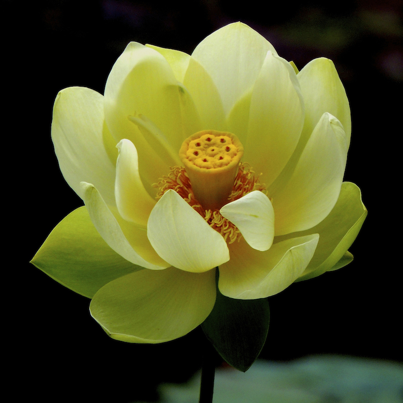

----

 

译者序：感谢把阿马斯介绍给中文世界的胡因梦和我心即宇宙网友的推荐，使我有缘接触阅读阿马斯的著作教诲和翻译阿马斯的这本旷世巨著 -- 《灵魂的内在归家之旅》。我无真修实证，只能从文字上理解，按说并无资格翻译此书，但我心即宇宙网友的热情激励和求知欲感染了我，另外Sunny网友的有关发愿的话也促使我发心翻译它，因为如果胡因梦不准备翻译它的话，不知要等到什么时候才会有人做这件艰难费力的事，我既有这种条件和兴趣（既喜欢佛学灵性学又有科学研究方面的背景经历）就不该推辞。一方面是因为人生在世，能有机会做一件利人利己的不求回报的事也很难得，另一方面也是因为这本书的价值实在是太大了， 它的价值意义不只在于宗教灵性哲学，在整个文化上的价值都是巨大的，因为它讲的有关是整个人类人性（“Humanity”）的真实或真理，很难想象会有比它更深刻的有关人类人性的书了。虽然因它的深奥而能理解欣赏它的读者可能不多，但真心追究宇宙人生真实的人有福了。

《灵魂的内在归家之旅 》(The Inner Journey Home: Soul’s Realization of the Unity of Reality) 是个700多页的灵性学巨著，是整个钻石途径的中心著作，它系统阐述了钻石途径的整体结构，形而上学和形而上心理学基础。从内容上看很象现代版的佛学唯识学但却是用的现代人易懂的哲学心理学科学语言，另外也有很多独到的东西，是佛学里也没有或没有清楚说明的； 从篇幅上讲，相当于一本系统的大部头佛学概论。读了这本书再读那些深奥难懂的佛学经典如《楞严经》《楞伽经》《圆觉经》《金刚经》《成唯识论》等就会比较容易。

翻译的过程也是一个深度的学习过程，力求准确达义，语句通畅，实在不确定的地方就附上英文原文。希望没有太多的错误纰漏，不至于误导读者，如此也就心满意足了。

 

## 《灵魂的内在归家之旅》之一：灵魂概述
发表于 2016 年 05 月 07 日

（一） 钻石途径中灵魂的概念含义与其新的形而上心理学

灵魂（soul)的概念含义在古今中外／哲学／宗教中都会有所不同，钻石途径认为灵魂是对一个人的最好最全面的描述，其含义和古希腊苏格拉底对灵魂的说法类似，既灵魂包括了一个人所有可能的内在经历（human subjectivity, 既所有可能的主观经历集合，思想的，情感的，意识的，精神心理的，灵性的），它是我们的内在全体，是感知／经历／行动的器官。自我（self）在现代的含义是一个有自我认同的区别于他人的个体，包括其身体和内在的精神心理活动，但不包括它的灵性潜力。自我可以说是灵魂的外在表浅显露的部分，灵魂的灵性本质／内在深度则是灵魂的深藏未露的部分。因此，钻石途径里灵魂的含义和主要是和佛教唯识学里的第八识／阿赖耶识的含义类似相当，同时也包括第六分别意识和与自我认同有关的第七末那识，不像唯识学分的那么细，但更具整体性也更好理解。

在唯物主义世界观盛行的今天，依据科学方法的心理学虽有很多发现进展但没有灵魂的概念，西方哲学对本体／上帝的探索停滞，到了尼采说的上帝已死的地步，人们通常相信人和物质世界宇宙是分开的，而物质世界宇宙只是惰性的等着科学去探索的东西。现行的各种传统宗教／灵修途径和现代人的日常生活是脱节或不易整合的，一般拒绝科学和心理学的新发现或挑战，远离逻辑思维，专注于灵性发展，存在将灵性与心理分割的问题。灵性与心理分割的问题在古代也存在，因此有些灵性修为很高的人也还是会有精神心理情感行为问题。虽然过去的宗教灵修传统用道德伦理的纯化来应对它们，但对某些深层的精神心理问题不是真正有效。钻石途径所要建立的是一个新的形而上心理学，指出心理现象的灵性根源，把心理和灵性结合统一起来，利用现代深度心理学／自我心理学的技术知识发现来帮助灵性的开展。真实（reality）有三个面向：灵魂／自我 （既精神心理世界）， 世界／宇宙（既物质世界）， 本体／上帝（既灵性世界），从一个更深更广的层面上，这个新的形而上心理学是从对心理／灵性的整合统一出发，进一步将人的物理／精神心理／灵性这三个世界面向整合统一起来，也就是达到佛教说的“一元” “不二”的开悟状态，达到这个状态认识同时也就解脱自由，超越人类的苦难了。

如何研究灵魂？科学家通过控制实验环境来研究客体，获得了史无前例的对物质的知识，极大地促进了人类物质生活的繁荣，但科学方法完全依赖于逻辑思维对通过人的感官收集而来的资料进行分析比较。各种科学仪器和技术手段只是极大了延伸加深了人类感官的能力范围和精确度，然而收集资料最终依赖的还是人普通的感官，逻辑理性思维也通常是抽象的，远离直接的感知。而古今中外的各种灵性传统探索真实时靠的是灵修参思状态下对客体的直接经历感受，意识认知介质和有关的客体知识是直接接触的，既观察者和被观察的客体是融合成一体的，一种主客体一元的体验。当然，这种直接感知是不被科学方法认同的，因为科学方法的基础是把观察者和观察对象分离开来，一种主客体二元对待的观察及逻辑分析，特点是容易被他人重复验证，而灵性途径的直接认知通常是很难重复的。在佛教唯识学，将灵性途径的直接认知方法所体验到的叫现量，反映的是当下客观的真实，通过逻辑思维而来的认知如果正确反映了客观真实就叫比量，如果不正确叫非量。因此，灵性途径和科学方法是两种不同的认识世界／真实的方式，只是达到灵性途径直观真实的人很少很难重复，而科学方法是任何受过足够训练的人都可实施的，很容易被重复和验证是非。但灵性途径直观真实的深度和范围却是有限的科学方法所不及的，科学方法的适用范围和成功到目前为止主要局限于物质世界。研究灵魂可以从研究我们自身的感知意识开始，研究我们如何从假象中分辨真实，既使用科学的逻辑思维方法又练习灵性途径的直接感知，将科学和灵性统一结合起来。

（二）灵魂的深奥难知

灵魂是经历的器官场所，是通向真实（reality) 的窗口，和真实密切联系在一起。尽管我们一直是灵魂，灵魂也就是我们，但对灵魂的直接感知却是遥不可及的，通常我们所知道体验的只是经历的内容而不是经历的器官场所本身。我们就像干渴找水的人在水中游泳却找不到它，事实上我们不仅在水中游泳，连我们的身体也大都由它构成。要直接体验灵魂本身需要穿透很多层的有关我们自身和真实的信仰和概念，即使对灵魂的直接经历升起和展开时，我们也很难理解所经历的东西，这与灵魂的模糊多变不确定和可感受性有关，这种模糊和变形又是因为灵魂的一个特性：灵魂中的一切都是相互关联的，因此灵魂本质上是一个全息性的（holographic)整体, 它的一个显现隐含着所有其它可能的显现（似乎是牵一发而动全身的意思），因此不可能分割灵魂的一部分来研究它。灵魂本质上是一个非线性现象，要理解其中的一个特性或一部分就必须顾及其整体全体。另一个灵魂模糊多变的原因是灵魂的基质本身作为一个根本的存在是灵活可塑动态的，不断地运动变化，活动， 反应，相互作用和适应。灵魂的鲜活（ aliveness)与它的动态（dynamism)有关，动态又与可感受性（impressionability)相关，可感受性又与灵魂的想象能力（capacity of imagination)有关, 如此象瀑流一样继续下去，很难理解，无怪乎佛陀在《解深密经》里说：“阿陀那识甚深细，一切种子如瀑流；我于凡愚不开演，恐彼分别执为我。”，这里的阿陀那识／阿赖耶识就相当于阿马斯说的灵魂了。

（三）灵魂是经历的地点场所／容器载体

灵魂是我们的个体知觉意识（personal awareness)的所在地，纯粹的知觉意识（pure awareness)是无地点的，无维度的，超越时空，无处不在。灵魂是这个纯粹知觉意识在我们这个宇宙时空中的表达显现，但它不是简单的知觉意识，它是局限于一个环境的我们的个体知觉意识，是我们经历自身与外界的地点场所。通常我们认为身体的位置决定了知觉意识的所在，但在濒死经历和某些麻醉药作用下意识脱离身体的体验（out-of-body experience)说明知觉意识和身体是可以分开的。在正常情况下，灵魂和身体同处，一起决定知觉意识的位置。灵魂是我们所有的经历（在所有的层次上所经历的一切事物）发生的场所，我的经历发生在我的灵魂内而不是他人的灵魂内，这是个体灵魂存在的基础。灵魂是我们个人的内在经历场或介质，所有的内在事件和过程都在里面发生。认识到灵魂是个体的所在不仅使一个灵魂和其他的灵魂区别开，也导致一个很重要的洞见：灵魂是我们所有经历的容器载体，这和佛教唯识学中对第八识／阿赖耶识的概念完全相同。

我们通常会觉得我们是一个自我个体，有经历／思想／情感／行动／感知等等，这些经历的内容来来去去象云彩穿过一个模糊的介质，但我们不会感知到这个介质本身，甚至不认为这种东西存在。如果一定要问我们的经历发生在哪里，我们会认为发生在我们的头脑或身体上，我们不知道我们是一个感受场（a field of sensitivity), 一个知觉基质（a matrix of awareness)，身体和头脑的区分是经历上的相对仲裁，实际上身体上的感知和头脑中的图像都从灵魂这个知觉介质中升起。因为不知道这些，我们就会成为时代的产物，接受当今唯物科学的理论，相信内在的事件和对外部的感知都发生在神经系统，信号传到大脑，然后大脑解码认知经历的内容。

当我们最终能够直接体验灵魂时，我们认识到灵魂是一个我们所有内在事件发生的介质，一个统一的容器载体，是我们的主观（Subjectivity)的基础。我们实际上可以体验到它是一个感受场， 一个知觉意识场，所有的经历都在这里产生和消失。我们可以想象灵魂和身体完全同处同在，形成了身体的内在经历。任何我们觉知到的发生在我们之内的东西发生在我们身体内，但更确切更密切的是，它们发生在灵魂内，因为是灵魂在行使着身体的感受知觉的功能。认识到灵魂是经历的场所是认识灵魂的开始，认识到灵魂是所有经历的容器载体是开始内在的转化过程／内在之旅所必需的。

（四）灵魂是主客体一元的经历器官

灵魂是一切经历发生的场所，又是个意识场， 能够意识到场中发生的一切，因此灵魂是经历者（the experiencer)。因为灵魂场包含所有的内在经历和事件，灵魂也是所有内外事件的感知观察者（the perceiver)， 外在的事件虽然被看作发生在灵魂之外， 但对这个事件的感知仍然发生在灵魂内部。对外部事件的感知也许通过我们的感官窗口，但最终是灵魂这个内在的意识场认知这个事件，受其影响并作出相应的反应。因此灵魂不只是所有内在经历和感知的场所，也是所有经历／感知／行动的主体，灵魂是经历者／感知者／观察者／行动者／思想者／选择者／响应者／欢乐者／痛苦者。思想／情绪／感觉／洞见／知识／意识状态等等都是灵魂内的一个具体显现，就像一个场中的各种波。因此，经历的内容不只是发生在灵魂内部，它们是作为灵魂的一个显现（manifestation)在灵魂内部生起的。思想／情绪／图像等等都不是从灵魂外来的，它们来自灵魂，回归灵魂，永远在灵魂内。我们对外界物体／事件的感知也是灵魂的一部分，因为我们的感知是内在的，尽管所感知的对象是外在的。

这些理解导向有关灵魂的一个根本的事实：灵魂是经历者，是这个经历的载体基质，同是又是经历的内容，这三者都不可分，是同一个东西，也就是说经历者与经历的内容本身不可分。内在经历的主体是灵魂，经历的内容既客体也是灵魂，因此灵魂对事物的觉知体验是主客观一元不二的，是“心物一元”的。比如在意识中生起的一个情绪，觉知的主体是这个意识感受场，而情绪是这个场的一个具体显现或者说是在这个场的某个区域的频率变化振颤。在这里，没有一个分开的观察者在体验这个情绪，灵魂是作为一个意识感受场整体感知了这个情绪。因此灵魂同时是经历认知的主体／基质和内容，这三者不可分，是同一个东西。只有当认识到这三者的统一不可分时，我们才真正认识灵魂。灵魂的经历和我们普通人的自我经历（egoic experience)是不同的。在普通人的个性自我经历中这三者是分开的，情绪的地点不清，一般是模糊地感觉到在内部，客体即情绪与经历者是分开的，经历者即主体是从分开的高于客体的位置角度来看待这个情绪。

灵魂的这个状况实际上是对我们日常经历的描述。比如我们感到悲伤的时候，我们并不会感到悲伤是一个客体现象，而我们自己是一个客观的与悲伤分开的主体，对悲伤的感知发生在对悲伤敏感的部位，比如在胸部，感受场实际上是与位于胸部的悲伤相接触的，只是灵魂这个感受场和肉眼可见的物质身体同居一处而已（ coextensive)。 但在个性自我经历中，我们倾向于认为自己是一个处于头脑中的观察者来观察这个悲伤的情绪。然而这个头脑中的观察者并不是那个实际上直接感知到悲伤的敏感性／感受性（the sensitivity)，这个敏感性／感受性是直接处于悲伤的部位而不是在头脑中。当我们能够体验灵魂这个感受场本身时，我们就会认识到灵魂经历的一元不二的原始特性。

（五）灵魂是个意识场

灵魂是个感受场，感受的基础是意识，灵魂实际上是个意识场。什么是意识？我们通常所知的意识总是意识到某个事物的存在，只是意识的机能功用，并不是意识本身。今天的主流科学认为意识是大脑神经系统复杂化后衍生的一个特性，这个看法显然是极端的唯物简化／还原主义的一个体现，一个将灵魂／世界／本体分割开来的结果。钻石途径以及历史上无数研究灵魂／意识的人的直接体验都揭示灵魂是一个意识场，不依赖于身体，比物理现实更根本。

什么又是场呢？在科学上场是一个具有某种特性或力量作用的空间区域，我们的感官通常看不到它们，但它们对特定的刺激有反应。比如电磁场会对电荷和磁铁发生反应而电荷和磁铁反过来也会对电磁场发生反应。场的特点是弥漫均匀统一，不是微粒或部分的集合，在这个场的任何一点或所有的点都具有这种特性。从这个意义上说灵魂是一个场，但不是物理的／电磁的／引力的场，是觉知和意识的场。灵魂作为意识的据点场所其空间位置延伸通过身体，通常和身体的空间形状一致，但灵魂场本身是无形可变的，可以是任何形状形态，可大可小，完全取决于灵魂的状态。灵魂通常采用身体的形状是因为灵魂认同身体，按照身体形像来成形。当我们能够体验到灵魂本身和脱离开身体的形象时，我们就会看到灵魂的这种惊人的灵活可塑性，经历到自己变成各种形状。这听起来像是科幻电影，实际上并不那么奇怪，例如当我们幸福安全的时候会感觉自己扩展变大轻快，害怕压抑的时候会感觉自己收缩变小沉重。在压力下或精神治疗中有时会觉得自己退化成2 岁时的婴儿，尽管我们实际的物质身体并没有变换形状大小。

（六）灵魂的全息性（The holographic soul)

场是均匀整体的，不由部分组成，灵魂也是如此。我们可以把意识场分隔成不同的区域，但这和灵魂具有组成部分不是一回事，正像我们分隔空间，形成一个包厢，但这不意味着空间本身里有可以被分隔开来的组成部分。灵魂的特性弥漫于整个场，在场中的任一区域都可起作用，换句话说，灵魂是全息的，它的每个区域，不管多么小，都拥有整个灵魂的所有特性和功能。认识到灵魂的这个全息特性是不容易的，因为不管处于何种意识状态，我们的刚硬的自我认同／概念已把我们的灵魂经历分隔地看不出灵魂的功能／特性从何而来。比如我们形成了一个自己很笨的自我概念，我们的灵魂就形成了一个呆滞收缩的状态，但如果我们认识到灵魂的任何区域都拥有整个灵魂的所有特性和功能，其中的一个基本特性是智力 (intelligence)， 那么我们对于自己很笨的这样一个自我认同就会失去它的刚硬性，我们就会发现比较容易接近我们自然的智力。

当我们说灵魂是一个意识场时我们是说它是一个由纯粹意识组成的介质。能够觉知意识到某个东西说明灵魂首先是一个意识的有机体，我们有意识是因为我们本身就是意识，就是说，意识不仅是灵魂的机能也是灵魂的基础自身。我们从来都是这个意识也总是感觉到自己是有意识的但却认识不到这一点，因为我们的注意力全都放到意识的内容上面了。我们不停地听着我们告诉自己的关于我们是谁／是什么的故事，这些故事成了我们看待自己和所有其它事物的思想上的滤镜。

意识除了是场，另一个根本的特性是它能够意识到自身，也就是说，我们不必在意识到某个东西时才算是有意识，我们可以意识到意识自身，意识到作为一个场或介质的意识自身，这个对纯粹意识的经历是一个没有客体的意识经历，仅仅是意识直接地感觉它自己，感知到自己是一个场，一个意识到自身的场。意识到自身不是一个区域意识到另一个区域，而是灵魂内的每个点都意识到它自身，灵魂内的所有的点都意识到它自身，均匀而连续。要认识灵魂首先要体验到我们自身是纯粹的意识，一个能觉知自身的介质（注：这段好像有助于理解唯识学上难懂的见分／相分／自证分之说，我的理解是如果说能意识到事物的机能是见分，所意识到的事物是相分，意识到意识自身就相当于自证分了，当然唯识上是八个识都分别有自己的见分／相分／自证分）。

当我们能够直接体验意识本身时，一个全新的世界打开了。不再像是正常情况下把世界看作外在的客体，我们开始从内在感知宇宙。内在的旅途充满发现，壮观／令人振奋的经历和觉知，其美丽和激动人心，其意义和满足感，其惊奇和壮观都比任何外部探索所能达到的多得多。很多宗教说教倾向于把内在旅程变成一种沉重的庄严，一种呆滞的道德，一种固执的神圣，无怪很多人对宗教不感兴趣。当我们探索灵魂，而不是把灵魂置于一种与一个外在神圣的静态关系，我们穿透到自我的基础地 — 灵魂的意识场，开始直接知道意识，这时内在的真实就成了一种喜悦和奇迹，我们离真正的神圣，那个一切发现和创造性的源泉，就会越来越近。

(七）意识是本体性的存在（Presence)

纯粹的意识（pure consciousness)是能意识到它自身的存在（presence),  是超越一切的简单独立本然的本体性存在（being），依缘而起的各种意识内容经历则不是，我们平常是感知不到意识的这种本体性存在的， 因为我们带着个性自我的滤镜和世界观来看我们自己，包括我们的意识。本体性的存在不是感觉，只能直接觉知，只能和它成为一元一体时才能知道它。当我们知道意识本身时我们就找到了本体性的存在，意识不仅是个功能，认识到这一点是内在转变上的一个大发现。意识是本体（being），本体（being）是意识，二者是一体两面不可分。当我们去掉一切个性自我的滤镜体验自己时，发现只有意识存留下来，描述这种意识经历的最好术语就是presence。总而言之，从主观和心理上说灵魂场是意识，而从现象学上讲意识是一种本体性的存在。平常情况下，意识散布在思维内容和外部的干扰上，其本质稀薄的不可见，只有其功能是明显的，如果想象着把我们平常的稀薄的不可觉知的意识不停地浓缩直至形成液体，就像把透明的光液化，当达到一个阈值时，意识就成了一个非物质的实质体，就有了presence 的体验（开个玩笑：禅宗的人面壁十年把意识浓缩提炼成这样时应该就可以破壁了，呵呵）。

(八）灵魂是意识的有机体 （Organism of Consciousness)

灵魂不只是个均匀的意识存在场，也是由意识组成的有机体，正像身体由细胞质组成。类似于身体虽然完全由细胞质组成但分化组织成不同的器官／系统／功能， 灵魂也分化组织成不同的特质／特性／能力 。身体的组织结构相对固定持续较长的时间，而灵魂则流动易变地多。总之，虽然意识是灵魂的基础实质，但在灵魂这个有机体中意识所采取的形式却是组织系统／机能／特性／特质。

纯粹意识作为一个本体性的存在直接地知道自己，不反思自己，不存在自体客体的二元对待现象，它定在自身中从而知道自己作为一种本体性的存在，灵魂也有定于自身知道自己的本体性存在的能力，但它也有反思（self-reflection) 的能力。个性自我的经历（egoic experience)通常是这种反思模式发展而成的主客体二元对待的认知。

灵魂能分化成很多维度，每个维度又有很多面向，它们又组织起来行使具体的功能 （比如心，脑，意志），能和自身及环境相互作用。所有的维度和面向都是以整体（holistically) 合作的方式形成一个有机体，这个有机体从根本上说是意识，但作为灵魂这种分化的显现，意识不只是能直接体认它的作为意识／存在(presence)／本体(being) 的根本性质，也能知道所有的分化和显现。灵魂能直接知道它的各种特性和结构，也能反思性地和概念性（reflectively and conceptually)认识它们。灵魂的高级组织使其可以觉知经历复杂的事件，也能反思它的觉知经历，能够思想，想象，记忆，感觉，意志，决定，选择等等。

（九）灵魂和自性（Soul and Essence) 的关系

如果灵魂基本上是纯粹的意识，那灵魂和自性（essence) 的区别在哪里？我们以前已描述说自性是本体性存在和纯粹意识，是一切（包括灵魂）的本性和源泉，这和灵魂的本体性存在和纯粹意识听起来相同，但二者有区别吗？自性是灵魂的本性，它的真实本质，它的本体维度和基础地，因此当我们体验灵魂的纯粹意识的基础地时，我们体验的就是自性，在纯粹意识这个层面，灵魂和自性是一回事。但灵魂不只是纯粹意识，它是一个复杂的意识有机体。

自性显现很多具有不同特性的自性面相（essential aspects)。这些自性面相是纯粹意识的具体分化，只分化成一个特性，仍然是自我感知（self-aware)的本体性存在，但不同的是它们只直接感知他们自身的特性。这些特性通常隐含在纯粹未分化的本体存在里，但分化的自性面相可以在灵魂里明显地显现。这些自性面相包括：爱，慈悲，欢乐，和平， 真实， 力量，无暇，真诚等等。他们是自性的完美面相，其存在是灵魂充分发展和作用所必需的。如果以身体为比喻的话，这些自性面相就相当于身体必需的液体和有机化合物，例如蛋白质／氨基酸／脂肪酸／激素／酶／神经递质等等。尽管自性和灵魂都是纯粹意识的存在但在对它们的体验上存在微妙的区别，因为灵魂是个有机体，而自性更像基本元素（the fundamental elements)。

（十）灵魂像个变色龙（chameleon)

灵魂和身体的类比也是很有限的。身体的组织器官结构相对稳固，持续一生。与物质身体相比，灵魂则是极端易变的，它的分化和组织不停地变迁转化，没有一个组织结构是固定的或者需要固定，这是灵魂的一个内在特性。灵魂的全息性使得灵魂场内任一区域都拥有灵魂所有的维度／面向／机能，因此我们的精神思想不会只是存在于头脑，整个的灵魂介质，部分或全体，都有精神思想的能力。正常情况下精神思维活动发生在头脑主要是因为认知和脑的一个特殊关联，这个关联并非决定了精神思维活动一定发生在脑，而是一些专门的精神思维活动需要脑的运作，我们实际上可以在身体的任何部位认知沉思，对情绪的体验也一样。灵修传统早就知道内在的看和听不是局限在身体的某一部位。换句话说，灵魂的与物质维度的经历有关的机能虽然固定在身体的某个部位，但内在的事件却不受这种组织的限制。灵魂的内在维度／结构／机能不是固定的，需要时形成，不需要时消解，或融合成另外的组织结构来应对新的需要。

我们实际上是在不停地经历着这个感受场的灵活易变性。有时我们似乎完全是心（heart), 充满沉溺于情感，思维几乎不存在。有时主要是脑（mind)，陷于沉思想象。有时主要是意志(will),  忙于决定和选择， 此时心脑会以不同的程度存在。大部分情况下我们是三者的结合，不停地变换着它们的存在和功能的比例／特性。有时意识沉定安详，不关注任何具体的东西，这时我们主要是存在（presence）。灵魂的这种可塑性和时刻的变化使得一些古人把它形容成变色龙，这也是为什么对灵魂有一个全面认识很难的一个原因，因为可能的组织构造是无穷的。

物质世界里不存在类似灵魂的东西，它象一个魔术介质可以显现所需的形态和机能，它随时根据情况变形，像是科幻里面的东西。我们通常意识不到这样一个魔术表演因为我们和这个内在的存在场没有接触。我们所意识到的仅仅是灵魂不断变形而来的产物，那就是思想，图像，情绪，和感觉。这种魔术变形和表演又是如何产生的呢？要知道这个需要先了解只知自身的纯粹意识是如何能够显现形态并认知它们 （这实际上是认知科学的中心问题，也是佛教难懂的唯识学所专注的）。我们先探讨意识如何分化成对内容的觉知和认识，然后探讨这个内容如何生起。经历的内容是什么？它是如何生起的？

参考资料：

1. 阿马斯：《灵魂的内在归家之旅：实现真实的整体统一》 （The Inner Journey Home: Soul’s Realization of the Unity of Reality）：依据此书：PART ONE: SOUL  编译择要总结而成

2. 冯达庵：《佛学要论 — 八识规矩颂释 》

3. 南怀瑾老师讲述：一切种子如瀑流 http://blog.sina.com.cn/s/blog_65c26d780102vj6m.html

 

## 《灵魂的内在归家之旅》之二：灵魂的觉察认知功能与其自性根源
发表于 2016 年 05 月 18 日

（一）Neosis （源自自性本体的直接客观的认知) 的概念

我们的认知能力即我们如何认知事物是一个极大根本的谜，目前的神经科学／认知科学解释不了。以前讨论现代科学对意识的研究时曾以眼观一枝点着的蜡烛为例用已知的现代神经科学知识说明我们的主观感觉（蜡烛燃烧发出的黄光）并不是那些外界的物理刺激本有的特性，而是我们的感官／脑感觉系统所赋予的：蜡烛光进入眼底激活了视网膜上的视神经细胞 （只有波长在400 – 700 nm之间的可见光才行)，后者再将电信号传给周围的神经细胞，随后通过视神经最终将信号传到后脑的视角皮层，在那里发生了很复杂的神经元之间的信号传递互动，然后很神秘的我们就感知到我们面前有一蜡烛发着黄色的亮光。我们都知道光是电磁波，电和磁都是不可见的，毫无疑问，可见光的颜色是我们的眼／脑视觉系统所赋予的，不是光本来就有的，盲人和色盲的人就看不到或感知不到光的颜色，其它的动物在看到同样的光时也很可能是不同的感觉，如蜡烛旁的蜘蛛蚂蚁可能感觉到是大火或其它危险的东西而逃命去了，而那扑火的飞蛾呢，它感觉那烛火是美好的东西吗，为什么扑火自尽也在所不惜呢？视觉以外其它的感觉如听觉嗅觉味觉触觉也都是同样的道理，我们的主观感觉并不是那些外界的物理刺激本有的特性，而是我们的感官／脑感觉系统所赋予的。因此说我们平常所观察到的现实实际上是我们的大脑所构造的图像。但我们的大脑又是如何为我们构造了这个生动的发着的黄光的蜡烛这样一个主观意识经历呢？从理论上讲，神经科学可以发现所有有关的脑部位和神经元在传递整合这一感知（perception)中的作用，如蜡烛的光／形状／气味／距离等等，最终整合成一个这个发光蜡烛的神经对应物 （neural correlate，如有人假设通过脑神经元的协调一致），但从神经对应物这个仍属于普通物质范畴的结构和功能的物理化学现象产生这个生动的发着黄光的蜡烛这样一个主观意识经历却是一个完全神秘的过程，神经科学对此一无所知，无法研究它，所有已知的物理化学定律或任何其它科学学科都不能推断解释这一现象。量子物理学家薛定谔（Erwin Schrödinger ）说：“ 我们对颜色的感觉无法用物理学家的光波的客观特性来解释，生理学家能够解释它吗？我认为同样不可能，即使他们对视网膜，视神经和大脑的神经机制有更完全的知识” (“The sensation of colour cannot be accounted for by the physicist’s objective picture of light-waves. Could the physiologist account for it, if he had fuller knowledge than he has of the processes in the retina and the nervous processes set up by them in the optical nerve bundles and in the brain? I do not think so.”。) 这就是意识研究中的“hard problem”, “brain-mind relationship”中的关键缺口，在哲学上也是一个长期争论的问题，叫“Qualia” （可感受的特性）, 也就是客观物质现象如何与主观的精神心理经历联系起来的问题。主客观二元对待的科学方法似乎无法应对这样一个根本的问题，它挑战了科学方法的极限 。然而，佛教的唯识学和下面介绍的钻石途径好像都对“Qualia” （可感受的特性）给出了一个合理的解释（注：这段不是阿马斯书里的内容，是我依据其他书整理而来）。

钻石途径是从自性本体及灵魂是一个主客观一体的意识场出发来解释我们的认知能力，用的概念叫Neosis，这个字来自希腊文，其含义是纯粹直接当下的知性，是对直接经历（direct experience)的客观的分别认知能力，类似佛教唯识学里的“智”／“净识”／“现量”的含义。灵魂作为一个主客观一体的意识场可以觉知到作为意识场的自身，也同时觉知到这个场中的所有的由它自身的基质在某处变形而成的种种内容形式（如感觉，情绪，思想，语言，图像，运动等等）。这种种的内容形式都是由意识的介质构成，而意识的介质是纯粹意识，因此灵魂是以一种直接当下的方式从内部认知它们，但这个认知过程是通过Neotic forms (理形）这种宇宙性的概念，因此叫Neosis（起源于自性本体的直接当下的客观认知），这发生在所有有关的记忆及随之而来的联想／比较／分析／推理等普通的思维活动生起之前。理解和总结Neosis的根源过程非常困难，读了阿马斯几本书里的相关内容都觉得难以下笔，最后觉得必须先解释钻石途径里与觉察认知的起源有关的几个自性维度才行，下面就慢慢地展开。

比如在胸部感到一种温暖的善意在灵魂场这样一个基础维度的体验如何呢？这种感觉随着胸部场的变化而显现，胸部的场如此振动产生一种特别的温暖感，我们将之认知为善意。这个过程有两个步骤，第一步是对场的变化的觉察，第二步是认识这个变化，这是一种分别认知。但在这两个步骤之前却是纯粹的觉察（pure perception)。

（二）纯粹觉察与非概念性意识

最初的纯粹觉察是完全无分别的，只是纯粹意识觉察到它自身，没有任何其它的东西，这是意识的根本基础地，所有层次的认知都从这个基质里升起。

随后是非概念性觉察意识（nonconceptional awareness)。在意识场中分辨不同的能力是我们的意识的一个根本的特性能力，但在这里我们需要做一个困难而微妙的区分，把这种根本的分别能力和我们实际上认知理解意识内容的能力区别开来。这种非概念性分化觉察是觉察到意识场中的不同内容形式但不认识理解它们，不能命名，这时普通的思维意识（mind)还没有参入，仅仅是觉察到形状／颜色／运动／性质的不同，没有认知或理解。只有分化（differentiation) 而没有分别(discrimination)。我们把这种觉察而无认知的意识称为非概念性意识，因为认知理解需要概念，需要意识机能的下一步。

非概念性意识是灵魂的根本原始状态，是任何经历的基础地，在认知／反应／分类等等普通思维活动之前。认识非概念性意识对于内在工作来说是很重要的，很多灵性传统都强调这一点。经典的比喻是非概念性意识象镜子，如镜显影而不添加任何东西。但在正常情况下我们是觉知不到这层意识的，因为我们的认知和相关的标签／分类／记忆等发生的太快，几乎和它同时升起，感觉上像是一个事件，把它完全遮蔽了。

意识的各种内容形式从非概念性意识这个基础地升起，形成灵魂的内在经历。我们可以看出用如镜显影来形容非概念性意识的功能不太精确，因为灵魂的意识不仅显像它也创造形成了这些内容形式，因此我们的意识是一个把所创造的内容形式显示在它表面的魔术镜子。一个更好的现代比喻是电视屏幕，即产生又显示了构成故事的图像／运动。但这个电视屏幕比喻也不完美，因为我们的意识不仅产生／显示内容形式，还觉察它们。如果我们想象电视屏幕里的光是意识，在投射图像的同时也觉察了所投射的图像，那么我们对非概念性意识的理解就接近了。

（三）灵魂像个多维的黎曼流形场(Riemannian Manifold)

我们的内在意识是一个完整的宇宙，一个魔术般的宇宙。它可以相关于三维空间运作，也可以在很多我们能直接体验的维度里显现。我们的灵魂意识有相对于人体五感官的觉知能力，即触觉／视觉／听觉／味觉／嗅觉，包括对外在的／内在的／记忆的／想象的／幻觉的声音／气味／味道的觉知。我们的动觉（kinesthetic sense）在感觉上本来就是一个内在的经历，但也可以反映在记忆和想象中，再加上思想和感觉的内在运动。对思想的运动／内在状态变化的感知涉及感知时间的能力，我们的意识是一个由很多维度组成的宇宙。

从意识的维度来看意识，我们看到意识不是一个三维或四维的场，而是一个多维的流形，说它是流形是因为它是一个动态结构的动态结构。这个流形的特点是非线性的黎曼几何特征：所有的维度都以一种非线性的方式向所有其它维度敞开。即使在平常经历中，我们都能觉知到某个时间点上的很多不同层次的经历。例如我们可能感觉到肌肉紧张收缩，一种伴随着深呼吸的警觉状态，同时有情绪上的兴奋和期待，在这个状态下我们也许思考计划着某些行动。如果我们能觉察到更微妙的层次，我们也许能有一种力量的感觉，感知到力量作为一种自性面相的存在，一种清晰和开阔，一种宇宙意志流经我们的经历的感觉。我们也可能同时觉知到真实的根本存在，觉知到我们的经历和宇宙万物的动态变化。在灵魂里，一切都和其它的一切连在一起。

意识场内的一个形态或形式可以是一维的，例如一个简单的感觉，也可以是不同维度的结合。我们所有的内在经历都是这个意识流形场中显现的形态形式，而这些形态形式也只不过是意识的基质在场中的某个区域变形而成。这个观点不仅是对我们的内在经历的更真实的描写，也清楚揭示了内在工作的目的。这个目的就是实现对意识场本身的觉知，从而可能更完全地开发灵魂这个意识场的丰富和自由。

（四）钻石途径里与觉察认知有关的自性维度

上面总结了灵魂是个多维的黎曼流形式的意识场，在这个场中变现无尽的形态形式，在变现这些形态形式的同时非概念性觉察意识就觉察了它们， 但觉察（perceive)和分别认知理解（discrimination，knowing and understanding)还不是一回事，分别认知理解需要概念，分别认知是另外一个维度的功能机制，要解释分别认知需要先解释钻石途径里的自性维度。

自性的概念相当于哲学宗教里面创造一切的／作为一切事物本质本性的的神／上帝／道／佛性／本体，一般的宗教都说的极其神秘笼统，认为是不可言说的，一般的哲学体系又只是思想逻辑推测，不是由开悟实证而来。阿马斯说的钻石途径里的自性维度是由开悟实证而来，却又描述的详细清楚，这是钻石途径殊胜宝贵的地方。下面就简单介绍一下钻石途径里与觉察认知能力有关的自性维度。

采取一种从上到下或从最根本到表浅的方式可能最容易理解。钻石途径把自性本体区别成五个同生共现的无限维度，从深到浅的顺序是：绝对真理（The Absolute）， 缘起理则与创造性活力维度（Logos and Creative Dynamism），非概念性觉察意识维度（Awareness  and the Nonconceptual),  纯粹存在与知识的维度（Being and Knowledge）， 神圣之爱和光 （Divine Love and Light）。这里只简单提一下与觉察认知的起源有关的三个无限自性维度：即绝度真理，非概念性觉察意识，纯粹存在与知识。同生共现的含义是虽然较浅的维度是由更深更根本的维度分化而来，但它们是同时存在的，也不能理解成层层相叠的洋葱，它们是互相联系交叉渗透一体共现的。灵魂是自性本体的个体化，从无限的维度缩微成有限的灵魂区域，在基础根本的层面上就是自性本身，其机能特性和自性本体无区别，但在灵魂这个有限的区域／在灵魂所在的我们这个现实世界可以分化出新的机能对这个世界上的事物进行更详细的认识经历，这是无限的自性维度无法在我们这个现实世界所作的事，因此可以说灵魂是自性本体分化出来的经历认识这个世界的器官工具。

绝对真理是最深最根本的自性本体维度，它超越觉察意识，完全没有自身意识，它存在但它不知道它存在，只有存在没有意识，就像处于深睡状态的人，虽然他一无所知但他是存在的。绝对真理的这种存在没有任何特性，是绝对的空无，但仍是存在，类似于佛教所说的“绝对空性／寂灭”或“自性涅槃”。纯粹的觉知或意识（pure awareness or consciousness）是从绝对真理的神秘黑暗无限中升起的第一个特性，这种纯粹意识仅是觉察而没有分别认知，在概念产生之前，这就是非概念性觉察意识维度（Awareness  and the Nonconceptual)。在这个维度里没有空间和时间，也没有存在与不存在的分别，因为这些都是概念，在这个维度里没有概念，只有纯粹意识的觉察，不知道觉察的是什么，是全然的纯真无知（complete innocence），虽然有意识但没有意识的概念，不会说“我是意识” （因为我和意识都是概念），因此又叫做“无名”（The Nameless）。虽然是无知的觉察，但却是认知的基础或第一步，比如我们不可能认识一个桌子如果不能先在意识里觉察到桌子的存在。另外，非概念性觉察意识升起后就有可能觉知绝对真理的存在，尽管绝对真理本身不能觉知自身。

绝对真理和非概念性意识都是非概念性的，但非概念性意识是纯粹的意识而绝对真理是超越纯粹意识的，它们的区别象黑夜与白天。绝对真理是黑夜，非概念性意识是白天，这个白天里有光，但这种光是纯粹的光，不带来任何具体的知识。下一步从非概念性纯粹意识里升起的东西是存在（existence or presence），这是纯粹存在的维度（Pure Being），在这里意识觉察认识到自身的存在，这是概念的开始，最初第一的概念就是存在（Existence, Beingness, Presence)，这时还没有分化，一个纯粹的存在，不是分化的你或我的存在，超越它就进入无法谈论存在与不存在的非概念性维度。这个原初第一的“存在”概念是所有认知和知识的起源，认知开始于对纯粹存在（Pure Being）的认知，在这里知者／所知／知识三位一体，是同一个东西，都是纯粹存在（Pure Being）本身。

纯粹存在（Pure Being）隐含自性本体的一切完美，进一步分化显现成灵性世界和物理世界的一切，而它自身并未消失，而是作为一切事物背后的本体性基础，构成它们的内在本质，也就是佛教说的“性相不二”的意思。第一种分化是分化出各种隐含的特别的自性完美形式，这包括爱／真实／慈悲／力量／和平／等等的各种自性面相（essential aspects),  钻石载体（the diamond vehicles）和其他的自性形式与维度。这些自性的完美形式与维度是永恒的／超越时间的，是纯粹灵性的，客观的真实宇宙，物理感官觉察不到它们。第二种分化就是我们这个宇宙世界的一切可认知的形式，包括一切物理的，情感的和思想的形式。

纯粹的存在在体验上是一个纯粹的整体（Unity），没有不同部分，只由一个东西构成，没有分化，没有时空，比如象大海完全由水组成。纯粹的存在进一步分化成一体性（Oneness）的体验，这里有分化和分别，有颜色和时空，你能感知到不同部分的存在，但它们不是分离的，是一体的，就像一个身体由不同的分子器官系统等等维度部分组成，这是存在与知识的维度。

纯粹的存在只有“存在”这一个原初概念，在分化的一体性里（Oneness）有各种概念，什么是概念呢？概念是可认知的实际存在的分化现象，这和普通思维的概念思想是不同的，普通思维的概念思想和个体头脑记忆里的一个思维图像连在一起，和一个独立于个体的真实存在的东西不同。在这个维度里的概念是客观实际存在的，是宇宙性的概念，不因人而异，这种宇宙性概念叫“neotic forms” (即柏拉图的理形）又叫“Basic Knowldge” (基本知识），相当于佛教唯识学里的“净识”。比如椅子是个理形，这个形式在真实中存在，不是我的个人头脑创造的，如果这里有把椅子，其他的人也会认出这把椅子尽管不同文化的人会叫它不同的名字，这个椅子的这种可辨别的存在是真实独立的，不取决于我个人的头脑，因此理形是客观存在的可认知的宇宙性概念形式，我头脑中的椅子概念只是我个人头脑中的图像，取决于我的头脑和记忆的存在，因此和理形是不同的。个人头脑中的椅子概念叫“Ordinary Knowldge” (普通知识），其起源也是来自“存在与知识维度”里的椅子理形，但仅仅是对这个理形的个人化的记忆性储存，因为人的记忆无法把理形的存在感（presence）储存下来，因此个人头脑中的椅子概念仅是个轮廓外表，失去了理形的实质存在感及其他的丰富与维度（特别是一体性不分离的特性），也就是说普通知识是理形／基本知识的影子。普通知识虽然只是个影子，但对我们的认知经历却有着强烈的／主导性的影响。

物理世界以理形的形式存在，当然实际上是一体不分离的，这一点和我们在普通知识影响下的所看到的不同。比如岩石，山，人，鸟，门等等都是理形，这些可分别的形式确实存在，不管我们的信仰如何，不管我们给它们贴个什么标签，一个理形可以被分别认识是因为它有内在的可分别的形态形式，不是因为我个人的头脑确定了它，我只能认识而不能改变这种分化。这里说的是觉察而不是命名，名称定义可以改变，但客观存在的分化不能改变。

上面提到纯粹存在（Pure Being）是知者／所知／知识三位一体的自性维度，其存在与对自身的认知是一回事，也就是说它本身就是一个认知维度。 由纯粹存在（Pure Being）分化而来的自性面相（essential aspects)也是一类“neotic forms” (理形）或宇宙性概念。和纯粹存在（Pure Being）一样，它们的存在和对自身的认知也是不可分的一回事，颜色／感受／质地／味道等等所有可分化的性质被合成一个整体性的概念，在灵魂的体验上就是对它的认知，换句话说，通过纯粹存在的认知维度，这个分化的东西本身被自动合成一个“neotic forms” (理形），认知和理形的存在是一回事，认知就是给存在形式穿上理形的衣裳（这好像类似佛教唯识学里的识性种子，种子存在我们就能认知相应的事物），这个理形概念是构成自性这个流形体的一个认知维度的表达，平行于颜色／感受／质地／味道等等的维度，是认知维度的分化，而纯粹存在（Pure Being）的简单的对自身存在的认知（即第一知）是未分化的认知维度。和自性面相的分化一样，其他各种事物从纯粹存在的分化也是如此，因为自性这个黎曼流形场有一个认知维度存在，这个场里形成的各种形式都是可认知的形式，也就是说它们都是“neotic forms” (理形）。在纯粹存在这个维度，所有的形式都可被分别认识，不是普通思维意识的推论式的认知，是通过理形或基本知识的直接／当下／亲密／精确／客观的认知。我们可以知道它们是因为从根本上说它们是理形，说它们从根本上可知是因为知性是自性的根本维度而所有的显现都参与这个维度。因此纯粹存在的维度是一切认知和知识的源泉，它是自性的认知维度，更确切地说是理性维度，它使得认知成为可能。所有的认知最终也就是对本体存在的认知，而知性的原理就是所有的形式／形态／物体／过程都是理性的（neotic）。（注：本篇开头提及的认知科学的最大难题，也就是客观物质现象如何与主观的精神心理经历联系起来的问题， 即“Qualia” — 可感受的特性 ，在这里如何理解呢？“neotic forms” (理形）提供了这个客观与主观的认知连接，而理形是自性本体这个根本认知维度的产物，因此是本体的根本的分别认知智慧把某种频率的光和某种颜色通过“neotic forms” 即理形联系起来，是一种宇宙性的概念联系，不因人而异 。）。

（五）宇宙大脑（Universal Mind）和一切唯识

在纯粹存在与知识的维度（Being and Knowledge）里，“neotic forms” (理形）是客观真实超越时空的存在（presence），之所以把它们叫做概念是因为从非概念性觉察意识的维度来看他们就像是概念思想，因此纯粹存在与知识的维度被叫做宇宙大脑（Universal Mind）或上帝的大脑（The Mind of God）。这个本体自性的大脑知道它自己，也知道它所分化出来的一切。它通过灵魂来认知，因为对事物的分别认知需要局部化。它提供给灵魂认知的机制，它的大脑和智力，就像神圣之爱的维度提供给灵魂心脏和感情。这意味着真实的感知并不是个体灵魂完成的，尽管表面上看起来如此。灵魂是本体的感知器官正像眼睛是身体的视觉器官但确切地说能看的并不是眼睛。

能知是纯粹存在与知识维度的本能，它的实质是基础知识，整个维度都是普通知识无法可及的纯粹的基础知识，所有的显现都是基础知识分化成的各种理形，现象世界的一切事物都是基础知识以理形的形式出现。灵魂是纯粹存在与知识维度的一个理形，因此灵魂场也是纯粹的知识，它的所有经历也无非是各种知识形式的流动，所有的思想／感情／感觉／图像／觉察／行动等等一切都无非是知识在灵魂场的显现，而灵魂场本身的基质就是知识。从这个角度看，整个世界都是知识，不只是内在的主观经历，外在的山／海洋／天空／树木／人／动物等等也都是知识。我们活在知识里，四周被知识包围，没有不是知识的东西。这个观点和佛教唯识学的说法一致，唯识是一切唯有识的意思，也就是说世界上除了识没有别的东西。

当我们完全脱离了普通知识对基础知识的影响，实证了一切都是知识的这个事实（truth)时，整个世界开始闪烁，发射着知识的光芒。一切都不仅仅是一个不可分割的整体并且也因知识的透明之光而灿烂辉煌。我们看到通常的事物变成光的形式，透明，彩虹色，充满色彩和意义。世界充满意义，充满知识，真实而直接的知识。到处是光辉灿烂，清晰轻快，和圆满存在。宇宙是一个多维的流形，所有的维度在所有的点都和知识的维度交接贯穿，因此知识弥漫于整个流形，整个宇宙成了一个魔术般的，自我发光的，由美妙义深的知识形成的全息世界。物理世界物体的颜色／质地／风味表达着它们自身的根本特性，现象世界也因此而表达着自性本体的完美。夜的黑暗表达着黑色和平自性面相的深度宁静和神秘，血和火的红色反映红色力量自性面相的活力和能量，太阳和花的黄色体现黄色欢乐自性面相的轻快与喜悦，如此等等。在这种经历里，两个层次的分化形式象一个统一的完形集合体，由存在与基本知识的无限维度联系统一起来。

整个宇宙，所有的现象与显现，都出现在这个神圣的大脑，这个宇宙大脑中，没有任何东西超出它的范围，因为它是所有的显现。从这个角度看，所有内在外在的事物和我们自身都是上帝大脑中的想法。在这里，我们也许可以认识到个体的大脑是宇宙大脑的反映，是宏观宇宙大脑的微观宇宙。

（六）从基础知识到普通知识 （From Basic Knowledge to Ordinary knowledge)

在普通的认知经历中，我们从上面说的整体统一的基础知识场中抽取某些形式形态存在记忆里，积累起来就成了我们通常所知的知识，为了和基础知识（理形）区别就叫做普通知识。我们的文化环境大致决定了我们会注意／分离／抽取何种形态形式，因此普通知识的内容深度取决于文化背景。

普通知识在认知经历中形成，但随后存在记忆里形成结构，这些结构又反过来强烈地影响我们随后的认知，甚至无知和虚假也都是知识，也会影响我们以后的认知和反应。比如我们把一段绳索误认为蛇，我们就会像碰到真的蛇一样反应。在这里，普通知识和事实（truth）是有区别的，我们把知识的含义扩展了以便传递一个洞见：知识是灵魂经历的一个内在组成部分。

普通情况下，我们的认知经历受普通知识的影响极大，最初的来自基础知识的直接客观的认知立即被随后从记忆中升起的普通知识所掩盖／扭曲／变形，普通知识依据过去的记忆经历联想／比较／分析／推理，像个依据个人习惯习性的连锁反应，最终形成的认知有很多不客观不真实的成分，也就是说基础知识被普通知识遮蔽污染了。因此，基础知识类似佛教唯识学的“净识”，普通知识则是“染识”， 但这个基础知识与普通知识的转换作用是如此之快以至于我们一般是意识不到这个区别与作用的。从体验上说，基础知识是透明发光轻快的，而普通知识则是灰暗不通透的，因此我们平常所感知的世界是固化僵硬不通透的。

（七）思维能力与理性逻辑思维

基础知识的认知维度是发展普通思维能力的基础。当我们专注／描述／分离意识中的某个形式时，这种印象会形成图像存在记忆里，这个图像除了视觉的部分还包括可分别认知的特征和内在的感受如动感／情绪等原初经历的其它内容，普通的概念和语言文字会与之联系起来。因为这些都发生在意识场里，所保存的形式和所联系的概念标签都是基础知识的显现。但是，这些概念所指向的是对过去经历的一个部分的／局限的印象。这些图像／符号／文字／概念成了普通知识的基本内容，是灵魂思维能力的基础。思维基本上是记忆里从前所觉知的基础知识的元素的相互关联。概念／语言文字／图像中对事物的分解或划分来源于基础知识。通过关联这些头脑中思维元素，连同目前的直接经历（即基础知识）中的觉知，思维形成了一个它自己的维度。这个维度发展了很多不同程度的抽象，我们可以从最初的来自直接经历的抽象中进一步抽取某些内容，形成新的概念符号，和原来的抽象联系起来，将它们分类归组。这个过程发展了很多程度的分化和整合，发现了思维的规则（逻辑），成了一个自我组织的螺旋形进化。灵魂原有的可塑性在这个维度上呈现出一个更加自由的方式，思维想象使得在理论上解决实际问题（例如建筑一个桥梁）成为可能，使得各种创造性工作如音乐文学成为可能，使得思考过去和未来成为可能。对逻辑思维的强调已经导致了我们实际生活中的很多进步，但没有对意识场直接经历的思维导致自我／世界／本体存在的分离，连接这三者的基础介质是这个集存在／意识／基础知识于一体的意识场。

普通知识可以说是基础知识的一个亚组子集（subset），它来自基础知识也是灵魂这个意识场的显现形式，然而它却缺少意识的一些很重要的维度。思想概念越抽象，它所包含的内在感受维度就越少，直到最后只剩下普通思维认知的维度，一种仅仅依赖于代表性概念和语言文字的认知。它失去联系的最重要的维度是纯粹意识的维度，它失去了大部分对意识的本体性存在的感受性，成为空洞无实体的认识，只存有经历形式的外表轮廓以及他们的相互关联，这就是思想的本质，这些思想来自于基础知识，体现了基础知识，但却基本上失去了与这个基础知识的基础之间的联系，成了无实体的知识。

思维机能的运用发展进化了各种我们称之为“逻辑和理性”（logic and reason）规则原理。尽管知识不是静态的，总是在不停地变化转变，但也不是混乱偶然的，而是遵循一些根本的形式规律，这反映了灵魂的自我组织的智力智慧，事实上象我们在以后的章节中看到的，它们反映了真实（Reality）的基本形式，包括本体／世界及它们与灵魂之间的关系， 对这些根本的不变形式的认知和抽象发展成了“逻辑和理性”的规则原理。因此认识到“逻辑和理性”和直接经历不相抵触是很重要的，因为它们反映了本体内在的形式，但当它们与其基础源泉疏远，以一种抽象僵硬的方式应用时，问题和困难就容易发生。当我们的思想形式得不到基础知识的滋润支持时就可能脱离真实。

（八）理性思维与灵性觉知的整合统一

神秘的灵性知识和普通理性逻辑思维而来的普通知识都来源于基础知识（理形），但却是向完全相反的方向运作。基础知识是存在与分别一体，同时发生的。推论性的普通知识是强调基础知识分别的一面，而神秘灵性知识则强调对基础知识的直接感觉与接触，也就是强调存在（being）这一面。真实的情况是，基础知识就是 “Gnosis”即所谓的直觉灵知，在不受普通知识的影响时就是对真实（Reality）的直接知识。“Gnosis”（直觉灵知）强调存在但也会有不同程度的分别，分别越少，其境界就越神秘／直觉／甚至模糊。完全无分别会进入神秘无法言说／超越逻辑思维的甚深境界，只有觉察意识而无内容，甚至连觉察的意识都没有。

认识到理性逻辑思维和神秘直觉灵知都来起源于基础知识可以帮助我们实现知识的一个新的整合，我们有可能认知到一个把理性思维和灵性觉知联合在一起的基础地，这种联合不是相加或线性联合，而是同时运作。古代西方的一些哲学家包括古希腊哲学家和基督教哲学家，以及古代东方的一些哲学宗教家，都已经认识到了灵魂里这种多种意识维度的联合特性。然而强调抽象思维的现代思想却离直接经历越来越远，达到了抽象逻辑思维的新高度，但也暴露了用这种方法研究一些根本问题的局限性（注：比如一些理论物理学家用纯数学方法研究真实，提出一些远离观察不可能验证的理论假设，实际上对我们理解真实无助，只是增加了思想混乱。这不是阿马斯的书中的，是我自己加进来的）。如果在理性思维的同时回归对基础知识的重视，注重对自我／世界的实际当下的经历的理解，这种联合协同的认知将会把对我们真实（Reality）的理解推向这个螺旋形进化的更高层次。

将理性逻辑思维和灵性觉知整合起来对于研究直接经历中的各种意识内容形式会有很大帮助，是一个更平衡和完全的方法，会导致新的／更和谐的知识。这是因为理性逻辑思维反映了知识场的客观形式，这种參究可以穿透这些意识形式，发现它们如何和基本知识的总体原则相一致；也因为理性逻辑思维在这里与它的意识存在场这个基础地没有分离。钻石途径的參究方法inquiry就是这样一种方法，它将理性思维和基础知识的基础地联合起来探索灵魂的内在经历，即包括心理经历也包括灵性经历。因为这个方法起源于一个理性思维和纯粹意识没有分离的认知维度，因此在这个途径里，理性和灵性是统一不分离的。

参考资料：依据下列章节编译择要理解总结而成：

1. 阿马斯：《灵魂的内在归家之旅：实现整体的真实》 （The Inner Journey Home: Soul’s Realization of the Unity of Reality）：依据此书：PART TWO: PROPERTIES AND FUNCTIONS OF THE SOUL : Chapter 4: Neosis。 PART FIVE: DIMENSIONS OF TURE NATURE: Chapter 18 ：Being and Knowledge.

2. 阿马斯：《钻石途径心之系列 Book Four: 无可摧毁的纯真（Indestructible Innocence）》 Chapter 16: The Universal Mind.

 

## 《灵魂的内在归家之旅》之三：灵魂的潜力
发表于 2016 年 05 月 23 日

（一）普通知识对基础知识的遮蔽扭曲作用

我们的直接经历是基础知识，但在平常情况下这个直接经历的大部分都被我们的普通知识解读，模式化了，而普通知识是由个人历史和社会文化环境决定的。也就是说，我们平常所意识到的并不是客观的基础知识，而是普通知识对它的解读构象，是被遮蔽扭曲变形了的。基础知识是比普通知识更深层根本的知识，有它自身的客观形式和原则。例如自然科学所发现的是有关物理世界的基础知识的客观形式和原则，而各种灵性智慧传统所发现的是有关灵性世界的基础知识的客观形式和原则。也可以说，科学研究基础知识的水平纵向的表面现象，而灵性途径研究基础知识的垂直横向的深度，二者都试图保持客观，避免知识的扭曲（比如在科学上通过科学方法）。

下面这个思想实验也许可以帮助理解普通知识对基础知识的遮蔽扭曲作用：设想一个全黑的房间，里面充满了各种物体。房间里有一个光源开关，可以上下移动调节光亮，而我们是带着一副有很多不同颜色的滤光镜片的眼镜来看。一开始把光源稍微打开，在微弱的光照下，我们开始看见房间里一些物体的模糊外形，这是基础知识的开始，我们看到的是实际存在的东西，但因为弱光和阴影再加上我们带着有多层滤镜的眼镜，我们可能会认错，区别不出阴影与真实的东西（比如将绳索错认为蛇），在这里我们的知识不完全，而且认识被眼镜的颜色和设计扭曲变形了。但我们看到的都是知识，错误的认知也是知识。当光亮加大，同时也去掉一些眼镜上的滤光片，基础知识就会更完全／更精确，我们也会惊讶于所看到的和原来想象的不同，而直觉洞见会更符合所看到的情形。当光源完全打开，照亮整个房间，我们也摘掉了眼镜，所看到的就是所有物体的本来面目。在这里弱光再加上带着有多层滤镜的眼镜相当于我们的平常的个性自我经历（egoic experience) ，有多层滤镜的眼镜相当于自我的观念，滤光片是构成自我概念的各种心理结构，每个滤光片的设计都是对我们的成长经历的整合。

看到所有的东西等于看到了所有的知识，包括包含这些东西的容器，相当于比喻中组成房间的墙壁／地板／空间。知识可以是完全的或部分的，客观的或变形的，但这一切都是知识，也从来都是知识。

（二）潜在的知识（Potential Knowledge) （藏识海）

在上面的这个思想实验中，全黑的房间相当于未显现的知识，潜在的知识。进入这样一个无光的暗房，我们直觉上会感觉有很多物体或知识但不知道细节。灵魂也是类似于这样一个充满了知识的暗房，但同样地我们只知其大体轮廓而不知其细节。平常我们有关知识的概念是对经历中事物的分别认知，但一切都是知识，事物的实质是知识，知识不仅是对细节的觉察，它实际上到处都是，没有任何可区分细节的区域也有知识。换句话说，在意识的知识维度里，灵魂是知识，它的整个意识的存在和介质本身是纯粹的知识，如果不是这样的话，怎么可能会有知识的形式从这个介质中形成涌现。因此知识不只是对事物形式的认知，在根本上是意识的一个模式，就像爱是意识的一个模式一样。意识的知识模式使得灵魂有可能认知和显现各种知识的形式。

换句话说，形式是知识的形式，由知识构成，是从纯粹知识雕刻而出的知识。想象这种纯粹的知识对我们来说是困难的，因为我们对知识的概念局限于一个更大的知识场的亚群或子集。当我们能够直接体验灵魂，认识到意识的基础知识维度时，就有机会体验到意识场本身是知识，这个场是存在， 但这个存在是知识，一体同现不可分，认知的机能和知识的存在不可分。对灵魂的这种纯粹知识维度的经历是：灵魂像是一个无限的，永远流动的知识的喷泉或海洋。这种知识，因为是灵魂自身的实质，感觉上是真实／有机／富有生机的／非线性的。在这个对灵魂的经历中我们觉察到一个人类可接触应用的无尽的知识库，是作为一个人的内在潜力。当灵魂的心脏最终打开时就可接触利用这个无尽的知识库，那时我们只需专注于某个主题，相关的知识就会无尽地涌现。

当直接体验到灵魂是无尽的知识时并不是说经历到了无尽的显现的知识内容形式，那是基础知识的维度。对纯粹潜在知识的感觉就像拿着一本书，感觉到它是知识，而不是打开书看到里面的具体内容，只是感觉到它是知识，无尽的潜在知识。我们也许感觉自己有很多知识，但这种特殊的意识经历会使我们认识到我们的知识是多么贫乏，和这个极大无限的潜在知识相比，将永远是贫乏微小的。这时会感觉到一种巨大与力量，一种令人惊奇的能量，这种巨大／力量／能量能在很多场／很多维度显示为知识（‘知识就是力量’，这话用在这里正好），各种各样的知识形式。当我们向纯粹知识敞开时，获得真实的知识就变得容易，因为这时我们和意识中的知识潜力／所有可能知识的无尽源泉相接触。如果我们想学习有关灵魂／头脑／自性／真实的某些具体内容，我们只需专注于想学的东西，就会发现我们被引向所需的知识。知识流出，展开，我们的眼睛会看到正确的事物，耳朵会听见相关的声音，我们会拿起正确的书，处在合适的环境里。我们周围的一切都会指向我们所寻找的相关的知识形式，纯粹知识将会分化流现，显现为洞见，理解和开悟。我们越探索，这些就越多，这是一个无尽的知识的海洋（这里说的相当于佛教唯识的藏识海，达到这个程度就是开启了内在的智慧宝库之门了。）

象上面已说过的，对纯粹知识的直接体验是一种对无限知识的潜力的体验，一种意识的直觉，感觉／品尝／知道有无尽的新的事物去学习，有无尽的新经历／无尽的体悟／无尽的洞见／无尽的特性。就像用望远镜看向夜空，开始只看见几个星星，放大倍数越大／看的越远，就会看到越多的星星，无有穷尽。在我们无尽的潜力面前，我们只能感到谦卑，认识到我们从来都只是抓挠真实的浅表。这个知识的基质像是由无尽的原子组成，每个原子都是一个洞见，一个经历，一种开悟，一种关于某个显现的具体知识。它在感觉上是力量／爆发／潜能，一个爆发着灿烂光芒的喷泉 （注：佛教唯识学用藏识海来形容，由无尽的识性种子组成，类似于这里比喻的原子。）

（三）灵魂的潜力

对灵魂作为纯粹潜在知识的直接体验表明我们是在直接地体验作为灵魂的我们本身，而不是个性自我（ego)的间接迷途的经历。更确切地说，我们是在体验灵魂这个意识场本身，而不是这个场中涌现的形式内容。这种经历显示我们真正认识了灵魂，而这种认识对于发展内在旅程所需的内在渡船载体是非常重要的。这种经历体验向我们揭示了灵魂的基本特性，这种特性虽然是内在隐含的，但现在是明显的认知理解。如果说灵魂象一面镜子而所有的经历都是镜中的影像，那么这些基本特性是属于镜子的而不是属于镜中的影像，但我们将会在所有的内在经历中发现这些特性因为镜中的影像总是含有镜子的特性。这些特性是灵魂的宇宙性的普遍特性，内在于我们所有的经历，是我们所有内在机能功能的源泉。这些特性体现了灵魂的特点特征， 因此可以可以和自性区别开。它们也揭示了灵魂和自性／个性自我（ego)之间的关系。

我们以前已经首先探讨了灵魂这些基本特性中最根本的，即作为所有内在经历的基础原发地的机能。我们讨论了纯粹的意识存在场，纯粹意识分化成非概念性镜一样觉察意识和基础知识，现在又讨论了纯粹知识。纯粹知识的特性是根本的，因为它形成了基础知识的基础，但不容易知道它的存在。我们很容易看到意识和基础知识总是存在于所有经历中，对纯粹知识的存在体验则是来自于一种特殊的／罕见的／不曾预想到的具体经历。

纯粹知识是潜在的知识，体验它我们就理解了灵魂具有所有知识的潜力，这指向了灵魂的一个更隐蔽的特性，即潜力本身。我们可以把灵魂的潜力看作知识，但也可以从不同的角度来看它，着重于不同的特性。因此另一种体验灵魂的方式不是作为潜在的知识，而是纯粹的潜力，当然，这也是一种很罕见的预想不到的经历。我们一般不会认为潜力可以是一种直接的经历，一种象爱和清澈那样的特性。我们通常认为潜力是一种间接理解的概念，认识到我们的内在有更多的东西，更多的可能性可以实现。我们甚至会直觉地感觉到可能性潜存在我们之内，等着觉醒和实现。但是，当我们最终直接完全地体验了潜力时， 我们就以一种全新的／预想不到的／美妙的方式理解了灵魂，理解了我们的潜力。

这里的经历是具有潜力本身特性的意识存在。这个存在是潜力的存在，就像潜在知识是纯粹知识的存在一样。潜力是纯粹潜力的存在，自成一类，一个可以直接地／明显地体验的根本特性。我们体验到自己是纯粹的潜力，而不是体验到自己具有潜力。我们是所有经历／觉察认知／知识／特性／能力／机能／过程／发展的潜力。在这个经历里，我们不是推测我们是潜力，我们是作为潜力本身知道自己是潜力，我们的存在是潜力的存在，在这里潜力和存在是同一个东西。这显示当我们认识到某个人具有很大潜力时，我们实际上是认识到了这个人的灵魂，看到了灵魂的潜力。

像对纯粹知识的体验一样，对纯粹潜力的体验也不是对某个具体潜力的体验。这个体验更多的是感到存在的实质是由潜力构成。 我们感到自己是一种丰满，认识到所有这些存在都隐含着某种能生长发展的东西（佛教唯识学用种子来形容很好）。我们的意识好像有以百万计的活的原子，直觉地感到每个原子又能成为百万个原子，如此不停地继续下去，每一个都是一个经历／洞见／发现／机能／状态／形式等等。

我们感到每一个这种原子的意识或活力都可以依各种／无限的方式发展繁殖。这个场中的每个小部分，每个无限小的区域都有一种展开爆发的感觉，然而这个场并不是由单个分开的原子构成，这是一个连续统一的介质。它是一个动态，波动，沸腾的介质，有着无限的可能性去展开，扩展和经历。

这就像体验到我们自己是种子，而不是树。我们体验到种子内丰满的活力，认识到它有成为一棵树的潜力。我们体验的不是树，我们还不知道成为一棵树或任何一种具体的植物是什么样子，我们只是简单地体验到自己有成为某种东西的潜力。我们丰满，充满了潜力，但更精确地说我们是潜力的丰满本身。换句话说，我们体验到自己是潜力的本质精华，是纯粹的潜力。

体验到灵魂是潜力，我们认识到，与任何东西相比，我们更多地是可以经历的潜力，体验经历中的任何可能性的潜力。灵魂处于纯粹潜力的根部，有意识／知识／经历／生命／生长／学习／扩展等等的潜力，但我们不止是这些潜力，我们是潜力本身，纯粹的潜力。这指出了自由的一个根本可能性，因为我们不是我们的潜力的具体内容 — 经历／形式／特性／能力， 我们是潜力本身，自由于具体的内容，因为我们先于它们并且是它们的基础。我们开始认识到灵魂在所有的维度都具有无限的发展的可能性。灵魂实际上是潜力，在所有的方面都自由，含有所有的可能性。

在这里我们不是体验到自己作为一种具体的显现形式，而是作为所有形式的无限可能性，充满了能以无穷方式显现的内在真实。我们感到丰沛的活力，带着能量和可能性。这几乎像感到自己是一个受精卵，强烈地感到很多东西／很多人生将会从中而出，我们看不到显现的形式，只是感觉到它原始的潜力本身。事实上，所有其它的特性／性质／经历／能力／机能等等都只是这个潜力的展开。

我们所经历的一切是这个潜力的显现，我们的整个生命无非是这个潜力的展开。我们的潜力不仅是我们的天才／特性／能力，这是通常意义上的潜力，仅仅是我们的潜力的一部分。我们的潜力是所有我们已经历的一切，所有我们将要经历的一切，和所有我们可能经历的一切。从这个纯粹潜力的视角看，人类的潜力是无穷的，奇迹般的，不可思议的自由。

我们也可以看到这是所有人类的潜力，在这个潜力的基本层次上所有的人类都无差别，但实际上每个人在发展实现这个潜力上都不同，这取决于我们的环境／状况／历史／时代／文化／身体构成／很多其它因素。我们的环境，包括我们的身体，也许限制我们，不仅是阻碍妨碍潜力的发展，而且也可能根本就不会提供引发潜力的机会和支持。潜力主要依需要而引发，但它的展开不仅需要激活，也需要滋养支持。因此尽管我们都具有同样的潜力，每个人的能力和实现的机会却不同。总之，要精确评估一个人的潜力是很困难的。

生活充满意外，最终能实现何种潜力及多少潜力都很难确定。有时我们觉得某个人很有潜力前途，但最终却没有实现多少。而对另外一些人，我们没有看到多少潜力，但却惊讶地发现他们超越了那些看起来更有潜力的人。有时我们看到某人潜力巨大，而这种潜力也最终发挥实现了。但不管何种情况，灵魂的实质在所有的人类都是一样的，那就是纯粹的无限的潜力。

尽管种子具有相同的潜力，但它们不会长成等同的树。有些种子可能损坏了，虽然具有同样的内在潜力却不能展开。它们将怎样生长，长成什么样，将主要取决于环境和天气。在对纯粹潜力的体验中，具体的潜力元素还没有显现发展，但我们直接觉察到这个内在宝库的巨大，它具有无尽的能量／力量／知识／洞见／发展等等，有一种无穷无限的感觉。

设想人类灵魂的可能性的全体是不可能的，因为它是无穷的，这是为什么我们对灵魂的知识理解总是部分不完全的原因，这导致每个灵性传统都有一些关于灵魂的知识智慧，但都不完全。他们的理解不完全相同，对很多有关灵魂的东西有争议。他们一般不会对本体自性／最终的真实有争议，但关于灵魂／关于我们的意识则有很多重要的不同和矛盾。不同的传统探讨灵魂的不同的特性／机能／维度，着重的面向不同，但这不意味着有些是对的，有些是错的。

（四）灵魂的根本潜力 －－自性

灵魂的潜力包括我们人类所有的能力／机能／可能性／经历，包括经历和意识的所有维度。这个潜力没有局限，包括所有我们认为是正面的潜力，也包括所有我们认为是负面的潜力。这包括个性自我的发展潜力，也包括开悟实现自性本体的潜力，也就是说既包括无知与暴力的潜力，也包括成熟与开悟的潜力。这本书里探讨了这个潜力的很多重要的元素，很多这些元素是人们熟知的，例如思想／学习／情绪生活等等，在这里将不会探讨它们的细节。很多其他研究者探讨的潜力元素，例如个性自我的发展／认知能力的发展／文化的发展／艺术的发展等，在这里我们将不会说什么。我们将专注于灵魂的基本特性，它的根本潜力，就是知道和连接真实（Reality）的潜力。

灵魂最中心／最重要的潜力是它的自性，因为自性以各种自性面相／自性维度的形式形成了灵魂的基础，为我们所有的高等意识状态／高等经历和行动的机能提供了柏拉图式的理形。我们需要理解这个特别的潜力才能理解灵魂的性质和丰满， 也才能理解真实（Reality）以及灵魂／真实／自性本体这三者之间的关系。

我们在第二章说到灵魂和自性在纯粹意识的层次相遇，它们都是纯粹意识，在这个层次上是同一个东西，它们来自同一个基础地，自性构成了灵魂的原初地和本质，这就是我们为什么说自性是灵魂的真实本质。因此，自性可以说是灵魂的最深层的潜力，它的灵性潜力，它的丰富深度。自性不像灵魂那样具有潜力，潜力是灵魂的性质特征，因此灵魂总是在生长发展。自性本身是原初的纯粹和完美，对它的理解和实现会生长发展，但它本身是纯粹完美永恒不变的。

自性是永远纯洁新鲜完美的，这就是为什么很多智慧传统说开悟是认识真实（Reality）本有的完美。我们的自性是原初的纯洁完美，不需要发展或清洁。这导致了内在旅程中的一些困惑，比如是发现原有的完美还是一个逐渐完美的过程，以及渐悟与顿悟的概念分别。理解了灵魂和自性以及它们之间的关系可以清除这种混乱。灵魂通过实现它的潜力来生长发展，实现了自性它就开悟了，它的自性是它最深最中心的潜力，但它是一个特殊的潜力，是灵魂诸多潜力元素中的一个。自性没有潜力，因为它是所有潜力的基础和最终本质，实现了自性我们就认识到我们从根本上／本来是完美无暇的。灵魂在发展，它的灵性发展就是实现和开悟自性，但在开悟的状态，“发展”这个词没有意义，因为我们这时是自性，而自性是完美和圆满本身。

实现了自性灵魂就开悟了，但这不意味着它没有更多的潜力去实现，在经历的形式／能力／机能／知识／贡献／行动等等方面，它的潜力是无限的。但是实现了自性使得灵魂能够敞开发展它的潜力，这时对它的潜力的升起和发展已不再有内在的抑制。对这些潜力的发展取决于本人和他人的实际具体的需要，取决于生活中的机会和境况。

在开悟自性之前，灵魂可以实现他的很多潜力，比如创造性潜力和智力潜力的实现。灵性开悟不是唯一的发展，也不意味着或保证其他潜力的发展。相对于各种人类潜力，开悟自性的人会以各种方式发展在很多不同的层次水平上，但是灵魂的自由和对它的最深层渴望的满足取决于实现自性这个潜力。只有实现自性，灵魂才能实现真正的自由，全然的本真，和完全的宁静。自性是灵魂的真实本性，失去与它的联系就会迷路，空虚和扭曲。不管灵魂实现了多少它的潜力，不管它成了一个怎样的艺术或科学的天才，如果没有开悟自性，它的经历将继续着空虚和冲突的特征，和大部分普通人在同一个层次上。这就是为什么智慧传统认为他们的工作是人类最重要的工作，超越任何艺术／科学／文化／智力的教育和发展。灵魂的自性在它的所有潜力中鹤立鸡群，因为这是它找到真正的解放和圆满的唯一可能性，这是独立于历史／文化／文明／进展等等的。人类可以在技术／智力／艺术等等方面取得进展，这样的进展也可以在总体上大大地改善人类，但灵性旅程的需要和价值将永远存在。

参考资料：

1. 阿马斯：《灵魂的内在归家之旅：实现整体的真实》 （The Inner Journey Home: Soul’s Realization of the Unity of Reality）：依据此书：PART TWO: PROPERTIES AND FUNCTIONS OF THE SOUL : Chapter 5: Potential 编译理解总结而成。

 

## 《灵魂的内在归家之旅》之四：灵魂的变形与活力
发表于 2016 年 05 月 29 日

灵魂的内在潜力如何成为现实？经历的潜力如何成为经历？各种知识形式的潜力如何成为实际知识和显现的／可认知的形式？是什么机制使得灵魂隐含内在的无限丰富显现出来？灵魂一定有一个或多个机制特性使得它能够把隐含的宝库从潜力的模糊变成现实的光芒。

我们一般相信我们知道经历如何发生，认为经历是神经系统对刺激的响应。胃空了一段时间，一个神经信号就会传到大脑产生饥饿的感觉。失去一个亲人，大脑的边缘系统会注意这个损失，启动我们内脏的某些激素和神经过程，一种悲伤的感情发生。读一篇感兴趣的文章，大脑皮层会注意其中的思想和图像，一系列脑活动的响应后会产生新的想法和图像，一切都似乎是有序，机械，和自动控制的。这虽然是一个有效正当的看法，得到物理观察和实验的支持，但它只是一个互补性现象的一面，没有解释整个现象以及我们很多的微妙觉察。这类似于对光的波粒二象性的理解，以上对经历的理解类似光的粒子的一面，下面我们将要聚焦的是经历的波的这一面，即从灵魂是一个感受场的角度来看经历。我们将在以后讨论外部刺激如何导致经历的升起，但这里我们要探讨的是导致内在形式和事件生起的内在机制，而先不管它们与外部刺激的关系。

（一）可变性 (Changeability)

我们内在的纯粹意识场也是经历的纯粹潜力场，潜力如何变成现实？种子如何变成树？要探索这个首先需要记住我们的灵魂并不是处于一个特定的状态或状况，它是所有状态或状况生起的介质和位置。因为所有的内在状态和事件都发生在灵魂场内，都是它的部分，这意味着灵魂在不停地变化。我们可以注意到我们的的经历在连续不停地变化转变，一个想法接着另一个，一个情绪离开而另一个情绪过来填补了它留下的空间。内在的感觉和运动从未停止，就像一个大城市的繁忙的中心街道，有着无尽的各种形式大小的车辆与交通状况。我们的内在空间不仅有繁忙的内容，它本身也在不停地运动／转变／发展／进化或退化／扩张或收缩，如此等等。这些是我们的灵魂意识场的外在形式，很少静止，如果静止也只是象其它状态一样的暂时情况。这就是为什么有人把灵魂叫做变色龙，这指向灵魂的一个重要特性，与它的潜力有关，就是它的可变性。

这个可变性比我们普通所觉察到的更根本，因为它指示我们的身份认同在不停地变化。理解这一点甚至都不需回顾我们从婴儿／儿童／少年变成青年／成年／老年，只需想一想我们在某个特定小时内的经历。我们的自我形象总是在变，从一个形像变成另一个。尽管我们有一个总体的自我感觉，但这个感觉是由亚形象构成的，象客体关系理论所显示的那样。取决于状况和事件，这些亚形象升起并主导我们的身份认同。某一刻我们是个成年人，几分钟后可能感觉像个小孩子，不讲道理地强求。这一刻我们是充满爱心的人类，几分钟后有可能变成愤恨的怪物。这些自我形象转换可以解释我们大部分的思想情绪状态。

尽管我们的内在经历变化比我们意识到的要大得多，我们通常会陷在我们的自我观念里而不会注意我们的现行经历的动态特性。我们知道我们有很多想法和情绪，它们在不停地变化，但我们看不到这个观察的意义因为我们是如此认同基于身体形象的自我观念。和经历的其它面向相比，身体的形象相对稳定，这个认同使我们相信我们是稳定的，是同一个人，尽管我们内在经历的现象学实际上并不支持这个信仰。外在的觉知和内在的经历都总是在变化，如果我们允许这个觉察影响我们的自我观念，即使是一小会儿，我们也许就有可能和我们灵魂的活力调和。

（二）流动 （Flow）

如果我们反思自己的经历，就会看到经历不只是从一个东西变成另一个东西，而是一个内在事件的不停的流动，像一个印象／感觉／思想／图像／状态等的河流。这只是从智力推论上理解这个想象，但如果能直接体验灵魂，和这个流动直接亲密地调和，我们就不仅仅认识到这个流动，我们是流动本身，这个流动比具体的内在经历或事件更显著，我们实际上体验到自己是一个印象的河流。河流成为经历的前景，事件退隐到背景中。

我们通常不会意识到各种经历形式的流动因为我们是如此专注沉溺于当前经历的细节。有两个因素造成了这种状况：一是我们对相对不变的自我观念的认同，二是沉溺于经历的内容。我们觉察到具体经历的原子，但觉察不到由原子组成的河流不停地流过。换句话说，我们通常专注于经历的具体形式而觉察不到形成这些经历形式的基质，即那个流动与转变的介质。如果我们能从对自我观念和具体内容的专注疏离一点就有可能感知这个流动。相对于经历状态的内容本身，与这个流动的调和显示我们更多地觉知到产生各种经历状态的意识本身，这会使得我们更接近于认识灵魂。

当我们与经历的流动调和并变得稳定时，经历的具体内容开始变得像是一个流动介质的显现，流动占据了意识的中心舞台。这时我们的体验不再是经历的相续，而是一个介质的流动，这个流动是经历的显现。换句话说，不再是事件的相续，而是一个承载着事件的河流。流动的是灵魂的实质，即具体经历下面的意识介质。意识的河流承载着各种形式，或者更精确地说，显现这些形式。

我们开始觉察到这个介质／这个场的基本特性。它是液体的，流动的，变化转变的。它的存在不是刚硬的，不是一个固定的镜子反射流经的形式，也不是一个静态的屏幕显示投影仪的图像，更像是从投影仪流出的液体。前面已经说过灵魂是一个自我觉知的存在，同时也觉知到它内部显现的各种形式。灵魂是液态的，活的实质，不是物质世界的那种实质，但是一个实质性的存在。现在感觉到经历的变化相续是个存在的流动，象一条飞溅着泡沫的河流，产生各种我们叫做经历的形式。

这里我们是在探讨灵魂的一个基本特性。它不止是个介质，是个存在，而是一个流动的介质，流动的存在。它感觉上像是生命／活力／能量／力量的流动。这个流动是这个存在的内在特性，而这个存在被感知为一个人自己的个人意识。这个流动是灵魂的可变性的来源。

对灵魂作为流动的体验有很多层次的微妙，每个都反映了这个体验的具体深度。开始的时候我们体验到地理式的流动，就像地上的河流。我们感觉灵魂作为一个液体介质流经我们的身体，从身体的一个部分流向另一部分，类似于能量在脊柱的流动。我们可能觉察到在身体的某些部位流的快，自由顺畅，在另一些部位很慢／停滞／甚至完全阻断，这提示我们身体内存在紧张和僵硬，反映了思想上的固化认同。这对内在工作很有帮助，因为我们认识到这些灵魂不能流经的区域需要打开。当我们做功解决了相应的问题，这些部位会松弛敞开，灵魂开始流经它们，带给它们生命，把它们包括在它的经历范围内。这样我们的灵魂可以居住我们身体的更多部分，我们感到更清醒实质的存在，经历更详细，开放和灵活。我们的经历在总体上感到更液姓流动，有更大的自由和放松。

在更深层的层次上流动的感觉不是从身体的一个部位流向另一个。有流动的感觉，感到某种东西在流动但没有空间位置的变化。这种体验可以是整体性的，弥漫的，有一种自由／能量／动态活力的感觉。当我们直接体验到灵魂在我们的活动中流动时，我们感到这种流动是不受阻碍的。我们的能量是统一的，头脑是集中的，身体以一种整合的／流动的／平滑的方式移动，我们完全投入正在做的活动，不管是身体的／艺术的／社会的等等。中心的感觉是自由和放松，自发和对没有控制的喜悦感，通常是一个令人振奋刺激的经历。在这个经历里我们的头脑和身体是联合的／协同的／和谐的，我们的机能行动平滑自在，表现会比其它情况下好，运动员／艺术家／作家／其他熟悉这个状况的人倾向于主动寻找它。尽管这是一个灵魂流动的经历，但我们通常不会认识到这一点，仅把它当成一个特殊的经历，因为这个经历与其他时候相比是如此不同，流动是如此地连续，完全连接整合在一起。

我们对流动的体验可以更深，这种更深的体验帮助我们从一个更全面根本的视角来理解上面层次的流动，我们感觉到新的体验是把上面两种层次的体验结合起来，但整合成一个整体完形。我们体验到连续不断的经历之流，但在同时这个流动不是介质的空间位置的移动。整个场都在流动，但不是水平方向的位置移动，感觉上像一个喷泉或冒泡的涌泉，而不是一个河流或溪流。这是一个比河流更微妙的觉察，是对经历流源泉的一个更精确的认识。 没有起源和目的地，只有从意识存在之泉不断流出升起的经历之流。这个喷泉／涌泉效应是一种感觉，一个流动的印象。经历之流从这个涌泉里冒出，泡泡和泡沫是经历所采取的形式。

这就像无中生有，像一个找不到水源的泉，不知水从何处来。一个经历在前一刻不存在，现在它在那里，而流动总是存在。这是体验我们的灵魂的一个美妙的方式：永远新鲜，既是起源又是目的地。这种经历只有当我们的内在旅行已经走的很远时才会体验到，这表明我们已经解脱了那些把我们的的经历局限于某种形式或维度的障碍，我们的潜力实际上在流出，我们的意识是一个印象／觉察／洞见／体悟的涌泉，我们不只是偶尔体验到我们的灵性深度／本质的深层经历，而是我们的灵魂在不间断流出很多新鲜的体悟和觉知。我们的灵魂在不断地显现它的内在宝库，一种永远新鲜的新发现之流，我们的生活成了深度重要的经历与洞见的流动，这个流动是我们生活的内核，我们当下经历的实质。这种经历使我们感到放松，自由于内在的限制。伴随着轻快／自由／空的感觉，灵魂现在显现为一个新发现／新觉知／新维度／新能力之流。开放灵魂的流动带来自由／解放／自在，以及丰富／圆满／质地。

（三）展开 （Unfolding)

体验到灵魂像一个涌泉使我们更接近于理解我们的经历如何产生，潜力如何变成现实。涌泉的体验是液体在垂直方向的流动，隐藏的潜力从底部升起变成现实，但当我们深入參究这个涌泉现象时发现并没有从底部到表面的液体流动。我们的体验主要集中在不断变化转变的涌泉表面时会得到一个流动的印象，但当完全定于存在本身时，我们认识到形式并不是从底部涌向表面，而是这个存在场本身打开，显示了它的另一层。这个伸展打开的过程给人一个涌泉的印象，就像一朵玫瑰，每个花瓣都伸直展开，都在同一个位置。我们可以体验到我们的灵魂像一个伸展开放的玫瑰，显示了它潜力中隐含的形式，这个不停展开的鲜活的玫瑰有无穷的花瓣，每个花瓣都是一个经历。这个玫瑰开放的比喻虽然仍不是灵魂显现的真实写照，但却揭示了一个重要的认知：我们在展开和生长。灵魂的展开不仅带来变化也带来成长和扩展，不仅是经历的流动，也是这个流动的加深和增宽，展开的自由度和丰富都在增加，在超越一个维度的经历知识后又超越另一个。

灵魂展开的过程实际上是更加神秘的：展开是灵魂意识场的每一点都打开从而揭示一个新的显现，与这个觉察最接近的现象是电影屏幕上变化的影像，投射的光变化其频率，结果投射的图像发生变化。比如屏幕上有个狗跑过，我们都知道这是图像转换造成的视觉假象。狗的图像在动不是因为光在动，而是光在屏幕的每一点都发生变化，投射出一系列不同的图像，这些图像的快速投射展开给我们一个狗跑过屏幕的视觉。换句话说，灵魂的展开是意识介质的整体性展开，在这个场的每一个区域每一个点都同时发生，每个点都变化其波的振动特征，将一个经历形式转变成另一个。这些全场性的变化反映在对颜色／质地／黏稠度／密度／形状／光亮等的转变上。主观的感觉就是一个展开的场，没有空间上的运动。我们感觉这个过程是打开／显示／暴露／揭示，一个从隐蔽到显现／从潜力到现实的运动。流动的感觉来源于灵魂意识的连续不断的展开，不停地产生各种意识形式。这是一个不停的展开之流。

对展开的觉察甚至可以是在一个更微妙的层次上。在显现和消失的过程里，我们也许体验到场中所有的点都开放了，一个形式神秘地消失而另一个出现替代了它的位置。出现的没有来源，消失的没有去向，就像无中生有，有归于无。有一个出现与消失之流，给我们一个流动和展开的印象。这个觉察涉及从空（emptiness）的维度来体验灵魂的意识，在这里，意识形式产生于空消失于空。

我们通常觉察不到这个连续显现的过程，因为我们设想形式／事件的流动是发生在时间里，是在一个线性时间里的相续，这个情绪接着这个感觉，随后是这个思想等等。如果不是在线性时间的概念里看待这个流动的经历，我们也许可以认识到它本质上是从无到有的显现，而且不停地显现下去。显现是自我升起的，看不到源头。

当我们处于经历流中，和这个流动一体时，时间就改变了含义。我们不再和线性时间／钟表时间相连，时间成了这个流动本身。我们平常通过觉察印象的流动觉知时间的流逝，当我们是这个流动的现象本身时，这个流动是经历发生的环境。在流动本身的这个环境里，时间和空间都失去了它们的好像独立存在的构架力量，对它们的认知与这个流动中其它事件是不分离的。存在的扩展产生空间的概念，它的流动给予我们时间的概念。但从体验上来说，我们觉得这个流动本身是真正的时间，因为我们实际上是和正常时间概念的基础地相接触。

换句话说，真正的时间是灵魂的生活，灵魂的展开。灵魂展开的每个时期都是一个生长和发展的时期，不只是一个事件发生的时空。事实上，一个人真正的成熟度，对灵魂的潜力实现程度的真实测量，取决于这个人活在灵魂的展开性流动中的时期的长短，因为真正的生命是潜力展开显现的生命。

（四）变形 (Morphogenic Transformation)

上面讨论了潜力通过一个魔术表演似的／连续流动的方式显现为各种形式，这些变化着的形式反映了灵魂这个意识场作为一个整体的连续不停的变化。换句话说，我们的意识场本身不停地变化，我们对这种变化的觉知就是连串的内在事件，一个意识之流／存在之流，而灵魂的可变性本身比形式的流现消失更根本。这是灵魂场的变质变形，灵魂场的介质本身在转变它的性质和特征。当我们能直接地觉察到自己或他人的灵魂的这种连续变形时，会觉得这是不可思议的／科幻小说也想象不出的奇迹。灵魂连续不断地变化着它的形态／形状／质地／颜色／感觉／光亮度／深度／清晰度／粘稠度／动量／力度／意识水平／觉知能力等等，这个内在的黎曼流形处于不断的有机性自我组织中，不是通过一种形式消失后被另一种形式替换，而是通过变形。一种形式在消解，其界限在融化，这个消解连续地融合于一个新升起的形式的显现中的界限。各种维度互相渗透贯穿，互相转变，互相重叠／合并／分离，所有的转变都以一种非线性，非断续的方式进行。

这个连续的变形类似于人类胚胎的形态转变。从一个未分化的受精卵，胚胎通过不停的分裂／分化／变形， 形成组织／器官／系统／完整的人体。 整个胚胎发育过程都是自我组织的，整体连贯的。但灵魂的变形是不停顿的，变形是它的根本特性，不像人体发育完成后／出生后／成人后相对较小的变形，只是大小成熟度的变化，很少再有大的／全新的器官系统形态的变化。

灵魂的变形不会象物质身体一样停顿于一个最终的形态形式，它的变形能力是无限的／不可停止的。事实上，所谓的内在灵性转变也不过是继续灵魂的这个基本特性。内在转变把灵魂从个性自我结构（egoic structures) 的限制中解放出来，使其转向一个特殊领域的经历。个性自我的结构也不能阻断灵魂的变形特性，因为在个性自我的经历（egoic experience) 中我们的内在状态也总在不停地转变， 但个性自我结构将这种变形特性限制在一个狭窄的范围内，远远小于本来可能的范围。灵性工作消除这些主观的内在界限，解放我们的灵魂，使灵魂场可以转变成我们的情况所需的形式。

这样我们的灵魂就不再局限于把自己变成我们所认为的一个两手／两腿的人形。我们的内在经历可以从身体形象中解放出来，体验到自身是一个灿烂意识的河流，一颗明亮的恒星，一个充满生命的行星，一枝爱的玫瑰，一股熔岩的能量流，一种夜空的深度，一种蓝天的安宁，如此等等。我们的感情不再局限于普通的害怕／贪婪／进攻／悲伤／压抑等等。我们的内在感情可以是：欢乐是一个明亮幸福的太阳，意志是稳固的银月亮。满足是温暖的蜂蜜，天真是一池清水，如此等等。我们的头脑将自由于强制性思想和局限的自我形象，能够显现钻石般的清澈，珍珠般的清晰，宝石般的洞见，闪亮着光辉的知识。

灵魂的介质不停变化，灵魂的结构和形状随之变化，从婴儿到成人，到广阔的内在空间／到强烈的思想之流／到暴雨般的情绪等等。事实上，我们的经历变化和灵魂介质的变化是一致的。当我们感到清楚时，不只是因为我们的头脑清晰，因为经历的介质是清楚透明的。当我们感到深刻深奥时，我们不只是体验了一个深刻的感情，我们体验到自身是深邃的夜空，广阔而宁静。

这里的重点在于我们认识到灵魂通过一个变形过程来展现它的潜力。它不是把东西从自己身上扔向外面的空间，也不是分解自己然后把每个部分变成某种形式。经历不是落入它的场也不是从其它地方进来的。它的潜力元素通过它的意识存在／实质的变形而生起，显现为各种形态形式。（注：这就是唯识学所说的阿赖耶识／第八识为我们变现一切了，包括身体／山河大地／整个世界宇宙，非常难理解，但阿马斯这里的讲解就使得这种理解变容易了，一切唯心所现）。

我们通常和灵魂这个意识存在场没有接触，所接触的只是灵魂内显现的各种状态形式。当我们认识到灵魂本身时，我们认识到它的本质是变形。这个看法可以包含平常的经历，但却赋予它们一个完全不同的解读。这些经历都是灵魂变形的产物， 是对灵魂变形而生的终产物的觉知。

为了避免把灵魂的形态转变当成一个时间内的过程，我们需要记起它实际上是一个从隐到显的过程。我们体验到它是一个转变场，但这个转变基本上是一个连续的出现，一个从潜力到现实的魔术式的显现。

（五）活力 （Dynamism)

我们看到灵魂不是处于一个具体／静止／固定的状态，它内在地充满了变化／运动／流动／转变。静止和休息仅是灵魂可采取的一个具体形式而已，和运动与活动是同类的形式。我们已经从很多方面讨论了灵魂的变化特性：可变性，不同形式的流动，展开，显现，变形。是什么使得灵魂的这种变化成为可能呢？这指向灵魂的一个更根本的特性，所有这些变化都是灵魂这个根本特性的显现表达，我们把这个特性叫做“活力” （dynamism)， 意思是灵魂是本能地动态的， 不是静止的。这个活力意味着灵魂有一个充满能量／生机／活动／力量的维度， 一个和它的所有其它维度相交集的维度。这个活力是个驱动力，一种趋向显现的内在压力，一种隐含的趋向展开的冲动，一种趋向显示的基本愿望，一种对显示和自我表达的根本的爱。

换句话说，构成灵魂场的纯粹意识存在是一个动态的存在，活力全然地弥漫其中，与这个存在绝对不可分。灵魂的这个根本的基础地不仅是它的本体性维度也是驱动它显示潜力的压力所在，因此灵魂的潜力是一个动态的潜力，类似于种子的潜力，碰到合适的条件，生长发育的内在冲动／压力／活力就会表达。

我们也可以直接体验灵魂的这个活力，作为一个纯粹的特性，独立于它的各种表达形式。这个体验表明我们在体验灵魂本身，而不仅是它的一个形式。我们可以体验到自身不仅是一个意识场，而是一个意识的有机体，有一种有机体的存在感。我们感到自己是一个翻腾／运动／冲动／痉挛的有机体。这个存在充满了搏动性能量，爆发性力量，和动态的势头。翻腾痉挛的感觉类似一个健康肌肉收缩挠曲的感觉，就像感觉到我们的身体在强烈的活动中充满生命和活力，以一种强健有力的方式运动。灵魂也可以在感觉上像是做爱达到高潮时性器官的那种机体性的狂欢。在对灵魂活力的体验中有丰满／强健／力量／能量／活力／运动／流动，但所有这一切都是一个整合的运动或行动。这个运动有着灵活性和流动性，就像水母在水中游动。

灵魂的活力可以通过很多方式体验。我们可以感觉到它象一个健康身体的强健充满活力的运动，象血管中健康血液的充满活力的流动脉动。象水母有力地蠕动它的触须，这个蠕动是通过它器官内浆液的流动来实现的。在水母的活力中有运动，但这个运动和浆液的流动不可分，运动和流动不可分，是同一个东西。灵魂的活力也是如此，运动和流动实际上是同一个活动。

我们也可以体验到灵魂的活力是一个闪烁／爆发着生命与意识的介质的本质。这是一个搏动的／呼吸的介质，放射着生命和能量的光芒。在实际感觉上就象呼吸，尽管没有正常呼吸的氧气交换。这是一种丰满活力的搏动感。

灵魂的这个动态的根本维度是一个基本特性，是驱动它显现的力量。对我们的意识来说，这个动态的搏动特性作为我们的潜力展开机制像是一种流动。这个活力是内在的能量和力量，使得我们的灵魂得以显现它隐藏的潜力，创造它的形式。这是一个创造性的活力，灵魂通过它自身实质性存在的变质／变形来产生它所有的经历形式。 在这个形态转变中，它表达它的兴奋性冲动，它的动态活力。

参考资料：

1. 阿马斯：《灵魂的内在归家之旅：实现整体的真实》 （The Inner Journey Home: Soul’s Realization of the Unity of Reality）：依据此书：PART TWO: PROPERTIES AND FUNCTIONS OF THE SOUL : Chapter 6: Morphing Dynamism 编译理解总结而成。

2.  南怀瑾老师讲述：一切种子如瀑流 http://blog.sina.com.cn/s/blog_65c26d780102vj6m.html

 

## 《灵魂的内在归家之旅》之五：灵魂的可印受性
发表于 2016 年 06 月 05 日

（一）可锻塑性（Malleability)

生命的本质是变化和展开，进化成新的形式和机能。灵魂的生命与它的活力和可变性（changeability)不可分。灵魂的纯粹知识通过变形而显现成各种知识形式，赋予纯粹生命内在的内容。它的变形特性指向另一个基本特性：可锻塑性（Malleability)。可锻塑性和可变性的含义有很大的不同：灵魂不仅能改变它自己，它也可以被改变。它可以被内在或外在的经历塑形，所采取的形式并不总是它自己的选择，可以是被施加或强加的。

可锻塑性最初看起来是无害的，灵魂需要它来对环境和外部刺激起反应。灵魂所采取的形式通常是由外部刺激决定的，它对外部环境的感觉是通过产生相应的内在形式来实现的，也同时会对这些环境刺激产生相应的内在情绪和思想。这种可锻塑性对于觉知和与其世界的相互作用来说显然是必须的，这个特征也开始告诉我们灵魂的经历的另一面是如何升起的。灵魂所显示的形式或者是对外部形式的反映，也就是觉知，不管是忠实的或扭曲变形的；或者显示的是它自己的形式，显现的是它自己的内在理念或是对外部觉知的响应，这些就是我们通常所说的内在经历。灵魂和它的世界的复杂的相互作用导致了内在形式的展开。

灵魂居住在一个世界里就意味着它的内在形式不停地被外部影响所塑造，这个塑形是学习和行动所必需的，然而灵魂的可锻塑性也可能使得世界的影响把它锻塑的超出学习和行动所需的程度。可锻塑性不仅意味着柔软可曲，也意味着它可被锻塑成一个相对长久的形式，固化地超出了它的知觉／学习／行动的正常所需，象穿了紧身衣。灵魂象水银一样，可以按任何容器的形状成形，但一旦去除容器就会从这种形式中解放出来。然而灵魂也可以被锻塑成一个相对持久的形式。灵魂更像是水，可以暂时采取任何容器的形状，在冰冻时也可以采取一种更长久的形式。

灵魂的可锻塑性是很容易观察到的。例如童年时一个强烈重复的经历会使得一个人成年后也无法摆脱这些形式，会继续按照这些形式感觉和反应，就像仍在童年时代。一个更极端的例子是战争导致的士兵创伤性紧张综合症 （posttraumatic stress syndrome from war trauma)，在正常环境下士兵仍继续象在在战场上那样感觉和反应，因为他的自身和世界的内在经历已经冰冻成一个可以影响他一生的固化结构。

灵魂的可锻塑性使它可以受到它的觉知和内在经历的影响，这个影响可以是持久的。这个现象是每个人的平常经历，是作为一个人的正常生活的一部分。在这里我们想探讨这个现象确切的发生机理，我们要理解导致这种影响的灵魂特性，以及保存这种影响的灵魂特性。

（二）可印受性 （Impressionability)

我们把灵魂的不同程度的锻塑性称之为可印受性（Impressionability)。灵魂是可印受的首先是因为它类似一个反映外在信息的镜子，这是觉知和经历所必需的，但可印受性这个词表示灵魂并不完全像个镜子，因为外在的影响留下了痕迹和印象。

灵魂的可印受性类似在土地上走路会留下脚印，印痕的深浅和持续的时间取决于行者的体重和走过的频率，时间长了会形成长期存在的路， 但用沉重的压路机很快也可以形成同样深久的痕迹。从经验上说，如果童年时经常受到不尊重的对待，长大后会很难有自尊或感到自己值得尊重。同样的，如果我们的身体头脑被严重虐待了几次，或者仅仅是令人恐惧的一次，所留下的印痕也可以同样深久。尊重问题的严重性取决于灵魂遭遇不尊重对待的频率和程度，这个原则对正性和负性的影响都适用。如果一个人在童年时经常体验到爱就很容易在爱的领域留下持久的印象，那么这个人就会相对容易和经常地体验爱，很容易接受爱。

灵魂不仅是可锻塑的，这给予它的经历无限的范围和自由，而且是可印受的，这使得它对熏陶（conditioning，即习惯或习气的形成) 敏感。 它的经历可以熏陶它，在它的场中留下抹不去的可持续一生的沟槽，外在表象就是习惯或习气。这个可印受性显然是一个混合的祝福。一方面它给予我们无限的自由和灵活性，展开和实现灵魂的无限潜力所需的开放。另外保留印痕的能力也给了我们学习的潜力。任何其它生命形式的学习潜力都无法和人类的相比，这个学习潜力是所有学问的基础，允许我们的学习变成成长和发展。成长和发展的源泉既来自灵魂的内在潜力也来自于它与世界的相互作用。

另一方面，保留印痕或印象的能力也使得我们易受影响和熏陶，而记忆仅仅是这种保留的一种形式。学习过程中的影响和熏陶可以如此固化以至于可以限制或排除进一步的学习， 或者限制这种学习的类型和范围。

对可印受性的理解澄清了学习生长的能力和熏陶的可能性。换句话说，同一个特性赋予我们人类的特征，给予了我们在学习发展方面超越所有其它生命形式的优势，但它同时也是我们内在痛苦的根源。我们无限的学习生长能力决定了熏陶的可能性，对自由的限制，和对苦难的无限开放。我们的可印受性既是一个恩惠也是一种不幸。作为一个存在，我们的自由／创造力／发展可以上升到一个无法想象的高度， 但也可以下沉到苦难和堕落的深渊。我们可以比最高的天使更高更完美，但也可以比任何动物和魔鬼更低更残忍，人类的历史已经充分展示了这一点。认识／理解／考虑这个灵魂的基本特性会帮助我们正确地开发人类的潜力，这个既是希望又是困境的潜力。

自性是永恒不变的，没有可印受性这个特性。当我们体验和理解自性的时候，不管是什么特性或那个维度，我们学到的一个主要的东西就是它的不变性，它的保持本然原始特性的能力，就是它的不可污染性。它不仅是纯洁的，而且是永恒无染的纯洁，完全免疫于时间里的事故。污染和腐蚀对自性毫无意义，这就像虚空，不管什么东西在虚空里升起，虚空仍保持它的原样，纯然的空。这就是为什么灵魂会发展而自性不会。自性是永恒的完美和自由，而灵魂则有潜力达到完美和自由。自性给予灵魂这个潜力，同时也是灵魂的本体性基础地和它的永恒绝对的潜力。灵魂可以通过实现和体现它的自性基础来达到解脱和满足。

（三）感受性 （Receptivity)

可印受性赋予人类意识感受性（Receptivity)，灵魂必须能够感受内外环境的刺激才会觉知，得到印象。灵魂是个行动机构，它可以被动响应，也可以采取主动前瞻性的行动，这是与感受性相反的特性。感受性是觉知／交流／学习所必需的，但灵魂的感受性不是象一面镜子，是动态的，既因为灵魂可以对刺激和印象反应，又因为刺激和印象会留下印痕，在灵魂里形成结构和形式（类似于唯识学里说的“种子生现行，现行生种子”）。

自性是不接受什么的，只是它本来的纯粹的存在，这个存在可以对与它接触的东西产生主动的影响。灵魂既可以被动接受又可以主动行动，而自性只是主动的，但自性的行动和灵魂的不同，它不是一个行动机构，不是前瞻性的行动，是它接触我们的意识时它的存在本身具有的纯粹作用，就象一个介质里可以随时起反应的化学物质，只要这个介质拥有合适的特性。自性仅仅在灵魂里升起就会影响它，但前提是灵魂可以接受它的升起。当灵魂接受它时，自性就会转变和构建灵魂的经历体验，这就是灵性转变的基础。

因此，灵魂对内外的影响基本都是接受性的，这些影响在灵魂里呈现为经历形式，也会在灵魂里产生新的结构形式而有些结构形式是持久的。例如看到一个外面的物体，在灵魂里会记录为这个物体的图像，但在正常情况下会导致其它形式的生起，即是与这个图像相连的形式和感情。换句话说，这些影响以短暂或持久的方式构建了灵魂的经历。自性是影响和构建灵魂经历的现象之一，也是它的灵性转变的最重要的元素。自性是灵魂的内在资源之一，其它的资源包括它的生命演化史／能力／知识／记忆等等。

灵魂的感受性，特别是自性对它的主动关系，使得很多灵性传统认为灵魂是女性（雌性）的，自性是男性（雄性）的，如果认为感受性是一个女性（雌性）特质，这种说法也合乎道理。事实上，一些宗教教导，例如犹太教／基督教／伊斯兰教，认为灵魂要想获得解脱和满足，它与自性／灵性／上帝的关系必须是一种女性式的接受性关系。要获得圆满，灵魂在自性显现时需要接受它而不是主动追逐它，同时对世界的影响也不能被动接受。这个视角意味着灵魂需要接受自性的影响以便由自性来构建它的经历，这样灵魂的经历就是由一个内在完美和自由的维度而来。

（四）学习和熏陶 （Learn and Conditioning)

正常情况下灵魂将其经历的影响留存为印象，而这些保留的印象又在很大程度上决定了它以后的经历和发展。这些印象可以是和自性相一致的，自性给予灵魂各种特性和能力，使其具有进一步生长和发展的机会。这是真正的学习，灵魂不仅知悉世界，发展支持它在这个世界生长与成熟的知识和机能，而且是以一种与其自性和发展潜力相和谐的方式来学习。这种学习方式不会限制或阻碍它的开放／创造性／流动性／灵活性／自由。也就是说，它的潜力可以持续不断地开发发挥。这个开放和自然的发展允许灵魂学习世界／和其他生命体共处的生活／以及它自身，同时对它的更大的潜力保持开放。

灵魂留存的印象也可能与自性不和谐，甚至对立，限制或扭曲它的开放／创造性／流动性／灵活性／自由。保存的印象可以形成刚硬固化的结构，束缚它的可锻塑性和它对其它潜力的感受性，从而限制了它的变形能力。刚硬和固化是一大类不和谐印象的元素：留存的印象不和谐是因为它们是假的，不准确的，或者是对灵魂的本质／特性的歪曲。歪曲的印象会在灵魂里产生不通透，从而遮蔽它的光明潜力，阻碍意识的澄明。换句话说，任何与灵魂的本质特性不和谐的留存印象都会限制它的更大潜力的发挥，使其与它的本性的宝库与自由疏远，抑制它趋向成熟和圆满的成长。

固化／刚硬／不准确的印象限制灵魂对其潜力的感受性，使其完全偏向于这个潜力中与固化／刚硬／虚假相符合的元素。灵魂有虚假的潜力，可以显示为刚硬固化的形式，不通透，呆滞和黑暗。如果留存的印象是这些形式的话，它们会倾向于把灵魂的创造性和潜力的展开引向潜力中与这些局限歪曲的印象相应的元素。这是固化僵硬印象造成的问题，它们没有忠实反映灵魂的自性本质。这也是一种形式的学习，但更确切地说是熏陶，熏陶的含义是灵魂内形成了不具备整体性的结构，它的经历被局限于这些阻断其它潜力自由升起的形式。

在正常成长情况下，灵魂的印象是个局限性印象和整体性印象的混合体，其比例构成取决于它成长的处境和环境。其结果是其潜力的不同程度的实现，以及对这些潜力的不同的开放程度。因此当灵魂感觉到渴望更广更真实的经历时，智慧教导的任务就是引导灵魂学习清掉它的这些局限性的留存印象和影响，认识自性，开放它全部的潜力。真的／有效的教导可以帮助灵魂展开，解放它的变形活力，打开和显现它深层本质的潜力，这是开悟和成熟所必需的。

既然灵魂的成熟和潜力的解放需要它对其所有的潜力都保持开放的接受性，特别是它的最终的自性本质，我们认识到灵魂需要重新找回它原初内在的可锻塑性和可印受性。但因为灵魂已积累的熏陶和限制，这个过程是非常艰难的，满布冲突／阻碍／恐惧。

部分困难是因为熏陶和学习有一个密切的关系。熏陶是在灵魂里建立刚硬固化的结构性印象，而学习是通过响应内外环境的经历来实现更多的潜力。在后来的章节中我们将会看到二者的分界并不清楚。在发育过程中，精神分析心理学注意到自我防御机制常常被用于保护以后的发展，一些防御机制在个性自我发展的某个节点会失去防御功能而成为支持适应的结构元素。

在第11和14章里，我们将看到个性自我的发展主要是通过整合各种留存的印象在灵魂里形成相对稳定的结构，而且这个个性自我发展过程是宇宙性的，没有一个灵魂可以逃脱，它是灵魂实现它的潜力之路的一部分。尽管我们看到这个发展离开了自性，但它仍是灵魂趋向圆满和开悟的一个合法（或合理）的阶段。个性自我的发展实际上是灵魂代谢它的世界经历的过程，是它作为一个表达自性的人类个体的个体化和成熟所必需的（细节参看《The Pearl Beyond Price》，第11-15章）。但在绝大多数人类社会的大部分个人，这个过程都停顿了，没有趋向完成。这个过程停留在个性自我结构的发展导致了心理上的自我观念认同这个阶段。灵魂通过对很多留存印象的整合形成个性自我结构，由这些结构最终形成了一个自我形像，其结果是一个在心理上具有自我认知能力的自主的个体（细节参看《The Pearl Beyond Price》，第2章）。

因此，个性自我的发展主要是通过建立相对固化的印象结构，并最终导致了依赖于这些结构的身份认同和自我观念的建立，这自然就会限制我们的可锻塑性和可印受性。依赖这些固化的印象使得我们趋向认同和附属于它们， 我们倾向于把身份认同和自我观念永久化，因而限制我们的开放性／可锻塑性／可印受性。对于我们的身份认同范围外的经历形式的影响，我们通常会觉得是威胁性的不稳定因素。换句话说，我们变得既习惯于又依附于这些构成我们的身份认同的固化印象，其代价就是对我们的开放性／可锻塑性／可印受性的限制。

身份认同和自我观念的建立使我们觉得完全的开放和可印受性是不利的，甚至是危险的。我们会在下意识里抵抗它们不管是否认为它们很有价值和意义。这种抵抗是试图保护我们的身份认同，在下意识里相信我们是在为自己的生存和完整而战。这成了内在工作中一个主要的困难，因为内在工作需要对我们潜力中新颖的元素开放。事实上，要接受来自自性的影响达到灵性转变，我们需要完全的可印受性，任何对可印受性的局限都会限制我们对自性的接受。因为我们自性的特征是完全的透明／光辉／流动，任何不通透和刚硬都会限制我们对它的开放。

因此要灵魂学习完全的感受性和可印受性（完全的感受性和可印受性大概就相当于佛教的无生法忍了）是很困难的，尽管这是它的解放和圆满所需的品质。学习除掉它的刚硬固化的结构引发极大的恐惧和脆弱感。它害怕被控制，被塑成它不情愿的东西，怕失去自己。换句话说，正常的由个性自我组织构造的灵魂之所以害怕它的感受性和可印受性，部分愿因是因为害怕对错误的影响开放，这通常是个合理的理由，但更大的恐惧是怕失去它的身份认同，这和失去它的相对僵硬的个性自我结构是同一回事。

在一个侵入性环境中，害怕被塑造／被影响／被控制／或失去自己是很真切的感觉，但大部分人对我们环境中的侵犯性元素都心中有数。这就是为什么内在工作的环境必须是同情的／敏感的／支持的，不是太过侵入性。但对一些在早期生活中经历过极端侵入性环境的人，这种恐惧可能是无法管理的。灵魂也许通过限制它的感受性和可印受性，发展了一种特殊的保护自己抵抗侵入／侵犯的结构。这样的个体已失去他们的部分的基本信任（Basic Trust)。 基本信任是随顺环境经历而没有内在的防御和操控，相信一切都是正性的或中性的 (关于Basic Trust,  细节参看本书第11章，《Facets of Unity》第4和第6章）。失去基本信任的个体首先需要放下他们对简单的内部放松的不信任，学习信任他们的灵魂的爱的基础地。

要灵魂放下它的僵硬不仅意味着放弃它的防御和保护机制，也意味着放弃那些给予它自我观念和身份认同的个性自我结构。它觉得它将是裸露的，没保护的，脆弱的。完全的可印受性意味着它对所有的内外影响都敏感和接受，不加选择和控制（无生法忍！）。灵魂相信它将会遭受危险或不利／不良影响的侵害，那些没有照顾到它的安全和福利的影响。它不仅害怕被损害，也害怕被操控甚至被摧毁和消灭。我们都有这样的恐惧和不信任，它们表现为各种方式，其中一些是：对控制自己的生活／经历／内在过程／关系等的需要； 结构和个性上的僵化：固执，固执己见，僵化可以表现在内在心理状态／宗教信念／意识形态观点／政治思想／态度／口味／喜好等；意志／志愿； 防御性自我隔离和撤退； 对自主的强迫性需要； 害怕侵犯／需要同情。

（五）可印受性与自主 （Impressionability and Autonomy)

灵性发展的一个中心部分就是解放灵魂的感受性和可印受性，使之变得富于弹性／适应性／可锻塑性，就象它的本性一样，但却是在一个特定的方向内。它变得对外不易印受，对内则易于印受。感受性从未停止，它是灵魂的基本特性，但在正常情况下感受性主要面对世界，通常导致自由的丧失。通过更多地感受它的内在本性（既是自性／灵性），灵魂可以获得内在的自主。更确切地说，外在的刺激会继续影响它，但留下越来越少的或不能持久的痕迹，这样它的经历形式将更多地是由它自身的真实潜力所构成。外在的影响将决定什么形式浮现，但不会形成持久固化的结构，因而不会妨碍灵魂的流动和展开。

这引起了一个问题：婴儿基本上处于一种不自知的自性或本性状态，婴儿的可印受性和成熟时有什么不同呢？灵魂在婴儿期和完全成熟时都具备完全的可印受性，但却是以不同的方式。婴儿期的可印受性通常导致灵魂场中形成不灵活的／相对持久的形式与结构，就是说这个时期的灵魂不只是可印受的，而且这些印象留存下来，形成了半永久性的／很难抹去的印痕。当灵魂成熟时，也就是说实现了它的本性或自性时，它的可印受性是纯粹的感受性和可锻造性，不可能再留下持久的印痕。从它对所有可能／潜在的经历形式都开放这一面来说，灵魂是易感无防御的，但从熏陶这一面来看，它实际上完全不再受熏陶的影响。它的印象是短暂的，只持续当前所需的片刻，这种解放了的可印受性的状态就象在水面上画图。水灵活可画可印，会采取任何所施加的形式，但这些形式几乎会立即消失。

开悟状态的可印受性来自灵魂的本性即自性，自性是原初的新鲜纯真，永恒不变的。在解脱状态的灵魂和它的自性基础地完全亲密无间，它因此也拥有了自性纯洁不染的特征。它仍然可感受／锻塑／印受，但将保持纯真无染，这就象把灵魂场转变成水一样的介质，从某个方面来说，它是完全开放易感的，但同时又是自由自在，自我解脱的。（注：佛教里说能去除无明而恢复本来圆觉者既是成佛，不过是已经法界历练的修生佛，一旦成佛便不会再产生无明，象金矿里的金一样，金是本有但染了杂质，炼成纯金就不会再搀进杂质。感觉阿马斯在这里对可印受性的解释也从另一个角度解释了这个问题。灵魂像个金矿，自性是其中的金。当开悟解脱时其可印受性来自自性，就相当于炼成了纯金，拥有了自性纯洁不染的特征， 不会再搀进杂质。这是从机理上的深层解释，不只是一个帮助理解的比喻）。

为什么婴幼儿童年时期的灵魂不具备这种自我解脱的特性尽管那时灵魂也很容易印受也和它的自性基础地共现？这是一个复杂的问题，没有容易的答案。回答这个问题的一种方式是和依赖与自主的问题关联起来。婴幼儿时期灵魂的不成熟不是显现在它与自性基础地的距离上，而在于它对他人的完全的依赖，不仅在身体上，在情绪上和所有其它的方面也都如此。因为这种依赖性，它完全受它的环境／状况／照顾者的摆布，这时它的真正需要是身体的支持与营养／爱和照顾／验证和理解等等，这些需要使得它很容易失去与自性基础地的联系。它这时并未开悟，它的认知能力还没有发展起来，它不知道也不理解它是它的自性，在意识上和认知能力上还没有成熟到实现它的本体性自主的地步。换句话说，因为这个时期的需要和依赖，它就失去了与其自性基础地的联系。这个损失是一个更全面的过程的一部分，而这个过程的一个重要部分是印象的存留，在第11和12章我们将讨论这个问题的一些细节，想要更详细的讨论请参看《The Point of Existence》第6/17/18/19章，在那本书里，我们详细讨论了灵魂如何失去与其自性基础地的接触， 以及这个过程如何主要体现在自恋的发展上。我们列举了导致这种疏远的各种因素，这个过程也包括一个稳定的自我概念的发展，而这种发展是通过整合半永久性的自我印象而来。《The Point of Existence》是对自我解脱与开悟的研究，灵魂获得解脱开悟的过程是通过学习认识到它的真实身份是它的自性。

开悟实现我们的自性是真实无漏的自主得以发展的基础。在《The Pearl Beyond Price》中，我们讨论了灵魂只有通过开悟实现自性才能获得真正的自主。通过定于我们自性的存在中，我们发现自主是做自己的自由，独立于他人和所有其它的东西。这本书也探讨了个性自我（ego) 水平的自主是通向本体性真实自主的一个阶段，在个性自我阶段发展的个体自主感可以导致本体水平的个体化，灵魂通过代谢个性自我结构的内容而构建一个自主性个体的感觉。

开悟实现自性和达到本体层次的个体性自主是发展自我解脱的可印受性所必需的，这两项成就都需要净化灵魂。净化的过程就是灵魂学着对自性透明无碍，这就要求它必须和其潜力的各种元素和谐一致。这个净化过程中最重要困难的部分是灵魂的灵性／自性基础地和灵魂的动物性潜力之间的整合与和谐化，包括动物性潜力的本能／驱动力／欲望等。在这里我们只能描绘一下发展可印受性所需的大致轮廓，现在介绍的各种材料在未来的探讨中会变得更为精细明确。

参考资料：

阿马斯：《灵魂的内在归家之旅：实现整体的真实》 （The Inner Journey Home: Soul’s Realization of the Unity of Reality）：依据此书：PART TWO: PROPERTIES AND FUNCTIONS OF THE SOUL : Chapter 7: Impressionability of Soul 编译理解总结而成。

 

## 《灵魂的内在归家之旅》之六：活的存在 — 生长与生命
发表于 2016 年 06 月 11 日

灵魂不仅是个意识存在，也是一个动态展开的意识有机体。它又是纯粹的潜力，而且是原本动态的潜力。灵魂的活力通过变形显现展开它的无限潜力中的元素，但这种展开不只是产生不停的变化和转变，也是一个趋向实现更大潜力的运动。潜力显现的越多，我们的经历就越宽广和深邃，我们是谁以及我们所能做的就越扩展。形态变形不仅产生形式，也产生越来越扩展的形式，扩展的意思是这些形式的复杂性和组织程度都增加了。头脑的扩展不只是可行使的机能增加了，这些机能也发展出越来越多的复杂性和功能。我们的情绪生活也在强度／深度／范围／水平／种类方面发展和成熟。我们对自己的体验以一种越来越复杂丰富的方式进化。

（一）生长

灵魂里的形式以一种进化的方式展开，不是偶然无序的，通常包括自我组织的形态。灵魂继续是个意识的有机体，但其形式却向着更高水平的组织迈进。潜力中新的元素升起，带来新的经历形式和结构，同时旧的形式并没有被抛弃，而是和新的形式一起整合到一个更复杂的组织，一个包含更多元素和层次的机能性整体。简单说就是新的形式出现和发展，把旧的形式纳入其中，形成一个更复杂的有机体。这个过程在灵魂的所有领域和显现都是一样的。

大脑思维的发展是一个明显的例子。首先我们能够觉察，然后是认知，随后是使用图像和符号，再后是概念和复杂的思想。这又指向了隐含在灵魂的动态展开中的一个基本特性：生长的特性。灵魂不仅显现它的潜力，也通过显现潜力而生长和成熟。我们可以观察到外在的生长，也可以在我们的内在经历中直接体验生长。因此灵魂的潜力是生长／发展／成熟的潜力，不只是更多的经历类型和形式，更重要的是发展成一个成熟有机体的潜力。这就是为什么我们把灵魂叫做意识的有机体，它象一个生命有机体一样成长，事实上，它是生长类有机体的原型。

生长是一个特殊的经验类型，一个可体验的概念。我们不仅可以通过不同时间的观察来推论生长，也可以直接体验到生长是我们的灵魂意识的一个特性，我们有一种有机体的／鲜活的感觉，像一棵正在生长的树那样有机／湿润／鲜活。感觉上有一种搏动的潜力，一个动态的能量，我们认识到这就是生长的感觉。当种子发芽破土而出时，我们感觉到种子的生长潜力。生长的感觉象处身于一个热带雨林，感到新鲜／湿润／有机／活力，这里巨树遍地，富于生命和潜力，充满生机和能量。

这里我们把生长上的运动和空间的运动分别开来。生长是活的有机体展开的特性，和其它自我组织的系统（比如云，暴雨，恒星，行星等）不同，这些现象发生，发展和构造自身，但和有机生命体的感觉不同。对生长的体验是活力把潜力／显现／形式三者整合在一起，象种子的发芽，因此灵魂生长的感觉更像是植物的生长。

灵魂在展开中生长，实现它的潜力，不会停止不变。它不是原初就完美成熟的，可以有各种发展阶段和时期。它可以是原始的或高级的，简单组织的或高度整合的， 成熟的或幼稚的，可以是婴幼儿／青年／老年／古人，可以是停止了发展／发展的不好／发展的很好／甚至发展完全。所有这些特征都适用于灵魂，但却不适用于自性。自性是纯粹的意识／纯粹的存在／纯粹的觉察，是一切的原初地，本来圆满完美。自性永恒不变，不会生长，生长这个概念对它毫无意义。这是灵魂和自性最重要的区别，尽管二者都是意识。自性是纯粹的意识，灵魂是纯粹意识的有机体。自性是永恒完美圆满，而灵魂则生长和发展，圆满和完美是灵魂最深的潜力，但它需要生长发展来达到这个永久的意识状态。

很多智慧传统都说纯粹意识是永恒的完美无缺，不需发展。它们倾向于强调顿悟，其内在工作的方法是直接认识自性，因而很少讨论象灵魂这样生长的意识。很多这种途径的修习者认为他们不需发展自己的意识来开悟。这种观点没有认识到我们最终的本性是原初的完美并不意味着灵魂不经生长和发展就可以达到这种完美。我们的灵魂总是有机会体验到它的原初本性，达到不二的真实，但它不能保持这个觉知，除非它已发展的足够成熟和圆满。这就是为什么开悟不可能是一个决定性经历，直接认识最终的真实这个经历本身不会带来开悟和解脱，事实上，灵魂实际上无法一下子吸收这个经历的意义和含义，它需要一个连续发展的过程，不停地生长和成熟，圆满的成熟将和定于原初完美的能力相一致。展开和学习的过程就是生长发展一个内在载体的过程，我们的自性需要这个载体才能显现在一个人的生活中。

（二）生命／生活

然而，生长不只是发展，所有自我组织的系统象暴雨／恒星／晶体也都发展，我们这里所说的生长的特性直到自然界里出现了有机性生命才显现出来。有机生长的特性指向灵魂的另一个基本特性：生命。灵魂实际上是生命的原型，理解了灵魂就能更完全地理解生命和生活。
当我们思考我们的生活或生命时，我们想到的是生活的内容，例如我们的处境／活动／关系／兴趣追求／社会工作结构等等。我们想的是如何度过时光，干什么事，追求什么，我们的表达和创造性，以及所有这一切发生的物质人类环境。然而所有这些内容实际上是我们的生命发生的背景／介质，实际上不是我们的生命。它们都是我们生命的外在显现，就象内在事件是灵魂的外在显现。我们的生命／生活是我们的经历体验，是我们经历的全体。举例来说，这意味着我的兴趣不是我的生活，我对我的兴趣的体验才是我的生活。我的生活完全由我的经历体验构成，其它所有我没有体验经历的东西都不是我的生活。当我要死的时候，这个情况就变得水晶一样透明。生命／生活不是外在的，不是外在的物体环境，生活实际上是我个人化的亲密体验经历。

严格地说，我的生活是我自己的经历，唯一触动我的是我的经历。我可以说某个人的行动和品质触动了我，但严格地说只有我的对这个人的行动／品质的体验经历，直接的或间接的，才是触动我的东西。某个东西要进入我的生活／生命，我必须意识到它才行。这个觉察／意识才是我的生命。我现在注视着这个广阔的蓝色海洋，我可以说在这个时间点海洋是我生活的一部分，但严格地说只是我对这个海洋的觉知构成了我的生活的这个部分。海洋通过我的觉知和经历进入我的生活，间接地通过我喝的水／呼吸的空气等。此刻海洋对我的生活重要，我的经历离不开它，它是我这个经历的源泉。然而，严格地说，海洋作为一个物质现象本身并不是我生活的一部分。

我们的生活不是我们所经历的东西本身，而是我们对这个东西的体验经历。这些体验是对海洋的视觉，在其中游泳时湿冷的感觉，海水苦咸的味道等等。所有这些体验经历构成了我此刻的生命／生活。我的生命／生活是我内在和外在的体验经历，这不是唯我论（Solipsism)，因为在这里海洋独立存在，与我的个人头脑无关，也进入其他人的生活，以及很多其他种类的生命的生活。因此，从严格的意义上说，我们的生活／生命是我们的经历的流动，是主观形式的流动，不管这些形式是反映了内在的还是外在的事物事件。我头脑里的海洋的图像是我意识中的一个照片，我对水的湿感是我意识里的一个印象，海水的咸味也是我意识里的一个经历。从这个严格的意义上说，我们的生活完全是主观的，是知觉和经历的流动，全都发生在我们的意识里，我们的灵魂内（一切唯识！）。

这种思考显示，从根本上来说，我们的生命／生活就是灵魂。我们的生活由我们的意识（即我们的灵魂）内升起的各种形式构成，这些形式实际上是灵魂的转变和展开。灵魂是我们生命的本质，我们经历的感觉中心。换句话说，我们的生命是灵魂的生命，而灵魂的生命是它的流动和展开。认识这个事实帮助我们直接地感觉我们的生命，而不是只知道散布于各种内容碎片中的生命。有了这个认识和理解，生活变得更直接，更具体验性，更亲密，不再是散漫头脑所推想的外部内容和概念。认识到生命／生活是灵魂的生命／生活，我们会看到我们的生命被整合进一个统一的流动，一个不断实现潜力的展开之流。我们的生命／生活因而变得充满意义，因为它体现了我们灵魂的丰满。

当我们的内在旅程和灵魂的展开进展到一定程度，这种对生命的理解就确定无疑了。我们变得和实际的灵魂场如此调和，如此地定于灵魂的意识存在里，以至于这个存在场成了生命的中心，生命的实际实质。然后这个流动就充满注入了所有我们通常叫做生活的外部境况。这时我们存在于我们的环境中，我们是生命的化身体现。

正因为我们是流入流经我们的外部环境的意识流，我们才易于把这些环境背景叫做我们的生活。我们越流注于这些环境，它们就越成为我们的生活，生命之流也就是灵魂就会越充盈它们。换句话说，当灵魂的知识和自由增加时，我们会有更多的生命不是因为外在的环境多么丰富多样，而是因为我们存在于其中的程度。外在的环境不会赋予我们生命，是我们给予它们生命。我们是我们活着的生命（We are the life that we live)，对这一点认识越深，我们的生命就越多。

（三）生命的起源及身体与生命的关系

然而上面这些讨论还没有完全解释为什么灵魂的流动是我们的生命／生活。我们可以把经历体验之流描述为基础知识的流动，因为所有内外的印象都是基础知识的形式，意识的显现，事件的意识之流。这些描述是准确的但不完全，只用意识和知识来描述我们的现行经历显得单薄，冷漠，似乎欠缺了一个根本的东西。“生命”（life）的概念不是随便来的，它对应着我们的直接体验中一个根本重要的东西，一种意识和知识甚至纯粹意识和基础知识都不包含的东西。生命的概念是怎么来的？

通常的概念是生命是死亡的对立面。我们所指的生命是身体的生命，生命是身体的一个特性，身体死亡，生命也就停止。从正常的觉察经历来说，这个观点是正确的，但对我们的探讨来说，却太肤浅表面。因为我们已经看到经历不是身体的经历，经历总是灵魂这个内在感受场的经历，总是我们的意识中升起的形式和事件。如果我们回到生命是身体的生命，那我们就把生命限制在一个狭小的范围内：生命是身体的生命，意识是大脑衍生的现象，生命之流成了身体对外部环境的兴奋和反应。

现代科学和医学把生命定义为身体未死时的状况， 就是说因为一些无法理解的原因，身体有了生命，然后又失去它，生命不是独立的，只是身体的一个特性，就象客厅里的电视机，工作时就活着，不再能工作时就死了。

生物科学认为，宇宙中的生命最初起源于某些化学反应产生的复杂的化合物，一个纯粹物质的电化学事件。换句话说，生命是物质的衍生现象，当物质的复杂性达到一定程度时，在某种物理条件下和它本身相互作用，就开始有了一个新的特性：生命。这种纯物质的生命达到一定程度的组织时就有了自我组织的能力，显现为某种联合整合的机能，当机能不正常失去完整性时它就死亡，失去生命这个特性，开始分解消亡。现代科学认为生命产生后按照进化理论发展，复杂性进化到一定程度时就产生了意识。物质的有机体先有了感觉，能够觉知，这似乎发生在从植物到动物的转变，然后在后来的进化中，当神经系统和大脑进化到特定复杂程度时，意识可以有内在的经历，有了自我意识，而不仅仅是觉知。生物进化从生命的起源开始，发展到有觉知的生命，再到有自我主观意识的生命。我们对灵魂的理解，灵魂展开而来的知识，都与这些科学观点没有冲突。进化的观点很可能是正确的，至少从解释我们的经验性证据来说是足够的，然而这些观点对生命的解释是不够的，甚至连对身体的生命都没有解释清楚。

灵魂的知识对这种有关生命的科学观点带来一个新的维度。灵魂的观点不质问进化过程的细节，也不怀疑在进化的某个阶段生命得以产生的特定物质条件，以及大脑需要进化到某种复杂性时主观意识才能产生。它仅仅是质疑生命是物质的衍生现象这个解释，就象它质疑主观意识是大脑复杂性的衍生现象。对灵魂的直接体验和理解显示生命不是物质的产物，意识不是大脑的活动。强人工智能（strong AI )假设和现代神经科学都认为意识是大脑复杂化的衍生物，统觉理论（apperception)认为意识不是大脑复杂化的衍生物，是生命本有的特性，需要大脑复杂到一定程度时才能显现，然而这个理论也认定生命起源于物质，最终还是把意识物质化了。

要理解意识／生命／物质的关系需要等到我们讨论灵魂／世界／本体的关系时（第20和23 章）。现在就先以系统理论的一些新发现来开始这个讨论。系统理论的某些方面起源于Ilya Prigogine的发现：某些化合物具有自我组织（self-organization)的特性，而之前认为只有生物才有自我组织的特性。这使他赢得了诺贝尔奖和兴起了一个研究自我组织系统的新领域 ，这个理论的主要观点是：开放的系统（例如人体／恒星／行星／生态环境／风暴等）是由和外界交换信息和物质的元素／结构组成，这和封闭系统的处境不同。封闭系统总是趋向混乱，象热力学第二定律描述的，熵值即混乱程度总是在增加，如果是封闭，单独存在的话。新发现是某些系统通过与环境的交换而具备自我组织的能力，至少在一定时间内能保持系统的整体性。这种系统可以发展它们的组织，从一个水平发展到一个更高更复杂的水平，换句话说，它们可以再生复制，发展出更多自我组织的系统。

这种理解已经发展出一整个的自我组织系统的科学研究领域，有很多不同层次的应用。这种理论已被用于研究大爆炸后整个宇宙的发展， 以及星系／恒星／行星／大气／气候系统／化学物质及过程／生命形式／城市／人体／头脑等等。换句话说，生命在宇宙进化的某个时间点出现并不是一个不平常的事件。即使承认这是一个很少见的事件，生物生命也和其它物理现象分享一些基本特性。开放系统的自我组织特性，以前被科学认为仅属于生命，现在被证实是常见的，事实上是内在于整个宇宙的特性， 我们的宇宙发展到现在这个状态主要是通过这个自我组织的特性。从系统理论的这个视角看，在宇宙进化中当自我组织达到一定的阈值时，有机生命就出现了。

问题是宇宙的这个自我组织的特性是从哪里来的？灵魂是最卓越的自我组织的开放系统，有没有这种可能性：象灵魂一样，当我们理解了宇宙波的一面，一个与我们观察到的物质宇宙（即是宇宙的粒子的一面）相辅相成的一面时，我们也许能够发现宇宙中自我组织特性的来源。很多思想家都已经提出了这个想法。

我们达到的理解是生命和意识都不是物质的衍生物。以量子理论的相辅相成原则来比喻，我们发现那个对应于物理宇宙的波是一个类似于灵魂的意识场，拥有自我组织的特性。意识，在它的纯粹状态和本体上的存在，是个基础地，自我组织是它的一个特性或维度。意识在进化中出现的晚是因为它是更基本根本的，意思是更少分化的；生命出现的比意识早是因为它是意识的一个特性，意识潜力的一个部分。如果我们把宇宙的进化看作是一个灵性或意识的行动，就象黑格尔及其他人说的那样，那么我们就可以认识到越是原初较少分化的维度在宇宙进化中就出现地越晚。

这首先意味着生命是内在隐含于宇宙的，是它的一个潜力。当合适的条件激发它时，生命就会升起，作为现行的宇宙性展开的一个部分。第二也是更重要的一点是系统理论把整个宇宙的进化过程弄颠倒了。这个理论继承了现代科学哲学中物质第一性的立场，正是这个立场造成和体现了人／世界／本体这三者之间的割裂，我们所试图努力的就是挑战这个割裂，愈合这个伤痕。系统理论把生命看做是一定水平的自我组织，从物质与意识相辅相成的原则看这个问题，我们可以认识到这种观点是看到了生命的粒子的一面，从波的一面看，生命实际上是意识这一面的自我组织。更确切地说，在物质层面上自我组织系统的显现和某种水平的生命的显现是一回事，但却是从一个原子性的宇宙看问题。从原子性的观点出发，我们看到分离的部分形成了一个自我组织的系统，而不是从波的一面出发，看到一个介质场能够自我组织成形。这就类似于看到灵魂的内在形式和事件具有自我组织而看不到这个实际的／活的灵魂场在自我组织变形。

依我们的观点看来，生命是宇宙本有的， 不仅仅是自我组织的复杂性达到一定高度时升起的一个潜力。宇宙是活的，也从来都是活的。更精确地说，当我们从波的一面，从意识的基础地来看宇宙，我们发现生命是宇宙的内在特性，是宇宙某些维度和形式的特征。当我们看到宇宙通过自我组织的开放性物理系统进化时，我们实际上是在目击着内在于宇宙的生命，不过是从粒子的一面来看。宇宙不仅是活的，也在生长，这个生长就是我们所看到的宇宙性进化，是天文学／天体物理／物理学／化学／生物科学／生物进化科学／系统理论所探讨的，然而这些都是从粒子的一面来看宇宙进化。当这个宇宙生命生长时，它成熟的一个重要阶段是生物性生命的出现，换句话说，生物生命出现的时期是宇宙生命显现地清楚具体的时期，这为宇宙有意识地体验它的生命打下了基础， 当内省反思意识最终出现的时候，宇宙生命就能够意识到它自己。

这个理解是自洽一致的，解释了进化的各个阶段。它以一种统一的方式解释了生命和意识的出现，不像很多衍生理论那样有很多松动的结。这个理解的力量实际上不在于它的自洽性和解释能力，而是基于一个更根本的事实：通过反观内省灵魂的内在经历，这个理解是可以观察到的。我们可以体验到宇宙是活的，在生长。这是一个可以重复的体验经历，如果方法程序正确的话。

从某个视角来说，以上关于宇宙中生命和意识的升起的理解是正确的，但这不意味着生命是身体的一个特性。生命是灵魂的特性，有两个具体观察足以提示这个可能性。如果生命是身体的特性，成年后身体最强壮时生命力应该最强，年幼身体还没发育完全时或者年老身体已衰败时生命力应该是弱的。但事实上婴幼儿青少年的生命力和活力／兴奋状态是成年人没法比的，成年人常常觉得自己的生命力受到限制／阻塞／扭曲，很多成年人通过体育运动来体验生命的活力。在年老体衰的另一端，大部分老年人的生命力／活力的确是下降了很多，但也有一些很难解释的例外，而且这些充满生命力／活力的老年人甚至有可能正在病中或死亡中，然而他们的生命力的光芒仍然显耀出来。他们也许不能做多少需要体力的事，但他们的生命力通过他们的情绪活力，活动强劲的大脑，及他们的能量和智力的高质量显耀出来。表演家Gorge Burn的活力不仅表现在他近百岁时仍能跳舞，也表现在他清晰的头脑／活泼的精神／灵敏的幽默上。另一个例子是克里希那穆提 （Krishnamuti)，任何人如果有幸在他九十多岁身患癌症／接近生命的终点时听到他的讲话，都会看到或感到他的令人惊奇的活的智力／头脑的活力和清晰／动态强劲的存在。这些例子说明身体衰败时生命力也可以很强，不支持生命是身体的一个特性。

如果说生命是灵魂的一个特性，上述婴幼儿青少年及少数老年人的高活力就很容易解释。当我们较少内在的冲突抑制分割防御关闭时，我们与灵魂的接触就会更亲密，灵魂内在的生命活力就更容易显现出来。与成年人相比，婴幼儿青少年的内在冲突抑制分割防御要少得多，他们的个性自我结构不象成年人那么刚硬，灵魂的活力因而能够更多地显现出来。活力是灵魂感受场的一个特性， 那些例外的保持活力的老人似乎比大多数人都更能够和它们的灵魂保持接触，身体的衰败没有限制他们与灵魂这个生命涌泉的接触。

另一个观察是活人与死人的区别。很多人都说当他们和一个刚死去的人在一起时，都对死人的尸体感到吃惊，感觉到身体不仅是死去了，而且很明显地失去了它原来具有的东西，不仅仅是不能动弹和呼吸，而是一种更根本的东西。身体像个空壳，感觉到一个原来没有清楚认识到的东西离开了身体。死亡不仅仅是机能的停止，也失去了现在看起来是很实质性的东西。

当其他人在场时，死人和活人的对比会使得这个觉察更清楚明显。活人显然具有尸体失去的东西，这个东西和我们预期的并不一样。这就好像当一个人死的时候，身体里一些根本的东西被清空了，一种特殊的存在走了。尸体里缺少的不仅仅是能量／头脑／运动，而是一个具有所有这些特性的东西，但这个东西还有很多其他特性。什么是生命在这里开始变的清楚，它不仅仅是身体的机能／呼吸／代谢等等。生命是一个存在的显现，而尸体显然丧失了这个丰满的存在。活人似乎在流出某种东西，有一种丰满和似乎从他们的毛孔中放射出的光辉，而尸体则失去了这种特性，这种存在。

当我们和刚死的人在一起时就有可能认识到身体失去的不仅是活力，而是一个更大的，具有生命的东西。身体失去的是赋予它生命的灵魂，但灵魂也给予这个人很多其它特征，某些与他人相同，某些是独特的。当灵魂离开身体的时候死亡就来临了，失去生命与与失去灵魂是一回事。生命显然是灵魂赋予身体的一个特性，当灵魂离开身体时它就把生命带走了，因为生命是它的一个基本特性。如果我们有微妙的觉察能力，我们也许能够觉察到某种意识或存在离开了身体，这取决于我们对灵魂的体验经历有多敏感。当灵魂离开身体的时候，那些学会直接体验他们灵魂的个体一般能够觉察到灵魂。灵魂是同一个灵魂，不管是否居住在身体里。这个讨论也许会引起死后的生命／轮回等等的问题，但这些不是我们在这里关切的东西，各种智慧传统对死后发生的事都有详细的教导。这里我们所关心的是这个认识：生命是灵魂的一个基本特性，是灵魂的存在充满身体，赋予其生机活力和生命。如果能够注视尸体特别是能够观察到离开的灵魂，那么很显然的死亡是灵魂的离开，生命不是身体的一个特性，生命不是一个自我组织的系统在达到一定程度的复杂性和自我组织后所衍生发展出来的一个特性。

生命是宇宙内在本有的，显现为自我组织的特性，当这种自我组织成熟到一定阈值时生命就明确完全地显现出来，形成了生物式的生命。

（四）纯粹的生命

为了揭示生命是灵魂的一个特性，我们已经讨论了很多与生命相关的／生命周围的东西：进化，自我组织，活力的显现， 死亡等等。对生命这个特性的直接体验是什么样呢？如果生命是灵魂的一个特性我们应该能够体验到它是一种意识，一种特征性的存在。实际情况也正是如此，正像经历形式是基础知识的显现而基础知识又是纯粹知识的表达，生命的内容和特征也是灵魂的生命作为一个流动所显现的的形式，而这个生命流又是纯粹生命的表达。我们可以体验到我们的灵魂是生命的存在，是一个具有生命特征的意识场，活力的显现是这种存在模式的经验特性。

灵魂不仅是意识，也是活的，搏动着生命与活力。当我们体验活着的性质时我们感到搏动，丰满的活力，强健，充沛的精力。强烈的生命感是灵魂这个意识存在的特征，看起来是个不同的特性。我们发现生命或者活着是灵魂的一个特殊维度，一种基本特性。它实际上是一种柏拉图理形，通常是独立于身体和物质的。它总是内在隐含于灵魂，存在于灵魂，但我们也可以明确地体验它。换句话说，就象我们可以体验到灵魂是纯粹知识，我们也可以体验到灵魂是纯粹生命。这时，我们不仅活着，我们是生命本身，我们是根本的生命，作为生命存在，赋予身体活力，动态和机能。

正常情况下很难直接体验生命，因为我们的体验总是和身体连在一起，和物质性有机体的生物性机能活动分不开。当我们感到特别地强健充满活力时也许可以接近对生命这种柏拉图理形的体验，这种情况可以发生在强烈的活动时／性高潮时，或者面对一个有生命危险的处境，或者收到了美妙的消息／一个伟大的时刻。这时我们感到更有活力，兴奋激动，充满激情活力，强大，可以面对整个世界。然而这些经历与对灵魂生命特性的直接／完全的体验相比就显得太苍白了，在对生命特性的直接体验中，活力与精力是纯粹的／蒸馏的／完全的，与具体的情况甚至身体无关。

感觉上生命象动物的野性动态活力，正如生长象植物的动态活力一样，但活着的感觉比身体要大得多，不是由身体限定的，比物理存在的模式更根本。与我们的活力直接接触，我们感到象一条生命之河，一个动态搏动的意识。我们体验到自己象一个涌泉涌现着活力／能量／丰满／兴奋／激情／精力。我们感到自己是生命的存在，是生命，是时间之外的生命。我们的灵魂是永恒的生命，不是线性时间的永久持续，而是在时间之外，在时间产生以前，独立于时间。

伴随着活着的状态是活力／能量／运动／温暖和热／扩张和收缩， 还有热情／力量／健康／康乐安宁的感觉在搏动起伏。有一种冒泡的性质，就象我们的细胞在爆发着这种生命力。我们是生命力，我们是生命。

这里我们看到生命是灵魂这个意识存在的一个特殊的维度， 它的潜力中一个基本活跃的元素。我们已探讨的灵魂特性，包括可变性／流动／展开／创造性／变形／活力／自我组织，实际上都是生命的表达。当我们直接体验到生命本身时就象体验到所有这些特性合成为一个感觉，一种风味。

认识灵魂的生命特性使我们能够理解灵性途径很多重要的方面。例如，我们更准确地看到灵魂和自性的相似与不同。自性和灵魂一样是意识存在，但自性仅是一个意识存在，而灵魂不仅是一个意识存在也是一个活着的生命存在，这是灵魂和自性的主要不同。从某种意义上说，我们可以说自性比灵魂更基本／更根本／更原始，因为自性更简单，在有生命之前，它超越生命和死亡。从自性的视角看，生命和死亡都是概念。然而，我们也可以说灵魂不只是自性，它含有自性作为它的原初地，但它还拥有其它的维度。灵魂有无限的潜力，这些潜力表现为生命，生命的一个主要表达是生物性生命。灵魂的生命也是超越死亡的，因为它是超越生物性生命的。

事实上灵魂和自性是同一个东西的两个方面，就象身体和细胞是同一个的东西的两个方面一样。对我们来说，对我们的体验经历来说，灵魂和自性是一元不二的，因为是一元不二的，所以不可能把它们完全分开。更确切地说，我们可以分别它们但不能将它们分离，不能将它们分成两个分开的，独立的真实。怎么看待它们的关系取决于我们在思想上或经历上如何区分它们，一定是仲裁性质的。我们可以把自性看成是灵魂的一个潜力，它的最原始的潜力；但我们也可以把灵魂看成是自性的一个面相，作为生命的面相。我们看到自性是灵魂的基础，但也可以把灵魂看成是一个是由自性这个基质组成的整体。这两种可能性在直接体验中都会升起，但在内在旅程的高级阶段，二者之间的不同逐渐消失。这时我们体验到一个自性的灵魂 （essential soul) 或动态的自性 （dynamic essence)，表明自性和灵魂完全的同体共现，反映了真实（Reality）的本来的一体不二特性。

区别灵魂和自性很难，因为二者的差别是很微妙的，主要的困难是对意识和生命的混淆。当一个人体验到自性作为一种意识存在时通常不会认识到这个存在与生命不同，因为还不知如何区分二者。在我们的正常经历中，意识和活着不可分，很少会只体验其中的一个。当我们体验到纯粹意识时我们无法把它与生命分开，因为我们倾向于相信活着就是有意识。即使是那些研究死亡经历或意识离开身体经历（out-of-body experience) 的人，也一般不会探讨灵魂在这种情况下是体验到自己活着呢还是仅作为意识存在。这些研究者一般相信死亡意味着生命的结束，尽管某种觉知（awareness)在死后继续存在，没有兴趣去研究这种觉知（awareness) 的体验仅仅是意识还是象身体生命那种活着的感觉， 尽管隐含的假设似乎是继续象身体生命那种活着的感觉。出现这种情况的原因是：每个人都知道灵魂，尽管不是清楚明确地体验到它，但对自性的体验却是非常罕见的。当我们体验自性时我们就知道什么是纯粹意识，它是超越活着的感觉的，比生命更根本。

理解灵魂的生命特性加深和扩展我们对生命本身的欣赏感激。我们开始认识到生命的内在价值，特别是人类生命的价值， 因为只有人类的灵魂才具有无限的潜力。感激和热爱生命与热爱和珍重灵魂不可分。灵魂是我们通向宇宙的窗口，是我们的经历器官，我们想要我们的生命圆满是因为这个圆满是我们的灵魂的圆满。我们不仅要求自由和解脱，同时也要生命的圆满／丰富／满足，因为我们认识到意识比生命更根本，要自由就必须把生命的中心放在纯粹意识上。我们爱纯粹意识，因为它是我们的真实身份，真实和实质；但我们也爱我们活着的灵魂，因为它是完成这一切（自由和解脱，生命的圆满／丰富／满足）的东西。灵魂是原初纯粹意识的女儿，也是它的无限潜力。

参考资料：

阿马斯：《灵魂的内在归家之旅：实现整体的真实》 （The Inner Journey Home: Soul’s Realization of the Unity of Reality）：依据此书：PART TWO: PROPERTIES AND FUNCTIONS OF THE SOUL : Chapter 8: Living Presence 编译理解总结而成。

 

## 《灵魂的内在归家之旅》之七：灵魂和自性
发表于 2016 年 06 月 19 日

在第五章里我们讨论了灵魂的潜力，看到自性是这个潜力中最深层和最宝贵的元素，但自性（essence) 的含义是什么？在这里有必要澄清这个概念，因为各种灵性和宗教文献对灵魂和自性的定义用法都很不一致。有的把二者等同，有的只用一个，有的两者都用但标签不同，有的两者都不用或用比两者更多的概念来说明同样的内含。

我们已经描述了灵魂的介质或场是纯粹意识的存在，“存在”这个词指出了这个场构成了灵魂的本体性维度这个重要事实。换句话说，灵魂的存在不只是一个抽象的概念，而是一个可直接体验的真实（truth),  一个可觉察的存在。这就是我们常常把这个真实叫做本体的原因，因为它是灵魂的存在的性质。这个事实是内在旅行的一个基本的灵性洞见，所有主要的灵性教派都以不同形式表达了这个洞见。

这个存在场是一个纯粹的意识介质，是灵魂的最简单最终极的基础地。这个基础地不是假设的，在任何有效的参究过程中都能发现， 就是说，如果我们研究我们的灵魂经历，试图发现它最终的本质，最终极的基础地， 如果经历中所有具体的内容和形式都被拿掉或超越，那么我们就发现了这个存在。这个过程类似于物理学家执着于发现构成物质的基本粒子，他们在试图发现构成物理宇宙的最基本的建筑元件。纯粹意识的存在是我们的灵性生命的最基本的建筑元件，灵魂最终的基础地。这不是粒子或超弦，而是一个场，一个均匀的介质。纯粹意识是灵魂的实际上的本体维度。

换句话说，如果我们研究灵魂最终的本质或本性，这种超越具体显现的本性，我们就发现了纯粹意识的存在。我们把这种纯粹意识的存在叫做自性（essence），意思是灵魂的本性。所以自性是灵魂的最终的基础地，它的终极本性，它的绝对纯度。我们也把自性叫做灵魂的真实本质 (true nature),  意味着如果我们研究我们的灵魂，能够穿透所有的信仰和偏见，能够完全客观地注视著它，没有甚至是最轻微的主观看法，没有任何面纱和模糊阻碍，我们将发现灵魂是这个自性，这个存在。自性和真实本质是同一个东西，但从不同的视角来看：当我们从最基本的构造元素来看灵魂的最终最简单的基础地，我们就叫它自性， 就象水分子（H2O)是水的自性；当我们从它的最终最裸露的真实来看时，我们就叫它真实本质。

各种智慧传统对这个自性或真实本质的看法有一些小的不同。有的认为是存在，有的认为是觉察意识，有的认为是光，有的认为是爱，有的认为是空性。但这些观点实际上反映了对最终真实的体验和理解上的一些微妙的差别。我们将在第17-21章比较详细地探讨这些微妙的区别，现在可以简单地说自性是拥有几个基本维度的存在，这些维度给予我们的经历不同程度的微妙和区别。

在第4，5，和7章里我们主要聚焦了这个存在的三个维度：非概念性或镜一样的觉察意识，与存在不可分的基础知识，这个存在的创造性活力。在第17-21章将会讲到另外两个维度：纯粹之爱的维度和纯粹空性（既绝对真理）的维度。在探讨上帝／本体和宇宙／世界的本质时，对真实本质的这些根本维度的精细探讨就变得相关和重要。只有在灵魂进化的最深最高级的阶段，这些精微探讨才真正相关。

另一个术语上的区别是自性和本体的区别。当我们考虑宇宙或所有现象的最终基础时我们把真实本质叫做本体，当我们考虑个体灵魂的最终基础时我们把真实本质叫做自性 （这就相当于佛教的佛性了，佛教的自性似乎相当于本体）。

但是，我们在这里故意模糊这些术语的用法，因为灵魂与所有的显现都不可分，我们用这些术语时只是为了强调某个方面。总之，自性是灵魂的真实本质，最终的构造元素，而灵魂的真实本质／最终的构造元素是个纯粹意识的存在。

《自性面相 》(Essential Aspects)

自性作为灵魂的根本基础地是基本上纯粹未分化的存在，没有颜色和性质，因此是构成万物的真实本质在灵魂的表现。但在我们的个人经历中自性很少以纯粹未分化的形式显现，或者更精确地说，大部分人很难认识到自性的未分化状态。但自性也以其它的形式显现，通过分化成具有可认知特性的存在。

我们已经讨论过自性是纯粹意识的存在，这个存在同时拥有认知它自身作为存在的能力，这是因为两个维度的同现共体：非概念性镜样觉察意识的维度负责基本的觉察，基础知识的维度负责认知。因此自性作为存在与对这个存在的觉察不可分，也与对这个存在的认知不可分。在纯粹未分化自性的体验里，存在／觉察／认知这三者是同一个东西。

我们已经看到灵魂的这个根本基础地以镜子一样的方式觉察到存在场内形成的分化形式，也有能力认知这些分化形式，这些分化形式是具有可认知特征的“neotic forms” (理形）。其中的一些形式完全是具有可认知特性的这个存在自身。换句话说，理形构成了灵魂内所有的显现，但有一类特殊的纯粹理形，说它们是纯粹的理形是因为它们是未分化基础地固有的隐含特性的分化性显现。这些形式不是图像／思想／情绪／感觉／运动／或我们熟悉的普通经历中任何其它的东西。它们是纯粹的灵性形式，是自性的理形。

因此自性这个非概念性觉察意识与基础知识同体共现的基础地拥有隐含的特性，我们把这些特性叫做它的完美。在未分化的根本状态，自性隐含和平／爱／慈悲／真实／真实不假的存在／喜悦／欢乐／力量／意志／清晰／智慧／无暇／纯粹／满足／空阔等等。虽然不能明确感知到它们，但自性感觉上是圆满的，不缺少任何一个这类灵魂总是需要的特性。

这些隐含的完美不但可以而且事实上以一种分化的／明确的方式在灵魂的内在经历中显现， 换句话说，灵魂可以通过这些分化的自性形式来体验自性。反过来说，自性可以在在这些完美的灵性形式内显现自身，显现的方式是灵魂的根本基础地／未分化的存在将这个场的一个区域转变成这种特殊的形式。所显现的形式可以有形状也可以没有，可以是有界限的，也可以是无限的，但它们在灵魂这个黎曼流变场的所有维度都将具有可认知的特性。换句话说，这些理形将不仅是三维空间的存在，也具有颜色／质地／味道／气味／声音／粘稠度／光亮度／密度／情感等等特性。它们是理形是因为它们都拥有一个区别性的认知成分，我们把这个区别性的认知成分叫做宇宙性概念，这些概念是宇宙性的是因为它们不是由个体头脑构造的个人的或文化性的概念。它们是真实本质（true nature) 本身自发的显现，它们可以被认知是因为真实本质拥有内在的基础知识，赋予了灵魂这些基础知识。

我们把这些纯粹的自性形式叫做自性面相(essential aspects， or aspects of essence)，每个自性面相都自知其存在但同时也认知到这个存在的具体特性。每个自性面相实际上是自性的存在，但具有一个特殊可认知的性质，是自性的存在再加上自性隐含的一个完美，但在体验经历中这个完美不再是隐含的，而是明确的。可认知的特性与存在本身完全不可分，这里的认知是基础知识，因此弥漫于整个存在，不是与存在分开的认知。

自性面相的分化特征不是人造的，不是个体头脑的构造，甚至不是文化或集体头脑的产物。人的头脑不可能想出这么完美的分化。对理形的直接认知显示普通头脑的抽象认知是相对粗燥和模糊的。直接觉知到的分化是我们自性的活力的创造，以明确的方式为灵魂的认知和机能显示它的完美。它们是宇宙性的也在于对所有的灵魂来说这种显示都相同，例如内在和平的性质对所有经历它的灵魂都相同，个体方面的差异不是主要的，与场的形状大小／强度／深度／灿烂度等有关。对这些自性面相的标签名称可以不同，取决于一个人的文化背景，但被标记的是同一个理形。例如，一个人可能把绿宝石式的存在叫做慈悲，另外的人可能认为是善意／或爱-善意／或愈合性的存在／或敏感的同情，但所有这一切实际上都是这个自性理形的宇宙性特征。

自性面相是柏拉图理形的一个例子，但和柏拉图理形又不完全等同。柏拉图理形是一个更大的类型，是所有显现形式的原型。自性面相形成一个特殊的亚型，是自性或灵性特性的原型。另外，自性面相这一类灵性理形与各种灵性智慧传统所描述的灵性理形类别也不同，尽管与它们有某种程度的重叠。认识到自性面相构成了灵性特性的一个特殊的类别是钻石途径所独有的，也是钻石途径的强项和对灵性研究的主要贡献。

现在我们可以更清楚地描述灵魂和自性的不同。灵魂是个场而这个场的真实本质是自性，灵魂可以体验任何一个自性面相因为它们都是灵魂的自性潜力中的元素。自性以及所有的自性面相构成了灵魂最深层的潜力，但认为自性面相具有潜力是说不通的，自性面相永远是它原初的自身，永恒不变，无潜力可言。自性面相只知道它自身，它的显现只是灵魂以这种特殊的面相显现它自己。

灵魂和自性面相的这个不同可以帮助我们理解为什么灵魂总是在变化发展而自性是不变的。每个自性面相都是永恒原初的柏拉图理形，爱永远是爱，和平／欢乐／智慧等等也都是如此， 既不会进化也不会退化，既不能污染也不能改进。每个自性面相觉察认知它自身，但也仅仅是它自身。它是某种特性的存在，也仅仅是这个特性。它是纯粹的意识，一个觉察认知到自身存在的意识，但它的知识与灵魂的不同。灵魂可以觉察意识到自己是纯粹意识，这个时候它象自性，因为它就是自性， 但灵魂可以体验到自己作为任何一个自性面相，因为所有这些自性面相都是它潜力中的元素。但在另一个方面，一个自性面相只能是它自己，没有潜力做其它的东西，它的知识与灵魂类似的地方是它可以有知识，但仅是有关它自身特性的基础知识，这在我们体验自性面相时就变的很清楚。例如个人的爱，其情感是喜欢和欣赏，认识到我们所爱的东西是美妙珍贵的。这个爱是纯粹意识的显现，是意识介质觉察到它自身，这个体验是一个意识存在的体验，一个通过做它自己而知道自己的存在。这个知道不是推论性的知道，而是这个存在既知道自己存在又知道自己就是爱。爱是纯粹意识存在的一个分化，这个存在现在拥有了爱这个特性，这使得它与其它的自性分化都不同。这类似于彩光从白光的分化，彩光仍然是光，但显现为光谱中的一个特性，这些特性在白光中是隐含未分化的。

存在不仅是意识到自身当下的存在，也意识到爱这个特性。现在我们的意识显现它自身或它的一个区域为爱这个特性，而这个特性出现在灵魂这个流变场的所有维度里：在内在的触觉显示为柔软爱抚的质地，几乎象婴儿的皮肤；在内在的视觉显示为美丽灿烂的粉红色，象一个无形的介质或是象流动的粉红色小溪／或粉红色云彩／或粉红色棉花糖／或粉红色玫瑰；在内在的味觉显示为天堂般的甜蜜，一种令人振奋的味道，使我们把爱和甜蜜联系在一起；在内在的嗅觉表现为玫瑰或茉莉的香味，精美动人；在内在的听觉表现为柔和美妙的蜜蜂的嗡嗡声，悦耳的铃声，或者是一种美妙迷人的乐曲声。

所有这些现象也许仅是我们的非概念性觉察意识可分别的形式，在这种情况下还不是认知，认知需要基础知识维度的存在，和对形式的纯粹觉察共现。基础知识的维度和所有上述微妙的感觉维度交集，把它们合成为一个统一的带着某个特殊情感的完形。对个人爱情的性质来说，这个情感是喜欢，欣赏，和对所觉知的东西的幸福享受。这个情感意味着一个认知，一个对某种意义的直接理解。这个多维的存在意识到自己不仅是存在而且也是爱。现在一种概念升起了，不是思想的，不是推论的，不是回忆起储存的信息。我们通过作为爱而知道爱，我们的灵魂直接地知道它因为爱是灵魂的基本意识的一个特性，不是头脑里的一个思想，在这里没有主体和客体的二元对待， 我不是一个体验爱的自我。在整个爱的体验中，我就是爱，知者就是所知，就是爱的存在。这个存在是纯粹意识直接认知到弥漫于其中的爱的性质特征。我是爱，我对爱的知识就是爱的存在（唯识的自性分），这个存在与爱的现象特征完全不可分（唯识的相分），与知道这就是爱的知性不可分（唯识的见分）。这个知性不需要和一个字相连，但“爱”这个字（各种语言中的“爱”的同义字词）可以升起。知性可以是一个无字性概念的存在，在这里用“概念”这个词有点问题，因为我们一般把概念当成是思想的构造，但这里我们说的概念不是思想的构造，而是对一个原初自然的特性的认知。这是基础知识，但仅是对一种特殊的自性柏拉图理形的基础知识，这是一种宇宙性概念。

自性不具有反思性意识或认知，它只能以基础知识的模式，更具体地说是以自我认同的模式知道它自己，也就是说只能通过做它自己来知道自己。但这也是自性的自由之处。因为不能自我反思也就不存在主客体的二元，总是自由于间接的东西或中介物，因此不可能被外来构造污染。自性是灵魂自由的希望，因为当灵魂实现了自性，自性就成了它的基础地，灵魂就获得了一个不能被污染的中心，这时灵魂的意识基础地就永远纯洁完美和自由。

另一方面，灵魂可以体验任何基础知识，包括任何一个或所有的自性面相。它能够反思和自我反省，它的认知总是在变化和发展。它能够变化，它内在的本性就是不停的变化。

自性是灵魂主要的／最宝贵的潜力，实现自性带给灵魂真实最终的自我认知／真实感（authenticity)／满足／圆满／开悟／解脱。但自性也给予灵魂很多其它益处，有些是平凡实际的。自性的纯粹意识维度提供给灵魂觉察和知觉的能力，无论灵魂是处于什么状态，灵性的或平凡的，清楚的或呆滞的。自性的基础知识维度给予灵魂在其所有的维度认识／认知／知识的能力。自性的创造性活力维度赋予灵魂行动／创造／发现／冒险／发展／进化／成熟／展开等等的能力。

而自性面相提供给灵魂所能有的真实的内在丰富，给予灵魂在人类生命中所有的宝贵的／所渴望的体验和能力：爱，甜蜜，温暖，友好，善良，同情，清晰，分别，辨别，智力，合成，意志，坚定，承诺，接触，个体性，人性，柔和，微妙，精致，开放，好奇，幸福，欢乐，优美，平衡，勇气，正义，解脱，客观，精确，开阔，扩展，深邃，能力，主动，激情，满足，满意，知足，营养，慷慨，甚至个体化，认同和存在。

可以直接体验自性面相，也可以通过自性面相对灵魂的作用而间接地知道它们。换句话说，有些描述性的术语是指自性面相这种存在的的特性，其它一些则是指这种存在对灵魂的影响。对灵魂的影响可以是它的内在经历，它的态度，或者它的行动和表达。举例来说，绿宝石自性面相的性质是爱-善意或慈悲意识，它对灵魂的作用是使之敏感／同情／调和。红宝石自性面相的存在是力量的存在，它使得灵魂勇敢／大胆／有力／主动。红宝石或力量面相也影响灵魂的头脑，使其分辨智力敏锐。水自性面相的存在是人性的特质，它使得灵魂柔和，平凡近人，敏感开放而没有恐惧。满意是一个特殊的自性面相的存在，满足和知足也是如此。开阔是对空间自性面相存在的体验，使得灵魂开放和接受，而不是被思想观点所控制。

换句话说，自性以及它所有的面相，提供了灵魂所有的能力和机能的原型， 以及与他人相处的生命中所需的各种特性。这些特性和机能是日常生活所需要的，但也是内在的归家之旅所必需的。这也就是说，我们的真实本性提供给我们内在／直接经历中所需的一切，既为了我们过一种实用有效的生活，也帮助我们和他人达到灵性的成熟和圆满。

（注：最后这几段解释了为什么禅宗说人的一切机能活动都来自佛性／一切都是真心的妙用：阿马斯是在理论机制上讲清楚了，是前无古人的。

昔异见王问婆罗提尊者曰：何者是佛？尊者曰：见性是佛。王曰：师见性否？ 尊者曰：我见佛性。王曰：性在何处？尊者曰：性在作用。王曰：是何作用？我今不见。尊者曰：今现作用，王自不见。王曰：于我有否？尊者曰：王若作用，无有不是；王若不用，体亦难见。王曰：若当用时，当为我说。尊者曰：在胎曰身，处世曰人，在眼曰见，在耳曰闻，在鼻辨香，在舌谈论，在手执捉，在足运奔，遍现俱该沙界，收摄在一微尘。识者知是佛性，不识者唤作精魂。王闻心即开悟。

元音老人的解释：从前，异见王（印度的一个皇帝）问婆罗提尊者（成道的菩萨）：‘何者是佛？’尊者说：‘见性是佛。’异见王问：‘师见性否？’尊者说：‘我见佛性。’王又问：‘性在何处？’尊者说：‘性在作用。’王问：‘是何作用，我今不见？’尊者说：‘今现作用，王自不见。’王问：‘于我有否？’尊者说：‘王若作用，无有不是；王若不用，体亦难见。’王又问：‘若当用时，几处出现？’尊者说：‘若出现时，当有其八。’王说：‘其八出现，当为我说。’尊者说偈曰：‘在胎为身（就是十月怀胎，有身体形成了），出世为人（出生以后，就成为人了），在眼曰见（人生出来，小孩落地了，要睁开眼睛看东西。大家都以为能看东西，是眼睛的作用。即眼球为物镜，根据光学原理，能看到东西。岂不知，能看东西的实在不是眼球——眼根，而是我们的能见之性。假如这眼睛能看东西，那么，我们一口气上不来了、死了，但眼睛还在，怎么就不能看了呢？所以说，这眼睛能见的视觉作用，就是性的作用），在耳曰闻（耳朵能听到声音，也不是耳根的作用，而是闻性的作用），在鼻辨香（鼻子能嗅味，香味、臭味等，是嗅性作用），在舌谈论（一切语言谈论，都是佛性的作用），在手执提（我们手拿东西，做工作等，也都是佛性的作用），在足运奔（两只脚走路，也是我们佛性的作用）。’总之，时时处处无不都是性的作用。

《六祖坛经》云：‘见性之人，言下须见。若如此者，抡刀上阵，亦得见之。’上阵打仗，性命在呼吸之间，他还是了了分明见性的。因为一切作用都是性的作用。佛在腊月初八，夜睹明星见性了。什么叫夜睹明星见性呢？星星离我们何止十万八千里之遥，可是，这个能见的‘见性’呢，还是见得清清楚楚。这就显示了性的作用是广大无边的，一切无不都包含在我们的性之中。‘大而无外，小而无内。’就是说世界上再没有比性更大的东西了，大得无边无际。世界上再也没有比性更小的东西了，小得已没有内部空间了。即所谓‘放之则弥于六合，收之则退藏于密’。佛性的作用就是这么千变万化，作用多端。你晓得世间的一切都是性的作用，就叫做见性。

所以，婆罗提尊者作了结语：‘遍现俱该沙界，收摄在一微尘。识者知是佛性，不识唤作精魂。’前句说的就是性的作用，大而无外，小而无内，无所不包。后句意思是：知道的人，晓得我们的一切作用都是性的作用，就是见性，就得真实受用；假如你不明白这就是见性，而住在事相上，你就蒙受精魂的迷误，而沦为六道众生！你把佛性认作精魂，就不免造业受报，生死轮回，解脱不了了。异见王很有根基，听了婆罗提尊者的开示，马上就见性悟道了。

今天，大家听了上述道理以后，如果能够从这里悟到本性究竟是怎么一回事，这就是开悟！这就是见性！你不要以为：‘哎呀！这并没有什么稀奇特别，没有什么玄奇奥妙，也没发神通，恐怕不是的吧。’因而不敢承当。那么，我们再来谈谈什么是神通？所谓‘神’者，就是一切事物都是我们无所不能的佛性所起的妙用。所谓‘通’者，就是无阻无隔，畅通无碍。我们凡夫众生，日常工作，穿衣吃饭，心中无所住著，就是神通。相反，一旦发生了什么事情，就惊慌失措，患得患失，忧伤悲愁，痛苦难受，处处有阻碍，这就是不通。倘若我们知道一切都是空花水月不可得，不去追取，知道妙明真心乃是众生人人都有的，只要随缘起用，毫无挂碍，便得无穷受用，则不通而自通矣。）

参考资料：

阿马斯：《灵魂的内在归家之旅：实现整体的真实》 （The Inner Journey Home: Soul’s Realization of the Unity of Reality）：依据此书：PART THREE: ESSENCE AND SOUL DEVELOPMENT : Chapter 9: Soul and Essence 编译而成。

 

## 《灵魂的内在归家之旅》之八：动物性灵魂
发表于 2016 年 06 月 19 日

如果灵魂被赋予这么多的美丽和美好，为什么在大部分时间里它都是那么痛苦，迷茫，比任何其它的生命都更悲惨？为什么它堕落到残酷／侵略／自私／野蛮／贪婪的层次，就象我们在人类漫长的历史中所观察到的那样？人类展现光明／慷慨／内在美丽的时刻是少见的，尽管大部分人在看到这些特质时都会热爱和欣赏它们，认识到这些特质是所有人的潜力。人类正常的状况是个混合物，既有各种美妙的灵性特质，又有所有那些似乎是人类独有的悲惨可怜的特征。

这个状况反映了灵魂所有的潜力，灵魂的潜力包括自性维度之外的很多其它方面。除了行动／想象／表达／交流／概念／思想／记忆／整合／合成／创造性等等的能力和机能外，灵魂还拥有一整套其它范围的可体验的潜力。它的潜力可以分成两大类：自性-灵性的潜力和动物性-原始的潜力。我们已经讨论了它的自性潜力这一面，我们所熟知的人类悲惨特征主要是因为动物性的潜力以及动物性潜力和自性潜力的相互作用。但灵魂的动物性潜力是什么？

人类灵魂可以象个天使，带着自性及自性面相的所有的纯洁和美丽，也可以象个动物，带着动物世界的所有的原始野蛮和非理性的本能，这两者都是人类灵魂内在本有的。我们人类可以是无私和充满爱的，因为这是我们内在潜力的一部分，但我们也可以被本能驱动，驱动到破坏／占有／自我为中心的极端，这也是我们内在的潜力。

因为人类社会的文明化作用，我们很少能纯粹直接地体验到我们的动物性潜力，但我们的确看到了这个潜力在几乎所有时间的显现。当注视着这个动物性灵魂潜力的范围程度时，我们会惊恐后退。人类灵魂可以比任何动物更野蛮，比任何原始生命更原始，这是因为人类灵魂既具有动物性潜力又能把这种动物性潜力特质锻造印受到任何动物都不可能达到的程度。开放和锻造的无限范围不仅给予我们体验动物性经历的能力，也能使这种体验达到极端的强度。我们可以达到非理性／原始／破坏／野蛮／占领的新高度，但在动物世界这些特征实际上却是天真无知的。

我们和动物一样聚焦于物理世界，面向和专注于物理的和其它外在的现象。部分地是因为这种专注，我们也和动物一样具有以下本能性驱动和激情：生存，食物，性与生殖，伴侣，享受，力量，支配控制，占有，领地，警卫，安全，舒适，娱乐等等。我们主要是被我们的生存的本能／性的本能／社会的本能所驱动，这些本能在我们身上的操作方式和在动物世界的操作方式是一样的， 带着驱动／强迫／和达到这种满足的非理性激情。当我们体验灵魂的动物性潜力时，也就是动物性灵魂，我们充满欲望，渴望，无法控制的冲动，色欲，和对这个世界所能提供的东西的激情。我们的要求和渴望带着激情和不顾一切的本能，我们渴望即刻的满足，但我们对这种满足的胃口是无底的。我们要求，要求和要求。我们要吃，性交，占有，支配，营养和护理，有时甚至到了令人作呕的程度。甚至当我们相信我们是人类，需要接触和分享时，我们对这些好的品质的态度也是动物性的，甚至更糟。我们对接触贪婪，我们对分享的需求无底，任何挡在路上的人，不管是谁，都要小心了。

当我们体验到对动物性本能驱动的阻碍时，对住所／生存／享受／性等的动物性驱动就会显示它们真实原始的潜力。我们的动物性一面会即刻成为非人性的粗鲁野蛮贪婪，富于侵略性和残酷的自私，甚至完全不管其他人的感受。为了满足我们的欲望我们可以完全不顾他人，有时甚至不记得他们也是活的生命。当我们的生存或我们渴望的东西受到威胁，我们可以失去所有的心脏和理性，变得如此原始／残酷／不敏感以至于在动物世界也很难找到这样的行为。

换句话说，因为我们的物理身体和它的进化历史，我们是半动物性的，但动物性灵魂不仅反映了这个事实，也构成了我们灵魂的潜力。这个潜力是动物性的原型，包括所有的原始和非理性。因为这个潜力我们的胃口和希望很容易转变成贪婪和渴望，我们的进攻性和力量可以即刻变成狂怒／仇恨／复仇／无情的破坏。因为这些原因，把灵魂的这个潜力叫做欲望灵魂会更好，但大部分传统都把它称为动物性灵魂。

认识到我们的动物性潜力的性质似乎指向一个有趣的洞见：我们的动物性不完全是因为我们的物理身体。人类灵魂可以堕落到连动物界都没有的极端揭示动物性是人类灵魂的一个内在潜力，独立于我们的物理身体。灵魂在身体的存在，更普遍地说在物理世界的存在，仅仅是强迫性地和完全地激发了这个潜力。身体本身是个空壳，没有灵魂它不会有生命和欲望， 灵魂赋予它生命也带来欲望。

更具体地说，物理身体激活了灵魂中那些灵魂在物理世界生存所必需的潜力，这些潜力就是对生存／安全／性／伴侣的本能驱动，是灵魂生存在这个世界所必需的，因为它需要它的身体生存和成长，但是事情的发展方式导致这些驱动变成贪婪，自私和破坏。这种发展之所以发生是因为这些特性是灵魂潜力的一部分，也部分地是因为灵魂的其它潜力，其中最重要的是它的自性潜力。在这里我们想要强调的是欲望性质是内在于灵魂本身的，不只是因为身体。欲望的源泉是灵魂，身体只是激活这些欲望的刺激。

灵魂的动物性潜力没有解释大部分人类历史和遗产中所表现出来的极端：悲惨，自恋，贪婪，敌意和残酷无情。要理解这一点我们需要转向灵魂的灵性潜力与其动物性潜力的关系，更精确地说，我们需要考虑人类灵魂的无尽潜力的全体。我们已经提到灵魂的无限潜力和可锻塑性使得它能够以比动物更极端的方式来体验其动物性潜力，更重要的原因是自性不仅是人类潜力的基础地和真实本质，而且也是所有显现的基础和本性，包括动物的意识。和动物不同的是人类也有潜力在意识里知道这个自性基础地，这个潜力与灵魂的开放和可印受性相连。然而开放和可印受性也意味着灵魂可以被改造地失去了与自性的联系：它的经历被缠缚在灵魂结构的内容之内，不再能意识到其自性基础地的存在。

动物没有这种极端的锻塑性和可印受性潜力，因此不会象我们那样失去它们的本性。动物的可印受性是很局限的，其意识不容易被改造地离它们的本性太远。但人类灵魂的构造可以发展出只保留一部分潜力的结构，而把其他的潜力排除在这个结构外，在其对自身的意识经历中就只有这个结构及其所包含的潜力。象在第十二章中将要讨论的，个性自我（ego) 的发展主要是构造灵魂结构，这种灵魂结构保留了部分动物性潜力但失去了自性潜力。事实上在个性自我结构里，它的动物性灵魂是主导成分，其代价是自性潜力的丧失，其结果是一个人类化的动物灵魂不停地经受着自性缺失的痛苦。坦率地说，被熏陶的人类灵魂是扭曲变形的灵魂，不只是一个动物性灵魂。这个扭曲变形解释了大部分的人类极端行为，一种把能量扭曲成仇恨／把力量扭曲成破坏／把爱扭曲成占有／把欲望扭曲成贪婪等等的变形。

这就是为什么人类可以成为邪恶和破坏的化身，尽管也有成为圣洁无私的灵性潜力。用传统的术语说，人类灵魂有成为天使或魔鬼的潜力。我们大部分人都处于这两个极端的中间，偶尔有一些偏移两极的例外。人性的核心是试图平衡灵魂的天使面与动物面的挣扎，大部分的文学艺术都在描绘这个经典的人类戏剧中的这种挣扎。没有这种进退维谷的两难挣扎，人类将不再是人类。

这个挣扎在继续着，因为人类社会作为一个整体还没有发现一个有效的方式来使灵魂的这两个方面和谐。实际上，天使和动物性潜力的同时存在给了人类发展真心的可能性。真心在这里是指灵魂对它的自性潜力透明，当我们把自性的特性整合到一个影响我们的态度和行动的程度时我们就有了真心，这时我们就能够充满善良和爱，能够欣赏美丽和慷慨，能够创造和无私地行动。当我们感知到某个人的人性时，我们所想到的就是这些对真实本性的反射或反映。

各种智慧传统都已认识到：当灵魂完全整合了它的自性及与它的动物性潜力和谐化后，这个人就是成熟和圆满的，就是一个真人完人。换句话说，在天使和动物之间的挣扎是半成熟／不完整人类的特征，这是绝大多数人类所处的状态。圆满完整的人已经完全实现和整合了灵魂两方面的潜力。举例来说，圆满完整的人保留动物性本能，但这些本能已被整合到一个无私和慈悲的范围内。尽管各种智慧传统理解这一点并发展了各种方式方法来达到这个目标，但因为这些途径是如此陡峭和困难，很多这些途径的修行者最终采取了一种不平衡的发展方式，通常是压抑和把动物性的一面分割出去，其他的人类继续着这个两方面潜力的挣扎，平衡在动物性潜力这一面，这是阻力最小的途径。

（翻译到这里，突然觉得阿马斯所说的动物性潜力有点类似于佛教说的业力，他只是把潜力这个词广义化了，把灵魂所有的可能发展选择都叫潜力，不管是正性的自性潜力还是负性的动物性潜力，和佛教业力理论并无冲突，佛教只是把负性潜力及其发挥发展方面说的很详细系统微妙，例如“三世因果，六道轮回”， “三界六道众生”）

《动物演化史 》(Phylogenetic History)

当我们完全直接地体验到我们的动物性潜力时不一定会觉得自己是个充满强烈色欲和欲望的人，对动物性灵魂本身的体验象是一团原始的东西。动物性灵魂或者象一个无形的本能性有机体，没有人或动物的形状，或者有时象一个含有最少化结构的原始有机体。动物性灵魂是一团似的生物，充满色欲／欲望／饥饿／和进攻性。动物性灵魂的形态是杂乱无定形的，因为正常的个性自我发展过程没有对灵魂的这个维度给以足够的注意和构造。这反映了我们的社会文明没有能力和谐地整合动物性灵魂，通常是压抑它或者把它从我们的意识经历中分割出去，除了那些我们已经学会管理的小的冲动。因此当我们最终面对灵魂的这个强有力的面向时，我们发现了自身的一个充满能量但结构很少的维度。就象我们将在第12-14章描述的那样，我们对自身的正常的内在体验是身体的形状，这个身体形状实际上是个性自我结构发展的结果，个性自我结构把灵魂刻记构造成了一个自我形象，而这个自我形象的主要部分就是我们身体的图像。因此当我们完全体验灵魂的动物性维度时我们已经到了正常的灵魂结构之外，或者更精确地说，发现了我们灵魂里一个从未构造的部分。

我们可以体验到动物性灵魂处于这种最基本的无结构的形式，或者带着一些原始性有机体和动物的印象。例如，当动物性灵魂充满非理性的进攻性时，典型的体验是它以蜘蛛的形式出现，通常是多毛毒蜘蛛，或者是蛇。

这引起了我们的动物性潜力的确切范围的问题。灵魂体验到自己是一个蛇意味着什么呢？灵魂的这个能力是神秘的，魔术般的，甚至难以置信。我们的灵魂好像有潜力变形成动物演化史上的任何形式。我们的观察，以及我们的合作者和学生的观察似乎提示灵魂有潜力体验到自己作为地球上所有的生命形式。学生们报告说体验到自己是虎，狮子，土狼，斑马，鹰，猎鹰，孔雀，鲨鱼，鲸鱼，蜘蛛，蜜蜂，蜥蜴等等，当然都是在涉及某些特征的经历模式内，但有这些具体的动物结构的感觉。灵魂也可以体验到自己是更原始的生物，例如水母，阿米巴，甚至一个单细胞。动物性灵魂的体验的可能性似乎包括所有的生物有机体。

这是个难以解释的神秘现象。我们可以说灵魂在它的地球生命史里曾经是这些生命形式，但是我们试图在没有任何推论还原的情况下理解我们的灵魂和宇宙，这种还原论式的解释使得物理真实成了灵魂的所有经历的最终蓝图。我们看到的可能性是：灵魂本身内在地具有成为所有这些生命形式的潜力，不管它以前的经历如何，类似于它有体验自性及其所有自性面相的潜力，而与以前的经历无关。我们看到了这个非还原论式的可能性是因为灵魂与产生一切显现的意识场基础地不可分，这个基础地有产生一切显现形式的潜力。现在我们只是把这个可能性当作一个提议，不需要升级成理论。

在灵性旅程中可能会体验到动物性灵魂的这些生命形式，这取决于所涉及的灵魂结构。当对灵魂的比较有结构的部分工作时，我们倾向于体验到动物演化阶梯上比较高级的动物形式，例如在我们调查非理性的／极端的进攻性／破坏性时。通过看穿扭曲我们灵魂的变形，看到我们的进攻性／能量／力量之间的分离和割裂，达到对我们的这些潜力元素的接受／解决／理解，我们所经历的动物形式也许会从冷酷原始的动物形式转换成一个进化更高的优雅美丽的动物形式。冷酷原始的动物形式体现了仇恨和复仇，例如一个嘶叫着的黑蛇。优雅美丽的动物形式，例如一个黑豹，与它的活力和力量和平相处。这时我们体验到的是我们自性的力量和活力，但是以黑豹这种与本性和谐的／满足和平的动物形式出现。

当我们处理可印受性及与之相关的易受损伤性所导致的问题时，如果能够放下那些印记我们的心理行为机构（即习惯习性），灵魂会显现更原始的，结构很少的形式。灵魂也许体验到一些赋予它活动能力的结构，例如水母，蠕动扭动着，很有活力，但没有多少结构和活动范围。灵魂也可能体验到自己是一个最小化结构的／能移动的／活的有机体，象一个阿米巴，可伸缩假足，移动能力很小。当面对个性自我结构的不足时，灵魂也许象这些原始的生命形式，这种不足是因为缺少足够的结构来行使机能，或者是认为没有这些形式就无法运行的信仰。

但是，灵魂可以失去所有这些结构，象一滴未分化的原生质，就象阿米巴失去了细胞核及细胞膜，只有一滴细胞质。这时这个个体的感觉是没有心理结构的感觉，没有界限，没有形式和形状，没有身份，没有坚实感。如果不理解这只是灵魂没有结构时的状态就会恐惧害怕，因为感觉既没有身份也没有机能。对个性自我结构的有序研究可以放松对这些结构的执着，这时可能会产生这种无结构的状态，因为有理解，灵魂是放松放下的，没有恐惧。

灵魂并不总是以这些生动的动物或原始生物的方式来体验这些状态，但这些体验形式是它潜力的一部分，一些灵性传统在他们的教导和方法中利用了这一事实。要点是灵魂有潜力体验到自己处于不同程度的结构状态，从最刚硬有形的结构到最无形状的结构。这一点对灵魂进化发展的问题也很重要，因为灵魂的进化类似于物理进化，也是从最原始的生命形式到完全的人类层次。另外，进化总是与更高级和更复杂的组织结构相关。

一个重要的观察是：当灵魂完全没有结构，还没有任何发展或成熟时，其状态感觉上是液体性的，象是浆液，或者更确切地说象原生质。灵魂实质的实际质地和黏稠度象烹调之前的蛋清。当灵魂越来越原生质化的时候，它就显现它潜力中越来越原始的形式，象水母或者阿米巴。当连这些结构都最终消解时，剩下的就只是象原生质一样的简单浆液，这是灵魂仍然感到自己是一种活的存在可采取的最原始的形式。当灵魂体验到自己处于一种矿物或金属状态时并不觉得原始和没有结构，生命的感觉没有了，剩下的只有意识。

这是一个很有趣的事实，它显示灵魂和物质身体的相同形态。就象身体基本上是细胞质，灵魂也基本上是细胞质式的存在。这里的存在仍然是个意识场，但缺少透明度和分别，象有点呆滞灰暗的意识，就象细胞质的光亮度与光相比是灰暗的一样。

灵魂存在的细胞质式性质指向灵魂进化以前的状态，不完全是原始，只是灵魂开始它的成熟之旅之前的基本实质，但这并不意味着灵魂在某个时间处于这个状态然后就必须体验进化更高的形式。灵魂在它的所有进化阶段都总是具有无限的潜力，但它最显著主导的状态是其中的一个阶段， 因此我们不能说婴儿期的人类只有一个细胞质式的灵魂，实际上婴儿的灵魂常常是精致光亮的，但有时也会象细胞质一样灰暗，这似乎取决于具体的婴儿。

细胞质式的灵魂对各种自性面相可以是通透透明的，这带来另一个有趣的观察：当自性在这个细胞质式的灵魂升起时，灵魂就开始进化，发展出内在的凝聚和结构，趋向整合和个体化。自性及各种自性面相在灵魂的存在似乎象细胞核，象细胞核里的DNA导致了细胞的分化和结构形成。部分地是由于这个观察我们认识到灵魂的进化包括个体化，个体化是因自性对灵魂的浆液性基本实质的作用而产生。

要结束对动物性灵魂的讨论，我们需要注意下面这个重要事实：动物性灵魂不是另一个灵魂，不是一个分开的灵魂，它是灵魂的一个维度。更精确地说，我们有一个统一不可分的灵魂，含有很多维度的潜力。在任一时间，任一发展阶段，我们都可以体验这些潜力中的任何一个，尽管不同阶段的主导性经历形式不同。

参考资料：

阿马斯：《灵魂的内在归家之旅：实现整体的真实》 （The Inner Journey Home: Soul’s Realization of the Unity of Reality）：依据此书：PART THREE: ESSENCE AND SOUL DEVELOPMENT : Chapter 10: Animal Soul 编译而成。

 

## 《灵魂的内在归家之旅》之九：灵魂的正常发展
发表于 2016 年 07 月 09 日

在人类生命的所有发展阶段中，灵魂都既是动物也是天使，没有明确的分界。生命的开始阶段显然是这种情况，婴儿期的灵魂刚硬的结构很少，因而能够体验各种自性面相和动物性的欲望形式，没有限制或者固化的认同。这些形式在灵魂的经历体验里流动着， 取决于饥饿与满足／紧张与放松／喜悦与痛苦／安全与危险的状态。当有物质身体的需要时，动物性成分占主导，其行为可以象个动物，贪欲进攻，自私无情。当环境或者其物质身体自身使其感到挫折和被剥夺时，这种动物性行为倾向于变得更为极端，但这种极端或者变态的动物性反应将倾向于发生在以后，而不是在婴儿期。很难想象一个只有几天大的婴儿在展现自私或破坏性行为，但当婴儿长大进入童年时，这种残酷的行为有时会开始出现。

当婴儿没有被剥夺／虐待／挫伤时，它的动物性通常和自性特质混在一起，可以观察到一种和谐，类似于自然界的野生动物。举例来说，当婴幼儿需要母亲身体的亲密和温暖时，如果这种需要没有被忽视太久以至于发展成挫伤，这个需要可以是如此地充满爱和温柔，母亲的心都被融化了。当婴儿感到满足／喜悦／舒适／爱的支持时，其灵魂处于同样的和谐状态。

这个和谐状态似乎是婴儿的基础状态。当紧张和挫折感得到释放以及在本能性压力不存在的间隔，婴儿就会回归这个基础状态或者说平衡位点。但是动物性灵魂倾向于主导婴儿的状态，这是因为婴儿身体的依赖性和无助，以及几乎是宇宙性的完全足够的照料者的缺乏。换句话说，似乎是因为挫折的宇宙性存在，动物性潜力不仅主导，而且显现极端的形式。动物性潜力主导的另一个原因是因为在这个最初的发展阶段里，灵魂和身体完全混合在一起，但在体验上却还没有一个身体形象。灵魂场和身体的紧密接触意味着当身体的冲动及需要升起时灵魂还不能把这些感觉与它的其它水平的感觉区别开来，这时灵魂就禁不住象它就是身体一样来反应。每当有强烈的身体冲动或需要，或任何其它的强烈印象在灵魂场里升起时，灵魂都不可避免地与之完全认同，这时灵魂似乎就完全是身体，完全是动物性的。

但这不是一个准确的结论，因为它是通过用一个成年人的头脑来观察婴儿的外部表现所得出的。当婴儿的需要得到满足时它就会表现地象一个天使：和平，满足和温柔。但这意味着它是天使吗？事实上婴儿既是天使又是动物，一会儿动物占主导，一会儿天使占主导。在动物性认同期间天使的一面也经常是存在的，这表现在灵魂仍然是它完全的自己，仍然象正常一样充满了各种自性的特质，象力量／喜悦／意志等等，但这些自性特质和动物形式共现，强烈的欲望体现了自性的力量，不停的需求体现了自性的意志。只有存在剥夺／挫折／身体机能障碍时这些特性才会从灵魂场空出，在这种分裂障碍的情况下，灵魂的反应方式使其易于失去与自性的丰满之间的联系。

灵魂开始其生命的状况是其自然状况，不能确定的是灵魂体验其基础维度与特性的清晰度和完全程度，因为它这时还不能使用概念 — 就象认知发展理论告诉我们的那样 — 因此它的意识一定是镜样的非概念意识，它的知识应该主要是基础知识因为它还没有发展出普通代表性知识所需的概念能力。尽管普通的代表性知识一开始是很初步的，但也仍然需要一个直到大约两岁才发展成的原始概念能力。因此在灵魂的早期生命里，非概念性镜样意识和基础知识的维度似乎是它与自性的自然接触。

这时灵魂的可锻塑性和可印受性处于最大的极端，因此易于接受，没有防御。它的活力是自由的，形式是灵活的，很容易展开。但它同时对熏陶很敏感，因为它几乎完全依赖于它的环境。

灵魂在这种情况下开始了它的生命，通过各个发展阶段而趋向成熟。这个发展的主要部分发生在生命的头几年，灵魂发展出了它的身体／认知／情绪／个性自我能力，有了一个内在的身份认同和一致的个性结构，它成了一个人类个体，能够思考，推理，带有情绪情感的反应，和世界及其他的人互动，能力和自主性越来越大。灵魂的性质／结构／能力与不同程度的整合一起发展，但可以把它们看作不同路线的发展，有些延伸入青春期和成年，这些发展包括认知／身体／情绪／关系／逻辑／道德／个性等等。个性发展可以被分成不同的路线：自恋，驱动力发展，客体关系，包含自我关系和与他人关系的发展。各个领域的很多研究者都已经详细研究了这些发展路线，有些学者已发展了综合这些发现的系统性理论。因此我们的任务不是详细讨论这些不同路线的发展，在这本书里我们所关心的是研究灵魂的本质， 灵魂与上帝／本体的关系， 和灵魂与宇宙／世界的关系。我们将只采用这些知识的元素，主要是来自对个性和认知发展的研究，来帮助我们开放灵魂的经历体验及灵魂与神圣和世界的关系。

我们所关心的最相关的问题是：灵魂的这个正常发展怎样反映在它对自性的经历体验上？这个发展结果怎样影响它的观点／认知／和日常经历？更具体地说，这个发展怎样变成了我们的经历和对真实的理解？

当灵魂发展成一个具有个性和身份认同以及正常的情感思维能力的个体时，它就慢慢地与它的自性基础地分开了， 灵魂和自性的二元对待成了现实的基石，这个二元对待自然地/自发地与真实(Reality) 原有的一元统一分开了。灵魂最初与他的自性本质一元共现，但现在却成了自我和灵性的二元相对，真实变成了自我，上帝／或本体／或灵性，和世界这样三个分离的东西。灵魂变成了一个自我， 一个也许相信也许不相信它拥有灵性／灵魂／自性的个性自我（ego )。即使相信它拥有灵性，这个灵性也是分开的，神秘的，另一个世界的，我们中某些人想获得它。这个灵性现在与一个神秘的上帝或本体统治的灵性世界相关。另一方面，这个宇宙成了一个物理世界，大部分是死的和惰性的，只在某些区域聚集着生命和意识。

这个个体发展的最终结果和弥漫于西方思想的三元分离完全相同，一个可能是西方思想也经历了一个类似的与原初的一元统一分离的过程，这意味着灵魂的发展与西方思想的发展相平行，也许把西方思想看成是对灵魂正常发展的概括更确切，但我们更愿意相信这两个发展都是真实里同一个活力的显现，在第24章讨论西方思想的发展时将会进一步探讨这个问题。

我们的任务现在变得清晰：通过得知灵魂如何发展了二元性从而发现如何反转这个二元性的方式，学习一个可能救赎西方思想的途径。各种智慧传统倾向于把二元性的发展看成是迷途或人类的堕落，我们不必要这样看待人类的正常发展，因为所有的灵魂都经历这个发展，把它看成合乎规律和自然更合理。西方思想的发展一方面使我们疏远了真实的基础地，但在另一方面也导致了人类的各种进展：科学的， 技术的，文化的，艺术的等等。灵魂的正常发展一定也有它正性的一面，一个没有这种发展就不会发生的结果。

这个正性的发展是我们将来需要探讨的一个东西，这里的重点是这个发展是灵魂的自然进化过程的一部分，没有其他的替代。当我们认识到它童年状况的含义时，这一点就会变得清晰。灵魂无法不与它的自性基础地分离，仅有的变化是这个分离的程度。

这个分离之所以发生部分地是因为灵魂不仅有自性的潜力，动物性灵魂也是它的一个重要潜力；部分地是因为物质身体这个化身以及生活在一个不能完美地满足其需要的世界上；部分地是因为它的认知能力的最初状态和以后的发展使其易于形成这种分离；部分地是因为它的极端的／可熏陶的可印受性和可锻塑性；部分地是因为灵魂的正常发展在总体上因个性自我的发展而成形；还有其它的因素，我们将来会继续探讨。

在最好的情况下，灵魂是一个和谐统一的整体，没有灵魂和身体的分离，也没有灵魂和自性的分离。我们并不认为婴儿一开始生活在天堂里，但它没有自我／灵性／灵魂／自性之间的二元相对。最重要的是，最佳状态的特征是自性和灵魂的一元不二。个体婴儿出生时带着不同的显著特征，但有一个共同的特征：开始时不存在自性和灵魂的分别，在出生前的胚胎发育期这个特征的存在很可能更纯粹更完全，但因为子宫里的干扰破坏，出生前的胚胎发育期也不可能是完全和谐的。这个不二特征在婴儿期比较完全，以后逐渐减弱，在童年早期就完全消失了。

当婴儿处于平衡状态，没有挫折，没受虐待，得到了充满爱心的／合适的照料时，它似乎不仅没有灵魂和自性的二元分离，也明显地带着极大的喜乐。这个平衡状态可以被破坏，但灵魂最初的和谐是顽强有弹性韧性的，会自动坚持这种状态。但是因为对平衡状态的破坏经常不断地发生，加上上面我们所讨论的因素，导致了这种状态的永久性破坏。在某个时间点，灵魂失去了这种弹性，二元性印刻在它的实质里，成了永久性的结构。换句话说，灵魂正常发展的结果是它的平衡基线从和谐统一的整体移到了一个大体上冲突／永久性不满意的二元状态。没有本能的和环境的压力时，成年灵魂可以放松下来，但不会回到它原初的一元和谐，只能放松在二元的个性自我状态，这个二元状态已经成了它的身份认同和其真实的基石。

灵魂这个原初的整体性和灵魂的圆满开悟状态不同，虽然在某些方面类似。灵魂的成熟状态也是不二的，但其特征是对一元不二的坚持，不会再变成二元。最初的不二特性不够坚强，不能抵抗发展过程中对个性自我结构的认同。更确切地说，最初的不二特性在灵魂趋向一个更高整合程度的不二特性的进化过程中失去了。成熟的不二特性具有婴儿期的不二特性所不具有的特征和能力或者是虽具有却很基本初步。这个更高级的不二特性是灵魂把个性自我及其认知能力整合进它的自性基础地的结果。这就是人类灵魂的故事，每个人都在经历的神秘戏剧。

一个相关的早期观察是：婴幼儿受到惊吓恐惧挫折时，所有的自性都从它的灵魂体验里消失了，灵魂不仅可以是一个野生动物，也可以是一个可怜的魔鬼。当满足回归时，它又成了一个美丽的／不二的存在。它的早期生命在这两个极端内摆动，包括其间的所有不同程度。这个观察说明年幼时期的灵魂可以失去与其自性基础地的接触。

《导致失去自性基础地的因素》

历史上各种宗教和形而上学系统已经通过故事和神话描述解释了灵魂与其真实本性的疏远异化。 在这里我们将只考虑那些通过我们的直接体验和观察所知的因素，也将只是简略地讨论一下这些引起疏远的因素，因为在其它的书中我们已详细地讨论过了。这些因素，有些是内在的，有些是常见／共同的，聚合在一起导致了灵魂与其自性的分离，与自性的各种程度的疏远。最重要的因素是：

1. 早期养育环境的不足

2. 照料者的自恋性盲目

3. 年幼灵魂极端的可印受性和可锻塑性

4. 个性自我发展的本质与灵魂的自性特征之间的关系

5. 年幼灵魂认知能力的不成熟

6. 灵魂的动物性潜力

7. 先天性和事故性身体局限

8. 创伤和虐待

《早期养育环境的不足》

从婴儿到童年时期的灵魂在很多方面都是依赖性的和需要照料支持的。要发展成它自然的形态，它需要一个有足够支持和营养的人类环境。但要想以一种允许其潜力实现最大化的方式成长，这个环境也应当支持灵魂做它自己，忠实于它的本性。换句话说，灵魂需要一个支持它做它自己和按照其本性自然成长的环境。

这里说的“足够”是指环境，特别是主要的照料者，不仅欢迎和有爱心，也是关心的／合适的／同情的／及时响应的／有能力的。 当环境 （包括物理环境，主要的照料者，以及围绕他们的人际社会场）足够时，孩子的灵魂感受到支持。感受到支持是一个多面向的状态，包括感受到爱，得到与灵魂的发展阶段相应的合适／足够／及时的照应，当灵魂感受到这样的支持时， 它会显现和实现它的一个基本潜力，一种概念以前的信任状态。我们把这种信任叫做基本信任 （Basic Trust），这种基本信任是灵魂的原初天真所本有的，它无忧无虑，带着一种自然放松的态度，这种态度还没有分化成一种感情，它是处于一种未分化的，非概念性的信任状态，也就是基本信任。

通过更周密的调查，我们认识到当灵魂体验到自己受到足够支持时，它感到自己被拥抱或沐浴在一个爱／敏感／与温柔的场里，灵魂实际上体验到它的环境里弥漫着爱与温柔，对它来说，养育环境与这个爱的存在不可分。这是真实本质基础地的一个维度，被人的照料关心支持所激发。这并不是说婴儿的灵魂直接完全地觉知到一切显现的基础地是一个爱的存在，而是说它感到被一种温柔的爱拥抱支持。除了那些它直接感知到的部分，它可能意识不到其环境中的大部分东西。

换句话说，当环境具有足够的支持时就会激发真实本质中与这种支持相应的维度，或者说当环境具有足够的支持时就会表达真实本质的这个爱的维度。灵魂不仅是从身体上和情感上感觉到支持环境的足够和温柔，而且也在构成它存在的意识场里感知到这种状态， 它的存在因而放松放下，它感到自己在好的手中（in good hand）。更具体地说，这个爱的支持场对灵魂的作用似乎是与基本信任有关的，灵魂不需要想它，也不需要认知它，只需要感觉到它，与它的接触好像自发地／魔术般地影响灵魂，使其放松。这种放松的方式用概念的术语来说就是信任。

在这个信任状态里，灵魂定于真实本质，其潜力因而可以不受阻碍地展开。当它无疑问地／无分别认知地相信一切都没问题，它的需要会得到满足时，它会放下自己，不会为了得到支持而改变自己的状态。因为没有为自身做任何事情的内在企图，这种定于存在的状态不会受到干扰。这个“定”对于它内在潜力的自由显现是必须的，对于它的学习和生长是必须的。通过定于存在，不对自己的状态做任何事，灵魂不仅接受它的潜力展开而成的东西，也处于一个允许其动态创造性不受阻碍地发挥作用的最佳状态。灵魂的活力因而能够即时精确地显现它进一步学习和生长所需的东西。换句话说，足够的环境支持灵魂忠实于它自己，支持它生长和发展。

当灵魂的环境不足以支持它时 — 没有爱意，拒绝，抛弃，不合适，无同情，侵入打扰， 没有保护，严苛， 虐待，没有营养，忽视，或不称职 — 它内在的平衡就会被破坏。它不能以基本信任来响应，不觉得一切都没问题或它的需要会得到满足。环境的不足必需反复多次发生或很强烈才会使得它失去基本信任的能力。因为人类的环境经常是不足的， 有时是严重不足，灵魂慢慢地会失去它天生本有的信任，学着不再毫无保留地信任现实。这个发展中的基本不信任，不再期望一切都没问题以及对生活可能不是最佳的预期，慢慢地在敏感易受的灵魂里留下印象痕迹。

甚至在失去基本信任之前，当灵魂经历到问题时，作为一个有机体它感到这种不足是一种内在的干扰破坏，它感到没有支持，那种拥抱性的爱的存在不能升起，其结果是超越我们想象的更大的干扰破坏。这意味着灵魂不能简单地做它自己，不能定于存在中。这种干扰破坏使它的存在感消失，它觉得受到威胁，好像地基陷下去了，它本能地收缩，它的活力显现一些更艰难的经历形式。它也许感到挫折，害怕，恐惧，瓦解崩溃，生气，愤怒，悲伤等等，取决于这种不足的程度／所导致的破坏的强度／以及它的发展阶段。

当环境不足时，灵魂自己试图影响事情的发展，进入一种危机处理状态。它显现各种形式的行为，试图从环境中引起它所需要的东西。当它长大后，这些行为形式就成了它试图直接改变环境或者应对内在状态的方式。现在灵魂不再是简单的存在，它在反应，它的经历不再是一个连续的存在。当灵魂失去它的内在平衡，试图自己应对事情，特别是当它的努力无用时，它不得不离开定于自身存在的状态。反应就更不是定于存在，因此失去了存在的连续性。

当灵魂从一个放松信任的地方移动或行动时，它的存在毫不费力地流进合适的形状，它的移动和行动就成了一个连续的存在，因为它移动时仍然定于它的本性中。这种移动有一种平滑／优雅／和谐的感觉，它的存在流露着光芒和康乐。但当它反应时，它尖叫，不和谐地挥动着，流露出焦虑的／不舒服的／刺激人的能量。前者是连续性存在的显现，后者是破坏这种连续性的反应性。

很多智慧传统都理解反应性与我们的真实本质对立，很多内在转变的技术都试图以不同方式脱离开这个反应性。在这里我们看到反应性的问题是它导致定于存在的消失，意味着灵魂离开它的基础地，进一步意味着灵魂没有定于自己的真实本质所需的内在信任，认为如果继续定于存在会导致更多的痛苦。因此，除了试图控制环境，灵魂也学着控制它的内在经历。

更准确地说，灵魂对支持环境不足的体验是一种内在的干扰破坏，一种不希望的，威胁性的困难。它以各种内在态度和策略应对这种困难，其结果是离它的真实本性更远。干扰破坏和反应一起发生，导致了灵魂与其存在基础地的分离。开始时每当环境不足这种分离就会发生，当照料又足够时灵魂会回归简单存在的平衡状态。但是重复或连续的不足，这是大部分个体必忍受的情况，最终会腐蚀掉使得灵魂可以回归简单存在的基本信任，反应性成了结构性的习惯，构建进它的发展中的个性与身份认同的结构中。

灵魂失去了定于简单存在的能力，甚至忘记了这种本体性存在的感觉。它不再体验一个连续的本体性存在，而是体验一个连续的反应。这个反应性不仅使灵魂的本体性存在消失，也阻碍它的活力，使其不能显现它的和谐／最佳发展所需的形式。这个反应性的个体形态倾向于变成刚硬的形式，灵魂的动态展开被限制在这些刚硬的通道内，它失去了原来的开放，它的创造性活力因而也注定会受到限制。

对灵魂的早期生命来说，这种情况是宇宙性的，但如果这是唯一的情况，并非所有的灵魂都会与他们的自性基础地分离。然而，分离的过程是不可避免的，当我们讨论导致与自性本体分离的其它因素时，这个结论就变得明显。

《照料者的自恋性盲目》

养育支持环境中的要素多种多样，但有一类特别重要。这些要素激发灵魂的具体潜力，当潜力生起时能象镜子一样照到这个潜力，给予支持，使之扩展。当灵魂和环境相互作用时，灵魂显现它的经历所唤起的它自身的某些具体部分，因此它的环境不仅需要接受它的潜力，也需要主动地邀请它们。因此灵魂显现什么潜力部分地取决于照料者的经历范围，他们的兴趣以及他们激发灵魂潜力的技能。

当一个潜力显现为某种特质或能力，灵魂需要他人看见，认识，赞同和爱慕，这样它才能看到这个潜力和知道这个潜力的价值。在生命的这个早期阶段，灵魂没有足够的能力看到和认识它自己，依赖于它的照料者来欣赏和珍惜。换句话说，灵魂需要这样一个外在的镜样反映来实现它的具体潜力。潜力的元素并非在真空中升起，需要环境的召唤，但它们也需要一个正性反馈以便得到整合。

另外，要知悉它的潜力，灵魂需要大量坚定而充满爱的支持：怎样认识和使用这个潜力，怎样练习／发展／扩展这个潜力。它需要一个自信关注的照料者来引导，指教，模仿，限定合适的范围界限。没有这种支持，它很难安全稳妥地整合它的展开中的潜力（参看《The Point of Existence》第二十五章有关这个问题的详细讨论）。但当环境，特别是主要照料者（通常是父母）提供给它足够的镜样反馈，支持它的升起的潜力，它就能够认识它，珍惜它，把它整合进它的身份认同中，自信无疑地感觉到这些是它自身的组成部分。潜力在日常经历中的安全稳定建立就是实现发展的过程，灵魂通过整合它的潜力而发展，从而学习，扩展和成熟。灵魂的潜力整合构建成形了它的身份认同，换句话说，潜力的实现与把这种能力包括在灵魂的身份认同里不可分。身份认同发展过程中的困难和问题反映在自恋性扰乱和冲突上：对镜样反馈的强烈的和不合适的需要，对支持的无尽的／无法满足的饥渴，夸张或夸大的自我以及对自我重要性／能力的夸大，对爱慕和注意力的强烈需要伴随着对他人同情心的缺失以及对他人关切的忽视。这是因为灵魂发展过程中的困难使得它的身份认同脆弱敏感，易于分解崩溃，因此它通过一种夸张的／自我为中心的对镜样反馈和支持的需要来加固它的支撑。

身份认同对灵魂的正常发展是非常重要的，它的扰乱会使自我的整体感觉严重地不平衡。事实上，正常的灵魂感觉到对其身份认同的威胁就是对其生存的威胁 （参看《The Point of Existence》第9-11章有关身份认同的详细讨论）。

当得到镜样反馈和支持时，身份认同的感觉会发展地凝聚而稳定，但也必须包括灵魂的主要维度才行。身份认同所包括的灵魂的主要维度越少就越脆弱不完全，这个不完全本身会引起脆弱敏感，因为这意味着灵魂本身的潜力元素对它的自恋性平衡构成了威胁，既然这个自恋性平衡是在排除这些潜力元素的过程中发展起来的。这就是为什么父母不仅需要提供镜样反馈，也需要激发灵魂的潜力。

当认识到大部分父母都对他们自己的自性潜力无知，我们就看到大部分父母很难看到他们的孩子所显现的自性潜力，因而也就无能提供镜样反馈和支持。结果就是灵魂的最根本的部分 — 它的自性基础地和自性面相，即使在最好的情况下也只是得到了最小化的镜样反馈和支持。灵魂在发展过程中没有把这个最根本的维度整合进它的身份认同里，从而又导致了它的体验经历与其自性的分离，灵魂仅仅整合了它的人类环境能够反映和支持的潜力元素，因而父母的未开悟（无明）便传给了他们的后代 （参看《The Point of Existence》第18章有关这个问题的更详细的讨论）。

身份认同（identity)的建立是灵魂发展出一个主要的／中心的个性自我结构的结果。在个性自我（ego) 的发展过程中，灵魂发展出了一个总体全面性的结构，由此而构成了一个分开的个体：有自我身份认同的感觉／心理特征／个性／爱好。灵魂也发展了与其他分开的个体相互关联的能力，带着不同程度的自主和个人的爱。认知能力的发展经历了几个阶段：从幻想期到有原始的概念能力，再到思考和符号运用。灵魂也实现了道德和审美方面的发展。当然，所有这些发展都与身体的生长和成熟同时发生。罗列这些仅仅是为了注明它们都是灵魂正常发展的成果。

（注 1：按照阿马斯在这里所描述的，我们所知甚少的所谓神秘天真快乐的童年，the wonder years, 实际上是非常无奈无助艰难的。因为这个物质的身体和人类的世界环境，灵魂不得不堕落，失去与自性的联系。灵魂作为人来到这个物质世界走一遭真不容易，其实从胚胎期就开始受苦了。长叹息以掩涕兮，哀人生之多艰！）

（注 2:《佛为难陀所说入胎经》对灵魂／中阴身入胎的条件／过程／胚胎发育过程中38周的变化都有很详细的描述，有关受孕和胚胎发育的部分和现代的医学胚胎学的发现大致一致。如果想一想这是两千多年前的文字记载，这种一致是相当惊人的，当然其中有关业力因缘经脉的地方是佛教的学说，超出了现代医学胚胎学的研究范围，科学的方法和手段还不能研究这些东西，既不能肯定也不能否定。

然而这些描述大多是有关胚胎发育的生理形态的部分，有关灵魂在胚胎状态的意识心理灵性层面的描述很少，灵魂和物质的受精卵混在一起发育，主要的觉受是痛苦不自由，象坐牢一样。另外，佛教里也好像没有详细讨论婴幼儿心理与灵性的经典，而这个时期似乎是形成佛教所要打到消磨的第七末那识既我执的关键时期，因此阿马斯对灵魂在生命早期的意识心理灵性层面的描述是前无古人的，极其宝贵的，连包罗万象的佛教里都似乎没有。）

参考资料：

阿马斯：《灵魂的内在归家之旅：实现整体的真实》 （The Inner Journey Home: Soul’s Realization of the Unity of Reality）：依据此书：PART THREE: ESSENCE AND SOUL DEVELOPMENT : Chapter 11: Normal Development of the Soul 翻译而成。

南怀瑾讲解 李淑君记述 《佛说入胎经今释》：http://www.shixiu.net/nanshi/zhuzuo/rtjjs/

 

## 《灵魂的内在归家之旅》之十：灵魂的个性自我发展
发表于 2016 年 07 月 16 日

象在前一章所提到的，镜样反馈和支持的缺乏以及其它因素使得灵魂的身份认同中不包括自性存在。身份认同的感觉与灵魂中的一个个性自我结构相关，是个性自我（ego）发展过程中一个很重要的部分。个性自我发展的高潮是灵魂发展出了一个有自我身份认同感觉的个体，这意味着生命刚开始时灵魂还没有成年人所拥有的最普通的东西：个体化和将这个个体化认同为自身的感觉。

个性自我的发展是通过整合灵魂积累的的早期经历中的印象而进行的，特别是那些与它的主要照料者相关的经历，这些印象基本上是它与其父母，特别是其母亲的相互作用的记忆痕迹。这些保留的记忆痕迹包括父母的图像，自身的图像，以及二者相互作用的性质， 这三者就构成了所谓的内化的客体关系（object relation)。头脑（mind) 把客体关系整合进越来越大的单位直到最终形成了一个俯视一切的自我形象和客体形象。这个俯视一切的自我形象包含有关自身的一切记忆痕迹， 是自我的思想性／心理性代表，通过在灵魂介质里印刻其内容而构成了灵魂的结构形态。换句话说，这个自我代表的发展逐渐半永久性地构形了灵魂的意识场。这个自我代表包含两个主要的个性自我结构：分开自我和其它一切的个体分界线，和自己知道自己的身份认同 （参看《The Point of Existence》第9章有关自我代表的发展，两个主要的个性自我结构以及他们的关系与不同。）

这里的重点是自我和身份认同通过整合早期印象记忆的图像／代表而发展，这是个性自我发展过程中最有特征性的特点，具有深远的含义，这些特点包括:

（一）代表（representations) 是属于普通知识的东西，因此身份认同是普通知识的一部分，不是基础知识。这意味着灵魂将通过代表性知识指导它自己。代表性知识，特别是通过记忆而来时，注定是间接的认知。间接地知道我们自己意味着我们不知道自己的本体性存在（就是不依赖于其它任何东西的独立的真实的存在， 就是自性存在），要知道我们的本体性存在就必须是直接当下的认知。我们的自性存在的特征就是直接和当下，个性自我的身份认同的发展意味着失去这个当下，这又是一个灵魂与其自性基础地的分离。

另外，这个整体性的自我代表以及其下的个性自我结构，通过留印其历史内容而将灵魂场构形，结果是过去的历史决定了灵魂的体验经历形式，使其动态创造性主要流动在一个事先限定的沟槽内，这又意味着灵魂对自身的体验不是目前的当下，而是通过过去历史的中介。这既是一个通过过去历史的沉思，又失去了对目前时刻的直接当下的体验。自性存在既是意识的直接当下，又是一个完全集中于自我意识的存在，这又使得灵魂的经历和它的自性基础地的存在分开。

（二）自性存在的本性甚至使这个分离更完全，因为自性是完全的立即当下，它的主要特征，本体性存在，不能被捕获保留在一个代表性的东西里，任何代表都不能，代表性的东西特别是与自性的密切当下的存在对立不相容。自性是当下的存在，实际上是灵魂的本体性基础地，它的真实存在。一个代表是个纯粹的思想构造，不管带有多少情感负荷，不管怎样试图代表自性，都不可能完全代表自性。因此任何代表都只能保留自性的某些特点特征，但不可能保留它的本体性存在这个本质， 我们不可能把本体性存在加上一个概念的界限然后留存在记忆里。因此灵魂在普通正常情况下发展出的个性自我的身份认同是不可能包含本体性存在的。

灵魂的自性基础地的本质和个性自我发展的性质都将自性存在排除在个性自我的身份认同之外，因此在个性自我的发展中灵魂与其自性基础地的分离不仅是继发于环境的缺乏，从本质上说也是不可避免的，是灵魂进化过程的一个自然阶段（请参看《The Point of Existence》第12章有关这个问题的详细讨论）。

个性自我的发展也使灵魂与其自性基础地的分离更完全，这个过程不仅构造了一个排除自性存在的身份认同感，同时也构建了灵魂场使其对自我的体验总是通过这个自我代表 （这也就是佛学唯识里第七末那识的形成和功能）。自我代表不仅是留存在头脑里的思想内容，它的各种图像／客体关系／连带的感情态度都成为灵魂里相对固化的结构。开始的时候，这些思想内容只是灵魂内的印象因为任何经历都是印记灵魂场的一个形式，带着不同程度的固化，但当它们被整合进自我代表结构后，灵魂认同它们，它们因而成了构建灵魂经历的比较持久的形式。

灵魂保留这些认同系统来认知自身，也构建了它的能力和机能。在个性自我发展过程中，灵魂通过综合这些认同系统来整合它所学习的东西，这就构建了灵魂现行的经历体验。大众通常的智慧及西方心理学里更详细的认识都知道我们的自我体验／行为／关系受童年时期经历的影响，这通常是一种对心理动态的理解，特别是注意到痛苦的或冲突性的童年经历会留存在潜意识里，影响我们以后的意识经历和行为。

然而这不是过去的历史构建我们现在经历的最基本的方式，灵魂的个性自我认同系统构建了我们经历的主要部分，举例来说，我们作为一个具有身份认同的与其它分开的个体是因为个性自我的发展，但这个认同系统的发展具有更深远的作用：我们原本是一个能觉察到其中所升起的形式的意识场，现在成了一个观察到各种分离的客体的主体，不知这些分离的客体是从哪里漂浮过来的，只能把这个地方笼统模糊地称之为思想空间。我们失去了灵魂经历的统一性，我们的内在仅仅由升起的经历形式构成。

自我代表属于普通知识的内容，代表能够捕获我们过去经历的形式但却不能捕获生起这些经历的自性存在场，因此当我们通过自我代表来体验自身和觉知场的全体时，我们只看到这些经历形式包括在里面，从显现它们的隐藏的场抽取而来。我们不仅失去了与自性基础地的联系，灵魂经历的活的／场一样的性质也改变了，塌陷成了短暂随机的东西，失去了根本的层面。

换句话说，我们的基础知识被我们的普通的代表性知识模式化了。我们的经历现在是概念性的，由觉知到的分离的客体构成。在这里我们可以看到对事物的经验性和实证主义的观点是因个性自我的发展而来，是自我代表的模式化的结果。

我们也可以通过另一个途径来达到这个认识，通过记起自我代表包括两个主要的部分：自我认同和自我界限，这两者一起构成了我们作为一个分开的个体的经历的全体。换句话说，自我代表构成了我们作为人类个体的经历，这是我们经历的全体。既然这些结构是过去经历的产物，只要经历仍然是个性自我性质的，我们所有的经历就不可避免地受过去的影响，就不是直接当下的，就都缺乏灵魂的自性基础地。

《年幼灵魂认知能力的不成熟》

在个性自我的发展过程中还有更多重复的因素使得灵魂与其自性基础地分离。从对儿童认知发展的研究中我们知道对自身和客体的概念能力慢慢出现，经过几个发展阶段。一个对于我们目前的讨论重要的发现是新生儿没有自我反省的能力，儿童越年幼，自我反省的能力就越少。婴儿认识不到他从那里来，意识不到他的行动和响应起源于他的经历场。婴儿是经历场，这个场意识到其中所生起的内容。既然他没有先例来比较他的经历，他就没有反思自己，因而看不到自己是这个场。他这时的经历模式是目击式的（witnessing)。

因此灵魂最早期的经历是对这个场的认同，更正确的说法是一种禅定，定于这个场而没有分别认知它。灵魂开始其生命的时候是定于它的自性存在的，但它并不能以一种分别认知的方式知道这一点，没有明确的认知。儿童对自性存在不是没有意识，所缺少的不是意识，而是认知。这个情况类似于一个人自发地感到幸福但他自己认识不到这一点。常识是当一个人知道自己幸福时，他就失去了自发性和欢乐，这是因为自我意识倾向于阻碍心的无忧无虑的态度。在理解“欢乐”这个自性面相时，这个观察就成了一个很精确的知识。

既然灵魂的早期生命中很少反思，她认识不到她的真实本质，她定于其中而不知道。另外，即使因为某种原因她看到了真实本质或自性，她将不会认识它，因为她的区别能力还没有发展到足够的程度，她不能把自性与其经历中的其它形态形式区别开来，认识到自性是独立于这一切形式的东西。

当灵魂有足够的区别能力进行自我反思时，它的个性自我发展已经把自性基础地排除在它的经历之外。我们灵魂的自然设计似乎就是没有区别认识能力来认识它的真实本质，而这种能力是开悟经历所必需的，是后来发展起来的。另外，灵魂认知能力的不成熟也成了灵魂与其自性分离的一个因素，因为要将某种东西包含在身份认同中，灵魂首先需要认识它， 这就是为什么婴幼儿需要镜样反馈。灵魂既不能区别自性基础地的存在，又不能认识它，因而也就不能将它包括在身份认同中。它既不能把它包含在自我代表里，也不能把它作为记忆或印象留存下来。在这里我们看到这个原初认知的缺失涉及两个因素：自我反思的不足和区别能力的局限。（注：这有点象佛学里说的先天无明了）

《年幼灵魂的可印受性和可锻塑性》

没有灵魂的可印受性，个性自我的发展显然是不可能的。个性自我的发展主要通过在灵魂里建造结构来进行，个性自我的结构不过是灵魂这个黎曼流变场的区域被印刻了各种系统的代表性知识，以一种半永久性的方式。灵魂的极端可塑性允许各种图像和记忆形式锻塑进这个场里相应的个性自我结构中。换句话说，一个个性自我结构是灵魂里一个被构建的思维图像所锻塑的区域。

个性自我结构取决于灵魂里两个层次的印象。我们主要讨论了自我代表以及它的锻塑进灵魂场的亚单位这些半永久性印象，自我代表是用更早期的／更暂时性的记忆痕迹建造起来的。但是，某些早期印象变成半永久性的，不是通过代表性记忆，而是通过印象的强度或足够经常的重复，这样它们直接陶制了灵魂的介质，这些是我们在第7章所讨论的印象，它们通过强烈的或重复的经历直接构建了灵魂场。

这些直接印象也被整合进整体性的自我代表中，和其它思想结构综合在一起。由于婴幼儿灵魂的敏感易塑性而产生了这些直接印象，这显示灵魂在记忆和认知能力发展的足以保留和组织记忆之前就可以发展出结构，意味着在个性自我的发展过程中者两种层次的结构被整合成了一个个性自我结构。

因为这个理解，我们相信个性自我的发展可以追溯回出生前，回到生命在子宫的开始。我们将在下一章讨论这些胚胎期的结构，但在这里想要提示的是这些早期结构实际上是后来发展的个性自我结构的最初的基础。因为这一点，对一个人的个性自我结构的探索在某个时间点会回溯到语言能力形成之前，甚至出生以前。在内在旅行里容易碰到这种情况，因为这个旅行把我们带到本体的维度，这是一个超越概念和记忆的维度。

《创伤和虐待》

强烈的或重复的印象易于在灵魂里固化，成为总体性个性自我结构的一部分。这些印象可以是正性的或负性的，愉快的或痛苦的。一些最著名和问题最大的印象是因早期生命中痛苦的或极具冲突性的经历而来，这包括抛弃和损失，仇恨和审判，严重的侵入和同情的缺乏等等。这些印象的一个特殊的亚类是虐待，当儿童受到任何形式的虐待时，围绕事件和状况的痛苦和冲突是如此强有力，所留下的印象是很持久的。我们可以从很多遭受情感／身体／性虐待的受害者看到这一点，这些影响不仅持续一生，也易于以痛苦和困难的方式构建他们的经历。

认识到虐待如何印刻灵魂很重要，因为很多人认为这只是个需要解除和处理的压抑，这疏忽了这种强力印象的结构性作用，这些结构成了受害者的身份认同和个性特征的一部分，这意味着要学会完全从这些历史解脱需要对这个虐待历史形成的结构做功，学会解脱这种认同，或者带给这些结构一些开放和灵活度。

创伤性事件有类似的作用，但在情感内容上不同。创伤是任何灵魂以当时现有的资源不能忍受的经历。创伤可以是身体的，象身体事故，身体的损伤，严重或慢性的疾病。创伤也可以是情感的，与身体的创伤有关，或是对亲密家庭成员创伤的反应，目睹虐待或对他人创伤的发生，或是他人的残酷和虐待所导致的情感创伤，亲密家庭成员的死亡等等。创伤对灵魂的影响可以强大到持续一生，深刻地影响我们的生活和经历，即使我们对创伤没有记忆。

因为灵魂不能忍受创伤性事件的直接影响，整个有机体被压倒了，进入一种紧急模式，这个有机体的一个维度在情绪和能量上被冰冻起来，这个冻结最终被压抑或从意识中分裂出来，这会以一种对这个个体来说不明显的方式来影响意识经历，就象在创伤后紧张综合症中所发生的那样。

在这个探讨中重要的一点是灵魂在当时不能忍受与事故／事件有关的感觉／感情／视觉图像，这个不能忍受使得灵魂分割它们，这是一个在创伤受害者身心上常见的防御机制。灵魂避免直接体验无法忍受的事件，或者将其完全阻断在意识之外，或者保留记忆但对其情感意义变得麻木。然而灵魂要做这些就需要限制和降低它的意识强度，既然自性存在是纯粹的意识存在，这个分割阻断将不得不包括与这个灵魂的内在基础地的分离。换句话说，灵魂与创伤性事件的分离也会同时导致它与其自性存在的分离。

任何严重的虐待都会导致类似的情况，事实上任何无法忍受的经历一般都会导致某种类型的分割，所有这些分割都会导致灵魂与其自性基础地的分离，这个分离然后就被构建进灵魂的身份认同和个性中。

《先天性和事故性身体局限》

要生活在这个世界上，灵魂需要一个适当的身体，因为身体是它的直接支持环境，她需要感觉到身体的支持。当身体有机能局限时，灵魂的机能范围和体验自身的能力就受到限制。换句话说，灵魂需要一个足够适当的身体来实现其潜力的丰富。身体上可能的局限多种多样，对灵魂的影响也有很多方式，我们将简略地讨论一下几种：

（一） 严重的身体局限，例如身体的残障和慢性损伤，对灵魂的作用是明显的，灵魂完全不能体验经历它的一些潜力。但对灵魂来说这并不是最严重的身体状况，因为灵魂的潜力是无限的，就象经常发生的那样，它可以发展其它领域的潜力。事实上有些人把身体的障碍变成了有利条件，通过补偿使得他们的生活比一般无身体障碍的人更丰富。然而很多人深受身体障碍的影响，由于身体障碍本身和有关的情绪态度，他们体验到发展严重受限。

（二） 现代心理学越来越多地认识到内在的状态取决于身体的化学，很多激素／酶／神经介质在调节情感／心情／内在精神状态方面发挥着关键作用。当身体患有某些生物化学的不平衡时，一个人的内在状态就收到了干扰。很多困难的内在状态，例如某种类型的抑郁／焦虑／恐怖症，都被发现与这种化学的失平衡有关，某些药物可以通过对治这种不平衡而缓解症状。

当这种局限存在时，灵魂似乎不能体验和发展它全部的潜力。举例来说，当患有化学性压抑时，灵魂很难感到轻快和乐观，不管她做了多少内在工作。灵魂的某些内在潜力和能力的显现需要身体化学机能的健康，这个身体上的局限可以限制对某些自性面相的体验，甚至造成在体验所有自性面相及自性方面的局限。

（三） 近来的发现表明我们的物质有机体的构造使得至少某些内在状态依赖于特别的基因，例如有研究指示幸福依赖于一个特殊基因的存在，母性情感也类似。这意味着如果没有身体环境的激发和支持，某些自性状态将不会在灵魂里生起。还有发现显示某些个体所患的局限性综合症有基因或激素构成方面的基础，例如某些成瘾症候群。

身体是灵魂的直接支持环境，它越健全，灵魂所能实现的潜力就越多。身体的健全不只是外表和总体健康的问题，更重要的它的内在机能，特别是那些灵魂的经历和机能活动（包括思想上的／情感上的／灵性上的机能活动）所需的身体功能。例如灵魂的最佳经历需要健康的大脑和神经系统。大脑的一些机能缺陷也许在日常生活中不明显，但可能严重地影响灵魂的发展。举例来说，某些缺陷也许会限制认知上的分别或综合能力，而这些能力在内在旅程的很多阶段都是必需的，或者某些缺陷使得有机体很难释放过多的紧张，很难进入内在的放松状态。

尽管如此，因为灵魂潜力的巨大，很多身体局限也许不会明显地阻碍灵魂的发展，有时可能会刺激它的发展。但潜力的完全发展显然需要一个健全的身体。身体障碍也许会导致灵魂与其自性基础地的分离，但它们与灵魂的全面发展更相关。

《灵魂的动物性潜力》

我们在第10章讨论了灵魂的动物性潜力。在童年早期显现的动物性形式都被包括在灵魂的整体性个性自我机构里，因为动物性本能／驱动／冲动是早期经历的重要的成分，存留在内化的客体关系里，因而被整合进自我代表中。另外，这些动物性经历在童年早期是很强烈和显著的，这使得它们成了记忆和整合的主要成分。

灵魂的动物性成分使灵魂更全面地脱离它的自性基础地：灵魂的早期发展主要是在身体的内住，婴儿的经历被身体的需要和冲动所主导，因为身体处于最敏感脆弱和贫乏的阶段，最显著的需要是身体的生存和生长，因此年幼灵魂的经历是由身体的和动物性的形式所主导的。它最强烈经常的经历是饥饿／饮食／满足／排尿排便／身体的不适与恢复／对身体的支持等等。情感和思想经历是存在的，但不显著。自性的经历也存在，例如自性面相的升起。尽管这些灵性特质和身体／动物性形式经历同现， 或因应它们而显现， 但婴儿的认知能力和这个发展阶段的实际需要将其注意力集中在身体发育过程及相应的状态里。

这意味着构建灵魂的最初， 也是最有影响力的印象是这些身体的／动物性的经历形式或过程，这些经历的强度和重复性使它们成了灵魂里最显著的印象。因为这个时期的灵魂是完全可印受的，灵魂主要发展成一个动物性灵魂，动物性结构成了个性自我结构最深最显著的层面，掩藏在比较高级和成熟的层面以及情感客体关系的层面之下。因此最早整合进个性自我结构的客体关系主要是这些在童年早期显现的本能性驱动。

对身体的／本能性经历的压倒一切的关注会使灵魂脱离它的自性，特别是当这种关注被构建进灵魂的结构之后。这个深度结构的一个特征似乎在脱离自性中发挥关键作用：那就是婴幼儿及童年期的儿童在身体上完全依赖他们的环境这个事实。这种依赖性被构建进灵魂的结构里，这不是一种普通意义上的依赖，而是一种更根本的对待经历和生活的面向或倾向。婴儿的经历是灵魂所需要的一切都来自它的照料者和物理环境，换句话说，它所需要的只能来自他的外面，一个根本的灵魂结构就是这种典型：与一个外在的乳房相关的空胃。灵魂的这个深部印象使其永久性地面向外部，为了满足其需要，总是面向最表层的物理真实。

因此，当灵魂体验到任何需要，任何内在的空虚时，它变形转换其经历的最初模型将是一个需要外在东西的空胃，这个外在的倾向是动物性灵魂的特点，成了个性自我的隐含的根本的态度。因此灵魂不只是外向的，它总是随时准备强力地转向外部。这种强迫性的／结构性刚硬的外向性在倾向和行动上都使灵魂和它的的自性自动脱离。自性是内在的深度，固化的外向注定会使我们与自性分离。强迫性的外向意味着灵魂为了可以导致满足的物体而离开它的自性基础地，最终的结果不只是与自性的分离，还有一个僵化的观点：丰富存在于外部。然而，对于成年灵魂来说，丰富事实上主要存在内部。因为这个固化的动物性结构，灵魂会发现很难专注于其内在的丰富，即使当它体验和理解这个内在丰富的无限时。因为这个固化是一个如此深度的结构和结晶，需要极大的成熟和学习才能穿破。

灵魂与其自性基础地疏离的整个过程结合了上面所有这些因素，有着多层次的重复机制，这种分离被固化进身份认同和全面经历中。通过与其自性基础地的分离，灵魂发展成了一个正常的自我。

这个分离的最终结果不只是是灵魂和自性的二元相对。通过这个分离，灵魂失去了其本有的特征，不再是一个活的意识有机体，不能体验到它自己的真实状态，它分裂成两个部分，两个分开的维度，一个是正常的自我，另一个是自性或灵性。通过失去与自性的接触，灵魂塌陷成一个自我，一个也许可以体验灵性的自我。这个二元相对是自性和个性自我的二元相对。

《正常个性自我发展的成就》

个性自我结构的发展是灵魂下一阶段的发展所必需的，先发展某些维度的潜力以及相应的能力对于灵魂未来的完全开悟和成熟很重要。我们将简略讨论个性自我发展的最重要的成就，因为其他人已详细探讨过它们了。我们将强调那些不太著名的成就，也说明为什么灵魂的进一步成熟需要这些成就。

（一）认知能力的发展

刚出生时灵魂的各种认知能力是很基本初步的，随后经历一个发展过程。很多研究者描绘了这个过程，包括记忆／想象／区别／概念／形式运算／组织／综合／比较／思维等等。这个发展运动似乎与个性自我的发展阶段平行，向着觉知的抽象化发展。开始时儿童的经历主要是非概念性的，就是说觉察到形式的分化但没有认知或标签／命名。儿童觉察到了不同和变化的形式但不知道是什么，或者所知是非常局限的。然后儿童学着分别，将一种形式与另一种形式分开，知道这形式是什么。这是基本知识的发展。

这个发展形成了认识原始概念的能力，认识到一个物体是一个概念，但还不知道形式性概念，形式性概念是对一整类的类似物体的概念。这个步骤的发展导致标签／命名，给予这些原始概念一个名字，比如：“这是一只手臂，这是一个眼睛，这是一个狗。”

下一步是概念能力的发展，理解一个抽象概念或有具体特征的一个类别。例如我们知道椅子是个抽象概念，适合所有可能的椅子而不仅是一个具体的椅子。这种概念实际上不是基础知识的知觉对象，而是一种抽象转化，意味着这是一个思维的创造。这更多地是一种抽象而不是图像的创造，因为一个图像总是一个／多个／一组知觉对象的复制物，和图像相比，一个概念可以在很大程度上独立于知觉对象。

概念化的过程是基础知识之内的一个过程，因为所有的事件都是基础知识，但它产生了某种可以理解却不会象普通物体一样出现在知觉里的东西。描述一个具体概念的字／词在基础知识之内，但概念本身却不是（The word referring to a particular concept is in basic knowledge, but the concept itself is not)。概念是一种理解，一个基于观察基础知识之内的知觉对象和分类而来的想法，这种理解或想法需要比较和认知。

概念的能力，和给予物体／概念标签的能力结合在一起时， 我们便可以思考和讲话。思考是把各种概念图像相互关连从而达到一个新的概念，也就是新的知识。这个知识就是我们在4章所说的普通知识，它由下列部分组成：对原始概念的记忆／图像／形式性概念／它们的关系／进一步分别而达到的概念以及与各种概念的关系。换句话说，对基础知识内元素的记忆是普通知识的开始，但概念化和思考可使这个知识无限扩张。现在这个普通知识连同对基础知识的观察，再加上新的概念化思考，可以被用来展开基础知识， 也就是新的观察，但这个过程也扩展了普通知识。

这种经历的思想化（mentalization) 是个性自我的发展所必需的，但它导致了一种新的知识，就是普通知识，和一种新的机能，既是思考或思维。思维本身经历了几个发展阶段，达到了形式性运算（formal operations) 的高潮。形式性运算是通过独立于知觉的形式性概念思考，这使我们与基础知识以及其存在场疏远，但思维本身却是灵魂的一个新的机能，以后我们会看到只是以某种方式运用时思维才会导致疏远。如果从根本上知道我们是什么，欣赏理解思维在整个灵魂活动中的性质和位置，我们就会认识到思维是一个有着巨大有益潜力的工具。

这个认知能力发展的一个方面是灵魂学着使用推理和逻辑，就是在思维过程中对我们的概念施加抽象规则，这些规则有助于确保我们的结论与基础知识既直接观察不相矛盾或冲突。在第20章我们将看到这些逻辑规则反映了本体的活力展开基础知识时所显现的固定不变的形态／形式。

认知能力的发展对灵魂的经历／生活／和发展显然是重要和有用的。我们已经知道它在普通生活中是多么有用，在科学技术的发展中这种用处就更充分地显现出来。事实上，现代西方文明的大多数成就都是这个认知能力发展的直接结果。

但是这个成就也是灵魂最终的灵性成熟所必需的。认知成就使我们有能力分别和推理，在总体上关联和综合。我们通常对我们的普通知识应用这种分别和综合的能力，但没有什么原因会使我们不能将这种认知能力应用于我们的基础知识本身，我们只需与这个知识的基础地既自性存在保持接触。事实上，我们相信这是认知能力发展的下一个阶段。我们的认知成就不仅是普通知识的创造和扩展，而且也是我们智力的分别和综合能力发展到了一个新的高峰，这种能力现在可以在一个更高的理解水平上和基础知识整合在一起。

如果我们学着和我们的自性存在及经历相连接，不是通过我们的普通知识来研究它，而是应用这种增强的分别和综合能力，我们将有机会更精确完全地理解这个存在，这个存在然后就会展开，显示它的深度和微妙的下一个可能性。就象我们在以后几章中将要讨论的那样，这个展开实际上就是灵魂的自性或灵性发展。

这样我们的智力将和自性一起运作，使灵魂对自性智力的显现开放。自性智力的运作不过是智力在自性水平的运作，这时灵魂可以在自性及各种自性面相的帮助下探究理解，这实际上是一个自性形式的显现，一个所有的自性面相都服务于智力的维度。在《璀璨的暗夜之旅》里我们把这个维度叫做自性的理性（the essential nous )， 在《宇宙飞船式探究》里我们把它叫做钻石向导，《宇宙飞船式探究》这本书完全致力于探讨自性的这个智力维度。

自性智力或理性的运作不只是增强的分别和综合能力。尽管它是自性存在，但也能连同灵魂的普通智力一起运作，包括普通智力的逻辑／推理／和普通知识。在这里，普通知识不能遮蔽模糊基础知识，自性智力利用它展开基础知识的无限潜力。自性智力也能和逻辑推理一起运作，可以应用于它所有的维度和微妙。

自性智力是智慧传统教导的一个自然的秘密，经常被提到，有很多讨论，但大多数现代研究者都漏掉了它，因为他们不理解它。他们不能理解它是因为他们的认知与存在的分离。

自性智力可以和普通思维协同到这种程度：思维变成了自性和自性面相的流动，成了一个闪烁着洞见和理解的溪流。思维成了客观的思维，是有意的，真正理性的，稳定的，聚焦的，恰到好处的。这是辨别智慧的过程中真实本质（true nature) 的运作。
（注：按我的理解，阿马斯在这里所说的自性智力／自性理性／钻石向导相当于佛教所说的妙观察智）

（二） 个体化

个体化是个性自我发展的主要成就。我们可以说通过个性自我的发展灵魂由刚开始时的一个意识的有机体变成了一个人，发展成了一个有着独特特征和技能的个体，一个自主的个人，和其他的同样是自主的／有着他们自己的特征及技能的人们相互关联。这不仅展开了灵魂的很多潜力，也为她在更深的层次上进一步个体化提供了可能。

我们已经讨论了个性自我的发展如何导致了灵魂与其自性基础地的分离，但我们需要记住的是这只是一个发展阶段，为灵魂下一阶段的进展做准备。个性自我的困难不在于它的基础是思想代表与固化的印象，而在于对个体化成就的身份认同，好像个性自我是我们最终的真实和身份。换句话说，问题不在于个性自我的发展，而在于相信个性自我是灵魂可能的发展的终点，而不是把它看成是一个灵魂需要超越的阶段。事实上，我们的观察及这个领域里很多研究者的观察都表明：个性发展越不成功，这个身份认同就越刚硬。健康的个性自我发展导致了一个更灵活通透的结构。

灵魂的下一步发展是继续这个个体化的旅程，包括进灵魂潜力的更多维度，这需要把她的个性自我的成就整合进灵魂的自性基础地。作为一个个体的感觉来源于图像和客体关系所组成的身份认同系统，现在这个系统需要经历一个转变。构成个性自我的结构可以经历一个在意识上理解的净化过程，灵魂可以探究深入她的个性自我结构，认识到它们是由头脑印象而来的结构，把它们净化代谢进她的自性存在。

个性自我的结构是基于构成灵魂生命史的记忆和印象。通过意识到这个历史，认识到它的实际内容，理解它而不是认同它，灵魂就可以代谢这个个人历史中的重要经历。灵魂消化个人历史中的事实和所学到的东西而不是用它们来定义自己，只有在自性存在中开展这个探究过程， 这种代谢才会发生， 代谢的结果是把个人历史和所学整合进灵魂的自性基础地。个性自我结构失去了它们的结构性能力，综合在这些结构中的技能和所学直接整合进灵魂，而不是间接地通过图像和认同系统。这个自性代谢过程把灵魂发展成一个自性的个体，一个有独特的特征和技能的个体的感觉并没有消失，但现在是灵魂里一个有着个人性质的自性存在 （请参看《The Pearl Beyond Price》第11 to 15章有关这个问题的详细讨论）。

通过代谢历史，灵魂使其自性存在个体化，她现在体验到自己是一种本体性的存在，但这个存在同时是一个成熟的个体，一个个人化的存在。这个存在的特征是它的个人化性质，灵魂继续体验到自己是一个个人，但这个人是本体性存在，一个真实的／自性的结构。灵魂现在由它的自性而不是过去的图像构成，她不再与她的自性基础地分离，这个基础地把自己变成了一个个人化的自性，这个个人化的自性允许灵魂作为一个有独特特性和技能的自主个体来行动，这些特性是各种自性面相，技能是这些特性以特定的方式影响灵魂的机制从而体现她的个人化的所学。

个人化自性（The personal Essence) 不是一个常见的自性显现，但它是我们灵魂的一个主要潜力，也是唯一的一个能使我们认识到个性自我的发展是灵魂的一个发展阶段的自性面相。事实上，灵魂的个体化使超然的自性／真实本质能够以生命形式所拥有的各种方式来体验它的显现。在这里，超然于一切显现的自性／真实本质以一个人的形式出现，能走路／说话／思考，但仍然是自性／真实本质的存在。

正常的个性自我发展是趋向这个自性个人化的一个阶段。正象珍珠的发展形成需要沙粒那样，灵魂自性潜力的个人化发展也需要个性自我的发展。灵魂通过代谢个性自我的结构和日常经历来实现个体化，这个过程不仅是灵魂里一个自性面相的生起，这个自性面相成了一个结构形式，一个自性的结构原型，使得灵魂能按特定方式发展成自性所有维度的个体化化身／体现，这里所说自性的所有维度包括自性的绝对深度和微妙 （请参看《The Pearl Beyond Price》第35 to 39章有关这个问题的更详细的讨论）。

(注：这是很奥妙的，佛学书里很少讲这么通俗易懂的道理。我一直很疑惑各个佛之间的不同，佛教一般叫大家消磨自己的个性自我，消磨完了自我成了佛在本体上都平等但每个佛还是有个性的不同呀，每个佛的形象／教法／修行成佛的历史不同，这如何理解呢？这里所说的对个人历史的自性代谢／个人化的自性至少提供了一种解释。 最后一段更是深奥，似乎是涉及到佛教的圆满成佛的法报化三身成就的化身成就的原理， 看来化身成就是以自性的个人化为基础的）

（三） 化身

通过个性自我结构／认知能力和其它方面的发展，灵魂学习了物理的化身／体现。正常发展的一个主要任务是帮助灵魂在身体的居住，这当然涉及到学习生活在一个物理的世界里。虽然婴儿出生时已是一个居住在身体的灵魂，但灵魂还不是稳定地定于这个身体里。她需要彻底地学习这个身体，将自己投注于这个身体。她需要通过这个身体来行使机能和学习物理世界的独有的特性。

个性自我的发展把身体的印象和各种过程整合成一个整体性结构，这个结构的中心元素是一个自我形象。自我形象的建立开始了物理化身的过程。物理维度有它独有的特性，与其它维度的显现迥然不同，灵魂似乎需要通过一个特殊的过程才能把这个维度整合进她的经历内。

但这仅是一个更全面的发展过程的一个阶段，进一步的发展需要灵魂解脱对身体的认同，更精确地说是对身体形象的认同，认识到她的身份的中心不是她的身体，而是她的自性。这实际上是上面讲的个体化过程的一部分，因为这个本体的个体化需要物理的位置，身体的形象被代谢后身体成了灵魂存在的一个维度，成了它在物理维度的存在。她认识到这个物理维度是真实（Reality) 的最外在的体现，是它的物理层面的个体化，和本体在所有其它维度的个体化共现。

我们因此看到正常个性自我的发展服务于灵魂的总体性发展，部分地通过居住于身体。

（四） 自我反思

自我反思对于自我认识和知识来说是很重要的。事实上很多人认为自我反思是人类区别于其他生命形式的东西，认为是人类意识所独有的。自我反思是人类灵魂正常的发展过程所生起的一个潜力，没有它人类就可能不知道其内在的动机／冲动／冲突等等，它是自我检查所必需的，这包括评估一个人的信仰／对真实的假设等等。自我反思对人类的知识和理解的发展显然具有普遍的重要性。

因此，自我反思的能力对灵魂最终认识她自己的真实本质也是很重要的。通过自我反思我们可以发现我们不知道的东西，没有它我们就无法探讨我们知道自己什么，我们相信什么，这些都是踏上灵性旅程所必需的东西。这个旅程在很大程度上是一种反观内省，是自我反思能力的发展。

更重要的是，反观内省的能力经过一个发展过程，最终成就了灵魂对其真实本质的认知。在这个内在归家之旅的深远阶段，反观内省的灵魂在这个内在的參究中应用她的自性智力，这给予她的反观性意识一个客观／精确／尖锐／明亮的区别认识能力，使她在对自己的觉察中能够做出非常微妙的分别，从而以各种不同程度的微妙和客观向她显示了自性的存在，直到她最终能够分别认识她最终的真实和圆满。

自我反思是个性自我结构的发展所必需的，是自我觉知的尴尬和神经过敏式的自我批评的一个因素。自我反思时灵魂采取主体的位置来观察一个客体，因而成了一个二元的体验自身的模式，这倾向于使灵魂离开她的自性基础地。然而这是灵魂趋向成熟和开悟所必需经历的一个阶段。在对真实本质的完全体验中，灵魂不是反思性的，因为真实本质不反看自己，它通过做它自己而知道自己。在婴儿早期不存在这个反思分别能力 （请参看《The Point of Existence》第35章有关自性的自我觉察与认知）。

当开悟实现她的自性或真实本质时，灵魂并没有失去反思的能力，她保留这个能力，但这个能力不再是她认识自己的唯一方式。

参考资料：

阿马斯：《灵魂的内在归家之旅：实现整体的真实》 （The Inner Journey Home: Soul’s Realization of the Unity of Reality）：依据此书：PART THREE: ESSENCE AND SOUL DEVELOPMENT : Chapter 12: Ego Development of the Soul 翻译而成。

 

## 《灵魂的内在归家之旅》之十一：解放灵魂
发表于 2016 年 07 月 23 日

灵魂内在的开悟自性的发展过程涉及对正常个性自我发展的超越，是成熟过程的一个自然阶段，这种超越得益于并整合了个性自我的发展。在这个过程中，灵魂恢复了她原初的可印受性和接受性，对自性的所有维度和面相都保持接受状态。这时灵魂里的印象主要是来自自性及其真实，外在的影响减少，她因而在自性的影响和指导下发展成熟。她变得易于被自性印记，接受它的影响，忠实于自性，珍惜自性。这个转变使得她从一个动物性元素占主导的灵魂变成一个更圆满的人类灵魂。自性对灵魂作用，渗入和清洁她的意识，这个自性与灵魂的结合变得越来越深入和完全，直到达到灵魂和自性一元不二的状态，这时就象灵魂的最初状态但现在包括认知，分别意识和理解。灵魂与自性的结合使她免于形成固化的印象，无论这种印象是来自内部还是外部。

这个过程有两条路线：一条线路是从灵魂的刚硬固化结构中解脱出来但保留了这些结构里所储存的学习成果，另一条是与其自性基础地重新连接起来而且这种连接方式使其能够利用她的认知成就来认识到这个基础地就是她的真实本质。第一条线路是灵魂解放的过程，第二条是其自性的圆满。这实际上是同一过程的两面或两个视角，第一个与灵魂的刚硬结构限制她的发展有关，第二个是灵魂与其自性基础地的疏远是与其最重大潜力的分离，使进一步的发展变得不可能。克服这两种障碍的过程就是从二元回归一元的过程。

解放灵魂意味着她的真实本质的圆满体现，这需要把她从过去发展阶段中留存的固化结构的限制性影响与障碍中解放出来，就是清洁灵魂场，把她从问题／冲突／熏陶所形成的限制性固化刚硬的个性自我结构中解放出来，体现她的真实本质，这个体现包括原初的非概念性觉察意识，与真实不可分的基础知识，和创造性活力。

《灵魂的问题》

解放灵魂的过程把她从很多问题和障碍中解放出来，我们可以把这些问题分类如下：

1. 灵魂对物理世界的专注和外向性，这个对外界的执着与期望的代价是她的深度，她的真实本质。

2. 欲望和激情，驱动和本能性强迫。这些是外向性所采取的形式。

3. 普遍意义上的执着，带着贪心和不松手的性质。

4. 心理问题和冲突，带着压抑／个性自我防御机制／阻断的性质，这包括存留于个性和潜意识中的早期困难经历造成的问题。

5. 自我形象和客体关系。 这些构成了灵魂身份认同的内容。

6. 固化和刚硬。这趋向于表现在观点和态度上，但更重要的是其灵魂的个性自我结构的固化和刚硬。

7. 自恋，这反映了灵魂与其真实本质的疏远。

8. 普遍性的个性自我结构问题，象弱点和不足，包括精神分裂式的防御。

9. 早熟性的发展。

10. 发育不足。发育不足和早熟都可以是某些个性自我结构的特征。

11. 结构性问题，更具体地说对某种结构的需要。

12. 所有这些问题类别下面的根本问题是无知和二元世界观。这是各种智慧传统所说的中心关键的灵性障碍。在《Facets of Unity》里，我们把这种根本障碍区分成九种根本的对真实的幻想。

我们消除这些障碍的方式是消除携带这些问题障碍的个性自我结构。我们已在从前的书中（《Essence》 《The Peral Beyond Price》 《The Point of Existence》）探讨了心理动力问题。这些问题是关于这些结构在开始时如何显示自身，从而允许我们探究它们的内容和历史。心理动力性工作主要集中在对有关问题的防御和压抑上，这是在结构显露之前一个重要层面的工作。另外，当探究进我们的正常经历时，我们发现心理动力问题／结构问题／认识论上的因素纠缠在一起，特别是很难把结构性问题和反映了自性特征的认识论上的因素分别开来。

《对刚硬性灵魂结构的工作》

灵魂的解放使她自由于那些限制其潜力外流的影响，灵魂的刚硬结构构成了这些限制性影响的大部分，因此解脱途径的一个中心元素就是理解这些刚硬结构。当灵魂的创造性活力不受外在因素的限制，自由地展开她的潜力时，她按照她的自然形态发展和成熟，她通过在日常生活的反应熔炉里体现她的升起的潜力而发展，这样她的发展自发地整合了她的经历和学习，这反映了她以一种创造性的变形来自由展开的内在特性。

灵魂的相对固化的结构不仅阻碍潜力的自由流动，也使得经历形式继续限制在这些结构所允许的范围内。她的经历变得重复，不仅重复同样的经历和形式，也把她固定在她的结构所限定的经历维度里。她不能自由地显现它的潜力，重复老旧的而不是新颖的东西。她最终在一个重力限定的轨道上移动，目击同样类别和形式的经历。不同的个体这个重复的刚硬性程度不同，但总体上个性自我结构倾向于把灵魂限制在她的黎曼流变场的一个有限的区域。灵魂的活力受到限制，她的经历从根本上变成静态。

解放涉及到使这个活力自由，解放活力就是把它从限制性的刚硬和固化中解放出来，意味着发现一种方式使其结构不再刚硬固化。这首先需要我们认识所有刚硬和固化的结构，使通过这些结构所觉知的现实不再从根本上定义真实。灵魂要想认清一个结构的真实情况，就需要能够觉察到这个结构，这个结构必须完全地显现在意识里。

这不是一件容易的事，因为即使存在于潜意识里，结构也可以继续构造我们的经历。这些结构之所以是个性自我结构，是因为我们相信它们及它们的影响是有关我们和世界的根本真实。事实上，个性自我发展的完成带着这样一个信仰结晶：对灵魂来说这些结构所定义的观点是根本和不变的真实。从此以后，灵魂对检视这些结构是抵抗的，认为这些结构的形态是不言自明的真实。因此一个间接的方式更易于接受，一个有用的方式是对灵魂的现行经历和关注加以同情和调和，考虑到对镜样反馈／认知／理解的自然需要，同时灵魂有一个尽可能深入完全地知道自己的愿望，我们的探索将采用和表达灵魂这个愿望。这些考虑，以及很多其它将要在别处讨论的看法，指出探究一个人的日常经历与关切在达到内在解放中的价值。

我们发现当内在旅程关注她的当前经历与日常关切时，灵魂就更愿意参与这个内在旅程，事实上会热情协作。探询灵魂场的日常内容将带来对这个内容的理解，这个理解一开始是正常的生理洞见和体现，在某个时间点把一个人的各种经历和心理动力原料联系在一起，灵魂开始按照童年经历的原始资料来理解她目前经历的内容，这个过程揭露了大量压抑的内容，其中大部分是困难和痛苦的。

在自性和自性面相的帮助下继续这个探询，学生将会开始探究这个内容的更根本的源泉，在某个时间点就会揭露这个内容后面的结构，例如一个人发现了与某一个具体的自我概念相关的各种心理动力问题。心理动力／情绪的／心理的工作倾向于揭示潜在结构的另一个原因是：心理动力的工作释放了需要将一个问题保持在潜意识的压力，通过探究它的发展历史，释放了大部分相关的情绪负荷，这使得这个个体更容易直接觉察到有关的结构。另外，认识到痛苦的内容不会简单地消失，还有更深层的源泉，灵魂有了一个探询的新动机。

在某个时间点，探询将会揭露具体的结构或问题后面的结构，灵魂将能看到她的熏陶而来的习气习惯，一种刚硬的印象，一个给予她身份／个性／机能的固化的结构。然后离认清赋予具体结构以形态的自我代表就只是一小步，就是说，她将觉察意识到自己在保持一个具体的自我形象。在保持好奇的探询态度的同时看着这个自我形象，灵魂也许可以更精确地看到这个形象的历史，具体的客体关系，和构成其历史的相关情感。这将使她从这个自我形象是其根本真实的信仰里进一步解脱，甚至可以认识到这个自我形象只是她的头脑创造的／或记住的思想图像。当达到这个程度的理解时，灵魂就会向她到底是谁／到底是什么开放。

灵魂的开放只有通过一个特别的自性显现对灵魂的影响才会发生，这个自性显现就是内在的空。当自性的空在灵魂内升起时就导致了灵魂的开放这个特殊状态。 这个开放不是一种信仰或是因信仰而来的态度，灵魂通过放下定义她的结构而达到这个状态，而不是凭借对自己是谁／是什么的重新定义。如果灵魂不能达到这种开放程度，例如是防御性的／执着她的自我形象／或者产生一个新的自我形象，内在的空将不会升起，她将不能从这个具体的结构里解放自己。

假如探询继续，认清了某个具体自我形象的思想的和历史的性质，内在的空就会升起，抹去这个自我形象，这时灵魂达到了一个美妙的自由状态，感觉到从个性自我结构的沉重／以前的刚硬性带来的压抑呆滞中解脱出来。她体验到自己没有形态结构，是一种清澈明亮的空，纯洁轻盈，欢乐无虑。她是开放，轻盈，一种无形的自由。在自性空的状态里，她没有结构，但对其存在的所有潜力都开放。

当继续这个自性的空的状态时，带着好奇的／开放的探询态度，自性存在会以自性面相的形式升起，从内向外地构建她的经历。自性将会显现与需要消除的结构相应的自性面相。换句话说，消除的结构或者是与这个自性面相的缺失有关，或者是在替代这个自性面相的功能。当这个结构消失，不再挡在路上时，灵魂的活力恢复自由，将会显现这个具体的自性面相。

下面讨论几个对刚硬性灵魂结构的工作的观察。

1. 个性自我结构与内在的空

完成了对一个个性自我结构的工作，内在的空就会升起，二者之间有一个确定的关系。自性／真实本质的绝对维度也是空，是本体论的空。这个内在的空和本体论的绝对之空不是一回事，但以一种神秘的方式相关。要点是因为这个关系，内在的空表示了完全的开放和真实本质的不确定性。真实本质最终是无形的，因此任何固化或刚硬的结构，象个性自我发展中所形成的，都是与它对立的。换句话说，个性自我结构，通过它们的自我代表，就特别地阻断了真实本质最终的不确定性，阻碍了内在的空在灵魂经历中的升起。更具体地说，与一个自我形象的认同自动地阻断了内在的空。因此当灵魂最终理解了自我形象，不再执着，内在的空就会升起。

伴随着内在之空的升起，灵魂至少暂时恢复了对其潜力的原初的开放，灵魂的活力因而能够变形出经历和发展所需的潜力元素，自性面相或维度。这是因为个性自我结构不仅是阻断内在的空。结构本身，或者用代表来定义灵魂的性质阻断了内在之空，但每个结构还都有其具体的内容和形式，这些内容与形式也阻碍了这个或那个自性面相。因此完成了对个性自我结构的工作，内在之空就会升起，但所显现的自性面相会因不同的个性自我结构而异。

2. 从个性自我结构解脱的性质

在上面描述的过程里，似乎一个具体的个性自我结构消解，被空和一个自性存在取代。这是事实，但这不意味着这个具体的个性自我结构已经完全消失，永远不再会在灵魂的经历中升起。个性自我结构不是简单地消解，它们在这个经历里消解，但当合适的情况激发这个相关的结构时，它可能会再次升起。如果这个人已经象上面描述的那样完成了对这个结构的工作，当这个结构回来时会显得不同，它将失去了一些或大部分的负荷，构建灵魂的力量减弱了。灵魂更容易认识它，不与它认同，这给予灵魂进一步对它做工的机会，看到第一次工作时所漏掉的东西。取决于她的整体发展的新阶段，她也可能从一个更大更根本的视角理解了它。

这个过程倾向于在灵魂的内在之旅的不同阶段中重复出现，特别是对主要的个性自我结构工作时。结果是任何具体的个性自我结构在灵魂的印迹都逐步变浅和失去力量，变得更灵活和透明，固化灵魂的能力减弱，这就象用砂纸磨掉一块木头上的凹陷。磨的越多，凹陷就越浅，作为一个结构就越不重要。
因此，一个结构不会在一次经历中消失，而是需要很多不同深度的消解，伴随着相应的自性面相的升起和理解。通常很难把一个结构彻底消除，但持续的工作会剥掉它的大部分负荷和结构性力量。它也许会继续升起，但灵魂很容易把它认作一个图像因而不再具有结构性力量。作为一个记忆或一个含有历史的图像它会继续，但已是一个不再定义一个人性质的历史，这种情况不仅发生在构成自我形象的结构，整体性的自我代表结构也是如此。正常情况下这个主要结构在意识里继续，但更多地是一个历史的承载者，一个不再构造个人真实身份的历史性身份。

上面的讨论应该已清楚表明人们不能改变其个性自我结构，不能在不是早期个性自我结构的部分添加新结构，除非是通过剧烈的／强烈的／长期的印记。
人们也不能改变具体的亚结构，换句话说，人们既不能创造一个新的自我形象也不能改变一个已经存在的自我形象，人们可以减弱或加强一个既存的结构，改变它的影响力，但不能改变它的形式或形态，因为这种形式或形态就是这个结构本身。比如如果在这个结构里碰到了一个没有爱心的图像，她不能把它变成一个有爱心的图像。爱的自性面相的升起将不会改变这个图像，它只是让这个结构消失一段时间，将会使它对灵魂的影响力减弱。当它再次升起时，将仍然是没有爱心的图像，但已失去了大部分的负荷和力量，影响灵魂结构的能力减弱，结果灵魂的活力能够显示爱的性质。

没有爱心的图像将不会改变，因为在这个情况里作为一个没有爱心的人的形式定义了自我形象。如果这个形式似乎在改变，这意味着的一个新的自我形象已经升起，而不是老的图像改变了。换句话说，没有爱心的图像在某个时间会继续升起，尽管这个个体已发展了体验爱和表达爱的能力。

一个个性自我结构的转变不是改变它的形态，主要是使这个结构变薄，力量变小。一个具体的结构失去了多少熏陶和构型的能力将取决于对它做了多少工作，对它的理解是多么深入和精确，以及所导致的自性经历多么强烈。最终的结果将是它的代谢，被吸收进本体的存在里，这在一个长期的清理过程后才会发生 （请参看《The Pearl Beyond Price》第14章的详细讨论）。

要理解真实的内在灵性转变，认识到这一点是很重要的。内在旅程的灵魂转变不是灵魂特征的改变，而是真实本质的自我体现／实现，这意味着一个人的意识场不再被个性自我结构所构建，完全对自性结构通透。一个人的身份认同不再取决于其历史，而是简单地定于自性／真实本质。人的身份认同转移了维度，离开了历史性内容的维度而定于超越时间的永恒存在。

3. 开悟与个性自我结构

前面的一段也许被理解成一个人只要能体验经历其真实本质（既自性）就能开悟，不需对个性自我结构做工，通过自性经历个性自我结构也许可以自行消解， 或者只要处于自性经历中个性自我结构就不需要消解，这些理解都与真实相距甚远。

在上面关于对个性自我结构做工的讨论里，我们看到当我们穿透这些结构时就到达了我们的自性存在，但是人们也可以通过其它的方法达到深度的灵性状态，大多数此类方法似乎都与对个性自我结构的工作无关。首先，这些方法的确也对个性自我结构做工，但不是以我们这里所描述的直接的方式。但这里的重要问题是：对真实本质的体验和认知是否就足以开悟和解脱？这种自性体验和认知是否意味着个性自我结构的自行消解或者不需要消解？

首先，对自性／真实本质的体验和认知，不管是在多么微妙圆满的维度上，都不会自行消解所有的个性自我结构。我们的观察是：个性自我结构，以及有关的心理动力问题没有受到开悟经历的直接作用。这是因为这些结构和问题后面的基础大多是潜意识的，心理里的潜意识元素没有受到意识经历的直接影响，除了有时把它们暴露到意识之下的情况。这些结构只有在被觉察到和其内容被完全理解时才受到影响。开悟经历也许给予这个人更大的解脱和存在，使之更容易面对这些结构和问题，而不是被它们压垮，因而有更好的机会完成对这些结构问题的工作。开悟经历所导致的更大的存在也许可以使这个个体更容易定于真实本质，因而对这些结构的影响有更大程度的解脱， 但这些结构不会因为灵魂看到了光就自行销毁。

我们知道这个观点与一些声称已开悟了的人的说法相反，很多这类人的行为应该能够说明他们的说法的对错。

另外，开悟和解脱，或者说回家归元，不只是对自性／真实本质的体验。这个体验是开悟所必需的，是它的经验基础。但是，开悟也包括所有结构的消失，如果这些结构有可能阻碍真实本质的任何基本维度显现为基本知识或创造性的潜力显示。实际上，这意味着完成对所有个性自我结构及问题的工作。如果有一个还没有觉知到的结构，或者还没有直接或间接地做完工作，这个结构就一定会以某种方式／在某个时间阻碍或模糊真实本质。开悟因此有两面：定于真实本质和从所有刚硬固化结构的解脱。事实上，一个人从个性自我结构及其影响解脱地越多就越容易定于真实本质。在这章里我们将只讨论个性自我结构的解脱。

我们描述了个性自我结构的发展有两种方式：经历的直接印记和间接地通过代表。现在我们将讨论各种类型或层次的结构。内在旅程的探询一般是从表层结构移向深层结构，结构越深，对于自我的整体感觉来说就越基本或根本。另外，结构越深它们就倾向于更原始，就更多地通过直接印刻而产生。

当灵魂穿透她的一些结构时，这些结构就失去了构造她的力量，她就自动地回到更深层的结构来建立身份的感觉，换个说法就是，当某些结构透明时它们就显示了构成它们的基础的其它结构。例如意识到导致一个人感到没有爱心的结构将会暴露作为一个人的结构，在正常情况下这个过程是一个平行的移动，而自性显示越来越深越来越微妙的形式和维度。穿透越来越深的结构的过程，连同自性显现越来越深的维度，将不会停止，直到所有的结构都变得透明和灵活。

这个深入的过程揭示了越来越不清晰的结构。结构越深，其形式形态就越不清楚，这反映了一个众所周知的事实：个性自我的发展是朝着结构增加的方向移动的。一个结构越是较少界限和无定形就越原始，这种原始既表现在动物进化史上也表现在其状态上。换句话说，当灵魂体验越来越深层微妙的自性维度时会碰到越来越原始的结构。对这种情况的一种描述方式是：个性自我构成的灵魂经历一个不断深入的退化，回到早期的发展水平是心理学意义上的退化。一个可能的推论是人们需要退化来找回自性，但实际上并不完全是这样。

《退化和发现自性》

当个性自我回向其发展史中比较原始的形式来构建其经历和身份时，它确实是退化了。但在内在旅程里，这不是一个完全的退化，因为探询的工作发生自性的存在之中。换句话说，这个个体继续当下的存在，尽管其意识的一部分在时间上回到早期的结构和经历。即使自我退化，自性也不是通过一个早期的结构找回的，或通过对早期经历的记忆找回的。结构本身以及相关的历史性内容通过退化找回，但自性却不是这样。

因为这个原因，通常的事件顺序是一个特别的自性面相先在意识里升起，在处理一个有关的早期结构之前，这个经历然后促成灵魂退回到一个早期的结构状态。

在前一章里我们讨论了个性自我结构不能把自性捕获在它们的代表中，事实上这是导致灵魂从其自性基础地分离的一个因素。因此我们不能回到早期的结构找回自性，因为结构里不包含自性。然而当自性在更深的维度显现时，其中的一些阻碍更可能是早期的和原始的结构。换句话说，我们需要回到这些早期的结构因为它们碰巧是这些深层自性维度的阻碍者，而不是承载者。这部分地是因为深层自性维度以一种更根本的方式挑战个性自我结构，它们挑战个性自我的深层基础，结构性灵魂更深层更根本的基石刚好是这些更早期更原始的结构。另一个原因是当更多的表层结构被穿透后，灵魂将回到早期的结构来支持其整体结构。

但这并不意味着在这些早期阶段灵魂没有体验经历过这些自性面相或维度。即使灵魂已体验过，体悟自性的工作也不是退化到早期的自性状态，虽然这个过程也许包括这种退化。理解这一点需要分别考虑自性面相和自性基础地。

自性面相是个性自我结构不能用代表将其包含在内的存在状态。所发生的情况是个性自我结构及其问题妨碍了灵魂的活力，从而妨碍了这些自性面相的显现，因为这些结构转变了灵魂场的形态，使流动于灵魂场的创造性只能显示这些结构所允许的形式。暴露这些结构和问题有时需要退化，当这些结构变的透明，不再妨碍时，灵魂的内在活力就会显现这些自性面相。

和自性面相不同的是，自性的基础地不是一个暂时的显现，它是超越时间，超越发展阶段的永恒存在，永远是我们的真实本质，不管是在童年还是成年，问题在于我们是否能够直接觉察认识它。个性自我结构遮蔽它，阻碍我们认识它。早期的结构倾向于遮蔽阻碍的更多，因为它们是个性自我更根本的骨架。换句话说，我们与自性基础地的分离通常比与自性面相的分离更早。当这些结构被穿透时，它们的遮蔽阻碍作用减弱或停止，我们只是觉察意识到我们的真实本质。这不是退化到我们的真实本质，因为在时间的背景里看待超越时间的存在没有意义。自性在个性自我结构遮蔽它时也依然存在。

因此，有关退化的问题不简单，因为自性是与个性自我结构的内容记忆完全不同的体验经历。个性自我退化但不是退化回自性。我们在童年时并没有离开自性，因为自性是超越时间的永恒存在。

（注：把自性和自性面相区分开是理解钻石途径的关键，而普通佛学里没有做明确的区分，不容易理解。这是钻石途径殊胜的地方）。

《个性自我结构的类型》

我们将按照这些结构通常在内在旅程中出现的顺序来讨论它们， 从表面的到更深层和原始的：个性自我结构，原始性结构，语言之前的结构，和出生前的结构。

个性自我结构是我们在内在工作的第一个阶段所碰到的普遍性结构，它们构成了个性自我发展的最终结果，主导着我们正常的日常经历。它们包括个性自我发展的更大的形式，例如自我和超我的结构。超我（superego）有组成它的亚结构，例如自我理想，控制自尊的结构等等，被认为是个性自我中结构比较精细复杂的部分。自我有两个主要结构：自我的实体或分界（self-entity）和自我的身份认同(self-identity) ，这二者一起给予灵魂作为一个自主性个体的感觉。所有的这些亚结构又由自我形象及相关的客体关系组成的亚单位构成。

内在工作通常从一些由自我形象及其客体关系组成的亚单位开始，逐步转向更大更总体性的结构，但有时也会转向这些结构的更小的亚单位。这段工作也许需要几年的时间，构成了灵魂解脱的初始阶段，会发现一些自性面相。这个阶段的高潮是对自我的两个主要结构的工作，即自我实体和自我身份。而这两个基石性的结构又由原始的和其它类型的结构支撑着。

我们通常所说的个性自我结构是自我的正常的身份认同。自我结构是个性自我发展过程最终的／结构最复杂化的结果，因此它们通常与灵魂的存在基础地相距甚远。当我们探询这些结构时，它们总是显示自身是空虚的，没有内在的真实。它们是最外层的结构，灵魂的内在基质的感觉完全被遮蔽了， 灵魂作为一个机构／机关（agency) 的感觉是模糊的。我们是一个观察和体验内外客体的主体, 这是经历的常规维度，完全是个性自我的二元王国。

我们可以把所有这些结构看成是中心自我 （central ego）的组成部分，中心自我是正常的个性自我发展所形成的中心的身份认同系统，个体灵魂在意识里认同它。它是把各种客体关系及相应的图像整合成一个总体自我形象的最终结果， 它是我们普通的，正常的，熟悉的自我感觉和身份认同。

我们在这里将不涉及深部的本能性结构，只讨论正常层次的客体关系：例如，“我是一个引起父亲生气的坏孩子，” 或者 “我是一个失意女孩，因为母亲不关心我”。 这就是为什么当我们穿透这些自我结构时它们都显示自身为空壳，没有实质和真实。

参考资料：

阿马斯：《灵魂的内在归家之旅：实现整体的真实》 （The Inner Journey Home: Soul’s Realization of the Unity of Reality）：依据此书：PART THREE: ESSENCE AND SOUL DEVELOPMENT : Chapter 13: Liberating the Soul 翻译而成。

 

## 《灵魂的内在归家之旅》之十二：灵魂的原始结构
发表于 2016 年 07 月 30 日

现在我们接着讨论灵魂的原始性结构，这些结构是灵魂开始被激活成一个活的存在时我们所发现的结构。在灵魂回归我们的自性之家的内在旅程中，这些结构常常是我们认识灵魂的最初方式。这时灵魂只是部分地由这些原始的形式所构造，因为这个不完全的构造还没有达到个性自我结构的水平，在这些层次上我们可以体验到灵魂是一种活的存在，几乎是原浆式的，有些结构但与自性基础地不是完全分开。这些原始结构是部件元素式的，但也是灵活的，不象已发展的个性自我结构那么刚硬，它们在个性自我发展的早期阶段生起。当接触这些结构的时候，我们可能会体验到更多的活力和不稳定性。灵魂经历的特征是活力和流动，但不是完全自由和开放。

因为这些结构的原始性质，我们不仅可以体验灵魂的原浆性活的存在，也能更直接地体验它主要的两类潜力形式：自性潜力和动物性潜力。更精确地说，我们体验到这些结构是原始的，动物性的，但在其各种特性上仍然充满了自性，这就是婴儿的灵魂如何体验它的动物性形式。

另外这些结构的内容也是原始的，包含着个性自我结构建立之前的早期童年的记忆与印象。说这些结构是原始的部分地是因为它们没有被整合进更高级的个性自我结构中，它们更可能是分离的结构，与中心自我的结构是疏远分开的。因为这个原因，这些原始结构在经历中的升起也许是独立于对中心自我结构的工作。当一个特殊的情况激活了一个原始结构时，个体认同这个结构而不是中心自我时就是这种情况。这时这个个体好像变成了另一个自我，其身份认同转移到了这个分离的灵魂部分。

有时一个原始结构仅是受到了压抑，而不是分离，变成了中心自我的一个潜意识的结构。这个结构因而不会在意识中升起，直到对中心自我的工作解除了这种抑制。

因为这些早期的原始结构通常比思想性的个性自我结构更灵活，在调查时它们更容易失去结构，这时我们也许体验到它们是无定形的，滴状斑点式的存在，而不是清澈的自性存在。我们把它们分成两类，反映了两种不同程度的原始结构。

《灵魂儿童》

不太原始的一组结构有更多的个性自我结构，因而很可能是由身体形象形成的。这些结构由一个年幼儿童的形象形成，而这个年幼儿童仍然与其动物性的／本能性的／原始冲动性的情感相连， 与一些自性面相的残留相连。主要结构就是我们所说的“灵魂儿童”，是灵魂完全个性自我结构化之前的状态， 是与其原始性动物性形式和自性基础地疏远分离之前的状态。

这个结构就是大家通常所知的“内在儿童”：欢乐的，情绪化的儿童，仍然与其原初的活力／好奇／恶作剧／开放等等相接触。它是通常所说的“情绪化儿童”，但稍微有点不同， 因为情绪化儿童只包括“灵魂儿童”的情绪部分。事实上，作为儿童，我们不仅是情绪化的，我们是活跃的灵魂。充满了活力和生命，好奇和冒险，欢乐和嬉戏，也会因愤怒和挫折而爆发，或者害怕恐惧。这时情绪是完整的存在，进攻性的动物特性以及对生活／喜乐／物体的兴奋也是如此。

在这个层次，灵魂里有一些个性自我结构，有一个儿童的身体形象，但灵魂仍保留她原初的活力和反应。灵魂儿童可以体验自性但这不是经常的状态，通常在灵魂儿童感到满足时，或者是在表达它的原初的正性特质时，例如大胆，聪明和可爱。灵魂儿童的主导状态是儿童形象所构造的灵魂存在，但这个存在和情绪与冲动混在一起。它是液性流动的，情绪是热情而不稳定的，是被压抑或分离出去的灵魂核心。它不是分离的自性，而是一个仍然有些能力体验自性的灵魂结构。事实上，就仍然能够体验灵魂作为一个基质而言，它是灵魂里发展的最好的结构，保留了灵魂的基本特性， 经历者和经历的一元不二在某种程度上依然存在。

这个灵魂儿童结构很早就被压抑或从中心自我分离出去了，因为它包含了得不到足够环境支持的主要的灵魂元素。这些元素包括自性特性，但受到压抑的主要原因是环境不接受那些动物性的／情绪性的形式， 或在文明社会生活中不合适。灵魂儿童是经典性的激情／骄傲／贪婪／愤怒／嫉妒等等，因此从灵魂里清洁这些激情就会面对这些结构。

理解灵魂儿童的一个方式是把它和中心自我对比。中心自我成了成年人的个性自我，但灵魂儿童是灵魂里分离或受压抑的部分，因此没有机会发展。灵魂儿童仍处于原初的原始和结构相对少的状态，有儿童特有的活力和乐趣，而中心自我是严肃的，有文明教养的，实用的，认真的成年人。

灵魂儿童含有灵魂大部分的较原始的结构，但也含有各个阶段的儿童结构， 因此它包括婴儿／初学走路的孩子／和幼年。灵魂儿童通常固定在三岁或四岁的年龄，但可以象婴儿那么小或象七岁儿童那么大。

《欲望灵魂》

欲望灵魂是自我结构开始时的动物性灵魂，所有的动物性潜力都包含在这一个结构里。这是一个比灵魂儿童原始的多的结构，因为它还没有人类的身体形象。这个结构形成了灵魂儿童更原始的基础，因此通常在我们使灵魂儿童显露后才会升起。它是一个活的实体，没有形状，但有分界，因为它显现为一个实体。在感觉上它象一个完全由本能和欲望驱动的原始动物，它的活力和动态与灵魂儿童的相比要完整的多，常常显现为一个翻腾扭动但有强有力的有机体，没有固定的形状大小。

文明社会不知道怎么处理灵魂的这个面向，因此把它流放到我们的地下深度，或者压抑到潜意识里，或者把它分离成灵魂里一个我们通常无意识的部分。因为社会和个体通常都宣布和它脱离关系，它成了一个纯粹的动物性灵魂，没有任何人类的关切或感觉。换句话说，分离和拒绝拥有灵魂的一个部分涉及创造一个分离的灵魂结构，这个结构不受灵魂潜力的其它更人性化的元素影响，这个与人类关切的分离意味着心的缺失，在欲望灵魂的体验上表现在无理性，无罪感，残酷无情，完全自私和自我为中心。

换句话说，动物性灵魂原本就是由驱动和本能性欲望来运行的，但它不是特别地具有破坏性或故意的自私，而是类似于野生动物。但是，因为它被抛弃了，失去了和灵魂其它元素的接触，从而在进攻性的强度上变的歪曲和极端，比实际的动物更坏。

社会学着使灵魂文明化，不是转变它的动物性维度或者使之与整体心理结构和谐，而是将动物性维度抛弃，控制，压抑，或分离出去。这是弗洛伊德对我们的知识的最持久的贡献。我们的动物性被看成坏的东西，超我的功能就是控制欲望灵魂的冲动，避免它们穿透到意识里或付诸行动。这把灵魂的动物性维度从真正的学习和文明中分离出来，灵魂的灵性面向因而影响不到它们。因此在内在工作的进程中，刚开始接触欲望灵魂时，我们发现它是分离的／歪曲的／夸张的动物性形式，感到继续厌恶拒绝它是合理的，但当我们用平等的意识觉察时，它也许会转变成原初的动物性形式，带着优雅和力量。

动物性或欲望灵魂有两个主要的本能性驱动：进攻性和欲望。进攻性驱动包括导向生存／主导／竞争／领土等等的力量和能量。欲望驱动包括性能量和冲动，动物性的需求渴望，和对聚会联系的渴望等等。动物性灵魂的这两个驱动表现在两个原始性的客体关系内，二者又是分离的。第一个包含进攻性驱动，我们把它叫做“拒绝性客体关系”；第二个包含欲望驱动，我们把它叫做“欲望性和／或挫折性客体关系”。

这两个客体关系和第三个叫做“中心客体关系”的构成一个三联体，它们按照灵魂和其母亲（或代替母亲角色的人）最早的关系来构建。中心客体关系包含的大都是正性的／好的关系，而另外两个客体关系包含困难的或不好的关系。更具体地说，婴儿把它对母亲的经历体验分成三个不同的部分。在这些客体关系中的客体最初是乳房，但在某个时间点变成了整个母亲。因为这个原始的分裂，这就好像婴儿在和三个乳房或母亲相互作用一样。这个分裂在这三个客体关系的范围内与三个乳房互动时带来三种不同的自我感觉。这些原始的客体关系倾向于保持它们原初的形式，从正常的意识中分离出来，不再发展。

拒绝性客体关系通常显现为一个弱小害怕的自我，害怕一个强大的／可恨的／拒绝性的客体。这个自我形象不仅弱小无助，也是好的和温柔的，而那个拒绝性客体是强大的，坏的。当面对似乎强大的人或处在可以拒绝的位置的人时，对这个客体关系的体验通常是害怕和妄想。分裂特征是把事物看成全好或全坏，因而这个拒绝性客体不仅是强大的，也是坏的／可恨的，没有心脏和慈悲。换句话说，这个客体纯粹是坏的，表明是分裂性防御，因为在实际的人类，纯粹的坏是很罕见的，如果不是不可能的话。当认识到不仅这个客体是全坏的而且这个自我是弱小而全好时，我们就开始理解这个客体关系了。在这个客体关系里，自我是温柔的， 好的，也许是可爱的，但没有力量。

这不是一个容易完成工作的结构，它的原始性是这个困难的部分原因，但它的分裂性防御性质是其持续的主要原因。当我们理解了这个客体关系，看到它在与母亲早期互动中的起源，特别是它所体验到的坏的母亲，我们认识到自我感到自己弱小而客体强大是因为自我把自己的力量投射到客体去了。自我认为强大是坏的，特别是看到它的环境里这种可恨的／破坏性显现时。它基本上把强大和坏等同，把这两个特性投射到客体上，通常是一个分裂的客体。换句话说，灵魂把它的仇恨和力量分裂出来，投射到坏的／强大的客体上，然后它就感到自己没有仇恨，是好的／无辜的。但因为它把仇恨／坏与力量等同，它也就没有力量。另一方面，客体成了完全的强大，但是可恨的／坏的。结果是一个弱而好的自我恐惧于一个强大／坏的客体。

我们把这个结构叫做拒绝性客体关系因为拒绝是它的主要影响，自我感到被拒绝或将要被拒绝，带着各种不同程度的进攻性。  另外，在开始体验这个客体关系时，有些人体验到实际的拒绝或对拒绝的恐惧，只有在深入探查后才认识到这个结构的原始核心。理解这个客体关系需要认识分裂的防御机制，因而和这个人的分离的仇恨与破坏性相接触。当最终认识到所害怕的是自己投射的仇恨，能够面对这个恐惧和分裂时，这时就能直接地感觉到这个仇恨。对仇恨的直接体验将灵魂带入一个清晰的作为动物性灵魂的经历：残酷，非理性，无情，仇恨，破坏，强大。人类的自然倾向当然是拒绝这些结构，想感到它们不属于自己，因此有分裂的冲动。但当有足够的开放和客观时就可以充分地体验到它作为一个强大的实体，一个充满野蛮和残酷无情的动物形式，为了得到它所想要的东西不计后果和他人的感受。自私和破坏的特性其实是碰巧的，不是故意的，这个动物性实体只是不能忍受任何挡在它路上的东西。动物性灵魂的残酷无情不是针对某个个体的，不是故意的，它只是毫不犹豫地扫除挡在它路上的东西。

一开始我们倾向于拒绝动物性灵魂的这些无心无罪恶感的特性，但心与这个动物性形式不相关，它完全是本能。动物性灵魂不是一个失去心的人，当理解这个显现时，我们开始看到它的夸张的破坏性和仇恨实际上是对挫折的反应。因为在达到它的意愿方面本能性自我不被允许强大和有效，它的力量变成了破坏性仇恨和无情的反应。 这个结构的细节与一个人的下列早期历史有关：力量，控制，破坏性，以及保护敏感爱心的需要。当我们最终能够体验动物性形式而不是拒绝，审判和付诸行动，它就转变成它原初的动物形式，它其实是一种动物性的力量和能量，冷静，自信， 和平但随时准备全力出击。对这个经历的开放消除了与挫折相关的负面影响，这时会体验到自己象一个老虎或黑豹：强壮，充满活力和力量，但却是冷静镇定的。

这实际上是灵魂里与力量这个自性面相不可分的一个动物形式，是灵魂体现她的自性力量，做她真正真实的自己。黑豹的动物形式拥有优雅和美丽，力量和平静完全一体。如果在体验这个结构时能够没有反应和依恋，灵魂会放下这个动物性形式，显现为力量的自性存在，也就是力量的自性面相。灵魂显现静止，巨大无限，和平，伴随着一种强大的活性力量的感觉。

完成对拒绝性客体关系及其相关的动物性灵魂结构的工作通常会达到如下理解：因为某种原因灵魂不得不早早就放弃了这个力量，使之变成了一种破坏性的仇恨，然后把它投射到坏的客体上。因此动物性灵魂实际上体现了我们的自性的力量，在童年早期这个力量与动物性渴望是不可分的。

动物性灵魂的第二个原始性客体关系是欲望或渴望灵魂，所涉及的灵魂结构和拒绝性客体关系相同，显现为一个无定形的动物性实体，带着巨大的活力。但在这个客体关系里，灵魂是饥饿贪婪的，强力地渴望能使它满足的客体。这是灵魂追逐客体的模式，在这里对客体的渴望和其渴望的满足是一回事。它索要，完全／强力／激情地索要，没有克制或没有适当的感觉。这个原始性动物集中于满足它对食物／性／领土／享乐等等的本能性渴望，这个渴望是专注的，它所有的力量和激情都被导向满足这个渴望。欲望灵魂不仅完全由这些强有力的渴望驱动，而且在满足这些渴望时也无分别，任何在它路上的客体都可以，会吃任何似乎是肉的东西，而不在乎方式或味道。这是动物性灵魂的欲望一面，完全体现和表达了它的本能性质。

欲望性客体关系的结构是这个欲望灵魂想要一个美妙的／好吃的／完全渴望的客体，在这里是以一种动物性本能的方式来看客体，客体是美丽的／令人渴望的／丰满的／性感的。 这种客体的原型是丰满的／年轻的乳房，充满乳汁花蜜／旺盛的能量和活力，一个令人渴望的／诱人的，丰满发光的乳房 。这个客体预示会给予它想要的东西，满足它的饥饿，带给它性欲享乐。欲望灵魂充满激情地热爱这个客体，想把它吞下去，带着爱好和完全的满足。

形成这个结构的主要基因发育阶段显然是早期口爱期 (early oral stage) ，这个时期的特征构造了这个早期结构。导致这个结构分离出去的原因不只是它的动物性本能性质，也与灵魂不能得到所渴望的客体时所受的挫折有关。欲望性客体关系的感情色彩是全然的欲望与这种爱渴达不到满足时的无法忍受的挫折的结合。灵魂渴望，但因各种原因得不到想要的客体。也许是这种渴望的不受限制的动物性质使得最初的客体，母亲，不能或者不愿意接受这种激情的渴望，或者是好的／所渴望的乳房在需要的时候不存在，或者是被兄弟姐妹／丈夫占有了，等等。挫折反过来会增加渴望，动物性渴望一般都这样。环境对动物性渴望的不赞同和无法忍受的挫折使得灵魂把它的这个部分连同相关的客体关系分离出去。

在内在工作中当这个客体关系最终显露时，正常情况下会有一个强烈的超我（superego) 性拒绝和不赞同，常常伴随着对动物性本能极端的强烈厌恶和反感。这个个体会害怕自己变成一个无法满足的野兽，贪婪地吃掉所有东西，和任何能动的生物交配。持续的探询也许能够体验这个客体关系里的强烈的挫折和失望，然后开始觉察到强烈的渴望和需求。解除对这个结构的抑制解放了一个人的本能性渴望，允许它进入意识。

当这个本能性能量被打开时，依恋这个能量的令人振奋的激情活力会成为一个危险，特别是那些过着一个克制的，清教徒式生活的人。应对这个问题的洞见是认识到这个客体关系中对欲望性客体的投射。一个人也许认识到好的母亲或美妙的乳房是美丽的／令人渴望的，但这个他头脑里看到的客体在世界上并不存在。在某个时间点他也许能看到欲望性灵魂渴望的真正客体，这个真正客体含有所有美妙的／甜蜜的／令人满足的花蜜甘汁，这些花蜜甘汁是从心脏的自性面相里流出来的。渴望的客体事实上是一个强壮的充满活力的心脏，充满了一种含有甘美蜜汁的活的存在。当心脏向自性面相开放时这些甘美蜜汁就会在心脏显现。他也许能看到和品尝激情之爱的石榴特色，营养的丰富的金黄色蜂蜜／令人满意的乳汁特色，满足的杏花蜜特色， 自性喜乐的美妙的蜜桔特色，爱的美丽蓬松的粉红色等等。 （注：这里所说的激情之爱／营养／满足／喜乐／爱都是指不同的自性面相，不是通常所知的字面含义）

婴儿灵魂似乎把它的心脏特性投射到好的乳房或母亲上，因为当它得到客体时就倾向于感到这些特性，它相信这些丰富甘美就象乳汁一样来自乳房。这部分地是因为灵魂在开始时和欲望性客体不是完全区别开来的， 开始时对自性的和物理的东西没有区分，灵魂趋向外在客体的动物性倾向通过这个经历形成了结构。但是因为很少有完美的满足，不满足被分离进这个欲望性和挫折性客体关系。当在内在旅程中最终理解这个客体关系时，灵魂重新获得自性的心脏，她从一个饥饿的动物性灵魂转变成了一个有着丰富美丽心脏的人类灵魂，一个丰满地溢出丰富，爱和满足的心脏。

拒绝性和欲望性客体关系都可能以不同层次的原始和强度升起。我们在动物性灵魂的层次描述了它们，但它们也可以在灵魂儿童的层次显现，以一种不完全是动物性／本能性的方式。在灵魂儿童的层次，这种外来的仇恨和力量更多地显现为儿童受到挫折或忽视时的愤怒和仇恨，是作为儿童所经历的正常的仇恨，是各种冲突性客体关系的一部分。在灵魂儿童的层次，欲望性需求似乎主要是奥狄帕斯式（oedipal) 的儿童激情地爱着和需求异性的父母。这里有渴望和激情，但比动物性灵魂有更多的分别，是导向一个具体特别的人。但是我们需要记住，即使在日常生活中我们通常也会遇到这些客体关系以一种较少原始更多结构的形式出现，它们的力量和能量也是来自原始的动物性灵魂层次。只有当探询这些结构的更深更根本的维度时我们才能真正理解它们，把灵魂从它们的强迫性／限制性形态中解放出来。

要完成对动物性灵魂和灵魂儿童这些原始结构的工作需要对客体关系的三个方面都有彻底清澈的理解，也需理解这些结构的化身体现以及有关的自性面相。我们还没有讨论对中心客体关系的工作，中心性客体关系是钻石途径的内在工作所探询的主要结构，完成对它的工作意味着使组成它的自我形象透明，这就必须面对所有主要的个性自我结构，涉及到形成一个有独特身份认同的／自主性个体的正常个性自我结构。自主性结构是《The Pearl Beyond Price》的主题， 身份认同结构是《The Point of Existence》的主题。完成对这些个性自我结构的工作导致对真实本质或自性的开悟以及自性的个体化。动物性灵魂的两个原始结构得到清洁，被整合进已清洁的中心客体关系中。更精确地说，灵魂发展成了一个成熟和完整的灵魂，体验和认识到自性存在是她的本性和身份，但仍然能够把这个开悟体现在生活中，她的自性的力量和丰满溢出的心脏和谐共现。

原始性客体关系甚至有更原始的前身，概念前结构和出生前结构。

《概念前结构》

到目前为止我们所讨论的结构是通过个性自我发展过程中形成的自我形象在灵魂里留下印象。原始性形式结构较少，特别是欲望灵魂，但他们的确是在记忆和认知都足以形成思想代表的时期发展起来的。它们包括直接印象和思维图像。

我们将要讨论的概念前的结构是在认知发展之前形成的，因此他们完全是经历对灵魂场的直接印记，强烈的印象在灵魂里留下深的痕迹，以一种相对永久的方式构建了灵魂，形成了实际的个性自我结构的前身。它们的发展是在灵魂有能力认同思想图像和代表之前。它们奠定了最初的模版，形成了灵魂结构最初的大体地形。

这些结构一般是生命开始时占主导地位的物理器官和过程所留下的印象，其中大部分都似乎成了欲望灵魂的概念前基础。事实上，当我们彻底探究个性自我结构时，如果原始性结构升起，通过深入探究动物性灵魂我们能够分别这些概念前结构。与其它的结构相比，概念前结构含有更多的物理成分，它们倾向于表现为各种物理的紧张和收缩，在感觉上它们不象记忆，因此视觉成分不明显。我们只是简单地感觉到灵魂的实质厚重不灵活，没有思想内容，但这个厚重拥有形状和形式。在研究这些结构的过程中，记忆也许升起，但也不一定，这些记忆通常涉及用后来的但类似的记忆印象来回望这些早期印象。

当我们研究概念前结构时，它们的含义和起源开始显露，但这个过程一般是模糊不清的。这些结构形成时灵魂的认知能力还没有发展起来意味着对这些印象没有认知，不知道它们的含义，因此对它们的体验更像是回归而不是记忆。继续这个探询过程会感到它们是无定形的，模糊的，正常的认知机能不能分辨它们。事实上如果不能定于本体的深层意识，理解这些结构及其功用几乎是不可能的。本体的深层意识，特别是非概念性镜样觉察意识，可以觉察形式的分化而没有分别和认知。更精确地说，只有当我们的意识场能显现非概念的维度时我们才能有效地探询这些非概念性层次的结构，因为二者都没有概念。但是我们也需要把这个维度和基础知识的维度整合，这个整合使我们在非概念性维度的经历体验变得可能，同时使基础知识维度的分别机能能够发挥作用，认知这些形式及其含义。因此尽管是研究认知前的结构也能有认知洞见。

研究这种结构是重新经历原初的印象，是在非概念性和基础知识维度上自性存在下的回归。一个这种结构也许构成了生命早期时对自身的经历，就是体验到自己是一个有着厚厚肌肉壁的空袋，这些袋璧似乎具有动态的活性，伴随着饥饱感的起伏波动。这显然是一个胃的结构，源于出生后头几个月占主导地位的强烈的周期性饥饱感，这个经常而重复的形式在灵魂里留下很深的持久的印象，形成了动物性灵魂的核心，也是成年灵魂外向性的源泉。当我们认识到早期口唇发育阶段这种喂养周期的显著与主导时就不难理解这种结构是怎样形成的，胃每天收缩和放松很多次，形成了婴儿有机体所经历的最强烈和重要的过程，这注定会在灵魂里留下很深的印记，一个在整个生命周期都持续和有影响的印记。

另一个与胃结构相关的形式是整个消化道，从口开始，在肛门结束。这是一个复杂的结构，感觉上象管道和膨胀部分连在一起。另一个结构是口腔本身，灵魂感觉到象一个大的饥饿的口腔和咽喉，只能吃进和吞咽。当我们感到对所有东西都以吞咽的方式对待时，不管是对食物／知识／体验／人们等等，我们就认识到是在面对这个结构。我们或许也能发现肛门结构，甚至尿道结构，但口腔结构会最显著。我们或许也能发现与早期疾病有关的机构，或早期的物理限制，例如对肢体固定物的印象，或者与早产儿保育器有关的印象。

完成对这些结构的工作需要我们已描述的几个阶段。首先觉察到这些结构刚硬化的经历，通过调查显露它们其下的空，对这个空的理解导致一个或多个自性面相或维度的升起。完成对这些早期／语言前／认知前／概念前结构的工作倾向于引导灵魂体验真实本质／自性的很微妙和深度的维度。如果没有完成对这些结构的工作，它们会阻碍对基本的／非概念性自性维度的体验和整合，但它们也会阻碍更具分别性的自性维度，因为自性维度的组织并不象一个多层的蛋糕，而是各个维度的相互渗透共现。

《出生前结构》

出生前结构时是概念前结构的一个亚类，但更早更原始，在胚胎期形成。灵魂是赋予生机活力的意识，在整个胚胎期她都是和身体混合在一起的。各种灵性教导把灵魂与身体结合的时间定于胚胎期的某个时间点，但其间的区别主要是在于是胚胎期的第一个星期还是第二个星期，还有在开始的时候灵魂是持续存在还是间断行存在。胚胎发育是一个剧烈的生长过程，在此期间形成器官／机能／身体系统，整个有机体从很简单的建筑单元分化成一个令人惊奇的复杂身体。这个丰富复杂多事的过程影响可印受性很高的灵魂，取决于具体过程或身体结构的强度或持续时间，有些影响存留下来，形成了初级结构。这些印象成了灵魂里最初的沟痕，影响和引导未来的发展。

我们可以认识到这些胚胎期结构的三个来源。首先，敏感的意识场和物理有机体不可分，强烈的物理机体过程和相关的解剖学发展会在灵魂里留下相对持久的结构。新的解剖学结构的发展，开始是囊和管，后来是更复杂完全的器官系统，会在灵魂里留下持久的印象，这些印象成了个性自我结构的最初构造蓝图。第二个来源是胚胎期的主要事件，特别是困难的事件，也会在灵魂里留下持久的印记。这包括胚胎刚形成时在子宫壁艰难的着床，脐带紧紧缠绕发育中的胚胎，等等类似的事件。

第三是胚胎期的支持环境， 就是母亲及其子宫，会给灵魂留下正面或负面的印记。这可以是母亲健康状况的普遍性影响，她是否吃药／喝酒／抽烟／吸毒等等。这些将会直接地影响灵魂的状态因为灵魂和它的环境之间没有分化， 灵魂将会感受到母亲的内在状态，将会受母亲的身体状况影响，但这个体验却是发生在她自己的意识场里。因此这些影响将会留下印记，这些印记以后会被整合进她的身份认同中。

当深入探询概念前结构时，我们发现最终会碰到不考虑胚胎期的结构性影响就很难理解的结构，这些结构比上述三种都更加模糊和难解。例如在灵魂展开的深远阶段，你感到自己被某种厚厚的东西紧裹着，在身体上的感觉是好象穿了厚而紧的紧身衣，但没有相应的记忆，图像，或具体的感觉，只模糊地觉得自己被束缚压迫了。探询后你认识到你周围有一个厚紧的界限使你感到被压缩，随后可能会显示这个围绕你的墙壁有运动，某种收缩性律动。你感到你想出去但这不取决于你。这是妊娠快结束时在子宫里的状况所形成的结构，因为这个时期胎儿的规模，子宫壁持续强烈地影响灵魂的感受直到形成一个持久的印象。因为不能把她的身体和子宫壁分开，灵魂把子宫壁的形态构建进了她自己的结构。

和这个结构接触会导向各种出生经历，但对结构的探索和出生经历是两种不同类别的东西。出生经历也许给予我们自由和解脱的感觉，也许对我们的发展有深远的影响，但可能不会使这个结构透明。要完成对一个灵魂结构的工作首先是认识到它是一个构建我们经历的结构，看清它如何在我们的日常生活中显现，然后这个结构的细节会揭示它背后的空，对这个空的理解会把我们导向对相关的自性面相的体验。这个对自性面相的体验是整个过程中最重要的部分，没有它这个过程将只有很局限的治疗作用。

学生们发现的另一个结构是胎盘客体关系，感觉到自己是某种无定形的实体，通过某种东西和一个更大的东西相连，这个连接传递从大东西来的营养。这不仅是一个自我结构，也是一个完整的客体关系，但却是一种比较原始的形式，在感觉上不清楚，很难说是身体的或心理的。这个胎盘客体关系的情感模式似乎主要是由母亲的情感和身体状态所决定的，这似乎是个性自我发展过程中后来发展成的中心客体关系的原型，中心客体关系是由对好母亲的印象结晶而成的，在这个关系里灵魂从客体接受了有用的东西。

另一个结构是羊膜囊，在这里灵魂体验到自己是一个透明的薄囊充满了部分地清澈的液体，感觉到囊壁是柔软有弹性的，但给了灵魂一个分界的感觉。这个羊膜囊结构总体上感觉是好的，舒适的，放松的，但给了灵魂一个分离性实体的感觉，自性的无限维度会挑战这个分离感。这个最初的作为一个有界限的实体的印象是受精卵早期发展的印记，成了发展过程中的一个前身，后来被个性自我结构充满，成了个性自我结构的分界，正常情况下这个分界是按身体的皮肤轮廓来划分的。

我们也观察到一整类的，胚胎早期的发展所留下的概念前结构。这些结构的形式一般是管状物，扩张的部分和二者的结合，反映了胚胎早期的形态结构。开始时受精卵从最初三层的盘状物分化发展三个管状物。在灵魂这个很易印受的时期，这些管状物是主要的身体结构，这些胚胎早期管状结构造成的印记成了个性自我的分离性界限的前身。更精确地说，这些胚胎的早期管状结构在灵魂里印刻的结构形式成了成了最初的身体形象，从这个形象里发展出了分离性界限的感觉。我们相信这是如下观察的原因：当我们探询灵魂的分离性界限时，经常会发现身体上有一个管状结构，灵魂收缩成了一个管状物，有时感觉象是塑料的，给予灵魂一种独立性实体的感觉。

拒绝性客体关系的一个原始性前身是一个灵魂结构，这个结构的感觉似乎是不受欢迎或者不被需要。仔细的探询发现这个结构想把自己粘附到一个东西上但却不能，好像受到了排斥。这是一个学生们经常碰到的概念前结构，模拟了受精卵试图嵌入子宫壁（既是受精卵的着床过程）但却遭遇了困难。这是非常令人惊奇的，被拒绝的感觉可以开始的如此早，但这时情感还没有分化，只是一个从物理身体过程发展出的印象，通过整合更高级结构中被拒绝的经历，把这个结构整合进了拒绝性客体关系。这显示要想从构造灵魂的基本的客体关系中解脱，人们需要走多远。

出生前结构可以追溯到更早的时期。一些个体碰到了受精以前的结构，作为精子或者卵子。精子印记的结构通常显现为一个高能量的状态，感觉需要不停的运动，不能休息，要不然一些重要机遇就失去了。探询这些感觉使我们觉得很小，冲的很快，没有回头，充满了尽快向前冲和到达某个地方的冲动，但并不知道到什么地方去（这和佛教里描述中阴身投胎前的状况是一致的）。

这些非常早期的灵魂结构例子显示了解放灵魂的内在旅程所需经过的深度，这个讨论也显示了灵魂结构的深度和范围，在我们意识到自己之前，这些结构就已经把我们束缚起来了。需要指出的是，这些结构是很微妙的，在我们的日常经历中不会清楚地碰到它们。尽管这些原始性结构隐藏在我们日常经历的下面，但我们没有能力分辨它们，直到建筑在它们之上的更表浅的结构变得透明。

（注 1: 阿马斯在书里说将只考虑那些通过我们的直接体验和观察所知的使灵魂疏远自性的因素结构，他对灵魂结构的追溯就到精子／受精卵为止。他不讲轮回，但他的理论不排除轮回，与轮回不冲突，他的理论中的动物性潜力及其他潜力和佛教所说的六道轮回的业力相似。对于死亡，阿马斯只说死亡时灵魂离开身体，灵魂离开身体后是什么状态，以及如何和受精卵混在一起成为胚胎，他都没有说，因为这都不是他的教法的中心。身体死亡后灵魂离开身体的过程状态在佛教特别是藏传佛教的中阴教法里描述的很详细，灵魂在入胎后的胚胎发展过程在《佛说入胎经》里则说的很详细。这三者结合在一起就对灵魂在今生／离开身体时／离开身体后／再入身体的情况过程比较连贯清楚了）

（注 2: 藏传佛教的中阴教法对人死亡过程的灵性维度的实相描述地很详细，非常宝贵。按中阴或中有的理论，身体死亡灵魂离开身体时这一生的灵魂结构就暂时消解了，地光明也就是自性基础地短暂裸露，法性中阴（似乎是本体／基础知识／自性面相的维度）随后显现，但都很短，大概只有灵魂比较净化的修行者才能感知到这两个自性维度，普通的人似乎在死后醒来有意识时已经是下一个阶段：受生中阴了。在受生中阴阶段，生前的意识／灵魂结构又复活了，思想构造的自我形象（既意生身）又回来了，与生前不同的是没有物质的身体了，就象梦中的身体形象一样。这个阶段每七天一个转变，慢慢地转变地和原来的人差别比较大了，这似乎是今生的业力和前世的业力逐渐重组的过程，七七四十九天后重组完毕就会再投胎了，开始下一个轮回过程。

这里面一个不太清楚的问题是，灵魂再投胎和受精卵或者精子混在一起后又昏迷没有意识了，对前世及受生中阴的情况没有记忆，也就是说灵魂的结构又经历一次类似死亡时的消解过程，因为按阿马斯的说法，胚胎期和婴儿的灵魂结构都是从头开始构建的。我的猜测是消散的只是大的结构如自我形象等，其它的业力可能就成了阿马斯所说的灵魂潜力，不会消失的。总之这一点不清楚，按阿马斯的说法，好像灵魂结构在开始时是一张白纸，从头再来。按佛教的说法好像灵魂投胎时就带着的前生的业力，连投胎胚胎发育都是在业力影响之下。我个人觉得佛教的说法更全面，或者应该把二者结合起来。佛教讲灵魂（第八识）的污染不净，说有粗惑，细惑，尘沙惑。我的理解是粗惑相当于阿马斯说的超我自我结构，细惑相当于阿马斯说的原始性灵魂结构，尘沙惑相当于生生世世积累的业力无明，大概就是所有障碍自性的因素吧。

＊＊＊＊＊＊＊＊＊＊＊＊＊＊＊＊＊＊＊＊＊
索甲仁波切：《西藏生死书》：第二十一章 共通的历程 节选：

现在让我们再看看一个人在死亡的三个主要阶段中，到底发生了什么事：
1.在四大、五根和意念分解之后，也就是在死亡过程的终点时，最终的心性（地光明）会赤裸裸呈现片刻。
2.然后，很快的，心性的光芒就展现出来，发出声音、颜色和光。
3.接着，死者的意识苏醒过来，进入受生中阴；他的凡夫心回来，然后以意生身的形式显现，它会受过去的业和习气的主宰。这些会驱使凡夫心去执著虚幻的中阴经验，以为是真实的东西。

中阴教法告诉我们死亡是什么呢？无非是心的三阶段逐渐显现：从最基本心性的纯净状态， 到光和能量（心性放出的光芒），最后逐渐具体化到一个意生身形式。教法清楚地告诉我们，临终中阴、法性中阴和受生中阴是三阶段的展现过程：第一，往内收摄导致裸露；第二，自然发出光芒；第三，具体化和显现。

中阴教法还告诉我们了解这个过程的另一个方法，就是看到每一个临终和死亡阶段所显露的。中阴教法提到三个层次的存在，梵文称之为「迦耶」（kaya），字面意思是「身」，但在这里有层面、场域或基础的意思。现在让我们从这个角度来看这三个过程：
1.在死亡的那一刻，从地光明中所显露的绝对真性，称为「法身」（Dharmakaya），这是「空」、绝对真理的层面。在这个层面，幻相、无明和任何概念都不曾进入。
2.能量和光本身的光芒，在法性中阴自然显现出来的，称为「报身」（Sambhogakaya），这是全然愉悦的层面、完全丰富的场域，一切具足，超越一切对立的限制，超越空间或时间。
3.在受生中阴所显露的具体成形的范围，称为「化身」（Nirmanakaya），这是持续显现的层面。
＊＊＊＊＊＊＊＊＊＊＊＊＊＊＊＊＊＊＊

以前读时这几段看不懂，读过阿马斯的有关自性维度的讨论再来读这本书中作者所说的这几段深奥的精华部分，便觉得看到了两种系统的联系，收获不小： 法身／地光明相当于阿马斯说的绝对真理的维度，报身／法性中阴相当于非概念性意识／本体性存在和基础知识的维度 （自性面相，各种佛／菩萨／净土佛国的形象知识都应该是这个维度的东西，我自己的理解，仅供参考。），受生中阴相当于灵魂还没有身体但是凡夫心（即阿赖耶识或污染的第八识）占主导时状态，也就是我们普通人的普通知识（由业力习惯习气组成）占主导时的情况但灵魂的存在是普通知识构成的意识身而不是物质的身体 （类似于梦中的身体），这一世的自然中阴就是我们普通人的普通知识（由业力习惯习气组成）占主导时的情况但灵魂和物质的身体是混在一起的并通过物质的身体在这个世界上作为一切，临终中阴就是人死亡时灵魂与物质身体分开的过程。受生中阴的意识身和今世的物质身体及物质宇宙世界都是化身，都是因缘而成的暂时的显现，没有独立永恒的存在，也就是佛教说的无性。法身／绝对真理包含无量的性种但却是绝对的空，没有任何形象，报身相当于柏拉图的理形，是有光／能量／形象的（当然不是物质世界的普通知识的光／能量／形象， 是指灵性维度体悟的光／能量／形象，基础知识的范围），是绝对真理中无相的性种的分化。法身和报身都是绝对永恒独立的存在，显现的过程是由法身至报身再至化身三位一体不可分。基督教的圣父相当于法身，圣灵相当于报身／法性中阴，圣子相当于化身。）

（注 3:《佛为难陀所说入胎经》对灵魂／中阴身入胎的条件／过程／胚胎发育过程中38周的变化都有很详细的描述，有关受孕和胚胎发育的部分和现代的医学胚胎学的发现大致一致。如果想一想这是两千多年前的文字记载，这种一致是相当惊人的。这些描述大多是有关胚胎发育的生理形态的部分，有关灵魂在胚胎状态的意识心理灵性层面的描述较少，灵魂和物质的受精卵混在一起发育，主要的觉受似乎是痛苦不自由，象坐牢一样。和阿马斯在这章里所说的出生前灵魂结构一起对照很有意思。详细现代白话解说请看：南怀瑾讲解 李淑君记述 《佛说入胎经今释》：http://www.shixiu.net/nanshi/zhuzuo/rtjjs/ ）

参考资料：

阿马斯：《灵魂的内在归家之旅：实现整体的真实》 （The Inner Journey Home: Soul’s Realization of the Unity of Reality）：依据此书：PART THREE: ESSENCE AND SOUL DEVELOPMENT : Chapter 14: Primitive Structures of the Soul 翻译而成。

索甲仁波切： 《西藏生死书 》：    http://ts.zgfj.cn/ArticleList.aspx?bookid=1869

南怀瑾讲解 李淑君记述 《佛说入胎经今释》：http://www.shixiu.net/nanshi/zhuzuo/rtjjs/

 

## 《灵魂的内在归家之旅》之十三：内在的旅程（1）— 旅程概述和旅程中的问题
发表于 2016 年 08 月 06 日

我们已经看到，灵魂的解放与发展这个内在旅程的中心是自性。从灵魂与自性存在的关系来看，内在旅程可以分成三个次级旅程：发现自性存在的旅程，与自性存在同在的旅程，和自性存在之内的旅程。

《三个自性存在的旅程》

第一个旅程是进入这个途径，做最初的准备和进入状况。这包括发展一个人的定向和内在能力，学习存在（learning to be present) 的初始工作，探询进自己的经历。这个旅程的高潮是发现自性的存在，学着认识它的各种特性。

从第一个旅程到第二个旅程的转变不是由一个特别的经历作为分界，而是一个发现的过程，其主要元素是对自性存在的最初体验和认知。这个过程分两个阶段，第一个阶段是对灵魂基质的认知。灵魂的基质是存在，对它的体验通常会与灵魂的结构和印象混合在一起。这个认知是发现一个活的存在，我们感觉到它是人类（human being) 的核心，是使得一个人（a human being) 既是人（human）又是本体性存在（Being）的原因。直接认知灵魂的基质时，我们觉得自己知道人性是什么，因为我们觉察到了它的内在真实和潜力。事实上我们也许觉得与所有的人性接触，因为我们觉得这个基质在所有的人类都相同。

通过认识灵魂，我们发展了内在旅程的容器，就是这个经历着清洁纯化的意识。转变的第二个阶段是激活微妙的 Lataif 中心，Lataif 是主要的自性面相运作的系统性中心。我们通过注意力集中冥想（concentration meditation) 和在音乐下观想颜色（color visualization with music) 来激活 Lataif，在老师指导下探询一个人的经历的相关元素。这些方法可以使灵魂对各种自性面相的升起开放，使之认知到自性是纯洁完美的存在。我们已经在《essence》 《Diamond Heart, Book 1》中详细讨论了自性存在的发现和体验。认识到自性是本体性存在是第一个旅程最根本的洞见，没有这个洞见就不能进入第二个旅程，就是与自性存在同在的旅程。在这个认识里，我们直接当下地体验到和知道我们的真实本质是什么，超越思想头脑和历史。

在第二个旅程里，自性继续以各种面相和维度展开，这是灵魂的大部分自性发展发生的阶段，是一个她整合升起的自性面向的过程，这和自性影响她是一回事。

灵魂完成个性自我的发展后，处于一种和其自性分离的状态，主要是一个动物性灵魂带着个性自我结构的文明外表。自性的发展过程把她从这个状态带到了人类灵魂的驻地。换句话说，对自性的发现和整合把她从一个动物性占主导的灵魂转变成了一个人性为主的灵魂，一个有心的灵魂。把动物性灵魂转变成人类灵魂的关键是接受自性和对自性通透，当自性通过她的态度和行动显现时，我们认识到她有了更多的人性，一个有心的人。这主要是第二个旅程的任务，与自性存在同在的旅程，在这里，灵魂与自性存在同行，接受它，得到它的指导。

随着灵魂整合自性的各种性质，她变得成熟，发展出她的美德／能力／机制。成熟的过程包括两个互补的方面。第一个方面是个体化，以个人性自性为中心，就是灵魂在这个世界的生活中变成了无价珍珠（the pearl beyond price）。无价珍珠是整合的自性原型，灵魂对它的体验是一个个人化的自性存在。这个个人性自性存在的特征是成熟／个体化／个人化的自性发展。无价珍珠的功能是作为一个结晶点和整合原型，灵魂把她所有的／日常生活中的／潜力升起后的个人性体验经历整合进去。

也可以把无价珍珠看成是灵魂在代谢和超越个性自我结构后所发展成的一个自性结构。个性自我机构给人一个自主独特的个性自我的感觉，但这个结构是通过灵魂里固化的思想印象形成的，因此它既与其自性基础地分离又因为刚硬固化而限制它自身的发展。自性的珍珠给予灵魂个体化／个人化的感觉，但不依赖于固化的印象，而是自发升起的自性存在形式，这些自性形式构造了她的经历，给予她作为一个人的能力。灵魂变的成熟，转变成了一个自性的个人。但是，这个人的性质和行动是相当流畅灵活的，是对需要／环境和谐共鸣的客观反应。我们已经在《The Pearl Beyond Price》 《 Diamond Heart, Book 2》详细讨论了这一方面。

在自性影响下灵魂成熟过程的另一方面是对真实本质 (true nature) 的自我体认。在第二个旅程中，灵魂对自性的体验主要是作为内在的自性，灵魂本有的珍宝，鼓励和引导着她，给予她内在的营养和支持。这时灵魂对自性的体验仍然是二元的，她认识到自性是她的本质，但不觉得自己和它等同，她是一个体验她的自性的灵魂。随后，自性的身份认同这个自性面相，存在之点 (the point of existence) , 照亮了妨碍灵魂与其自性认同的阻碍，这揭露了对个性自我的认同是主要的障碍，因为灵魂仍然通过个性自我结构认同历史性的自我。对这些具体的个性自我结构的工作促使灵魂面对个性自我本有的自恋，对这个自恋的超越是自我体认或体悟，灵魂认识到她的自性不仅是她的本质也是她的真实身份，灵魂开始知道她自己和自性存在等同。在这里灵魂和自性的二元之间开始架起了桥梁，灵魂认识到她是永恒存在的简朴与精美。在《The point of Existence》和 《 Diamond Heart, Book 3》的上半部分我们详细讨论了对自恋的工作和对自性的自我体认。

实现个人化自性和自性的身份认同是两个不同的过程，每个过程都有它自己的阶段和特征。最重要的区别是，实现个人化自性主要涉及发展而达到自性的身份认同主要涉及发现。实现无价珍珠要求灵魂成熟和其个人生活的个体化，而达到自性的身份认同则是穿透假我，发现真我的问题。圆成一个无价珍珠和对自性的自我体认都会引导灵魂进入第三个旅程，在自性存在之内的旅程。在这个旅程里，灵魂作为自性存在定于自性存在，是一个发展一元不二的旅程。灵魂的旅程与自性存在不可分，是把所有的一切都整合进这个不二存在的过程（会万物归己者，其唯圣人乎！）。这个过程也具有两个互补的方面。第一个方面是灵魂的自性发展，我们称之为灵魂的自性化，这是和自性的完全混合，她不仅对自性透明，而且这个透明是如此完全以至于二者完全合一。这是一个一元不二的灵魂，和自性是同一个东西，是一个动态的自性存在，所有的经历内容都是这个自性存在的形式，由它的创造性活力显现。灵魂仍然是灵魂，但她的基质已完全自性化，她完全是纯洁天真透明无染的自性存在，但现在这个自性存在获得了灵魂的活力和变形机能。反过来说，灵魂是动态的活的存在，将自己变形成各种经历形式，但这些形式都完全是自性的。

举例来说，当灵魂体验到自己是爱的自性面相时，她体验到自己是爱的存在，她是爱，爱是一个具有甜蜜欣赏特征的存在。灵魂运行活动时对这个爱的存在会有不同程度的通透。尽管她在完全纯化之前可以是爱，但在运行活动时将不会是绝对的爱，因为她还留有把她的机能与爱的存在分开的限制性印象。但当灵魂自性化后，她对爱的存在完全透明，透明到与爱的存在不可分，完全和它同现。灵魂是一个动态的运行活动基质，但现在和爱的存在同现，她的行动是爱在行动，她不仅是爱，而且是圆满的爱，她是一个将自己表达为动态性爱的行动存在，动态活力和爱的存在不可分，同现。

自性化可以包括所有的面向，因此灵魂的行动可以是智慧的／慈悲的／清楚的／坚定的等等，以一种整体圆满的方式。这个行动可以是身体的，表达性的，或思想的。她是自性的存在，但也是一个动态的活的存在，她的变形机能表达自性／真实本质的纯洁完美。在这个转变中，灵魂从第二个旅程所达到的人类灵魂的阶段进入天使灵魂或自性灵魂的阶段。

这个不二存在旅程的第二个方面与自性存在显现它的真实本质的基础地有关。在这里自性显露它不仅是灵魂的本体学上的本质（既最终本质或真实本质），也是所有存在所有显现的最终本质。真实本质开始揭示它的无所不在，显示它是一切事物的基础和本质／本性。真实本质显露了无限无形的维度，这些维度超越个性自我的有限分界，甚至也超越个体性灵魂的分界。灵魂体验到自己不是一个个体性的灵魂，而是一个超越所有空间维度的无限无位置的存在，一个超越所有时间的／永恒的当下存在，一个超越所有思议的奥秘。她是一切的一切，她是真实 (Reality)。

在体悟本体的无限维度时，我们是在真实本质之内和作为真实本质来学习认识真实本质，完全没有分离的局限，超越所有的形式和显现。一元不二现在是完全的，因为它整合了存在的整体／全体，不只是灵魂及其自性，我们将在以后的章节里给予更详细的讨论。在《The Point of Existence》的最后部分，我们简略讨论了无限维度，重点是在对每个无限维度的自我体认。在《The Pearl Beyond Price》的最后部分，我们的重点是这些维度的个人化或者个体化。在《Diamond Heart, Book 3》的后半部分也讨论了其中的一个无限维度。

《自性发展过程中的问题》

我们看到自性的发展过程经历几个阶段，从认识灵魂的动态意识场和基质开始，然后各种自性面相升起，解决了灵魂的各种问题，提供灵魂的生活和发展必需的真正元素。下一步，钻石渡船升起，给予灵魂个人化的／直接的／客观的知识与智慧， 这些知识与智慧是关于真实本质以及它与灵魂和她的生活的关系。这个智慧进一步转变了灵魂，她变得能够超越其最根本的结构和局限，对真实本质的原初基础地开放，包括这些无限无形的维度。

在自性及其智慧的帮助下，灵魂在这个过程里面对她的的各种局限，无明，和不通透的结构。自性的钻石向导使她的探询锐利，给予她穿透和超越这些障碍的能力。这些局限表现为各种不同的问题，反映了障碍和与之相关的真实本质的特征。这些问题的各种类型和层次是相互关联的，尽管各种智慧传统聚焦分离某些问题，但在一个人的个人化工作中，这种分离实际上是人为的。我们发现，在内在旅程里，各种层次的个人问题遵循灵魂展开的一个自然进程，但仅仅是从其显著性这个方面来说，因为它们在整个旅程里都一直是相互关联的。在钻石途径里，我们把他们组织成下面的类型，其显著性的顺序是：心理动力问题，结构性问题，存在问题，认识论／现象学上的问题。

1. 心理动力问题

这是因为过去的经历和对它们的压抑所造成的障碍和局限。熏陶 (conditioning) 是过去的印象造成的结果，倾向于存在于意识之外，自动地发挥作用。探索心理动力问题向灵魂揭示她的很多经历／态度／行动都受潜意识的冲突／信仰／感情的影响。当探询进这些问题时，相关的潜意识的东西就被揭示出来。然后灵魂也许能回忆起她的早期经历中的事件，包括创伤和虐待，受伤和被拒，不能忍受的冲突和剥夺。

弗洛伊德发现：尽管经历了早期的不可忍受的困难，人类个体还是能够发展，其方式是通过各种压抑的方法避免对这些困难的觉知。这些被压抑的东西不会消失，会隐藏在潜意识里，对有意识的经历／行动／梦想产生强有力的影响。这是现代心理学的一个重大发现，使得治疗性心理动力工作成为可能，这种工作将冲突性的／痛苦的显现／症状追溯到它们的潜意识根源，然后解放早期的熏陶。古代的智慧传统没有这个理解，因此他们的心理学和方法不能也没有处理这个层次的妨碍灵魂解脱和开悟的障碍。

为了探讨一个对心理动力问题工作的例子，我们可以查看与力量这个自性面相相关的心理问题，这个问题也许呈现为难以发怒和进攻，就象被动和软弱的情况。探讨这个问题也许揭示了对进攻的害怕，这也许提醒了灵魂在其早期环境中所遇到的愤怒，来自她的父亲或母亲。意识到这个害怕和记起它的根源会帮助灵魂进入它自己的愤怒，因为事实上她已不再是一个在父母的愤怒面前必须被动的孩子。探讨这个情绪的能量能够揭示它与力量的关系，愤怒实际上是对自性力量的歪曲，就是说，力量的性质被束缚在愤怒情绪里，而愤怒情绪本身被束缚在一个相对于父母的孩子的自我形象里。在这个例子里，灵魂害怕拥有她的力量，因为害怕其父母的愤怒。因此她放弃和压抑了她的力量，把力量歪曲成愤怒。完成对这个问题的工作开放了灵魂里力量的性质。

2. 结构性问题

仅仅处理心理动力问题对自性的发展来说是不够的，因为对自性的主要障碍不是心理动力问题。心理发展学发现心理的发展经过一个结构化的过程 （在地12章讨论过），这个发展过程的结果是一个有自我身份认同和特征的独特个体的感觉。另外，压抑是童年早期建造的某些结构的功能，这是连接结构和心理动力学的一个重要元素。

结构性问题有两种表现类型。第一种是心理学和心理治疗工作所熟悉的问题，是各种冲突和不足，反映了个性自我结构发展中的困难。这包括身份认同的困难，个性自我的界限，个性软弱，超我变态，与融合和分离有关的问题等等，心理学家把这些问题都称为结构性困难，可以非常严重，严重到呈现为各种类型的精神病。事实上，每个个性自我都有一些结构上的畸形和不足，因为没有一个人有完美的父母或完全没有麻烦的发展史。

第二种类型的结构性问题出现在自性发展和开悟过程中，包括心理学家通常认为是正常的问题。这些问题的中心是结构本身的固化，这些个性自我结构的存在和对这些结构的需要。这些结构，即使是最深层和最原始的普世性结构，都本能地限制灵魂的潜力和解放 （就象在第13 和14章中讨论的那样）。

我们现在回到与力量这个自性面相的工作有关的例子来描述揭露结构层次的问题对灵魂解放的障碍。当灵魂开始对她的进攻和愤怒开放，允许自己感到强大，她也许会碰到新的困难。现在她发现了在体验自性的力量特性方面新的／更深层的障碍，尽管她已对进攻和愤怒开放。继续这个探索，灵魂觉察到一种软弱的感觉，实际上感觉象是与软弱认同，因此灵魂不能超越它。进一步的探询揭示了一个弱者的形象，这个弱者形象已经成了灵魂的身份认同的一部分。这个认同不是一个压抑的问题，而是特征和结构。深入探询这个形象，灵魂也许发现这是一个放弃了自己的力量的孩子，不仅是因为害怕他人的愤怒，也因为她觉得如果她感到力量她就敢于面对她的母亲甚至与她分开。这个洞见也许揭示了与其母亲分离的冲突，一个在个性自我发展的某个阶段是合适的分离。例如，她也许发现她的母亲不能忍受孩子与她分离，要她继续做依赖母亲的小女孩。因为对母亲的负罪感和同情，以及害怕她的愤怒，孩子抵制了分离的行动甚至感觉。因此为了和母亲亲近，孩子放弃了分离和继续防止分离的驱动，这必然导致放弃和压抑她的力量。

因此不仅是自性的力量面相受到压抑，对一个没有力量的软弱的孩子的认同也被构建进孩子的自我结构，成了这个结构的一部分。这种类型的结构性问题与灵魂结构建造中遇到的困难有关，部分的这种困难就是与母亲的逐渐分离，这是建立自己独立的形象所必需的。但在内在旅程中，我们不会停止在这里。当灵魂理解并解决了这个问题，她对软弱的认同就处于意识中因而能够被消解，特别是力量自性面相的升起给了她分离和自主的能力。体验到真正的力量是存在，灵魂开始认识她的自性，体验到自己是自性的存在，这是对自身的体验中一个意义深远的迁移。现在灵魂知道自己是一个本体学上的根本存在，而不是一个从历史印象建造的思想结构。认识到自己是这个存在是与母亲和其他客体的一个根本性分离，是正常的个性自我结构不能面对的，因为个性自我结构总是与内化的他人形象有关，主要是母亲的形象。

认识到自己是存在涉及一个根本的分离，一个灵魂以前从未有意识地体验到的分离，一个与整个一个维度的图像和个性自我结构的分离。对很多心理结构来说，这个分离太极端激进，灵魂感到自己瓦解破碎了，失去了对自我和身份认同的整合。换句话说，存在暴露了灵魂通常的自我感觉的思想和构造的性质，揭示它如何限制她作为存在的能力。要作为存在，灵魂需要超越个性自我结构，但这个移动揭露了个性自我结构的任何弱点，导致了这个结构崩溃的可能性。这就是在内在旅程中升起的第二种类型的结构性问题，所有的智慧传统都以不同的方式应对了这类问题。这些问题反映了个性自我结构的局限：由思想构造的结构，分离和独立的自我。这些都与个性自我的基本幻相相连，这个基本幻相就是认为自己是一个分离和自主的自我／存在／个人意志等等。

但是我们看到这两种结构性问题是相关联的，因为解脱个性自我结构的难易程度反映了这些结构的状况和发展史。另外，它们都和心理动力问题相关，因为这个发展的大部分历史都是受压抑的，由于不能忍受的童年经历和冲突。在面对这些结构性问题时，我们开始认识到它们是如何与其它类型的问题相关联的。

3. 存在问题

存在问题与作为一个生活在这个世界的人所受到的正常限制有关，这些问题包括与欲望和无欲／满足和挫折／亲密和分离／相关和孤独／爱和进攻／本能和道德／局限和限定／短暂和死亡／选择和事故／意义和空虚／存在和空无／害怕和恐惧等等有关的疑问／冲突／痛苦。这些问题反映了灵魂既有动物性潜力又有自性潜力这个事实，她或者是不知道这些潜力，或者是知道有另外的选择。灵魂过着一个化身的生活，受着正常的限制和挫折，还有对其真实本质的无知。

这些问题倾向于在生活中自然地升起，特别是在转变时期和剧烈的事件中，但内在工作也可以强烈引发这些问题，特别是当灵魂学着穿透和超越个性自我结构时。举例来说，当灵魂开始看到这些结构的局限和体验到自己是存在时，这些结构开始显示它们是过去的熏陶／思想／记忆等等的头脑构造，她开始体验到一种空虚，一种无意义，一种对瓦解／死亡／消灭的害怕恐惧。当结构消解时，这些瓦解或被消灭的经历体验实际上会发生。灵魂体验到分解，消解，迷惑，丧失身份，感到迷茫和沮丧。这些存在危机实际上是对个性自我结构的工作中某个阶段的元素，这些元素然后导致了对真实本质的更深度的体悟，趋向永恒和无形。

这些发展反过来带来一个深深的孤独感，因为在心理上本体的存在与任何内化的客体关系都不相连，独立于由自我的代表与其它的客体之间的关系所构成的自我的感觉。开始时，灵魂不可避免地感到这种超越是一种孤独，常常带来失去接触／关系／连接／交流的恐惧，但深度和持久的探询揭示了自性存在的内在本有的亲密，自性维度的无限和无形构成了一个比个性自我的所知要根本地多的连接。灵魂与死亡的想法和对死亡的恐惧争斗，通过持久的探询，最终认识到她的真实本质超越生命和死亡，因为是纯粹意识形成了所有现象的永恒的基础地。然后，我们看到，尽管内在旅程常常用痛苦的存在性问题挑战我们，对自性的体验和理解提供了解答，这种解答有着存在哲学或任何心理治疗方式所不能想象的智慧深度。

4. 现象学和认识论上的问题

内在旅程中的现象学和认识论上的问题是相互关联的，也与上面讨论的三类问题不可分。自性存在的现象学对个性自我结构的常规的世界观是个挑战。知道自性需要直接体验它的现象学，不是通过推论。就是说，对自性的理解是通过直接亲密的接触和认同。灵魂要体验自性就必须放下她正常的经历模式，正常的经历模式是由普通知识主导的，体验自性需要将自己沉陷入基础知识中。换句话说，要体验她的真实本质，灵魂的认识论立场需要迁移，特别是想要定于自性时。她也需要学着体验而不加标签／分别而没有抽象／觉知而没有概念／甚至有意识而无内容。最终灵魂必需从根本上改变她对真实的看法，有时需要放弃思想过程，放下她的看法和知识，偶尔甚至需要完全放下分别思维。这些发展带来对存在的恐惧和结构性的问题，也涉及对智力的依恋／骄傲／虚荣／无知／惶惑和呆滞／脆弱敏感无防御。做这样的跳跃，灵魂需要面对内在本有的认识论上的困难。这不仅需要深奥微妙的知识／纪律／全心全意的投入／集中，也需要觉知和体验的高度精确／面对未知的勇气／和冒险的精神。传统上这些问题是体悟和开悟所面临的最困难的障碍，以挑战头脑的矛盾性术语来表达， 例如“无门之门”。

我们发现这些问题的困难部分地来自它们与结构性／心理动力问题的交织。当灵魂继续体验她的自性存在，开始认识到这个真实是多么深远地超越头脑时，她可能又恐惧退缩了。超越头脑就是超越个性自我结构／记忆／历史的范畴，就是说超越她习惯的身份认同。丧失身份和结构的可能性越来越大，因为现在深部原始的结构被暴露，这些她一直以来当作真实的基石的基层。对丧失结构的恐惧也可能与早期的无知／脆弱／创伤后的失去控制／疾病／损失／虐待有关。认识论上的迁移引起心理动力问题 — 情绪和冲突，这使得聚焦于纯粹认识论上的任务变得困难，或者说使得聚焦于本体的相当微妙的现象学特征变得困难。

现在回到内在旅程的例子上。当灵魂学习自性存在的本有的孤独时，她开始认识到当她作为这个存在时所离开的不仅是客体关系的世界。通过体认存在和理解红色自性面相的分离，她在这个根本的分离中离开了分别头脑的全体，这可能带来如下恐惧：失去头脑，疯狂，未知等等。她也开始认识到她的正常的认识论立场对她的自性体认的继续和发展是个很大的障碍，她觉得不仅需要超越记忆，也需要超越所有的概念，因为她理解这些概念是记忆和图像的基本建筑单元，而限制她的自性体认的个性自我结构是由这些记忆和图像构成的。当然在这个节点上真实本质可以提供超越概念性头脑所需的引导和支持，因为真实本质是超越头脑的绝对真实，是头脑的永恒的基础与源泉。

当灵魂开始认识到她的身份超越头脑时，她也许会回到存在的问题。对灵魂来说，对头脑的超越最初似乎是对世界的超越，这又引发下列恐惧和关切：分离，孤独，失去爱和关系的可能性等等。最深刻的意义是它意味着分离，因为在这个节点世界显然代表母亲，而母亲是灵魂生命开始时的整个世界。换句话说，一个认识论上的问题可以引起存在的／结构性的／心理动力的问题，如果这些问题还没有完全解决的话。真实本质的智慧和引导可以揭示对本体现象学的投射和无知，灵魂用她的物理和原子观点填补了这种无知。真实本质揭示它的黎曼流变场包括所有的真实，转变了灵魂的世界观，从而穿透了灵魂原始的无知或无明。在这里我们勾画了灵魂在内在旅程中所面对的几类问题的最基本的轮廓，在《The Void 》， 《The Pearl Beyond Price 》， 和《The Point of Existence》里讨论了一些细节，在以后几章会进一步讨论这些问题。

参考资料：

阿马斯：《灵魂的内在归家之旅：实现整体的真实》 （The Inner Journey Home: Soul’s Realization of the Unity of Reality）：依据此书：PART FOUR: THE INNER JOURNEY OF THE SOUL : Chapter 15: The Inner Journey 翻译而成。

 

## 《灵魂的内在归家之旅》之十四：内在的旅程（2）— 钻石渡船
发表于 2016 年 08 月 12 日

在灵魂的内在旅程中，某些自性智慧的结构升起，帮助引导灵魂，我们把这些自性智慧结构叫做“钻石渡船”。这些渡船显示给我们只有真实本质才有的真正智慧。通常的体验是它们是来自灵魂源泉的信使，教育引导灵魂认识和回归这个源泉。这些信使和人类信使不同，更象是加密的计算机程序，当他们的密码被穿透解开时，会按照特定的内容和逻辑展开，象一个动态多维的全息模拟真实。它们在我们的经历场中升起，在这个场里揭示它的本性和基础地的最深层／最根本的真实。

钻石渡船象宇宙飞船，把我们的意识带向奇异的世界。每个渡船把我们带入不同的宇宙，构造真实的各种建筑单元特性不同，每个宇宙都由不同的建筑单元构成。钻石渡船象宇宙飞船的地方是：它们是在内在空间旅行的飞船，把我们的注意力带到真实的最远的可达之处。在对它们的觉知上也提示它们象宇宙飞船：它们是各种形状和形式的宝石一样的结构，闪烁着彩色的光芒。它们对灵魂意识的影响包括深沉的嗡嗡声和强烈的震动，使灵魂充满敬畏，惊奇，醉心的激动和快乐。这些飞船的停靠站是灵魂本身的基质，当它们降落入意识时，灵魂的实质就充满了每个飞船特定的神圣性质。

钻石渡船不是与灵魂的多维流变场分离的实体，而是灵魂的无限潜力的显现。当这个流变场将自身变形成神圣的空间，变形出这些宏伟壮丽的结构时，这些渡船就显现了。

在钻石途径里，我们不试图在意识里观想或创造这样的渡船形式，教师甚至不会对学生描述这些渡船的精确形状。它们是真实本质的实际显现，当灵魂准备好了，当灵魂的意识和特定渡船的意识及运行模式相应时，这些渡船就会出现。内在的探询自然地向灵魂开放这些显现，灵魂不需要知道它们，甚至不需要知道这种东西存在。在作者自身的经历中，以前对它们一无所知，因而不会有任何预期。它们的显现是完全的惊讶惊奇，它们的形式和机能超越任何人类的想象或智力。

钻石渡船的每个多面向的宝石都是一个自性面相，带着从自性本身的角度来看是有关自身的客观精确的知识。每个自性面相都是真实本质的一个完美的形式，呈现对这个完美的精确知识和理解，每个都是宇宙性的知识，就象从真实本质的无色的清澈之光中分化出的一种彩色光芒。

每个渡船都是一个整体的知识，一个完全的智慧维度，这些智慧都与灵魂的经历和机能的一个重要部分有关，特别是她的内在旅程所需的智慧。每个渡船在内在旅程的某个节点出现， 是响应灵魂在这个特定阶段的需要，呈现它的整体观点和知识，这些所呈现的整体观点和知识是对灵魂／自性及其关系的知识的一个新的综合合成，然后有关这个客观知识的具体精确的细节就由渡船的每个钻石提供。因此这个自性智慧维度显现为这个渡船本身，是一个结合了这个维度的所有自性钻石的结构，或者是每个钻石单独出现，或者是几个同时出现，这时就不在渡船的结构内。在客观智慧的层次上，每个钻石呈现为一个自性面相，这精炼和圆满了对这个自性面相的理解，这个理解反过来又会加深和圆满对它与灵魂的关系的理解，包括对灵魂里妨碍它显现的障碍的进一步理解和解决。

我们将简略地讨论每个渡船，描绘其智慧维度的大体轮廓，不可能详细讨论每个渡船，要详细讨论，每个渡船都需要一本和目前这本同样厚的书。我们在《The Pearl Beyond Price》里简略讨论了钻石渡船，但只限于与实现无价珍珠有关的背景之下。实现无价珍珠是灵魂发展的一部分，更具体地说是她的自性个体化的过程。但内在旅程包括比这个成就多得多的证悟体认，尽管实现无价珍珠即自性的个体化是个关键的中心。这包括在所有维度里对真实本质的自我体认，灵魂的自性化，以及很多其它的过程。我们将简单描述四个渡船，如在其它书里讨论过将给予索引。钻石途径包括十个主要的渡船。

《钻石向导 》(Diamond Guidance)

这个渡船就是我们在第四章讨论的自性的理性，是《Spacecruiser Inquiry 》主题。我们也在《The Pearl Beyond Price》第17章里简单讨论了这个渡船，在那里我们把它叫做钻石意识。当灵魂有了一个开放的态度，能够进行无限制的探询，出于对真实／真理的爱，渴望知道真实时，钻石向导可能会以一种智慧形式出现，帮助灵魂理解通向开悟的障碍。当这个渡船支持对灵魂经历中的基础知识进行精确分辨时，洞见和理解就会出现。这个渡船不排除普通知识的有用性，尽管灵魂的经历通常是由普通知识构造的，钻石向导能够穿透普通知识的不透明。

（注：在本书的这一章节，对钻石向导的描述就只有上面这一段极其简略的概括，因为《Spacecruiser Inquiry 》整本书都是关于钻石向导。为了方便只能读这个中文翻译的读者，也为了使这里对钻石向导的描述达到这章里对其它钻石渡船的描述程度， 我把《Spacecruiser Inquiry 》里有关对钻石向导的经历体验翻译了加在下面，这样这章有关钻石向导的描述就比较独立完整了）

当钻石向导升起时，在体验上象是降入了一个钻石渡船的寂静，如此的优雅精美，你只能想到它是天使或神圣的使者。不是说它看起来象带着翅膀的天使，而是说有一种纯洁神圣的感觉，一种转移意识的特性，来自于另一个世界但对这个世界注入了光明和美好。也许是这些特性使得各种宗教灵性传统把它看成天使，例如基督教。

它看起来实际上更象一个宇宙飞船，而不是一个通常我们所认为的天使。它是纯粹意识的各种钻石构成的一个格状结构。每个钻石是一个特性和颜色，所有钻石一起构成了一个统一的结构，这个钻石结构座落一个纯银的圆形平台上，在这个纯银平台的下面是一个更大的纯金的圆形平台。金是自性的真实／真理，银是自性的意志，它们一起构成了所有显现在钻石形式中的特性的根基。

这个钻石渡船的规模大小不定，它的降临可以充满整个房间或整个山谷，也可以体验到在灵魂内升起。它在探询中的运行模式是体验到前额有一种光明，一种搏动，一种存在的麻刺舞动感。但钻石向导也可以降临到心脏和腹部，它可以非常小，也可以象星系一样大，不受空间的限制。这样一种存在是很令人惊奇的。

对钻石向导本身的体验是一个存在，一个与当下的感觉不可分的觉察意识。在这个存在里有一种微妙和精炼，一种纯粹和柔和。它既丰满又精致，这种精致带着一种优雅，一种与和平寂静不可分的如意流动。

钻石向导的分别与一个充满了思想和激动的头脑不同。在这里理解是安静的，和平的，深沉的， 这个安静／和平／深沉与精确和清晰不可分，是洞见和理解的源泉。清晰的洞见从这个和平环境中升起。

钻石向导的存在是一个有着内在光明的寂静，好象这个存在里有照明的原子，清澈之光的原子，以各种灿烂的颜色照耀着。这些颜色影响我们的心，给予我们温暖／甜蜜／惊奇／欢乐的感觉，给予这个存在一种神圣感。

通常钻石向导作为前额中心的一个存在运行。当它升起支持分别和理解时，我们觉察到前额的空间开放扩展，伴随着这个扩展的是一种和平的感觉。前额中心的黑色自性面相开放，我们感到寂静和空廓。当钻石向导在这个和平中升起时，我们感到一个精致的存在，一个拥有清晰／透明／智力／照耀特性的搏动的能量。这个精致／搏动／呼吸着的存在表现为理解／洞见／直觉。当前额开放时，我们感到钻石向导是一个麻刺刺的，充满能量的搏动，但是很精致／柔和／微妙。如果没有与之调和的话，我们可能把它当成了一个身体上的抽搐，或者如果有很多阻碍的话，这通常是我们的早期发展阶段的情况，可能会感到钻石很硬。因为阻碍，它不能通透，因此感觉上几乎象块石头。但当放松开放时，我们就感到它的柔和精致。

这个精致给予我们的知觉一种清晰和精确的感觉，因而我们对任何事物的体验都不仅比平时更开放和客观，自由于过去积累的知识的呆滞，也更清晰分明。颜色是生动鲜艳的，感觉是清楚的，思想是慢而清晰的。思想象一个柔和的流动，表达着我们对体验的理解。

《Spacecruiser Inquiry 》里有一节讨论钻石向导的机能，包括作为洞见直觉的来源，作为直接知识／新的基础知识的来源，作为客观理解和客观性知觉的来源，帮助表达等。这里不再做详细翻译，只翻译结论性的最后一段：因为所有这些机能能力，钻石向导是个老师，向导兼朋友。它是朋友的原型因为它真正要帮助我们回到我们最爱的家乡，它是老师的原型因为它向我们揭示了真实和我们与其关系的客观知识，它是向导的原型因为它认识我们的经历的含义与意义，知道经历如何展开从而趋向我们真正的家。

（注 1：钻石向导的功能类似佛教的妙观察智，在《心经》的梵文音译叫般若波罗蜜多，意译是到达彼岸的大智慧，以观自在菩萨即观世音菩萨为代表，因此冯达庵先生在《佛学要论》把它叫做“观音特性”。在佛教里妙观察智或观音特性的载体是人型化的佛菩萨，在这里却是宇宙飞船的钻石集合形象。在密宗里有法性菩萨，比如金刚手菩萨，不在人世间现身，因此从佛教的角度来看，按我的理解，钻石向导类似密宗的法性菩萨，其钻石集合形象应该属于法报化三身中的报身，而我们熟知的人类形象都是为了适合人类而成的化身。钻石向导是每个灵魂潜力的一部分，在概念上与密宗里的法性菩萨如金刚手菩萨最接近。）

（注 2: 另外，在这本书的附注里，阿马斯说从一神教的角度，把钻石渡船看成是信使天使也无不可。 又说钻石渡船类似佛教的金刚萨埵／普贤菩萨，金刚总持／金刚手菩萨）

（注 3：阿马斯说书里讲的与钻石途径有关的知识智慧内容都来自这些钻石渡船及其维度，都是从这些钻石渡船而来的智慧教导，这就是为什么他把这个灵修途径叫做钻石途径。他说这些智慧教导不可能来自他的头脑，或任何人类的头脑，人类的思维智力根本不可能到达这种智慧王国。它们是灵知的知识，对真实／真理的直接揭示。钻石途径也不是来自一个从前的智慧传统，不是从另外一个老师那里学来的，是阿马斯直接从自性／真实本质那里接受来的，真实本质显现了这些钻石渡船来传递这个教法。从这个角度说，钻石途径类似于佛教密宗的一种途径，是法身佛（即自性／真实本质）通过法性菩萨金刚手菩萨（类似钻石渡船）传法，传给一个人间媒介化身。但钻石途径却是适合这个科技时代的密宗，用的都是清楚明白的现代哲学／科学／心理学语言，不是古代灵性传统用的神秘的符号象征语言。另外，钻石途径的方法在很多方面也像禅宗，可以说是一种新的类似禅宗密宗相结合的途径。

象上面说的，Almaas从来都不认为他或加上他的朋友创造了钻石途径，这些知识／智慧不是个体的智力阅读／听说／经历后的合成创造，而是对内在钻石向导所引导显露的境界／知识／智慧的发现和描述，钻石途径来自于本体，他只是这个途径在这个世界显露的一个媒介／器官／化身／典范。他在 《The Inner Journey Home》 这本书的前言里写道: “By writing and publishing this book, and the others before it, I am fulfilling a facet of my personal function as a discriminating and expressive organ, and an appreciative servant, of this wonderful and magnificent truth of Reality”. 意思是说他自己是这个美妙壮丽的真实真理在这个地球人间的分别／显露器官，一个感激的仆人。

另外，阿马斯说他在二十刚出头的大学时期经历了一个濒死交通事故，事故发生时他觉得自己离开了身体，但和其他人描述的濒死经历不一样，觉得自己直接就进入了绝对真实，认识到自己是一个多面向的光／存在体的化身，这个多面向的光／存在体是一个含有所有根本特性的钻石体 ，后来他把它叫做钻石向导：“Rather I right away saw myself in the absolute and recognized myself as the embodiment of what I later came to know as the Diamond Guidance, a faceted body of light and presence, a diamond body, that contains all the qualities of true nature. ” 这清楚地说明他是钻石向导的一个人类化身。）

《喜乐渡船》（Markabah）

每个钻石渡船都与一个呈现的问题有关，对这个问题的解决以一种特别的方式开放了灵魂，纠正了她的倾向，灵魂因而能够采取某个渡船的降临所必需的态度和状态。与喜乐渡船相关的问题是快乐原则，即寻找快乐避免痛苦的原则，通常是指主导个性自我的外向性。在正常的个性自我发展中，因为灵魂构造的方式使之与自性分离，灵魂因而成了一个动物性灵魂占主导的灵魂，尽管有一个文明的外表。她继承了动物性灵魂的外向性，因为人类婴儿早期的依赖性，这个外向性得到了强化。灵魂被动物性本能强力地驱动着，被满足的需要主导着。满足(gratification)是对她的欲望达成的快乐的满意，不管这种满足是安全与保证／伴侣与亲密／性与身体快乐／或者任何其它她渴望的东西。因为这种结构，灵魂长大后执着两个深深的幻相：生活的目的就是满足她的欲望，而可以满足她的客体存在于外部的物理世界里，她陷于在外部世界寻找本能性满足的生活之网，被趋乐避苦的快乐原则主导着。

在内在旅程里，灵魂学会了无私地热爱真理，通过这种对真理的无私的爱得到了钻石向导的帮助， 然后就不得不面对这个趋乐避苦的人类基本倾向。灵魂认识到要继续无私地爱真理就必须对自己的生活观念和生活倾向作一个大的改变，她看到必需把真理放在享乐之前，她必须向内寻找她所需要的东西。大部分人都不愿意做这个转变，甚至不相信这个转变是必须的。受到通常熏陶的灵魂不仅执着于从外部寻找快乐，而且这个倾向是一个更大的倾向的一部分，这就是她对这个世界及其世界观的忠诚。这个倾向的根源是灵魂早期从其母亲得到快乐满足的经历，这个早期的满足产生了一个惊人的深度连结，灵魂长大后对满足她的需要和愿望的母亲有一种深深的忠诚。每个有正常个性自我发展的灵魂长大后都对其母亲有一种深深的忠诚，尽管常常是潜意识的。母亲是她的第一个爱的客体，第一个获得满足的客体。

因此灵魂对其最初获得满足的客体的忠诚度比我们通常猜想的要深得多，直到在内在旅程的深度层次上这个依恋的力量才变的清楚。在我们的内在工作中，对一个叫做Markabah的钻石渡船的经历和整合牵扯到这个问题，Markabah是一个与快乐满足有关的钻石渡船， 因此翻译为“喜乐渡船”。灵魂对历史性的满足性客体及其相连的倾向的忠诚有三个层面：欲望的，情感的，哲学的。母亲，或乳房，是第一个外在的客体，因此是这种客体的原型。每当灵魂与一个满足性／爱的客体相关联时，她都禁不住以一种类似于与其母亲相关联的方式来看待这个客体，她把它作为一个快乐和满足的来源来珍惜，同时对它有一种深深的坚定的忠诚。灵魂的第一个满足性客体是与她分开的，来自她的外面，这个事实深深地熏陶了她，使她预期快乐／满意／满足只能来自外部。这个预期成了唯物主义世界观的欲望根基，这是动物性灵魂完全执着的世界观。母亲，作为第一个本能性客体和爱的客体，被投射到后来的客体上，投射到世界上，因为母亲不仅是第一个客体，在开始时也是婴儿的整个世界。第一个客体的外在性，使灵魂在某个时间点把这个特性投射到所有她认为外在于她的客体上，投射到显现的整体全体，既是这个世界。

当灵魂开始学着爱真理（truth），因为真理本身而爱真理，特别是发现真理在她内部，是她内在的本性时，就突然发现面对着这个根深蒂固的世界观。在对真理的爱和对快乐的爱及对其外部来源的忠诚之间，灵魂体验到一个深深的冲突。当在某个节点灵魂实现了这个重大的转移，转向真理时，这个转变就成了邀请Markabah喜乐渡船降临的状态或驻站。Markabah喜乐渡船是喜悦／幸福／欢乐／极乐／庆祝的钻石体，当灵魂对真理的爱加深，真正离开习惯性的个性自我倾向，转向对真理的真正忠诚时，Markabah就会升起。灵魂之心的转向不是离开快乐，只是把她的忠诚从对满足的快乐及其来源转向灵魂和真实的内在真理。灵魂转向真理，理解它的中心性和价值，而不管真理是快乐的还是痛苦的。这个转向是Markabah喜乐渡船降临的必要条件，这个钻石渡船的降临给予灵魂超越她的个性自我快乐倾向的愿望和能力。

如果我们记起灵魂和自性的不二统一，这个过程就比较容易理解。当灵魂转向真理，发展出对真理的忠诚时，她就已经受到Markabah将要来临的影响，使相关的问题升起，这个问题的升起或被推到表面是本体以Markabah这个自性形式所赐予的恩宠，当灵魂面对与解决了升起的问题，成功转向真理，忠诚于真理时，就对Markabah的直接明显的显现开放了。

在内在旅程里，一切都魔术般地相连。当灵魂努力，真诚，发展出对真理的爱时，她就开始觉醒，邀请到真实本质的更多帮助。这些帮助的形式是新的自性显现，帮助灵魂进一步发展。

灵魂的转向真理必须是真心的，真诚的，深度的。当她最终到达这个驻站时，她开始听到渡船的甜蜜欢乐的音乐。通过转向真理，甚至以快乐为代价，她发现了所有快乐和幸福的真实永恒的源泉。这个渡船一开始显现为欢乐，一种节日的音乐，象一个光明灿烂的彩色旋转木马。灵魂的内在空间似乎成了一个举行狂欢节的地方, 在内在听觉上有轻快的节日音乐，有一种幸福的感觉，有欢快的歌唱舞蹈。当渡船开始降临时，狂欢节似乎还在远方，但它越拉越近直到进入我们内部，而我们也参与庆祝。然后我们就看到了彩色的光，象旋转木马一样旋转飞舞，伴随着内在的幸福／喜悦／欢乐。当Markabah降临时，我们有一种想庆祝我们的成就的感觉，庆祝我们完成了这个艰难的转折。Markabah的存在一开始是一种真正欢乐的庆祝状态，庆祝我们的胜利，庆祝真理，庆祝我们的真实本质。好像Markabah自己在庆祝它自己的到达，因为这个到达是真理的胜利，是一元不二的胜利。转向本体的内在真实，就是实现真实本质的一元不二的运动，这是必然的，不可避免的，因为真实本质（或自性／真理／本体等不同的名称）在本质上就是一元不二（nondulity)。（注：佛教称自己是不二法门，也是同一个意思）。

Markabah是一个动态结构，由彩色多棱面的宝石／光／轻快欢乐精致美妙的存在构成。Markabah在灵魂内部的旋转使灵魂场充满了欢乐，这个欢乐远远超过了外部世界最欢快的节庆，带来未曾稀释的真正的欢乐。这个渡船是精致美丽喜悦动人的，同时又是完全的圣洁神圣。这是整合Markabah的第一个阶段，当它深深地沉入灵魂的流变场，它的真实和存在的深度得到深入的体现时，第二个阶段就开始了。我们开始体验到它的更大的强度／实质性／丰满。我们感到丰满充盈，充满了一个实质性的但多面的／结构性的存在。在这个阶段Markabah影响灵魂的整个深度，一直到动物性灵魂的层次。

在这里Markabah揭示它不仅是个庆祝的主体（the body of celebration)，也是喜乐的主体（the body of pleasure)。它是丰满的实质性的存在，这个存在本身正是喜乐的实质。我们开始体验到一种从未想象到的喜乐：美妙，饱满，甜蜜，喜悦，深沉，强烈，天堂般，完全地令人心醉和满足。灵魂开始感到一种深沉饱满的狂喜，超越和超过她以前经历体验过的任何性的或感官的狂喜感受，是从内到外的彻底的销魂狂喜。我们开始认识到欲望满足带来的快乐主要是紧张性能量的释放，而自性的快乐是未经稀释的喜乐的直接的／实质性存在，可以是非常强烈的，令人惊奇地深刻。

Markabah是一个由所有自性面相以钻石的形式构成的一个自性结构， 但在这个维度里，每个自性面相不仅是清澈／多棱面的／精确的，而且也正是纯粹喜乐的存在本身。每个钻石在感觉上和品尝上都象是一块美妙的糖（candy)，给人一种深深的喜乐满足感，一种使灵魂充满极乐的意识状态，这种极乐穿透和弥漫整个灵魂场，以一种强烈的令人满意的感觉充满身体的所有细胞 。每个钻石感觉上象是一个天堂般的全体性的存在：结合了最好的美食带来的快乐，最快乐的感官和性的接触，和最满意的爱的快乐。每个钻石都是一种不同风味的喜乐，因此我们感到慈悲／爱／力量／真实／清澈／意志等等都是喜乐。Markabah是喜乐的主体，由最纯粹最真实的喜乐构成，带着各种特性和风味。

Markabah因此向灵魂显露喜乐／幸福／享受的真实，它不仅是自性作为喜乐的存在，而且也是一个多棱面的／精确的存在，表明智慧与喜乐的不可分。灵魂通过直接当下的品尝和接触，学习了关于幸福和极乐的永恒的真实／真理。她理解到极乐是自性的内在本性，幸福是她与她的真实本质亲近时的感觉。这些智慧不是新的，古代就知道，但通常被包装在道德性的教导中，涉及奖赏或处罚，禁欲和自制。在这里我们发现喜乐的客观精确的真实，如何获得它，什么遮蔽了它。

Markabah的智慧的中心是关于真实本质作为喜乐的教导。在这里每个钻石都是一个粘性的（viscous)，多面的丰满，既是存在也是喜乐。这个教导揭示喜乐是我们自己的本性或本质，我们通过转向这个本性的真理／真实来获得喜乐和永恒的幸福。通过学着忠于真理，灵魂发展了对其真实本质的忠诚，灵魂因此和极乐与满足自发结合起来。发现喜乐和幸福就是就是转向我们的本性的真实／真理，也就是我们内在全体的基础地。换句话说，喜乐不是被找到的，更不用说在外部寻找。简单地做我们自己，做我们本然的自己时，我们就发现了它。

《钻石护法》（The Citadel）

我们称之为Citadel的钻石渡船是这个途径／真实／及其体现的真正的保护者。Citadel的教导揭示：对自性发展过程的真正和持久的保护和防御是正确的生活，按照我们的自性发展状态的真实来生活和作为。当我们越来越多地看穿我们的习惯性身份认同，认识到在本质上我们是谁和是什么时，如果我们想支持我们的自性发展与体现，我们就需要按照这样的理解来生活，仅靠与日常生活分离的练习是不够的。

为了支持灵魂的内在旅程，我们需要过一种客观的，足以保持我们的内在工作与进展的生活。我们需要构建我们的生活使之能够认识／欣赏／和支持我们的内在进程。这种生活结构可能涉及参加一个内在工作学校，但只有这种参与是不够的，我们需要构造和发展生活的全体使之对我们的自性体现变得敏感和支持。不然的话，我们的生活就会支持个性自我，因为我们的生活的结构／习惯／关系都是这个常规自我的表达和延伸。

灵魂发现真正转向内在的自性真理／过自性的生活意味着抛弃她的正常的身份认同及相关的各种内外支持。灵魂的经历实际上转移到了另一个经验上的宇宙，需要为她的新的身份认同和生活发现不同的支持。放弃老的支持带来深深的害怕恐惧，而发现和实施新的支持通常与他的习惯性立场相抵触。如果允许这种恐惧和其它与Citadel相关的问题升起，特别是与个性自我缺陷有关的问题，以及容纳他人愿望与需要的问题，灵魂就可能进入一个完全没有防卫的清澈黑色空间。允许这个空间升起带来Citadel显现的可能性，而Citadel是这个途径的真正支持。

当Citadel渡船开始在灵魂场内显现时，我们觉察到它的巨大，令人生畏的力量和深深的不可动摇性。它的上部是钻石黄金，底部是钻石白金。给人的感觉是坚固和巨大，力量和坚不可摧性。它可以充满整个身体，或像座山一样巨大。

黄金是自性真理的实质，钻石黄金是自性真理的客观智慧。白金是宇宙意志的面相，宇宙意志是真实本质趋向优化和体现的意志，钻石白金是这个支持的客观智慧。因此Citadel的中心主体是对客观真理的客观的宇宙性支持。它的教导是怎样过一种与真实本质的宇宙性意志相和谐的生活，真实本质的宇宙性意志和客观真理是不可分的。Citadel是一个巨大的存在，致密，不可动摇。

认识到Citadel是自性的保卫者挑战个性自我的防御，引起个性自我的害怕恐惧，最终是对死亡的恐惧。具体地说，个性自我的所有防御都是为了避免感到毫无防御。探询进这些防御揭露了个性自我的缺陷与不足，因为没有内在的自性资源个性自我并没有真正的能力。这个宇宙性的个性自我缺陷是Citadel处理解决的一个主要问题。Citadel的智慧是：如果没有与其自性资源的连接，灵魂本身是天生的缺陷无能，因此她支持自己的仅有的真正依靠是过一种与其真实本质所揭示的真实和谐一致的生活。正确的生活邀请Citadel在灵魂内部的显现，作为真理及其体现的自性护法，这又使得灵魂能够放下她的个性自我防御，对真理开放，让真理做她的存在和生活的主人。在《The Pearl Beyond Price》第29-31章，我们讨论了Citadel，特别是它与个性自我缺陷之间的关联。

《钻石穹窿》（The Diamond Dome）

这个钻石渡船之所以叫做钻石穹窿是因为它是由各种彩色钻石构成的穹窿形。最初降临灵魂的时候，它象是一个精致多面的透明的穹窿，象王冠一样戴在头上，放射着清澈的光，带着各种美丽的颜色。钻石穹窿的显现经常伴随着钻石多吉在前额的出现（dorje: 多吉, 是西藏喇嘛做法事用的法器，由两个钻石连成长形或由四个钻石连成十字形，表示智慧的成熟与高超）。这个状态下的经历和知觉是极端的清晰光明，惊人的敏锐精确。这个钻石渡船的中心教导是有关真实本质及其各种自性面相的知识的客观性。每个自性面相都显现为一个彩色的钻石，但每个钻石既是这个面相的存在也是它的认识论模式上的智慧，既是怎样认识它的智慧。我们因此叫它钻石知识体，或理性／钻石灵知 （类似佛教说的金刚智，在这里金刚成了钻石）。

钻石穹窿给灵魂提供有关自性的知识智慧，客观教导。它揭示真实本质是与认知不可分的纯粹本体，自性面相是真实本质以基础知识的形式显现，没有普通知识的污染。它澄清了基础知识和普通知识的区别，自性经历和个性自我经历的区别。我们已在其它的书中详细讨论了这些区别，例如在《The Pearl Beyond Price》第二章，我们讨论了本体和个性自我的区别。

钻石穹窿基本上是有关真实本质的直接客观的知识，因而是自性途径的智慧。它显示每个自性面相是认识真实本质的一个具体方式，体悟每个自性面相本身都可以成为一个途径。换句话说，它显示如何理解内在旅程，这个旅程的全体及其与每个自性面相的关系，显示一个途径可以在它的概念框架里整合各种自性面相，甚至所有自性面相的全体。整个钻石穹窿的存在，而不是这个穹窿中的一个钻石的存在，不仅提供了所有面相的完整视野，也客观地整合了所有面相的的教导。因此它使得内在旅程的客观平衡成为可能，这样每个自性面相的存在和智慧都在内在旅程的合适的阶段或时刻升起。我们在《The Elixir of Enlightment》里讨论了这个观点。

这个灵魂旅程的客观内在平衡挑战灵魂的刚硬和固化，揭露了刚硬固化的顶点是对个性自我的身份认同。它揭示在平衡而无固化的情况下灵魂的展开是最佳化的，灵魂能够显现采取的内在形式在此时达到了完全的灵活性。这个理解挑战对个性自我的身份认同，个性自我通常需要刚硬的结构来认识自己。钻石穹窿的升起揭露了对个性自我的身份认同是影响自性平衡状态的主要问题，因而也就成了钻石穹窿的中心问题。这个钻石渡船显示它的各种钻石的智慧，揭示每个自性面相都可以是个性自我死亡／超越个性自我身份认同的途径。有关对个性自我身份认同的详细讨论，请看《The Point of Existence》第9和10章。

这里说的个性自我的死亡是指灵魂体验到自己自由于那些给予她正常自我感觉的结构，特别是有一个以自我为中心的个性自我感觉，或者是感觉到自己是经历中心的身份认同。即使没有这个中心，灵魂场也是部分地被个性自我的发展过程构造了，但她的中心现在是自性空的平和安静，真实本质在这个自性空里显现各种特性。在《The Pearl Beyond Price》第32章，作为讨论钻石穹窿的一部分，我们讨论了这个过程。这个过程是灵魂发展无价珍珠所必需的，无价珍珠是对所有自性面相的个人化，代表完人的状态。

钻石穹窿揭示灵魂的自由展开必需个性自我的死亡，提供自性怎样做功达到这个死亡的知识，揭示自性与它的基础知识不可分，引导学生理解体验作为本体和知道本体是一回事。这种理解认知是通过对每个自性面相的工作而来，通过一种特定的方式体验认识到对每个自性面相的所知是内在于对这个特性的体验 （不是普通头脑思想的理解构象，是对存在／基础知识不二的直接认知）。钻石穹窿揭示，个性自我身份通过其内在活动而生存，基于拒绝／希望／欲望这些内在活动。而作为自性存在是灵魂学着做她自己，做一个简单的存在，作为这个存在本身才能认知自性，做灵魂自己的简单的存在不需要活动。这个洞见带来灵魂开始内在旅程时探求态度的终结，揭示这种探求态度是个性自我活动的继续。

随着钻石穹窿降入灵魂的深部，当灵魂学着简单存在时，有关终结探求的教导，有关存在和活动的智慧就显现了。钻石穹窿的智慧取代了灵魂对其本能性探求的无知，现在显现为一个转动的钻石轮。这个转轮是钻石穹窿结束了内在的个性自我探求的表现，从而允许了本体的连续展开。通过结束个性自我的探求，钻石转轮显示它结束了个性自我的时间，揭示它自己是时间之轮。钻石穹窿显现为时间之轮表明它是特别地适合它所显现的这个时代的客观教导。有关钻石穹窿的智慧的进一步讨论，请参看《Diamond Heart, Book 2》第1-9章。

（注：按我的理解猜测， 钻石穹窿似乎是类似佛教里“平等性智”的载体，冯达庵先生说，平等性智的代表是大智文殊菩萨。钻石向导似乎是佛教里“妙观察智”的载体，以观自在菩萨／观世音菩萨为代表。Markabah喜乐渡船似乎类似密宗的欢喜佛／喜乐金刚，但无根据不懂瞎猜而已。Citadel 钻石护法似乎类似佛教的金刚护法）

参考资料：

阿马斯：《灵魂的内在归家之旅：实现整体的真实》 （The Inner Journey Home: Soul’s Realization of the Unity of Reality）：依据此书：PART FOUR: THE INNER JOURNEY OF THE SOUL : Chapter 15: The Inner Journey 翻译而成。

 

## 《灵魂的内在归家之旅》之十五：真实本质
发表于 2016 年 08 月 20 日

当灵魂整合了各种自性面相和钻石渡船，转变成了一个越来越自性化的灵魂，自性开始强力地揭示它不仅是灵魂的真实本质，而且也是所有的真实／所有的形式和现象／所有的显现的真实本质。在内在旅程中，灵魂对这个事实或真理已有了一些窥探一瞥，但现在到了必须整合这个事实的时候，这是她的发展和圆满进程的下一个阶段。通过钻石渡船的智慧，灵魂已穿透了主要的个性自我结构，既是自我身份认同和自我实体或界限这两个主要结构，这使得灵魂准备好了这个转变。自性扩展的超过个体的位置界限，揭示了它是一切的本质本性。

自性是一切的本质本性意味着什么呢？作为某个东西的自性意味着是它最终的实质，最后的本性，最绝对水平的存在。以身体为例，我们可以看到身体的本质是细胞质，但这不是最终的实质。要找到身体的最根本层次的存在我们需要找到构成身体的基本粒子，既是找到构成身体的最后最终最基本的建筑单元。自性也意味着某个东西的最简单层次的存在。

在这个意义上自性是灵魂的自性，但在这个节点它揭示了它自己也是一切的自性。但是“真实本质” （true nature）还有另一个重要的含义：我们在这里说的某个东西的“真实本质” 是关于这个东西是什么的最绝对和客观的真实。当我们穿透了所有的对任何东西（包括灵魂的自性）的直接知识的遮蔽后，当我们看穿了我们所有的不准确的想法／信仰／观点／投射／歪曲／及所有遮蔽我们的意识和认知的东西，我们发现任何我们深思探究的东西其特征都是这个“真实本质” 。

依据上文说的两个含义，我们看到自性是灵魂的真实本质：它既是灵魂的最终的存在模式和基础，同时也是灵魂的最客观的真实。同样地，在内在旅程的这个节点，自性揭示它是一切的自性和真实本质。自性存在是所有现象的本体学上的基础，是它们的最终实质，是植物／动物／岩石／原子／基本粒子／能量／光／海洋／行星／星系／任何物理宇宙里存在的东西的最终实质，是所有的思想／感情／感觉／图像／所有涉及这类现象的过程的最终实质。没有任何东西是在真实本质的范围之外。

在对灵魂的讨论中我们看到她的自性不是由分离的不同部分组成，不是由原子构成。自性是一个均匀的不可分的基质，一个真正的统一场。看到这个不可分性，在逻辑上其实只需迈出一小步就能认识到自性一定是无所不在的，是一切事物的自性。但更根本的是我们越来越欣赏理解真实本质的特征，它是永恒无限的，超越时间和空间，超越所有现象显现等等。在这里我们将更具体地探讨这些特征，发展对它的超越现象的特征的理解，特别是对时间和空间的超越，从真实本质自身的视角来看超越。

《绝对的超越》

想象这个状况的一种方式是考虑做梦的情况。假设杰克在做梦，在梦里他是一个科学探索者，做各种各样的探索。他深深地潜入海洋，进入地球的深部，攀登高山，穿透原子和基本粒子，解剖各种动物，分析人们的头脑，研究人群和社会，在地球上旅行甚至通过高级的空间旅行探索遥远的星球星系。在梦里他生活在一个广阔的宇宙内，碰到了各种可能的现象。但是尽管他在一个事实上无限的宇宙里碰到了这么多的东西，这整个宇宙及其内含的东西实际上都在杰克的梦里，宇宙和它的居住者都是杰克的意识的创造性制造。梦里有空间和时间，有物理物体和生理现象，甚至灵性的知觉，但所有这些都在杰克的头脑内，都是其中的部分。

杰克的头脑（mind）或意识是这个梦中宇宙的最终基础，最绝对的存在，最终的支持，它的真实本质。这个梦中宇宙的物体不全是杰克的头脑意识，但与之不可分，绝对地依赖于它，实际上是它的可能性的显现。它们是杰克的头脑意识显现的形式，但他的头脑意识绝不只是这些形式内容，可以终结这样一个宇宙而创造一个新的。更精确地说，杰克的头脑超越这个梦中宇宙和其内所有的居住者。正是在这个意义上，真实本质超越了所有的现象。

既然杰克的头脑包容了他的梦中宇宙的全体，我们可以说他的头脑是无尽无限的，是超越梦中宇宙的时间空间的，因为这些都是这个头脑的梦中创造。他可以梦想回到亿万年之前，或者到亿万年后的未来，因为他的头脑超越这个梦中的时间。在梦里可能感觉是几年的时间，但在清醒的时间里可能只持续几秒。换句话说，杰克的头脑超越他的梦中宇宙的时间和空间。真实本质以一种类似的方式超越我们实际的时间空间。

我们能说杰克的头脑是由部分或原子组成吗？或者说它是一个不可分的场／一个连续的基质？它是一个保持它的梦中宇宙全体的不可分的场因为它超越这个梦中宇宙及其时间空间。但保持这个宇宙的全体／和超越它的时空意味着什么呢？这带来一个最令人感兴趣的问题，它对真实本质最具描绘作用：杰克的头脑有多大？是大还是小，有穷或无穷，在空间和时间上无限无尽吗？当思考这个梦中宇宙时，我们倾向于认为它是无穷的，在空间上无限，在时间上无尽。但是当我们看到杰克的头脑超越他的梦中创造的宇宙时空时，我们的意思是说头脑是这个梦中宇宙之前的东西，这个宇宙的时间和空间以及其它的内容都是头脑的创造。这个超越性的基础，既杰克的头脑，不能从梦中宇宙的角度去测量。它是不可测量的不是因为它无限的广度范围，而是因为空间距离对它不适用。它里面没有距离因为空间是它的创造，我们不能把空间的概念应用到杰克的头脑本身。事实上，因为它超越空间，它没有空间距离，杰克在梦里可以梦想自己即刻到达他梦中宇宙的任意一点就很容易地说明了这个事实。杰克的头脑事实上与它的任何创造都没有距离，同时没有空间的伸展。从他的梦中宇宙的客体的角度来看，它们之间有距离。但是如果一个杰克梦中的人，Jackie (杰姬）， 能够在梦中认识到她的真实本质是杰克的头脑，并且定在这个头脑里，她就体验到自己和梦中宇宙的任何物体都没有距离，她将在空间里觉知到物体，但从她定于杰克头脑的位置她将不会体验或认识到距离，在这个宇宙中的任何物体和另一个物体之间都没有分离。这将是一个完全矛盾性的体验，觉察到物体在空间但没有距离的概念，因为她认同自己是杰克的头脑，而杰克的头脑没有空间的伸展 。

说真实本质超越空间意味着不能用空间术语来思考它，真实本质没有伸展／距离／形状／大小这些空间特征。

至于时间，杰克的头脑包含他的梦中宇宙里的所有可能的时间。但他的头脑拥有时间伸延吗？它有时间的持续吗？我们通常认为杰克的头脑在所认为的“真实”的世界里是发生运行于时间空间的，但它本身没有时空的伸延。时间伸延的问题更难以想象，不象空间伸延的情况那么直接清楚。我们通常认为杰克的头脑不是时间性的，但存在于我们的时间， 它没有时间的持续，但时间的持续经过它，然而它包括了它的梦中世界的所有时间。

杰克的头脑超越梦中宇宙的所有时间，它超越时间。从梦中时间角度看，它是永恒的，但它包括了所有的时间，在梦中宇宙的所有时间里。对Jackie (杰姬）来说，她的对其真实本质的自我开悟体验从时间上来说也是矛盾的，她看到时间流过但因为她是真实本质她感觉不到时间。她本身是超越时间的，她在时间之外，不能用时间测量，但她却包含所有的时间，因此她是所有的时间但不在时间内，她与任何时间都没有时间上的距离，就是说，没有时间把她与梦中的任何一段时间分开。这是因为杰克的头脑是永恒的但含有他的梦中宇宙的所有时间。

（注：这类似于南怀瑾先生在其著作里常提到的唐代李长者在《华严经合论》里的描述：“十世古今，始终不离于当念；无边刹境，自他不隔于毫端。”）

真实本质以一种类似的方式超越时间， 因为它在我们的时间之外。它含有所有的时间但却没有时间的伸延和持续，我们不能从时间的概念内看它因为时间是它的创造，它的产品。它在本体学上先于时间就象它在本体学上先于空间一样，当我们说真实本质是永恒时，这就是其中的含义。但是实际上体验到这个永恒，从这个视角知道自己的头脑和本质与从概念上知道它不可同日而语。它是矛盾的，就象Jackie (杰姬）的梦中经历一样，也同样是奇迹般的，不可思议的，冲击震撼头脑的。

我们现在对超越的含义有一些想法了，它是对一个人的时间和空间之外的身份的经验性认知，是永恒和无限。灵魂体验到真实本质的灿烂光明强度，体验到一种无形的觉察到自己的意识，没有由形状／大小／位置／持续时间构成的自我意识。既然没有空间的概念也就没有大或小／有穷或无穷／有限或无限的感觉，既然没有时间的概念也就没有时间或永恒／老与年轻／时间的流过或静止的感觉，只有无法言说的自由。

《未显现与显现》（The Unmanifest and Manifestation)

但是上述状态不是自我开悟的正常经历，在这个状态里除了没有普通的头脑外，也没有方向和机能。正常的经历是与有形物不可分的无形状态，就象杰克梦中Jackie (杰姬）所体验的那样。对真实本质的纯粹体验是在它完全没有时空的绝对维度，是对未显现（The Unmanifest）的体验。换句话说，真实本质的真正和超越的真实是未显现（The Unmanifest），宇宙和它的时间空间及其后面的灵性维度是显现（Manifestation)。

从梦中人Jackie (杰姬）的角度看，杰克的头脑是未显现，她只看到它的创造或它的在时空中的显现的形式。当她自我开悟时，体认到自己是这个头脑，但和这个头脑的显现不二，她超越时间和空间但含有所有的时间和空间。事实上她在超越时间空间的同时又是所有的时间空间。作为超越时空的真实，在每一瞬间她都是所有的时间空间，所有的存在。这是自我开悟体认所体验的真正的不二状态。

完全的不二状态不是灵魂和自性不二的问题，而是真实本质和显现的圆满的不二。灵魂和自性的不二仅是事物的真实状态的一个例子，一个个体的真实状态，因而是局限的不二状态。但对这个层次的不二状态的体认是进入圆满不二状态的入门，反映了灵魂的机能是作为二元与不二这两个世界之间的桥梁。

我们现在有两个问题要考虑：首先，真实本质的本性是什么？第二，处于显现中的我们如何在自我开悟体认中体验真实本质？

《真实本质的永恒特征》

思考真实本质的特征是有问题的，因为它完全是未定的。它没有明确的性质，没有可认知的分化。在完全的自我开悟体认中，我们知道我们在体验真实本质，我们感到一个状态和它的影响，但我们不能用正性的术语描述它。通常的倾向是用负性的术语描述它，既它不是什么。更精确地说，赋予它一个具体的性质会给予它一个确定，而它实际上是自由于这个确定的。任何性质或属性只能是它暂时显示的形式，它不能被限定，尽管从古以来人们都试图描述它。因此它被赋予的经典特征是没有确定／没有局限／没有大小颜色形状形式持续时间等等。这种描述真实本质的方式的确避免了各种陷阱，但也不是完全忠实于对它的体验，因为真实本质是可以体验的，也可以说一些有关它的确定的东西。我们对真实本质的理解使我们看到我们可以说很多，但我们所说的只能是一个指向，指向一个可以对这个体验有更大穿透和精确的路径。换句话说，我们的描述是机能性的，指出那些引导我们的头脑更微妙地体验真实本质的微细差别。对真实本质特征的讨论因而仅仅是试图交流一个直接的体验，不是试图把它包装在概念内。任何这种描述都只能是开放性的和试验性的，将会被更微妙的描述超越，而这个更微妙的描述也不会是最终的。不可能有对真实本质的最终和完全的描述，只能向读者或听者指出它，事实上这也就足够了，因为重要的是对它的直接体验和体认 （这和佛陀说的因指见月的比喻是一样的，禅宗的人也把他们的体验说成是指月录，在这里是用来月亮比喻真实本质）。

我们已经讨论了真是本质是没有时间空间的，但这并没有说出多少对没有时空的实际体验。这个体验是如此的奇迹和壮观，用形而上学的语言描述它会显得空洞乏味，沉重呆滞。我们说真实本质没有性质，我们也说它是无穷的，这里的无穷(infinity)不是指时间空间的无尽，而是没有限制。它指向真实本质的纯粹潜力，从这个潜力里升起包罗万象的宇宙。这个无穷是可以体验的，但很难描述这种体验，除了描述它对身体和头脑的影响。我们说它是惊人的，冲击头脑的，令人惊奇的，使人眼花缭乱的。这都是真的，但这种描述只是表达了真实本质的无穷显露时对我们的影响，并没有描述真实本质本身。

因为这个困难，很多智慧教导认为超越性的真实本质是不可知的。在我们看来这个观点既有真实的地方也有不实的地方。我们能够明确地知道和体验真实本质，完全圆满地知道体验它。 我们能够体验到自己是没有时空的无穷，为此感到惊奇，然后我们成了一切的基础地，所有显现的源泉，现实的自性。我们是完全的自由和极乐，没有概念的限制。我们是使万物存在的原因，所有现象的根源，一切事物的实质和本性。同时我们是全然的自主，绝对不依赖任何形式或性质。

然而，这不是对真实本质在其绝对超越状态的体验，这是对真实本质与其显现不二时的体验。在这里我们体验到自己作为真实本质，我们圆满完全地认识了真实本质，但是我们是通过它显现的形式和颜色来体验它，我们能够把真实本质和它的显现区分开，但事实上如果没有显现我们就不知道真实本质将是这个样子。所以实际上我们不能知道处于绝对超越状态的真实本质，因为没有一些形式就没有体验真实本质这种事。这种形式也许是空，但这仍然不是真实本质。事实上，我们很快会看到，没有形式显现就完全没有觉察意识，因为觉察需要某种分化，也就是某种形式的存在。

情况甚至更微妙，给了人类的神秘主义者／神学家／和哲学家很大空间去绞尽脑汁，钻牛角尖，发展了很多不同的形而上学系统。在自我体悟中对真实本质的体验有两面：真实本质和显现，既是基础地和从基础地生起的形式，每个方面都可以主导这个体验。在个性自我经历中显现的一面占主导，完全取代了对真实本质的觉察。在自我体悟中我们觉察到真实本质是所有形式的自性和基础地，但真实本质可以主导这个体验，可以显著到完全盖过显现形式以至于似乎只有真实本质。我们体验到自己是真实本质，觉察到时空背景下的显现逐渐远离或变薄，直到我们只觉察到真实本质。我们对真实本质的认知在感觉上是完全彻底的，如此的强有力，消除了任何推论性／概念性思维的痕迹。在这里我们可以说是完全彻底地知道了真实本质，这个知识相当于完全的开悟。

但是这个对真实本质的完全体验有一个局限。不管真实本质的存在是多么显著，在觉察意识里总是有一个显现形式，即使它是最小的分化，黑暗中最微弱的一丝光，对一个分化性质的最微妙的感觉。我们也许闭上了眼睛因而看不到外在的形式，也许没有声音，我们的头脑可以完全的静止。但这里一定还有一点闪光，一种微细的感觉，一个形式的最基本的轮廓或一个性质的暗示。事实是：当绝对没有分化时，就没有可以被觉察到的不同，没有移动来表明变化。完全没有不同和移动与没有知觉是等同的，因为知觉需要某种分化。如果绝对只有一个东西存在而这个东西内部又绝对没有分化，那么就没有知觉和感觉。知觉和感觉依赖于对不同的觉察。

大多数智慧传统的高级行者都报告了这个没有内外知觉的体验，这表示我们不能知道真实本质的绝对的一面，因为当我们离开显现朝向超越的真理时我们就失去了觉察意识。这个结论得到以下事实的支持：当意识放下了对显现的觉知时，深入纯粹真实本质的运动是一个被越来越多的黑暗包裹的经历，一种神圣的黑暗，感觉上象是恩宠。这个经历的感觉是真实本质的光使灵魂的意识变暗，当把她拉近时就把她从对现象的觉知中解放出来。当灵魂被越来越多的黑暗包裹时她感到越来越接近本源。当完全接近，达到统一时就达到了完全的黑暗，没有任何知觉或觉察，包括对黑暗的知觉。

《可知与不可知的超越》

显然，这个过程的本质和相伴的体验经历可能使我们得出绝对超越的真理是不可知的结论。当绝对的超越意味着与任何显现形式都完全分开时，这是事实。但是，我们把它看成是对这个过程的一种可能的理解。当我们被包裹在神圣的黑暗中感觉到自己知道地越来越少时，我们实际上与神圣之光，绝对超越的真理越来越亲密。我们的知觉和分别减少，但这个分别的减少并不是无知的增加。它是另一种知识的增加，这种知识的本性是超越分别的，超越对性质和属性的认知。它是本源的简单性，如此的单一以至于它的知道是一种不知。当我们越来越多地被包裹在神圣的黑暗中时，我们实际上是被包裹在神圣的光中，因为这个神圣的光是黑的。它是黑光，是一切光的源泉，不是没有颜色而是在颜色存在之前。我们也许认为清澈的光是最终的光，就象某些佛教学派认为的那样。但是，清澈是一种属性，尽管是一个根本的属性。清澈是颜色的不存在，但不是本体学上颜色的前体。黑光是灿烂的神圣黑暗，是所有光的源泉，是觉察意识的起源。

当我们接近超越的光，我们看到的更少了是因为我们习惯于看到白光／彩光／或清澈的光。当看不到这些光时，我们相信自己不能看不能知，事实上我们看到了黑光，知道了超越的光。当我们被越来越多地包裹在这个美丽亲密的黑暗时，我们看到越来越少的显现，越来越多的这个纯粹的暗夜之光。因此越来越多的黑暗实际上可以是对超越性真实本质的越来越多的直接亲密感知。因为这个原因，亲密／爱／满足／和平的感觉加强加深，这种感觉是神秘主义者在神圣的黑暗中所体验到的。当我们完全知道这个神圣的黑暗，完全与它合一，成了超越的光，我们就看不到任何东西，体验不到任何东西。这是光的知识和意识绝对停止的状态，因为真实本质超越这样的光，真实本质是光的源泉。这个被某些人认为是完全的无知，在某种意义上是完全超越的知。

我们期望超越是什么呢？它是绝对的未显现。以我们对能知／所知的理解，要反射和知道自己，真实本质需要形式的镜子。超越性知道自己是通过简单绝对地做自己，而它自己的存在是完全绝对的，因此没有任何的自我反射或反思，甚至没有自我觉察，自我觉察已经是显现的开始。

我们也许认为这个超越的纯粹体验表明：意识的本源本然地不能觉察自己，只有当它通过它的意识之光显现世界时它才觉察到自己。另一种看法是真实本质是本然的神秘，是纯粹的黑光，除了光没有别的，这个光不仅超越我们通常所知的光，也超越本体本身。既然它的本性是神秘和不确定，与这个黑光的亲密增加不会产生更多的知识，反而会产生更多的神秘。体验神秘是知道神秘就是神秘，它是绝对的空无一物，没有任何性质或形式，因此知道它等于是没有经历体验。这个体验经历的完全缺失不是黑暗，而是完整绝对的知识，没有任何遮蔽模糊，但也没有任何显现。既然没有遮蔽，没有障碍，甚至没有显现形式造成的注意力分散，我们为什么认为它是无知或黑暗呢？为什么从知道和不知道的角度去想？既然超越性的真实本质是本然的神秘和不确定，这就是神秘和不确定的绝对限度。它是绝对的知，是超越性真实本质的知识模式，它没有镜子，甚至没有镜样觉察意识。

通过思考分化或性质的绝对不存在，我们也可以达到同样的观点。认为这个状态是全知更有道理，因为接近它时是对神圣之光的越来越直接的知。

《真实本质的非概念性》

不管我们对意识停止的经历（类似于佛教的寂灭或涅槃）／真实本质在绝对超越状态的可知性持有那种观点，我们都需要知道真实本质在本性上是不确定的。尽管如此，我们对它知道的越完全绝对，我们就越多地开悟和解脱。我们需要知道它因为它是我们的本质和一切事物的本质，亲密地理解和活出这个本质是灵魂的一个深深的需要与渴望。灵魂的主要体验和体悟是真实本质的无所不在，体悟到它是一切事物的自性和真实本质。我们能活出的自我体悟不是寂灭或涅槃，而是真实本质和显现的一元不二。即使在这样的无所不在中，真实本质也是不确定的。

真实本质超越各种类型的经历因为它是超越所有形式的，它本身超越所有概念的二元相对，它没有大小，有穷与无穷。但当灵魂融入真实本质时这些并不是她所碰到的重要的二元相对，在这个节点她将碰到对她的存在／生活／机能重要的二元相对。对真实本质的体验所挑战的最根本的二元相对是存在和不存在。灵魂已经知道自性是存在，真实的存在， 但当自性揭示它是一切事物的真实本质时，它就更完全地揭示了它的本性。在这里自性揭示它既是满又是空，既是存在又是不存在。每个都是对真实本质的真正的体悟，但即使是这样一个根本的不同也最终是从原初的神秘分化出来的形式。这个神秘超越所有的分化。

真实本质是绝对的存在，但也是绝对的不存在。它既是存在又是存在的缺失，它是两者但又不完全是两者，因为这些都是概念性的阐述而真实本质本身是无辜的，与概念不相关。我们说它既是存在又是不存在，或者两者都不是，仅仅因为这些是灵魂的根本关切。要对她的真实本质开放，存在是她需要放下的最后一个东西。当她把存在放下时她就学会了不存在，她体验到空， 和她及其它一切显现在本体学层次上的不存在。这样她也许相信真实本质是完全的空，绝对的空无一物，完全的空无。 （注：这类似佛教说的“离四句，绝百非” ，四句即中观的有、无、非有非无、亦有亦无这四种论式。“百非”即只破不立，否定一切。）

体验到真实本质是空无并不意味着没有真实，没有灵魂或显现，这是经历和理解都不支持的虚无主义观点。空无的智慧是试图理解事物的最终的本体学上的模式。当我们能觉察到事物时，我们通常相信它们是存在的，这个信仰伴随一个对存在是什么的微妙潜在的感觉。有实体感的东西感觉上是真的，我们有意识或无意识地感到事物的存在有实体感，存在成了实质和坚固性的存在，我们如果继续这个方向就会变得不通透。换句话说，我们觉察事物的时候，不仅相信它们的外表的客观性，相信它们独立于我们的想象与思维构造，也同时感到这些东西有一种实质感／固体感。存在对我们来说不仅是事物的真实外表，也同时被赋予了一种实质性存在性质。

在对空的真正体验中，对事物的实质性／固体性的主观感觉和信仰被暴露出来，它们只是一种基于信仰的主观感觉而已。空向我们揭示事物并不拥有这样的实质性或固体性，它们的存在模式不是我们所说的存在。更精确地说，它们最终的本性不是存在，而是不存在。它们显现，但本质上不存在。从经验上说，现象出现，我们觉察到了它们及其通常的性质，但我们并不感觉到他们存在，感觉上它们是空的，没有我们以前相信的实体性和真实性。我们习惯于相信事物都象我们对物质的体验那样，是固体的／不通透的， 但事实上，事物是非实质性的，透明的，轻快的，象思想和头脑里的图像，但它们也是明亮的，因而更象光。但是即使我们通常所知道的光也没有表达事物的绝对的明亮和空，事物实际上是透明的形式，飘在空无中的全息图，这个空无的闪光。

这个空无不完全是某种实质性的东西，某种存在的东西，空无只是对事物不存在的知觉。换句话说，空是这里和很多神秘学著作所用的术语，用来描述事物并不象我们通常想象的那样存在，而是发光的形式，其最终的存在模式是不存在。当我们研究它们的存在时，最终发现它们是完全的不存在，我们发现这些现象没有最终根本的存在，因此我们看到所有显现的基础地是不存在／空无 。

（注：这几段类似佛教说的“缘起性空，性空缘起 ”。“缘起性空”是说事物因某种因缘显现了，但其本身没有“性”，既是没有根本的存在，其根本性质是空的。而“性空缘起”则是说这个在感知上不存在的空却充满了根本的存在，既是“性”， 因而叫“性空”，万物依托“性空”里的“性”依据因缘而生起）。

这不是通常意义上的不存在，通常说的不存在近似于虚无。显然，这个理解是微妙而困难的，然而当体验事物的真实本质时，我们确实理解它。

当我们认识到空是所有事物的特征时，就象一个东西不能和它所投射的影子分开一样，或者水不能与它的湿性分开一样，看到空是事物的最终本性就容易了，所有的形式都是暂时的而空却不是这样一个事实也支持这个观点。空本身不是什么东西，因此我们不能说它是永恒持久的，但它既然与所有形式绝对不可分，所有形式又都是暂时的，空是唯一永恒不变的因素。实际上永恒的是形式的流动和它们与空的不可分性。但这不是对真实本质的唯一可能的看法。

随着对事物本性之空这个体验的更多分别，我们也许观察到总是伴随空性的另一个特征。在对真实本质和其显现的一元不二的体验中，我们观察到形式不仅是透明的，空的，没有实质，而且也是光明的。空从来不是简单的形式的空，空的经历总是伴随着光明，尽管对光明的觉察也许不是有意识的或直接的，除非是在调查研究时。通过进一步的探究我们能认识到所有的形式都表现为透明的放射性之光的形式。因此我们看到不仅空似乎是不变的，光明也总是存在。在某种意义上，空揭示了事物的透明，揭示它们是清澈之光或通透性光明所采取的形式。然后我们发现，光明，清晰或清澈之光是所有现象的永恒的基础， 同时我们不能把对光明清澈的体验和对万物的空的体验分开。空是清澈之光基础地的特征，因此我们不能说清澈之光存在于通常的意义里。这个观察也许导致我们认为真实本质是与空不可分的清澈之光，或者空的清澈之光。

在一元不二的体悟中对光明的觉察也许使我们认识到清澈之光本身是一个形式，它是所有现象的永恒的基础，但它本身也可被体验为一种状态，就象灵魂的清澈自性，当体验到它时，我们体验到它是一种存在。清澈之光或透明的光明是自性显现的基础性存在，它是纯粹的存在，真正未分化的存在，当我们体验到它与空的不可分时，我们认识到真实本质是存在与不存在的共现，但这个状态完全是非概念性的，这个概念性的描述不能完全传递这个体验。在这里我们体验到一切都是放射性的光明，是没有存在的存在，如果从概念上看完全是矛盾的。在经验体验上，它完全是它简单的自身，清澈，光明，自由。我们不能说我们存在，我们也不能说我们不存在，事实上我们不会想到说这些，因为在这个经历里，存在的概念没有了，连对它的记忆都没有。在这里真实本质完全是非概念性的，已经超越了所有的概念性的二元相对，包括存在与不存在。 （注：佛教里说的“性光”可能就是这里说的清澈之光了）

我们认识到这个非概念性的存在-不存在是基础地，自性，和一切的真实本质。它是永恒的基础地，显现一切形式和现象但却超越它们。它是所有现象的真实，它们的自性和真实状态。对这个基础地的体悟是对真实本质在显现状态下的圆满认识，相对于绝对超越状态的真实本质，这可以看作是对绝对显现真实的体验。

《真实本质的无限维度》

空和明晰是真实本质在显现中的特征，但我们需要记起真实本质是超越时间空间，超越显现的。这个超越性是如何反映在显现之中的呢？冥思这个问题会使我们注意到对真实本质的自我体悟经历中其它的特征。

与真实本质同现的光明不是简单的对放射的觉知，在真实本质里，这个光明是觉察意识的代理者，是显现性真实本质内在固有的，因为没有觉察意识就没有对显现的觉知。真实本质因而是觉察意识，这个觉察意识是根本上清晰透明的存在， 与真实本质的空同现。通过这个光明，真实本质本然地觉察到它的表达场中生起的形式的差别。因此真实本质与这个最基本的觉察意识不可分。然而它却不是简单的觉察意识，因为它是所有事物的潜力。 （注：这类似佛教说的真如和圆觉的关系，圆觉是能知的一面，真如是所知的一面，二者一元不二，不可分。）

真实本质是根本的觉察意识，这个觉察意识是清澈的存在，与空同现，或者说真实本质是对存在和不存在的自我觉知。这是我们目前对真实本质的理解，对此我们可以感到满足了，事实上很多智慧传统就是这样，因为这是看待这个情况的一个有效的方式。但是，我们也可以很容易地看到真实本质拥有其它内在的特性。认识到真实本质总是与其显现的形式不可分指向另一个永久不断的特征，就是动态的创造性。因为总是有形式显现，形式的显现是真实的一个连续不断的特征，也因为所有的形式都是真实本质本身的显现，从不二的视角就容易看到真实本质是本然的动态，无穷无尽地显现着形式。换句话说，真实本质不仅与形式共现，其本身也是动态的。真实本质因而是与动态活力不可分的觉察意识，就象与其潜力不可分一样。

真实本质的连续不断的显现总是出现在时间空间的背景下。真实本质本身是没有时空的，但却在时空中显现一切。它形成所有显现的基础和自性，但就象我们在杰克的梦这个例子中所看到的，这个基础是不可分的一。真实本质作为基础地是构成所有存在的一个统一场，它自身没有维度，没有时空的伸延。但因为所有的形式都从真实本质显现，我们体验到它是一个无限无尽的／同现的存在场，我们觉知到真实本质的存在是一个无尽的觉察或意识场，无限，无束缚。

显现性真实本质因而是无所不在的的，这个不可分的存在场形成了一切的实质和基础。在自我开悟体认中，灵魂体验到她无所不在，是一切，无穷无限。换句话说，没有维度的真实本质在显现中将拥有无穷无尽的空间延伸，它原初的无空间在显现中表现为无尽的空间。真实本质没有距离但在显现中是所有的距离。

既然真实本质超越时间，在显现里它表现为填满时间的全体，所有的时间都出现在真实本质里，与之不可分，因此真实本质是所有的时间。但是，真实本质是不受时间影响的 (timeless) ，这在显现中将表现为没有时间，在显现中对这个“没有时间”的体验是“当下” （nowness)， 当下或目前的存在。真实本质总是在当前，甚至在过去和未来时也是如此。换句话说，真实本质贯穿所有的时间，但在所有的时间里它都是当下。事实上我们只能体验到当前的时间，对过去和未来的时间不能有同样的体验。回到过去是到过去的当下，走向未来是到未来的当下。

真实本质在所有的时间里都表现为当下，这个当下不过是在显现中体验到的真实本质，这个当下贯穿所有的时间，是永恒的当下 (eternal now) 。 更具体地说，我们体验到显现中的真实本质是永恒的当下，贯穿所有时间的当下。对真实本质来说，所有的时间都发生在当下，因为当下是对没有时间(timeless) 在显现内的认知。这个当下含有所有的时间，就象它含有所有的空间一样，因为它就是没有时空的真实本质。当下就是无所不在，在所有的时间都存在。真实本质的存在是不可分的，在时间上和空间上不可分。换句话说，当下就是本体，本体就是当下。

从这里可以看到我们对目前时间的普通概念和经历是对“永恒的当下”的一个反映。目前的时刻是我们体验我们的存在的时刻。我们的存在最终是真实本质的存在，但我们看不到这一点因为我们被存在所采取的显现形式迷惑了。换个不同角度，我们可以说目前的时刻是与永恒的当下在时间上的切点，时间在目前的时刻接触了“当下”，给予我们目前时刻的概念和经历。但是这个接触表达了“当下”接触所有时间的事实，因为当下是所有的时间，但它只在任何时间的当前接触所有的时间。

尽管当下包含所有的时间，它没有持续时间，没有时间长度。因此任何目前的时刻都是当下，都是所有其它的时刻。从这个没有时空的真实本质在时空中显现真实的讨论中，我们看到所有的时刻都包含在一刻，所有的点都包含在一点。这是描述超越性的真实本质在显现中的反映所能达到的最微妙的方式了，如果我们继续这个探询，只会得到更深的矛盾悖论，但我们至少看到在自我体悟中对真实本质的体验是无限和当下。

（注：这几段让我想起了佛教的因陀罗网所比喻的全息宇宙，David Bohm的全息宇宙理论及英国诗人威廉·布莱克（William Blake，1757-1827)的诗：

To see a World in a Grain of Sand，　　    一粒沙里有一个世界，

And a Heaven in a Wild Flower；　　　    一朵花里有一个天堂。

Hold Infinity in the palm of your hand，    把无穷无尽握于手掌，

And Eternity in an hour.　　　　　　　    永恒宁非是刹那时光。

散文式的译文出自台湾的散文家陈之藩，李叔同的古诗式翻译也很好：“一花一世界，一沙一天国；君掌盛无边，刹那含永劫。”）

从上面的讨论中，我们看到尽管真实本质从根本上自由于时间空间，在显现中对它的体验是无尽和永恒，无限和当下。但是，无尽和永恒／无限和当下不是对真实本质最直接的体验，它是从显现的时空格式的视角来体验真实本质。这就是为什么真实本质通常被描述为无限的扩展，无所不在，全能，全知，无尽，无穷，永恒等等。

按钻石途径的观点，真实本质通过揭示它由很多维度构成来揭示这些特征以及很多其它的特征，每个维度都阐明其中的一些特征。换句话说，不是将真实看成是真实本质以这些特征出现在显现里，而是认为真实本质在很多维度里显现自己。更精确地说，我们把真实看成是一个有很多维度的黎曼流变场： 时间空间里的物理维度，微妙能量的维度，和微妙存在的维度，后者是构造真实本质的存在的维度。这个观点把我们带回第3章中对灵魂的理解，在这里我们将扩展这个观点，在第20章里将讨论它与灵魂的关系。

我们可以通过研究真实本质的显现维度来知道真实本质。这些维度表达真实本质的根本特征，例如无所不在，活力，灵知等等。因此要理解真实本质的超越时空的特征在显现中的反映就需要面对钻石途径所说的本体的无限维度，或者说是揭示了其无限性的真实本质的微妙维度。

各种智慧传统都体悟到真实有几个越来越深层和微妙的维度，在他们的教导里构划了这个理解。他们所分别的维度在数目和微妙特征上不同，因而创造了不同的形而上学系统。钻石途径认识到五个基本的微妙无限维度具有根本的重要性，在灵魂整合了钻石渡船及其智慧后这些维度就开始显现。真实本质仅仅是扩展到个体经历的局限的视野之外，揭示它自己是所有显现的自性和基础，不仅仅是灵魂的自性和基础。真实本质通过揭示这些维度来揭示它的显现结构，这些真实本质的维度都是同时存在的，在显现的真实里都是永远存在的，就象长度／宽度／深度总是存在于物理空间的维度。要完全理解显现性真实本质，我们需要理解所有这些维度，以及这些维度如何同现来构造我们对真实本质的体验经历。

尽管真实本质由五个同现的无限维度组成，这些维度在内在旅程中的显现通常是一个接一个，按照一个特定的顺序。这个顺序似乎越来越根本和微妙，从最接近普通经历的维度移动到最接近超越性真理的维度。这些维度升起的顺序以越来越深层／微妙／精确的方式揭示了显现性真实本质的特征。后现的维度比之前显现的维度更简单，拥有更少的结构，普通意识更不容易接近。但它们都是真实本质的真实和真正的维度，贯穿它的黎曼流变场的全体整体。（用佛经上的话来表述类似的含义就是这些维度：“清净本然，周遍法界。随众生心，应所知量，随业发现。”）

当一个无限维度显现时，它把灵魂的意识转移到一个完全不同的真实王国，在那里灵魂以一个全新的方式体验自己和世界。她的世界里的所有元素都继续出现，特别是那些客观的／不是由她的头脑思维构造的东西，但它们开始在一个不同的维度出现。因此，身体／物理现实／情绪／思想／图像／行动／自性面相／钻石渡船都继续出现，但以一个不同的视角。它们的出现明确地是作为真实本质的显现，带着这个无限维度的性质和特征。所有的元素都根植于一个无限无尽的存在场，与之不可分。

因此，对所有无限维度的体验都包括所有真实是“一”这个觉知。所有的显现都是一个真实，由构成所有形式的基础和实质的无限维度统一成一体。所以在无限维度的自我体悟是对整体统一性／一体性／不二的体验。这是对真实本质的不可分性的知识，反映了它是没有维度的，但在多维度的显现里体现为一体性和整体统一性。当更深层的无限维度升起时，对这个不可分性的体验和理解变得越来越微妙，朝向没有维度的真理。

每个无限维度带来整个宇宙的体验／觉知／洞见／智慧。智慧来源于钻石渡船的精确客观的存在。当灵魂在其内在旅程中碰到无限维度时， 所有的钻石渡船都在一个新的水平上重新升起，在这个无限维度的存在特征的层次上升起，它们协同工作，教导灵魂，以一种经验性的／精确分辨的方式传递真实本质的这个维度的智慧。它们结合的智慧帮助灵魂自我体悟这个无限维度，把这个维度整合进她的日常生活中。

《旅程之内的旅程》

我们可以把内在的归家之旅分成两个部分，上升的旅程和下降的旅程。上升的旅程包括第15章中所描述的发现自性存在的旅程和与自性存在同在的旅程。这两个旅程包括发现灵魂，发现自性面相，直至发现钻石渡船。上升之旅的最后部分是五个无限维度的揭露，整合这五个维度中的任何一个本身都象是一个旅程，类似于前两个旅程。这包括在这个维度上理解身体／情绪／思想，以及整合灵魂／自性面相／和钻石渡船。

灵魂的自性发展重新开始，现在是在一个新的基础内，获得了一个新的身份认同，就是无限的真实本质自身。

第15章中所描述的自性存在之内的旅程包括了上升之旅的这个部分，就是对五个无限维度的整合，但也包括了下降之旅。下降之旅包括把五个无限维度整合成一个统一的整体，认识理解到它们是同一个真实本质的维度，它们以一种同生共现的方式同时构造了不二性自我体悟的完整体验。在上升之旅中，灵魂攀登真实的阶梯，直到达到真实本质的最微妙的维度，既是绝对真理，然后她开始下降，把她在上升之旅中已经过的各个维度整合进这个最微妙的维度里。

下降之旅包括其它的过程和体悟，最重要的是特异于下降之旅的钻石渡船的显现和对它们的认识。最后的渡船，钻石自由渡船，从五个维度统一的视角，通过这五个维度，揭示了超越性真实本质和显现之间的关系 （注：形而上的绝对真理如何产生形而下的相对真实，在钻石途径里是通过这五个无限维度，这是钻石途径的观点理论独特的地方，其它的宗教哲学一般都比较模糊难懂，不象钻石途径说的这么详细清楚易懂）。

下面的五章对特异于每个无限维度的特征和智慧分别作了简短的总结。要讨论这五个无限维度的详细知识和理解需要五本和这本一样厚的书，每个维度一本书，我们将以这些维度正常情况下在钻石途径中出现的顺序讨论它们。这是一个越来越微妙而简朴的顺序，每个后继的维度都比前一个更根本，但象我们将要看到的，它们对于自我体悟的圆满体验都是必须的。

参考资料：

阿马斯：《灵魂的内在归家之旅：实现整体的真实》 （The Inner Journey Home: Soul’s Realization of the Unity of Reality）：依据此书：PART FOUR: THE INNER JOURNEY OF THE SOUL : Chapter 16: True Nature 翻译而成。

 

## 《灵魂的内在归家之旅》之十六：神圣之爱与光
发表于 2016 年 08 月 27 日

对真实本质的升起和整合来说，最主要的障碍是个性自我原则，既自己是一个分离的自主的实体或人。灵魂的正常发展使其坚信她是一个与其他灵魂分开的个体，与整个真实也是分开的，她相信她是一个分离的岛屿，与其它也是分离的岛屿接触，相互作用。这个分离的感觉是因为个性自我的自我实体结构，这个结构使灵魂体验到自己是一个有界限的实体 （详细讨论请看《The Point of Existence》第9章）。个性自我发展的一个主要成就是按照身体的表面轮廓构造了灵魂，灵魂觉知到自己是一个分离的实体是因为她体验到她的身体和其它物体是分离的。发展心理学已经显示这种分离在婴儿的头脑是不存在的。

《个性自我的局限性》

灵魂对其自性本质的越来越多的体悟自然地对构成分离性界限的结构造成压力，照亮了这些结构，使得灵魂感到一种夸大的分离感。这种内在压力的一种表现方式是灵魂感到受到限制，尽管她与其自性有深度的接触。她觉得这种限制造成了存在性痛苦，她希望彻底地自性化，渴望融进自性的蜜汁。但是不管她做什么，做何种练习，采取那种态度都不管用。她感到自己被限制在自己的皮肤之内，尽管她的直觉和经常的直接体验都强烈地提示她的真实状况是完全的没有限制，完全和她的至爱 — 自性真实结合在一起。她知道逍遥自在无忧无虑是她的潜力，因为达不到而充满泪水和深深的悲伤，因为与她的至爱的分离而痛苦。

在这个节点上灵魂也许对能否脱离分离的陷阱感到绝望，她所有的内在努力都使她更深地陷入其中。最终她开始看到试图通过做什么来解放自己是无用的，即使是做灵性冥想／祈祷／专注／深思／探询等等也不行。不管她做什么都是她自己的个人行动，行使她自己的意志和注意力，她开始看清这些行动都是这个困境本身的一个表达，都是基于她自己的个人愿望。这种愿望是作为她自己这个个体的愿望，所渴望的自由是同一个局限性个人的自由，是这个个人在做灵性练习，对自己做功。这个分离的人事实上是想放下的同一个个体，她想放下但做不到，因为这些愿望来自一个个体，而这个个体与个性自我的分离性界限不可分。

发展心理学的一个主要洞见就是作为一个自主性个人的感觉来自个性自我的界限性结构。在这个节点灵魂也许开开始认识到这个事实，通过痛苦的／亲密的个人经历。这是钻石穹窿的贡献，是这个渡船智慧的一部分，这个智慧洞见就是所有的这些内在活动都是个性自我活动的表达，作为拒绝 – 希望 – 渴望的循环，这种活动与作为一个个人性实体的感觉不可分。这是内在旅程中的问题，已在第15章中对钻石穹窿的描述中讨论过 （更详细的讨论请看《The Point of Existence》第8章）。钻石穹窿的智慧使灵魂认识到发生在这个节点的内在绝望是客观的，这个困境是因为这个内在的活动，绝望是因为这种内在活动只能使灵魂更深地陷于分离性个体的壕沟。更重要的是，这个绝望是客观的，因为灵魂自己的任何行动都不能把她从这个陷阱中解放出来。需要的是没有活动，不是某种活动行动，而是放弃这种挣扎。灵魂需要认识到它实际上不能做什么，她需要忘掉试图解救自己的努力，甚至需要忘记解救自己的愿望或渴望。

问题的解决通常不会来自一个基于理解的内在决定，基于一个策略的决定不可能是放下（surrender)。更确切的情况是：理解使灵魂绝望，不再试图做什么，忘掉她的挣扎。她将接受任何所发生的事，因为这是内在真实的意志，不是她自己的。正是在这个节点灵魂开始吃惊地认识到她感到放松自在，她也许感到一个精致轻快的存在从顶部进入她的头，渗透进她的身体和意识。她品尝到一种微妙的甜蜜，看到一种美丽的金白色的光，感到一种柔和的爱的介质在爱抚和沐浴自己。微妙甜蜜的光解除了她内在的紧张，软化了她的心，抚慰了她的痛苦。她禁不住融化入这个关爱性存在的柔和之中。然后就完全没有收缩，无忧无虑，身体是柔软放松的，心脏是开放和幸福的，头脑是安静的。

《光和爱的无限海洋》

这个新体验的重要部分是灵魂开始看到爱之光的存在不仅是在她的内部，而是无所不在，沐浴和赐福于所有的显现。所有的形式看起来都被软化，融化，降服，解放了。一切都看起来光明灿烂，美丽，和全然的和谐。灵魂认识到自性现在显现为一个无限的形式，作为爱的海洋，这个爱之海洋同时是也光和意识。它是有意识的爱，是爱的光，是存在／光／和爱在一个柔和微妙的海洋里同生共现。它弥漫于一切，清洁了灵魂对所有事物的投射。所有的物体都似乎沉浸在它的恩宠中，所有的自性面相都显现为从它浓缩而来的甜蜜实质。

灵魂也许体验到自己是有意识的甜蜜之光，在这个状态里她目击所有的现象而不是其中任何一个。她看到她的身体坐着，走动，讲话，但她是纯粹的意识而不是身体。这个状态有很多变种，灵魂体验到自己是无尽无限的甜蜜之光，形成了一切显现的基础，所有的形式都在它之中生起，又消解回到它之中。她不是身体，不是一个个人的实体，而是无限的意识存在。另一个变种是体验到她自己是一切事物，一切显现，因为这是真实本质和显现的不二状态。她是真实本质，但因为真实本质是一切显现的实质，因此她就是一切，这个一切是一种一体性的状态，在这里所有的形式组成一个场，因为它们都由同一个不可分的基础构成。

所有这些体悟形式的共同因素是灵魂认识到真实本质是无限无穷的。她以一种根本不同的方式体验了自己，不再意识到自己是很多实体中的一个，相反，她是一个无尽的海洋，超越所有的个体和物体， 她因而不是一个个体的灵魂，这通常带来深度的问题和恐惧，挑战个性自我中一些最深部的结构。由于真正的知识的缺乏，一个最初的恐惧也许在她体验真实本质的无限性之前就会出现，这就是害怕失去与一个分离的个人性实体相关的东西。她害怕失去她的分离，这揭示了对失去个体性／自主性／个性特质的深度恐惧，但在这里一个最令人惊恐的预期是失去她的个人经历或体验。她相信如果她不是一个分离的实体个人，她就不能在这里体验任何东西，特别是她的真实本质和真实的美丽奇迹与壮观。她害怕如果她不是一个个人性实体，她将没有体验或经历。

探索显示体验／经历的概念已在潜意识里和作为一个个人性实体的概念融合在一起，灵魂相信她必须是一个个体性自我才能有经历。当真实本质甜蜜地融化掉给予她实体感觉的个性自我分界时，对无限的体悟揭示了这种信仰的幻相特征。这个恐惧的一个亚组成部分是害怕不能有自己的经历，因为她相信经历只能是她自己的。准确地说，这个恐惧不完全是害怕失去“我”，而是失去“我的”。这个拥有性倾向是对拥有个人自主和独特性这个需要的一个歪曲，这反映了缺乏对个人性自性的客观理解。个人性自性是灵魂的真正的个体化，这个理解由浮屠钻石渡船（stupa dimond vehicle, 浮屠或佛塔钻石渡船）提供。这个理解挑战灵魂的深度信仰：既认为她个人的自主和独特性需要个性自我的分界。另外浮屠渡船揭示了如下永恒的智慧：个人性自主和独特是个人性自性的特征，不需要分界或者任何个性自我结构，当需要的时候，灵魂可以是个人化的，独特的，和个体化的， 是真实本质的一个可能性。换句话说，因为无限的爱是她的真实本质的一个维度，与她的个人属性并不对立，事实上这种个人属性是真实本质潜力的一部分。

《光之身体》

当灵魂达到这个理解，她的界限也许开始和神圣的光辉融合，她成了这个海洋的一部分，海洋中的一大滴。这一滴象一滴稠密的液体蜂蜜，或者象琥珀色的花蜜，好像海洋之光在她的身体的位置液化成美妙的一大滴优雅／恩泽，她看到和感觉到自己被优雅／恩泽环绕着，她的自性象这个海洋中不可分的一个部分，但比其他的部分更致密。在这个体验开始时她害怕失去自己的经历，但现在她看到其结果是一个更清晰自由的自性体悟。

她现在看到了从局限的困境中走出的方式：实际上与神圣融合和失去对个人经历的感觉。自性变得更清澈优美，灵魂成了一滴优雅／恩泽，一个丰满和实质性的存在，但完全彻底地自由和满足。

在这个节点会有很多理解，特别是如果已整合了钻石向导而这个向导在神圣之爱的维度发挥做作用的话。钻石向导的优美的存在获得了一种柔和神圣的性质，它的多棱面的钻石发出更流畅柔和的光辉。无限的爱不是象某个人爱某个东西，更象是一个圆满丰富的存在，质地柔软而精美，带着一种天堂般的情感，甜蜜而美妙，令人振奋开心但完全纯洁无私。它沐浴所有的形式，用最崇高的爱充满一切，以神圣的装扮为显现赐福。

无限的光不仅是爱，而是超越人类／超越个人的一个爱的维度。它不是为了为了某个人，不是来自某个人，对每个人都一视同仁。真实本质在将每个人，每个事物显现为纯粹的爱，这些爱的形式的一种是灵魂自己，在这里灵魂认识到她是真实本质的爱的一个显现。她是爱和光，一个全然善良美好的意识。当她认识到自己光的本质，她象一个点亮的灯泡一样发光。当她没有这个认识，被个性自我的结构所欺骗时，她的光是暗淡的，只有其形式的轮廓保持在觉察意识中，这些轮廓成了界限，她感到自己是局限的／分开的实体。灵魂之光的暗淡导致灵魂体验到自己是一个分离的实体，只有最少量的光存留下来作为她的普通意识，她被限制在身体的皮肤之内。现在一切都是不通透和分离的，其表现是一个物理世界，散在着分离的物体，失去了其光辉的死的物体。

体悟过程的展开使灵魂的刚硬结构变得透明，灵魂感到这是意识和存在的增强。在一个更高的强度水平上这个存在揭示它自己是灿烂的光，现在溢出了她的个人界限，融化这个界限的溢出实际上是神圣之爱和恩泽的溢出。因此它揭示自己是存在／爱／意识／和光的无限的海洋，是一切的实质和真实本质。灵魂体验到自己是这个爱之光所保持的一个形式，与之不可分。她是神圣之光的一个产物后代，它的爱与精美显现的一个形式。但是她的光可以成长的如此强烈以至于她作为一种光的形式的感觉都被超过了，她认识到自己是这个光本身，无限无尽。然后她成了一切事物的真实本质，实质和形式结合成一个不可分的真实。她最终是真实本质自身，带着神圣的无限和无所不在的恩泽。一切都是平等的，因现象的整体统一而平等。

这个阶段的一个可能的洞见是一个经验性的认识：作为一个局限性实体的结构是基于对身体的认同。灵魂开始看到她是身体这个深层信念的固化性质。但是在通过本体的恩泽穿透局限性的感觉时，她碰到一个惊喜。当她目击了所有的形式都是爱和光的形式时，她认识到这些形式中的一个是她自己的身体，她的身体原来和她认为的不一样，和她所认同的不一样。事实上，她所认同的身体不是她真正的身体，而是她对身体的一个想法，一个图像，一个真实事物的具体化概念。现在她的身体揭示了自己的真实本质是一个光之身体。它发着内在光明之光，一种流畅的，带着爱之柔和的光。

《无限的善》

在这个节点，灵魂发现了真实本质的永恒真理的一个重要特点。她认识到真实本质是善良本身，是所有善的来源。它是纯洁无暇的善，不可能被污染，无可摧毁。善是真实本质的一个根本特征，一个永恒的潜力，随时随地都可以显露。这个神圣的善是不受限制的，不是被包裹进个体中。它是完全无限无尽的，没有限制，因为它反映了超越性真实本质，超越时空的真实本质在时空中表现为无限和无穷无尽，它是无限的善。神圣之爱的维度揭示真实本质是绝对的善，与光和爱不可分。它的存在和对灵魂的影响从根本上说是赐福和恩宠，在所有的方式上和所有维度里都是如此。

这样的善常常不明显或认不出来，但我们的觉知的缺失并不会减少或沾污这种善。因为障碍遮蔽，灵魂常常觉察不到这种善。但这种善虽能被遮蔽。却从来不会毁坏或减少。

真实本质的根本特征是善，这意味它所显现的世界拥有内在固有的善。世界上有善，不是在世界上分离的／具体化的形式上，这些都是遮蔽性的表达，而是在世界的深层，在它的最终本质上。只有当灵魂剥光她所有的遮蔽，完全降服于这个觉知时，她才能看到这种善。剥光无知和认同的虚假外衣，放下分离性自我的幻相，和放下她自己的意志，灵魂将会发现这种善。如果灵魂让自己落下去，一直落到底，不是以一种方式或另一种方式落进一个人或其他人的手中，而是绝对完全地落下去，她将收到恩宠和爱，可靠不虚。

对神圣之爱维度的体验是真实本质的丰富，丰满和充裕。爱之海洋是丰富的和富于质地的介质，象一个无限的美味食物（神的食物）的海洋，液体性的，向外流出。它的外流是显现，象一个展开的子宫不停地诞生宇宙。它是完全的慷慨，给予实质／存在／生命／形式／性质／能力，所有这一切都是作为爱的显现。宇宙是如此丰富，充满善和美妙的性质与形式，当灵魂领悟到它的时候，会禁不住的感到全然的满意与满足，充满深深的甜蜜的感激。她现在认识到她的正常的世界是多么贫穷，多么空虚和贫瘠，多么不真实。她认识到这个内在的丰富充裕总是在她的深部和在所有显现的基底，但她看不到它，因为她总是通过滤光片来看，而这些滤光片特别地过滤掉了真实本质这个基础地。相信她的分离和骄傲于自己的独立是导致她与这个天堂般的世界失去联系的主要障碍。天堂，实际上总是在这里，但只有纯化和虔诚的灵魂才能进入它，这个代价是她的头，她的独立的自我。

《心之起源》

体验经历中的性质／感觉／情感是在神圣之爱这个维度生起的。神圣之爱不仅是光，既是意识，而且也是爱。爱是原初的感情，所有情感的来源。光分化成颜色，爱分化成各种各种情感。神圣之爱是金白色的，白色是光，金色是爱。对它的典型体验是一个均匀介质的金白色海洋，但它可以在场内分化成各种形式的显现，带着各种形状和颜色。一个重要而特别的分化是自性面相，由这个介质的实质在这个流变场的全体或某个局部区域采取不同的颜色和质地而成。 这个场中颜色的分化反映了光的棱镜式分化，但光的分化和爱分化成成各种情感同时发生，二者不可分。爱的甜蜜感觉分化成各种情感，形成了各种自性面相的特征。在神圣之爱这个维度上显现的每个自性面相都以爱的甜蜜为基础，再加上另外的微妙分化。绿宝石神圣之爱有慈悲的温暖和柔和，红宝石之爱体现力量的生动活力，银白色之爱流露意志的自信和坚定，璀璨的黑色之爱是深邃的和平静谧， 甘美的杏色之爱充满了深深的满足感，等等。这些是爱的最初的分化，爱是真实世界的基本的／根本的感觉，它分化成自性宇宙的丰富，它展开成一个宇宙的情感，把情感的丰富加入经历体验中。我们现在有了温暖，亲密，深度，轻快，欢乐，幸福，欢庆，善意，和蔼，力量，巨大，敬畏，惊奇，放下，扩展，清晰， 兴奋，生动，分享，融化，精致，以及很多其它自由的／真正的心的感觉。

当光暗淡时，最初的情感也减弱，但情感也可以被阻断或歪曲。对原初情感的减弱／歪曲／阻断生长演变成很多具有人类经历特征的感觉和情绪， 我们现在有了挫折，荒凉，生气，愤怒，仇恨，悲伤，痛苦，害怕，剥夺，失去，妒忌，嫉妒，骄傲和很多其它著名的人心之困难情绪，我们看到爱实际上形成了人类之心的基础，尽管有时我们不能在自己身上找到它。爱是心的本体学上的基础，所有感觉感情的最初来源。没有神圣之爱将不会有情感，没有感情的能力，就不会有自性之心这种东西。

在本体的这个维度上，我们能体验作为心的所有显现，整个宇宙表现为本体的心脏，上帝的爱。所有的显现都是爱，爱的分化形成了本体之心的丰富。因此它不仅是灿烂优美的 ，也是绝对的和谐与和平。对意识来说，一切都圆满和谐，象一个丰满／满足／和平的心所感觉到的。和谐给予外表一种光环和美丽的感觉，真实显得壮观，灿烂，和鲜艳夺目，充满色彩光芒，富于感觉情感。情感是深而满的，颜色是灿烂而丰富的，气味是天堂般地悦人，质地的平滑和柔软只能是融化身体，静息头脑。这个饱满／丰富／融化性的体验正是灵魂一直想要的，她渴望存在和生活如此体现。

灵魂，特别是灵魂的动物性的一面，对这个体悟的可能性通常是无知的。就象我们已讨论过的，因为个性自我结构的灵魂由动物性潜力主导，有一个向外的倾向，她只能在自己之外／在某些地方看到丰富和充裕。神圣之爱揭示，丰富和充裕，所有灵魂所渴望的东西，不仅是内在的，而且无处不在。它不是一个地域性的现象，反映了超越性真实本质在显现中的无维度性。所有的真实都是圆满的，满溢着丰富和美妙的／令人满足的性质。灵魂不需要在特定的地方寻找情感上的满足，满足随处都可找到，因为每个东西的实质都是满足。因此，真正完全地整合这个维度会将灵魂从其强迫性的内在寻找中解放，从此以后将没有内在的空虚，没有内在的心灵饥饿。灵魂将是丰满和外溢的，她的真实本质的丰富在她将显现为溢出的慷慨。她禁不住给予，不是因为她想这么做，而是因为她是真正地如此丰满而禁不住溢出。她的慷慨在根本上是无限的，只受限于她的物质状况。她快乐地给予，带着全然的感激和庆祝。

《放松和放下》

因为真实本质的这个维度是最纯粹和柔和的爱，它以灵魂总是渴望但达不到的方式影响灵魂。她的柔软是抚稳性的，使头脑安静，身体自然放松，心脏进入安详的开放。当和这个令人惊奇的柔软流动介质接触时，灵魂禁不住放下和放松。紧张自然释放，考虑减退，关切消失，活动随意，无忧无虑。灵魂自发地感到自在，象被一个天堂般的抚稳之手抚摸了一样，象婴儿响应其爱母的亲密拥抱和安稳一样放下。

这个维度的一个显著特征是一种放松自在，无忧无虑的感觉。身体融化了，好像在热带天堂度了一个长假，所有的需要都得到了满足。在这个世界上没有一丝忧虑，感到完全的安全保险，丰满充盈。灵魂放下了所有的保护性防御性措施和策略，因为在这个王国里没有危险是可能的，心是安全安详的，甚至连麻烦的概念都不存在。这实际上很象人类婴儿在得到完全的照应／完全的爱和珍重／到处都是毫无疑问的关爱时所感觉到的。婴儿是完全放松的，头脑和平而空旷，没有关切／紧张／和挫折。婴儿毫无疑问地，而不是通过认知上的分别，感到完全的／无条件的支持，在身体／情绪／能量／和所有其它方面都是如此。灵魂在这个维度的感觉与此类似，好像宇宙是她的全然关爱的母亲，在这里真实世界的显现都弥漫着神圣之爱，实际上感觉象慈母的关爱之手，带着对各种状态的满足。

灵魂在这个维度的特征性的放松体验是因为她特别地认知到了这个维度的爱是无条件的关爱支持，这不是一种概念性的认知，几乎是本能的认知，但不只是在身体上而是在灵魂的水平上。被神圣之爱充盈的灵魂之所以感到安全放松是因为她觉知得到一种无法言说的保护支持，这种感觉是概念之前的，是她的大脑无法完全讲清的。她禁不住感到信任，更多的是概念之前的基本信任，就是灵魂自然自发地放松／放下／降服，降服就是融化掉她所有的刚硬固化和关切忧虑。

当灵魂感到被这个爱的海洋拥抱，作为这个爱之海洋的不可分的一个表达时，她知道自己是这个爱的一个后代。另一方面，当她认同这个爱的基础地是她自己时，就有了不同类型的体验，这时她是神圣的存在本身，是上帝的无穷无限的心。

这个维度的所有这些特征和特点都深深地挑战灵魂顽强持有的信仰和观点，这些由其个性自我结构和身份认同所形成的信仰和观点。一个重要的例子是个性自我本能地相信世界基本上是不安全的，至多是中性的。这个基本的不信任态度促使灵魂不断地采取各种策略装备来防御和保护自己，这里特别是指自主的防卫态度，灵魂觉得她需要自己照应自己，认为如果自己不警觉的话就不会自动得到照应，甚至偏执妄想，觉得如果事情不是按照她所认为的那样发展的话，她的生活就会崩溃。我们已在第10章讨论了这种深度不信任的发展 （更详细的讨论请参看《Facets of Unity 》第4-6章。

因此在灵魂的体验中真实本质这个维度的存在特别是与非概念性的基本信任的态度有关，这种基本信任不仅是灵魂的放松和安全所必需的，对她和真实本质的连接以及她的展开和发展也是必需的。我们在第11章里讨论了基本信任的丧失如何导致了灵魂与存在的简单不二的脱离。在灵魂内在旅程的这个阶段，至少在钻石途径里，发现和整合神圣之爱对灵魂继续下一步的困难的旅程提供了巨大的支持和动力。对神圣之爱整合的越深入，对它的智慧学习的就越完全，灵魂就越相信她未来的展开将得到引导和支持，她在旅程的需要将会得到满足，她的困难将会得到解决。她对这个途径发展出了信任和无忧无虑的态度，这使得她能够放下费力的寻找活动，认识到她只需要爱真理和真实，然后只需要放松和简单的存在。她认识到她的展开是受这个真正的宇宙本身支持的，不在她自己的手中，在神圣之爱的手中展开会比在自己手中好无穷倍。这种在旅途中基本的信任和信念激励她向前，加速灵魂的展开，和她的真实本质与智慧的揭示。

既然神圣之爱鼓励信任和降服，它成了灵魂发展过程中困难阶段的融化性灵药。个性自我结构的灵魂是很恐惧和不信任的，不会放弃她的主要结构，这使得降服非常困难。这个不信任使她更刚硬地认同这些结构，因为它们是她的自主性存在和机能的建筑单元。但是，神圣之爱在她的体验中的显现会使得放下这个认同／放弃这些结构变得可能，甚至容易。神圣之爱的存在，它的超越语言和期望的爱和光，支持灵魂，减轻她的害怕恐惧。个性自我的最根本的结构是构成自我分界和认同的结构及其活动，当放下这些结构时，神圣之爱的光出现了。这个光的出现带着对钻石穹窿的整合，这带来了对内在寻找和个性自我活动的理解，以及在个性自我的中心停止这个活动的智慧。神圣之爱的光再次出现时带着对佛塔渡船（stupa  diamond vehicle) 的整合，因为这是理解和超越灵魂的分界及其分离感的阶段。爱之光在钻石意志的维度也会出现，在这个阶段个性自我的分离性代表和对它的认同都被超越了。这种深层次的降服最终激发了神圣之爱作为一个无限维度的完全存在（有关这个层次的降服的一些问题的讨论，请参看《Diamond Heart, Book 2 》第1-10章。）

《黑暗的王子》

童年早期足够支持的缺乏标志着灵魂开始与神圣之爱疏远的阶段。灵魂不仅发展了基本的不信任，对神圣之爱的非概念性支持和环境中的海洋般的存在也开始失去体验和感觉。她在心理上依赖自己处理事情，这个反应通常弥漫着苦涩／失望／挫折／和仇恨。她认为这个世界没有内在的仁慈，带着不同程度的不信任。在内在旅程的这个阶段，神圣之爱的升起以及它的永恒的无所不在的存在特征激活了早期养育支持缺乏所导致的剥夺与挫折感。我们在其它地方讨论了这个问题，但在这里，我想聚焦这种回归或激活的一个特点，神圣之爱的特征在灵魂普遍地激发了一种强烈的不信任／拒绝／甚至仇恨。大部分人都似乎把无限的爱之光和神圣连在一起，因此和上帝的存在与仁慈连在一起，它在这时的存在显现激活了灵魂童年早期缺乏支持的经历和对它的各种冲突性的感觉，灵魂回忆起和体验了早期的剥夺与挫折的影响，以及强烈的仇恨。通过亲密的探询，灵魂通常会很吃惊地发现这个仇恨是直接对着新状态的爱和善来的。个体感到充满了黑色结晶式的仇恨，想要对着宇宙之爱强烈发作。他恨宇宙之爱本身，它的善和仁慈。他想摧毁它，消灭它，除去它。听到／看到／感觉到它都使他受不了。不是感到幸福和感激，他对它感到恶意的仇恨和抵抗。他把它看作敌人，带着复仇的仇恨性渴望。

探询进无限的神圣之爱的升起所引发的这个惊人的反应，揭示灵魂与一种特别的恶魔式的形式认同了。灵魂实际上开始觉得她有蹄／角／尾巴／和火热的红眼睛，灵魂采取了通常所知的魔鬼的形式。这时这个个体也许感到自己是巨大有力的存在，是一个魔鬼的形状，想要反抗和消灭一切善良美好的东西。承认和体验到自己作为一个全坏的破坏性力量是不容易的，这种破坏性力量是与仇恨相关的分裂问题造成的，是对本体的力量的歪曲。这里的重点是真实本质以无限的爱之维度的出现激活了这个对神圣之善美的强有力的仇恨，被个人化成魔鬼的形式，但这个工作过程把我们带到了它的起源：早期的挫折在灵魂的形象是一个毛茸茸的豺狼。

对善良的恨通常显现为对上帝或本体的仇恨，这个恶意的破坏性仇恨揭示了深深的痛苦和对上帝／本体／或灵魂相信的其它宇宙性力量的强烈失望。当没有收到所需的爱的支持时，童年早期的灵魂感到了背叛和抛弃。她期望宇宙里有一个仁慈性力量，不管她的家庭是否相信上帝，但她在需要的时候没有体验到这个力量的帮助。人类的环境失败了，也没有宇宙性的力量或存在出现和抚慰她，她觉得完全靠自己，这个深切感受的状况被整合进她的个性自我结构，现在成了她的生活和行动的基础。她记起了她痛苦／挣扎／失落抑郁了这么多这么久也没有真正的帮助或引导之手出现，不管是相信上帝还是无神论者，当灵魂感到似乎有一个宇宙性存在居住和充满整个宇宙时，这些强烈的情感就会生起。

童年早期的所有的剥夺／孤独／损失／痛苦／和挫折都被导引成了一个形式，在升起的神圣之爱面前表达。旧的痛苦和抛弃，带着它的狂怒和仇恨，表现为下列反应：“所有这些时间你都在哪里？如果你是这样的爱和仁慈，为什么没有来救助我？为什么你让我，我的无知与不足的父母和其他所有我知道的人如此地悲惨痛苦，得不到帮助和安慰？你抛弃了我们所有这些人！ 你不好，走开，我恨你！ 我不想看到你或听到你。”

对这些强烈情绪的探询揭示了它们在口腔阶段的起源，这澄清了这个个性自我结构中灵魂需要的口腔阶段的性质，然后也许可以面对童年早期养育支持的不足，对瓦解和被消灭的害怕恐惧，以及不信任如何发展。这个过程揭露了深部的伤口和抛弃，理解了口腔阶段的挫折剥夺所形成的魔兽／或对善良的仇恨。这个工作过程的一个步骤是认识到这个问题部分地归因于对宇宙性或神圣本体的具体化，本体被个人化了，灵魂与它的关系采取了一个客体关系的形式：既是一个分离的个体灵魂和一个分离的叫做神／上帝的力量实体。解决的方式是在一个钻石维度里整合黑色力量自性面相，以及真实本质不象一个个人实体一样运作的智慧。这加深了对真实本质的无限／无所不在／无所不能／神圣和爱的特点的理解和欣赏感激。灵魂看到真实本质是一个爱的海洋，不管她的体验如何总是存在，真实本质有宇宙性的运行原则，和分离性实体的机能不同。

野兽／魔兽实际上是个性自我原则的一个特别结晶，是对分离的固执和认同。分离是真正反抗神圣之爱的东西，魔鬼的仇恨是这个分离的最终的自然结果（参看《Facets of Unity》对这个过程的进一步讨论）。

充满神圣之爱的灵魂，是神圣之爱的富裕辉煌的一个不可分的表达，是神圣的后裔，是光明的王子。与本体脱离和疏远的灵魂，特别是与爱之光疏远分离的灵魂，成了黑暗的王子，重要的是看到甚至野兽也是灵魂对她的经历反应的结果，不是最终的形式，不是永恒的。因此没有永远的魔鬼，没有绝对的邪恶。

解决了野兽的问题对灵魂与其真实本质的关系有一个有益的作用，它打开了一个更深层的对自性的欣赏感激／爱／和珍惜，允许灵魂把它看成纯粹的美，是使得所有一切美丽的东西。自性的价值变得更客观，理解到自性的珍贵不仅在于它给予和为个体灵魂所做的一切，而是仅仅在于它的存在。真实本质，既灵魂的自性，是珍贵的，值得感激和爱，不是因为给予她什么／给她增加了什么，不是因为解放了她，而是因为它是美丽的。它的价值在于它的美丽和完美，它的真实就是它的价值，这个真实是所有美丽的自性。一个形式的美实际上是它对真实本质的透明，一个显现形式对真实本质的永恒特征表达体现的越多，灵魂的眼睛就越看到它的美丽。美丽是真实的反映，而最终的真实是真实本质。在真实本质的维度里，揭示这个根本性美丽的维度是神圣之爱的维度。

《赫特人贾巴》 （Jabba the Hutt)

体悟到神圣之爱的维度是揭示根本性美丽的维度，以及在这个维度上的很多其它体悟，减弱放松了灵魂对普通世界的执着依恋，因为她清楚地看到所有的丰富都属于这个神圣的存在，所有的充裕都来自真实的本性自身。依恋是基于分离的自我，是相信世界是由分离的物体组成的这个大的幻相的一面。因为看不到一切事物的不可分的无限基础地，灵魂看到显现是由分离的物体组成的，因而认为可以拥有或失去这个或那个物体，这种分离性观点说明远离了本体的整体统一性。没有了本体的丰富与充裕，灵魂不可避免地有一种贫穷的感觉。这种贫穷的感觉变成了渴望和贪婪，占有欲发展成了固执和依恋。因此灵魂体验不到自己活在无处不在的丰富和充裕里，她有意识或无意识地感到一种内在的贫乏和空虚，最终她被渴望／贪婪／占有欲／依恋所统治。她所看到的不是爱的美丽丰富的显现，而是一个分离的物体组成的世界，这些分离的东西成了可以拥有的财产，力量的象征，令人满足的物体。无限的善被分割成物质的东西，是可以获得／拥有／储藏的。自然的丰富以及相关的自发的慷慨变得稀有，每个人都为了自己，保护自己，和他人争斗与竞争，通过狡猾或暴力为自己得到尽可能大的份额。

这个世界观是看不到本体的完整统一性，认识不到它的本有丰富的直接结果。它实际上是基于对一个具体化的真实的觉知，这个具体化的真实就是我们所习惯的世界，或者叫物理世界。我们平常看到的物理世界基本上是空虚的，散在着物质的物体。这是对显现的物质性约简，只有可见的形式，但没有它们的基础地和真实本质。这个世界产生了个性自我的世界观，形成了贪婪／进攻／物质占有／力量崇拜的基础。

神圣之爱的显现挑战这个世界观，照亮了体现这个世界观的个性自我结构。在这个节点上被照到的主要形式是一个贪婪／渴望权力／胖大的自我， 一个因对物质世界的物体的占有而放大的分离的自我，仅对这个具体化世界上的东西感兴趣。这种自我没有灵性追求，不欣赏微妙和精致，除了那些标志着物质财富的物体。这是动物性灵魂的一个层次，但更精确地说是这种动物性的一个更高级的结构，是动物以人或几乎是人的形式出现。但这是一个贪多的人，就是想要越来越多的物质性的东西，为了物质的财富／快乐／力量。它是自私的，自我为中心的，利己主义的，在兴趣和追求上是粗燥原始的。所有的个性自我都包括这个结构，人类的区别只在于这个结构主导他们的整体自我感觉的程度，这是表达了对物理世界的排他性专注的个性自我结构。灵魂陷在世界的幻相中，认为这个具体化的世界可以满足她的需要。

在某种意义上，我们可以说这个结构是个性自我里与神圣之爱的无限丰富与充裕相对应的东西。它试图成为富有和自给自足，但却是从个性自我的物质世界观出发去获取充裕和丰实。这个结构的一个恰当形象是赫特人贾巴 （Jabba the Hutt)， 乔治 . 卢克斯的《星球大战》电影系列里所创造的一个角色形象。贾巴是个笨重肥胖的半人类生物，有滑动性蠕虫似的动物的身体，半人类的脸和上体。他非常肥胖，贪得无厌，险恶背叛，喜欢收集奴隶女佣，舞女，各种不同的外星人和动物来服务他，保护他，满足他的感官欲望。

在对这个结构的实际体验里人们感到自己象一个由松软的脂肪形成的空壳，空虚而贪婪，只对物质世界的东西感兴趣，对灵性的东西没有兴趣。但是空虚指向了这个形式的不真与不实，揭示了它是一个心理结构。认识到这一点，人们然后也许看到自己从这个视角所看到的世界本身是空虚的，没有任何真正的意义和实质。这个世界没有神圣之爱的所有特征，缺乏丰富／充裕／美丽／丰满／爱／仁慈／温柔／生动／和色彩， 这实际是物质世界的状况，因为这是一个与其真实本质疏远的世界，因而没有真实本质的所有这些美丽的特征。我们在《The Pearl Beyond Price》第36章讨论了解决这个问题的方式, 在那里我们把神圣之爱叫做宇宙意识，对这个个性自我结构的探询和解决成了体悟神圣之爱这个维度的主要问题，最终的解决是对神圣之爱的自我体悟：就是说，灵魂超越她的个体性显现，作为无限的爱与光的海洋认识到她自己是本体的整体性统一。我们讨论赫特人贾巴 （Jabba the Hutt)的问题仅是为了聚焦这个事实：既然神圣之爱是真实本质的丰富和充裕的维度，它会自发地挑战个性自我结构中特别与这些特性相抵触的部分。

《自我体悟和个人化》

在这章里我们主要讨论了与神圣之爱的维度的发现及特征有关的问题。除了我们已经讨论的，灵魂也要经历两个与之相关的漫长而困难的历程。每当进入真实本质的一个新的维度，灵魂都会经历这两个过程：当一个新的维度升起时，灵魂首先需要解决那些障碍遮蔽这个维度的认同／结构／观点，这个工作的一部分是理解和穿透这些障碍遮蔽，弄清它们与那个本体维度的特征之间的关系。

然后两个互相纠缠的过程就会发生，决定了灵魂对这个新的维度的整合和对其智慧的吸收。第一个过程是体悟认同，就象我们在赫特人贾巴 （Jabba the Hutt)中开始提到的那样，有关对神圣之爱维度的体悟。这个过程涉及面对与这个维度有关的自恋，这特别是与个性自我固有的自恋的表达有关。我们在《The Point of Existence》这本书里讨论了自恋。自恋反映了灵魂与其真实本质的疏远，我们在这本书里详细讨论了对这些个性自我结构工作的过程，这个过程的高潮是对灵魂正在整合的这个本体维度的自我体悟认同（self-realization）。我们没有在这本书里讨论与神圣之爱有关的过程，但在另一本书《The Pearl Beyond Price》里讨论了。这个过程的高潮是灵魂认识到她自己是神圣之爱，不是体验到自己是与这个无限之爱不可分的一个形式，而是体验到自己正是这个无所不在的爱，神圣之爱成了她的身份认同。这个体悟认同把她引进了对整体统一性存在的体验，以及这个存在的所有丰富和充裕。她不是作为一个个体性灵魂来体验这个整体统一性的存在，而是超越了个人性和个体性，她离开了她的个体灵魂身份认同，成了这个无限的存在。更精确地说，个体形式经历了一个死亡过程，重生为一体性存在的神圣之爱。类似的过程发生在本体所有的无限维度上。

第二个是灵魂对这个本体的无限维度的个人化，这个过程的中心元素是在这个无限维度上把灵魂从一个分离的实体转变成一个个人化自性( persoanl essence )。灵魂学习到她是真实本质的这个无限维度的一个个人化显现，是一个表达它同时又与它不可分的形式。打个熟悉的比喻，在对无限维度的自我体悟里灵魂认识到她的身份是这个无限的海洋，她是本体的海洋。在个人化过程中，她学会做这个海洋中的一个具体独特的波浪，她作为一个个体灵魂重新获得了她的形式，但不再有原来的分离。她是海洋的延伸，它的一个部分和分装，以个人化的方式表达它，使它有可能作为一个人行走，说话和发挥机能。

我们在《The Pearl Beyond Price》第36章里讨论了神圣之爱的个人化，这个过程涉及一些与父母性客体有关的早期的客体关系，特别是与他们之间的爱的关系及其不足。重新发现或认知这个爱的纽带导致了灵魂和她的真实本质之间的爱的连接，这种连接不是一个客体关系，因为没有精神心理分析学意义上的客体，这更多地是对个体灵魂与其真实本质之间的真实客观的关系的一种经验性认知。

真实本质是显现所有形式的基础地，表达着它的无穷的潜力和丰富。这些形式包括物理形式，例如身体，无生命的物体，和象波浪暴雨之类的现象。也有一些是自性形式，例如自性面相，钻石渡船等。然后是个体化的灵魂。个体化的灵魂，特别是人类的灵魂，包含着真实本质的所有潜力，而物理形式则没有。物理形式只包含了真实本质可以采取的一个可能的形式。自性面相表达真实本质自身的各种完美，但灵魂却象是显现性真实本质的缩微宇宙。

灵魂是个特别的区域性形式，有比物理形式更加辉煌灿烂的潜力，也比任何一个自性形式更完全。她是真实本质的一个显现，体现了它的潜力和活力，但却是在时间空间中体现，在显现的世界中体现。她是本体之海洋的一个波浪，但却是一个特别的波浪。它的特别在于她的潜力，反映了超越性真实本质自身的无穷潜力。

每个无限维度都对灵魂与真实本质之间的客观关系做出了更多揭示，另一方面也更多地揭示了灵魂与现实世界之间的关系。我们将在随后几章中讨论每个维度的贡献，但对真实本质和灵魂之间的关系的全面讨论将留给本书的最后一章。神圣之爱揭示了灵魂是真实本质的一个不可分的后代，一个神圣的孩子。灵魂是光的身体，是包含了超越性真实本质全部潜力的一大滴恩宠，但却是以一种特别的和个人化的方式。灵魂是真实本质内出现进一步可能性所需的一个潜力。这个维度也揭示了灵魂是真实本质的爱与恩宠的一个表达，是现实世界里这种爱的携带者。灵魂作为一个显现能够有意识地体验真实本质所有的丰满和灿烂辉煌，深思它的知识和秘密，反思它的奇迹和庄严，和庆祝它的美丽与不可思议。

灵魂是真实本质的体验经历器官和表达器官，因此是真实（Reality)的意识器官。

（注 1: 这章里所说的“神圣之爱”显然和我们普通所理解的爱的含义不同。“爱” （love）到底是什么？Krishnamurti 说“爱”这个词已被现代人滥用了，只有把所有人们认为是“爱”的东西都否定掉，剩下的才是“真正的爱”，但这么说我们还是不知道真正的爱是什么。阿马斯也说“爱”这个词已被滥用了，真正的爱不是人们所熟知的，但作了详细全面深入的分析解说。以前就想把阿马斯有关爱的讨论单独总结一篇，现在因为这章讨论“神圣之爱”，正好是个很好的时机来来总结一下阿马斯对爱的讨论解释。独立成篇与这章一起发在文集里供参考）

（注 2： “赫特人贾巴” （Jabba the Hutt)类似佛教说的“贪与痴”， “黑暗的王子”类似佛教说的“嗔”，阿马斯从独特的角度分析贪嗔痴，有独到的揭示。）

（注 3：这一章的内容很丰富，神圣之爱和光的维度是阿马斯在其它书里称之为基本信任的维度，基督的意识维度。各种宗教／哲学说上帝或真理是善／爱／美，应该也都与这个维度有关或同义。）

参考资料：

阿马斯：《灵魂的内在归家之旅：实现整体的真实》 （The Inner Journey Home: Soul’s Realization of the Unity of Reality）：依据此书：PART FIVE: DIMENSIONS OF TRUE NATURE : Chapter 17: Divine Love and Light 翻译而成。

 

## 阿马斯:《“什么是爱？” — “What is Love?”》
发表于 2016 年 08 月 27 日

“问世间情为何物，直叫生死相许？” ，世界上为情爱所困的人应该不在少数。 “爱情” 或广义的“爱”是文学艺术甚至宗教的永恒主题，是人性中不可或缺的光明。没有了爱，这个世界似乎就一片黑暗，没多少值得留恋的东西了，没有了“爱”的人类是否还能存在下去也是个问题。但“爱” （love）到底是什么？每个人都会有自己的理解或不理解的地方，很难说清楚。Krishnamurti 说“爱”这个词已被现代人滥用了，只有把所有人们认为是“爱”的东西都否定掉，剩下的才是“真正的爱”，但这么说我们还是不知道真正的爱是什么。阿马斯也说“爱”这个词已被滥用了，真正的爱不是人们普通所想象认为的，但作了详细深入的分析解说。下面我就把他的说法作一个简单的总结或选择性翻译，这种总结／选择性翻译注定是简略不全面的，甚或有理解翻译上的偏差，因此对“爱”这个题目感兴趣的读者有条件的话应该去读他的原文，得到的理解和收获与只读这个总结不可同日而语。阿马斯的原文出处列在这篇的参考资料里。

我们通常认为“爱”存在于人与人或人与物的关系中，是一种在这种关系中产生的或付出的感情，也有人认为爱是一种能量。但这些通常的看法都与“真正的爱”相距甚远。真正的爱不是感情反应或响应，不是思想活动，也不是只存在于人与人或人与物的关系中。真正的爱是存在（presence or existence)，是独立于情绪／思想／反应／行动／关系／个人历史的实质性存在，爱可以引发所有这些情感反应但比所有这些都更基本根本。要理解真正的爱必需先理解你真正的自己，这个自己不是我们普通人所认同的依据个人历史而来的个性自我（ego）的自己，而是一个人的超越个人历史／思想／情绪／身体等等的本体学上的存在（类似佛教禅宗说的父母未生之前的本来面目），也就说一个人的身体头脑之外的自性／本性，真正的爱是这个根本的自性存在的一个面相，一个显现表达。普通人所知道的爱是这种真正的爱被限定在个性自我的个人历史／思想／情绪／身体／人际关系等等之中，因而被当成人际关系中的一种感情，是混杂污染的。纯粹或真正的爱是无法用思想概念理解的，必需是一种实际的体验品尝，必需是忘掉自我的，是一种一元不二的体验，你就是爱，爱就是你，无二无别。

《爱的自性面相》

爱作为自性的形式体现（叫做自性面相）有很多类型风味。最容易体验到的是粉红色的爱，人们感觉到一种甜蜜轻快温柔的存在，柔软蓬松，一种粉红色的，象棉花糖融化般的甜蜜感觉。当某人说：“我爱你”时，通常是对这种粉红色的爱的体验，表示喜欢和欣赏。

另一种爱的面相是融化性之爱，感到与所爱的人或环境之间的界限融化消失了，体验到自己精致美妙，与其他东西没有分界，一切都甜蜜无间，你感到分享一切，你是一切的一部分，与一切融合在一起，你的心开放了，象黄油一样融化了。这是真正的你的一个面向，对你的真正自己的一个深度体悟。你开始知道你自己可以与你的身体／情绪／环境都无关，你是一个深度。你抬头看天上的云彩，感觉不到你是在看进云彩，在你和云彩之间没有距离。你是云彩，也在这里，无处不在。你的界限没有了，对界限的信仰没有了，它们都融化了。这种体验带来一种深深的满足和放松。这是相爱的人在亲密时想要达到的融合无分界的爱，但因为个性自我的种种问题障碍，这种爱也是很难达到的。发育早期婴儿和母亲在一起时体验到的也是这种融化性之爱，在融合期（the merging pereiod ）婴儿觉得和母亲是一体的，没有分别分界，是这种爱的面相起主导作用的时期。

第三种爱的面相是激情之爱，充满激情／力量／色欲／狂喜，象遇到暴风雨，全心全意／义无反顾的投入，头脑不存在了，象燃烧的火焰一样燃烧。在渴望／给予／得到之间没有区别，整个是同一个燃烧的火焰。这种爱不仅是指向一个人，是真正的激情，不是情绪上的激情（那是假的激情），是你本体性存在的激情自身。是美丽激发了这种激情，美丽是这种激情的一部分。你不是想从生活和存在中得到什么，你只是因为生活和存在是如此美丽而激发了这个欣赏和爱的激情。你看到一切人一切物都是美的。看到的美越多，这种激情就喷发地越多。你爱生活生命，因为它是如此的美丽美妙，你感到一种强烈的感情，你想把它一口都吞下去，因为生活生命都太美妙美味了。这种爱又叫“狮心之爱”，你的心脏勇敢而有力，是爱和力量的结合。你不会担心这个人是不是喜欢我，你欣赏所爱的，然后就全心全意／义无反顾的投入。所有爱的面相都有一种甜蜜感，但激情之爱的甜蜜是异国风味的，象带点酸涩的石榴汁，强烈的甜蜜，甜蜜的力量。
（注：按这个描述，很多经典的爱情文学作品似乎都是在描写这种震撼人心的激情之爱，常常是悲剧式的结局：比如山盟海誓式的古诗《上邪》：“上邪！我欲与君相知，长命无绝衰。山无陵，江水为竭,  冬雷震震，夏雨雪 ，天地合，乃敢与君绝！”，现代的比如托马斯·哈代的《德伯家的苔丝》）

前面说过爱不是反应和情绪，不是我们给予其他人的东西。爱是我们的本体性存在，是我们自身。当激情之爱被某人激发时，你真正看到的并不是其他人的身体或其它品质，而是你自己的本体性存在的丰满，你自己的本体的实质。你激情地爱你自己里的这些性质，但却认为你从外面／他人那里看到了这些性质。事实上，你头脑记忆里的所渴望的性感美丽的身体是你自己，你是这个美味性感的存在。当体悟这一点时，你就可以完全激情地在爱中燃烧，你对任何人和任何事物都能感到这种激情，不再受限于头脑记忆中的条件，是解放的／自在的激情。

所有这些爱的自性面相都与心有关，但心脏的所有显现都含有某种形式的爱。慈悲／善良／柔和／接受／允许／亲切和蔼／欢迎／温和也都是爱，或善良的爱，与上面所讨论的三种爱不同。爱也可以显现为欢乐／成就／满足／感恩等，这可以看作是爱的行动激发的爱，这是这里讨论的第四种类型的爱，与通常所说的两性之间的爱情无关。

不只是与心有关的自性面相包括爱，所有的自性面相都包括爱，每个自性面相的行动都包括爱或服务于爱。你的力量／和平／智力都包括爱，爱是所有自性形式的一个性质，尽管对它们的体验并不总是甜蜜。自性作为一个整体是一个爱的存在。

《恋爱状态》

恋爱中的人似乎处于一种与平常不一样的状态，看不到情人的缺点，“情人眼里出西施”，不只是情人美好，一切都是美好甜蜜的，象喝醉酒的人或一种没有正常头脑的精神病状态。每个人在一生中应该都经历过一次或多次这种很特殊的恋爱状态，至少应该有过初恋暗恋吧，甚至可能有刻骨铭心的记忆痕迹，但对这个可遇不可求的神秘状态的本质不一定了解。阿马斯在《钻石途径心之系列：第二本》第11章 “朋友和恋人” （Diamond Heart: Book Two: The freedom to be. Chapter 11:  Friend and Lover) 对恋爱状态作了精彩详细的分析和描述，很值得一读。

爱是心的王国，是心的一个发疯的／喝醉酒的／全副身心投入的特性。它超越头脑，头脑理解不了，亲密也与心有关。爱是真实和欢乐的结合统一，二者不可分，不需选择，恋爱的人是全副身心地活在当下的存在里，是一种对存在的庆祝。作为恋人，你的善良象柠檬糖一样甜，和平如甘草精，欢乐如蜜桔。你超越头脑的分类，在同一刻同一个行动里你知道／你存在／你感觉。你融化，融化成一个甜蜜的河流。

爱融化分界，恋爱的人和其情人没有分界，恋人看其情人和自己时看到的都是爱，看不到区别。恋人实际上是个人和宇宙的统一和整合，与一切都没有分界，一切都是美好的，是普通人最接近神圣／本体／自性的状态。事实上，是普通人作为一个个人和上帝相遇的唯一方式，这就是恋人的真实本质：个人存在和宇宙性存在的合一。这个无分界的合一状态是挑战个性自我结构的，正常人的个性自我结构本身是由各种分界构成的，因此一旦恢复平常的个性自我状态，恋人状态也就结束了，在现实世界里很难持续下去。

恋人状态是每个人的一部分，外在的情人可以激发这个状态，但没有外在的人去爱你也可以处于这个状态。这听起来很神秘深奥，感兴趣者请参看《The Power of Divine Eros: The Illuminating Force of Love in Everyday Life》（神圣爱欲的力量：日常生活中爱的开悟作用）第四章：“One Desire”。

断章取义地就翻译总结介绍这么多，感兴趣的人应该去读原著。

《宇宙之爱》

所有上面讨论的这些爱的面相都可以和个性自我共存，个人的身份认同可以保持，但除了一种特殊的爱的面向或维度，这就是宇宙之爱／或基督之爱／或神圣之爱。宇宙之爱不限于你自己，不是个体的，当你体验到宇宙之爱时，没有一个“我”在爱。融化个性自我的身份认同和自我中心需要宇宙之爱，只有体验到宇宙之爱或基督之爱时，你才真正理解“爱”是什么，直到这个时候之前，所有其它爱的面相都可以被认为是一种个人成就，因为个性自我可以认为是它的成就。

最终，你会看到阻碍宇宙之爱的不是喜欢与拒绝／融合与分离／渴望和激情，而是你的个性自我的身份认同，真正的问题是你自己，理解了这一点就理解宇宙之爱／或基督之爱不是来自某个人或走向某个人，而是一种丰盈的满溢和表达，它仍然是甜蜜和存在，但超越个体，无处不在。

宇宙之爱或基督之爱是无分界的无限的爱的海洋，个体象这个大海中的一滴水／一个波浪或在这个水中游泳的一条鱼，只要由各种分界组成的个性自我存在就不会感知到这个爱之海洋，相当于一个在海中游泳的鱼在找水却不知无处不是水，因为二者不相容。要放下自我，体验宇宙之爱，有极其深奥难解的道理和复杂的过程，极其困难，也是所有宗教所探讨的问题，在这里不再啰嗦，因为一下也说不清楚，也无能力说清楚，也没体验过这种宇宙之爱，只是从个人阅读的思想理解上觉得这种说法言之成理，要知其中细节请参看这里翻译的阿马斯的其它著作。

当个性自我的分界消失，就有可能体验到宇宙之爱，理解到真实是爱，上帝是爱。宇宙之爱是宇宙的基本能量，一直都存在，永远存在，营养一切人与物，没有它什么都不会存在。每个人都是这同一个爱之海洋的一个波浪，在这个最基本的层次上我们都连系在一起，我们是一。但如果认同个性自我的分界和世界观，我们就不可能感知到这些。

这就是为什么说个性自我和宇宙之爱不相容，不能共存。那我们的宇宙性的身份认同是什么？就是宇宙之爱，感觉到“我就是爱，爱就是我”。从某个意义说，你就是基督，但不是爱其他人的基督，基督说：“我和天父是一”，天父是宇宙之爱，我们都是基督，但我们自己选择相信自己是一个分离的自我。

在这里我们看到爱的真实本质不是给予，而是做你自己，但这个自己不是与他人不同的个性自我的自己，这个自己是一切的人和物 （所谓“会万物归己者，其唯圣人乎”的圣人式的真正的自己）。它是生活生命中实际的善与美，是无处不在的善美和营养，是生命，是生命的能量本身。

当宇宙之爱显现时，其他的爱的面相或所有的自性面相都到哪里去了？宇宙之爱和它们的关系是什么？

宇宙之爱是爱，同时也是意识，它的另一个名字是宇宙意识。宇宙之爱是所有自性面相的整体统一，当你体验到宇宙之爱时，你就理解了什么是爱的行动。当所有的自性面向都具全时，一个行动才能成为爱的行动。当需要温柔时一个爱的行动就是温柔的，需要坚定时一个爱的行动就是坚定的，需要慈悲时一个爱的行动就是慈悲的，需要让步时一个爱的行动就是让步的。总之，这个行动是以正确的平衡来适应当下的情况。从宇宙之爱运作的角度来看，这意味着所有的自性面相都必须是自由的，随时可用而不受限制。

宇宙之爱有力量／和谐／平衡，爱的行动是平衡和和谐的行动。宇宙之爱是神秘的，其神秘在于这个充裕的／宇宙性的善与美实际上来自本体， 是本体之和谐的表达与放射，其神秘也在于自性的所有面相能够以一个和谐整体共存。

宇宙之爱是整体性和谐的一个表达，一切都与另外的一切和谐，没有任何东西被排除在外。你的意志与你的慈悲和谐，你的慈悲和你的欢乐和谐，你的欢乐和你的愤怒和谐，你的愤怒和你的身体和谐，你的身体和你的个性自我和谐，你的个性自我和其他人和谐。任何地方都没有冲突。一切都互相适合，作为一个整体活动。（注： 这使我想起了《中庸》里的一段话：“喜怒哀乐之未发，谓之中；发而皆中节，谓之和。中也者，天下之大本也；和也者，天下之达道也。致中和，天地位焉，万物育焉。”  这段话中说的“中和”似乎就是这种整体的和谐性，使万物生长发育的宇宙之爱了。）

这个整体性的一体就是你，一体性是你的真实感觉。你不是个人或某个自性面相，你是个整体，包括空和空间，你体验到一切都完全和谐。当这种情况发生时，有一种亲密的感觉，一种美妙的／个人化的亲密。这个感觉是你就是你，没有任何东西被排除在外或被拒绝。你也感到你既是个人又是一个宇宙性存在，作为个人和作为宇宙都完全和谐共存。

当你的整个有机体在所有的层次上都和谐时，冲突将不存在。这个和谐的表达和放射就是爱，你成了一个爱的通道，一个爱的显现。你感到完全是你自己同时和一切都没有分离。

做你完全的自己同时与其它一切都不分离是可能的，这是爱的行动。爱的行动是联合统一，揭示连接。一个爱的人不爱你，一个爱的人是爱，爱不是可给予的，它因满盈而溢出。它甚至不是你的爱，它是每个人的爱相互作用。爱从我们发出，就象玫瑰散发着芬芳。

《至爱》

上面说到宇宙之爱是本体之和谐的表达与放射，在这里本体是指一切的本源／基础地／本质本性，在阿马斯的书里又叫作自性或真实本质。阿马斯把本体或真实本质分成五个同生共现互相渗透的无限维度，从普通人对这些无限维度的可及程度来说，宇宙之爱的维度是最表浅可及的，而超越一切的绝对真理的维度是最深最难及的，但绝对真理的维度却是灵魂最终的家和本来面目。只有和绝对真理合一才算真正回家，才算找到了自己父母未生前的真正最终的本来面目。

阿马斯说，心的归家历程就是爱的历程，这个内在历程并不是由实用的需要来支持驱动的，例如从苦难解脱的需要，而是灵魂对她的根源和真实本质的自我牺牲式的爱来驱动的。心爱真实或真理，真实越深爱越深，爱越深，真实的揭示就越深，而绝对真理是心的最爱至爱，不管我们是否意识到这一点。

头脑不知道真理，也不可能知道真理，因为真理是超越它的。头脑也不真正知道心深深地爱着什么，渴望什么，只有心知道绝对真理，因为绝对真理是心的真正的主人，心是原初本来地热爱真实，而绝对真理是它固有的最深层的至爱。心将永远不会停息，直到找到它的真正的主人。没有它的主人，心总是感到空虚失落。

头脑对心的至爱有各种想法，形成各种有关至爱的概念／图像／形式／信仰让心去爱，心在渴望和追求头脑所形成的概念／图像中迷了路，因为我们通常相信头脑知道真实或真理。然而心脏知道什么可以填补它的空虚，这种知道是原初的／本能的／非概念性的／通常是潜意识的，这是心的本性。每当心依据头脑的想法得到新爱时，不管是一个人，一个工作，一个哲学，还是一个玩具／车／房子／衣服，甚至开悟或神／上帝的概念，一开始心都会想，“我找到了！”，但过一段时间就会认识到很多的失望和心痛，“不对，不是它，我的心依然得不到满足！”。 所有我们发现的东西，成就的东西，爱的东西，最终都被发现不是我们真正想要的，心将继续空虚失落。最终心不能被欺骗而不得不正视这个内在的空虚贫穷。个性自我的大部分活动都在试图填补这个空虚，用各种我们爱／渴望／想要的东西来遮蔽这个完全的贫穷。

即使我们感觉是在遵循我们的心而不管头脑的想法，我们实际上还是在以微妙的方式跟随头脑，头脑对心的遮蔽是很微妙深层的。心的至爱是绝对真理，是在头脑之前，概念之前，任何相对关系之前的东西。当头脑最终认识到这一点，知道它已做了所能做的，不再添乱，让自己静息，所谓“息脑运心”，心会变得清明，发现它里面充满了各种爱人，偶像或爱物，但都不是真正的至爱，还是与思想有关的关系。把所有这一切都理解／放弃／牺牲，不再依恋，把心空出来，达到一种贫穷开放的状态，这样绝对真理这个至爱才会降临。

这个至爱是最嫉妒的爱人，只要其他的爱人还在就不会降临，它要完全地拥有这个心。这个爱情也是最终的，至爱是消灭者焚化者，它消灭头脑，使心晕眩。这种消灭不是甜蜜柔和美好的融化。当它接近时，你开始感到头脑／心／身体都在燃烧，如果坚持了几秒没有因恐惧而跑掉，就会被完全地消灭分解。这个被消灭的过程是火热的，是最强烈的激情。是一种燃烧，吃掉，烧尽，杀死的激情，一种比热核反应都强大的激情 （听着挺可怕的，真是销魂至死的激情， 呵呵）。

只有当心完全烧尽消灭了，绝对真理才会降临，就象被雷电击中了。这里说的绝对真理降临心脏，并不是真有什么东西在心脏，而是说心脏成了通向绝对真理的这个璀璨暗夜／光和知识之前的绝对神秘的窗口。

与绝对真理的恋爱有一种完全不同的性质和特征。我们可以说通常的恋爱是白天的恋爱，而与绝对真理之恋是夜晚的恋爱，是最亲密的秘密恋爱。秘密地连你的头脑都不知道，你的心也只有在被激情完全烧尽后才知道它。

最后就以阿马斯在《璀璨的暗夜之旅：一些开悟自传片段》— “至爱” 这一章中一些充满神秘和激情的描述结尾吧。竟然还有这种不可思议的爱，这种描述：

“绝对真理是庄严。当它显现它的晶体性灿烂时，美丽也含在其中。这种美丽引发强烈的爱，水晶一样的爱，带着一种深石榴色，感觉上超过爱，更像是眩惑。 这个美丽眩惑而迷人，我感到一种深深的虔诚热烈的爱，渴望它把我彻底融化消灭，这正是我从来都想要的。
一个微妙的理解进一步照清了我的处境。我看到当我感觉到越来越多的渴望／虔诚／爱时，我的身份认同更多的是个人， 那个渴望的人。作为渴望的人，我仅是奥秘之上的一个外壳，虽然渴望它却遮蔽了它。换句话说，作为一个个人，甚至爱绝对真理都会加强个性自我（如果是“我” 在爱真理），成为遮蔽真理的面纱。要完全得到所至爱的，我的爱必须把我完全消灭。

当只有至爱而没有我的时候，我才能得到至爱。这个理解揭示这个沉溺于爱的人是心上面的一层薄膜。在基本的裸露状态，个性是有点不通透／有点软的一层灵魂实质覆盖在心的表面。透过这个个性痕迹中透明的地方，我看到了心脏部位的黑色空无，个性之我认为它没有心脏的感觉，或者更确切地说，是一个空无的心。 理解了灵魂这个作为情人的处境使得这个结构开始融化。

当我觉得我的实质在融化和消失的时候，我首先经历贫穷的状态。心的空显示为贫穷的状态，我感觉自己一无所有。但这个爱太强烈了，不会允许我停留在任何有限的状态，即使是神秘的贫穷状态。爱的强化溶掉了贫穷状态，心脏的空转变成了绝对真理的炫目的庄严。爱变的如此强烈，如此热烈的深红色，以致于很快我都分不清谁爱谁。是我爱绝对真理还是绝对真理爱我？这个强烈的爱是绝对真理的融化消灭一切的力量和强度，它消化掉了除它之外的所有一切。

我作为灵魂，看到绝对真理出现在心脏，作为真正的主人占据了它。心将绝对真理当成是眼睛所看到过的最美丽的东西。它美的令人眩晕和陶醉，黑的如此灿烂绚丽。它空无一物，但如此炫目地闪烁闪耀着，我能看到它的晶体性质。它是一个无限的黑色晶体空无，灿烂地闪烁着。它把心腔照得如此明亮，就像闪电暴照亮黑夜。闪电般的光芒在心的腔洞里跳动着，力量如此强大，我能听得到雷声轰鸣。

至爱现在完全占据拥有了这个心脏，作为它的王位。这个至爱不是别人，它正是这个心脏的真实的主人，我的生地，我的最终的自我，和一切事物的最终本性。

这个证悟经历中使我印象深刻的是我第一次用心感知到了绝对真理在心脏的存在，用灵魂感知到绝对真理在灵魂内部的存在。心脏显示它自身是绝对真理的住 处，更精确地说，心脏是通向绝对真理的窗口。我以前已体验了绝对真理很多次，几乎是持续的，但都不是在心脏，不是通过个体灵魂。

一个新的心情生起，一种深度证悟所引发的欣喜心情。我觉得我终于回到了家。这个奥秘，这个庄严，就是我的家，我的原生地。我的心渴望它／爱它超越任何其他东西。我认识到我从来都爱这个奥秘，从来都渴望融入它，尽管我并没意识到我爱什么／渴望什么。我知道我爱真理，但我不知道真理最终是这个无法言说的真实。我觉察到自己总有一种在流浪的感觉，总是在寻找回家的路。现在当我认识了灵魂的家，我明白了灵魂探索回家之路的全体和它的真正含义。

。。。。。。

灵魂是包围着绝对真理的一层外壳，灵魂的实质随着这个认识开始稀释，变成水状。当绝对真理的黑开始穿透和渗透它时，我感觉到它现在是泪水，温暖深沉的泪水。灵魂融化了，成了充满泪水和悲伤的海洋。

随着这个觉知，我变成了绝对真理的幽深，感觉到由灵魂物质形成的整个宇宙都在稀释之中。合一的境界现在从绝对真理的视角呈现：宇宙是绝对真理的一个美丽的外表，一件衣裳。这导致了对绝对真理的进一步理解：它是什么，它怎样影响意识。这个理解是：绝对真理是神圣的元真净体，神圣的本质，奥秘，内在的内在，源泉，不可知者，客人。”

Annihilate mind in heart,                                    让头脑在心脏中消灭，

Divorce heart from all relationships,                将心脏与一切关系分离，

And then love,                                                        然后就爱吧，

Love passionately ,                                                充满激情地爱，

Consume yourself with passion                          把自己融化在激情里

For the secret one.                                                 只为那神秘的至爱。

When you are absolutely poor,                            当你绝对贫穷，

When you are no more,                                         一无所有，

The quest will appear                                            客人就会来临，

And occupy his place,                                            在神秘之室

In the secret chamber,                                          占据他的位置，

His abode,                                                               他的住处，

The heart he gave you.                                          就是他给予你的心脏。

He is the inner of the inner,                                 他是内在的内在，

He is the secret,                                                      他是奥秘，

he is the guest,                                                        他是客人，

And he arrives                                                        他只在暗夜

Only at night.                                                          来临。

参考资料：

阿马斯：《钻石途径心之系列：第二本》 （Diamond Heart: Book Two: The freedom to be）：依据此书：Chapter 10: Love,  and Chapter 11:  Friend and Lover。

阿马斯 & Karen Johnson: 《The Power of Divine Eros: The Illuminating Force of Love in Everyday Life》（神圣爱欲的力量：日常生活中爱的开悟作用）。

阿马斯：《灵魂的内在归家之旅：实现整体的真实》 （The Inner Journey Home: Soul’s Realization of the Unity of Reality）: Chapter 17: Divine Love and Light 。

阿马斯：《钻石途径心之系列：第五本》 （Diamond Heart: Book Five: Inexhaustible Mystery）：Chapter 2:  The Guest Arrives Only at Night。

阿马斯：《璀璨的暗夜之旅：一些开悟自传片段》 （Luminous Night’s Journey – An Autobiographical Fragments）：Chapter 9: The Beloved。

 

## 《灵魂的内在归家之旅》之十七：纯粹存在与知识
发表于 2016 年 09 月 02 日

随着无限维度的出现，灵魂接近了真实本质的超越状态，每个后继的无限维度更接近原初的简朴，都比前一个更简单，带着更少的性质和特征。神圣之爱的维度显现了真实本质的爱的性质，是真实本质的心。爱是一个分化的，可认知的特性，一个本体的差别性质。下一个呈现的维度更简单，通过超越爱的性质而升起。我们已经看到爱是各种情感性质的来源，这暗示我们下一个维度将是什么样子，我们称它为纯粹的存在。神圣之爱，象所有的自性特性一样，是存在，所有这些特性也都是纯粹没有污染的，但在这里，纯粹不是简单的没有污染，而是分化性质的不存在。纯粹的存在是没有性质的存在，没有可认知分别的颜色／情感／或味道。它是纯粹的存在，没有任何添加的东西。它是存在的简单性，在存在显现它的性质和面相之前。从某个意义说，它象是神圣之爱去掉了爱，只留下存在的感觉或光。但是，当没有性质存在时，这个光不是白色的光，是清澈／透明／无色的光，象清澈的水或虚空。

《纯粹的存在》

在对纯粹存在的体悟中，灵魂理解了存在的最纯粹和简单的状态，她发现这个存在是如此简单，除了存在，其它的什么也说不出来。这个存在没有任何性质，没有可认知的比如爱／慈悲／真实／欢乐等等的特征。它是存在，这就是所有的一切，不多不少。因为在这里真实本质是简单的存在，没有任何的不透明。从这个角度说，一个性质或颜色的显现在真实本质上加上了某些东西，也加上一点不透明。即使存在的介质是透明的，颜色本身也不如无色时那么透明。当颜色或性质存在时，除了觉察到简单的存在，人们也看到了颜色或感觉到了这个性质。因此一个人的意识在存在的感觉和颜色／性质之间有轻微的分割，确切地说这并不是分割，因为在自性的体悟中存在和性质是不可分的，但头脑仍然需要分辩两个东西，在两个本体学的层次上。它们是同现同延的，但存在和它的颜色／特性可以被区别开。

在纯粹的存在里没有这种区别的可能性，因为它是一，简单的统一。这个简单性意味着全然的透明，完全的无色。这个介质可以看到底，没有任何东西阻碍觉察意识。它是存在，但有一种存在的充满感，在这里存在是实质性的，丰满的。我们感到和认识到这个存在的丰满，但它是纯一的，惊人的透明，完全清澈的介质。这种无色透明可以说是拥有清澈的性质，但清澈却是没有任何性质。事实上，纯粹的存在是一个强烈的清澈，但这个清澈却没有任何特别的地方。简单存在／透明／没有不通透是纯粹存在的特征，没有任何可辨别的性质。

奇怪的是，对这个纯粹存在没有性质的感觉并没有使它不可描述，我们可以指出它的透明，简单性，清澈，光明，极乐和空， 但它却没有自性面相的所有特性。更精确地说，它没有性质是因为它超越自性面相及其特性，它是没有任何分化的自性性质的存在。它是自性面相之前的自性，是性质之前的存在。这里有简朴而没有丰富，有空明而没有充裕，无色透明而没有生动的颜色，没有神圣之爱的深度满足却有存在的不受阻碍的光明，没有喜乐的蜜汁却有简单的自在无忧的极乐。

从神圣之爱的丰满和令人满足的性质转变成纯粹存在的简单透明通常会激发灵魂的很多问题和抵抗。尽管体悟纯粹存在是未经稀释的极乐和自由，对习惯于神圣之爱之丰富的灵魂来说还是一个重大的损失。灵魂对这种简单和空不熟悉，不管它实际上是多么美妙和自由，都可能会抵抗它。她依恋丰富／颜色／性质／充裕／质地／风味等等，这些依恋现在变的明显。从自性发展的开始，甚至在此之前，她都热爱这些质地和颜色，以及相关的蓬松和柔软，她热爱和享受了生活的所有甜蜜的亲密和欢乐，她的自性发展极大地放大了这种欢乐。对于一直享受这种祝福的灵魂来说，转变到纯粹存在似乎意味着失去爱以及爱的所有美妙的特性：甜蜜／亲密／丰富／盈满／温暖／深度／质地／多样化／颜色等等。因此灵魂抵抗纯粹存在的状态，导致了冲突和与本体的分离。

这个转变也似乎意味着失去心，失去爱和被爱的能力，失去感觉和响应的能力。这可能使灵魂觉得她在失去人性，最终变成一个没有感情的东西，而她通常把没有感情的东西与死亡／无趣／和没有人际关系的温暖相连。这些预期也许会带来害怕和不安，自我指责和负罪感。灵魂现在感到她无心无情，没有关爱，缺乏人类的温暖和慈悲。她的自性发展已使她体悟了自性的丰满美丽的性质，在对神圣之爱的无限丰富的体悟中达到高潮。纯粹存在是一个更高的维度，但她也许仅感到它是自性和神圣之爱的损失。她把超越看成损失，以很多反应和冲突来响应。

一个更深层次的意义是：转移到纯粹存在的简单性意味着离开世界，因为世界是一个由颜色和性质／分化和分别的形式组成的宇宙。她感到她在离开这个显现的世界，这意味着损失和放弃，她因此感到受伤和悲哀，自我指责和负罪感。从心理动力学的角度来说，离开世界相当于离开她的母亲，因为母亲是最初的客体，最初的世界。很多童年问题也倾向于在此时出现，特别是有关分离／恢复关系／不足／和融合的损失等方面的问题。

所有这些反应／信仰／和问题都是因为灵魂对真实本质的无知，这些反应来自灵魂对纯粹存在之简单性的经验性体验。纯粹存在是真实本质的一个维度，神圣之爱也是，二者之间不可能有冲突，事实上它们以及其它的维度都同时存在，形成显现性真实本质的结构。因此在某个节点通过对纯粹存在维度的整合，灵魂开始体验到它与神圣之爱同现和不可分，纯粹存在实际上是神圣之爱的基础，是其丰富的内在本质。更重要的是，如果灵魂真正喜欢真实／真理本身，已实际整合了神圣之爱因而达到了基本信任的状态，她对上述损失的可能性就不会感到恐慌，相反，她将带着信任和自在探询进这个维度，发现它的真实和智慧。当她对本体的这个显现降服时，她将认识到纯粹存在不缺少任何东西。她对损失的害怕仅是联想，真实并不如此。定于这个存在，她认识到它是完全的纯粹。

《未分化的存在》

纯粹存在是圆满完全的状态，是没有兴奋／戏剧／对一切都无所谓的简单纯粹的状态。它是完全作为自己的简单性，它是本体，定于本体的完全圆满和宁静中，没有任何移动。在它的自我认同中没有任何空隙，这个状态里没有缺乏／需要／欲望／恐惧。这个圆满完全不是通过完成一个过程或任务来达到，真实本质是永恒的圆满完全，它如此圆满完全以至于对圆满完全没有兴奋，如此圆满完全因而绝对没有探求，甚至对圆满的意识与觉察都不感兴趣。它如此圆满因而没有内在的空隙会驱动灵魂向内查看这个圆满，没有对任何东西的期待。当灵魂建立了这个圆满的状态，神圣之爱自发升起，作为这个圆满的唯一行动。纯粹存在是如此完美圆满，它不会升起来去做任何事，它的隐含的满足显现为神圣之爱及其特性的外流。

这个圆满不是有什么或有一切的问题，它是更根本的，是显现之前的圆满完全，是所有性质的来源，因为这些性质只不过从它里面出现，它把自己变成这些性质。

我们的自性在其原初的超越状态是圆满完美的，是一切的源泉，这是它的永恒的真实。它有所有的自性性质，但在这里却是隐含的。这个圆满纯粹的存在不缺少任何性质因为它本然地拥有所有性质。神圣之爱的维度基本上揭示了这些性质，使它们明显，但在变得明显之前，它们就已存在于纯粹存在的圆满完全中，因为纯粹存在是圆满完全的存在。

纯粹存在是圆满完全的，因为它是超越的存在，一切的源泉。它是真实本质原初的存在，在它通过性质显现之前，所有这些性质都隐含在它的圆满完全中。
作为超越的存在，它还没有分化成这些性质。纯粹存在是未分化的存在，分化之前的存在。纯粹存在是分化成可分辨的存在面相之前的真实本质。这里的中心洞见是：纯粹存在是未分化的存在。这类似于白光，而显现的面相象棱镜分解出的颜色，但是纯粹存在不是白色的，它是无色的，是清澈的光。它是清澈的光因为它不是反射的光，也不是衍射的光，它是自我存在的光，在觉察意识里直接呈现为清澈的光，被体验为纯粹透明的存在。

纯粹存在的维度比任何自性面相都更根本，比神圣之爱更根本，因为它先于分化的性质的升起。分化意味着不完全，一个具体的自性面相只具有纯粹存在的完全中的一个元素。在这里我们看到简单性实际上比丰富更完全，尽管我们也许看到丰富是更充裕的 （正所谓“大道至简”）。在这里我们也认识到对真实本质的体悟越深，越接近它的超越性，在体验上就显得越简单。

在这里我们可能有的一个重要的洞见是：纯粹存在是所有自性面相的基础地，是本体的所有性质的基础地。性质只不过是真实本质隐含的完美分化成明显的存在性质，真实本质棱镜般的把它的存在分化成这些性质。换句话说，这些面相是真实本质自身，是真实本质把自身显现在一个明显的完美里，而这个明显的完美是它永恒拥有的隐含的潜力。这些面相是真实本质的纯粹存在加上了一个性质／一个颜色和风味。这个加上的性质是本体里永恒地隐含的，现在变得明显，弥漫遍及本体的透明纯粹。

通过对纯粹存在的维度开放，灵魂认识到她的自性的一个更深的基础是未分化的存在。未分化不仅是更简单，也更根本基本，形成了所有显现的基础地和背景。它不仅是自性性质和形式的基础地，也是所有的形式／所有显现分化的基础地。换句话说，显现只不过是纯粹存在的分化。纯粹存在是个均匀的流变场，通过分化成各种不同形式的显现就构建了这个流变场。显现不是真实本质里来的东西，而是真实本质自发地把自己构建成各种显现形式，因此说显现是和真实本质同现共现，传统上称之为不二的真实状态。不二不是因为二者形成了一个统一，而是一个原始的场带着内在的形式，我们把这些形式认知为显现的形式。它是一个未分化的基础地，在那里各种分化形式出现，它是一个没有分化的空，因为这个空分化的形式才能被看到。所以如果我们穿透任何形式，不管它的大小，我们就会遇到真实本质的无限扩展。

在这里我们看到两种类型的分化，形成了两个层次的显现。第一个是真实本质分化成它自身的性质／面相／和自性的形式。真实本质是永恒的完美，但它隐含着永恒存在的特别的完美，就象白光本来含有彩虹的各种颜色一样。这些完美是爱／真实／慈悲／满足／和平等，以及钻石渡船和其它的自性形式／维度。这些永恒的性质独立于人类的头脑思想／历史／和文化，真实本质按照当时的历史状况显现这些性质，但这些性质本身是永恒原始的。真实本质通过在自己的场里分化成形式／颜色／风味来显现这些性质，这些形式／颜色／风味是内在隐含于它的纯粹存在的。这个层次的分化是纯粹灵性的，形成了客观真实的宇宙王国，是身体的感官觉察不到的。

纯粹存在的第二种类型的分化是分化成各种我们普通可认知的形式：物理的／情绪的／思想的形式。这是物理显现的全体，包括所有层次的结构和过程，再加上通常体验到的内在形式。因此这类显现包括物理宇宙的星系／恒星／行星／大气／元素／原子／基本粒子／各种力／各种生物的机体，再加上这些生物的正常经历：它们的感觉，情绪，思想，图像等等。严格地说，普通的内在思维形式可以分类为第三个层次的显现，但因为它们不是永恒的，也没有反映真实本质的完美，我们就把它们和物理形式归为同一个层次的显现。

这两个层次的显现都和纯粹的存在同生共现，纯粹存在作为一个透明的无限的扩展形成了显现的基础地。（注：我个人的理解猜测：纯粹的存在或未分化的存在可以说是佛教的真如，这第一个层次的纯灵性的分化可以说是佛教的报身或金刚界，各种佛菩萨的有形的报身和净土／极乐世界应该属于这个层次，是永恒的法界。第二个的层次分化就是我们这个宇宙世界了，是暂时的化身境界了。用基督教的三位一体来比喻：纯粹存在是圣父，灵性分化是圣灵，物理分化是圣子）

当分化成显现形式时，不管是灵性的或物理的形式，纯粹存在并没有完全消失，它仍然是显现形式的永恒的基础地，它们的内在自性，给予它们存在的感觉，是它们的真实本体，它们的真正的本体学上的基础。在这里一个很好的比喻是胚胎分化：最初的原浆质分化成各种细胞／器官／系统，这个实质分化成这些形式，但本身并无改变，仍然是这些形式的基础，它们最终的生物性实质和本质。发育好的胚胎是有各种器官系统的身体，但完全是由原浆质组成的。

纯粹的存在仍然是所有形式的内在的构成实质，不管是灵性的还是物理的。我们体验这些形式的时候常常觉察不到这一点，因为我们的注意力集中到这些形式的特征上，以至于排除了它们的真实根本的存在，它们的本体学维度。当我们的意识从这个排除性的注意力集中解放时就有可能分辩它们的本体学性质，它们的存在。正常情况下更容易觉察灵性性质的存在，通常在觉察纯粹存在之前，因为性质比存在更容易认识。但因为灵性性质是存在的性质，我们就更容易分辨它们的存在。这个存在实际上是纯粹存在，但我们没有把它从所采取的性质区分开来。换句话说，纯粹存在的一个分化的面相是给自己穿上了某个特性的衣裳。在自性体验中，我们体验到衣裳和衣裳所包括的，既性质和存在。存在是纯粹的存在，但我们没有看到它的纯粹是因为性质把它遮蔽了。纯粹的存在总是存在，不可能不存在，因为它是作为基础地的真实本质，没有它就不会有显现和经历体验。
（注：这几段和佛教的“性相不二”的说法类似，和基督教“三位一体”的说法也有类似的地方）。

《本体的统一性和一体性》

在实际的经历中，对纯粹存在的体悟是无尽的空阔／完全的透明／绝对的清澈。我们可以觉察到显现的形式，但这些形式是外在于纯粹存在的，好象是一个无尽清澈之光的海洋上的波浪涟漪。纯粹存在是它们的内在自性／真实本质／和组成实质。真实本质是没有时间空间的，因而在显现体验中表现为无限无尽，弥漫渗透于一切。

有可能分辨出两种与纯粹存在有关的体验经历。一种体验是纯粹存在是内在的空阔，也是一切的本质。这是对统一性的体验，在这里只有纯粹存在。当我们记起存在是任何及所有形式的本体学的维度时，这种统一性的体验就容易理解了。任取一个形式，比如人的身体，存在就是它的本体，不只身体是存在，肢体和器官也是如此，肝是存在，肝细胞／组成细胞的每个分子／组成每个分子的原子／组成每个原子的基本粒子也都是存在，继续分下去，不管多小也都是存在。一直分到一个限度，零，也还是这个限度的存在。换句话说，当我们分析更小更简单的形式时，纯粹存在仍然是它们的本质和本体。分析到零的限度，我们看到仍然有存在，只有纯粹存在留下来。

在这个体验里我们通常体悟到“纯粹存在是一切，一切都是纯粹存在。”  在这里我们看到纯粹存在是最终的存在，真正的本体。 我们这里说的“本体”不是任何具体的存在形式，而是所有存在形式的本体。本体是真正的存在，但它不是任何具体存在形式的存在，本体是任何和所有存在形式的真正的存在。存在不是存在形式的特征，不是显现形式的性质。认为存在是存在形式的特征和性质是个性自我世界观的一部分，是头脑赋予显现形式的一个抽象特性。个性自我只能想象存在或把存在作为一个物体的伸展，物体的一个特性。在开悟的状态，存在绝对比任何和所有的存在形式都更根本。在这里我们看到真正的存在是一个形而上的真实，因为它是所有存在形式的本体学基础。形式是这个根本存在的分化，个性自我对存在的感觉仅是对这个存在的反映，对它的一个抽象观念。存在是所有体验经历的基础，是有情生命的实际的当下感觉。

因为纯粹存在没有分化，对它的体验是完全直接当下的。在对它的自我体悟中不是分化的形式在体验它，它的纯粹是它的简单性，也是它的完全的直接当下。

体验到自己是纯粹存在的直接当下，或者是作为万物内在本质的空阔，我们就体验到了被称为“统一性”的状态。这好象是从里面，从真实本质的内部对它的体验，不是从显现形式的内部。我们看到它是一个不可分的空阔，一个单一的没有内在差别的基质，类似于空旷的天空。 （“统一性”好像类似佛教说的“一切既一，一既一切”， “心，佛，众生，物，四无差别”，“青青翠竹皆是法身，郁郁黄花无非般若” ）

另一种类型的体验是“一体性”，是从显现形式的视角来体验纯粹存在。我们体验到自己是所有形式组成的一个整体，所有的形式构成了一个真实，而这个真实的本质是纯粹存在。我们体验到纯粹存在构成一切的基础，但我们不是在真实本质的内在空阔中，而是在显现的表面。在统一性里，形式仍然是可见的，但似乎是遥远的表面现象，真实本质几乎完全盖住了显现形式。在一体性里，真实本质和显现形式都强烈地存在，作为同一个真实的两面。统一性和一体性都是不二的状态。

在一体性里，我们理解到形式基本上是真实本质的外部结构，纯粹的存在被自己的基质雕刻成各种形式。在这里我们看到了分化的另一个含义，我们以前把分化比喻成用棱镜将白光分成彩虹色，但现在我们说的分化的意思是一个空阔的场因轮廓和形式形态而有了结构。这些形式形态是因为非分割性界限的出现
从而形成了形式的轮廓，非分割性的界限把形式区分开来，但没有把它们与它们的纯粹存在的基础地分开。换句话说，在本体的一体性状态里，真实是真实本质的空阔被构建成了一个多维的黎曼流变场，构造是通过这个清澈空阔里显现形式的形状和颜色／以及贯穿这个流变场各种维度的轮廓来表达。空阔这个均匀的基质分化成了各种形式：天空和星星，鸟和树，山与河，思想和感情等等。一体性基本上是一个分化的统一性，一个多样化的统一性。 （更多的有关讨论，请参看《 Diamond Heart, Book 3》后半部分和《 Diamond Heart, Book 4》前半部分。

《当下和永恒》

在灵魂对这个维度的体悟中，不管是统一性和一体性，她作为一个个体的灵魂是死去的，认识到自己是这个无穷无限的纯粹存在的空阔。但是这个存在，因为是所有分化和形式的基础地，也就成了所有变化和运动的基础地。运动基本上是分化的流动，是运动中的物体所采取或被觉知到的不同形式的相续。运动实际上是一种变化，变化也是分化的流动，是一个具体的变化中的形式所采取的不同轮廓的相继。所有的分化都发生在纯粹存在的空阔中，作为它的分化着的自身结构。因此所有的变化都发生在纯粹存在中，所有类型的变化都是如此：例如行动，运动，表达，转变，进化，发展，生长，成熟，衰败，活着，死亡。换句话说，不仅是物体，变化运动的过程也都作为真实本质的自身结构发生。（注：这类似《华严经》说的：“一切皆从法界流，一切还归于法界。”）

一个重要的过程是时间的流逝。我们通过觉知变化来觉知时间，事实上时间是对变化的测量。如果完全没有变化，没有运动，时间就是静止的。事实上很容易看到时间是显现中相继性分化的流动。所以，既然所有的分化都在真实本质的无限空阔之内，时间也发生在纯粹存在之内。所有的时间，过去／现在／未来，都发生在纯粹存在的空阔内。既然我们只在目前体验到存在，这个存在就是所有时间包括过去和未来的的目前当下。就象我们在第16章讨论的，真实本质是没有时间的，超越时间的概念。在纯粹存在的维度内，我们看到它包含所有的时间。

在这里我们体验到真实本质的存在与当前不可分。当前是时间的一个分化，而时间是纯粹存在的一个分化，因此我们体验到纯粹存在是当前的存在。当前的存在是当下，是存在的目前当下性。在对纯粹存在的自我体悟中，当我们觉察到时间的流逝时，我们体验到存在是这个当下。当下包括所有的分化，因而也包括分化中所有的变化，所以当下包括所有的时间。它是所有时间的当下，就是我们在任何时间所体验到的纯粹存在。这个当下不仅是这个时刻，它是所有的时刻。更精确地说，一个时刻是分化的一个快照或截图，下一个时刻是分化的下一个快照或截图，如此等等。所有的快照或截图都是分化，是一个分化的流动，对流动的觉察也依赖于分化。

所有的时间都在当下里流，所有的时间都流过当下。当下总在这里，因为它是时间之前的。它是时间之前的，因为时间是分化，而当下是纯粹存在，而纯粹存在是在分化之前的。作为纯粹存在，你感觉到存在于所有的时间，就象无所不在一样。时间和空间是在当下之内分化的坐标。时空是当下的自身结构，当下就是本体。

我们在第16章从超越的角度讨论了这一点，对纯粹存在的分化的理解从另外一个角度澄清了不同的问题，这个视角揭示了时间与真实本质之间的客观关系。对当下的体验不是一个对时间的体验，不是对目前的体验，更确切地说是对纯粹存在的体验，纯粹存在只在目前发生。但既然形式的所有的差别和变化都是纯粹存在之内的分化，目前就是纯粹存在的一个表达。纯粹存在是分化的基础地，因此当下比时间更根本。体验到当下如何延伸贯穿所有的时间／如何包括所有的时间，实际上是相当有趣的，奇迹魔术般的。我们实际上感到我们的存在是一切的基础地，直觉地感到含有所有的时间。我们感到我们的存在包括所有时刻的所有的宇宙，但在纯粹存在里没有时间流过。纯粹存在作为当下包含时间，时间的流逝和所有的时间。

当我们体验到自己作为当下里的一个形式时，就象当灵魂体验到她自己是本体的后裔，我们对自己的体验不是当下，而是永恒。作为纯粹存在的一个不可分的形式，我们觉察到四周的变化，但因为我们由纯粹存在构成，时间流过我们而不会接触影响我们，我们是永恒本身。从经验上说，永恒是我们觉察到时间的流过但与之没有接触时的状态。而时间的不存在（timelessness）是对时间的超越，完全没有对时间的觉知，因为还没有分化及随后的变化。

因此时间在当下之中，而永恒是在时间之中。但是时间既不在当下之上流，也不在永恒之上流。时间在当下之内流，在永恒旁边流，因为永恒是当下的后裔。

（注：这一节对时间／当下／永恒的论述极其深奥精辟，对理解《金刚经》中佛陀说的：“过去心不可得、现在心不可得、未来心不可得”应该很有帮助。

想起以前读过的一个著名的有关德山禅师与《金刚经》中过去现在未来三心了不可得的禅宗故事，就再上网查到附在这里：德山禅师年轻时精研佛经，常讲《金刚经》，人称周金刚，对于南方那些提倡“直指人心，见性成佛”的禅宗行者看不惯，为报佛恩，就挑着他写的有关《金刚经》的研究心得的书《青龙疏钞》离开四川到南方去教训这些不知天高地厚的“野和尚”， 下面节选自《五灯会元》卷七：｛至澧阳路上，见一婆子卖饼，因息肩买饼点心。婆指担曰：“这个是甚么文字？”师曰：“青龙疏钞。”婆曰：“讲何经？”师曰：“金刚经。”婆曰：“我有一问，你若答得，施与点心。若答不得，且别处去。金刚经道：过去心不可得，现在心不可得，未来心不可得。”未审上座点那个心？”师无语，遂往龙潭。至法堂曰：“久向龙潭，及乎到来，潭又不见，龙又不现。” 潭引身曰：“子亲到龙潭。”师无语，遂栖止焉。一夕侍立次，潭曰：“更深何不下去？”师珍重便出。却回曰：“外面黑。”潭点纸烛度与师。师拟接，潭复吹灭。师于此大悟，便礼拜。潭曰：“子见个甚么？”师曰：“从今向去，更不疑天下老和尚舌头也。” 至来日，龙潭升座，谓众曰：“可中有个汉，牙如剑树，口似血盆，一棒打不回头。他时向孤峰顶上，立吾道去在！” 师将疏钞堆法堂前，举火炬曰：“穷诸玄辩， 若一毫置于太虚。竭世枢机，似一滴投于巨壑。” 遂焚之。｝

这德山答不出婆子有关《金刚经》中过去现在未来三心了不可得的问题，到了龙潭禅师的座前还是不服气,  说: “久向龙潭，及乎到来，潭又不见，龙又不现。”， 最终在龙潭禅师的点化下开悟了，把自己写的《青龙疏钞》也烧了，说了那句著名的话：“穷诸玄辩， 若一毫置于太虚。竭世枢机，似一滴投于巨壑。”。  语言文字思想学术的东西（包括佛经）和开悟亲身体验到的无限的真实是无法相比的，终于知道“直指人心，见性成佛”所言不虚。这故事中的“黑”不知是否与阿马斯所说的超越的“黑光”有关？

有关德山禅师与《金刚经》中过去现在未来三心了不可得的禅宗故事：http://club.kdnet.net/dispbbs.asp?id=3232825&boardid=2   ）

《存在与不存在》

因为纯粹存在是未分化的存在，圆满具足真实本质的隐含的完美的全体，所有的自性潜力都以未分化的形式存在。在无限维度降临之前，灵魂对自性潜力的体验主要有两大类。一种是圆满的存在，一种是空的存在。灵魂体验到自性面相以花蜜和钻石这样的形式出现，但这些自性形式通常在空阔中出现。空阔是自性显现为内在空间的一种自性形式，各种颜色和程度在其中显现。空阔是各种自性的形式和实质出现的地方（参看《The Void》第四部分对这一点的详细讨论）。我们可以把内在的空当成是一个特殊的自性面相，因为可以清楚地把它与其它区分开来。但空不仅与其它自性面相不同，也明显与所有其它的自性面相都不同，这使它比其它自性面相都更根本。它是所有其它自性面相升起的空阔或介质，是本体的圆满在其中出现的空阔。在无限维度里，空的特殊地位变得更客观清楚，特别是在纯粹存在的维度。

纯粹存在含有内在空间，但这个空间与其它的完美没有区别分化。纯粹的存在因此揭示了本体的圆满和它的空的内在合成。在体验这个维度之前，灵魂已经体验到存在是个圆满，一个实质，几乎是物质性的，尽管不是物质。这种圆满和实质仍然表现为纯粹存在的特征，因为是这些特征给予这个维度存在的感觉。但是这个实质性的圆满的存在与内在空间的空没有分化，因为这个原因，在这个维度上对圆满存在的体验与内在的空无区别。纯粹存在同时是空，是一个空阔，一无所有。我们感到自己既整个的显现是存在的圆满，同时我们又什么都感觉不到，我们同时感到满和空，既是实质性的同时又象什么都没有。我们是真实的当下和圆满，同时又是它的非物质性，非实质性，完全彻底的轻盈。

本体的圆满和空间的空无是同一个存在／同一个知觉和感觉的不可分的两个方面。每个方面都可能主导体验，取决于体验的具体情况。有时我们觉得自己是圆满存在的无限真实，这时我们觉得整个世界都是本体的圆满，是真的，实质性的。我们是一切的实体基础，所有形式和现象的真正的存在。在其它时候，我们感到轻和空，象一个无限的空无。一切都是空的，是真正的空，都没有实质或存在的感觉。所有的形式都似乎是空的现象，象在清澈的空无中反射的幻相。我们感到好象什么都没有一样，完全的轻和空，但这是一个美妙的空，因为它是轻盈和喜悦，自由和放松。这里没有任何沉重压抑，甚至没有圆满存在的重量感。我们比光还轻，比空间还空，是一个作为一切的基础地的空无。如果感知我们自己，什么都找不到，只有轻快和无尽的开阔。如果保持这个空无我们同时又认识到它也是圆满／存在性／存在。

纯粹存在的维度是对本体的矛盾性体验的开始，在这里二元逻辑不再适用，这里存在和不存在不是两个东西，因为它们还没有分化到概念性头脑把它们当成二元相对的程度。在这里内在的自性空是存在的不可区别的一面，作为本体的空无。它的直接感觉与我们在之前的维度上的体验有些不同。以前的空间感觉上类似于物理空间，尽管其中弥漫着清澈的觉察意识和心理上的空阔，感觉上有点象是线性的，欧几里德的线性。现在我们觉察到它自由于欧几里德的线性维度。感觉上没有直线，没有距离的感觉，几乎没有延伸的感觉。我们感到象空无，无尽的空无，这个空无没有任何维度的感觉。它是隐含的构成一切的空无，因而无论哪里都没有限制和界限。然而。我们感觉不到任何内在的结构，没有长度／宽度／高度的感觉，没有坐标，至少不是欧几里德的坐标。它象是一个毁坏的空间，已失去了它的空间结构。 我们没有方向感，也感觉不到方向的缺失。它象是一个爆炸的空无，我们有这个爆炸的感觉仅仅是因为觉知到形式在不断地升起。（注：这似乎是对宇宙大爆炸现象的一个解释）

从某个意义上说，空无是纯粹存在的没有结构的／不受阻碍的本性。我们在心理上体验到这个空无是完全的开放，我们感到完全开放，没有局限／界限／限制／分化／或任何可认知的特征。我们是真实本质的完全的开放，对任何生起和觉知都开放。这个开放既是现象学上的也是心理上的，在现象学上感到我们的存在是纯粹的开放，空无是如此完全，不会阻碍任何东西。因此在心理上我们体验到自己是轻盈／漂浮／透明／不受限制。这个轻盈常常带来一种永远新鲜的喜悦／极乐／自由／放松的感觉。同时我们在心理上是开放的，不抵抗任何东西，不优先选择某个东西。没有观点和认同。

本体学上的空无是现象学上的开放，其心理影响是对一切事物的完全的开放。灵魂在这里整合了本体的开放，这是所有潜力的自由出现所必需的，潜力是她的心理上的自由度。她的开放现在是真实本质的开放，原初的，没有局限，这使她更容易知道她的真正的无限的本性。

在这个节点灵魂比较容易认识到她对这个圆满-空无， 以及它的开放和透明，是熟悉的。进一步的探询也许揭示了它不过是她平常的觉察意识，她从来都有的觉察意识，没有它就不可能有知觉和体验。她从来都知道它，因为她的意识经历与之不可分。但是她以前没有意识到这一点，部分地是因为她注意力集中在经历的内容上，集中在所觉察到的客体上。她从来都没有查看她的觉察意识本身，她总是深深地相信它只是一个功能，它自身不是一个本体学上的真实。现在她认识到这个觉察意识从来都是她的知觉和体验的基础地。她认识到她的觉察意识的真实，一个也是空无的存在。她认识到它的根本地位和超越时间的特征，它是她自己的真实存在和最终的本质。

这个认识是一个爆炸性的洞见，一个重大的觉醒。纯粹存在作为觉醒意识的真正存在／觉醒意识的真实现在被揭示了，感觉到了， 知道了。灵魂对她的真实本质觉醒了，体验到她的存在是觉醒的觉察意识的存在。她现在是觉醒的，明亮的，清澈的，透明的。她也充满了极乐和喜悦，超越头脑和反思。主要的觉醒是体悟认识到她一直熟悉的普通的觉察意识是她的真实本质，这个认知把普通的觉察意识强化成了一个现象学上和心理学上的觉醒经历。普通的觉察意识成了觉醒的觉察意识，觉醒的觉察意识现在揭示它是所有现象的真实本质。她认识到她的普通的觉察意识既是存在又是开放，既是圆满又是空无，既不可分又没有分化。她也觉醒到这个事实：她从来都没有失去她的真实本质，她的本质总是和她在一起，存在于她所有的意识经历中，她永远都不可能失去它。真实本质离她如此地近，失去它根本不合道理，这个洞见强化了她的欢乐和喜悦，显示她从来都是自由的，从来都是她自己。她可以失去与很多分化的真实本质的特性的联系，但真实本质的未分化的基础地总是和她在一起。（注：这类似佛教说的本性天真佛性不可能失去，上天堂不增，下地狱不减。）

《知的起源》

回忆一下我们在第三章的讨论，纯粹存在似乎就是非概念性觉察意识，非概念性觉察意识是知觉和经历体验的基础地。这个结论是部分地对，纯粹存在是未分化的，所以它没有分别概念式的分类，但是还是有一个分别：未分化的存在被概念化成存在。因此真实本质的这个维度保留了一个概念：存在的概念。我们体验到它是存在这个事实意味着我们把它认知为存在。它没有其它的认知，但对存在的认知也是一个认知。它自由于所有的确定，因此自由于所有的存在和存在形式，它是对自己的存在有自我认知的真实本质。在这里真实本质知道一个东西，只知道一个东西，就是它知道它自己，它通过作为存在知道自己。 更精确地说，未分化的纯粹存在是真实本质带着一个概念，存在的概念。纯粹存在中分化的缺乏揭露了“本体”是最初的概念，是觉知和头脑思想的根源。 （注：哲学的上“本体”意味着独立本然的存在，它的分化就产生了一切。）

真实本质知道的第一个东西是它的本体，它的独立本然的存在。这个知是对它的本体性存在的知，与它的本体性存在无二无别。本体，在这个维度，是对本然性存在的一知。换句话说，在这个维度显现的真实本质是对自身的独立本然的存在的知。更精确地说，在真实本质的这个维度里，知是本体，本体是知，二者都存在于纯粹存在里，没有分化，无二无别。我们可以说对本体性存在的一知是最原初的知，在这之前没有知。

这里的“知”意味着什么？“知”是认知，理解，这意味着某种概念。在这个维度，概念是可能的最简单的概念，概念的赤裸的可能性。最简单的概念是独立本然的本体性存在，在经验上表现为存在。这个最简单的概念不是头脑思想的概念，不是普通的代表性概念。这个概念是存在本身，因为概念还没有从意识分化。它是一种概念原型，但甚至更简单和根本。当有一个概念而这个概念没有与纯粹意识或纯粹觉察分化时，我们体验到这个概念是本体性存在，也就是纯粹意识和这个概念同现。换句话说，可能的最简单的概念是对未分化存在的体验。它不是思想，不是代表性概念，而是对存在的一个直接的分别觉察，与存在本身不可分。这是纯粹的基本知识，在任何分化之前的基本知识。在这里我们实际上看到了基本知识的起源和它的客观本质。在对纯粹存在的体悟中，基本知识是以最简单／最直接当下的形式存在的一个能力。纯粹存在实际上是任何内容之前的基本知识，因为任何内容将是分化的内容。

既然在纯粹存在里没有分化，它的知是第一知，是认知的起源。我们看到认知的起源是对本体性存在的体验，更精确地说，是对纯粹存在维度的体验。知从本体性存在开始，而本体性存在就是对自身存在的知。在对纯粹存在这个维度的体悟中，头脑认知能力的来源明显是来自本体的知。这意味着一开始的知是当下的体验，是带着对意识状态分别的直接的意识。知一开始和所知道的完全不可分（类似佛教说的能知的和所知的不可分，所谓“能所不分”）。更重要的是，一开始的知是所知／知者／知识三者都没有分化分离。另外，知开始于本体的知，而本体同时是所知／知者／知识。这里的超越时间的真理是：从根本上说，知者是本体，所知的是本体，知识也是本体。当然，我们看到认知的分化不断发展和扩展，知倾向于向着分别的方向发展，最终分别变得如此完全以至于被分别的东西不仅是被分别的东西，而且也是分离的东西。最终这个分离发展到如此程度以至于知者／所知／知识成了三个不同的东西 (注：这段话似乎可以帮助理解老子说的“道生一，一生二，二生三，三生万物)。

所以我们看到，一开始是本体，我们对它的体验是未分化的存在。我们可以说在某个节点真实本质以它的本体学的显现揭示了它自己是一切的本体，通过穿上本体这个概念性的衣裳。它通过显现第一个概念揭示了它的超越头脑的本质是本体-知 （或存在-知），这个概念弥漫贯穿它的流变场的全体。它因而是纯粹的本体性存在，纯粹的本体性存在是纯粹的知，纯粹的知是是对本体的纯粹的知，对本体的纯粹的知是知的纯粹本体。这就是根本的灵知（gnosis），是所有知的起源。用简洁明确的话来说，头脑（mind）从本体开始。

《宇宙性概念》

当我们讨论对纯粹存在的体验时，为什么强调本体是头脑思维的起源呢？这实际上是简单的，容易理解的。我们已经看到纯粹存在不仅是未分化的，也隐含真实本质的所有完美，我们也看到纯粹存在分化出自性面相这样一个特殊类型，作为本体的内在完美的明确显现。但我们只讨论了在真实本质的这个维度里存在和知不可分，无二无别，因此当纯粹存在分化成本体的完美时，它的不可分的基本知识也分化成对这些完美的基本的知。纯粹存在是存在，因为它包括了不可分的本体的知，本体的知现在分化成了本体的自性面相的知。存在的分化是自发的，知的分化是同时即刻的，因此自性面相在纯粹存在维度的升起，不仅是作为分化的存在，也是可分别的，可知的性质。

纯粹存在是所有自性面相的基础地。在自性面相里，存在与其分化的／可知的性质不可分。在这个节点上，基本知识的分化是通过将真实本质的内在完美显现为分化的概念来进行的。然而，这些分化的概念与本体不可分，就象本体的知和本体不可分一样。它们只是基础地分化成颜色的形态／情感／质地／风味等等，但现在我们在这个分化里看到了新的东西。颜色／情感／质地／风味等等都被被综合成一个一致连贯的整体，就是这个分化的概念。分化出的概念是分化性质的集合的整体，灵魂认识到这是对这个性质的基本的知。换句话说，通过一个认知维度，分化自发地合成了一个一致连贯的／有条理的完形（gestalt）。

纯粹存在是与其基本的知不可分的真实本质，这个基本的知本身是一个认知维度。更精确地说，纯粹未分化的存在是超越性真实本质穿上了衣裳，包含了它自身的内在的知。这个本然内在的知最初是对它自身的存在的知，但在这里分化成了对这个存在的内在完美的明显的知。

在这个维度里，每个自性面相都生起为存在，但却是与一个分化的知不可分的存在。每个分化的知都是一个分化的概念，就象最初的概念分化成了很多亚概念。在这个纯粹基本知识的维度里，知和概念是相同的，认知只是一个基本概念穿着存在的衣裳。这个概念只是一个认知维度的表达，这个认知维度构造了真实本质的流变场，平行于其它的维度，例如颜色／质地／情感等等。概念是这个认知维度的分化，而本体的简单的知是未分化的认知维度。

自性的分化是区别，就是说，是可以辨别的／认知的／认识的／知道的。每个自性的区别就是我们所说的一个自性面相，而自性面相是存在与知的不可分，这个知是对这个自性面相的所特有的完美性质的知。当自性面相在这个维度生起时，是以一种非常清楚和精确的方式生起，以自性面相的多棱面的钻石的方式生起。事实上，与纯粹存在的无限维度相连接的一个方式是通过自性面相，对自性面相的更完全和更精确的理解把灵魂引入了对这个无限维度的体悟。 举例来说，当灵魂在面对与这个维度有关的问题时，她也许碰到了一种特别的恐惧，通过探询也许认识到她的恐惧与把她自己的仇恨投射到外面有关。当她认识到这个投射，她拥有了自己的仇恨。通过进一步的探询，她可能发现这个仇恨是对她的力量的歪曲，有了这个洞见，力量会以自性面相的形式升起，在这里，它以一个大的／多棱面的／黑色钻石的形式升起，带着这个维度特征性的存在的圆满性质。她感到圆满的存在，强有力和巨大，然而却是清楚和精确的，带着对力量的准确理解。她感到有足够力量做她自己，没有任何东西能使她对做自己感到害怕恐惧。当她放松于这个存在时，这个存在向她揭示了它作为纯粹存在的一个特性的智慧，她开始觉察到一个与本体性存在没有分化的空无，一个这个维度的知觉特征。这个钻石存在扩展开来，揭示了这个存在的完全的空无和开放。

当这个钻石扩展和揭示它的内在的空无，它是空无所采取的一个形式这个事实变得明显，它的性质及其特殊的外表是本体所采用的透明的打扮，但它的内在是完全的空无。对这个存在的空无的认知以一种新的方式聚焦了这个性质。这个性质似乎是一个短暂无常的／透明的／非实质性的形式，一个认知形式。它的感觉类似我们对正常的思想和图像的体验，是短暂无常的和智力的东西。在这里我们认识到黑色钻石类似我们所知的概念，是一个认知形式，是力量的概念。这是在纯粹存在的维度上对力量的自性面相的精确客观的认知和理解。在这里我们看到了力量这个基本概念自身是一个黑色钻石，钻石的尖锐表明这个面相在自身的层次上的理解的精确。

一旦我们认识到这个自性面相是个概念，透明的黑色钻石变得越来越空无，直到逐渐消失。当它逐渐消失时，我们发现自己是未分化本体的无限的存在，我们理解到我们不仅有足够的力量做我们自己，而且也是无限的力量自身，因为我们是无限无穷的本体。我们能够做自己，我们不害怕做自己，因为我们是无穷的最高本体自身。

每个自性面相都重复这个过程，每个自性面相都似乎是一个某种颜色和性质的巨大锐利的钻石。当我们直接地经验性地认识到每个自性面相是个概念时，它就消解和揭示纯粹存在未分化的基础地。每个自性面相都揭示它自身是纯粹存在的一个概念性分化，不是代表性的概念而是在基本知识里的一个区别。每个自性面相是基本知识里的一个分化和区分的形式，每个自性面相都揭示它自己是一个宇宙性的分别，真实本质自身的一个自然的认知性分化。在这个维度里自性面相是什么以及它们与真实本质的关系变得水晶般透明，自性面相是一个宇宙性的显现也很清楚，因为它不是个体头脑思维而来的概念，它是真实本质自己的头脑而来的概念，因为它是真实本质的基本认知维度的分别性分化。我们认识到每个自性面相都是一个宇宙性概念，是以一种明显的形式体现了真实本质的某个完美的概念。

我们把这些钻石叫做“概念钻石”，因为它们事实上是原初的概念，纯粹存在的原初的概念性分化。我们需要再次强调这里所说的概念不是普通头脑思维的代表性概念，那些属于普通知识的元素。我们在讨论先于个体的散漫性头脑思维的概念，这些概念是纯粹的基本知识的元素，自由于普通知识的反思。我们也把它们叫做“空无钻石” （no-diamonds）, 因为它们是空无的分别性分化，也因为它们是分化因而不是独立的存在。它们没有一个独立的自性，因为它们的真实本质是无限的纯粹存在，是所有一切的不可分的基础地和本质。

《理形》（Noetic Forms）

在纯粹存在的维度，各种概念钻石是组成钻石向导这个钻石渡船的钻石。这个渡船现在看起来是这个维度的真理的揭示者， 揭示了从这个维度的视角所看到的真实。它揭示了纯粹存在的维度是宇宙大脑或神圣的大脑，本体的大脑，就象神圣之爱的维度是本体的心脏。它揭示了头脑是什么／认知是什么／思维是什么／推理是什么等等。它在很多层次和复杂程度上揭示了它们以及它们之间的关系。

首先，我们将会遇到分化的问题。我们在上面看到自性面相形成一类特殊的分化，无限存在的维度是另一类分化，是更普遍性的一类，包含了显现的全体。换句话说，无限的纯粹存在把自己分化成各种居住显现的形式，在所有的显现层次上都是如此。自性面相是一个特殊的类型，体现了本体的完美。但是，正象在自性面相的分化中所发生的，最初简单的一知也分化出各种可认知的性质，各种形式的显现也同样如此分化。纯粹存在的基本认知维度分化成各种形式的现象学的表象，这是这个分化中的新东西，因为我们现在知道纯粹存在拥有一个认知维度，显现的形式不仅是流变场里区分性的轮廓。这个流变场现在揭示它有一个认知维度，这指向一个重要的体悟：这些形式也是认知形式。

在纯粹存在的维度，所有的形式都可以被分别／认知／认识／知道。也就是说，所有的形式都是认知形式。但它们不是推理性的可知，而是基本知识的显现。在这里我们可以知道任何东西和所有的东西，如果有机会和真正的能力的话。但是我们是直接／即刻／亲密地知道它们，我们因此把它们叫做理形（Noetic Forms），既然直接的知叫理性（nous）。

在纯粹存在的维度，显现由理形构成，而理形能够给予精确锐利分明的知。我们可以直接锐利地知道一个显现形式是什么，不管它是一个星系／星星／岩石／动物／身体器官／分子／原子／情感／心态／思想等等。如果它显现我们就能知道它，我们能准确客观地知道它，知道它的细节和微细的区别。我们能够知道它是因为它根本上是一个理形，它从根本上可知。它是根本上可知的因为“知”是真实本质基础地的一个根本的维度，而任何形式都参与这个维度的显现。

在这个维度里我们发现了所有的知／所有的可知性的的来源。纯粹存在是真实本质的认知维度，更精确地说是真实本质的理性维度。真实本质使“知”成为可能，因为最终所有的“知”都是本体的“知”，本然的知。我们认识到可知性的来源是基于这个事实：所有的形式／物体／和过程都是理性的。在这里我们说的“知”并不是模糊神秘之类的知／或直觉／或印象性的知，而是对形式的精确分别认知，对它的性质／特征／机能／构成／系统等等的精确分别认知。在这里我们看到客观科学的精确知识成为可能。

《宇宙大脑》

能知的大脑是纯粹存在自身，它知道它自己的分化。这是本体的知，真实存在的知，分化成对存在和存在形式的知。它通过灵魂而知，因为它需要局部化才能有对形式的分别知识。它提供给灵魂它的“知”的机能，它的大脑和智力，就象神圣之爱的维度提供给灵魂心脏和感情。这意味着不是个体的灵魂在知，尽管事情看起来是这样。当我们知道纯粹存在的无限维度，也就是纯粹基本知识的维度时，我们认识到能知的是基本知识。基本知识是真实本质的一个维度，不是局限于个体灵魂的。它通过灵魂运作，因为灵魂是它的知觉器官，类似于眼睛是身体的看的器官但实际上并不是眼睛在看。

本体-知识的维度是本然内在的知，它的实质就是知识，是简朴本体最初的知识。我们看到在这个维度里知者／所知／知识是同一个东西，真实本质在这里是知者，所知，也是知识。它是没有分化的纯粹知识，是知的实质，这个实质也就是知识。整个维度都渗透着知识，由知识构成，而这些知识是与对存在的体验没有分化分别的知识。这个维度是纯粹基本知识的空间，不受普通知识的污染，它的功能是作为理形在其内显现自身的基础和背景。

所有的显现都只是纯粹知识的维度把自己分化成各种理形，现象世界的所有的形式都表现为理形，也就是知识所采取的形式。这意味着在这个维度里的所有显现都是知识，是基本知识但仍然是知识。我们在第四章讨论了灵魂场是纯粹的知识，它的所有的体验经历都只不过是知识形式的不断流动，所有的思想／感情／感觉／知觉／图像／行动等等都只不过是知识在这个场内的显现，而这个场的实质就是知识。在对纯粹存在维度的体悟里，我们体验到不仅我们的主观经历体验是知识，整个世界也都是知识。我们活在知识里，到处都被知识包围着， 没有不是知识的东西。内在的知识，外在的知识，甚至内和外的区分也都是知识。没有岩石和山／天空和海洋／动物和人这些东西，它们都是知识的形式，与无限的知识场不可分的理形。我们是知识，所有的存在／所有的灵魂／所有本体的显现也都是知识。

当我们体悟到一切都是知识的这个事实（truth)时，整个世界开始闪烁，发射着知识的光芒。一切都不仅仅是一个不可分割的整体并且也因知识的透明之光而灿烂辉煌。我们看到通常的事物变成光的形式，透明，彩虹色，充满色彩和意义。这个世界是有意义的， 但不能缩减成一个具体的意义。世界完全是意义，完全是知识，真实而直接的知识。到处是光辉灿烂，清晰轻快，和圆满存在。宇宙是一个多维的流形，所有的维度在所有的点都和知识的维度交接贯穿，因此知识弥漫于整个流形，整个宇宙成了一个魔术般的，自我发光的，由美妙义深的知识形成的全息世界。物理世界物体的颜色／质地／风味表达着它们自身的根本特性，现象世界也因此而表达着本体的完美。夜的黑暗表达着黑色和平自性面相的深度宁静和神秘，血和火的红色反映红色力量自性面相的活力和能量，太阳和花的黄色体现黄色欢乐自性面相的轻快与喜悦，如此等等。在这种经历里，两个层次的分化形式象一个统一的完形集合体，由基本知识的无限存在联系统一起来。

整个宇宙，所有的现象与显现，都出现在这个神圣的大脑，这个宇宙大脑中，没有任何东西超出它的范围，因为它是所有的显现。从这个角度看，所有内在外在的事物和我们自身都是上帝大脑中的想法。在这里，我们也许可以认识到个体的大脑是宇宙大脑的反映，是宏观宇宙大脑的微观宇宙。

《普通头脑》

灵魂拥有记忆，这使她可以保留对基本知识的印象。她的最初的记忆一定是有关纯粹基本知识的元素，是直接而简单的体验和知觉。但是她不能保留印象的圆满，更重要的是她不能保留本体性存在的知。纯粹基本知识既是概念的原型又是存在的感觉，但记忆不能保留存在的感觉，因此记忆只保留了概念，有关的知识元素的界定性轮廓：形状／颜色／质地／情感／认知性外表。基本知识在灵魂进一步显现出对这些概念加以标签的能力，标签通常是一个字，是指向所记忆的东西的另一个基本知识的形式。记忆和标签成了代表过程的最初步骤，概念化发展出成熟的正式概念，将事物加以分类或分成更细的类别。记忆然后将一个概念和另一个概念联系起来，记住了它们的关系和对应性，开始了思维的过程。

这一节的讨论和第四章有关理性思维的讨论相似相加，在第20章将对思维进行更全面的阐述，在那里我们将讨论与变化和流动有关的维度。

通过连接分类性概念，思维然后发展出更抽象的概念，例如进化／热力学／共产主义等等，它们是抽象的因为它们离基本知识更远。这个抽象的活动没有限度，可以发展到惊人程度的抽象和复杂，最终我们积累了各种概念，各种抽象程度不等的概念和一个惊人的连接与相关的网络。这个积累通常叫做知识，但在这里我们把它叫做“普通知识”，以便和基本知识区分开来。重要的是不要忘记基本知识是普通知识的起源，普通知识事实上是基本知识的一个亚类，因为它由思维形式构成，而这些思维形式也不过是某种类型的理形。但因为它在基本知识的发展中所发挥的影响，普通知识成了一个特别的亚类。头脑不仅直接地知也把所知的和记忆与普通知识关联起来，基本知识逐渐失去了它的纯粹，越来越多地被普通知识污染了。个体头脑不仅把当下的知觉／体验和记忆／概念相关联，而且开始通过它的普通知识来进行知觉／体验。举例来说，灵魂对日落的知觉不是简单直接的，以灵魂变得越来越意识不到的方式，它包括与过去的日落体验的联系，有关这些体验的记忆和印象，有关太阳和日落的信息等等。因此灵魂最终是通过她的普通知识的一个部分来看日落。

除了不再简单直接，当下即刻的失去甚至更惊人。在第12章我们讨论了灵魂通过建立个性自我的结构而发展，个性自我结构成了她的定义性身份认同和特征。我们看到这种发展在灵魂和她的真实本质之间插入了她的普通知识的全体，这包括在她和她的体验之间插入过去经历的全部历史，因而使她与其真实本质分离了。体验经历成了一个基本知识和普通知识的结合，混合到不同的程度。特别重要的是，普通知识影响基本知识的发展形态。普通知识通过看到新的连接允许了新的基本知识形式的显现。明显的例子是发明，新的程序和过程的发展，新的类别和科学领域的发展，最终在科学知识上达到高潮。

普通知识也以不这么完全完整的方式影响基本知识。通过插在灵魂和她的基本知识之间，普通知识逐渐使灵魂与她的存在的当下分离。普通知识可以主导意识到如此程度以至于灵魂忘记了基本知识的重要性，因而忘记了存在感觉的中心意义。我们需要记住，不能承载存在的感觉是普通知识的特征。存在的感觉是个概念，但它是最简单的概念，第一个概念，它形成了所有的知的基础，而记忆不能保持这种简单性。这个概念没有记忆和普通知识可以承载代表的轮廓。

《具体化》（Reification）

普通知识的另一个特征也使得与本体存在的疏远不可避免。纯粹基本知识都是同一个基础地里显现的理形，是同一个场的分化。它们看起来不是分离的客体，每个形式都是这个宇宙性形态的一个部分，它们的统一性在于无所不在的真实本质基础地。但是当记忆保留了这样一个理形的印象时一般很难记住它与其它形式的一体性。另外，记忆不能携带存在的感觉因为这个感觉不过是体验的当下性，记忆因而实际上不能携带这个形式与其它显现的一体性，除了也许有一种模糊直觉的一体性感觉。直觉的一体性感觉也许会被记住一段时间，但在正常的记忆应用中一般不包括这种一体性的感觉。当想起的概念叠加和变得复杂时，这个一体性的记忆就变得更不可能。

最终个体头脑收集了各种分离的概念，也就是对分离的元素和客体的记忆。理形最初是一个无限形态的不可分的组成部分，构成了本体的一体性，最终在个体头脑里成了分开的客体，组成了一个分割肢解的世界。这个分离实际上只存在于个体的头脑里，从不在真实的场本身。另外，头脑用这些分离的单元去看这个场，最终成了观察世界的滤镜，这个滤镜给予头脑基本知识是由分离的实体组成的印象。一般在童年早期，在个性自我的发展用这些分割离散的记忆元素作为建筑单元构建结构时，这个过程就得到支持加强，发展完全了。 灵魂通过这个面纱来观察她的体验经历不仅形成了一个中介，把她和存在的感觉分开，也成了一个认识论上的解剖刀，把每个理形与本体的一体性割开。她的体验经历成了分离的客体，她长大后相信世界由分离的物体组成。

把基本知识的不可分的理形转变成头脑中分离的客体的过程叫做具体化。普通知识不得不将它的体验具体化，这个具体化的过程似乎是灵魂认知发展中的一个自然阶段，是普通知识和推理性思维的发展所必需的。 （注：按我的理解，用佛教唯识的语言来说，统一性／一体性不可分的理形／基本知识是“智”，头脑记忆中分离的客体概念既把理形具体化的概念是“识”，就是普通知识， 具体化是“转智成识”的过程，而灵性途径的开悟过程则是倒转回去，是“转识成智”的过程。从普通知识转回基本知识，把普通知识对基本知识的遮蔽污染去掉。当然， 这里说的“智”只是基本知识层次的智，仍然是概念性的“智”， 尽管是超越个体头脑的宇宙性概念，而非概念觉察意识层次的非概念之“智”才是完全超脱了概念的纯真无染的本真之“智”）

正常的头脑把原本与存在的一体性不可分的理形概念具体化，因此普通知识是由具体化的概念集合而成。重要的是认识到被具体化的是个概念，一个从纯粹基本知识的一体性中抽取或抽象的概念。另外，被具体化的概念只存在于个体的头脑里，从来都不在真实中。对灵魂来说最重要的后果是她活在一个具体化的世界里，一个由具体化概念居住的世界。她不再看到真实，而是看到和相信一个由客体组成的世界。她相信她看到的就是真实，而事实上她观察到的是她自己的具体化的概念。从一个真正的意义上说，她活在自己的小小的头脑里，或者更精确地说，活在一个她投射的由具体化概念构建的世界里。她被对分离性客体的信仰欺骗了，这个信仰是个错觉，但却是她的分离感的基础，她对此深信不疑。这个错觉发展成了一个坚定的信念，一个结晶化的信念：每个客体都是最终和独立的存在，真实实际上是由最终和独立存在的分离的客体组成，这样分离独存的客体之一就是灵魂自身。

《探询作为一个去具体化的途径》（也就是探询作为转识成智的一个途径）

我们现在已绕着个性自我原则这个导致分离的障碍转了一圈。 我们看到障碍的基础是具体化，因为分离的个体自我是灵魂的具体化，个性自我的原则基本上是具体化的原则。从这章的讨论中，我们看到具体化通常是体验和体悟纯粹存在的无限维度的主要障碍。如果执着于具体化世界的观点，我们就不能看到真实世界的一体性和统一性，不能体验到我们的真实本质的纯粹存在。显然，穿透头脑的具体化和逆转具体化的过程就成了一个很有潜力的体悟真实本质的途径。很多智慧传统，包括我们的钻石途径，都是基于这个洞见。

在我们的途径里，我们从灵魂的正常经历开始。这些正常经历主要是具体化和具体化的产物，但灵魂在其内在旅程的开始并没有意识到这一点，如果被直接告知这个事实，通常会不以为然。这个途径是一种试图穿透具体化概念的界限的探询，这个探询是一个为了理解经历体验的真实而做的探索。经历体验的真实一开始就是它们的具体化这个事实：就是说，理解经历体验为什么是具体化的概念，这个具体化如何影响了经历体验和遮蔽了基本的真实。探询导致了对真实的发现，真实作为对我们的经历形式的不断加深的理解而展开。从根本上说，这个理解是看穿具体化产物的问题，使它们的具体化界限脱落，因而重新获得基本知识的直接性。

这个探询的一个重要元素是理解一个人的历史／个性自我结构／信仰／和世界观如何决定了其经历体验的形态状况，换句话说，就是探讨灵魂的普通知识如何影响和污染了基本知识。当探询穿透了这个影响时，就会使灵魂的具体化概念的界限更透明，允许她的经历变得更加当下即刻。因为当具体化概念变得透明时，与它们相应的理形就失去了那些使它们显得是分离性客体的不通透，当它们变得透明时，本体之光通过它们放射出来，揭示了现象的真实状况。这种
当下即刻的发展是基本知识的纯化，表现为对真实的发现。真实只是意味着基本知识的形式实际上是什么样子，自由于普通知识的影响。因为把基本知识从普通知识的局限性影响中解放出来是一个逐渐的过程，对真实的揭示也是逐渐的。真实带着越来越强的光芒照射出来，作为基本知识的光，直到它显示自己是自性的存在。自性展开它的面相和维度，支持和引导探询与理解，显示灵魂体验纯粹的基本知识意味着什么，因为自性存在和它的任何性质都是未曾被普通知识污染的。钻石渡船进一步穿透了阻碍真实本质的永恒智慧的具体化，最终穿透了实体和身份认同的具体化概念。

自性存在展开它的微妙的无限维度直到它最终显现为无限的纯粹存在。在这里自性面相表现为概念钻石，这些概念钻石特别地挑战和穿透那些对自性面相的具体化。在内在旅程的很长一段时间内，灵魂都禁不住具体化她的经历体验，包括对自性经历体验的具体化。事实上，自性一开始以局限的存在形式在灵魂的内部或外部升起，因为它是在一个大部分都具体化的场里升起。因此，对灵魂来说，不具体化这些自性性质／不把它们包裹进概念里是很困难的。如果这种情况没有受到挑战而继续，最终就会关闭自性展开之门。但是探询的真正态度是热爱真实／真理本身，这种态度会保持这个展开之门的开放，允许自性最终以概念钻石的方式揭示它的面相。这些概念钻石，一个接着一个，揭示了潜意识里对这些自性面相的具体化，最终导致灵魂体悟到自己是真实本质的纯然的无所不在，就象我们在黑色和平钻石的例子中所讨论的那样。

纯粹存在的维度清楚揭示了具体化的过程，挑战了个性自我体验里主要的具体化概念。在这里灵魂学到了有关统一性和一体性／知识和本体／阻碍开悟的本质等的客观智慧。显然，这里的障碍不完全是概念本身，不是概念化的过程，甚至不是概念性的头脑思维，而是概念的具体化。概念的具体化使概念不通透，使它们在体验中表现为分离的客体。我们需要记住，基本知识是概念的来源，事实上，基本知识充满了概念，但这些概念携载本体的当下直接的知识。没有不是概念的知，包括灵知，基本知识自身。对开悟的阻碍是概念的具体化，而不是它们的生起。概念化的过程涉及具体化，但象我们将在下一章讨论的，重要的是区别概念化与具体化。

我们没有详细讨论开悟纯粹存在的维度所需解决的各种主要问题，但我们可以说这些问题主要与下列方面有关：自我体悟和具体化，以及个性自我的身份认同感是如何基于具体化的概念。我们在《The Point of Existence》第39章讨论了一些细节，也在《The Pearl Beyond Price》第37章讨论了纯粹存在的个人化过程。

( 注：这一章的内容极其丰富精深，翻译起来也比较艰难，主要是比较枯燥深奥的哲学本体论／认识论的内容。这是本体的认识论，清楚描述了认知／及知识的起源，读了这个就知道现在的认知科学／神经科学还是多么幼稚肤浅。 这也是现代的唯识学，对现代人来说，比玄奘从古印度引入的古文唯识学要清楚易懂的多。）

参考资料：

阿马斯：《灵魂的内在归家之旅：实现整体的真实》 （The Inner Journey Home: Soul’s Realization of the Unity of Reality）：依据此书：PART FIVE: DIMENSIONS OF TRUE NATURE : Chapter 18: Being and Knowledge 翻译而成。

 

## 《灵魂的内在归家之旅》之十八：非概念性觉察意识
发表于 2016 年 09 月 10 日

知（knowing）依赖于知觉（perception)，没有知觉就不会有知，知觉因此比知更根本。知觉涉及简单觉察意识的能力，这个简单的觉察意识是一个使我们可以看／听／嗅／尝／触的敏感性。

在上一章我们看到纯粹存在的维度不过是我们简单的日常觉察意识，尽管我们通常认识不到这一点。但这并不意味着它是纯粹的觉察意识，更精确地说，它是我们的普通的觉察意识，包括了通常与之不可分的认知维度，除非是在冥想练习中将它们加以分别。我们通常是觉察和知，或是觉察到了但不知所觉察的东西，我们一般不会把觉察意识和知分开。

但是支持知觉的觉察意识比知和认知都更根本，当我们体验真实本质的另一个无限维度，既纯粹觉察意识时，这个情况就变得很清楚。纯粹觉察意识也是一个场：无限，无穷和连续。它类似于纯粹存在的场，但没有认知元素。因为认知的来源是对本体性存在的知，纯粹觉察意识没有存在的感觉。我们对它的体验不是存在，因为对存在的体验涉及本体或存在的概念。既然纯粹觉察意识是一个连续的场或介质，我们可以说它是存在，但感觉上不象存在，因为它不涉及对存在或不存在的认知。只有对显现的纯粹觉察意识，但不知道觉察到的是什么。

纯粹觉察意识象一面镜子一样反射它场内的东西，但不认识或不知道所反射的是什么。纯粹觉察意识是先于知或认知的觉察能力，隐含在正常的觉知中，我们的觉察和认知因而是同时的。我们通常认知不到这个维度，因为我们对它的体验总是和认知混在一起。

在各种智慧传统里，纯粹觉察意识通常被叫做非概念性觉察意识或非概念性存在。把它叫做非概念性存在是有问题的，因为尽管它显现为一个场和基础地，它是超越任何概念类型的，而存在意味着存在的概念。纯粹觉察意识自由于所有的概念，包括基本概念和代表性概念。这里面没有知，既没有基本知识的知也没有普通知识的知。

纯粹觉察意识是没有认知的觉知，看到了但不认识，听到了但不理解。当这个层次的觉察意识在我们的经历中占主导时，我们可以看着某个人，看到了形状／颜色／光／和阴影，但不知道所看到的是一个人，事实上甚至不会有“人”这样一个想法或概念。我们不认识这个形状，甚至不知道有形状这样一个东西，同样地，我们看到颜色／光／阴影但都不知道它们的意义。我们听到有人讲话但不理解，甚至不知有“话”这么一回事。我们听到声音，不知道有声音这样一个东西存在。用于知道和分别的头脑／认知和记忆在这里都不再运作。我们只是觉察，不会感觉到是作为人在觉察，也不知道有觉察意识这样一个东西。只有纯粹的象镜子一样的觉察，绝对的天真无知。

这样一个状态不是混乱的，不是呆滞的，不是糊涂的，而是绝对相反。认识到真实本质的存在只是一个觉察意识场，灵魂就认识了纯粹的觉醒意识。她感到清醒，明亮，清楚，就象从前是在云彩里看而现在她的头超出了云层，有着惊人的清晰和无法想象的透明，她对所有的知之前的真实本质觉醒了。因为她现在的体验经历不包括认识，她可以自由地体验她的真实本质，自由于所有的知识，所有的记忆和所有的联系。她体验到一个无限无穷的场渗透贯穿所有的现象，完全透明和清澈。它只是觉察意识的存在，不是一个机能功能，而是一个场，一个流变场，它的实质正是纯粹的敏感性，纯粹的知觉性，纯粹的觉察意识。这个场无限扩展，透明，清澈和明亮，形成了所有显现的基础地。

真实本质所有的无限维度都是同现的，作为显现或现象的基础地。在这里我们把纯粹觉察意识这个基础维度分离出来。这个维度作为基础地和神圣之爱／纯粹存在的维度相似，但因为它仅是觉察意识，它也作为这两个维度的基础。这两个无限维度都隐含着觉察意识，在这个维度里，我们使这个觉察意识显著。作为基础地，它渗透所有的形式，构成了所有的形式，但却超越所有的形式。我们在最近三章已讨论了基础地的概念，因此在这里将只分别这个基础地与已讨论的基础地的不同，聚焦于这个维度如何增加了我们对真正的真实（true Reality）的理解。

纯粹觉察意识和纯粹存在相似的地方是二者都是未分化的场，也都是清澈透明的。但纯粹觉察意识的清澈透明更惊人，更清脆，更强烈。这个不同给我们带来觉醒的感觉，好象一个人从长睡中醒来，或者从一个以前没有觉察到的阴暗朦胧中走出。另外，知的不存在使我们觉得明亮清醒而没有这个觉醒的任何内容，我们感到一个强度／明亮／清脆直接擦去了所有的思维和反思。我们变得象一个透明的发光的灯泡，整个宇宙变成了无限的清澈之光。

因为在纯粹觉察意识里没有知和认知，没有记忆和联系，因此在体验经历中没有老旧的东西。一切都象是第一次看到，绝对地新和鲜。我们感觉不到这个新，因为没有老旧的可做对比，更多地是感到一种强烈的鲜美，好象意识里弥漫着冬季山顶上清脆凉爽的微风。我们感到被清洁了，解下了负担，清脆凉爽是一个不可言说的狂喜，一个美妙的激动充满了我们的整个意识。我们是觉察意识，纯粹而简单，没有记忆，没有历史，没有认同，没有沉重。

《非概念性觉察意识》

纯粹觉察意识是个渗透一切的场或介质，是所有显现的基础，从这个意义上说，它是存在，但是在体验本身里我们却没有这种认识感觉。尽管觉察意识是一个场的存在，对它的直接感觉却是没有存在，没有实质。这个直接当下的体验完全是矛盾的：我们意识到觉察意识是一个弥漫的场，但同时这个场在感觉上没有任何东西存在。我们在这里是完全即刻当下的，但体验到一个完全的空无，一种没有任何存在的轻快。我们不能说觉察意识存在，也不能说它不存在。它两者都是和两者都不是，甚至这样说也不对。

既然纯粹觉察意识超越“知”，这个体验经历完全是非概念性的。有一个对觉察的觉察，就是觉察意识的存在，但这个存在感觉上不是存在。非概念性觉察意识超越存在的概念，因此我们不能体验到它或描述它是存在。我们也许认为它是无（nobeing)，但无也是一个概念，是有（being)的对立面。 有和无构成了一对相互界定的概念，象所有的概念对一样，是互相依存的，一个不存在，另一个也无法存在。从经验上讲，有是存在，无是不存在，无又常常被叫做空。因为纯粹觉察意识是自由于认知元素的，超越所有的概念，特别是超越本体性存在（being）或“毕竟有” 的概念。通过超越“毕竟有” 的概念，也就超越“毕竟无” 或空的概念。从经验上说，我们觉得它同时是存在和不存在，“毕竟有”和“毕竟空”。但这只是从概念的角度来看，当体验圆满时，我们不能说它同时是有和无，也不能说二者都不是。事实上我们不会想起来说什么因为说就是概念化，在这里我们是绝对地活在当下，超越所有的头脑思维和语言。

达到非概念性觉察意识体验的一种方式是通过否定。我们首先否定存在，我们体验到不存在或形而上的空。这个否定不是否认或拒绝或试图超越，而只是通过一个人的觉察意识的扩展或加深来跨过存在与不存在。然后我们否定不存在或空无，达到了非概念性的存在，也就是纯粹觉察意识。在钻石途径的经验里，当学生从纯粹存在转向纯粹空无时，认识了存在及所有现象在本体学上的空，对真实的揭示然后就继续到纯粹觉察意识，超越存在和不存在。传统上最常用的途径是超越分别性头脑思维，通过超越任何分别认知，只是简单地指向它。

《本然如此：真如或如来》（Thusness）

认识到纯粹觉察意识是非概念性的，我们发现了有关真实（Reality）的新的惊人的事实。我们看到我们的存在从根本上是超越头脑思维的，超越分别认知的。既然非概念性觉察意识是一切显现的基础地，我们看到真实是独立于我们的头脑的，显现不是我们思维的创造。没有显现将不会有觉察，既然觉察意识最终是非概念性的，显现的形式也不是概念性的。这是一个根本的发现，它阐明真实是超越我们的个体头脑的，揭示了显现中的分化是超越头脑的，我们不需要分别认知来觉察分化，分化是内在于显现的真实，在本体学上先于基本知识的维度，既理性维度。纯粹存在维度的基本知识只是在显现形式已有的分化上加上了分别。

换句话说，纯粹觉察意识是一个非概念性的存在和真实，是所有显现的基础地，比任何“知”都更根本。这个非概念性的场既给予灵魂她的根本基础地又赋予她知觉的能力，它分化成各种显现形式，形状和颜色，味道和风味，变化和运动。这些形式在纯粹觉察意识里是分化的，但这种分化并不意味着认知，而是意味着简单的不同，觉察到颜色和形状但不知其含义或分离出形式，我们只是看到了一个带着颜色和形状的不可分的透明介质，但我们甚至不知道这些是颜色和形状，我们觉察了这些形态但没有从这些形态中抽取形式，甚至没有分离这些形态中的任何细节。我们看到了现象完整的形态，但在头脑思想上没有记录，通过认知性沉思我们的知觉，我们然后可以说看到了形态／形状／和颜色 （对这个知觉的细节描述，请参看《Luminous Night’s Journey  》第6章）。

体验到基础地和显现的完全不可分时， 这个理解通常会出现。这个体验是一个不可分的真实，基础地和显现不是两个东西。显现不是与基础地分开的东西，而是基础地自身。我们觉察到一切形成了一块不可分的／无限的／透明的冰，而形式只是这块冰里的雕刻。有一种永恒的感觉，因为时间也是概念性的，因此主要看到本然如此的感觉，看到记忆／联系／评论之前的真实。这是从未进入时间的处女童贞真实。分别性头脑，思想和记忆都进不来。

在这个体验里只有真实本质，因为所有的形式都只不过是真实本质自己的分化。从概念上讲，我们可以把真实本质分别成纯粹未分化的觉察意识，是一切的基础地，一切是它的显现，但在当下的体验里没有这两类的区分。真实是它本来的样子，本来如此。

为了描述这个情况，我们说非概念性真实是内在分化了的，就象我们看到的正常的分化的世界。但在纯粹觉察意识的当下体验中我们并不认识我们正常世界的元素，尽管我们清楚地觉察了它们。换句话说，分化是先于分别的一个步骤。真实本质显现为一个非概念性的基础地，这个基础地分化出所有的显现形式，纯粹存在的维度把这些分化的形式发展成分别的形式，分化产生不同，但分别使这些不同可知。新的要点是非概念性基础地才是分化出各种形式的基础地。

（注：这一节对非概念性纯粹觉察意识的描述几乎和前一章《纯粹存在和知识 — 存在与不存在》中对纯粹存在的描述相同，因此很容易使人糊涂。阿马斯其实指出了它们的区别，在《纯粹存在和知识 — 知的起源》这一节的开头，阿马斯是这样说的：“回忆一下我们在第三章的讨论，纯粹存在似乎就是非概念性觉察意识，非概念性觉察意识是知觉和经历体验的基础地。这个结论是部分地对，纯粹存在是未分化的，所以它没有分别概念式的分类，但是还是有一个分别：未分化的存在被概念化成存在。因此真实本质的这个维度保留了一个概念：存在的概念。我们体验到它是存在这个事实意味着我们把它认知为存在。它没有其它的认知，但对存在的认知也是一个认知。它自由于所有的确定，因此自由于所有的存在和存在形式，它是对自己的存在有自我认知的真实本质。在这里真实本质知道一个东西，只知道一个东西，就是它知道它自己，它通过作为存在知道自己。 更精确地说，未分化的本体是真实本质带着一个概念，存在的概念。纯粹存在中分化的缺乏揭露了“本体”是最初的概念，是觉知和头脑思想的根源。 ”

另外，在这一章的开头，阿马斯也提到到了纯粹觉察意识和纯粹存在的相似和不同：“纯粹觉察意识和纯粹存在相似的地方是二者都是未分化的场，也都是清澈透明的。但纯粹觉察意识的清澈透明更惊人，更清脆，更强烈。这个不同给我们带来觉醒的感觉，好象一个人从长睡中醒来，或者从一个以前没有觉察到的阴暗朦胧中走出。另外，知的不存在使我们觉得明亮清醒而没有这个觉醒的任何内容，我们感到一个强度／明亮／清脆直接擦去了所有的思维和反思。我们变得象一个透明的发光的灯泡，整个宇宙变成了无限的清澈之光。”

这里说非概念性真实是内在分化了的，非概念性基础地才是分化出各种形式的基础地。那纯粹存在维度的分化和纯粹觉察意识维度的分化有什么区别吗，难道有两个分化吗？我对阿马斯原文的的理解如下，但不确定：分化只有一个，只有在非概念性基础地的分化，只是在非概念性纯粹觉察意识的维度对这些分化的觉知是非概念性的，而在纯粹存在的维度对这些分化是通过宇宙性概念／基础知识加以分别认识，是对同一个分化在不同维度的觉察或认识。阿马斯也说过钻石途径把真实本质分成五个维度只是为了便于描述理解，真实本质不是象洋葱一样分成有明确界限的五层，是同现和互相渗透贯穿的，只是从不同的维度来看同一个真实会有不同，就象从不同的视角看同一个东西会有不同。随后发现阿马斯在紧接着的下一节“晶体维度”里作了详细描述，我上面说的看来没错）

《晶体维度》

我们把这个非概念性真实的维度叫做晶体维度，世界里的形式在真实本质的这个维度里表现为非概念性存在所采取的形状和颜色。在这个维度里没有知或认知，但这些形式在纯粹存在的维度里是变得可知的同样的形式，在纯粹存在的维度我们看到它们是理形。但既然它们是出现在非概念性维度的同样的形式，在这个维度里，我们就把它们叫做理形之前的形式。它们是理形之前的，正象纯粹觉察意识／非概念性存在是理形之前的存在，在本体学上先于认知的维度，而且是认知维度的基础。换句话说，所有的形式从根本上说都以理形之前的形式出现，当真实本质显现它的理性维度时，这些理形之前的形式就都成了理形。在正常的经历体验中，非概念性维度和理性维度是同现的，因此在这个经历的同一刻我们既觉知又知道 （有关理形和理形前形式的更详细的讨论，请参看 《Diamond Heart, Book 4 》第16章）。

对非概念性维度的真实之体验包括我们通常觉知的所有形式，不管是内在的，还是外在的。这包括物理形式：海洋和山，恒星和星系，树和动物，分子和原子，等等；包括我们所有的主观体验：思想，图像，感觉和情绪；但也包括所有的灵性形式：包括自性面相和钻石渡船。自性面相在这个维度以分化的形式升起，因为他们有颜色和质地，但我们不认识它们是什么或不知道它们的含义。事实上，我们不能把它们和物理形式或情感形式区分开，我们不能说它们是纯粹的灵性性质而其它的是物理的或情感的，因为所有的显现形式都只不过是同一个真实的分化，同一个非概念性存在的分化。换句话说，在这个维度里我们能体验到自性面相但不知道它们是什么。我们可以知道粉红色的性质与绿色的不同，但我们不知道粉红色是爱而绿色是慈悲。对性质的认知需要纯粹存在维度的理性能力。

正象自性面相在纯粹存在的维度以多面向的宝石升起，在非概念性维度自性也以类似的方式升起。知的不存在使意识更客观，更少受情绪的影响，这些自性面相的性质更象是晶体而不是宝石。钻石渡船成了晶体渡船，只是在非概念性维度的钻石渡船而已。晶体和晶体渡船成了传递非概念性维度之智慧的信使，这是有关超越头脑的真实的智慧。举例来说，钻石向导以晶体的非概念性形式出现，引导灵魂的意识整合非概念性的存在。这是一个微妙的显现，不容易理解。我们学习非概念性真实的智慧意味着什么？非概念层次的智慧是什么？

晶体面相和渡船的部分作用机能是挑战那些遮蔽妨碍纯粹觉察意识的障碍，这些障碍主要是那些被认为是最后真实的概念性观点。这些观点出现在概念的层次， 但晶体向导显示它们怎样阻碍对非概念真实的体悟。当这些障碍被理解后，晶体维度里升起所需的解决这些问题的面相或渡船，但却是以非概念性存在的形式显现。换句话说，基本知识以非概念性存在的形式展开，把意识带到了超越基本知识的维度。

一个有关这种障碍的例子是认为灵性和物质是不同的概念性观点。在非概念性维度里，灵性的东西和物质的东西没有不同，但这是一个如此深信的二元对立观点，大部分人都认为这是一个最终的真实。当体验或接近体验非概念性觉察意识时，这个概念性观点也许升起为一个意识的收缩或一些情绪问题。当我们开始看到一个没有我们通常所知的世界时，它常常表现为害怕失去世界。它也许作为一个rapprochement问题升起，觉得如果我们离开或超越母亲就会失去她，在这里，失去母亲与失去世界等同。这些最终是概念性的问题，反映了对真实的非概念性基础地的不理解。晶体向导的出现照亮这些问题，当它们变得透明时，各种特别的晶体也许会出现。融合自性面相升起了，因为融合自性面相在潜意识里代表害怕失去的母亲。金色真实自性面相也会升起，指向这个事实：这里有我们还没看到的非概念性真实。它们的出现和我们对概念性观点的认识理解相一致，我们看到这些观点是概念性的，不是一个最后的真实。当我们看到这一点时，晶体开始主导意识，概念性观点随之消解。我们不再感到这些自性面相是融合之爱或真实，而是揭示了它自己是万物本质的非概念性存在。

知觉转变成一个清澈和透明的新层次，永恒，超越空间。我们看到物理世界作为这个非概念性的存在，这个非概念性的存在作为物理世界，最终的真实和显现的现实完全是一，同现。我们不能把灵性存在和物理形式分开，当我们的头脑不在其中妨碍时，它们实际上是一。非概念性存在确实是广阔无限的，但它同时也是岩石和思想，天空和鸟。所有的形式都不过是非概念性存在所采取的形态，它们只能是这个存在，不可能变成别的东西。花儿是最终的真实，我的耳朵，你的鼻子也都是。（注：这是在非概念性觉察意识的维度上进一步体验 “一切既一，一既一切”， “心，佛，众生，物，四无差别”，“青青翠竹皆是法身，郁郁黄花无非般若” ，是真正的 “心，佛，众生，物，四无差别”）。

晶体面相和渡船的出现挑战和聚焦阻碍相应的非概念性真实的概念性观点，当它们主导意识时就把意识带到了非概念性的维度。重要的是看到非概念性真实不是思想概念或图像，而是现实的基石，它比我们普通所知的物理现实更真更根本。另外，因为它是实际的存在，它可以出现在概念性体验经历里，但这种体验不能以习惯的方式接近它。换句话说，非概念性存在的升起并不意味着在体验里没有概念的元素，不但可以有而且常常存在，但却是在不同的维度里。我们也许体验到非概念性存在但头脑里仍然有概念性思想，用语言说话。如果不是这样的话，当一个人的觉察意识定于这个非概念性维度时就不能学习和发展智慧。

当我们记起真实本质所有的无限维度都同现时，这个现象就容易理解了。理性维度和非概念性维度同现，体验可以被一个维度或另一个维度主导，或均等。在非概念性体验中，非概念性存在占主导，移走了知，但很少是完全的。有时也许完全是在非概念性的维度里，完全没有认知，但通常即使是在很深度的体悟里也会有一些知，就象这个体验是一个无尽的非概念性存在的海洋，但在某处一个微小的波浪仍然保留了一些理性能力，这使得我们有可能以行动和语言来表达对这个海洋的理解。我们对状况的清晰理解也许会消解这个波浪，因此在一定时间内，什么认知都没有。但认知总是会回来，尽管可能不会占主导。我们的基础地也许继续是非概念性的，但留下了足够的概念性意识来理解和交流。

在这个非概念性维度或晶体维度，所有的形式都被觉察为真实本质的非概念性显现，这包括物理形式和自性形式。现在整个真实都是透明的，新鲜的，清澈的，空明的，但充满颜色和形状。这种知觉可以是如此的精致和精确以至于所有的形式都是多面向的。我们周围的一切都是闪烁的珠宝，整个环境是一个多彩的珠宝宫殿，光芒灿烂但却不声称存在 （有关非概念性维度和其智慧模式的进一步的讨论，请参看Diamond Heart, Book 4 》第7到17章）。

《超越概念性的二元》

体悟非概念性维度所需的主要工作是认识头脑里的基本的二元性概念，认清它们实际上是什么。它们是我们的思想世界的坚固的基础，是自我及其世界结构的基础材料，我们一般都接受这个自我和世界的结构是真实。我们的普通头脑执着于这些二元概念，好象它们是坚固的最终的真实，是确定无疑的，永恒的。这个真实观天然地支持个性自我的结构，因为这个结构不仅是用最终是概念的图像与代表构建的，而且也依赖于基本的二元真实观。只要我们坚持它们是真实，它们就会构造我们的经历体验，使得真实好象与它们一致。挑战这些根本的二元概念是很难的，因为我们看不到它们是概念性的制造，直到我们站在非概念性的基础上。只有真正的非概念性，也就是纯粹觉察意识的基础地，才能通过对比暴露它们的真实性质。一些开悟途径试图通过思维和理性来穿透概念性二元，但一个存在的维度如何能够理解一个比它自身更深更根本的维度？只有进入这个更深的维度才能把灵魂从它的思想的内在局限里解放出来。

我们已讨论了物质和灵性的二元，也提到了其他的二元。最基本根本的二元是存在和不存在，或者存在和空无。存在和空无的正常字面含义只是认知体验，但因为我们知道我们体验的是存在或是空无，从纯粹觉察意识的角度看，这种体验显然保留了某些概念性的色彩。这些色彩是微妙的，因为存在的概念在我们的经历中是如此地普遍。它们似乎是相对的这个事实就揭示了它们是概念性的，尽管这是基本知识里的概念化。纯粹觉察意识既存在又不存在的感觉与它最终是否出现在体验中无关，而是它在体验中是种什么感觉。在感觉上它不是存在也不是不存在，既是存在又是不存在，但实际上两者都不是，因为它是天真无故的，与概念的色彩无关。

我们也讨论了真实与现象，自性与显现的二元。这个二元通常与个性自我的经历无关，个性自我认为显现是所有的真实。但随着在内在旅程中的进步和对潜在的灵性存在的发现，知觉开始揭示我们所认为的真实仅是显现，这些显现有一个不可见的基础地。这个观点继续着，是有用的，直到我们最终掌握了非概念性，然后我们认识到这种知觉的概念性质。真实是一，完全完整的一，只有真实本质，真实本质是真实（Reality）的全体，真实（Reality）是本然如此。

灵性和物质的二元实际上形成了真实和现象的二元的核心，与这个二元相关的是神圣和世俗的二元。在非概念性维度里只有神圣，这个神圣是无名的，没有名称。但是尽管只有神圣，这个神圣也是负面／敌意／物质／世俗。非概念性维度是一个如此根本的基础地，任何已知的／可知的类型的经历或思想都不可能逃脱它。它是绝对神圣的，因为它的纯洁从未被思想和身体接触过。它是永恒的存在，连续地渗透一切。

穿透存在和行动（being and doing）的二元特别困难。很多学生都能够体验非概念性基础地及整合它的永恒真理，但大部分都发现很难从这个地方发挥机能。他们可以是这个存在，但当他们采取行动时，身体的／情绪的／或思维的行动，他们就与这个存在分开了，回到了概念性的层次。这种体悟的中断可以是很令人痛苦失措的，这使很多人怀疑他们的体悟，甚至相信他们的体悟是假的。探询进这个问题揭示了存在和行动的二元。很简单地说，头脑很难不去分别存在和行动，静止与运动，行动与休息。头脑可以理解和接受纯粹觉察意识是存在，认识到它自己是这个存在，但行动／表达／交流带来一个动态维度，头脑禁不住认为这与单纯的存在不同。探询这个疑难导致灵魂对显现如何发生的理解，以及显现如何与运动和行动相关。这是下一章要讨论的主题，因此不会在这里多说什么。但这没有解决这个二元问题，因为存在继续和行动相对，静止继续和运动相对。

整合非概念性真实的智慧导致一个人的日常活动中越来越多地包括这种这种智慧，晶体维度的个人自性珍珠支持这个发展。学生越来越多地认识到存在和行动这个二元的概念性性质，看到在非概念性真实里没有存在和行动这种东西，没有静止和运动这种东西，所有这些都是从对非概念性形态的知觉而来的抽象。当分别性大脑不在前景时，学生也许突然获得了禅宗式的顿悟（satori），他的非概念性的眼睛完全睁开了。他在某个节点也许注意到他在走路，但他发现在站和走之间没有区别，在感觉上相同。他也许在挠背，但感觉在他的手／他的背／他的手的运动／痒的感觉／透明的清澈存在之间没有任何有意义的区别。事实上，直到他深思他的知觉之前他都没有意识到在它们之间是否有区别的问题。他的觉知是：无限的存在做了所有的一切，包括运动和行动。更精确地说，没有运动和形式这种东西，只有真实，新鲜纯洁，超越任何语言描述。整合这个体悟，使之成为一个永久的驻地是非常困难少见的，就象许多古代的大师所观察到的那样 （我们在《The Pearl Beyond Price》第38章从另一个角度讨论了非概念性存在的体悟中机能整合的过程）。

在通向非概念性自由之路上最常看到的二元是善良与邪恶，或更精确地说，好与坏。如果没有概念的话就不会有一个东西是好的而另一个东西是坏的感觉。首先，在形式之间没有分离因为分离只有通过概念的具体化才发生，在这里没有概念可具体化。因为这个原因，在它们之间不可能有对比，所有的形式都是平等的，都是纯粹的觉察意识。第二，因为觉知到形式的不同但又不认识这个不同是什么，因此不可能觉得一个形式比另一个形式更有价值，所有的一切看起来都是平等的。一旦我们认识到某个东西相对于另一个东西是好的或坏的，那我们就显然存在于概念的王国了。认识到好与坏的区别最终是概念性的，纯粹觉察意识就出现了，使一切形式和体验平等，一切都是真实本质的显现。

从经验上说，好与坏的观念主要与乐与痛／幸福和苦难／得到和失去／扩展与收缩等等有关。在非概念性真实的无法言说的极乐里，这些二元都消失了。这个过程的一个重要部分是灵魂发展放下依恋的能力。在晶体渡船的帮助下达到的理解是：依恋依赖于好与坏的二元，放下依恋不过是非概念性存在对灵魂的意识的作用。它们通过挑战这个她自有记忆以来就执着的二元来教授她这个智慧，给她显示这个二元不是一个根本的真实，不是真实的永恒真理。这时灵魂有机会觉知到依恋的发展：这个过程从非概念性存在的分化开始，只要这些分化保持为单纯的分化依恋就不可能发生，但是分化成了分别，成了可知的概念。只要它们保持为可知的概念既理形，依恋仍然不存在。但概念被加上了标签，最终被具体化，它们成了分离的形式，遮蔽了统一性的基础地。标签和具体化第一次使得形式的比较成为可能，导致了判断。这个判断是好与坏二元的开始，判断导致了偏好，一般喜好厌坏。好与坏的二元被当成最终真理，形成了一个牢固的信仰。基于这种信仰的偏好变成了一个刚硬固化的偏好，这种固化的偏好很容易变成依恋，就是执着于自己偏好的东西，拒绝自己不喜欢的东西。

理解了依恋，通过非概念性存在的影响而自由于依恋，把心从这种固化的偏好习惯倾向中解放出来，心对自性智力的运作变得透明，成了一个没有依恋的基础地。它的爱和欢乐现在都是自由的，完全没有依恋执着。它可以圆满地爱而不需拥有它所爱的，解放了它的欢乐和喜悦。欢乐和喜悦成了对真实的庆祝，这个真实是纯洁完美的存在，是天真无染的觉察意识。灵魂从直接体验中得知没有依恋的状态不过是心脏中的非概念性存在，心脏开悟了，成了晶体心。这种心以一种开放和自发的方式响应，没有预谋和偏见。对当下客观需要的响应没有犹豫，带着一种不需内在认知的非概念性智力。

当分别性头脑在非概念性存在的影响下消解时，各种二元互相融合，所有的对立都揭示了它们内在的统一性，成了觉察意识的均匀一致的极乐场。

《超越一体性》

在前一章我们看到纯粹存在是存在的统一性的维度，存在的统一性有不同的程度。我们讨论了自由于多样化的统一性，一体性是个多样化的统一性。统一性和一体性是最知名的神秘体验，但当我们进入非概念性王国时，我们开始看到在这些体验感知里概念还是被加到真实本质上。觉知到所有的形式形成一个统一的整体，它们不是分开的和分离的客体，而是一个统一的场，这种觉知表明我们的意识中存在着一和多这种二元的概念，以及一体性和分离性的二元概念。换句话说，体验到一体性仍然是通过一个概念来体验真实本质，是通过一和多相对的概念。一和多是个基本的二元概念，头脑很难设想觉知时会没有它。

在非概念性维度有一体性，因为我们觉察到显现形式不是分开和分离的，然而，我们没有一体性的感觉，感觉不到一切是一。不是说我们感到一切不是一，而是我们没有体验到一，也没有体验到不是一的东西，在非概念性维度里没有一和多，只有事物的本来如此（thusness），或者更精确地说，是本真／或真如 （it is thus: 类似开悟的禅宗行者不叫一个事物的名字，只说“这个”或“那个”）。本然的真实既不是一也不是多，而是一个不可分的真实，但我们体验的时候连不可分的真实这个想法都没有。统一性和一体性的体验只不过是和分离性和多样性的对比，事实上没有统一性和一体性这种东西，因为真实超越任何这种分类。真实就是本然的真实，先于任何认知和评论。 （注：感觉这里说的非概念性觉察意识的维度和佛教说的真如和圆觉境界很相似：一切事物都是它们的概念前的本真，既真如或如来，而与这一切本真既真如相涵不可分的圆觉灵知就是非概念性纯粹觉察意识，这个维度的智慧是平等性智。）

一个相关的二元是二元性与不二性。有人把真实叫做不二性，强调在观察者和被观察的东西／显现和来源等等之间没有分离。然而，真实里没有不二性这种东西，不二性是分别性头脑的创造，正象二元性也是如此。不二性最多是个试图描述非概念性的概念，但象所有的概念一样，最终是无法描述本然的真实的。

很多人都发现：意义和无意义这个二元的消解是很难消化和接受的。人们觉得他们在生活中需要意义，没有意义真实也就没有价值和重要性。事实上有些人因为在他们的生活中找不到意义而自杀了。然而，意义，任何意义，都不是最终的。当内在旅程进入非概念性维度时，所有的意义都被留在后面了。在这个阶段，灵魂需要适应生活的无意义。

在认识真实本质的阶段，灵魂体悟到真实本质是存在和生活的最终的意义。当她与她的真实本质没有接触时，她的头脑会认为这是一个意义的缺失，然后她会试图发现这个意义，追求某种生活方式／哲学／活动／兴趣等等。当她体悟了她的自性时就会发现对概念性意义的需求消失了。她发现意义是存在（being），是她的存在这个事实。但当灵魂进入非概念性真实时，甚至存在也没有了，因为存在和不存在都是概念性的。她一开始可能把这种情况看成是无意义，感觉到生活没有意义。无意义成了事物的真实状态，因为任何意义只不过是分别性头脑编造的一个故事。但对这个无意义的精确探询揭示这只是对意义这个概念的超越。意义需要认识／认知，我们现在只是超越了它。真实只是本然，没有任何评论的纯粹觉察意识。换句话说，把真实看成是最终的无意义，甚或者把这个无意义理想化成完全的自由都还是在意义的概念里看它。真实既不是有意义也不是无意义，既不是这些概念的存在也不是它们的缺失，真实只是独立于分别性头脑可以理解掌握的任何东西。因此，我们需要认识到在非概念性真实里“无意义”这个词的含义是对意义的超越，不是在概念里与有意义相对的那个无意义。

《开悟的淡然无为》

目的／无目的的二元与意义／无意义的二元有关。在体悟非概念性真实之前，我们发现在生活中有目的目标是重要的，目的使我们的存在有意义。但目的表明执着于意义，执着于我们的生活可以有一个好的或坏的方向这种信仰。这涉及到如下信念：我们能够看到一个从原因到结果的运动，从一种类型的行动到另一种行动的运动，而这个运动最终是真的。因为这个信念，我们可以判断我们生活的方向，评估我们在达到目的上的成功。这反过来会变成依恋和苦难。在欣赏体悟真实本质的非概念性维度时，我们明白了这样的分别不是最终的。当体悟了真实本质时，我们是自由的，这个自由超越任何目的。事实上我们发现之所以需要目的是因为我们还没有认识到真正无目的存在的基础地。目的是我们的分别性头脑的创造，我们的自由和满足不需要目的。一切本来都是尽善尽美的，每个时刻都本来完美。

在对非概念性维度的体悟中，我们没有体验到生活的目的，也体验不到这种需要，事实上，我们甚至不会体验到无目的，因为真实超越二者。我们不会为某个东西挣扎，不会渴望某种结果，没有动机，但行动确是智慧慈悲的。我们这样行动不是因为我们想这样，也不是以爱和慈悲为动机，而是因为我们是真实本质，而真实本质是这些性质的来源。真实本质本然地这样行动，总是带着一种非概念性的完美，但当我们从认知上深思这个行动时，我们认为它是爱和慈悲，换句话说，体悟了非概念性真实的人不会体验到自己拥有行动的动机，不会感到其生活有一个目的，但其他的人从外面看会认为这个人是被爱和慈悲驱动的，他／她的生活和行动似乎有一个清楚的方向和目的 （有关达到无动机状态所碰到的问题，请参看《Luminous Night’s Journey》第四章）。

这种状态传统上被叫做无目的和无动机，有时也叫做淡然淡漠，但更确切的说，它是对目的和动机的超越。这不是一个可以仿效的东西，我们不能说因为没有目的和动机这种东西，因此可以过一个随意无意义的生活。这个态度将会抛除一个人的人性，因为只要还活在认知的范围内，一个人的生活就需要目的和意义。目的／动机／意义是人类所必需的，因为它们是非概念性真实之永恒真理的使者。只有当我们整合了非概念性维度之后才可以说我们不需要意义／目的／动机。不然的话，我们将陷在与意义和目的相对的无意义和无目的之中，这不是超越，只是分割。

《宇宙性的异教徒》

能够植根于非概念性真实是获得一种无法想象的自由。灵魂体悟到她的本性是如此，她不需要知道它是什么。她不需要知道她是开悟的，因为她超越开悟和解脱的概念。她是天真无染的，不知道她是开悟的，也对知道不关心，她已经获得了解脱的淡然，因为体悟是如此圆满以至于在虚假和真实／灵魂和自性／开悟或幻相之间没有差别。对自己的体悟没有反思，没有兴奋，没有自恋式的庆祝，不需要谈论它。她是如此，真实是如此，她只是做她的事。

觉悟者的头脑是开放和自由的，完全不受任何观点／哲学／系统的影响妨碍。他不认为任何观点是最终最后的，然而却能自由地使用任何系统。因为他植根于非概念性真实，他看到所有的观点都是概念性观点，因此不是最终的真理。但因为他可以使用他的分别性头脑，能够看到某个观点对于某些功能或教导是有用的或必需的，因此就自由地使用它。但他用它的时候并不相信它是最终的，一旦不必要的时候就能放下它。在他自己的体验经历中不需要任何观点，因为他活在观点不能进入的地方。尽管他理解还没有达到非概念性真实的人需要正确的观点，但他认识到灵魂的自由所需的不是某一个特定的观点，而是从所有概念性的局限中解放出来。

他自由于所有的观点态度，自由于对观点态度的需要。他也许有一个系统或详细的教导，但他认识到真实超越任何这样的系统，任何概念化的教导都不能完全地描述它。他可以使用一个系统或另一个系统，某个概念或另一个概念，因为他知道如何很好地使用它们，不是因为他相信它们是最正确的／或最终的。他理解任何教导的要点是开悟和解脱，而不是任何系统或教导本身。事实上他认识到，所有的教导，即使是最高尚的途径，也只不过是故事，它们的神圣在于它们的有效性，而不在于教导的教义和知识。因为他自由于分别性头脑，他自由于任何和所有的教导，他已经超越了，超越了甚至最高尚的教导。

（注：这几段似乎是永嘉大师《证道歌》开头几段所描述的境界：阿马斯说过，禅宗是通过打坐参禅直接达到非概念性真实，所谓“一超直入如来地”，因此非常难，只有极少数有根基福德的人才能有成就：

“君不见，绝学无为闲道人， 不除妄想不求真，无明实性即佛性， 幻化空身即法身，

法身觉了无一物， 本源自性天真佛，五阴浮云空去来， 三毒水泡虚出没。

证实相，无人法， 刹那灭却阿鼻业，若将妄语诳众生， 自招拔舌尘沙劫。

顿觉了，如来禅， 六度万行体中圆，梦里明明有六趣， 觉后空空无大千。

无罪福，无损益， 寂灭性中莫问觅，昔来尘镜未曾磨， 今日分明须剖析。”）

在正常情况下，一个对灵性工作认真严肃的人会追随一个教法，这个教法会有一个涉及某种观点的途径，一个详细的真实观及其通向它的途径，以及各种态度和方法。他需要忠诚地跟随这个教法，因为一个真正的教法是真正的自性知识的显现，是真实本质的理性。但是，要获得完全的自由他必须超越任何所知，他的体悟必需独立于他的分别性头脑。只有当他不再执着于他所跟随的途径是最终的真实时，这种自由才有可能，不是因为他所忠于的教法是错的或不准确，而是因为真实本质最终是超越任何描述／任何系统／任何教法的。当真实本质显现了它的非概念性维度时，与他所忠于的教法的解脱就有了可能。这个解脱表现为心的没有依恋和头脑的完全开放。他看到他所跟随的教法至少是部分地概念化的，他能看到所有的教法教导／所有的系统和智慧传统都只是解释真实和解脱途径的故事，但是解脱本身却超越任何或所有的故事／任何或所有的教导／任何或所有的知识。

这种解脱对于忠诚追随一个途径的好学生来说是很不容易的，因为他不仅忠诚勤奋地追随了所选择的途径，而且也深深地欣赏和爱它，看到了它的惊人的美丽和珍贵。在内在旅程的这个节点，很多冲突也许会生起，对自己的途径甚至个人的体悟都有了很大的疑问。如果学生所追随的途径强调真实的某个维度，或者认为上帝是统管一切的神圣，这个节点会引发一个很大的信仰危机，涉及负罪感和强烈的自责，因为内在的展开现在向他揭示，上帝或任何他所相信的神圣实际上是个概念，真实或上帝，不能被看成“上帝”或任何东西，是不能命名的，不能被分成一个特殊的类别。没有特殊的最终类别，因为没有最终的类别。

任何神圣的牛都不能在非概念性的体悟里存活，这时一个人的体悟变得独立于任何信仰和教法，他认识到他是谁／是什么最终是超越任何分类的，包括所有的灵性类别。他体悟到真实不是一个描述，任何描述／任何教法或信仰系统，不管多么有用和精确，都与真实本身有距离。他认识到他的体悟的独特性而不必和他人的体悟比较，他欣赏各种教法的不同而不必评价它们。他的体悟已经超越了概念的分类，因此超越了比较和评价。他不相信任何东西是最终最后的，也不执着于任何教法或宗教是最终最后的。他成了一个宇宙性的异教徒，拥抱一切却自由于一切。

在钻石途径里，这个体悟与晶体渡船晶体护法（The Citadel）有关。晶体Citadel是引向非概念性确定性的永恒智慧。他在这里获得了一个超越疑问的确定性，因为它独立于信仰／知识／和任何智力的或经验的分类。他是他自己，看到真实的本来，带着一种非概念性的确信。这个人的体悟已经超越了知，因此超越任何怀疑或疑问。他不是因为信服而感到确定，因为他超越信服。他不信服任何东西，甚至他自己个人的真实和查明的体验／知觉。他是确定的是因为没有东西来确定，没有东西去怀疑。事实上没有怀疑这个东西，因为怀疑的头脑是分别性的头脑。只有在概念性深思这个体悟时，它才成了我们所说的确定性。他理解只有在非概念性真实里确定性才是毫无疑问的，它不是关于某个东西的确定，而是一个人对非概念性真实之体悟的坚定和根深蒂固。

带着这种非概念性的确定性，他不需要按照任何教法或智慧传统来评估／评价他的体悟。他的体悟完全是自发的，他接受它的独特性，正象他接受其他教法和体悟的独特性。他是自由的，这个自由是无法言说的喜悦和无法限制的欢乐。

《知识的主人》

在前一章我们看到纯粹存在的维度暴露了具体化，因为它揭示最初的概念被具体化了。但在纯粹存在这个维度里，分化是天然地以分别的形式，既理形，出现的。换句话说，因为纯粹存在维度的这个性质，具体化的可能性总是存在。纯粹存在包括可知的形式这个事实本身就使对它的体悟达不到完全的自由。我们的思想将自然地具体化理形，而这种具体化最终将使我们与自性存在疏远，失去与无限的联系。

纯粹存在可以把我们带到普通知识之外，穿透普通知识的具体化，但具体化的倾向将依然留存。只要头脑存在，能够认识形式，就会将它们具体化。它甚至将无所不在具体化，尽管这不是一个有形状大小的形式。要超越具体化的倾向我们需要超越这个进行具体化的头脑，超越可被具体化的概念。换句话说，只有当我们看不到任何概念，不认识任何形式时，对具体化的自由才能完全，而这只能发生在真实本质的非概念性维度里。

在探询自我感觉的过程中，首先看到的是我们的灵魂被过去的印象形态化了。这种印象作为身份认同和性格的形态，使过去及其附带的冲突和无知永久化了。然后我们认识到过去以代表的形式继续着，这些代表形式表现为从过去的经历而来的图像和客体关系。进入纯粹存在的维度，我们认识到这些代表是由具体化组成的，包括基本知识和普通知识。纯粹存在穿透了这些代表，通过显示它们是具体化，揭示了隐含的构成了所有形式的无限／无所不在。但是具体化的倾向并没有消失，尽管可能是极大地减弱了。

分离的自我将会继续升起，尽管不象以前那么刚硬不通透。当真实本质显现它的非概念性维度时，我们开始探测到这个自我感觉的更深的来源。我们看到灵魂不能完全自由于具体化的空壳，因为只要有概念存在，头脑就会把它们具体化成这样一个空壳。非概念性存在暴露了个性自我认同这个分离性自我的空壳，揭示它不仅由具体化组成也由概念组成。我们体悟到每当我们认识自己时，即使这个认识是基本当下的知，头脑都会把这个认知的概念具体化，构建进个性自我的壳中。

理解了自我之壳在这个层次上的创造我们就体悟了纯粹的觉察意识，我们的存在和认同将植根于非概念性存在，超越头脑和概念。我们就是我们， 但不知道我们是什么，事实上都不会想到我们是什么。我们只是体验自由而没有认识到它是自由，觉察到我们的本性而不会认知为“我们的”或“本性” （在《The Point of Existence》第四十章，我们对这个过程作了更详细的讨论，探讨了涉及这个自我体悟过程的心理动力问题和结构性问题）。

我们看到探询可以穿透到比认知领域更深的层次，当内在向导作为晶体渡船向导在非概念性维度出现时，探询就有了这个能力。晶体向导不仅揭示了具体化的存在，而是更进一步，指向概念本身以及它们如何成了对纯粹觉察意识的障碍。通过挑战各种概念和概念性观点，晶体向导使意识超越它们，把意识带到了非概念性存在。

晶体向导还以另一个意想不到的方式发挥作用。除了暴露概念和二元性观点，它的晶体结构也照亮了概念性知识生起之前所发展的障碍。这些障碍是生命早期所建立的结构，在认知能力发展的足以建造代表性结构之前。我们在第14章讨论了这些原始的／出生前的／概念前的结构，这些结构只是灵魂的印象，不是认知性的，因为它是非概念性觉察意识的表达。晶体向导穿透这些概念前结构，挑战它们的不通透， 使这些结构在意识里显现，揭示了它们是如何阻碍体悟和解脱。晶体向导以及各种显现为晶体的自性面相带来了精确客观的理解，理解是什么阻碍遮蔽了这个维度。这种理解可以只是认识到非概念性真实是基础地，但也可以显现为洞见和基本知识。

我们已经描述了这是如何发生的：纯粹存在及其理性能力可以和非概念性觉察意识同现，也就是说，本体的内在向导可以作为纯粹觉察意识和基本的知同现，同时升起。纯粹觉察意识穿透了概念前结构的遮蔽，而基本的知把细节分别成洞见。内在向导的非概念性维度挑战和聚焦这些遮蔽中的非概念性分化，允许其理性维度分别这些分化而形成洞见。洞见是基本知识，但它是非概念性分化带进觉察意识的一个分别。当理性向导照亮这些遮蔽时，它们就消解融化了，使灵魂能够在非概念性维度体验自己。

事实上，自性向导可以在真实本质的所有维度上运作，因为它是真实本质的表达。它可以在一个维度里运作，也可以在两个或两个以上的维度里同现运作。取决于探询的需要，一个维度也许占主导。在逐渐的内在展开中，一个维度接着另一个维度占据主导，内在向导的机能也随着不同维度的展开而运行。因此我们看到纯粹存在的维度和纯粹觉察意识的维度如何在内在向导里共同发挥作用。

当灵魂完全理解和整合纯粹存在的维度时，所有的知识，所有有关真实的永恒智慧都对她开放了。当她到达了非概念性觉察意识的维度，她就超越了知识，获得了非概念性的自由，她现在自由于知识的限制。但是，如果她能够体悟这两个维度并把它们整合在她的体悟中，她将可以自由地使用这些知识，没有限制，也没有具体化的危险。她将能够认识概念和对它们的具体化，看到概念性知识的有用性以及分别性头脑的危险。她对知识开放，但安住于超越它的地方，因此不会害怕它，不会受它的限制，她成了知识的主人。

（注：这章的内容完全是超越常识的深奥了，揭示了类似禅宗的开悟境界，但用的却是精确详细的语言，把开悟的道理讲的很清楚系统在理，不再是美丽但模糊缺少细节的禅诗偈语，对于现代人理解禅宗和开悟境界非常有价值。）

参考资料：

阿马斯：《灵魂的内在归家之旅：实现整体的真实》 （The Inner Journey Home: Soul’s Realization of the Unity of Reality）：依据此书：PART FIVE: DIMENSIONS OF TRUE NATURE : Chapter 19: Awareness and the Nonconceptual 翻译而成。

 

## 《灵魂的内在归家之旅》之十九：宇宙理则与创造性活力 (the Logos)
发表于 2016 年 09 月 17 日

正常情况下我们觉知到无数的物体，很多都在空间里移动或运动，比如行走的动物和疾飞的流星。我们觉知到的很多物体都在转变着，例如人的身体或树。我们内在的体验经历包括知觉／感情／思想／和图像，也都在不停地移动变化。对这些现象的通常看法反映在我们的科学理论中，就是说，我们的世界是由居住于空间的物体组成的，而这些物体在时间里不停地变化或转变着，是从过去到未来的线性进程。然而我们对真实本质及其无限维度的体验却显示不存在这种分离的物体，所有的物体都是同一个存在场的显现，我们之所以把它们看成分离的物体只是因为我们不能觉察意识到到隐蔽的／构成它们的基础性存在。知道了本体的无限维度，我们体悟到对物体的运动变化的正常知觉只不过是一个特别视角的结果，也就是个性自我经历的特别视角，并不一定是客观的或最终的。真实本质不承认有最终分离的物体，那么从真实本质的视角来看，运动和变化是怎么一回事呢？

我们已讨论了本体的三个无限维度，这三个维度都拥有运动和变化的特征。神圣之爱不是一个静止的王国，因为它总是在流动和转变着它的的各种形式。纯粹存在也不是静态的，因为它的理形处于不停的变态中。纯粹觉察意识的维度也是如此，它的理形前形式也处于永久不停的运动和变化中。没有变化这个特征将不会有知觉和知，因而也就没有任何类型的体验经历。直到现在我们都忽略了这个运动与变化的特征，因为我们想把它作为本体的另一个无限维度的表达来做比较详细的探讨。这个维度也与所有其它的维度不可分，它的变化和转变的特征就构成了本体普遍的动态变化性质。换句话说，变化和转变是本体内在固有的性质，这个活力表现为一个特殊的维度，这个维度的特性是动态活力，变化和转变。

但是在这个无限维度里对变化和转变的体验与正常个性自我的体验不同，它揭示了动态活力与本体或真实本质的关系。当体验到这个动态活力的维度时，我们准确／精确／完全地理解了这个关系。内外的所有现象看起来和前述的三个无限维度相似，但动态活力和变化的特征主导这个体验，使我们在经验上有机会来理解它们与本体的关系。动态存在的维度是一个无限的维度，表现为一个不可分的／无穷尽的意识存在场。所有的形式，不管内外，都表现为这个意识存在场所采取的形式。所有的形式基本上都是本体所采取的形状和颜色这个事实就改变了我们对变化和转变的觉知，改变了对这些过程的观点。

对于所有涉及时间的过程，我们都开始获得了一个全新的不同视角。这些过程不只包括变化和转变，也包括发展，生长，成熟，进化，衰败，消减，运动，行动，行为，机能，表达，说话，思维等等。我们开始理解时间，它的流动及这个流动的起源。新的觉知和理解是预想不到的，令人振奋的。这个觉知反映在很多古代哲学家及灵性导师的洞见中。

《变化和运动》

从动态活力的维度看，没有运动这种东西，因为没有分开的物体因而也就没有物体在移动，有的只是运动的表象。在第6章里当我们探讨内在经历的变化时，我们以内在客体的术语讨论了这个问题。但在动态存在的无限维度里，我们体验到本体不仅是个无限的存在场，看到所有内外的显现形式都是这个存在的表达，而且也是动态的／可变的，永久地变化着它的现象。各种显现形式不过是这个无限的存在基质所采取的形态和形状，没有一个分离的物体是在从过去到将来的时间内做空间内的移动。在这里一个运动着的物体被看成是在存在场里某个位置的显现，一个不停地在不同位置显现的形状，导致了一个运动物体的印象。回到我们在第6章所举的电影屏幕的例子，我们看到一个人走过屏幕，但事实上没有移动。只是整个影片从一张转到下一张。因为这个影片的转换逐渐发生并且快的超过我们的眼睛的分别能力，我们只看到一个人走过的连续的影像，但是我们知道这实际上是照片快速转换的结果。

在影片里屏幕内所有的点实际上都发生了变化，屏幕内的每个点都经历了转变，整体效果是我们觉知到一个人走过屏幕，但更确切地说是某个场景本身发生了变化，走动的人实际是整个场景的一部分，整个场景发生了变化。事实上并没有人，只是一个照片改变了其细节。这和在动态存在的无限维度里对运动的觉知很相似，因为它的活力，存在场不停地变化着它的表现，这个表现包括所有我们平常在知觉中所看到的，但现在我们感到和认识到它是一个不可分的表现，一个照片。我们也在所有的觉知模式里认识到这个表现的一体性，不只是在视觉上。

换句话说，我们体验到本体的一体性，类似在神圣之爱／纯粹存在／非概念性觉察意识里所体验的，但聚焦于这个一体性表现的动态转变的特性。这个基质里的变化完全解释了所有我们平常觉知为运动／转变等等的变化，但在个性自我的经历中我们觉知不到所有现象的一体性，因为我们觉察不到隐蔽的／构成所有形式的基础存在。因此我们觉知到变化的形式却觉知不到其下面的基础，结果就是我们觉知到了分离的／独立的形式在运动或变化，我们看到一个人在街上走而不是觉知到一个动态场采取了一个人在一条街上走的形式。我们最终认为有一个人这种东西，因此有所有类型的物体，分离的现象和过程。我们不仅失去了存在的一体性和统一性，也失去了跳动的／生气勃勃的活力。

动态存在的维度揭示：本体不仅是一切的基础和最终的构成本质，也是唯一变化的东西。换句话说，变化从来都不是局部的或个体的，而总是宇宙性的。宇宙的整体，在所有的维度，作为一个不可分的真实在变化。当对这个变化的觉知和对真实本质的无知结合在一起时就给了我们物体运动和变化的印象。

既然存在场的每个点都永久地变化，给予运动／发展／转变／等等的表象，我们可以说从来没有人在地球的表面走过，事实上从来没有人走过一步。没有存在，人或者动物，曾经动过肢体，没有存在（being）曾经变化／生长／成熟／发展／进化／消退／衰败，没有人曾经出生／活过／死亡，只有真实本质的现象在变化。我们把某个位置的现象的变化称为运动，另一些位置的变化称为转变，其它的变化称之为发展或进化。取决于现象在某个具体位置的变化特征，以及它与相邻位置的关系，我们也许把这个变化称为转变／发展／进化／衰败／消退等等。

更准确地说，普通的变化和运动的概念是基于具体化了的物体和现象的概念，是具体化过程的产物，把我们从对真实本质基础地的直接体验分开。当我们从真实本质的视角，也就是从动态存在的维度来看变化如何产生时，这个具体化就被暴露了。我们开始看到变化的真实，这个真实揭示没有运动这种东西，变化需要整个存在场里现象的转变，类似于电影里胶片的转换，但这是一个连续的变化，不是实际影片里一系列分离的变化。通过揭示变化的性质，动态存在的维度也揭露了下面这些现象和过程的真实意义和来源：发展／生长／进化／及所有在时间上有连续性的过程和现象。在讨论这些之前，我们需要先探讨在动态本体的维度上对变化的体验。我们以各种方式体验这个宇宙性转变，取决于我们的体悟的微妙程度。这些体悟已反映在人类的各种智慧教导中。

《连续的创造》

觉知到宇宙性转变的一个最常见的方式是认识到物体不是从过去移动到现在，这种移动依赖于具体化，缺乏对本体统一性的觉知，也意味着如下信仰：每个物体都是老旧的，在某个时间点已存在，现在时间经过了它，因而带来了变化和移动。超越这种具体化和信仰，我们看到物体在每个时刻诞生，它诞生了，然后在一个新的物体取代它的位置时就消失了，新的物体和前一个看起来相同，或几乎相同。换句话说，物体总是被它的一个更新的版本取代，运动不是从过去到现在，而是从不存在到存在，从未显现到显现。通过这种方式，物体总是新的，时间从未经过它。既然新的物体和前一个相同，这个变换又快的使我们的眼睛无能分辨，我们很容易相信它是同一个物体，然后设想时间的概念来解释它的变化，它在过去的某个时间点诞生，然后在时间里存在。然而实际上物体却是刻刻连续新生创造的（注：南环瑾先生的书里提到孔子说：“交臂非故”，就是说两个人打一个照面就不再是原来的人了，看来孔子有类似的体悟。）。

连续的创造是每个物体存在的过程。因为物体不是互相分离的，它们一起形成了一个连续的空间挂毯，也就是本体的表现。连续的创造是现象发生变化的过程。

所有的存在都连续诞生，因而总是一个新的存在。宇宙总是新的，永远不老，因为它是刻刻被更新的。这绝对包括所有的一切，既包括有生机的物体也包括没有生机的物体，包括地球和天空／行星／太阳／恒星／星系以及包含它们的空间，也包括思想／图像／记忆／情绪／感觉／和所有存在水平的所有现象。所有这一切都构成一个连续的流变场，连续地诞生。

当我们体悟了动态本体的维度时就能直接体验到这些。我们不是体验到在时间空间里移动的物体，而是体验到我们自己是一个无限无尽的存在，连续地把自己转变成宇宙的各种物体和形式。我们体验到自己是所有形式的基础和本质，也是连续永恒地转变着的实质。通过这个转变，物体出现／继续出现／和消失。所有的形式都在这个无限的流变场中生起，作为它的的潜力的显现，但这个流变场从来都没有成为任何与它自己不同的东西。没有物体的存在，只有物体的出现，这个出现只不过是本体刻刻所采取的整体性表现，所有的物体都是本体自身作为宇宙的显现。用一神教的话来说，宇宙是神的出现，它的变化是神的生活。

《超越时间的转译》

回到一个具体的物体，让我们看变化和运动如何发生。有几种物体永恒再现的可能性，让我们看一下一个猫的身体。这个物体总是作为一个新的身体出现，新的身体和前一个完全相同，我们说这个猫没有变化或没有移动。或者新的身体有一些轻微的变化，在后继新生的身体中这个变化持续增加，我们说这个猫移动了位置，它仅仅是改变了姿势和动了一下脚。另一个可能性是新的身体在空间上一个略微不同的地方产生了，每次新生时都在它的脚的不同位置，猫持续地在不同位置现身，带着不同的姿势，给予我们一个猫行走的连续印象。这个情况实际上比这个描述更具整体性，不是猫出现在某个房间的不同位置，整个房间及里面所有的物体都连续地新生。整个场景都连续地新生，包括观察者和这个观察者内在经历。这个一个完整的照片，没有东西被排除在外，总是连续地新生。

运动因而是在时间空间的转译中所造成的印象，而它实际上是一个超越时空／没有时空的转译。猫没有从一个地方移动到另一个地方，本体表现的整体全体转变成了一个新的表现，现在猫在那里是出现在一个不同的位置。我们看到这个无限维度的变化观如何解释了正常情况下对变化和运动的觉知。在进一步讨论了动态存在的特性后，我们将回到生长／发展／和进化的问题。

《宇宙性转变》

我们可以通过各种方式知道宇宙性转变。上面讨论的方式是最微妙的一个，类似于我们在第7章中对形态转变的讨论。本体是不可分的，不停地变化着它的表现。我们也可以体验同样的过程，类似于在第7章中所看到的内在经历如何展开。这些方式中的每一个都揭露了真实本质永恒活力的一个重要方面。

事实上，上面的讨论混合了两种方式的觉知。一个是纯粹的转变，既没有创造什么东西，也没有消灭什么东西，本体只是转变他的形式。另一个转变不是一个变化，而是一个新的创造。在每个时刻，一个新的宇宙诞生了而前一个宇宙同时被消灭了。我们觉知到宇宙性转变的过程是一个连续的创造过程，和一个连续的消灭过程偶联在一起。我们直接觉知到创造的刻刻发生，这个体验也许强调了创造过程或者它的对立面，消灭过程。换句话说，我们也许震惊于宇宙的崭新，震惊于它被连续地更新和再创造。生活和经历总是新的，充满了可能性，对预想不到的惊奇敞开。或者我们震惊于本体的总是消灭一切的巨大力量，我们觉察到新的创造，但我们的聚焦点是这个创造的结束，这个创造从无停留，总是转向消失。然后我们就认识到依恋执着任何东西的愚蠢，因为所有的形式都是短暂无常的，这个洞见帮助灵魂发展放下与解脱的能力。

我们也体验到宇宙性转变是一个显现的过程，在这个觉知里我们觉察到真实本质的纯粹，这是一个超越任何形式或颜色的均匀的统一整体。我们觉知到宇宙的形式从这个超越时间的基础地显现，就象它们先是隐藏未显现的，然后就出来变成显现，我们因而把本体的表现作为显现的真实，把本体的纯粹的基础地作为未显现，当我们从绝对真理的维度来看转变过程时，这个觉知最清楚，这是下一章的主题。这个觉知有不同程度的微妙，我们将在下一章里讨论。我们体验到绝对真理是未显现，是所有显现的来源，觉知到一切都从它里面显现出来。事实上，我们目击到整个动态存在的维度是绝对真理的广阔神秘之内的显现，伴随着整个宇宙的连续显现。更准确地说，我们体验到动态存在的维度是正在显现中的显现。它的出现是所有创造的出现，带着它所有的维度和形式。

认为未显现是存在于某处的形式，然后通过动态存在维度的显现力量显现出来是过分简单的，甚至是错误的。这将只意味着一个垂直的转译过程，模拟了物理真实观所认为的宇宙显现过程。本体要比这种理论神秘和神奇的多，它只是显现它的潜力，事实上是从空无中创造这些显现形式。形式存在于潜力中，就象树存在于种子内，但这里甚至连种子都没有，只是真实本质的神秘的空。在显现之前，只有未显现，绝对的神秘和本体的深度。

另外，显现总是新的，不是宇宙被显现了然后在时间里继续。不，宇宙总在显现中，以不同的形式和形状，给予我们变化和运动的印象。显现是一个类似创造的过程，但绕过了创造性观点中可能的二元具体化。在创造的观点中，这种具体化是可能的，而且相当常见，因为创造很容易被看成是拟人化的。另外显现是一个宇宙性的过程，全体整体一起显现，继续显现，带着局部的形式变异。

因为对显现过程的这个微妙理解，有时我们倾向于把它叫做“出现”。出现不仅是一个术语上的不同，实际上是体验宇宙性转变的一个独特的不同方式。一切都似乎出现，继续出现，和不停地变化着外表。在这里有一种什么都没有的感觉，然而从这个一无所有中一切都出现了。这意味着几个东西，首先这个过程不需要时间，因为出现是即刻的。当形式出现时又即刻消失，一个新的现象出现。出现和消失都不需要时间，都是即刻的。我们之所以看到一个过程仅是因为出现伴随着消失连续发生这个事实。

这个觉知的另一个有趣的含义是我们清楚地把真实体验为现象，换句话说，在这个觉知里形式很显然地仅是真实的现象，不是它的实质。我们体验到宇宙的全体整体，包括岩石和山，就象光和朝露，既没有实质性也没有固体性。一切都似乎是光一样的性质，甚至是思想的性质。事实上，一切都是图像的性质，没有实质，完全是空的。一切都自发地出现，从未把自己建立成固体的东西。我们感到光和透明，一切都自由于重力，一切的本性都是没有限制的自由。（注：这段和《金刚经》里讲的“一切有为法，如梦幻泡影，如露亦如电，应作如是观。” 很相似了）。

然而这一切都是一个现象，一个图像，一个照片，不停地以改变了的形态和颜色出现。在这里我们和电影屏幕的比喻很接近了，场景只是出现，连续地出现，事实上，消失的问题是无关的，我们不会说图像在屏幕上出现和消失，我们只是目击了一个图像的出现，继续出现但带着改变了的形状和颜色。

我们也许把这个出现看作是个一个生起的过程，形式从无形中生起。在这种觉知方式里有更多的觉知过程，有关一个物体逐渐生起，采取形式。这种觉知与我们正常的经历方式比较接近，例如我们对情绪的体验是逐渐的生起和成形，不是立刻就完全形成了。这是一个逐渐的形成过程，物体逐渐地进入觉知，就象我们觉知到一个潜水的人从水里冒了出来。我们以这种方式觉知我们的思想，特别是我们的想法。

现象的生起和连续性给人以流动的印象。真实是流出来的，从无形到有形，从不存在到存在，从空无到有现象。流动是体验宇宙性转变的另一个方式，我们体验到所有存在形式的全体象个挂毯一样流出，这个外流是连续的但变化着它的形态和颜色，给我们以变化和运动的感觉。在流动的体验里，我们更亲密地感到动态存在的直接感觉。我们体验到所有的真实是一个存在，被雕刻成形为各种物体和存在现象。这个存在场的整体在动，在一个特别的形态内流出来，这个有形态的外流表现为我们通常觉知的变化和运动。换句话说，在外流的体验中，我们直接感觉到了创造的过程。本体不是在那里创造某些东西，与自己有隔阂，创造只是从本体的不可测的深部流出，形成世界的形式／颜色／和形状。

我们感到一个流动的感觉，好象有团东西流出，将自身变成存在的形状和形式。我们也许体验到自己的身体是流动，象有团存在流出，当它流出时就采取了我们所熟悉的具体的身体相貌，带着颜色和形状。我们甚至可能体验到这个流动出现在空间的不同位置，在这种方式里体验到我们的运动是个流动，存在的流动使我们的身体采取这个具体的运动所需的各种姿势。我们甚至可能体验到我们身体的流动和它的运动是无处不在的流动的一个不可分的部分。整个宇宙在流出，好象本体是一个充裕的喷泉，在外流中产生世界，有一种丰富／能量／和力量的感觉。

但是这个外流不是一个空间的转译，而是一个展开，在这里空间的每个点都总是开放和流出，这个展开的全体就构成了动态的宇宙。换句话说，无限的存在是一个展开的存在，通过它的展开就产生了宇宙和变化。在这里我们认识到本体的潜力如何变成了现实，本体只是开放和展开，在这个过程中揭示了宇宙及其所有的种类／变化／和运动。它不仅从未显现流向显现，它在一个形态内流动，这个形态把流动分化成了所有形式和现象的连续创造。流动和展开既创造了形式和现象，也创造了这些形式和现象的变化和运动，不管它们是内在的还是外在的（注：这类似于这个文集里以前介绍的David Bohm的Wholeness and Holomovement）。

《动态的存在》

当体验到宇宙性转变的过程是一个流动和展开的存在时，我们就开始认识到动态存在维度本身。上面讨论的体验宇宙性转变的各种方式反映了我们如何体验动态存在和其它无限维度的同现，以及体验这些维度的微妙程度。但当我们具体地体验到存在的流动和展开时，就来到了动态存在这个特别的维度，至少在钻石途径的理则里是这样。在这里我们的体验集中在真实本质里负责变化和运动的维度，这个维度对存在的可变性提供了更完全详细的理解。

在这里我们对自己的体验类似于对灵魂的体验，是一个流动的动态存在，充满了能量，搏动着力量。然而，我们不是一个局限的灵魂，而是一个无限的生气勃勃的动态存在，充满了生命和创造性力量。在这里我们也许实际上认识到了那些我们的灵魂所拥有的性质：流动，展开，活力，潜力，创造性，和形态转变，但却是来自这个动态存在的无限维度。换句话说，当我们体验到我们的灵魂是一个活的动态存在时，我们实际上是在体验这个动态存在的维度，但却是以一种局限的个人的方式，以和我们具体的身体相关的方式。动态存在不会把自己分成个体的和分离的灵魂，但之所以看起来是这样是因为我们对真实本质的有限的理解。因为这个原因，对动态存在维度的体悟会挑战“灵魂必需是分开的才能成为个体”的信念，对个体灵魂与宇宙灵魂（既是动态存在）之间的关系产生精确的理解。通过这个方式，把我们从这个根深蒂固的限制性信念中解放出来。

这种理解可以是进入动态存在维度的入门之点。在这里我们体验到自己是无限无穷的，搏动悸动着能量和生机。在这个维度我们体验到真实本质是充满能量的／活跃的／动态的存在，它在搏动和抽动，充满力和力量， 动态的感觉很强。我们可以以各种方式体验它，但主要是一个非静态的存在，是生气勃勃的，活的。这个生气勃勃是令人振奋的，给人一种力量和创造力的感觉。我们感觉到它是存在，有实质性存在的当下感觉，但这个存在有一种兴奋性质，给我们的体验带来巨大的活力。我们感觉到宇宙的巨大隐含的活力，作为本体的力／意志／和能量，负责所有的显现／变化／和转变。

对活力的体验独立于它的创造显现的行动，只是对存在性质的体验，对意识场的能量的感觉。不是存在在移动和流动，尽管这个感觉和显现同时，这个体验只是对动态力量的感觉，类似于我们坐在一个巨大的客机里即将起飞时，发动机处于空转状态，这种状态所给予的巨大力量的感觉。本体的其它维度都给人静止和存在的感觉，但这个维度除了存在的感觉外，还给人以充满能量和动态活力的感觉。这实际上是一个非常惊人的体验，完全与普通正常的头脑矛盾。

我们感觉到这个难以置信的悸动性活力时通常也伴随着对创造性的体验，创造性是这个维度的一个特殊机能。在这里我们体验到本体是一个存在，它的行动就创造了一切，所有的物体和所有的经历体验。它的活力永恒地表达着它自己，展开成显现的世界，带着它所有的物理和灵性维度。这个活力永恒地显现真实本质的潜力，形成了经验性宇宙的丰富。它永远在显示这些潜力，作为本体的丰满的外流，作为真实本质的存在的展开。这种创造性不把创造者与创造物分开，不把显示者与显示的东西分开，不把显现者与显现分开。这是一个不可分的存在，是一个包括所有可能的存在和经历体验的宇宙性流变场，它在这个流变场里永久地显示着它的丰富和颜色。

《唯一的行动者》

在这个维度里，我们不仅体验到存在／觉察意识／和知，也体验觉知和经历的细节，以及这些细节的形态流动。换句话说，我们体验了正在有的经历的产生，以及经历中的所有的物体的产生。我们觉知到经历如何产生，这实际上和显现的产生是一回事。更精确地说，在觉知者／被觉知的／和觉知的行动三者之间我们觉察不到区别，所有这些都一起产生，作为展开中的统一的存在场的细节。我们认识到自己是这个产生一切的动态存在，但同时也是产生的形式和经历。

在同一个行动中，真实本质产生了形式并觉知了它们。它是创造者，创造物和创造的过程。创造只是产生，一个连续的形式和体验的展开。对于内在旅程中的我们来说，认识这个问题的一个方式是：没有个体行动这样一个东西。当我们认识到最终没有分开和自主的灵魂时，我们就看到没有独立行动／个人选择／或个人意志这些东西。在以前讨论的无限维度里，有关行动和机能的问题时， 我们开始理解这一点。事实上，整合本体的这些无限维度时碰到的主要困难是机能的问题，既表达／行动／和行为是如何产生的。当体悟了动态存在的维度时我们就完全理解了机能，因为我们看到所有的变化和运动是如何产生的。既然变化和运动是觉知宇宙性转变的局限的方式，我们看到个体行动是看待存在场中的某个区域的一个具体转变的方式，因为一个个体仅是存在场的一个具体区域所采取的形式，一个人的行动实际上是这个场的行动，一个人的行为只不过是本体活力的显现，就象一个人的选择是由同一个动态存在所做的一样。在这个体验里意志成了一个我们不能应用的概念，因为没有自主的实体可以具有意志。一切都是本体的活力所为，都是动态存在所选择的，只有一个意志，就是真实本质的动态意志。

换句话说，只有一个行动者，一个驱动者，就是真实本质。另外，这个宇宙性的行动者只有一个行动：连续创造的行动。这个行动者不会采取个体的或具体的行动，因为它不是显现的时空中的一个实体。它是那个在一个统一的行动中就显现了全体存在的力量，我们所说的行动／做事／行为／和机能实际上是想象的东西，在真实中没有这些东西。更精确地说，我们也许体验到本体移动我们的手和推动地球绕着太阳转之间的统一性。认为这是一个行动者的行动而不是任何特别的个体的行动是准确的，但这个微妙少见的觉知仍然不是完全准确，因为我们没有看到所有的行动／运动／变化的统一性。当我们看到行动的统一性，就象在动态存在的维度所看到的，我们认识到这不是一个行动，而只是所有的真实在一个统一性的基质内的显现或创造。这个统一性的基质总是在展开，在一个形态内展开。我们把这个形态的某些动态元素分辨出来叫做行动／行为等等，事实上没有一个人移动她的胳膊这种事，甚至没有上帝移动她的胳膊这回事。“胳膊的移动”这个表达仅是从宇宙性动态形态中抽取的一个特别的亚形态，具体化为这种运动，形成了习俗约定。换句话说，个体行动是对整个展开的宇宙中一个亚过程的具体化，与这个整体性展开不可分。

（这一段是极其难解的，与我们正常的常识习惯矛盾，我们连动动胳膊的自由意志都没有了。有关“胳膊的移动”这个问题倒让我想起了在这个文集里有关自由意志的一些难以理解的科学实验，现在就把它转抄在下面，感觉很有意思的：

自由意志（Free Will）是自我的一个重要特征，人到底有没有自由意志也是哲学上一个长期争论而无结论的的问题。现代神经科学的发展使得用科学方法研究自由意志成为可 能，这方面研究的先行者是Benjamin Libit，他在1980年代的实验结果引起了极大的兴趣争论和更多更复杂精细的实验设计。这些实验让受试者做一个自己想做的肢体动作（如动一下某个手指 或手腕，自由意志的一个表现）或代表一个决定的动作（如是否按一下键），同时检测受试者肢体动作／引起肢体动作的电神经活动／受试者意识到自已已决定做某个动作的时间顺序。我们一般的直觉是如果我想动一下右手，那么一定是我想动一下右手的意愿是启动这个动作的最早的事件，随后这种意愿转变成神经电信号最终使我们的右手动起来。实际的试验结果如下：神经电活动早于肢体的活动，这是生理学早就证明了的，但令人吃惊的是代表受试者右手已进入启动程序的神经电活动 比受试者意识到自己想动一下右手的意愿要早半秒至2妙，最新的fMRI脑扫描研究甚至可以提前7妙预知受试者要动右手或者左手而受试者自己却还不知自己的大脑已经做了要动那个手的决定。这些结果说明一个人在这种情况下所感觉到的自由意志不可能引起这个动作，动作本身是在潜意识下进行的， 自我意识（the conscious self) 只是注意到了这个动作 （是correlation 而不是causation, “these data give the impression that conscious intention is just a subjective corollary of an action being about to occur”.),  它和动作本身是一个平行的系统。这些有关自由意志的实验结果引发了科学家哲学家的争论和更多更深入的实验。首先这些实验只是关于动一下手指之类／在几秒中内就完成的的与自由意志有关的实验，其结论不一定适用于与肢体动作无关的／需要几个小时甚至更久才能做出的决定。有人说仅仅是一个动作早于我们的自我意识并不意味着我们的意识不可以批准它，改变它，甚至否定它。这种说法使得自我意识控制在潜意识下开始的动作成为可能，但又有人设计了实验发现结果不支持这种 说法，引起一个动作的原因是潜意识的，而在实验中发现否定这个动作的原因也是潜意识的，这些实验结果似乎说明思想动作行为起源于潜意识，在潜意识下运行， 清醒的自我意识只是一个描述者而不是一个引发者。 总之，神经科学家和哲学家们还在争论之中，但比较一致的结论是象动一下某个手指这种看起来是自由意志的动作并不是有意识的自我的自由意志引发的，这些动作的起始先于自我意识，在潜意识下进行，自我只是把正在发生的事件理性化成自由意志的假相。）

《形态》

本体的创造性活力所展开的显现世界拥有某些特征：人类将其看成和谐和秩序。现代科学研究依赖这个秩序来发现／理解／和应用自然定律，灵性传统依赖这个内在秩序来理解内在的发展。换句话说，认识到现象不是混乱偶然的很重要。我们觉知到的是宇宙，我们生活在这个宇宙内，我们的科学认识到这个宇宙如实地遵循自然定律。显现看起来是有秩序和意义的，变化和转变也以有秩序和有意义的方式进行。宇宙在一个秩序内展开，我们认识到这个秩序既有意义又和谐。创造性活力不停地以一个特别的秩序形态展开宇宙。这个展开是一个有形态的展开，它的形态就是我们觉知到的宇宙。这意味着动态存在有它自己的秩序和组织原则，因此所显现的世界总是在我们所认识的自然秩序之内。我们也许认为这个动态维度的机能是将宇宙以一种特定的秩序展开，在展开中对宇宙加工，使之有序。事实上，一些古代传统认为创造性基础地除了产生宇宙，也规则／管理／引导宇宙的流动，这正是古代希腊人的理解，把秩序原则叫做“理则”（“logos”）或理性（类似中文的“道”）。

古希腊人对“logos”这个术语的用法和我们这里所说的真实本质的动态维度相同。但“logos”这个术语在西方历史中有更多的含义，因此我们用它的时候是指动态存在的维度。the logos 是真实本质的无限维度，它既是存在又是创造性活力。logos是指真实本质本然内在的动态活力和创造性这个事实。它是所有显现的创造性基质，是显现的维度，但也是所有的显现，因为它从它的实质，它自己的存在中显现一切。绝对的真实本质完全是超越的，就象我们在下一章将会看到的，但它拥有一个自身的维度，它内在固有的潜力之一，使它本然地动态和富于创造性。描述这个情况的一种方式是说：真实本质通过它的logos 创造宇宙，然而事实上the logos只是真实本质的一个面向，并不是一个分开的东西。说这个维度负责创造和显现是对的，但这只是因为我们的注意力集中在这个维度上，事实上它总是和真实本质的所有其它维度同现。

在体验the logos维度时，我们体验一个无限的存在，透明和充满being（being是本体性存在，似乎类似冯达庵先生说的密宗的性种）。我们看到所有的显现，物理的和灵性的，在它之内显现，由它构成。我们看到所有的显现都是the logos的细节详情，这些细节详情形成了一个宇宙性的无尽的形态。它是一个形态，互相连接和不可分。通过分别这个形态，我们认识了经历性宇宙的全体，因为宇宙的所有物体都是这个整体形态之内的亚形态。这个形态同时是流动的，进展的，它的流动详细设计了宇宙的发展和进化。这个流动是存在的一个展开，不仅产生了世界上的形式，也产生了它们的变化和运动，也就是说，形态是动态的，进化的。用现代科学的语言来说，形态充满了时-空的四维。更准确地说，因为这里并没有通常意义上的时间，形态不仅是定义物体的细节，也是定义它们的变化和运动的细节。另外，形态也包括那些控制所有自然和灵性过程的不变形态，例如，它包括物体落向地球的形态，也就是万有引力定律。它也包括这个形态：当一个人认同一个特别的自我概念时就会与他们的自性存在的当下分离。总而言之，the logos不仅是产生存在的动态力量，也是这个存在的形态，反映了这个产生的形态。换句话说，the logos形态是一切事物的原初秩序（the logos维度的智慧似乎相当于佛教的大圆镜智）。

《The logos：宇宙理则或道》

我们已经讨论过变化的特征是如何存在于所有的无限维度里，尽管the logos是创造性活力的特殊维度。我们可以从任何一个其它维度的视角来体验the logos，就是说，我们可以在爱／存在／或非概念性觉察意识占主导时体验the logos 的形态。我们可以非概念性地看到这个形态，但不知道其细节的含义或意义。或者看到它时带着知识和对细节的辨别，或者看到它是产生宇宙／使宇宙运行的爱的力量。

当我们从非概念性觉察意识的角度体验the logos时，我们就达到了禅宗里著名的各种矛盾性体悟。当我们带着知识体验the logos时，就认识到一整个维度的智慧，就明白了西方智慧传统的一些根本教导。最重要的是，这个形态是一个可辨别的／可知的形态，这对于发展宇宙的知识和本体／上帝的知识都是极其重要的。如果这个形态不可知的话，我们的宇宙也就变得不可知，在体验和知觉中就没有真实可以发现。

对the logos的体验因而不仅是所有物体和现象的流动，也是知识的流动。就象我们在第18章纯粹存在的维度所看到的，所有显现的物体都是理形，在这个维度里我们看到它们是动态流动的理形。世界的显现和进化是基本知识的流动，是与动态展开不可分的知。既然这个流动是有秩序和有形态的，知识的流动也是有秩序的和谐的，换句话说，知识的流动遵循the logos的形态。古希腊人把the logos和理性等同，因为the logos有一个秩序或规则引导着它的展开。理性最初是the logos的秩序，使形态有秩序的原则。换句话说，基本知识的流动是理性的，完全合理。我们也许把这种理性叫做基本理性，和普通的理性区别开，类似于基本知识和普通知识的区别。

在第16章我们也讨论了每个显现的物体都是一个理形，一个宇宙性概念，以及我们怎样觉知到这些形式的概念性质。在纯粹存在的维度我们可以体验到每个理形具有思想的性质，这就是为什么纯粹存在的维度被称为宇宙性大脑或神圣大脑，所有的物体都是上帝大脑中的想法。但是the logos是一个充满了知识的动态流动性存在，因此这些神圣的想法不只是存在，也在运动和流动。换句话说，我们可以体验到the logos是思维，是概念和思想的理性流动。每个概念都是我们世界上的一个物体，但都以一个理性的形态流动（反映了the logos的秩序或理性）。

随着这个讨论，我们就接近了显现过程作为宇宙性思考的体验。我们体验到现象和事件的整个展开和流动是思考，是理性思维。这也许听起来象个枯燥的智力体验，但事实上是一个强大而美丽的觉知。整个宇宙都显得灿烂透明，由具有各种色彩／性质／风味的发光的形式组成。整个惊人／神奇／美丽的全景带着智力展开，智力赋予这个流动耀眼的光芒，这个流动同时也是清澈／精确／可辨的。清澈和精确给予这个体验一种美妙的美感，而这个美感与惊人的洞见不可分，洞见构成了对形式的基本的知。形式象字，象可分别的概念，流动的过程在感觉上象思考。这个思考是理性思维，因为它是知识的有序流动，这个知识是与存在的亲密直接及丰富不可分的基本知识。在这个体验里感到上帝／本体通过思考创造这个世界，思考发生在所有的感知模式里，因为每个概念都是the logos的多维流变场里的一个理形。

这个体验的一个微妙形式是the logos与纯粹非概念性觉察意识的结合，我们觉知到创造过程中理形前形式的流动是彩色图像的流动，就是说，这些形式没有知，只有组成它们的分化。实际上，我们认识到显现的过程是想象，整个显现的宇宙和所有的体验经历好像是想象的内容。这不是我们的个人想象，而是宇宙性的想象，我们可以说the logos想象出了世界。想象的感觉反映了如下事实：在这个体验里我们觉知到形式是没有实质或固体性的图像。但是，占主导印象的是显现的统一性，显现在一个图像里出现。一切是纯粹的图像，纯粹是想象的形式，但我们是the logos这个想象的一部分。

（注： 这大概类似佛教说的“缘起性空”：虽然产生了但没有实质／本质／本性，象是空的图像。佛教里讲的宇宙原则好像主要是说形而下的因缘因果原则，在形而上则是超越因果的。在西方则是理性原则以及由此而来的自然定律／科学定律。在道家则是“道法自然”，就是自然原则，当然这个自然原则是什么是比较笼统的，不象西方的理性逻辑科学发展的那么具体详细系统。）

《发言者》

在西方传统中，对the logos的最常见的理解是有关“上帝的话语” （the Word），因圣约翰的福音而著名。当我们看到把the logos 的创造性展开描述成表达而不是知识的流动更接近直接体验时，这种看法就容易理解了。本体是内在本然动态的，它通过创造宇宙来表达这个动态活力，揭示它的潜力。这类似个人的自我表达，自我表达揭示了个人的潜力。但在这里上帝创造了世界是作为神的出现，通过展开显现的世界，本体表达了它的创造性和动态活力，以及它的爱／欢乐／慈悲的性质。

本体通过理形表达自己，我们可以体验到每个理形是个“字词-概念”。一个“字词-概念”不是一个普遍性或分类的概念，也不仅是一个无意义的字，而是体现了一个具体事物的概念。在纯粹存在和the logos的维度，这些“字词-概念”实际上是事物本身，作为神圣大脑里的概念，或the logos所发出的话语。换句话说，the logos通过一种说话或发言的方式创造了世界，这个发言不只是我们普通所知道的发声，而是以“字词-概念”为表达方式的有序表达的外流。更精确地说，the logos 通过发言说出了这个世界，the logos是发言者，事实上，是最初的说话者，它通过“字词-概念”这种语言创造了世界。因为the logos不仅是创造者也是显现自身，它因而是由“字词-概念”这种语言组成的，是由活的“字词-概念”组成的，每个“字词-概念”都是一个存在， 一个理形，一个物体。

更准确地说，既然显现的世界也是the logos，因为它是the logos展开的具体细节，世界因此也是由“字词-概念”组成。the logos既是发言者又是它所发的言，它既发出话语也是所有话语的全体整体。但是显现的世界是一个不可分的动态存在场。没有分离的形式和物体。the logos的存在因而是一个联合统一的话语场，一次说出，因为世界是作为一个整体创造的，即刻而连续。the logos不是相继地发出“字词-概念”，而是所有的“字词-概念”一次同时发出，就象只说一个字一样。换句话说，the logos是含有所有字的一个字，在这里我们理解来了为什么the logos被称为“the Word”， 它是神圣本体的话语，本体通过发出这个话语而成了发言者，显现的世界因这个话语而诞生。

（注：这几段对the logos和言语发声的关系非常深奥，老子说的“大音希声”大概就是这种创造宇宙的“大音”吧，南环瑾先生说“嗡”是万物生发的声音，大概也是这种“大音”吧。 另外也有助于理解密宗所谓的“真言”“咒语”， 我猜测这些所谓的“真言”“咒语”类似阿马斯这里所说的“字词-概念”，既与理形等同的声音。）

从另一个方面来说，the logos也是个发言者。它主要通过显现真实来揭示本体的内在潜力，它也对灵魂显现这些潜力，作为内在的启示。各种智慧传统都理解到这一点。在钻石途径里，探询邀请the logos展开灵魂的体验经历，钻石向导使探询和本体的智力和活力相一致，使灵魂对其真实本质的揭示开放。个体的体验经历通常是灵魂展开的感觉，本体的神秘通过她对自己的知和理解来揭示。随着the logos的揭示，她发现真实本质的一个又一个的性质，一个维度接着另一个维度，一种能力接着另一种能力。换句话说，被引导的灵魂展开正是the logos在个体灵魂显现时的有序形态。它们是同一个过程，但从两个不同的视角来看，既个体灵魂的视角和宇宙性logos的视角。我们可以说the logos对灵魂说话，告诉她真实的秘密，但更精确地说，the logos通过灵魂的展开而说话。

我们看到说话和the logos的运作之间的一个深层根本的联系，就象思考和the logos的创造性活力的联系一样。事实上，the logos的创造性外流／思考／和发言是同一个现象的平行的表达。从三个维度上的体验来看，这基本上是话语的有序流动，这三个维度是：实际经历的世界，思考性头脑，和交流性语言。

《直接的传播》

正象真正／基本／或纯粹的思考是the logos对灵魂揭示真实的一个方式，真正的话语也能如此，这种话语机能是导师向学生传授教导的一个主要方式。当导师在他的体悟中整合了the logos的维度时，他就能以一种类似the logos的方式发挥机能，通过说话来揭示真实本质的真实。这种说话不只是普通知识的交流，而是基本知识的交流。通过说话，导师发出了“字词-概念”这种话语，不只是发出音节。每当他说出“字词-概念”时，他看到这个话语的真实，它的颜色和形状，他感到与这个话语相应的自性性质，他尝到了它的味道，感觉到了它的质地。他的话语不仅是通过嘴，也通过灵魂流变场的全体。通过说出本体的一个真实，这个真实在他的灵魂内生起，充满了它，溢出外流到他的听众。换句话说，真正的说话，或发出真言（logos-speaking）是在说话者的灵魂内启用所说的真实，同时也是把同一个真实交流传达到听者的意识里。发真言者通过在他的存在和在语言中化身／体现这个真实来向听者交流这个自性真实，通过说出某个永恒的真实，这个真实充满了他的灵魂，弥漫于他的姿势和体态，使他的话语充满智慧。这些话语不仅携带普通知识，也承载着基本知识的实质和圆满存在。

通过真言，发言者似乎把真实的本质，以及通过语言交流的各种性质倾倒入听者的意识中。他的话语反映了他的灵魂内目前所体验到的the logos的展开，这些话语直接地／即刻地／自发地携带与这个展开的圆满存在不可分的意义。回忆一下第18章中所说的，在基本知识里，知与存在不可分。在真言话语里，话语和存在不可分，通过说出真实，发真言者化身／体现了这个真实，通过化身／体现它就能够通过表达的各种模式来交流它：通过他的姿势和体态，通过他的态度和状态，通过他的话语和表达，但最重要的是也通过他的化身的和展开的存在。

这种真言话语是任何教导所必需的直接传播，是钻石途径的导师在群体环境中教授时所采用的中心方法。通过说出真实本质的一个自性面相或维度，导师在他的意识里启用了它，它变成了他的存在。通过有技巧的和引导性的言语，他交流了他的内在的有序展开流动，引导听众的灵魂和这个展开调和一致。看起来好像是他把真实的实质和存在倒进了听者的灵魂中，但事实上他只是邀请听者的灵魂象他的那样和这个展开协调一致。通过这种协调，听者的经历能够开始展开，从而在其个人体验中揭示发言者所交流的真实。

通过真言直接传播的完整过程如下：发言者从他自己的体验中交流真实，在他自己的当下存在里启用这个真实。如果他也整合了钻石向导，他的话语将是很有技巧的和富于引导性的，因此他的交流将是同情的，适合听者的。他的交流将准确地引导他的听众越过他们的无知和固执，帮助他们开放，接受他的传播，更准确地说，是在他们自己的灵魂内对这个展开开放。换句话说，直接传播是一个化身的发言，the logos和钻石向导都存在和运作。 the logos 展开体验，钻石向导使意识开放并与正在展开的真实协调一致。事实上，钻石向导是the logos的分辩的眼睛和智力。

《语言和显现》

说话不仅涉及字词，而是整个语言，这意味着the logos 和语言密切相关。语言包括语法，句型和很多其它组成部分。一个语言，就象在一个句子中所表达的，拥有一个结构，这个结构给予意义。对一个有意义的句子来说，其结构是字词的一个有序形态，是字词的有序流动，是一个形态的流动，在这里形态和秩序对于意义来说都是不可缺少的。换句话说，要使一个语言有意义，它就需要一个有秩序的结构，这个结构和秩序反映在它的语法和句型上。

我们已经看到思维和说话都反映了the logos的有序流动，也就是说反映了显现性真实的流动性形态。思维和说话，加上写作和阅读，是语言的载体，是语言结构的直接代表，因此我们看到一个语言在其结构上必须与the logos的形态相应。既然一个语言的字词一开始必需依据理形的“字词-概念”而来，我们现在看到一个语言要想有用和有意义的话，它的整体，它的词汇和结构，必须忠实地反映the logos的形态。这不是一个新的洞见，因为思想家很久以前就知道一个语言是对意识所体验的真实的一个反映。但是我们已经看到思维和说话都可以而且确实与它们的起源／基础地，即the logos的动态存在，分开了。这个理解可以帮助我们看到：一个语言最初可以从与真实的亲密接触中，通过对the logos的直接体验发展出来，但它可以从它的原初基础地移开，变得越来越抽象，与对存在的当下体验离得越来越远。智力性概念越发展，我们的思想和知识就越抽象，语言与the logos的的真实就离得越远。但一个语言不可能完全疏远the logos而不失去它的有用性，因为the logos是真实的形态。

《和谐》

我们已经探讨了the logos的形态，显现性真实中自然的秩序，看到这个形态秩序是理性／推理／思维／说话／语言的根本和基础。但是这个秩序在体验中是什么样子？这种体验的性质是什么？这种体验是对the logos 维度的主要体悟，因为它是对the logos的直接体验。

我们有一种存在和圆满的感觉，同时觉察到强大的活力和流动的感觉。这个丰满存在是无限无尽的，同时是灿烂光明的，活的。它是一个意识存在，在这里觉察意识和丰满存在是不可分的，是一个联合统一的意识场。我们体验到所有世界上可觉知到的东西都是这个存在在它的广阔中的各个区域所采取的形式，所有的形式和物体都只不过是这个存在场自身，但带着分化的颜色／形状／和性质。当所有这些形式流出时，我们同时觉知到一个流动的感觉，这个流动不是从一个地方流向另一个地方，而是从深部流向表面，更准确地说，是从未显现到显现。我们直接地感觉到整个无限的场是一个流动的基质，在它的广阔的所有的点上流。我们觉知到这个流动是场内各种形式的变化和运动。换句话说，流动不仅是the logos的基质的经验性的外流，也是所有现象的进展。如果我们在运动中会看到气候的变化，环境的变化。会看到我们周围物体的变化，如果我们移动，它们也会随之变动。身体移动或改变姿势时会看到身体的变化，如果我们讲话会看到字词的流动，会看到我们的思想和感情的流动，存在的内在状态的展开，环绕我们的the logos的无限存在的性质的展开等等。但是我们看到这一切都是一个流动，一个基质的外流，或者是连续的显现。

我们觉知到各种物体和现象以一种特殊的方式一起流动，没有矛盾，没有对抗，没有碰撞，没有竞争，没有推挤，没有混乱，没有干扰，没有敌意。显现性真实的所有形式和现象，包括物理的／思想的／情绪的／灵性的维度，都以完整和完美的和谐共流。我们同时清楚地看到整个流动不仅是和谐的，有机和协同的流动方式也显示了完全的智力智慧。在这里，和谐不仅是因为没有不调和，也是因为隐含在展开的细节中的精致美妙的智力智慧。一切都和另外的一切以完整的智慧与和谐相交织，就象是一个设计大师的作品。象一个完美的交响乐，有着最完美的合作，最完整的共存。内在的感觉是亲密与和平，一个安定满足的心，一个放松平静的存在。这个圆满拥有美丽与和谐，以及一个极乐性质的甜蜜质地。极乐的甜蜜也许是具有丰富质地的爱，也许是满足的琼浆，或者是解脱性满足的美妙蜜汁。

这是爱之维度充满the logos的场时所造成的影响，给我们造成的印象是宇宙的展开是本体之爱的行动。the logos因此被感觉为上帝的心脏，我们都是它的居住者。在其它时候，流动更多地是知识的宇宙性揭示，我们感到和觉知到知识无所不在地生起：每个形式是一个认知，每个现象是一个理解。这个流动着的无限存在是透明的，但带着一个精致的面向感，就象一个各种颜色的液化钻石所组成的海洋。这是纯粹存在的维度和the logos同现时所呈现的作用。在另外的时候，流动完全是空和光，尽管雕刻成显现形式。它是灿烂清澈的，有一种完全的鲜和新的感觉，带着一种无法言说的美丽和狂喜，粉碎了思考性头脑，使之敬畏眩晕。这是非概念性觉察意识和the logos的流动相互混合渗透时的作用。

在另外的时候，我们感到一种不可测的深度和一种深邃的静止，体验到我们自己是一切的真实本质，但却是一个通过创造不断给自己穿上外衣的真实。我们体验到自己是所有显现的来源，显现的世界是我们所穿的一件外衣。在这里the logos是绝对真理的外表，显示了绝对真理不可测的深度中隐含的宝藏。我们是真理，所有的现实是我们的装饰。这个世界是活的，带着the logos的活力呼吸。这个世界是真的，表达着真实本质的真实。现象的庄严和美丽是绝对真理的维度和the logos的维度协同作用的结果。

《优化性力量》

the logos的秩序和理性不仅表现在流动的和谐中，也表现在这个流动的智慧性发展上。我们认识到the logos的活力拥有一个优化性智力，使它成了一个最大最优化力量。当我们能够定在这个流动中一段时间时，就开始认识到它对我们的经历及现象的普遍影响。the logos不只是从一个物体流到另一个物体，从一个现象流到另一个现象，而是在这个流动里有发展／生长／成熟／和进化。不仅有智慧使这个外流和谐，这个流动也是有智慧的因为它倾向于成就每个个体形式的本性。通过制造一个真实本质能够表达它自身的更好的载体，它成就了每个形式的本性。这个流动是有智慧的因为它影响一切事物，使它们和真实本质更接近和亲密，使一切都对真实本质的维度／特性的体悟和体现更接近，和更开放。

我们在灵魂的发展中对这个作用看的最清楚，我们开始理解为什么当灵魂在本体的引导下展开时不会停在原地或衰退。展开总是揭示更深的深度，更清澈的洞见，更精确的和宇宙性的真实，加强的清晰和更大的光明。换句话说，灵魂的展开总是导向对真实本质特性的更大更完全的体验，我们开始看到这是因为the logos的优化性活力在行动，这个优化性力量如此显现经历以至于总是以尽可能清楚／深入／完全的方式揭示真实本质。

更具体地说，在灵魂的经历中the logos的行动是优化她的经历或体验，特别是当灵魂对这个行动开放和接受的时候。因此内在旅程就是灵魂经历的优化过程，通过最大化她的清晰／光明／觉察意识／爱／真实／慈悲／开放／欢乐／自由等等。另外，本体的引导只是使灵魂与the logos的优化性力量和谐一致，这在她的体验中表现为更深和更开阔的展开。

the logos的优化性力量在整个显现的真实都发挥作用，包括有生机和无生机的世界。我们并不总是理解它的方向，因为它的智慧是宇宙性的，跨越所有的时间。但在宇宙的自我组织的特性里，在各种宇宙性天体发展中，在生命的生起和进化中，在每个活的有机体的生长成熟过程中，甚至在它的衰退和死亡中，我们都认识到了这种优化性力量发挥作用的标志。换句话说，the logos不仅是变化和运动的原则，也是发展和进化的原则，生长和成熟的原则，包括灵魂和身体的生长和成熟／发展和进化。这个理解也许帮助我们认识到显现宇宙的整体不仅在展开和变化，而且也在发展和进化，这个进化的方向是显现的最佳化，是为了使所有的形式都以尽可能完全完整的方式／以适合具体形式的能力的方式，来体现和表达真实本质。当我们记起the logos是真实本质表达和揭示它的无限潜力的方式时，这一切就很容易理解了。

既然the logos是所有现象的和谐流动，一个体现了优化性智慧和爱的智慧的流动，它因而是很多智慧的源泉，尤其是很多人类特别感兴趣的现象。the logos是相关现象的和谐流动，含有它们的最佳化的智慧。它可以显示给我们真理和真实，有关各种事物的可能的优化方向，比如各种形式的人类关系，例如爱情关系，婚姻和离婚，朋友和工作关系。它可以向我们揭示有关的智慧：命运，连接，结合，甚至各种程度的和上帝的融合。它也可以向我们揭示怎样生长／发展／成熟／进化等等的智慧，怎样展开知识和加大心的深度。因为它是所有现象的优化秩序，因此可以引导我们趋向人类生活的最佳化，以及整个生命的最佳化。它可以给我们提供一个对自己的更完全的理解，支持我们体悟到没有一个独立存在的／固定的／叫做自我的实体，一切都是连续的重新创造。

《真正的时间》

在这本书里对the logos维度的有关主题只能作一个很有限的讨论，每个主题都可以独立成篇。更多的有关the logos维度和其中一些主题的讨论，请参看《Diamond Heart, Book Five》和《The Pearl Beyond Price》第39章。

最后我们将讨论一个对理解the logos有着中心重要性的主题。如果the logos是所有变化和运动的流动，这个流动在哪里发生？换句话说，这个流动发生在时间里吗，就象我们通常所预期的那样？但我们需要记住the logos显现一切，因此它也显现空间和时间。它在一个图像里或一个字里同时显现所有可觉知的宇宙，这个图像包括空间和时间。在the logos上没有时间流过，它在时间之前，时间只是一个发生在显现之内的现象。

更精确地说，时间是我们发展的概念，用以解释所观察到的变化和运动。如果没有变化和运动这种东西，我们将不需要时间的观念。换句话说，我们需要时间来解释过程，解释现象从一个形式进展成另一个形式这个事实。我们发明了时间的维度来解释现象的这个延伸，因为这个延伸不是发生在空间里。然而，我们已经看到变化不是从过去到现在，而是从未显现到显现，现象进展的每个阶段只是意味着新的创造已经出现了。只有当处于变化着的现象之中时，我们才需要时间，感觉到时间的流过。但当我们在所有的现象之外，从the logos的视角来体验我们自己时，我们直接地觉知到所有的现象如何生起，没有什么东西从过去移动到未来。它只是流出，总是一个新的版本。我们认识到没有时间曾经流经任何东西，因为所有的形式和物体都是永恒的新鲜。

另外一个观点是：the logos是感觉和时间的概念的来源，因为它负责变化和运动因此它也就负责时间的流动，它的流动是实际上所发生的用以解释变化和运动的东西。我们也许直接地体验到这个流动，然后认识到它是真正时间的流动，这不是钟表时间， 是实际上变化和移动一切的时间。因为它在流动，我们在平常的经历里可以得到这种流动的一个模糊的暗示，然后我们相信这是时间流过的感觉。事实上，时间没有流过，而是the logos在流动，时间的连续性是从连续的新创造而来的暗示。

（注：这一章的内容极其丰富艰深难懂，与正常普通的思维／常识矛盾， 翻译起来也特别缓慢费力。它讲的是宇宙世界是如何被创造的及其秩序原则，又不是象《圣经》的创世纪那样讲浅显易懂的神话故事，因此是极其深奥难懂的。 阿马斯在后面的几章中继续讨论解释宇宙的创造，更深入详细，因此在这章里有些不清楚的问题在以后或得到解释或更清楚。另外，这章讲变化和运动，对理解打破佛教所说的行蕴也会很有帮助。）

参考资料：

阿马斯：《灵魂的内在归家之旅：实现整体的真实》 （The Inner Journey Home: Soul’s Realization of the Unity of Reality）：依据此书：PART FIVE: DIMENSIONS OF TRUE NATURE : Chapter 20: Logos and Creative Dynamism 翻译而成。

 

## 《灵魂的内在归家之旅》之二十：绝对真理与空
发表于 2016 年 09 月 26 日

在阐明知（knowing）的原则时，康德认为时间和空间是最根本的直觉性前提，所有的经历体验都离不开它们。牛顿认为时间和空间是绝对的，不是从任何更简单的东西衍生而来，相信它们是上帝的直接创造。爱因斯坦在他的相对论中挑战了牛顿时空的绝对性，显示它们是相对的，依赖于观察者的参照系。但是爱因斯坦的挑战只关心对时间和空间的测量，没有阐述它们的存在及最终本质。现代物理学一般不试图追究真实的问题及时间和空间的本质，保留牛顿的原初理解并用爱因斯坦的相对论观点加以纠正。但是时间和空间从来都是哲学和灵性探索所探询的最深奥的主题之一，我们在前一章讨论了怎样从真实本质的视角来理解时间，看到时间的概念是如何起源于所有变化和运动下面的the logos的流动和展开。为了从真实本质的视角来欣赏理解空间的最终真实和本质，理解空间这个概念的起源，我们现在转向真实本质的第五个维度，绝对真理的维度。

我们已经看到我们所体验到的世界是由the logos连续创造的，是一个由形式和现象构成的形态的不断展开。体悟这个宇宙理则的一个方式是不把世界看成是从过去到现在的继续，而是即刻的生起，只是作为一个新的创造显现，是一个从未显现到显现的运动。这种理解可以让我们开始探询未显现意味着什么，当我们认识到the logos的展开是从未显现而来，那么显现的东西是从哪里显现，或在什么之内显现呢？未显现是什么？这样一个东西存在吗？我们能走出显现的世界／目击显现的过程吗？

《未显现》（The Unmanifest）

the logos的展开是一个外流，一个宇宙性发言，一个神圣的演讲。所有的运动都紧靠着一个静止的背景，所有的发言都紧靠着一个寂默的背景。静止和寂默通常是灵魂在内在旅程中所碰到的未显现的第一个特性。通过只是目击显现的过程而不是和所显现的形式缠在一起，灵魂也许发现自己处于她的个体形式之外，成了所有变化和运动发生的背景。然后她只是一个寂默的目击者，静止不动，成了一个无限广阔，构成了连续创造的基础地。在这个过程中，我们发现了一个比the logos更深的维度，比所有其它无限维度都更深的维度。这是构成了所有其它维度的最终基础地的真实本质的维度。我们发现了展开发生的地方，但实际上不是一个地方， 我们发现了所有显现的源泉，也是所有显现的最终和绝对的本质。

我们体验到一个超越所有静止的静止，一个绝对和完全的静止，一个所有的显现／运动／和变化之前的状态。我们体验到一个巨大惊人的寂静，没有任何噪音，不管是外在的振动还是内在的反思／外在的显现或内部的运动，什么声音振动运动都没有，因为这是所有表达之前的状态，先于思考和说话，先于神圣的话语。我们觉察到自己是一个不能被叫做空间的场，因为在它之内包含了所有的空间和时间，空间和时间在它之内展开但却接触不到它原初纯洁的寂静。我们是先前，先于一切，我们是不动不变的，是所有运动和变化的神秘基础。运动和变化是在它之内生起的显现但却永远不会打扰它的寂静和平。我们是先于所有的显现，是产生创造的根源，也是创造回归的神秘之地。我们是一切的开始和终结，是真实或真理，没有它就不会有觉察意识，不会有经历体验。

我们体验到自己是一个无限广阔，如此之深以至于是绝对的黑暗。尽管它是黑暗和寂静，不可理解，神妙莫测，但却是所有光明和光的来源。在这个不可测的无限内，我们目击了创造的过程。我们看到一个动态的存在，神圣的logos从这个绝对里流出，揭示了它作为显现性真实的潜力，暴露了它作为存在和体验的多维流变场的秘密。然而因为这个绝对的无限与无穷，我们看到这个流变场只是个表面现象。绝对真理似乎是如此纯洁无染以至于闪烁发光，它的灿烂光芒形成了一个表面，多彩而光明。这个多彩而灿烂的放射性表面不停地闪烁着颜色和形式，形状和形态。我们目击到一个展开的清澈与多彩之光的表面，这个表面的形态就是创造的全体。绝对真理先于光，但也是的光的源泉，光的最终本质和秘密。光是展开的logos，它的形态是存在的全体，是一个动态联合统一的流变场。闪烁的光是一个联合统一的表面，没有部分，没有分界，一个充满智慧与真理／真实和意义的放射场。

这个展开的背景，绝对真理，是如此完全地暗以至于纯黑，但却是璀璨的晶体性清澈之黑，我们体验到它超越这个世界。世界看起来象是晶体性绝对真理的无限之内的一个透明的图画照片，好象是一个表面有图画的肥皂泡，象是一个透明水泡内的反射。取决于我们涉及显现的程度／或者我们聚焦于绝对真理的程度，这个觉知或有所变化。

当我们在显现之内目击但仍然作为绝对真理。我们可以觉知到我们的身体在动，做它的事 — 吃饭，说话等等。但是所有这一切都被看作是完全自发的机能，不属于一个人或自我，没有一个行动者。一切的发生都是机能，每个部分都平滑自发地发挥着它的机能，这个机能与一个行动者／一个人／或一个自我无关，与环境中的其它机能不是分开的，因为所有的机能是一个统一动态的场。另外，机能活动和现象／所觉知的真实／the logos既动态的宇宙是一回事。但是，这里没有我／自我／中心。觉察意识和觉知来自绝对真理的黑暗。

我们感到无知和不可知。在我们面前有带着机能的现象，有对现象和机能的觉察，但完全没有涉及或参与。感觉上不象有人在观察或觉察现象，好象真实有两面，前面是所有的存在，后面是绝对真理的黑暗。所有的显现，作为神圣的logos或存在，看起来都是外在于绝对真理的。没有一个行动者在行动的感觉，行动就是目前，但和行动者无关，这里的有趣之处是有机能和觉知但却没有一个自我的感觉。我们认识到通常有一个连续的自我或“我”的感觉，但现在有体验和对体验的觉知，却与一个“我” 的感觉无关。这个体验与“我是谁”相差很远，没有“我是谁”之中的“我”的感觉。

或者体验到我们自己处于显现世界中。意识到绝对真理是一切显现和觉知的背景和深层本质。在这里我们体验到周围的一切好象是一个联合统一的表面，光灿透明。我们清晰地体验到一切，地板／墙／家具／所有在场的人，都是表象，都是the logos的灿烂的美丽，放射着金色的真实，富于爱的蜜汁。但是整个这个透明的表面都被神秘的黑穿透。这个知觉有一种美丽和魔术般的感觉，就好象我们体验到这个觉知场的全体是一个灿烂透明的表面，而绝对的黑从所有的方向透过，给人的印象是处于无限的暗空之中的一个透明的泡之内。璀璨的黑穿透所有的墙／地板／人的身体，穿透所有的物体和表面。这种体验必须要完全活在当下才行，头脑完全不想其它的地方和时间，而是完全聚焦于这里和当下。头脑自由于所有正常的知识，包括所有有关真实和世界的细节，因此只有对这里和当下的知觉，在这之外的一切都是一个神秘／未知／和奇迹。我们认识到， 就知觉而言，只有这里和当下，所有其它的一切都是记忆和积累的知识。当记忆不再过滤我们的体验经历时，我们直接觉知到的本然就是：the logos展开中的形态是光明的，对其下面的真实透明，这个真实就是绝对真理的不可思议的璀璨的黑。

在这样的体验中显然只有当下，这个当下不是由过去引起，而是从绝对真理里连续产生。在这里有一种确定性：没有时间上的连续，没有在时空里的运动，只有现象的连续显现，是一个全宇宙性的整体行动，一下一起发生。在这个知觉里绝对没有个体行动的空间，只有宇宙的连续出现，除此之外就是绝对真理的神秘。这里只有当下，这个当下和过去不连续，但却来自绝对真理。有趣的是不仅视觉是表面迹象，听觉和所有感官的输入刺激都是。声音不象是来自各种来源，因为那意味着时间之内的一个过程。我们只在当下觉知到声音，是从绝对真理而来的本来的声音。我们看到绝对真理是表象后面的真实，贯穿现象的表面并弥漫于它。一个深度的和平感弥漫开来，带着一种极乐性质的和谐。

当定于绝对真理不可思议的黑时，我们就似乎从显现的世界后退。灵魂感觉到：“我在觉知世界，知道我不从它来，不是它的一部分，不在它里面。当我反思时，没有找到作为一个人或自我的自己。我好象是某种空，没有任何特别的感觉，甚至没有自我的感觉。这里有对现象的觉察，但我不是所觉察的东西的一部分，我不是任何具体的东西，我是纯粹的主体，不是客体。我是觉察意识的来源。我不是目击本身，但我使目击成为可能。” （注：最后一句不太确定其含义，附上原文：I am not the witnessing, but I make witnessing possible.）。

这里有一切，有对一切的感知，但没有自我和个人，没有对它们的参照。如果不参照一个中心的话头脑就不能想象存在，但在这里没有参照系，只有轻快，开放，扩展和欢乐。

当定于绝对真理变得更深和更集中时，我们更少地体验到自己处于显现中，灵魂现在更清楚地体验到自己是绝对真理，一个无限的和平和惊人的寂静，the logos及其所显现的宇宙显然是绝对真理的一个表面现象，好象是它的外面。灵魂在这里对绝对真理的体悟是：“我是绝对真理，the logos及宇宙是我的衣袍。显现的世界是我闪光的衣服，装饰我的庄严，揭示我的美丽。我觉知到存在的一体性及其所有的颜色和丰富，只是一层薄薄的表面，我是穿透这一切的璀璨的夜。”  这个觉知是：所觉知到的宇宙作为现象连续即刻地出现在绝对的暗黑中。对现象的觉知是优雅／美丽／光明／与和谐，这是the logos的一体性，充满金色的爱和存在。

当更深地进入绝对真理的神秘时，我们就离开了表面，体验到自己是一个广阔无限，一个坚固的空无。我们清晰地觉知到宇宙是一层展开中的表面之光，感觉到显现的宇宙不仅是个表象，而且是从绝对真理里发出来的。因此这个觉知不仅看到了存在的一体性，也看到这个一体性是从绝对真理流出。出现是从绝对真理而来的一个连续创造的过程，出现是时间，是宇宙性的行动。很显然和不言自明的是：这里没有个人的行动，没有时间上的因果关系。绝对真理是仅有的原因，首要的发动者。

然后我们可以更深地沉入绝对真理的神秘之黑暗，离开表面的显现。我们体验到自己后退到深部，表面的宇宙显得越来越小，直到看起来象是一个遥远的／漂浮在绝对真理的无限寂静中的／发光的小球。我们认识到绝对真理的广阔无限，它的真实的无限。显现的宇宙， 及其所有的形式和现象，显得如此微小。在这个体验里，我们认识到四维的宇宙在绝对真理的广阔无限中表现为一个球状表面，显示这个广阔无限至少是五维的。就象我们在后面看到的，它具有无限的维度，这和非维度性是一回事。

绝对的黑也许更加显著，直到宇宙看起来象是一小片表面，一小片漂浮在广阔无限中的光亮的表面，除此之外都是绝对的黑。没有思想，没有运动，没有反思，只有寂默／静止／和神秘。

绝对真理是未显现，因为它先于所有的显现，它是the logos的源泉。它不是显现的一部分，而是最终的本质和神秘。我们可以体验它和体悟它，但不是当我们陷于和忙于显现世界的内容时。当我们认识到自己是从它发出的光时我们就可以体验它，或者作为目击者觉知到这个放射发出。但是。从对未显现的理解来说，这个观点也许不是令人满意的。我们也许认为未显现是不能被体验的，只能体验显现的东西。当我们继续探讨绝对真理时，将会讨论这个微妙的问题。

《终止》（Cessation）

超越这个经历，所有的光消失，所有的觉察意识停止，觉知不到任何东西，没有任何经历体验。当灵魂完全集中于绝对真理时没有任何东西是可以觉知的，因为觉知完全的黑暗不是觉知。光是从这个完全的黑暗里升起的纯粹觉察意识，揭示绝对真理是先于光／纯粹觉察／意识。对这个终止的体验是个性自我的完全死亡，因为它超越显现的世界，甚至超越对显现世界的觉察意识。这里没有对自我或灵魂的觉察，因为完全没有觉察意识，但这不是失去意识或睡眠。

当觉察意识再向外看时，我们体验到觉察意识的回归，显现的世界重新出现。随着觉察意识的回归，the logos出现了，显示着时间空间及宇宙的所有现象。在这里，我们是绝对真理，璀璨的夜，目击到现象从它内部生起，流出或放射到它的外面，但我们仍然体验到自己是无限的静止和寂默，是所有存在和现象下面的本质。我们感到新鲜和清澈，好象我们的意识浸入了清洁能量的源泉，得到更新回春。这类似于我们深睡以后所体验到的恢复，除了我们在这里是清晰和清醒的。

终止的经历可能以其它方式发生，通常在发现绝对真理之前，作为通向它最初的入门。当我们认识到我们的依恋和强迫性渴望如何把我们和我们的真实本质分开时，对神秘性贫穷的体验可以促成这个经历。放弃这些依恋，体悟到我们已经放下了一切，这不仅包括世界上的有感觉的物体及其对它们所能给予的满足的预期，也包括内在世界的丰富：作出贡献，得到位置，知识，状态，工作成果，驻地，得到承认赏识，等等。当灵魂放下了她所有的拥有，包括她的性质和能力，甚至她的存在，她就体验到了贫穷的状态。这个状态有一种一无所有的感觉，感到什么都没有，自己什么都不是，觉知不到任何东西。接受和欢迎这个完全的空无状态可以导致终止，在终止前最后消失的东西是知觉。

终止也可以作为灵魂和她的真实本质之恋的一部分发生。当灵魂开放，完全活在当下，没有防御或预应，她也许感到对绝对真理的亲密的爱。这种爱也许表现为一种强烈的渴望，或不愿意再活在显现中。她觉得她宁愿消失在绝对真理中，而不是体验各种范畴维度。这种渴望可以导致她完全消失于绝对的未显现中，在这个过程中感到被美妙的黑暗所包括，得到它无限神秘的爱抚。

这个亲密的拥抱向灵魂揭示她象一片意识颗粒组成的云。当她消解时感到只有几个颗粒意识到它们自己和黑色的空无，当意识变得稀薄时它们就消失于空无中。所有的知觉和感觉都消失了，甚至没有对空无的意识，好象是失去了意识，没有意识，没有存在，没有不存在，没有对不存在的觉察。意识变得好象空气一样稀薄，觉察意识本身消失了。当完全没有意识时，就完全没有任何体验经历，也没有对无体验经历的觉察。

这种消解通常是逐渐的，感觉上象一个美妙的融化，一个神奇的爱的拥抱。但是这个体验有很多信息，因为它进一步揭示了绝对真理的秘密。当灵魂的意识变得稀薄时，她认识到周围的黑和空无对她的存在的作用，她感到自己是一片散在的东西，如此的精致精细，好象是由最微小的原子组成。每个原子都意识到它自己和周围的空，体验到自己是存在，而周围的空是存在的缺乏。换句话说，周围的黑不仅是没有光和意识，也没有存在。它是完全的不存在，当这个不存在和意识的存在相接触时就消灭了意识，把它转变成自己。当灵魂的意识变得更加稀薄时，只有几个意识颗粒存在于无限的空无中，这里一无所有，甚至连空间的感觉都没有。在消灭的断崖前，只感到自己作为一个意识存在的不同，周围是绝对的空无，只有消灭性的空无。当意识的存在理解了这个消灭性的空无时，它即刻消解和消失，只有寂灭留下来。

当最后的原子泯灭时就达到了完全的终止，但在这个最后的觉知里有对绝对真理的性质的最清晰的印象：绝对没有任何存在的无限广阔，寂静，没有显现。在这个神秘而璀璨的黑中，没有躁动，没有反应，如此地空无一物因而是绝对的透明，这个透明是终极的清澈。

我们看到绝对真理的性质是真正的空无，是对存在的消灭。这个发现实际上不令人吃惊，因为所有的存在不过是显现世界的存在。存在作为the logos的流动／作为本体性存在的外流而出现，宇宙的各种形式形成了这个存在场的形态。既然本体性存在是从绝对真理出现的一个意识存在，绝对真理一定先于本体性存在和它的对照性背景。换句话说，存在从不存在或空无中产生，这个根源是神秘的不存在或空无，这个不存在或空无不是普通意义的一无所有，而是一个形而上的不存在或空无，它拥有所有存在和体验的潜力。这是一个惊人的真实：所有存在的源泉和最终本质是“不存在或空无”，存在及其所有的丰富和种类是从“不存在或空无”中诞生的。在这里，我们开始理解真实的奥秘，看到它与我们对事物的明显的／正常的觉知不相应，我们开始认识到真实是一个巨大的秘密，开始欣赏真理的微妙，这会刺激加强心探询本体秘密的激情之爱。

（注：这里描述的终止很象佛教说的“寂灭”  “涅槃”  “灭尽定”）

《无我》

在灵魂的意识存在消解于绝对真理的过程中，或在任何探询绝对真理的性质的体验中， 我们发现意识最后的痕迹是一种多模式的感觉。当看到和感觉到绝对真理神秘的黑时，我们感到我们的存在是一种感觉。我们的存在变得只是简单感觉的存在，感觉到自身和绝对的空无。这个存在通过看和感觉理解绝对真理。看成了对黑暗的视觉，最终是觉知的消失；感觉成了对空无的感觉，最终是感觉的完全停止。当我们学着适应绝对真理的现实，体验到它是我们的真实时，我们体验到自己是它的无限的空无，无限的璀璨之夜，然后我们就是绝对的空无目击着体验形式的出现。当我们向内看时，什么都看不到，只有黑暗。如果黑暗占据主导就会导致终止或者觉察意识翻向外面目击现象的发生。另外，当我们感觉自己时什么也没找到，这个什么都没找到是发现没有感觉，绝对真理是如此地空以至于对任何东西的感觉都没有，包括对空无的感觉。这是一个很不平常的状态，因为我们习惯于有感觉。但在这里，我们完全是我们自己，完全与我们的深度接触，与我们的主观经历绝对亲密，但却体验不到任何感觉。我们只是觉察到感觉的不存在，这种觉察只有在身体某部有些感觉残留从而产生对照时才有可能。

我们学到绝对真理是一个相当神秘的存在。真实本质的存在通常和对质地／密度／粘滞度等的意识（这个意识也就是对存在的接触）同现共存。换句话说，存在主要是一个本体性存在的感觉，但在绝对真理这里却正好是这种存在的特征性感觉的不存在，因此我们不能把它想成是类似本体性存在的存在。如果我们还要把它叫做存在的话，就只好说它是空无的存在，但当我们继续探讨时会发现这不是一个完全准确的描述。绝对真理甚至是更神秘的。

在灵魂的内在旅程中，我们学到意识的存在是所有体验经历的基础，既是个性自我体验的基础，也是自性体验的基础。换句话说，没有感觉的存在，个性自我的体验经历是不可能的。既然个性自我的发展产生一个个性自我，带着自我和身份的感觉，我们认识到自我的感觉依赖于感觉，没有感觉灵魂就没有内容感知到自我和身份， 如果不能感觉她的的内部灵魂如何能够认识自己？甚至对真实身份的体验，既存在之点和光，也是存在，因此也依赖于感觉。

因此，所有这些给予我们自我感觉的要素在绝对真理里都没有，绝对真理的静默意味着没有内在的内容，没有内在的形式， 甚至没有内在的感觉。这里绝对没有任何东西可以用来建立自我，没有界限和图像的感觉，没有中心或存在的感觉，因此没有任何东西可以给予我们自我的感觉。我们体验到自己完全无我，完全没有自我。这里绝对一无所有，而这种空无却是所有显现的来源和本质。它只是目击着它们，没有一个自我的感觉在体验或者觉察显现与运动。

更精确地说，体验绝对真理是体验自我／个人／实体／灵魂／自性／实质／存在的缺失。我们非常清楚地体悟到自我的实体感觉实际上是把不同的东西用某种胶水粘在一起的结果，这个胶水是实体的概念，给予一个实体的幻相。当这个粘持散开时就什么都没有，甚至连存在的感觉都没有留下。换句话说，当体验到我们最深的本质时，我们体悟到它是纯粹的和绝对无我的。我们的内部什么都没有，尽管我们是所有存在的来源和基础。我们不是一个自我，没有一个自我，我们是空无的神秘，不存在任何自我或个人的基础。

因为没有内在的内容， 甚至没有感觉，因此没有东西可以反思。一旦我们向内反思，就会发现没有东西可觉知，我们的觉察意识只是翻过来觉察外在的现象，换句话说，在我们作为绝对真理的体验中没有自我反思，事实上，自我反思的可能性消失了。真实有一个前面和背面，现象是前面而绝对真理是背面。但是，因为绝对真理实际上是空无，真实就只是前面，没有背面，没有背面可反思，没有背面可观察。我们是世界的自由，我们是所有显现的解放。

另一个说法是，这里完全没有自我意识，没有对自我的觉察，也不知道这个自我觉察的缺失。这个现象学上的自我觉察的缺失成了心理上或情感上的自我觉察的缺失。我们不能意识到自我，因为没有自我是自我觉知的，没有自我可被意识到。因为没有自我意识，因此就没有个人的问题和冲突，没有个人的苦难。

这个自我意识的缺失最有趣的地方是对自发的体验。没有自我意识就没有自我观察， 没有对表达与行动的谨慎，没有预谋和关于该干什么的反刍，  因此我们是完全自发的，象幼童。我们完全开放，天真纯洁，没有防御和策略，没有抑制，没有隐藏，没有保护，没有假装做作。我们有完全的开放／存在／和真诚。没有任何自我控制，我们只是体验到自己是自由，轻快，喜悦，开放，和自在。没有自我意识，行动和表达是绝对自发的，因此是完全自由的。

《空》

发现了真实本质的这个绝对维度，我们体悟到这种无我是一切事物的最终本质。绝对真理是所有事物最终的本体学状态，是所有显现形式的最终的存在状态。当我们探询进这个最终的本体学性质时，我们发现什么都没有，没有可觉知的东西， 我们只是感到光和空，自由和解脱。显现性真实的一切都具有同样的光明和空的性质，所有的形式都显得透明，没有实质，就好象所有的形式都是全息照片，光的形式，没有固体或沉重感。一切都是透明的，没有不通透的地方。显现的形式，例如房子和家具／山与河／树和动物／男人和女人／思想和感情， 表现为一个动态展开的多维场里的细节。但这是一个完全光明的空，好象是一个灿烂发光的空，空的光芒是显现的形式。

这个体悟挑战我们对形式的不通透及固体感的正常觉知。当觉知到一块岩石时，我们不仅看到或触摸了它，也看到了一个完全不通透的形状，触摸到了一个有固体和实质感的东西。通过体悟到岩石的绝对本质，通过觉知岩石的形式同时认识到它的最终的本体学模式，岩石似乎失去了固体感和不通透性。失去不通透性并不意味着我们能看到它后面的物体，而是意味着我们能透过它的表象看到它最深层的本质。我们看穿了颜色和形状，好象它的外表突然变得越来越薄，薄到透明的程度。我们可以向内看，然而我们只是看到空无，一个无限的空。这显示正常情况下的不通透是因为认知的滤镜，认知滤镜的不存在使所有的物体都对它们的内在本质／它们最终的构成透明。我们不必要看到原子和基本粒子，因为它们只是物理现象的较小的构成元素，在揭示最终的本质时它们也变得透明。

在这里更重要的观察是岩石对它的真实本质变得透明，而我们对它的体验也有了实质性改变。岩石不仅看起来是透明的，在感觉上也无实质。我们失去了对它的正常感觉：既固体，实质和真实感。换句话说，固体感／实体感／和岩石一样的现实感也都是认知滤镜造成的结果。当我们具体化这个特别的显现形式，把它从其它的显现分离，认为它是一个独立的自我存在的物体，这样的认知结论给予我们对岩石的觉知一种实质性的固体感。如果没有这些认知观点，完全对岩石的真实开放，我们的觉知将是同一块岩石，有着同样的形状和颜色，但我们看到它是透明的，不再有习惯性的固体实质感。我们觉知到它的本质是光或者思想，是轻盈的和非实质性的。

这个觉知并不意味着岩石只是一个内部空洞的表面，我们很容易测试这个结论，特别是通过现代仪器。或者把岩石分成两半，但我们看到两半岩石都是空的和非实质性的。精确地说，当觉知到岩石的非实质性时， 我们并不是从一层原子看穿到下一层原子，而是看穿了所有层次直到它最下层的本体学基础，我们是垂直地看，不是水平地看。我们看穿直达了本体学的维度，而不是看穿同一个维度的不同层次，比如不同的物理层次。但我们是如此地习惯于从物理的角度思考物体，当看穿物理表面时我们的头脑倾向于认为从一个物理层次穿透到另一个物理层次。换句话说，当从物理的层面考虑时，岩石实际上是固体的和实质性的，用我们的波粒二相性的比喻来说，这是岩石的粒子的一面。岩石的波的一面是非实质性的／幻影性的，这是我们觉知岩石的本体学状态既绝对真理时所觉知到的。

从绝对真理的视角看，所有的显现形式都拥有同样程度的非实质性和轻盈，岩石和水的非实质性是一样的。这个非实质性只是我们对它们的本体学基础的觉知，这在所有的地方都绝对相同。它们都完全是非实质性的，因为它们最终的状态是空。更精确地说，所有的形式都是两个东西的同现：表象和空。它们的现象是它们的存在，但它们的基础是空，它们的想象-存在总是伴随着它们的空，它们不可能没有空，因为绝对的空是它们存在的基础。这种理解对普通头脑来说完全是矛盾的，但这是事物实际的状况。当我们自由于所有的认知滤镜时，对它们的觉知就是这样 （注：这和佛教“性相不二”的说法相同。 “静极光通达，寂照含虚空。却来观世间，犹如梦中事。” 来自《楞严经》上文殊师利的偈子，类似于这里说的从绝对真理的视角来看世界。 意思是修行者去掉各种污染后入定达到妄想不生的寂静，来自本体的智慧之光就会通达，意识甚至可以扩展到虚空中的一切 ，达到“物我不二”的境界，在这种现量直观的状态下，世间原来那么实实在在的一切这时都像梦境一样， 绕过了普通思维意识为我们构造的幻象，或者说去掉了Midas king的金手指。）。

绝对真理显示没有最终的实质，因为我们所发现的任何实质都必须以空作为它的最终本质和构成。除了实质性，在对显现形式的体验中失去的另一个概念是它们的真实性。在对物体和人的觉知中，我们通常有一种主观的真实感，倾向于认为这种真实感是客观的，不只是我们的内在的主观的感觉。但是，当我们最终体悟到事物的非实质性时，我们清醒地认识到事物不再拥有这种以前的真实感。这不是说它们实际上不在那里或者我们的头脑幻想了它们。不是这样的，对我们来说，它们显然实际上和真实地出现在知觉中，它们不只是我们个人头脑的内容。我们所体悟到的是一种习惯性的真实感的消失，这个习惯性的真实感是与我们在物体中所觉知到的实质感和固体感同现的。当我们认识到它们最终的非实质性时，它们就失去了真实感，因为这个感觉是由对实质的信仰和觉知而来的。没有了最终的实质，它们就失去了真实感。

这个体悟以更微妙的方式帮助我们理解非实质性。我们看到实质性实际上不是物理的固体性，而是对事物的最终自我存在的信仰。换句话说，我们通常赋予非物理性固体事物以实质性，比如空气／空间／思想／图像／光等等。给予它们实质性意味着我们给予它们一个真实存在的最终的本体学状态，这只是意味着我们不知道空是它们的最终的本体学模式，觉知不到绝对真理是它们最终的存在基础。这个微妙的无知在我们对物体的觉知中表现为固体感，这在心理上使我们觉得它们是真实的和实质性的。但是这个真实感出现在我们对所有事物的觉知中，不管是物理的／心理的／或是灵性的。我们赋予所有这些显现形式一种最终的存在状态，就是说，我们认识不到它们最终的本体学状态是空。

正常情况下我们对事物有一个连续的／主观的真实感，这种感觉给予我们的个性自我一种安全感，个性自我感到它有最终的支持。通过觉知到事物的最终本质，这个感觉停止了，发现这个感觉是一种心理信仰的结果，既相信事物最终的自我存在。但这并不意味着客观的事物不是真的，不是说它们的显现依赖于我们的思想。事物是理形，甚至是理性前形式， 但它们只是不拥有我们习惯性地赋予它们的真实感。事实上，在这种觉知里，我们看到了真正的真实，我们看到了事物的真实状况，我们在真实中，但不再有我们习惯的心理上的感觉。真实感事实上是个概念，我们的觉知现在已经超越了概念，到达了事物的核心。我们体验到自由和解放，不再需要以固体感／实质感／真实感来支持个性自我，终于从这个需要解脱了。我们不需要任何支持，因为真实没有支持。真实是一个颜色／形状／存在的魔术般的显示，而这些颜色／形状／存在同时是非实质性和丰富的。我们在概念性头脑之外，超越存在与不存在。

描述没有实质性／没有固体性／没有真实感／和没有存在的传统术语是“空”。“空”是指一个形式没有本体学上的实质／没有固体性／没有真实感／没有最终的存在。“空”是绝对真理的一个名字，指出体验它的一种方式，或者说是它最显著的真实。

认识到绝对真理是所有物体和现象的最终基础就是觉知到它们的透明／非实质性／和没有最终的存在。不再是不通透，我们体验到透明，开阔，和开放； 不再是实质性，我们体验到轻盈，自由，完全没有沉重感。欢乐被释放了，满足充满了心脏。

《晶体性空无》

我们把真实本质的这个维度称为“绝对” （the absolute）是有特别原因的。首先，它有绝对的感觉。当我们完全定于它时，我们感到一种超越所有其它确定性的确定：它是一切的最终真实。我们对此感到绝对确定，没有任何东西可能超越它。但为什么说它是真实本质的绝对维度也是容易看到的，如果有任何其它的维度，它就必需在在觉察意识里生起，不然的话将无法知道它。然而一个维度或真实如果在觉察意识里生起的话就处于显现的范畴，而绝对真理超越所有的显现。

有些教导坚持最终真实或真理是一个个人化的神。但是，想象一个超越绝对真理的形式是不可能的。任何形式都一定处于the logos之内，因为the logos是一个一体性的无限的场。要觉知和想象一个形式，我们就必须把它看成是一体性的一个不可分的部分，因为任何形式都不可能在本体的一体性之外。想象一个一体性之外的形式将意味着想象一个分界和这个一体性的终点，这和我们所知的真正的一体性相矛盾。换句话说，任何形式必须是本体的一体性的一个不可分的部分，因此是展开中的the logos的形态的一个部分。它就一定是在绝对真理之内生起，而绝对真理是它的超越性来源。

其它的教导认为构成一切的最终的绝对基础不是空，而是空和有的同现。换句话说，在这种教导里“绝对”是指真实本质的所有维度的同现和不可分，作为一个既空既有的真实。然而这种教导总是把空的维度作为这种真实的自性，作为它的最根本的和最内在的维度。事实上，有些传统把空看成是真实本质的唯一的永恒维度，所有其它的都不是永久的。我们对真实本质的概念不同，把它分成五个维度，把空的维度作为绝对维度。空的维度是未显现这个事实意味着它真正是唯一不变的真实，因为所有其它的一切都是从它而来的一个显现。从某种很深的意义来说， 我们也将看到只有绝对真理是存在的，绝对真理不仅是一切的最终本质，它本身也是一切。这是一个很微妙的洞见，是下降的旅程中所获得的部分理解。在这里重要的不是我们为这个神秘所起的名字，而是它是我们所体验到的真实本质的最根本的维度这个事实。

但是，我们需要记住真实本质的所有维度最终都是不可分的，它们都是同现的，尽管它们可以分开显现。

我们在对空的讨论中已经看到这一点，看到空不能单独存在，总是伴随着显现性存在，是显现性存在的特征。但是除了它和其它无限维度的同现，绝对真理还有一个更深的微妙和神秘。要探讨这一点，我们首先需要记起第19章中对纯粹觉察意识的讨论。纯粹觉察意识是超越空有／或存在与不存在这个二元的非概念性存在，这意味着它比绝对真理的维度更深更根本吗？因为我们一直在说绝对真理是空或无。实际上，绝对真理也是非概念性的，超越所有概念性的二元，包括空有／或存在与不存在的二元。这意味着我们有两个非概念性维度吗？如果是这样的话，其意义是什么？二者有何不同？

这是真实本质的神秘之处，表现为绝对真理的最终的神秘。从经验上说，我们认识到纯粹觉察意识和绝对真理都是非概念性的，但从现象学上来说，二者是不同的，它们象白天与黑夜一样不同。纯粹觉察意识是清澈／无色／透明的光，感觉上象是存在与不存在／或空与有的同现。我们看到一个广阔的空间，清澈而无色，明亮而透明。它是充满了光的空间，就象白天的空间，但是它也是带有固体和丰满感的存在。

在体验绝对真理时，我们觉知到一个透明和清澈的空间，但却是黑暗的，如此的黑暗因此成了绝对的黑。这个黑不是一种颜色，而是光的不存在。换句话说，非概念性觉察意识拥有光而绝对真理在本体学上是先于光的。它们都超越存在与不存在，但他们与光的关系不同。我们可以说绝对真理是先于光的神秘，同时是光的来源。在它之内显现的第一种光是非概念性的光，也就是纯粹的觉察意识。换句话说，二者都是最终存在的空，但绝对真理比纯粹觉察意识要更空的多，它甚至没有光／觉察意识／因此可以被体验为终止。在纯粹觉察意识的维度里，我们看到透明和充满光的空间，弥漫于所有的显现形式并构成了它们。在绝对真理的维度里，我们首先看到黑暗，但如果我们完全集中于它，我们的觉察意识自动地翻转过来，发现自己在目击着显现。我们看到显现拥有一个纯粹非概念性觉察意识的基础地，但这个基础地现在是绝对真理之内的一个显现。

另一个不同是纯粹觉察意识的非概念性存在保留了对内在感觉的体验而绝对真理的维度恰好是所有感觉的缺失。我们可以说空在绝对真理的维度里更完全地占据主导，以至于到了消灭一切感觉的程度。因为这个特征，在这个维度对空和非实质性的理解要清晰准确地多。这就是为什么它成了空的维度，而事实上它是非概念性的，超越空有／或存在与不存在。

因为绝对真理不只是空，我们体验到它是一个场，一个扩展，不只是空。要理解这一点我们需要使一个特别的分别更明确。我们一直混用绝对和绝对维度这两个术语，但严格地说，绝对是指真实最终的本质，是超越维度的，因为维度是对显现的体验。然而我们的确体验到绝对真理是个维度，无穷无限，含有和包括所有的显现，包括其它的无限维度。我们可以说绝对真理是未显现，是本体的最终的真实和神秘，超越所有的维度和性质。但是当它开始显现现象时，这个出现似乎是在一个扩展内，一个无穷无限的扩展，看起来象黑暗的空间。显现总是出现在时间和空间的背景内，它总是拥有一个时间和空间上的扩展。因此，当我们从绝对真理的立场目击显现时，我们看到绝对真理作为一个更广阔黑暗的扩展出现了。我们感觉到绝对真理是一个扩展，是一个广阔无限的黑色空间，绝对真理在这个觉知中表现为一个所有其它维度下面的无限维度，但绝对真理在事实上是超越时空的，因为它超越显现。

严格地说，既然所有的觉知都是与显现相关的，或者是在显现内，或者是在显现外但目击着它，我们因而体验到绝对真理是个无限维度。我们在第16章讨论了这个神秘，用梦的比喻描述了超越时空的真实如何在时空内显现。从这里我们看到绝对真理的绝对性，这个无关显现的未显现是超越维度的，但是它表现为一个构成了所有显现和维度的最终基础和本体学本质的无限维度。也就是说，绝对维度是由绝对真理构成的，或者说它的本质是绝对真理，这类似于说纯粹觉察意识的维度是由非概念性存在构成的。

所以绝对维度是无限无穷的扩展，它的本质是绝对真理的黑色神秘。当我们体验它时我们体验的是绝对真理，因为是绝对真理表现为一个维度，而绝对真理不是一个维度，而是所有维度的最终的神秘和来源，是未显现的真实本质。因为这个分别，当我们体验绝对维度的时候，有时说绝对维度是未显现就变得模糊，因为一个无限无穷的维度必须是一个显现。

那么绝对的本质是什么，不管是我们把它叫做未显现的绝对或者是绝对维度？我们已经讨论了它的静止／寂默／和平／无／空的性质，但是我们也体验到它是一个巨大无限／固体／和存在。理解这个问题的一种方式是使用微妙生理学的三个主要中心的说法，腹部的中心既丹田，心部的中心，头脑部的中心。当我们通过腹部中心体验绝对真理时，我们体验到它是巨大的存在，比任何物理的东西都更具实质性，感到我们比任何其它东西都更根本／更基本， 所有的显现，包括物理世界，都是短暂渺小的。但是当我们向内感觉时却发现什么都没有，没有任何性质的感觉，内部完全是空的，空的一无所有。完整的印象是：因为我们是完全的空无，因而是如此的轻盈和自由，但同时是巨大和固体因为我们是最根本的真实。我们既是空无又是存在，既是不存在的空无又是存在的丰满和坚固性，但是存在的丰满和坚固性不是加到不存在的空无上的另一个性质。这个坚固性感觉上更象圆满的空，固体的空无。我们是这个固体的空无，巨大而不可测，宇宙只不过是它的强度的闪光。

当我们对绝对性质的理解精确和准确时，这个固体性获得了一个多面向晶体性质，我们因而体验到自己是一个晶体性的空无，一个清澈的绝对通透的巨大。这个体验完全是矛盾的，我们感到完全的固体性和圆满，带着晶体性的锐利和清澈，然而我们同时感到是如此地轻／如此地空／如此地不存在，我们绝对是什么都没有。我们同时是这两种情况，这种体验的性质对概念性头脑来说完全不可理解，然而这却是最美丽的觉知，在美感上最令人满意的觉知，最耀眼炫目的觉知。我们感到完全的存在，但我们的存在是如此的平滑和具有晶体性，因为它是固体的空无，没有粗糙，没有不通透。

当我们通过心的模式体验绝对真理时，绝对真理获得了一种柔和和简单的感觉。我们感到同样的圆满和空，但现在带着柔软／柔和／和一种惊人的满足。我们感到轻盈和简单，放松和自在。心的体验的一个最具特征性的元素是一种惊人的亲密感，因为绝对真理是空无的存在，是完全通透的，绝对没有遮蔽阻碍。空无的感觉意味着所有性质的缺失，因此它没有任何东西来妨碍知觉和接触，这意味着在我们的觉察意识和我们所体验的东西之间什么都没有，没有中间物。我们体验到内在于一切事物的绝对真理，这种对任何和所有显现的的秘密之室的接近表现为最完整和最精致的亲密。我们不是和任何具体的东西亲密，我们只是体验与一切事物的绝对本质接近时的亲密。我们接近一切，因为我们是绝对真理，一切事物的内在核心。我们的存在成了精致的柔和和无碍的亲密，没有中间物，甚至没有性质影响心的感觉。

当我们通过头脑的模式体验绝对真理时，它获得了最大的微妙。它是完全的空无，带着对存在的最轻微的暗示，存在象是空无里的微妙的微光，给予一个轻微的／很容易融化于空无的存在感。轻盈在这里达到最大的程度，如此的自由／空阔／和开放。我们是如此的自由，就象几乎不在这里，就象克服了重力，没有任何沉重感。甚至这个轻微的／几乎不存在的存在感也能获得一种晶体特性，给予它精确和灿烂。我们感到如此的自由和清醒，如此的清晰和明亮，然而这里却是一无所有：完全无我。

《非维度性的真实》

当我们精确地理解了绝对真理的性质，空与存在的矛盾性同现，我们就理解了空如何出现在显现中。空只是显现形式的非实质性和不存在性（既佛教所说的空性）。正是这个空性使得绝对真理如此的轻盈／空无／辽阔／开放。我们开始看到这个空性在较表浅的本体学维度上表现为对内在空间的体验，带着各种程度的微妙。既然它是一无所有，它表现为完全的开放，任何东西都可生起，允许任何东西以它们自身所需的形式存在。这种开放和允许是空间的特性，在内部我们体验为内在的辽阔和开放，在外部则是所有显现发生的空间。换句话说，空间是空性在显现中的反映。因为我们不理解真实本质作为存在与不存在同现的矛盾性质，我们把空性概念化为空间，把存在概念化为显现形式。对非时间性的流动的无知，使我们把the logos的展开概念化为时间来解释这个展开所带来的变化。同样地，对真实本质的非空间性的空性的无知也导致我们用空间的概念来解释空间的开放与容纳，这种开放和容纳实际上是来自绝对真理的空。（注：冯达庵先生把绝对真理叫做大空真理，也很传神。）

绝对真理的绝对状态，意味着独立于显现的局限性来理解绝对真理，是超越时间空间的。我们体验到它的空是空间，但绝对真理不是空间性的。空间以维度为特征，而维度基本上是伸延。换句话说，空间产生距离的概念，或者空间实际上就是距离的概念。在内在的体验中，空间似乎是广阔的，是一个无尽的延伸，无限的扩展。这种扩展的感觉提供了形状和大小，给予我们真实本质是一个无限扩展的印象，是一个无尽延伸的空间。在接触和交流的体验中，我们感到和他人更近更亲密，特别是在有心理上的开放时。但为什么心理上的开放意味着更多的亲密和接触呢？ 我们通常相信这是因为开放意味着没有阻碍，但没有阻碍为什么自动意味着更多的接近和亲密呢？

当理解了绝对真理的非维度性，我们就理解到更大的开放意味着和我们的真实本质的空性有着更多的接触。开放是这个空性的外在表现，但空性不是一个扩展，它什么都不是，怎么可能会有伸延？它完全没有伸延，完全超越距离的概念。当我们更熟悉绝对真理的空和空性时，就能直接地体验这一点。开始时也许感觉到它象一个开放，辽阔，或一个空无的扩展，当我们更亲密地知道它时就开始看到它没有延伸的感觉，它实际上不象空间。头脑在开始时只是不能理解它，因为这不是它所知道的任何东西。我们只是感到一种简单和亲密，一个没有形状／大小／伸延的状态。这是空间的本性，也就是绝对真理的本性。因此，当觉得对他人更开放时，我们就和空性的这个无延伸的状态有更多的接触，结果在现象学上体验到与他人之间更少的距离，在心理上就感到更接近和亲密。当与绝对真理的无伸延空性完全接触时，我们体验到与他人之间完全没有距离。因为没有延伸，我们体验到没有距离，其惊人的结果就是我们完全是一。我们永远地看到他人在一定距离之外，但没有距离的感觉，事实上完全超越了距离的概念，这就象我们的个体灵魂是同一个轮子上的辐条，但仅仅在边缘上才觉察意识到他们自己。在边缘上似乎有很多灵魂，它们之间有距离，但当他们觉察意识到他们的深度，轮子的中心时，就感觉到他们之间没有距离，因为他们是同一个“一”。

我们体验到自己完整地作为他人，更精确地说，我们把他人的内在当成自己的内在来体验，把他人的心的中心作为我们自己的心的中心来体验。我们是同一个身份认同，同一个自性，也就是绝对真理。但是这个自性是没有延伸的，因为它的本质是空性。换句话说，我们体验到自己的真正自我和他人的真正自我是同一个，感觉上更象是一个无延伸的点。 （注：这好象类似佛教说的他心通，说出了他心通的原理。）

想象一下这里的爱的种类和强度。爱是两个显现形式之间的欣赏性的吸引，因为他们的真实本质的牵拉，他们的真实本质是同一个本质。因为是同一个本质，这使我们感到这个欣赏性的引力是拉向对方。这个牵引实际上只是对隐含的统一性的间接体验，通过各种显现的面纱。既然这个本质没有延伸，没有距离，那么现在想象一下它对两个与这个非维度性真实相接触的有情众生（being）所施加的惊人的吸引力。他们觉察到他们之间的空间距离，但感觉到完全没有距离。这是最纯粹／最强烈／最狂喜／最深度的爱，这是牵拉到一点的引力，空性的一点。这是欣赏性的／狂喜的／魔咒般的吸引，想要消解所有的阻碍以达到这种奇特的统一。这是想完全融化于对方的吸引-渴望，一起融化进完全的空性的吸引-渴望。

《神秘》

从到目前为止我们对绝对真理的性质的讨论中，可以看出确定绝对真理是什么的困难在哪里。我们可以体验到它是绝对的空性，既所有的显现都没有永久的存在这个事实，但在下一个时刻我们却体验到它的丰满和固体性，是真实中最根本的真实或真理。我们可以说在分化之前它既是存在又是空无，但这是对一个超越所有概念的真实／真理的概念性阐述。我们可以说它既不是存在也不是空无，但这和体验经历不符，因为我们可以体验它是这个或那个，甚至两者都是。我们甚至不能把它叫做真实，因为真实只是个指向它的概念而没有描述它。我们体验到它是完全的静止和寂默，但我们认识到the logos是它的显现，这个显现从未变成不是绝对真理的东西，我们开始看到它是多么地动态和活着。它是活的同时却是完全的寂默，是动态的同时却是绝对的静止。我们可以说它是无所不在，但实际上却不能把它和显现分开，因为显现只不过是它的丰富的显现。我们可以说它是不可知的，但事实是我们可以完全地体验它，比对体验中的任何其它东西都知道的更多，但却不是以我们通常称之为知的方式。这是因为它是我们最亲密的本质，当我们发现它时就知道它是这样。我们可以说它是可知的，但每当我们知道了有关它的一些东西时，就又发现一些刚好与之相反的东西。它不停地困惑灵魂，混淆她确定它到底是什么的企图。灵魂的头脑很自然地想做这样的确定，但真实却是完全地超越这种企图的。

我们试图理解它和穿透它的秘密，但经过一段时间后，却禁不住感到困惑迷茫。我们的努力是无用的，只有举手投降。我们感到敬畏和谦卑，但这个敬畏和谦卑实际上却是对的它的本质的真正理解。我们也许体悟到要真正理解它的本质是认识到它是不确定的，我们甚至可以说它实际上是不确定原则。换句话说，绝对真理是隐含在所有确定中的不确定性真实，它是所有确定的来源和潜力。所有的显现只不过是确定，因为每个形式是确定的形式，每个性质和每个维度也是如此。

有趣地是，我们对绝对真理的不确定性认识的越多，它的黑暗就越深和越加璀璨。当我们接受它的神秘时，就能进入它更深的不可测的深度。这种黑暗是纯粹的极乐和体悟，尽管它完全没有存在和知，它是开悟。它的黑暗是光辉灿烂的，它是灵性的午夜太阳。这个黑暗沐浴着我们，爱抚着我们，使我们融化／消解／消灭，指导我们完全消失，剩下的只有璀璨的晶体性暗夜的庄严。然后我们体悟到这个存在和知识的黑暗是上帝对自己的知识。它不是普通的知识，它是任何分别之前／任何概念化之前的纯粹的基础知识。它是非概念性的知识，不是我们平常所说的知识。 （注：这大概类似佛教密宗所说的“法界体性智”了，“灵性的午夜太阳”类似禅宗开悟者所说的禅语：“午夜日正红”）

因此绝对真理的不确定性和神圣的黑暗／神圣的不可测的本质／本体最终的自性是一回事。它不是普通的黑暗，以及知与存在的缺失，它是神圣自性的壮丽辉煌的黑，是本体的绝对自性，是真实本质的最亲密的真实。它是所有存在的核心，本体的深度和一切的内在。每当我们发现了一个内在性质或维度，璀璨的夜将是它们的内在；每当我们发现了一个深度的真实，璀璨的夜将是它最终的深度。它是一切的内在，每个事物的自性，所有前面的后面，所有显现形式的最终基础和真实性。它是不确定但也是所有确定的基础，它是非存在但也是所有存在的基础，它是黑暗但也是所有光的基础，它是不知但也是所有知的基础。它是光存在之前的原初黑暗，是突显了白天景象的永恒暗夜。

我们可以知道它，但却是知道它是个神秘，是所有的存在和知识都由它生起的终极神秘。感到它的非存在性的精致亲密和看到它的空无的绝对的黑就象注视着一个宏伟壮丽的神秘，璀璨而深邃，令人敬畏，包围一切，然而它的融化性拥抱／消灭性接触和爱抚却是吸引人的。我们注视着一个我们激情地想知道的神秘，我们明白知道它就是停止存在，然而我们还是渴望被它的消灭和爱拥抱，被带到它的终止状态（类似于佛教的寂灭或涅槃）。知道它是终止，终止是知道它。知道它是不知它，但不知是知道它。 （注：不好翻译，类似《楞严经》上的话：“见见之时，见非是见，见犹离见，见不能及。”  附上原文：To know it is to cease, and to cease is to know it. To know it is to not know it, but to not know it is to know it.）。知道它是知道它是个神秘，这个神秘必然保持它的神秘，它只能是个神秘。它是个神秘这个事实把我们从头脑的强迫性中解救出来，从我们的虚假自我赖以生存的虚假的安全中解放出来。我们领悟到它是个神秘，一个保持神秘的神秘，一个把我们从显现世界的陷阱中解放出来的神秘。我们学着活在神秘中，学着得到这个终极不安全的支持，学着爱这个非存在性的风味。

绝对真理是一个发光的神秘，也是所有知识和存在的来源。我们所知的每个事物都是它的一个知识，因为我们所知道的是有关它表达某个东西的一个显现。甚至当我们接近未显现／绝对神秘／非确定性／非局限性时，我们也获得了有关它的大量闪光的洞见。当看到它是空性／隐含／未分化时，我们感到这是惊天动地的洞见。当体悟到它是静止和寂默时，我们的心感到了慰籍。当我们知道它是非维度真实时，最狂喜的情人都得到了鼓舞。当我们认识到它的神秘时，它使我们的心和脑晕眩，带着欢喜和极乐。所有这些都向我们揭露了一些有关绝对真理的东西，引导我们更加深入它，从这个意义上说它们是正确的，但都不是完全正确，因为绝对真理最终是不确定的。它们都是正确道路上的近似，因为它们引导我们更深入这个秘密。通过这个过程，我们学到了很重大的一课：我们认为是确定的和分别清楚的有关客体的知识总是近似的，从来都不是绝对的。我们获知所有的知识都不是绝对准确和正确的，因为它们从来都不是完整的真实，没有完整的真实这种东西。知识总是相对的，近似的，但可以正确到足以让我们走在正确的道路上，带着我们向真实的神秘更进一步。换句话说，对某个东西的准确／精确／客观的知识总是相对于某个任务／努力／世界观／视角／维度。它可以是有用的，能够促进我们的生活和理解，但它最大的机能是使我们更接近这个神秘。每个事物都揭示了这个神秘的某种东西，但没有任何一个能够揭示所有的东西。通过揭示某种东西，它使我们更接近它，它的局限邀请我们去追求更多的知识和理解。我们不停地学习和深入，知道的越多就越多地看到我们不知道的东西，因为接近神秘是进一步知道它，但进一步知道它却不是知道它，而是看到它的神秘。

我们学习到整个宇宙，以及它所有的显现形式和维度，都参与和分享绝对真理的神秘，因为宇宙是它的外表，它的衣服，它的后裔。不确定性是存在的本质，因为这个存在反映了它的来源，不确定的原则。当我们完全知道，我们的知识完全客观时，我们就圆满地知道了它。然而这个知却是绝对神秘的知，是我们的成就和解放。

从任何其它东西都是可知的这个意义上说，绝对真理也是可知的。我们可以体验它，知道很多有关它的东西。我们可以对它的本质有很多洞见和觉照，但这些洞见和觉照却永远不能圆满地捕获它，永远不能完整地描述它， 永远不能真实地地描绘它。我们可以知道有关它的很多东西， 但知道的越多就越认识到我们是多么无知，它是多么神秘。换句话说，不管我们对它的知识是多么深入和详尽，都永远不可能穷尽它的真实，永远不可能概括它。它是可知的，因为如果它是不可知的就成了它的确定，但它不是完全可知，不然的话这也将成为确定。它是无穷的神秘。（请参看《Dimond Heart Book 5》中有关的更多讨论）

《家》

当我们学着接受周围无处不在的神秘时，认识到我们所知道的，不管是多么巨大，都只不过是黑暗海洋中的一个光点。我们放弃了对安全的探求，我们放松和放下。我们学着活在神秘中，认识到我们所生活的世界充满了神秘。我们学着爱求知，因为它是这个神秘的知，但同时我们学着爱这个神秘，因为它是我们的心的休息之地， 它是我们的灵魂的家。求知是趋向我们的家，注视着这个神秘是回到家。

当注视着这个神秘的璀璨黑暗时，回到了家是灵魂接受到的一个最具特征性的感觉。一旦定于这个璀璨的暗夜中灵魂就常常有这个回到家的感觉，这不是一个结论，不是一个推论性的理解，不是对绝对真理的理解或有意识的知而来的结果。这是当大部分人发现他们处于绝对真理时所发生的一个自发的认知，我们即刻欢乐地认识到这是我们真正的家，我们终于觉得完全回到了家。我们理解为什么我们热爱回到家的感觉，因为感觉回到了家是如此地艰难。灵魂认识到她已经疏远了她的根源，流放在家之外。她体悟到她已在宇宙里漫游，寻找她的家，感到不舒服／不安定／迷途／和失去了亲人。她主要在错误的地方寻找，在显现的物体和地方寻找，而她的家是在内部，完全在内部，在超越所有显现的内部。

当我们只知道显现的世界时，我们就与真正的家疏远了，活在流放中。不管是有意识的还是无意识的，我们总是在等待着回到家中，期望终于能够得到休息和忘掉我们所有的悲哀与烦恼。现在这个时刻到来了，在璀璨暗夜的膝下，在完全神秘的深度，没有任何人告诉我们，我们就认识到这就是我们的家，因为我们的心从来就知道它。我们的头脑已经告诉了我们各种关于家在哪里的故事，关于休息之地在哪里／满足在哪里的故事，但现在我们已确切地知道我们终于回到了家，惊讶我们怎么会迷路。我们想庆祝，充满了欢乐，欢欣地起舞。

《至爱》

我们发现家是内在的内在，是我们心中的最秘密之室。当在心内发现绝对真理时，我们发现这正是我们的心一直在寻找的，这是对绝对真理的一个特别的体悟（参看《The Point of Existence》第41章关于在心中发现绝对真理的过程的讨论）。我们一直在心中树立偶像，然而事实上我们的心就是神圣自性，既绝对真理的王位。我们已经爱过这么多人，这么多东西，用他们／它们把我们的心填满了，然后很奇怪我们为什么不是完全地幸福满足。但现在我们体悟到我们需要把我们的心变空，把所有其它的爱都空出来，只留下对真实／真理的爱。我们以前没有认识到真正应该充满心的是什么，我们真正的至爱是谁，直到现在。当我们在我们的心的深部看到这个璀璨的晶体性神秘时，我们的心满溢着爱。深深的欢乐和充满激情的爱使我们不能自己，我们终于认识了我们真正和唯一的至爱，我们一直在寻找和等待的至爱。明白了我们以前的满足和成就感为什么总是不完全，所有的这些爱都只是真正至爱的表达，因我们对他们／它们的爱而向我们提醒他（大写的Him，既至爱）。

我们看到，所有我们以前的所爱都向我们揭示了真正至爱的某些东西，这是我们爱他们／它们的原因。他们／它们是对真正至爱的反映，是来自他的信息，是趋向他的召唤。但我们当时没有看到这一点，用这些部分／不完全的表达充满了我们的心。现在我们真正的爱已向我们揭示了他自己，我们的心立刻认出来了，高兴欢喜。我们体悟到我们总是在爱中，有时甜蜜温柔，有时激情深沉。我们总是孤独忧愁，沮丧抑郁。当处于俗世之爱时，我们不能感受到我们的心想要的完全的亲密，我们的爱总是得不到回应与满足，因为所有的爱都是替代性的爱，最多也只是我们的真爱的部分显现。现在我们和我们的真爱结合统一了，我们的俗世之爱是平衡的，得到了正确的理解。它加深和扩展，因为我们看到我们的俗世之爱向我们提示和表达了多少美丽和庄严。换句话说，我们体悟到我们之所以爱其他的人和物是因为我们看到他们／它们表达了我们的真爱的某种东西。我们有俗世之爱，因为所有的显现都是我们的真爱的外表和身体。

现在我们的恋爱是圆满完美的，我们的狂喜和对这个神秘的激情之爱把我们强力地吸进它的深部，它的消灭性的爱把我们更深地带进它的空无。我们在心相遇，灵魂燃烧着激情，在至爱的拥抱下被爱消灭。我们成了一，一个晶体性的璀璨的美丽，纯粹的黑和无法言说的迷人。空中弥漫着香气，玫瑰的芬芳宣示完整的结合。

《深度》

我们体悟到我们的至爱是我们的灵魂的最绝对的深度。我们发现我们的至爱不仅在深部，而且是我们的灵魂的深度。我们认识到绝对真理是纯粹的深度，是无尽的深度。我们感觉的越深它就变得越黑，真实就越深邃。它越深和越黑，就变得越空／越自由／越亲密。绝对真理是深度的主体，所有的显现都是表面。

我们倾向于用感觉／思想／和知识来思考深度，在内在的归家之旅中，我们发现这些实际上都是表面的部分，因为它们都是日常生活的横向水平世界里的一个表达。事实上，我们发现真实本质的所有性质和维度都代表着我们的经历和生活的深度。我们体验到灵魂的展开是把我们的体验带入深部，因为我们在跟随着深部的维度。当我们体悟了绝对真理时，我们就最清楚明显地理解了深度，因为它是我们对深度知道的最明确特别的维度。我们可以说，绝对真理是纯粹的深度，它是绝对的深度因为它是所有一切的来源。

所以我们的家是我们的深度，我们的深度是我们的至爱。它是绝对的深度因为它是一无所有，空无，完全的不存在或空性，然而却是一切存在的基础。我们发现回到家是作为家本身，在深度里是作为深度，和至爱结合是作为至爱。作为一个自主的自我回家是矛盾的，因为作为一个自主的自我我们就迷失了家，远离了家。回到家是灵魂认识到：绝对真理是她的家，她的至爱，她的深度，也是她的本性和身份 （也就是类似禅宗说的父母未生前的本来面目）。

《本质自我》（Ipseity）

绝对真理是这样一个神秘：尽管它是完全无我的，但它也是最终的自我。这是什么意思呢？我们已经看到绝对真理是神圣的本性，本体的内在本质，它是所有一切的最终本性／本质，包括个性自我和自性。它是灵魂的绝对本质，她最深的基础。体悟它是在直接体验中认识到没有不是由它构成的东西。我们感到我们是由它构成的，它形成了我们的实质和身份。我们是它，它是我们。我们感到和看到它是一个黑色清澈的／璀璨的晶体存在，但同时我们感到它是我（It is I)，除了我没有别的东西，因为没有另外的东西可以是我。这不象有一个我／身份／或自我的认知性感觉或感情，在这里没有这个神秘存在的概念，但有一个觉知或统觉（apperception）：这就是我。这是对璀璨暗夜作为我的存在的觉知，但没有我的感情。这个“我”不是熟悉的我，不管是个性自我里的我还是自性维度里的我。这就象我知道它是我，因为我是它，没有另外的东西是我。它是完全主观的感觉，就象认识到我是主体，这个主体是绝对真理。

换句话说，绝对真理既是我的本质又是我的身份，它是灵魂的本质和她的真正身份，它构成了她的显现但也是她的深度和最深的本性。从另一方面看，我们可以说绝对真理是我们真正的自我，我们的客观的实际的自我，但它也是灵魂的本质，这就是我们为什么喜欢把绝对真理叫做“本质自我”（ipseity）， Ipseity这个字既意味着本质也意味着自我。认识到绝对真理是本质自我是一个深邃的体验，因为这是对真实本质的这个维度的自我体悟（参看《The Point of Existence》第41章关于这个自我体悟的讨论）。

我作为ipseity的体验是一个无限的璀璨暗夜。我，神秘的ipseity，看到现象世界是一个光明平滑的整体，这是the logos的一体性，看起来平滑，灿烂和透明。我是the ipseity，一体性的和谐是我的衣袍，欢乐和幸福充满了经历体验场。欢乐是因为看到the ipseity的出现和显著，幸福是知道自己是the ipseity，是作为一切的来源和本质的“本质自我”。

（注：据说佛陀在涅槃前最后说的是《大涅槃经》，有四十卷之多，没有学习过，但我想阿马斯的这一章《绝对真理和空》应该是把它的主要内容用现代语言说出来了。冯达庵先生说，佛教通常说世间苦空无常，无我不净，但在《大涅槃经》里佛陀却说“常乐我净”，为什么呢？苦空无我无常不净是形而下世间的真实，而形而上的真实却有“真常，真乐，真我，真净。”   上面这段有关“本质自我”（Ipseity）的境界似乎就象“常乐我净”的涅槃境界了。）

这个体验终结了自我和本质的概念之间的一个非常深的分化。我们倾向于认为真实本质是自我和所有其它一切的本质，这意味着某个东西具有真实本质，而它自己不是真实本质。通常这个分化只有在绝对的ipseity的状态才会完全消失，在这里自我和本质是同一个东西，自我-本质。当我们完全无我时就发现了真正的自我，当我们正常的身份停止时就发现了真正的身份。

《探索的终结》

当灵魂到达了她绝对的家，认识了她真正的至爱，体悟到它是她的本质自我（Ipseity），很多的洞见／体悟／和感觉自发地生起。从内在归家之旅的视角看来，他／她的生活开始显示其整体的形态，以成就绝对的本质自我（Ipseity）的个人化为高潮，在这里我们学着做一个个体的人类但仍然定于绝对真理中。这是一个很不平常的，少有人知的开悟成就。在这里，巨大广袤的神秘仍然是神秘，但却发现它自己用两条腿走路，用人类的手触摸，用嘴巴说话等等（请参看《The Pearl Beyond Price》第38章有关这个个人化过程的讨论）。

在这个节点上，灵魂对自发产生的新的感觉和体悟感到惊讶，好象是被自我体悟的力量打动的。没有自我反思或理性思考就自发生起的是一种感觉：灵魂处于生活和工作的某个阶段的终点。她感到她已经完成了自己既定的任务，或者是在完成它的最后阶段。她认识到她的世间成就和她对她的真实本质的体悟，但这个感觉更多的是整体性的而不是关于某些具体的成就。这是一个完成某个东西或某件事的感觉，感觉到还留有空间，可以向新的可能性开放。

她开始感到完全的放松和安定，通过探询，她感到已经到达了的她的目的地，尽管原先并不知绝对真理是她寻找的东西。这时感到有很多的时间／能量／和空间可以分享，她也许很情愿和高兴地把她的时间和能量给予他人。她感到放松自在，她的探索已经结束了。这就好象她一直在一个旅程中，寻找她的至爱和真正的家，但在意识上并不是清楚地知道这一点，至少不是以这些术语思考。她不需要做停止探索的决定，这个探索会自己停止，因为探索的动力已用光了。她看到她一直是在有意识地或无意识地探索，不管她做的或所涉及的是什么，因为她实际上离开了家，以一种最深远的方式疏远了家。现在她就是家，探索的理由已不复存在。探索的理由确实没有了，不是因为她理解到没有探索的需要，而是因为她不再感到探索的能量。探索的能量只是分离的张力和对结合的爱。

满足充满了她的体验经历，她开始体验到一种新层次的满足。她的满足和幸福不再由生活中的事件引起，而是已经发现了至爱的心的自然状态。她感到成熟，熟透和自由。她感觉到自己是本质自我(the ipseity)，带着无限的深度，璀璨的广袤和极乐的亲密（参看《Luminous Night’s Journey》第10章里更多有关这个成熟的过程）。

当灵魂定于绝对真理的神秘时，甚至这个感觉也逐渐地微妙地消逝了。当我们习惯于这个状态时，它就变得平常和简单。灵魂感到她是一个完全的但普通平常的人，她意识到她的本质是不可测的绝对真理，但觉得完全普通平常。没有不平常的感觉，但对绝对ipseity的自我体悟事实上是一个相当不平常的体悟。感觉到这是一件大事是因为对发现的兴奋，在那之后，随着熟透的过程，就只感到简单和普通平常，认识到绝对真理就是简单自身。绝对真理是如此简单，简单到绝对一无所有，简单到无法可知。头脑需要一些复杂性，一些分化来分别和认知。在对绝对简单性的体验里没有灵魂可知的东西，这个简单性表现为行为／态度／和言语的简单性。她／他是平常的，欣赏平常，因为最平常的是绝对真理的简单性。简单性可以发展到隐形圣人的境界，在最高的境界，这个圣人看起来是个正常简单的人，但其内在却是绝对真理的璀璨的神秘。

（注：这一章应该是这本书的高潮，灵魂的内在归家之旅的高潮，因为终于找到了至爱，回到了家。在《Luminous Night’s Journey：璀璨的暗夜之旅》中我们已经读到了相关的部分，但那是开悟自传式的描述，这里却是系统深入的理论阐述解释，二者是互补的。让我们一起向阿马斯拜谢吧！对有灵性追求的人， 对宇宙人生的好奇者来说，能读到阿马斯的著作实在是今生莫大的幸运！ 不管能不能入门，至少活的比较明白了。）

参考资料：

阿马斯：《灵魂的内在归家之旅：实现整体的真实》 （The Inner Journey Home: Soul’s Realization of the Unity of Reality）：依据此书：PART FIVE: DIMENSIONS OF TRUE NATURE : Chapter 21: The Absolute and Emptiness 翻译而成。

 

## 《灵魂的内在归家之旅》之二十一：下降的旅程
发表于 2016 年 10 月 31 日

对绝对真理的自我体悟是探索的终点，是对灵魂渴望的满足，但它不是内在旅程的完成。当这个过程继续时，我们继续体验到绝对真理是我们的本质自我 (ipseity) 和一切显现的真实本质，灵魂在绝对神秘中确立，它的晶体性之空成了她所有体验经历的不变的场。对某些人来说，这个境界驻地持续很多年，但在另一些人则只持续几天。在某个节点，灵魂体悟到她不能只是停留在真实的超越的顶点，她的展开自然把她带进另一个旅程，下降的旅程。

在这里灵魂开始有一些感到惶惑的体验经历。她已经知道自己是绝对的本质自我(ipseity) ，但却开始以一些更有限的方式体验到自己。这些问题和局限的生起对于她所体悟的绝对真理的境界驻地来说是不合情理的，然而她却同时认识到一些根本的学习正在发生。她已满足于待在她的本性之家，感到不需探索的休息和没有雄心的和平，她现在终于融化在她的至爱的拥抱中，泯灭在它的天鹅绒般柔软光滑的空中。她已经历了发现和发展的周期，现在回到了所有显现的起源，作为一切之根源的璀璨的神秘。她不渴望任何东西，甚至对探索本体的秘密都不再感兴趣。她对自发的自由生活感到幸福和满足，无忧无虑。

《上升和下降》

灵魂感到从与绝对神秘的完全亲密中移开的任何感觉都是无法忍受的损失。但是尽管有这些抵抗和抗议，灵魂最终认识到她不能停留在这里，这不是取决于她个人的选择。在某个节点，她认识到她的展开将把她带到一个与超越性的绝对本质自我(ipseity) 不同的地方。她也许感到巨大的悲哀和忧伤，也许过了很久才认识到她与绝对真理的亲密并没有失去，到这些其它的驻地并不需离开她的家。当她降服于本体的动态活力，不再执着于她对绝对的本质自我的体悟时，她就认识和放下了对绝对体悟的依恋。在这个过程中，她发现自己虽然从超越的高峰下降，但这个旅程却与绝对真理没有分离。下降是下降于局限中，但这不是她自己的个人性感觉的下降，而是绝对本质自我（the ipsity itself）的下降。换句话说，她不是作为一个灵魂实体，而是作为绝对的神秘本身，下降到局限的世界中。

然而这个过程感觉上象是分离和损失，不是灵魂想要的，是一个她不想再继续旅行时的一个另外的旅程。但是她认识到这些损失／分离／抵抗／悲哀的感觉是熟悉的，类似于她在趋向绝对真理的上升旅程中所体验到的。每当本体的活力把她的经历体验展开到本体的另一个维度时，灵魂总是感到她将失去她已体悟到的，每当她的展开把她带进更深远的维度时，她都禁不住觉得那是一个对她已稳定的境界驻地的分离／离开／和损失。当灵魂开始下降的旅程时，她感到她必须离开的驻地是与她的最终至爱和家的结合一体，她清楚地知道这是所有真实中最深的真实。最终她学会对流动降服，主要是出于对绝对本质自我（the ipsity）的爱，因为她认识到它是所有展开的源泉。

（注：这类似于大乘佛教的说法。大乘佛教认为小乘的寂静常乐 （涅槃）不是究竟，智慧不圆满，在小乘的基础上再做大乘道的菩萨才能获得究竟圆满的智慧。菩萨是“觉悟有情”的意思，既是自觉觉他的慈悲救世的修道得道者 。大乘的行为是身入世而心出世，象莲花一样‘出污泥而不染’，以救世救众生的大愿为其中心守则，以获得心自解脱的大智慧为究竟 ，智慧层次上则有十地菩萨之说。《楞伽经》说“没有涅槃佛，没有佛涅槃”，好象是说涅槃也不可得，不可执着，成了佛干什么呢，还是要入世度人。）

她认识到她的朝向绝对真理的旅程是一个上升的旅程，从经历体验上的最低和最粗躁的维度上升到微妙和真实的顶点。在这个上升的旅程中，主要的过程是分别／分开／纯化／和解决。她的本质在这个过程中揭示自己越来越简单／微妙／缺少形式，性质，确定和概念。这个旅程通过一个连续放弃的过程而趋向绝对的简朴。所有的形式和维度都放弃了，揭示了绝对真理的简单性和空性。绝对的简单性事实上是绝对的超越，超越显现的所有形式和维度。她的旅程越来越深远，越来越离开肤浅的维度，直到最终到达所有体验的绝对深度，成为这个深度的维度本身，这同时也是所有维度和显现的超越性顶峰。

下降的旅程是从绝对真理的视角回去，通过同样的显现维度。在下降的过程中，灵魂得知她并没有离开绝对真理，下降的过程只是把所有的显现维度整合进绝对真理中。为了揭示它的绝对的简单性而抛弃的装饰外衣现在又回来了，但很清楚的只是装饰，是不再会遮蔽绝对真理的真实的装饰。这个下降是绝对真理有意识地进入它已经显现的各种维度中， 是一个认识运动，是认识到绝对真理在所有形式和现象中的无所不在及内在固有。绝对真理从绝对的超越，从超越一切维度和形式的状态，移动到作为一切的内在本质和基础。然而，绝对真理没有离开它的超越的状态，它的超越的神秘只是表现为和所有的形式／维度不可分，一元不二。 （注：这似乎对理解“如来”这个佛教术语有帮助，好象来了，其实也没离开原来的地方，是好象来了，如来。）

在上升的旅程中，个体灵魂穿越各种创造和显现的维度，这些创造和显现是装饰，绝对真理隐藏于其中。但是，下降的旅程却是绝对真理有意识地穿戴这些装饰。上升就象一个向内的运动而下降是一个向外的运动，在上升中绝对真理重获它的觉察意识，在下降中得以在显现内保留这个觉察意识。因此，下降是进入显现，而不是进入流放和疏远。所以，正如上升的旅程是通过放弃／分离而导致一体的简单性的过程，下降的旅程是通过整合和结合以导致整体的丰富性的过程。 （注：南怀瑾先生说佛教的出家和尚要放弃世间的一切，连头发都要剃光，菩萨就不同了，是娶妻生子的在家人，留着头发，穿戴珠宝璎珞，庄严其身。按这里的说法，我的理解是和尚是处于上升的旅程，而菩萨是在下降的旅程，其穿戴形象是一种象征性的表法。）

下降的旅程实际上是对绝对真理的进一步理解和体悟，理解到绝对真理不只是超越的真实，也是所有真实的内在固有的基础和自性，这包括从绝对真理的视角来观察和理解真实的所有维度和形式。因此，这一章及下一章可以被看作是对绝对真理的继续讨论。

正如上升的旅程拥有两个互补的面向，既自我体悟和个体化，下降的旅程也有两个面向：一方面是新的维度的升起，带着有关的相对的和自性的形式以及对这些维度的自我体悟；另一方面，灵魂实现对这些维度的个人化，整合了这些新的维度及其智慧，达到了更成熟的个体化。

在下降的旅程中生起的维度并不完全是新的维度，因为它们是本体的各种维度整合进绝对真理的各种不同程度和形式。它们包括绝对真理作为其真实的中心元素，因此可以被叫做整合进绝对真理的维度。但它们是新的，因为这是灵魂第一次体验和理解它们。目前的这一章将讨论这个过程。

在下降的旅程中，当我们更完全地理解自我体悟和个体化之间的机能关系时，个人化和个体化的过程得到进一步发展。这揭示了以下三联体之间的有机关系：自我／灵魂， 上帝／本体，世界／宇宙， 导致了对真实的整体性的理解。这个探索将是下一章的主题。灵魂对真实本质和个体灵魂的机能性关系的理解澄清了下降之旅的意义，因为它揭示了在真实的宇宙性背景中她的位置和机能。

《隐性的宝藏》

下降的旅程中所经历的维度代表显现形式整合进未显现绝对真理的不同程度。这个展开从超越一切显现的绝对维度开始，移动到对显现世界的越来越大的整合，直至达到同现和一元不二的程度。同时，每个维度都揭示了显现性真实与绝对真理的关系。通过体验和理解这些客观关系中的每一个，我们认识到有关绝对真理的一些根本的东西，以及它们对灵魂和全体真实的意义。这个理解反过来会协助我们对绝对真理作为真实的最终本质有一个更完全彻底的体悟。

在第21章，我们把绝对真理和绝对维度作了区分，在讨论绝对维度时也没有区分下降旅程的各种维度，因此我们的例子跨越了其中的几个维度。但是，我们看到处于绝对超越状态的绝对真理是超越任何性质和分化的，然而却含有所有显现的可能性，包括所有的自性性质和形式。绝对真理隐含真实本质的所有性质和维度，但却是未显现和未分化的。认识到这个事实，我们就开始看到绝对真理与所有显现形式的关系。灵魂也许以一种神秘直觉的方式觉察到绝对真理的不确定的真实，意识到它同时拥有某个自性性质，比如爱或者清澈。我们体验到自己的本质完全是绝对真理的神秘真实，超越存在与不存在，然而我们却神秘地知道自己是爱，我们几乎能够品尝爱的甜蜜和感觉到它的柔软质地，好象在绝对真理里有一些爱之特性的暗示，但实际上没有爱的颜色。没有明确的爱的性质。我们是绝对真理，但我们也是隐性的爱。对慈悲／清澈／真实／欢乐等等我们也可以有同样的体验和洞见，这就好象性质存在于绝对真理中，而且是圆满的存在，但却不是明确的，不是显现的。

从这里我们得知绝对真理是所有自性性质的潜力，这些性质实际上是绝对真理的特征但却是完全隐性的／未分化的／未显现的，就象自性面相在绝对真理里处于一种虚拟状态。我们也发现不仅是自性性质，所有可能的形式都是绝对真理中虚拟性的潜力。事实上，我们得知整个显现性真实都是绝对真理的潜力，是某种形式的虚拟性存在。我们认识到超越性的绝对真理尽管是完全的空无，却孕育着可能性。所有的可能性显现的全体都隐含在它里面，作为隐蔽的宝藏等着出现。我们把孕育着隐性宝藏的绝对真理称之为虚拟维度 (virtual dimensions)，认识到它们是显现的种子一样的可能性(seed possibility)，因此先于下降旅程的开始。

（注：现在开始明白冯达庵先生的《佛教关于生命意识和物质的起源：融通《楞严经》和密宗的七大缘起说》应该放在这一章的背景下来理解，他说的“种性”实际上是绝对虚拟维度的东西，佛教对“性相不二”的理解是极其根本的。这样说来真正的密宗主要是有关下降之旅的，是开悟之后的旅程。一般人如果没有开悟／还没完成上升之旅就去学高深的密宗，那就有些本末倒置了。当然学习还是上升之旅的那些密宗初始方法不存在这个问题，但密宗的精华应该是关于下降之旅的。下面是从冯达庵先生的话概括而来的有关“种性”的解释：
如何理解“种性”呢？”种性”的含义是法之本体，本来就有，是绝对最根本的第一因，不是因缘造就的。因缘具足，“种性”就“称性焕发”，既乘机得现其本有之体性，产生形而下的物质的或精神的境界或现象。产生境界现象的过程如镜显影，性如镜本身无改变，物质如影，反映了不可见的性却不是性，但二者又不可分割，这就是“性相不二”的道理，既本质和现象既不是同一个东西， 也不是可以分开的两个东西，所谓“不一不异”）。

从这个虚拟的维度我们得知所有的自性面相和自性形式不过是绝对真理，是绝对真理的基质中内在固有的。它们是内在本有的／隐性的／未分化的／未显现的完美。当显现时，它们基本上是绝对真理的的内在完美的显现，表现为分化的和明确的形态形式，它们总是绝对真理出现在它的各种完美中。作为本体的神秘的内在完美，这些隐性的宝藏只是得到显露而已。

《绝对维度》

显现的开始就是下降旅程的开始，虚拟的维度成了绝对维度。在这个维度里绝对真理完全是超越性的，但现在是明显地超越它的显现，在自性面相的出现中我们清楚地看到这一点。自性面相就象它们在真实本质的任何无限维度所显现的那样出现，作为多棱面的钻石性存在，存在的特征是这个具体维度的本体学真实。在绝对维度里，它们的特征是绝对真理的真实，超越存在与不存在。它们显现为精致的／多棱面的／彩色的钻石状存在，这个存在尽管是固体圆满的，但却是完全的空。绝对的钻石象空无的钻石，它们是固体的，有着锐利的棱面，但在我们的体验中却是空无一物。它们是如此地轻和空，好象没有实质与重量，然而却是固体的／多棱面的钻石状存在。这个体验完全是矛盾的，正象对晶体性绝对真理的体验一样。

每个钻石都完全是黑的，内部没有光或放射，因为它是由绝对真理的基质构成的，而绝对真理的基质是先于光的。但是每一个都与另一个有所分化，通过钻石表面的一点放射性暗示。事实上，棱面不过是一个闪烁的闪光，一个表现为形状和颜色的精细微妙的闪烁。形状是多棱面的钻石形，颜色是那个自性面相的特征。例如慈悲的绝对钻石是一个空无的黑色钻石，其表面由一种柔和多棱面的绿宝石闪光勾画而出。闪烁只是一个光和颜色的暗示，暗示慈悲面相从绝对真理的黑色无限中分化出来了。真实自性面相 (truth asepct) 也是如此，绝对的真实面相是一个全黑的固体空无，但其表面闪烁着真实的金色。每个自性面相都表现为一种透明的彩色光辉，是这个自性面相的分化／区别性性质。每个性质都是绝对的／完全的／不可摧毁的。爱是绝对的爱，智力是绝对的智力，力量是绝对的力量等等。这个绝对性和圆满完全性体现下面两个事实中：钻石的体是绝对真理本身，钻石的棱面是极端的锐利和极致的精确。

因此每个自性性质都是一个多棱面的钻石，一个智慧存在，一个存在的性质和有关这个性质的永恒智慧的合成。每个都是绝对真理的一个分化的完美：精确，清澈和客观。这种存在的感觉是精细的／醉人的／柔和的／微妙的／精美的／平滑的／和绝对轻盈的，我们感到我们的存在是极端的精致和微妙，再结合上一种精美柔和的精确，感到我们的内部既平滑又完全开放，既精美又惊人地锐利。这个美妙极乐的状态既是清醒清澈的，又是和平静止的。这是绝对真理本身通过最小化的放射分化出它自己的完美，这个最小化的放射赋予每个钻石的性质一个非常微妙的感觉：慈悲钻石有一种非常微妙精致的温暖感，爱之钻石有一种精美精致的甜蜜，力量钻石有一种精确和静态的活力感，如此等等。所有这些都不过是绝对真理的神秘广阔的分化。

这是真实本质的一个无限维度，因此不仅有钻石面相，钻石渡船也在里面出现。但都是作为黑色多棱面的存在， 是分化的，由微妙的彩色多棱面的闪烁勾画。每个钻石渡船象在其它无限维度里一样出现，但它的多棱面的基质是绝对真理，带着彩色的微妙放射。我们也觉知到所有的形式和显现，包括通常的物理和思想形式，在这里只是作为微妙的放射形式。只有绝对真理的神秘的黑以最精致的光芒在闪烁着，发着闪光。这个光芒采取了显现世界的形状和颜色。整个的宇宙及其所有的维度不过是绝对真理之黑的闪光。除了绝对真理，什么都不存在，因为所有的显现都只不过是它的非物质性的闪烁。

在这里我们看到绝对真理的巨大，理解到整个的创造相对于绝对真理完全不重要，它只是绝对真理的最微弱的闪光。从另一个方面看，在这个维度里绝对真理显然是构成一切的实质，区分各种形式的仅是微弱的闪光，这个闪光很容易就融化泯灭进绝对神秘的广阔黑暗。然而这却是最精致美丽的闪光，揭示了隐性宝藏的珠宝和宝贵性质。

《放射》(Emanation)

在这个维度里，我们看到都所有的显现性真实都是来自绝对真理的放射，一切都是从绝对真理的静止寂默中放射出的光芒。一切都从这个神秘放射而出，因为一切都只不过是绝对真理放射出的彩色美丽的光辉，这是绝对真理与其创造的客观关系之一。一切都是来自绝对真理的放射，因此绝对真理完全超越所有的显现。在这个维度里，绝对真理是至高无上的，超越它的所有显现，包括它的钻石面相和渡船。

我们也许认为这个关系是某种形式的二元，因为这里有绝对真理和它的放射。但确切地说，这不是二元，也不是同现。放射与绝对真理不可分，只是绝对真理的放射。如果只知道显现与绝对真理的同现，我们可能难以认识绝对真理和显现性真实的真正关系，就是说绝对真理总是超越显现的形式，不管它与形式是多么的一元不二。但绝对维度以一种完全清楚无误的方式揭示这个关系：绝对真理总是纯粹超越的，不管它是如何地内在于它的显现形式。换句话说，不管绝对真理与显现性真实是多么地不二和不可分，它永远是它自己，从未离开它的神秘，从未离开它的超越存在与不存在的本体学状态。从未离开它的简单性和空性。更精确地说，绝对真理永远不变，尽管它从未停止显现。因为这个原因，我们用一句矛盾的话来表述这个维度 “尽管它处于不停的转变中，绝对真理本身却是永恒不变的。” （注：这类似佛教说的自性法身是“生而不生，亘古不变。”，因而是“无生”）。

这个维度的智慧钻石揭示了绝对真理与显现形式的另一个重要的关系：只有绝对真理，因为它构成了所有显现形式的实质。形式通过绝对真理基质的闪烁的微光分化而成，因为绝对真理是完全的空，所有的形式因而也是空的，没有任何实质。事实上，形式不仅是空，除了空什么都没有。每个东西都是非物质性的放射，其本体学状态是绝对的空无。

《绝对的来源》

在这个维度里变得清楚的另一个重要关系是：绝对真理是所有面相／性质／形式的来源，是一切放射的唯一来源。在这里我们理解到绝对真理不仅是最终的来源，也是唯一的来源。它就是来源，所有其它的一切都是它的放射。这个觉知不仅是一个形而上学上的洞见，也直达解放的核心。灵魂已经看到绝对真理是它的本质自我 (ipseity)，她实际上是绝对真理，这个自我体悟使我们看到我们是所有性质的来源。通常情况下我们相信我们需要这些性质，认为我们需要爱／慈悲／智力／力量等等。在这个维度里我们的观点得到了纠正，我们看到寻找它们是荒唐的，因为它们都来自我们，来自我们的存在和身份认同。

作为绝对真理，我们不仅是自性性质的来源，也是状况情景的来源，在这些状况情景里我们想要这些性质。我们是关系／活动／生活境况的来源，在这些境况里我们觉知到拥有这些性质。我们实际上是所有创造／所有显现形式及现象的来源，我们是所有一切的来源，是作为一切之来源的超越性的太阳。

认识到自己是所有一切的来源可以是一个很孤独的体悟，自己是所有一切的超越性来源，唯一和孤单。然而这只是因为不完全理解这个维度而产生的反应，因为绝对真理不仅是产生一切的奇点或奇一 (singularity)，也是亲密的本质，它是把所有显现都联合统一起来的根源，正象一个轮子的中心把所有的辐条都联合统一成一个轮子一样。

《绝对的主体》(Absolute Subject)

看到自己是所有显现的放射性源泉使我们认识到：我们也是所有觉知的主体。这个洞见来自对绝对维度的自我体悟，是个特殊体验。我们是放射性源泉，从这个源泉的位置，我们目击到显现作为放射生起。闪光不仅是显现性真实的放射，而且同时也是绝对真理的觉察意识之光。放射的行动同时也是绝对真理的觉知。

对绝对维度的自我体悟不只是对放射的体验及对放射的同时目击，也认识到自己是目击显现的绝对真理。我们是主体，所有放射出的显现性真实是我们觉知的客体。主体的感觉是认识到绝对真理正是我，在这里绝对真理是自我，是所有现实的内在本质及身份认同，我们认识到我们是一切事物核心的神秘。

这个“我们是绝对真理”的体悟与以前不同，我们体验到自己是绝对真理的不可测的空性坚固，绝对真理是最直接即刻方式上的主体。我们不是作为“我是” (“I am”) 体验到自己，而是更多地象“我” 或“我我” (“I ” or “II”) ，但这不是一个身份认同的感觉，仅是作为这个神秘，完全地定于绝对真理，认识到自己是这样。我们确切地得知自己一直是／过去一直是／将来一直是绝对真理，我们不可能不是绝对真理，因为只有绝对真理。当对我们的本质觉醒时，我们认识到它是一切事物核心的巨大寂默，所有显现的唯一来源。当对我们的本质没有觉醒时，我们只是忘记了自己的本质，认同我们的放射中的一个东西作为自己。然而这只是一个暂时的分心，我们作为绝对真理，是认同或放弃任何显现的主体。

我们也体悟到“一切都是我的， 所有的现象是我的一个显现，是我的存在的一个伸延。我是一切的核心，最内在的自性。所有的自性面相和维度都表达我的秘密，每个都是一个隐性完美的具体显现，通过分化来显现。每一个都是从我到灵魂的纯粹的信使，提醒她我是她的家／本质／和自我。所有的面相和维度都指向我，它们的最内在的本质本性”， 对这些体悟有一种确定感，但这种确定不是头脑思想上的坚信，而是对自己的本质和自我的直接认知。灵魂认识到每当使用代词“我”时，她所指的是绝对真理作为主体，因为她确切地体悟到 “ 每当我说‘我’时，我总能是指我最真实的自己， ‘我’这个字是我自己，在这里‘我’不是一个概念，是对我的本质本性的一个非概念性认知。我不是一个实体，不是一个形式，不是一个中心，而是所有一切的源泉。这是完整的统一，我是各种体验和显现中的唯一 (singleness)，没有个性自我／自性／灵魂／面相／各种个性自我区域等等 (There is no ego, essence, soul, aspects, various ego sectors, and so on)。我总是以一种或另一种形式显现，这不是整合，不是合成，甚至不是统一，只是认识到自我的单一。”

（注：这几段是对“终极自我”的极其深奥的描述解释了，也就是在绝对维度上“会万物归己者，其唯圣人乎！”，真正彻底地开悟了。）

《下降的准备》

在这个维度上有惊人的／美丽的觉知境界，有伟大的知识和永恒的智慧， 因为这是超越的智慧。但灵魂的主要感觉是一种无拘无束的解放和无忧无虑的自发 （类似佛道教说的“自在”），对这个维度的自我体悟可以导致下降旅程中其它维度的生起，因为这个体悟是下降旅程的开始。下降的旅程是体悟显现及一个人与显现之间的关系的过程，下降是一个向着更大和更完全的内在固有性（immanence）的运动，体验为同现和整体性。在这个过程中，几个过渡性的维度生起，这些维度进一步揭示了绝对真理内在地／永恒地所拥有的与显现之间的客观关系。在这个节点上生起的维度也显示了对显现性真实的整合程度，因而关乎下降到我们所熟悉的世界。

一个特殊的钻石渡船出现，作为通向下降之旅的垫脚石，我们把这个钻石渡船叫做“点钻石”（the point diamond）。它基本上是以一个多棱面的钻石形象出现，除了它的中心是由自性之点占据，自性之点（the point of essence）就是自性的身份认同（the essential identity）。这个多棱面的钻石可以采取自性面相的任何性质或颜色，但在它的中心总是自性之点的光与存在。点钻石渡船继续了对自性存在的自我体悟过程，这个过程的开始是整合自性的自性身份认同。整合自性身份给予灵魂体验自我体悟的能力，这个能力就是作为真实本质的存在自身和认识到她自己是真实本质的存在自身。点钻石是对自己作为自性存在的清澈与精确的认识与理解，它是有意识的和分别性的自我体悟，是将与知不可分的自性存在作为自己的本质。

这个钻石渡船的智慧是认识和欣赏一个人的独特性和独特的体悟，但这个显现特别是关于对自己所处位置的认识和欣赏。换句话说，做真实真正的自己是定于本体的the logos的活力碰巧所显现的东西，将之作为自己在此刻的身份（In other words, to authentically be oneself is to abide in what the logos’s dynamism of Being happens to be manifesting as one’s identity at the moment.），这是因为本体总是在不停地显现着所有的现象，包括灵魂的形式和存在。因此一个人在每刻的真正的真实是the logos在此刻所显现的，所以要忠实于the logos的动态智力，灵魂只需认识这个显现和定于它，不需做任何事，不需把她的体验指向任何具体的方向，不管是绝对真理或是任何其它的东西。她不能决定她自己的显现因为是the logos的活力实际上决定了任何的体验和形式。

《未到或无为的智慧》（Wisdom of Nonarrival）

随之而来的是开放／无终点式的探询的智慧，自由于寻找任何状态或体悟的智慧。这个智慧是知道：真实本质的动态智力通过它的创造性the logos表达出来，总是显现所有的形式和体验经历。对待真实的最好方式是认识灵魂的意识里所显现的形式或维度，定在那里。任何想决定自己体验的企图，通过任何练习，都将是一个操纵，一个对真实之流的干扰，或者至多是猜测the logos会把我们带向哪里。因此这个智慧的中心是不执着于到达一个最终的状态，但是知道理想的解脱是展开的自由，是随顺the logos的流动 （注：这似乎类似老子道家自在无为的智慧，当然这里讲清了深层的原因）。

既然我们不试图把我们的体验指向任何特定的状态，the logos的活力得到解放，按照它的优化性智力展开。我们的体验的流动可以被个性自我的结构和身份认同所限制，这是个性自我生活中正常的不断的限制，有意识的内在的灵性练习以便产生或达到某个状态也会限制这个流动。二者都限制我们的体验，反抗the logos的自发的流动，即使我们试图体悟最高的灵性状态（比如绝对真理和非概念性觉察意识）时也是如此。我们能做的只是无动机地探询进the logos所显现的真实，随顺它的流动。但对灵魂来说，练习随顺和定于the logos的真实显现中在感觉上并不是象是与the logos合作以便让the logos把她带到一个终极的开悟状态，这将只是一个操纵，不是真正的随顺降服。感觉上更象是觉得自己是真正真实的，或者象一种对自己的自我体验的真实的尊敬和欣赏。这特别地感觉到是作为自己，因为自己是the logos当下所显现的东西。我们只是觉得自己真实，而这个真实的形式可以是真实本质的任何形式或维度。

点钻石的智慧不仅是发现一个人的所在和定于其中，也是关于继续这个状态。换句话说，它是关于定于一个人的体验之流的智慧。这个智慧首先是认识一个人展开的线索，作为自己所在的线索，这是对体验的清楚分别和对自己的体验之流的理解。当我们不是有意识地或无意识地操纵我们的体验时这种情况就会发生，它只是展开和揭示我们的本体的秘密。既然优化性智力可以自由地展开灵魂的体验形式，它以各种自性面相和维度来揭示她的本质，直到绝对真理，进一步进入下降的旅程。因此随顺我们的所在很快地就把我们的体验展开成一个连续的本体性存在，这就成了真实本质的一个连续的自我体悟。

这个钻石渡船的重要体悟和智慧是：我们学着不执着于任何具体或特殊的状态境界，甚至连对绝对真理的状态都不执着。我们学着顺从the logos在我们的体验中所显现的流动，学着没有偏好地尊敬和欣赏任何生起的状态，不做比较性判断，不认为有一个终极体悟状态。我们开始自由于我们的概念性头脑和理想，它们通常限制和引导来了我们的体验的流动。我们满足于the logos在我们的体验经历中所显现的任何状态。我们的体验变得清晰，精确，辨清了我们的所在，成了连续的自我体悟。作为对下降之旅的准备， 这些体悟和智慧是相当有用的。

如果没有这个智慧将很难接受下降之旅的揭示，但这个智慧在内在之旅的所有阶段也都是有用的。在钻石途径里，它成了其观点和方法的中心支柱 （有关点钻石渡船的智慧的更详细的讨论，请参看《Spacecrusier Inquiry》第11和12章）。

《核心维度》

整合点钻石渡船和它的智慧会协助从上升的旅程转移到下降的旅程。灵魂现在自由于自我的固化，因为在这个节点的身份认同是流动的自性存在，可以是任何自性性质或维度。灵魂的身份认同在转移着，从基于历史性印象的个性自我，到对任何自性面相的认同，到对真实本质的无限维度的认同，从神圣之爱，到纯粹存在，到非概念性觉察意识，最终到绝对真理。通过对绝对维度的自我体悟，身份认同稳定在绝对真理上，没有更多的地方可以展开。在这个节点之前，灵魂的身份认同，既其自我认知的感觉，一直处于一个连续的展开中，变得越来越深，越来越微妙。随着灵魂展开进入越来越深和微妙的维度，上升旅程的自我体悟经历了不同的阶段（参看《The point of Existence》中对身份认同转移的详细讨论）。

实际上灵魂总是在展开，因为灵魂的本性就是变化和流动。但是她的身份认同的展开是一个亚过程，形成了内在旅程的更深和最中心的部分。这是曼荼罗（mandala）中心的加深，而在同时灵魂的展开是它的整个场的转变。这个中心持续加深，直到到达深度本身的维度，既绝对的神秘。从此以后身份认同保持不变，象绝对真理的静止一样。我们发现自己是我们的经验性曼荼罗的中心，总是不变的绝对真理，超越存在和不存在。曼荼罗注定会连续变化：也就是说灵魂场将继续转变和展开。然而，灵魂的中心和基础，她的真实本质的意识感觉，将永远是绝对真理。当我们说下降之旅的维度是把显现性维度整合进绝对真理的不同程度时，这是其中的一个含义。所有这些维度的内在本质总是绝对真理，因此，当灵魂自我体悟这些维度时，她的身份认同的深度继续是绝对真理。这个理解在下一个下降的维度，核心维度，就变得特别清楚。（注： 好象佛教的菩萨达到了第八不动地的境界状态）。

绝对维度可以被看作上升之旅的顶点，但它也是下降之旅开始的地方。实际开始下降的维度是核心维度，我们因此把它看作一个过渡维度。更精确地说，核心维度是第一个下降的维度，是从超越性 (transcendence) 移动到内在固有性（immanence) 的第一步。象通常一样，要理解下降之旅的一个无限维度的主要特征，最清晰的方式是看绝对真理与自性面相的关系，而自性面相是绝对真理的完美的显现。在这个维度里，每个自性面相都作为一个多棱面的钻石生起，其核心是绝对真理，这个核心是绝对真理的球形的黑和空，但钻石体的其它部分是由the logos的动态存在构成的，这个动态存在采取了那个特殊的自性面相的颜色和性质。换句话说，钻石的核心总是黑色的空，但外表变化着颜色和性质，取决于所生起的自性面相。外层是实质性的和圆满的，和绝对钻石的轻飘的光芒不一样。

这些钻石类似点钻石，除了其中心从放射的光点变成了绝对真理的黑空。这个变化反映了一个人的身份认同已从自性认同变成了绝对的本质自我（absolute ipseity)。在自性的身份认同，一个人的中心和核心可以是各种自性面相，而绝对的本质自我（ipseity）身份认同只是不变的真实。换句话说，灵魂现在有了不再展开身份认同的自由，因为这种展开已经达到了最终的静息。点钻石从固化性自我解放了展开，对核心维度的体悟把它与绝对真理整合，绝对真理成了其不变的核心。点钻石要解决的中心问题是需要把灵魂的展开从影响中解放出来，核心维度要解决的中心问题是身份认同，是忘记了一个人的真实自我，最内在的本质。换句话说，是认同灵魂，认同展开的问题。核心维度向我们揭示：我们是绝对真理，灵魂是我们的表达之一，一个我们的经历体验器官。

对核心钻石的经验性感觉是一个自性性质的实质性的和活的存在，但一个人的深度和核心总是空与黑， 寂默和静止，神秘和不可测。内在于这些钻石的主要智慧是：绝对真理是所有自性面相及所有显现形式的核心本质。对这个维度上的显现的体验使我们看到了这一点，我们体验到自己是一体性存在之核心的绝对真理的辽阔的空，我们体验到所有的显现性真实是一个动态的灿烂的一体，它的深度和核心是绝对真理神秘的黑色寂静。我们是一个无限的身体，它的内部或质量是晶体性绝对真理，而皮肤是the logos的一体性。我们因此感到圆满和丰富，同时是空和光。这是满与空／颜色与黑暗的一个矛盾性的并列。表面是圆满／颜色／和丰富，深部是黑暗／空／和简单。

正象宇宙继续展开，个体灵魂也是如此，然而一个人的核心和身份认同保持不变，永远是神秘的绝对真理。绝对真理显然是所有显现的内在本质／深度／和核心。这个维度揭示了绝对真理和显现性真实之间的客观关系：绝对真理是所有显现形式的内在本质与核心。

《基础维度》

整合的下一步发生在基础维度。在这个维度里，每个自性面相作为一个多棱面的／有着特定颜色和性质的钻石生起，同时拥有两层，内层和外层，内层是绝对真理，外层是非概念性觉察意识。内层不是一个球形的黑而是一个钻石形状的黑空，和外层的形状相同。就象两个同中心的钻石，内部由绝对真理的基质构成，外部由非概念性存在的基质构成。

在这个维度上对一个自性面相的体验是非概念性存在式的：清楚，精确和客观。这里没有概念，没有自己的概念，只是存在，而存在与觉察意识不可分，但也体验到这种非概念性存在是根植于某种更深／更广阔／更神秘的东西。我们又体验到显现性真实是本体的一体性，但它是非概念性的一体性，不是一体性的感觉，而是概念性区分的不存在。同时，我们非概念性地觉察到非概念性统一现象下面的黑而神秘的基础。

另一个体验是觉察到自己的存在是绝对真理的晶体性神秘广阔，其表面是一层透明清澈的晶体，含有所有维度的的所有显现形式。在这个体验里可以非常清楚地看到：非概念性存在或纯粹觉察意识是所有显现的基础，但它却是外在于绝对真理的。更精确地说，绝对真理是所有真实的基础，包括非概念性觉察意识。绝对真理是所有基础的基础，最终的基础。换句话说，绝对真理的空是所有真实的基础，因此所有的显现形式，不管是相对的或是自性的，其基础都是空。这是一个相当矛盾的真理，因为它显示不存在是所有存在的基础（既“有生于无， 无中生有。”）。所有的形式，不管是多么真实或具有实质性，都根植于空或无。这是基础维度所揭示的绝对真理与所有显现之间的客观关系。

空作为所有显现形式的基础这个洞见在内在旅程中特别重要，尤其是在下降的旅程中。通过绝对真理下降到世界上，我们看到世界的基础是空，因而总是非实质性的，缺少任何最终的存在。灵魂学到以绝对真理的视角活在世界上就是永远不要忘记：世界最终是无实质的，无基础的，因为绝对的基础只是空无。更精确地说，世界的无基础是它的真实，是灵魂的自由和解放，使灵魂记起她最终只能依赖于绝对真理，而绝对真理是一个无基础的基础。她可以信赖空，因为空是最终的永恒不变的基础，在所有一切的深度一定能够找到它。换句话说，所有显现形式的基础是当我们试图发现它们的最终本质时，它们就消失了。它们的最终存在的不可发现性就是它们的基础。

基础维度清楚具体地揭示了现实／真实的基础意味着什么，最终的基础是什么。现实／真实的基础意味着它下面或背后的东西，形成它的内在构成的东西，是当我们穿透它的具体形式以后所发现的东西，是我们超越形式／形状／颜色／性质以后所发现的东西。我们所发现的是绝对真理，其本性／本质是它自身的不可发现性。一个基础也是支持显现形式的东西，没有它将没有形式的出现。因此，所有显现形式的最终支持不是非概念性觉察意识，而是绝对真理神秘的空。空，绝对的无，矛盾性地支持所有的存在，所有似乎存在的东西。

绝对维度向我们显示绝对真理是所有显现的源泉，核心维度向我们显示绝对真理也是所有显现的核心和内在本质，基础维度向我们揭示绝对真理支持所有的显现，所有显现的基础在于空。

《整合维度》

进一步的整合是对所有无限维度同现的直接觉知，对其中的所有的显现形式的直接觉知，不管是相对的还是自性的形式。在这个整合的维度里，每个自性面相作为一个多棱面的钻石状存在，整合了真实本质的所有无限维度，但这个整合还是不完全的，因为各个维度表现为多层次的重叠。每个自性面相都象是一个多层的钻石，其中心层是由绝对真理的基质组成，随后依次是纯粹觉察意识，纯粹存在，神圣之爱，最后在表面上是the logos的流动的自性。所有的层次都拥有那个自性面相的特征性颜色和性质，除了最深层的虚拟维度的暗夜之黑，它是超越存在与不存在的。表层是流动的自性存在，但却不是以钻石的形式，因此整个存在是一个多棱面的钻石形状，而表面却是液性流动的。the logos的表面的流动性存在并不意味着the logos是最表浅的维度，因为它是显现的理则／原则，不能被包括在显现维度的层次中，我们可以在任何一个无限维度里体验它，体验到它是绝对真理的外流。

整合维度指向显现的多层次本性，显示在真实本质的多层次的无限维度结构中。象我们将来要讨论的，完全圆满的不二同现并不揭示这种层次，而是显示所有的维度都是平等的，与绝对真理都是等距的。尽管这种平等和等距最终是准确的，但在多层次的观点内隐含着一个根本和重要的理解，而这个理解在不二的同现中却不是那么明显。

我们这里所说的层次与主导和控制无关。它是指这个永恒的事实／真理：这个层次中的一个更深或更高的维度比它以后的那个维度更根本，形成了那个维度的基础／核心／和自性。换句话说，当调查研究某个维度时，我们可以穿透它，到达一个更深的维度，这个更深的维度包含了之前的维度，构成它下面的基础。更深的维度是更根本的，更深或更高级的，因为它超越较浅的维度，这也意味着体验或显现可以在低层维度不存在的情况下继续。例如，我们可以体验纯粹存在维度上的自性形式，在那里存在和对存在的知不可分，或者我们进入更深的非概念性维度，在那里自性形式是存在的，但只觉察到它们的存在却不认识它们。所以非概念性纯粹觉察意识比纯粹存在的直接／基本的知更根本。但在大多数情况下，我们的体验需要知，也是包括知的。

上升旅程的特征是沿着这个本体学上的阶梯移动上升，每一步都是对一个维度的穿透，这和脱掉在这个维度上的特征性体验模式是一回事。这个向上的运动也是一个趋向更大的简单性的运动，因为脱落掉的基本上是现实的根本概念和分化。通过这个脱落过程我们发现实际上并没有离开之前的维度，而是到达了一个包含和支持这个维度的更大的基础地。描绘这个情况的一个比喻是我们身体内的各种维度，分子形成了一个比器官维度更大更根本的维度，然而原子维度比分子维度更大更根本，基本粒子又比原子维度更根本，每一个更深或更根本的维度都更简单，但却含有之前的维度。

下降之旅的这个维度揭示了现实／真实是由多个维度组成的这个根本事实，对于显现形式以及我们对它们的体验来说，所有这些维度都是必须的。这个维度也揭示了多层次的机能，这些机能转而指示绝对真理是这个层次梯度的顶点或中心。它揭示了绝对真理作为这个显现层次的中心与显现性真实之间的客观关系，显示通过下降到显现中，绝对真理下降到越来越多的维度中。它也显示这个显现层次不是属于时间空间的，而是本体学上的层次。整合的维度揭示显现的世界是一个多维度的黎曼流变场，显示了它的各个维度的多层次的机能关系。

在这个维度上对显现的体验是多层次的，在这里绝对真理是最内在的本质，形成了它的中心和核心。我们看到现象的一体性，流动着，富于彩色的形式和性质，但拥有几个基础，这些基础对这种体验来说都是必须的。我们体验到自己是这个多层次的现实，一个宏观宇宙，其最终的基础和本质是绝对的神秘。我们是一切，一切东西，所有的维度和形式。或者我们体验到自己是绝对真理，一个广袤璀璨的神秘给自己穿上了多层显现的衣裳，每一层都把下一层作为自己的外衣，直到到达物理的维度。对我们来说，宇宙象是个装饰，由多层的光明组成。在这个维度上的另一种体验是体验到自己作为一个中间的维度，例如非概念性维度，在这里，我们体验到自己是一个非概念性觉察意识，世界是我们外在的头脑，但是我们发现有一个更深的基础支持和包含我们。我们与世界不是分开的，因为它是我们的外表，我们也与绝对真理不可分，因为它是我们深层的本质。

理解了本体多维度的层次观以及这个观点的有用性，就理解了上升之旅中对各个维度的体验和探索的有用性。专门理解每个维度，就象我们在最近的五章中所做的那样，是为了认识和欣赏每个维度的特别的和必需的贡献。要想理解管控开悟与解脱之路的原则，这种理解是必须的，因为对这种原则的理解需要对现实和灵魂的机能有一个完全的把握。整合的维度同时加上了一个洞见：现实／真实不是这些维度中的一个，现实／真实的存在和我们对它的体验需要所有这些维度。这个洞见指出如下事实：开悟不是体悟真实本质的一个维度的问题，而是同时体悟所有这些维度，因为这是现实／真实(Reality)的真正结构。

《精华维度》（The Quintessential Dimension）

过渡性维度表现为各种不同程度的整合。我们已经讨论了主要的维度，整合也表现在这些维度的结合或组合上，这个过程是非线性的，在整合达到完全之前会随着展开前后移动一段时间。整合的一种可能性是绝对维度和另一个维度的贯穿渗透，例如非概念性存在或纯粹存在。有时这三个维度以一种相互贯穿渗透的方式结合，几乎是完全混合的，但仍然是可分辨认识的。各种状态生起，揭示了现实／真实(Reality)的丰富和奇妙，而绝对真理的神秘的黑弥漫于这种美丽中。一个重要的状态是绝对真理与蓝色自性面相的整合，蓝色自性面相是基本的知与意识的自性面相。在这个状态里我们体验到一切都是一种无限的蓝-黑色绝对真理，我们看到一个深蓝的广袤，其深部变得越来越黑，直到最后变成纯黑的绝对真理。在这种相互贯穿渗透的地方，蓝和黑是完全混合的，成了一种深度的蓝-黑色神秘的存在。这是一种定和头脑休息的状态，有意识但没有分别，意识到绝对真理但没有头脑的反思或具体的知。这是头脑和意识融入绝对真理的状态，这个状态指向下一个整合。

（这本书的附注里说：这个状态在西藏密宗里与Adi Buddha既“原初佛”有关。在密宗里大日如来，阿閦佛，药师佛及普贤菩萨都是这种蓝-黑色的形象。）

整合在精华维度（The Quintessential Dimension）里达到了关键时刻。在精华维度里，每个自性面相都以一种多面向的钻石形式生起，在这里绝对真理和自性面相的性质都渗透这个面相的全体。它是完全璀璨的黑色空无，但同时是带着其颜色和风味的全然的自性存在。举例来说，欢乐自性面相作为一个多面向的钻石生起，既是璀璨的黑色，同时又是明亮的黄色。它是完全的黄，但这个黄色是透明的，被绝对真理的璀璨的黑弥漫渗透。明亮的黄色是如此透明，以至于揭示了其下面的绝对真理的黑。黄色不是象绝对钻石那样只是处于钻石的表面，而是弥漫于全体，然而它却是如此透明，因而揭示了渗透它的整个存在场的黑色广阔。换句话说，黄和黑完全是同现共存的。黄不仅是个颜色，也是欢乐的性质：甜蜜，轻快，自发和欢喜的存在。黑色是绝对真理的神秘的空，平滑和静止。这种结合的结果是对一种精致存在的体验：既是绝对的锐利／平滑／精确／精致，又是丰富和完全的空无，而欢乐的性质赋予一种愉快和玩耍嬉戏式的幸福，玩耍嬉戏同时又是一种惊人的静止和深度。各种性质（情感／感觉／质地／味道等等）的相互作用完全超越了任何想象，其狂喜醉人超越了任何期望。

精华钻石最具特征性的性质是存在与不存在／圆满与空无的精致合成。二者是绝对的同现，完全地同在。我们可以分别它们，但我们意识到二者是一。我们感到如此地空和轻，好象我们的本质就是完全的不存在。然而在同一个知觉中又有一种圆满存在的感觉，锐利而精确，其结果超越头脑和想象的精致美妙，感觉的锐利和强度与一种天堂般的平滑不可分。对我们的作用是喜悦，狂喜，销魂和醉人，同时又是轻快，自由，解放，也是精确，真实，现实和意义。

性质的透明是因为清澈的存在，因此觉醒的锐利清澈和空的静止和平在这里是同现的。我们感到静止，深邃，空和广袤，同时也是清楚的，清晰的和清澈的，这种感觉是非常锐利／精确／觉醒的。我们觉醒于我们的空，存在于我们的无 (We are awake to our emptiness, present to our absence)，这是在这个维度的自我体悟中所体验到的总体感觉。更精确地说，这个维度的本体学性质是纯粹存在和绝对空性的完全同现与合成，所以它是清澈无色的存在，纯粹，独立于性质，和绝对空无的黑色同在。精华自性面相仅是同一个本质以一个多面向钻石的方式显现一个具体的性质和颜色而已。

在这里我们体验到世界是一个璀璨的表象，晶体性的，富于性质，但其本质却是清澈存在和黑色空无的同现。这是一个珠宝宇宙，闪烁发光，但珠宝是璀璨的空所采取的形式。更精确地说，宇宙不过是自我发光的空，这个自我光明采取了显现的形式。这就好象广袤的空或完全的空无， 通过它自己的自我发光，把自己分化成世界上的形式。这种发光放射不仅是在表面，而是弥漫于广袤的空。这种放射是觉察意识，但在感觉上也是纯粹的存在。

《精华 》(Quintessence)

我们把这个维度的本质叫做精华性存在，或简称精华(Quintessence)。精华揭示了绝对真理与真实本质的其它维度之间的最真实客观的关系，它们之间的整合是如此地完全，以至于连分离或分化的暗示都没有。完全的同现意味着绝对真理是如此地渗透其他维度的场，以至于我们不能将它区分出来。举例来说，如果我们从它与纯粹存在维度的同现去看，我们看到精华是没有分化区别的存在与不存在，是没有分化区别的清澈与空，是绝对没有分化的being与nonbeing。这是一个清澈的基质，无色而透明，然而却是完全的黑和神秘。想象一个全黑的没有一点光的虚空，然后在整个虚空里发出一种璀璨的透明无色的光。但是，尽管这种光照亮了它的广袤，它所揭示的是它的黑而不是去掉黑。另外，这种清澈的光不是起源于其它的地方，它只是黑的光辉，与这个广袤的整体同现。这就好象这个广袤的每一点都是如此地空，因而是绝对的清澈，是一种放射。同时这个放射不仅是光，也是存在和本体。它的本体学本质是如此绝对地“无”(absence)以至于这个“无”(absence)闪烁着“有”(presence)。换句话说，当真实本质到达nonbeing的极端时就无法与being区分开来 （注：这和《心经》的说法类似但更具体：“色不异空，空不异色，色即是空，空即是色，受想行识，亦复如是。”）

绝对真理的清澈之光和黑色空无的并列常常赋予精华一种几乎是灰的色彩，或者更精确地说，是傍晚天空的颜色。在这个状态里，开阔的感觉消失，因为绝对真理的空表现出非维度性，超越空间和距离的概念。

我们把这个维度的状态称为精华，因为它是显现的真实精华。显现的形式需要存在（presence），因为显现意味着being。更确切地说，显现意味着显现维度的生起，既是纯粹觉察意识和存在的维度，因为如果没有光或存在就不会有显现，只有绝对状态下的绝对真理。换句话说，显现是因为the logos的流动而在纯粹存在的维度所采取的形式的出现。然而显现从未与绝对真理分离，因为显现是它的放射。所以，显现总是有一个由纯粹存在与绝对真理／being与nonbeing组成的基础地。

既然在实际上总是有显现，因此总是有存在和空。我们可以说空不是单独存在的，因为它总是显现形式的空，总是和显现联系在一起。没有单独存在的空，或单独存在的nonbeing。换句话说，实际上存在和空一起构成了最终的基础地。对存在消解于空以至于完全消灭的体验只能是个体的经历，因为在个人消灭时世界继续存在。因此，我们把存在与空的合成叫做精华，它是一切事物的最深层的核心与本质。这与空是最终自性的真实并不矛盾，因为空是精华的内在面向。它只是指向这个事实：显现的深层基础和本质总是存在与空的同现（这和佛教说的“性相不二”一致）。

象所有下降的维度一样，精华维度也指出存在与空总是构成显现的基础这个事实，但更重要的是这个特殊的维度指出真实／现实的精华不只是存在和空，而是它们的同现。举例来说，基础维度里既有空也有存在，但这两个维度不是完全混合的，不是完全的同现，它们彼此是分化的，不同的。这种分化在下降之旅的整合维度刻画地更清楚。在整合维度里，同现的缺乏表现为分化的维度构成了一个阶梯层次。精华维度揭示了更完全的真实：尽管这些维度在机能上是有层次的，它们实际上或最终是没有分化的，它们是完全混合的，完全同在的。

我们用一个比喻来理解这种同现。比如说一枚硬币的前面是存在，后面是空。现在把这枚硬币从厚度上切成两个，其前面还是存在，后面也仍然是空。如此不停地从厚度上分割下去，每次的结果都是前面是存在，后面是空。无限地继续这个过程最终会到达厚度为零的情况，现在前面和后面是同一个东西，因为厚度不再存在。换句话说，我们到达了存在和空未分化的状态，实际上那个原初硬币的整个厚度里也都是这种未分化的状态，也就是他们的同现。

我们需要记住，绝对真理是非空间性的，因此它与显现的不可分不可避免地意味着同现。它与它的任何显现不可分，因此与所有的显现维度绝对地同现。它如此完全地渗透一切，没有它达不到的区域，不管是水平的还是垂直的。事实上，正是这个理解在第21章导致我们认识到只有绝对真理，因为它绝对地渗透一切，没有它不存在的区域。如果任何东西不是它，它就不会到达那里，不会渗透它。

我们看到精华维度所揭示的绝对真理与显现的客观关系是：绝对真理与所有的形式和维度同现。换句话说，它与任何显现都没有距离，实际上与任何东西都没有分化。更精确地说，绝对真理与显现没有关系，因为除非有分化／分别，关系的可能性才会生起。这是一个完全的结合，绝对的不二。我们也能看到同现对所有我们以前在其它下降维度中所讨论的客观关系的含义。正象在绝对维度所揭示的那样，一切都是绝对真理的放射，除了现在我们看到这个放射与它的空没有分化分别。正象在核心维度所揭示的那样，它是一切的核心，除了现在我们看到这个核心与表面是同现的，在它们之间没有任何距离。正象在基础维度所揭示的那样，它是一切显现的基础，除了现在我们看到这个基础与显现是没有分化分别的。正象在整合维度所揭示的那样，它是所有显现维度的层次的中心和顶点，除了现在我们认识到这个层次不是空间性的，甚至不意味着分化。

我们到达了下降之旅中整合的精髓。最终的整合是完美的同现，但这意味着没有下降这种东西，因为下降意味着距离和分化。换个说法，下降之旅在下降的终点达到高潮，但这也是上升的终点。在精华维度里，上升和下降的概念失去了它们的意义。它们在分辩知识和理解上是有用的，因为它们是对真实本质的分化性的辨识，然而真实本质最终是一个未分化的，原初的合成。

《内在固有性》(Immanence)

精华维度与绝对维度处于相对的两极。绝对维度显示绝对真理完全超越于显现，而精华维度显示绝对真理完全是显现所内在固有的，它与显现没有距离。每当我们看到显现的时候，绝对真理就在那里，在它的深层，是它的基础，与它同现，不可分，甚至与之没有分化分别。所有下降之旅的维度都揭示绝对真理是显现所内在固有的，但精华维度暴露了完美完全的内在固有性。显现的世界是绝对真理的晶体性放射，与它的空同现，二者之间没有距离的分离。然而这却没有影响它的超越性，因为尽管显现的世界与绝对真理不可分，但它却不能也没有污染绝对真理的简单性和空。绝对真理保持它绝对的纯粹，没有混合，没有污染，尽管它与显现完全混合在一起。这类似于泥和水混合的情况，水看起来脏浊，但完全没有失去它的本质，因为它总是H2O, 无论如何混合。

精华是绝对真理的完全的内在固有性，然而它却是超越的。我们可以说：在精华里超越性和内在固有性相聚。或者换个说法，在下降之旅的高潮，超越性和内在固有性的概念失去了它们的分别性的界限。

精华维度也揭示了现实／真实 (Reality) 是如何产生的。它显示这不是一个放射发出去的问题，而是在绝对真理的场之内的显现。世界在绝对真理之内出现，与之不可分，没有分化分别。没有任何本体学上的距离。因此它不象光从太阳那样放射出去，更象是电视屏幕里出现的图像。放射的光从未离开它的来源，与其来源同现，显现和其来源只是同一个现实／真实(Reality) 的两面。正是因为显现和未显现的这个完全的不可分性，体悟这个维度的主要问题就成了恢复这个关系的问题，既恢复现象-世界 (appearance-world) 和真实本质-绝对真理 (true nature-absolute) 之间的不二关系。

参考资料：

阿马斯：《灵魂的内在归家之旅：实现整体的真实》 （The Inner Journey Home: Soul’s Realization of the Unity of Reality）：依据此书：PART SIX: THE ACTUALIZATION OF REALITY : Chapter 22: The Journey of Descent 翻译而成。

 

## 《灵魂的内在归家之旅》之二十二：现实／真实 (Reality)
发表于 2016 年 11 月 12 日

下降的旅程揭示了绝对真理和真实本质的各个维度之间的关系，精华维度更是特别地揭示这实际上不是一个关系，而是一个完全的整合，一个完美的同现。真实本质的所有维度,  绝对真理／非概念性觉察意识／纯粹存在／神圣之爱／创造性logos，以一种原初的合成形成了一个真实。在灵魂的个体经历中，她也许觉知到绝对真理和觉察意识／存在／或爱同现，但实际上所有的维度形成了一个不可分的整体 。体验到一个局限性的同现指示由于其具体情况而导致的某些维度的暂时性主导，但是真实本质是本然地／原初地拥有这五个自性维度。这意味着任何自性面相都本然地同时存在于这五个自性维度中。一个自性面相总是一个动态的存在，由the logos的创造性连续地产生，它拥有自己的有关它的存在和现象学特征的不可分的觉察意识，它的认识论风味或宇宙性概念， 和它的情感颜色，它总是从根本上与它的本体学上的空无同现。换句话说，下降之旅显示一个自性面相是本然地与真实本质的所有维度一体不二的，是真实本质的一个特别的完美的一个分化。

《同现的不二性》(Coemergent Nonduality， 类似佛教的“性相不二”)

完美的同现包括所有的显现，不只是真实本质的无限维度及其自性面相。任何显现都只不过是拥有五个维度的真实本质所采取的一个形式。每个显现的形式都是同现的真实本质的一个分化，其形态来自the logos的创造性显示。只有真实本质在连续地变化它的表象，形成了世界上变化着的形式。举例来说，一棵树只是真实本质显现自己为一棵树，这棵树只是真实本质的五维的流变场里一个具体区域的当地变化着的显现。从同现的真实本质的视角来看，这是一个动态的上涌，连续地显现这棵树的形式，而这个形式有着五维的基础。对我们来说，这棵树看起来是透明的，我们能透过它的表象看到一个多维的广袤。我们看到光明，存在，颜色，但也看到绝对真理的深度的黑。

在通常的世界里我们是不会这样看一棵树的，在这里岩石和草都和平常看起来一样。以这种不平常的方式看一棵树可以是一个短暂的体验，但完整的觉知是看到这棵树与整个的场不可分，而整个的场含有所有的树／岩石／草／天空和云／以及一切可以觉知的东西。所有这些都和这棵树类似，由同样的五维构成，但都形成了一个三维的挂毯。整个挂毯在流动着，上涌着，形成了新创造的形式的魔术般的显示。

这个挂毯包括我们的身体，我们的动作，甚至我们的思想，图像和感情。在这里没有内在或外在的体验，因为一切都是一个显现，真实本质的一个联合统一的显现。确切地说，我们不能把它叫做一个体验，因为它只是现实／真实 (reality)。体验总是涉及聚焦于某个具体显现形式或现象，但在这里只有存在和对所有存在的觉察意识，一种完美的不二性。我们觉知到所有的形式，内在的或外在的／思想的／物理的／自性的，都和真实本质的所有维度不二。我们不是觉知到这些形式外在于或附加于真实本质，而是觉知到形式是真实本质的表象。换句话说，不二性并不意味着有两个东西而这两个东西之间有一种特殊的关系。真实本质和显现形式只是同一个现实／真实 (reality)的两面，这两面是完全同现的。在任何形式或任何形式的任何部分我们都能发现真实本质的每个维度（注：这和全息照片类似）。

我们把这个状态叫做同现的不二性，以便与不二性区分开。在这里不二性是指不同的面向或维度不可分，但不是有共同的范围界限(coextensive)，就象下降之旅的一些过渡性维度一样。 在这个视角里我们不再相信有一个显现世界和一个真实本质，因为二者只是同一个真实的两面，而我们连续地觉知到这两面是同现的。因此，现实／真实 (reality)只不过是真实本质以各种变化着的形式显示自己。同现的不二性存在不排除任何东西，它包括真实本质的所有维度和自性面相，包括我们的身体在内的所有的物理现实，以及我们的主观经历及其所有的内容。我们体验到这个全体性(totality)是一个不可分的真实，在这里所有的维度和形式都以完全的和谐共存，这个和谐表现在the logos的有序形态中。
（注：这段可以说用现代人更容易懂的方式描述了佛教“性相不二”的道理， 也是对《心经》里“色不异空，空不异色，色就是空，空就是色。受想行识，亦复如是。”的现代化解释）

既然我们理解到这个状态是事物的客观真实，我们因而把这个整体性(wholeness)叫做“现实／真实” (“Reality”)， 这是它的真正的本体学本质上的真实状态。当我们不是这样看的时候，我们只是通过一些障碍／面纱／信仰／代表／或从某个特殊的视角来看而已。换句话说，我们把它叫做“现实／真实” (“Reality”)是因为它是真实的状况，是没有主观滤镜时所看到的事物的自然状态。我们可以觉知到“Reality”的原样，完全客观或是带有些微的近似。我们的体验和觉知可以随着各种因素变化，但现实／真实(Reality)总是一个同现的不二整体性(a coemergent nondual wholeness)。

对世界／神／上帝／和灵魂来说，这个对不二性的理解意味着什么呢？

《世界》(The World)

还有一个我们通常所知的世界吗？从同现的不二性来看，有一个世界，它拥有我们通常叫做世界的许多特征，但却以一些根本的方式与之不同。世界不过是现实／真实(Reality)的表象，它的脸或外面。换句话说，有一个由人／动物／树／行星／恒星／星系／原子／基本粒子等等组成的世界，就象我们通常觉知到的那样。我们通常所说的世界基本上是物理宇宙／生命形式／人类／人类的意识和他们的相互作用。现实／真实(Reality)的观点并不排除这些显现形式，但揭示它们是真实(Reality)的显现一面的具体细节。从对知觉的呈现方式上，它们表现为真实本质所采取的形式，它们不是分开的和脱离的形式，而是构成了存在的一体性，在这里形式继续是形式，相互分化不同，但它们不过是存在-表象这个联合统一结构里的具体形态。

另外，我们所认识的构成世界的形式不仅相互不可分，也与真实本质的各个维度不可分。事实上，它们和真实本质是同现的，而真实本质构成了它们的基础／核心／本质／和实质。我们通常所说的世界不过是其下的基础和实质被遮蔽时所看到的现实，就是说通常的世界不过是现实／真实(Reality)被剥夺了其真实本质，我们通常的觉知只是看到了Reality里形式的分化性的轮廓。既然我们只能觉知这些轮廓，看不到显现它们的基础，我们因而相信它们是分离的，自主存在的物体。作为它们的显现来源的基础地是联合统一它们的东西，因为我们的体验中没有这个联合性的基础，我们就只是觉知到它们是物理空间的物体。这就是具体化(reification)的精髓：把一个不可分的显现形式在头脑里变成一个分离的／自我存在的物体。换句话说，我们所说的世界不过是对真实(Reality)的显现形式的具体化，就象我们在第十八章中所看到的。这是一个具体化的世界，具体化的中心作用是在觉知中把真实本质的基础地排除。（注：这就是为什么佛教印度教等东方哲学宗教把世界宇宙看成幻象）

同现的不二性揭示了世界的全体性，形式以及构成它们的基础。在这种状态下我们所觉知的就是现实／真实(Reality)，我们所熟悉的世界上的形式继续在觉知中存在，但现在是被看成一个无形真实的形式。我们不再看到空间里分离的物体，所看到的是珠宝一样的灿烂形式，它们是一个神秘的但自我发光的基础地的显现和伸延。我们的头脑静而空，我们身体是一个透明的形式，在周围的环境场中表达和延伸着真实(Reality)。

《能量和物质》 (Energy and Matter)

我们已讨论了真实／现实(Reality)的基础是由真实本质的五个维度组成的。通过考虑显现性真实(manifest reality)里一些重要的分化与区别，真实／现实(Reality) 的概念也可以略微有点不同。在我们的讨论中，显现形式好象是同一类，或在同一个层次上，但实际上有物理形式，思想形式，情绪形式，自性形式等等。把它们分成两个主要的类别以及探讨它们与真实本质的关系也许是有助于理解的，也就是说真实／现实(Reality)有两个附加的维度，既物理维度和能量维度。真实／现实(Reality)因而由七个维度组成：真实本质的五个无限维度，和物理及能量的维度。

我们这里所说的能量不是物理能量，物理能量是物理世界的一部分。这里说的能量是指生命形式所必需的活力能量(vital energy)，在梵文里叫做“prana”或“shakti” （类似中文的“气”）。这个区分是重要的，因为我们可以把人类有机体当作是一个物理身体／能量身体（有时叫做astral body:星状体）／灵魂（灵魂里包括它的自性）的汇合体。能量身体是生命所必需的活力能量的维度，我们可以通过激活脉轮系统（the chakra system)来接触它。这个由能量中心组成的系统使用“prana”或“shakti”来行使它的机能，有机体部分地通过呼吸来获得这种能量。这也是应用kundalini的瑜伽系统在练习时试图培养和引导的能量。Kundalini是指一个潜伏的生命能量库，象一条蛇一样蜷伏在处于尾椎部的第一个脉轮。Kundalini的觉醒就会激活shakti，shakti然后沿着脊柱上升，激活沿途的脉轮中心，使之充满生命能。脉轮中心成了进入深层灵性体验和维度的门户。

在钻石途径里，我们不是通过大家熟知的kundalini瑜伽练习来激活这种生命能，而是通过探寻和理解。我们的觉知是：shakti能量是一个维度，按照自性面相而成形，这个维度有其特别的心理动力及心理结构问题。换句话说，它是一个存在的维度，但这个存在是能量的存在，象是光但又不完全是光，它没有丰满或密度，只是活力。就象任何其它维度的存在一样，它显现为各种颜色，每种颜色都是自性面相的颜色。更确切地说，自性面相在各种维度生起，这些维度中的一个就是shakti能量。

shakti能量是情绪王国的原始能量，因为情绪基本上是带着概念色彩的shakti。通过解脱与情绪的认同，自由于情绪问题及其深层的概念，这种能量就被解放了，表现为shakti的活力的纯粹能量。这可以激活Kundalini，使之成为纯粹的活力能量，沿脊柱上升，激活各个脉轮。每个脉轮都与它的功能模式相连，有其必须解决的心理问题。这种能量可以变得足够强以至于穿透到头顶的中心，表现为环绕着头部的带着宝石风帽的眼镜蛇。

当我们体验到这种能量和自性存在同现时，存在获得了新的特征。除了增强的活力，主要的不同是自性的平静的喜悦变成了强烈的狂喜。喜悦的感觉强化，甚至是压倒性的。这类似于性高潮的快乐，但感觉上是自性存在的作用。

在完全的同现里，真实／现实(Reality)不仅包括真实本质的无限维度，也包括shakti能量的维度和物理维度。物理维度更难理解，因为它不是我们一直在讨论的感觉上的维度，它基本上是物质以各种形式在空间的存在。事实上，除了物体形式外，不可能以其他的方式来思考物质。我们找不到一个连续的物质场形成了各种物体的形状。当从真实本质的角度来观察物体时，我们体验不到正常情况下所体验的物理性，它们失去了不通透和固体感，似乎是透明的存在。换句话说，它们只是表现为真实本质的存在所采取的形式。然而，它们不是自性形式，和自性面相不同，尽管所有的形式在真实本质的无限维度里看起来类似。因此认为这些形式组成了一个它们自己的维度是合理的。这些物理形式有与自性形式／甚至思想与情绪形式不同的特征，尽管从真实本质的角度来看它们都只是真实本质所采取的形式。它们与自性形式的主要区别是两个物理形式不能存在于同一个时空。举例来说，两个苹果不能处于完全相同的时间和空间里。换句话说，物理形式置换对方。能量或自性形式不是这样的，因为它们可以在同一个时空共存，重叠，这对物理形式来说是不可能的。

我们认为物理显现构成了它自己的维度的另一个原因是：在通常的觉知中，真实本质的基础地是不存在的，物理形式的特征和思想的／情绪的／自性的形式都不同。但是构成物理维度的下面的基础，就象能量维度的基础一样，都是真实本质及其五个维度。因此我们也许可以更精确地说，真实／现实(Reality)是七个维度的同现的不二性，包括真实本质的五个维度和能量及物理的维度。 我们也可以更精确地说，我们通常所说的世界是物理维度与能量维度的结合。换句话说，是被剥离掉真实本质的现实(Reality)。

这里的重要洞见是：我们通常所说的世界实际上与真实本质没有分离，只有通过觉知到一个幻觉性的分离我们才会体验到世界在根本上是物理的。更确切地说，世界是真实／现实(Reality)的表面。

《本体性存在或本体》（Being）

我们已经以两种主要的方式使用了Being的概念。Being的第一个含义或用法是所有形式在本体学维度上的存在，在这个含义里，Being与Presence等同，因为Presence是形式的本体性(beingnss)。换句话说，当我们探寻进形式的本体学维度时，既它们的存在的事实时，就碰到了对presence的体验。一个形式的存在就是它的presence，这是一类可明确觉察的体验，不是一个抽象的概念。我们已经看到对这个事实澄清的最圆满精确的维度是纯粹存在的无限维度。因为各种自性体验，从上升之旅的开始直到对纯粹存在维度的体悟，都总是对presence的体验，我们倾向于把Being这个术语和真实本质(true nature)交换使用。但是，在纯粹觉察意识和绝对真理的维度，以及所有的下降之旅的维度，我们看到真实本质不只是presence或beingness，而是being和nonbeing的同现，存在与不存在(presence and absence)的同现。

这把我们带到我们一直使用的Being的第二个含义。我们常常用它表示真实本质，不只是形式的本体性。我们用它表示总体意义上的真实本质，而不考虑维度或性质，不考虑它是存在或者是空。这是一个更大的分类，但我们这样使用这个术语是因为真实本质是形式的本体学维度，而不管这个本体学维度是存在还是不存在(existence or nonexistence)。换句话说，本体学模式或存在的模式，可以是存在或者是不存在，或者两者都是或者两者都不是（注：这类似佛教里说的四句：有、无、亦有亦无、非有亦非无。）。我们以这种方式使用这个术语的另一个原因是遵循传统。传统上并不是在所有的维度上都把Being和真实本质等同，而是更多地把Being和整体性的现实／真实(Reality)等同，此时并不考虑它的本质或本体学模式。我们遵循了Being的这个经典用法，因为在我们的观点里，这种用法和我们用它来表示真实本质没有不同。我们的观点是：现实／真实(Reality)实际上是真实本质，因为没有脱离真实本质的reality。现实／真实(Reality)只不过是真实本质在它的各个维度里与它自己的各种显现形式同现。形式是真实本质所采取的形式，因此真实本质只不过是从微妙处看现实／真实(Reality)。反过来说，现实／真实(Reality)也不过是从整体性／全体性／圆满性的角度来看真实本质。

因此Being的第二种用法是指真实本质，也是指现实／真实(Reality)。换句话说，Being(本体)的传统用法是大体而模糊的。通过看到形式和它们的本体学维度的不可分性，我们使这个用法精确。我们的讨论回答了Being(本体)和世界的关系问题，在这个问题里，Being的第二种用法是相关的。但是，不管我们把Being只当作真实本质或者当作整体性的现实／真实(Reality)，我们的探索都清楚表明世界与Being(本体)是不可分的。如果我们把Being只当作真实本质，那么世界上的形式就与Being的完全不二和同现；如果我们把Being当作现实／真实(Reality)，因为真实本质与它的显现是不二的，那么世界就只是Being的表现，还是与Being(本体)不可分。离开Being(本体)的世界是不存在的。

《神／上帝》 (God)

神／上帝的概念与Being(本体)之间的关系是什么呢？神／上帝的概念不是静止不变的，通过三大一神教的历史发展而来。我们将只讨论直接体验，因此只从神秘的视角来看。本体和真实本质的概念是倾向于非个人的。真实本质是一个显现的基础，尽管是智力智慧性的，但却是自发地显示所有的显现形式。这个基础是超越生死的，没有任何人形的或人格化的东西。那么，神／上帝在哪里呢？

首先，我们需要欣赏我们所讨论的“同现的不二性”这样一个真实或真理，这个真实是一个包括任何可能形式的一体性(oneness)。本体的一体性是无限和无穷的，因此，从定义上说，如果我们发现与这个一体性分离的任何形式，那么这个一体性就不是我们所说的一体性。因为不可能有任何具体形式外在于本体的一体性，因此没有神／上帝这样一个具体形式，不可能有一个脱离本体的神／上帝这样一个创造者，如果存在这样一个形式，那么它就一定是本体的一体性的一部分，作为由本体的创造性活力所产生的一个形式。如果我们认为神／上帝是一个无穷／无形／无限的真实，就象某些宗教所信仰的那样，那么神／上帝就是真实本质的一个维度。这种无形的真实一定是与本体的整体性不可分的，因为这个不二的整体性既是水平方向的又是垂直方向的联合统一。考虑一个与本体的整体性分离的无形真实将指向分离的可能性，这与整体性的根本真实是矛盾的。就象我们在第二十一章里看到的，没有理由考虑一个比绝对真理更深的维度，因此这个无形的维度将只能是绝对真理或其他维度中的一个。

关于神／上帝的重点是在于神／上帝是一个有着个人化(personal)机能／意志／反应的真实，这是我们对真实本质和本体的讨论所不能解释的。因为神／上帝是个人化的，以一种个人化的方式行动，我们倾向于以人类／人形的术语来思考这个真实。正常情况下我们无法想象一个以个人方式行动的个体会没有一个具体的形式，因为个人化和个人的行动是个体的属性，通常是指人类的个体。但认为一个有着个人形式的个体创造了本体的宇宙而他本身的形式又不是由这个宇宙产生是不合乎道理的，然后就产生了各种旋绕费解的想法来解释一个个人化神／上帝的可能性。因此我们需要借助于我们的直接体验来理解一个个人化神／上帝的观念。这正是神秘性教导所做的。

在钻石途径里是有个人化神／上帝的位置的，这个途径里的一些姿态／状态／情况，用与一个个人化神／上帝的关系来理解最合适，但重要的是钻石途径的视角使得我们有可能通过直接体验来理解欣赏个人化神／上帝的含义，这是因为钻石途径的一个重要部分是一种罕见的对个人化的理解。我们在第15章和《The Pearl Beyond Price》这本书里讨论了一个特别的自性面相：个人化自性(personal essence)，它赋予灵魂作为一个个体的感觉。个人化自性给予灵魂个人化接触／个人化相互作用与交流的能力。我们在《The Pearl Beyond Price》的第五章里详细讨论了个人化的感觉，在那里我们看到它不只是作为基于历史内容的情感交流，而是作为一个特别的自性性质，一个柏拉图理形。这个特别的理形使得我们能够和另一个灵魂直接接触，以一种合适与调和的方式接触，这种方式考虑和尊重每个灵魂的独特性以及她的个体展开状态。

我们也在《The Pearl Beyond Price》的最后部分讨论了无形无限的维度个人化(personalization)的过程，也就是灵魂在这些维度上的个体化(individuation)，这是因为个人化自性也是与灵魂的个体化相关的自性面相，这个个体化随着灵魂的身份认同转入更深的维度而继续发展。个人化的另一面与灵魂在无限维度上的个体化相辅相成，这就是无限维度本身的个人化。换句话说，当灵魂在某个具体的无限维度学做珍珠性个人自性时，她就有可能体验到这个维度和个人化自性这个面相整合在一起。更确切地说，我们能够体验到纯粹存在的维度，比如作为一个无限和无穷的无所不在(omnipresence)，纯粹和未分化，但这个无所不在与个人的性质是不可分的。自性的个人性质，既珍珠特性，能够渗透这个纯粹的无所不在，以一种完全同现的方式。然后我们就体验到一切都是本体的一体性，但却带着个人的性质。换句话说，本体可以是个人的，但却不必是个人的形式。这就是纯粹存在的无限维度的个人化。

另外，我们可以体验到作为这个个人化的本体的一体性包容着个体灵魂，爱她，关心她。但个体灵魂与这个无所不在不可分，是其中的一部分，是宇宙性身体上的一个细胞。我们也可以从个体灵魂的视角来体验这个状态，我们体验到自己是本体的一体性中的一个细胞，一个后裔，被它包含着，爱它，欣赏它，对它感恩。感觉上象是一种个人的爱，一个在个体灵魂和个人性本体之间的个人关系。

本体的个人化是上升和下降之旅的所有无限维度都经历的一个过程，最终导致了本体的整体性的个人化，所有的无限维度和所有的显现形式都处于同现的不二性状态，那么我们就到达了个人化的现实／真实(Reality)，无限的／统一的／带着个人性质的本体，一个我们可以与之产生个人性关系的现实／真实(Reality)。然而，这不是正常情况下的关系概念，因为在个体灵魂和个人本体之间没有分离，个人本体不是一个实体，不是一个具体的形式，而是现实／真实(Reality)的整体性。

个人性本体的一个特征是它包括the logos维度的同现，这个创造性维度使我们对个人性本体的体验有一种个人性行动和响应的感觉。本体通过它的the logos维度创造和保持一切，运动和转变所有的显现形式，一切的发生都离不开它，它是唯一的行动者。但是，既然它现在是个人化的，我们体验到它是个人化的行动。换句话说，个人化本体以个人化的方式行动，而这个行动只不过是the logos的创造性显示，现在是和自性的个人性质整合到了一起。在个人性本体的自我体悟中，我们体验到自己是现实／真实(Reality)的整体性，因此我们不仅感到个人化的存在，也体悟到我们是一个动态活跃的宇宙性存在。我们可以实际上体验到自己作为这个宇宙性的动态存在，运动着风和星球。我们感到宇宙里发生的一切都通过我们的个人意志和智力。这不是个体灵魂的意志和智力，而是来自宇宙性本体，个人化的无限无穷的本体。

这种宇宙性的个人化机能有一种整合和组织的感觉。换句话说，它有一种自我组织的感觉，使我们觉得所有的宇宙性行动都被整合成一个相互关联的有条理的整体，这是因为个人性自性被整合进本体的整体性。就象我们在《The Pearl Beyond Price》第四章中讨论的，个人化自性是与个体化相关的自性面相，这意味着它与自生系统／自我组织／连贯一致的整合有关，综合起来就是自主。个人性自性是灵魂发展与成熟的原型，从一个无形的没有结构的个体意识存在发展成一个自主的人，有了独特的发展，自己独创性的机能，个人性接触和交流的能力。它是个体化灵魂的原型，是人格(personhood) 的真正含义。因此，个人化自性是我们在生命有机体中所看到的自我组织的／连贯一致的／个体化机能的原型。它使成熟的灵魂感到她是她的行动的来源，她的行动真正是她的，她独创的，尽管灵魂认识到她是本体的一体性中一个不可分开的细胞。这与个性自我感到自己是其行动的中心和执行者相对应。

个人化自性的这些特征现在出现在个人化本体的新的整合中，我们因而在这个整体性的体验中体悟到一种个体化的感觉，这更象是一种对有组织的／有条理性的机能的感觉和认知。我们体验到这个一体性有一种个体化的和个人化的整体性的感觉，它的行动是有条理的／自我组织的／组织性的。这几乎象一个人，但却是一个没有具体形式的人。在这里我们达到了这样一个本体状态：有个人化，自我组织，个体化，连贯一致有条理的机能和意志，但没有人类／人形的暗示。这个个人化本体不是一个形式，它没有胳膊和腿或白胡子，在行动中不预思和分别。个人化的宇宙性本体的行动完全是自发的，因为它的行动是the logos 的动态创造性。它的行动响应是完全的协调和谐，因为它拥有真实本质的无限智力，这种智力表现为珍珠性logos的有序流动。在我们的体验中，我们发现本体的这个状态与一个个人化／或人格化的神／上帝最接近 。

（注：这应该是不同的佛／大菩萨的境界了，佛佛在本体上相同但又各具特色，是独特不同的佛，大概就是因为这个本体的个人化，因此佛教说的圆满报身可能就是圆满的个人化本体，而法身就是真实本质，大家都一样。这几段有关个人化本体的讨论是很深奥罕见的。）

神／上帝不是与本体或真实本质不同的东西，它是本体的整体性的一个重大潜力，是这个整体性可以在我们的觉知和理解中显现自身的一个特殊方式。本体可以是非个人的，只是真实本质和一切的基础，它也可以是个人化的，作为一个创造性的现实／真实(Reality)，连续地产生显现，以一种个人化的方式与之相关。另外，神／上帝与创造不可分，世界是个人性神／上帝的创造，但也是神／上帝的脸。世界，包括所有的维度和形式，只是神／上帝的身体／头脑／心脏的表现。这个世界是神的出现。

世界／宇宙和神／本体这两面是密切相关的，世界／宇宙是神／本体的表现，而神／本体是世界／宇宙的本质与来源，它们是同一个现实／真实(Reality)的两面。我们可以把神／本体当成它所显现的形式以外的真实本质，这是一些传统教导概念化这个状况的一种方式，但世界／宇宙和神／本体又是不可分的，是它的外表。不管是哪种情况，二者都没有分离。事实上是完美的同现的不二性。

（注：这一节把西方一神教的神/上帝和佛教的佛统一起来了，赞叹！以前没见过这么深奥深刻透彻的讨论。）

《从宏观宇宙到微观宇宙》(from Macrocosm to Microcosm)

个人化的本体的整体性是以一种个体或个人的方式整合了现实／真实(Reality)的所有维度，所以它是一个宇宙性珍珠(a cosmic peral)。既然它整合了真实本质的所有面相和维度，它就成了一个钻石宇宙性珍珠(a  diamond cosmic peral)。既然它也整合了现实里的所有显现形式，我们就把它叫做宏观宇宙性珍珠(macrocosm peral)。宏观宇宙是本体的整体性，是所有维度和形式在其内同现的现实／真实(Reality)。宏观宇宙性珍珠不只是宏观宇宙，它是一个个人化的宏观宇宙，一个个人化的神／上帝。宏观宇宙性珍珠比宏观宇宙这个非个人化的本体拥有更多的结构，这类似于灵魂最初是没有结构的，但发展成无价珍珠，其结构使灵魂成了一个具有真正机能的个人。

个人化自性的形式是一个光明的白色珍珠存在，但宏观宇宙性珍珠不完全是个人化自性的存在方式，它不是一个形式，不是一个圆形的存在。它拥有珍珠般的光辉和个人化自性的质地，以及钻石的多面向的晶体性质，但它是个无穷无限的场，没有形状或形式。它有一个个体化的全体(totality)的感觉以及连贯一致的机能性感觉，好象是一个机能性单元，但它不是其它单元中的一个单元，它只是一个机能性整体，带着一个个人化的／自我组织的性质。

对宏观宇宙性珍珠的理解把我们带到微观宇宙性珍珠，也就是个体性的对同现的不二本体的个人化。这是我们在《The Pearl Beyond Price》里详细讨论的个人化过程的高潮，在那里个体灵魂通过内在旅程成熟为一个整合的／自性的个人。灵魂通过体悟个人化自性既无价珍珠来发展和达到个体化，这个个体化通过把各种自性面相和维度整合进无价珍珠而发展。通过整合下降之旅的维度，这个珍珠最终达到了圆满的个人化整合，也就是微观宇宙性珍珠(microcosm peral)。微观宇宙性珍珠是灵魂的个体化，它把现实／真实(Reality)的所有面相和维度都个人化。我们体验到它是一个晶体性或钻石珍珠的形式，一个多面向的／湿软的(suqishy)的圆形，一个个人化圆满存在／清澈的觉察意识／锐利的钻石面向／和绝对真理的完全空无的精致的合成。我们感到圆满和空，个人的和精确的，整合的但又是完全的自发和自由。

我们体验到自己是宏观宇宙以一种特别的方式所显现的一个分化的形式（参看《The Pearl Beyond Price》第39章有关微观宇宙性珍珠的更多的讨论），这里有几个重要的洞见。第一个是微观宇宙性珍珠不是一个分开的存在，不是一个自我存在的单元，而是宏观宇宙性珍珠的延伸。灵魂体验到她的完全的个体化与本体不可分，是宇宙身体里一个分化的但不是分离的细胞。这个洞见回答了自我／灵魂的面向与神／本体之间的真实关系的问题，灵魂是与同现的本体不可分的一个个体表达，她的个体化是与神圣本体不可分的表达。

灵魂不只是同现的本体的一个表达，因为宇宙里的一切都是表达，她是一种特殊的表达。她具有有意识地体验自己是本体的一个表达的潜力，可以有意识地体验和知道本体的全体(totality），因此她是我们所知的具有这种潜力的唯一的个体显现形式。而且，她具有成为个人化本体的一个个体性复制品的潜力，作为一个整合的全体（类似佛教的法身），一个个体化的灵魂（类似佛教的报身），一个真正的人（类似佛教的化身）。另外，这个发展总是独特的，没有两个灵魂发展的完全一样，尽管它们在根本上是从同一个潜力开始。因为这个原因，每个灵魂在现实／真实(Reality)的全体中都拥有其独特的机能，特别的贡献，和一个原创性的性质结合。微观宇宙性珍珠实际上与一个人的工作／理解／贡献／生活不可分，因为是灵魂潜力的独特整合使得所有这些成为可能，使得灵魂成了她们的样子。一个人的学习与工作与珍珠密切相关，因为这些是灵魂发展成一个钻石珍珠的一些最重要的背景。因此，体悟实现微观宇宙性珍珠的部分过程是认识和欣赏一个人的体悟／理解／和贡献，它们可以以自性价值的丰富的琥珀色糖浆来渗透微观宇宙性珍珠。但是，认识到一个人的发展是从绝对真理而来／表达和服务于它也很重要。换句话说，从来也总是绝对真理或同现的本体在发展灵魂，更确切地说，灵魂的发展只是本体所显现的一个具体的／特别的形式的发展。这种认识增加了对钻石珍珠的体验中绝对真理的黑色，加深了价值的琥珀色，直到它与绝对神秘的黑不可分别。它是宇宙进化的成熟果实，我们对它的理解使珍珠充满满足的杏花蜜和感激的丰富之爱。
（注：这段说到了灵魂成佛的原因，揭示了佛佛平等而又独特的根本原因。）

《自由与服务》 (Freedom versus Service)

灵魂与宏观宇宙的关系，特别是灵魂与宏观宇宙的绝对自性之间的关系，随着一个新的钻石渡船的降临而被清楚地描绘出来，这就是“自由渡船”(the freedom vehicle)，是下降之旅的一部分。它澄清了灵魂的真正自由在哪里，以及这个自由是如何地与服务生命／生活(life of service)不可分。在这个渡船内在固有的无穷智慧之中，对灵魂的生命和发展至关重要的是关于灵魂在宇宙显现中的角色的客观而精确的智慧。我们在地球上的生命／生活的重要之处在于它含有个体与宇宙的关系的客观智慧，他或她的机能在实际上是什么的客观智慧。自由渡船清楚地表明了这个智慧，揭示了我们的存在是绝对真理进入宇宙性显现的一个直接的显现和伸延。这个存在是绝对的／非区域性的／和非延伸性的，然而它却是时空世界里的一个局部形式。它是非时空与时空(timelessness/spacelessness and time/space)之间的一个桥梁。它本身是超越时空的，但伸出到时空里面，通过它的放射散发(emanations)带来内在于绝对真理的丰富。

在体悟自由渡船时，我们体悟到每个人都是为绝对真理而生的一个客观精确的工具，我们作为它的眼睛／嘴／耳朵／手臂／腿／生殖器／大脑／神经系统／头脑思想／智力／心脏等等。任何这些器官的完全和自然的机能，因而也就是我们的身体和灵魂的机能，是作为绝对真理的一个工具，允许绝对真理看到和体验它自己的创造，它自己的对其隐性宝藏的显示。做我们完全的自己是忠实地服务于绝对真理，纯粹无私地遵循它。在服务于它时，在将我们的意志完全降服于它的动态意志时，我们找到了幸福和满足。如果我们试图达到自己的分离的／自我中心的愿望和渴望，如果它们是与真实本质的the logos的自然外流相冲突，那么我们将不可能是幸福的。认识到我们的自私和个性自我主义，理解了它们是如何地使我们与我们的真实本质脱离，会允许我们把自己的愿望与现实／真实(Reality)的自然流动调和一致。首先我们需要把我们的身份认同和绝对本质自我(the absolute ipseity)调和一致，但更深刻的是我们需要把我们的意志和绝对本质自我的意志调和一致。

作为自由渡船，我们可以后退融合进我们的内在本质，也就是绝对神秘的广袤，然后我们就成了一切事物之下的广袤静默，一个存在赖以产生的空无。但作为自由渡船，我们也可以显现为世界上的个体，带来和表达绝对真理的性质，因此服务于绝对真理。事实上我们或者是绝对的神秘，或者是它的绝对的仆人，没有另外的地方可去。

我们开始精确客观地理解服务的问题。服务不是服务一个人或生物的问题，也不是服务一个社区甚至人类的问题。所有的一切，所有的形式和有情生命，其存在是为了绝对真理看到／注视(behold)它的创造性显示，所有的存在(being)都是向着这个终端的工具。因为这是它们的真正的／客观的机能，它们的真正幸福和完全的满足依赖于它们完全地履行它们的机能，做它们完全的自己。Beings要做完全的自己就是服务于它们的来源，这个来源实际上就是它们最内在的身份认同。要幸福就是按它们被设计的去做，就是作为绝对真理的工具。在做真正的自己和服务于绝对真理之间没有区别，这两者绝对等同。
（注：这段里有一些深奥难解或通常难以接受的话，让我想起了老子的话，《道德经》第五章：“天地不仁，以万物为刍狗；圣人不仁，以百姓为刍狗。天地之间，其犹橐龠乎？虚而不屈，动而愈出。多闻数穷，不如守中。” 刍狗是草扎的用来祭祀的狗，橐龠是古代的风箱。天地间似乎没有什么仁慈，任凭万物象刍狗那样生灭，圣人也没什么仁慈，对待百姓象对待刍狗那样，随其自然发展。天地之间像个风箱，虽然是虚空的，但却不停地鼓风，吹出无数东西，越吹越多，没有枯竭。不要被繁复的万物表象迷住了，守住产生它们的本质才重要。

“生命便如刍狗一样，当祭祀完毕之时，刍狗的使命也随之结束了。而每个人都有自己的使命，在社会中充当着不同的角色。事物都有自己的规律，就像万物的枯荣，天地的运转，谁也没有办法将其破坏，最终还是要选择不加以干预的‘无为’的态度。” 阿马斯在这里说的道理更明确深入，天地产生万物是为了认识它自己呀，生而不生谓之“无生”，不是从人类的角度来判断仁慈与否，例如对人类的苦难，自然灾害的看法。）

我们当然需要服务于其他的人类和其他的的有情生命，但我们需要记住服务于他们意味着什么。服务于他们是引导他们趋向他们最大的幸福和满足，这意味着引导他们趋向他们的真实本质以及他们与这个本质的机能关系。这又是服务于绝对真理，我们通过帮助它的各种显现获得他们能够服务的机能，这和帮助他们的自我体悟是一回事。换句话说，当我们客观地理解和欣赏服务的含义时，我们认识到在服务人类和服务神／上帝之间没有真正的区别。（注：这和佛教说的佛菩萨来人间度人是一样的，和一神教里做上帝的仆人服务上帝也一样，只是名词术语不同而已。）

真正地服务于人类是帮助人类获得它的全部潜力，以尽我们所能的渺小或重大的方式。人类通过完成真实本质的个人化表达而在形态上达到了它的全部的潜力，成了一种微观宇宙。这种微观宇宙和宏观宇宙的形象是一样的，但它也是它的代表，它的表达，它的代理，它在世界上的工具。我们发现作为人类我们的机能是表达绝对真理，作为它的喉舌，作为揭示它的一个启示性表达。灵魂的最大发展就是通过表达绝对真理来服务于绝对真理。

作为绝对真理的一个工具就是做它的绝对的仆人，这和作为一个熟透的／完全成熟的人类成人是一回事。这是人类的幸福和圆满，这是体悟自由渡船的驻地，是我们常常把它叫做服务之体的原因。我们发展了一个新的微妙之体，它本然地认识到它的机能就是服务于绝对真理。它是一个精确／清澈／完全客观的智慧，完全自由于主观的偏见和反应。和定于绝对真理的驻地相比，这种机能性也许看起来是一种局限，学生们也通常以这种方式反应，然而它实际上是一种更深和更高级的体悟。因为在这个驻地里完全没有偏好，完全不需要任何驻地或状态，甚至是绝对真理的状态。

我们的自由在于我们是绝对真理的神秘，但同时我们也是个体灵魂，带着灵魂的所有发展／生活或生命／和成熟。我们是带着所有维度和面相的自性，但我们也是人类的成人，一个成熟和圆满的个人。

参考资料：

阿马斯：《灵魂的内在归家之旅：实现整体的真实》 （The Inner Journey Home: Soul’s Realization of the Unity of Reality）：依据此书：PART SIX: THE ACTUALIZATION OF REALITY : Chapter 23: Reality 翻译而成。

 

## 《灵魂的内在归家之旅》之二十三：灵魂，上帝，和世界的分离
发表于 2016 年 11 月 19 日

我们已经使用了灵魂／自我，上帝／本体，和宇宙／世界这个三联体的观念作为本书中的讨论的部分背景。每当内在旅程的探索给予我们必需的理解来进行深入反思时，我们就将跟随这个背景作为所捡起的一个特殊线头。现在我们可以收集这些洞见，聚焦于这个基本的三联体。

我们不是最初使用这个基本的三联体观念的人。在西方文明的历史中，很多深入思考的个人渴望理解生命和存在的根本，在有关灵魂／上帝／和宇宙的这个三联体的问题上系统地阐述了他们对真理的爱。在古代西方哲学及形而上学里我们可以看到这一点，这种思考继续到中世纪，在直到现在的哲学研究中都仍然是一个重要的元素。同样的，在所有一神宗教及其神秘主义潮流的发展中，我们也能看到这一点。将这个三联体以自我／本体／世界的术语来阐述使之与东方对自我／最终真实／和显现世界的阐述变得接近，东方的阐述主要是通过佛教印度教的哲学及灵性学发布的。

在现代，包括我们的后现代时期，这个三联体表现为三个专门的研究领域，三个不同的学科。灵魂主要出现在人文学科，特别是心理学，但却成了对精神或自我／及其内在机制和显现的研究和工作。神／上帝是宗教和灵性学的中心，但若以研究本体的形式来讨论时也就变成了一个哲学问题。宇宙或世界完全是物理科学的各个专业分支所关注的。换句话说，在这种情况下，我们发现这个基本的三联体完全没有被看成是个三联体，而是三个分离的兴趣领域，相互之间的关系和作用很少。

我们感兴趣的是这种分离和专门化是根本的还是偶然的，换句话说，它们是否构成了了一种具有特别意义的发展。

在西方世界里，科学与宗教的分离是一个著名的历史事实，一个特殊的发展，主要是一种解放，它的积极作用是不可拒绝的。如果没有这个分离就很难想象二十世纪在科学知识和技术上的非凡进展。这个分离也导致了现代心理学领域的发展及其在各种精神治疗学派中的表达。另一个同时的和有关的发展是社会逐渐的世俗化，把宗教降级到生活的一个间隔区域，不再是古代社会人们所处的那种弥漫性的宗教气氛，但也有一些例外。

这个分离的一个总体结果是大部分人类的物质生活的改善，这个发展通常被赞美为我们这个时代的印记。显然，把研究领域分成专门化的单元是有优势的。

然而，伴随着这些好处，这个分离及其所导致的专门化和进展也受到广泛的批评，因为这减少了整体性。我们在这本书里的探讨不仅怀疑这个分离仍然是必须的，或者直到现在它曾经是必须的，而且也帮助我们理解这个分离过程。

因此现代人类生活的三个主要部分是分离的，其意义远比我们大部分人所怀疑的更深远。它不仅对于思想的总体发展重要，对创新性典范的进化也特别重要，创新性典范决定了文化和社会的发展，以及科学和技术的进步。这个发展已经触及到了我们对人性理解的基石，比如我们对人是什么的信仰，人生是怎么一回事，人生可以是什么样子，我们怎样获得幸福，实现我们的人类潜力。

《现代社会的存在性空虚》(Existential Emptiness of Modernity)

很多思想家和哲学家都批评现代／后现代的倾向在总体上有一种去人性化的作用，部分地是因为我们对科学技术的越来越多的依赖。他们争论说，我们的物质生活的改善是以内在灵性和道德的丰富为代价的，它导致了一种弥漫性的精神空虚。各个领域里重要的西方思想家都已经描述了这个发展对人类的影响，哲学／心理学／甚至物理科学的流派也都描述了这种作用影响。举例来说，我们可以在尼采(Nietzsche)的著作中看到这一点，他在上帝死亡的观点里描述了一个后果。我们可以在哲学上的现象学和存在主义的发展中看到这一点，比如海德格尔(Heidergger)的工作和他关于西方哲学已忘记了本体的洞见。我们也可以在西方对东方灵性教导／萨满方法的巨大兴趣中看到这一点，对各种西方神秘学派的重感兴趣，甚至各大主要宗教中原教旨主义的最近的兴起也都与此有关。所谓的新时代运动(New Age Movement)也含有很多表浅的和歪曲的元素，它是对意识到某种欠缺和空虚感的一种表达，一种被感觉到的需要所引发的反应。

我们可以在人本主义／存在主义／超个人心理学的出现和发展中看到对这种需要的响应，这些学派认识到基于实证主义的西方主流心理学深层的空虚。很多有关人类潜力运动／增长运动的途径和学科／意识组群／自我帮助途径等等都兴起和繁衍了，这些在心理学上的发展都表明在我们的后现代社会里对灵魂死亡的越来愈多的觉察。

相对于科学和宗教的分离，心理学的模糊与混杂的情况又如何呢？心理学与宗教和灵性学的分离帮助了它的发展吗？如果要达到最佳的发展，它与科学和宗教的关系应该是怎样的呢？

当涉及人类的深层需要时，在现代生活的很多领域里我们都看到了对科学技术的越来越多的失望。在一个多世纪的时间里，西方科学技术已成了世俗社会的宗教，似乎承担着拯救人类大众的希望。在最近的几十年，这个对科学技术的激情已有所消退。尽管科学回答了某些问题，满足了很多重要的需要，但它无法回答其它一些同样重要的问题也清楚地使人难过。这个觉知没有减损科学也没有减慢技术的进步，但思想家／哲学家／历史学家现在以一种更具分别性的眼光看待它们，承认它们在物质上的有用性和极大的好处，但看到人类体验经历的其他维度对其它的研究模式是开放的。近来对替代医学(alternative medicine)和古代亚洲的健康方法的兴趣也可以看作是对我们的科学医学所留下的一个缺口的觉察。

尽管西方思想已经导致了人类状况的极大进展和知识的非凡增长，但参与这个进展的世俗化也导致了意义的根本上的贫困。很多人相信我们的世俗化和唯物主义的文化是科学技术发展的一个不可避免的结果，但我们在这里提出一个不同的论点：似乎弥漫于西方思想和生活的存在主义空虚是由于更根本的原因。科学和技术不必是唯物的，它们自身并不能使人类与其存在的深度和意义疏远。

我们发现从根本的自我／灵魂，上帝／本体 和宇宙／世界这个三联体的视野来看待这个现象会使我们对它有一个更完全和精确的理解，对它的产生和发展会有一个更深度的欣赏。我们相信这个三联体的分离是现代西方思想的根本问题，是导致存在性空虚和内在生活贫困的更主要的原因。西方思想中显现的这个分离是以这种方式熏陶个体灵魂，使之与其本体和世界分离的部分原因。这个分离使我们对自身及世界的体验断裂，导致了疏远和存在意义的贫困。

我们看到这个基本三联体的孤立性分离是一把双面剑。它一方面导致了更精细的分别和专门化，以历史上一种全新的方式给人类带来了利益， 但同时却通过拒绝它们的相互关联而剥夺了这三个要素的实质。我们能否既拥有科学技术的发展又保留生命的自性深度与内在丰富？

我们在本书的研究中已经澄清了三联体中每个概念的客观含义，这帮助了我们认识三者之间的真正关系。我们看到这些概念是指宇宙性人类体验的客观的／实际的类型，我们也看到它们之间的现代性分离不是内在固有的，这意味着这个分离是西方所发现的一个特殊的发展。我们也已显示三联体的元素之间容许一种自然的连接，这种自然的联系统一可以包容现代的分化及其优点。通过展开钻石途径的景象，我们已经认识了一个真实观， 它尊重三联体的分离所带来的进展成就，但理解它们是来自一个更基本的联合统一的分化。这个视野使我们能够体悟三联体中每个元素的圆满，纠正了分离的疏远性作用，同时能够完全欣赏专门化的优点，认识到它们是更精细分别的自然发展。在第5章和第7章里，我们显示精确的分别不是一定会导致分离，我们可以把这个洞见应用到各个研究领域的发展中。可以把专门化领域看成是调查性意识聚焦的产物，可以无限地分化和分别而不脱离基本的联合统一性，也就是把所有分化和分别联系在一起的基础地。这是因为分别是内在于本体自身的，如果能够与基础知识保持某些接触，我们就可以做所需的分别而不会把我们的个人经历与存在的维度分离。

这种观点并不意味着回到分化之前的原初的联合统一性，这个原初的联合统一性只会忽视和取消人类近两个世纪以来的进展。这种观点可以帮助我们通过新的综合性理解来看待我们的状况，因为它既认识到基本三联体的必须的不可分性又利用西方研究探寻真实的特殊方法。通过把西方知识各个分支的主要洞见整合进它的观点和方法里，所导致的理解实际上从中获益良多。

在这里我们看到了一个赎回三联体的元素的圆满的途径。这是完全可能的，因为从这个研究里生起的观点既能够拥抱西方专门化的发展又理解和体现三联体的基本的联合统一性。现在应该已经很清楚了，这个理解能够给我们的生活带来整体性，在这个整体性里能够感觉和体验到意义的根本结构，它是由真实本质的五个无限维度构成的，弥漫于我们所从事的一切。我们的研究显示了做我们真正的自己的潜力，在身体上／心理上／灵性上实现与圆满人类的潜力，同时享受与我们的世界的一个有意义的联系。我们可以直接地知道这个世界，它表达了一个超越性神秘，一个我们可以参与的／作为我们的深层存在基础的神秘。这个整体性，不仅不与西方文明对立，而且可以支持它以新的方式繁荣，指导它更完全圆满地回应我们人类的需要。

如果我们能够探讨三联体的各个分支的发展历史，阐明它们的相对于根本的联合统一性的洞见与成就，那么我们的途径将会更加有效。把我们对这些成就的理解整合进一个更大的视野里将是必要的，因为通过理解一个具体的发现或发展在三联体之下的联合统一性结构里的位置，我们就可以包容它而不会有损于我们的整体性。事实上，更精细的分别和发展将只会丰富我们的整体性。

《历史的视野》（Historical Perspective)

我们看到个体灵魂从根本上与本体不可分，而上帝／本体与世界不可分，这三者仅是同一个现实／真实(Reality)的不可分的面向，这个现实／真实(Reality)是一个同现的不二性。就象我们在地23章中看到的，真实本质(true nature)是Reality的真理／真实(truth)，显现的世界是它的表象，灵魂是它的特别的后代。灵魂的功能象镜子，真实本质在这些镜子里体验和知道它自己。三者之间的分离是不存在的，我们之所以看到这种分离是因为我们的知觉的错误和头脑的无知。现在的问题是，如果在根本上这是一个三联体的联合统一性，西方的思想是如何形成了目前的这个基本三联体的分离状态？在这个发展里我们能发现什么意义吗？在它的古典时期，西方文明因那些深入思考的个人的努力而繁荣。这些思考者渴望理解生命和存在的根本性质，把他们对真理的爱表达在有关灵魂／神或上帝／和宇宙的三联体的问题中。有很强的迹象指示，古人并没有把对这些领域的调查分成三个不同的学科，很多学者也都支持这一论点。思考这些根本问题的古代智者除了看到它们不可分外，也知道它们对于深入的理解和真正的人类生活来说都是必不可少的。这就是为什么古代的哲学家和研究者同时是心理学家，灵性专家，和科学家等等。在西方思想的发展中，这三个面向逐渐分离成三个不同的学科，成为我们今天所知的心理学／宗教／和科学，这个分离似乎是西方思想发展史中的一个重要部分。

古代的智慧传统沿着基本三联体的轮廓分化和分离，形成了三个不同的学科。这个分化和分离产生了很多正性结果，但也有一个不太明显的，尽管是同样重大的后果：对把三联体的三面联合统一在一起的基质的觉察意识逐渐暗淡，大部分个体失去了这种觉察意识。古代的智者，就象所有时代里那些体悟了灵性的个体一样，感知到了把这个三联体的三面（既灵魂／自我，上帝／本体，和宇宙／世界）联合统一在一起的真实本质的基础地。我们现在一般觉察不到它，也觉察不到它的缺失，因为我们所成长的社会在很长的时间内都已经把这种分离当成是真正的，最终的。

我们不是在美化古代，也不是谴责我们的后工业化时代。我们意识到在古代只有很少的个人思考了存在的根本问题，而绝大多数人不仅在物质的落后和腐败中受苦受难，而且也处于道德的黑夜和心理的无知中。相反的是，我们的现代世界不仅带来了物质上的舒适和极大的医学与健康的进展，而且也带来更多的教育机会和对人类价值及权利的更大的觉知。基本三联体的孤立性分离显然是一把双面剑，它导致了更多的分别和专门化，以全新的方式利益了人类，然而却在同时通过一个具体化的过程致盲了我们对真实本质基础地的觉知。在第四章里我们讨论了正常的和逻辑的知识如何分化从而与它的纯粹存在的基础地分离，这个分离导致了对古希腊“理性”(nouns) 概念的遗忘。 “理性”(nouns) 是直接和基本的知，知和存在在那里是不可分的。这个机制（既知与纯粹存在通过具体化过程的分离）是导致西方思想里三联体分离的主要方式。因为知识与它的本体基础地的分离，世界和灵魂都失去了这个自性存在的基础地，而没有这个基础地，我们只能看到它们的互相分离，以及与宗教和灵性的关切的分离，而宗教和灵性然后试图完全聚焦于这个基础地。

这个分离的一个结果是很多人转向东方的灵性教导去寻找答案和途径，以便和一个深层的真实重新连接。但我们认为求助于东方的思想和宗教将不会完全治好我们的状况，不管它们对某些个人是多么有用，因为强烈的兴趣仅仅是局限在不同地方的几个文化圈里。事实上，西方思想和哲学的主要学派仍然没有受到多少东方思想的影响。另外，这些东方途径也没有圆满回答西方对完全知识的渴求，基本上忽视了西方文明的成就。这些成就，除了它们的物质利益，也表达了西方头脑的很深的根基。这个西方头脑对生命和世界感兴趣的方式是东方思想所不熟悉的，它是从探索真理的一个特殊途径发展而来，欣赏和体现了这个特殊的探求真理的途径。这是很多东方学派试图修改它们的教导以便使其更易于与西方头脑沟通的一个原因，也是近来对古代西方灵性学派兴趣增加的原因。更重要的是，现在是西方文化以其价值（特别是科学技术）实际上传播到了全世界，而西方的价值是基于三联体分离的价值。

因此，一个认识和欣赏三联体多面向的联合统一性的西方观点是我们这个时代所必须的。这个观点存在于古典时期的西方思想，存在于西方思想的源头，因为这个思想在一个联合统一性之内运作，一个在分离之前的联合统一性。对我们来说，理解这个思想并看到这种思想如何在一个更高和新的水平上再次生起将是很有用处的，这个更高和新的水平上的思想将会拥抱和利用分化／分别／和分离的结果。在对三联体的三面性真实（既灵魂／自我，上帝／本体，和宇宙／世界）的欣赏性的理解中，我们看到了这种赎回的可能性。在这个三面的真实里，本体的所有维度都是同现的不二性。在对真实的五个无限维度的理解里我们特别地看到这一点，看到它们是如何地与意识／知识／变化等等相关联。通过理解“知”如何密切地与觉察意识和存在相关，我们就有可能理解这二者可以分化但不必要分离。分化可以导致更精细的知识上的分别，就象西方思想里所发生的那样，但同时保持与其本体存在根源上的接近。分化也能导致神秘体验的加深但不会与分析性的洞见分离，这些分析性洞见既发展这种神秘体验也保护它免于迷信和想象。这样的话，分化会导致更大的分别而没有疏远，会导致更大的科学技术进展而不会失去与真实的灵性深度的接触，科学和灵性都会由此受益。这个观点欣赏和学习了古希腊西方思想源头的“理性”(nouns) 和logos，带着它们所含有的三联体联合统一性，以及它们在犹太教／基督教／伊斯兰教的发展与加强，而又不是简单地回归于过去。通过这种方式，我们可以活在原初的的联合统一性里但仍然能够拥抱西方文明的有用的贡献。

《相似或平行》(Parallels)

我们在西方思想的发展和个体灵魂的发展之间可以看到一个密切的相似或平行。我们发现灵魂的正常发展，就象在一个普通成人的日常经历中所反映的那样，扼要重述了西方思想的发展。我们整本书的探索中都充分显示来这一点，在第1和地12章里我们看到灵魂作为一个有特征和身份认同的个体发展，带着正常的情感和思维能力，慢慢地与她的自性基础分离了。一个二元性在灵魂和自性之间出现，成了现实的基石。这个二元性自然和自发地与原初的的联合统一性的真实分离了。

灵魂最初和她的真实本质同现，显现变成了一个自我和灵性的二元，Reality变成了自我，上帝／本体／灵性，和世界这样三个分离的东西。灵魂成了一个自我，一个个性自我，她也许相信或者不相信自己有灵性／灵魂／或真实本质，但现在这个灵性是分离的／未体现的／另一个世界的某种东西，是我们中的某些人想要获得的东西。这个灵性现在是与一个神秘的灵性世界相连，那是一个上帝或本体统治的世界。在另一方面，宇宙变成了一个物理的世界，主要是死的和惰性的物质，而生命和意识散在地居住于其中。换句话说，灵魂的个性自我发展包括了一个与本体基础地的基本分离，这种孤立性分离是失去三联体联合统一性的根源。然后，我们看到个性自我的发展以一种类似西方思想发展的方式进行着，另外，我们也看到个性自我的发展被理解成分别意识的发展所必须的一个过程。在婴儿期，灵魂与她的真实本质同现，但她的分别和认识能力还没有发展到使她能够认识自己的真实本质的程度。这种天生的无知使得某种类型的发展成为必须，直到其认知能力发展到能够以一种有意识的／分别性的方式来认识灵魂的基础地。这个发展包括了灵魂正常的个性自我发展，在这个过程中，灵魂不仅分化和与她的自性基础地分离，而且这种分化和分离也是灵魂发展其认知和分别能力的过程的一个主要部分。

更具体地说，灵魂与自性的分离主要是以一种类似于正常的代表性知识的发展方式进行，而正常的代表性知识是与本体基础地分离的概念性分别。普通知识的发展是通过灵魂抽取基本知识的概念性轮廓，然后把这种知识的具体化存留在头脑记忆里。随着头脑创造了更多抽象的概念和有关这些概念的概念，这种知识发展了更精细的分别，变得越来越复杂和抽象，这正是西方思想发展了越来越大的分别能力最终产生了科学与技术的过程。个性自我的发展基本上是把这些具体化的概念当成是现实／真实(Reality)的真正组成部分来进行，灵魂认同有关她自身体验的具体化概念，这些概念成了她的自我代表，把自己限定在代表性知识之内，从而失去了与她的自性基础地的联系，因为自性基础地不是代表性概念所能捕获的。

西方思想以一种类似的方式发展，把这些具体化的概念当成了现实／真实(Reality)的真正组成部分，事实上这是西方科学的实证主义哲学的标志性特征。通过从基本知识的场里抽取这些概念，再通过更高水平的抽象发展出更大的分别，西方思想发展出了科学和技术的进展。然而把这种知识当成是唯一可能的正确的知识使它自己与基本知识的基础地的存在分离，换句话说，在西方思想里科学与宗教的分离和个性自我与其自性的分离所经历的过程是同样的。个性自我的发展最终导致了一个与灵性分离的自我，而西方思想的发展最终形成了一个与上帝／本体分离的世界。个性自我的发展是灵魂开始其个体化的过程，形成了一个有实用性机能和情感机能的个体，这是生活在这个世界上所必须的发展。西方思想的发展也是类似的情形，它导致了科学和技术的发展，这对生活在这个世界上是相当有用的。我们在个性自我的实用性机能和科学技术的进展上看到了进一步的平行或相似，很多思想家已经看到了个性自我的机能性和科学技术的效率性之间的相似，但他们只是停留在这里，然而对我们来说，个性自我的发展显然是一个更大的过程的一部分，这个相似性需要被扩展到进一步的发展阶段中。

《西方的希望》 (The promise of the West)

在进一步讨论这个相似性之前，我们需要认识到个性自我的发展扼要重述了西方思想的发展已是一个很清楚的情况，也许把西方思想的发展看成是扼要重述了正常的灵魂发展更精确，因为灵魂的发展是宇宙性的，是所有人性的基本。但我们更愿意把这两个发展看成是Reality里同一个动力学的显现，一个是个体的，另一个是文化上的。两者都涉及一个分化过程，这个分化过程发展到分离的极端。两者都显示这个过程对于发展认知性分别能力和在世界上的有效的机能性来说似乎是必须的。文化上的发展实际上包括东方思想，不只是西方思想。要理解这一点，我们需要记住灵魂的个性自我发展导致了一个机能性的个性自我和一个未体现的灵性的二元。

那么在文化发展上与未体现的灵性相似或平行的是什么呢？我们可以在科学和宗教的分离中看到它，但也可以在一个更大的全球性背景下看到它，那就是东方思想和西方思想的分离。更具体地说，西方把分别理解发展到科学技术的极端，而东方则成比例地忽视这些，向着另一面，既灵性和神秘的一面发展。传统上在很多神话／灵性故事里东方都和灵性连在一起，因为东方和太阳连在一起，但是这种联系也有神秘和灵性的根源。东方的思想和哲学倾向于强调灵性生活，超越，未分化，非概念性，自由于生死轮回等等。它显然倾向于远离认知性头脑的更大分别，禅宗和其它的宗教发展很明显地显示了这一点。尽管东方和西方的不同基本上是一个强调的问题，但在东西方思想的潮流中有足够的不同，我们因之可以说分化和分离的形态有一个全球性的表达，西方倾向于体现个性自我的机能性和世俗智慧，而东方则倾向于体现灵性深度和真实本质的智慧。

为了扩展这个相似，让我们回到本书里有关灵魂如何超越个性自我的结构而发展的探讨。灵魂的发展从个性自我发展的阶段进展到自性发展的阶段，灵魂通过整合她的自性基础地而达到自性的发展，但现在却具有分别性知识。分别性知识本身通过这个趋向基本知识的整合而发展，最终体现在纯粹存在的维度上，既古希腊的“理性”(nous)。其结果是自性发展的个体灵魂可以最终发展成微观宇宙性钻石珍珠。微观宇宙性钻石珍珠是一个个体化的灵魂，已把她的世间经历和智慧与真实本质的各个面相和维度整合在一起。它也是本体在带着精确的觉察意识和分别性的基本知识情况下所达倒的个体化自我体悟。如果说西方思想按照一个宇宙性形态发展，而这个宇宙性形态也表达在个体灵魂的发展中，那么它就可能向着一个更高的／更具统一性结构的水平发展。换句话说，我们可以把现代／后现代时期西方思想中三联体的分离看成是一个过渡时期，新的阶段会随后跟来，一切都是思想的自然发展。我们可以设想一个新的阶段，相似或平行于灵魂的自性发展的阶段及其进一步向着微观宇宙性钻石珍珠的发展。这将是西方思想赎回它自己的阶段，正象灵魂通过发现分离下面的统一性，欣赏分化和分离的价值而不再继续分离。把它的分别性的知与本体的基础地整合在一起，同时拥抱和利用它的分离性的知识所带来的成就，通过这种方式它就可以赎回它自己。西方思想因此有转向下一个阶段的潜力和可能性，在那里它的科学根植于基本知识的存在中，既“理性”(nous)中，而它的灵性则可以达到这同一个基本知识的钻石般清脆的分别。一个真正的桥梁将因而出现在科学和灵性之间，相互利益和进化。正象个性自我的发展是一个可以导致自性个体化的阶段，西方思想已经到了个性自我的阶段，表达出了世间有效的机能性，但这可以进展到自性个体化的阶段，将这种机能性根植于本体的存在和真实中。另外，我们可以把西方文明的发展看作是一个趋向个体化的文化运动，它现在仅仅到达了个性自我的阶段。换句话说，西方文化作为一个整体可以被看作是向着一个珍珠发展，一个文化珍珠而不是一个个体珍珠。成为一个珍珠意味着以一种自我组织的和内聚的方式整合，在机能上达到一个和谐统一的平衡，正象个性自我的力量所显现的，这种力量强度在达到灵魂的珍珠个体化后更加强大。因为西方思想已不在局限于地理上的西方而是已通过西方的技术和价值传播到了全世界，这个珍珠的发展也许会成为全球性的。全球化已在人类兴趣的很多领域进展着这个事实指示一个向着人类的个体化统一的运动。另外，全球化也许包括它的一个重要的部分，那就是东西方思想的相遇和统一，达到一种新型的和新奇的合成。换句话说，全球化的运动一定会包括思想和文化，宗教和价值。这种运动可以是在个性自我的水平，或者可以移向自性的阶段。既然西方和东方在历史上以一种总体的方式分别分化成个性自我-逻辑和灵性-非概念性，这种珍珠性整合似乎是一个明显的可能性。这将意味着人类有可能发展成一个物种珍珠(species peral)，一个整合的和个体化的人类。通过继续这个相似或平行，我们实际上看到人类有潜力发展成一个钻石珍珠，意味着人类不仅是整合统一的和谐人类，也是一个精确清澈地意识到它的真实本质及它与本体的整体性的联系的统一体。

有趣的是，很多最初发现了他们的自性珍珠的人所看到的景象之一是把这个自性珍珠看成了作为行星的地球，这个景象部分地表明地球是一个整合统一的整体，是一个行星珍珠。人类成为一个珍珠将意味着人类有潜力和地球本身整合在一起成为一个统一的珍珠。事实上，世界各地所发展着的环境意识，以及越来越多的有关生态系统的智慧，也许表明一个趋向这个方向的运动，或者是这种运动的可能性。这个观点也许听起来很牵强，在很多方面也的确如此，但自我组织系统的新典范直接支持它。这个新的科学分支，对自我组织的系统的研究，理解地球和生态系统都是自我组织的，自我再生的系统，这个理解同样适用于社会和国家。灵魂也是一个自我组织的系统，灵魂发展成一个珍珠意味着它的自我组织已经成熟到作为一个真正的人的阶段，这是一个非常高水平的组织和结构。

在这里我们在灵魂的发展和地球作为一个整体的发展之间发现了另一个形似或平行，因此，人类向着珍珠组织的潜在发展可以被看作是地球的自我组织系统的发展的一个层次。在应用平行的观念时我们需要记住灵魂的发展很少进展到个性自我结构之外，这通常需要一个有意识的献身承诺，大量的有意专心的工作，巨大的智慧，以及本体的自性指导，灵魂才有可能进展到自性阶段。因此，尽管西方思想拥有在一个真正的趋向三联体统一的运动中赎回自己的潜力，这在统计学上是不可能的。然而，就象我们在上面讨论的，已有很多迹象表明这种运动，这也许意味着它是一个真正的可能性。但我们把它看成是一个长远的可能性，也许会需要千年万年，甚至更久。

我们认为，西方思想的发展不是偶然的，也不是一个错误的转弯。各种智慧传统倾向于把个性自我的二元性发展看成是一个迷途，是人类的堕落。但是，既然这个发展发生在所有的人类，把它看成是灵魂发展的自然规律更合乎道理。如果灵魂的发展在事实上表达了西方思想所经历的同样的进化性运动，那么西方思想的目前阶段，既是三联体分离的阶段，是一个合乎规律的发展阶段。如果我们这样认识它，在一个更大的进化过程的背景下欣赏理解它，那么我们趋向它的救赎的机会将会更好。

《真实观》(Vision of Reality)

通过讨论我们的途径，我们已经交流了一个真实观。这个真实观包括对真实是什么的观点，一种对它的各种要素及其相互关系的经验性的／可验证的理解，和一种人们可以采用以便发展这种理解的方法。这个理解的展开是一个智慧途径，可以达到这个真实观体现的顶点。这个体现是人类潜力的一个具体的实现，表现为人类的成熟。

这个真实观对于我们的现代状况特别重要，有可能使我们回归到体验和世界的圆满，因为它强调对待真实的途径方式应是直接的／直觉的／沉思静观的，同时也包容散漫性的思想机能，包括它的逻辑／推理／和科学。我们已经看到这个真实观认识到了这两种认知方式深层的根本的统一性，它可以丰富二者而不会减损任何一方。

很显然的，我们不需要为了应对现代的空虚和苦恼而摒弃推理和科学方法。我们的途径更多的是发现一个头脑思想和认知的基础地，而这个基础地能够支持我们的现代科学方法但同时结束它的孤立性分离，至少在它如何看待真实上是从直接的／沉思静观的体验出发。换句话说，这个真实观体现了一种认知方式，一种觉知和体验途径，而这种方式途径与理智和科学研究并无冲突。因此我们可以学习和生活在精确的灵性知识和整体性的科学知识之中，最终活在二者的统一的基础地中。在这个统一的基础地里，二者实际上从来都没有分开过。

《合适的世界观》(Appropriate Vision)

现在的状况是我们生活在一种西方文化中，它的主要思想模式是上帝／本体，世界／宇宙， 和灵魂／自我之间的分离。西方和东方已经不象从前那样相互分离，我们已不能把它们看成两个孤立的传统。时代已经变化了，我们在目击着一个全球性文化的快速发展，一个世界性的社区。交通和通讯的进展已使得国家和文化的界限几乎透明。相对于其它时代文化多样性的局部区域性发展，今天文化正以一种前所未有的程度接触碰撞，地球上还没有被这波全球化触及的地方已经很少了，即使是这些孤立或抵抗的局部似乎也很可能会被卷进这股不可阻挡的同化性浪潮之中。

我们的时代里发生了巨大的政治／经济／文化／社会／和技术的变化，导致了主要的地理政治学分隔的崩溃。西方文化的价值观，包括民主的观念／人权／自由市场经济／对物质舒适的强调及其支持它的技术／个人自由和自主的优先，向全世界传播，似乎逐步地成了全球性的人类价值，和当地及局部的价值观以各种方式相互作用。另外，东方的影响也开始在西方展开，就象东方宗教练习和文献在很多西方地区的可得到所表明的那样，还有大部分西方国家里各种亚洲和非洲社区的散布。所有这些都受到快速可及的交通及电子通讯的辅助，这些交通及电子通讯设备是科学进展的产物，而科学进展从基本三联体的分离碎片化开始。

我们处于这个转变中，正在这个涌起的浪头的尖端，结果是我们的生活以一种令人眩晕的速度变化着。生活模式／存在和行动的方式／价值标准都自然地经历着一场强烈的崩解和重建过程。传统的或已建立的方式迅速消失，以不同程度的和谐与冲突相互混合。需要重视的是很多文化与现代化妥协所碰到的一个主要的困难：那就是在传统文化模式和价值观失去以后现代化所带来的世俗化，空虚和无意义。

这个进展着的全球化，与我们逐渐觉察到的现代世俗西方生活的微妙的空虚同时发生，导致很多人感到迷惑，有意识或无意识地探询在我们这个时代做一个人的意义。文化多元化的破坏性作用使很多人觉得他们的价值体系的实质被剥夺了，反映了三联体的三个元素的剥离。他们觉得失去了活在一个有意义的世界里的感觉，很多人感觉不到一个以一种显然有意义的方式在心理上支持他们及他们的志向的世界。这个弥漫性的问题变成如下：在地球上的生活是什么？生活应该是什么样的？我们将怎么生活？我们的价值观是什么？什么是重要的，什么是真实的？什么将会奏效？在我们这个时代什么是合适的？

如果我们不想简单地回归到过去的解决方案，象很多原教旨主义运动所试图的那样，我们将必须询问这个问题：在我们这个时代做一个人的合适的世界观是什么？回到过去的方案将涉及对过去的解读，这是原教旨主义所做的事。但是，回到过去将不能使我们到达那个可以把意义统一进生活的深层基础，这个基础就是真实本质的存在，它总是处于当下，超越普通的头脑。

我们已经详细说明的真实观也是一个适合在当下社会里做人的世界观：一个多文化／多种族／民主的社会，一个充满很多哲学／多种观点／各种灵性教导的的社会，一个自由市场经济活跃的社会，一个个人卓越和自由都重要的社会。我们的真实观包括了适合在这个时代做人的观念，因为它包括了如下的考虑：
1. 它以一种新的方式理解这个时代的宇宙意义衰退的感觉，使我们对世界的宜人和意义有一种新的和更合适的感觉。因为内含在个人化自性的体悟中的自性面相的视野和个体的独特性是基于真实本质的无限，现实从这个无限里生起，这是一个比任何具体的文化常规和传统都更深层的基础，因此这个世界观可以服务一个多元文化的世界。因为世界的感觉从一个比具体的文化结构更深的体验维度产生，这个世界观因而能够包容它们而不会排除它们的不同。
2. 技术的发展和文化的多样性都使得我们的社会越来越复杂，我们的生活越发艰难，因为我们需要应付的影响／冲击／要求太多了。但是我们的世界观的基础地是一个超越内容的简单性，这就是绝对真理的简朴。体悟了绝对真理，我们就稳定在一个超越细节的基础地，不会为生活的多变而复杂的刺激所动。对我们来说，要应对惊人的复杂性而不失去我们的中心和平衡，这个简单性是必须的。
3. 在第21章里我们也看到这个简单性是坚固而根本的，因此在全球化的同化浪潮中给了我们足够的能力来保持我们的真实性和个人独特性。
4. 同时，这个坚固的简单性不仅可以将自己表达为一个统一了逻辑思维和静观灵性的多层次意识，也可以作为一个多面向的个人化身来应对各种影响和交互作用。换句话说，在微观宇宙性珍珠的体悟里，我们能够体现对人类潜力的多面向的体悟，这使得我们有可能对社会中繁多的变量作出适当的响应。一个适当的响应在这里意味着我们能够尊重和珍惜每个变量的真实和独特性，而不必诉诸于精神分裂式的孤立，贬低进攻和诽谤，或者把复杂性的丰富简化为一种死的，表浅的同化性统一。换句话说，这个世界观容许个体，容许群体，容许各种各样的人类潜力元素的丰富实现。
5. 我们这个时代里的变化和转变的速度需要一个灵活开放的大脑，能够随着速度生长和发展，而不是失落和迷途，阻碍和固化。通过体悟真实本质的广阔性质以及灵魂的动态活力的灵活性，我们就有了这种开放。
6. 作为一个在地球上过着正常生活的人，这个世界观提供了一种理解和一个可以导致各种维度达到整合的途径，包括了物理的／心理的／灵性的／社会的／政治的／伦理的维度等等，这满足了西方思想的生命价值观。换句话说，这个世界观对如下问题提供了回答和解决方案：一个股票经纪人可以充满灵性吗？这可能吗？一个人可以是一个科学领域的专家而不失去与灵性的联系吗？一个人可以是充满灵性的而不会忘记还有很多饥饿的人或者地球上的很多地方还有不停的战争？一个人如何在一个人类社区里追求卓越而仍然完全地从事于内在的解放和灵性体悟？一个人如何能够有工作／家庭／朋友／兴趣／创造性活动等等，体验到它们与其内在的对意义和解放的追求互相支持？一个追求个人卓越和内在体悟的人如何能够发现二者不相冲突而是互相支持呢？

对于那些想过一种真正真实的生活的人，那些想发现真正的人性是什么的人，那些听到了内在的召唤要从事灵魂对最终真实的追求／解放／体悟的人，这个真实观可以满足他们的紧迫热烈的需要。传统的宗教和灵性教导在更孤立的社区生起，那里的生活是更简单的，选择是更局限的，对一个人的智力要求也是不太复杂的。所有这些宗教和灵性传统，以及很多近来的发展，包括各种形式的哲学和心理学，都在呈现它们对于人是什么或应当是什么的观点。我们的时代对于这些追求灵性的个体来说是独特的，所有的这些观点，不管是古代的还是新的，都可得到。每个古代传统都呈现它原初的观点，或者是多年来发展的观点，或者为了适应我们这个时代而略加修改。很多新的途径也都发展起来，有些是原创的，有些则是折衷主义的。

每个教导呈现给这个世界某种真实观，是这种真实观的体现，包括对人是什么的理解。一个灵性学派如果实际上体现了它的真实观就是成功的，这是这个学派对社区的整体贡献，不只是参与其中的个体。

然而，我们中的大部分人在感到对意义和解放的内在冲动时，也许只想卷入一种将响应这种最原始的召唤的心理／哲学／或灵性的教导。只有在经过很长的时间后，也许是很多年，直到有了某些体悟和成就，我们才有能力询问，对于生活在在这个世纪这个时代的地球人来说，这种教导是合适的吗？对于大部分刚开始灵性旅程的人来说，这个问题在某种意义上来说是无聊的，因为我们是如此地饥饿，激情燃烧地只想自己发现与本体的联系。

每个教导都呈现给我们人是什么的世界观，但很少有教导能实际上回应我们这个时代的文化上和智力上的复杂性，很少有教导实际上试图解决西方对分离和专门化的偏好。

（注：在这一章里阿马斯诊断了现代社会的灵性病根，溯源主导今天这个时代的西方文化的演化，指出人类的进化规律及前途，和传播适合今天这个时代的灵性途径，既将科学和灵性统一的钻石途径。阿马斯可以说是今天这个全球化时代的佛陀了！）

参考资料：

阿马斯：《灵魂的内在归家之旅：体悟真实的整体统一》 （The Inner Journey Home: Soul’s Realization of the Unity of Reality）：依据此书：PART SIX: THE ACTUALIZATION OF REALITY : Chapter 24: Separation of Soul, God, and World 翻译而成。

 

## 《灵魂的内在归家之旅》之二十四：后记 (Epilogue)
发表于 2016 年 11 月 19 日

内在之旅是很多东西， 它是一个探险和发现的旅程，一个成熟和圆满的旅程，一个真实和真实性(truth and authenticity)的旅程，一个爱／献身／激情／和结合(union)的旅程，一个慈悲／给予／和服务的旅程。它是一个体悟灵魂和真实的本质的旅程，一个洞见和学习的旅程，一个圆满生命和人类潜力的旅程，一个从痛苦和局限中解放的旅程，一个内在自由的旅程。

然而，所有这些都反映了一个东西，仅仅是一个东西。因为这个旅程本质上是一个回家的旅程，回到我们原初的的基础地和源泉。回到家是感到整体性，满足及和平，不是因为别的原因，而是因为我们定于自己的真实本质里。不再需要什么，没有不安，没有不满的躁动，完全没有雄心。

定于家中，我们可以过任何适合于我们的状况的生活。这将是一个赎回的生活，在这里一个人的成就满足和服务他人等同。这种和家的联系可以带领我们经历生活的变迁和它的不可避免的不幸或逆境，带着优雅，尊严和成熟。

(正文翻译至此完毕)

参考资料：

阿马斯：《灵魂的内在归家之旅：体悟真实的整体统一》 （The Inner Journey Home: Soul’s Realization of the Unity of Reality）：依据此书：Epilogue/Appendix/Notes

＊＊＊＊＊＊＊＊＊＊＊＊＊＊＊＊＊＊＊＊＊＊＊＊＊＊＊＊＊＊＊＊＊＊＊＊＊＊＊＊

注：《灵魂的内在归家之旅：体悟真实的整体统一》正文翻译至此完毕，共480页。

这本书不仅是一本灵性学巨著，也是一本系统严谨，学术性很强的综合概括评论性专著。正文后有A到G七个附录，有100页之多，虽有助于对正文的理解但无损其完整性，仅是更多的细节和补充解释，不再翻译，只是把标题列在下面：

Appendix A. Western Concepts of Soul (西方对灵魂的概念）

Appendix B. Eastern Concepts of Soul (东方对灵魂的概念）

Appendix C. Soul in Sufism (苏菲主义中的灵魂）

Appendix D. Essence in Childhood Experience （儿童时期体验的自性）

Appendix E. Soul as Autopoietic System （灵魂作为一个自体再生系统）

Appendix F. Consciousness Research （意识研究）

Appendix G. Logo of Teaching （灵性教导的理则）

这本书的后面还有114页之多的用小字排印的对正文的附注（Notes），也只是有助于对正文的理解但无损其完整性，仅是更多的细节和补充解释， 我翻译时已把感觉重要的内容加进正文了。这里仅是提一下，说明这本700页巨著的全貌。

The Inner Journey Home
Shambhala Publications 2004

Description
What is the soul, and how do we come to know it? What is its journey in life, and what stages and obstacles are encountered along the way? These questions are explored here in detail according to the Diamond Approach, a spiritual path that combines systematic inquiry into personal experience, the practice of traditional spiritual methods, and the application of modern psychological research. The Inner Journey Home is the centerpiece of the Diamond Approach literature, providing a complete overview of the teaching with references to the author’s other books for more details on certain topics.

News & Reviews
“This informed and scholarly work effectively counters a materialist view of reality. Its value is further enhanced by appendixes presenting different cultural concepts of the soul and extensive endnotes grounding the author’s views in other historical and philosophical works. “—Library Journal

“This profound book offers a visionary understanding for anyone who wishes to know and traverse the territory of the psyche and the soul, the spiritual and the psychological. Almaas is among our wisest and most illuminated teachers, and this is one of his masterworks. “—Jack Kornfield, author of After the Ecstacy, the Laundry

“Through his own wise and passionate inquiry, Almaas brilliantly illuminates a transformative path to inner freedom. “—Tara Bennett-Goleman, author of Emotional Alchemy

＊＊＊＊＊＊＊＊＊＊＊＊＊＊＊＊＊＊＊＊＊＊＊＊＊＊＊＊＊＊＊＊＊＊＊＊＊＊＊＊＊＊

《译后记》： 这本艰深的书总算翻译完了，感觉完成了一件义不容辞的事，可以歇息一下了。查了一下，在网上贴第一章译文的时间是2016年5月7日，这样说来差不多半年的时间已经过去了。真是很紧张充实的半年呀，工作家庭之余的可用时间差不多都投入到这个翻译中了，但却是很高兴能有机会做这样一件既利己又利人的事，这也应该是我这一生中所做的最有价值和意义的一件事了。也很欣慰能赶在感恩节之前完成对这本书的翻译，感恩天降阿马斯，给我们带来光明和真理，感恩顶礼阿马斯！感恩胡因梦率先把阿马斯介绍到中文世界，使我们有缘接触阿马斯的著作！ 感谢诸位网友的共同兴趣和支持，特别是我心既宇宙网友的热情激励与评论解读。

我们一起完成了一件不算是容易的事，值得庆祝！ Cheers!

 