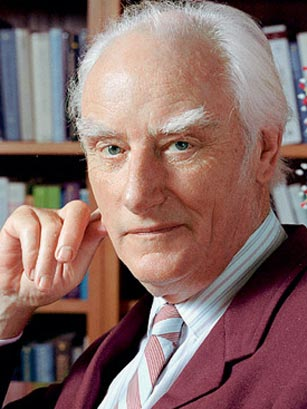
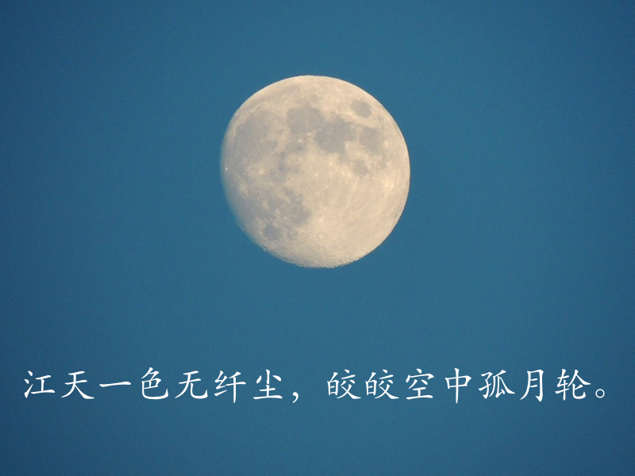
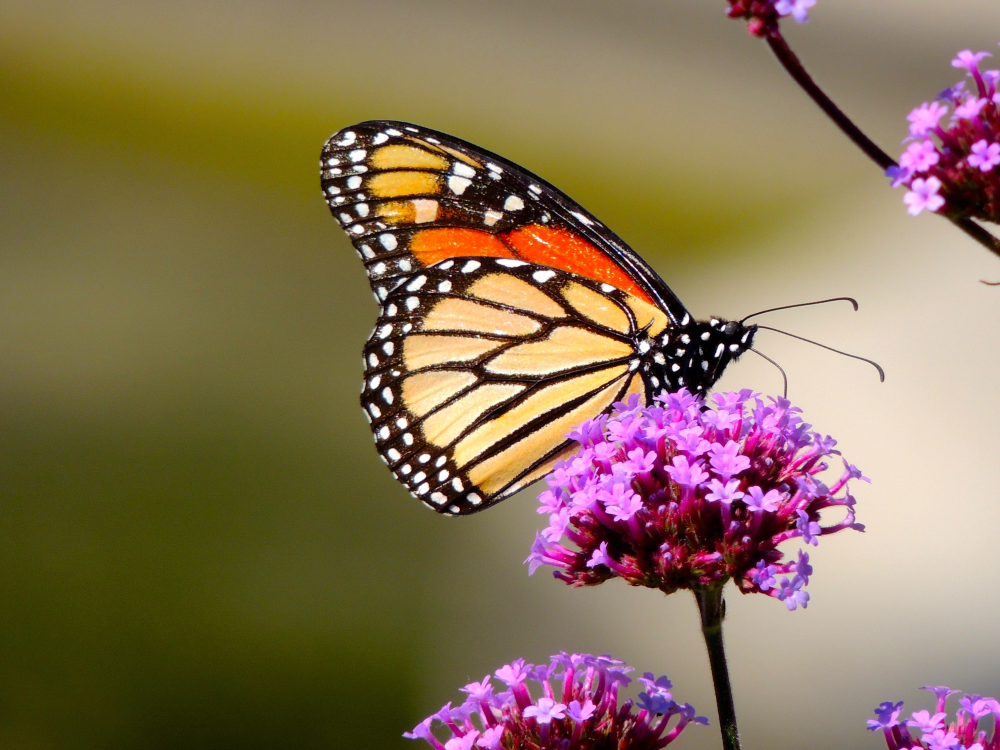
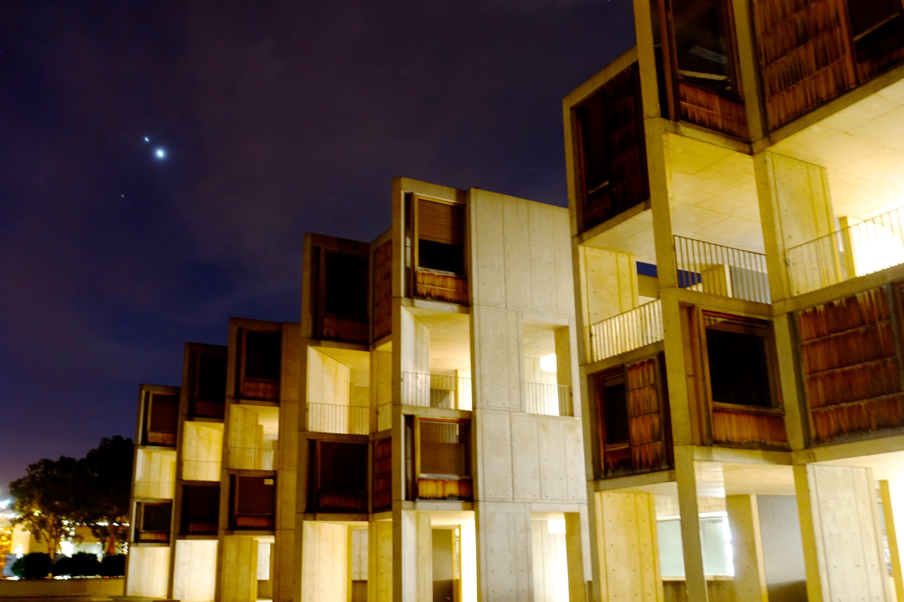
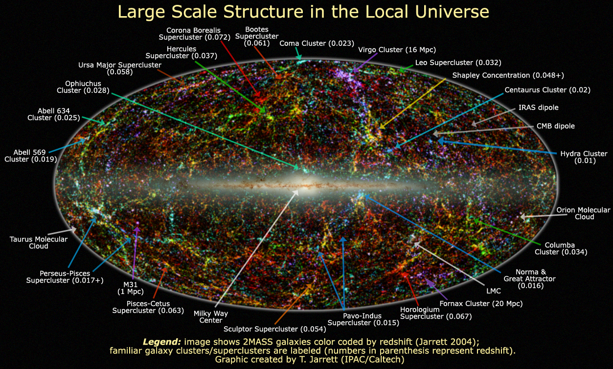

----

## 闲话Ｓａｌｋ　Ｉｎｓｔｉｔｕｔｅ的风流人物
发表于 2006 年 03 月 30 日

话说当年在美国东部活得好好的，却因年少冲动和慕这Ｓａｌｋ　Ｉｎｓｔｉｔｕｔｅ之名，来到人称是Ｗｉｌｄ　Ｗｅｓｔ的加州冒险。金子没淘到，却因此受了老婆不少的奚落。你看我怎么说漏嘴啦，哪壶不开提哪壶。初次在网上见面，该说些风光点的事情才好。对了，虽未淘到金子，到也见闻了生物医学界的一些风流人物，或许可以扯虎皮做大旗喧耀一番。

有人说男人四十是精品（一说补品），九十岁男人为奇品，一百岁男人是神品，往后的男人为仙品，虽英雄所见略有不同，却也是妙语高论。 这Ｓａｌｋ　Ｉｎｓｔｉｔｕｔｅ便有一位已是奇品的人物。此公名叫Ｒｅｎａｔｏ　Ｄｕｌｂｅｃｃｏ，虽九十多岁，却腰杆笔直，鹤发童颜，看来熬成个百岁神品仙品也是易如反掌。Ｄｕｌｂｅｃｃｏ在科学上的名气或许赶不上同所的因ＤＮＡ双螺旋成名的Ｆｒａｎｃｉｓ　Ｃｒｉｃｋ，但他及他的门生一门出了五个诺贝 尔奖获得者的记录却也至今无人能比。此公虽有如此成就，却也是个仁心厚到之人。一次在会上感慨吐真言：“Ｂｉｏｌｏｇｙ　ｕｓｅｄ　ｔｏ　ｂｅ　ａｎ　ａｒｔ，ｎｏｗ　ｉｔ’ｓ　ａｂｏｕｔ　ｍｏｎｅｙ，ｐｏｗｅｒ　ａｎｄ　ｐｏｌｉｔｉｃｓ．”一语道破大家彼此心照不宣的玄机，却也露出一个前辈对当今现实的无奈。此公的另一可爱之处就是喜欢在学术报告会前说点带颜色的笑话。有一次他的得意门生Ｄａｖｉｄ　Ｂａｌｔｉｍｏｒｅ来Ｓａｌｋ　 Ｉｎｓｔｉｔｕｔｅ做报告，他在介绍报告人的时侯竟然当众揭人家的短，说当年Ｂａｌｔｉｍｏｒｅ从纽约到Ｓａｌｋ　Ｉｎｓｔｉｔｕｔｅ做博士后，对当时圣地亚哥文化生活的贫乏深感苦恼，有一次观看一场画展，在一幅画前久久不愿离去，Ｄｕｌｂｅｃｃｏ趋前一看，那画上画的赫然是一个裸体美女，听众顿时一阵轰然大笑。这Ｂａｌｔｉｍｏｒｅ在美国科学界也算个风云人物。得了诺贝尔奖不说，还创建了Ｗｈｉｔｅｈｅａｄ　Ｉｎｓｔｉｔｕｔｅ，当过 Ｒｏｃｋｆｅｌｌｅｒ　Ｕｎｉｖｅｒｓｉｔｙ的校长，如今是加州理工学院的校长，但老师要说他的笑话，却也无可奈何。不过名人到底是名 人，Ｂａｌｔｉｍｏｒｅ上台后先谢过Ｄｕｌｂｅｃｃｏ的介绍，随后便说要澄清两个事实。一是当时圣地亚哥的文化生活不只是贫乏，简直就是真空；二是当时Ｄｕｌｂｅｃｃｏ看错了，那画上画的不是一个裸体美女，而是一面美国国旗，听众顿时又是一阵轰然大笑。

无独有偶，Ｓａｌｋ　Ｉｎｓｔｉｔｕｔｅ另有一位喜欢裸体美女的诺贝尔奖得主。此公名叫Ｒｏｂｅｒｔ　Ｈｏｌｌｙ，我来Ｓａｌｋ时已 经逝世了，无缘得见。据老板讲，此公的业余爱好是画裸体模特。我们实验室中有一质地很好但显沉旧的桌子，上面堆了各色杂物，老板说此桌具有收藏价值，一是 因为它是Ｒｏｂｅｒｔ　Ｈｏｌｌｙ留下来的，二是因为这桌子是当年模特们摆姿势的地方。这第一个理由有点牵强，在美国诺贝尔奖得主不稀有，光这小小的Ｓａｌｋ　Ｉｎｓｔｉｔｕｔｅ现在就有四位，如果在艰深难懂领域得个诺贝尔奖，社会大众也很难记住他们是何方神圣。我猜想这桌子的真正收藏价值该是模特们 令人留恋的余香倩影吧。

这Ｓａｌｋ　Ｉｎｓｔｉｔｕｔｅ里科学与艺术相结合的风气该是源自它的创建者Ｊｏｎａｓ　Ｓａｌｋ．Ｊｏｎａｓ　Ｓａｌｋ本身既是个 科学与艺术相结合的典范。他于５０年代在匹斯堡大学工作时发明了脊髓灰质炎（婴儿瘫）病毒疫苗，对控制和消灭这可怕的瘟疫做出了历史性的贡献。当年哪个父 母不害怕他们的孩子患上婴儿瘫呀，犹记当年在国内母校附院实习时骨科老师收的那些婴儿瘫后遗症患者，腿上肌肉萎缩得只剩皮包骨头，大都只好与轮椅终生为伍了。Ｊｏｎａｓ　Ｓａｌｋ在１９５０—１９７０年代是美国家誉户晓的英雄，光时代杂志封面就上了好几次。他有句名言“Ｔｈｅ　ｇｒｅａｔｅｓｔｒｅｗａｒｄ　ｏｆ　ｓｕｃｃｅｓｓ　ｉｓ　ｔｈｅ　ｏｐｐｏｒｔｕｎｉｔｙ　ｔｏ　ｄｏ　ｍｏｒｅ”，这当然是指他后来创建的以他自己命名的Ｓａｌｋ　 Ｉｎｓｔｉｔｕｔｅ了。他当年的宏愿是建一个科学与艺术相结合的殿堂，并且这殿堂的艺术性值得大画家毕加索前来观赏。他与名建筑设计家Ｌｏｕｉｓ　Ｋａｈｎ合作，设计建造了这后来被评为美国二十世纪十大现代建筑之一的Ｓａｌｋ　Ｉｎｓｔｉｔｕｔｅ。当时的Ｓａｌｋ　Ｉｎｓｔｉｔｕｔｅ搞生物研究和搞艺术哲学的并存。据Ｄｕｌｂｅｃｃｏ回忆，当艺术家画裸体模特的时候，隔壁搞生物学的非常激动，连实验都不想做了，要过去饱眼福。可惜好景不长，搞艺术哲 学的后来都消失，如今的Ｓａｌｋ　Ｉｎｓｔｉｔｕｔｅ只搞生物研究，连名字都改成Ｔｈｅ　Ｓａｌｋ　Ｉｎｓｔｉｔｕｔｅ　ｆｏｒ　Ｂｉｏｌｏｇｉｃａｌ　Ｓｔｕｄｙ了。说Ｊｏｎａｓ　Ｓａｌｋ本身是个科学与艺术相结合的典范可不只是因为上面的原因，诸位可知Ｊｏｎａｓ　Ｓａｌｋ为何要建一值得毕加索前来观 赏的建筑？原来Ｊｏｎａｓ　Ｓａｌｋ的后来的夫人便是毕加索的遗孀，使得毕加索的画风最后一变的女性。据说毕加索的画风一生五变，每次都因为他生命中的一位女性造成。这些女性除了美丽之外，常常本身也是才华横溢的画家。Ｊｏｎａｓ　Ｓａｌｋ逝世后，这位Ｓａｌｋ夫人偶尔出现在Ｓａｌｋ　Ｉｎｓｔｉｔｕｔｅ举行的纪念活动上，使得我辈凡夫俗子也有幸一睹这位名画家的风采。

诸位若觉得听别人的风流韵事不过瘾，俺还可介绍Ｓａｌｋ　Ｉｎｓｔｉｔｕｔｅ附近一个去处让有缘来圣地亚哥观光者实实在在地一饱眼 福，不但不需分文，而且男女平等。沿Ｓａｌｋ　Ｉｎｓｔｉｔｕｔｅ向西行走不过百米，便是一处叫作Ｔｏｒｒｅｙ　Ｐｉｎｅ　Ｇｌｉｄｉｎｇ　Ｐｏｒｔ的悬崖。悬崖上面是像鸟儿一样飞翔的各色滑翔翼，悬崖下面便是浩翰的太平洋啦。蓝天碧海，自有一番风景。但如若沿着羊肠小道走到悬崖底部的叫Ｂｌａｃｋ’ｓ　 Ｂｅａｃｈ的海滩上，这里则更有令初来者目瞪口呆的独特景色。只见这海滩上的男男女女，或散步戏水，或晒太阳打排球，大多都是一丝不挂。原来这是一处裸体海滩浴场。拒说欧洲也有类似的海滩，但想观光者却也需付出全裸的代价，比不上这圣地亚哥的Ｂｌａｃｋ’ｓ　Ｂｅａｃｈ，游人来了想脱就脱，不想脱则只管自由观赏既可。这Ｂｌａｃｋ’ｓ　Ｂｅａｃｈ上裸男裸女的观念不是已到化境就是还处于亚当夏娃未吃智慧果之前的状态，游人来了不但不会不好意思，还会上前打 招呼，有时甚至还会邀请大家加入裸体海滩排球的战场呢。

有一件事可证明这Ｂｌａｃｋ’ｓ　Ｂｅａｃｈ是圣地亚哥最好看的地方。朋友的朋友携家来圣地亚哥游玩，离开前朋友问其不满十岁的男孩 圣地亚哥哪里最好看，本想这孩子一定会最喜欢海洋世界，那里边的杀手鲸鱼表演可是蔚巍壮观，不料这孩子却语出惊人，说这Ｂｌａｃｋ’ｓ　Ｂｅａｃｈ最好 看。俗话说童言无欺，看来是不会假的了。不过俺私下也有点犯嘀咕，在美国长大的孩子是不是早熟，想当年我等二十岁了还是傻呼呼的。

记得有首很受欢迎的流行歌曲叫《哭砂》，这Ｂｌａｃｋ’ｓ　Ｂｅａｃｈ上的砂子应该不是哭砂，既使被冲入暗无天日的海底，也总比它处的砂子多一点快乐的回忆吧。

 

## 记念Francis Crick
发表于 2012 年 06 月 30 日 

Francis Crick于七月二十八日逝世，享年八十八岁。据说他在死前两小时还在写作一篇科学文稿。科学界失去了一位真正的科学家，Salk Institute 失去了一个最璀灿的标志。于我个人而言，则是失去了一个曾经照亮心灵的灯塔。

学 生物的人大概没有不知道Francis Crick的。他和James Watson 因发现 DNA的双螺旋结构而永载史册。出于个人的偏爱，我对Crick的敬仰更多一些。Watson 在发现 DNA双螺旋后虽然做了一些很重要的事情，如写了一些很受欢迎的教科书，在当冷泉港研究所所长期间培养了很多人才，但他自己在科学上再无重大建树.Crick则不然，可以说DNA双螺旋发现后遗传密码的最终破译是在他的理论指导下完成的。后来他转向脑的研究，晚年更力倡用现代科学手段研究脑意识，使 之成为一门受尊敬的学科*。说Francis Crick是生物学界的爱因斯坦，应该不算太过分。

初次知道Francis Crick这位教课书上的人物还活着并在加州圣地亚哥的Salk Institute工作大约是1990年。那时我正在华盛顿DC郊区的NIH（美国国立卫生研究所）工作。巧的是和我们在同一层楼工作的有一位NIH引以 为傲的诺贝尔奖得主，破译遗传密码的Marshall Nirenberg. NIH把他当年破译遗传密码时所用的仪器和实验记录陈列在10号楼供人参观。偶而在楼道上碰到这样一个鼎鼎大名的人物，心中的敬仰之情是不言而喻的。当时他的实验室有一位上海来的博士后，闲谈时对他能在这样有名的人手下工作深表羡慕，他却说Nirenberg对Francis Crick最敬佩。原来Crick和Watson 发现 DNA双螺旋后又和Sidney Brenner合作证明基因密码一定是三个碱基编译一个氨基酸，这时所需要知道的是怎样把64种可能的三连体碱基组和20种氨基酸对应起来。 Nirenberg当时正具备解决着个问题的实验手段,但却是无名小卒。Crick慧眼识英雄，在莫斯科举行的一个分子生物学会议上，Crick把Nirenberg的小组发言改为大会报告,这对于遗传密码的迅速破译和Nirenberg的成名应该是有很大作用的。Crick这种促进科学提携后进的举动正好体现了一个大科学家的风范。我常想分子生物学突飞猛进的这么快与有Crick这样正直睿智的领军人物是分不开的。

后来读了Crick的自传”What mad pursuits”，对他佩服的更是五体投地。毕业后不顾太太的反对到Salk Institute做博士后，应该说与对Crick的敬仰也有一点点关系.　当然随后便常在走道上，食堂里和学术讲座上看到这位自己崇拜的偶象。 Crick身材高大，轮廓分明的面庞配上极具特色的浓长白眉，我太太一见便说象极了中国武打电影里边的掌门人或大宗师。我们这些对他敬若神明的博士后们当然期望他的一言一行都象神明一样，这有时就难免导致失望。这种遗憾后来在听了他的一连三次的学术讲座后便彻底消除了。八十几岁的人了，其思辩的清晰明洁，学术的勇于创新，又岂是我们这些年轻人能及其万一。尤其是他不用图片纯用语言描述沟通复杂问题的能力，让人叹为观止。好几次想和他合影留念，但遗憾的是当时手中没有像机。好在买了一本他签名的书，也总算没白做了一回追星族。

Crick不是喜好名声之人，但他的好朋友James Watson却乐于此道，使得他也跟着出名。来美国许多年，听说了一些竞选诺贝尔奖的内幕，其神圣的光环也就不再那么明亮了。后来也想通了，科学既是人做的，人的各种品质，不管好的坏的，当然就会掺杂其中。但对Crick这样真正的科学家，我的敬仰却不曾减弱分毫。

大科学家逝世了，自有有头有脸的人物出面记念，小人物也来凑热闹，只为那曾被拨动的心弦。十几年一枕科学梦。现在做这篇短文记念Francis Crick，同时也为自己过去对科学的幻想，热情和执着记念一下吧。

＊注：读了一些经过注释的佛经后，我已不相信Crick对意识的纯唯物主义的假说，但这并不妨碍我对他的敬仰。

－－写于2004年八月

 

## 马头琴——心灵震颤的回响
发表于 2006 年 04 月 18 日

初次听到马头琴和蒙古歌曲可能是在观看《东方红》时听胡松华唱的《赞歌》。后来又听到了《美丽的草原我的家》，《森吉得玛》，《嘎达梅林》，蒙族的《酒歌》以至近来腾格尔的《蒙古人》《我的故乡，我的天堂》。对马头琴独特的音色和蒙族音乐一直是喜爱有加，常遗憾回国时没有带回一盘马头琴曲专集。前些天在网上找到了一些马头琴曲，一听之下，大喜过望，惊为天音。心满意足之余，便想到网上与大家共赏。有兴趣的朋友，看你听后是否喜欢和得到一个更舒畅的心情。

马头琴，蒙语又称“绰尔”，据说在公元１３世纪既已开始在蒙古族中广泛使用，比欧洲小提琴的出现要早三百年。最早的马头琴，据传琴干是由马骨制成，马皮做琴身，弦与弓则取自马尾，内弦１２０根，外弦１８０根。马头琴细腻如小提琴，醇厚如中提琴，深情如大提琴。这仅有两根弦索的乐器竟有如此丰富的表现力实在令人匪夷所思，而它那浸染了马的灵性的独特音色就更是其他乐器所无法模仿的。演奏起来，那略带忧伤苍凉的琴声高低起伏，上下回旋，常在不经意处婉转曲折， 令人有回肠荡气的感觉。京剧里有些花旦老生的唱腔有时也能给人类似的感受。

蒙古人世世代代与马相濡以沫，马是他们生命里忠诚的伴侣甚或是他们生命的一部分，正是这种对马的了解和深情使得他们能够把马的灵气赋予马头琴这种独特的乐器。蒙古人真是一个多情深情的民族，这个曾经横扫欧亚大陆的民族，他们那略带忧伤而又心潮起伏的旋律，即使在一些欢快的节奏下，也仍能让我们听出其内心的 忧愁。

下面介绍几首由贺西格演奏的马头琴曲。《天边》的情深意长，《韵湖》那略带忧伤气息的骏雅飘逸（齐保力演奏），感伤多情的《黑小伙》，欢快的《小骝马》，《岩山》中由孤独感伤思念所汇成的心潮起伏，《我从草原来》的美丽辽阔，《牧歌》的如诗如画如吟如唱，都无不给人以震撼心灵的美的享受。即使象《走进西藏》这种描写西藏的曲子，一经马头琴演奏，便平添了独特的神奇。

写到这里，忽然想到人的审美观虽因个体环境教育而不同，但对很多东西的美的感受，如对自然山水的美感，却似乎是与生俱来的，不受种族和后天环境的影响。据说有人曾对婴儿们显示美与不美的图片，婴儿们对美丽图片的偏好非常明显。那么这种先天的审美观又是从哪里来的呢？这个问题应该属于美学哲学的范畴，对这方面我是一窍不通，但觉得网上流传（不知原创是谁）的《水滴一样的音乐－－爱尔兰风笛》中的一段话对这一问题给出了最美好的解释。这段文字太美了，我就把它 一字不差地抄在这里：

“柏拉图说，人的灵魂来自一个完美的家园，那里没有我们这个世界上任何的污秽和丑陋，只有纯净和美丽。灵魂离开了家园，来到这个世界，漂泊了很久，寄居在一个躯壳里面，它忘记了自己是从哪里来的，也忘记了家乡的一切。但每当它看到、听到或感受到这世界上一切美好的事物时，它就会不由自主地感动，它就觉得非常舒畅和亲切——它知道那些美好的东西，来自它的故园，那似曾相识的纯净和美好唤醒了它的记忆。于是它的一生都极力地追寻着那种回忆的感觉，不断地朝自己 的故乡跋涉。人的生命历程就是灵魂寻找它的美丽故乡的归途。我断定风笛的声音是从灵魂的故乡飘来的。在听到它的时候，发现心中有许多对于故乡的思念和回忆。因为那种天籁般的声音，是故乡的召唤，它在问我还要漂泊多 久……”

如果说爱尔兰风笛那如天籁般纯净美好的声音是从灵魂的完美故乡飘来的，那么马头琴的声音则更象是灵魂在这个不完美的人世间经历喜怒哀乐时所发出的震颤回响。如若让翱翔于云霄的爱尔兰风笛和回旋于天地间的马头琴合奏一曲，那又将会给人以怎样的感受呢？

 

## 神奇的蒙古族呼麦喉音唱法

一个人的喉咙同时发出高低两极的声音似乎是不可能的事，然而这正是神奇的蒙古族呼麦（又名喉音唱法）所显现的，神奇到一个获得诺贝尔奖的量子物理学家都着了迷。下面收集了油管上的我所喜欢的几首呼麦及摘录的一段文字，与感兴趣者分享。

《喉歌者说：图瓦8年》摘录：

故事从一个叫图瓦的地方开始。这是一个与蒙古和西伯利亚接壤的国家，曾被纳入前苏联版图，在人们的视野中消失了差不多有一个世纪。当然，有两个例外：一些狂热的集邮家和一位叫理查德·费曼(RichardFeynman）的原子物理学家。费曼曾经立志要进入图瓦的首都Kyzyl—是个自称是亚洲大陆中心的城市，可惜尚未成行就离世了，代替他完成遗愿的，是他的好友兼同道者拉尔夫·莱顿(RalphLeighton)。莱顿在1988年到达了那个“看不见的城市”，5年后，他把3个图瓦牧马人带到了美国加州。从此，一种匪夷所思的人声艺术惊艳出场了。
 
图瓦的声音
      你可曾听过这样的人声？从一条喉管，同时伸出两条声线，不同的音高与音色，一条和着另一条，永远超出你意料的“旋律”，赤裸裸的揪人心扉的自然之声……这种图瓦特产被称为“喉音演唱”(throat-singing，overtone－singing)，它瞬间成了世界音乐图景中神秘的金字塔。几年来，大批的图瓦艺人从东方走向西方，走向爱丁堡音乐节，走向纽约大都会，走向HMV与CD Tower，与电脑科技合作，与时髦制作人和先锋音乐家合作……

图瓦喉音唱法:

 

神奇的蒙古族呼麦：Mongolian Incredible Throat Singing

潮尔/呼麦“呼麦”，又名“浩林·潮尔”，是蒙古族复音唱法潮尔（chor）的高超演唱形式，是一种“喉音”艺术。运用特殊的声音技巧，一人同时唱出两个声部，形成罕见的多声部形态。演唱者运用闭气技巧，使气息猛烈冲击声带，发出粗壮的气泡音，形成低音声部 。在此基础上，巧妙调节口腔共鸣，强化和集中泛音，唱出透明清亮、带有金属声的高音声部，获得无比美妙的声音效果。

神奇的蒙古族呼麦 Part 1

神奇的蒙古族呼麦 Part 2

 

## 爱尔兰风笛（Irish whistle）和爱尔兰音乐（Celtic music)

有人说爱尔兰风笛那如天籁般纯净美好的声音是从灵魂的完美故乡飘来的。很喜欢Joanie Madden的爱尔兰风笛 （Irish whistle）曲，下面这首她演奏的《Pinehurst》也不知听了多少遍。和其它优美的风笛曲调不同，它给我的感觉是雄伟辽阔，深沉与激情相交织。有一种历尽劫难后的感叹喜悦与深情；有一种催人奋发向上，不甘沉沦，直冲云霄的雄壮，嘹亮与高亢。

以前做科研实验时有时做的很晚或晚上回去加班，有一个阶段几乎每次晚上回家的路上都听这个曲子，那时不管多么疲惫，不管实验结果好不好，一听这曲子便马上感到一股振奋和舒畅。现在这些做科研的经历似乎都已成了遥远的前尘往事，唯有听这曲子时仍然可以感受到那种振奋和舒畅。

Pinehurst by Joanie Madden: 

Joanie Madden-Down by the sally Gardens

感觉爱尔兰音乐（Celtic music) 很有特色，和蒙古西藏音乐舞蹈一样特色鲜明，但又完全是不同的的特色：

The Foggy Dew - Celtic Piano by William Haskell Levine: 

The Star of the County Down - 3JS:

 

## 观看2005年春节晚会随感
－－写于2005年春节

刚看过今年春晚的录像带。这届春节晚会有很多令人惊奇感动，耳目一新的时刻。

舞蹈《千手观音》的确让人感动震撼，这种震撼似已超出了音乐舞蹈而深入人的心灵。

韩红的歌曲《天路》让我想起了李娜的《青藏高原》。如果说李娜的《青藏高原》给人的感觉是神圣庄严和灵魂震撼的话，韩红那美妙柔和的歌声则象天上撒下的滋润人间枯燥心田的甘露。

又听到了久违了十几年的蒙古族歌曲《酒歌》。蒙古族的音乐歌曲常令我想到人世间的英雄：或豪迈壮阔或悲郁苍凉。再没有比马头琴那高低起伏回肠荡气的奏法音色更适合表达这种感情了。

刘德华的《恭喜发财》也不错。 另外还有《顶碗》和《头顶梅花桩》，真是惊险绝伦，叹为观止。春联对的很工整，不过印象更深的则是一首少数民族歌谣的汉译：

山寨年年流水长，

竹笋年年遍山岗，

竹林青青歌声起，

山歌年年唱春光。

 
看舞蹈《千手观音》:

观音慈悲临世间，

千手挥舞救厄难。

撒向人间都是爱，

唤醒真心泪满眼。
 

 

千手观音: 

 

## 母亲的葬礼
发表于 2012 年 06 月 30 日

3月15日大约凌晨一点（美国时间）接到母亲在那天上午（中国时间）突然去世的电话，如梦似幻，不信与惊愕交织，随即便决定尽快赶回去。一通忙乱之后，在朋友、同事和亲人的关怀帮助下，终于在母亲去世后第四天，在遗体火化前赶到家乡母亲的灵房所在地，一个偏远的、沂蒙山区的山村。可怜我那些悲哀、疲惫的亲人亲戚们，为了等我回去再办葬礼，已经在早春的寒夜中守灵三天。

母亲安详地躺在棺材里，像生前睡着一样。我请求满屋的人暂时出去，让我和母亲单独说几句话。随后便按村里的风俗举行葬礼，将母亲的遗体运到县城火化，再收拾遗骨回到村里下葬。母亲 — 我在这个世界上最亲近牵挂的人，缘分最深的人，就这样突然地、永远地离去了。

母亲是在县城的大街上购物时突然晕倒去世的，近些年来父母一直住在县城。母亲下葬后回到县城的那天晚上，我走进母亲生前的房间，坐在她的床上，一股强烈的悲哀袭来，我平时是个欲哭无泪的人，但此刻泪水却止不住地流。我自责疏忽了她的高血压脑血管病，在她去世前那个周末是应该给她打电话的，结果因为忙碌也没有打。这时屋外风声大作，吹得窗户呜呜作响，我一边流着泪，一边给母亲读《西藏生死之书》，那时我确信，母亲就在那个房间，我们的心灵连在一起。当我来到 母亲去世时的街上，听旁边的摊主讲述母亲去世时的情景，眼泪也是止不住地流，那时我也确信，母亲就在旁边。

母亲的离去是如此地突然，以至于连她自己都没有料到。记得有一次通话时母亲曾高兴地说她找人算命了，她和我的寿命都会超过80岁。她去世前两周和我通话时还说折磨她几十年的胃病和劳损的腰椎都好多了，她身体好的很，叫我们不要担心。周围的邻居也都说母亲生前的身体与活力都很好，但显然是我们只顾虑她的胃病和腰椎而忽视了她不太明显的高血压脑血管病了。父亲的高血压心脏病是很明显的，自觉会先母亲而去而为自己选好了墓地，那呈想母亲先住进去了。母亲的去世对 大家的打击都很大，留下了很多遗憾，尤其想到她一生经历了那么多的磨难劳苦，终于可以在晚年过几天好日子的时候就这样突然走了，心中便一阵阵难过。

母亲姓牛，1940年生于沂蒙山区的一个大多是姓牛或姓田的山村，终年不满70岁。父母这一代人，包括我的很多老师，都经历了抗日战争、解放战争、建国后包括文化大革命在内的历次政治运动及后来的改革开放。母亲的命运自然也就逃脱不了这些大的背景事件的影响。抗日战争时父母尚小，但都有躲避日本鬼子的记忆，父亲的头顶上有一块2厘米见方的颅骨陷于脑内大约1厘米，就是在逃避日本鬼子时期在山上撞到石头后造成的，所幸大难不死。解放战争中姥姥一家在战乱中 幸运地活下来，而当过国民党县政府宣传部长的外祖父却不知去向。五十年代姥姥一家相依为命，母亲聪明好学，在大跃进大炼钢铁的时代到了当地一个铜矿工作，以仅仅在山村上了一段夜校的基础被认为具备高小程度而被选拔到外地培训，更进入厂矿的文艺宣传队学习唱歌跳舞，父亲母亲就是在这个铜矿相识的。正当母亲的 前途一片光明的时候，外祖父的做过国民党政府官员的经历和他在南方逃避多年后的重返家乡都使得姥姥一家人的命运从此笼罩在他的这段历史之下。母亲大约是1960或1961年被遣返回农村，随后和父亲结婚，我是1963年底出生的，在家里排行老大，后来又有了一个妹妹和两个弟弟。父亲常年在外地的厂矿工作，一年难得回家几次。母亲常说自己既做女人又做男人，除了应付一家大小吃穿外，还必须面对那些本来是男人干的繁重的体力活农活。虽然父亲的工资可以买生 产队的粮食，但那些在山岭上田地里就地分配的未经处理的粮食或需要就地处理或由母亲一担一担地挑回家再做处理。另外还有自留地和菜园需要母亲种植管理。母亲很要强，自信种菜种地都不必男人差，但那些繁重的体力活农活对一个拖儿带女的母亲来说实在太过艰难，常常使她处于分身无术的困境。母亲有时说起我4-5 岁的时候腿上长了一个大痈疮，无法走路，妹妹那时还不到两岁。母亲需要出去处理农事，想先把妹妹安顿好，而我却抱住她的腿，不让她走，最后便导致三个人一起哭的场面。等我稍大些，便开始帮母亲干活了，还记得我开始到几百米外的井打水挑水也不过7-8岁的年龄。我的小学老师马老师还记得我当年（大约是十岁）带着妹妹弟弟们去上学，我在教室里上课，妹妹弟弟们则带着吃的在外面玩，因为那时外祖父病危，母亲不得不前去守护。秋收季节是一年当中最累的，常常是全家 在田野里呆一整天，傍晚才回到家，我们这些孩子们便累得东倒西歪睡着了。母亲必须休息一会才有力气做饭，然后再把我们一个个叫醒，吃饭，再睡觉。后来我上高中时住校和到外地上大学，母亲便少了一个帮手。记得我上大学时母亲推车妹妹拉车从山岭上往家运东西，结果车翻到山沟里，母亲的脸被划了一道大口子，血流 不止，到医院缝了七针，我听到后心里那个难过呀！我想直到父亲从工厂退休及弟弟们长大，母亲才真正从这些体力活中解脱出来。母亲性格坚强，身体的劳苦她都能忍受，而当时社会人事生存环境的恶化（如文革时派系武斗母亲对父亲命运的担惊受怕）和诸多的不顺却对她的精神心理产生了很大压力，有几次甚至到了不愿再活下去的地步，只是在看着孩子们熟睡的可爱面孔时才咬紧牙关活了下来。母亲生性善良，为人处世有自己的准则，乐于助人，不愿伤害别人，得到了大家的尊敬。熟知母亲经历的人和我说起她时，或是一声叹息或是一句：“你妈妈这辈子真不容易呀！”。此后便不需再多说什么了，一切尽在不言中。

上面说了很多母亲吃苦受累的事，但在我早年的记忆里更多的却是快乐的时光，也许是小孩子不记得或不理解大人的烦恼事吧。虽然辛苦，我觉得母亲在拉扯教养我们的过程中大多是幸福快乐的。母亲是一个热爱生活的人。给我们做好吃的，做新衣服穿，看我们吃下穿上，看我们成长快乐，母亲是高兴的。父亲回家，亲朋来往，添置新物，庄稼丰收，节日庆祝，母亲是快乐幸福的。母亲自己没有机会上学，对于我上学是非常支持的，即使这意味着她少了一个干活的帮手。还记得上小学 时母亲在一边纺线，我在一边读书的情景。那时她还用《三字经》中“子不学，断机杼。”孟母为让孟子好好读书而三次搬家的故事教育我，给我讲《二十四孝》中的故事。我想这些可能是从外祖父姥姥那里传下来的。外祖父命运不济却是个孝子，在我大约十岁时就去世了。姥姥历尽风霜磨难却永远不改她那慈祥亲切的容颜。 每次到姥姥家，姥姥舅姨母亲之间那浓浓的亲情，说不完的话，临别那依依不舍的情景都让我感动和羨慕。我在学校拿了好成绩或奖状回家，母亲是非常高兴的。母亲时常让我帮她干活，如推磨、挑水、烧火、喂猪等。记得我那时最厌烦的事就是早上放学回家第一件事就得做猪食喂猪。我小时是很顽皮贪玩的。母亲为了稳住我，帮她处理运回家的农作物，便一边干活一边给我讲故事，或教我唱她当年在厂矿文艺宣传队学的歌。当我上大学后听到一些当时流行的歌曲，如《我的祖国》 《九九艳阳天》等，一听便想起母亲以前曾经教过我这些老歌。但小孩子干活的耐心毕竟有限，我忍不住了便要去靠街的厕所，母亲左等右等我都不回来，其实那时我早就翻过墙头到街上玩去了。后来我考上了大学，母亲当然是非常高兴的，但从此便增添了无尽的牵挂，正应了那首唐诗：＂慈母手中线，游子身上衣。临行密密 缝，意恐迟迟归。＂。再后来我又到外省读研究生，到美国留学，离她越来越远。当我们有了一对孩子时，母亲是多么想来美国帮我们呀，可惜两次长途旅行去北京都没有得到签证，母亲当时都急了，我知道这件事对母亲伤害很深，也是一个永远的遗憾。那些签证官想象着母亲来美国后会有移民倾向，他们那里会理解母亲只是想来帮助我们的心情呢！近些年来，我们每二三年回国一次，带着孩子长途旅行，非常辛苦，每次都是来去匆匆，很多时间花在路上，和父母在一起的时间很短。每次要走时，母亲都说，这么快又要走了，象做了个梦一样，正如我几年前回国有感所作的一首顺口溜一样：＂离国经年把家探，乍睹苍颜倍心酸。几日相处恍如梦， 临别又见老泪含。＂。 近年来习惯于每两个星期就和母亲通话，听她的近况，听她对我们的关心和因看电视新闻引发的对我们这边的担心。有时忙起来没有按时打电话，她便非常担心我们 这边出了什么事。于今电话那头是再也听不见她的声音了。

逝去的人离开了这个世界，而活着的人还要继续各自的人生旅程。人生一世，谁又能避免生老病死和命运的无常呢。哎！母亲，按照佛教的轮回生死观，今世能为您 的儿女，是因为前世我们有很深的因缘；而我们今世的缘分又形成了来世我们再互为亲人的宿因。今生的遗憾已无法弥补，唯愿来世能报答您于万一。“谁言寸草 心，报得三春晖。”。

整理母亲的遗物时，看到了下面这张父亲母亲及他们的朋友们年轻时在厂矿的合影。照片的陈旧和破损也难掩他们年轻的风华。让美好的记忆留在心底吧，妈妈，我们永远怀念你！

——写于2010年4月5日母亲去世后第21天 （刚好是清明节）

后排左一是母亲，前排左三是父亲。

 
梦中的母亲（Sercihma 斯日其玛 演唱): 

 

## 老子《道德经》第十六章“致虚极，守静笃”－－我所看到的一段精彩英文翻译
发表于 2012 年 06 月 30 日 由 胡沂

老子 《道德经》被称为中国人的圣经，可惜太难懂。我们文革中长大的人，更难与它有缘。说来有趣的是我第一次读到《道德经》的片段是在美国，且是英文，整个一个出口转内销。那是我在美东上学的时候，我们实验室的门上贴着下面这首像是诗一样的英文，读了以后觉得很有哲理，下面落款作者是Lao Tzu, 我当时并没有意识到是老子，这可能是老式的汉语拼音。后来有个美国学生读后还很兴奋问是不是我把它贴到门上的。到底是美国人还是中国人把它贴到门上的看来很难搞清了，但喜欢这段文字的人似乎不受种族的限制。后来我知道它是老子《道德经》第十六章“致虚极，守静笃”英译，也看到近来网上的老子《道德经》英译 本对这一段的翻译，但和下面的这段翻译相比则显的无多少神韵。

The ten thousand things come into being, 万物并作，

And I have watched them return. 吾以观复。

No matter how luxuriantly they flourish, 夫物芸芸，

Each must go back to the root from which it came. 各复归其根。

This returning to the root is called quietness, 归根曰静，

It is the fulfilment of one’s destiny. 静曰复命。

That each must fulfil his destiny is the eternal pattern, 复命曰常，

To know the eternal pattern is to be illuminated. 知常曰明。

He who knows it will not be withered by misfortune. 不知常，妄作，凶。

He who knows the eternal pattern is all-encompassing, 知常容，

He who is all-encompassing is completely impartial, 容乃公，

Being impartial, he is kingly， 公乃王，

Being kingly, he is like heaven， 王乃天，

Being like heaven, he is at one with Tao， 天乃道，

Being at one with Tao he is, like it, imperishable， 道乃久，

Though his body may disappear into the ocean of existence, 没身不殆。

He is beyond all harm.

 

## 新年的感慨
发表于 2012 年 06 月 30 日

上个周末打牌时我提到近来突然感觉有点眼花且发展很快，几个年近五十的牌友也都有同感。核心牌友老曹更是大发年近五十之感叹，说这几年怎么过得这么快，另外还会讲一些年近五十时身体变化的笑话，令人捧腹。的确，这几年时光过的真快，好几位牌友的孩子都已上了大学，扑克也已打了快五年，在这种如流水般的忙碌中，我们也已变得发白眼花，真是人生易老，时不我待啊！哎又岂止是我们这些凡夫俗子有此感叹，诗人李白说：“君不见黄河之水天上来，奔流到海不复回；君不见高堂明镜悲白发，朝如青丝暮成雪。” 圣人孔子则说：“逝者如斯夫，不舍昼夜。”

时间难道真是个独立于我们意志之外的，从过去到现在，从现在到未来，永远前进的东西吗？古往今来多少人都为时间而迷茫。古人说：“江畔何人初见月？江月何年初照人？人生代代无穷已，江月年年只相似。”“前不见古人，后不见来者, 念天地之悠悠，独怆然而涕下。”那么今人呢，在今天我们这个科技高度发达，精确到用原子钟计时的时代又是如何理解时间呢？时间可分为心理时间和用钟表计量的物理时间。至少心理时间是相对的，一个年纪很大的人可以童心依旧而不觉老，快乐或投入可使很长的时间感觉很短而痛苦或折磨可令短时变得漫长。那物理时间是绝对的吗？也不是。爱因斯坦的相对论说，对以接近光的速度行进的物体或人来说时间将会明显缩短，在完全达到光速时时间就会完全停止。在微观的电子中子质子光子等等的亚原子量子世界，量子力学也告诉我们时间不存在，过去现在未来没有区别。各种宗教的圣者，不管是犹太教基督教的神祕教派，或是伊斯兰教的苏菲教派，或是佛教道教印度教，或是印地安人印度尼西亚人的宗教等等，当他们进入忘记自我天人合一的境界时，都能真切体认到时间不存在。他们说，在灵性世界，万古千秋，无前后际，只有一时，只有现在，只有当下。

因此，上到形而上的只有极少数人才能感知的灵性世界，大到形而下的高速高重力的宏观宇宙世界，小到微观的亚原子的量子世界，时间都是相对的或不存在，只是在中间这个我们可以用五官感知的普通日常世界里才觉得时间象河水一样地向前流，象箭一样向前飞，从过去到现在，从现在到未来。这些都提示我们所熟悉习惯的普通日常世界，很可能只是一种因我们大脑感知能力的局限而造成的特殊情形。如果宗教哲学科学都揭示时间是相对的，是人的大脑认识表达世界时所形成的幻觉，那为什么我们的直觉却告诉我们时间是如此真切，一切生物都要经历从生到死的老化过程？这个问题至深至奥，就连爱因斯坦这样明智的人都承认没有搞清楚。他在《我的人生观》中说：“What an extraordinary situation is that of us mortals! Each of us is here for a brief sojourn; for what purpose he knows not, though he sometimes thinks he feels it.我们这些凡人的命运是多么奇特呀！每个人在这个世界上都只作一个短暂的逗留；目的何在，却无所知，尽管有时自以为对此若有所感。)

说到这里，忽然觉得自己一时忘忽所以，扯的太远太枯燥了。赶紧换个轻松有趣的话题。对了，新的一年又快到了，好多新年贺词吉祥话是很有趣逗乐的。其中有一串从一数到十，再加上百千万，句句都是好听的话：一帆风顺、二龙腾飞、三羊开泰、四季平安、五福临门、六六大顺、七星高照、八方来财、九九同心、十全十美、百事亨通、千事吉祥、万事如意。

看到这里你可能觉得中国人把好话都说绝了，先不要这么急着下结论嘛，近来看到一段美国人的吉祥祝福话，和中国人的相比那可是毫不逊色：

May the road rise up to meet you, (祝你吉路千条，左右逢源，）

may the wind be always at your back,　（祝你永远顺风，）

the sunshine warm upon your face,　（祝你的生活充满阳光，　）

and may God hold you in the palm of his hand。（祝神将你捧在他的手掌心。）

要过年了，当然要恭喜新年发财。这年头发财似乎比什么都重要。另外还得有雪才更吉祥完美，正所谓中国人的“瑞雪兆丰年”和美国人的“White Christmas”。说到雪呀，来圣地亚哥十多年，从未见过下雪。当然周围的高山里是会下雪的，但我们看不到。过圣诞节的时候大家都唱“White Christmas”, 我们这里的太阳加短衣可就显的很滑稽了。孩子们都快六岁了才第一次在犹他州玩了一次残雪，还高兴的不得了。想到小时候扫雪玩雪真是很有意思。记得有一年除夕夜下大雪（十多岁时），我和伙伴们不顾父母阻拦，挑着灯笼在街上玩，虽然冻的够呛却玩得很痛快。

兴之所至要诗兴大发才显得文雅带劲，但诗词是不会写的，这辈子怕也学不会了，为了不扫兴，就用两首顺口溜凑合吧：

《迎新年》：“南加四季少变换，阳光灿灿雪难见。三十年前除夕夜，雪里挑灯迎新年。”

《忆过年》：“过年好，最好是儿时。除夕团圆饱佳肴，初一热闹试新衣。能不心欢喜。”

当年穷乡僻岭的孩子们盼着过年，能吃顿好饭，穿件新衣，就已经心满意足，欢喜无限了。

年年岁岁庆新年，岁岁年年人不同。

在新的一年里，祝幸运之神将你捧在他或她的手掌心！

 

## 元宵节话竹缘
发表于 2016 年 02 月 21 日 

元宵节来临，＂四时佳兴与人同＂，乘兴做了彩色元宵，红绿两色分别来自于beet汁和打碎的菠菜。以前看见有人在网上贴了自做的多色汤圆，今天终于得以模防了一下。

这元宵节和竹子本来扯不上干系，硬扯在一起是因为今天终于完成了几个周末以来一直在进行的一个艰巨的任务：把养了十年多的竹子连根拔除。近来竹子疯长，把木院墙挤歪了，邻居前来告状，孩子妈也一直不喜欢竹子生长的侵略性和落在地上的黄竹叶，我虽然不情愿，也终于决定把这丛惹祸的竹子连根清除。从朋友处借来了电锯，收获了一大堆竹竿倒也没觉得费劲，但把竹根清除以免以后再长却是十分艰难，领教了竹子盘根错节的历害。请来的gardener 本以为可以用他的钻混凝土的机器清除竹根，结果对有韧性的竹根没什么作用。最终我用一个沉重的铁鍬，以愚公移山的精神，仗着农村出身的老底，分割击破，手上起了血泡和茧子，终于在今天完成了任务。

孩子妈想着我这么费劲挖竹根一定后悔当初不听她的劝告坚持在后院种竹子了，我说才不呢，我已经亨受了清风竹韵十年呀，值了。看惯了翠竹绿叶在蓝天白云下摇曳生姿，习惯了鸟儿在某上鸣唱，更有星空月夜下竹影婆娑， 弯月如钓。院子里有野花杂草，只要好看，我都不忍心为整洁将之除去，为此常和孩子妈意见不同，何况养了这么久的竹子呢！

生长于无竹的北方，一直对竹子好奇。除了书画上的竹子，最早看到比较逼真的竹子应该是青少年时期看到的几部南方风貌的文革电影罢：“翠竹青青吆披霞光，春苗出土呀迎朝阳。＂ ＂小小竹排江中游，巍巍青山两岸走。＂后来在动物园植物园见到竹子，但始终没有去南方看过真正的竹林。十多年前在我们现在居住的小区看房时，见有一model home的前后院都种有这种可以长得比较粗而又不会到处乱窜的clumping bambo，很是喜欢。孩子妈一直害怕竹子乱长，最后总算买来种下了，这么多年倒没有发现乱长，只是不时有黄竹叶掉在院子里，总想除之而后快，现在应该是随却心愿了。

竹文化应该是比较有特色的源源流长的中国文化了，还有以竹子为食的大熊猫这样一个独特的动物。很高兴能有缘与竹相处十年，今日缘尽，想起了在某本书里看到的古人的一段话：＂风过疏竹，风过而竹不留声。雁过寒潭，雁去而潭不存影。故君子事来而心始现，事去而心即空。＂ 我们普通凡人达不到这种豁达放下的境界，翠竹绿叶若能在脑海梦乡里存留显现也很欢迎。

 

 

 

## 明月一轮不同看，中秋万里共婵娟。
写于２００３年9月7日晚

最近去华人超市购物时看到各式月饼，才想起中秋节就要到来了。这些月饼大都二十多美元一盒（四个），贵得有点离谱。不过商家说他们也有不得已的苦衷，说是月饼一年只卖一次，不能薄利多销，因此只好抬高价钱。据说国内还有千元万元一盒的高级月饼，古人若是知道此事，大概不是感叹世风不古，就是羡慕今人文化品味高吧。

我们中国人对月亮可说是情有独衷。中秋赏月吃月饼的习俗应该已过千年，文人骚客歌月咏月的诗词文章更是不记其数，形成独特的月文化。小时候在乡村的月夜里奔跑嬉耍，其乐无穷，望着天上的月亮，真的想信月亮上有大树，嫦娥和玉兔。西方人对月亮可不象我们中国人那么浪漫，美国人更是科学精神强，楞是驾着飞船飞到月亮上把这么美丽的传说给破坏了。月亮上那有什么大树，嫦娥和玉兔，有的只是无数的陨石坑和在地球上看起来象大树的深沟或山脉。尽管想信这是真的，但我辈站在地球上的凡人望着天上的明月，沐浴在她的清辉里，仍会情不自禁地陶醉于她的美丽和清灵中。有一次下班回家，猛然看到一轮刚刚升起的大的出奇的圆月，她的美丽使我心中一震，不由得想起了张若虚《春江花月夜》中的名句：“江天一色无纤尘，皎皎空中孤月轮”。或许是因为地理位置的不同吧，在圣地亚哥所看到的刚升起的月亮比我在国内所看到的最大的月亮都几乎大一倍。车驶至郊区小城市中心时，那圆月恰升至两座高楼中间，一时间天然与人造相映辉，直遗憾手中无像机将这美景拍下来。回到家中吃完晚饭，已是银光泻地，清辉满屋。乘兴拿着望远镜向月亮望去，不禁又有新发现。望远镜中的月亮，不只更大更清晰，那球形的月亮悬浮在天上的立体感远不是肉眼所能领略的。诸位若有兴，不妨在中秋夜一试。

众多的中秋诗词中，当以苏轼（东坡）的《水调歌头－明月几时有》最为人称道。其中的名句“人有悲欢离合，月有阴晴圆缺。此事古难全。但愿人长久，千里共婵娟”堪称千古绝唱，大概只要有中国人就会继续流传下去。东坡居士的另一首词《阳关曲－中秋月》也是一样美妙：“暮云收尽溢清寒，银汉无声转玉盘。此生此夜不长久，明月明年何处看。”

古人写诗填词时，大概不会料到漂流到西半球的华人会和亲人朋友们相隔万里，还有十几个小时的时差。虽是同一轮明月，却不能同时观赏。好在有月饼吃，又可凭现代优势拿着望远镜看月亮，既使不能如古人般吟诗做词，仍可一尽清兴。正是：明月一轮不同看，中秋万里共婵娟。

弯弯的月亮

每逢三五便团圆

皎皎空中孤月轮

月有阴晴圆缺

银汉无声转玉盘

娃娃登月

 

## 碧波星光及其他意外的奇景
发表于 2013 年 02 月 25 日

这个星期六当司机送孩子们去位于Balboa Park的Youth Symphony练习，中间两个小时无事拿着个傻瓜相机闲逛乱拍。在Balboa Park室内植物院前面的reflection pool看到午后斜阳照在水面，风起涟漪，更是星光闪烁，一片灵光异动。急忙拿着相机在不同角度逆光一通乱拍，因为依以前的经验，逆光照水面可以捕捉到水波反射的星星般的光。回到家放到计算机的屏幕上一看，不禁大喜过望，有些片片有一些意想不到的意境效果。选一最得意的放在下面显摆分享。

金光照水面，撒下繁星点点耀人眼。

清风起涟漪，吹送银河浩浩入碧池。

在逆光下照人当然是一大忌，但我发现逆光照景却常有意想不到的效果。其一是可以造成黑色的背景，将主体衬托的分外清晰明丽，下面这朵金红兩色的花既是例证。另外一朵在强烈的逆光下照的荷花在后处理中降低曝光度后则出现了像在晚上灯照下的奇特效果。

还有一张很得意的照片也一并贴上显摆。这张“梦鸭”照片不算逆光照，只记得当时太阳被云彩遮住了但光线仍然很强，水中的植物和鸭头的倒影都很奇特，一朋友说这照片像印象派的画，仙地的光学摄影大师则说那奇怪的水中鸭头倒影乃光线多次反射折射而成，还说我有一个能精确测量光线的聪明的傻瓜机。哈哈， 今日显摆到此为止。

 

## 鸳鸯奇遇记
（注：这是2016年三月份在微信里分享的东西，因为比较少见多怪，就把它收在文集里吧）

2016-03-19日那个星期六又该我当差送孩子们去Balboa Park的Youth Symphony 练习。我拿着那个有42倍光学长焦的大傻瓜相机在Balboa Park里乱照消磨时间，在室内植物园前的池塘里惊见一只羽毛光鲜的红嘴鸭。说它是鸭，因为它混在一群野鸭里一起戏水，但它的羽毛实在是太艳丽奇特了，十分惊艳，怀疑是见到鸭皇后了，象狗子队偷拍美女明星一样一通乱照。回来后在微信里和朋友分享，一见多识广的朋友说，应该是鸭皇帝，跟在它后面的那个不艳丽的才是鸭皇后，因为在鸟的世界里，羽毛艳丽的通常是雄的。

感觉不是普通的鸭子，回来后一直在想这是什么鸟呢。我观察了它们半天，发现这个羽毛艳丽的鸭和另一只鸭成双成对，形影不离，一起行动，很亲密。脑子里忽然闪过一个念头，这难道是文学作品里常说的鸳鸯吗？从来没见过鸳鸯，也不知鸳鸯是什么样子，急忙到网上Google鸳鸯的照片，原来正是大名鼎鼎的鸳鸯，羽毛艳丽的果然是公的。鸳鸯是中国的鸟，难道说是随着中国人飞到了美国来了，哈哈！看来我真是少见多怪了。春天里现鸳鸯，正当其时。百度百科上是这样描述鸳鸯的，对照一下我拍的照片，简直是分毫不差呀：

“鸳鸯（学名：Aix galericulata；英文名：Mandarin Duck，即中国官鸭）：鸳指雄鸟，鸯指雌鸟，故鸳鸯属合成词。属雁形目的中型鸭类，大小介于绿头鸭和绿翅鸭之间，体长38-45厘米，体重0.5千克左右。雌雄异色，雄鸟嘴红色，脚橙黄色，羽色鲜艳而华丽，头具艳丽的冠羽，眼后有宽阔的白色眉纹，翅上有一对栗黄色扇状直立羽，像帆一样立于后背，非常奇特和醒目，野外极易辨认。雌鸟嘴黑色，脚橙黄色，头和整个上体灰褐色，眼周白色，其后连一细的白色眉纹，亦极为醒目和独特。主要栖息于山地森林河流、湖泊、水塘、芦苇沼泽和稻田地中。杂食性。

鸳鸯为中国著名的观赏鸟类，之所以被看成爱情的象征，因为人们见到的鸳鸯都是出双入对的。作为经常出现在古代汉族神话传说和文学作品中的鸟类。人们常用鸳鸯来比喻男女之间的爱情。”

另外这个水池周围的花丛中也是有蝴蝶飞舞的。我估计创建“鸳鸯蝴蝶派”的张恨水是会喜欢这里的鸳鸯蝴蝶的，只是不知他会不会恨这池塘里的水。哈哈！

 

 

 

 

 

 

## 戏说清风
发表于 2012 年 06 月 30 日

说到清风，首先便想到了阳春带着花香的和风，炎夏送爽的凉风，金秋那在碧空和斑斓原野间穿行的微风。冬季雪后的风清则清矣，怕是已经清冷的让人受不了。

中 国的穷酸知识分子对这个清字似乎特别偏爱，喜欢清高，清风，清雅，清流，清曲。即使做官了，也要自命清高地说自己两袖清风，和刘邦们的大风是不同的：“大 风起兮云飞扬，威加海内兮归故乡，安得猛士兮守四方。” 知识分子的清风若碰到这种帝王将相的雄风威风，就要赶紧躲开，否则只有脑袋搬家的份。

在中国文化里，道家和道教对清字也是情有独衷，源远流长。道教里有‘老子一气化三清’的说法，道观也叫三清观。道家人物的清高比起普通知识分子的清高可不知高了几个数量级。南怀谨先生在《庄子讲记·逍遥游》中讲到尧想让位给有名的道家人物许由。许由一听，当然推辞了，然后把尧送下山去。许由觉得听了让位当皇帝的话很脏，心烦得很，就跑到溪边 去洗耳朵。刚好许由的好朋友巢父牵了一头牛过来，就问老兄你今天怎么在这里洗耳朵？许由讲了原因。巢父说你把清水给洗脏了，那我的牛就不在这里喝水了，于是把牛牵走了。哈哈，这够清高了吧，不行，差得远呢。庄子的老师列子可以御清风而行，清不清高？还不够清高。以庄子看来，那姑射山上的神人才是真正清高的：“藐姑射之山，有神人居焉；肌肤若冰雪，淖约若处子；不食五谷，吸风饮露；乘云气，御飞龙，而游乎四海之外；其神凝，使物不疵疠而年谷熟。之人也，之德也，将旁礴万物以为一，世蕲乎乱，孰弊弊焉以天下为事！之人也，物莫之伤，大浸稽天而不溺，大旱金石流、土山焦而不热。是其尘垢秕糠，将犹陶铸尧舜者也，孰肯以物为事！”。这“肌肤若冰雪，淖约若处子；不食五谷，吸风饮露；乘云气，御飞龙”的神人把身上的“尘垢秕糠”拿出来，都可以造就尧舜这样的入世 的圣人，治世的帝王。这样清高的人哪里会把物理世界的一切东西看在眼里呢？

说到风清，便想到金庸武侠小说《笑傲江湖》中风清扬这个人物，不仅名字清高，行为也一致，不会在江湖上争强称霸了。说到《笑傲江湖》，便又想到黄沾为老版电影《笑傲江湖》写的主题曲《沧海一声笑》，初听时不禁动容，觉得诗意豪情人生的境界俱全，古风清韵，令人神往。它描述人生的境界很有意思，普通的人既苍生在滚滚红尘中热热闹闹，豪情满怀地痴痴笑笑；看破红尘的人便喜欢寂寥的清风了；那江山笑－苍天笑－沧海笑的境界应该是神仙道佛才有的境界吧。

沧海笑,

滔滔两岸潮,

浮沉随浪只记今朝。

苍天笑,

纷纷世上潮,

谁负谁胜出天知晓。

江山笑,

烟雨遥,

涛浪淘尽红尘俗世知多少?

清风笑,

竟若寂寥,

豪情还剩了一襟晚照。

苍生笑,

不再寂寥,

豪情仍在痴痴笑笑。

我们普通凡人虽然喜欢清风，但脱不了俗，那些神仙道佛的境界实在太高太远，也不能太清高了，还要吃饭喝酒啃月饼呀。值此中秋月圆之际，就以一位网上无名豪侠的诗祝大家中秋快乐，结束这段胡聊吧。

浩淼苍穹荡清风，

我自举杯邀亲朋。

大梦不愿醒，

桥畔自听钟,

且待明月夜，

弦歌又几重？

却进酒，

莫相逢，

清秋尽荡枫。

人隔千里外，

相思此心同。

 

《沧海一声笑》 黄沾 徐克 罗大佑: 

 

## “浴乎沂” – 故乡的沂河与《论语》中的人生理想
发表于 2012 年 11 月 16 日

我的家乡在山东沂蒙山区沂水县的一个山村。沂河又名沂水，家乡那条将村庄一分为二的小河蜿蜒东去约二十里就汇入沂河了。这条小河是我和玩伴们童年的乐园，虽然有两次差点命丧其中。当年县城还在沂河的东岸，而我上学的高中却在离河西岸不远的地方 。在离开家乡以前的日子里，不管是进城还是上高中，都靠近或绕不开这沂河。到外地求学工作以至飘洋过海来到美国后，每次回乡探亲，也必须经过沂河。尽管在家乡生活的日子相对以后的人生历程来说不算长，但在我记忆里沂河早已是任时间岁月再长也无法磨去的故乡母亲河。

说到“蒙山高，沂水长”的沂蒙山区，大家都知道那是个革命老区，电影《红日》《南征北战》中有关国共内战中孟良崮战役的故事就发生在那里。虽然有《谁不说俺家乡好》和《沂蒙山小调》这样鼎鼎大名的歌唱家乡的歌曲，但大家都知道那是个贫穷落后的老区。好在改革开放后家乡变化发展很大，在一众革命老区中应该算是率先脱贫的了。

沂蒙山区虽然在近代贫穷落后，但在历史上却曾是个人文荟萃，人杰地灵的地方。在古代（东晋后）属于琅琊郡（今临沂市），上百度一查，把我吓了一跳，说什么“智圣”诸葛亮“书圣”王羲之和很多其他历史名人的老家都是沂蒙琅琊郡。那诸葛躬耕南阳，书圣在会稽（绍兴）写《兰亭集序》与其老家又有多大关系呢，恐怕是今人为增加旅游热点而做的公关吧。

然而我们这里的确离孔孟的故乡不远。据说孔子七十二贤徒，临沂籍十三人；著名的二十四孝，临沂占有七孝。百度说沂河为古淮河支流泗水的支流，沂河之名，由来已久，《尚书.禹贡》《水经》就已有记载，早在4000年前就称其为“沂”了。说到泗水，大家也一定记得朱熹那首著名的与泗水有关的《春日》诗吧：“胜日寻芳泗水滨，无边光景一时新。 等闲识得东风面，万紫千红总是春 。” 据说 “子在川上曰：逝者如斯夫，不舍昼夜。” 中的川就是沂水，但也可能是泗水，因历史记载孔子曾在泗水之滨讲学传道，那里离孔子的家乡曲阜更近。但在古代沂河既为古淮河支流泗水的支流，也就没必要再详细考证这个 “川” 是沂水还是泗水了。

虽然不能确知“子在川上曰”中这个“川”的具体位置，但《论语·先进第十一》那篇著名的“侍坐章”中一段孔子与学生谈论人生理想的对话涉及沂河却是确定无疑的。在这章里孔子询问几个学生的理想志向，子路英雄气概豪气干云，率先说他的志向是想把一个大国（千乘之国）在三年内治理好；冉求谦虚多了，说是可以花三年时间治理好一个方圆六七十里的一个小国；公西华更谦虚了，说：“我并不是说我有才能，我很差，不过愿意学习。” “愿为小相焉”，愿意辅助他人做一位好的幕僚长。下面就轮到孔子问在一旁鼓瑟的曾点（曾参的父亲）了：“ 点，尔何如？”  鼓瑟希，铿尔，舍瑟而作，对曰：“异乎三子者之撰。” 子曰：“何伤乎？亦各言其志也。”曰：“暮春者，春服既成，冠者五六人，童子六七人，浴乎沂，风乎舞雩，咏而归。”  夫子喟然叹曰：“吾与点也。”

｛曾点，你怎么样呢？说说看。曾点听到老师在问他，瑟音渐稀，接着，弹瑟的手指在弦上一拢， 瑟弦发出铿然的响声，放下瑟，对孔子说，老师你问我啊！我和他们三个人的想法不同。孔子说讲讲又何妨，我们只不过表达各人自己的志向而已。于是曾点说，我只是想，当春天来了，穿上舒适的春服，和成人五六人，少年六七人，到沂水里去游泳，在春风里翩翩起舞，祈祷天降甘雨，五谷丰收。尽兴之后，再快快乐乐地唱着歌回家去。这个境界和子路他们的治理国家的宏图大业比起来渺小多了！可是孔子听了以后，却大声地感叹说，我就希望和你一样啊！｝

孔子这个话是什么意思？南怀瑾先生在《论语别裁》是这样解释的：｛古人说“宁为太平鸡犬，莫作乱世人民。” 而曾点所讲的这个境界，就是社会安定、国家自主、经济稳定、天下太平，每个人都享受了真、善、美的人生，这也就是真正的自由民主——不是西方的，也不是美国的，而是我们大同世界的那个理想。每个人都能够做到，真正享受了生命，正如清人的诗“天增岁月人增寿，春满乾坤福满门。” 这里孔子问这四个学生的话，其中孔子与曾点的一段话，可以说进入了最高潮，师生之间，说出了对完美人生的憧憬。政治的目的，不过在求富强康乐，所以这一段可以说是对大同世界中，安详、自得的生活素描。｝

明代诗人伍文献游览沂河时所写的七律中缅怀了这段孔子和曾点谈论人生理想的典故：
马逐芳春草路竿，胜游应说到沂川。
和风软泛桃花浪，暖气轻浮丽日天。
俗虑尽随流水去，襟怀都向碧波前。
追思点瑟当年事，吟咏归来兴浩然。

今人王惠然创作的柳琴曲《春到沂河》可算是对点瑟所向往的在春天里“浴乎沂”的快乐所作的一个现代版音乐注释吧。曲子给人的感觉是春天里被感动的人在沂河的春光丽色里，时而激情澎湃，时而柔情宛转。另一首笛子曲《春到湘江》和《春到沂河》有异曲同工之妙，真是一南一北歌颂春到江河的姊妹曲。

忆故乡母亲河，发思古之悠情。”追思点瑟当年事，吟咏归来兴浩然。”。今天我们可以听着王惠然 的《春到沂河》来体验点瑟在春风丽色里“浴乎沂”的快乐了。

王惠然 《春到沂河》  柳琴独奏 花小荣: （http://www.tudou.com/programs/view/Xd5lFXcyvgI/）

花小荣是柳琴大师王惠然的传人，演奏风格真是激情澎湃，巾帼英豪。下面再欣赏一下男同胞田伟宁的比较婉约的杨琴风格：王惠然 《春到沂河》杨琴独奏 田伟宁: （http://www.tudou.com/programs/view/JACmZLgqQ3U）

 

## 译文：《怎样变老》－伯特兰.罗素《How to grow old》－Bertrand Russell
发表于 2013 年 04 月 13 日

译者评介：
英国大哲学家数学家伯特兰.罗素有个著名的演讲－－”How to Grow Old”，多年前有个在国内的大学同学把英文贴在同学网站上，我把它翻译了一下。因为没有参考别人的翻译，有点敝帚自珍，就把它收在这里罢。看一看罗素这个无神论者是如何看待变老死亡的也很有意思。

罗素的长寿变老方法，普通人似乎很难学。他们家的人精力活力都太好，象孔子一样勤奋学习， “发愤忘食, 乐以忘忧, 不知老之将至” 。他认为理想的老死方式是无痛苦地放弃自我，将个人生命逐渐融入宇宙生命之中， 这其实有点类似于东方的佛道哲学。结尾一段有关人生的名言很美和富于哲理：“一个人的生命应当象一条河，最初窄小，限于两岸。青春时激情澎湃，冲过岩石，投入飞瀑。渐渐地河流变宽，河岸退远，水流转趋平静，最终融入大海，无任何分界，无痛苦地放弃自我。”

《怎样变老》        －伯特兰.罗素

尽管标题是怎样变老，这篇文章的真正主题却是怎样不变老。在我生存的这个时代，怎样不变老是一个重要的多的话题。我的第一个建议是很小心地选择你的先辈。虽然我父母双亲死的早，对比我的其他先辈们，我在这方面的成绩还是很不错的。我外祖父的确是在他67岁的青春花季就去世了，但我的另外三个祖父都活过了八十岁。在我的先辈中，只有一个是未能长寿的，他死于一种今天已经罕见的病- -他的头被砍掉了。

我的老祖母是Gibbon的一个朋友，她活了92岁。直到她生命的最后一天，她所有的后代都怕死她了。我外祖母生下了9个孩子，其中一个在婴儿期就死掉了，另外她还经历了很多流产。但当她一旦成为一个寡妇，她就将自己献身于妇女的高等教育。她是Girton学院的创建者，努力让妇女进入医学领域。她常说起她在意大利碰到的一个看起来很悲伤的老先生，问起因由，却是因为他刚刚告别了他的两个孙子。“天哪！”她叫起来，“我有72个孙子孙女，要是每次和其中一个离别的时候都悲伤，那我活得不是太糟糕了吗？” “你真是个特殊的母亲”他回答到。但作为这72者中的一员，我倒是倾向于她的做法。她八十岁后发现难以入睡，便养成了从午夜十二点到早上三点读科普文章的习惯。我不认为她有时间注意到自己变老了。我觉得这是保持年轻的好办法。假如有广泛强烈的兴趣并觉得行之有效，乐在其中，那你就没有理由去想那些仅仅是统计学上的事实——你已经活了多少岁，更不用担心自己来日无多了。

因为我很少生病，因此关于怎样保持健康我实在没有任何有用的话可说。我吃喝随意，困了就睡，从未做任何刻意保持健康的事，尽管事实上我喜欢做的事大都是有益于身心健康的。

年纪大了在心理上要防范两种危险。一种是过分沉溺于过去。生活在过去中，遗憾过去的好日子，或为已逝去的朋友悲伤都是不好的。应该把思想聚焦到未来，聚集到那些可做点什么的东西上。这当然并不总是容易做到的，因为一个人的过去在渐渐增加比重。人们很容易认为自己以前的情感更丰富多彩，头脑更清晰，但事实上也许并不是这样。

另一种要避免的心理是过分守恋年轻者，希望从他们的活力中吸取到力量。当你的孩子长大后他们就会想过自己的生活，如果你继续象他们小时那样关注他们，你就可能成为他们的负担，除非他们很不敏感或不在乎。我不是说应当不再关注他们，而是说如果可能的话，这种关注应当是体谅的，奉献性的，而不是过分的倾注感情。动物对能够自理的后代通常很快就会变得淡漠。但由于漫长的婴幼儿成长期，人类却觉得这样做非常困难。

我觉得那些具有强烈的，非个人化的兴趣爱好的人们最容易有一个成功的老年。正是在这个方面，长久的经历才真正能够结果，也正是在这个方面智慧能从经历中产生而不受压抑。告诉已长大的子女不要犯错误是没用的，因为他们不会相信你的话，也因为犯错误是教育的必经之路。如果你是那种不具备非个人性的兴趣爱好的人，你也许会觉得生活空虚，除非把你的注意力放在子女或孙子孙女身上。在这种情况下，你必须意识到，虽然你能为他们提供物质上的帮助，如给他们零花钱或给他们织毛衣，但你不能指望他们喜欢你在他们身边。

有些老人因对死亡的恐惧而感到压抑。年轻的时候有这种恐惧还情有可原，想到死亡会剥夺自己未来生命中最美好的东西，恐惧战死的年轻人有理由感到愤恨，但对一个已经经历了人生的欢乐与痛苦，干了他所能干的老人来说，对死亡的恐惧则有点不那么高尚。至少对我来说，克服死亡恐惧的最好方法是逐渐加宽你的兴趣爱好，使兴趣非个人化，直到个性之墙在一点点退缩，将你的生命逐渐融入宇宙生命之中。一个人的生命应当象一条河，最初窄小，限于两岸。青春时激情澎湃，冲过岩石，投入飞瀑。渐渐地河流变宽，河岸退远，水流转趋平静，最终融入大海，无任何分界，无痛苦地放弃自我。一个老年人如果这样看待自己的生命，他就不会受死亡恐惧的折磨，因为他所关心的东西将会继续。如果活力衰退，疲惫增加，想想终于可以休息了也不是一件不受欢迎的事。我希望死在工作中，知道其他人将会继续我不能再做的工作，在想到自己已经做了所能做的满意中离去。

《How to Grow Old》                            －Bertrand Russell

In spite of the title, this article will really be on how not to grow old, which, at my time of life, is a much more important subject. My first advice would be to choose your  ancestors carefully. Although both my parents died young, I have done well in this respect as regards my other ancestors. My maternal grandfather, it is true, was cut off in the flower of his youth at the age of sixty-seven, but my other three grandparents all lived to be over eighty. Of remote ancestors I can only discover one who did not live to a great age, and he died of a disease which is now rare, namely, having his head cut off.

A great-grandmother of mine, who was a friend of Gibbon, lived to the age of ninety-two, and to her last day remained a terror to all her descendants. My maternal grandmother, after having nine children who survived, one who died in infancy, and many miscarriages, as soon as she became a widow devoted herself to women’s higher education. She was one of the founders of Girton College, and worked hard at opening the medical profession to women. She used to relate how she met in Italy an elderly gentleman who was looking very sad. She inquired the cause of his melancholy and he said that he had just parted from his two grandchildren. “Good gracious,” she exclaimed, “I have seventy-two grandchildren, and if I were sad each time I parted from one of them, I should have a dismal existence!” “Madre snaturale,” he replied. But speaking as one of the seventy-two, I prefer her recipe. After the age of eighty she found she had some difficulty in getting to sleep, so she habitually spent the hours from midnight to 3 a.m. in reading popular science. I do not believe that she ever had time to notice that she was growing old. This, I think, is the proper recipe for remaining young. If you have wide and keen interests and activities in which you can still be effective, you will have no reason to think about the merely statistical fact of the number of years you have already lived, still less of the probable brevity of your future.

As regards health, I have nothing useful to say since I have little experience of illness. I eat and drink whatever I like, and sleep when I cannot keep awake. I never do anything whatever on the ground that it is good for health, though in actual fact the things I like doing are mostly wholesome.

Psychologically there are two dangers to be guarded against in old age. One of these is undue absorption in the past. It does not do to live in memories, in regrets for the good old days, or in sadness about friends who are dead. One’s thoughts must be directed to the future, and to things about which there is something to be done. This is not always easy; one’s own past is a gradually increasing weight. It is easy to think to oneself that one’s emotions used to be more vivid than they are, and one’s mind more keen. If this is true it should be forgotten, and if it is forgotten it will probably not be true.

The other thing to be avoided is clinging to youth in the hope of sucking vigor from its vitality. When your children are grown up they want to live their own lives, and if you continue to be as interested in them as you were when they were young, you are likely to become a burden to them, unless they are unusually callous. I do not mean that one should be without interest in them, but one’s interest should be contemplative and, if possible, philanthropic, but not unduly emotional. Animals become indifferent to their young as soon as their young can look after themselves, but human beings, owing to the length of infancy, find this difficult.

I think that a successful old age is easier for those who have strong impersonal interests involving appropriate activities. It is in this sphere that long experience is really fruitful, and it is in this sphere that the wisdom born of experience can be exercised without being oppressive. It is no use telling grown-up children not to make mistakes, both because they will not believe you, and because mistakes are an essential part of education. But if you are one of those who are incapable of impersonal interests, you may find that your life will be empty unless you concern yourself with your children and grandchildren. In that case you must realize that while you can still render them material services, such as making them an allowance or knotting them jumpers, you must not expect that they will enjoy your company.

Some old people are oppressed by the fear of death. In the young there is a justification for this feeling. Young men who have reason to fear that they will be killed in a battle may justifiably feel bitter in the thought that they have been cheated of the best things that life has to offer. But in an old man who has known human joys and sorrows, and has achieved whatever work it was in him to do, the fear of death is somewhat abject and ignoble. The best way to overcome it—-so at least it seems to me—-is to make your interests gradually wider and more impersonal, until bit by bit the walls of the the ego recede, and your life becomes increasingly merged in the universal life. An individual human existence should be like a river—-small at first, narrowly contained within its banks, and rushing passionately past rocks and over waterfalls. Gradually the river grows wider, the banks recede, the waters flow more quietly, and in the end, without any visible break, they become merged in the sea, and painlessly lose their individual being. The man who, in old age, can see his life in this way, will not suffer form the fear of death, since the things he cares for will continue. And if, with the decay of vitality, weariness increases, the thought of rest will not be unwelcome. I should wish to die while still at work, knowing that others will carry on what I can no longer do, and content in the thought that what was possible has been done.

 

## 生死观
发表于 2013 年 11 月 16 日

活了四十多岁后才开始思考生死之事。西方的科学哲学以及由此而造就的现代物质文明虽然非常了不起并几乎征服了整个世界，但东方文明（特别是印度和中国的佛道）对生死的研究和理解似乎比西方高明。这些是在读了梁漱溟先生的《东西文化及其哲学》 《人心与人生》,和南怀瑾先生的系列著作后所理解到的。李白的诗词（疑古十二首其九）描述的是道家的生死观“生者为过客，死者为归人。天地一逆旅，同悲万古尘”。几年前过世的现代人赵朴初遗嘱中的一首偈语则提到了佛家“花开还落， 水流不断。”的轮回生死观：“生固欣然，死亦无憾。花开还落， 水流不断。我兮何有，谁欤安息。明月清风， 不劳寻觅。” 还健在的现代人索甲仁波切的《西藏生死之书》则详细地描述了藏传佛教的生死观，其中包括死的过程，死后的中阴身 （类似于通常说的鬼）和 轮回再生，甚至生者可以为死者做的事情。我愿向大家推荐索甲仁波切的《西藏生死之书》是基于下面的理由：

1。 提到轮回再生我们很容易认为是封建迷信，觉得科学发展了将来可以解释一切。这与我们成长时的环境教育及对科学的了解不全面有关。从研究的角度讲，生死问题不是一个现代科学的研究方法所能研究的问题，而是一个哲学命题。东西方哲学对这个问题的研究采用了完全不同的途径和方法。西方的哲学家主要在自我的意识里面进行尽可能客观的逻辑思辨，他们本身的行为和他们的理论并不一致。而东方的哲人总是先修炼身心行为，通过静坐进于一种忘掉自我、意识不行的状态，然后获得关于宇宙人生的知识智慧，因此东方的哲人多是是身心统一的圣贤，而西方的哲学家常有人格上的缺陷。当然东西方哲学都有其多样性，不能一概而论，柏拉图的《理想国》第十章中讲到的轮回和佛教中轮回并无太大不同。正所谓“东方有圣人焉，西方有圣人焉，此心同，此理同”。东方的宗教哲学特别是佛教对人的意识研究得非常深刻，把人的认知能力分为八识，我们清醒时的自我意识及潜意识在佛教里都被归于第六识，是有欺骗性的和靠不住的 。西方的哲学家常是在第六识里打转转，靠逻辑思维来构造世界。东方哲人则试图完全放弃自我思维，靠打坐入静进入第八识，和形而上道相融合， 然后获得对宇宙人生真相的觉知与智慧。 但问题是东方哲人的研究方法只有极少数的圣贤哲人在修炼了一辈子达到了忘掉自我意识的状态后才能进行，现代社会的普通人很难去做这种即使努力一生也很难成功的试验。作为普通人，在当今西方物质科学文明的强风之下，比较容易做到的就是不要轻视东方圣哲的智慧，尤其是我们这些文革中长大的人，受的是西方来的纯唯物的马克思主义教育，如果不是后来补课，对儒释道的了解，特别是对其形而上道的哲学精神内核的了解是不会很深的。

2。民间的佛道教大多是迷信，有太多的神仙鬼怪糟粕，混淆了视听。真正的佛道，象上面所说的，是东方圣哲研究宇宙人生的方法学问（有人称之为心智科学），并不认为有人格化的创造一切的或主宰人间的神灵。既使讲到死后的中阴身（类似于通常说的鬼）和轮回再生也和民间的想像大不相同，有很艰深难懂的哲理基础，不能轻易地指斥为迷 信。 非常奇怪的是现代科学的发现，如量子力学，相对论和现代宇宙学的发现，不但没有对佛教的物质宇宙观形成挑战，反而更证实了它的先见之明。因此，我们也无多少理由对佛教有关人生精神的理论轻视。

我对和 James Watson 一起发现DNA双螺旋的Francis Crick 是很崇敬的， 他晚年研究人的意识，认为人的意识完全是神经元复杂连接后所衍生的现象。但在读过经过注解的佛经后，觉得Crick的想法是太过唯物和简单化了，完全忽视了那看不见的精神一面，把人脑当成一个和非物质的精神相互作用的平台（interphase) 更合适，这样既不会和现代神经科学的发现冲突，又可解释一些现代神经科学所解释不了的精神想象。

3。我们没有古文基础，佛经是很难读懂的。索甲仁波切的《西藏生死之书》是用现代语言写的，很容易读懂，在西方很受欢迎，另外就是似乎没有其他的书对看不见的生死过程描述得这么详细易懂。我觉得每个活着的人都应读一读这本书。原因也很简单，既然每个人都会死，从纯粹功利的角度讲，假如书中所描述的死亡及死后的过程是真的，那么读过此书的人在死亡的时候就会有熟悉的感觉而不会过度惊慌走错路；假如不是真的，那也只是化时间读了一本书而已，并未损失多少，毕竟生死事大呀！

4。 索甲仁波切的《西藏生死之书》讲到如何关怀临终者，与现代医学的做法几乎相反。做临床工作的人经常会碰到病危临终者，读一读这本书可以开阔视野。

我意识到这些观点看法可能与很多人不同，可能不受欢迎。 但既然每个人都会死 ，总有人会对不同的观点感兴趣吧。不管你是不是想信轮回，我都在这里为你祝福了，祝你找到人生的幸福和心灵的归宿。

 

## 我，习惯，先天习惯与轮回
发表于 2012 年 11 月 12 日

通常人们会下意识地把身体或其头脑当成自我，但经分析知道身体思想都在变，我好像和记忆及个性性格（也就是思维行事方式习惯）连在一起，但记忆和思维行事方式习惯也在变，找不到一个恒定的我。我只是一个假象表象, 童年的我不是现在的我，甚至昨天的我也不是今天的我一分钟以前的我也不是现在的我，没有一个固定本质的存在。细分下去，我好像只是由一个个应对内外环境的记忆／习惯／习气组成。这些习惯从哪里来？有些是后天养成的，有些是先天的。

有人可能会不同意有先天的习惯，但细想一下，特别有养育儿女经历的人，孩子虽然长得象父母，脾气性格也有一些相像，但其核心的脾气性格则是独特的，即不从父母遗传来，也不从后天培养来。这一点从一些少年数学音乐艺术天才上可以看出来。同卵双胞胎外表很象，很多爱好也相象，但其核心性格命运是不同的。

既有先天的习惯，也就是说有前生。 有前生和今生，就一定有来生，有轮回。这不是宗教迷信的问题，是一个用逻辑推理就能推断的问题，但前提是能独立思考，不被当前主流的唯物思想限制住。因此轮回是一定存在的，只是不象一般人相像的有一个固定的我或灵魂在轮回。冯达庵先生说：“吾人返躬自问，孰能无宿习乎？既宿习与生俱来，则人人必有前生可知矣。前生能变为今生，今生又必变为后生，又何疑乎？明乎此者，则轮回之说不待烦言而解。悟轮回之真理，斯可与之言道矣。”

这个轮回的东西很深奥，不能用普通思想理解。这个东西佛学叫阿赖耶识或第八识，印度教称为 “Akashic Records”，苏格拉底和柏拉图叫它灵魂，但又不是普通人所认为的灵魂。理解了这个东西，是明白人生真谛的一个关键，肉体的死亡也就不再那么可怕了。

 

## 怀念南怀瑾先生
发表于 2012 年 10 月 07

看到南怀瑾先生逝去的消息和新闻上的先生照片，虽不意外，却也不禁泪湿眼帘。差不多九年前偶然间读到了先生的书，便觉如沙漠中遇到甘泉，如黑夜里见到明灯，今生何其有幸！

2004年去费城开会时逛中国城的中文书店买了第一本南先生的书，以后每次回国都带回一些南先生的书，有一年买了十卷的《南怀瑾选集》，还有一年在一个小的新华书店里竟惊喜碰到了已买不到的／网上也读不成的练性乾的《我读南怀瑾》（网上版本只有几章而已）。现在南先生的书大多在网上都能读到了。

读南先生的书，我才了解什么是真正的中国文化，什么是儒道佛的精髓，这和我们在文革时期的教育中所形成的对中国文化的看法是如此的不同。对于我所疑惑不解的一些重大人生哲学问题如东西方文化的关系，科学和宗教，科学和佛学的关系，人生的意义，世界宇宙的真相等等从南先生的书中也都能找到合理清晰的解答。读先生的幽默风趣的话语，优美的文学诗句，深奥的道理却用浅显易懂的语言故事阐明，如沐春风。读了南先生的书后，整个的人生观和世界观都改变了，感觉没白来这世上一趟。后来又读了Krishnamurti, 元音老人和冯达庵先生的书，他们的语言风格虽不同，但讲的都是同一个道理， 因有了读南先生的书的基础，读他们的书便变得比较容易，在理解上相辅相成。是先生的书把我引进了思考追寻宇宙人生真相的大门，对先生万分感恩敬仰。

近代西方文明的兴起，尤其是科学的飞速发展，横扫整个世界，好像其它文明文化都是些多余的历史遗迹。但南怀瑾先生早在1960年代，在西方文化如日中天时，既看出西方文化的弊端和保留继承中国传统文化的重要性。他预言：“我们的固有文化，在和西洋文化相互冲突后，由冲突而交流，由交流而互相融化，继之而来的一定是另 一番照耀世界的新气象。目前的一切现象，乃是变化中的过程，而不是定局。”，并开始默默地整理介绍传统中国文化，以重续因西方文化强势而造成的中国传统文化的传承断层。他在《楞严大义今释》的序言就表达了这种观点，我觉得对于认识东西方文化的交集和趋势非常有益，很值得一读。

南先生在序言中说《楞严大义今释》这本书“译成于拂逆困穷的艰苦岁月中”，事实的确如此。据其学生回忆，南先生那时穷困潦倒，寄住在靠近菜市场和茅房的一个家徒四壁的房子里（好像南先生称其为金粟轩），一手抱着摇着孩子，一手写书。但先生却不以为苦，整天笑哈哈的满面春风，好像拥有整个世界的样子，这是何等的定力！

南先生的书是为教化传道而写，不是搞学问，学者们指出其不严谨的疏忽之处也很正常。南先生未受过正规科学教育，说一些外行的话也可能是有的，但若以此否定全体则很荒谬。南先生风格独特，大乘维摩居士之风，守的是菩提心戒，不是呆板的寺院戒律，教化众生影响社会，对所谓的好人坏人都交往教化，有些出家人未免理解不了而有非议。被说成江湖骗子也不在意，自知“誉之则尊如菩萨，毁之则贬为蟊贼。”，只是燃烧自己，照亮别人，为弥补中国文化断层而辛苦，象一篇文章说的其一生所作所为实是一种苦行，圣人境界：“为天地立心，为生民立命，为往圣继绝学，为万世开太平。”

南先生曾说过：“六祖说：’但观己过，莫论人非。’ 世上没有完人，取其长而舍其短，没一个人不可爱，不要专看人家的错，要时时反省自己。又说：

游戏何妨幻亦真，

莫将魔佛强疏亲。

心源自有灵珠在，

洗尽人间万斛尘。”

 
唯愿先生未来世传道时还能读到先生的书，得到先生的教化。

*****************
附南先生诗和照片：

 
南怀瑾先生的《狂言十二辞》：

“以亦仙亦佛之才，

处半鬼半人之世，

治不古不今之学，

当谈玄实用之间，

具侠义宿儒之行，

入无赖学者之林，

挟王霸纵横之术，

居乞士隐沦之位。

誉之则尊如菩萨，

毁之则贬为蟊贼。

书空咄咄悲人我，

弭劫无方唤奈何。”

 

南怀瑾自题照影（二首， 1947年）：

前因后果问如何，眼阔心空且放歌。

浮海十年家国事，闲情留取付梨涡。

不二门中有发僧，聪明绝顶是无能。

此身不上如来座，收拾河山亦要人。

南先生好友钱宗本诗赞先生青年时期在成都时的风格：

侠骨柔情天付予，临风玉树立中衢。

知君两件关心事，世上苍生架上书。

南怀瑾全家福：

南怀瑾和儿子：

老年南怀瑾：

南怀瑾和学生弟子：

 

## 永恒的夏日之美： 如何理解莎士比亚的十四行诗第18首
发表于 2015 年 03 月 07 日

在圣地亚哥的Balboa Park闲逛时，转到了里面的Global Theater, 看到了一个雕像和上面的几句话，觉得很有深意：

So long as men can breathe, or eyes can see,
So long lives this, and this gives life to thee.

回来后上网一查原来是莎士比亚的十四行诗第十八中的几句，我对英文诗一窍不通，但在网上查到了一些对它的解释翻译。感觉曹明伦的中文翻译比较对我的口味，就转在下面方便理解讨论：

◎ 莎士比亚十四行诗第18首

◇ 曹明伦  译

我是否可以把你比喻成夏天？      Shall I compare thee to a summer’s day?

虽然你比夏天更可爱更温和：      Thou art more lovely and more temperate:

狂风会使五月娇蕾红消香断，      Rough winds do shake the darling buds of May,

夏天拥有的时日也转瞬即过；      And summer’s lease hath all too short a date:

有时天空之巨眼目光太炽热，      Sometime too hot the eye of heaven shines,

它金灿灿的面色也常被遮暗；      And often is his gold complexion dimmed,

而千芳万艳都终将凋零飘落，      And every fair from fair sometime declines,

被时运天道之更替剥尽红颜；      By chance, or nature’s changing course untrimmed:

但你永恒的夏天将没有止尽，      But thy eternal summer shall not fade,

你所拥有的美貌也不会消失，      Nor lose possession of that fair thou ow’st,

死神终难夸口你游荡于死荫，      Nor shall death brag thou wander’st in his shade,

当你在不朽的诗中永葆盛时；      When in eternal lines to time thou grow’st,

只要有人类生存，或人有眼睛，    So long as men can breathe, or eyes can see,

我的诗就会流传并赋予你生命。    So long lives this, and this gives life to thee.

据说这是最有名的十四行诗之一。对莎士比亚十四行诗第18首的解释，通俗的说法是莎士比亚写给一个他爱慕的人（女人或男人），说其美丽象永恒的夏天，永不衰退。诗的最后几句好象在吹嘘自己的诗多么了不起，让其在自己不朽的诗中永葆盛时：只要有人还能呼吸或人有眼睛看，这诗就会流传并赋予其生命。这种通俗的解释显得莎士比亚自负庸俗。再高雅一点的解释是，这诗描述的不是具体的某个人，而是象夏天一样蓬勃美丽的青春被他的诗捕捉定格从而在诗的流传中达到永恒。但这还是显得莎士比亚很自负，整个语言文字都可断绝，何况只是一首诗。

我觉得可以从spiritual 灵性的方面，把它理解成莎士比亚的悟道诗：他体验悟到了表面的自然现象后不随时间衰退的美 —— 尽管自然界的千芳万艳都终将凋零飘落，但那超越自然界的永恒的夏天，那赋予万物生机和美的东西，这在宗教上就是不可言说的道，佛性或神性，是永葆盛时的，永恒不变的。“When in eternal lines to time thou grow’st” 不是理解成你活在我这些永恒的诗句里，而是说“你－－thou”永恒存在于一切时间 （’in eternal lines to time’ 意思是永远keep pace with time），“So long as men can breathe, or eyes can see,”－－－－只要还有人能呼吸，还有人能用眼睛看，’So long lives this, and this gives life to thee。’－－－－你就显现存在于其中，世界上的一切美丽，一切生机生命都是你的显现，都是你所赋予的。只要还有人能呼吸，还有人能用眼睛看，就能看到感知到你永恒夏日的蓬勃生机与美丽。

至于这些冠以威廉·莎士比亚名字的不朽戏剧和诗文是不是出自那个英国埃文河畔特拉特福镇的一个商人市民家庭出身的演员则存在很大争议，很多人认为这个文化水平极低的／生于一个小市民家庭的演员威廉·莎士比亚不可能知道那么多豪华宫廷与贵族的琐事，其经历背景／文化／文学水平都不足以在剧中展现如此丰富细致的生活与心理描述，因此怀疑真正的作者另有其人。莎士比亚的作品究竟是何人所写，很可能将是一个不解之谜，但在历史上确实存在过这样一个人，他或她留下了这些永垂不朽的作品。我觉得不管他或她是谁，其灵性已发展到悟道的程度，已证悟了或看到了表面的自然现象之后的那永恒的夏日之美，那赋予万物生机和美的道／神性／佛性／本体／绝对真理。感觉这样来理解这首十四行诗，特别是末后两句，才不觉得别扭，才比较合理。下面就试着按这个理解修改这个翻译的最后三句：

◎ 莎士比亚十四行诗第18首

◇ 曹明伦  译    （修改了这个翻译的最后三句）

我是否可以把你比喻成夏天？      Shall I compare thee to a summer’s day?

虽然你比夏天更可爱更温和：      Thou art more lovely and more temperate:

狂风会使五月娇蕾红消香断，      Rough winds do shake the darling buds of May,

夏天拥有的时日也转瞬即过；      And summer’s lease hath all too short a date:

有时天空之巨眼目光太炽热，      Sometime too hot the eye of heaven shines,

它金灿灿的面色也常被遮暗；      And often is his gold complexion dimmed,

而千芳万艳都终将凋零飘落，      And every fair from fair sometime declines,

被时运天道之更替剥尽红颜；      By chance, or nature’s changing course untrimmed:

但你永恒的夏天将没有止尽，      But thy eternal summer shall not fade,

你所拥有的美貌也不会消失，      Nor lose possession of that fair thou ow’st,

死神终难夸口你游荡于死荫，      Nor shall death brag thou wander’st in his shade,

你在永恒的时间里永葆盛时；      When in eternal lines to time thou grow’st,

只要有人类生存，或人有眼睛，    So long as men can breathe, or eyes can see,

你永恒的夏天将赋予一切生机。    So long lives this, and this gives life to thee.

 

## 仰望星空（1）- 2015年10月追星记
（注：这是发在微信Moment上的，感觉还值得收在文集里。）

从10月10日到10月底近三个星期的时间，为照星星经常起早贪黑，披星戴月，着实当了一回摄影追星族。既然要照星星就不得不恶补一些严重缺乏的天文学常识，难的看不懂，就只好先从儿童天文学《Astronomy for Kids》看起^_^。发烧过后感觉这段经历和有关的天文学常识都有点意思，值得总结分享。

发烧的起因是10日早晨6点时打开窗帘猛见东方天际如钩晓月，明灿晨星。这一下提醒我以前在网上读过的消息：从10月9日到10月底东方天际在拂晓时会上演美丽天象，金星/木星/火星/水星/残月会形成少见的排列组合，到10月26日金星/木星/火星会团聚到最近距离，这样一个行星三人行几乎和血月一样少见，下次要等到2021年1月呢。发烧的助因是近来买了个Sony RX100 M3相机，据说是最好的卡片机之一，带一个24-70 mm f1.8的Zeiss 镜头，其1英寸的感光片相对于卡片机来说是很大的，对星星这种弱光够敏感又加上相机本身具备了单反机的摄影参数可调功能，正适合我这种不想花大钱升级单反又想过一过摄影瘾的人。现在碰上了这种机会，自然是跃跃欲试呀。

11日照到了金木火水四星和残月天明时在东方天际排队的景象(照片1)，肉眼可见的金木水火土五行星中只有土星不来凑热闹，水星也比较孤独，稍稍露一下脸后便再也不见了，只有金木火三星比较social, 在天上搞团结开party直到月底才开始散开，21日与22日恰值猎户座流星雨高峰，流星也赶到这三兄弟(妹）开party的地方放烟火庆祝呢(照片2)。火星比较暗，在对比好的情况下明显是红色的(照片3）。在建筑衬托下的金木火三星显得更漂亮啦（照片4和5）。

 

看到行星和月亮在天上沿一定轨道现身排队，禁不住对大阳行星月亮在天空上岀现的轨道，也就黄道(ecliptic)起了兴趣，上网用Wiki和百度来恶补一下有关的天文学常识，发现黄道这个古代天文历法术语还真是很复杂，尽管人人都知道黄道吉日这个成语。我看了半天，云里雾里，下面是我理解的易懂但很不精确的说法：因为地球以南北极为轴自西向东转，天上的太阳月亮星星都是东升西落，这和车向前开，车上的人感觉路两旁的树向后走是同一个道理，因此一昼夜中的日月星辰的升落都是因为地球自转造成的视觉假象。我们都知道地球除了自转形成昼夜还围绕太阳公转一圈形成一年四季，从地球上看太阳一年内在恒星之间的运行轨道就是黄道了，黄道两侧各8度的区域叫做黄道带，行星月亮都在黄道带里运行。黄道实际上是地球公转轨道在以地球为中心的天球上的投影，因地球人的视觉而假设的太阳于一年内在星座间穿行的一个大圆圈。然而黄道在古代天文历法占星术中却有着十分重要的位置，人们把黄道划分成十二等份，每份用邻近的一个星座命名，这就是著名的黄道十二星座或黄道十二宫，太阳在每段时间里进入某个星座，一个人出生时太阳正走在哪个星座就说此人是属于这个星座的(图片6）。所谓的十二星座对人的命理运程的影响大概就是西方占星术和中国的黄道吉日的基础了。

 

试图解释黄道的概念搞的我呲牙咧嘴，那么什么是星座呢？星座(constellation)就是古人看天上的星星似乎结成了群体，有某种可辨识的形象，就给它们起名方便识别描述，常常用神话故事中的人物动物等命名，不同的民族依其文化当然对同一星座的命名会不同，西方主流文化对星座的命名大都以古希腊神话为基础。从1930年起，天上的星星被统一划分成了88个星座，其中北天球星座有28个，南天球星座有48个，另外12个靠近黄道的就是黄道星座。有些很容易辨认的星星组合比如大七星北斗（英文叫Big dipper就是大勺的意思)在这种划分中不是正式单独的星座，是一个星座的组成部分，叫做”asterism” (星群)，比如大七星北斗是属于大熊星座（Ursa Major)的星群。另外，小七星北斗则是小熊星座（Ursa Major)内七颗最亮的星（俗语叫Small Dipper即小勺的意思），构成小勺勺柄的第一颗星就是北极星。

早上五六点钟起来照金木火三行星会聚时看到天上亮晶晶的美丽群星，就想把它们也照一照，只可惜它们向我眨着眼睛，我却不认识它们，只好边照边恶补一下儿童天文学。这段时间下来，基本上把10月份早上五六点钟可见的著名星座或星群都照到了：比如北天是大小七星北斗(照片7到9)，西天是大犬星座天狼星/猎户星座/金牛星座/七姊妹星团（照片10），东天是金木火三星，只有南天没发现著名的星座或星群。

 

在这些照到的著名星座或星群中，大小七星北斗用来定位北极是尽人皆知，猎户星座周围则值得再罗嗦一下（照片10）。早上五六点钟仰望天空，这猎户星座(Orion)实在是太显眼好辨了。四颗亮星组成猎人的双肩和双脚，中间那三颗特征性均匀分布的三星被说成是猎人的腰带，腰带下的四颗竖着排列的星则被形容为猎人的匕首。猎人不可无猎狗，他的脚下就是大犬星座，里面有从地球上看起来最亮的恒星-天狼星（Sirus)。古代猎人当然要射箭，他头肩右上部的星星形成弓箭的形状，猎什么动物呢? 右上方弓箭所指的方向是金牛星座（Taurus)，金牛座的上方则是著名的七姊妹星团既昴星团(Pleiades)。

说到这里，这猎人的故事还没有完。那猎人腰带下由四颗星组成的匕首放大了看每颗实际上都由多颗星组成，从上向下数这组成匕首的第三颗却不是普通的恒星，而是著名的猎户星云（Orion Nebula) – 孵育星星的场所。我很吃惊地读知这猎户星云用普通玩具望远镜就能看到，也用我们家的不到30美元的望远镜看到了，更惊喜的是我这最大焦钜只有70 mm的卡片机镜头竟然也能大致照到它的形状和色彩（照片11），以前我都是觉得星云这种东东只有高端专业望远镜才能看到。猎户星云是天上最亮的星云之一，离地球最近，但仍然和我们相距1340多光年！

有些星座比如猎户座处在南北半球的人都能看到，但在南半球比如在澳大利亚的人就看不到大七星北斗（Bigger Dipper), 同样地南半球最亮的十字星座（The Crux)在北半球也看不到。因地球自转而导致的星月升落使得夜晚不同时段能看到的星座也不同，因地球沿太阳公转不同季节看到的星座也不同。说到这里便想起一个疑问，我们晚上肉眼看到的星座都属于银河系吗？网上专家说是的。太阳系位于银河系内，站在地球上向四周望去肉眼所能看到的自然都是离得近的银河系里的星星。但用普通双目望远镜也可勉强看到银河系以外的星系，比如在仙女座（Andromeda)附近可以看到银河系的邻居－ 仙女座星系(Andromeda Galaxy)。虽然看起来小而模糊，但它比银河系都大一倍呢！

享受了拂晓前的宁静安祥，仰望了美丽星空，过了追星摄影的瘾，晒了片片，罗嗦了一些现学现卖的天文学常识，还有大家的美言，真是赚大了。最后就以一首顺口溜结尾吧：

《2015年10月拂晓之星空》:

金木水火东会齐，

大勺小勺绕北极。

猎人弯弓西天际，

流星飞耀天象奇。

 

## 仰望星空（2）- 从地球到宇宙
（续篇：这是发在微信Moment上的，感觉还值得收在文集里。）

上篇写到为了照星星辨认星座而恶补了一些儿童天文学与古代天文学常识，这篇就接着恶补总结一些现代成人宇宙天文学的知识吧。

古人及无现代天文学教育的今人仰望天空星空，如果仅凭直觉，就会觉得地球是宇宙的中心，地球不动而大阳月亮星星围着地球转。从地球上仰望星空，肉眼所及，满天繁星可以分别命名为88个星座，总共9000多颗星星（图片1）。

 

现代天文学告诉我们地球不止在动，还动的很复杂，除了每24小时以南北极为轴向西自转一周形成昼夜，还每年围着太阳公转一圈形成四季。地球当然不是宇宙的中心，它只是大阳系8大行星之一（图片2，太阳系还有5个已知的侏儒行星，这样算来是13个行星了），中等大小，特殊之处是上面生存着人类。而大阳也不过是组成银河系（The Milky Way Galaxy)的大约2000多亿个恒星之一。肉眼所及的88个星座都是太阳邻近的银河系里的星星，同一星座里看起来很近的星星实际距离可能很远，星座只是地球人仰望星空的视觉印象而已。

 

银河系的结构象个旋转的盘子，直径大约是12万光年，中间是棒球形的银河中心，盘面由它的几个旋转臂构成。太阳系距离银河中心大约有2.7万光年，处于其中一个名叫猎户旋臂（the Orion Arm)的内缘(图片3和4）。银河中心的中心据说是个超级大黑洞，银河系的质量大约90%是看不见的暗物质，只有10%是可见的普通物质，银河系的年龄据测和整个宇宙一样老。

 

 

尽管银河系已经够大了，但还有比星系大的多的宇宙结构。银河系和周周的大约50个其他星系(如仙女座星系：Andromeda Galaxy)组成当地星系组（the Local Group)，这个银河系所在的当地星系组和周围的其他当地星系组组成了处女座星系团(the Virgo Cluster)，内有1500到2000个星系，伸展在1500万光年的空间。然而处女座星系团只是处女座超星系团（the Virgo Supercluster)中的一个星系团，处于这个旋盘状超星系团的外缘，星系团和超星系团都用”Virgo”命名是因为处女座星系团是处女座超星系团中最大的一个。处女座超星系团也只是宇宙中已知的一百万个超星系团之一，一个2014年的研究又把处女座超星系团归属于一个更大的由十几个超星系团组成的Laniakea超超星系团，约有10万个星系团，伸展5.2亿光年。

这些巨大的星系组织在整个可见的宇宙层面上形成神经纤维网络一样的结构，纤维之间是巨大的虚空（the Void)，不止没有可见的星系，连不可见的暗物质也没有（图片五)。纤维在某些地方扩展成星系长城，2003年发现的The Sloan Great Wall连接了14亿光年的星系，占整个可观测宇宙直径的1/60。没有星星的虚空也可以非常大，2007年发现了一片直径10亿光年的虚空，2009年则发现了一个直径35亿光年的虚空！

 

宇宙里一切星体都在动。地球围着太阳转一圈需一年，太阳系也在围着银河中心转，转一圈也就是一个银河年相当于2.5亿个地球年。银河系和周围成千上万的星系也都以2200万公里/小时的速度向一个叫“伟大的吸引者”（the Great Attractor)的距银河系20亿光年的引力中心运动，最初不知这个引力中心的构成和底细，现在认为the Great Attractor是Laniakea 超超星系团的引力中心，在位置上靠近其中的Centaurus 和Norma超星系团（图片6）。然而即使是the Great Attractor/Laniakea 超超星系团也在向着一个更大的引力中心运动，那就是the Shapley超超星系团，它是the Great Attractor/Laniakea 超超星系团的四倍大，是可观测宇宙中最大的超超星系团，距离地球65亿光年（图片7和8）。

 

 

图片9是现代天文学技术手段可观测的宇宙全景图，但在现在可观测的宇宙之外还有没有更多的星系呢？现代宇宙天文学的大爆炸理论（the Big Bang theory)认为宇宙由一个超越时空的奇点（Singularity)爆炸膨胀而来，距今已有138亿年。现在的宇宙仍在继续膨胀，从物质能量方面来说，整个宇宙里70%是不可测的暗能量，23%是不可见的暗物质，只有4%的能量以普通可见物质的形式存在，这些都是现在的天文学理论解释不了的。更进一步的问题比如在这次宇宙大爆炸之前还有没有另外的大爆炸或者在这个宇宙之外还有没有同一维度上的其他宇宙或不同维度上的平行宇宙就更难回答了，不再属于实证科学的范围。

 

对比佛经对这些现代宇宙学尚不能回答的问题的看法倒是很有意思。佛教认为宇宙即无开始，也无结束。大千世界（相当于现代宇宙学的一个星系）的生生灭灭相当于大海上的无数水泡的生灭。非常奇怪的是一个二千多年前的宗教哲学所描述的宇宙在广度上竟然不逊于现代宇宙学，甚至有过之而无不及。

佛教的无量无边宇宙观千年之前就已经白纸黑字印在佛经上（《华严经 — 华藏世界品》），只是在现代宇宙学观测到广大的宇宙后才变得容易理解。虽然有莲花，香水海和佛这样的宗教比喻文字，但总的来说其文义是清楚的，不是摸棱两可的语言。例如，它说一日月为一小世界，也就是说一小世界相当于一个太阳系，一千个太阳系，算是一个小千世界；一千个小千世界谓之一个中千世界；一千个中千世界谓之一个大千世界，大致相当于现代天文学一个星系（Galaxy），接下去讲无量数的大千世界构成一个世界种，无量数的世界种构成华藏庄严世界海。再接下去，若以华藏庄严世界海为中心，在它的八方上下可以标出十个世界海，它们都与华藏世界海相等。 这些无量的世界都安住在空中。“大千世界海中泡， 一切圣佛如电拂。”：意思是说如果将本体 (本体是哲学上产生一切的那个最初源泉）比喻成大海的话，一个大千世界只相当于大海上的一个水泡，而一个佛的出现只如闪电一般。

关于我们所在的娑婆世界(银河系）在无限宇宙中的位置，《华严经华藏世界品》说它在十方世界海中的华藏世界海中的普照十方炽燃宝光明世界种，此世界种中有二十重不可说微尘数的世界，而娑婆世界位于这个世界种的第十三重(层)，在娑婆世界的周围则有十三佛刹微尘数的世界周匝围绕。十三佛刹微尘数是个巨大的数字，等于是把十三个银河系碎成微尘，然后再数数所有的微尘后所得到的数字。

 

 

 

至于佛教为何能知道如此广大的宇宙世界，其方法理论显然是现代科学所不能理解的，下面就以我对佛学的理解来猜测一下。《金刚经》说佛有 “肉眼、天眼、慧眼、法眼、佛眼”。肉眼类似看到我们普通人所看见的东西，天眼看到的某些东西类似今天的天文学天文望远镜所看到的东西，“慧眼、法眼、佛眼”的境界太深，几乎是全知，这里无能啰嗦，只聊一下与现代天文学类似的天眼。在《华严经 — 华藏世界品》普贤菩萨以天眼描述华藏世界的形态时所说的很象是太空望远镜所看到的星系或星系团的形态：“诸佛子。彼一切世界种。或有作须弥山形。或作江河形。或作回转形。或作漩流形。或作轮辋形。或作坛墠(shàn)形。或作树林形。或作楼阁形。或作山幢形。或作普方形。或作胎藏形。或作莲华形。或作佉勒迦形。或作众生身形。或作云形。或作诸佛相好形。或作圆满光明形。或作种种珠网形。或作一切门闼形。或作诸庄严具形。如是等。若广说者。有世界海微尘数。”

至于里面所描述的华藏世界的结构，用的是风轮／摩尼／宝珠／香水海／宝焰／金刚／莲花／须弥山／珠网等等的术语。现代人一般都把它们当成无实际意义的宗教文学性语言。它们确实是宗教文学性语言，但我猜测有实际的含义，佛陀／普贤菩萨在两千多年前向当时的人描述他们用天眼看到的广袤宇宙也只能用这些当时的人能懂的语言了。既然整个宇宙里70%是不可测的暗能量，23%是不可见的暗物质，只有4%的能量以普通可见物质的形式存在， 既然银河中心的中心据说是个超级大黑洞，银河系的质量大约90%是看不见的暗物质，只有10%是可见的普通物质，那么我猜测风轮／摩尼／宝珠／香水海／宝焰／金刚／莲花／须弥山／珠网等等宗教文学性语言实际上是指宇宙结构组成，而且绝大多数都是现代天文宇宙学推测应该存在却看不见的暗物质组成的宇宙结构。佛教的大成就者只是以一种与现代科学不同的机能方式看到了世界宇宙，而现代天文宇宙学仅仅是处于寻找暗物质的开始。

一直都对星空宇宙的概况感到好奇，现在终于借着这次追星的机会和热情把所知所读的总结成篇分享，也算了了一件心事。最后以康德的名言结尾：“有两种东西，我对它们的思考越是深沉和持久，他们在我心灵中唤起的惊奇和敬畏就会越来越历久弥新，一是我们头上浩瀚的星空，另一个就是我们心中的道德律。他们向我印证，上帝在我头顶，亦在我心中。”

 

 

参考资料

1. Wiki及百度百科

2. 张新民等注译 ：白话佛经系列：《华严经》今译 。 中国社会科学出版社，2003

3. 迦色： 《图解华严经》。 陕西师范大学出版社， 2008

 

## 圣诞灯火及圣诞精神的深层含义
(注：这是2015年圣诞节时发在微信里的东西，值此圣诞节又来之际，收在这里吧）

### 《圣诞灯火》：Christmas Eve 2015: 
今晚又出去看灯照相，但却不是一个平常的夜晚，即是圣诞夜又恰好是满月，据说下次圣诞夜恰好是满月要等到十九年以后了。今晚天上是晧月白云，地上是火树银花，眩丽灯火。是谁如此地浪漫热情有创意，往天上放飞红星？勿忙中照了下来。圣诞快乐！

  
 
 
 
 
  
 

 

### 《关于圣诞精神的深层含义》：
尽管现在圣诞老人／雪人／礼物／灯饰等等成了节日的主轴，但圣诞毕竟是耶稣的圣诞。阿玛斯对圣诞精神的深层含义的解说无比深刻但又令大部分人难以接受，这种解释和佛教已经没有什么区别了。警告：读这篇文章不是件轻松愉快的事情！只想有个好心情快乐地生活，不想关心什么真理不真理的就不要费劲折磨自己了^_^  ，真好奇读了而看法不同的也不比较真，知道世上还有这样一种说法就没有白费时间。虽然各大世俗宗教的观点教导不同，甚至因不同而发生战争，虽然教堂庙宇经书是各大宗教的象征，但真正开悟真理的圣者，不管是来自那个宗教，都说真理是超越人的头脑思想概念的，当然也就超越教堂庙宇经书这些宗教的象征。在世俗宗教后面的深层难懂的深奥层面，圣者所体悟的真理是相通等同的，只是因历史地域文化的不同而入手角度不同，达到的深度不同，教化的对象不同，描述的语言不同而已。最终真理只有一个，不在教堂庙宇经书中，更不在牧师和尚手中，真理活在每个人心中，只是不易开悟而已。

 

 

Silent Night:
(https://www.youtube.com/watch?v=iAH0qm6OWKk&feature=emb_logo)

Sanctus:
(https://www.youtube.com/watch?v=zVpBCH-CLeU&feature=emb_logo)

 

### 阿玛斯：Selfless (无我）
中文翻译：胡因梦－新浪博客
Blog.sina.com.cn/s/blog_4a2119e10100bozs.html

《谈“无我”》
选自《钻石途径之四》第十七章

我们通常认为圣诞精神就是给予和分享，但我们到底给出了什么？如果你给出的是钱或礼物，那并不符合基督所强调的给予方式。如果你给出的是你自己，如果你为了真理而舍弃自我，那才是真正的给予。

今天我们要探讨的是无概念次元的核心议题，我们采用的是圣经里的某段章节。在路加福音里基督曾经说过：“若有人要跟从我，就当舍己，天天背起他的十字架来，跟从我。” “因为凡要救自己生命的，必丧掉生命。凡为我丧掉生命的，必救了生命。”由于现在是圣诞节期间，所以我觉得应该谈一谈和这个节日有关的议题。我认为这段圣经里的话，很贴切地描述了圣诞精神。今天我们特别要探讨的是“凡要救自己生命的，必丧掉生命。”以及“凡为我丧掉生命的，必救了生命。”希望我们能对其产生一些深入的理解。

这两段话触及了内在工作的核心，以及任何一种开悟体系的核心。自我本是开悟最大的障碍，因为它永远为了自己而活，但这为什么会是个问题呢？为什么企图保有自己的生命，反而会丧失生命，但牺牲自已，却拯救了自己？

即使是非常深入地进行内在工作，你仍然是为自己而做，仍然想获得某些东西。你必须质疑自已为什么想与上主合一，答案是你想获得更美好的感觉；或许你以为你可以成为上主的新娘。

这种观点其实很正常，大部分人都是如此看待生命的。你永远是为了自己而活，虽然你愿意为他人服务，但出发点仍然是为了自己。

基督说：“若有人要跟从我，”我不认为这句话的意思是要把祂当成凡人来追随。跟从基督意谓着追随真理，因为基督就是真理或实相的代表。

若想追随真理，“就当舍己，天天背起十字架来。”这是一段十分精微难解的话语，因为我们通常会认为自己有两个主人，即使把自己奉献给真理也一样。我们以为我们既可以为真理而活，又能同时拥有自已想要的东西。修行有一大部分就是要处理这种内在的挣扎。然而真理的要求到底是什么？自我的需求又是什么？大部分时间我们都在向自我妥协。

基督曾经说过，你若是为自我而活，或者试图妥协而去侍奉两个主人，是行不通的。你将会丧失你想拯救或拥有的生命。丧失你的生命，意谓着无论自我怎么活，都不可能活出真实的生命。你的人生永远是空洞、无意义和不满足的，因此不如死掉算了。

另外还有一种解说的方式，我通常会用“死不掉”来替代死掉。因为你的自我如果死不掉，就会像行尸走肉一般，无法活出最真实的生命。

前面提到的“就当舍己”这句话，暗示着自我的需求若不是和真理的要求相反，就是和真理的要求相抗衡。如果我们非常深入地去了解这句话，可能会发现它其实意谓着：“我追求真理是为了自己。”如果你对自我有所了解的话，你会发现它和真理永远是背道而驰的。自我的存在方式和它自认为的方式是相左的。我们大部分人都认为：“这是我，这个我有它自己的生活。拥有自己的生活就是为了我这个人。”这个信念本身就意谓着你不是为真理而是为自己在活。但基督意识或宇宙意识的层次上，自我并不是一个独自存在、拥有生命的存有。事实上它根本不存在。由于它不存在，所以为自我而活就代表你是在崇拜一个虚假或根本不存在的东西。当然，要认清我们的自我或人格根本不存在，并不是一件容易的事。

基督的那句话不仅仅在说明自我是不真实的东西，祂其实用了一种特别的方法，让我们洞悉这整个情况的解决方式。祂要我们思考的是，我们到底是为真理、上主、基督而活，还是为自我而活。

祂说的是：“若有人要跟从我，就当舍己，天天背起他的十字架来，跟从我。因为凡要救自己生命的，必丧掉生命，凡为我丧掉生命的，必救了生命。”这段话的意思就是要我们做真理的追随者，亦即我所谓的不断为真理牺牲生命。不断为真理牺牲生命，代表要天天背起你的十字架来，也就是天天都臣服于真理以及真理之道。

许多的宗教和灵修传统都强调这种精神，今天我要介绍的就是这部分的内在工作。如果你一直想救自己，这部分的内在工作是无法生效的。你修行若是为了追求自我或为了利益自己，是行不通的，事情就是这么简单。内在工作的目的本是要舍弃自我、把自我交出来以及牺牲自己；为真理牺牲自己。

这并不是一种道德观，也不代表为自我修行是件坏事，或者会遭到上主惩罚。某些人的确是这么想的，但我不认为如此。我把它看成是一种自然律。一个渴望追随真理的人，怎能为自我而努力呢？自我根本是个虚假的东西，因此这么做不可能生效的。

如果你修行是为自我，是为自我而活，不代表你是个很糟糕的人，或者需要被惩罚。你不过就是为自我而活罢了，而你获得的必定是一种小我的生活；你不可能活出真理来。我不认为这是很糟糕的事，也没人会要求你不这么做。

刚才我们读到的那段圣经里的话，指的并不是“应该”跟从基督。基督的意思是如果任何人“愿意”跟从我，如果这就是你的选择，那么你必须弄清楚自己选择的是什么。你必须弄清楚其中的意义以及势必会发生的事──天天背起你的十字架来。
我说的自我牺牲，并不是要你成为一个受害者，或者必须受苦。这不是我的意思。自我牺牲最深的意义是选择真理而非幻觉。你要牺牲掉的是幻觉，然后要选择真理。

基督所谓的选择，并不是指偏好灵性上的洞见或体悟。基督的意思其实是要我们学会如何生活。因此你究竟是在依据真理在活，还是依据小我的观点在活？“凡要救自己生命的”意谓着如果为了小我而去救自己的生命，“必丧掉生命”；但“凡为我丧掉生命的”则会因为追寻真理而“救了生命”。到目前为止我还未充分解释这段经文。

就日常生活的每个当下而言，这段经文究竟带来了什么启示？假设你结束工作回到家，拥有两三个小时的放松时间，你会做什么？你会为自己，还是为真理而活？也许你会去看场电影，探望朋友，看电视，读书，或是做些其它的事。在上述的这些活动中，你服务的对象是谁？你的动机是什么？你的驱力是什么？你是在满足自己，还是把自己交出来、臣服于真理？

当然基督的意思并不是：“如果你的确是为真理而活，就不能看电视。”我不认为这是祂话中的意思。几乎所有的灵修传统都强调自我必须舍弃，欲望必须否绝掉。这就是弃世苦修的基础。我认为其背后的原理是，只要我们还在为自己效劳，而且把自己当成了真实的存有，就会不由自主地忽略真理，从纯物质次元的角度运作。换句话说，我们会认为的确有一个独立存在的自我，它有许多需求和想要做的事，也有各式各样的发展等等。

基督并不是说自我不存在，祂说的是自我应该为真理而活，应该跟从真理。我们必须弄清楚这个观点，因为基督并没有说自我必须消失，灵性才能重生。然而祂所说的死亡究竟是什么？死亡意谓着把对自我的身分认同舍弃掉，不再活在自我中心的状态里。从属灵的角度来看，自我的死亡就是不再活在自我中心的状态，而选择活在本体、上主和真理之中。

这是一个很容易误解的议题，因为我们总是强调以无我的态度活出自己的生命，但如何才能办到呢？以无我的态度来生活，意思就是要为真理而活，因此你不能为了小我而活，也不能有“我的人生”之类的观点。当然你仍旧会去做许多事情，但中心点在哪里？服侍的对象是谁？目标是什么？

我们认识的自己通常是一个有中心点的存有或意识体，它有一个自我，也有特定的身分或倾向。这个自我和他人、宇宙或其它生命是有界线的，而我们的人生就是为了让这个自我活下去，因此我们很难想象如何不为了自我或自我的满足而活。
即使当你有了美妙无比的开悟经验，仍然是一种自我中心的活动。那时你是处在一种开阔无边的状态里；你的自我消失了，于是你终于领悟万物皆是一体的。五分钟之后你对先前发生的这件事开始感到兴奋不已。你察觉这件事只发生在你的身上而非别人身上；这是具有重大意义的。但如果你并不是为自我而活，那么这个经验发生在你身上和发生在别人身上，又有什么不同呢？它发生在别人身上和发生在你身上是一样美好的。

我不认为这次聚会之后你们就能按照这种观点来生活，我指的是我们要以无我的生活为目标；也就是要活在实相中。今天我们必须把这个目标弄得更清楚一点，看看我们的内在工作究竟要做些什么。我们必须了解自我牺牲为什么是必要的。请留意，我们并不是为某个人、某个组织、某位老师、学校或团体牺牲自已，我们是为了真理或实相而牺牲自已。

我们的文化通常会把“牺牲”理解成被剥削或变成受害者，因此我们很难了解为什么自我牺牲是正确的生活方式。如果某人采取自我牺牲的生活方式，人们就会认为他有烈士情结或容易受人操控。人们很难了解自我牺牲代表的是臣服于真理。

自我牺牲不仅仅意谓着臣服于真理，从某个角度来看，这个观点本身就是真理。若想真的洞悉真理，必须有某种程度的自我牺牲，因为洞悉真理就是领悟到实相是超越自我、最终会把自我废除掉的一种更宏大的状态。认清真理就是认清自我并不是以我们认为的方式存在着。然后我们就会发现，真实不虚的生活并非我们认为的那种生活。

自我牺牲不是要我们受苦，如果把自我牺牲看成是痛苦的事，就尚未彻底认清真相。但是有一段时间我们势必会感到痛苦，不过痛苦会越来越减轻。一段时间过后，自我牺牲会变成一种自然产生的驱力，原因是我们对实相有了真挚的爱。当我们有了真实的体认之后，为真理牺牲自己就会是一件喜悦的事了。为真理放弃你的生命，意谓着活出真人的生活方式，从这个角度来看，放弃自己的生命就等于拯救了它。

当我们以自我的角度考虑事情时，我们的观点通常是自我中心的，也就是灵修传统所谓的被动物本能或欲望所操纵──奠基于物质现实的倾向，其目标就是要满足本能需求，譬如追求生活保障、安全感、享乐以及社交生活带来的慰藉。满足自我基本上就是满足这些需求。当这些需求产生时，你会发现它们通常是奠基于小我的信念，也就是认为自己和实相的其它部分是分开的，因此必须支持它才能生存下去。我们通常无法区分身体和自我的身份认同。

但如果从非概念性实相来看这整件事，就会发现自我只是心中的一种概念罢了。长久以来我们对这个概念一直信以为真，认为身体和其它物质事物是分开的，而且下了一个结论──我有一个自我以及它的本能需求。我们的许多需求若不是出自于本能，就是出自于对这些基本需求的反应。这些需求都是真实的，但若是变成了生活的目标，你就会像基督所说的：“必丧掉生命。”于是就不可能拥有真实的生活了。但你若是为基督或真理舍掉了生命，反而能活出真实的你。

对大部份人而言，这种生活方式感觉上就像是丧失了生命一样，然而你的生命究竟是什么？它其实只是一些本能需求罢了。考虑自己该如何在物质世界存活下去，如何获得安全保障和享受，如何拥有社交上的慰藉以及社会的认可，如何得到伴侣的慰藉等等，就是我们一般认为的生活方式。但基督的意思却是：若想活出真实的你，这些考虑都不应该是最主要的，也不该是你行动的理由或生活的核心。

生活的核心应该是真理才对，而跟随基督就是跟随真理，亦即要依照真理而活。基督的话语指出了真正的价值所在，也指出了生命的深度。如果我们活着只是为了满足世俗需求，我们的生命就是肤浅的，并缺乏灵性带来的生命力。灵性的生命力是一种更深奥、更原创、更根本的东西。这种生命力和满足世俗需求毫无关系。

但我们在物质需求上必须满足到某种程度才行，因为我们仍然得生存下去，而且必须拥有某种程度的慰藉，才能发现真实的人生是什么。人生是为了开悟而不是为了其它目的。开悟不是为了拥有更美好的关系或更令人满意的工作。我们追求开悟并不是要得到更好的朋友或变得更成功。基督要我们跟从祂，意思是要把开悟当成人生的核心目的，因此本能需求必须臣服于真理之下。自我牺牲或是背起十字架来，意谓着你的性需求、社交需求或自保本能若是和真理起了冲突，那么很显然你必须放弃这些需求。不是暂时放弃，而是不间断地每天都要做到这一点。

这才是弃世真正的意涵。你放弃自我并不是要变成圣人，也不是要获得上主的奖赏。你做这种选择是因为你认为实相、本体和上主的旨意才是最重要的。

在圣诞假期谈这个主题是很恰当的，因为这能提醒我们内在工作的目的是什么。有时我们会忘了我们的目的，而开始认为内在工作是为了改善我们的关系。我们希望内在工作能让我们快乐一点，或帮助我们改善和上司及其它人的关系。没错，“钻石途径”的确很注重这些心理议题，但最终的目的并不是为了改善关系，而是要藉由对心理议题的了解，来看到更深的实相。因为了解了所有的心理议题，才能看见埋藏在底端的核心部分。

拥有更理想的婚姻生活，或是更能享受自己的工作，都是很美好的事，但这并不是我们做内在工作的最终目的。如果这就是你做内在工作的目的，那么你想要的只是一种心理治疗罢了。心理治疗的确有其重要性，然而内在工作并不是一种心理治疗，它的目的也不是为了解除痛苦，让人生变得更美好。它其实是要你和实相产生关系，让实相变成你生命的核心，让实相成为你的上主，你祈祷的对象，以及牺牲自己的理由和存活下去的目的。

我们可能会觉得若是侍奉真理，自我就会丧失一些东西，“如果我静坐两个小时，就没办法和朋友相处了。我会因此而失去谈八卦的乐趣。”我们是不是经常处在这种矛盾中？每当团体静坐的时间来临时，你就会想去做其它更有趣的事。

投入于内在工作会带来长期的挣扎，这种挣扎就是内在工作要努力的部分。一段时间之后，我们自然会选择跟随真理，但过程里仍然会有矛盾冲突。一开始我们会把对自我的认同当成对真理的认同。我们看不出误谬所在。

昨天晚上我读了一段有关十三世纪的一位苏非女性的故事。她的名字叫拉比雅。她是一位开了悟的圣人。在她临死之前，有三位著名的苏非圣者去探望她，这三位圣者都给了她有关人会遭逢不幸的忠告。第一位是这么说的：“臣服于真理就是不对不幸的遭遇产生抱怨，因为上主的旨意就是要你经验不幸。”这位女士回答道：“这似乎是一种自我中心的态度。”第二位圣者告诉她说：“臣服于真理就是要让自己快乐起来，因为这是上主的旨意。”女士的回答是：“对我而言这是行不通的。”第三位圣者的建议则是：“侍奉真理就是对上主感恩，因为祂以带给你不幸来眷顾妳。”女士的回答是：“我已经快要死了，这句话对我来说仍然是无意义的。”于是三位圣者同时问她：“那么你就说说你的想法吧？”她回道：“对我而言，臣服于真理就是彻底面对真相，乃至于根本不认为有所谓不幸这件事，因为我的眼中只有真相。”由此可见她有多么爱真理了。对拉比雅而言，真理才是最重要、最有价值的东西。

我们越是深入思考，就越会发现这种生活方式很困难，因为它跟人格的本质是对立的。圣诞节有另一种享乐的方式：为了爱真理而享受自我牺牲。但我们爱真理并不是为了获得什么。我们只是为了爱真理而爱真理。

有两种要素可以促成我们依照真理而活，一是对真相的洞察，二是觉知到自己无法洞察所有真相时，宁愿舍弃自我。首先，若想看到自我的真相，必须明白自我并不像我们以为的那么真实、重要或根本。自我基本上只是奠基于肉身的一种结构罢了，其中最肤浅的部分是自我形象，最深的本质则是实相。因此为真理而活，某种程度上就是为自己而活，但并不是属于尘世的那个自我。你会发现为自己而活以及为真理而活，其实是同一回事。我的真我和宇宙的本质并不是分开的，也不是跟你的真我分开的，它就是一切存在的本质。如果我的行动是真实不虚的，自然能够为你我服务，而不会去思考你我的分别，因为实相是属于大家的。因此牺牲你的生命，意谓着采取真实的行动，做出客观和正确的事情。

为基督牺牲生命代表要依照真理而活，亦即客观地生活，同时要根据实相来采取行动。一旦明白牺牲的不是自我时，你就不会有被牺牲的感觉了。你会发现自我并不是你的实相或核心部分，而透过自我牺牲，反而能获得更根本、更真实、更令你满足的东西。

一段时间之后你甚至会说：“我不再想获得满足，我只想让上主快乐。我不想让自己快乐，只想让祂快乐。”于是你不再向上主祈祷说：“主啊，请赐给我这个东西，让我快乐起来。”你的祈祷会变成：“告诉我该怎么做，才能让祢快乐？”因此，每当你想要满足自我的时候，界分感便产生了，那时你就是为外在的自我而活，这意谓着你已经舍弃了更深的实相。基督把跟随祂称为一种牺牲：背起十字架来。但是从实相的观点来看的话，却不是一种牺牲，而是领悟了实相是什么。由于我们领悟了实相，所以生命得到了拯救。你会发现什么也没牺牲，因为你舍弃的东西都不是真正的你。你内在那个最深的东西才是最重要的，外在的一切都是为内在的那个东西服务的。我们错把外在的一切当成了真实的自我，因为大家都这么认为。基督十分了解这个道理。祂知道即使是最客观的实相，人类还是很难依照它来行动。祂选择了一种简单的方式帮助人们了解真相，所以采用了“牺牲”这个字眼。你的确会有这样的感觉，但事实上并不是一种牺牲。基督说：“跟从我。”当你真的跟从祂的时候，你会发现你其实是在跟从自己。虽然祂说：“就当舍己。”其实你并没有丧失什么，反倒是体验了宇宙的合一性。因此我们必须甘心情愿地为真理牺牲自我。

举个例子，你静坐了两个小时后有了某些体悟，而突然产生了一种洞见。你发现实相才是存在的价值及本质。或许你的确有了体悟，但根据体悟而活又意谓着什么呢？可能意谓着必须舍弃生命。然而你发现你并没有舍弃掉自我。从禅定中出来时，你发现世俗部分的自我仍然健在。它势必会再度确立自己，而且会带来矛盾冲突。虽然你有了一些体悟，但仍旧会面临挣扎，因为你深信自己就是那个表层的自我，因此还要下许多功夫，才能真的牺牲自我。

其实我们要舍弃的并不是肉身，而是心中的概念或心理上的信念。但我们的心智并不能区分肉身与心理上的信念，舍弃掉这些信念感觉上就像肉身死亡了一般。因此根据真理而活，意谓着宁愿放下对肉身及其生活的执着。举个例子，穷或富与真理的生活毫无关系，但由于世俗性的自我很喜欢富有，而且喜欢过舒服日子，所以我们必须甘愿放下财富。如果只有这样才能活出真理，就必须接受贫穷。

真理从不强调要抛弃家庭生活，或是不能拥有爱人及婚姻。由于世俗性的自我格外关切这些事情，所以你必须牺牲它们来活出真理。世俗性的自我对外在的满足非常执着和认同，甚至会以其来定义自己，所以我们才会认为必须拿这些东西来换取真理。臣服并不代表你要把钱捐给别人，但是当这类挑战降临时，你必须心甘情愿地做这件事。凡是面临选择时，我们选择的都应该是真理。

根据纯客观真理而活是很困难的事，因为世俗性的道理往往会扭曲它。虽然我们外在的一切全都属于世俗世界，但我们的内心可以变得越来越不世俗，越来越属灵，越来越接近存在的本质。

我们的确有生理需求，但灵性上的需求是更深切的，因此我们可能认为两者可以兼顾，其实是行不通的。我们必须为灵性需求而舍弃外在需求。但我到底该把多少注意力放在灵性层次上，多少注意力该放在物质层面上呢？除非你已经彻底整合，否则不可能有解答。你不可能有解答，是因为世俗性的需求永远想确立自己，永远想持续下去。它一直在你的心中运作，影响着你看事情的方式。它的本质就是不断想满足本能需求。它根本不关切灵性生活或内在生活，也不想服侍上主或耶稣基督，甚至连灵性是什么都不知道。当这个以生存为导向的自我操控大局时，你却想忆起自己的灵性体悟，这就会造成一种做梦的感觉。你不但会觉得本体经验没有意义、和你赚钱谋生毫无关系，而且也不能让你找到更合适的人做爱。
我们必须认清我们都有这种求生本能。这个在物质世界运作的部分，可以帮助我们存活下去，我们的确需要它，但是它很想掌控大局。它本来应该是个随从，却想变成主人。除非它获得适当的教育，并且有了成长，否则它的本质就是想当主人。因此内在工作的目的就是要带给它一些教育。我们已经花了很长的时间探索内在工作里的客观现实，以及看见真相的可能性，现在我们是从基督的观点在看这些事情；这代表我们必须心甘情愿地牺牲自我。从这个角度来看，跟从基督或真理，就是要舍弃生命。

因此首先我们必须认清，根本没有牺牲这回事。我们认为的那个会被牺牲掉的自我，并不是按照我们所想的方式存在着，所以并没有牺牲这回事。第二个要认清的事就是，臣服于实相感觉上就像是放弃自己的生存需求或欲望一样，因此即使能活出真理，仍然有一种舍弃生命的感觉。

在内在工作的过程里，每个人都会遭逢一些挑战，总有一天我们会来到十字路口，必须做出一些改变。这些挑战会帮助我们成长和发展，也会让我们了悟什么才是符合真理的生活。我们的挑战越多，就越有机会发展出真实的洞见。

如果你的生活一直很舒服，一直能得到自己想要的东西，就可能会认为：“每件事都很顺利，现在我可以灵修了。”事实上，事情不是这样运作的。其实你越感觉舒服，越是无法选择灵修，变得清明。如果每件事都很顺利，势必很难认清自己是在为真理服务，还是为自己服务，因此某位苏非圣者才会说：“若是遭逢不幸，就该对其感恩。”因为那会提供你一个机会，看看自己会选择真理或是自我。我认为基督教的观点也很强调受苦的价值，以及背起十字架的意义。我不知道教会里的神父是怎么想的，但是以我来看，跟从真理并不代表必须自找苦吃，因为困境自然会给我们机会，让我们认清什么是真实，什么是虚妄。

圣十字若望经常谈到受难与痛苦，他一直很欢迎这类挑战。当痛苦降临时他总是很欢喜，因为这给了他一个为真理放弃自我的机会。如果你真的渴望见到实相，就会因遭逢不幸而感到快乐，因为你会把挑战当成是一种引领和帮助。但大体而言我们并不需要出去自讨苦吃，其实挑战一向都在眼前。我不认为我们需要找苦头吃，因为我们的内在工作已经提供了许多挑战，不过这些挑战比起真实生活的困境还是小得多。譬如我们会要求你彻夜不眠地探索下去，有时也可能把聚会时间拖到六点半，而你的约会是五点半。这就可能带给你一些小小的挑战，但是和真实生活的挑战比起来，仍然是微不足道的。因此我设计这些活动的目的并不是想给你们苦头吃，如果我真想给你们一点苦头吃，就该设计出更有效的方式才对。真正的关键其实在于如何过自己的生活。你的选择究竟是什么？你是从什么观点在做内在工作的？你是以内在工作的哪个角度在过日子？你的目标是什么，目的是什么？你的中心点是什么，动机是什么？你是为了什么而做出了奉献。

基督说过，若想跟从祂，就必须离开家庭、孩子以及父母。我们已经认清你要离开的并不是外在的母亲，而是心里的母亲形像。基本上你必须摆脱掉内化的所有客体关系，因为这些客体关系就是自我感的来源。

真的在进行内在工作，感觉上就像是离开了家一样。大部分的人对母亲都已经不再执着了，许多人甚至完全不再谈及母亲，因此你必须摆脱的其实是内化的母亲。但自我很难把头脑里的建构和物质现实区分开来，我们以为头脑建构出来的东西就是物质现实，所以选择依真理而活才会带来牺牲自我的感觉，我想学员都有这方面的经验。你原先来到这里是想获得一些东西，年复一年却失去了许多东西，一段时日过后有些人甚至会感觉：“我不知道自己还剩下了什么。”

基督说：“把你的生命交给我，为我牺牲。”我们这里不要求你这么做。我不要求你为我牺牲生命，只要你认清真相、放弃虚妄不实的东西。当你真的愿意放下外在的执着时，就代表你已经拥有了足够的爱，然后你才会说：“我愿意放弃我的孩子、我的祖父、我的工作、我的汽车、我的声望、我的成就、我的未来、我的美貌、我的功勋……”如果你真的能做到这一点，如果你有了足够的爱而愿意让这件事发生，你就会发现你并不像自己想象的那么一无所有。

你会发现身上的重担突然消失了，黑暗突然不见了，那时你才察觉你的整个人生──你周围的人、房子、汽车、种种的活动、兴趣以及投入的事物──就像乌云罩顶一般。在没有真正领悟之前，你很怕失去这些东西。你会基于恐惧而想象：“我将会穷困潦倒，染上重病，没有任何人会来照顾我。我会又老又穷，没有一文钱，也没有任何保险。我无处可以投靠，外面已经冷得下雪了，而我连保暖的衣服都没有，上面尽是一些破洞。”这些都是你想象出来的情况，你认为自己不可能接受这样的生活方式。

如果你甘愿失去所有的东西，经过一段时日之后就会发现，你所有放弃的东西都不像想象的那么真实。你并不是真的拥有一辆汽车。没有任何人真的拥有汽车，你知道为什么吗？因为这些车子都是基督意识的。如果你真的放下了自己拥有的一切，就会发现你的车子其实是基督意识的。你的房子属于基督意识，父母属于基督意识，孩子属于基督意识，而你所有的活动也都属于基督意识，因为存在的只有一个实相。万物皆为一体，这便是我们最终的发现。若是能放下以往当真的事物，我们就会看见这一体性。

当这件事发生时，并不代表你再也看不见汽车了。或许有一阵子汽车会消失不见，或许所有的东西都会消失不见；这便是钉上十字架的真谛。然后你会重生，那时所有的东西又出现了，但出现的方式和以往截然不同。这种重生是从灭绝自我、丧失一切之中出现的。如果你能放下这一切，就会发现所有的东西都融入到终极实相里面，从其中就会出现重生，而那便是基督意识或宇宙意识。处在那种状态里你会发现，周遭的一切都充满着生机、和谐、爱与感恩；藉由这种方式你反而拯救了自己的生命。然后你的肉身就会转变成基督的身躯。每个人都是基督的肉身，而基督的肉身就是爱、圆满、和谐与美。

但小我的观点却是这里有个你、那里有个我，我拥有一辆车，你也拥有自己的车子。你的车子登记在你的名下，我的车子在我的名下。如果我的车子出了状况，我不但会损失金钱，甚至连自己是谁都不知道了。你有没有发现当你失去某个东西时，会有一种丧失方向的感觉。假如你失去了一份关系，或是你的房子着火了，母亲过世了，那时你的感觉往往是：“我不知道我是谁了。”

今天我们探讨的是放下头脑里的概念，接受基督的观点。其实基督的教诲是比较人性化的，因为祂并不要求你看见非概念性实相。祂表达的方式大部分的人都能理解。

我们通常认为圣诞精神就是给予和分享，但我们到底给出了什么？如果你给出的是钱或礼物，那并不符合基督所强调的给予方式。如果你给出的是你自己，如果你为了真理而舍弃自我，那才是真正的给予。你的给予如果是基于每个人都在这么做，而且圣诞节就应该做这件事，或者做这件事令你觉得很舒服，别人给了你礼物、所以你必须回报等等，你认为这就是圣诞精神吗？我相信许多人都是这么认为的。根据我的了解，这并不是基督的本意。

内在工作乃是要客观地认清实相是什么，并且要认清物质次元和灵性有什么关系，真我和外在的我有什么关系，以及我们扮演的是什么角色。其实内在工作的真谛就是要为了内在而舍弃外在。由于我们认同的是外在世界，所以才把这件事诠释成了自我牺牲。

 

## 缅怀姚贝娜演唱的歌曲

第一次听到姚贝娜演唱的歌曲是听到她和来自西藏的天籁之音索朗旺姆共同演绎的《冈拉梅朵》MTV，觉得两人都是天籁之音，各有千秋，很惊奇于她声音的甜美，另外这首歌本身也很有一种震撼人心的凄美，印象深刻。但因不是追星族，没有特意去了解她或去听她演唱的其它歌曲。

再次听到有关姚贝娜的消息是她乳癌晚期临终前。那时新闻网络媒体上到处都是有关她的消息和讨论，这才了解到她是国内著名的的歌手，来自湖北武汉，中国音乐学院民歌专业科班出身却因唱流行歌曲而出名，得过全国青歌赛的冠军，给很多电影电视唱过插曲，还因为以一个已成名的专业歌手的身份而参赛业余歌手的《中国好声音》节目而搞得媒体上沸沸洋洋。这时段听了她演唱的很多歌曲，特别喜欢她演唱的原生态民歌。初次听她演唱的新疆民歌《阿瓦日古丽》时眼泪都不由自主地流出来，但听她演唱的流行歌曲则没多大反应，大概是因为太老了，有代沟或者跟不上形势了。姚贝娜的粉丝叫贝壳，这样看来我只能算她的半个贝壳了，但对她演唱的民歌却是感激敬仰的全心全意的贝壳。

姚贝娜是一个纯真的用生命演唱的歌手，再加上天赋嗓音和后天努力磨炼出的出色技巧，其艺术感染力又岂是那些不再纯真的《中国好声音》的导师所能及。可惜天妒英才，红颜遭劫，坚强而热爱生命与歌唱的她终在如花的盛年被乳癌夺去了生命。听她父亲声泪俱下的悼词，又怎能不让人悲叹生命的无常！

斯人已去，天音永存，她大概是天上的音乐天使下凡吧。一直想把所喜欢的她演唱的歌曲的links 放在一起方便听，今天因为要向一个朋友推荐她的歌，查找了一些links，就顺便写了这几段放到这里分享吧。

《冈拉梅朵》：索朗旺姆／姚贝娜

《又忆江南》

《山歌好比春江水》

娜来唱，你来听：《民歌中国》姚贝娜专场 （《阿瓦日古丽》：12:50）

《天耀中华》：2014年春晚

《红颜劫》

《生命的河》－ 电影《1942》主题曲

 

## 回归永恒完美的故乡
发表于 2015 年 03 月 07 日

对漂泊在外的游子来说，记忆中的故乡总是那么温煦美好，那么令人留恋向往，尽管实际上的故乡并不总是和记忆的一样美好。乡情乡愁，象爱情一样，因为它的普世性，是文学艺术上一个永恒的动人主题，古今中外的人都会为之共鸣。

初次体验到乡情是离开家乡到外地上大学的时候，那时不满16岁，个子小小的还未发育起来，一直在一个偏僻的山村长大，也是第一次坐火车。虽然大学所在的城市并不大，但和我那一直熟悉习惯的山村环境相比还是有太多的不同，这种开始时的不习惯自然易于引发思乡之情。记得那时有一个电影叫《乡情》，看时很有触动共鸣。当青梅竹马的女主人公翠翠在小船上依依不舍地送别男主人公田桂到城里时，那情景，那音乐，特别是牛背上放牛娃的悠长咿呀的叫唱在山谷河滩回响时，一时感动莫明，眼泪禁不住地流。片中的结尾，善良的母亲为了孩子他人，忍痛割爱，孤独地走开，也使我深深地感动悲伤惆怅，无私的母爱应该是乡情中最伟大美丽的东西了。后来习惯了外地的求学生活，假期再回家感觉就慢慢地变了，虽然乡情依旧，但回来只是探望父母亲人老师朋友，感觉自己的未来已不在这里，自己已不再属于这里，变成一种家乡故乡情怀了。

再次深刻地体验到乡情是初来美国的时候，这又与语言环境的巨大变动和不适应有关。来美国后的第一份工作非常不顺，老板很不友好，所做工作和工作环境都非常意外闭塞，感觉象陷进了一个无法逃脱的困境。那时真想回国，但哪里有脸就这样失败地回去见江东父老呢。就像歌曲《离家五百里》唱的那样“身无好衣，名下没钱，天呀，我怎能就这样回家园！”，要是能像费翔唱的《故乡的云》那样就好了：“我已是满怀疲倦，眼裹是酸楚的泪。那故乡的风和故乡的云，为我抹去创痕。我曾经豪情万丈，归来却空空的行囊。那故乡的风和故乡的云，为我抚平创伤。” 但这只是一种美好的愿望罢了，现实是不同情弱者的。好不容易逃脱了这个感觉上像牢笼一样的地方，换了一个工作单位，一同来美的师兄却遭遇车祸腿部严重骨折，不仅保险当时没着落，我们到新单位工作所需的移民局文件也迟迟不来，只好志愿工作，几个月都不能合法得到工资，我到巴尔的摩的移民局查问才知我们的文件被弄丢了，一切都需重做。当时是做灰狗长途客车去的，回程时在车站等客车，突然觉得车站里正在播放的音乐很熟悉，原来是德奥夏克《自新大陆交响曲》第二乐章优美的慢板，在国内听过中央人民广播电台播放的根据这一乐章而来的中文歌：《念故乡》。迷茫无助的我在异国他乡的落魄处境中听到这感人的思乡曲，眼泪一下子就涌了上来。

后来度过了难关，求学工作都慢慢走上轨道，适应了在美国的生活。对故国故乡的思恋，虽不象落魄时那么强烈，但也是一直存在的。因为是在国内读过研究生才来美国的，在文化上已经基本定型了。虽然不停地接触适应学习美国的生活文化，但在文化习俗上已不可能也不愿意全盘美国化，因此基本上是一个文化习俗上的中国人，比如中国人的思维行事方式，吃中国饭，看中文书，上中文网站，工作外的朋友圈里主要是中国人等等。然而回到这些年来不停地巨变着的祖国看看，又觉得自己已经跟不上形势，已经很难适应了，因此在心理上就成了一种两边都沾不上的边缘人。这时的故乡情怀，除了比较具体的对国内父母亲人师友同学的思念联系，更多的是一种内在自发的，在文化精神上的一种归属感。

中国人常说“叶落归根”，但这个“根”是什么呢？我们童年成长的故乡已不复存在，只存留在记忆里。故国已发生巨变，我们的父母老师也都慢慢的老去了，那么存留下来的故乡仅仅是心中的记忆，仅仅是和亲人朋友同学的联系，仅仅是一种文化精神上的归属感吗？还有没有更深层的“根”呢？如果现实中的故乡是完美的，人们显然没必要背乡离井。为了生活工作，为了求学上进，为了志向梦想，为了“梦中的橄榄树”，人们宁愿选择离开家乡，流浪，流浪远方。在外面不顺的时候，在年老体衰的时候，就很容易思念起记忆中的理想化了的故乡。

有时我觉得做一个“四海为家”的边缘人或者世界公民也没什么不好，像古人说的：“埋骨何须桑梓地，人间处处有青山。” 在国外的日子也过的去，在国外的时间也已超过了在国内的时间，但随着年龄的增加，心中的故土情怀和对故国故土的关爱为什么不减反增呢？是“叶落归根”的情结吗，还是故乡有一种更深层的，意识不到的神秘？直到有一天我读到了柏拉图的一段有关灵魂故园的话，才对故乡情怀有了更进一步的理解。

柏拉图说：“人的灵魂来自一个完美的家园，那里没有我们这个世界上任何的污秽和丑陋，只有纯净和美丽。灵魂离开了家园，来到这个世界，漂泊了很久，寄居在一个躯壳里面，它忘记了自己是从哪里来的，也忘记了家乡的一切。但每当它看到、听到或感受到这世界上一切美好的事物时，它就会不由自主地感动，它就觉得非常舒畅和亲切——它知道那些美好的东西，来自它的故园，那似曾相识的纯净和美好唤醒了它的记忆。于是它的一生都极力地追寻着那种回忆的感觉，不断地朝自己的故乡跋涉。人的生命历程就是灵魂寻找它的美丽故乡的归途。”

柏拉图的这段话给我以极大的美感和深深的震撼。原来有一个我们已遗忘的完美的故园，但我们已经离它太远了，无法回家了，在无法觉知的深层意识上把这种对完美故乡的向往思念寄托在理想化的现实故乡上，这个下意识的对灵魂的完美故乡的向往思念才是故乡情怀的真正根源呀。诗人艺术家们放逐自己，流浪远方，寻找永恒的美和爱，寻找“梦中的橄榄树”，下意识里所寻找的实际上是灵魂的永恒完美的故乡呀。当莎士比亚在其十四行诗第18首中描述“永恒不衰的夏日之美”时，我猜想他是从一个诗人的角度来描述他所窥见的灵魂的这个永恒完美的故乡。当爱因斯坦说：“我们认识到有某种为我们所不能洞察的东西存在，感觉到那种只能以其最原始的形式接近我们的心灵的最深奥的理性和最灿烂的美”时，我也猜想他是从科学家哲学家的角度来描述所悟到的灵魂的这个永恒完美的故乡。当修道者体验到“天人合一” “与上帝一体”感知到无比的爱／美／自由时，我想他们是更直接地体验到这个永恒完美的故乡的风景了。

大多数宗教哲学都相信有一个灵魂的永恒完美的故乡，有一个产生了一切的源泉，但各个宗教哲学对这个源泉的理解描述不同。概括地说，在思想时间之外，在知识的尽头，有一个语言文字无法描述的神圣的东西。它是一切一切的源泉，哲学家科学家叫它真理／本体／最后的真实，宗教家叫它上帝／佛 ／道 等等神圣的名字，它是绝对的真善美自由，是极乐，是无分别的慈悲大爱／美／智慧整体。

基督教说，回家就是通过耶稣回到天堂，回到上帝的怀抱。 老子说：“夫物芸芸，各复归其根。归根曰静，静曰复命。复命曰常，知常曰明。不知常，妄作凶。 知常容，容乃公，公乃全，全乃天，天乃道，道乃久，没身不殆”。 意思是说万物不管原来多么繁荣，最终都会繁华落尽归于那产生一切的永恒的“道”。佛教尤其是禅宗很直接地说那产生一切的永恒的“道”／佛性／上帝／神性 就是我们的本来面目，我们永恒完美的故乡。吴言生先生在《禅诗：见山三阶段》这篇文章中对禅宗禅诗这种指归灵魂的精神故园的宗旨作了很精彩的讲解（详见参考资料的link）。他说：“禅宗的终极关怀是回到人类的精神家园。” “回家是禅悟的主旋律，禅门宗师所有开示，都直接或间接地指向回家之路。黄龙宗禅诗以鲜明的喻象表达了‘回家’的旨趣 (《黄龙四家录•晦堂心》)：‘风萧萧兮木叶飞，鸿雁不来音信稀。还乡一曲无人吹，令余拍手空迟疑。’：秋风萧杀，鸿雁纷纷飞向南方过冬。鸿雁犹知归乡，世人却不知归向精神的故园。禅师化导学人，希望他们早日回家。自古参禅者如过江之鲫，桶底脱落者却似凤毛麟角。他们在遮天蔽地的红尘中营营碌碌，不愿意一念心歇回到家园。苦心的宗师击打着还乡的节拍，却听不到任何回音，只好万般无奈地任孤寂的掌声响彻千山。”  。南怀瑾先生常引用的一首禅诗也是同样的盼归指路情怀：“山迥迥, 水潺潺, 片片白云催犊返；风潇潇,  雨洒洒,  飘飘黄叶止儿啼。”

禅宗那些开悟归家的禅者在描述归家风光时常说语言无法形容，留下了一些普通人无法理解的禅诗偈子公案故事。由于时代的变迁，现代人就更难读懂了。现代的灵性大师Krishnamurti（1895 – 1986）对他的归家经历倒是说的非常直白感性：“I was supremely happy, for I had seen. Nothing could ever be the same. I have drunk at the clear and pure waters and my thirst was appeased. …I have seen the Light. I have touched compassion which heals all sorrow and suffering; it is not for myself, but for the world. …Love in all its glory has intoxicated my heart; my heart can never be closed. I have drunk at the fountain of Joy and eternal Beauty. I am God-intoxicated.”  （我感到无比的幸福，因为我看到了永恒，一切都不可能和从前一样了。我已经喝到了清纯的水，我的干渴平息了。我已看到了真理之光，触摸了那治愈一切悲伤磨难的慈悲。这不止是为我自己，而是为了整个世界。。。爱以它完全的光辉壮丽陶醉了我的心，我的心永远不可能再关闭起来。我已喝了永恒的美与欢乐的源泉之水，我被神陶醉了。”）

还健在的现代西方的灵性大师阿玛斯 （1944 －）在他的《璀璨的暗夜之旅：一些开悟自传片段》一书中则对开悟归家的历程风光描述非常详细优美易懂，对于理解中国古代的禅诗偈子公案故事很有帮助。下面就选几段他在书中描述的归家风光，在这里所说的绝对真理就是一切的源泉，灵魂的永恒完美的故乡：

“绝对真理是庄严。当它显现它的晶体性灿烂时，美丽也含在其中。这种美丽引发强烈的爱，水晶一样的爱，带着一种深石榴色，感觉上超过爱，更像是眩惑。这个美丽眩惑而迷人，我感到一种深深的虔诚热烈的爱，渴望它把我彻底融化消灭，这正是我从来都想要的。（因为来自绝对真理的爱是最根本无比的，是一切美和爱的源泉，我在这里就把它翻译成至爱）”

“我作为灵魂，看到绝对真理出现在心脏，作为真正的主人占据了它。心将绝对真理当成是眼睛所看到过的最美丽的东西。它美的令人眩晕和陶醉，黑的如此灿烂绚丽。它空无一物，但如此炫目地闪烁闪耀着，我能看到它的晶体性质。它是一个无限的黑色晶体空无，灿烂地闪烁着。它把心腔照得如此明亮，就像闪电暴照亮黑夜。闪电般的光芒在心的腔洞里跳动着，力量如此强大，我能听得到雷声轰鸣。

至爱现在完全占据拥有了这个心脏，作为它的王位。这个至爱不是别人，它正是这个心脏的真实的主人，我的生地，我的最终的自我，和一切事物的最终本性。

这个证悟经历中使我印象深刻的是我第一次用心感知到了绝对真理在心脏的存在，用灵魂感知到绝对真理在灵魂内部的存在。心脏显示它自身是绝对真理的住处，更精确地说，心脏是通向绝对真理的窗口。我以前已体验了绝对真理很多次，几乎是持续的，但都不是在心脏，不是通过个体灵魂。

一个新的心情生起，一种深度证悟所引发的欣喜心情。我觉得我终于回到了家。这个奥秘，这个庄严，就是我的家，我的原生地。我的心渴望它／爱它超越任何其他东西。我认识到我从来都爱这个奥秘，从来都渴望融入它，尽管我并没意识到我爱什么／渴望什么。我知道我爱真理，但我不知道真理最终是这个无法言说的真实。我觉察到自己总有一种在流浪的感觉，总是在寻找回家的路。现在当我认识了灵魂的家，我明白了灵魂探索回家之路的全体和它的真正含义。”

阿玛斯在这里描述的来自绝对真理或永恒故乡的至爱让我想起了姚贝娜演唱的《阿瓦日古丽》，想来这个早逝的女歌手唱的之所以比他人更动人大概是因为她的心和永恒故乡的至爱想通的更多吧。越是纯洁无私真挚忘我的爱与永恒故乡的至爱就越接近，就越能感动人心。

然而灵魂毕竟已经离其完美的故园太远了，甚至都不知道或不相信它的存在。回归故园的一个最大障碍就是自我，然而要放下自我却是谈何容易，亿万年的进化已经形成了众多的自我保护机制，每个人在今生中都有自己不同的优先目标，即使亲如父母家人也是无法强求的，因为这是每个人自己内在的归乡之旅，只能按其自身的愿望进度来完成，这个灵魂的归乡旅程也不是一生一世所能完成的，但不论快慢，每个灵魂都必将回归其永恒完美的故乡。

阿玛斯在其《灵魂的内在归乡之旅》一书的扉页上说：“Dedicated, with love, to humanity , in its inexorable , though excruciatingly slow, development toward maturity and completeness.” （满怀着爱，献给人类，献给人类不可阻挡的而又极其痛苦缓慢的，趋向成熟与圆满的进程。）

啊！故乡呀，故乡，我的故乡，何时能回到你怀中？！

 

参考资料和附录：

电影《鄉情》：主演: 黃小雷 / 任冶湘 / 吳文華 / 王進 / 黃錦裳 / 王琴寶。 導演: 王進 / 胡柄榴。  編劇: 王一民。 上映時間: 1981。

 

费翔唱的《故乡的云》，谭轩　词曲

天边飘过故乡的云，
它不停地向我召唤。
当身边的微风轻轻吹起，
有个声音在对我呼唤：
归来吧，归来哟，
浪迹天涯的游子；
归来吧，归来哟，
别再四处飘泊。

踏着沉重的脚步，
归乡路是那么地慢长。
当身边的微风轻轻吹起，
吹来故乡泥土的芬芳。
归来吧，归来哟，
浪迹天涯的游子；
归来吧，归来哟，
我已厌倦飘泊。

我已是满怀疲倦，
眼裹是酸楚的泪。
那故乡的风和故乡的云，
为我抹去创痕。
我曾经豪情万丈，
归来却空空的行囊。
那故乡的风和故乡的云，
为我抚平创伤。

 

Peter Paul and Mary：《500 Miles》

If you miss the train I’m on you will know that I am gone
You can hear the whistle blow a hundred miles.
a hundred miles, a hundred miles, a hundred miles, a hundred miles, 
You can hear the whistle blow a hundred miles.

Lord I’m one, Lord I’m two, Lord I’m three, Lord I’m four, Lord I’m 500 miles from my home.
500 miles, 500 miles, 500 miles, 500 miles
Lord I’m five hundred miles from my home.

Not a shirt on my back, not a penny to my name
Lord I can’t go a-home this a-way
This a-away, this a-way, this a-way, this a-way,
Lord I can’t go a-home this a-way.

If you miss the train I’m on you will know that I am gone
You can hear the whistle blow a hundred miles.

 

余光中：《乡愁》

小时候，乡愁是一枚小小的邮票，
我在这头，母亲在那头。

长大后乡愁是一张窄窄的船票，
我在这头，新娘在那头。

后来呵，乡愁是一方矮矮的坟墓，
我在外头，母亲呵在里头。

而现在，乡愁是一湾浅浅的海峡，
我在这头，大陆在那头。

 

《念故鄉》：中文歌詞：  李抱忱

念故鄉，念故鄉，故鄉真可愛。
天清清，風涼涼，鄉愁陣陣來。
故鄉人，今如何？常念念不忘。
在他鄉 ，一孤客，寂寞又淒涼。
我願意， 回故鄉，再尋舊生活
眾親友， 聚一堂，同享從前樂。

 

《Going Home》： 英文歌詞的回到故乡其实说的是回归天堂或灵魂的永恒完美的故乡

Going home, going home
I am going home
Quiet like, some still day

I am going home
It's not far, just close by
Through an open door
Work all done, care laid by
Never fear no more

Mother's there expecting me
Father's waiting too
Lots of faces gathered there
All the friends I knew

I'm just going home

No more fear, no more pain
No more stumbling by the way
No more longing for the day
Going to run no more

Morning star light the way
Restless dreams all gone
Shadows gone, break of day
Real life has begun

There's no break, there's no end
Just living on
Wide awake, with a smile
Going on and on, going on and on

Going home, going home
I am going home
Shadows gone, break of day
Real life has begun
I'm just going home

 

Going Home ~ Sissel Kyrkjebø ~ 念故鄉:  英文歌词

母親節的献禮-天使之翼合唱 《念故鄉》：

 

齐豫演唱: 《橄榄树》词: 三毛    曲: 李泰祥

不要问我从那里来， 我的故乡在远方。
为什么流浪， 流浪远方，流浪？

为了天空飞翔的小鸟，
为了山间轻流的小溪，
为了宽阔的草原，
流浪远方，流浪。

还有还有，
为了梦中的橄榄树，橄榄树。

不要问我从那里来， 我的故乡在远方。
为什么流浪？ 为什麽流浪，远方？
为了我梦中的橄榄树。

 

老子《道德经》第十六章“致虚极，守静笃”中英对照： 对“叶落归根”的一个深层的解释：

The ten thousand things come into being, 万物并作，

And I have watched them return.         吾以观复。

No matter how luxuriantly they flourish,    夫物芸芸，

Each must go back to the root from which it came. 各复归其根。

This returning to the root is called quietness,       归根曰静，

It is the fulfilment of one’s destiny.    静曰复命。

That each must fulfil his destiny is the eternal pattern,复命曰常，

To know the eternal pattern is to be illuminated.知常曰明。

He who knows it will not be withered by misfortune. 不知常，妄作，凶。

He who knows the eternal pattern is all-encompassing, 知常容，

He who is all-encompassing is completely impartial, 容乃公，

Being impartial, he is kingly，        公乃王，

Being kingly, he is like heaven，        王乃天，

Being like heaven, he is at one with Tao，    天乃道，

Being at one with Tao he is, like it, imperishable，道乃久，

Though his body may disappear into the ocean of existence, 没身不殆。

He is beyond all harm.

吴言生：《禅诗：见山三阶段》：http://www.baohuasi.org/gnews/2013817/2013817289782.html

AH Almaas 《Luminous Night’s Journey – An Autobiographical Fragments》1995  Shambhala（阿玛斯：《璀璨的暗夜之旅：一些开悟自传片段》）

AH Almass 《The Inner Journey Home：Soul’s Realization of the Unity of Reality》2004  Shambhala

 

 